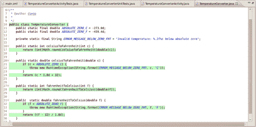
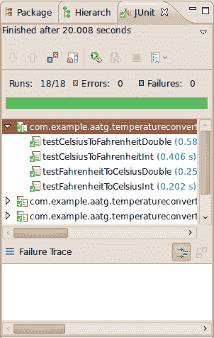
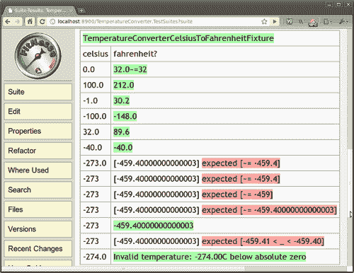

# 第一章 开始测试

本章介绍了不同类型的测试及其在软件开发项目中的适用性，特别是针对**Android**的适用性。

我们将避免介绍 Android 和**开放手机联盟**（[`www.openhandsetalliance.com`](http://www.openhandsetalliance.com)），因为它们已经在许多书中有所介绍，而且我倾向于相信，如果您正在阅读一本涵盖这个更高级主题的书，那么您在开始阅读之前就已经开始了 Android 开发。

然而，我们将回顾测试背后的主要概念和技术、框架和工具，以便在 Android 上部署您的测试策略。

# 简要历史

初始时，当 Android 在 2007 年底推出时，该平台对测试的支持非常有限，对于我们这些习惯于将测试作为与开发过程紧密耦合的组件的人来说，是时候开始开发一些框架和工具来允许这种做法了。

到那时，Android 已经对使用 JUnit（[`www.JUnit.org`](http://www.JUnit.org)）进行单元测试提供了一些基本支持，但它并没有得到完全支持，甚至文档也很少。

在编写自己的库和工具的过程中，我发现 Phil Smith 的**Positron**（最初位于[`code.google.com/p/android-positron`](http://code.google.com/p/android-positron)并现在更名为并迁移到[`code.google.com/p/autoandroid`](http://code.google.com/p/autoandroid)）是一个开源库，非常适合支持 Android 上的测试，因此我决定扩展他的优秀工作，并带来一些新的和缺失的部分。

测试自动化的某些方面没有被包括在内，我开始了一个补充项目来填补这个空白，因此它被命名为**Electron**。尽管正电子是电子的反粒子，并且它们在碰撞时会湮灭，但请相信这并不是初衷，而是更多地考虑到了能量的守恒以及一些可见光和波的产生。

后来，Electron 于 2008 年初参加了第一次**Android 开发挑战赛**（**ADC1**），尽管它在某些类别中获得了相当不错的分数，但在那次比赛中框架并没有得到应有的位置。如果您对 Android 测试的起源感兴趣，请在我的个人博客中查找一些已发布的文章和视频（[`dtmilano.blogspot.com/search/label/electron`](http://dtmilano.blogspot.com/search/label/electron)）。

到那时，单元测试可以在 Eclipse 上运行。然而，测试并不是在真实的目标设备上进行的，而是在本地开发计算机上的 JVM 上进行的。

Google 还通过`Instrumentation`类提供了应用程序的测试代码。当运行一个启用测试的应用程序时，这个类在你任何应用程序代码之前被实例化，让你能够监控系统与应用程序之间的所有交互。一个`Instrumentation`实现通过`AndroidManifest.xml`文件描述给系统。

在 Android 开发演变的早期阶段，我开始在我的博客中撰写一些文章，填补测试的空白。这本书是对那项工作的有序和可理解方式的演变和完成，以悖论的方式让你被 Android 测试的 bug 所咬。

# 软件 bug

无论你多么努力，投入多少时间在设计上，甚至编程时多么小心，错误是不可避免的，bug 总会出现。

Bug 和软件开发密切相关。然而，用来描述缺陷、错误或错误的术语**bug**在计算机发明之前几十年就已经在硬件工程中使用了。尽管有关于哈佛大学 Mark II 操作员创造“bug”一词的故事，托马斯·爱迪生在 1878 年给 Puskás Tivadar 的信中写道，这表明了术语的早期采用：

> “在我的所有发明中，第一步是直觉，然后是一阵爆发，接着困难出现——这个玩意儿开始出问题，然后就是所谓的‘bug’——就像这样的小错误和困难——就会显现出来，在达到商业成功或失败之前，需要数月的紧张观察、研究和劳动。”

## Bug 如何严重影响你的项目

Bug 会影响你的软件开发项目的许多方面，而且很明显，你越早在这个过程中找到并*消除*它们，情况就越好。无论是你开发一个简单的应用发布到 Android 市场，为运营商重新设计 Android 体验，还是为设备制造商创建一个定制的 Android 版本，bug 都会延误你的发货，并让你付出代价。

在所有软件开发方法和技巧中，**测试驱动开发**（Test Driven Development，TDD）作为软件开发过程中的一个敏捷组件，很可能是那个迫使你在开发早期就面对你的 bug 的方法，因此你也很可能会在早期解决更多的问题。

此外，与那些在开发周期结束时才编写测试的最佳情况相比，在项目中使用这种技术可以明显提高生产力。如果你参与过移动行业的软件开发，你会有理由相信，在这个阶段，所有的匆忙都不会发生。这很有趣，因为通常，这种匆忙是为了解决本可以避免的问题。

在美国国家标准与技术研究院（**美国**）于 2002 年进行的一项研究中，报告称软件错误每年给经济造成 595 亿美元。如果进行更好的软件测试，其中超过三分之一的成本可以避免。

但请，不要误解这个信息。软件开发中没有“银弹”，将使您提高项目生产力和可管理性的因素是应用这些方法和技术的纪律，以保持控制。

# 为什么、什么、如何以及何时进行测试

您应该明白，早期发现错误可以节省大量的项目资源并降低软件维护成本。这是为您的开发项目编写软件测试的最佳理由。生产力的提升将很快显现。

此外，编写测试将使您对需求和要解决的问题有更深入的理解。如果您不理解某个软件，将无法为其编写测试。

这也是编写测试以清楚地理解遗留或第三方代码，并能够自信地更改或更新它的原因。

您的测试覆盖的代码越多，您对发现隐藏错误的期望就越高。

如果在这次覆盖率分析中您发现代码的某些区域没有被测试到，应该添加额外的测试来覆盖这些代码。

这种技术需要特殊的仪器 Android 构建来收集探针数据，并且必须禁用于任何发布代码，因为对性能的影响可能会严重影响应用程序的行为。

为了填补这一空白，请访问 EMMA ([`emma.sourceforge.net/`](http://emma.sourceforge.net/))，这是一个开源的工具包，用于测量和报告 Java 代码覆盖率，并且可以离线对类进行覆盖率测试。它支持各种覆盖率类型：

+   类

+   方法

+   行

+   基本块

覆盖率报告也可以以不同的输出格式获得。EMMA 在一定程度上受到 Android 框架的支持，并且可以构建 Android 的 EMMA 仪器版本。

我们将在第十章 “替代测试策略”中分析 EMMA 在 Android 上的使用，以指导我们实现代码的全面测试覆盖。

这张截图显示了 EMMA 代码覆盖率报告在 Eclipse 编辑器中的显示方式，显示了代码已被测试的绿色线条，前提是已安装相应的插件。



不幸的是，该插件目前还不支持 Android 测试，因此现在您只能用它来运行 JUnit 测试。Android 覆盖率分析报告仅通过 HTML 提供。

测试应该自动化，并且每次你对代码进行更改或添加时，都应该运行一些或所有测试，以确保所有先前条件仍然满足，并且新代码仍然满足预期的测试。

这就引出了**持续集成**的介绍，它将在第八章持续集成中详细讨论。这依赖于测试和构建过程的自动化。

如果你没有使用自动化测试，实际上不可能将持续集成作为开发过程的一部分，并且很难确保更改不会破坏现有代码。

## 需要测试的内容

严格来说，你应该测试你代码中的每一个语句，但这也取决于不同的标准，可以简化为测试执行路径或只是某些方法。通常，没有必要测试那些无法破坏的内容，例如，通常没有必要测试获取器和设置器，因为你可能不会在自己的代码上测试 Java 编译器，编译器已经执行了自己的测试。

除了你应该测试的功能区域之外，还有一些特定的 Android 应用程序区域你应该考虑。我们将在以下章节中探讨这些内容。

### 活动生命周期事件

你应该测试你的活动是否正确处理生命周期事件。

如果你的活动应该在 `onPause()` 或 `onDestroy()` 事件期间保存其状态，并在稍后通过 `onCreate(Bundle savedInstanceState)` 恢复它，你应该能够重现和测试这些条件，并验证状态是否已正确保存和恢复。

配置更改事件也应该进行测试，因为这些事件中的一些会导致当前 Activity 重新创建，你应该测试正确处理事件以及新创建的 Activity 是否保留了先前状态。配置更改甚至由旋转事件触发，因此你应该测试你的应用程序处理这些情况的能力。

### 数据库和文件系统操作

应该测试数据库和文件系统操作是否得到正确处理。这些操作应该在较低的系统级别单独测试，在较高级别通过 `ContentProviders` 测试，以及从应用程序本身进行测试。

为了单独测试这些组件，Android 在 `android.test.mock` 包中提供了一些模拟对象。

### 设备的物理特性

在交付你的应用程序之前，你应该确保所有可以运行该应用程序的不同设备都得到支持，或者至少你应该检测这种情况并采取适当的措施。

在设备的其他特性中，你可能还会发现你应该测试：

+   网络能力

+   屏幕密度

+   屏幕分辨率

+   屏幕尺寸

+   传感器的可用性

+   键盘和其他输入设备

+   GPS

+   外部存储

在这方面，Android 虚拟设备扮演着重要的角色，因为实际上不可能访问所有可能的设备及其所有可能的功能组合，但您可以为几乎所有情况配置 AVD。然而，如前所述，请将您的最终测试保留在实际设备上，以便真实用户运行应用程序以了解其行为。

# 测试类型

测试可以在开发过程的任何时间点实现，具体取决于采用的方法。然而，我们将促进在开发努力的早期阶段进行测试，甚至在定义完整的需求和开始编码过程之前。

根据被测试的对象类型，有多种测试类型可供选择。无论其类型如何，测试都应该验证一个条件，并将此评估的结果作为一个单一的布尔值返回，以指示成功或失败。

## 单元测试

单元测试是由程序员为程序员编写的软件测试，它们应该隔离被测试的组件，并且能够以可重复的方式进行测试。这就是为什么单元测试和模拟对象通常放在一起。您使用模拟对象来隔离单元与其依赖项，以监控交互，并且能够重复测试任意次数。例如，如果您的测试从数据库中删除了一些数据，您可能不希望数据实际上被删除，并且在下次运行测试时找不到。

JUnit 是 Android 上单元测试的事实标准。它是一个简单的开源框架，用于自动化单元测试，最初由 Erich Gamma 和 Kent Beck 编写。

Android（直到 Android 2.3 Gingerbread）使用 JUnit 3。这个版本不使用注解，并使用反射来检测测试。

一个典型的 JUnit 测试看起来可能像这样（实际的测试被突出显示）：

```java
/**
* Android Application Testing Guide
*/
package com.example.aatg.test;
import JUnit.framework.TestCase;
/**
* @author diego
*/
public class MyUnitTests extends TestCase {
private int mFixture;
/**
* @param name test name
*/
public MyUnitTests(String name) {
super(name);
}
/* (non-Javadoc)
* @see JUnit.framework.TestCase#setUp()
*/
protected void setUp() throws Exception {
super.setUp();
mFixture = 1234;
}
/* (non-Javadoc)
* @see JUnit.framework.TestCase#tearDown()
*/
protected void tearDown() throws Exception {
super.tearDown();
}
/**
* Preconditions
*/ public void testPreconditions() {
}
/**
* Test method
*/ public void testSomething() {
fail("Not implemented yet");
}
}

```

### 小贴士

**下载示例代码**

您可以从您在[`www.PacktPub.com`](http://www.PacktPub.com)的账户中下载您购买的所有 Packt 书籍的示例代码文件。如果您在其他地方购买了这本书，您可以访问[`www.PacktPub.com/support`](http://www.PacktPub.com/support)并注册，以便将文件直接通过电子邮件发送给您。

以下章节将详细解释构建我们的测试用例的组件。

### 测试用例

测试用例是众所周知的基线状态，用于运行测试，并由所有测试用例共享，因此在测试设计中起着基本的作用。

通常它被实现为一组成员变量，并且遵循 Android 约定，它们的名称将以 `m` 开头，例如 `mActivity`。然而，它也可以包含外部数据，例如数据库中的特定条目或文件系统中的文件。

### setUp() 方法

此方法用于初始化测试用例。

覆盖它，你有机会创建将被测试使用的对象和初始化字段。值得注意的是，这种设置是在每次测试之前发生的。

### `tearDown()` 方法

此方法用于最终确定测试环境。

覆盖它，你可以释放初始化或测试中使用的资源。再次强调，此方法是在每次测试之后调用的。

例如，你可以在这里释放数据库或网络连接。

JUnit 是这样设计的，即整个测试实例树在一次遍历中构建，然后在第二次遍历中执行测试。因此，测试运行器在整个测试执行期间都持有对所有 Test 实例的强引用。这意味着对于非常庞大且非常长的测试运行，其中包含许多 Test 实例，在整个测试运行结束之前，可能没有任何测试被垃圾回收。这在 Android 和在有限设备上进行测试时尤为重要，因为某些测试可能不是由于固有的问题，而是因为运行应用程序及其测试所需的内存超过了设备的限制。

因此，如果你在测试中分配外部或有限的资源，例如 `Services` 或 `ContentProviders`，你负责释放这些资源。例如，在 `tearDown()` 方法中显式地将对象设置为 null，允许它在整个测试运行结束之前被垃圾回收。

### 测试前提条件

通常没有方法可以测试前提条件，因为测试是通过反射发现的，它们的顺序可能会变化。因此，通常的做法是创建一个 `testPreconditions()` 方法来测试前提条件。尽管不能保证这个测试将以任何特定的顺序被调用，但为了组织上的目的，将这个测试和前提条件放在一起是一个好的做法。

### 实际测试

所有以 `test` 开头且名称为 `public void` 的方法都将被视为测试。与 JUnit 4 不同，JUnit 3 不使用注解来发现测试，而是使用反射来查找它们的名称。Android 测试框架上提供了一些注解，如 `@SmallTest, @MediumTest` 和 `@LargeTest`，但它们并不能将简单的方法转换为测试。相反，它们将它们组织成不同的类别。最终，你将能够使用测试运行器运行单个类别的测试。

按照惯例，使用名词和正在测试的条件来描述性地命名测试。

例如：`testValues(), testConversionError(), testConversionToString()` 都是有效的测试名称。

测试异常和错误值，而不仅仅是测试正面案例。

在测试执行过程中，某些条件、副作用或方法返回值应与预期进行比较。为了简化这些操作，JUnit 提供了一套完整的 `assert*` 方法，用于比较测试的预期结果与运行后的实际结果。如果条件不满足，则它们会抛出异常。然后测试运行器处理这些异常并显示结果。

这些方法支持不同的参数，包括：

+   `assertEquals()`

+   `assertFalse()`

+   `assertNotNull()`

+   `assertNotSame()`

+   `assertNull()`

+   `assertSame()`

+   `assertTrue()`

+   `fail()`

除了这些 JUnit 断言方法之外，Android 还通过两个专用类扩展了 Assert，提供了额外的测试：

+   `MoreAsserts`

+   `ViewAsserts`

#### 模拟对象

模拟对象是代替调用真实领域对象使用的模仿对象，以便在隔离状态下测试单元。

通常，这样做是为了确保调用正确的方法，但正如提到的，这也有助于将测试与周围环境隔离开来，并使您能够独立且可重复地运行它们。

Android 测试框架支持几个模拟对象，当您编写测试时，您会发现它们非常有用，但您需要提供一些依赖项才能编译测试。

Android 测试框架在 `android.test.mock` 包中提供了几个类：

+   `MockApplication`

+   `MockContentProvider`

+   `MockContentResolver`

+   `MockContext`

+   `MockCursor`

+   `MockDialogInterface`

+   `MockPackageManager`

+   `MockResources`

几乎可以创建与您的 Activity 交互的任何平台组件，通过实例化这些类之一。

然而，它们并不是真正的实现，而是存根，其中每个方法都会生成一个 `UnsupportedOperationException`，您可以扩展它们来创建真正的模拟对象。

#### UI 测试

最后，如果您的测试涉及 UI 组件，应特别考虑。如您所知，在 Android 中，只有主线程允许更改 UI。因此，使用特殊注解 `@UIThreadTest` 来指示特定测试应在该线程上运行，并且将具有更改 UI 的能力。另一方面，如果您只想在 UI 线程上运行测试的一部分，您可以使用 `Activity.runOnUiThread(Runnable r)` 方法，提供包含测试指令的相应 `Runnable`。

还提供了一个辅助类 `TouchUtils`，以帮助创建 UI 测试，允许生成发送到视图的事件，例如：

+   click

+   drag

+   long click

+   scroll

+   tap

+   touch

通过这些方法，您实际上可以从测试中远程控制您的应用程序。

#### Eclipse 和其他 IDE 支持

JUnit 完全由 Eclipse 支持，Android ADT 插件允许您创建 Android 测试项目。此外，您可以在不离开 IDE 的情况下运行测试并分析结果。

这也提供了一种更微妙的优势；能够从 Eclipse 运行测试允许您调试表现不正确的测试。

在屏幕截图中，我们可以看到 Eclipse 以 20.008 秒的时间运行了 **18 个测试**，其中检测到 **0 个错误** 和 **0 个失败**。每个测试的名称及其持续时间也显示出来。如果有失败，**失败跟踪**将显示相关信息。



其他 IDE，如 ItelliJ 和 Netbeans，在某种程度上集成了 Android 开发，但它们并未官方支持。

即使您不在 IDE 中开发，您也可以找到使用 **ant** 运行测试的支持（如果您不熟悉这个工具，请检查 [`ant.apache.org`](http://ant.apache.org)）。此设置是通过 `android` 命令使用子命令 `create test-project` 完成的，如帮助文本所述：

```java
$ android --help create test-project
Usage:
android [global options] create test-project [action options]
Global options:
-v --verbose Verbose mode: errors, warnings and informational messages are printed.
-h --help Help on a specific command.
-s --silent Silent mode: only errors are printed out.
Action "create test-project":
Creates a new Android project for a test package.
Options:
-p --path The new project's directory [required]
-m --main Path to directory of the app under test, relative to the test project directory [required]
-n --name Project name

```

根据帮助信息，您至少应提供项目路径 (--path) 和主项目或测试项目的路径 (--main)。

## 集成测试

集成测试旨在测试各个组件协同工作的方式。那些已经独立进行单元测试的模块现在被组合在一起以测试集成。

通常，Android 活动（Activities）需要与系统基础设施集成，以便能够运行。它们需要 `ActivityManager` 提供的活动生命周期，以及访问资源、文件系统数据库。

同样的标准适用于需要与其他系统部分交互以实现其功能的其他 Android 组件，如 `Services` 或 `ContentProviders`。

在所有这些情况下，Android 测试框架都提供了专门的测试，以简化这些组件的测试创建。

## 功能或验收测试

在敏捷软件开发中，功能或验收测试通常由业务和质量管理（QA）人员创建，并使用业务领域语言表达。这些是高级测试，用于测试用户需求或功能的完整性和正确性。它们最好通过业务客户、业务分析师、QA、测试人员和开发人员之间的协作来创建。然而，业务客户（产品所有者）是这些测试的主要所有者。

一些框架和工具可以帮助在这个领域，最著名的是 FitNesse ([`www.fitnesse.org`](http://www.fitnesse.org))，它可以很容易地集成到 Android 开发过程中，并允许您创建验收测试并检查其结果。

### 注意

还请检查 Fit，[`fit.c2.com`](http://fit.c2.com) 和 Slim (Simple List Invocation Method)，[`fitnesse.org/FitNesse.UserGuide.SliM`](http://fitnesse.org/FitNesse.UserGuide.SliM)，作为 Fit 的替代方案。



最近，一种名为 **行为驱动开发** 的新趋势已经获得了一些人气，并且可以用非常简短的方式来理解，即测试驱动开发的演变。它的目的是为了在业务和技术人员之间提供一种共同的语言，以便增加相互理解。

行为驱动开发可以表达为一个基于三个原则的活动框架（更多信息可以在[http://behaviour-driven.org]找到）：](http://behaviour-driven.org))

+   业务和技术应该以相同的方式引用相同的系统。

+   任何系统都应该有一个对业务有可识别、可验证的价值。

+   前期的分析、设计和规划都有递减的回报。

为了应用这些原则，业务人员通常参与以高级语言编写测试用例场景，并使用一些工具，例如 **jbehave** ([`jbehave.org`](http://jbehave.org))。在以下示例中，这些场景被转换为代码，以编程语言表达相同的测试场景。

### 测试用例场景

作为这种技术的示例，这里有一个过于简化的例子。

这个场景是：

```java
Given I'm using the Temperature Converter.
When I enter 100 into Celsius field.
Then I obtain 212 in Fahrenheit field.

```

它将被翻译成类似的东西：

```java
@Given("I am using the Temperature Converter")
public void createTemperatureConverter() {
// do nothing
}
@When("I enter $celsius into Celsius field")
public void setCelsius(int celsius) {
mCelsius= celsius;
}
@Then("I obtain $fahrenheit in Fahrenheit field")
public void testCelsiusToFahrenheit(int fahrenheit) {
assertEquals(fahrenheit, TemperatureConverter.celsiusToFahrenheit (mCelsius));
}

```

## 性能测试

性能测试以可重复的方式衡量组件的性能特征。如果应用程序的某个部分需要性能改进，最佳方法是引入更改前后测量性能。

如众所周知，过早的优化弊大于利，因此最好清楚地了解您的更改对整体性能的影响。

在 Android 2.2 中引入的 **Dalvik JIT** 编译器改变了在 Android 开发中广泛使用的某些优化模式。如今，Android 开发者网站上关于性能改进的任何建议都有性能测试的支持。

## 系统测试

系统作为一个整体进行测试，并锻炼组件、软件和硬件之间的交互。通常，系统测试包括额外的测试类别，如：

+   GUI 测试

+   烟雾测试

+   性能测试

+   安装测试

# Android 测试框架

Android 提供了一个非常先进的测试框架，它扩展了行业标准 JUnit，并增加了适合实现我们之前提到的所有测试策略和类型的特定功能。在某些情况下，需要额外的工具，但这些工具的集成在大多数情况下都是简单直接的。

Android 测试环境的关键特性包括：

+   Android 对 JUnit 框架的扩展，提供了访问 Android 系统对象的功能。

+   一个仪器化框架，允许测试控制和检查应用程序。

+   常用 Android 系统对象的模拟版本。

+   运行单个测试或测试套件的工具，带或不带仪器。

+   支持在 Eclipse 的 ADT 插件和命令行中管理测试和测试项目。

## 仪器化

instrumentation 框架是测试框架的基础。Instrumentation 控制被测试的应用程序，并允许注入应用程序运行所需的模拟组件。例如，你可以在应用程序启动之前创建模拟的 Context，并让应用程序使用它们。

使用这种方法，可以控制应用程序与周围环境的所有交互。你还可以在受限环境中隔离你的应用程序，以便能够预测结果，强制某些方法返回的值，或者对 `ContentProvider`、数据库或甚至文件系统内容进行模拟。

一个标准的 Android 项目，其测试在一个相关项目中，通常具有相同的项目名称，但以 **Test** 结尾。在这个 Test 项目内部，`AndroidManifest.xml` 声明了 Instrumentation。

作为一个示例，假设你的项目有一个如下所示的清单：

```java
<?xml version="1.0" encoding="utf-8"?>
<manifest 
package="com.example.aatg.sample"
android:versionCode="1"
android:versionName="1.0">
<application android:icon="@drawable/icon"
android:label="@string/app_name">
<activity android:name=".SampleActivity"
android:label="@string/app_name">
<intent-filter>
<action android:name="android.intent.action.MAIN" />
<category android:name= "android.intent.category.LAUNCHER" />
</intent-filter>
</activity>
</application>
<uses-sdk android:minSdkVersion="7" />
</manifest>

```

在这种情况下，相关 Test 项目将具有以下 `AndroidManifest.xml`：

```java
<?xml version="1.0" encoding="utf-8"?>
<manifest 
package="com.example.aatg.sample.test"
android:versionCode="1" android:versionName="1.0">
<application android:icon="@drawable/icon"
android:label="@string/app_name"> <uses-library android:name="android.test.runner" />
</application>
<uses-sdk android:minSdkVersion="7" /> <instrumentation
android:targetPackage="com.example.aatg.sample"
android:name="android.test.InstrumentationTestRunner"
android:label="Sample Tests" />
<uses-permission android:name=" android.permission.INJECT_EVENTS" />
</manifest>

```

在这里，Instrumentation 包与主应用程序相同，只是添加了 `.test` 后缀。

然后，声明 Instrumentation，指定目标包和测试运行器，在这种情况下是默认的自定义运行器 `android.test.InstrumentationTestRunner`。

注意，被测试的应用程序和测试都是 Android 应用程序，它们安装了相应的 APK。内部，它们将共享同一个进程，因此可以访问相同的功能集。

当你运行测试应用程序时，**活动管理器** ([`developer.android.com/intl/de/reference/android/app/ActivityManager.html`](http://developer.android.com/intl/de/reference/android/app/ActivityManager.html)) 使用 instrumentation 框架来启动和控制测试运行器，该运行器反过来使用 instrumentation 来关闭主应用程序的任何运行实例，然后启动测试应用程序，并在同一个进程中启动主应用程序。这允许测试应用程序的各个方面直接与主应用程序协同工作。

## 测试目标

在你的开发项目演变过程中，你的测试会针对不同的设备。从在模拟器上测试的简单性、灵活性和速度，到不可避免地在特定设备上进行的最终测试，你应该能够在所有这些设备上运行。

也有一些中间情况，比如在开发计算机上的本地 **JVM** 虚拟机上运行测试，或者在 **Dalvik** 虚拟机或 `Activity` 上，具体取决于情况。

每种情况都有其优缺点，但好消息是，你可以使用所有这些替代方案来运行你的测试。

模拟器可能是最强大的目标，因为你可以从其配置中修改几乎每一个参数来模拟不同的测试条件。最终，你的应用程序应该能够处理所有这些情况，因此提前发现问题比应用程序交付后发现问题要好得多。

真实设备对于性能测试是必需的，因为从模拟设备中推断性能测量值有些困难。你只有在使用真实设备时才能发现真实用户体验。在交付应用程序之前，应该测试渲染、滚动、抛掷和其他情况。

# 摘要

我们回顾了测试的一般概念，特别是 Android 的测试。掌握这些知识将使我们开始我们的旅程，并开始在我们软件开发项目中利用测试的好处。

到目前为止，我们已经访问了以下主题：

+   我们回顾了 Android 测试的早期阶段，并提到了一些创建了当前替代方案的框架。

+   我们简要分析了测试背后的原因以及为什么、是什么、如何和何时进行测试。此外，从现在开始，我们将专注于探索如何进行测试，因为我们假设你已经被提出的论点所说服。

+   我们列举了你在项目中可能需要的不同和最常见的测试类型，描述了一些我们可以依赖的测试工具，并提供了一个 JUnit 单元测试的入门示例，以便更好地理解我们在讨论的内容。

我们还从 Android 的角度分析了这些技术，并提到了使用 Instrumentation 来运行我们的 Android 测试。

现在，我们将开始详细分析所提到的技术、框架和工具，以及它们的使用示例。
