# 第四章：测试驱动开发

本章介绍了测试驱动开发的学科。我们将从一般复习开始，然后转向与 Android 平台密切相关概念和技术。

这是一个代码密集的章节，所以当你阅读时请准备好输入，这将是最有效地掌握所提供示例的方法。

在本章中，我们将：

+   介绍并解释测试驱动开发（Test Driven Development）

+   分析其优势

+   介绍一个潜在的真实生活例子

+   通过编写测试来理解需求

+   通过应用 TDD（测试驱动开发）来逐步完善项目

+   获取完全符合要求的程序

# 开始使用 TDD（测试驱动开发）

简而言之，测试驱动开发是在开发过程中编写测试的策略。这些测试用例是在满足它们的代码之前编写的。

添加一个单独的测试，然后编写满足这个测试编译所需的代码，最后运行完整的测试用例集以验证其结果。

这与其他开发过程的方法形成对比，在这些方法中，测试是在所有编码完成后编写的。

在编写满足它们的代码之前编写测试有几个优点。首先，测试无论如何都会被编写，而如果测试留到最后，它们很可能永远不会被编写。其次，开发者对他们的工作质量承担更多的责任。

设计决策是分步骤进行的，最后通过重构来改进满足测试的代码。

这个 UML 活动图描绘了测试驱动开发，以帮助我们理解这个过程：

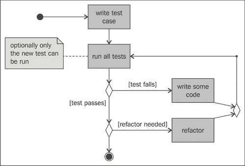

以下部分解释了活动图中描述的各个活动。

## 编写测试用例

我们的开发过程从编写一个测试用例开始。这个看似简单的过程将在我们的大脑中启动一些机制。毕竟，如果我们没有对问题域及其细节有清晰的理解，就不可能编写一些代码，无论是否进行测试。通常，这一步会让你直面你不理解的问题方面，如果你想要建模和编写代码，你需要掌握这些。

## 运行所有测试

一旦编写了测试，接下来的明显步骤就是运行它，连同我们迄今为止编写的其他测试。在这里，具有内置测试环境支持的 IDE 的重要性可能比其他情况下更为明显，这可能会大大减少开发时间。预期的是，首先，我们的测试会失败，因为我们还没有编写任何代码！

为了能够完成我们的测试，我们通常需要编写额外的代码并做出设计决策。所编写的额外代码是最小的，以便让我们的测试能够编译。请考虑这里，如果不能编译就是失败。

当我们编译并运行测试时，如果测试失败，我们就尝试编写最少的代码来使测试通过。这一点在此处可能听起来有些奇怪，但本章中的以下代码示例将帮助您理解这个过程。

可选地，您不必再次运行所有测试，只需先运行新添加的测试以节省时间，因为有时在模拟器上运行测试可能会相当慢。然后运行整个测试套件以验证一切是否仍然正常工作。我们不希望通过破坏现有功能来添加新功能。

## 重构代码

当测试成功时，我们重构添加的代码以保持其整洁、干净和最小化。

我们再次运行所有测试，以验证我们的重构没有破坏任何东西，如果测试再次满足，并且不再需要重构，我们就完成我们的任务。

在重构后运行测试是这种方法中设置的一个令人难以置信的安全网。如果我们重构算法时犯了错误，提取变量、引入参数、更改签名或无论您的重构由什么组成，这个测试基础设施都会检测到问题。此外，如果某些重构或优化不能适用于所有可能的情况，我们可以验证它适用于应用程序使用的每个案例，并作为测试用例表达。

## 优势是什么？

个人来说，我迄今为止看到的主要优势是您可以快速集中精力，并且很难在软件中实现那些永远不会使用的实现选项。这种不必要的功能的实现是对您宝贵的发展时间和精力的浪费。而且正如您可能已经知道的，明智地管理这些资源可能是成功完成项目或失败的区别。可能，测试驱动开发不能无差别地应用于任何项目。我认为，就像任何其他技术一样，您应该使用您的判断力和专业知识来识别它可以在哪里应用，在哪里不能。但请记住：**没有银弹**。

另一个优势是您始终有一个安全网来保护您的更改。每次您更改一段代码时，您都可以绝对确信，只要存在测试来验证条件没有改变，系统的其他部分就不会受到影响。

## 理解需求

要能够编写关于任何主题的测试，我们首先应该理解要测试的主题。

我们还提到，优势之一是您可以快速集中精力，而不是围绕需求旋转。

将需求转换为测试并交叉引用可能是理解需求、确保所有需求都有实现和验证的最好方法。此外，当需求发生变化（在软件开发项目中这是非常常见的情况）时，我们可以更改验证这些需求的测试，然后更改实现以确保所有内容都被正确理解并映射到代码中。

# 创建一个示例项目——温度转换器

我们的示例将围绕一个极其简单的 Android 示例项目。它并不试图展示所有花哨的 Android 功能，而是专注于测试，并从测试开始逐步构建应用程序，应用之前学到的概念。

让我们假设我们收到了一个开发 Android 温度转换器应用程序的需求列表。虽然这个例子过于简化，但我们将遵循您通常开发此类应用程序的步骤。然而，在这种情况下，我们将在这个过程中引入测试驱动开发技术。

## 需求列表

通常情况下，需求列表非常模糊，有很多细节没有完全涵盖。

例如，让我们假设我们收到了项目所有者提供的这个列表：

+   该应用程序将温度从摄氏度转换为华氏度，反之亦然

+   用户界面提供了两个输入温度的字段，一个用于摄氏度，另一个用于华氏度

+   当在一个字段中输入一个温度时，另一个字段会自动更新为转换值

+   如果有错误，应向用户显示，可能使用相同的字段

+   用户界面中应预留一些空间以容纳屏幕键盘，以便在输入多个转换时简化应用程序操作

+   输入字段应保持为空

+   输入的值是两位小数的十进制值

+   数字应右对齐

+   即使应用程序暂停后，也应保留最后输入的值

## 用户界面概念设计

假设我们收到了用户界面设计团队提供的这个概念用户界面设计：

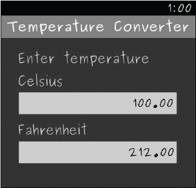

### 创建项目

我们的第一步是创建项目。正如我们之前提到的，我们正在创建一个主项目和测试项目。以下屏幕截图显示了`TemperatureConverter`项目的创建（所有值都是典型的 Android 项目值）：

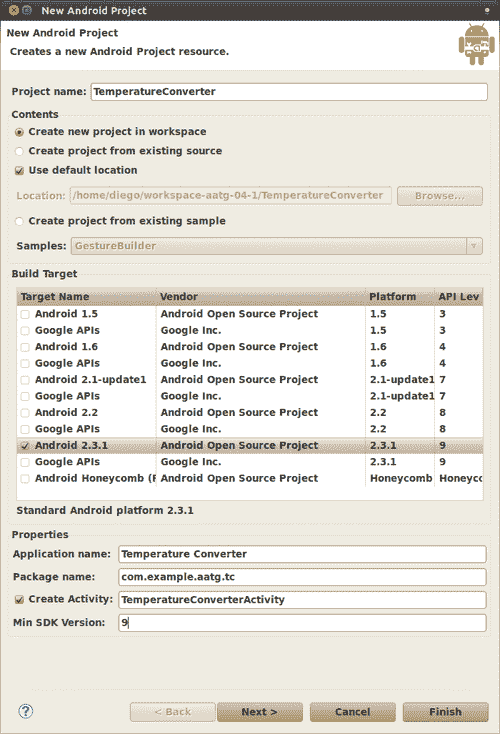

当您准备好继续时，应按下**下一步 >**按钮以创建相关的测试项目。

测试项目的创建显示在这个屏幕截图中。所有值都将根据您的先前输入为您选择：

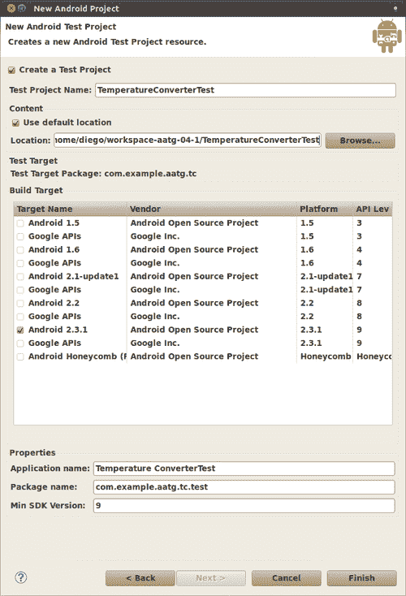

# 创建 TemperatureConverterActivityTests 项目

在我们的**主项目**中，只有一些由 Android ADT 插件创建的模板，例如：

+   `TemperatureConverterActivity`

+   `main.xml` 布局

+   `strings.xml` 资源

+   其他资源，如图标

此外，我们在我们的**测试项目**中创建了一些模板。为了将我们的测试与主包分开，相应的测试包是：

+   `main.xml` 布局

+   `strings.xml` 资源

+   其他资源，如图标

### 注意

请务必谨慎，不要让模板文件迷惑你。在测试项目中这些资源几乎或完全没有用途，为了避免混淆，你应该删除它们。如果你后来发现某些测试需要特定的资源，你只能添加所需的资源。

在 Eclipse 的**包资源管理器**中，通过选择主测试包名**com.example.aatg.tc.test**并右键单击它来创建第一个测试。选择**新建 | JUnit 测试用例**。

你应该有一个这样的对话框：

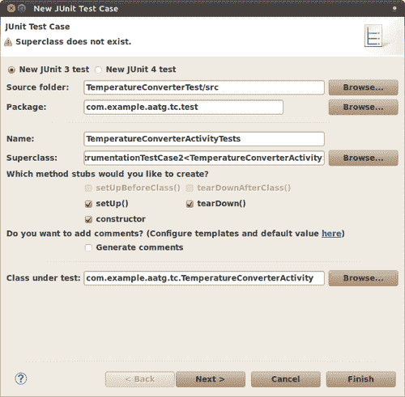

这里，你需要输入以下内容：

| 字段 | 描述 |
| --- | --- |
| **新的 JUnit 3 测试** | JUnit 3 是 Android 支持的版本。始终使用此选项。 |
| **源文件夹:** | 测试的默认源文件夹。默认值应该足够。 |
| **包:** | 测试的默认包。这通常是你的主项目的默认包名，后面跟着子包 test。 |
| **名称:** | 此测试类的名称。这里的最佳实践是使用与被测试类相同的类名，后面跟着单词 Tests，因为很可能会在其中托管多个测试。 |
| **超类:** | 我们应该根据我们将要测试的内容和方式来选择我们的超类。在第三章中，*Android SDK 的构建块*，我们回顾了可用的替代方案。当你尝试决定使用哪个超类时，请将其作为参考。在这种情况下，因为我们正在测试单个`Activity`并使用系统基础设施，所以我们使用`ActivityInstrumentationTestCase2`。请注意，由于`ActivityInstrumentationTestCase2`是一个通用类，我们还需要模板参数。这是我们正在测试的`Activity`，在我们的例子中是`TemperatureConverterActivity`。现在我们可以忽略指示超类不存在的警告；我们很快就会修复导入。 |
| **方法存根:** | 选择你想要创建的方法存根。如果你现在还不确定你需要什么，那么选择所有，因为默认存根将调用它们的超类对应方法。 |

| **你想添加注释吗？** | 为存根测试方法生成 Javadoc 注释。通常，除非你已更改代码模板中的默认模板，否则生成的注释将是：

```java
/**
* Test method for {@link method()}.
*/

```

|

| **测试中的类** | 这是我们要测试的类 - 在这种情况下是`TemperatureConverterActivity`。在其他情况下，当测试中的类已经实现并且我们可以选择我们想要测试的方法列表时，这最有用。记住，在我们的情况下，我们还没有实现这个类，所以我们将只看到 Android ADT 插件模板中唯一的方法，即`onCreate`。 |
| --- | --- |

这种情况，即测试中的类尚未实现，只有 Android ADT 创建的方法可用，通过按下**下一步 >**可以更好地理解。在这里，展示了可用于测试的方法列表，在我们的例子中，除了`onCreate`和从 Activity 继承的方法外，我们还没有实现任何其他方法。

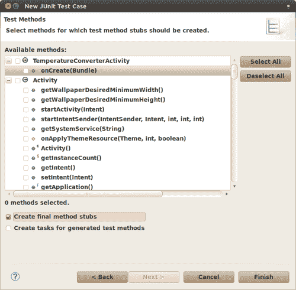

这个对话框有以下组件：

| 字段 | 描述 |
| --- | --- |
| **可用方法** | 这是所有我们可能想要测试的方法的列表。当方法重载时，测试名称会相应生成以应对这种情况，参数名称会被混淆到测试名称中。 |
| **创建最终方法存根** | 便利设置以将最终修饰符添加到存根方法。最终修饰符防止子类覆盖这些方法。 |
| **为生成的测试方法创建任务** | 在测试用例中创建一个 TODO 注释。 |

无论哪种方式，我们都可以选择`onCreate(Bundle)`来为我们生成`testOnCreateBundle`方法，但现在我们留空选择列表以避免增加这个简单演示应用程序的额外复杂性。

我们现在注意到，我们自动生成的类有一些错误需要我们在运行之前修复。否则，这些错误将阻止测试运行。

+   首先，我们应该添加缺少的导入，使用快捷键*Shift+Ctrl+O*。

+   其次，我们需要解决的问题在第三章中已经描述过，在*The no-argument constructor*部分下的*Building Blocks on the Android SDK*。根据这个模式，我们需要实现它：

    ```java
    public TemperatureConverterActivityTests() {
    this("TemperatureConverterActivityTests");
    }
    public TemperatureConverterActivityTests(String name) {
    super(TemperatureConverterActivity.class);
    setName(name);
    }

    ```

+   我们添加了无参数构造函数`TemperatureConverterActivityTests()`。从这个构造函数中，我们调用带参数名称的构造函数。

+   最后，在这个给定的无参数构造函数中，我们调用带参数的构造函数并设置名称。

为了验证一切设置到位，您可以通过使用**运行方式 | Android JUnit 测试**来运行测试。目前还没有测试可以运行，但至少我们可以验证支持我们的测试的基础设施已经就绪。

## 创建固定装置

我们可以通过在`setUp`方法中填充我们测试所需的元素来开始创建我们的测试固定装置。在这种情况下，不可避免地要使用测试中的`Activity`，所以让我们为这种情况做好准备，并将其添加到固定装置中：

```java
protected void setUp() throws Exception {
super.setUp();
mActivity = getActivity();
}

```

让我们同时创建`mActivity`字段以及 Eclipse 提出的字段。

`ActivityInstrumentationTestCase2.getActivity()`方法有一个副作用。如果被测试的`Activity`没有运行，它将被启动。如果我们多次在测试中使用`getActivity()`作为简单的访问器，并且由于某种原因`Activity`在测试完成前结束或崩溃，这可能会改变测试的意图。我们将无意中重新启动`Activity`，这就是为什么在我们的测试中我们不建议使用`getActivity()`，而是将其包含在测试用例中。

## 测试前置条件

我们之前提到过，这可以被视为另一种模式。测试所有前置条件并确保我们的测试用例已正确创建是非常有用的。

```java
public final void testPreconditions() {
assertNotNull(mActivity);
}

```

也就是说，让我们检查我们的测试用例是否由“非空”值组成。

我们可以运行测试以验证一切是否正确且绿色，如图中所示：

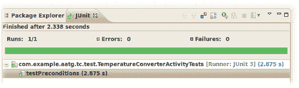

## 创建用户界面

回到我们的测试驱动开发轨道，我们需要从我们简洁的需求列表中知道，分别有两个条目用于摄氏度和华氏温度。所以让我们将它们添加到我们的测试用例中。

它们目前还不存在，我们甚至还没有开始设计用户界面布局，但我们确信应该有两个这样的条目。

这是您应该添加到`setUp()`方法中的代码：

```java
mCelsius = (EditText)
mActivity.findViewById(com.example.aatg.tc.R.id.celsius);
mFahrenheit = (EditText) mActivity.findViewById(com.example.aatg.tc.R.id.fahrenheit);

```

有一些重要的事情需要注意：

+   我们使用`EditText`定义我们的测试用例字段，这是我们应该导入的

+   我们使用之前创建的`mActivity`通过 ID 查找`Views`

+   我们使用主项目的 R 类，而不是测试项目的 R 类

## 测试用户界面组件的存在

如前一小节所示，一旦我们将它们添加到`setUp()`方法中，我们就可以在特定的测试中检查它们的存在：

```java
public final void testHasInputFields() {
assertNotNull(mCelsius);
assertNotNull(mFahrenheit);
}

```

我们目前还不能运行测试，因为我们必须首先修复一些编译问题。我们应该修复 R 类中缺失的 ID。

在创建了引用用户界面中尚未存在的元素和 ID 的测试用例后，测试驱动开发范式要求我们添加必要的代码以满足我们的测试。我们首先应该做的是至少让它编译通过，所以如果我们有一些测试正在测试未实现的功能，它们将会失败。

## 定义 ID

我们的第一步应该是让用户界面元素的 ID 在`R`类中定义，这样引用未定义常量`com.example.aatg.tc.R.id.celsius`和`com.example.aatg.tc.R.id.fahrenheit`产生的错误就会消失。

您作为一位经验丰富的 Android 开发者，知道如何做。无论如何，我会给您一个复习。在布局编辑器中打开`main.xml`布局，并添加所需用户界面组件以获得类似于在*用户界面概念设计*部分中先前引入的设计。

```java
<?xml version="1.0" encoding="utf-8"?>
<LinearLayout

android:orientation="vertical"
android:layout_width="fill_parent"
android:layout_height="fill_parent"> <TextView
android:layout_width="fill_parent"
android:layout_height="wrap_content"
android:text="@string/message" />
<TextView
android:id="@+id/celsius_label"
android:layout_width="wrap_content"
android:layout_height="wrap_content"
android:text="@string/celsius" />
<EditText
android:id="@+id/celsius"
android:layout_height="wrap_content"
android:layout_width="wrap_content"
android:text="EditText" />
<TextView
android:id="@+id/fahrenheit_label"
android:layout_width="wrap_content"
android:layout_height="wrap_content"
android:text="@string/fahrenheit" />
<EditText
android:id="@+id/fahrenheit"
android:layout_height="wrap_content"
android:layout_width="wrap_content"
android:text="EditText" />
</LinearLayout>

```

这样做可以使我们的测试编译通过。运行它们，我们得到以下结果：

+   `testPreconditions` 测试成功

+   `testHasInputFields` 测试成功

+   现在一切正常

这清楚地表明我们在应用 TDD 方面进展顺利。

您可能也注意到了，我们在用户界面中添加了一些装饰性和非功能性项目，这些项目我们并未进行测试，主要是为了使我们的示例尽可能简单。在实际场景中，您可能也想对这些元素进行测试。

## 将需求转换为测试

测试有两个特性。它们验证我们代码的正确性，但有时，尤其是在 TDD 中，它们帮助我们理解设计和消化我们正在实现的内容。为了能够创建测试，我们需要理解我们正在处理的问题，如果我们不了解，我们至少应该有一个对该问题的粗略理解，以便我们能够处理它。

许多时候，用户界面的背后需求并没有明确表达，您应该能够从 UI 设计图解中理解它们。如果我们假设这是情况，那么我们可以通过先编写测试来掌握它。

### 空字段

从我们的一个需求中，我们得到：输入字段应从空开始。

为了在测试中表达这一点，我们可以编写：

```java
public final void testFieldsShouldStartEmpty() {
assertEquals("", mCelsius.getText().toString());
assertEquals("", mFahrenheit.getText().toString());
}

```

这里，我们只是将字段的初始内容与空字符串进行比较。

并不出奇，我们发现测试在执行时失败了。我们忘记清除字段的初始内容，它们并不是空的。即使我们没有向这些字段的 `android:text` 属性添加任何值，ADT 插件布局编辑器也会添加一些默认值。因此，从 `android:text="@~+id/EditText01"` 和 `android:text="@+id/EditText02"` 中移除默认值将强制从空温度字段开始。这些值可能是 ADT 插件本身添加的，或者可能是您在输入属性时添加的。

再次运行测试后，我们发现它通过了。我们成功地将一个需求转换为测试，并通过获取测试结果来验证它。

### 视图属性

同样，我们可以验证组成我们布局的 `Views` 的其他属性。例如，我们可以验证：

+   字段如预期出现在屏幕上

+   字体大小

+   边距

+   屏幕对齐

让我们开始验证字段是否显示在屏幕上：

```java
public final void testFieldsOnScreen() {
final Window window = mActivity.getWindow();
final View origin = window.getDecorView();
assertOnScreen(origin, mCelsius);
assertOnScreen(origin, mFahrenheit);
}

```

如前所述，我们在这里使用断言形式：`ViewAsserts: assertOnScreen`。

### 备注

静态导入和如何在 Eclipse 的内容辅助中添加它们在第三章中已解释，*Android SDK 的构建块*。如果您之前没有这样做，现在是时候了。

`assertOnScreen` 方法需要一个起点来开始寻找其他 `Views`。在这种情况下，因为我们想从最高级别开始，所以我们使用 `getDecorView()`，它检索包含标准窗口框架和装饰以及客户端内容的顶级窗口装饰视图。

通过运行这个测试，我们可以确保输入字段按照 UI 设计显示在屏幕上。在某种程度上，我们已知具有这些特定 ID 的一些`Views`存在。也就是说，我们通过将`Views`添加到主布局中来使测试用例编译，但我们不确定它们是否真的出现在屏幕上。所以，除了这个测试的唯一存在外，不需要其他任何东西来确保将来条件不会改变。如果我们出于某种原因删除了一个字段，这个测试将告诉我们它缺失并且不符合 UI 设计。

按照我们的需求列表，我们应该测试`Views`在布局中对齐的方式是否符合我们的预期：

```java
public final void testAlignment() {
assertLeftAligned(mCelsiusLabel, mCelsius);
assertLeftAligned(mFahrenheitLabel, mFahrenheit);
assertLeftAligned(mCelsius, mFahrenheit);
assertRightAligned(mCelsius, mFahrenheit);
}

```

我们继续使用来自`ViewAssert`的断言——在这个例子中，`assertLeftAligned`和`assertRightAligned`。这些方法验证指定`Views`的对齐方式。

我们默认使用的`LinearLayout`以我们期望的方式排列字段。同样，虽然我们不需要向布局中添加任何东西，为了满足测试，这将作为一个保护条件。

一旦我们验证它们已经正确对齐，我们就应该验证它们是否覆盖了由原理图指定的整个屏幕宽度。在这个例子中，验证`LayoutParams`具有正确的值就足够了：

```java
public final void testCelsiusInputFieldCoverEntireScreen() {
final int expected = LayoutParams.MATCH_PARENT;
final LayoutParams lp = mCelsius.getLayoutParams();
assertEquals("mCelsius layout width is not MATCH_PARENT", expected, lp.width);
}
public final void testFahrenheitInputFieldCoverEntireScreen() {
final int expected = LayoutParams.MATCH_PARENT;
final LayoutParams lp = mFahrenheit.getLayoutParams();
assertEquals("mFahrenheit layout width is not MATCH_PARENT", expected, lp.width);
}

```

我们使用自定义消息来在测试失败时轻松识别问题。

通过运行这个测试，我们得到以下消息，表明测试失败：

**junit.framework.AssertionFailedError: mCelsius 布局宽度不是 MATCH_PARENT，期望<-1>但实际是<-2>**

这引导我们到布局定义。我们必须将摄氏度和华氏度字段的`layout_width`更改为`match_parent`。

```java
<EditText android:layout_height="wrap_content"
android:id="@+id/celsius" android:layout_width="match_parent"
/>

```

对于华氏度也是如此——更改完成后，我们重复循环，再次运行测试，可以验证它现在成功了。

我们的方法开始显现。我们创建测试来验证需求中描述的条件。如果没有满足，我们改变问题的原因并再次运行测试，以验证最新的更改解决了问题，也许更重要的是，这个更改并没有破坏现有的代码。

接下来，让我们验证字体大小是否符合我们的要求：

```java
public final void testFontSizes() {
final float expected = 24.0f;
assertEquals(expected, mCelsiusLabel.getTextSize());
assertEquals(expected, mFahrenheitLabel.getTextSize());
}

```

在这个情况下，获取字段使用的字体大小就足够了。

默认字体大小不是`24px`，因此我们需要将其添加到我们的布局中。将相应的尺寸添加到资源文件中，然后在布局中需要的地方使用它是一个好习惯。所以，让我们将`label_text_size`添加到`res/values/dimens.xml`中，其值为`24px`。然后在其`Text size`属性中引用它，对于两个标签`celsius_label`和`fahrenheit_label`。

现在测试通过了。

最后，让我们验证边距是否被解释为用户界面设计中所描述的那样：

```java
public final void testMargins() {
LinearLayout.LayoutParams lp;
final int expected = 6;
lp = (LinearLayout.LayoutParams) mCelsius.getLayoutParams();
assertEquals(expected, lp.leftMargin);
assertEquals(expected, lp.rightMargin);
lp = (LinearLayout.LayoutParams) mFahrenheit.getLayoutParams();
assertEquals(expected, lp.leftMargin);
assertEquals(expected, lp.rightMargin);
}

```

这与之前的情况类似。我们需要将这个添加到我们的布局中。让我们将边距维度添加到资源文件中，然后在布局中需要的地方使用它。将`margin`维度在`res/values/dimens.xml`中设置为`6px`的值。然后在其`Margin`属性中引用两个字段，即`celsius`和`fahrenheit`，以及标签的`Left margin`。

剩下的一个问题是验证输入值的合理性。我们将很快验证输入，只允许允许的值，但现在让我们只关注合理性。目的是使小于整个字段值的值右对齐并垂直居中：

```java
public final void testJustification() {
final int expected = Gravity.RIGHT|Gravity.CENTER_VERTICAL;
int actual = mCelsius.getGravity();
assertEquals(String.format("Expected 0x%02x but was 0x%02x", expected, actual), expected, actual);
actual = mFahrenheit.getGravity();
assertEquals(String.format("Expected 0x%02x but was 0x%02x", expected, actual), expected, actual);
}

```

这里我们像往常一样验证重力值。然而，我们使用一个自定义消息来帮助我们识别可能错误的值。由于`Gravity`类定义了几个常量，其值如果以十六进制表示则更容易识别，因此我们在消息中将值转换为这个基数。

如果这个测试因为字段使用的默认重力而失败，那么唯一剩下的事情就是改变它。转到布局定义并更改这些重力值，以便测试成功。

这正是我们需要添加的：

```java
android:gravity="right|center_vertical"

```

## 屏幕布局

我们现在想验证指定为保留足够屏幕空间以显示键盘的要求是否实际上得到了满足。

我们可以编写一个像这样的测试：

```java
public final void testVirtualKeyboardSpaceReserved() {
final int expected = 280;
final int actual = mFahrenheit.getBottom();
assertTrue(actual <= expected);
}

```

这验证了屏幕上最后一个字段的实际位置，即`mFahrenheit`，不低于一个建议的值。

我们可以再次运行测试，验证一切是否再次变为绿色。

# 添加功能

用户界面已经就绪。现在我们开始添加一些基本功能。

这个功能将包括处理实际温度转换的代码。

## 温度转换

从需求列表中，我们可以获得这个陈述：当在一个字段中输入一个温度时，另一个字段会自动更新为转换值。

按照我们的计划，我们必须将其实现为一个测试来验证正确的功能是否存在。我们的测试看起来可能像这样：

```java
@UiThreadTest
public final void testFahrenheitToCelsiusConversion() { mCelsius.clear();
mFahrenheit.clear();
final double f = 32.5;
mFahrenheit.requestFocus(); mFahrenheit.setNumber(f);
mCelsius.requestFocus(); final double expectedC =
TemperatureConverter.fahrenheitToCelsius(f);
final double actualC = mCelsius.getNumber();
final double delta = Math.abs(expectedC - actualC);
final String msg = "" + f + "F -> " + expectedC + "C but was " + actualC + "C (delta " + delta + ")";
final String msg = "" + f + "F -> " + expectedC + "C but was " + actualC + "C (delta " + delta + ")";
assertTrue(msg, delta < 0.005);
}

```

首先，正如我们已经知道的，为了与 UI 交互并更改其值，我们应该在 UI 线程上运行测试，因此它被注解为`@UiThreadTest`。

其次，我们正在使用一个专门的类来替换`EditText`，提供一些便利方法，如`clear()`或`setNumber()`。这将改善我们的应用程序设计。

接下来，我们调用一个名为`TemperatureConverter`的转换器，这是一个提供在不同温度单位之间转换的不同方法的实用类，并使用不同的类型表示温度值。

最后，由于我们将截断结果以在用户界面中以合适的格式呈现，我们应该比较一个 delta 来断言转换的值。

按照这种方式创建测试将迫使我们遵循计划路径。我们的第一个目标是添加必要的代码以使测试可编译，然后满足测试的需求。

## EditNumber 类

在我们的主项目中，而不是在测试项目中，我们应该创建扩展 `EditText` 的 `EditNumber` 类，因为我们需要扩展其功能。

我们使用 Eclipse 的帮助使用 **文件 | 新建 | 类** 或工具栏中的快捷键来创建此类。

此截图显示了使用此快捷键后出现的窗口：

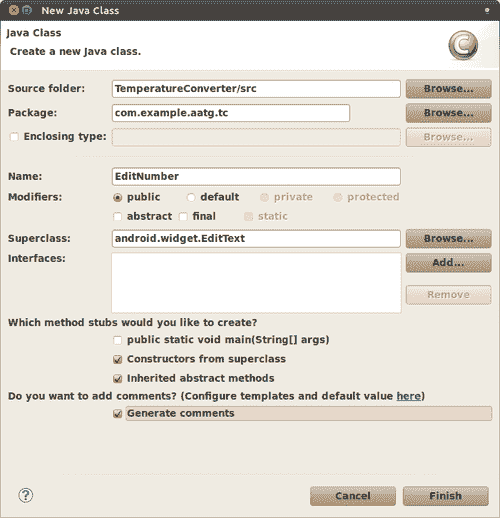

下表描述了上一屏幕中最重要的字段及其含义：

| 字段 | 描述 |
| --- | --- |
| **源文件夹:** | 新创建类的源文件夹。在这种情况下，默认位置是合适的。 |
| **包:** | 新类创建的包。在这种情况下，默认包 `com.example.aatg.tc` 也是合适的。 |
| **名称:** | 类的名称。在这种情况下，我们使用 `EditNumber`。 |
| **修饰符:** | 类的修饰符。在这种情况下，我们正在创建一个公共类。 |
| **超类:** | 新创建类型的超类。我们正在创建一个自定义的 `View` 并扩展 `EditText` 的行为，因此这正是我们选择的超类。记住使用 **浏览..**. 来找到正确的包。 |
| **您想创建哪些方法占位符？** | 这些是我们希望 Eclipse 为我们创建的方法占位符。选择 **从超类创建构造函数** 和 **继承的抽象方法** 将非常有帮助。由于我们正在创建一个自定义视图，我们应该提供在不同情况下使用的构造函数，例如当自定义视图在 XML 布局中使用时。 |
| **您想添加注释吗？** | 当选择此选项时，会自动添加一些注释。您可以配置 Eclipse 以个性化这些注释。 |

一旦创建了类，我们首先需要在测试中更改字段的类型：

```java
public class TemperatureConverterActivityTests extends
ActivityInstrumentationTestCase2<TemperatureConverterActivity> {
private TemperatureConverterActivity mActivity; private EditNumber mCelsius;
private EditNumber mFahrenheit;
private TextView mCelsiusLabel;
private TextView mFahrenheitLabel;
…

```

然后更改测试中存在的任何类型转换。Eclipse 将帮助您完成此操作。

如果一切顺利，在能够编译测试之前，我们还需要解决两个问题：

+   我们仍然没有在 `EditNumber` 中 `clear()` 和 `setNumber()` 方法

+   我们没有 `TemperatureConverter` 工具类

要创建我们正在使用的方法，我们使用 Eclipse 的有用操作。让我们选择 **在类型 EditNumber 中创建方法 clear()**。

对于 `setNumber()` 和 `getNumber()` 也是如此。

最后，我们必须创建 `TemperatureConverter` 类。

### 小贴士

确保在主项目中创建它，而不是在测试项目中。

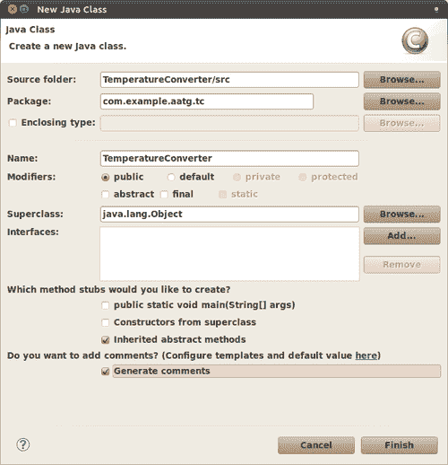

完成这些后，在我们的测试中选择 **在类型 TemperatureConverter 中创建方法 fahrenheitToCelsius**。

这解决了我们最后一个问题，并使我们能够编译和运行测试。

惊讶的是，或者不是，当我们运行测试时，它们将因异常而失败：

**09-06 13:22:36.927: INFO/TestRunner(348): java.lang.ClassCastException: android.widget.EditText**

**09-06 13:22:36.927: INFO/TestRunner(348): at com.example.aatg.tc.test.TemperatureConverterActivityTests.setUp(TemperatureConverterActivityTests.java:41)**

**09-06 13:22:36.927: INFO/TestRunner(348): at junit.framework.TestCase.runBare(TestCase.java:125)**

这是因为我们更新了所有的 Java 文件以包含我们新创建的`EditNumber`类，但忘记了更改 XML，这只能在运行时检测到。

让我们继续更新我们的 UI 定义：

```java
<com.example.aatg.tc.EditNumber
android:layout_height="wrap_content"
android:id="@+id/celsius"
android:layout_width="match_parent"
android:layout_margin="@dimen/margin"
android:gravity="right|center_vertical"
android:saveEnabled="true" />

```

也就是说，我们将原始的`EditText`替换为`com.example.aatg.tc.EditNumber`，这是一个扩展原始`EditText`的`View`。

现在我们再次运行测试，并发现所有测试都通过了。

但等等，我们还没有在新的`EditNumber`类中实现任何转换或对值的处理，所有测试都顺利通过，没有任何问题。是的，它们通过了，因为我们系统中没有足够的限制，现有的限制只是相互抵消。

在进一步之前，让我们分析一下刚才发生的事情。我们的测试调用了`mFahrenheit.setNumber(f)`方法来设置在**华氏**字段中输入的温度，但`setNumber()`没有实现，它是一个由 Eclipse 生成的空方法，什么也不做。所以字段仍然是空的。

接下来，通过调用`TemperatureConverter.fahrenheitToCelsius(f)`计算`expectedC`的值——预期的摄氏温度，但这也是一个由 Eclipse 生成的空方法。在这种情况下，因为 Eclipse 知道返回类型，它返回一个常数 0。所以`expectedC`变为 0。

然后从 UI 中获取转换的实际值。在这种情况下，通过`EditNumber`调用`getNumber()`。但又一次，这个方法是由 Eclipse 自动生成的，为了满足其签名强加的限制，它必须返回一个由 Eclipse 填充为 0 的值。

Δ值再次为 0，这是通过`Math.abs(expectedC - actualC)`计算得出的。

最后，我们的断言`assertTrue(msg, delta < 0.005)`为真，因为`delta=0`满足条件，测试通过。

那么，我们的方法论有缺陷吗？它不能检测像这种情况这样的简单情况？

不，一点也不是。这里的问题是，我们没有足够的限制，并且它们被 Eclipse 用于完成自动生成方法的默认值所满足。一个替代方案可能是抛出所有自动生成方法的异常，例如`RuntimeException("not yet implemented")`，以检测未实现时的使用。但我们将添加足够的限制到我们的系统中，以便轻松捕获这种条件。

## 温度转换器单元测试

从我们以前的经验来看，Eclipse 实现的默认转换总是返回 0，所以我们需要更健壮的东西。否则，这只会当参数取值为 32F 时返回有效结果。

`TemperatureConverter` 是一个与 Android 基础设施无关的实用工具类，因此标准的单元测试就足够测试它了。

我们使用 Eclipse 的 **文件 | 新建 | JUnit 测试用例** 来创建测试，填写一些适当的值，并选择生成测试的方法，如下一张截图所示。

首先，我们通过扩展 `junit.framework.TestCase` 并选择 `com.example.aatg.tc.TemperatureConverter` 作为测试的类来创建单元测试：

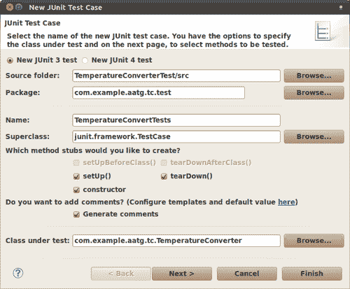

然后通过按下 **下一步 >** 按钮，我们可以获得我们可能想要测试的方法列表：

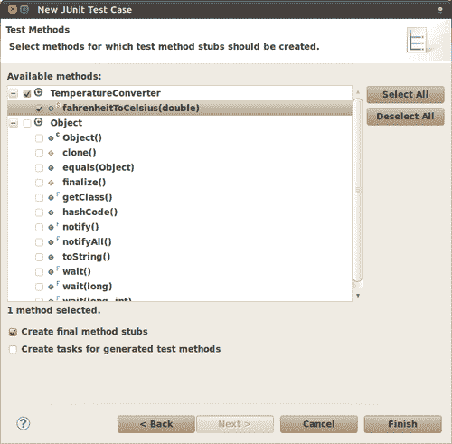

我们在 `TemperatureConverter` 中只实现了一个方法，所以它就是列表中唯一出现的方法。实现更多方法的其它类将在这里显示所有选项。

值得注意的是，即使测试方法是 Eclipse 自动生成的，它也不会通过。它会失败，并显示消息 *Not yet implemented* 来提醒我们某些东西缺失。

让我们先改变这个：

```java
/**
* Test method for {@link com.example.aatg.tc. TemperatureConverter#fahrenheitToCelsius(double)}.
*/
public final void testFahrenheitToCelsius() { for (double c: conversionTableDouble.keySet()) {
final double f = conversionTableDouble.get(c);
final double ca = TemperatureConverter.fahrenheitToCelsius(f);
final double delta = Math.abs(ca - c);
final String msg = "" + f + "F -> " + c + "C but is " + ca + " (delta " + delta + ")";
assertTrue(msg, delta < 0.0001);
}
}

```

创建一个包含不同温度转换值的转换表，这些值来自其他来源，这将是一个驱动测试的好方法。

```java
private static final HashMap<Double, Double> conversionTableDouble = new HashMap<Double, Double>();
static {
// initialize (c, f) pairs
conversionTableDouble.put(0.0, 32.0);
conversionTableDouble.put(100.0, 212.0);
conversionTableDouble.put(-1.0, 30.20);
conversionTableDouble.put(-100.0, -148.0);
conversionTableDouble.put(32.0, 89.60);
conversionTableDouble.put(-40.0, -40.0);
conversionTableDouble.put(-273.0, -459.40);
}

```

我们可以运行这个测试来验证它是否失败，给出以下跟踪信息：

**junit.framework.AssertionFailedError: -40.0F -> -40.0C but is 0.0 (delta 40.0)**

**at com.example.aatg.tc.test.TemperatureConverterTests.testFahrenheitToCelsius(TemperatureConverterTests.java:62)**

**at java.lang.reflect.Method.invokeNative(Native Method)**

**at android.test.AndroidTestRunner.runTest(AndroidTestRunner.java:169)**

**at android.test.AndroidTestRunner.runTest(AndroidTestRunner.java:154)**

**at android.test.InstrumentationTestRunner.onStart(InstrumentationTestRunner.java:520)**

**at android.app.Instrumentation$InstrumentationThread.run(Instrumentation.java:1447)**

嗯，这正是我们所预期的，因为我们的转换总是返回 0。实现我们的转换后，我们发现我们需要一个 `ABSOLUTE_ZERO_F` 常量：

```java
public class TemperatureConverter {
public static final double ABSOLUTE_ZERO_C = -273.15d;
public static final double ABSOLUTE_ZERO_F = -459.67d;
private static final String ERROR_MESSAGE_BELOW_ZERO_FMT =
"Invalid temperature: %.2f%c below absolute zero";
public static double fahrenheitToCelsius(double f) {
if (f < ABSOLUTE_ZERO_F) {
throw new InvalidTemperatureException(
String.format(ERROR_MESSAGE_BELOW_ZERO_FMT, f, 'F'));
}
return ((f - 32) / 1.8d);
}
}

```

绝对零是熵达到其最小值的理论温度。根据热力学定律，为了能够达到这个绝对零状态，系统应该与宇宙的其余部分隔离。因此，这是一个无法达到的状态。然而，根据国际协议，绝对零被定义为开尔文温标上的 0K，摄氏温标上的 -273.15°C，或者华氏温标上的 -459.67°F。

我们正在创建一个自定义异常 `InvalidTemperatureException`，以指示向转换方法提供有效温度时失败。这个异常是通过扩展 `RuntimeException:` 简单创建的。

```java
public class InvalidTemperatureException extends RuntimeException {
public InvalidTemperatureException(String msg) {
super(msg);
}
}

```

再次运行测试后，我们发现 `testFahrenheitToCelsiusConversion` 测试失败，而 `testFahrenheitToCelsius` 测试成功。这告诉我们现在转换已经被转换器类正确处理，但仍然存在一些与 UI 处理这个转换相关的问题。

仔细查看失败跟踪，我们发现当不应该返回 0 时，仍然有东西返回了 0。

这提醒我们，我们仍然缺少一个合适的 `EditNumber` 实现。在继续实现所提到的方法之前，让我们创建相应的测试来验证我们所实现的是否正确。

## EditNumber 测试

从上一章，我们现在可以确定，对于我们的自定义 `View` 测试，最佳基类是 `AndroidTestCase`，因为我们需要一个模拟的 `Context` 来创建自定义 `View`，但我们不需要系统基础设施。

这是我们必须完成的对话框，以创建测试。在这种情况下，使用 `android.test.AndroidTestCase` 作为基类，并将 `com.example.aatg.tc.EditNumber` 作为待测试的类：

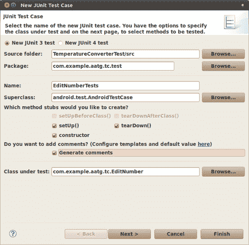

在按下 **下一步 >** 后，我们选择要创建存根的方法：

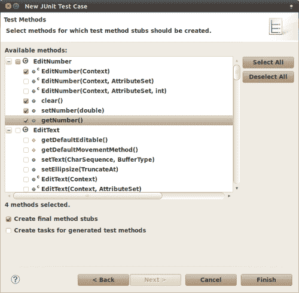

我们需要更新自动生成的构造函数，以反映我们之前确定的模式，即给定的名称模式：

```java
/**
* Constructor
*/
public EditNumberTests() {
this("EditNumberTests");
}
/**
* @param name
*/
public EditNumberTests(String name) {
setName(name);
}

```

下一步是创建测试用例。在这种情况下，这是一个简单的 `EditNumber`，我们将对其进行测试：

```java
/* (non-Javadoc)
* @see junit.framework.TestCase#setUp()
*/
protected void setUp() throws Exception {
super.setUp();
mEditNumber = new EditNumber(mContext);
mEditNumber.setFocusable(true);
}

```

模拟的上下文是从 `AndroidTestCase` 类中可用的受保护字段 `mContext` ([`developer.android.com/reference/android/test/AndroidTestCase.html#mContext`](http://developer.android.com/reference/android/test/AndroidTestCase.html#mContext)) 获取的。

在测试结束时，我们将 `mEditNumber` 设置为可聚焦的 `View`，这意味着它将能够获得焦点，因为它将参与一系列模拟 UI 的测试，这些测试可能需要显式请求其焦点。

接下来，我们测试在 `testClear()` 方法中正确实现了所需的 `clear()` 功能：

```java
/**
* Test method for {@link com.example.aatg.tc.EditNumber#clear()}.
*/
public final void testClear() {
final String value = "123.45";
mEditNumber.setText(value);
mEditNumber.clear();
String expectedString = "";
String actualString = mEditNumber.getText().toString();
assertEquals(expectedString, actualString);
}

```

运行测试以验证它失败：

**junit.framework.ComparisonFailure: expected:<> but was:<123.45>**

**在 com.example.aatg.tc.test.EditNumberTests.testClear(EditNumberTests.java:62)**

**在 android.test.AndroidTestRunner.runTest(AndroidTestRunner.java:169)**

**在 android.test.AndroidTestRunner.runTest(AndroidTestRunner.java:154)**

**在 android.test.InstrumentationTestRunner.onStart(InstrumentationTestRunner.java:529)**

**在 android.app.Instrumentation$InstrumentationThread.run(Instrumentation.java:1447)**

我们需要正确实现 `EditNumber.clear()`。

这是一个简单的情况，所以只需将此实现添加到 `EditNumber` 中，我们就能满足测试：

```java
public void clear() {
setText("");
}

```

运行测试并继续。现在让我们完成 `testSetNumber()` 的实现：

```java
/**
* Test method for {@link com.example.aatg.tc.EditNumber#setNumber(double)}.
*/
public final void testSetNumber() {
mEditNumber.setNumber(123.45);
final String expected = "123.45";
final String actual = mEditNumber.getText().toString();
assertEquals(expected, actual);
}

```

除非我们实现了 `EditNumber.setNumber()`，类似于这个实现：

```java
private static final String DEFAULT_FORMAT = "%.2f";
public void setNumber(double f) {super.setText( String.format(DEFAULT_FORMAT, f));
}

```

我们使用一个常量 `DEFAULT_FORMAT` 来保存要转换数字的期望格式。这可以稍后转换为可以在字段的 `xml` 布局定义中指定的属性。

对于 `testGetNumber()` 和 `getNumber()` 对，情况相同：

```java
/**
* Test method for {@link com.example.aatg.tc.EditNumber#getNumber()}.
*/
public final void testGetNumber() {
mEditNumber.setNumber(123.45);
final double expected = 123.45;
final double actual = mEditNumber.getNumber();
assertEquals(expected, actual);
}

```

然后：

```java
public double getNumber() {
Log.d("EditNumber", "getNumber() returning value of '" + getText().toString() + "'");
return Double.valueOf(getText().toString());
}

```

意外地，这些测试成功了。但现在有一个之前通过而现在开始失败的测试：`testFahrenheitToCelsiusConversion()`。原因是现在我们已经正确实现了`EditNumber.setNumber()`和`EditNumber.getNumber()`，一些值返回的方式不同，而这个测试方法依赖于这些虚假的值。

这是运行测试后获得的结果截图：


如果你仔细分析这个案例，你可以发现问题的所在。

明白了？

我们的测试方法期望在焦点改变时自动实现转换，正如我们在需求列表中所指定的：当一个温度值在一个字段中输入时，另一个值会自动通过转换更新。

记住，我们没有按钮或其他任何东西来转换温度值，所以一旦输入了值，转换应该自动完成。

这又让我们回到了`TemperatureConverterActivity`以及它处理转换的方式。

## `TemperatureChangeWatcher`类

实现所需行为的一种方法是在一个值改变后不断更新另一个温度值，可以通过`TextWatcher`来实现。从文档中我们可以理解，`TextWatcher`是一个附加到`Editable`对象上的对象类型；当文本改变时，它的方法会被调用（[`developer.android.com/intl/de/reference/android/text/TextWatcher.html`](http://developer.android.com/intl/de/reference/android/text/TextWatcher.html)）。

这似乎就是我们需要的东西。

我们把这个类实现为`TemperatureConverterActivity`的内部类。这是在 Eclipse 中创建新 Java 类的截图：

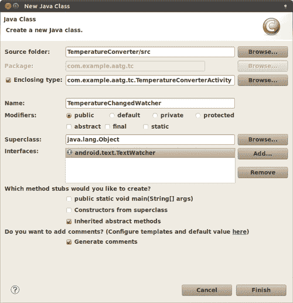

这是我们在最近创建的类中添加一些内容后的代码：

```java
/**
* Changes fields values when text changes applying the corresponding method.
*
*/
public class TemperatureChangedWatcher implements TextWatcher {
private final EditNumber mSource;
private final EditNumber mDest;
private OP mOp;
/**
* @param mDest
* @param convert
* @throws NoSuchMethodException
* @throws SecurityException
*/
public TemperatureChangedWatcher(TemperatureConverter.OP op) {
if ( op == OP.C2F ) {
this.mSource = mCelsius;
this.mDest = mFahrenheit;
}
else {
this.mSource = mFahrenheit;
this.mDest = mCelsius;
}
this.mOp = op;
}
/* (non-Javadoc)
* @see android.text.TextWatcher#afterTextChanged( android.text.Editable)
*/
public void afterTextChanged(Editable s) {
// TODO Auto-generated method stub
}
/* (non-Javadoc)
* @see android.text.TextWatcher#beforeTextChanged( java.lang.CharSequence, int, int, int)
*/
public void beforeTextChanged( CharSequence s, int start, int count, int after) {
// TODO Auto-generated method stub
}
/* (non-Javadoc)
* @see android.text.TextWatcher#onTextChanged( java.lang.CharSequence, int, int, int)
*/
public void onTextChanged(CharSequence s, int start, int before, int count) {
if (!mDest.hasWindowFocus() || mDest.hasFocus() || s == null )
{
return;
}
final String str = s.toString();
if ( "".equals(str) ) {
mDest.setText("");
return;
}
try {
final double temp = Double.parseDouble(str);
final double result = (mOp == OP.C2F) ? TemperatureConverter.celsiusToFahrenheit(temp) :
TemperatureConverter.fahrenheitToCelsius(temp);
final String resultString = String.format("%.2f", result);
mDest.setNumber(result);
mDest.setSelection(resultString.length());
} catch (NumberFormatException e) {
// WARNING
// this is generated while a number is entered,
// for example just a '-'
// so we don't want to show the error
} catch (Exception e) {
mSource.setError("ERROR: " + e.getLocalizedMessage());
}
}
}

```

我们实现了扩展`TextWatcher`并重写未实现的方法。

因为我们将使用相同的`TemperatureChangeWatcher`实现来处理两个字段，摄氏度和华氏度，所以我们保留了对用作源和目标的字段以及更新它们的值的操作的引用。为了指定这个操作，我们在`TemperatureConverter`类中引入了一个`enum`。

```java
/**
* C2F: celsiusToFahrenheit
* F2C: fahrenheitToCelsius
*/
public static enum OP { C2F, F2C };

```

这个操作在构造函数中指定，并且根据需要选择源和目标`EditNumber`。这样我们就可以为不同的转换使用相同的监视器。

我们主要感兴趣的`TextWatcher`接口的方法是`onTextChanged`，它将在文本改变时被调用。一开始我们避免潜在的循环，检查谁有焦点，如果条件不满足则返回。

如果源数据为空，我们也把目标字段设置为空的`String`。

最后，我们尝试将调用相应转换方法的结果设置到目标字段。根据需要标记错误，避免在转换使用部分输入的数字时显示过早的错误。

我们需要在`TemperatureConverterActivity.onCreate():`中的字段上设置监听器。

```java
/** Called when the activity is first created. */
@Override
public void onCreate(Bundle savedInstanceState) {
super.onCreate(savedInstanceState);
setContentView(R.layout.main);
mCelsius = (EditNumber) findViewById(R.id.celsius);
mFahrenheit = (EditNumber) findViewById(R.id.fahrenheit); mCelsius.addTextChangedListener(
new TemperatureChangedWatcher(OP.C2F));
mFahrenheit.addTextChangedListener(
new TemperatureChangedWatcher(OP.F2C));
}

```

为了能够运行测试，我们应该编译它们。为了编译，我们至少需要定义`celsiusToFahrenheit`，它尚未定义。

## 更多温度转换器测试

我们需要实现`celsiusToFahrenheit`，并且像往常一样，我们从测试开始。

这与另一个转换方法`fahrenheitToCelsius`相当，我们可以使用我们在创建此测试时设计的框架：

```java
/**
* Test method for {@link com.example.aatg.tc.TemperatureConverter#celsiusToFahrenheit(double)}.
*/
public final void testCelsiusToFahrenheit() {
for (double c: conversionTableDouble.keySet()) {
final double f = conversionTableDouble.get(c);
final double fa = TemperatureConverter.celsiusToFahrenheit(c);
final double delta = Math.abs(fa - f);
final String msg = "" + c + "C -> " + f + "F but is " + fa + " (delta " + delta + ")";
assertTrue(msg, delta < 0.0001);
}
}

```

我们使用转换表通过不同的转换来练习方法，并验证错误小于预定义的 delta。

然后，`TemperatureConverter`类中的相应转换实现如下：

```java
public static double celsiusToFahrenheit(double c) {
if (c < ABSOLUTE_ZERO_C) {
throw new InvalidTemperatureException(
String.format(ERROR_MESSAGE_BELOW_ZERO_FMT, c, 'C'));
}
return (c * 1.8d + 32);
}

```

现在所有的测试都通过了，但我们仍然没有测试所有常见的条件。你应该检查是否正确生成了错误和异常，除了到目前为止我们创建的所有正常情况之外。

这是创建的测试，用于检查在转换中使用低于绝对零的温度时正确生成异常：

```java
public final void testExceptionForLessThanAbsoluteZeroF() {
try {
TemperatureConverter.fahrenheitToCelsius( TemperatureConverter.ABSOLUTE_ZERO_F-1);
fail();
}
catch (InvalidTemperatureException ex) {
// do nothing
}
}

```

在这个测试中，我们将绝对零温度递减以获得更小的值，然后尝试转换。我们检查是否正确捕获了正确的异常，并最终断言这个条件：

```java
public final void testExceptionForLessThanAbsoluteZeroC() {
try {
TemperatureConverter.celsiusToFahrenheit( TemperatureConverter.ABSOLUTE_ZERO_C-1);
fail();
}
catch (InvalidTemperatureException ex) {
// do nothing
}
}

```

以类似的方式，我们测试当尝试的转换涉及低于绝对零的温度时抛出的异常。

## 输入过滤器测试

我们希望过滤由转换工具接收到的输入，以便没有垃圾输入到这个点。

`EditNumber`类已经过滤了有效的输入并生成异常，否则。我们可以通过在`TemperatureConverterActivityTests`中生成一些新的测试来验证这个条件。我们选择这个类是因为我们向输入字段发送键，就像一个真实用户会做的那样：

```java
public void testInputFilter() throws Throwable {
runTestOnUiThread(new Runnable() {
@Override
public void run() {
mCelsius.requestFocus();
}
});
final Double n = -1.234d;
sendKeys("MINUS 1 PERIOD 2 PERIOD 3 PERIOD 4");
Object nr = null;
try {
nr = mCelsius.getNumber();
}
catch (NumberFormatException e) {
nr = mCelsius.getText();
}
final String msg = "-1.2.3.4 should be filtered to " + n +
" but is " + nr;
assertEquals(msg, n, nr);
}

```

这个测试请求使用我们之前审查的模式将焦点放在摄氏度字段上，以在 UI 线程中运行测试的部分，然后发送一些键。发送的键是一个包含多个点的无效序列，这对于一个良好的十进制数字是不接受的。预期当过滤器到位时，这个序列将被过滤，并且只有有效的字符到达字段。我们使用可能生成的`NumberFormatException`来检测错误，然后断言`mCelsius.getNumber()`返回的值是我们过滤后预期的值。

要实现这个过滤器，我们需要向`EditNumber`添加一个`InputFilter`。因为这将添加到我们创建的所有构造函数中，所以我们创建了一个额外的`init()`方法，并从它们中调用它。为了达到我们的目标，我们使用一个接受数字、符号和小数点的`DigitsKeyListener`实例。

```java
/**
* Initialization.
* Set filter.
*
*/
private void init() {
// DigistKeyListener.getInstance(true, true) returns an
// instance that accepts digits, sign and decimal point
final InputFilter[] filters = new InputFilter[] { DigitsKeyListener.getInstance(true, true) };
setFilters(filters);
}
Then from the constructors we should invoke this method:
/**
* @param context
* @param attrs
*/
public EditNumber(Context context, AttributeSet attrs) {
super(context, attrs);
init();>
}

```

这个`init`方法是从不同的构造函数中分解和调用的。

再次运行测试，我们可以验证所有测试都已通过，现在一切又都是绿色的。

# 查看我们的最终应用程序

这是我们满足所有要求的应用程序。

在以下屏幕截图中，我们展示了这些要求之一，即检测尝试将温度转换为摄氏度绝对零度以下的情况（-1000.00°C）：

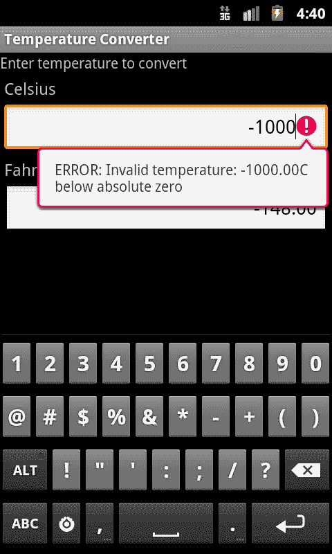

UI 遵循提供的指南；可以在相应的单位字段中输入温度进行转换。

总结一下，这是需求列表：

+   该应用程序可以将温度从摄氏度转换为华氏度，反之亦然

+   用户界面提供了两个输入温度的字段，一个用于摄氏度，另一个用于华氏度

+   当在一个字段中输入一个温度时，另一个字段会自动更新为转换值

+   如果有错误，它们应该显示给用户，可能使用相同的字段

+   用户界面应预留一些空间用于屏幕键盘，以便在输入多个转换时简化应用程序操作。

+   输入字段应保持为空

+   输入的值是带有小数点后两位数字的十进制值

+   数字是右对齐的

但也许更重要的是，我们可以确保应用程序不仅满足要求，而且没有明显的错误或漏洞，因为我们通过分析测试结果并在问题首次出现时修复它们来采取每一步。这将确保一旦发现相同的错误，它将不会再次出现。

# 摘要

我们介绍了测试驱动开发，介绍了其概念，并在之后逐步在一个潜在的真实问题中应用它们。

我们从一个简洁的需求列表开始，描述了温度转换应用程序。

然后，我们实现了每个测试，随后是实现满足它的代码。以这种方式，我们实现了应用程序的行为以及其展示，通过测试来验证我们设计的 UI 是否遵循规范。

进行测试使我们能够分析运行它们的不同可能性，下一章将专注于测试环境。
