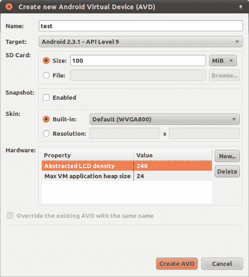
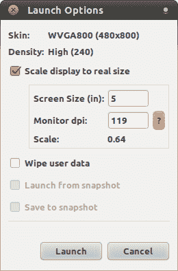
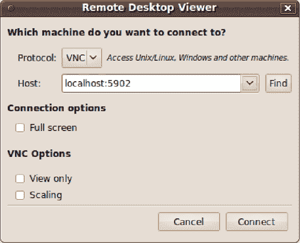
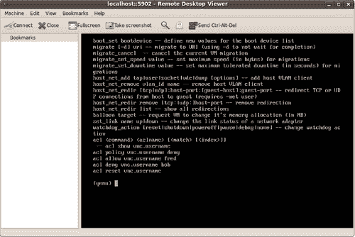
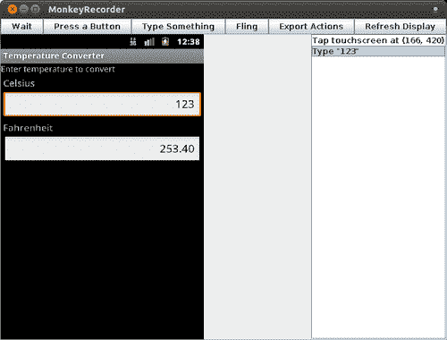

# 第五章：Android 测试环境

我们构建了我们的应用程序和一套合理的测试，我们运行这些测试以验证温度转换应用程序的基本方面和行为。现在，是时候提供不同的条件来运行这些测试，其他测试，甚至手动运行应用程序以了解使用时的用户体验了。

在本章中，我们将涵盖：

+   创建**Android 虚拟设备**（**AVD**）以提供不同的条件和配置

+   理解在创建 AVD 时可以指定的不同配置

+   如何运行 AVD

+   如何将 AVD 从其窗口中分离出来以创建无头模拟器

+   解锁屏幕以便运行所有测试

+   模拟现实生活中的网络条件

+   运行`monkey`生成事件以发送到应用程序

# 创建 Android 虚拟设备

为了获得最佳机会来检测与应用程序运行设备相关的问题，你需要尽可能广泛的功能和配置覆盖。

虽然最终和结论性的测试应该始终在具有日益增长的设备数量的真实设备上运行，但你几乎不可能拥有每种设备来测试你的应用程序。云中也有设备农场来测试各种设备，但它的成本有时超过了普通开发者的预算。希望 Android 提供了一种从模拟器 AVD 配置的便利性中，或多或少地模拟出各种功能和配置的方法。

### 注意

本章中的所有示例都是在 Ubuntu 10.04（Lucid Lynx）64 位操作系统上运行的，使用**Android SDK 和 AVD 管理器**修订版 10 和**Android SDK**，安装了平台 2.3（API 9）。

要创建 AVD，你可以使用命令行中的`android`，甚至可以从 Eclipse 内部使用**窗口 | Android SDK 和 AVD 管理器**或其快捷图标来完成。

运行命令后，你可以访问**Android SDK 和 AVD 管理器**，在那里你按下**新建..**.按钮来创建一个新的 AVD，并显示此对话框：



如果你按下**创建 AVD**，你将使用默认值完成 AVD 的创建。然而，如果你需要支持不同的配置，你可以通过使用**新建..**.按钮来指定不同的硬件属性。

可以设置的属性包括：

| 属性 | 类型 | 描述 |
| --- | --- | --- |
| 摄像头支持 | 布尔值 | 设备是否有摄像头。 |
| 缓存分区大小 | 整数 | 缓存分区的大小。 |
| SD 卡支持 | 布尔值 | 设备是否支持插入和移除虚拟 SD 卡。 |
| 缓存分区支持 | 布尔值 | 是否支持缓存分区。通常这个分区挂载在`/cache`。 |
| 键盘支持 | 布尔值 | 设备是否具有物理 QWERTY 键盘。 |
| 音频播放支持 | 布尔值 | 设备是否可以播放音频 |
| 音频录制支持 | 布尔值 | 设备是否可以录制音频。 |
| 方向键支持 | 布尔值 | 设备是否有方向键。 |
| 最大垂直摄像头像素 | 整数 | 虚拟摄像头的最大垂直尺寸（以像素为单位）。 |
| 加速计 | 布尔值 | 设备是否有加速度计。 |
| GPS 支持 | 布尔值 | 设备是否有 GPS。 |
| 设备 RAM 大小 | 整数 | 设备上的物理 RAM 量。这以兆字节表示。 |
| 触摸屏支持 | 布尔值 | 设备上是否有触摸屏。 |
| 电池支持 | 布尔值 | 设备是否可以由电池供电。 |
| GSM 调制解调器支持 | 布尔值 | 设备中是否有 GSM 调制解调器。 |
| 轨迹球支持 | 布尔值 | 设备上是否有轨迹球。 |
| 最大水平摄像头像素 | 整数 | 虚拟摄像头的最大水平尺寸（以像素为单位）。 |

在按下**开始**...以启动 AVD 后，你可以选择其他属性：



设置缩放也非常有用，可以在类似于真实设备大小的窗口中测试你的应用程序。在 AVD 中测试应用程序，窗口大小至少是真实设备大小的两倍，并使用鼠标指针相信一切正常，然后在 5 或 6 英寸的物理设备屏幕上意识到 UI 上的某些项目用手指是无法触摸的，这是一个非常常见的错误。

为了缩放 AVD 屏幕，你还应该将**监视器 dpi**设置为与您使用的监视器相对应的值。

最后，反复在相同条件下测试你的应用程序也是有帮助的。为了能够反复在相同条件下进行测试，有时删除之前会话中输入的所有信息是有帮助的。如果是这种情况，请检查**清除用户数据**以每次从头开始。

# 从命令行运行 AVDs

如果我们能够从命令行运行不同的 AVD，并且可能自动化我们的测试或为其编写脚本，那岂不是很好？

通过将 AVD 从其窗口中解放出来，打开了一个全新的自动化和脚本编写可能性世界。

好吧，让我们探索这些替代方案。

## 无头模拟器

当我们运行自动化测试且没有人查看窗口，或者测试运行器与应用程序之间的交互非常快以至于我们几乎看不到任何东西时，无头模拟器（其窗口不显示）非常有用。

无论如何，也值得提到的是，有时你只有在看到屏幕上的交互后才能理解为什么某些测试失败，所以请根据一些判断使用这两种替代方案。

我们在运行 AVD 时可能注意到的一件事是，它们的通信端口是在运行时分配的，通过将最后使用的端口增加 2 并从 5554 开始。这是用来命名模拟器和设置其序列号的，例如，使用端口 5554 的模拟器变为`emulator-5554`。这在我们在开发过程中运行 AVD 时非常有用，因为我们不需要注意端口分配。但如果同时运行多个模拟器，这可能会非常混乱且难以追踪哪个测试运行在哪个模拟器上。

在那些情况下，我们将为通信端口分配已知的端口，以保持特定 AVD 在我们控制之下。

通常，当我们同时运行多个模拟器上的测试时，我们不仅想要断开窗口，还想要避免声音输出。我们也将为此添加选项：

1.  启动我们刚刚创建的测试 AVD 的命令行将是：

    ```java
    $ emulator -avd test -no-window -no-audio -no-boot-anim -port 5580 &

    ```

1.  端口必须是一个介于 5554 和 5584 之间的整数：

    ```java
    $ adb devices
    List of devices attached
    emulator-5580 device

    ```

    这显示了设备在设备列表中的显示。

1.  下一步是安装应用程序和测试：

    ```java
    $ adb -s emulator-5580 install\ TemperatureConverter/bin/TemperatureConverter.apk
    347 KB/s (16632 bytes in 0.046s)
    pkg: /data/local/tmp/TemperatureConverter.apk
    Success
    $ adb -s emulator-5580 install\ TemperatureConverterTest/bin/TemperatureConverterTest.apk
    222 KB/s (16632 bytes in 0.072s)
    pkg: /data/local/tmp/TemperatureConverterTest.apk
    Success

    ```

1.  然后，我们可以使用指定的序列号来运行测试：

    ```java
    $ adb -s emulator-5580 shell am instrument -w\ com.example.aatg.tc.test/android.test.InstrumentationTestRunner
    com.example.aatg.tc.test.EditNumberTests:......
    com.example.aatg.tc.test.TemperatureConverterActivityTests:..........
    com.example.aatg.tc.test.TemperatureConverterTests:....
    Test results for InstrumentationTestRunner=....................
    Time: 25.295
    OK (20 tests)

    ```

## 禁用键 guard

我们可以看到测试在没有干预的情况下运行，并且不需要访问模拟器 GUI。

但有时，如果你以更标准的方式运行，比如从 Eclipse 启动的标准模拟器，你可能会收到一些测试未失败的错误。在这种情况下，其中一个原因是模拟器可能在第一屏被锁定，我们需要解锁它才能运行涉及 UI 的测试。

要解锁屏幕，你可以使用：

```java
$ adb -s emulator-5580 emu event send EV_KEY:KEY_MENU:1 EV_KEY:KEY_MENU:0

```

锁屏也可以通过程序来禁用；然而，这有一个缺点，就是会将测试相关的代码包含在你的应用程序中。一旦应用程序准备发布，这些代码应该被移除或禁用。

要做到这一点，应该在清单文件（`AndroidManifest.xml`）中添加以下权限，然后在测试中的应用程序中禁用屏幕锁。

要添加权限，将此元素添加到清单中：

```java
<manifest>
...
<uses-permission android:name="android.permission.DISABLE_KEYGUARD"/>
...
</manifest>

```

然后在测试的`Activity`中添加以下代码，最好在`onResume()`中添加：

```java
mKeyGuardManager = (KeyguardManager) getSystemService(KEYGUARD_SERVICE);
mLock = mKeyGuardManager.newKeyguardLock("com.example.aatg.tc");
mLock.disableKeyguard();

```

即，获取`KeyguardManager`，然后指定一个标签来获取`KeyguardLock`，自定义包名以便能够调试谁正在禁用键 guard。

然后使用`disableKeyguard()`禁用显示键 guard。如果键 guard 当前正在显示，它将被隐藏。只有在调用`reenableKeyguard()`之前，键 guard 才会被阻止再次显示。

## 清理

在某些情况下，你还需要清理在运行一些测试后启动的服务和进程，以防止后续测试的结果受到先前测试结束条件的影响。在这些情况下，始终从已知条件开始，释放所有使用的内存，停止服务，重新加载资源，并重新启动进程，这是通过热启动模拟器实现的。

```java
$ adb -s emulator-5580 shell 'stop; sleep 5; start'

```

此命令行为我们打开模拟器 shell 并运行停止和启动命令。

可以使用 `logcat` 命令来监控这些命令的演变：

```java
$ adb -s emulator-5580 logcat

```

您将看到类似的消息：

**D/AndroidRuntime( 241):**

**D/AndroidRuntime( 241): >>>>>>>>>>>>>> AndroidRuntime START <<<<<<<<<<<<<<**

**D/AndroidRuntime( 241): CheckJNI 是开启的**

**D/AndroidRuntime( 241): --- 注册本地函数 ---**

**I/SamplingProfilerIntegration( 241): 分析器已禁用**。

**I/Zygote ( 241): 预加载类..**.

**D/dalvikvm( 241): GC_EXPLICIT freed 816 objects / 47208 bytes in 7ms**

**I/ServiceManager( 28): service 'connectivity' died**

**I/ServiceManager( 28): service 'throttle' died**

**I/ServiceManager( 28): service 'accessibility' died**

**…**

### 注意

这个热启动在 Android 2.2 Froyo 模拟器上工作得不太好，但在 Android 设备上运行得非常完美。已经报告了一个错误，您可以在[`code.google.com/p/android/issues/detail?id=9814`](http://code.google.com/p/android/issues/detail?id=9814)上跟踪其进展。

## 终止模拟器

一旦我们完成了一个无头模拟器实例的工作，我们就开始使用之前提到的命令。我们使用以下命令行来终止它：

```java
$ adb -s emulator-5580 emu kill

```

这将停止模拟器，释放使用的资源，并在主机计算机上终止模拟器进程。

# 额外的模拟器配置

有时候，我们需要测试的内容超出了在创建或配置 AVD 时可以设置的选项范围。

其中一种情况可能是需要在不同的区域设置下测试我们的应用程序。比如说，我们想在日本的手机上测试我们的应用程序——一个将语言和地区分别设置为日语和日本的模拟器。

我们有能力在模拟器命令行中传递这些属性。

`-prop` 命令行选项允许我们设置我们能够设置的任何属性：

```java
$ emulator -avd test -no-window -no-audio -no-boot-anim -port 5580 -prop persist.sys.language=ja -prop persist.sys.country=JP &

```

为了验证我们的设置是否成功，我们可以使用 `getprop` 命令来验证它们，例如：

```java
$ adb s emulator-5580 shell "getprop persist.sys.language"

```

**ja**

```java
$ adb s emulator-5580 shell "getprop persist.sys.country"

```

**JP**

如果您想在调整了持久设置后清除所有用户数据，可以使用以下命令：

```java
$ adb -s emulator-5580 emu kill
$ emulator -avd test -no-window -no-audio -no-boot-anim -port 5580\ -wipe-data

```

然后，模拟器将重新启动。

## 模拟网络条件

在不同的网络条件下进行测试非常重要，但这种情况往往被忽视。这会导致误解，并认为应用程序的行为不同，因为我们使用了主机网络，它具有不同的速度和延迟。

Android 模拟器支持网络限制，例如支持较慢的网络速度和较高的连接延迟。这可以在模拟器命令行中使用选项 `-netspeed <speed>` 和 `-netdelay <delay>` 来实现。

支持的完整选项列表如下：

对于网络速度：

| **选项** | **描述** | **速度 [kbits/s]** |
| --- | --- | --- |
| `-netspeed gsm` | GSM/CSD | 上行：14.4，下行：14.4 |
| `-netspeed hscsd` | HSCSD | 上行：14.4，下行：43.2 |
| `-netspeed gprs` | GPRS | 上行：40.0，下行：80.0 |
| `-netspeed edge` | EDGE/EGPRS | 上行：118.4，下行：236.8 |
| `-netspeed umts` | UMTS/3G | 上行：128.0，下行：1920.0 |
| `-netspeed hsdpa` | HSDPA | 上行：348.0，下行：14400.0 |
| `-netspeed full` | 无限制 | 上行：0.0，下行：0.0 |
| `-netspeed <num>` | 选择上传和下载速度 | 上行：指定，下行：指定 |
| `-netspeed <up>:<down>` | 选择单独的上行和下行速度 | 上行：指定，下行：指定 |

对于延迟：

| 选项 | 描述 | 延迟 [毫秒] |
| --- | --- | --- |
| `-netdelay gprs` | GPRS | 最小 150，最大 550 |
| `-netdelay edge` | EDGE/EGPRS | 最小 80，最大 400 |
| `-netdelay umts` | UMTS/3G | 最小 35，最大 200 |
| `-netdelay none` | 无延迟 | 最小 0，最大 0 |
| `-netdelay <num>` | 选择精确延迟 | 指定的延迟 |
| `-netdelay <最小>:<最大>` | 选择最小和最大延迟 | 指定的最小和最大延迟 |

如果未指定值，模拟器将使用以下默认值：

+   默认网络速度为 '全速'

+   默认网络延迟为 '无'

这是一个模拟器使用这些选项来选择 14.4 kbits/sec 的 GSM 网络速度和 150 到 500 毫秒的 GPRS 延迟的示例。

```java
$ emulator -avd test -port 5580 -netspeed gsm -netdelay gprs

```

一旦模拟器运行，你可以使用 Android 控制台通过 TELNET 客户端交互式地验证这些网络设置或更改它们：

```java
$ telnet localhost 5580

```

**尝试 ::1..**.

**尝试 127.0.0.1..**.

**连接到本地主机**.

**转义字符是 '^]'**.

**Android 控制台：输入 'help' 查看命令列表**

**OK**

连接后，我们可以输入以下命令：

```java
network status

```

**当前网络状态：**

**下载速度：14400 比特/秒（1.8 KB/s）**

**上传速度：14400 比特/秒（1.8 KB/s）**

**最小延迟：150 毫秒**

**最大延迟：550 毫秒**

**OK**

你可以使用模拟器手动或自动地测试使用网络服务应用程序。

在某些情况下，这不仅涉及限制网络速度，还涉及更改 GPRS 连接的状态，以调查应用程序如何表现和应对这些情况。要更改此状态，我们还可以在运行的模拟器中使用 Android 控制台。

例如，要注销模拟器从网络，我们可以使用：

```java
$ telnet localhost 5580

```

**尝试 ::1..**.

**尝试 127.0.0.1..**.

**连接到本地主机**.

**转义字符是 '^]'**.

**Android 控制台：输入 'help' 查看命令列表**

**OK**

在接收到 **OK** 子提示符后，我们可以通过以下命令将数据网络模式设置为未注册：

```java
gsm data unregistered

```

**OK**

**退出**

在测试应用程序在此条件下后，你可以通过使用以下命令返回到连接状态：

```java
gsm data home

```

**OK**

要验证状态，可以使用：

```java
gsm status
gsm voice state: home
gsm data state: home

```

**OK**

## 额外的 qemu 选项

你可能知道，Android 模拟器基于一个名为 Qemu 的开源项目（[`qemu.org`](http://qemu.org)）。

Qemu 是一个通用的模拟器和虚拟化器。Android 使用其模拟器功能在 PC 或 Mac 等不同机器上运行为不同架构制作的操作系统。它使用动态转换，实现了非常好的性能，好到足以在某些情况下限制模拟速度以类似于真实的 Android 设备。

因此，当你运行模拟器时，你可以添加一些 qemu 特定的选项。

例如，我们可能想打开通过 VNC（虚拟网络计算）可访问的 qemu 控制台，这是另一个开源项目，提供远程帧缓冲功能（[`en.wikipedia.org/wiki/Virtual_Network_Computing`](http://en.wikipedia.org/wiki/Virtual_Network_Computing)）。在这个控制台中，我们可以发出一些 qemu 特定的命令。

要做到这一点，让我们添加以下选项：

```java
$ emulator -avd test -no-window -no-audio -no-boot-anim -port 5580\ -qemu -vnc :2 &

```

所有跟随`-qemu`的选项都将原样传递给 qemu。在这种情况下，我们传递`-vnc :2`，以打开虚拟显示 2，该显示在 VNC 启动时从 5900 端口开始计数，端口号为 5902。

使用一些 VNC 客户端，如 Vinagre—远程桌面查看器，这是在大多数发行版中 GNOME 桌面提供的，我们可以打开到控制台的连接。Vinagre 可以从 GNOME 桌面通过**应用程序 | 互联网 | 远程桌面查看器**启动。

在 Microsoft Windows 中，可以使用 RealVNC 作为客户端。

然后我们应该在 qemu 中打开到 VNC 服务器的连接：



我们将看到 qemu 控制台：



可以通过在提示符中输入以下命令来获取内部命令列表：

```java
(qemu) help

```

这些命令的分析超出了本书的范围，但您可以在 Qemu 网站上找到一些相关信息。

### 注意

从 Android 2.2（Froyo）开始的最新版本的模拟器有一个 bug，阻止在命令行中指定 qemu 选项（甚至帮助选项（`-qemu -h`）也不起作用），尽管它们在模拟器帮助（`emulator -help`）中列出，如下所示：

`-qemu args... 将参数传递给 qemu`

`-qemu -h display qemu help`

# 运行 monkey

你可能听说过无限猴子定理。这个定理指出，一只猴子在打字机上随机按键无限时间后，几乎肯定会打出给定的文本，比如威廉·莎士比亚的完整作品。

这个定理的安卓版本指出，一只猴子在设备上随机触摸可能会导致你的应用程序崩溃，嗯...时间远远少于无限时间。

在这一行中，Android 提供了一个 monkey 应用程序（[`developer.android.com/guide/developing/tools/monkey.html`](http://developer.android.com/guide/developing/tools/monkey.html)），它会生成随机事件而不是真正的猴子。

对我们的应用程序运行 monkey 以生成随机事件的最简单方法是：

```java
$ adb -e shell monkey -p com.example.aatg.tc -v -v 1000

```

你将收到以下输出：

**注入事件：1000**

**:丢失：keys=0 pointers=0 trackballs=0 flips=0**

**## 网络统计：经过时间=100914ms（0ms 移动，0mswifi，100914ms 未连接）**

**// 猴子完成**

**这显示了通过猴子注入的事件的详细信息**。

猴子只会将事件发送到指定的包（`-p`），在这个例子中是`com.example.aatg.tc`，并以非常冗长的方式（`-v -v`）发送。发送的事件数量将是 1000。

## 客户端-服务器猴子

运行猴子的另一种方式。它也提供了一个客户端-服务器模型，最终允许创建控制发送哪些事件以及不依赖于随机生成的脚本。

通常猴子使用的端口是 1080，但如果你有更好的偏好，可以使用另一个端口。

```java
$ adb -e shell monkey -p com.example.aatg.tc --port 1080 &

```

然后我们需要重定向模拟器端口：

```java
$ adb -e forward tcp:1080 tcp:1080

```

现在我们已经准备好发送事件。要手动发送，我们可以使用 TELNET 客户端：

```java
$ telnet localhost 1080

```

**尝试 ::1..**.

**尝试 127.0.0.1..**.

**连接到 localhost**.

**退出字符是'^]'**.

连接建立后，我们可以输入特定的猴子命令：

```java
tap 150 200

```

**OK**

要结束此操作，请退出 TELNET 命令。

如果我们需要重复练习应用程序，创建一个包含我们想要发送的命令的脚本会更为方便。一个猴子脚本可能看起来像这样：

```java
# monkey
tap 100 180
type 123
tap 100 280
press DEL
press DEL
press DEL
press DEL
press DEL
press DEL
press DEL
press DEL
type -460.3

```

事件及其参数在这里定义。

在启动温度转换器应用程序后，我们可以运行此脚本以练习用户界面。要启动应用程序，你可以使用模拟器窗口并点击其启动器图标，或者使用命令行，这是如果模拟器是无头的情况下唯一的替代方案，如下所示：

```java
$ adb shell am start -n com.example.aatg.tc/.TemperatureConverterActivity

```

日志中通过这一行来告知：

**开始：意图 { cmp=com.example.aatg.tc/.TemperatureConverterActivity }**

一旦应用程序启动，你可以使用脚本和`netcat`实用程序发送事件：

```java
$ nc localhost 1080 < monkey.txt

```

这将发送脚本文件中包含的事件到模拟器。以下事件如下：

+   触摸并选择摄氏度字段

+   输入 123

+   触摸并选择华氏度字段

+   删除其内容

+   输入-460.3

以这种方式，可以创建由触摸事件和按键组成的简单脚本。

# 使用 monkeyrunner 进行测试脚本

猴子的可能性相当有限，缺乏流程控制限制了其使用范围，仅适用于非常简单的情况。

为了规避这些限制，创建了一个新的项目，命名为 monkeyrunner ([`developer.android.com/guide/developing/tools/monkeyrunner_concepts.html`](http://developer.android.com/guide/developing/tools/monkeyrunner_concepts.html))。尽管名称几乎相同，并且导致了不少混淆，但它们在本质上没有任何关联。

Monkeyrunner，它已经包含在 Android SDK 的最新版本中，目前处于初始阶段，如今其使用相当有限，但其未来可能光明。它是一个提供 API 以编写外部控制 Android 设备或模拟器的脚本的工具。

Monkeyrunner 是建立在 Jython ([`www.jython.org/`](http://www.jython.org/)) 之上的，它是 Python ([`www.python.org/`](http://www.python.org/)) 编程语言的一个版本，专为在 Java(tm) 平台上运行而设计。

根据其文档，monkeyrunner 工具为 Android 测试提供了以下独特功能。这只是完整功能列表、示例和参考文档的亮点，这些可以从 monkeyrunner 主页([`developer.android.com/guide/developing/tools/monkeyrunner_concepts.html`](http://developer.android.com/guide/developing/tools/monkeyrunner_concepts.html))获取：

+   **多设备控制：** `monkeyrunner` API 可以将一个或多个测试套件应用于多个设备或模拟器。您可以一次性物理连接所有设备或启动所有模拟器（或两者），然后依次程序化连接到每个设备，并运行一个或多个测试。您还可以程序化启动模拟器配置，运行一个或多个测试，然后关闭模拟器。

+   **功能测试：** `monkeyrunner` 可以运行 Android 应用程序的自动化从头到尾测试。您提供输入值，使用按键或触摸事件，并以截图的形式查看结果。

+   **回归测试：** `monkeyrunner` 可以通过运行应用程序并将其输出截图与一组已知正确的截图进行比较来测试应用程序的稳定性。

+   **可扩展的自动化：** 由于 `monkeyrunner` 是一个 API 工具包，因此您可以开发一个基于 Python 的模块和程序的系统，用于控制 Android 设备。除了使用 `monkeyrunner` API 本身之外，您还可以使用标准的 Python OS 和 subprocess 模块调用 Android 工具，如 Android 调试桥。

+   您还可以将您自己的类添加到 `monkeyrunner` API 中。这在线文档的“通过插件扩展 monkeyrunner”部分有更详细的描述。

## 获取测试截图

目前，monkeyrunner 最明显的用途之一是获取正在测试的应用程序的截图，以便进一步分析或比较。

这些截图可以通过以下步骤获得：

1.  导入所需的模块。

1.  与设备建立连接。

1.  检查错误。

1.  启动 `TemperatureConverter` 活动。

1.  添加一些延迟。

1.  输入 '123'

1.  添加一些延迟以允许事件被处理。

1.  获取截图并将其保存到文件中。

1.  按 **BACK** 键退出 Activity。

以下是需要执行上述步骤的脚本的代码：

```java
#! /usr/bin/env monkeyrunner
'''
Created on 2011-03-12
@author: diego
'''
import sys
# Imports the monkeyrunner modules used by this program
from com.android.monkeyrunner import MonkeyRunner, MonkeyDevice, MonkeyImage
# Connects to the current device, returning a MonkeyDevice object
device = MonkeyRunner.waitForConnection()
if not device:
print >> sys.stderr, "Couldn't get connection"
sys.exit(1)
device.startActivity(component='com.example.aatg.tc/.TemperatureConverterActivity')
MonkeyRunner.sleep(3.0)
device.type("123")
# Takes a screenshot
MonkeyRunner.sleep(3.0)
result = device.takeSnapshot()
# Writes the screenshot to a file
result.writeToFile('/tmp/device.png','png')
device.press('KEYCODE_BACK', 'DOWN_AND_UP')

```

一旦此脚本运行，您将在 `/tmp/device.png` 中找到 `TemperatureConverter` 的截图。

## 录制和回放

如果需要更简单的东西，可能没有必要手动创建这些脚本。为了简化流程，可以使用包含在 Android 源代码库中 sdk 项目的脚本`monkey_recorder.py`（[`android.git.kernel.org/?p=platform/sdk.git;a=summary`](http://android.git.kernel.org/?p=platform/sdk.git;a=summary)），用于记录随后由另一个名为`monkey_playback.py`的脚本解释的事件描述。

从命令行运行`monkey_recorder.py`，你将看到这个用户界面：



此界面有一个工具栏，包含用于在记录的脚本中插入不同命令的按钮：

| 按钮 | 描述 |
| --- | --- |
| **等待** | 等待多少秒。此数字由对话框请求。 |
| **按按钮** | 发送 MENU、HOME 或 SEARCH 按钮。按、向下或向上事件。 |
| **输入文本** | 发送一个字符串。 |
| **滑动** | 在指定方向、距离和步数中发送滑动事件。 |
| **导出动作** | 保存脚本。 |
| **刷新显示** | 刷新显示的截图副本。 |

一旦脚本完成，保存它，比如说保存为`script.mr`，然后你可以通过使用以下命令行重新运行它：

```java
$ monkey_playback.py script.mr

```

现在所有的事件都将被回放。

# 摘要

在本章中，我们涵盖了所有将我们的应用程序及其测试暴露于各种条件和配置的替代方案，包括不同的屏幕尺寸、设备（如摄像头或键盘）的可用性，以及模拟真实网络条件以检测应用程序中的问题。

我们还分析了所有可以远程控制断开其窗口的模拟器的选项。这为我们在第八章（Chapter 8，*持续集成*）中将要讨论的持续集成奠定了基础，并且依赖于自动运行所有测试套件的能力，以及配置、启动和停止模拟器的功能将是必要的。

最后，介绍了一些脚本编写替代方案，并提供了入门示例。

下一章将介绍行为驱动开发（Behavior Driven Development，简称 BDD）——一种利用通用词汇来表达测试的技术，允许业务人员在软件开发项目中参与。
