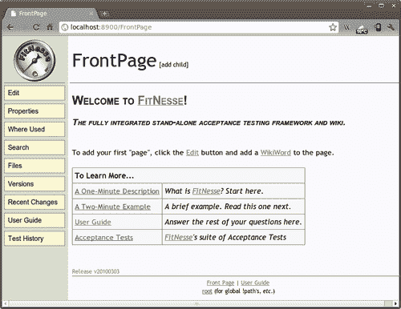
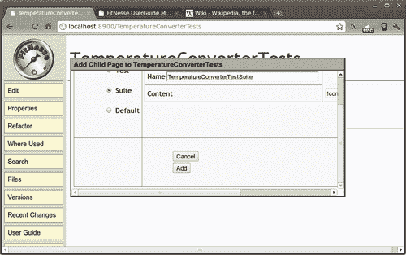
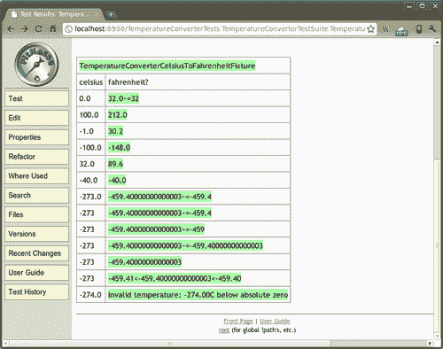
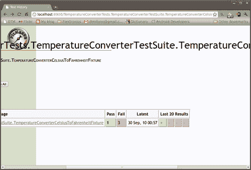
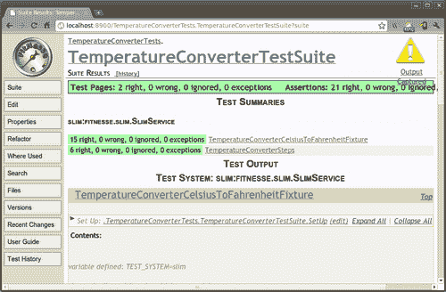

# 第六章. 行为驱动开发

行为驱动开发可以理解为测试驱动开发（Test Driven Development）和验收测试（Acceptance Testing）的演变和融合。这两种技术在前几章中都有讨论，所以在继续之前，你可能想回顾一下第一章 *测试入门* 和 第四章 *测试驱动开发*。

行为驱动开发引入了一些新概念，例如使用通用词汇来描述测试，以及在软件开发项目中包含商业参与者。有些人仍然认为这只是正确执行的测试驱动开发。

我们之前已经讨论过测试驱动开发，我们专注于将低级需求转换为可以驱动我们开发过程的测试。行为驱动开发迫使我们关注更高层次的需求，并使用特定的词汇，我们可以用这些词汇以可以进一步分析或评估的方式表达这些需求。

我们将探讨这些概念，以便你可以得出自己的结论。

# 简史

行为驱动开发是由丹·诺斯（Dan North）在 2003 年提出的术语，用来描述一种通过使用通常称为**自外向内**的软件开发过程来专注于开发人员与其他利益相关者之间协作的技术。其首要目标是满足客户的企业需求。

行为驱动开发源于基于**神经语言程序学**（Neuro Linguistic Programming，NLP）技术的思想实验。

主要思想是，用来描述一个想法的词汇会严重影响这个想法，以至于我们似乎在用我们说的语言思考。

有实证证明，在记忆测试中，如果他们的母语有特定颜色的特定词汇，那么测试对象更有可能记住该特定颜色。因此，如果我们有一种特定的语言来描述我们的需求，它可能会影响我们对它们的思考方式，从而改善我们编写它们的方式。

因此，行为驱动开发所使用的词汇是经过精心挑选的，以影响你对特性指定的思考方式。它们与因果关系概念密切相关，并遵循这一概念从已知状态开始描述一个特性，应用某些过程，并期望某些结果。

这些词将在下一节中进行描述。

# 给定，当，然后

**给定/当/然后**词汇是跨越商业和技术之间的共同词汇，正如在[`behaviour-driven.org/`](http://behaviour-driven.org/)中所述，它们也可以被称为行为驱动开发的通用语言。该框架基于三个核心原则，我们在此直接引用：

+   商业和技术应该以相同的方式引用相同的系统

+   任何系统都应该有一个对业务可识别、可验证的价值

+   预先分析、设计和规划都有递减的回报

行为驱动开发依赖于使用这个特定的词汇。此外，要求表达的方式是预先确定的，允许工具解释和执行它们。

+   **给定**，是描述在接收到外部刺激之前的初始状态。

+   **当**，是描述用户执行的关键动作。

+   **然后**，是分析动作的结果。为了可观察性，所执行的动作应该有一些结果。

# FitNesse

FitNesse 是一个软件开发协作工具。严格来说，FitNesse 是一套工具，如下所述：

+   作为软件测试工具，FitNesse 是一个轻量级、开源的框架，允许团队协作

+   它也是一个 Wiki，你可以轻松创建和编辑页面并分享信息

+   FitNesse 也是一个 Web 服务器，因此它不需要额外的配置或管理权限来设置或配置

从 [`fitnesse.org/`](http://fitnesse.org/) 下载 FitNesse 发行版。发行版是一个 JAR 文件，首次运行时会自动安装。在这些示例中，我们使用了 FitNesse 版本 20100303，但新版本也应该可以工作。

## 从命令行运行 FitNesse

默认情况下，当 FitNesse 运行时，它监听端口 80，因此要运行非特权版本，你应该在命令行上更改端口。在这个例子中，我们使用 `8900:`

```java
$ java -jar fitnesse.jar -p 8900

```

这是我们运行命令时获得的结果：

**FitNesse (v20100303) 已启动..**。

**端口：8900**

**根页面：fitnesse.wiki.FileSystemPage 在 ./FitNesseRoot**

**记录器：无**

**认证器：fitnesse.authentication.PromiscuousAuthenticator**

**HTML 页面工厂：fitnesse.html.HtmlPageFactory**

**页面版本过期设置为 14 天**。

一旦运行，你可以将你的浏览器指向本地 FitNesse 服务器的首页，你将看到以下内容：



## 创建一个 TemperatureConverterTests 子维基

一旦 FitNesse 启动并运行，我们可以先创建一个子维基来组织我们的测试。

你可能已经熟悉了 Wiki 概念。如果不熟悉，Wiki 是一个允许用户编辑和创建页面的网站。这个过程是在浏览器内完成的，并使用一种大大简化过程的标记语言。

### 注意

你可以在可能是最著名的 Wiki 中了解更多关于 Wiki 的信息：[`en.wikipedia.org/wiki/Wiki`](http://en.wikipedia.org/wiki/Wiki)。

虽然这种子维基组织不是强制性的，但强烈推荐，特别是如果你计划在多个项目中使用 FitNesse 进行验收测试的话。

最简化的过程之一是超链接创建，这只需要使用 *CamelCase* 或 *WikiWords*；即一个以大写字母开头并且至少有一个更多大写字母的单词。这个 WikiWord 将被转换成一个指向具有该名称页面的超链接。

要创建 **TemperatureConverterTests** 子维基，我们只需按下 FitNesse 标志下面的**编辑**按钮来编辑主页，添加以下内容：

```java
| '''My Tests''' |
| TemperatureConverterTests | ''Temperature Converter Tests'' |

```

这通过使用 "|" 标记作为第一个字符以及分隔列来在页面上添加一个新的表格。

然后创建一个维基页面 `TemperatureConverterTests`，我们还在其中添加了一个带有关于测试的描述性注释的列。这个注释通过用双单引号('')包围而变成了斜体。

按**保存**按钮，页面将被修改。

页面显示后，我们可以验证 `TemperatureConverterTests` 现在后面跟着 **[?]**（问号），因为页面尚未创建，将在我们点击它时创建。

我们可以添加一些注释来清楚地识别这个新创建的子维基的首页。

```java
!contents -R2 -g -p -f -h
This is the !-TemperatureConverterTests SubWiki-!.

```

在这里，文本`TemperatureConverterTests SubWiki`使用!-和-!进行转义，以防止它被转换为另一个页面链接。

**保存**再次。

### 向子维基添加子页面

现在我们通过使用页面标题旁边的**[添加子页面]**链接添加一个新的子页面。

创建子页面的选项有很多，我们可以选择：

+   **正常**，对于一个普通维基页面

+   **测试**，包含测试的页面

+   **套件**，包含其他测试的套件页面

+   **默认**，一个默认页面



这些是需要使用的值：

| 字段 | 值 |
| --- | --- |
| 页面类型: | 套件 |
| 名称: | TemperatureConverterTestSuite |
| 内容: | !contents |

按下**添加**后，这个页面将被创建并自动添加为子维基的链接。

让我们跟随这个新创建的链接到达测试套件页面。

一旦你在这里，使用**[添加子页面]**链接添加另一个子页面。这次，让我们添加一个测试页面，并将其命名为**TemperatureConverterCelsiusToFahrenheitFixture**，因为这个将包含我们的固定装置。

这些是需要使用的值：

| 字段 | 值 |
| --- | --- |
| 页面类型: | 测试 |
| 名称: | TemperatureConverterCelsiusToFahrenheitFixture |
| 内容: | !contents |

点击**添加**以完成操作。

### 添加验收测试固定装置

到目前为止，我们只是在创建维基页面。这没什么令人兴奋的！但现在我们将直接在页面上添加我们的验收测试固定装置。确保导航到新添加的页面，**TemperatureConverterCelsiusToFahrenheitFixture**，像往常一样点击**编辑**，并添加以下内容：

```java
!contents
!|TemperatureConverterCelsiusToFahrenheitFixture |
|celsius|fahrenheit? |
|0.0 |~= 32 |
|100.0 |212.0 |
|-1.0 |30.2 |
|-100.0 |-148.0 |
|32.0 |89.6 |
|-40.0 |-40.0 |
|-273.0 |~= -459.4 |
|-273 |~= -459.4 |
|-273 |~= -459 |
|-273 |~= -459.40000000000003 |
|-273 |-459.40000000000003 |
|-273 |-459.41 < _ < -459.40 |
|-274.0 |Invalid temperature: -274.00C below absolute zero|

```

这个表格定义了我们文本功能的一些项目：

+   `TemperatureConverterCelsiusToFahrenheitFixture:` 这是表格标题和测试固定装置的名称。

+   `celsius:` 这是提供给测试的输入值的列名。

+   `fahrenheit?:` 这是转换结果期望的列名。问号表示这是一个结果值。

+   `~=:` 这表示结果大约是这个值。

+   `< _ <:` 这表示期望值在这个范围内。

+   无效的温度：-274.00C 低于绝对零度，是失败的转换所期望的值。

通过点击**保存**来保存此内容。

### 添加支持测试类

如果我们只是按下位于 FitNesse 标志下方的**测试**按钮（下一张截图将提供详细信息），我们将收到一个错误。在某种程度上，这是预期的，因为我们还没有创建支持测试固定件。这是一个非常简单的类，它调用`TemperatureConverter`方法。

FitNesse 支持两种不同的测试系统：

+   **fit:** 这是两种方法中较老的一种，它使用 HTML，在调用固定件之前解析。

+   **slim:** 这是一种较新的方法，所有的表格处理都在 FitNesse 内部，在 slim 运行器中进行。

更多关于这些测试系统的信息可以在[`fitnesse.org/FitNesse.UserGuide.TestSystems`](http://fitnesse.org/FitNesse.UserGuide.TestSystems)找到。

在这个例子中，我们使用 slim，这是通过在相同页面中设置变量`TEST_SYSTEM`来选择的：

```java
!define TEST_SYSTEM {slim}

```

要创建 slim 测试固定件，我们只需在我们的现有 Android 测试项目`TemperatureConverterTest`中创建一个新的包，命名为`com.example.aatg.tc.test.fitnesse.fixture`。我们将在这个包内创建固定件。

接下来，我们必须创建我们在验收测试表中定义的`TemperatureConverterCelsiusToFahrenheitFixture`类：

```java
package com.example.aatg.tc.test.fitnesse.fixture;
import com.example.aatg.tc.TemperatureConverter;
public class TemperatureConverterCelsiusToFahrenheitFixture {
private double celsius;
public void setCelsius(double celsius) {
this.celsius = celsius;
}
public String fahrenheit() throws Exception {
try {
return String.valueOf( TemperatureConverter.celsiusToFahrenheit(celsius));
}
catch (RuntimeException e) {
return e.getLocalizedMessage();
}
}
}

```

此固定件应该委托给真实代码，而不是自己执行任何操作。我们决定从`fahrenheit`返回`String`，这样我们就可以在同一个方法中返回`Exception`消息。

在测试页面中，我们还应该定义测试所使用的导入语句：

```java
|import|
|com.example.aatg.tc.test.fitnesse.fixture|

```

### 注意

注意，在下一个变量中，您应该将路径更改为适合您系统的路径，并将类路径更改为定位类。

```java
!path /opt/fitnesse/fitnesse.jar:/home/diego/aatg/TemperatureConverter/bin/:/home/diego/aatg/TemperatureConverterTest/bin/

```

### 注意

这应该适应您的系统路径。

完成这些步骤后，我们可以点击**测试**按钮来运行测试，页面将反映结果：



我们可以通过它们的绿色和红色轻松地识别每个成功的测试和失败的测试。在这个例子中，我们没有失败，所以一切都是绿色的。

FitNesse 还有一个有用的功能，即**测试历史**。所有测试运行和一定数量的结果都会保存一段时间，以便您可以稍后审查结果并比较结果，从而分析您更改的演变。

此功能可以通过点击左侧选项列表底部的**测试历史**来访问。

在以下图像中，我们可以看到最后 4 次测试运行的结果，其中 3 次失败，1 次成功。此外，通过点击“+”或“-”符号，您可以展开或折叠视图以显示或隐藏有关测试运行的详细信息。



# GivWenZen

GivWenZen 是一个框架，它基于 FitNesse 和 Slim 构建，允许用户利用行为驱动开发技术，使用 **Given-When-Then** 词汇来描述测试。这些测试描述也使用 FitNesse 维基功能创建，将测试作为包含在维基页面表格中的纯文本。

这个想法很简单，并且很直接，遵循我们一直在使用 FitNesse 做的事情，但这次我们不是编写提供值表的验收测试，而是将三个行为驱动开发魔法词 **Given-When-Then** 用于描述我们的场景。

首先，让我们安装 GivWenZen。从其下载列表页面 [`code.google.com/p/givwenzen/downloads/list`](http://code.google.com/p/givwenzen/downloads/list) 下载完整发行版，并遵循其网站上的说明。在这些示例中，我们使用了 givwenzen 1.0.1，但新版本也应该可以工作。

GivWenZen 的完整发行版包括所有必要的依赖项，包括 FitNesse，因此如果你已经从之前的示例中运行了 FitNesse，最好停止它，或者你必须为 GivWenZen 使用不同的端口。

启动时，将你的浏览器指向主页，你将找到一个熟悉的 FitNesse 前端页面。你可以花些时间探索包含的示例。

## 创建测试场景

让我们为我们的温度转换器创建一个简单的场景，以便更好地理解。

在纯测试中，我们的场景将是：

*给定* 我正在使用温度转换器，*当* 我将 100 输入到摄氏度字段，*然后* 我在华氏度字段中获得 212。

并且它通过在维基页面上添加以下内容直接翻译成 GivWenZen 场景：

```java
-|script|
|given |I'm using the !-TemperatureConverter-!|
|when |I enter 100 into Celsius field |
|then |I obtain 212 in Fahrenheit field |

```

翻译很简单。表标题必须是 `script`，在这种情况下，它前面有一个连字符 (-) 以隐藏它。然后，每个 **Given-When-Then** 场景都放置在一列中，而谓词在另一列中。

在运行此脚本之前，当整个页面执行完毕时，我们需要通过运行另一个脚本来初始化 GivWenZen。在这种情况下，它将是：

```java
|script |
|start|giv wen zen for slim|

```

我们需要在启动 GivWenZen 的脚本之前初始化类路径并添加相应的导入。通常这在一页 **setUp** 中完成，这些页面在运行每个测试脚本之前执行，但为了简单起见，我们将初始化添加到同一页面上：

```java
!define TEST_SYSTEM {slim}
!path ./target/classes/main
!path ./target/classes/examples
!path ./lib/commons-logging.jar
!path ./lib/fitnesse.jar
!path ./lib/log4j-1.2.9.jar
!path ./lib/slf4j-simple-1.5.6.jar
!path ./lib/slf4j-api-1.5.6.jar
!path ./lib/javassist.jar
!path ./lib/google-collect-1.0-rc4.jar
!path ./lib/dom4j-1.6.1.jar
!path ./lib/commons-vfs-1.0.jar
!path ./lib/clover-2.6.1.jar
!path /home/diego/workspace/TemperatureConverter/bin
!path /home/diego/workspace/TemperatureConverterTest/bin

```

如果你只是在这里点击 **测试** 按钮运行测试，你将收到以下消息：

**__ 异常：org.givwenzen.DomainStepNotFoundException:** 

你需要一个步骤类，其中有一个注解的方法与以下模式匹配：“我正在使用 TemperatureConverter”。

这种错误的典型原因包括：

+   `StepClass` 缺少 `@DomainSteps` 注解

+   `StepMethod` 缺少 `@DomainStep` 注解

+   步骤方法注解的正则表达式与当前测试步骤不匹配

这以及其他异常消息对于实现步骤类非常有帮助，然而你应该添加一些行为。

步骤类应该放在`bdd.steps`包或子包中，或者如果你定义了自己的自定义包，也应该放在那里。

例如：

```java
@DomainSteps
public class StepClass {
@DomainStep("I'm using the TemperatureConverter")
public void domainStep() {
// TODO implement step
} }

```

在我们特定的案例中，这将实现`StepClass`：

```java
package bdd.steps.tc;
import org.givwenzen.annotations.DomainStep;
import org.givwenzen.annotations.DomainSteps;
import com.example.aatg.tc.TemperatureConverter;
@DomainSteps
public class TemperatureConverterSteps {
private static final String CELSIUS = "Celsius";
private static final String FAHRENHEIT = "Fahrenheit";
private static final String ANY_TEMPERATURE =
"([-+]?\\d+(?:\\.\\d+)?)";
private static final String UNIT = "(C|F)";
private static final String UNIT_NAME =
"(" + CELSIUS + "|" + FAHRENHEIT + ")";
private static final double DELTA = 0.01d;
private double mValue = Double.NaN;
@DomainStep("I(?: a|')m using the TemperatureConverter")
public void createTemperatureConverter() {
// do nothing
}
@DomainStep("I enter " + ANY_TEMPERATURE + " into " + UNIT_NAME + " field")
public void setField(double value, String unitName) {
mValue = value;
}
@DomainStep("I obtain " + ANY_TEMPERATURE + " in " + UNIT_NAME + " field")
public boolean verifyConversion(double value, String unitName) {
try {
final double t = (FAHRENHEIT.compareTo(unitName) == 0) ? getFahrenheit() : getCelsius();
return (Math.abs(t-value) < DELTA);
}
catch (RuntimeException ex) {
return false;
}
}
@DomainStep("Celsius")
public double getCelsius() {
return TemperatureConverter.fahrenheitToCelsius(mValue);
}
@DomainStep("Fahrenheit")
public double getFahrenheit() {
return TemperatureConverter.celsiusToFahrenheit(mValue);
}
}

```

在这个例子中，我们使用`bdd.steps`的子包，因为默认情况下，这是 GivWenZen 搜索步骤实现包的层次结构。否则，需要额外的配置。

实现步骤的类应该由`@DomainSteps`注解，而步骤的方法应该由`@DomainStep`注解。后者接收一个正则表达式字符串作为参数。这个正则表达式由 GivWenZen 用来匹配步骤。

例如，在我们的场景中，我们定义了这个步骤：

```java
I enter 100 into Celsius field

```

我们的注解是：

```java
@DomainStep("I enter " + ANY_TEMPERATURE + " into " + UNIT_NAME + " field")

```

这将匹配，并且由`ANY_TEMPERATURE`和`UNIT_NAME`定义的正则表达式组值将被获取，并作为方法参数的值和`unitName:`提供给方法。

```java
public void setField(double value, String unitName)

```

回想一下，在前一章中，我建议回顾正则表达式，因为它们可能很有用。这可能是这些非常有用的地方之一。在`ANY_TEMPERATURE`中，我们匹配每个可能的温度值，包括可选的符号和小数点。因此，`UNIT`和`UNIT_NAME`匹配单位符号或其名称；即摄氏度或华氏度。

这些正则表达式用于构造`@DomainStep`注解参数。这些正则表达式中的括号"()"分隔的组被转换为方法参数。这就是`setField()`如何获得其参数的方式。

然后，我们有一个`verifyConversion()`方法，它返回 true 或 false，取决于实际转换是否在预期的`DELTA`值范围内。

最后，我们有一些方法，实际上会调用`TemperatureConverter`类中的转换方法。

再次运行测试后，所有测试都通过了。我们可以通过分析输出消息来确认这一点：

**断言：2 个正确，0 个错误，0 个忽略，0 个异常**。

注意，我们接收的是 2 个断言的结果，因为一个是调用我们添加到页面上的 GivWenZen 初始化脚本，另一个是我们场景的断言。

我们不仅应该为正常情况创建场景，还应该涵盖异常条件。比如说，用纯文本来说，我们的场景是这样的：

### 注意

*Given* 我在使用温度转换器，*When* 我将-274 输入到摄氏度字段，*Then* 我获得 'Invalid temperature: -274.00C below absolute zero' 异常。

它可以被翻译成以下 GivWenZen 表格：

```java
-|script|
|given|I am using the !-TemperatureConverter-! |
|when |I enter -274 into Celsius field |
|then |I obtain 'Invalid temperature: -274.00C below absolute zero' exception|

```

通过添加一个支持步骤方法，我们就能运行它。步骤方法可以像这样实现：

```java
@DomainStep("I obtain '(Invalid temperature: " + ANY_TEMPERATURE + UNIT + " below absolute zero)' exception")
public boolean verifyException(String message, String value, String unit) {
try {
if ( "C".compareTo(unit) == 0 ) {
getFahrenheit();
}
else {
getCelsius();
}
}
catch (RuntimeException ex) {
return ex.getMessage().contains(message);
}
return false;
}

```

这个方法从正则表达式获取异常消息、温度值和单位。然后，这与实际的异常消息进行比较，以验证它们是否匹配。

此外，我们还可以创建其他场景，在这种情况下，这些场景将由现有的步骤方法支持。这些场景可能包括：

```java
-|script|
|given |I'm using the !-TemperatureConverter-! |
|when |I enter -100 into Celsius field |
|then |I obtain -148 in Fahrenheit field |
-|script|
|given |I'm using the !-TemperatureConverter-! |
|when |I enter -100 into Fahrenheit field |
|then |I obtain -73.33 in Celsius field |
|show |then |Celsius |
-|script|
|given|I'm using the !-TemperatureConverter-! |
|when |I enter -460 into Fahrenheit field |
|then |I obtain 'Invalid temperature: -460.00F below absolute zero' exception|

```

由于 GivWenZen 基于 FitNesse，我们可以自由地结合两种方法，并将之前会话中的测试包括在同一套件中。这样做，我们可以从套件页面运行整个套件，获得整体结果。



# 摘要

在本章中，我们介绍了行为驱动开发作为测试驱动开发的演变，这在之前的章节中我们已经进行了考察。

我们讨论了行为驱动开发的起源和背后的推动力。我们分析了作为基础的概念，探讨了 Given-When-Then 词汇理念，并介绍了 FitNesse 和 Slim 作为部署测试的有用工具。

我们介绍了 GivWenZen，这是一个基于 FitNesse 的工具，它赋予我们创建场景和测试它们的能力。

我们将这些技术和工具引入到我们的样本 Android 项目中。然而，我们仍然局限于在 JVM 下可测试的测试对象，避免使用 Android 特定的类，主要是用户界面。我们将在第十章“替代测试策略”中探讨一些替代方案来克服这一限制。

下一章将展示不同常见情况的实际示例，应用到目前为止讨论的所有学科和技术。
