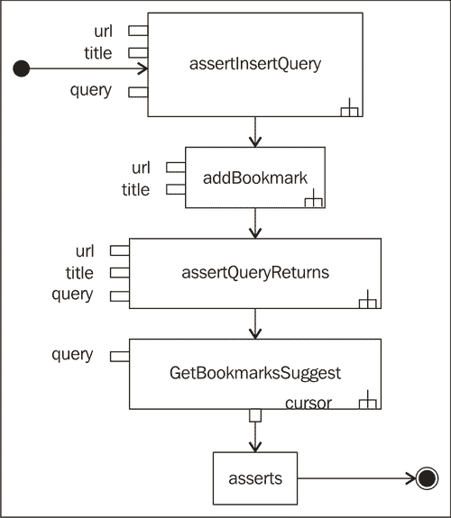
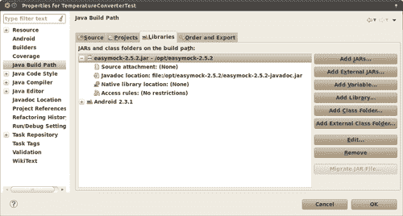
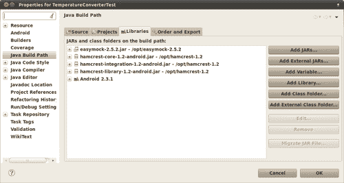

# 第七章。测试秘籍

本章提供了应用前几章中描述的纪律和技术时可能会遇到的不同常见情况的实际示例。这些示例以食谱风格呈现，以便你可以根据项目需求进行调整和使用。

本章将涵盖以下主题：

+   Android 单元测试

+   测试活动和应用程序

+   测试数据库和内容提供者

+   测试本地和远程服务

+   测试用户界面

+   测试异常

+   测试解析器

+   测试内存泄漏

在本章之后，你将有一个参考，可以应用于你的项目，并了解在每种情况下应该做什么。

# Android 单元测试

有一些情况，你确实需要将应用程序的部分在几乎与底层系统没有关联的情况下单独测试。在这种情况下，我们必须选择一个足够高的基类来消除一些依赖，但又不能高到让我们负责一些基本基础设施。

在这种情况下，候选基类可能是 `AndroidTestCase`。这个例子是从 **Android CTS** 测试套件中取出的（[`source.android.com/compatibility/cts-intro.html`](http://source.android.com/compatibility/cts-intro.html)）：

```java
/*
* Copyright (C) 2009 The Android Open Source Project
*
* Licensed under the Apache License, Version 2.0 (the "License");
* you may not use this file except in compliance with the License.
* You may obtain a copy of the License at
*
* http://www.apache.org/licenses/LICENSE-2.0
*
* Unless required by applicable law or agreed to in writing,
* software distributed under the License is distributed on an
* "AS IS" BASIS, WITHOUT WARRANTIES OR CONDITIONS OF ANY KIND,
* either express or implied.
* See the License for the specific language governing permissions
* and limitations under the License.
*/
package com.android.cts.appaccessdata;
import java.io.FileInputStream;
import java.io.FileNotFoundException;
import java.io.IOException;
import android.test.AndroidTestCase;
/**
* Test that another app's private data cannot be accessed.
*
* Assumes that {@link APP_WITH_DATA_PKG} has already created the private data.
*/
public class AccessPrivateDataTest extends AndroidTestCase {
/**
* The Android package name of the application that owns the private data
*/
private static final String APP_WITH_DATA_PKG = "com.android.cts.appwithdata";

```

到目前为止，我们有：

+   标准的 Android 开源项目版权。

+   包定义。这个测试位于 `com.android.cts.appaccessdata`。

+   一些导入。

+   `AccessPrivateDataTest` 的定义，它扩展了 `AndroidTestCase`，因为它是一个不需要系统基础设施的单元测试。在这种情况下，我们也可以直接使用 `TestCase`，因为我们没有访问 Context。

+   常量 `APP_WITH_DATA_PKG` 的定义，表示包含我们试图访问的私有数据的应用程序包名：

    ```java
    /**
    * Name of private file to access. This must match the name * of the file created by
    * {@link APP_WITH_DATA_PKG}.
    */
    private static final String PRIVATE_FILE_NAME = "private_file.txt";
    /**
    * Tests that another app's private file cannot be accessed
    * @throws IOException
    */
    public void testAccessPrivateData() throws IOException {
    try {
    // construct the absolute file path to the app's private file
    String privateFilePath = String.format( "/data/data/%s/%s", APP_WITH_DATA_PKG, PRIVATE_FILE_NAME);
    FileInputStream inputStream = new FileInputStream(privateFilePath);
    inputStream.read();
    inputStream.close();
    fail("Was able to access another app's private data");
    } catch (FileNotFoundException e) {
    // expected
    } catch (SecurityException e) {
    // also valid
    }
    }
    }

    ```

在本节的第二部分，我们有：

+   `PRIVATE_FILE_NAME` 的定义，包含我们将尝试访问的文件名

+   测试方法 `testAccessPrivateData`，它实际上测试了功能

这个测试方法 `testAccessPrivateData()` 测试对其他包的私有数据的访问，如果这是可能的，则测试失败。为了实现这一点，捕获了预期的异常，如果没有发生，则使用自定义消息调用 `fail()`。

# 测试活动和应用程序

本节展示了活动和应用程序测试的一些示例。它们涵盖了你在日常测试中可能会遇到的一些常见情况，你可以根据具体需求对这些示例进行调整。

## 应用程序和首选项

在 Android 术语中，应用指的是在需要维护全局应用状态时使用的一个基类。这通常用于处理共享首选项。我们期望测试改变这些首选项值的操作不会影响真实应用的行为。想象一下测试删除存储这些值作为共享首选项的应用的用户账户信息。这听起来不是一个好主意。所以，我们真正需要的是能够模拟一个`Context`，它也能模拟对`SharedPreferences`的访问。

我们的第一种尝试可能是使用`RenamingDelegatingContext`，但不幸的是，它并不模拟`SharedPreferences`，尽管它很接近，因为它模拟了数据库和文件系统访问。所以，首先我们需要创建一个专门的模拟`Context`，它也能模拟后者。

### `RenamingMockContext`类

让我们创建一个专门的`Context`。`RenamingDelegatingContext`类是一个很好的起点，因为我们之前提到，数据库和文件系统访问将被模拟。问题是如何模拟`SharedPreferences`的访问。

记住，正如其名称所暗示的，`RenamingDelegatingContext`将一切委托给一个`Context`。所以，我们问题的根源在于这个`Context`。因为它也是一个模拟的`Context`，所以`MockContext`似乎是一个正确的基类。如您所记得，在第三章中，我们探讨了模拟对象，并指出`MockContext`只能用于注入其他依赖项，并且所有方法都是非功能的，会抛出`UnsupportedOperationException`。然而，这也是我们可以利用的一个特性，以检测在这种情况下需要实现的最小方法集。所以，让我们开始创建一个空的`MockContext`，它将委托给其他`Context`，我们可以将其命名为`RenamingMockContext`：

```java
private static class RenamingMockContext extends RenamingDelegatingContext {
private static final String PREFIX = "test.";
public RenamingMockContext(Context context) {
super(new DelegatedMockContext(context), PREFIX);
}
private static class DelegatedMockContext extends MockContext {
public DelegatedMockContext(Context context) {
// TODO Auto-generated constructor stub
}
}
}

```

我们创建了一个模拟的`Context`，名为`RenamingMockContext`，它委托给另一个空的`MockContext`，即`DelegatedMockContext`，并使用一个重命名前缀。

### `TemperatureConverterApplicationTests`类

我们已经有了`RenamingMockContext`，现在我们需要一个使用它的测试。因为我们将会测试一个应用，所以测试的基类将是`ApplicationTestCase`。这个测试用例提供了一个框架，在其中你可以在一个受控环境中测试应用类。它提供了对应用生命周期的基本支持，以及一些钩子，通过这些钩子你可以注入各种依赖项并控制你的应用被测试的环境。我们可以在创建`Application`之前使用`setContext()`方法注入`RenamingMockContext`。

我们在第四章“测试驱动开发”中开始的`TemperatureConverter`应用程序，将存储小数位数作为共享偏好设置。因此，我们将创建一个测试来设置小数位数，然后检索它以验证其值：

```java
public class TemperatureConverterApplicationTests extends
ApplicationTestCase<TemperatureConverterApplication> {
private TemperatureConverterApplication mApplication;
public TemperatureConverterApplicationTests() {
this("TemperatureConverterApplicationTests");
}
public TemperatureConverterApplicationTests(String name) {
super(TemperatureConverterApplication.class);
setName(name);
}
@Override
protected void setUp() throws Exception {
super.setUp(); final RenamingMockContext mockContext = new RenamingMockContext(getContext());
setContext(mockContext);
createApplication();
mApplication = getApplication();
}
@Override
protected void tearDown() throws Exception {
super.tearDown();
}
public final void testPreconditions() {
assertNotNull(mApplication);
}
public final void testSetDecimalPlaces() {
final int expected = 3;
mApplication.setDecimalPlaces(expected);
assertEquals(expected, mApplication.getDecimalPlaces());
}
}

```

我们使用`TemperatureConverterApplication`模板参数扩展`ApplicationTestCase`。很快，我们将创建一个扩展`Application`的类。

然后，我们使用我们在第三章“Android SDK 的构建块”中讨论的**给定名称构造函数**模式。

在`setUp()`方法中，我们创建模拟上下文并使用`setContext()`方法设置此测试的上下文；我们使用`createApplication()`创建应用程序，并最终持有它的引用，因为它将在我们的测试中频繁使用。

关于我们的测试，使用我们之前审查过的**测试前提条件**模式，我们检查最近创建的应用程序不为空。

最后是测试实际测试所需行为，设置小数位数，检索它，并验证其值。

我们的首要目标是让这些测试编译通过。稍后我们将关注这些测试的成功。为了编译通过，我们需要创建`TemperatureConverterApplication`类以及小数位数的 getter 和 setter，最终应该使用`SharedPreferences`来存储和检索特定的偏好设置：

```java
/**
* Copyright (C) 2010-2011 Diego Torres Milano
*/
package com.example.aatg.tc;
import android.app.Application;
/**
* @author diego
*
*/
public class TemperatureConverterApplication extends
Application {
/**
*
*/
public TemperatureConverterApplication() {
// TODO Auto-generated constructor stub
}
public void setDecimalPlaces(int expected) {
// TODO Auto-generated method stub
}
public Object getDecimalPlaces() {
// TODO Auto-generated method stub
return null;
}
}

```

运行测试时，我们得到一个失败，原因是我们没有在任何地方存储小数位数。我们可以通过以下方式使用`SharedPreferences`来实现这一点：

```java
/**
* Copyright (C) 2010-2011 Diego Torres Milano
*/
package com.example.aatg.tc;
import android.app.Application;
import android.content.SharedPreferences;
import android.content.SharedPreferences.Editor;
import android.preference.PreferenceManager;
/**
* @author diego
*
*/
public class TemperatureConverterApplication extends Application {
private static final String TAG = "TemperatureConverterApplication";
public static final int DECIMAL_PLACES_DEFAULT = 2;
public static final String DECIMAL_PLACES = "decimalPlaces";
private SharedPreferences mSharedPreferences;
/**
*
*/
public TemperatureConverterApplication() {
// TODO Auto-generated constructor stub
}
@Override
public void onCreate() {
super.onCreate();
mSharedPreferences = PreferenceManager.getDefaultSharedPreferences(this);
}
public void setDecimalPlaces(int d) {
final Editor editor = mSharedPreferences.edit();
editor.putString(DECIMAL_PLACES, Integer.toString(d));
editor.commit();
}
public int getDecimalPlaces() {
return Integer.parseInt( mSharedPreferences.getString(DECIMAL_PLACES, Integer.toString(DECIMAL_PLACES_DEFAULT)));
}
}

```

如果我们完成这些步骤，编译并运行测试，我们会发现它们在`MockContext.getPackageName()`中失败，抛出`UnsupportedOperationException`。

我们将`DelegateMockContext`改为覆盖`getPackageName()`，将构造函数中传递的原始上下文委托出去：

```java
private static class RenamingMockContext extends RenamingDelegatingContext {
/**
* The renaming prefix.
*/
private static final String PREFIX = "test.";
public RenamingMockContext(Context context) {
super(new DelegatedMockContext(context), PREFIX);
}
private static class DelegatedMockContext extends MockContext {
private Context mDelegatedContext;
public DelegatedMockContext(Context context) {
mDelegatedContext = context;
} @Override
public String getPackageName() {
return mDelegatedContext.getPackageName();
}
}

```

再次运行测试，这次我们得到了一个不同但多少有些预期的`UnsupportedOperationException`。这个异常是在调用`getSharedPreferences()`时接收到的。因此，下一步是覆盖`DelegatedMockContext`中的这个方法：

```java
@Override
public SharedPreferences getSharedPreferences( String name, int mode) {
return mDelegatedContext.getSharedPreferences( PREFIX + name, mode);
}

```

每次请求`SharedPreference`时，此方法将调用委托上下文，并为名称添加前缀。应用程序使用的原始`SharedPreferences`保持不变。

我们可以通过向`TemperatureConverterApplication`类提供之前提到的这些方法，然后在共享偏好设置中存储一些值，运行测试，并最终验证这个值没有被测试运行所影响来验证这种行为。

## 测试活动

下一个示例展示了如何使用 `ActivityUnitTestCase<Activity>` 基类在完全隔离的情况下测试活动，而不是使用 `ActivityInstrumentationTestCase2<Activity>`。这种方法需要更多的注意力和关注，但也提供了对要测试的 `Activity` 的更大灵活性和控制。这种测试旨在测试一般的 `Activity` 行为，而不是 `Activity` 实例与其他系统组件或 UI 相关的测试：

我们从这个 ApiDemos 示例应用程序中获取这个例子（[`developer.android.com/resources/samples/ApiDemos/index.html`](http://developer.android.com/resources/samples/ApiDemos/index.html)），这个应用程序作为 SDK 伴侣提供。由于这个示例相对较长，所以我们将其拆分为几个代码片段以提高其可读性：

```java
/*
* Copyright (C) 2008 The Android Open Source Project
*
* Licensed under the Apache License, Version 2.0 (the "License");
* you may not use this file except in compliance with the License.
* You may obtain a copy of the License at
*
* http://www.apache.org/licenses/LICENSE-2.0
*
* Unless required by applicable law or agreed to in writing,
* software distributed under the License is distributed on an
* "AS IS" BASIS,
* WITHOUT WARRANTIES OR CONDITIONS OF ANY KIND, either express or
* implied.
* See the License for the specific language governing permissions
* and limitations under the License.
*/
package com.example.android.apis.app;
import com.example.android.apis.R;
import com.example.android.apis.view.Focus2ActivityTest;
import android.content.Context;
import android.content.Intent;
import android.test.ActivityUnitTestCase;
import android.test.suitebuilder.annotation.MediumTest;
import android.widget.Button;

```

这个第一个代码片段除了必要的版权声明和导入之外，没有其他内容：

```java
/**
* This demonstrates completely isolated "unit test" of an Activity
* class.
*
* <p>This model for testing creates the entire Activity (
* like {@link Focus2ActivityTest}) but does
* not attach it to the system (for example, it cannot launch another
* Activity).
* It allows you to inject additional behaviors via the
* {@link android.test.ActivityUnitTestCase#setActivityContext(
* Context)} and
* {@link android.test.ActivityUnitTestCase#setApplication(
* android.app.Application)} methods.
* It also allows you to more carefully test your Activity's
* performance
* Writing unit tests in this manner requires more care and
* attention, but allows you to test
* very specific behaviors, and can also be an easier way
* to test error conditions.
*
* <p>Because ActivityUnitTestCase creates the Activity
* under test completely outside of
* the usual system, tests of layout and point-click UI
* interaction are much less useful
* in this configuration. It's more useful here to concentrate
* on tests that involve the
* underlying data model, internal business logic, or exercising
* your Activity's life cycle.
*
* <p>See {@link com.example.android.apis.AllTests} for
* documentation on running
* all tests and individual tests in this application.
*/
public class ForwardingTest extends ActivityUnitTestCase<Forwarding> {
private Intent mStartIntent;
private Button mButton;
public ForwardingTest() {
super(Forwarding.class);
}

```

第二个代码片段包括测试用例定义，它扩展了 `ActivityUnitTestCase<Forwarding>`，正如我们之前提到的，这是一个 Activity 类的单元测试。要测试的活动将从系统中断开连接，因此它仅用于测试其内部方面，而不是与其他组件的交互：

正如我们在之前的示例中提到的，这里也定义了无参构造函数：

```java
@Override
protected void setUp() throws Exception {
super.setUp();
// In setUp, you can create any shared test data, // or set up mock components to inject
// into your Activity. But do not call startActivity() // until the actual test methods.
// into your Activity. But do not call startActivity() // until the actual test methods.
mStartIntent = new Intent(Intent.ACTION_MAIN);
}

```

这个 `setUp()` 方法遵循调用超类方法并使用启动 Activity 的 Intent 初始化字段的模式。在这种情况下，我们将 `Intent` 保存为成员 `mStartIntent`：

```java
/**
* The name 'test preconditions' is a convention to
* signal that if this
* test doesn't pass, the test case was not set up
* properly and it might
* explain any and all failures in other tests.
* This is not guaranteed
* to run before other tests, as junit uses reflection
* to find the tests.
*/
@MediumTest
public void testPreconditions() {
startActivity(mStartIntent, null, null);
mButton = (Button) getActivity().findViewById(R.id.go);
assertNotNull(getActivity());
assertNotNull(mButton);
}

```

这定义了 `testPreconditions()` 方法，我们之前也解释过。正如方法注释中提到的，请记住这个名称只是一个约定，没有保证执行顺序：

```java
/**
* This test demonstrates examining the way that activity calls
* startActivity() to launch
* other activities.
*/
@MediumTest
public void testSubLaunch() {
Forwarding activity = startActivity( mStartIntent, null, null);
mButton = (Button) activity.findViewById(R.id.go);
// This test confirms that when you click the button, // the activity attempts to open
// another activity (by calling startActivity) and // close itself (by calling finish()).
mButton.performClick();
assertNotNull(getStartedActivityIntent());
assertTrue(isFinishCalled());
}

```

这个测试在 Forwarding Activity 的“go”按钮上执行点击操作。该按钮的 `onClickListener` 调用 `startActivity()` 并使用一个定义组件为 `ForwardTarget` 类的 `Intent`，因此这就是将被启动的 `Activity`：

执行这个动作后，我们验证用于启动新 `Activity` 的 `Intent` 不为 null，并且在我们的 `Activity` 上调用了 `finish()`：

一旦使用 `startActivity(mStartIntent, null, null)` 启动了要测试的活动，就会验证组件以确保它们符合预期。为了做到这一点，使用 `getActivity()` 的断言来验证最近启动的活动不为“null”，然后也验证通过 `findViewById()` 获取的按钮是否为“null”值：

```java
/**
* This test demonstrates ways to exercise the Activity's
* life cycle.
*/
@MediumTest
public void testLifeCycleCreate() {
Forwarding activity = startActivity( mStartIntent, null, null);
// At this point, onCreate() has been called, but nothing else
// Complete the startup of the activity
getInstrumentation().callActivityOnStart(activity);
getInstrumentation().callActivityOnResume(activity);
// At this point you could test for various configuration // aspects, or you could
// use a Mock Context to confirm that your activity has made // certain calls to the system
// and set itself up properly.
getInstrumentation().callActivityOnPause(activity);
// At this point you could confirm that the activity has // paused properly, as if it is
// no longer the topmost activity on screen.
getInstrumentation().callActivityOnStop(activity);
// At this point, you could confirm that the activity has // shut itself down appropriately,
// or you could use a Mock Context to confirm that your // activity has released any system
// resources it should no longer be holding.
// ActivityUnitTestCase.tearDown(), which is always // automatically called, will take care
// of calling onDestroy().
}
}

```

这可能是这个测试用例中最有趣的测试方法。这个测试用例演示了如何测试 `Activity` 生命周期。在启动 `Activity` 后，自动调用了 `onCreate()`，然后我们通过手动调用它们来测试其他生命周期方法。为了能够调用这些方法，我们使用这个测试的 `Intrumentation`。

最后，我们不需要手动调用 `onDestroy()`，因为它将在 `tearDown()` 中为我们调用：

接下来，我们有`testSubLaunch()`测试。这个测试在通过`startActivity(mStartIntent, null, null)`启动测试中的`Activity`后检查各种条件。使用`findViewById()`获取`Button`，然后通过`performClick()`来按下它。当这个按钮被触摸时，它的动作是启动一个新的`Activity`，这正是需要检查的条件，断言`getStartedActivityIntent()`返回"not null"。后者方法返回如果测试中的`Activity`调用了`startActivity(Intent)`或`startActivityForResult(Intent, int)`，则使用的 Intent。最后一步是验证如果启动了其他`Activity`，则调用了`finish()`，我们通过验证`isFinishCalled()`的返回值来完成这一点，如果测试中的`Activity`中调用了 finish 方法（`finish()`、`finishFromChild(Activity)`或`finishActivity(int)`），则返回 true。

现在是时候测试`Activity`的生命周期了，这可以通过`testLifeCycleCreate()`方法来实现。该方法以与之前分析过的测试相同的方式启动`Activity`。

之后，活动启动，其`onCreate()`方法被调用，使用`Instrumentation`调用其他生命周期方法，如`getInstrumentation().callActivityOnStart(activity)`和`getInstrumentation().callActivityOnResume(activity)`来完成测试中的`Activity`启动。

现在`Activity`已经完全启动，是时候测试我们感兴趣的方面了。一旦实现这一点，我们就可以遵循生命周期中的其他步骤。请注意，这个示例测试在这里没有测试任何特殊的内容。

要完成生命周期，我们将调用`getInstrumentation().callActivityOnPause(activity)`和`getInstrumentation().callActivityOnStop(activity)`。正如方法注释中提到的，我们不必担心调用`onDestroy()`，因为它将由`tearDown()`自动调用。

如果你想运行测试，一旦你将`ApiDemos.apk`及其测试安装到设备或模拟器上，你可以运行以下命令行：

```java
$ adb -e shell am instrument -w -e class com.example.android.apis.app.ForwardingTest com.example.android.apis.tests/android.test.InstrumentationTestRunner

```

输出如下：

**com.example.android.apis.app.ForwardingTest:... 仪器测试运行器的测试结果=... 时间：0.614 OK (3 tests)**

这个测试代表了一个可以重用的骨架，用于单独测试你的`Activities`以及测试与生命周期相关的案例。注入模拟对象也可以方便测试`Activity`的其他方面，例如访问系统资源。

# 测试文件、数据库和 ContentProviders

一些测试用例需要执行数据库或 ContentProviders 的操作，很快就需要对这些操作进行模拟。例如，如果我们正在测试一个真实设备上的应用程序，我们不想干扰这些设备上应用程序的正常运行，尤其是在我们更改可能被多个应用程序共享的值时。

这种情况可以利用另一个模拟类，它不是 `android.test.mock` 包的一部分，而是 `android.test` 包的一部分，即 `RenamingDelegatingContext`。

这个类让我们可以模拟文件和数据库操作。在构造函数中提供的前缀用于修改这些操作的目标。所有其他操作都委托给在构造函数中指定的委托 `Context`。

假设我们的被测试 `Activity` 使用一些我们想要以某种方式控制的文件或数据库，也许是为了引入专门的内容来驱动我们的测试，而我们不想使用或无法使用真实的文件或数据库。在这种情况下，我们创建一个指定前缀的 `RenamingDelegatingContext`。我们使用这个前缀提供模拟文件，并引入我们需要的任何内容来驱动我们的测试，并且被测试的 `Activity` 可以使用它们而无需更改。

保持我们的 `Activity` 不变，即不修改它以从不同的源读取，其优势是这确保了所有测试都是有效的。如果我们只为测试引入更改，我们就无法确保在实际条件下，`Activity` 的行为相同。

为了演示这种情况，我们将创建一个非常简单的 `Activity`。

活动类 `MockContextExampleActivity` 在 `TextView` 中显示文件内容。我们想要展示的是，与测试时相比，它在 `Activity` 的正常操作中如何显示不同的内容：

```java
package com.example.aatg.mockcontextexample;
import android.app.Activity;
import android.graphics.Color;
import android.os.Bundle;
import android.widget.TextView;
import java.io.FileInputStream;
public class MockContextExampleActivity extends Activity {
public final static String FILE_NAME = "myfile.txt";
private TextView mTv;
/** Called when the activity is first created. */
@Override
public void onCreate(Bundle savedInstanceState) {
super.onCreate(savedInstanceState);
setContentView(R.layout.main);
mTv = (TextView) findViewById(R.id.TextView01);
final byte[] buffer = new byte[1024];
try {
final FileInputStream fis = openFileInput(FILE_NAME);
final int n = fis.read(buffer);
mTv.setText(new String(buffer, 0, n-1));
} catch (Exception e) {
mTv.setText(e.toString());
mTv.setTextColor(Color.RED);
}
}
public String getText() {
return mTv.getText().toString();
}
}

```

这是我们简单的 `Activity`。它读取 `myfile.txt` 文件的内容，并在 `TextView` 上显示。它还会显示可能发生的任何错误。

我们需要为这个文件提供一些内容。可能最简单的方法是按照以下方式创建文件：

```java
$ adb shell echo "This is real data" \> \ /data/data/com.example.aatg.mockcontextexample/files/myfile.txt
$ adb shell echo "This is *MOCK* data" \> \ /data/data/com.example.aatg.mockcontextexample/files/test.myfile.txt

```

我们创建了两个不同的文件，一个名为 `myfile.txt`，另一个名为 `test.myfile.txt`，内容不同。后者表示它是一个模拟内容。

以下代码演示了在我们的活动测试中使用此模拟数据：

```java
package com.example.aatg.mockcontextexample.test;
import com.example.aatg.mockcontextexample. MockContextExampleActivity;
import android.content.Intent;
import android.test.ActivityUnitTestCase;
import android.test.RenamingDelegatingContext;
public class MockContextExampleTest extends ActivityUnitTestCase<MockContextExampleActivity> {
private static final String PREFIX = "test.";
private RenamingDelegatingContext mMockContext;
public MockContextExampleTest() {
super(MockContextExampleActivity.class);
}
protected void setUp() throws Exception {
super.setUp();
mMockContext = new RenamingDelegatingContext( getInstrumentation().getTargetContext(), PREFIX);
mMockContext.makeExistingFilesAndDbsAccessible();
}
protected void tearDown() throws Exception {
super.tearDown();
}
public void testSampleTextDisplayed() {
setActivityContext(mMockContext);
startActivity(new Intent(), null, null);
final MockContextExampleActivity activity = getActivity();
assertNotNull(activity);
String text = activity.getText();
assertEquals("This is *MOCK* data", text);
}
}

```

类 `MockContextExampleTest` 扩展了 `ActivityUnitTestCase`，因为我们正在寻找对 `MockContextExampleActivity` 的隔离测试，并且我们打算注入一个模拟上下文；在这种情况下，注入的上下文是一个作为依赖项的 `RenamingDelegatinContext`。

我们的测试设置包括模拟上下文 `mMockContext`，使用通过 `.getInstrumentation().getTargetContext()` 获取的目标上下文创建的 `RenamingDelegatingContext`。请注意，运行测试的上下文与被测试 `Activity` 的上下文不同。

在这里，一个基本步骤紧随其后——因为我们想要使现有的文件和数据库对这次测试可用，我们必须调用 `makeExistingFilesAndDbsAccessible()`。

然后，我们的测试名为 `testSampleTextDisplayed()` 的测试用例使用 `setActivityContext()` 注入模拟上下文。

### 小贴士

在通过 `startActivity()` 启动被测试的 `Activity` 之前，您必须调用 `setActivityContext()` 来注入模拟上下文 **之前**。

然后通过使用刚刚创建的`Intent`调用`startActivity()`来启动`Activity`。

被测试的`Activity`是通过`getActivity()`获取的，并且会验证其值为“非空”。

我们通过为`Activity`添加的 getter 方法来获取`TextView`持有的文本值。

最后，获取到的文本值会与`String`*"This is MOCK* data"*进行比对。在这里需要注意的是，用于此测试的值是测试文件内容，而不是实际文件内容。

## 浏览器提供者测试

这些测试来自 Android 开源项目（AOSP）。源代码可以作为 Browser.git 项目的组成部分获取，项目地址为[`android.git.kernel.org/?p=platform/packages/apps/Browser.git`](http://android.git.kernel.org/?p=platform/packages/apps/Browser.git)。它们旨在测试浏览器书签内容提供者`BrowserProvider`的一些方面，它是 Android 平台标准浏览器的一部分。

```java
/*
* Copyright (C) 2010 The Android Open Source Project
*
* Licensed under the Apache License, Version 2.0 (the "License");
* you may not use this file except in compliance with the License.
* You may obtain a copy of the License at
*
* http://www.apache.org/licenses/LICENSE-2.0
*
* Unless required by applicable law or agreed to in writing,
* software
* distributed under the License is distributed on an "AS IS" BASIS,
* WITHOUT WARRANTIES OR CONDITIONS OF ANY KIND, either express
* or implied.
* See the License for the specific language governing permissions
* and limitations under the License.
*/
package com.android.browser;
import android.app.SearchManager;
import android.content.ContentValues;
import android.database.Cursor;
import android.net.Uri;
import android.test.AndroidTestCase;
import android.test.suitebuilder.annotation.MediumTest;
import java.util.ArrayList;
import java.util.Arrays;

```

这第一个代码片段除了必要的版权声明和导入之外，没有其他内容：

```java
/**
* Unit tests for {@link BrowserProvider}.
*/
@MediumTest
public class BrowserProviderTests extends AndroidTestCase {
private ArrayList<Uri> mDeleteUris;
@Override
protected void setUp() throws Exception {
mDeleteUris = new ArrayList<Uri>();
super.setUp();
}
@Override
protected void tearDown() throws Exception {
for (Uri uri : mDeleteUris) {
deleteUri(uri);
}
super.tearDown();
}

```

第二段代码包括扩展`AndroidTestCase`的测试用例定义。类`BrowserProviderTests`扩展`AndroidTestCase`，因为需要`Context`来访问提供者内容。

在`setUp()`方法中创建的测试环境创建了一个`Uris`的`ArrayList`，用于跟踪在`tearDown()`方法中要删除的已插入`Uris`。也许我们可以通过使用模拟内容提供者来避免所有这些麻烦，保持测试与系统之间的隔离。无论如何，`tearDown()`会遍历这个列表并删除存储的`Uris`。

在这里不需要重写构造函数，因为`AndroidTestCase`不是一个参数化类，我们也不需要在其中做任何特殊处理：

```java
public void testHasDefaultBookmarks() {
Cursor c = getBookmarksSuggest("");
try {
assertTrue("No default bookmarks", c.getCount() > 0);
} finally {
c.close();
}
}
public void testPartialFirstTitleWord() {
assertInsertQuery("http://www.example.com/rasdfe", "nfgjra sdfywe", "nfgj");
}
public void testFullFirstTitleWord() {
assertInsertQuery("http://www.example.com/", "nfgjra dfger", "nfgjra");
}
public void testFullFirstTitleWordPartialSecond() {
assertInsertQuery("http://www.example.com/", "nfgjra dfger", "nfgjra df");
}
public void testFullTitle() {
assertInsertQuery("http://www.example.com/", "nfgjra dfger", "nfgjra dfger");
}

```

下一个测试`testHasDefaultBookmarks()`是针对默认书签的测试。启动时，光标会遍历通过调用`getBookmarksSuggest("")`获得的默认书签，该调用返回未过滤的书签；这就是为什么查询参数是""。

然后，`testPartialFirstTitleWord()`、`testFullFirstTitleWord()`、`testFullFirstTitleWordPartialSecond()`和`testFullTitle()`测试了书签的插入。为了实现这一点，它们使用书签的`Url`、标题和查询调用`assertInsertQuery()`方法。`assertInsertQuery()`方法将书签添加到书签提供者中，插入作为参数提供的`Url`以及指定的标题。返回的`Uri`会被验证，确保它不是 null，并且与默认值不完全相同。最后，`Uri`会被插入到`testDown()`中要删除的`Uri`实例列表中：

```java
// Not implemented in BrowserProvider
// public void testFullSecondTitleWord() {
// assertInsertQuery("http://www.example.com/rasdfe", // "nfgjra sdfywe", "sdfywe");
// }
public void testFullTitleJapanese() {
String title = "\u30ae\u30e3\u30e9\u30ea\u30fc\ u30fcGoogle\u691c\u7d22";
assertInsertQuery("http://www.example.com/sdaga", title, title);
}
public void testPartialTitleJapanese() {
String title = "\u30ae\u30e3\u30e9\u30ea\u30fc\ u30fcGoogle\u691c\u7d22";
String query = "\u30ae\u30e3\u30e9\u30ea\u30fc";
assertInsertQuery("http://www.example.com/sdaga", title, query);
}
// Test for http://b/issue?id=2152749
public void testSoundmarkTitleJapanese() {
String title = "\u30ae\u30e3\u30e9\u30ea\u30fc\ u30fcGoogle\u691c\u7d22";
String query = "\u30ad\u30e3\u30e9\u30ea\u30fc";
assertInsertQuery("http://www.example.com/sdaga", title, query);
}

```

这些测试与之前展示的测试类似，但在这个案例中，它们使用了日语文本标题和查询。建议在不同的条件下测试应用程序的组件，例如在这个案例中使用了不同字符集的其他语言。

我们有几个测试，旨在验证除了英语之外的其他地区和语言的此书签提供者的使用情况。这些特定案例涵盖了书签标题中的日语使用。测试 `testFullTitleJapanese()`、`testPartialTitleJapanese()` 和 `testSoundmarkTitleJapanese()` 是之前引入的测试的日语版本，使用 Unicode 字符：

```java
//
// Utilities
//
private void assertInsertQuery(String url, String title, String query) {
addBookmark(url, title);
assertQueryReturns(url, title, query);
}
private void assertQueryReturns(String url, String title, String query) {
Cursor c = getBookmarksSuggest(query);
try {
assertTrue(title + " not matched by " + query, c.getCount() > 0);
assertTrue("More than one result for " + query, c.getCount() == 1);
while (c.moveToNext()) {
String text1 = getCol(c, SearchManager.SUGGEST_COLUMN_TEXT_1);
assertNotNull(text1);
assertEquals("Bad title", title, text1);
String text2 = getCol(c, SearchManager.SUGGEST_COLUMN_TEXT_2);
assertNotNull(text2);
String data = getCol(c, SearchManager.SUGGEST_COLUMN_INTENT_DATA);
assertNotNull(data);
assertEquals("Bad URL", url, data);
}
} finally {
c.close();
}
}
private Cursor getBookmarksSuggest(String query) {
Uri suggestUri = Uri.parse( "content://browser/bookmarks/search_suggest_query");
String[] selectionArgs = { query };
Cursor c = getContext().getContentResolver().query( suggestUri, null, "url LIKE ?",selectionArgs, null);
assertNotNull(c);
return c;
}
private void addBookmark(String url, String title) {
Uri uri = insertBookmark(url, title);
assertNotNull(uri);
assertFalse( android.provider.Browser.BOOKMARKS_URI.equals(uri));
mDeleteUris.add(uri);
}
private Uri insertBookmark(String url, String title) {
ContentValues values = new ContentValues();
values.put("title", title);
values.put("url", url);
values.put("visits", 0);
values.put("date", 0);
values.put("created", 0);
values.put("bookmark", 1);
return getContext().getContentResolver().insert( android.provider.Browser.BOOKMARKS_URI, values);
}
private void deleteUri(Uri uri) {
int count = getContext().getContentResolver(). delete(uri, null, null);
assertEquals("Failed to delete " + uri, 1, count);
}
private static String getCol(Cursor c, String name) {
int col = c.getColumnIndex(name);
String msg = "Column " + name + " not found, columns: " + Arrays.toString(c.getColumnNames());
assertTrue(msg, col >= 0);
return c.getString(col);
}
}

```

接下来是几个实用方法。这些是在测试中使用的实用工具。我们之前简要地看过 `assertInsertQuery()`，现在让我们也看看其他方法。

在 `addBookmark()` 之后，`assertInsertQuery()` 方法调用 `assertQueryReturns(url, title, query)`，以验证 `getBookmarksSuggest(query)` 返回的 `Cursor` 包含预期的数据。这种期望可以总结为：

+   查询返回的行数大于 0

+   查询返回的行数等于 1

+   返回行中的标题不为空

+   查询返回的标题与方法参数完全相同

+   建议的第二行不为空

+   查询返回的 URL 不为空

+   此 URL 与作为方法参数发布的 URL 完全匹配

这是一个简化的活动图，将帮助我们理解这些方法之间的关系：



这些测试遵循之前描述的基本结构，并在 UML 活动图中表示。首先，调用 `assertInsertQuery()`，它反过来调用 `addBookmark()` 和 `assertQueryReturns()`。然后，调用 `getBookmarksSuggest()`，最后进行断言以验证我们正在测试的条件。这里最突出的是在这些实用方法中对断言的利用，这有助于我们在测试过程中测试条件。

这种策略为我们测试提供了一种有趣的模式。我们需要创建以完成测试的一些实用方法也可以携带它们自己的多个条件的验证，并提高我们的测试质量。

在我们的类中创建断言方法允许我们引入特定领域的测试语言，该语言可以在测试系统的其他部分时重复使用。

# 测试异常

我们之前提到过。在 第一章 中，我们提到应该测试异常和错误值，而不仅仅是测试正面案例。

我们之前也介绍过这个测试，但在这里我们更深入地探讨它：

```java
public final void testExceptionForLessThanAbsoluteZeroF() {
try {
TemperatureConverter.fahrenheitToCelsius( TemperatureConverter.ABSOLUTE_ZERO_F-1);
fail();
}
catch (InvalidTemperatureException ex) {
// do nothing
}
}
public final void testExceptionForLessThanAbsoluteZeroC() {
try {
TemperatureConverter.celsiusToFahrenheit( TemperatureConverter.ABSOLUTE_ZERO_C-1);
fail();
}
catch (InvalidTemperatureException ex) {
// do nothing
}
}

```

每当我们有一个应该抛出异常的方法时，我们应该测试这个条件。最好的方法是调用方法内部的 try-catch 块，捕获预期的 `Exception`，否则失败。在这个特定情况下，我们测试 `InvalidTemperature:`

```java
public void testLifeCycleCreate() {
Forwarding activity = startActivity(mStartIntent, null, null);
// At this point, onCreate() has been called,
// but nothing else
// Complete the startup of the activity
getInstrumentation().callActivityOnStart(activity);
getInstrumentation().callActivityOnResume(activity);
// At this point you could test for various
// configuration aspects, or you could
// use a Mock Context to confirm that your activity has made
// certain calls to the system and set itself up properly.
getInstrumentation().callActivityOnPause(activity);
// At this point you could confirm that the activity has
// paused properly, as if it is
// no longer the topmost activity on screen.
getInstrumentation().callActivityOnStop(activity);
// At this point, you could confirm that the activity
// has shut itself down appropriately,
// or you could use a Mock Context to confirm that your
// activity has released any system
// resources it should no longer be holding.
// ActivityUnitTestCase.tearDown(), which is always
// automatically called, will take care
// of calling onDestroy().
}

```

# 测试本地和远程服务

这个测试也来自 ApiDemos 示例应用程序 ([`developer.android.com/resources/samples/ApiDemos/index.html`](http://developer.android.com/resources/samples/ApiDemos/index.html))。

想法是扩展 `ServiceTestCase<Service>` 类以在受控环境中测试服务：

```java
/*
* Copyright (C) 2008 The Android Open Source Project
*
* Licensed under the Apache License, Version 2.0 (the "License");
* you may not use this file except in compliance with the License.
* You may obtain a copy of the License at
*
* http://www.apache.org/licenses/LICENSE-2.0
*
* Unless required by applicable law or agreed to in writing,
* software
* distributed under the License is distributed on an "AS IS" BASIS,
* WITHOUT WARRANTIES OR CONDITIONS OF ANY KIND, either express or
* implied.
* See the License for the specific language governing permissions
* and limitations under the License.
*/
package com.example.android.apis.app;
import android.app.Notification;
import android.app.NotificationManager;
import android.content.Context;
import android.content.Intent;
import android.os.Handler;
import android.os.IBinder;
import android.test.MoreAsserts;
import android.test.ServiceTestCase;
import android.test.suitebuilder.annotation.MediumTest;
import android.test.suitebuilder.annotation.SmallTest;

```

这个第一个代码片段除了必要的版权声明和导入之外，没有其他内容：

```java
/**
* This is a simple framework for a test of a Service.
* See {@link android.test.ServiceTestCase
* ServiceTestCase} for more information on how to write and
* extend service tests.
*
* To run this test, you can type:
* adb shell am instrument -w \
* -e class com.example.android.apis.app.LocalServiceTest \
* com.example.android.apis.tests/android.test.
* InstrumentationTestRunner
*/
public class LocalServiceTest extends ServiceTestCase<LocalService> {
public LocalServiceTest() {
super(LocalService.class);
}

```

然后，我们像之前一样使用无参数构造函数，使用服务类 `LocalService:` 调用超类构造函数：

```java
@Override
protected void setUp() throws Exception {
super.setUp();
}

```

现在我们正在使用在 `setUp()` 和 `tearDown()` 中调用超类方法的模式。

在这个测试中我们没有设置任何特定的固定装置，所以我们只是调用超类方法：

```java
/**
* The name 'test preconditions' is a convention to signal that
* if this
* test doesn't pass, the test case was not set up properly and
* it might
* explain any and all failures in other tests. This is not
* guaranteed to run before other tests, as junit uses
* reflection to find the tests.
*/
@SmallTest
public void testPreconditions() {
}

```

我们现在有一个空的 `testPreconditions()`。在这里我们不需要测试任何先决条件：

```java
/**
* Test basic startup/shutdown of Service
*/
@SmallTest
public void testStartable() {
Intent startIntent = new Intent();
startIntent.setClass(getContext(), LocalService.class);
startService(startIntent);
}
/**
* Test binding to service
*/
@MediumTest
public void testBindable() {
Intent startIntent = new Intent();
startIntent.setClass(getContext(), LocalService.class);
IBinder service = bindService(startIntent);
}
}

```

构造函数，与其他类似情况一样，调用父构造函数，传递这个服务类作为参数。

接着是一个 `testStartable()` 测试。它被 `SmallTest` 注解标记，以分类这个测试。接下来我们使用我们在这里创建的 Intent 启动服务，将其类设置为正在测试的服务类。我们也为这个 Intent 使用了 instrumented Context。这个类允许进行一些依赖注入，因为每个服务都依赖于它运行的上下文以及与之关联的应用程序。这个框架允许你注入修改过的、模拟的或隔离的替代品来替换这些依赖项，从而执行真正的单元测试。

由于我们只是按原样运行测试，`Service` 将被注入一个完全功能的 `Context` 和一个通用的 `MockApplication` 对象。

然后，我们使用 `startService(startIntent)` 方法启动服务，就像它是由 `Context.startService()` 启动的一样，提供它所提供的参数。如果你使用这个方法来启动服务，它将自动由 `tearDown()` 停止。

另一个测试，`testBindable()`，被分类为 `MediumTest`，将测试服务是否可以被绑定。这个测试使用 `bindService(startIntent)`，以与 `Context.bindService()` 相同的方式启动正在测试的服务，提供它所提供的参数。它返回到服务的通信通道。如果客户端无法绑定到服务，它可能返回 null。最可能的是，这个测试应该通过一个断言如 `assertNotNull(service)` 来检查服务的 null 返回值，以验证服务是否正确绑定，但它没有这样做。确保在编写类似情况的代码时包含这个测试。

返回的 `IBinder` 通常用于一个使用 AIDL 描述的复杂接口。为了测试这个接口，你的服务必须实现一个 `getService()` 方法，正如在 `samples.ApiDemos.app.LocalService` 中的实现所示：

```java
/**
* Class for clients to access. Because we know this service
* always runs in the same process as its clients,
* we don't need to deal with IPC.
*/
public class LocalBinder extends Binder {
LocalService getService() {
return LocalService.this;
}
}

```

# 广泛使用模拟对象

在前面的章节中，我们描述并使用了 Android SDK 中存在的模拟类。虽然这些类可以覆盖大量情况，但这并不是全部，你可能还需要其他模拟对象来完善你的测试用例。

几个库提供了满足我们的模拟需求的基础设施，但我们现在专注于 EasyMock，这可能是 Android 中使用最广泛的。

### 注意

这不是一个 EasyMock 教程。我们只是分析其在 Android 中的应用，所以如果你不熟悉它，我建议你查看其网站上的文档：[`easymock.org/`](http://easymock.org/)。

EasyMock 是一个开源软件项目，在 Apache 2.0 许可下可用，主要提供接口的模拟对象。由于其记录期望的方式和动态生成的模拟对象（因为它们支持重构，并且在重命名方法或更改其签名时测试代码不会中断），它非常适合测试驱动开发。

根据其文档，EasyMock 最相关的优点如下：

+   不需要手动编写模拟对象的类。

+   支持重构安全的模拟对象。当重命名方法或重新排序方法参数时，测试代码在运行时不会中断。

+   支持返回值和异常。

+   支持检查一个或多个模拟对象的方法调用顺序。

为了展示其用法并建立一个可以后来复制的风格，我们正在完成和扩展之前为我们的应用程序产生的测试用例。

在我们之前的`TemperatureConverter`示例中，我们决定扩展`EditText`来创建`EditNumber`，这是一个只接受有符号十进制数字的文本字段。`EditNumber`使用`InputFilter`来提供这个功能。在接下来的测试中，我们将测试这个过滤器以验证是否实现了正确的行为。

为了创建测试，我们将使用`EditNumber`从`EditText`继承的一个属性，这个属性可以添加一个监听器，实际上是一个`TextWatcher`，在`EditText`的文本变化时调用方法。这个`TextWatcher`是测试的协作者，我们本可以将其实现为一个单独的类，但这很麻烦，可能会引入更多错误，因此采取的方法是使用 EasyMock 来避免编写它。

正是这样，我们引入了一个模拟`TextWatcher`来检查文本变化时的方法调用。

### 注意

到本文写作时，Android 支持的 EasyMock 最新版本是 EasyMock 2.5.2。你可能想尝试不同的版本，但很可能会遇到问题。

我们应该做的第一件事是将`easymock-2.5.2.jar`添加到测试项目的属性中。

以下截图显示了如何将 easymock JAR 文件添加到测试项目的**Java 构建路径**中：



为了在我们的测试中使用 EasyMock，我们只需要从 `org.easymockEasyMock` 静态导入其方法，这些方法是 EasyMock 2 的唯一非内部、非弃用的方法：

```java
import static org.easymock.EasyMock.*;

```

使用特定导入而不是使用通配符更可取，但在 Eclipse 中创建静态导入语句并不容易。然而，如果我们组织导入（使用 **源 | 组织导入** 或快捷键 *Shift+Ctrl+O)*，Eclipse 将创建特定的语句。

## 导入库

我们已经将 EasyMock 库添加到项目的 Java 构建路径中。这通常不是问题，但有时重新构建项目会导致我们遇到以下错误，从而避免生成最终的 APK。问题出现在无法创建最终 APK 时，因为存档过程中出现了问题：

**[2010-10-28 01:12:29 - TemperatureConverterTest] 生成最终存档时出错：重复条目：LICENSE**

这取决于项目包含多少库以及它们是什么。

大多数可用的开源库都有类似于 GNU 提出的类似内容，包括 LICENSE、NOTICE、CHANGES、COPYRIGHT、INSTALL 等文件。当我们尝试在同一个项目中包含多个库以最终构建单个 APK 时，我们会发现这个问题。

解决这个问题的方法是重新打包库内容，重命名这些文件；例如，`LICENSE` 可以重命名为 `LICENSE.<library>`。建议将后缀 **android** 添加到重新打包的库中，以跟踪这些更改。

这是您可能需要重命名这些文件的步骤示例：

```java
$ mkdir mylib-1.0
$ (cd mylib-1.0; jar xf /path/to/mylib-1.0.jar)
$ mv mylib-1.0/META-INF/LICENSE mylib-1.0/META-INF/LICENSE.mylib
$ mv mylib-1.0/META-INF/NOTICE mylib-1.0/META-INF/NOTICE.mylib
$ (cd mylib-1.0; jar cf /path/to/mylib-1.0-android.jar .)

```

策略是将常见的文件名移动到以库名称后缀的名称中，以提供一些唯一性。

## 测试 `testTextChanged`

这个测试将测试 `EditNumber` 的行为，检查对 `TextWatcher` 模拟的方法调用并验证结果。

我们使用 `AndroidTestCase`，因为我们对在与其他组件或 `Activities` 分离的情况下测试 `EditNumber` 感兴趣。

这个测试定义了两个 `String` 数组：`sai` 和 `sar`。`sai` 代表 `String` 数组输入，`sar` 代表 `String` 数组结果。正如你可能已经猜到的，`sai` 包含输入，而 `sar` 包含在应用过滤器后输入中相应元素的预期结果。

在现实生活中，你应该为测试中使用的变量选择更具描述性的名称，就像你应该对你的代码做的那样，但在这里我们受限于空间，因此选择了非常短的名字。`saInput` 和 `saResult` 会是不错的选择：

```java
/**
* Test method for {@link com.example.aatg.tc.EditNumber}.
* Several input strings are set and compared against the
* expected results after filters are applied.
* This test use {@link EasyMock}
*/
public final void testTextChanged() {
final String[] sai = new String[] {
null, "", "1", "123", "-123", "0", "1.2", "-1.2", "1-2-3", "+1", "1.2.3" };
final String[] sar = new String[] {
"", "", "1", "123", "-123", "0", "1.2", "-1.2", "123", "1", "12.3" };
// mock
final TextWatcher watcher = createMock(TextWatcher.class);
mEditNumber.addTextChangedListener(watcher);
for (int i=1; i < sai.length; i++) {
// record
watcher.beforeTextChanged(stringCmp(sar[i-1]), eq(0),
eq(sar[i-1].length()), eq(sar[i].length()));
watcher.onTextChanged(stringCmp(sar[i]), eq(0),
eq(sar[i-1].length()), eq(sar[i].length()));
watcher.afterTextChanged(stringCmp(
Editable.Factory.getInstance().newEditable(sar[i])));
// replay
replay(watcher);
// exercise
mEditNumber.setText(sai[i]);
// test
final String actual = mEditNumber.getText().toString();
assertEquals(sai[i] + " => " + sar[i] + " => " + actual, sar[i], actual);
// verify
verify(watcher);
// reset
reset(watcher);
}
}

```

我们开始创建 `sai` 和 `sar`。正如我们之前解释的，它们是包含输入和预期结果的两个 `String` 数组。

然后，我们使用 `createMock(TextWatcher.class)` 创建一个模拟 `TextWatcher` 并将其分配给在测试用例中创建的 `EditNumber`。

我们创建一个循环来遍历 `sai` 数组的每个元素。

接下来，我们采取通常需要的七个步骤来使用模拟对象：

1.  使用 `createMock(), createNiceMock(),` 或 `createStrictMock()` 创建模拟。

1.  记录预期的行为；所有调用的方法都将被记录。

1.  重放，将对象的状态从记录变为播放，当它真正表现得像模拟对象时。

1.  练习方法，通常是通过调用被测试类的方

1.  使用断言测试已执行方法的输出结果。对于简单情况，这一步是可选的。

1.  验证指定的行为是否确实被执行。如果不是这种情况，我们将收到一个异常。

1.  重置可以用来重用模拟对象，清除其状态。

在记录步骤中，我们声明所有预期在模拟对象上调用及其参数的方法。我们使用比较器来处理参数。

我们将使用一个特殊的 `Comparator, stringCmp()`，因为我们感兴趣的是比较 Android 中不同类使用的 `String` 内容，例如 `Editable, CharSequence, String` 等。

另一个比较器 `eq()` 期望一个等于给定值的 `int`。后者由 EasyMock 为所有原始类型和 `Object` 提供，但我们需要实现 `stringCmp()`，因为它支持一些 Android 特定的用法。

EasyMock 有一个预定义的匹配器，可以帮助我们创建比较器：

```java
public static <T> T cmp(T value, Comparator<? super T> comparator, LogicalOperator operator)

```

`cmp` 比较器方法期望一个参数，该参数将使用提供的比较器通过运算符进行比较。将要进行的比较是 `comparator.compare(actual, value) operator 0`，其中运算符可以是 EasyMock 的 `LogicalOperator enum` 中的逻辑运算符值之一，代表 <,<=,>,>= 或 ==。

如您可能已经意识到，在测试中频繁使用可能会非常复杂，并可能导致错误，因此为了简化此过程，我们将使用一个我们称之为 `StringComparator:` 的辅助类。

```java
public static final class StringComparator<T> implements Comparator<T> {
/* (non-Javadoc)
* @see java.util.Comparator#compare( java.lang.Object, java.lang.Object)
*
* Return the {@link String} comparison of the arguments.
*/
@Override
public int compare(T object1, T object2) {
return object1.toString().compareTo(object2.toString());
}
}

```

这个类实现了 `Comparator<T>` 接口，该接口有一个名为 `compare` 的抽象方法。我们通过在将传递给参数的对象转换为字符串后返回比较结果来实现此方法。记住，应用于 String 的 `compareTo(String string)` 比较是将作为参数指定的字符串与使用字符的 Unicode 值进行比较的字符串。它的返回值是：

+   如果字符串包含相同的字符且顺序相同，则为 0（零）

+   如果这个字符串中第一个不相同的字符的 Unicode 值小于指定字符串中相同位置的字符的 Unicode 值，或者如果这个字符串是指定字符串的前缀，则为负整数

+   如果这个字符串中第一个不相同的字符的 Unicode 值大于指定字符串中相同位置的字符的 Unicode 值，或者如果指定字符串是这个字符串的前缀，则是一个正整数

我们可以直接使用这个比较器调用 `EasyMock.cmp()`，但为了进一步简化事情，我们将创建一个通用的静态方法 `stringCmp:`。

```java
/**
* Return {@link EasyMock.cmp} using a {@link StringComparator} and
* {@link LogicalOperator.EQUAL}
*
* @param <T> The original class of the arguments
* @param o The argument to the comparison
* @return {@link EasyMock.cmp}
*/
public static <T> T stringCmp(T o) {
return cmp(o, new StringComparator<T>(), LogicalOperator.EQUAL);
}

```

此方法将使用特定类型的正确比较器和 `EQUAL` 作为操作符调用 `EasyMock.cmp()`。

那就是为什么在我们的测试中我们可以简单地使用：

```java
watcher.beforeTextChanged(stringCmp(sar[i-1]), …

```

## 介绍 Hamcrest

虽然前一种方法有效，但更通用的方法是将 **hamcrest** 引入，这是一个匹配器对象库（也称为约束或谓词），允许声明性地定义 *匹配* 规则，以便在其他框架中使用。Hamcrest 还为 EasyMock 2 提供适配器。

我们将重新审视之前介绍 hamcrest 用于匹配器的示例。

为了能够使用 hamcrest，我们需要将其包含到 **Java 构建路径** 中。

### 注意

在此示例中，我们使用 hamcrest-1.2，这是最新版本。我们使用单个组件和之前描述的方法，而不是使用 `hamcrest-1.2-all.jar`，以避免多个 `LICENSE.txt` 文件冲突。

从 [`code.google.com/p/hamcrest.`](http://code.google.com/p/hamcrest.) 下载 hamcrest 库

你需要包含以下 JAR 文件：

+   `hamcrest-core`

+   `hamcrest-library`

+   `hamcrest-integration`

以下截图显示了添加 hamcrest 库后的新项目属性：



### Hamcrest 匹配器

Hamcrest 随带一组有用的匹配器。以下是一些最重要的匹配器：

+   **Core**

    +   **anything:** 总是匹配；如果你不关心被测试的对象是什么，则很有用

    +   **describedAs:** 添加自定义失败描述的装饰器

    +   **is:** 提高可读性的装饰器

+   **Logical**

    +   **allOf:** 如果所有匹配器匹配，则匹配，短路（类似于 Java &&）

    +   **anyOf:** 如果任何匹配器匹配，则匹配，短路（类似于 Java ||）

    +   **not:** 如果包装的匹配器不匹配，则匹配，反之亦然

+   **对象**

    +   **equalTo:** 使用 `Object.equals` 测试对象相等性

    +   **hasToString:** 测试 `Object.toString`

    +   **instanceOf, isCompatibleType:** 测试类型

    +   **notNullValue, nullValue:** 测试空值

    +   **sameInstance:** 测试对象身份

+   **Beans**

    +   **hasProperty:** 测试 JavaBeans 属性

+   **Collections**

    +   **数组:** 测试数组元素与匹配器数组的匹配

    +   **hasEntry, hasKey, hasValue:** 测试包含条目、键或值的映射

    +   **hasItem, hasItems:** 测试包含元素的集合

    +   **hasItemInArray:** 测试包含元素的数组

+   **数字**

    +   **closeTo:** 测试浮点值接近给定值

    +   **greaterThan, greaterThanOrEqualTo, lessThan, lessThanOrEqualTo:** 测试排序

+   **Text**

    +   **equalToIgnoringCase:** 测试字符串忽略大小写的相等性

    +   **equalToIgnoringWhiteSpace:** 测试忽略空白字符差异的字符串相等性

    +   **containsString, endsWith, startsWith:** 测试字符串匹配

### `hasToString` 匹配器

我们的下一步是创建匹配器以替换之前使用的 `stringCmp()` 比较器。`EasyMock2Adapter` 是 hamcrest 提供的适配器类：

```java
import org.hamcrest.integration.EasyMock2Adapter;
import org.hamcrest.object.HasToString;
/**
* Create an {@link EasyMock2Adapter} using a
* {@link HasToString.hasToString}
*
* @param <T> The original class of the arguments
* @param o The argument to the comparison
* @return o
*/
public static <T> T hasToString(T o) {
EasyMock2Adapter.adapt(
HasToString.hasToString(o.toString()));
return o;
}

```

在实现了这个匹配器之后，接下来的步骤仍然是必要的。我们需要将`testTextChanged()`方法修改为包含这个新创建的匹配器，而不是`stringCmp():`

```java
// record
watcher.beforeTextChanged(hasToString(sar[i-1]), eq(0),
eq(sar[i-1].length()), eq(sar[i].length()));
watcher.onTextChanged(hasToString(sar[i]), eq(0),
eq(sar[i-1].length()), eq(sar[i].length()));
watcher.afterTextChanged(hasToString(
Editable.Factory.getInstance().newEditable(sar[i])));

```

# 隔离测试视图

我们在这里分析的测试也属于 ApiDemos 项目。它展示了当行为本身无法隔离时，如何测试符合`Layout`的`Views`的一些属性。测试焦点就是这种情况之一。

为了避免创建完整的`Activity`，这个测试扩展了`AndroidTestCase:`

```java
/*
* Copyright (C) 2008 The Android Open Source Project
*
* Licensed under the Apache License, Version 2.0 (the "License");
* you may not use this file except in compliance with the License.
* You may obtain a copy of the License at
*
* http://www.apache.org/licenses/LICENSE-2.0
*
* Unless required by applicable law or agreed to in writing,
* software distributed under the License is distributed on an
* "AS IS" BASIS, WITHOUT WARRANTIES OR CONDITIONS OF ANY KIND,
* either express or implied.
* See the License for the specific language governing permissions
* and limitations under the License.
*/
package com.example.android.apis.view;
import com.example.android.apis.R;
import android.content.Context;
import android.test.AndroidTestCase;
import android.test.suitebuilder.annotation.SmallTest;
import android.view.FocusFinder;
import android.view.LayoutInflater;
import android.view.View;
import android.view.ViewGroup;
import android.widget.Button;

```

正如前例中一样，我们首先开始于所需的版权和导入：

```java
/**
* This exercises the same logic as {@link Focus2ActivityTest} but in
* a lighter weight manner; it doesn't need to launch the activity,
* and it can test the focus behavior by calling {@link FocusFinder}
* methods directly.
*
* {@link Focus2ActivityTest} is still useful to verify that, at an
* end to end level, key events actually translate to focus
* transitioning in the way we expect.
* A good complementary way to use both types of tests might be to
* have more exhaustive coverage in the lighter weight test case,
* and a few end to end scenarios in the functional {@link
* android.test.ActivityInstrumentationTestCase}.
* This would provide reasonable assurance that the end to end
* system is working, while avoiding the overhead of
* having every corner case exercised in the slower,
* heavier weight way.
*
* Even as a lighter weight test, this test still needs access to a
* {@link Context} to inflate the file, which is why it extends
* {@link AndroidTestCase}.
*
* If you ever need a context to do your work in tests, you can
* extend {@link AndroidTestCase}, and when run via an {@link
* android.test.InstrumentationTestRunner},
* the context will be injected for you.
*
* See {@link com.example.android.apis.app.ForwardingTest} for
* an example of an Activity unit test.
*
* See {@link com.example.android.apis.AllTests} for
* documentation on running
* all tests and individual tests in this application.
*/
public class Focus2AndroidTest extends AndroidTestCase {

```

正如我们之前提到的，这个测试扩展了`AndroidTestCase`，以便在可能的情况下提供一个轻量级的替代方案`ActivityInstrumentationTestCase<Activity>`。

你可能考虑过只使用`TestCase`，但不幸的是，这是不可能的，因为我们需要一个`Context`来通过`LayoutInflater`展开 XML 布局，而`AndroidTestCase`将为我们提供这个组件：

```java
private FocusFinder mFocusFinder;
private ViewGroup mRoot;
private Button mLeftButton;
private Button mCenterButton;
private Button mRightButton;
@Override
protected void setUp() throws Exception {
super.setUp();
mFocusFinder = FocusFinder.getInstance();
// inflate the layout
final Context context = getContext();
final LayoutInflater inflater = LayoutInflater.from(context);
mRoot = (ViewGroup) inflater.inflate(R.layout.focus_2, null);
// manually measure it, and lay it out
mRoot.measure(500, 500);
mRoot.layout(0, 0, 500, 500);
mLeftButton = (Button) mRoot.findViewById(R.id.leftButton);
mCenterButton = (Button) mRoot.findViewById(R.id.centerButton);
mRightButton = (Button) mRoot.findViewById( R.id.rightButton);
}

```

固定装置的设置如下：

1.  `FocusFinder`是一个提供查找下一个可聚焦`View`所使用的算法的类。它实现了单例模式，这就是为什么我们使用`FocusFinder.getInstance()`来获取其引用。这个类有几个方法可以帮助我们在给定各种条件下找到可聚焦和可触摸的项目，如我们之前提到的，给定方向上的最近项或从特定矩形中进行搜索。

1.  然后，我们获取`LayoutInflater`并展开测试中的布局。

1.  我们需要考虑的一件事是，由于我们的测试与其他系统部分是隔离的，我们必须手动测量和布局组件。

1.  然后，我们使用*查找视图*模式，并将找到的视图分配给字段：

    ```java
    /**
    * The name 'test preconditions' is a convention to signal
    * that if this test doesn't pass, the test case was not
    * set up properly and it might explain any and all failures
    * in other tests. This is not guaranteed to run before
    * other tests, as junit uses reflection to find the tests.
    */
    @SmallTest
    public void testPreconditions() {
    assertNotNull(mLeftButton);
    assertTrue("center button should be right of left button",
    mLeftButton.getRight() < mCenterButton.getLeft());
    assertTrue("right button should be right of center button",
    mCenterButton.getRight() < mRightButton.getLeft());
    }

    ```

一旦配置了固定装置，我们就在测试中描述预条件，正如我们之前提到的，该测试被命名为`testPreConditions()`。然而，由于测试是通过反射发现的，因此无法保证它将以特定的顺序运行，因为所有测试方法都是通过检查其名称是否以“test”开头来查找的。

这些预条件包括对组件在屏幕上的相对位置的验证。在这种情况下，它们相对于父组件的边缘被使用。

在前一章中，我们列举了我们武器库中所有可用的断言，你可能还记得，为了测试`Views`的位置，我们在`ViewAsserts`类中有一个完整的断言集。然而，这取决于布局是如何定义的：

```java
@SmallTest
public void testGoingRightFromLeftButtonJumpsOverCenterToRight() {
assertEquals("right should be next focus from left", mRightButton, mFocusFinder.findNextFocus( mRoot, mLeftButton, View.FOCUS_RIGHT));
}
@SmallTest
public void testGoingLeftFromRightButtonGoesToCenter() {
assertEquals("center should be next focus from right", mCenterButton, mFocusFinder.findNextFocus( mRoot, mRightButton, View.FOCUS_LEFT));
}
}

```

`testGoingRightFromLeftButtonJumpsOverCenterToRight()`方法，正如其名称所暗示的，测试当焦点从右侧移动到左侧按钮时，右侧按钮获得的焦点。为了实现这个搜索，我们在`setUp()`方法期间获得的`FocusFinder`实例被使用。这个类有一个`findNextFocus()`方法来获取在给定方向上接收焦点的 View。获取的值与我们的期望值进行核对。

以类似的方式，测试`testGoingLeftFromRightButtonGoesToCenter()`测试了焦点向相反方向移动。

# 测试解析器

在许多情况下，你的 Android 应用程序依赖于从网络服务获取的外部 XML、JSON 消息或文档。这些文档用于本地应用程序和服务器之间的数据交换。有许多用例，其中 XML 或 JSON 文档从服务器获取或由本地应用程序生成，以发送到服务器。理想情况下，由这些活动调用的方法必须独立测试，以实现真正的单元测试，为此，我们需要在我们的 APK 中包含一些模拟文件以运行测试。

但问题是我们在哪里可以包含这些文件？

让我们来探究一下。

## Android 资产

首先，可以在 Android SDK 文档中找到对资产定义的简要回顾：

> “资源”和“资产”在表面上没有太大的区别，但一般来说，你更频繁地使用资源来存储外部内容，而不是使用资产。真正的区别在于，放置在资源目录中的任何内容都将通过 Android 编译的 R 类轻松访问，而放置在资产目录中的任何内容将保持其原始文件格式，为了读取它，你必须使用 AssetManager 以字节流的形式读取文件。因此，将文件和数据保存在资源（res/）中使它们易于访问。

显然，资产是我们需要存储将要解析以测试解析器的文件。

因此，我们的 XML 或 JSON 文件应该放置在资产文件夹中，以防止编译时的操作，并在应用程序或测试运行时能够访问它们的原始内容。

但请注意；我们需要将它们放置在我们的**测试项目**的资产文件夹中，因为它们不是应用程序的一部分，我们不希望它们被打包进去。

## 解析活动

这是一个极其简单的活动，用于演示这种情况。我们的活动从服务器获取 XML 或 JSON 文档，然后对其进行解析。假设我们有一个`parseXml`方法：

```java
package com.example.aatg.parserexample;
import org.xmlpull.v1.XmlPullParser;
import org.xmlpull.v1.XmlPullParserFactory;
import android.app.Activity;
import android.os.Bundle;
import java.io.InputStream;
import java.io.InputStreamReader;
public class ParserExampleActivity extends Activity {
/** Called when the activity is first created. */
@Override
public void onCreate(Bundle savedInstanceState) {
super.onCreate(savedInstanceState);
setContentView(R.layout.main);
}
public String parseXml(InputStream xml) {
try {
XmlPullParserFactory factory = XmlPullParserFactory.newInstance();
factory.setNamespaceAware(true);
XmlPullParser parser = factory.newPullParser();
parser.setInput(new InputStreamReader(xml));
int eventType = parser.getEventType();
StringBuilder sb = new StringBuilder();
while (eventType != XmlPullParser.END_DOCUMENT) {
if(eventType == XmlPullParser.TEXT) {
sb.append(parser.getText());
}
eventType = parser.next();
}
return sb.toString();
}
catch (Exception e) {
// TODO Auto-generated catch block
e.printStackTrace();
}
return null;
}
}

```

这是一个包含解析方法的活动示例，用于说明资产的使用。你的实际应用程序可能看起来非常不同，你的解析器可以作为一个外部类实现，可以在稍后阶段独立测试和集成。

## 解析器测试

此测试实现了`ParserExampleActivity`类的`ActivityInstrumentationTestCase2`：

```java
package com.example.aatg.parserexample.test;
import com.example.aatg.parserexample.ParserExampleActivity;
import android.test.ActivityInstrumentationTestCase2;
import java.io.IOException;
import java.io.InputStream;
public class ParserExampleActivityTest extends ActivityInstrumentationTestCase2<ParserExampleActivity> {
public ParserExampleActivityTest() {
super(ParserExampleActivity.class);
}
protected void setUp() throws Exception {
super.setUp();
}
protected void tearDown() throws Exception {
super.tearDown();
}
public final void testParseXml() {
ParserExampleActivity activity = getActivity();
String result = null;
try {
InputStream myxml = getInstrumentation().getContext(). getAssets().open("my_document.xml");
result = activity.parseXml(myxml);
} catch (IOException e) {
fail(e.getLocalizedMessage());
}
assertNotNull(result);
}
}

```

几乎所有的方法都是默认方法的简单实现，对我们来说唯一有趣的方法是`testParseXml()`。首先，通过调用`getActivity()`获取活动。然后通过`getInstrumentation().getContext().getAssets()`从资产中打开文件`my_document.xml`以获取`InputStream`。请注意，这里的`Context`以及获取到的资产来自测试包，而不是被测试的`Activity`。

接下来，使用最近获得的`InputStream`调用活动`parseXml()`方法。如果发生`Exception`，则调用`fail()`，如果一切顺利，我们测试结果不为 null。

我们应该将用于测试的 XML 文件命名为`my_document.xml`。

内容可能如下：

```java
<?xml version="1.0" encoding="UTF-8"?>
<!-- place this file in assets/my_document.xml -->
<my>This is my document</my>

```

# 测试内存泄漏

有时，内存消耗是衡量测试目标良好行为的一个重要因素，无论是 Activity、Service、ContentProvider 还是其他组件。

为了测试此条件，我们可以使用一个实用测试，您可以在运行测试循环后从其他测试中调用它：

```java
public final void assertNotInLowMemoryCondition() {
//Verification: check if it is in low memory
ActivityManager.MemoryInfo mi = new ActivityManager.MemoryInfo();
((ActivityManager)getActivity().getSystemService( Context.ACTIVITY_SERVICE)).getMemoryInfo(mi);
assertFalse("Low memory condition", mi.lowMemory);
}

```

此断言可以从其他测试中调用。开始时，它使用`getMemoryInfo()`从`ActivityManager`获取`MemoryInfo`，在通过`getSystemService()`获取实例后。如果系统认为当前处于低内存状态，则将`lowMemory`字段设置为 true。

在某些情况下，我们希望更深入地了解资源使用情况，我们可以从进程表中获取更详细的信息。

我们可以创建另一个辅助方法来获取进程信息，并在我们的测试中使用它：

```java
public final String captureProcessInfo() {
String cmd = "ps";
String memoryUsage = null;
int ch; // the character read
try {
Process p = Runtime.getRuntime().exec(cmd);
InputStream in = p.getInputStream();
StringBuffer sb = new StringBuffer(512);
while ((ch = in.read()) != -1) {
sb.append((char) ch);
}
memoryUsage = sb.toString();
} catch (IOException e) {
fail(e.getLocalizedMessage());
}
return memoryUsage;
}

```

为了获取这些信息，执行一个命令（在这种情况下，使用`ps`，但您可以根据需要对其进行调整）并使用`Runtime.exec()`。该命令的输出被连接到一个`String`中，稍后返回。我们可以使用返回值将其打印到测试中的日志，或者我们可以进一步处理内容以获取摘要信息。

这是一个记录输出的示例：

```java
Log.d(TAG, captureProcessInfo());

```

当运行此测试时，我们获得有关正在运行的进程的信息：

**11-12 21:10:29.182: DEBUG/ActivityTest(1811): USER PID PPID VSIZE RSS WCHAN PC NAME**

**11-12 21:10:29.182: DEBUG/ActivityTest(1811): root 1 0 312 220 c009b74c 0000ca4c S /init**

**11-12 21:10:29.182: DEBUG/ActivityTest(1811): root 2 0 0 0 c004e72c 00000000 S kthreadd**

**11-12 21:10:29.182: DEBUG/ActivityTest(1811): root 3 2 0 0 c003fdc8 00000000 S ksoftirqd/0**

**11-12 21:10:29.182: DEBUG/ActivityTest(1811): root 4 2 0 0 c004b2c4 00000000 S events/0**

**11-12 21:10:29.182: DEBUG/ActivityTest(1811): root 5 2 0 0 c004b2c4 00000000 S khelper**

**11-12 21:10:29.182: DEBUG/ActivityTest(1811): root 6 2 0 0 c004b2c4 00000000 S suspend**

**11-12 21:10:29.182: DEBUG/ActivityTest(1811): root 7 2 0 0 c004b2c4 00000000 S kblockd/0**

**11-12 21:10:29.182: DEBUG/ActivityTest(1811): root 8 2 0 0 c004b2c4 00000000 S cqueue**

**11-12 21:10:29.182: DEBUG/ActivityTest(1811): root 9 2 0 0 c018179c 00000000 S kseriod**

**[...]**

输出被截断以节省空间，但您将获得系统上运行的进程的完整列表。

获得的信息的简要说明如下：

| Column | Description |
| --- | --- |
| USER | 这是文本用户 ID。 |
| PID | 进程的进程 ID 号。 |
| PPID | 父进程 ID。 |
| VSIZE | 进程的虚拟内存大小（KiB）。这是进程保留的虚拟内存。 |
| RSS | 居住集大小，任务使用的非交换物理内存（以页面为单位）。这是进程实际占用的页面数。这不包括尚未按需加载的页面。 |
| WCHAN | 这是进程等待的“通道”。它是系统调用的地址，如果需要文本名称，可以在名称表中查找。 |
| PC | 当前 EIP（指令指针）。 |

| 状态（无标题） | 进程状态。|

+   S 表示处于可中断的睡眠状态

+   R 表示运行状态

+   T 表示一个停止的进程

+   Z 表示僵尸进程

|

| NAME | 命令名称。Android 中的应用进程在其包名之后被重命名。 |
| --- | --- |

# 摘要

在本章中，我们展示了几个涵盖广泛案例的测试的真实世界示例。您可以在创建自己的测试时将它们作为起点。

我们涵盖了各种测试配方，您可以将其扩展到自己的测试中。我们使用了模拟上下文，并展示了如何在不同情况下使用 `RenamingDelegatingContext` 来更改测试获得的数据。我们还分析了将这些模拟上下文注入测试依赖项的过程。

然后，我们使用 `ActivityUnitTestCase` 来在完全隔离的状态下测试 Activity。我们使用 `AndroidTestCase` 来单独测试 View。我们展示了如何使用 EasyMock 2 来模拟对象，并结合 Hamcrest 提供比较器。最后，我们处理了潜在内存泄漏的分析。

下一章将重点介绍使用持续集成来自动化测试过程。
