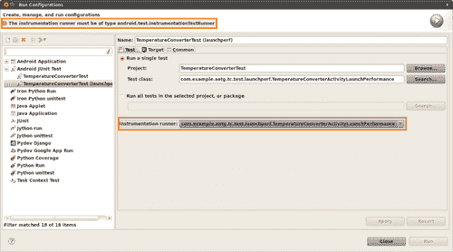
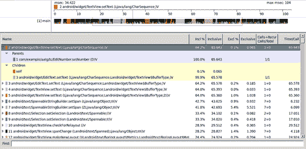
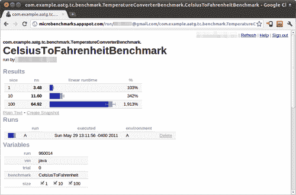

# 第九章。性能测试和配置文件

在前面的章节中，我们研究了为我们的 Android 应用程序开发的测试。这些测试使我们能够评估符合一定数量的规范，并允许我们通过二进制判断（是否合规）来确定软件是否按这些规则正确运行。如果它符合，则软件是正确的；如果不符，我们必须修复它，直到它符合。

在许多其他情况下，主要是在我们验证软件符合所有这些规范之后，我们希望向前推进，了解它们是如何满足的，同时了解系统在不同情况下的性能，以分析其他属性，如可用性、速度、响应时间和可靠性。

根据《Android 开发者指南》（[`developer.android.com/guide/index.html`](http://developer.android.com/guide/index.html)），以下是我们设计应用程序时的最佳实践：

+   为性能设计

+   为响应性设计

+   为无缝设计

非常重要遵循这些最佳实践，并在设计之初主要从性能和响应性的角度思考。由于我们的应用程序将在有限的计算机功率的移动设备上运行，因此通过识别优化目标，我们可以获得更大的收益，至少部分地构建我们的应用程序，并应用我们即将讨论的性能测试。

如唐纳德·克努特多年前所普及的：

> “过早的*优化是万恶之源*”。

这些基于猜测、直觉甚至迷信的优化，在短期内可能会干扰设计，在长期内可能会干扰可读性和可维护性。相反，*微优化*基于识别需要优化的瓶颈或热点，应用更改，然后再次基准测试以评估优化的改进。因此，我们在这里关注的是衡量现有性能和优化替代方案。

本章将介绍一系列与基准测试和配置文件相关的概念，如下所示：

+   传统的日志语句方法

+   创建 Android 性能测试

+   使用性能分析工具

+   使用 Caliper 进行微基准测试

# 旧日志方法

有时这对于实际场景来说过于简单，但我不认为它不能在某些情况下有所帮助，主要是因为它的实现只需要几分钟，而你只需要`logcat`文本输出来分析案例，这在前面章节中描述的情况中很有用，那时你想自动化流程或应用持续集成。

此方法包括计时一个方法，或其一部分，围绕它进行两次时间测量，并在结束时记录差异：

```java
/* (non-Javadoc)
* @see android.text.TextWatcher#onTextChanged( * java.lang.CharSequence, int, int, int)
*/
public void onTextChanged(CharSequence s, int start, int before, int count) {
if (!mDest.hasWindowFocus() || mDest.hasFocus() || s == null ) {
return;
}
final String str = s.toString();
if ( "".equals(str) ) {
mDest.setText("");
return;
} final long t0;
if ( BENCHMARK_TEMPERATURE_CONVERSION ) {
t0 = System.currentTimeMillis();
}
try {
final double temp = Double.parseDouble(str);
final double result = (mOp == OP.C2F) ? TemperatureConverter.celsiusToFahrenheit(temp) : TemperatureConverter.fahrenheitToCelsius(temp);
final String resultString = String.format("%.2f", result);
mDest.setNumber(result);
mDest.setSelection(resultString.length());
} catch (NumberFormatException e) {
// WARNING
// this is generated while a number is entered,
// for example just a '-'
// so we don't want to show the error
} catch (Exception e) {
mSource.setError("ERROR: " + e.getLocalizedMessage());
} if ( BENCHMARK_TEMPERATURE_CONVERSION ) {
long t = System.currentTimeMillis() - t0;
Log.i(TAG, "TemperatureConversion took " + t + " ms to complete.");
}
}

```

这非常直接。我们记录时间并记录差异。为此，我们使用 `Log.i()` 方法，并在运行应用程序时可以在 `logcat` 中看到输出。您可以通过将 `BENCHMARK_TEMPERATURE_CONVERSION` 常量设置为 `true` 或 `false` 来控制此基准的执行，该常量您应该在别处定义。

当我们在 `logcat` 中将 `BENCHMARK_TEMPERATURE_CONVERSION` 常量设置为 `true` 来启动活动时，每次转换发生时我们都会收到如下消息：

**INFO/TemperatureConverterActivity(392): 温度转换完成耗时 55 毫秒**。

**INFO/TemperatureConverterActivity(392): 温度转换完成耗时 11 毫秒**。

**INFO/TemperatureConverterActivity(392): 温度转换完成耗时 5 毫秒**。

您应该考虑的是，这些启用基准的常量不应在生产构建中启用，因为还使用了其他常见常量，如 DEBUG 或 LOGD。为了避免这种错误，您应该在用于自动化构建（如 Ant 或 Make）的构建过程中集成这些常量值的验证。

很简单，但这不适用于更复杂的情况。

# Android SDK 中的性能测试

如果之前添加日志语句的方法不适合您，我们可以采用另一种方法从我们的应用程序中获取性能测试结果。

不幸的是，Android SDK 中的性能测试并不完善（至少在本书编写时，最新的版本是 Android 2.3 Gingerbread）。从 Android SDK 应用程序中获取性能测试结果没有合理的方法，因为 Android 测试所使用的类隐藏在 Android SDK 中，并且仅对系统应用程序可用，即作为主构建或系统镜像的一部分构建的应用程序。这种策略对 SDK 应用程序不可用，因此我们不会深入这个方向，而是将重点放在其他可用的选择上。

## 启动性能测试

这些测试基于与 Android 测试系统应用程序所使用的方法类似的方法。想法是扩展 `android.app.Instrumentation` 以提供性能快照，自动创建一个我们可以甚至扩展以满足其他需求的框架。由于这个媒体的限制，我们在这里展示一个简单的案例。

### 创建 LaunchPerformanceBase 仪器

我们的第一步是扩展 `Instrumentation` 以提供我们需要的功能。我们正在使用一个名为 `com.example.aatg.tc.test.launchperf` 的新包来组织我们的测试：

```java
package com.example.aatg.tc.test.launchperf;
import android.app.Instrumentation;
import android.content.Intent;
import android.os.Bundle;
import android.util.Log;
/**
* Base class for all launch performance Instrumentation classes.
*/
public class LaunchPerformanceBase extends Instrumentation {
public static final String TAG = "LaunchPerformanceBase";
protected Bundle mResults;
protected Intent mIntent;
/**
* Constructor.
*/
public LaunchPerformanceBase() {
mResults = new Bundle();
mIntent = new Intent(Intent.ACTION_MAIN);
mIntent.setFlags(Intent.FLAG_ACTIVITY_NEW_TASK);
setAutomaticPerformanceSnapshots();
}
/**
* Launches intent {@link #mIntent}, and waits for idle before
* returning.
*/
protected void LaunchApp() {
startActivitySync(mIntent);
waitForIdleSync();
}
@Override
public void finish(int resultCode, Bundle results) {
Log.v(TAG, "Test reults = " + results);
super.finish(resultCode, results);
}
}

```

我们在这里扩展了 `Instrumentation`。构造函数初始化了该类中的两个字段：`mResults` 和 `mIntent`。最后，我们调用 `setAutomaticPerformanceSnapshots()` 方法，这是创建此性能测试的关键。 

`LaunchApp()` 方法负责启动所需的 `Activity` 并等待返回。

`finish()` 方法记录接收到的结果，然后调用 `Instrumentation` 的 `finish()`。

### 创建 TemperatureConverterActivityLaunchPerformance 类

这个类设置了 `Intent` 以调用 `TemperatureConverterActivity`，并提供了 `LaunchPerformanceBase` 类所提供的基础设施来测试我们的 `Activity` 的性能：

```java
package com.example.aatg.tc.test.launchperf;
import com.example.aatg.tc.TemperatureConverterActivity;
import android.app.Activity;
import android.os.Bundle;
/**
* Instrumentation class for {@link TemperatureConverterActivity} launch performance testing.
*/
public class TemperatureConverterActivityLaunchPerformance extends LaunchPerformanceBase {
/**
* Constructor.
*/
public TemperatureConverterActivityLaunchPerformance() {
super();
}
@Override
public void onCreate(Bundle arguments) {
super.onCreate(arguments);
mIntent.setClassName("com.example.aatg.tc", "com.example.aatg.tc.TemperatureConverterActivity");
start();
}
/**
* Calls LaunchApp and finish.
*/
@Override
public void onStart() {
super.onStart();
LaunchApp();
finish(Activity.RESULT_OK, mResults);
}
}

```

在这里，`onCreate()` 调用 `super.onCreate()`，遵循 Android 生命周期。然后设置 `Intent`，指定类名和包名。然后调用 `Instrumentation` 的一个方法，`start()`，它创建并启动一个新的线程来运行仪器化测试。这个新线程将调用 `onStart()`，在那里你可以实现仪器化测试。

然后是 `onStart()` 的实现，调用 `LaunchApp()` 和 `finish()`。

## 运行测试

为了能够运行这个测试，我们需要在 `TemperatureConverterTest` 项目的 `AndroidManifest.xml` 中定义特定的 `Instrumentation`。

这是我们要添加到清单中的代码片段：

```java
<?xml version="1.0" encoding="utf-8"?>
<manifest  package="com.example.aatg.tc.test" android:versionCode="1" android:versionName="1.0">
<application android:icon="@drawable/icon" android:label="@string/app_name">
<uses-library android:name="android.test.runner" />
</application>
<uses-sdk android:minSdkVersion="9" />
<instrumentation android:targetPackage="com.example.aatg.tc" android:name="android.test.InstrumentationTestRunner" android:label="Temperature Converter Activity Tests" android:icon="@drawable/icon" /> <instrumentation android:targetPackage="com.example.aatg.tc" android:label="Temperature Converter Activity Launch Performance" android:name=".launchperf.TermeratureConverterActivity LaunchPerformance" />
</manifest>

```

一切准备就绪后，我们就可以开始运行测试了。

首先，安装包含这些更改的 APK。然后，我们有几种运行测试的方法，正如我们在前面的章节中回顾的那样。在这种情况下，我们使用命令行，因为它是最容易获取所有细节的方法。替换适用于你情况的序列号：

```java
$ adb -s emulator-5554 shell am instrument -w com.example.aatg.tc.test/.launchperf.TermeratureConverterActivityLaunchPerformance

```

我们在标准输出中收到了这个测试的结果集：

```java
INSTRUMENTATION_RESULT: other_pss=13430
INSTRUMENTATION_RESULT: java_allocated=2565
INSTRUMENTATION_RESULT: global_freed_size=16424
INSTRUMENTATION_RESULT: native_private_dirty=504
INSTRUMENTATION_RESULT: native_free=6
INSTRUMENTATION_RESULT: global_alloc_count=810
INSTRUMENTATION_RESULT: other_private_dirty=12436
INSTRUMENTATION_RESULT: global_freed_count=328
INSTRUMENTATION_RESULT: sent_transactions=-1
INSTRUMENTATION_RESULT: java_free=2814
INSTRUMENTATION_RESULT: received_transactions=-1
INSTRUMENTATION_RESULT: pre_sent_transactions=-1
INSTRUMENTATION_RESULT: other_shared_dirty=5268
INSTRUMENTATION_RESULT: pre_received_transactions=-1 INSTRUMENTATION_RESULT: execution_time=4563
INSTRUMENTATION_RESULT: native_size=11020
INSTRUMENTATION_RESULT: native_shared_dirty=1296 INSTRUMENTATION_RESULT: cpu_time=1761
INSTRUMENTATION_RESULT: java_private_dirty=52
INSTRUMENTATION_RESULT: native_allocated=11013
INSTRUMENTATION_RESULT: gc_invocation_count=0
INSTRUMENTATION_RESULT: java_shared_dirty=1860
INSTRUMENTATION_RESULT: global_alloc_size=44862
INSTRUMENTATION_RESULT: java_pss=1203
INSTRUMENTATION_RESULT: java_size=5379
INSTRUMENTATION_RESULT: native_pss=660
INSTRUMENTATION_CODE: -1

```

我们突出显示了两个我们感兴趣的值：**execution_time** 和 **cpu_time**。它们分别代表总执行时间和使用的 CPU 时间。

在模拟器上运行此测试会增加误测量的可能性，因为主机计算机正在运行其他进程，这些进程也会占用 CPU，而模拟器并不一定代表真实硬件的性能。

由于这个原因，我们正在考虑这两项措施。`execution_time` 给我们提供了实际时间，而 `cpu_time` 提供了用于计算我们代码的总 CPU 时间。

不言而喻，在测量随时间变化的事物时，你应该使用测量策略并多次运行测试以获得不同的统计值，例如平均值或标准差。

很遗憾，当前 Android ADT 的实现不允许使用不扩展 `android.test.InstrumentationTestRunner` 的仪器化测试，尽管 `.launchperf.TemperatureConverterActivityLaunchPerformance` 扩展了 `LaunchPerformaceBase`，而 `LaunchPerformaceBase` 又扩展了 `Instrumentation`。

这张截图显示了在 Eclipse 运行配置中尝试定义此仪器化测试时出现的错误：



# 使用 Traceview 和 dmtracedump 平台工具

Android SDK 包含了各种工具，其中有两个是专门用于分析性能问题和可能确定应用优化的目标的。

这些工具与其他替代方案相比具有优势：通常对于更简单的任务不需要修改源代码。然而，对于更复杂的情况，需要添加一些内容，但它们非常简单，就像我们很快就会看到的那样。

如果您不需要关于开始和停止跟踪的精确度，您可以从命令行或 Eclipse 驱动它。例如，要从命令行开始跟踪，您可以使用以下命令。请记住，用您的情况中适用的序列号替换：

```java
$ adb -s emulator-5554 am start -n com.example.aatg.tc/.TemperatureConverterActivity
$ adb -s emulator-5554 shell am profile com.example.aatg.tc start /mnt/sdcard/tc.trace

```

做些事情，例如在摄氏度字段中输入温度以强制转换。

```java
$ adb -s emulator-5554 shell am profile com.example.aatg.tc stop
$ adb -s emulator-5554 pull /mnt/sdcard/tc.trace /tmp/tc.trace
1132 KB/s (2851698 bytes in 2.459s)
$ traceview /tmp/tc.trace

```

否则，如果您需要更多关于分析开始时间的精确度，您可以添加此段代码而不是之前的那个：

```java
@Override
public void onTextChanged(CharSequence s, int start, int before, int count) {
if (!dest.hasWindowFocus() || dest.hasFocus() || s == null ) {
return;
}
final String ss = s.toString();
if ( "".equals(ss) ) {
dest.setText("");
return;
} if ( BENCHMARK_TEMPERATURE_CONVERSION ) {
Debug.startMethodTracing();
}
try {
final double result = (Double) convert.invoke( TemperatureConverter.class, Double.parseDouble(ss));
dest.setNumber(result);
dest.setSelection(dest.getText().toString().length());
} catch (NumberFormatException e) {
// WARNING
// this is generated while a number is entered,
//for example just a '-'
// so we don't want to show the error
} catch (Exception e) {
dest.setError(e.getCause().getLocalizedMessage());
} if ( BENCHMARK_TEMPERATURE_CONVERSION ) {
Debug.stopMethodTracing();
}
}

```

这将创建一个跟踪文件，通过调用`Debug.startMethodTracing()`在 Sdcard 中使用默认名称`dmtrace.trace`，该命令以默认日志名称和缓冲区大小开始方法跟踪。当我们完成时，我们调用`Debug.stopMethodTracing()`来停止分析。

### 注意

要能够写入 Sdcard，应用程序需要在清单中添加`android.permission.WRITE_EXTERNAL_STORAGE`权限。

对于 Android 2.2 之前的虚拟机，即使从 Eclipse 执行此操作也需要权限，因为文件也会生成。从 Android 2.2 开始，流通过 JDWP 连接发送，不再需要权限。

您需要运行应用程序以获取跟踪文件。此文件需要被拉到开发计算机上，以便使用`traceview`进行进一步分析：

```java
$ adb -s emulator-5554 pull /mnt/sdcard/dmtrace.trace /tmp/dmtrace.trace
375 KB/s (50664 bytes in 0.131s)
$ traceview /tmp/dmtrace.trace

```

运行此命令后，`traceview`的窗口出现，显示收集到的所有信息：



### 注意

记住，启用分析确实会减慢应用程序的执行速度，因此应该根据其相对权重而不是绝对值来解释测量结果。

窗口的顶部显示**时间线面板**和每个方法的彩色区域。时间向右增加。在彩色行下方还有小线显示所选方法的全部调用范围。

我们分析了应用程序的小部分，所以只有主线程在运行。在其他情况下，如果在分析期间有其他线程在运行，此信息也将显示。

底部部分显示**配置面板**和每个执行的方法及其父子关系。我们将调用方法称为*父方法*，被调用方法称为*子方法*。当点击时，方法展开以显示其父方法和子方法。父方法以紫色背景显示，子方法以黄色背景显示。

选择的用于方法的颜色，以轮询方式完成，显示在方法名称之前。

最后，在底部有一个**查找**字段，我们可以输入一个过滤器以减少显示的信息量。例如，如果我们只想显示`com.example.aatg.tc`包中的方法，我们应该输入**com/example/aatg/tc**。

点击列将根据该列按升序或降序设置列表的顺序。

本表描述了可用的列及其描述：

| 列 | 描述 |
| --- | --- |
| name | 方法的名称，包括其包名，形式如上所述，使用"/"（斜杠）作为分隔符。同时显示参数和返回类型。 |
| Incl% | 方法使用的包含时间，占总时间的百分比。即包括其所有子项。 |
| Inclusive | 此方法使用的包含时间，以毫秒为单位。即包括此方法和其所有子项。 |
| Excl% | 方法使用的排除时间，占总时间的百分比。即不包括其所有子项。 |
| Exclusive | 排除时间，以毫秒为单位，这是在此方法中花费的总时间。即不包括其所有子项。 |
| Calls+RecurCalls/Total | 此列显示此方法的调用次数和递归调用次数。这是与调用此方法的总调用次数相比的调用次数。 |
| Time/Call | 每次调用的耗时，以毫秒为单位。即包含时间/调用次数。 |

# 微基准测试

基准测试是指运行计算机程序或操作，以便以产生定量结果的方式比较操作，通常是通过对这些操作运行一系列测试和试验。

基准测试可以分为两大类：

+   宏基准测试

+   微基准测试

**宏基准测试**作为一种比较不同平台在特定领域（如处理器速度、每单位时间的浮点运算次数、图形和 3D 性能等）的方法存在。它们通常用于硬件组件，但也可以用于测试软件特定区域，例如编译器优化或算法。

与这些传统的宏基准测试相反，**微基准测试**试图测量非常小的一段代码的性能，通常是单个方法。获得的结果用于在提供相同功能的不同实现之间进行选择，决定优化路径。

这里的风险在于微基准测试可能与你认为测量的内容不同。这主要是在使用 Android 从 2.2 Froyo 版本开始的 JIT 编译器的情况下需要考虑的事情。JIT 编译器可能会以不同于应用程序中相同代码的方式编译和优化你的微基准测试。因此，在做出决定时要谨慎。

这与上一节中介绍的分析策略不同，因为这种方法并不考虑整个应用程序，而是一次考虑一个方法或算法。

## Caliper 微基准测试

**Caliper** 是 Google 的开源框架，用于编写、运行和查看微基准测试的结果。在其网站上有很多示例和教程，网址为 [`code.google.com/p/caliper/`](http://code.google.com/p/caliper/)。

这还是一个正在进行中的项目，但在许多情况下仍然很有用。我们在这里探索其基本用法，并在下一章中介绍更多与 Android 相关的用法。

其核心思想是基准测试方法，主要是为了了解它们的效率；我们可能会决定这是我们的优化目标，也许是在分析了通过 traveview 做的剖析提供的结果之后。

Caliper 基准测试通常扩展 `com.google.caliper.SimpleBenchmark`，该类实现了 `Benchmark` 接口。基准测试的结构与 JUnit 3 测试类似，并保持了相同的结构，唯一的区别是这里的基准测试以 **time** 前缀开始，而不是 **test**。每个基准测试都接受一个 `int` 参数，通常命名为 `reps`，表示要基准测试的方法中代码的重复次数，该方法被一个计数重复的循环所包围。

`setUp()` 方法也存在。

我们需要在我们的计算机上安装 caliper。在撰写本文时，caliper 并非以二进制形式分发，而是以源代码形式提供，您可以下载并自行构建。请遵循其网站上的说明，基本上就是获取源代码并自行构建。

用非常简单的方式来说，您可以使用以下命令行来完成它。您需要安装 Subversion 和 Ant 才能完成此操作：

```java
$ svn checkout http://caliper.googlecode.com/svn/trunk/ caliper-read-only
$ cd caliper-read-only
$ ant

```

`calliper-0.0.jar` 和 `allocation.jar` 将会在 `build/caliper-0.0/lib` 子目录下找到。

### 创建 TemperatureConverterBenchmark 项目

让我们从在 Eclipse 中创建一个新的 Java 项目开始。是的，这次不是 Android 项目，而是 Java。

为了保持一致性，请使用包 `com.example.aatg.tc.benchmark` 作为主包。

将 `caliper` 库和现有的 `TemperatureConverter` 项目添加到项目的属性中的 **Java Build Path**。

然后创建包含我们的基准测试的 `TemperatureConverterBenchmark` 类：

```java
package com.example.aatg.tc.benchmark;
import java.util.Random;
import com.example.aatg.tc.TemperatureConverter;
import com.google.caliper.Param;
import com.google.caliper.SimpleBenchmark;
/**
* Caliper Benchmark.<br>
* To run the benchmarks in this class:<br>
* {@code $ CLASSPATH=... caliper com.example.aatg.tc. * benchmark.TemperatureConverterBenchmark. * CelsiusToFahrenheitBenchmark} [-Dsize=n]
*
* @author diego
*
*/
public class TemperatureConverterBenchmark {
public static class CelsiusToFahrenheitBenchmark extends SimpleBenchmark {
private static final double T = 10; // some temp
@Param
int size;
private double[] temps;
@Override
protected void setUp() throws Exception {
super.setUp();
temps = new double[size];
Random r = new Random(System.currentTimeMillis());
for (int i=0; i < size; i++) {
temps[i] = T * r.nextGaussian();
}
}
public final void timeCelsiusToFahrenheit(int reps) {
for (int i=0; i < reps; i++) {
for (double t: temps) {
TemperatureConverter.celsiusToFahrenheit(t);
}
}
}
}
public static void main(String[] args) {
System.out.println("This is a caliper benchmark.");
}
}

```

我们有一个 `setUp()` 方法，类似于 JUnit 测试，在基准测试运行之前执行。此方法初始化用于转换基准测试的随机温度数组。此数组的大小作为参数传递给 caliper，并在此处用 `@Param` 注解标记。Caliper 将自动提供此参数的值。

我们使用高斯分布来模拟伪随机温度，因为这可能是现实世界的一个很好的模型。

然后是基准测试本身。正如我们之前提到的，它应该以时间前缀开始，例如在这个例子中是 `timeCelsiusToFahrenheit()`。在这个方法中，我们循环进行重复操作，并调用转换 `TemperatureConverter.celsiusToFahrenheit()`，这是我们希望基准测试的方法。

### 运行 caliper

要运行 caliper，我们使用一个基于分发中提供的脚本的脚本。请确保将其放置在包含在`PATH`中的目录中，或者使用正确的路径来调用它：

```java
#!/bin/bash
VERSION=0.0
CALIPER_DIR=/opt/caliper-$VERSION
export PATH=$PATH:$JAVA_HOME/bin
exec java -cp ${CALIPER_DIR}/lib/caliper-${VERSION}.jar:$CLASSPATH com.google.caliper.Runner "$@"

```

根据您的需求进行适配。在运行之前，请记住我们仍然需要设置我们的`CLASSPATH`，以便 caliper 能够找到`TemperatureConverter`以及基准测试本身。例如：

```java
$ export CLASSPATH=$CLASSPATH:~/workspace/TemperatureConverter/bin:~/workspace/TemperatureConverterBenchmark/bin

```

之后我们可以像这样运行 caliper：

```java
$ caliper com.example.aatg.tc.benchmark.TemperatureConverterBenchmark.CelsiusToFahrenheitBenchmark -Dsize=1

```

这将运行基准测试，如果一切顺利，我们将看到结果：

**0% Scenario{vm=java, benchmark=CelsiusToFahrenheit, size=1} 8.95ns; σ=0.11ns @ 10 trials**

**.caliperrc found, reading properties..**.

**ns 对数运行时间**

**9 XXXXXXXXXXXXXXXXXXXXXXXXXXXXXX**

**vm: java**

**基准：摄氏度转华氏度**

**size: 1**

或者我们可以为不同的温度重复基准测试，以找出这些值本身是否会影响转换的性能。在这种情况下，我们运行：

```java
$ caliper com.example.aatg.tc.benchmark.TemperatureConverterBenchmark.CelsiusToFahrenheitBenchmark -Dsize=1,10,100

```

在这里，我们为温度数组添加了不同的尺寸，得到的结果如下：

**0% Scenario{vm=java, trial=0, benchmark=CelsiusToFahrenheit, size=1} 3.47 ns; σ=0.19 ns @ 10 trials**

**33% Scenario{vm=java, trial=0, benchmark=CelsiusToFahrenheit, size=10} 11.67 ns; σ=1.20 ns @ 10 trials**

**67% Scenario{vm=java, trial=0, benchmark=CelsiusToFahrenheit, size=100} 63.06 ns; σ=3.83 ns @ 10 trials**

**67% Scenario{vm=java, trial=0, benchmark=CelsiusToFahrenheit, size=100} 63.06 ns; σ=3.83 ns @ 10 trials**

**size ns 线性运行时间**

**1 3.47 =**

**10 11.67 =====**

**100 63.06 ==============================**

**vm: java**

**trial: 0**

**基准：摄氏度转华氏度**

为了帮助可视化这些结果，有一个托管在 Google AppEngine 上的服务（[`microbenchmarks.appspot.com`](http://microbenchmarks.appspot.com)），它接受您的结果数据，并以更好的方式让您可视化它们。要访问此服务，您应该获得一个提供您的 Google 登录的 API 密钥。一旦获得此密钥，它就被放置在您主目录中的`.caliperrc`文件中，下次运行基准测试时，结果将被上传。

在粘贴获得的 API 密钥后，`.caliperrc`将看起来像以下片段：

```java
# Caliper API key for myuser@gmail.com
postUrl: http://microbenchmarks.appspot.com:80/run/
apiKey: 012345678901234567890123456789012

```

现在再次使用之前的相同命令行运行基准测试：

```java
$ caliper com.example.aatg.tc.benchmark.TemperatureConverterBenchmark.CelsiusToFahrenheitBenchmark -Dsize=1,10,100

```

除了文本输出外，您还将收到访问结果的说明。您可以在以下位置在线查看当前和以前的基准测试结果：

[`microbenchmarks.appspot.com/run/user@gmail.com/com.example.aatg.tc.benchmark.TemperatureConverterBenchmark.CelsiusToFahrenheitBenchmark`](http://microbenchmarks.appspot.com/run/user@gmail.com/com.example.aatg.tc.benchmark.TemperatureConverterBenchmark.CelsiusToFahrenheitBenchmark).

### 备注

在之前的 URL 中，将`user@gmail.com`替换为您用于生成 API 密钥的真实 Google 登录用户名。



# 摘要

在本章中，我们分析了可用的替代方案，以测试我们应用程序的性能指标，并对我们的代码进行基准测试和性能分析。

虽然在撰写本文时，Android SDK 应提供的某些选项尚未完成，并且由于 SDK 中隐藏了一些代码，无法实现 Android `PerformanceTestCases`，但我们访问并分析了其他一些有效的替代方案。

在这些替代方案中，我们发现我们可以使用简单的日志语句来扩展更复杂的代码，以增强 Instrumentation 功能。

随后，我们分析了性能分析替代方案，并描述和举例说明了`traceview`和`dmtracedump`的使用。

最后，我们发现了一个名为 caliper 的微基准测试工具，它对 Android 有原生支持。然而，我们只介绍了其最基本的使用方法，并将更具体的 Android 和 Dalvik VM 使用方法推迟到下一章。

在下一章中，我们将从源代码构建 Android，以获得 EMMA 增强的构建，并将对我们的代码执行覆盖率报告。我们还将在本章结束时介绍替代策略和工具。
