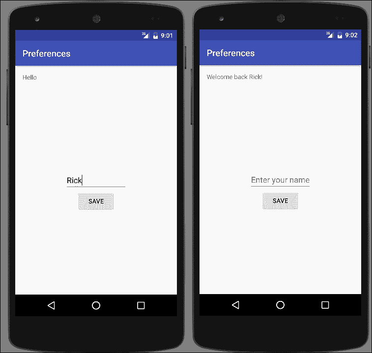
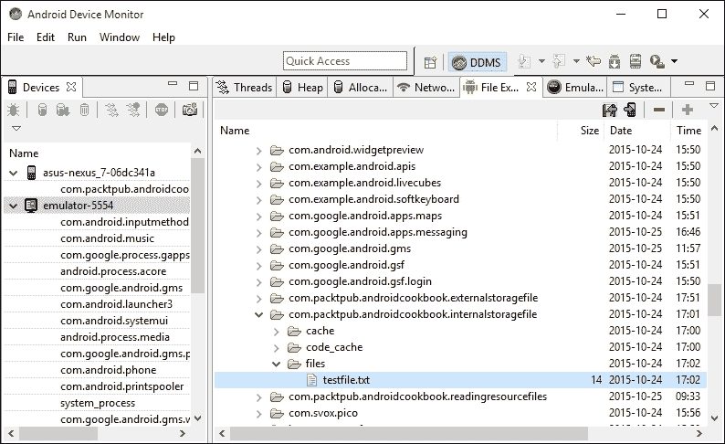
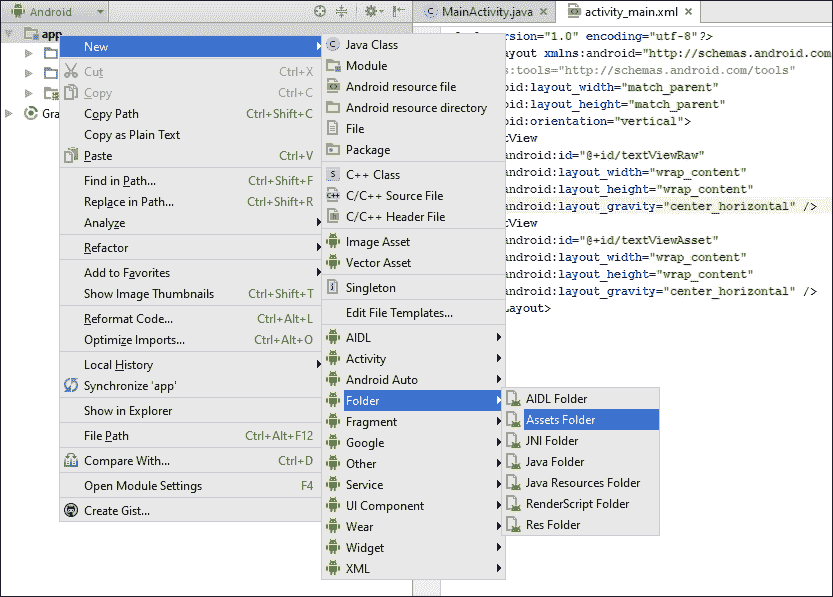
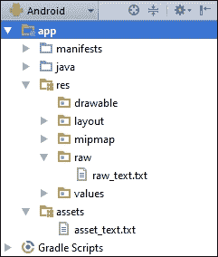

# 第六章. 与数据一起工作

在本章中，我们将涵盖以下主题：

+   存储简单数据

+   在内部存储中读写文本文件

+   在外部存储中读写文本文件

+   在项目中包含资源文件

+   创建和使用 SQLite 数据库

+   使用 Loader 在后台访问数据

# 简介

几乎任何大小应用都需要保存某种类型的数据，Android 提供了许多选项。从保存简单值到使用 SQLite 创建完整数据库，存储选项包括以下内容：

+   共享偏好设置：简单的名称/值对

+   内部存储：私有存储中的数据文件

+   外部存储：私有或公共存储中的数据文件

+   SQLite 数据库：私有数据可以通过内容提供者公开数据

+   云存储：私有服务器或服务提供商

使用内部和外部存储有优点和权衡。我们将列出一些差异，以帮助您决定是否使用内部或外部存储：

+   **内部存储**：

    +   与外部存储不同，内部存储始终可用，但通常有更少的空闲空间

    +   文件对用户不可访问（除非设备具有 root 权限）

    +   当您的应用被卸载时（或在应用管理器的清除缓存/清理文件选项中）会自动删除文件

+   **外部存储**：

    +   设备可能没有外部存储，或者可能无法访问（例如，当它连接到计算机时）

    +   文件对用户（和其他应用）是可访问的，无需 root 权限

    +   当您的应用被卸载时，文件不会被删除（除非您使用 `getExternalFilesDir()` 获取应用特定的公共存储）

在本章中，我们将演示如何使用共享偏好设置、内部和外部存储以及 SQLite 数据库。有关云存储，请参阅第十二章电话、网络和互联网中的互联网食谱，以及第十五章后端即服务选项中的在线服务提供商。

# 存储简单数据

存储简单数据是一个常见需求，Android 通过 Preferences API 使其变得简单。这不仅限于用户偏好设置；您可以使用名称/值对存储任何原始数据类型。

我们将演示如何从`EditText`保存一个名称，并在应用启动时显示它。以下截图显示了第一次启动时没有保存名称的应用外观，以及保存名称后的启动画面：



## 准备工作

在 Android Studio 中创建一个新的项目，并将其命名为：`Preferences`。使用默认的**手机和平板**选项，并在提示**活动类型**时选择**空活动**。

## 如何操作...

我们将使用现有的**TextView**来显示**欢迎回来**消息，并创建一个新的`EditText`按钮来保存名称。首先打开`activity_main.xml`：

1.  替换现有的 **TextView** 并添加以下新视图：

    ```java
    <TextView
        android:id="@+id/textView"
        android:text="Hello World!"
        android:layout_width="wrap_content"
        android:layout_height="wrap_content" />

    <EditText
        android:id="@+id/editTextName"
        android:layout_width="wrap_content"
        android:layout_height="wrap_content"
        android:layout_centerVertical="true"
        android:layout_centerHorizontal="true"
        android:hint="Enter your name" />

    <Button
        android:id="@+id/button"
        android:layout_width="wrap_content"
        android:layout_height="wrap_content"
        android:text="Save"
        android:layout_centerHorizontal="true"
        android:layout_below="@id/editTextName"
        android:onClick="saveName"/>
    ```

1.  打开 `ActivityMain.java` 并添加以下全局声明：

    ```java
    private final String NAME="NAME";
    private EditText mEditTextName;
    ```

1.  在 `onCreate()` 中添加以下代码以保存对 `EditText` 的引用并加载任何已保存的名称：

    ```java
    TextView textView = (TextView)findViewById(R.id.textView);
    SharedPreferences sharedPreferences = getPreferences(MODE_PRIVATE);
    String name = sharedPreferences.getString(NAME,null);
    if (name==null) {
        textView.setText("Hello");
    } else {
        textView.setText("Welcome back " + name + "!");
    }
    mEditTextName = (EditText)findViewById(R.id.editTextName);
    ```

1.  添加以下 `saveName()` 方法：

    ```java
    public void saveName(View view) {
        SharedPreferences.Editor editor = getPreferences(MODE_PRIVATE).edit();
        editor.putString(NAME, mEditTextName.getText().toString());
        editor.commit();
    }
    ```

1.  在设备或模拟器上运行程序。由于我们正在演示持久化数据，它会在 `onCreate()` 方法中加载名称，因此保存一个名称并重新启动程序以查看它是否加载。

## 它是如何工作的...

要加载名称，我们首先获取对 `SharedPreference` 的引用，这样我们就可以调用 `getString()` 方法。我们传入我们的名称/值对的键以及如果找不到键则返回的默认值。

要保存首选项，我们首先需要获取对首选项编辑器的引用。我们使用 `putString()` 并跟随 `commit()`。如果没有 `commit()`，则更改不会被保存。

## 还有更多...

我们的示例将所有首选项存储在单个文件中。我们也可以使用 `getSharedPreferences()` 并传入名称来在不同的文件中存储首选项。如果想要为多个用户创建单独的配置文件，可以使用此选项。

# 读取和写入内部存储的文本文件

当简单的键值对不足以满足需求时，Android 也支持常规的文件操作，包括处理文本和二进制数据。

以下示例演示了如何读取和写入内部或私有存储的文件。

## 准备工作

在 Android Studio 中创建一个新的项目，并将其命名为：`InternalStorageFile`。使用默认的 **Phone & Tablet** 选项，并在提示 **Activity Type** 时选择 **Empty Activity**。

## 如何操作...

为了演示读取和写入文本，我们需要一个包含 `EditText` 和两个按钮的布局。首先打开 `main_activity.xml` 并按照以下步骤操作：

1.  替换现有的 `<TextView>` 元素，并添加以下视图：

    ```java
    <EditText
        android:id="@+id/editText"
        android:layout_width="wrap_content"
        android:layout_height="wrap_content"
        android:inputType="textMultiLine"
        android:ems="10"
        android:layout_above="@+id/buttonRead"
        android:layout_alignParentTop="true"
        android:layout_centerHorizontal="true" />
    <Button
        android:layout_width="wrap_content"
        android:layout_height="wrap_content"
        android:text="Read"
        android:id="@+id/buttonRead"
        android:layout_centerVertical="true"
        android:layout_centerHorizontal="true"
        android:onClick="readFile"/>
    <Button
        android:layout_width="wrap_content"
        android:layout_height="wrap_content"
        android:text="Write"
        android:id="@+id/buttonWrite"
        android:layout_below="@+id/buttonRead"
        android:layout_centerHorizontal="true"
        android:onClick="writeFile"/>
    ```

1.  现在打开 `ActivityMain.java` 并添加以下全局变量：

    ```java
    private final String FILENAME="testfile.txt";
    EditText mEditText;
    ```

1.  在 `onCreate()` 方法中 `setContentView ()` 之后添加以下内容：

    ```java
    mEditText = (EditText)findViewById(R.id.editText);
    ```

1.  添加以下 `writeFile()` 方法：

    ```java
    public void writeFile(View view) {
        try {
            FileOutputStream fileOutputStream = openFileOutput(FILENAME, Context.MODE_PRIVATE);
            fileOutputStream.write(mEditText.getText().toString().getBytes());
            fileOutputStream.close();
        } catch (java.io.IOException e) {
            e.printStackTrace();
        }
    }
    ```

1.  现在添加 `readFile()` 方法：

    ```java
    public void readFile(View view) {
        StringBuilder stringBuilder = new StringBuilder();
        try {
            InputStream inputStream = openFileInput(FILENAME);
            if ( inputStream != null ) {
                InputStreamReader inputStreamReader = new InputStreamReader(inputStream);
                BufferedReader bufferedReader = new BufferedReader(inputStreamReader);
                String newLine = null;
                while ((newLine = bufferedReader.readLine()) != null ) {
                    stringBuilder.append(newLine+"\n");
                }
                inputStream.close();
            }
        } catch (java.io.IOException e) {
            e.printStackTrace();
        }
        mEditText.setText(stringBuilder);
    }
    ```

1.  在设备或模拟器上运行程序。

## 它是如何工作的...

我们使用 `InputStream` 和 `FileOutputStream` 类分别进行读取和写入。写入文件就像从 `EditText` 获取文本并调用 `write()` 方法一样简单。

读取内容稍微复杂一些。我们可以使用 `FileInputStream` 类进行读取，但在处理文本时，辅助类会使操作更简单。在我们的示例中，我们使用 `openFileInput()` 打开文件，它返回一个 `InputStream` 对象。然后我们使用 `InputStream` 获取一个 `BufferedReader`，它提供了 `ReadLine()` 方法。我们遍历文件中的每一行并将其追加到我们的 `StringBuilder` 中。当我们完成文件读取后，我们将文本分配给 `EditText`。

### 小贴士

我们之前创建的文件位于应用程序的私有数据文件夹中。要查看文件内容，您可以使用 Android 设备监控器将文件拉到您的计算机上。完整文件路径是：`/data/data/com.packtpub.androidcookbook.internalstoragetile/files/testfile.txt`。

以下截图显示了通过**Android 设备监控器**查看文件时的样子：



### 注意

您需要一个具有 root 访问权限的设备来查看之前显示的私有文件夹。

## 还有更多...

让我们看看一些可能有助于了解的额外信息。

### 缓存文件

如果您只需要临时存储数据，您也可以使用缓存文件夹。以下方法返回缓存文件夹作为`File`对象（下一个菜谱将演示如何处理`File`对象）：

```java
getCacheDir()
```

缓存文件夹的主要好处是，当系统存储空间不足时，可以清除缓存。（用户也可以在设置中的应用程序管理中清除缓存文件夹。）

例如，如果您的应用程序下载新闻文章，您可以将这些文章存储在缓存中。当您的应用程序启动时，您可以显示已下载的新闻。这些文件不是使您的应用程序工作所必需的。如果系统资源不足，可以清除缓存而不会对您的应用程序产生不利影响。（即使系统可能会清除缓存，但您的应用程序删除旧文件仍然是一个好主意。）

## 相关内容

+   下一个菜谱，*读取和写入外部存储的文本文件*。

# 读取和写入外部存储的文本文件

将文件读取和写入外部存储的过程基本上与使用内部存储相同。区别在于获取存储位置的引用。此外，如*简介*中所述，外部存储可能不可用，因此在尝试访问之前最好检查其可用性。

本菜谱将读取和写入文本文件，就像我们在前一个菜谱中所做的那样。我们还将演示在访问它之前如何检查外部存储状态。

## 准备就绪

在 Android Studio 中创建一个新的项目，并将其命名为：`ExternalStorageFile`。使用默认的**手机和平板**选项，并在提示**活动类型**时选择**空活动**。我们将使用与前一个菜谱相同的布局，所以如果您已经输入了它，可以直接复制粘贴。否则，使用前一个菜谱中的步骤 1 的布局，*读取和写入内部存储的文本文件*。

## 如何操作...

如前文在*准备就绪*部分所述，我们将使用前一个菜谱中的布局。布局文件完成后，第一步将是添加访问外部存储写入权限。以下是步骤：

1.  打开 AndroidManifest.xml 并添加以下权限：

    ```java
    <uses-permission android:name="android.permission.WRITE_EXTERNAL_STORAGE" />
    ```

1.  接下来，打开`ActivityMain.java`并添加以下全局变量：

    ```java
    private final String FILENAME="testfile.txt";
    EditText mEditText;
    ```

1.  在`onCreate()`方法中，在`setContentView()`之后添加以下内容：

    ```java
    mEditText = (EditText)findViewById(R.id.editText);
    ```

1.  添加以下两个方法来检查存储状态：

    ```java
    public boolean isExternalStorageWritable() {
        if (Environment.MEDIA_MOUNTED.equals(Environment.getExternalStorageState())) {
            return true;
        }
        return false;
    }

    public boolean isExternalStorageReadable() {
        if (Environment.MEDIA_MOUNTED.equals(Environment.getExternalStorageState()) ||
                Environment.MEDIA_MOUNTED_READ_ONLY.equals(Environment.getExternalStorageState())) {
            return true;
        }
        return false;
    }
    ```

1.  添加以下 `writeFile()` 方法：

    ```java
    public void writeFile(View view) {
        if (isExternalStorageWritable()) {
            try {
                File textFile = new File(Environment.getExternalStorageDirectory(), FILENAME);
                FileOutputStream fileOutputStream = new FileOutputStream(textFile);
                fileOutputStream.write(mEditText.getText().toString().getBytes());
                fileOutputStream.close();
            } catch (java.io.IOException e) {
                e.printStackTrace();
                Toast.makeText(this, "Error writing file", Toast.LENGTH_LONG).show();
            }
        } else {
            Toast.makeText(this, "Cannot write to External Storage", Toast.LENGTH_LONG).show();
        }
    }
    ```

1.  添加以下 `readFile()` 方法：

    ```java
    public void readFile(View view) {
        if (isExternalStorageReadable()) {
            StringBuilder stringBuilder = new StringBuilder();
            try {
                File textFile = new File(Environment.getExternalStorageDirectory(), FILENAME);
                FileInputStream fileInputStream = new FileInputStream(textFile);
                if (fileInputStream != null ) {
                    InputStreamReader inputStreamReader = new InputStreamReader(fileInputStream);
                    BufferedReader bufferedReader = new BufferedReader(inputStreamReader);
                    String newLine = null;
                    while ( (newLine = bufferedReader.readLine()) != null ) {
                        stringBuilder.append(newLine+"\n");
                    }
                    fileInputStream.close();
                }
                mEditText.setText(stringBuilder);
            } catch (java.io.IOException e) {
                e.printStackTrace();
                Toast.makeText(this, "Error reading file", Toast.LENGTH_LONG).show();
            }
        } else {
            Toast.makeText(this, "Cannot read External Storage", Toast.LENGTH_LONG).show();
        }
    }
    ```

1.  在具有外部存储的设备或模拟器上运行程序。

## 它是如何工作的...

读取和写入文件对于内部和外部存储基本上是相同的。主要区别在于在尝试访问外部存储之前，我们应该检查其可用性，这可以通过 `isExternalStorageWritable()` 和 `isExternalStorageReadable()` 方法来完成。当检查存储状态时，`MEDIA_MOUNTED` 表示我们可以对其进行读写操作。

与内部存储示例不同，我们像以下代码行中那样请求工作路径：

```java
File textFile = new File(Environment.getExternalStorageDirectory(), FILENAME);
```

实际的读取和写入操作使用相同的类，因为只是位置不同。

### 小贴士

将外部文件夹路径硬编码是不可取的。路径可能在操作系统版本之间以及特别是在硬件制造商之间有所不同。始终最好调用 `getExternalStorageDirectory()`，如下所示。

## 更多内容...

以下是对一些附加信息的讨论。

### 获取公共文件夹

`getExternalStorageDirectory()` 方法返回外部存储的根文件夹。如果你想获取特定的公共文件夹，例如 `Music` 或 `Ringtone` 文件夹，请使用 `getExternalStoragePublicDirectory()` 并传入所需的文件夹类型，例如：

```java
getExternalStoragePublicDirectory(Environment.DIRECTORY_MUSIC)
```

### 检查可用空间

内部和外部存储之间一个一致的问题是空间有限。如果你事先知道你需要多少空间，你可以在 `File` 对象上调用 `getFreeSpace()` 方法。（`getTotalSpace()` 将返回总空间。）以下是一个使用 `getFreeSpace()` 调用的简单示例：

```java
if (Environment.getExternalStorageDirectory().getFreeSpace() < RQUIRED_FILE_SPACE) {
    //Not enough space
} else {
    //We have enough space
}
```

### 删除文件

通过 `File` 对象，有许多辅助方法可用，包括删除文件。如果我们想删除示例中创建的文本文件，我们可以按照以下方式调用 `delete()` 方法：

```java
textFile.delete()
```

### 与目录一起工作

虽然它被称为 `File` 对象，但它也支持目录命令，例如创建和删除目录。如果你想创建或删除目录，构建 `File` 对象，然后调用相应的方法：`mkdir()` 和 `delete()`。还有一个名为 `mkdirs()`（复数）的方法，它还会创建父目录。有关完整列表，请参阅以下链接。

### 防止文件被包含在相册中

Android 使用一个 **媒体扫描器**，它会自动将声音、视频和图像文件包含在系统集合中，例如图像库。要排除你的目录，在你要排除的文件所在的目录中创建一个名为 `.nomedia`（注意前面的点）的空文件。

## 相关内容

+   要获取 `File` 类中所有可用方法的完整列表，请访问 [`developer.android.com/reference/java/io/File.html`](http://developer.android.com/reference/java/io/File.html)

# 在项目中包含资源文件

Android 为包含项目中的文件提供了两种选项：`raw`文件夹和`Assets`文件夹。您使用哪种选项取决于您的需求。为了开始，我们将简要概述每个选项，以帮助您决定何时使用每个选项：

+   **原始文件**

    +   包含在资源目录中：`/res/raw`

    +   作为资源，通过原始标识符访问：`R.raw.<resource>`

    +   存储媒体文件（如 MP3、MP4 和 OOG 文件）的好地方。

+   **资产文件**

    +   在您的 APK 中编译的文件系统（不提供资源 ID）

    +   使用文件名访问文件，通常这使得它们在使用动态创建的名称时更容易使用。

    +   一些 API 不支持资源标识符，因此需要将其作为资产包含。

通常，`raw`文件更容易处理，因为它们是通过资源标识符访问的。正如我们将在此配方中展示的，主要区别在于您如何访问文件。在这个例子中，我们将加载一个`raw`文本文件和一个`asset`文本文件，并显示其内容。

## 准备工作

在 Android Studio 中创建一个新的项目，命名为：`ReadingResourceFiles`。使用默认的**手机和平板**选项，并在提示**活动类型**时选择**空活动**。

## 如何操作...

为了演示从资源位置读取内容，我们将创建一个分割布局。我们还需要创建这两个资源文件夹，因为它们默认不包括在 Android 项目中。以下是步骤：

1.  打开`activity_main.xml`，将内容替换为以下布局：

    ```java
    <?xml version="1.0" encoding="utf-8"?>
    <LinearLayout 

        android:layout_width="match_parent"
        android:layout_height="match_parent"
        android:orientation="vertical">
        <TextView
            android:id="@+id/textViewRaw"
            android:layout_width="match_parent"
            android:layout_height="0dp"
            android:layout_weight="1"
            android:gravity="center_horizontal|center_vertical"/>
        <TextView
            android:id="@+id/textViewAsset"
            android:layout_width="match_parent"
            android:layout_height="0dp"
            android:layout_weight="1"
            android:gravity="center_horizontal|center_vertical"/>
    </LinearLayout>
    ```

1.  在`res`文件夹中创建`raw`资源文件夹。它将读取为：`res/raw`。

1.  通过在`raw`文件夹上右键单击并选择**新建** | **文件**来创建一个新的文本文件。将文件命名为`raw_text.txt`并在文件中输入一些文本。（这段文本将在您运行应用程序时显示。）

1.  创建`asset`文件夹。由于位置的原因，`asset`文件夹比较复杂。幸运的是，Android Studio 提供了一个菜单选项，使得创建它变得非常简单。转到**文件**菜单（或在**app**节点上右键单击）并选择**新建** | **文件夹** | **资产文件夹**，如图所示：

1.  在资产文件夹中创建另一个名为`asset_text.txt`的文本文件。同样，您在这里输入的任何文本都会在运行应用程序时显示。以下是创建两个文本文件后的最终结果：

1.  现在是时候编写代码了。打开`MainActivity.java`并添加以下方法来读取文本文件（该文件作为参数传递给方法）：

    ```java
    private String getText(InputStream inputStream) {
        StringBuilder stringBuilder = new StringBuilder();
        try {;
            if ( inputStream != null ) {
                InputStreamReader inputStreamReader = new InputStreamReader(inputStream);
                BufferedReader bufferedReader = new BufferedReader(inputStreamReader);
                String newLine = null;
                while ((newLine = bufferedReader.readLine()) != null ) {
                    stringBuilder.append(newLine+"\n");
                }
                inputStream.close();
            }
        } catch (java.io.IOException e) {
            e.printStackTrace();
        }
        return stringBuilder.toString();
    }
    ```

1.  最后，将以下代码添加到`onCreate()`方法中：

    ```java
    TextView textViewRaw = (TextView)findViewById(R.id.textViewRaw);
    textViewRaw.setText(getText(this.getResources().openRawResource(R.raw.raw_text)));

    TextView textViewAsset = (TextView)findViewById(R.id.textViewAsset);
    try {
        textViewAsset.setText(getText(this.getAssets().open("asset_text.txt")));
    } catch (IOException e) {
        e.printStackTrace();
    }
    ```

1.  在设备或模拟器上运行程序。

## 它是如何工作的...

总结来说，唯一的区别在于我们如何获取每个文件的引用。这一行代码读取了`raw`资源：

```java
this.getResources().openRawResource(R.raw.raw_text)
```

这段代码读取了`asset`文件：

```java
this.getAssets().open("asset_text.txt")
```

这两个调用都返回一个 `InputStream`，`getText()` 方法使用它来读取文件内容。然而，值得注意的是，打开 `asset` 文本文件的调用需要额外的 `try`/`catch`。如配方介绍中所述，资源是索引的，因此我们有编译时验证，而 `asset` 文件夹没有。

## 还有更多...

一种常见的做法是将资源包含在您的 APK 中，但下载新的资源作为它们可用时。（参见第十二章 Chapter 12 中的网络通信，*电话、网络和互联网*。）如果新的资源不可用，您始终可以回退到 APK 中的资源。

## 另请参阅

+   在第十二章 Chapter 12 中介绍了网络通信的配方，*电话、网络和互联网*。

# 创建和使用 SQLite 数据库

在本配方中，我们将演示如何与 SQLite 数据库一起工作。如果您已经熟悉来自其他平台上的 SQL 数据库，那么您所知道的大部分内容都将适用。如果您是 SQLite 的新手，请查看“另请参阅”部分中的参考链接，因为本配方假设您对数据库概念有基本的了解，包括模式、表、游标和原始 SQL。

为了让您快速上手 SQLite 数据库，我们的示例实现了基本的 CRUD 操作。通常，在 Android 中创建数据库时，您会创建一个继承自 `SQLiteOpenHelper` 的类，这是您实现数据库功能的地方。以下是提供每个基本操作的功能列表：

+   创建：`insert()`

+   读取：`query()` 和 `rawQuery()`

+   更新：`update()`

+   删除：`delete()`

为了演示一个完全工作的数据库，我们将创建一个简单的 `Dictionary` 数据库，以便我们可以存储单词及其定义。我们将通过允许添加新的单词（及其定义）和更新现有单词的定义来演示 CRUD 操作。我们将使用游标在 `ListView` 中显示单词。在 `ListView` 中按下单词将读取数据库中的定义并在 Toast 消息中显示它。长按将删除该单词。

## 准备工作

在 Android Studio 中创建一个新的项目，并将其命名为：`SQLiteDatabase`。使用默认的 **手机和平板** 选项，并在提示 **活动类型** 时选择 **空活动**。

## 如何做到这一点...

首先，我们将创建 UI，它将包括两个 `EditText` 字段、一个按钮和一个 `ListView`。当我们向数据库添加单词时，它们将填充 `ListView`。首先，打开 `activity_main.xml` 并按照以下步骤操作：

1.  用以下新视图替换现有的 `<TextView>`：

    ```java
    <EditText
        android:id="@+id/et_word"
        android:layout_width="wrap_content"
        android:layout_height="wrap_content"
        android:layout_alignParentTop="true"
        android:layout_alignParentLeft="true"
        android:layout_alignParentStart="true"
        android:hint="Word"/>
    <EditText
        android:id="@+id/et_definition"
        android:layout_width="match_parent"
        android:layout_height="wrap_content"
        android:layout_below="@+id/editTextWord"
        android:layout_alignParentLeft="true"
        android:layout_alignParentStart="true"
        android:hint="Definition"/>
    <Button
        android:layout_width="wrap_content"
        android:layout_height="wrap_content"
        android:text="Save"
        android:id="@+id/button_add_update"
        android:layout_alignParentRight="true"
        android:layout_alignParentTop="true" />
    <ListView
        android:layout_width="wrap_content"
        android:layout_height="wrap_content"
        android:id="@+id/listView"
        android:layout_below="@+id/et_definition"
        android:layout_alignParentLeft="true"
        android:layout_alignParentBottom="true" />
    ```

1.  将名为 `DictionaryDatabase` 的新 Java 类添加到项目中。这个类继承自 `SQLiteOpenHelper` 并处理所有 SQLite 功能。以下是类的声明：

    ```java
    public class DictionaryDatabase extends SQLiteOpenHelper {
    ```

1.  在声明下方添加以下常量：

    ```java
    private static final String DATABASE_NAME = "dictionary.db";
    private static final String TABLE_DICTIONARY = "dictionary";

    private static final String FIELD_WORD = "word";
    private static final String FIELD_DEFINITION = "definition";
    private static final int DATABASE_VERSION = 1;
    ```

1.  添加以下构造函数、`OnCreate()` 和 `onUpgrade()` 方法：

    ```java
    DictionaryDatabase(Context context) {
        super(context, DATABASE_NAME, null, DATABASE_VERSION);
    }

    @Override
    public void onCreate(SQLiteDatabase db) {
        db.execSQL("CREATE TABLE " + TABLE_DICTIONARY +
                "(_id integer PRIMARY KEY," +
                FIELD_WORD + " TEXT, " +
                FIELD_DEFINITION + " TEXT);");
    }

    @Override
    public void onUpgrade(SQLiteDatabase db, int oldVersion, int newVersion) {
        //Handle database upgrade as needed
    }
    ```

1.  以下方法负责创建、更新和删除记录：

    ```java
    public void saveRecord(String word, String definition) {
        long id = findWordID(word);
        if (id>0) {
            updateRecord(id, word,definition);
        } else {
            addRecord(word,definition);
        }
    }

    public long addRecord(String word, String definition) {
        SQLiteDatabase db = getWritableDatabase();

        ContentValues values = new ContentValues();
        values.put(FIELD_WORD, word);
        values.put(FIELD_DEFINITION, definition);
        return db.insert(TABLE_DICTIONARY, null, values);
    }

    public int updateRecord(long id, String word, String definition) {
        SQLiteDatabase db = getWritableDatabase();
        ContentValues values = new ContentValues();
        values.put("_id", id);
        values.put(FIELD_WORD, word);
        values.put(FIELD_DEFINITION, definition);
        return db.update(TABLE_DICTIONARY, values, "_id = ?", new String[]{String.valueOf(id)});
    }
    public int deleteRecord(long id) {
        SQLiteDatabase db = getWritableDatabase();
        return db.delete(TABLE_DICTIONARY, "_id = ?", new String[]{String.valueOf(id)});
    }
    ```

1.  以及以下方法处理从数据库中读取信息：

    ```java
    public long findWordID(String word) {
        long returnVal = -1;
        SQLiteDatabase db = getReadableDatabase();
        Cursor cursor = db.rawQuery("SELECT _id FROM " + TABLE_ DICTIONARY + " WHERE " + FIELD_WORD + " = ?", new String[]{word});
        Log.i("findWordID","getCount()="+cursor.getCount());
        if (cursor.getCount() == 1) {
            cursor.moveToFirst();
            returnVal = cursor.getInt(0);
        }
        return returnVal;
    }

    public String getDefinition(long id) {
        String returnVal = "";
        SQLiteDatabase db = getReadableDatabase();
        Cursor cursor = db.rawQuery("SELECT definition FROM " + TABLE_ DICTIONARY + " WHERE _id = ?", new String[]{String.valueOf(id)});
        if (cursor.getCount() == 1) {
            cursor.moveToFirst();
            returnVal = cursor.getString(0);
        }
        return returnVal;
    }

    public Cursor getWordList() {
        SQLiteDatabase db = getReadableDatabase();
        String query = "SELECT _id, " + FIELD_WORD + " FROM " + TABLE_DICTIONARY + " ORDER BY " + FIELD_WORD + " ASC";
        return db.rawQuery(query, null);
    }
    ```

1.  数据库类完成后，打开`MainActivity.java`。在类声明下方添加以下全局变量：

    ```java
    EditText mEditTextWord;
    EditText mEditTextDefinition;
    DictionaryDatabase mDB;
    ListView mListView;
    ```

1.  当按钮被点击时，添加以下方法以保存字段：

    ```java
    private void saveRecord() {
        mDB.saveRecord(mEditTextWord.getText().toString(), mEditTextDefinition.getText().toString());
        mEditTextWord.setText("");
        mEditTextDefinition.setText("");
        updateWordList();
    }
    ```

1.  添加以下方法以填充`ListView`：

    ```java
    private void updateWordList() {
        SimpleCursorAdapter simpleCursorAdapter = new SimpleCursorAdapter(
            this,
            android.R.layout.simple_list_item_1,
            mDB.getWordList(),
            new String[]{"word"},
            new int[]{android.R.id.text1},
            0);
        mListView.setAdapter(simpleCursorAdapter);
    }
    ```

1.  最后，将以下代码添加到`onCreate()`中：

    ```java
    mDB = new DictionaryDatabase(this);

    mEditTextWord = (EditText)findViewById(R.id.editTextWord);
    mEditTextDefinition = (EditText)findViewById(R.id.editTextDefinition);

    Button buttonAddUpdate = (Button)findViewById(R.id.buttonAddUpdate);
    buttonAddUpdate.setOnClickListener(new View.OnClickListener() {
        @Override
        public void onClick(View v) {
            saveRecord();
        }
    });

    mListView = (ListView)findViewById(R.id.listView);
    mListView.setOnItemClickListener(new AdapterView.OnItemClickListener() {
        @Override
        public void onItemClick(AdapterView<?> parent, View view, int position, long id) {
            Toast.makeText(MainActivity.this, mDB.getDefinition(id),Toast.LENGTH_SHORT).show();
        }
    });
    mListView.setOnItemLongClickListener(new AdapterView.OnItemLongClickListener() {
        @Override
        public boolean onItemLongClick(AdapterView<?> parent, 
            View view, int position, long id) {
            Toast.makeText(MainActivity.this, "Records deleted = " + mDB.deleteRecord(id), Toast.LENGTH_SHORT).show();
            updateWordList();
            return true;
        }
    });
    updateWordList();
    ```

1.  在设备或模拟器上运行程序并尝试使用它。

## 它是如何工作的...

我们首先解释`DictionaryDatabase`类，因为它是 SQLite 数据库的核心。首先要注意的是构造函数：

```java
DictionaryDatabase(Context context) {
    super(context, DATABASE_NAME, null, DATABASE_VERSION);
}
```

注意`DATABASE_VERSION`？只有当你更改数据库模式时，才需要增加这个值。

接下来是`onCreate()`，这是数据库实际上创建的地方。这仅在数据库第一次创建时调用，而不是每次创建类时调用。还值得注意的是`_id`字段。Android 不需要表有主字段，除了某些类如`SimpleCursorAdapter`需要`_id`。

我们需要实现`onUpgrade()`回调，但因为这个是一个新数据库，没有需要做的事情。当数据库版本增加时，这个方法将被调用。

`saveRecord()`方法处理调用`addRecord()`或`updateRecord()`，根据需要。由于我们打算修改数据库，这两个方法都调用`getWritableDatabase()`，这样我们就可以进行更改。可写数据库需要更多的资源，所以如果你不需要进行更改，就获取一个只读数据库。

最后要注意的方法是`getWordList()`，它使用游标对象返回数据库中的所有单词。我们使用这个游标来填充`ListView`，这把我们带到了`ActivityMain.java`。`onCreate()`方法执行我们之前看到的常规初始化，并使用以下代码创建数据库的一个实例：

```java
mDB = new DictionaryDatabase(this);
```

`onCreate()`方法还设置了事件，当按下项目时显示单词定义（使用 Toast），以及在长按时删除单词。最复杂的代码可能在`updateWordList()`中。

这不是我们第一次使用适配器，但这是第一个游标适配器，所以我们将解释。我们使用`SimpleCursorAdapter`在游标中的字段和`ListView`项目之间创建映射。我们使用`layout.simple_list_item_1`布局，它只包含一个 ID 为`android.R.id.text1`的单个文本字段。在实际应用中，我们可能会创建一个自定义布局，并在`ListView`项中包含定义，但我们的目的是演示从数据库中读取定义的方法。

我们在三个地方调用`updateWordList()`——在`onCreate()`中创建初始列表，然后在我们添加/更新列表之后再次调用，最后在删除列表时调用。

## 还有更多...

虽然这是一个完整的 SQLite 示例，但它仍然是基础知识。关于 Android 的 SQLite，可以写一本书，实际上也已经写了。

### 升级数据库

正如我们之前提到的，当我们增加数据库版本时，`onUpgrade()` 方法将被调用。你在这里所做的是依赖于变化的。如果你更改了现有的表，理想情况下，你将通过查询现有数据并将其插入到新格式中来迁移用户数据。请注意，没有保证用户会按顺序升级——例如，他们可能从版本 1 跳到版本 4。

## 参见

+   SQLite 主页：[`www.sqlite.org/`](https://www.sqlite.org/)

+   SQLite 数据库 Android 参考：[`developer.android.com/reference/android/database/sqlite/SQLiteDatabase.html`](http://developer.android.com/reference/android/database/sqlite/SQLiteDatabase.html)

# 使用加载器在后台访问数据

任何可能长时间运行的操作都不应该在 UI 线程上执行，因为这可能导致你的应用程序变慢或无响应。当应用程序无响应时，Android OS 将弹出 **应用程序无响应** （**ANR**） 对话框。

由于查询数据库可能耗时，Android 在 Android 3.0 中引入了 Loader API。Loader 在后台线程上处理查询，并在完成时通知 UI 线程。

加载器的主要好处包括：

+   查询数据库是在后台线程（自动）处理的

+   查询自动更新（当使用内容提供者数据源时）

为了演示加载器，我们将修改之前的 SQLite 数据库示例，使用 `CursorLoader` 来填充 `ListView`。

## 准备工作

我们将使用前一个示例中的项目，即 *创建和使用 SQLite 数据库*，作为本菜谱的基础。在 Android Studio 中创建一个新的项目，并将其命名为：`Loader`。选择默认的 **Phone & Tablet** 选项，并在提示 **Activity 类型** 时选择 **Empty Activity**。复制前一个菜谱中的 `DictionaryDatabase` 类和布局。虽然我们将使用前一个 `ActivityMain.java` 代码的部分，但我们将从这个菜谱的开始部分开始，以便更容易跟随。

## 如何做到这一点...

根据之前描述的项目设置，我们将首先创建两个新的 Java 类，然后在 `ActivityMain.java` 中将它们全部连接起来。以下是步骤：

1.  创建一个新的 Java 类，命名为 `DictionaryAdapter`，它扩展了 `CursorAdapter`。这个类替换了我们在前一个菜谱中使用的 `SimpleCursorAdapater`。以下是完整的代码：

    ```java
    public class DictionaryAdapter extends CursorAdapter {
        public DictionaryAdapter(Context context, Cursor c, int flags) {
            super(context, c, flags);
        }

        @Override
        public View newView(Context context, Cursor cursor, ViewGroup parent) {
            return LayoutInflater.from(context).inflate(android.R.layout.simple_list_item_1,parent,false);
        }

        @Override
        public void bindView(View view, Context context, Cursor cursor) {
            TextView textView = (TextView)view.findViewById(android.R.id.text1);
            textView.setText(cursor.getString(getCursor().getColumnIndex("word")));
        }
    }
    ```

1.  接下来，创建另一个新的 Java 类，并将其命名为 `DictionaryLoader`。尽管这个类处理后台线程中的数据加载，但实际上它非常简单：

    ```java
    public class DictionaryLoader extends CursorLoader {
        Context mContext;
        public DictionaryLoader(Context context) {
            super(context);
            mContext = context;
        }

        @Override
        public Cursor loadInBackground() {
            DictionaryDatabase db = new DictionaryDatabase(mContext);
            return db.getWordList();
        }
    }
    ```

1.  接下来，打开 `ActivityMain.java` 文件。我们需要将声明改为实现 `LoaderManager.LoaderCallbacks<Cursor>` 接口，如下所示：

    ```java
    public class MainActivity extends AppCompatActivity implements {
    ```

1.  将适配器添加到全局声明中。完整的列表如下：

    ```java
    EditText mEditTextWord;
    EditText mEditTextDefinition;
    DictionaryDatabase mDB;
    ListView mListView;
    DictionaryAdapter mAdapter;
    ```

1.  将 `onCreate()` 改为使用新的适配器，并在删除记录后添加一个调用更新加载器的调用。最终的 `onCreate()` 方法应如下所示：

    ```java
    protected void onCreate(Bundle savedInstanceState) {
        super.onCreate(savedInstanceState);
        setContentView(R.layout.activity_main);

        mDB = new DictionaryDatabase(this);

        mEditTextWord = (EditText) findViewById(R.id.editTextWord);
        mEditTextDefinition = (EditText) findViewById(R.id.editTextDefinition);

        Button buttonAddUpdate = (Button) findViewById(R.id.buttonAddUpdate);
        buttonAddUpdate.setOnClickListener(new View.OnClickListener() {
            @Override
            public void onClick(View v) {
                saveRecord();
            }
        });

        mListView = (ListView) findViewById(R.id.listView);
        mListView.setOnItemClickListener(new AdapterView.OnItemClickListener() {
            @Override
            public void onItemClick(AdapterView<?> parent, View view, int position, long id) {
                Toast.makeText(MainActivity.this, mDB.getDefinition(id), Toast.LENGTH_SHORT).show();
            }
        });
        mListView.setOnItemLongClickListener(new AdapterView.OnItemLongClickListener() {
            @Override
            public boolean onItemLongClick(AdapterView<?> parent, View view, int position, long id) {
                Toast.makeText(MainActivity.this, "Records deleted = " + mDB.deleteRecord(id), Toast.LENGTH_SHORT).show();
                getSupportLoaderManager().restartLoader(0, null, MainActivity.this);
                return true;
            }
        });
        getSupportLoaderManager().initLoader(0, null, this);
        mAdapter = new DictionaryAdapter(this,mDB.getWordList(),0);
        mListView.setAdapter(mAdapter);
    }
    ```

1.  我们不再有 `updateWordList()` 方法，因此将 `saveRecord()` 改如下：

    ```java
    private void saveRecord() {
        mDB.saveRecord(mEditTextWord.getText().toString(), mEditTextDefinition.getText().toString());
        mEditTextWord.setText("");
        mEditTextDefinition.setText("");
        getSupportLoaderManager().restartLoader(0, null, MainActivity.this);
    }
    ```

1.  最后，实现加载器接口的这三个方法：

    ```java
    @Override
    public Loader<Cursor> onCreateLoader(int id, Bundle args) {
        return new DictionaryLoader(this);
    }

    @Override
    public void onLoadFinished(Loader<Cursor> loader, Cursor data) {
        mAdapter.swapCursor(data);
    }

    @Override
    public void onLoaderReset(Loader<Cursor> loader) {
        mAdapter.swapCursor(null);
    }
    ```

1.  在设备或模拟器上运行程序。

## 它是如何工作的...

默认的 `CursorAdapter` 需要一个内容提供者 URI。由于我们直接访问 SQLite 数据库（而不是通过内容提供者），我们没有 URI 可以传递，因此我们通过扩展 `CursorAdapter` 类创建了一个自定义适配器。`DictionaryAdapter` 仍然执行与之前配方中的 `SimpleCursorAdapter` 相同的功能，即从游标映射数据到项目布局。

我们添加的下一个类是 `DictionaryLoader`，这是实际的加载器。正如你所见，它实际上非常简单。它所做的只是从 `getWordList()` 返回游标。关键在于这个查询是在后台线程中处理的，并在完成时调用 `onLoadFinished()` 回调（在 `MainActivity.java` 中）。幸运的是，大部分繁重的工作都在基类中处理。

这带我们到 `ActivityMain.java`，在那里我们实现了来自 `LoaderManager.LoaderCallbacks` 接口的三种回调：

+   `onCreateLoader()`：最初在 `onCreate()` 中通过 `initLoader()` 调用。在修改数据库后，它还会在 `restartLoader()` 调用中再次被调用。

+   `onLoadFinished()`：当加载器的 `loadInBackground()` 完成时会被调用。

+   `onLoaderReset()`：当加载器正在被重新创建时（例如使用 `restart()` 方法）会被调用。我们将旧游标设置为 `null`，因为它将被无效化，我们不希望保留引用。

## 还有更多...

正如你在前面的例子中看到的，我们需要手动通知加载器使用 `restartLoader()` 重新查询数据库。使用加载器的一个好处是它可以自动更新，但它需要一个内容提供者作为数据源。内容提供者支持使用 SQLite 数据库作为数据源，对于严肃的应用程序，这是推荐的。查看以下内容提供者链接以开始。

## 参见

+   第十四章 *AsyncTask* 配方，*为 Play 商店准备你的应用*。

+   创建内容提供者：[`developer.android.com/guide/topics/providers/content-provider-creating.html`](http://developer.android.com/guide/topics/providers/content-provider-creating.html)
