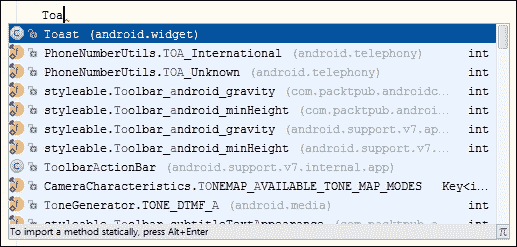
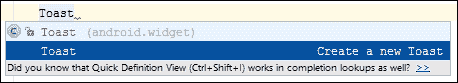
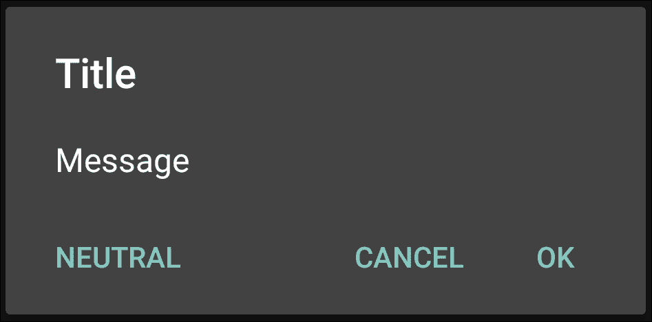
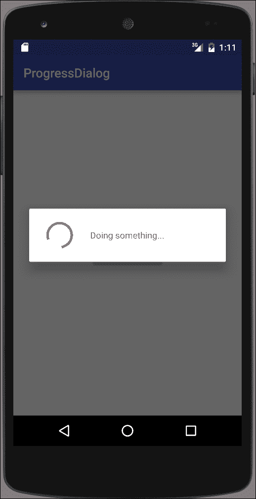
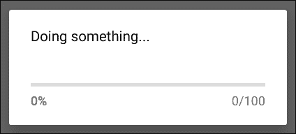
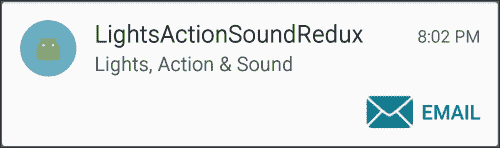
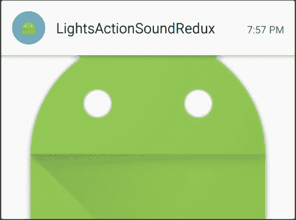

# 第七章. 警报和通知

在本章中，我们将涵盖以下主题：

+   灯光、动作和声音——吸引用户的注意力！

+   使用自定义布局创建 Toast

+   使用 AlertDialog 显示消息框

+   显示进度对话框

+   使用通知的灯光、动作和声音重制版

+   创建一个媒体播放器通知

+   使用抬头显示通知制作手电筒

# 简介

Android 提供了多种方式来通知用户——从非视觉方法，包括声音、灯光和震动，到视觉方法，包括 Toast、对话框和状态栏通知。

请记住，通知会分散用户的注意力，所以在使用任何通知时非常谨慎是个好主意。用户喜欢控制自己的设备（毕竟，那是他们的设备），所以请给他们提供按需启用和禁用通知的选项。否则，您的用户可能会感到烦恼，甚至完全卸载您的应用程序。

我们将首先回顾以下非 UI 基于的通知选项：

+   闪烁 LED

+   震动手机

+   播放铃声

然后，我们将转向视觉通知，包括：

+   Toast

+   `AlertDialog`

+   `ProgressDialog`

+   状态栏通知

下面的食谱将向您展示如何在您的应用程序中实现这些功能。阅读以下链接了解使用通知时的“最佳实践”是值得的：

### 小贴士

请参考[`developer.android.com/design/patterns/notifications.html`](http://developer.android.com/design/patterns/notifications.html)上的**Android 通知设计指南**

# 灯光、动作和声音——吸引用户的注意力！

本章中的大多数食谱都使用通知对象来提醒用户，所以这个食谱将展示当您实际上不需要通知时的替代方法。

正如食谱标题所暗示的，我们将使用灯光、动作和声音：

+   **灯光**：通常，您会使用 LED 设备，但这是通过通知对象提供的，我们将在本章后面演示。相反，我们将利用这个机会使用`setTorchMode()`（在 API 23——Android 6.0 中添加）来使用相机闪光灯作为手电筒。（注意：正如您将在代码中看到的，此功能仅在具有闪光灯的 Android 6.0 设备上工作。） 

+   **动作**：我们将使手机震动。

+   **声音**：我们将使用`RingtoneManager`播放默认的通知声音。

正如您将看到的，这些代码的每个都非常简单。

如以下 *使用通知的“灯光、动作和声音重制”食谱* 所示，所有三个选项：LED、振动和声音，都可通过通知对象获得。当用户没有在您的应用中积极互动时，通知对象无疑是提供警报和提醒的最合适方法。但那些您想在用户使用您的应用时提供反馈的时候，这些选项都是可用的。振动选项是一个很好的例子；如果您想为按钮按下提供触觉反馈（常见于键盘应用），可以直接调用振动方法。

## 准备工作

在 Android Studio 中创建一个新的项目，并将其命名为：`LightsActionSound`。当提示 API 级别时，我们需要 API 21 或更高版本来编译项目。当被提示选择 **Activity 类型** 时，选择 **Empty Activity**。

## 如何做到这一点...

我们将使用三个按钮来启动每个动作，所以首先打开 `activity_main.xml` 并按照以下步骤操作：

1.  将现有的 `<TextView>` 元素替换为以下三个按钮：

    ```java
    <ToggleButton
        android:id="@+id/buttonLights"
        android:layout_width="wrap_content"
        android:layout_height="wrap_content"
        android:text="Lights"
        android:layout_centerHorizontal="true"
        android:layout_above="@+id/buttonAction"
        android:onClick="clickLights" />
    <Button
        android:id="@+id/buttonAction"
        android:layout_width="wrap_content"
        android:layout_height="wrap_content"
        android:text="Action"
        android:layout_centerVertical="true"
        android:layout_centerHorizontal="true"
        android:onClick="clickVibrate"/>
    <Button
        android:id="@+id/buttonSound"
        android:layout_width="wrap_content"
        android:layout_height="wrap_content"
        android:text="Sound"
        android:layout_below="@+id/buttonAction"
        android:layout_centerHorizontal="true"
        android:onClick="clickSound"/>
    ```

1.  将以下权限添加到 Android Manifest 中：

    ```java
    <uses-permission android:name="android.permission.VIBRATE"></uses-permission>
    ```

1.  打开 `ActivityMain.java` 并添加以下全局变量：

    ```java
    private CameraManager mCameraManager;
    private String mCameraId=null;
    private ToggleButton mButtonLights;
    ```

1.  添加以下方法以获取相机 ID：

    ```java
    private String getCameraId() {
        try {
            String[] ids = mCameraManager.getCameraIdList();
            for (String id : ids) {
                CameraCharacteristics c = mCameraManager.getCameraCharacteristics(id);
                Boolean flashAvailable = c.get(CameraCharacteristics.FLASH_INFO_AVAILABLE);
                Integer facingDirection = c.get(CameraCharacteristics.LENS_FACING);
                if (flashAvailable != null && flashAvailable && facingDirection != null && facingDirection == CameraCharacteristics.LENS_FACING_BACK) {
                    return id;
                }
            }
        } catch (CameraAccessException e) {
            e.printStackTrace();
        }
        return null;
    }
    ```

1.  将以下代码添加到 `onCreate()` 方法中：

    ```java
    mButtonLights = (ToggleButton)findViewById(R.id.buttonLights);
    if (Build.VERSION.SDK_INT >= Build.VERSION_CODES.M) {
        mCameraManager = (CameraManager) this.getSystemService(Context.CAMERA_SERVICE);
        mCameraId = getCameraId();
        if (mCameraId==null) {
            mButtonLights.setEnabled(false);
        } else {
            mButtonLights.setEnabled(true);
        }
    } else {
        mButtonLights.setEnabled(false);
    }
    ```

1.  现在添加处理每个按钮点击的代码：

    ```java
    public void clickLights(View view) {
        if (Build.VERSION.SDK_INT >= Build.VERSION_CODES.M) {
            try {
                mCameraManager.setTorchMode(mCameraId, mButtonLights.isChecked());
            } catch (CameraAccessException e) {
                e.printStackTrace();
            }
        }
    }

    public void clickVibrate(View view) {
        ((Vibrator)getSystemService(VIBRATOR_SERVICE)).vibrate(1000);
    }

    public void clickSound(View view) {
        Uri notificationSoundUri = RingtoneManager.getDefaultUri(RingtoneManager.TYPE_NOTIFICATION);
        Ringtone ringtone = RingtoneManager.getRingtone(getApplicationContext(), notificationSoundUri);
        ringtone.play();
    }
    ```

1.  您现在可以运行应用程序在物理设备上了。这里展示的代码需要 Android 6.0（或更高版本）才能使用闪光灯选项。

## 它是如何工作的...

如前几段所示，大部分代码都与查找和打开相机以使用闪光灯功能相关。`setTorchMode()` 是在 API 23 中引入的，这就是为什么我们需要 API 版本检查：

```java
if (Build.VERSION.SDK_INT >= Build.VERSION_CODES.M){}
```

此应用演示了使用新引入的 `camera2` 库，这些库在 Lollipop（API 21）中引入。`vibrate` 和 `ringtone` 方法自 API 1 以来都可用。

`getCameraId()` 方法是我们检查相机的地方。我们想要一个带有闪光灯的外向相机。如果找到了，则返回 ID，否则为 null。如果相机 ID 为 null，则禁用按钮。

对于播放声音，我们使用 `RingtoneManager` 中的 `Ringtone` 对象。除了实现起来相对容易外，这种方法的好处还包括我们可以使用默认的通知声音，如下代码所示：

```java
Uri notificationSoundUri = RingtoneManager.getDefaultUri(RingtoneManager.TYPE_NOTIFICATION);
```

这样，如果用户更改了他们首选的通知声音，我们会自动使用它。

最后是调用振动手机的代码。这是最简单的代码，但它确实需要权限，我们在 Manifest 中添加了权限：

```java
<uses-permission android:name="android.permission.VIBRATE"></uses-permission>
```

## 更多内容...

在生产级应用中，您不希望在不必要的情况下简单地禁用按钮。在这种情况下，有其他方法可以使用相机闪光灯作为手电筒。查看多媒体章节，以获取使用相机的更多示例，我们将再次看到 `getCameraId()` 的使用。

## 相关阅读

+   请参考本章后面的*使用通知对象重置灯光、动作和声音*食谱，以查看使用通知对象等效的功能

+   请参考第十一章，*多媒体*，以了解使用新的相机 API 和其他声音选项的示例

# 使用自定义布局创建 Toast

我们已经在之前的章节中多次使用 Toast，因为它们提供了一种快速简单的方式来显示信息——既适用于用户，也适用于我们在调试时的需要。

之前的所有示例都使用了简单的单行语法，但 Toast 并不局限于这一点。Toast，就像 Android 中的大多数组件一样，可以自定义，正如我们将在本食谱中展示的那样。

Android Studio 提供了一个快捷方式来制作简单的 Toast 语句。当你开始输入 Toast 命令时，按*Ctrl* + *空格键*，你会看到以下内容：



按*Enter*键自动完成。然后，再次按*Ctrl* + *空格键*，你会看到以下内容：



当你再次按*Enter*键时，它会自动完成以下内容：

```java
Toast.makeText(MainActivity.this, "", Toast.LENGTH_SHORT).show();
```

在本食谱中，我们将使用 Toast Builder 来更改默认布局，并使用重力创建一个自定义 Toast，如图所示：


## 准备工作

在 Android Studio 中创建一个新的项目，并将其命名为：`CustomToast`。在提示**活动类型**时，使用默认的**手机和平板**选项，并选择**空活动**。

## 如何操作...

我们将更改 Toast 的形状为正方形，并创建一个自定义布局来显示图像和文本消息。首先打开`activity_main.xml`并按照以下步骤操作：

1.  将现有的`<TextView>`元素替换为`<Button>`，如下所示：

    ```java
    <Button
        android:layout_width="wrap_content"
        android:layout_height="wrap_content"
        android:text="Show Toast"
        android:id="@+id/button"
        android:layout_alignParentTop="true"
        android:layout_centerHorizontal="true"
        android:onClick="showToast"/>
    ```

1.  在`res/drawable`文件夹中创建一个新的资源文件，命名为：`border_square.xml`，并输入以下代码：

    ```java
    <?xml version="1.0" encoding="utf-8"?>
    <layer-list >
        <item
            android:left="4px"
            android:top="4px"
            android:right="4px"
            android:bottom="4px">
            <shape android:shape="rectangle" >
                <solid android:color="@android:color/black" />
                <stroke android:width="5px" android:color="@android:color/white"/>
            </shape>
        </item>
    </layer-list>
    ```

1.  在`res/layout`文件夹中创建一个新的资源文件，命名为：`toast_custom.xml`，并输入以下代码：

    ```java
    <?xml version="1.0" encoding="utf-8"?>
    <LinearLayout 
        android:id="@+id/toast_layout_root"
        android:layout_width="match_parent"
        android:layout_height="match_parent"
        android:orientation="horizontal"
        android:background="@drawable/border_square">
        <ImageView
            android:layout_width="wrap_content"
            android:layout_height="wrap_content"
            android:id="@+id/imageView"
            android:layout_weight="1"
            android:src="img/ic_launcher" />
        <TextView
            android:id="@android:id/message"
            android:layout_width="0dp"
            android:layout_height="match_parent"
            android:layout_weight="1"
            android:textColor="@android:color/white"
            android:padding="10dp" />
    </LinearLayout>
    ```

1.  现在打开`ActivityMain.java`并输入以下方法：

    ```java
    public void showToast(View view) {
        LayoutInflater inflater = (LayoutInflater)this.getSystemService(Context.LAYOUT_INFLATER_SERVICE);
        View layout = inflater.inflate(R.layout.toast_custom, null);
        ((TextView) layout.findViewById(android.R.id.message)).setText("Custom Toast");
        Toast toast = new Toast(this);
        toast.setGravity(Gravity.CENTER, 0, 0);
        toast.setDuration(Toast.LENGTH_LONG);
        toast.setView(layout);
        toast.show();
    }
    ```

1.  在设备或模拟器上运行程序。

## 它是如何工作的...

这个自定义 Toast 更改了默认的重力、形状，并添加了一个图像，仅为了展示“它可以做到”。

第一步是创建一个新的 Toast 布局，我们通过填充我们的`custom_toast`布局来实现。一旦我们有了新的布局，我们需要获取`TextView`以便我们可以设置我们的消息，我们使用标准的`setText()`方法来完成。完成此操作后，我们创建一个 Toast 对象并设置其单个属性。我们使用`setGravity()`方法设置 Toast 的重力。重力决定了 Toast 将在屏幕上的哪个位置显示。我们使用`setView()`方法调用指定我们的自定义布局。就像在单行变体中一样，我们使用`show()`方法显示 Toast。

# 使用 AlertDialog 显示消息框

在第四章“菜单”中，我们创建了一个主题，使 Activity 看起来像对话框。在本例中，我们将演示如何使用`AlertDialog`类创建对话框。`AlertDialog`提供了一个标题，最多三个按钮，以及一个列表或自定义布局区域，如本例所示：



### 注意

按钮位置可能会根据操作系统版本的不同而有所变化。

## 准备工作

在 Android Studio 中创建一个新的项目，并将其命名为：`AlertDialog`。使用默认的**手机和平板**选项，并在提示**活动类型**时选择**空活动**选项。

## 如何操作...

为了演示，我们将创建一个**确认删除**对话框，在按下*删除*按钮后提示用户确认。首先打开`main_activity.xml`布局文件，并按照以下步骤操作：

1.  添加以下`<Button>`：

    ```java
    <Button
        android:id="@+id/buttonClose"
        android:layout_width="wrap_content"
        android:layout_height="wrap_content"
        android:text="Delete"
        android:layout_centerVertical="true"
        android:layout_centerHorizontal="true"
        android:onClick="confirmDelete"/>
    ```

1.  添加由按钮调用的`confirmDelete()`方法：

    ```java
    public void confirmDelete(View view) {
        AlertDialog.Builder builder = new AlertDialog.Builder(this);
        builder.setTitle("Delete")
            .setMessage("Are you sure you?")
            .setPositiveButton(android.R.string.ok, new DialogInterface.OnClickListener() {
                public void onClick(DialogInterface dialog, int id) {
                    Toast.makeText(MainActivity.this, "OK Pressed", Toast.LENGTH_SHORT).show();
            }})
            .setNegativeButton(android.R.string.cancel, new DialogInterface.OnClickListener() {
                public void onClick(DialogInterface dialog, int id) {
                    Toast.makeText(MainActivity.this, "Cancel Pressed", Toast.LENGTH_SHORT).show();
            }});
        builder.create().show();
    }
    ```

1.  在设备或模拟器上运行应用程序。

## 工作原理...

此对话框旨在作为一个简单的确认对话框——例如确认删除操作。基本上，只需创建一个`AlertDialog.Builder`对象，并根据需要设置属性。我们使用 Toast 消息来指示用户选择，甚至不需要关闭对话框；这由基类处理。

## 还有更多...

如食谱介绍截图所示，`AlertDialog`还有一个名为中立按钮的第三个按钮，可以使用以下方法设置：

```java
builder.setNeutralButton()
```

### 添加图标

要向对话框添加图标，请使用`setIcon()`方法。以下是一个示例：

```java
.setIcon(R.mipmap.ic_launcher)
```

### 使用列表

我们还可以使用各种列表设置方法创建一个用于选择的项列表，包括：

```java
.setItems()
.setAdapter()
.setSingleChoiceItems()
.setMultiChoiceItems()
```

如您所见，还有用于单选（使用单选按钮）和多选列表（使用复选框）的方法。

### 小贴士

您不能同时使用消息和列表，因为`setMessage()`将具有优先级。

### 自定义布局

最后，我们还可以创建一个自定义布局，并使用以下方法设置：

```java
.setView()
```

如果您使用自定义布局并替换标准按钮，您还负责关闭对话框。如果您计划重用对话框，请使用`hide()`；完成时使用`dismiss()`来释放资源。

# 显示进度对话框

`ProgressDialog`自 API 1 以来一直可用，并且被广泛使用。正如我们将在本例中演示的那样，它简单易用，但请记住以下声明（来自 Android 对话框指南网站）：

> 避免使用 ProgressDialog
> 
> Android 还包括另一个名为 ProgressDialog 的对话框类，它显示带有进度条的对话框。但是，如果您需要指示加载或不确定的进度，您应遵循进度和活动的设计指南，并在布局中使用 ProgressBar。

[`developer.android.com/guide/topics/ui/dialogs.html`](http://developer.android.com/guide/topics/ui/dialogs.html)

这条消息并不意味着 `ProgressDialog` 已被弃用或代码不好。它只是建议应避免使用 `ProgressDialog`，因为当对话框显示时，用户无法与你的应用交互。如果可能，使用包含进度条的布局，而不是使用 `ProgressDialog`。

Google Play 应用提供了一个很好的例子。在添加下载项时，Google Play 会显示一个进度条，但它不是一个对话框，因此用户可以继续与应用交互，甚至可以添加更多下载项。如果可能，请使用那种方法。

有时候你可能没有这样的奢侈，比如在下单后，用户会期待订单确认。（即使是在 Google Play 上，在购买应用时你仍然会看到一个确认对话框。）所以，记住，如果可能的话，避免使用进度对话框。但是，对于那些必须完成某些操作才能继续的情况，这个配方提供了一个如何使用 `ProgressDialog` 的示例。以下截图显示了配方中的 `ProgressDialog`：



## 准备工作

在 Android Studio 中创建一个新的项目，并将其命名为：`ProgressDialog`。使用默认的 **Phone & Tablet** 选项，并在提示选择 **Activity Type** 时选择 **Empty Activity**。

## 如何操作...

1.  由于这只是一个关于使用 `ProgressDialog` 的演示，我们将创建一个按钮来显示对话框。为了模拟等待服务器响应，我们将使用延迟消息来关闭对话框。首先，打开 `activity_main.xml` 并按照以下步骤操作：

1.  将 `<TextView>` 替换为以下 `<Button>`：

    ```java
    <Button
        android:layout_width="wrap_content"
        android:layout_height="wrap_content"
        android:text="Show Dialog"
        android:id="@+id/button"
        android:layout_centerVertical="true"
        android:layout_centerHorizontal="true"
        android:onClick="startProgress"/>
    ```

1.  打开 `MainActivity.java` 并添加以下两个全局变量：

    ```java
    private ProgressDialog mDialog;
    final int THIRTY_SECONDS=30*1000;
    ```

1.  添加按钮点击时引用的 `showDialog()` 方法：

    ```java
    public void startProgress(View view) {
        mDialog= new ProgressDialog(this);
        mDialog.setMessage("Doing something...");
        mDialog.setCancelable(false);
        mDialog.show();
        new Handler().postDelayed(new Runnable() {
            public void run() {
                mDialog.dismiss();
            }}, THIRTY_SECONDS);
    ```

1.  在设备或模拟器上运行程序。当你按下 **Show Dialog** 按钮时，你会看到如图所示的对话框。

## 它是如何工作的...

我们使用 `ProgressDialog` 类来显示对话框。选项应该是自解释的，但这个设置值得注意：

```java
mDialog.setCancelable(false);
```

通常，对话框可以通过 *返回* 键取消，但当你将其设置为 false 时，用户将卡在对话框上，直到它从代码中隐藏/消失。为了模拟服务器响应的延迟，我们使用 `Handler` 和 `postDelayed()` 方法。在指定的毫秒数（本例中为 30,000 毫秒，代表 30 秒）后，`run()` 方法将被调用，这将关闭我们的对话框。

## 还有更多...

我们为这个配方使用了默认的 `ProgressDialog` 设置，这会创建一个不确定的对话框指示器，例如，持续旋转的圆圈。如果你可以测量手头的任务，例如加载文件，你可以使用确定样式。添加并运行以下代码行：

```java
mDialog.setProgressStyle(ProgressDialog.STYLE_HORIZONTAL);
```

你将得到以下对话框样式作为前一行代码的输出：



# 使用通知重演灯光、动作和声音

您可能已经熟悉通知功能了，因为它们已经成为一个突出的特性（甚至进入桌面环境），而且有充分的理由。它们为向用户发送信息提供了极佳的方式。它们提供了所有可用警报和通知选项中最不干扰的选择。

正如我们在第一个配方中看到的，*灯光、动作和声音 – 引起用户的注意！*，灯光、振动和声音对于引起用户的注意都非常有用。这就是为什么通知对象包括对这三种方法的支持，我们将在本配方中展示。鉴于这种引起用户注意的能力，仍然应该注意不要滥用用户。否则，他们可能会卸载您的应用。通常，给用户选择启用/禁用通知以及如何呈现通知（带声音或无声等）是一个好主意。

## 准备工作

在 Android Studio 中创建一个新的项目，并将其命名为：`LightsActionSoundRedux`。使用默认的**手机和平板**选项，并在提示**活动类型**时选择**空活动**。

## 如何实现...

我们需要权限来使用振动选项，所以首先打开 Android Manifest 文件，并按照以下步骤操作：

1.  添加以下权限：

    ```java
    <uses-permission android:name="android.permission.VIBRATE"/>
    ```

1.  打开`activity_main.xml`，并用以下按钮替换现有的`<TextView>`：

    ```java
    <Button
        android:id="@+id/buttonSound"
        android:layout_width="wrap_content"
        android:layout_height="wrap_content"
        android:text="Lights, Action, and Sound"
        android:layout_centerVertical="true"
        android:layout_centerHorizontal="true"
        android:onClick="clickLightsActionSound"/>
    ```

1.  现在打开`MainActivity.java`，并添加以下方法来处理按钮点击：

    ```java
    public void clickLightsActionSound(View view) {
        Uri notificationSoundUri = RingtoneManager.getDefaultUri(RingtoneManager.TYPE_NOTIFICATION);
        NotificationCompat.Builder notificationBuilder = new NotificationCompat.Builder(this)
            .setSmallIcon(R.mipmap.ic_launcher)
            .setContentTitle("LightsActionSoundRedux")
            .setContentText("Lights, Action & Sound")
            .setSound(notificationSoundUri)
            .setLights(Color.BLUE, 500, 500)
            .setVibrate(new long[]{250,500,250,500,250,500});
        NotificationManager notificationManager = (NotificationManager) this.getSystemService(Context.NOTIFICATION_SERVICE);
        notificationManager.notify(0, notificationBuilder.build());
    }
    ```

1.  在设备或模拟器上运行程序。

## 它是如何工作的...

首先，我们因为可以做到，所以将所有三个动作合并为一个单一的通知。您不必使用所有三个额外的通知选项，甚至不需要任何。只需以下内容是必需的：

```java
.setSmallIcon()
.setContentText()
```

如果您没有设置图标和文本，通知将不会显示。

第二，我们使用了`NotificationCompat`来构建我们的通知。这来自支持库，使得与较老的操作系版本向后兼容变得更容易。如果我们请求用户操作系统中不可用的通知功能，它将被简单地忽略。

产生我们额外通知选项的三个代码行包括以下内容：

```java
.setSound(notificationSoundUri)
.setLights(Color.BLUE, 500, 500)
.setVibrate(new long[]{250,500,250,500,250,500});
```

值得注意的是，我们使用与之前*灯光、动作和声音*配方中`RingtoneManager`相同的音效 URI 来与通知一起使用。振动功能也需要与之前配方相同的振动权限，但请注意我们发送的值是不同的。我们不是只发送振动的持续时间，而是发送一个振动模式。第一个值代表`关闭`持续时间（以毫秒为单位），下一个值代表振动`开启`持续时间，并重复。

### 小贴士

在带有 LED 通知功能的设备上，当屏幕处于活动状态时，您将看不到 LED 通知。

## 更多内容...

这个配方展示了通知的基本知识，但就像 Android 上的许多功能一样，选项随着后续操作系统的发布而扩展。

### 使用 addAction()添加按钮到通知

在添加操作按钮时，你应该注意几个设计考虑因素，如章节引言中链接的通知指南中所述。你可以在通知构建器上使用`addAction()`方法添加一个按钮（最多三个）。以下是一个包含一个操作按钮的通知示例：



这是创建此通知的代码：

```java
NotificationCompat.Builder notificationBuilder = new NotificationCompat.Builder(this).setSmallIcon(R.mipmap.ic_launcher)
        .setContentTitle("LightsActionSoundRedux")
        .setContentText("Lights, Action & Sound");
Intent activityIntent = new Intent(this,MainActivity.class);
PendingIntent pendingIntent = PendingIntent.getActivity(this,0,activityIntent,0);
notificationBuilder.addAction(android.R.drawable.ic_dialog_email, "Email", pendingIntent);
notificationManager.notify(0, notificationBuilder.build());
```

一个`Action`需要三个参数——图像、文本和一个`PendingIntent`。前两项用于视觉显示，而第三项，即`PendingIntent`，在用户按下按钮时被调用。

之前的代码创建了一个非常简单的`PendingIntent`；它只是启动应用。这可能是通知中最常见的意图，通常用于用户按下通知时。要设置通知意图，请使用以下代码：

```java
.setContentIntent(pendingIntent)
```

按钮操作可能需要更多信息，因为它应将用户带到应用中的特定项目。你还应该创建一个应用程序回退栈以获得最佳用户体验。请参阅以下链接中的主题“**启动 Activity 时保留导航**”：

[`developer.android.com/guide/topics/ui/notifiers/notifications.html#NotificationResponse`](http://developer.android.com/guide/topics/ui/notifiers/notifications.html#NotificationResponse)

### 展开的通知

展开的通知自 Android 4.1（API 16）引入，可以通过在通知构建器上使用`setStyle()`方法来使用。如果用户的操作系统不支持展开的通知，通知将显示为正常通知。

目前在`NotificationCompat`库中可用的三种展开样式包括：

+   `InboxStyle`

+   `BigPictureStyle`

+   `BigTextStyle`

这里是每种通知样式的示例，以及创建示例所使用的代码：


+   `InboxStyle`:

    ```java
    NotificationCompat.Builder notificationBuilderInboxStyle = new NotificationCompat.Builder(this).setSmallIcon(R.mipmap.ic_launcher);
    NotificationCompat.InboxStyle inboxStyle = new NotificationCompat.InboxStyle();
    inboxStyle.setBigContentTitle("InboxStyle - Big Content Title")
        .addLine("Line 1")
        .addLine("Line 2");
    notificationBuilderInboxStyle.setStyle(inboxStyle);
    notificationManager.notify(0, notificationBuilderInboxStyle.build());
    ```

    

+   `BigPictureStyle`:

    ```java
    NotificationCompat.Builder notificationBuilderBigPictureStyle = new NotificationCompat.Builder(this).setSmallIcon(R.mipmap.ic_launcher).setContentTitle("LightsActionSoundRedux").setContentText("BigPictureStyle");
    NotificationCompat.BigPictureStyle bigPictureStyle = new NotificationCompat.BigPictureStyle();
    bigPictureStyle.bigPicture(BitmapFactory.decodeResource(getResources(), R.mipmap.ic_launcher));
    notificationBuilderBigPictureStyle.setStyle(bigPictureStyle);
    notificationManager.notify(0, notificationBuilderBigPictureStyle.build());
    ```

    

+   `BigTextStyle`

    ```java
    NotificationCompat.Builder notificationBuilderBigTextStyle = new NotificationCompat.Builder(this).setSmallIcon(R.mipmap.ic_launcher).setContentTitle("LightsActionSoundRedux");
    NotificationCompat.BigTextStyle BigTextStyle = new NotificationCompat.BigTextStyle();
    BigTextStyle.bigText("This is an example of the BigTextStyle expanded notification.");
    notificationBuilderBigTextStyle.setStyle(BigTextStyle);
    notificationManager.notify(0, notificationBuilderBigTextStyle.build());
    ```

### 锁屏通知

Android 5.0（API 21）及以上版本可以根据用户的锁屏可见性在锁屏上显示通知。使用`setVisibility()`指定通知可见性，以下是一些值：

+   `VISIBILITY_PUBLIC`: 可以显示所有内容

+   `VISIBILITY_SECRET`: 不应显示任何内容

+   `VISIBILITY_PRIVATE`: 显示基本内容（标题和图标），但其余内容被隐藏

## 参见

+   参见“创建媒体播放器通知”和“使用抬头显示通知制作手电筒”的配方，以获取 Android 5.0（API 21）及以上版本中额外的通知选项

# 创建一个媒体播放器通知

这个菜谱将要探讨 Android 5.0（API 21）中引入的新媒体播放器样式。与之前使用`NotificationCompat`的菜谱不同，即*使用通知的“灯光、动作和声音重制”，这个菜谱不使用`NotificationCompat`，因为这个样式在支持库中不可用。

这是一张显示通知将如何显示的截图：


这张截图显示了锁屏上媒体播放器通知的示例：


## 准备工作

在 Android Studio 中创建一个新的项目，并将其命名为：`MediaPlayerNotification`。当提示 API 级别时，我们需要为这个项目选择 API 21（或更高）。当被提示选择**Activity 类型**时，选择**Empty Activity**。

## 如何实现...

我们只需要一个按钮来调用我们的代码以发送通知。打开`activity_main.xml`并按照以下步骤操作：

1.  用以下按钮代码替换现有的`<TextView>`：

    ```java
    <Button
        android:layout_width="wrap_content"
        android:layout_height="wrap_content"
        android:text="Show Notification"
        android:id="@+id/button"
        android:layout_centerVertical="true"
        android:layout_centerHorizontal="true"
        android:onClick="showNotification"/>
    ```

1.  打开`MainActivity.java`并添加`showNotification()`方法：

    ```java
    @Deprecated
    public void showNotification(View view) {
        Intent activityIntent = new Intent(this,MainActivity.class);
        PendingIntent pendingIntent = PendingIntent.getActivity(this, 0, activityIntent, 0);

        Notification notification;
        if (Build.VERSION.SDK_INT >= Build.VERSION_CODES.M) {
            notification = new Notification.Builder(this).setVisibility(Notification.VISIBILITY_PUBLIC)
                .setSmallIcon(Icon.createWithResource(this, R.mipmap.ic_launcher))
                .addAction(new Notification.Action.Builder(Icon.createWithResource(this, android.R.drawable.ic_media_previous), "Previous", pendingIntent).build())
                .addAction(new Notification.Action.Builder(Icon.createWithResource(this, android.R.drawable.ic_media_pause), "Pause", pendingIntent).build())
                .addAction(new Notification.Action.Builder(Icon.createWithResource(this, android.R.drawable.ic_media_next), "Next", pendingIntent).build())
                .setContentTitle("Music")
                .setContentText("Now playing...")
                .setLargeIcon(Icon.createWithResource(this, R.mipmap.ic_launcher))
                .setStyle(new Notification.MediaStyle().setShowActionsInCompactView(1)).build();
        } else {
            notification = new Notification.Builder(this)
                .setVisibility(Notification.VISIBILITY_PUBLIC)
                .setSmallIcon(R.mipmap.ic_launcher)
                .addAction(new Notification.Action.Builder(android.R.drawable.ic_media_previous, "Previous", pendingIntent).build())
                .addAction(new Notification.Action.Builder(android.R.drawable.ic_media_pause, "Pause", pendingIntent).build())
                .addAction(new Notification.Action.Builder(android.R.drawable.ic_media_next, "Next", pendingIntent).build())
                .setContentTitle("Music")
                .setContentText("Now playing...")
                .setLargeIcon(BitmapFactory.decodeResource(getResources(), R.mipmap.ic_launcher))
                .setStyle(new Notification.MediaStyle()
                .setShowActionsInCompactView(1)).build();
        }
        NotificationManager notificationManager = (NotificationManager) this.getSystemService(Context.NOTIFICATION_SERVICE);
        notificationManager.notify(0, notification);
    }
    ```

1.  在设备或模拟器上运行程序。

## 它是如何工作的...

首先要注意的细节是，我们在`showNotification()`方法上进行了装饰：

```java
@Deprecated
```

这告诉编译器我们知道我们正在使用已弃用的调用。（如果没有这个，编译器将会标记代码。）我们接着进行 API 检查，使用以下调用：

```java
if (Build.VERSION.SDK_INT >= Build.VERSION_CODES.M)
```

API 23 中改变了图标资源，但我们要使这个应用程序在 API 21（Android 5.0）及更高版本上运行，因此当在 API 21 和 API 22 上运行时，我们仍然需要调用旧的方法。

如果用户正在运行 Android 6.0（或更高版本），我们使用新的`Icon`类来创建我们的图标，否则我们使用旧的构造函数。（您会注意到 IDE 会以删除线显示已弃用的调用。）在运行时检查当前操作系统版本是保持向后兼容的常见策略。

我们使用`addAction()`创建三个操作来处理媒体播放器功能。由于我们实际上并没有媒体播放器在运行，所以我们为所有操作使用相同的 intent，但您可能希望在您的应用程序中为每个操作创建单独的 intent。

要使通知在锁屏上可见，我们需要将可见性级别设置为`VISIBILITY_PUBLIC`，这可以通过以下调用完成：

```java
.setVisibility(Notification.VISIBILITY_PUBLIC)
```

这个调用值得注意：

```java
.setShowActionsInCompactView(1)
```

正如方法名所暗示的，这将在通知以简化布局显示时设置要显示的操作。（参见菜谱介绍中的锁屏图像。）

## 还有更多...

在这个菜谱中，我们只创建了视觉通知。如果我们正在创建一个实际的媒体播放器，我们可以实例化一个`MediaSession`类，并通过这个调用传入会话令牌：

```java
.setMediaSession(mMediaSession.getSessionToken())
```

这将允许系统识别媒体内容并相应地做出反应，例如更新锁屏上的当前专辑封面。

## 参见

+   请参考[开发者文档 – 媒体会话](https://developer.android.com/reference/android/media/session/MediaSession.html)。

+   在*使用通知的灯光、动作和声音 Redux*菜谱中，*锁屏可见性*部分讨论了可见性选项。

# 使用抬头显示通知制作手电筒

Android 5.0—Lollipop（API 21）引入了一种新的通知类型，称为抬头显示通知。许多人不喜欢这种新的通知，因为它可能会非常侵扰性，因为它会强制其方式覆盖其他应用程序。（见以下截图。）在使用此类通知时请记住这一点。我们将通过使用手电筒来演示抬头显示通知，因为这展示了良好的用例场景。

这是一张显示我们将创建的抬头显示通知的截图：


如果你有一台运行 Android 6.0 的设备，你可能已经注意到了新的闪光灯设置选项。作为演示，我们将在本菜谱中创建类似的功能。

## 准备工作

在 Android Studio 中创建一个新的项目，并将其命名为：`FlashlightWithHeadsUp`。当提示 API 级别时，我们需要 API 23（或更高）来使用这个项目。当被提示选择**活动类型**时，选择**空活动**。

## 如何做到这一点...

我们的活动布局将只包含一个`ToggleButton`来控制手电筒模式。我们将使用与之前展示的*灯光、动作和声音 – 引起用户的注意!*菜谱中相同的`setTorchMode()`代码，并添加一个抬头显示通知。我们需要权限来使用振动选项，因此首先打开 AndroidManifest 并按照以下步骤操作：

1.  添加以下权限：

    ```java
    <uses-permission android:name="android.permission.VIBRATE"/>
    ```

1.  通过在`<MainActivity>`元素中添加`android:launchMode="singleInstance"`来指定我们只想有一个`MainActivity`的实例。它看起来如下所示：

    ```java
    <activity android:name=".MainActivity"
        android:launchMode="singleInstance">
    ```

1.  在完成对`AndroidManifest`的更改后，打开`activity_main.xml`布局，并用以下`<ToggleButton>`代码替换现有的`<TextView>`元素：

    ```java
    <ToggleButton
        android:id="@+id/buttonLight"
        android:layout_width="wrap_content"
        android:layout_height="wrap_content"
        android:text="Flashlight"
        android:layout_centerVertical="true"
        android:layout_centerHorizontal="true"
        android:onClick="clickLight"/>
    ```

1.  现在打开`ActivityMain.java`并添加以下全局变量：

    ```java
    private static final String ACTION_STOP="STOP";
    private CameraManager mCameraManager;
    private String mCameraId=null;
    private ToggleButton mButtonLight;
    ```

1.  将以下代码添加到`onCreate()`中，以设置相机：

    ```java
    mButtonLight = (ToggleButton)findViewById(R.id.buttonLight);

    mCameraManager = (CameraManager) this.getSystemService(Context.CAMERA_SERVICE);
    mCameraId = getCameraId();
    if (mCameraId==null) {
        mButtonLight.setEnabled(false);
    } else {
        mButtonLight.setEnabled(true);
    }
    ```

1.  添加以下方法来处理用户按下通知时的响应：

    ```java
    @Override
    protected void onNewIntent(Intent intent) {
        super.onNewIntent(intent);
        if (ACTION_STOP.equals(intent.getAction())) {
            setFlashlight(false);
        }
    }
    ```

1.  添加获取相机 ID 的方法：

    ```java
    private String getCameraId() {
        try {
            String[] ids = mCameraManager.getCameraIdList();
            for (String id : ids) {
                CameraCharacteristics c = mCameraManager.getCameraCharacteristics(id);
                Boolean flashAvailable = c.get(CameraCharacteristics.FLASH_INFO_AVAILABLE);
                Integer facingDirection = c.get(CameraCharacteristics.LENS_FACING);
                if (flashAvailable != null && flashAvailable && facingDirection != null && facingDirection == CameraCharacteristics.LENS_FACING_BACK) {
                    return id;
                }
            }
        } catch (CameraAccessException e) {
            e.printStackTrace();
        }
        return null;
    }
    ```

1.  添加这两个方法来处理手电筒模式：

    ```java
    public void clickLight(View view) {
        setFlashlight(mButtonLight.isChecked());
        if (mButtonLight.isChecked()) {
            showNotification();
        }
    }

    private void setFlashlight(boolean enabled) {
        mButtonLight.setChecked(enabled);
        try {
            mCameraManager.setTorchMode(mCameraId, enabled);
        } catch (CameraAccessException e) {
            e.printStackTrace();
        }
    }
    ```

1.  最后，添加此方法来创建通知：

    ```java
    private void showNotification() {
        Intent activityIntent = new Intent(this,MainActivity.class);
        activityIntent.setAction(ACTION_STOP);
        PendingIntent pendingIntent = PendingIntent.getActivity(this,0,activityIntent,0);
        final Builder notificationBuilder = new Builder(this).setContentTitle("Flashlight")
            .setContentText("Press to turn off the flashlight")
            .setSmallIcon(R.mipmap.ic_launcher)
            .setLargeIcon(BitmapFactory.decodeResource(getResources(), R.mipmap.ic_launcher))
            .setContentIntent(pendingIntent)
            .setVibrate(new long[]{DEFAULT_VIBRATE})
            .setPriority(PRIORITY_MAX);
        NotificationManager notificationManager = (NotificationManager) this.getSystemService(Context.NOTIFICATION_SERVICE);
        notificationManager.notify(0, notificationBuilder.build());
    }
    ```

1.  你已经准备好在物理设备上运行应用程序了。如前所述，你需要一台 Android 6.0（或更高版本）的设备，并且具有外置摄像头闪光灯。

## 它是如何工作的...

由于这个菜谱使用与*灯光、动作和声音 – 引起用户的注意!*相同的闪光灯代码，我们将跳转到`showNotification()`方法。大多数通知构建器调用与之前的示例相同，但有两大显著差异：

```java
.setVibrate()
.setPriority(PRIORITY_MAX)
```

### 小贴士

除非优先级设置为 `HIGH`（或更高），并且使用振动或声音，否则通知不会被提升为“抬头显示”通知。

注意以下内容，这是在开发者文档中给出的：[`developer.android.com/reference/android/app/Notification.html#headsUpContentView`](http://developer.android.com/reference/android/app/Notification.html#headsUpContentView)

“系统界面可以自行决定是否将其显示为“抬头显示”通知。”

我们创建一个 `PendingIntent`，就像我们之前做的那样，但在这里我们使用以下方式设置动作：

```java
activityIntent.setAction(ACTION_STOP);
```

我们在 `AndroidManifest` 文件中将应用程序设置为只允许一个实例，因为我们不希望在用户按下通知时启动应用程序的新实例。我们创建的 `PendingIntent` 设置了动作，我们在 `onNewIntent()` 回调中检查这个动作。如果用户在不按下通知的情况下打开应用程序，他们仍然可以使用 `ToggleButton` 禁用手电筒。

## 还有更多...

就像之前在 *使用自定义布局创建吐司* 的食谱中一样，我们可以在通知中使用自定义布局。在构建器上使用以下方法来指定布局：

```java
headsupContentView()
```

## 参见

+   请参阅 *灯光、动作和声音 – 引起用户的注意!* 食谱
