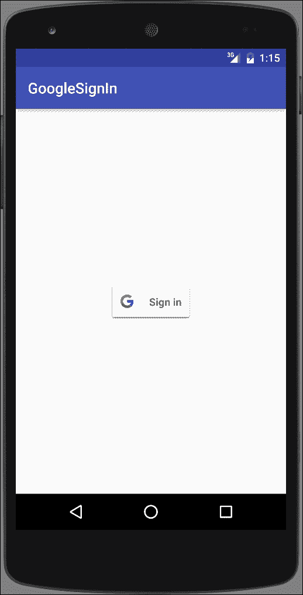

# 第十四章。让你的应用为 Play Store 做好准备

在本章中，我们将涵盖以下主题：

+   新的 Android 6.0 运行时权限模型

+   如何安排闹钟

+   接收设备启动通知

+   使用 AsyncTask 进行后台工作

+   将语音识别添加到你的应用中

+   使用 Google Cloud Messaging 进行推送通知

+   如何将 Google sign-in 添加到你的应用

# 简介

随着我们接近本书的结尾，是时候在你将应用发布到 Play Store 之前，给你的应用添加一些最后的修饰了。本章中的菜谱涵盖了那些可能让用户保留还是删除你的应用的话题。

我们的第一道菜谱，*新的 Android 6.0 运行时权限模型*，无疑是一个重要的话题，可能是 Android 从 5.x 版本跃升至 6.0 版本的主要原因！对 Android 权限模型的改变已经呼吁了一段时间，所以这个新模型是一个受欢迎的改变，至少对于用户来说是这样。

接下来，我们将探讨在 Android 中使用闹钟。闹钟的主要好处之一是操作系统负责维护闹钟，即使你的应用没有运行。由于闹钟在设备重启后不会持续存在，我们还将探讨如何检测设备重启，这样你就可以在*接收设备启动通知*中重新创建你的闹钟。

几乎任何严肃的 Android 应用都需要一种方法来在主线程之外执行可能阻塞的任务。否则，你的应用可能会被认为运行缓慢，或者更糟，完全无响应。`AsyncTask`就是为了使创建后台工作任务变得更加容易而设计的，正如我们将在*使用 AsyncTask 进行后台工作*菜谱中所展示的那样。

如果你希望你的应用能够从免提输入或语音识别中受益，请查看*将语音识别添加到你的应用中*菜谱，我们将探讨 Google 语音 API。

与用户通信的最有趣的功能之一可能是推送通知或**Google Cloud Messaging**（**GCM**），正如谷歌所称呼的。*使用 Google Cloud Messaging 进行推送通知*菜谱将指导你如何将 GCM 添加到你的应用中，并解释更大的背景。

最后，我们将以一个菜谱结束本章，展示如何让你的应用更加舒适，并鼓励用户使用*如何将 Google Sign-In 添加到你的应用*菜谱进行登录。

# 新的 Android 6.0 运行时权限模型

旧的安全模型是 Android 中许多人的痛点。经常可以看到评论中提到应用所需的权限。有时，权限超出了界限（比如手电筒应用需要互联网权限），但有时，开发者有很好的理由请求某些权限。主要问题是这是一个全有或全无的选择。

这最终随着 Android 6 Marshmallow（API 23）的发布而改变。新的权限模型仍然在清单中声明权限，就像之前一样，但用户可以选择性地接受或拒绝每个权限。用户甚至可以撤销之前授予的权限。

虽然这对许多人来说是一个受欢迎的变革；然而，对于开发者来说，它有可能破坏之前正常工作的代码。我们已经在之前的菜谱中讨论了此权限变更，因为它具有深远的影响。这个菜谱将把所有这些放在一起，以便在您自己的应用中实施此更改时作为一个单独的参考点。

一个需要记住的重要点是，此更改仅影响 Android 6.0（API 23）及以上的用户。

## 准备工作

在 Android Studio 中创建一个新的项目，并将其命名为 `RuntimePermission`。使用默认的 **Phone & Tablet** 选项，并在提示 **Activity Type** 时选择 **Empty Activity**。

示例源代码将最小 API 设置为 23，但这不是必需的。如果您的 `compileSdkVersion` 是 API 23 或更高，编译器将标记您的代码以使用新的安全模型。

## 如何操作...

我们需要首先将所需的权限添加到清单中，然后我们将添加一个按钮来调用检查权限的代码。打开 Android 清单并按照以下步骤操作：

1.  添加以下权限：

    ```java
    <uses-permission android:name="android.permission.SEND_SMS"/>
    ```

1.  打开 `activity_main.xml` 并将现有的 `TextView` 替换为以下按钮：

    ```java
    <Button
        android:id="@+id/button"
        android:layout_width="wrap_content"
        android:layout_height="wrap_content"
        android:text="Do Something"
        android:layout_centerInParent="true"
        android:onClick="doSomething"/>
    ```

1.  打开 `MainActivity.java` 并将以下常量添加到类中：

    ```java
    private final int REQUEST_PERMISSION_SEND_SMS=1;
    ```

1.  添加此方法以进行权限检查：

    ```java
    private boolean checkPermission(String permission) {
        int permissionCheck = ContextCompat.checkSelfPermission(
                this, permission);
        return (permissionCheck == PackageManager.PERMISSION_GRANTED);
    }
    ```

1.  添加此方法以显示解释对话框：

    ```java
    private void showExplanation(String title,
        String message, final String permission, final int permissionRequestCode) {
        AlertDialog.Builder builder = new AlertDialog.Builder(this);
        builder.setTitle(title).setMessage(message).setPositiveButton(android.R.string.ok, new DialogInterface.OnClickListener() {
            public void onClick(DialogInterface dialog, int id) {
                requestPermission(permission, permissionRequestCode);
            }
        });
        builder.create().show();
    }
    ```

1.  添加此方法以请求权限：

    ```java
    private void requestPermission(String permissionName, int permissionRequestCode) {
        ActivityCompat.requestPermissions(this, new String[]{permissionName}, permissionRequestCode);
    }
    ```

1.  添加按钮点击的方法：

    ```java
    public void doSomething(View view) {
        if (!checkPermission(Manifest.permission.SEND_SMS)) {
            if (ActivityCompat.shouldShowRequestPermissionRationale(this, Manifest.permission.SEND_SMS)) {
                showExplanation("Permission Needed", "Rationale", Manifest.permission.SEND_SMS, REQUEST_PERMISSION_SEND_SMS);
            } else {
                requestPermission(Manifest.permission.SEND_SMS, REQUEST_PERMISSION_SEND_SMS);
            }
        } else {
            Toast.makeText(MainActivity.this, "Permission (already) Granted!", Toast.LENGTH_SHORT).show();
        }
    }
    ```

1.  如下重写 `onRequestPermissionsResult()`：

    ```java
    @Override
    public void onRequestPermissionsResult(
        int requestCode,
        String permissions[],
        int[] grantResults) {
        switch (requestCode) {
            case REQUEST_PERMISSION_SEND_SMS: {
                if (grantResults.length > 0 && grantResults[0] == PackageManager.PERMISSION_GRANTED) {
                    Toast.makeText(MainActivity.this, "Permission Granted!", Toast.LENGTH_SHORT).show();
                } else {
                    Toast.makeText(MainActivity.this, "Permission Denied!", Toast.LENGTH_SHORT).show();
                }
                return;
            }
        }
    }
    ```

1.  现在，您已经准备好在设备或模拟器上运行应用程序了。

## 工作原理...

使用新的运行时权限模型涉及以下步骤：

1.  检查您是否具有所需的权限。

1.  如果不是，检查是否应该显示理由（即，请求之前已被拒绝）。

1.  请求权限；只有操作系统可以显示权限请求。

1.  处理请求响应。

这里是相应的函数：

+   `ContextCompat.checkSelfPermission`

+   `ActivityCompat.requestPermissions`

+   `ActivityCompat.shouldShowRequestPermissionRationale`

+   `onRequestPermissionsResult`

    ### 注意

    尽管您是在运行时请求权限，但所需的权限必须在 Android 清单中列出。如果没有指定权限，操作系统将自动拒绝请求。

## 还有更多...

您可以通过以下方式使用 ADB 授予/撤销权限：

```java
adb shell pm [grant|revoke] <package> <permission-name>
```

这里有一个示例，为我们的测试应用授予发送短信权限：

```java
adb shell pm grant com.packtpub.androidcookbook.runtimepermissions android.permission.SEND_SMS
```

## 参见

+   **开发者文档：系统权限** 在 [`developer.android.com/guide/topics/security/permissions.html`](https://developer.android.com/guide/topics/security/permissions.html)

# 如何安排闹钟

Android 提供了 `AlarmManager` 来创建和安排闹钟。闹钟提供以下功能：

+   安排特定时间或间隔的警报

+   由操作系统维护，而不是您的应用程序，因此即使您的应用程序没有运行或设备处于睡眠状态，警报也会被触发

+   可以用来触发周期性任务（如每小时新闻更新），即使应用程序没有运行

+   您的应用程序不使用资源（如计时器或后台服务），因为操作系统管理调度

如果在应用程序运行时需要简单的延迟，例如对 UI 事件的短暂延迟，警报并不是最佳解决方案。对于短暂的延迟，使用处理器（Handler）会更简单、更高效，正如我们在之前的几个菜谱中做的那样。

使用警报时，请记住以下最佳实践：

+   尽可能使用不频繁的警报时间

+   避免唤醒设备

+   尽可能使用不精确的时间——时间越精确，所需的资源就越多

+   避免基于时钟时间设置警报时间（如 12:00）；如果可能，添加随机调整以避免服务器（尤其是在检查新内容，如天气或新闻时）拥堵

警报有三个属性，如下所示：

+   警报类型（见以下列表）

+   触发时间（如果时间已经过去，警报将立即触发）

+   悬挂意图（Pending Intent）

重复警报具有相同的三个属性，加上一个间隔：

+   警报类型（见以下列表）

+   触发时间（如果时间已经过去，它将立即触发）

+   间隔

+   悬挂意图

有四种警报类型：

+   `RTC`（**实时时钟**）：这是基于墙上的时钟时间。这不会唤醒设备。

+   `RTC_WAKEUP`：这是基于墙上的时钟时间。如果设备处于睡眠状态，则会唤醒设备。

+   `ELAPSED_REALTIME`：这是基于设备启动以来经过的时间。这不会唤醒设备。

+   `ELAPSED_REALTIME_WAKEUP`：这是基于设备启动以来经过的时间。如果设备处于睡眠状态，则会唤醒设备。

实际经过的时间（Elapsed Real Time）更适合时间间隔警报——例如每 30 分钟一次。

### 小贴士

警报在设备重启后不会持久化。当设备关闭时，所有警报都会被取消，因此，在设备启动时重置警报是您应用程序的责任。（有关更多信息，请参阅 *接收设备启动通知*。）

以下菜谱将演示如何使用 `AlarmManager` 创建警报。

## 准备工作

在 Android Studio 中创建一个新的项目，并将其命名为：`Alarms`。使用默认的 **手机和平板电脑** 选项，并在提示 **活动类型** 时选择 **空活动**。

## 如何操作...

设置警报需要悬挂意图（Pending Intent），当警报被触发时，Android 会发送它。因此，我们需要设置广播接收器来捕获警报意图。我们的 UI 将仅包含一个简单的按钮来设置警报。首先，打开 AndroidManifest.xml，并按照以下步骤操作：

1.  将以下 `<receiver>` 添加到 `<application>` 元素中，与现有的 `<activity>` 元素处于同一级别：

    ```java
    <receiver android:name=".AlarmBroadcastReceiver">
        <intent-filter>
            <action android:name="com.packtpub.androidcookbook.alarms.ACTION_ALARM" />
        </intent-filter>
    </receiver>
    ```

1.  打开 `activity_main.xml` 并将现有的 TextView 替换为以下按钮：

    ```java
    <Button
        android:id="@+id/button"
        android:layout_width="wrap_content"
        android:layout_height="wrap_content"
        android:text="Set Alarm"
        android:layout_centerInParent="true"
        android:onClick="setAlarm"/>
    ```

1.  使用以下代码创建一个新的 Java 类 `AlarmBroadcastReceiver`：

    ```java
    public class AlarmBroadcastReceiver extends BroadcastReceiver {

        public static final String ACTION_ALARM="com.packtpub.androidcookbook.alarms.ACTION_ALARM";

        @Override
        public void onReceive(Context context, Intent intent) {
            if (ACTION_ALARM.equals(intent.getAction())) {
                Toast.makeText(context, ACTION_ALARM, Toast.LENGTH_SHORT).show();
            }
        }
    }
    ```

1.  打开 `ActivityMain.java` 并添加按钮点击的方法：

    ```java
    public void setAlarm(View view) {
        Intent intentToFire = new Intent(getApplicationContext(), AlarmBroadcastReceiver.class);
        intentToFire.setAction(AlarmBroadcastReceiver.ACTION_ALARM);
        PendingIntent alarmIntent = PendingIntent.getBroadcast(getApplicationContext(), 0, intentToFire, 0);
        AlarmManager alarmManager = (AlarmManager)getApplicationContext().getSystemService(Context.ALARM_SERVICE);
        long thirtyMinutes=SystemClock.elapsedRealtime() + 30 * 60 * 1000;
        alarmManager.set(AlarmManager.ELAPSED_REALTIME, thirtyMinutes, alarmIntent);
    }
    ```

1.  你已经准备好在设备或模拟器上运行应用程序。

## 它是如何工作的...

创建闹钟是通过这一行代码完成的：

```java
alarmManager.set(AlarmManager.ELAPSED_REALTIME, thirtyMinutes, alarmIntent);
```

这是方法签名：

```java
set(AlarmType, Time, PendingIntent);
```

### 注意

在 Android 4.4 KitKat（API 19）之前，这是请求精确时间的方法。Android 4.4 及以后的版本将考虑这为效率而近似的时间，但不会在请求时间之前传递意图。（如果你需要精确时间，请参见以下 `setExact()`。）

要设置闹钟，我们创建一个带有我们之前定义的闹钟动作的 Pending Intent：

```java
public static final String ACTION_ALARM="com.packtpub.androidcookbook.alarms.ACTION_ALARM";
```

（这是一个任意的字符串，可以是任何我们想要的，但它需要是唯一的，因此我们在包名前加上。）我们在广播接收器的 `onReceive()` 回调中检查这个动作。

## 还有更多...

如果你点击 **Set Alarm** 按钮并等待三十分钟，你将在闹钟触发时看到 Toast。如果你太急躁，在第一个闹钟触发之前再次点击 **Set Alarm** 按钮，你不会得到两个闹钟。相反，操作系统将用新的闹钟替换第一个闹钟，因为它们都使用了相同的 Pending Intent。（如果你需要多个闹钟，你需要创建不同的 Pending Intent，例如使用不同的 Actions。）

### 取消闹钟

如果你想取消闹钟，通过传递创建闹钟时使用的相同的 Pending Intent 来调用 `cancel()` 方法。如果我们继续我们的配方，它看起来会是这样：

```java
alarmManager.cancel(alarmIntent);
```

### 重复闹钟

如果你想要创建一个重复的闹钟，请使用 `setRepeating()` 方法。签名与 `set()` 方法类似，但有一个间隔。如下所示：

```java
setRepeating(AlarmType, Time (in milliseconds), Interval, PendingIntent);
```

对于间隔，你可以指定以毫秒为单位的间隔时间，或者使用预定义的 `AlarmManager` 常量之一：

+   `INTERVAL_DAY`

+   `INTERVAL_FIFTEEN_MINUTES`

+   `INTERVAL_HALF_DAY`

+   `INTERVAL_HALF_HOUR`

+   `INTERVAL_HOUR`

## 参见

+   **开发者文档：AlarmManager** 在 [`developer.android.com/reference/android/app/AlarmManager.html`](https://developer.android.com/reference/android/app/AlarmManager.html)

# 接收设备启动通知

Android 在其生命周期中发送出许多意图。最早发送的意图之一是 `ACTION_BOOT_COMPLETED`。如果你的应用程序需要知道设备何时启动，你需要捕获这个意图。

这个配方将指导你完成在设备启动时接收通知所需的步骤。

## 准备工作

在 Android Studio 中创建一个新的项目，并将其命名为 `DeviceBoot`。使用默认的 **Phone & Tablet** 选项，并在提示 **Activity Type** 时选择 **Empty Activity**。

## 如何操作...

首先，打开 AndroidManifest.xml 并按照以下步骤操作：

1.  添加以下权限：

    ```java
    <uses-permission android:name="android.permission.RECEIVE_BOOT_COMPLETED"/>
    ```

1.  将以下 `<receiver>` 添加到 `<application>` 元素中，与现有的 `<activity>` 元素处于同一级别：

    ```java
    <receiver android:name=".BootBroadcastReceiver">
        <intent-filter>
            <action android:name="android.intent.action.BOOT_COMPLETED"/>
        </intent-filter>
    </receiver>
    ```

1.  使用以下代码创建一个新的 Java 类 `BootBroadcastReceiver`：

    ```java
    public class BootBroadcastReceiver extends BroadcastReceiver {
        @Override
        public void onReceive(Context context, Intent intent) {
            if (intent.getAction().equals("android.intent.action.BOOT_COMPLETED")) {
                Toast.makeText(context, "BOOT_COMPLETED", Toast.LENGTH_SHORT).show();
            }
        }
    }
    ```

1.  重新启动设备以查看 Toast。

## 它是如何工作的...

当设备启动时，Android 会发送 `BOOT_COMPLETED` 意图。只要我们的应用程序有接收意图的权限，我们就会在我们的广播接收器中收到通知。

要使此功能正常工作，有三个方面需要考虑：

+   `RECEIVE_BOOT_COMPLETED` 的权限

+   将 `BOOT_COMPLETED` 添加到接收器意图过滤器

+   在广播接收器中检查 `BOOT_COMPLETED` 动作

显然，您会想用您自己的代码替换 Toast 消息，例如，用于重新创建您可能需要的任何闹钟。

## 更多内容...

如果您遵循了前面的食谱，那么您已经有一个广播接收器。您不需要为每个动作创建单独的 `BroadcastReceiver`，只需按需检查每个动作即可。以下是一个示例，如果我们需要处理另一个动作：

```java
public void onReceive(Context context, Intent intent) {
    if (intent.getAction().equals("android.intent.action.BOOT_COMPLETED")) {
        Toast.makeText(context, "BOOT_COMPLETED", Toast.LENGTH_SHORT).show();
    } else if (intent.getAction().equals("<another_action>")) {
        //handle another action
    }
}
```

## 参见

+   **开发者文档：Intent** 在 [`developer.android.com/reference/android/content/Intent.html`](https://developer.android.com/reference/android/content/Intent.html)

# 使用 AsyncTask 进行后台工作

在整本书中，我们提到了不阻塞主线程的重要性。在主线程上执行长时间运行的操作可能会导致您的应用程序看起来反应迟缓，或者更糟，挂起。如果您的应用程序在约 5 秒内没有响应，系统可能会显示 **应用程序未响应** (**ANR**) 对话框，并提供终止您的应用程序的选项。（您会希望避免这种情况，因为这可能是您的应用程序被卸载的好方法。）

Android 应用程序使用单线程模型，有两个简单的规则，如下所示：

+   不要阻塞主线程

+   在主线程上执行所有 UI 操作

当 Android 启动您的应用程序时，它会自动创建主（或 UI）线程。这是所有 UI 操作必须调用的线程。第一条规则是“不要阻塞主线程”。这意味着您需要为任何长时间运行或可能阻塞的任务创建一个后台或工作线程。这就是为什么所有基于网络的任务都应该在主线程之外执行。

在处理后台线程时，Android 提供以下选项：

+   `Activity.runOnUiThread()`

+   `View.post()`

+   `View.postDelayed()`

+   `Handler`

+   `AsyncTask`

本食谱将探讨 `AsyncTask` 类；由于它已经被创建，您就不必直接使用 Handler 或 post 方法。

## 准备工作

在 Android Studio 中创建一个新的项目，并将其命名为：`AsyncTask`。使用默认的 **Phone & Tablet** 选项，并在提示 **Activity Type** 时选择 **Empty Activity**。

## 如何做到这一点...

在此示例中，我们只需要一个按钮。打开 `activity_main.xml` 并按照以下步骤操作：

1.  用以下按钮替换现有的 TextView：

    ```java
    <Button
        android:id="@+id/buttonStart"
        android:layout_width="wrap_content"
        android:layout_height="wrap_content"
        android:text="Start"
        android:layout_centerInParent="true"
        android:onClick="start" />
    ```

1.  打开 `MainActivity.java` 并添加以下全局变量：

    ```java
    Button mButtonStart;
    ```

1.  添加 `AsyncTask` 类：

    ```java
    private class CountingTask extends AsyncTask<Integer, Integer, Integer> {
        @Override
        protected Integer doInBackground(Integer... params) {
            int count = params[0];
            for (int x=0;x<=count; x++){
                //Nothing to do
            }
            return count;
        }
        @Override
        protected void onPostExecute(Integer integer) {
            super.onPostExecute(integer);
            mButtonStart.setEnabled(true);
        }
    }
    ```

1.  将以下代码添加到 `onCreate()` 中以初始化按钮：

    ```java
    mButtonStart=(Button)findViewById(R.id.buttonStart);
    ```

1.  添加按钮点击的方法：

    ```java
    public void start(View view){
        mButtonStart.setEnabled(false);
        new CountingTask().execute(10000000);
    }
    ```

1.  您现在可以开始在设备或模拟器上运行应用程序。

## 它是如何工作的...

这是一个 `AsyncTask` 的非常简单的例子，只是为了让它工作。技术上，只需要 `doInBackground()`，但通常，你可能希望在它完成时通过 `onPostExecute()` 接收通知。

`AsyncTask` 通过为 `doInBackground()` 方法创建一个工作线程来工作，然后在 `onPostExecute()` 回调中在 UI 线程上做出响应。

注意我们是如何等待 `onPostExecute()` 被调用之后才执行任何 UI 操作，例如启用按钮。如果我们尝试在工作线程中修改 UI，则要么无法编译，要么抛出运行时异常。你还应该注意我们是如何在每次按钮点击时实例化一个新的 `CountingTask` 对象。这是因为 `AsyncTask` 只能执行一次。再次调用 execute 也会抛出异常。

## 还有更多...

在其最简单的情况下，`AsyncTask` 可以非常简单，但如果需要，它仍然非常灵活。当使用 `AsyncTask` 与 Activity 时，了解 Activity 是否被销毁并重新创建（例如在方向改变期间）或 `AsyncTask` 是否继续运行是很重要的。这可能会导致你的 `AsyncTask` 成孤儿，并且它可能会对现在已销毁的活动做出响应（导致 `NullPointer` 异常）。因此，通常使用 `AsyncTask` 与 Fragment（在屏幕旋转时不会被销毁）一起使用，或者使用 Loader 代替。（有关下一节中 Loaders 的链接，请参阅链接。）

### 参数类型

对于许多人来说，`AsyncTask` 最令人困惑的方面是在创建自己的类时参数的使用。如果你查看我们的类声明，`AsyncTask` 有三个参数；它们如下定义：

```java
AsyncTask<Params, Progress, Result >
```

参数是泛型类型，如下使用：

+   **Params**：这是调用 `doInBackground()` 的参数类型

+   **Progress**：这是用于发布更新的参数类型

+   **Result**：这是用于发布结果的参数类型

当你声明自己的类时，用你需要的变量类型替换参数。

这是 `AsyncTask` 的流程和如何使用先前参数的示例：

+   `onPreExecute()`：在 `doInBackground()` 开始之前被调用

+   `doInBackground(Params)`：在后台线程中执行

+   `onProgressUpdate(Progress)`：在响应工作线程中调用的 `publishProgress(Progress)` 时（在 UI 线程上）被调用

+   `onPostExecute(Result)`：当工作线程完成时（在 UI 线程上）被调用

### 取消任务

要取消任务，请按照以下方式在对象上调用 cancel 方法：

```java
< AsyncTask>.cancel(true);
```

你将需要对象实例来访问 `cancel()` 方法。（在我们的前一个例子中我们没有保存对象。）在设置 `cancel(true)` 之后，`doInBackground()` 中的调用 `isCancelled()` 将返回 `true`，允许你退出循环。如果取消，将调用 `onCancelled()` 而不是 `onPostExecute()`。

## 参见

+   参考第六章 “使用数据” 中的 *使用 Loader 在后台访问数据* 菜谱，*使用数据*

+   **开发者文档：AsyncTask** 在 [`developer.android.com/reference/android/os/AsyncTask.html`](http://developer.android.com/reference/android/os/AsyncTask.html)

# 将语音识别添加到你的应用程序中

Android 2.2（API 8）在 Android 中引入了语音识别，并且几乎在每个新的主要 Android 版本中都得到了改进。这个菜谱将演示如何使用 Google 语音服务将语音识别添加到你的应用程序中。

## 准备工作

在 Android Studio 中创建一个新的项目，并将其命名为 `SpeechRecognition`。使用默认的 **Phone & Tablet** 选项，并在提示 **Activity Type** 时选择 **Empty Activity**。

## 如何做...

我们首先将在布局中添加一个“现在说话”（或麦克风）按钮，然后我们将添加必要的代码来调用语音识别器。打开 `activity_main.xml` 并按照以下步骤操作：

1.  用以下 XML 替换现有的 `TextView`：

    ```java
    <TextView
        android:id="@+id/textView"
        android:layout_width="wrap_content"
        android:layout_height="wrap_content"
        android:layout_alignParentTop="true"
        android:layout_alignParentLeft="true"
        android:layout_alignParentStart="true" />
    <ImageButton
        android:id="@+id/imageButton"
        android:layout_width="wrap_content"
        android:layout_height="wrap_content"
        android:layout_alignParentBottom="true"
        android:layout_centerHorizontal="true"
        android:src="img/ic_btn_speak_now"
        android:onClick="speakNow"/>
    ```

1.  定义 `REQUEST_SPEECH` 常量：

    ```java
    private final int REQUEST_SPEECH=1;
    ```

1.  将以下代码添加到现有的 `onCreate()` 回调中：

    ```java
    PackageManager pm = getPackageManager();
    List<ResolveInfo> activities = pm.queryIntentActivities(
        new Intent(RecognizerIntent.ACTION_RECOGNIZE_SPEECH), 0);
    if (activities.size() == 0) {
        findViewById(R.id.imageButton).setEnabled(false);
        Toast.makeText(this, "Speech Recognition Not Supported", Toast.LENGTH_LONG).show();
    }
    ```

1.  添加按钮点击方法：

    ```java
    public void speakNow(View view) {
        Intent intent = new Intent(RecognizerIntent.ACTION_RECOGNIZE_SPEECH);
        intent.putExtra(RecognizerIntent.EXTRA_LANGUAGE_MODEL,
            RecognizerIntent.LANGUAGE_MODEL_FREE_FORM);
        startActivityForResult(intent, REQUEST_SPEECH);
    }
    ```

1.  将以下代码添加到重写 `onActivityResult()` 回调：

    ```java
    @Override
    protected void onActivityResult(int requestCode, int resultCode, Intent data) {
        super.onActivityResult(requestCode, resultCode, data);
        if (requestCode==REQUEST_SPEECH && resultCode == RESULT_OK && data!=null) {
            ArrayList<String> result = data.getStringArrayListExtra(RecognizerIntent.EXTRA_RESULTS);
            TextView textView = (TextView)findViewById(R.id.textView);
            if (result.size()>0){
                textView.setText("");
                for (String item : result ) {
                    textView.append(item+"\n");
                }
            }
        }
    }
    ```

1.  你已经准备好在设备或模拟器上运行应用程序了。

## 它是如何工作的...

这里的工作是由 Android 中的 Google 语音识别器完成的。为了确保服务在设备上可用，我们在 `onCreate()` 中调用 `PackageManager`。如果至少有一个活动注册来处理 `RecognizerIntent.ACTION_RECOGNIZE_SPEECH` 意图，那么我们知道它是可用的。如果没有活动可用，我们将显示一个 Toast 提示语音识别不可用，并禁用麦克风按钮。

按钮点击通过调用使用 `RecognizerIntent.ACTION_RECOGNIZE_SPEECH` 创建的意图来启动识别过程。

`EXTRA_LANGUAGE_MODEL` 参数是必需的，有两个选择：

+   `LANGUAGE_MODEL_FREE_FORM`

+   `LANGUAGE_MODEL_WEB_SEARCH`

我们在 `onActivityResult()` 回调中获取结果。如果我们得到 `RESULT_OK`，那么我们应该有一个识别出的单词列表，我们可以使用 `getStringArrayListExtra()` 来检索它。数组列表将按识别置信度从高到低排序。

如果你想要检索置信度评分，请使用 `EXTRA_CONFIDENCE_SCORES` 检索浮点数组。以下是一个示例：

```java
float[] confidence = data.getFloatArrayExtra(RecognizerIntent.EXTRA_CONFIDENCE_SCORES);
```

置信度评分是可选的，可能不存在。1.0 分表示最高置信度，而 0.0 分表示最低置信度。

## 更多内容...

使用意图是获取语音识别的一种快速简单的方法；然而，如果你不想使用默认的 Google 活动，你可以直接调用 `SpeechRecognizer` 类。以下是如何实例化类的示例：

```java
SpeechRecognizer speechRecognizer = SpeechRecognizer.createSpeechRecognizer(this);
```

你需要添加 `RECORD_AUDIO` 权限并实现 `RecognitionListener` 类来处理语音事件。（有关更多信息，请参阅以下链接。）

## 参见

+   **开发者文档：RecognizerIntent** 在 [`developer.android.com/reference/android/speech/RecognizerIntent.html`](http://developer.android.com/reference/android/speech/RecognizerIntent.html)

+   **开发者文档：SpeechRecognizer** 在 [`developer.android.com/reference/android/speech/SpeechRecognizer.html`](http://developer.android.com/reference/android/speech/SpeechRecognizer.html)

+   **开发者文档：RecognitionListener** 在 [`developer.android.com/reference/android/speech/RecognitionListener.html`](http://developer.android.com/reference/android/speech/RecognitionListener.html)

# 使用 GCM 的推送通知

GCM，即谷歌的推送通知版本，允许您的应用程序接收消息。其理念类似于短信，但更加灵活。GCM 有三个组成部分：

+   您的服务器（这是您启动消息的地方）

+   谷歌的 GCM 服务器

+   安卓设备（尽管 GCM 也适用于其他平台）

当用户启动您的应用程序时，您的代码需要连接到 GCM 服务器并获取设备令牌，然后将该令牌发送到您的服务器。您的服务器负责启动消息并将其传递给 GCM 服务器。您的服务器需要跟踪在启动消息时需要发送的设备令牌。（您的服务器告诉 GCM 服务器需要发送哪些设备令牌。）

您可以实施自己的服务器或选择使用众多可用的服务之一。下一章“后端服务选项”将探讨几个 BaaS 选项，其中许多也提供推送通知。（“简单测试选项”部分提供了一个验证您的代码是否正常工作的选项。）

本食谱将指导您使用当前（版本 8.3）的 Google Services 库添加 GCM 的步骤。在进入步骤之前，值得注意的是，GCM 一直支持到 API 8，只要用户有谷歌账户即可。从 Android 4.0.4 开始，不需要谷歌账户。

## 准备就绪

在 Android Studio 中创建一个新的项目，并将其命名为`GCM`。使用默认的**手机和平板**选项，并在提示**活动类型**时选择**空活动**。

GCM 使用 Google Services 插件，该插件需要从谷歌开发者控制台获取的 Google Services 配置文件。要创建配置文件，您需要以下信息：

+   您的应用程序包名

+   当您拥有这些信息时，请登录到以下谷歌链接并按照向导操作以启用您的应用程序的 GCM：[`developers.google.com/mobile/add`](https://developers.google.com/mobile/add)

### 注意

如果您下载了源文件，在遵循前面的步骤时，您需要创建一个新的包名，因为现有的包名已经被注册。

## 如何操作...

在完成前面的“准备就绪”部分后，请按照以下步骤操作：

1.  将在“准备就绪”部分下载的`google-services.json`文件复制到您的应用程序文件夹中（`<项目文件夹>\`GCM\app`）。

1.  打开项目 Gradle 构建文件：`build.gradle (Project: GCM)`，并将以下内容添加到 `buildscript dependencies` 部分：

    ```java
    classpath 'com.google.gms:google-services:1.5.0-beta2'
    ```

1.  打开应用程序模块 Gradle 构建文件：`build.gradle (Module: app)`，并将以下语句添加到文件的开头（在 `android` 部分之上）：

    ```java
    apply plugin: 'com.google.gms.google-services'
    ```

1.  在与步骤 3 相同的模块构建文件中，将以下语句添加到依赖项部分：

    ```java
    compile 'com.google.android.gms:play-services-auth:8.3.0'
    ```

1.  打开 AndroidManifest.xml 文件并添加以下权限：

    ```java
    <uses-permission android:name="android.permission.WAKE_LOCK" />
    <permission android:name="< packageName >.permission.C2D_MESSAGE"
        android:protectionLevel="signature" />
    <uses-permission android:name="< packageName >.permission.C2D_MESSAGE" />
    ```

1.  在 `<application>` 元素内，添加以下 `<receiver>` 和 `<service>` 声明（这些应该与 `<activity>` 处于同一级别）：

    ```java
    <receiver
        android:name="com.google.android.gms.gcm.GcmReceiver"
        android:exported="true"
        android:permission="com.google.android.c2dm.permission.SEND" >
        <intent-filter>
            <action android:name="com.google.android.c2dm.intent.RECEIVE" />
            <category android:name="<packageName>" />
            <action android:name="com.google.android.c2dm.intent.REGISTRATION" />
        </intent-filter>
    </receiver>
    <service
        android:name=".GCMService"
        android:exported="false" >
        <intent-filter>
            <action android:name="com.google.android.c2dm.intent.GCM_RECEIVED_ACTION"/>
            <action android:name="com.google.android.c2dm.intent.RECEIVE" />
        </intent-filter>
    </service>
    <service
        android:name=".GCMInstanceService"
        android:exported="false">
        <intent-filter>
            <action android:name="com.google.android.gms.iid.InstanceID" />
        </intent-filter>
    </service>
    <service
        android:name=".GCMRegistrationService"
        android:exported="false">
    </service>
    ```

1.  创建一个名为 `GCMRegistrationService` 的新 Java 类，它扩展了 `IntentService`，如下所示：

    ```java
    public class GCMRegistrationService extends IntentService {

        private final String SENT_TOKEN="SENT_TOKEN";

        public GCMRegistrationService() {
            super("GCMRegistrationService");
        }

        @Override
        protected void onHandleIntent(Intent intent) {
            super.onCreate();
            SharedPreferences sharedPreferences = PreferenceManager.getDefaultSharedPreferences(this);
            try {
                InstanceID instanceID = InstanceID.getInstance(this);
                String token = instanceID.getToken(getString(R.string.gcm_defaultSenderId), GoogleCloudMessaging.INSTANCE_ID_SCOPE, null);
                Log.i("GCMRegistrationService", "GCM Registration Token: " + token);
                //sendTokenToServer(token);
                sharedPreferences.edit().putBoolean(SENT_TOKEN, true).apply();
            } catch (Exception e) {
                sharedPreferences.edit().putBoolean(SENT_TOKEN, false).apply();
            }
        }
    }
    ```

1.  创建一个名为 `GCMInstanceService` 的新 Java 类，它扩展了 `InstanceIDListenerService`，如下所示：

    ```java
    public class GCMInstanceService extends InstanceIDListenerService {
        @Override
             public void onTokenRefresh() {
            Intent intent = new Intent(this, GCMRegistrationService.class);
            startService(intent);
        }
    }
    ```

1.  创建一个名为 `GCMService` 的新 Java 类，它扩展了 `GcmListenerService`，如下所示：

    ```java
    public class GCMService extends GcmListenerService {

        @Override
        public void onMessageReceived(String from, Bundle data) {
            super.onMessageReceived(from, data);
            Log.i("GCMService", "onMessageReceived(): " + data.toString());
        }
    }
    ```

1.  将以下代码添加到现有的 `onCreate()` 回调中：

    ```java
    Intent intent = new Intent(this, GCMRegistrationService.class);
    startService(intent);
    ```

1.  你现在可以开始在设备或模拟器上运行应用程序了。

## 它是如何工作的...

大部分实际的 GCM 代码都被封装在 Google API 中，简化了实现。我们只需设置项目以包含 Google 服务，并授予我们的应用程序所需的权限。

### 注意

**重要**！在步骤 5 和 6 中添加权限时，将 `<packageName>` 占位符替换为你的应用程序包名。

GCM 最复杂的部分可能是所需的多个服务。尽管每个服务中的代码量很少，但每个服务都有特定的任务。GCM 有两个主要方面：

+   将应用程序注册到 GCM 服务器

+   接收消息

这是向 GCM 服务器注册的代码：

```java
String token = instanceID.getToken(getString(R.string.gcm_defaultSenderId), GoogleCloudMessaging.INSTANCE_ID_SCOPE, null);
```

我们不在 Activity 中调用 `getToken()`，因为它可能会阻塞 UI 线程。相反，我们调用 `GCMRegistrationService`，它在后台线程中处理调用。在收到设备令牌后，你需要将其发送到你的服务器，因为初始化消息时需要它。

接收 GCM 消息的过程由 `GCMService` 处理，它扩展了 `GcmListenerService`。由于 Google API 已经处理了大部分工作，我们只需响应 `onMessageReceived()` 回调。

## 还有更多...

为了便于输入，我们省略了一个重要的 Google 服务 API 验证，该验证应包含在任何生产应用程序中。我们不是直接调用 `GCMRegistrationService`，就像在前一节的 `onCreate()` 中所做的那样，而是首先检查 Google API 服务是否可用。以下是一个展示如何调用 `isGooglePlayServicesAvailable()` 方法的示例：

```java
private boolean isGooglePlayServicesAvailable() {
    GoogleApiAvailability googleApiAvailability = GoogleApiAvailability.getInstance();
    int resultCode = googleApiAvailability.isGooglePlayServicesAvailable(this);
    if (resultCode != ConnectionResult.SUCCESS) {
        if (googleApiAvailability.isUserResolvableError(resultCode)) {
            googleApiAvailability.getErrorDialog(this, resultCode, PLAY_SERVICES_RESOLUTION_REQUEST).show();
        } else {
            Toast.makeText(MainActivity.this, "Unsupported Device", Toast.LENGTH_SHORT).show();
            finish();
        }
        return false;
    }
    return true;
}
```

然后，将 `onCreate()` 代码更改为首先调用此方法：

```java
if (isGooglePlayServicesAvailable()) {
    Intent intent = new Intent(this, GCMRegistrationService.class);
    startService(intent);
}
```

### 简单测试选项

为了帮助验证您的代码是否正确工作，已创建并发布了一个测试应用程序到 Google Play。此应用程序将在物理设备和模拟器上运行。Google Play 列表中还包括一个下载源代码并直接运行项目的链接，这使得输入所需字段变得更加容易。

### 小贴士

**GCM (Push Notification) Tester**: 请参考以下链接获取更多信息：

[`play.google.com/store/apps/details?id=com.eboyer.gcmtester`](https://play.google.com/store/apps/details?id=com.eboyer.gcmtester)

## 参见

+   参考谷歌云消息传递网页 [`developers.google.com/android/reference/com/google/android/gms/gcm/GoogleCloudMessaging`](https://developers.google.com/android/reference/com/google/android/gms/gcm/GoogleCloudMessaging)

+   参考关于 GCM 连接服务器网页 [`developers.google.com/cloud-messaging/server`](https://developers.google.com/cloud-messaging/server)

# 如何将 Google 登录添加到您的应用

Google 登录允许您的用户使用他们的 Google 凭据登录您的应用程序。本指南将指导您将 Google 登录添加到您的应用程序中。以下是应用程序中 Google 登录按钮的截图，我们将按照本指南创建它：



## 准备就绪

在 Android Studio 中创建一个新的项目，并将其命名为 `GoogleSignIn`。使用默认的 **Phone & Tablet** 选项，并在提示 **Activity Type** 时选择 **Empty Activity**。

Google 登录使用 Google 服务插件，这需要一个 Google 服务配置文件，该文件可以从 Google 开发者控制台获取。要创建配置文件，您需要以下信息：

+   您的应用程序包名

+   您签名证书的 SHA-1 哈希码（有关更多信息，请参阅本指南末尾的 *验证您的客户端* 链接）

当您有了信息后，登录此 Google 链接并按照向导启用登录：

[`developers.google.com/mobile/add`](https://developers.google.com/mobile/add)

### 注意

如果您正在下载源文件，在遵循前面的步骤时需要创建一个新的包名，因为现有的包名已经被注册。

## 如何操作...

在完成前面的 *准备就绪* 部分后，按照以下步骤操作：

1.  将在 *准备就绪* 部分下载的 `google-services.json` 文件复制到您的应用文件夹中 (`<project folder>\GoogleSignIn\app`)

1.  打开项目 Gradle 构建文件：`build.gradle (Project: GoogleSignIn)`，并在 `buildscript dependencies` 部分添加以下内容：

    ```java
    classpath 'com.google.gms:google-services:1.5.0-beta2'
    ```

1.  打开应用模块 Gradle 构建文件：`build.gradle (Module: app)`，并在文件开头（在 `android` 部分之上）添加以下语句：

    ```java
    apply plugin: 'com.google.gms.google-services'
    ```

1.  在与第 3 步相同的模块构建文件中，在依赖项部分添加以下语句：

    ```java
    compile 'com.google.android.gms:play-services-auth:8.3.0'
    ```

1.  打开`activity_main.xml`并用以下 XML 替换现有的`TextView`：

    ```java
    <TextView
        android:id="@+id/textView"
        android:layout_width="wrap_content"
        android:layout_height="wrap_content"
        android:layout_alignParentTop="true" />

    <com.google.android.gms.common.SignInButton
        android:id="@+id/signInButton"
        android:layout_width="wrap_content"
        android:layout_height="wrap_content"
        android:layout_centerInParent="true" />
    ```

1.  打开`MainActivity.java`并添加以下全局声明：

    ```java
    private final int REQUEST_SIGN_IN=1;
    GoogleApiClient mGoogleApiClient;
    ```

1.  添加以下`OnConnectionFailedListener`：

    ```java
    GoogleApiClient.OnConnectionFailedListener mOnConnectionFailedListener = new GoogleApiClient.OnConnectionFailedListener() {
        @Override
        public void onConnectionFailed(ConnectionResult connectionResult) {
            Toast.makeText(MainActivity.this, "connectionResult="+connectionResult.getErrorMessage(), Toast.LENGTH_SHORT).show();
        }
    };
    ```

1.  将以下代码添加到现有的`onCreate()`中：

    ```java
    GoogleSignInOptions googleSignInOptions = new GoogleSignInOptions.Builder(GoogleSignInOptions.DEFAULT_SIGN_IN)
        .requestEmail()
        .build();
    mGoogleApiClient = new GoogleApiClient.Builder(this)
        .addOnConnectionFailedListener(mOnConnectionFailedListener)
        .addConnectionCallbacks(mConnectionCallbacks)
        .addApi(Auth.GOOGLE_SIGN_IN_API, googleSignInOptions)
        .build();
    findViewById(R.id.signInButton).setOnClickListener(new View.OnClickListener() {
        @Override
        public void onClick(View v) {
            signIn();
        }
    });
    ```

1.  如下创建`onActivityResult()`回调的覆盖：

    ```java
    @Override
    public void onActivityResult(int requestCode, int resultCode, Intent data) {
        super.onActivityResult(requestCode, resultCode, data);
        if (requestCode == REQUEST_SIGN_IN) {
            GoogleSignInResult googleSignInResult = Auth.GoogleSignInApi.getSignInResultFromIntent(data);
            if (googleSignInResult.isSuccess()) {
                GoogleSignInAccount googleSignInAccount = googleSignInResult.getSignInAccount();
                TextView textView = (TextView)findViewById(R.id.textView);
                textView.setText("Signed in: " + googleSignInAccount.getDisplayName());
                findViewById(R.id.signInButton).setVisibility(View.GONE);
            }
        }
    }
    ```

1.  你现在可以运行应用程序在设备或模拟器上了。

## 它是如何工作的...

Google 通过他们的`GoogleApiClient`和`GoogleSignInOptions` API 使添加 Google 登录变得相对简单。首先，我们使用构建器创建一个`GoogleSignInOptions`对象。这是我们指定我们想要的登录选项的地方，例如请求电子邮件 ID。然后，我们将其传递给`GoogleApiClient`构建器。

当用户点击 Google 登录按钮（使用`com.google.android.gms.common.SignInButton`类创建）时，我们向处理程序发送一个`GoogleSignInApi`的 Intent。我们在`onActivityResult()`中处理结果。如果登录成功，我们可以获取账户详情。在我们的例子中，我们只获取电子邮件，但还有其他附加信息，如下所示：

+   `getDisplayName()`: 这是显示名称

+   `getEmail(``)`: 电子邮件地址

+   `getId()`: Google 账户的唯一 ID

+   `getPhotoUrl()`: 显示照片

+   `getIdToken()`: 这用于后端认证

在“另请参阅”部分查看*GoogleSignInAccount*链接，以获取完整列表。

## 更多内容...

如果你想让你的应用程序面向更广泛的受众，你需要考虑本地化。

### 本地化资源

Google 在 SDK 中提供了许多本地化字符串，位于此链接：`<SDK 安装文件夹>/sdk/extras/google/google_play_services/libproject/google-play-services_lib/res/`。

## 另请参阅

+   参考关于在[`developers.google.com/android/guides/client-auth`](https://developers.google.com/android/guides/client-auth)认证客户端的网页

+   访问[`developers.google.com/android/reference/com/google/android/gms/auth/api/signin/GoogleSignInAccount`](https://developers.google.com/android/reference/com/google/android/gms/auth/api/signin/GoogleSignInAccount)
