# 第一章：开始你的 Kotlin 之旅

Kotlin 是一种优秀的语言，使 Android 开发更加简单、快速和愉快。在本章中，我们将讨论 Kotlin 的真正含义，并查看许多 Kotlin 示例，这将帮助我们构建更好的 Android 应用程序。欢迎来到 Kotlin 的惊人之旅，它将改变您对编写代码和解决常见编程问题的方式。

在本章中，我们将涵盖以下主题：

+   使用 Kotlin 的第一步

+   实用的 Kotlin 示例

+   在 Android Studio 中创建新的 Kotlin 项目

+   将现有的 Java 项目迁移到 Kotlin

+   Kotlin 标准库（stdlib）

+   为什么学习 Kotlin 是一个不错的选择

# 与 Kotlin 打个招呼

Kotlin 是一种现代的、静态类型的、与 Android 兼容的语言，它解决了许多*Java*的问题，比如空指针异常或过多的代码冗余。Kotlin 是一种受 Swift、Scala、Groovy、C#和许多其他语言启发的语言。Kotlin 是由 JetBrains 专业人员设计的，基于对开发者经验、最佳使用指南（最重要的是*clean code*和*effective Java*）以及有关该语言使用情况的数据的分析。对其他编程语言进行了深入分析。Kotlin 努力避免重复其他语言的错误，并利用它们最有用的特性。在使用 Kotlin 时，我们真的可以感觉到这是一种成熟且设计良好的语言。

Kotlin 通过提高代码质量和安全性以及提高开发人员的性能，将应用程序开发提升到一个全新的水平。Google 在 2017 年宣布正式支持 Android 平台的 Kotlin，但 Kotlin 语言已经存在一段时间了。它拥有一个非常活跃的社区，而且在 Android 平台上的 Kotlin 采用已经迅速增长。我们可以将 Kotlin 描述为一种安全、表达力强、简洁、多功能且友好的语言，它与 Java 和 JavaScript 具有很好的互操作性。让我们讨论一下这些特点：

+   **安全性**：Kotlin 在空指针和不可变性方面提供了安全功能。Kotlin 是静态类型的，因此在编译时就知道每个表达式的类型。编译器可以验证我们尝试访问的任何属性或方法或特定类实例是否真的存在。这应该是熟悉的 Java，它也是静态类型的，但与 Java 不同，Kotlin 的类型系统更加严格（安全）。我们必须明确告诉编译器给定的变量是否可以存储空值。这允许在编译时使程序失败，而不是在运行时抛出`NullPointerException`：


+   **易于调试**：在开发阶段可以更快地检测到错误，而不是在发布后导致应用程序崩溃，从而损害用户体验。Kotlin 提供了一种方便的方法来处理不可变数据。例如，它可以通过提供便利的接口（底层集合仍然是可变的）来区分可变（读写）和不可变（只读）集合。

+   **简洁性**：大部分 Java 的冗长性都被消除了。我们需要更少的代码来完成常见任务，因此样板代码的数量大大减少，甚至将 Kotlin 与 Java 8 进行比较。结果，代码也更容易阅读和理解（表达力强）。

+   **互操作性**：Kotlin 被设计为可以与 Java（跨语言项目）无缝协同工作。现有的 Java 库和框架可以在 Kotlin 中无需任何性能损失地工作。许多 Java 库甚至有针对 Kotlin 的版本，可以更符合 Kotlin 的习惯用法。Kotlin 类也可以直接在 Java 代码中实例化和透明地引用，而无需任何特殊的语义，反之亦然。这使我们可以将 Kotlin 整合到现有的 Android 项目中，并且可以轻松地与 Java 一起使用（如果我们愿意）。

+   **多功能性**：我们可以针对许多平台，包括移动应用程序（Android）、服务器端应用程序（后端）、桌面应用程序、在浏览器中运行的前端代码，甚至构建系统（Gradle）。

任何编程语言的好坏取决于其工具支持。Kotlin 在现代 IDE（如 Android Studio、IntelliJ Idea 和 Eclipse）中有出色的支持。常见任务如代码辅助或重构都得到了妥善处理。Kotlin 团队努力使每个版本的 Kotlin 插件更好。大多数错误都能迅速修复，社区提出的许多功能也得到了实现。

Kotlin 错误跟踪器：[`youtrack.jetbrains.com/issues/KT`](https://youtrack.jetbrains.com/issues/KT) Kotlin slack 频道：[`slack.kotlinlang.org/`](http://slack.kotlinlang.org/)

使用 Kotlin 进行 Android 应用程序开发变得更加高效和愉快。Kotlin 与 JDK 6 兼容，因此使用 Kotlin 创建的应用程序甚至可以在旧的 Android 设备上安全运行，这些设备先于 Android 4。

Kotlin 旨在通过结合程序设计和函数式编程的概念和元素，为您带来最佳的体验。它遵循了书籍《Effective Java》，第二版，作者 Joshua Bloch 描述的许多准则，这被认为是每个 Java 开发人员必读的书籍。

此外，Kotlin 是开源的，因此我们可以查看项目并积极参与 Kotlin 项目的任何方面，如 Kotlin 插件、编译器、文档或 Kotlin 语言本身。

# 令人惊叹的 Kotlin 示例

对于 Android 开发人员来说，学习 Kotlin 真的很容易，因为语法类似于 Java，而且 Kotlin 经常感觉像是自然的 Java 演变。在开始时，开发人员通常会根据 Java 的习惯编写 Kotlin 代码，但过一段时间后，很容易转移到更符合惯例的 Kotlin 解决方案。让我们看一些酷炫的 Kotlin 功能，并看看 Kotlin 在哪些地方可能通过更简单、更简洁和更灵活的方式解决常见的编程任务而提供好处。我们试图保持示例简单和自解释，但它们利用了本书各个部分的内容，所以如果目前还没有完全理解也没关系。本节的目标是专注于可能性，并展示使用 Kotlin 可以实现什么。本节不一定需要完全描述如何实现它。让我们从变量声明开始：

```kt
    var name = "Igor" // Inferred type is String 
    name = "Marcin" 
```

请注意，Kotlin 不需要分号。你仍然可以使用它们，但它们是可选的。我们也不需要指定变量类型，因为它是从上下文中推断出来的。每当编译器可以从上下文中推断出类型时，我们就不必明确指定它。Kotlin 是一种强类型语言，因此每个变量都有适当的类型：

```kt
    var name = "Igor" 
    name = 2 // Error, because name type is String 
```

变量具有推断的`String`类型，因此分配不同值（整数）将导致编译错误。现在，让我们看看 Kotlin 如何改进使用*字符串模板*添加多个字符串的方式：

```kt
    val name = "Marcin" 
    println("My name is $name") // Prints: My name is Marcin 
```

我们不再需要使用`+`字符来连接字符串。在 Kotlin 中，我们可以轻松地将单个变量甚至整个表达式合并到字符串文字中：

```kt
    val name = "Igor" 
        println("My name is ${name.toUpperCase()}") 

        // Prints: My name is IGOR 
```

在 Java 中，任何变量都可以存储空值。在 Kotlin 中，*严格的空安全*强制我们明确标记每个可以存储可空值的变量：

```kt
    var a: String = "abc"

    a = null // compilation error

    var b: String? = "abc"

    b = null // It is correct
```

向数据类型（字符串与字符串？）添加问号，我们说变量可以是可空的（可以存储空引用）。如果我们不将变量标记为可空，我们将无法将可空引用分配给它。Kotlin 还允许以适当的方式处理可空变量。我们可以使用*安全调用*运算符在可能为空的变量上安全调用方法：

```kt
    savedInstanceState?.doSomething 
```

只有在`savedInstanceState`具有非空值时，才会调用`doSomething`方法，否则方法调用将被忽略。这是 Kotlin 避免 Java 中常见的空指针异常的安全方式。

Kotlin 还有几种新的数据类型。让我们看看`Range`数据类型，它允许我们定义包含结束的范围：

```kt
    for (i in 1..10) { 
        print(i) 
    } // 12345678910 
```

Kotlin 引入了`Pair`数据类型，结合*中缀* *表示*，允许我们保存一对常见的值：

```kt
    val capitol = "England" to "London" 
    println(capitol.first) // Prints: England 
    println(capitol.second) // Prints: London 
```

我们可以使用*破坏性声明*将其解构为单独的变量：

```kt
    val (country, city) = capitol 
    println(country) // Prints: England 
    println(city) // Prints: London 
```

我们甚至可以迭代一对对：

```kt
    val capitols = listOf("England" to "London", "Poland" to "Warsaw") 
    for ((country, city) in capitols) { 
        println("Capitol of $country is $city") 
    } 

    // Prints: 
    // Capitol of England is London 
    // Capitol of Poland is Warsaw 
```

或者，我们可以使用`forEach`函数：

```kt
    val capitols = listOf("England" to "London", "Poland" to "Warsaw") 
    capitols.forEach { (country, city) -> 
        println("Capitol of $country is $city") 
    } 
```

请注意，Kotlin 通过提供一组接口和辅助方法（`List`与`MutableList`，`Set`与`Set`与`MutableSet`，`Map`与`MutableMap`等）区分可变和不可变集合：

```kt
    val list = listOf(1, 2, 3, 4, 5, 6) // Inferred type is List 
    val mutableList = mutableListOf(1, 2, 3, 4, 5, 6) 

    // Inferred type  is MutableList 
```

不可变集合意味着集合状态在初始化后无法更改（无法添加/删除项目）。可变集合（显然）意味着状态可以改变。

使用 lambda 表达式，我们可以以非常简洁的方式使用 Android 框架构建：

```kt
    view.setOnClickListener { 
        println("Click") 
    } 
```

Kotlin 标准库（stdlib）包含许多函数，允许我们以简单而简洁的方式对集合执行操作。我们可以轻松地对列表进行流处理：

```kt
    val text = capitols.map { (country, _) -> country.toUpperCase() } 
                       .onEach { println(it) } 
                       .filter { it.startsWith("P") } 
                       .joinToString (prefix = "Countries prefix P:")
    // Prints: ENGLAND POLAND

    println(text) // Prints: Countries prefix P: POLAND

    .joinToString (prefix = "Countries prefix P:")
```

请注意，我们不必向 lambda 传递参数。我们还可以定义自己的 lambda，这将使我们以全新的方式编写代码。这个 lambda 将允许我们仅在 Android Marshmallow 或更新版本中运行特定的代码片段。

```kt
    inline fun supportsMarshmallow(code: () -> Unit) { 
        if(Build.VERSION.SDK_INT >= Build.VERSION_CODES.M) 
        code() 
    } 

    //usage 
    supportsMarshmallow { 
        println("This code will only run on Android Nougat and newer") 
    } 
```

我们可以轻松地发出异步请求，并在主线程上显示响应，使用`doAsync`函数：

```kt
    doAsync { 
        var result = runLongTask()  // runs on background thread 

        uiThread { 
            toast(result)           // run on main thread 
        } 
    } 
```

智能转换允许我们编写代码而不执行冗余的转换：

```kt
    if (x is String) { 
        print(x.length) // x is automatically casted to String 
    } 

    x.length //error, x is not casted to a String outside if block 

    if (x !is String) 
        return 

    x.length // x is automatically casted to String 
```

Kotlin 编译器知道变量`*x*`在执行检查后是`String`类型，因此它将自动将其转换为`String`类型*，*允许调用`String`类的所有方法和访问所有属性而无需进行任何显式转换。

有时，我们有一个返回单个表达式值的简单函数。在这种情况下，我们可以使用具有表达式主体的函数来缩短语法：

```kt
    fun sum(a: Int, b: Int) = a + b 
    println (sum(2 + 4)) // Prints: 6 
```

使用*默认参数语法*，我们可以为每个函数参数定义默认值，并以各种方式调用它：

```kt
    fun printMessage(product: String, amount: Int = 0, 

        name: String = "Anonymous") { 
        println("$name has $amount $product")  
    } 

    printMessage("oranges") // Prints: Anonymous has 0 oranges 
    printMessage("oranges", 10) // Prints: Anonymous has 10 oranges 
    printMessage("oranges", 10, "Johny") 

    // Prints: Johny has 10 oranges 
```

唯一的限制是我们需要提供所有参数而不带默认值。我们还可以使用*命名参数* *语法*指定函数参数：

```kt
    printMessage("oranges", name = "Bill") 
```

这也增加了在函数调用中使用多个参数时的可读性。

数据类提供了一种非常简单的方式来定义和操作数据模型中的类。要定义一个合适的数据类，我们将在类名之前使用`data`修饰符：

```kt
    data class Ball(var size:Int, val color:String) 

    val ball = Ball(12, "Red") 
    println(ball) // Prints: Ball(size=12, color=Red) 
```

请注意，我们有一个非常好的、人类可读的类实例的字符串表示，我们不需要`new`关键字来实例化类。我们还可以轻松地创建类的自定义副本：

```kt
    val ball = Ball(12, "Red") 
    println(ball) // prints: Ball(size=12, color=Red) 
    val smallBall = ball.copy(size = 3) 
    println(smallBall) // prints: Ball(size=3, color=Red) 
    smallBall.size++ 
    println(smallBall) // prints: Ball(size=4, color=Red) 
    println(ball) // prints: Ball(size=12, color=Red) 
```

前面的构造使得使用*不可变*对象非常容易和方便。

Kotlin 中最好的功能之一是*扩展*。它们允许我们向现有类添加新行为（方法或属性）而不更改其实现。有时，当您使用库或框架时，您可能希望为某个类添加额外的方法或属性。扩展是添加这些缺失成员的绝佳方式。扩展减少了代码冗长，并消除了使用 Java 中已知的实用函数的需要（例如`StringUtils`类）。我们可以轻松地为自定义类、第三方库甚至 Android 框架类定义扩展。首先，`ImageView`没有从网络加载图像的能力，因此我们可以添加`loadImage`扩展方法来使用`Picasso`库（用于 Android 的图像加载库）加载图像：

```kt
    fun ImageView.loadUrl(url: String) { 
        Picasso.with(context).load(url).into(this) 
    } 

    \\usage 
    imageView.loadUrl("www.test.com\\image1.png") 
```

我们还可以向`Activity`类添加一个显示 toast 的简单方法：

```kt
    fun Context.toast(text:String) { 
        Toast.makeText(this, text, Toast.LENGTH_SHORT).show() 
    } 

    //usage (inside Activity class)

    toast("Hello") 
```

在许多地方，使用*扩展*将使我们的代码更简单、更简洁。使用 Kotlin，我们可以充分利用 lambda 来进一步简化 Kotlin 代码。

在 Kotlin 中，接口可以具有默认实现，只要它们不保存任何状态：

```kt
    interface BasicData { 
        val email:String 
        val name:String 
        get() = email.substringBefore("@") 
    } 
```

在 Android 中，有许多应用程序需要延迟对象初始化直到需要（使用）它为止。为了解决这个问题，我们可以使用*委托*：

```kt
    val retrofit by lazy { 
        Retrofit.Builder() 
            .baseUrl("https://www.github.com") 
            .addConverterFactory(MoshiConverterFactory.create()) 
            .build() 
    } 
```

Retrofit（一种流行的 Android 网络框架）属性初始化将延迟到第一次访问该值时。延迟初始化可能会导致更快的 Android 应用程序启动时间，因为加载被推迟到变量被访问时。这是在类中初始化多个对象的好方法，特别是当它们并非总是需要（对于某些类的使用场景，我们可能只需要特定的对象）或者并非在类创建后立即需要时。

所有呈现的示例只是 Kotlin 可以实现的一小部分。我们将在本书中学习如何利用 Kotlin 的强大功能。

# 处理 Kotlin 代码

有多种管理和运行 Kotlin 代码的方式。我们将主要关注 Android Studio 和 Kotlin Playground。

# Kotlin Playground

在不需要安装任何软件的情况下尝试 Kotlin 代码的最快方式是 Kotlin Playground ([`try.kotlinlang.org`](https://try.kotlinlang.org) )*.* 我们可以在那里使用 JavaScript 或 JVM Kotlin 实现运行 Kotlin 代码，并轻松切换不同的 Kotlin 版本。所有不需要 Android 框架依赖并且可以在**Kotlin Playground**中执行的书中代码示例。

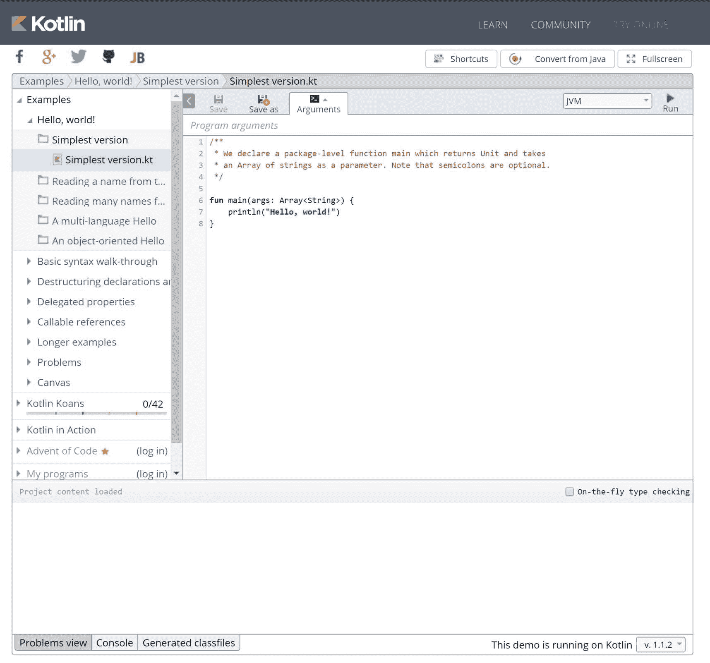

`main`函数是每个 Kotlin 应用程序的入口点。当任何应用程序启动时，都会调用这个函数，因此我们必须将书中示例的代码放在这个方法的主体中。我们可以直接放置代码，或者只是调用另一个包含更多 Kotlin 代码的函数：

```kt
    fun main(args: Array<String>) { 
        println("Hello, world!") 
    }
```

Android 应用程序有多个入口点。`main`函数会被 Android 框架隐式调用，因此我们不能用它在 Android 平台上运行 Kotlin 代码。

# Android Studio

所有 Android Studio 现有的工具都可以处理 Kotlin 代码。我们可以轻松使用调试、lint 检查、正确的代码辅助、重构等。大部分功能的使用方式与 Java 相同，因此最明显的变化是 Kotlin 语言的语法。我们只需要在项目中配置 Kotlin 即可。

Android 应用程序有多个入口点（不同的意图可以启动应用程序中的不同组件），并且需要 Android 框架依赖。为了运行书中的示例，我们需要扩展`Activity`类并在其中放置代码。

# 为项目配置 Kotlin

从 Android Studio 3.0 开始，Kotlin 获得了完整的工具支持。不需要安装 Kotlin 插件，Kotlin 甚至更深入地集成到了 Android 开发过程中。

要在 Android Studio 2.x 中使用 Kotlin，我们必须手动安装 Kotlin 插件。要安装它，我们需要转到 Android Studio | 文件 | 设置 | 插件 | 安装 JetBrains 插件... | Kotlin 并按下安装按钮：

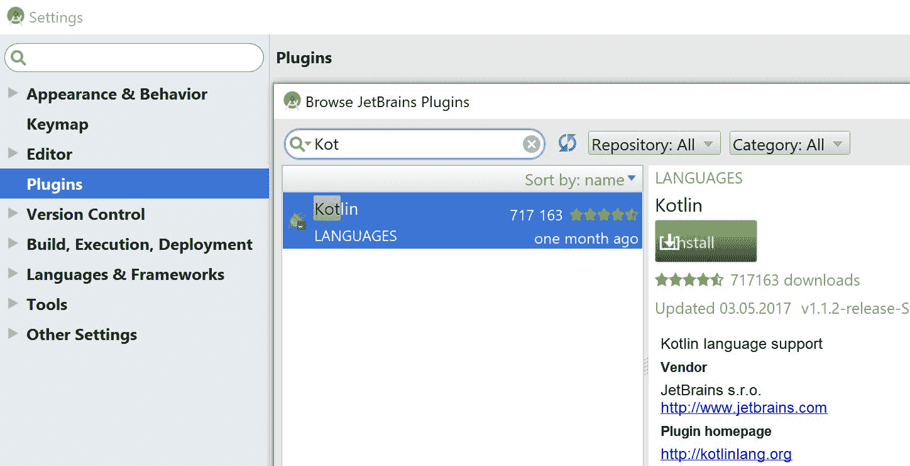

要使用 Kotlin，我们需要在项目中配置 Kotlin。对于现有的 Java 项目，我们需要运行*在项目中配置 Kotlin*操作（在 Windows 中的快捷键是*Ctrl* +*Shift* +*A*，在 macOS 中是*command* + *shift* + *A*）或者使用相应的工具 |Kotlin *|* 在项目中配置 Kotlin 菜单项：

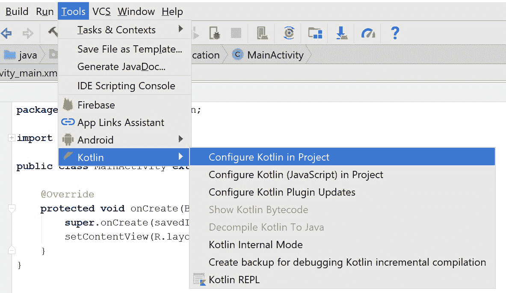

然后，选择 Android with Gradle：

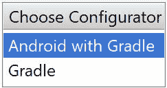

最后，我们需要选择所需的模块和适当的 Kotlin 版本：

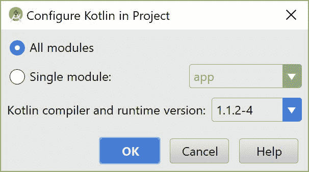

前面的配置场景也适用于最初是用 Java 创建的所有现有 Android 项目。从 Android Studio 3.0 开始，我们还可以在创建新项目时勾选包括 Kotlin 支持的复选框：

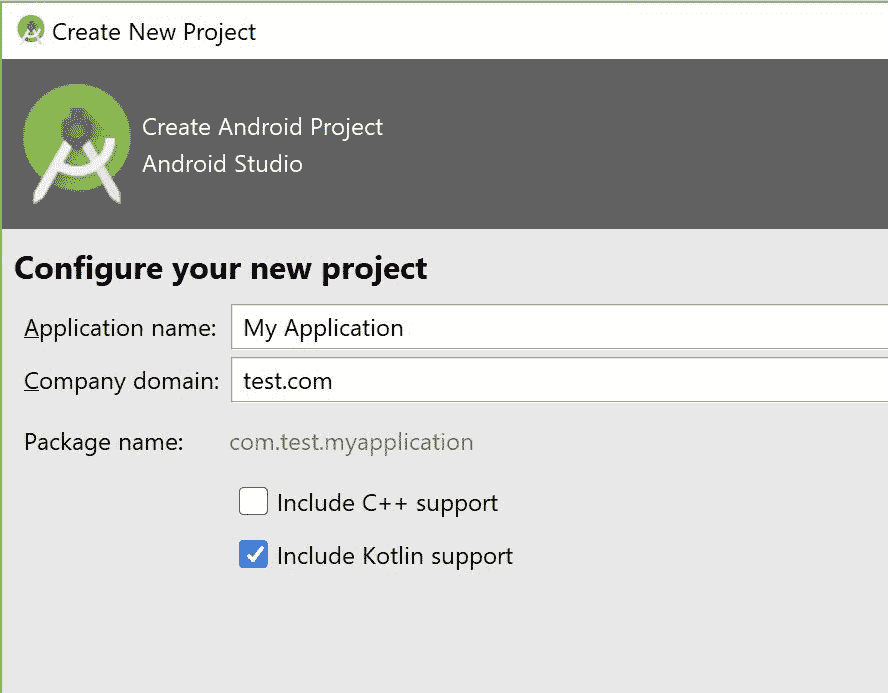

在这两种情况下，`在项目中配置 Kotlin`命令会通过添加 Kotlin 依赖项来更新根`build.gradle`文件和对应模块的`build.gradle`文件。它还会将 Kotlin 插件添加到 Android 模块中。在撰写本书发布版本的 Android Studio 3 时尚未提供，但我们可以从预发布版本中查看构建脚本：

```kt
//build.gradle file in project root folder 
buildscript { 
    ext.kotlin_version = '1.1' 

    repositories { 
        google() 
        jcenter() 
    } 
    dependencies { 
       classpath 'com.android.tools.build:gradle:3.0.0-alpha9' 
       classpath "org.jetbrains.kotlin:kotlin-gradle-

             plugin:$kotlin_version" 
    } 
} 

...  
//build.gradle file in the selected modules 
apply plugin: 'com.android.application' 
apply plugin: 'kotlin-android' 

apply plugin: 'kotlin-android-extensions'

... 
dependencies { 
    ...

    implementation 'com.android.support.constraint:constraint-

          layout:1.0.2'

} 
... 
```

在 Android Plugin for Gradle 3.x 之前（随 Android Studio 3.0 提供），使用*compile*依赖配置而不是*implementation*。

要更新 Kotlin 版本（比如说在将来），我们需要在`build.gradle`文件（项目根文件夹）中更改`kotlin_version`变量的值。Gradle 文件的更改意味着项目必须同步，这样 Gradle 才能更新其配置并下载所有所需的依赖项：


# 在新的 Android 项目中使用 Kotlin

在 Android Studio 3.x 中创建的新 Kotlin 项目中，主要活动将已经在 Kotlin 中定义，因此我们可以立即开始编写 Kotlin 代码：

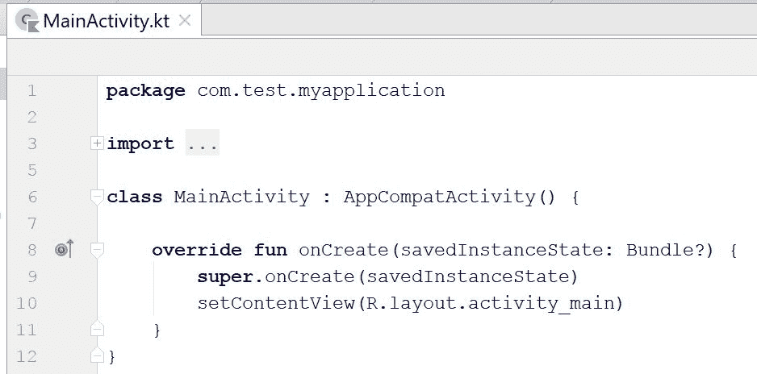

添加新的 Kotlin 文件类似于添加 Java 文件。只需右键单击包，然后选择新建|Kotlin 文件/类：

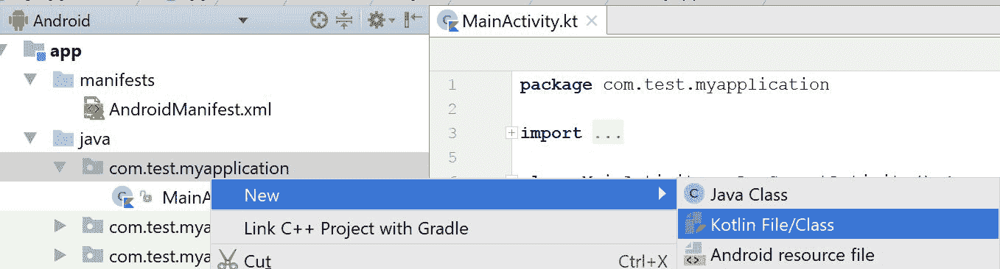

IDE 之所以说 Kotlin 文件/类而不是简单的*Kotlin 类*，类似于*Java 类*，是因为我们可以在单个文件中定义更多成员。我们将在第二章中更详细地讨论这个问题，*奠定基础*。

请注意，Kotlin 源文件可以位于`java`源文件夹内。我们可以为 Kotlin 创建一个新的源文件夹，但这并不是必需的：

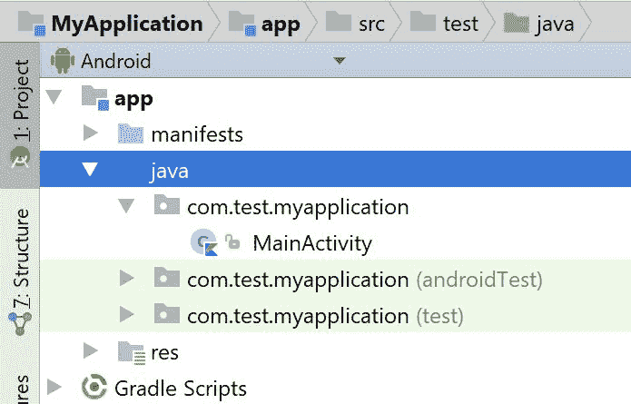

运行和调试项目与 Java 完全相同，除了在项目中配置 Kotlin 之外，不需要任何额外的步骤：

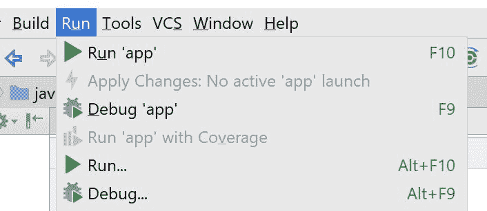

从 Android Studio 3.0 开始，各种 Android 模板也将允许我们选择一种语言。这是新的配置活动向导：

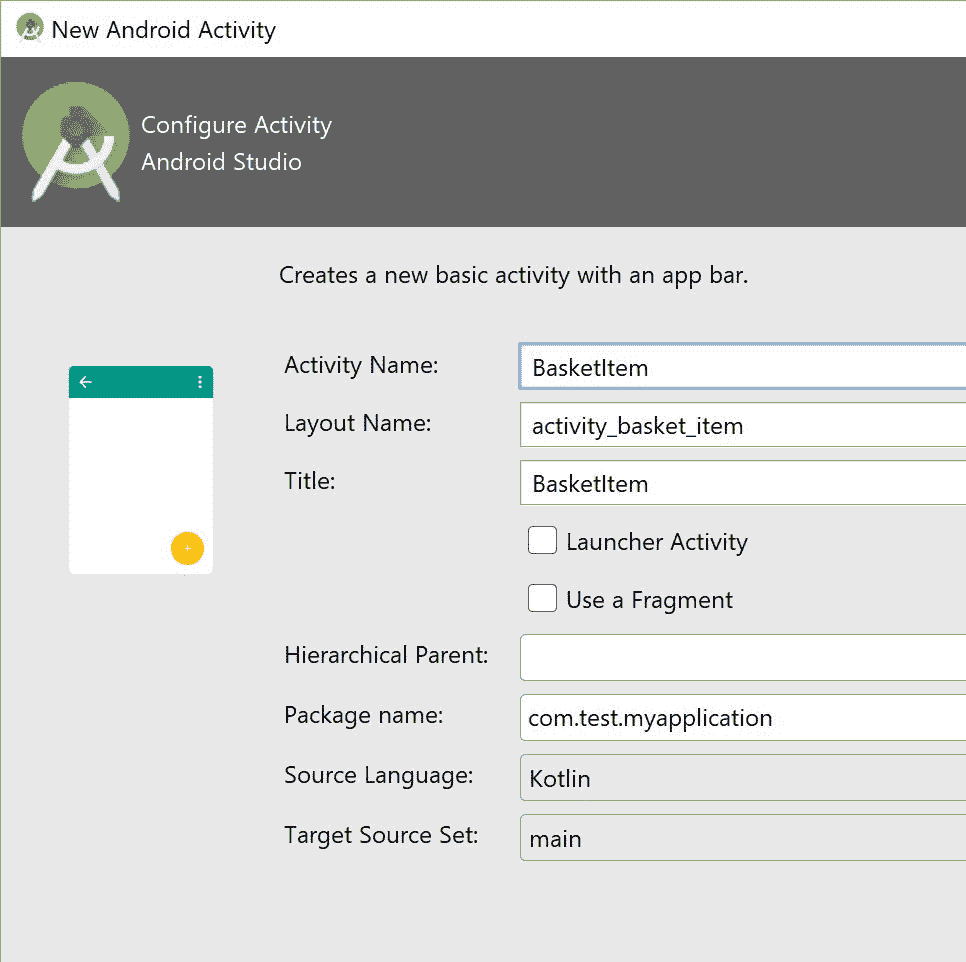

# Java 转 Kotlin 转换器（J2K）

迁移现有的 Java 项目也相当容易，因为我们可以在同一个项目中同时使用 Java 和 Kotlin。还有一些方法可以通过使用**Java 转 Kotlin 转换器**（**J2K**）将现有的 Java 代码转换为 Kotlin 代码。

第一种方法是使用*将 Java 文件转换为 Kotlin*命令（在 Windows 中的键盘快捷键为*Alt* + *Shift* + *Ctrl* + *K*，在 macOS 中为*option* + *shift* + *command* + *K*）将整个 Java 文件转换为 Kotlin 文件，这非常有效。第二种方法是将 Java 代码粘贴到现有的 Kotlin 文件中，代码也将被转换（将出现一个转换建议的对话框）。在学习 Kotlin 时，这可能非常有帮助。

如果我们不知道如何用 Kotlin 编写特定的代码片段，我们可以用 Java 编写，然后简单地复制到剪贴板，然后粘贴到 Kotlin 文件中。转换后的代码可能不是最符合 Kotlin 的版本，但它可以工作。IDE 将显示各种意图，以便进一步转换代码并提高其质量。在转换之前，我们需要确保 Java 代码是有效的，因为转换工具非常敏感，即使缺少一个分号，过程也会失败。J2K 转换器结合 Java 互操作性，允许逐步将 Kotlin 引入现有项目（例如，逐个转换单个类）。

# 运行 Kotlin 代码的替代方法

Android Studio 提供了一种在不运行 Android 应用程序的情况下运行 Kotlin 代码的替代方法。当您想要快速测试一些 Kotlin 代码而不需要进行漫长的 Android 编译和部署过程时，这是非常有用的。

运行 Kotlin 代码的方法是使用构建 Kotlin **读取评估打印循环**（**REPL**）。 REPL 是一个简单的语言 shell，它读取单个用户输入，评估它，并打印结果：


REPL 看起来像命令行，但它将为我们提供所有所需的代码提示，并且让我们访问项目内定义的各种结构（类、接口、顶级函数等）：

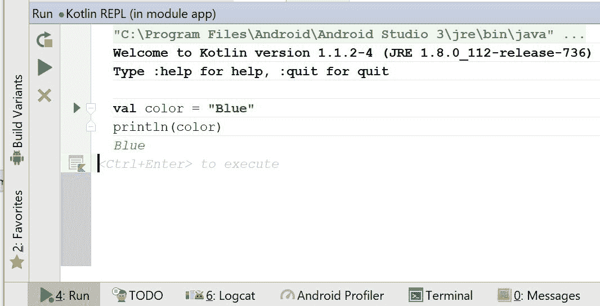

REPL 的最大优势是速度。我们可以非常快速地测试 Kotlin 代码。

# Kotlin 的内部工作原理

我们主要将重点放在 Android 上，但请记住，Kotlin 可以编译到多个平台。Kotlin 代码可以编译为*Java 字节码*，然后再编译为*Dalvik 字节码*。以下是 Android 平台的 Kotlin 构建过程的简化版本：

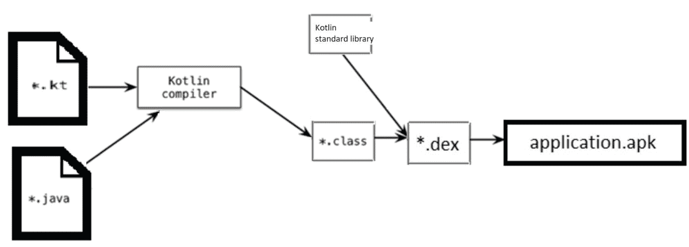

+   扩展名为`.java`的文件包含 Java 代码

+   扩展名为`.kt`的文件包含 Kotlin 代码

+   扩展名为`.class`的文件包含 Java 字节码

+   扩展名为`.dex`的文件包含 Dalvik 字节码

+   扩展名为`.apk`的文件包含`AndroidManifest`文件、资源和`.dex`文件

对于纯 Kotlin 项目，只会使用 Kotlin 编译器，但 Kotlin 也支持跨语言项目，在这种情况下，将同时使用两个编译器来编译 Android 应用程序，并且结果将在类级别合并。

# Kotlin 标准库

**Kotlin 标准库**（**stdlib**）是一个非常小的库，与 Kotlin 一起分发。运行 Kotlin 编写的应用程序需要它，并且在构建过程中会自动添加到我们的应用程序中。

在 Kotlin 1.1 中，运行 Kotlin 编写的应用程序需要`kotlin-runtime`。事实上，在 Kotlin 1.1 中有两个组件（`kotlin-runtime`和`kotlin-stdlib`）共享了很多 Kotlin 包。为了减少混乱，这两个组件将在即将推出的 Kotlin 1.2 版本中合并为单个组件（`kotlin-stdlib`）。从 Kotlin 1.2 开始，运行 Kotlin 编写的应用程序需要`kotlin-stdlib`。

Kotlin 标准库提供了与 Kotlin 的日常工作所需的基本元素。这些包括：

+   数组、集合、列表、范围等数据类型

+   扩展

+   高阶函数

+   用于处理字符串和字符序列的各种实用工具

+   为 JDK 类提供的扩展，使得处理文件、IO 和线程变得更加方便。

# 使用 Kotlin 的更多原因

Kotlin 得到了 JetBrains 的强大商业支持，这家公司为许多流行的编程语言提供了非常受欢迎的 IDE（Android Studio 基于 JetBrains IntelliJ IDEA）。JetBrains 希望提高他们的代码质量和团队绩效，因此他们需要一种能解决所有 Java 问题并提供与 Java 无缝互操作性的语言。没有其他 JVM 语言符合这些要求，因此 JetBrains 最终决定创建自己的语言并开始 Kotlin 项目。如今，Kotlin 被用于他们的旗舰产品。有些人将 Kotlin 与 Java 一起使用，而另一些则是纯 Kotlin 产品。

Kotlin 是一种非常成熟的语言。事实上，它的开发早在 Google 宣布官方支持 Android 之前就开始了（第一个提交日期为 2010-11-08）：

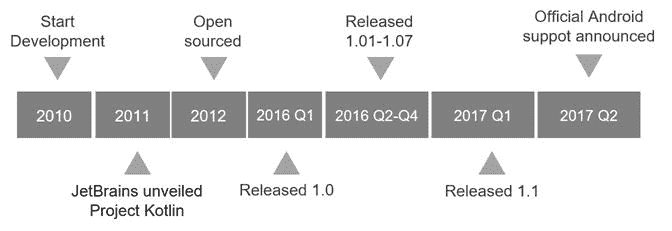

语言的初始名称是**Jet**。在某个时候，JetBrains 团队决定将其改名为 Kotlin。这个名字来自于圣彼得堡附近的科特林岛，类似于 Java，Java 也是以印度尼西亚岛屿命名的。

在 2016 年发布 1.0 版本后，越来越多的公司开始支持 Kotlin 项目。Gradle 将 Kotlin 支持添加到构建脚本中，Android 库的最大创建者 Square 表示他们强烈支持 Kotlin，最后，Google 宣布了官方对 Android 平台的 Kotlin 支持。这意味着 Android 团队发布的每个工具都不仅与 Java 兼容，还与 Kotlin 兼容。Google 和 JetBrains 已经开始合作，创建一个负责未来语言维护和开发的非营利基金会。所有这些都将大大增加使用 Kotlin 的公司数量。

Kotlin 也类似于苹果的 Swift 编程语言。事实上，它们如此相似，以至于一些文章关注的是差异，而不是相似之处。学习 Kotlin 对于渴望为 Android 和 iOS 开发应用程序的开发人员将非常有帮助。还有计划将 Kotlin 移植到 iOS（Kotlin/Native），所以也许我们根本不需要学习 Swift。在 Kotlin 中也可以进行全栈开发，因此我们可以开发服务器端应用程序和共享与移动客户端相同数据模型的前端客户端。

# 总结

我们已经讨论了 Kotlin 语言如何适用于 Android 开发，以及我们如何将 Kotlin 纳入新项目和现有项目中。我们已经看到了 Kotlin 简化了代码并使其更安全的有用示例。还有许多有趣的事情等待我们去发现。

在下一章中，我们将学习 Kotlin 的构建模块，并奠定使用 Kotlin 开发 Android 应用程序的基础。
