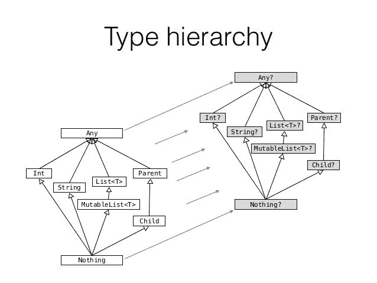

# 第三章：玩转函数

在之前的章节中，我们已经看到了 Kotlin 变量、类型系统和控制结构。但是要创建应用程序，我们需要允许我们构建结构的构建块。在 Java 中，类是代码的构建块。另一方面，Kotlin 支持函数式编程；因此，它可以创建整个程序或库而不需要任何类。函数是 Kotlin 中最基本的构建块。本章介绍了 Kotlin 中的函数，以及不同的函数特性和类型。

在本章中，我们将涵盖以下主题：

+   Kotlin 中的基本函数用法

+   `Unit` 返回类型

+   可变参数

+   单表达式函数

+   尾递归函数

+   默认参数值

+   命名参数语法

+   顶层函数

+   局部函数

+   `Nothing` 返回类型

# Kotlin 中的基本函数声明和用法

最常见的程序员编写的第一个程序是用来测试某种编程语言的`Hello, World!`程序。它是一个完整的程序，只是在控制台上显示`Hello, World!`文本。我们也将从这个程序开始，因为在 Kotlin 中，它基于一个函数，只有一个函数（不需要类）。因此，Kotlin 的`Hello, World!`程序如下所示：

```kt
    // SomeFile.kt 
    fun main(args: Array<String>) {     // 1 
        println("Hello, World!")        // 2, Prints: Hello, World! 
    } 
```

1.  函数定义了单个参数 args，其中包含用于运行程序的所有参数的数组（从命令行）。它被定义为非空，因为在没有任何参数的情况下启动程序时，会将空数组传递给方法。

1.  `println`函数是 Kotlin 标准库中定义的 Kotlin 函数，相当于 Java 函数`System.out.println`。

这个程序告诉我们很多关于 Kotlin。它展示了函数的外观以及我们可以定义没有任何类的函数。首先，让我们分析函数的结构。它以`fun`关键字开头，然后是函数的名称，括号中的参数，以及函数体。这是另一个简单函数的示例，但这个函数返回一个值：

```kt
    fun double(i: Int): Int { 
        return 2 * i 
    } 
```

**好知识框架**

关于方法和函数之间的区别存在很多混淆。常见的定义如下：

函数是按名称调用的一段代码。

方法是与类（对象）实例相关联的函数。有时它被称为成员函数。

因此，简单来说，类内部的函数称为**方法**。在 Java 中，官方只有方法，但学术环境经常争论静态 Java 方法实际上是函数。在 Kotlin 中，我们可以定义不与任何对象相关联的函数。

调用函数的语法在 Kotlin 中与 Java 以及大多数现代编程语言中相同：

```kt
    val a = double(5) 
```

我们调用 double 函数并将其返回的值赋给一个变量。让我们讨论 Kotlin 函数的参数和返回类型的细节。

# 参数

在 Kotlin 函数中，参数使用 Pascal 表示法声明，每个参数的类型必须明确指定。所有参数都被定义为只读变量。无法使参数可变，因为这种行为容易出错，在 Java 中程序员经常滥用。如果有这样的需要，那么我们可以通过声明具有相同名称的局部变量来显式遮蔽参数：

```kt
    fun findDuplicates(list: List<Int>): Set<Int> { 
        var list = list.sorted() 
        //... 
    } 
```

这是可能的，但被视为不良实践，因此会显示警告。更好的方法是根据它们提供的数据来命名参数，根据它们提供的目的来命名变量。在大多数情况下，这些名称应该是不同的。

**参数与参数** 在编程社区中，参数和参数经常被认为是相同的东西。这些词不能互换使用，因为它们有不同的含义。参数是在调用函数时传递给函数的实际值。参数是指在函数声明内部声明的变量。考虑以下示例：

`fun printSum(a1: Int, a2: Int) { // 1.`

`print(a1 + a2)`

`}`

`add(3, 5) // 2.`

`1 - a1 和 a2 是参数`

`2-3 和 5 是参数`

与 Java 一样，Kotlin 中的函数可以包含多个参数：

```kt
    fun printSum(a: Int, b: Int) { 
        val sum = a + b 
        print(sum) 
    }   
```

提供给函数的参数可以是参数声明中指定类型的子类型。正如我们所知，在 Kotlin 中，所有非空类型的超类型是`Any`，因此如果我们想接受所有类型，就需要使用它：

```kt
    fun presentGently(v: Any) { 
        println("Hello. I would like to present you: $v") 
    } 

    presentGently("Duck")  

    // Hello. I would like to present you: Duck 
    presentGently(42)      

    // Hello. I would like to present you: 42 
```

要允许参数为空，类型需要被指定为可空。注意`Any?`是所有可空和非可空类型的超类型，因此我们可以将任何类型的对象作为参数传递：

```kt
    fun presentGently(v: Any?) { 
        println("Hello. I would like to present you: $v") 
    } 

    presentGently(null) 

    // Prints: Hello. I would like to present you: null 
    presentGently(1) 

    // Prints: Hello. I would like to present you: 1 
    presentGently("Str") 

    // Prints: Hello. I would like to present you: Str 
```

# 返回函数

到目前为止，大多数函数都被定义为过程（不返回任何值的函数）。但实际上，Kotlin 中没有过程，所有函数都返回某个值。当没有指定时，默认返回值是`Unit`实例。我们可以为演示目的显式设置它：

```kt
    fun printSum(a: Int, b: Int): Unit { // 1 
        val sum = a + b 
        print(sum) 
    } 
```

1.  与 Java 不同，我们在 Kotlin 中定义返回类型在函数名和参数之后。

`Unit`对象相当于 Java 的`void`，但它可以被视为任何其他对象。因此我们可以将它存储在变量中：

```kt
    val p = printSum(1, 2) 
    println(p is Unit) // Prints: true 
```

当然，Kotlin 编码约定声称，当函数返回`Unit`时，类型定义**应该**被省略。这样代码更易读，更容易理解：

```kt
    fun printSum(a: Int, b: Int) { 
        val sum = a + b 
        print(sum) 
    } 
```

**好知识框架** Unit 是一个单例，这意味着只有一个实例。因此所有三个条件都为真：

`println(p is Unit) // 输出：true`

`println(p == Unit) // 输出：true` `println(p === Unit) // 输出：true`

Kotlin 中高度支持单例模式，并且将在第四章 *类和对象*中更加详细地介绍。

要从返回类型为`Unit`的函数返回输出，我们可以简单地使用一个没有任何值的返回语句：

```kt
    fun printSum(a: Int, b: Int) {  // 1 
        if(a < 0 || b < 0) { 
            return                  // 2 
        } 
        val sum = a + b 
        print(sum) 
        // 3 
    }  
```

1.  没有指定返回类型，因此返回类型隐式设置为 Unit。

1.  我们可以只使用没有任何值的返回。

1.  当函数返回 Unit 时，返回调用是可选的。我们不必使用它。

我们也可以使用返回`Unit`，但不应该使用，因为那样会误导并且不易读。

当我们指定返回类型时，除了`Unit`，我们总是需要显式返回值：

```kt
    fun sumPositive(a: Int, b: Int): Int { 
        if(a > 0 && b > 0) { 
            return a + b 
        } 
        // Error, 1 
    } 
```

1.  函数不会编译，因为没有指定返回值，if 条件未满足。

问题可以通过添加第二个返回语句来解决：

```kt
    fun sumPositive(a: Int, b: Int): Int { 
        if(a >= 0 && b >= 0) { 
            return a + b 
        } 
        return 0 
    } 
```

# Vararg 参数

有时，参数的数量事先是未知的。在这种情况下，我们可以将`vararg`修饰符添加到参数中。它允许函数接受任意数量的参数。以下是一个示例，其中函数打印多个整数的总和：

```kt
    fun printSum(vararg numbers: Int) { 
        val sum = numbers.sum() 
        print(sum) 
    } 

    printSum(1,2,3,4,5) // Prints: 15 
    printSum()          // Prints: 0 
```

参数将作为一个包含所有提供的值的数组在方法内部可访问。数组的类型将对应于`vararg`参数类型。通常我们期望它是一个持有指定类型的通用数组（`Array<T>`），但正如我们所知，Kotlin 有一个优化的`Int`数组类型称为`IntArray`，因此将使用这种类型。例如，这是具有类型`String`的`vararg`参数的类型：

```kt
    fun printAll(vararg texts: String) {

    //Inferred type of texts is Array<String>
        val allTexts = texts.joinToString(",") 
        println("Texts are $allTexts") 
    } 

    printAll("A", "B", "C") // Prints: Texts are A,B,C 
```

请注意，我们仍然能够在`vararg`参数之前或之后指定更多的参数，只要清楚哪个参数指向哪个参数即可：

```kt
fun printAll(prefix: String, postfix: String, vararg texts: String) 

{ 
    val allTexts = texts.joinToString(", ") 
    println("$prefix$allTexts$postfix") 
} 

printAll("All texts: ", "!") // Prints: All texts: ! 
printAll("All texts: ","!" , "Hello", "World")  

// Prints: All texts: Hello, World! 
```

此外，提供给`vararg`参数的参数可以是指定类型的子类型：

```kt
    fun printAll(vararg texts: Any) { 
        val allTexts = texts.joinToString(",") // 1 
        println(allTexts) 
    } 

    // Usage 
    printAll("A", 1, 'c') // Prints: A,1,c 
```

1.  `joinToString`函数可以在列表上调用。它将元素连接成一个字符串。在第一个参数中指定了分隔符。

`vararg`使用的一个限制是每个函数声明只允许一个`vararg`参数。

当我们调用`vararg`参数时，我们可以逐个传递参数值，但也可以传递一个值数组。这可以使用`spread`操作符（`*`前缀数组）来实现，就像以下示例中的那样：

```kt
    val texts = arrayOf("B", "C", "D") 
    printAll(*texts) // Prints: Texts are: B,C,D 
    printAll("A", *texts, "E") // Prints: Texts are: A,B,C,D,E 
```

# 单表达式函数

在典型的编程过程中，许多函数只包含一个表达式。以下是这种类型函数的一个例子：

```kt
    fun square(x: Int): Int { 
        return x * x 
    } 
```

或者另一个经常在 Android 项目中找到的例子是在`Activity`中使用的模式，定义仅从某个视图获取文本或从视图提供其他数据以允许 Presenter 获取它们的方法：

```kt
    fun getEmail(): String { 
        return emailView.text.toString() 
    } 
```

这两个函数都被定义为返回单个表达式的结果。在第一个例子中，它是`x * x`乘法的结果，在第二个例子中，它是表达式`emailView.text.toString()`的结果。这些类型的函数在整个 Android 项目中经常被使用。以下是一些常见用例：

+   提取一些小操作（就像前面的`square`函数中）

+   使用多态性提供特定于类的值

+   仅创建某个对象的函数

+   在架构层之间传递数据的函数（就像前面的例子中，`Activity`正在从视图传递数据到 Presenter）

+   基于递归的函数式编程风格函数

这种函数经常被使用，因此 Kotlin 为这种函数提供了一种表示法。当函数返回单个表达式时，可以省略大括号和函数体。我们可以直接使用等号字符指定表达式。以这种方式定义的函数称为**单表达式**函数。让我们更新我们的`square`函数，并将其定义为单表达式函数：


正如我们所看到的，单表达式函数具有表达式体而不是块体。这种表示法更短，但整个体必须只是一个单一表达式。

在单表达式函数中，声明返回类型是可选的，因为它可以从表达式的类型中推断出来。这就是为什么我们可以简化`square`函数，并以这种方式定义它：

```kt
    fun square(x: Int) = x * x 
```

在 Android 应用程序中有许多地方可以利用单表达式函数。让我们考虑一下提供布局 ID 并创建`ViewHolder`的`RecyclerView`适配器：

```kt
class AddressAdapter : ItemAdapter<AddressAdapter.ViewHolder>() { 
    override fun getLayoutId() = R.layout.choose_address_view 
    override fun onCreateViewHolder(itemView: View) = ViewHolder(itemView) 

    // Rest of methods 
} 
```

在下面的例子中，由于单表达式函数，我们实现了高可读性。单表达式函数在函数式世界中也非常受欢迎。稍后将在关于尾递归函数的部分中描述这个例子。单表达式函数表示法也与`when`结构很搭配。以下是它们的连接示例，用于根据键从对象中获取特定数据（来自大型 Kotlin 项目的用例）：

```kt
fun valueFromBooking(key: String, booking: Booking?) = when(key) { 

    // 1 
    "patient.nin" -> booking?.patient?.nin 
    "patient.email" -> booking?.patient?.email 
    "patient.phone" -> booking?.patient?.phone 
    "comment" -> booking?.comment 
    else -> null 
} 
```

1.  不需要类型，因为它是从 when 表达式中推断出来的。

另一个常见的 Android 示例是我们可以将 when 表达式与`activity`方法`onOptionsItemSelected`结合使用，处理顶部菜单点击：

```kt
override fun onOptionsItemSelected(item: MenuItem): Boolean = when 

{ 
    item.itemId == android.R.id.home -> { 
        onBackPressed() 
        true 
    } 
    else -> super.onOptionsItemSelected(item) 
} 
```

另一个例子是单表达式函数语法有用的地方，是当我们在单个对象上链式多个操作时：

```kt
    fun textFormatted(text: String, name: String) = text 
                      .trim() 
                      .capitalize() 
                      .replace("{name}", name) 

    val formatted = textFormatted("hello, {name}", "Marcin") 
    println(formatted) // Hello, Marcin 
```

正如我们所看到的，单表达式函数可以使我们的代码更简洁，提高可读性。单表达式函数在 Kotlin Android 项目中经常被使用，并且在函数式编程中非常受欢迎。

**命令式与声明式编程** **命令式编程**：这种编程范式描述了执行操作所需的确切步骤序列。对大多数程序员来说，这是最直观的。

**声明式编程**：这种编程范式描述了期望的结果，但不一定是实现它的步骤（行为的实现）。这意味着编程是通过表达式或声明而不是语句来完成的。*函数式*和*逻辑*编程都被描述为声明式编程风格。声明式编程通常比命令式编程更简短和可读。

# 尾递归函数

递归函数是调用自身的函数。让我们看一个递归函数`getState`的例子：

```kt
    fun getState(state: State, n: Int): State = 
        if (n <= 0) state // 1 
        else getState(nextState(state), n - 1) 
```

它们是函数式编程风格的重要组成部分，但问题在于每个递归函数调用都需要在堆栈上保留前一个函数的返回地址。当应用程序递归太深时（堆栈上有太多函数），会抛出`StackOverflowError`。这种限制对于递归使用来说是一个非常严重的问题。

这个问题的一个经典解决方案是使用迭代而不是递归，但这种方法表达力较弱：

```kt
    fun getState(state: State, n: Int): State { 
        var state = state 
        for (i in 1..n) { 
            state = state.nextState() 
        } 
        return state 
    } 
```

这个问题的一个合适的解决方案是使用现代语言（如 Kotlin）支持的*尾递归*函数。尾递归函数是一种特殊类型的递归函数，其中函数调用自身作为其执行的最后一个操作（换句话说：递归发生在函数的最后一个操作中）。这使我们能够通过编译器优化递归调用，并以更有效的方式执行递归操作，而不必担心潜在的`StackOverflowError`。要使函数成为尾递归，我们需要使用`tailrec`修饰符标记它：

```kt
    tailrec fun getState(state: State, n: Int): State = 
        if (n <= 0) state
        else getState(state.nextState(), n - 1) 
```

要查看它是如何工作的，让我们编译这段代码并反编译成 Java。然后可以找到以下内容（简化后的代码）：

```kt
    public static final State getState(@NotNull State state, int n) 

    { 
        while(true) { 
            if(n <= 0) { 
                return state; 
            } 
            state = state.nextState(); 
            n = n - 1; 
        } 
    } 
```

实现是基于迭代的，因此不可能发生堆栈溢出错误。为使`tailrec`修饰符起作用，需要满足一些要求：

+   函数必须只调用自身作为其执行的最后一个操作

+   它不能在`try`/`catch`/`finally`块中使用

+   在撰写本文时，它只允许在编译为 JVM 的 Kotlin 中使用

# 不同的调用函数的方式

有时我们需要调用一个函数并只提供选定的参数。在 Java 中，我们可以创建同一个方法的多个重载，但这种解决方案有一些局限性。第一个问题是给定方法的可能排列数量增长得非常快（2^n），使得它们非常难以维护。第二个问题是重载必须彼此可区分，因此编译器可能需要知道调用哪个重载，所以当一个方法定义了几个相同类型的参数时，我们无法定义所有可能的重载。这就是为什么在 Java 中，我们经常需要向方法传递多个空值：

```kt
    // Java 
    printValue("abc", null, null, "!"); 
```

多个空参数提供样板。这种情况大大降低了方法的可读性。在 Kotlin 中，没有这样的问题，因为 Kotlin 有一个称为*默认参数*和*命名参数语法*的特性。

# 默认参数值

默认参数大多来自于 C++，这是支持默认参数的最古老的语言之一。默认参数在方法调用时为参数提供一个值。每个函数参数都可以有一个默认值。它可以是与指定类型匹配的任何值，包括 null。这样我们可以简单地定义可以以多种方式调用的函数。这是一个带有默认值的函数的示例：

```kt
    fun printValue(value: String, inBracket: Boolean = true, 

                   prefix: String = "", suffix: String = "") { 
        print(prefix) 
        if (inBracket) { 
            print("(${value})") 
        } else { 
            print(value) 
        } 
        println(suffix) 
    } 
```

我们可以像调用普通函数一样使用这个函数（没有默认参数值的函数），为每个参数提供值（所有参数）：

```kt
    printValue("str", true, "","")  // Prints: (str) 
```

由于默认参数值，我们可以只为没有默认值的参数提供参数来调用函数：

```kt
    printValue("str")  // Prints: (str) 
```

我们也可以提供所有没有默认值的参数，只提供一些具有默认值的参数：

```kt
    printValue("str", false)  // Prints: str 
```

# 命名参数语法

有时我们只想为最后一个参数传递一个值。假设我们只想为后缀定义一个值，而不是为前缀和`inBracket`（在后缀之前定义）定义一个值。通常情况下，我们必须为所有先前的参数提供值，包括默认参数值：

```kt
    printValue("str", true, true, "!") // Prints: (str) 
```

通过使用命名参数语法，我们可以使用参数名称传递特定的参数：

```kt
    printValue("str", suffix = "!") // Prints: (str)! 
```

这允许非常灵活的语法，我们可以在调用函数时只提供选择的参数（即，从末尾开始的第一个参数和第二个参数）。这经常用于指定这个参数是什么，因为这样的调用更易读：

```kt
    printValue("str", inBracket = true) // Prints: (str) 
    printValue("str", prefix = "Value is ") // Prints: Value is str 
    printValue("str", prefix = "Value is ", suffix = "!! ") 

    // Prints:   Value is str!! 
```

我们可以使用命名参数语法设置任何我们想要的参数，以任何顺序，只要提供所有没有默认值的参数。参数的顺序是相关的：

```kt
    printValue("str", inBracket= true, prefix = "Value is ") 

    // Prints: Value is (str) 

    printValue("str", prefix = "Value is ", inBracket= true) 

    // Prints: Value is (str) 
```

参数的顺序不同，但前面两个调用是等价的。

我们还可以将*命名参数语法*与*经典调用*一起使用。唯一的限制是，如果我们开始使用命名语法，我们就不能为接下来的参数使用经典语法：

```kt
    printValue ("str", true, "") 
    printValue ("str", true, prefix = "") 
    printValue ("str", inBracket = true, prefix = "") 
    printValue ("str", inBracket = true, "") // Error 
    printValue ("str", inBracket = true, prefix = "", "") // Error 
```

这个特性允许我们以非常灵活的方式调用方法，而无需定义多个方法重载。

命名参数语法对 Kotlin 程序员施加了一些额外的责任。我们需要记住，当我们更改参数名称时，可能会在项目中引起错误，因为参数名称可能在其他类中使用。如果我们使用内置的重构工具重命名参数，Android Studio 会处理它，但这只在我们的项目内有效。Kotlin 库的创建者在使用命名参数语法时应该非常小心。更改参数名称将破坏 API。请注意，当调用 Java 函数时，无法使用命名参数语法，因为 Java 字节码并不总是保留函数参数的名称。

# 顶层函数

我们还可以在一个简单的`Hello, World!`程序中观察到的另一件事是，`main`函数不位于任何类中。在第二章，*打下基础*中，我们已经提到 Kotlin 可以在顶层定义各种实体。在顶层定义的函数称为**顶层函数**。以下是其中一个例子：

```kt
    // Test.kt 
    package com.example 

    fun printTwo() { 
        print(2) 
    } 
```

顶层函数可以在代码中的任何地方使用（假设它们是公共的，默认可见性修饰符）。我们可以像从本地上下文中的函数一样调用它们。要访问顶层函数，我们需要使用 import 语句将其显式导入文件中。在 Android Studio 中，函数在代码提示列表中可用，因此在选择（使用）函数时会自动添加导入。例如，让我们看一个在`Test.kt`中定义的顶层函数，并在`Main.kt`文件中使用它：

```kt
    // Test.kt 
    package com.example 

    fun printTwo() { 
        print(2) 
    } 

    // Main.kt 
    import com.example.printTwo 

    fun main(args: Array<String>) { 
        printTwo() 
    } 
```

顶层函数通常很有用，但明智地使用它们很重要。请记住，定义公共顶层函数将增加代码*提示列表*中可用函数的数量（*提示列表*是指在编写代码时 IDE 建议的方法列表）。这是因为 IDE 会在每个上下文中建议使用公共顶层函数（因为它们可以在任何地方使用）。如果顶层函数的名称没有清楚地说明这是一个顶层函数，那么它可能会被误认为是本地上下文中的方法并被意外使用。以下是一些顶层函数的好例子：

+   `factorial`

+   `maxOf`和`minOf`

+   `listOf`

+   `println`

以下是一些可能不适合作为顶层函数的函数的示例：

+   `sendUserData`

+   `showPossiblePlayers`

这个规则只适用于 Kotlin 面向对象编程项目。在面向函数的编程项目中，这些是有效的顶层名称，但我们假设几乎所有函数都是在顶层定义的，而不是作为方法。

通常我们定义我们想要在特定模块或特定类中使用的函数。为了限制函数的可见性（可以使用的位置），我们可以使用可见性修饰符。我们将在第四章，*类和对象*中讨论可见性修饰符。

# 底层的顶层函数

在 Android 项目中，Kotlin 被编译成 Java 字节码，可以在 Dalvik 虚拟机（Android 5.0 之前）或 Android Runtime（Android 5.0 及更新版本）上运行。两种虚拟机只能执行类内定义的代码。为了解决这个问题，Kotlin 编译器为顶层函数生成类。类名由文件名和`Kt`后缀构成。在这样的类内，所有函数和属性都是静态的。例如，假设我们在`Printer.kt`文件中定义一个函数：

```kt
    // Printer.kt 
    fun printTwo() { 
        print(2) 
    } 
```

Kotlin 代码被编译成 Java 字节码。生成的字节码将类似于从以下 Java 类生成的代码：

```kt
    //Java 
    public final class PrinterKt { // 1 
        public static void printTwo() { // 2 
            System.out.print(2); // 3 
        } 
    } 
```

1.  `PrinterKt`是由文件名和`*Kt*`后缀构成的名称。

1.  所有顶层函数和属性都被编译为静态方法和变量。

1.  `print`是一个 Kotlin 函数，但由于它是一个内联函数，它的调用在编译时被其主体替换。它的主体只包括`System.out.println`调用。

内联函数将在第五章中描述，*作为一等公民的函数*。

在 Java 字节码级别上，Kotlin 类将包含更多数据（例如参数名称）。我们还可以通过在函数调用前加上类名来从 Java 文件中访问 Kotlin 顶层函数：

```kt
    //Java file, call inside some method 
    PrinterKt.printTwo() 
```

这样，从 Java 调用 Kotlin 顶层函数是完全支持的。可以看出，Kotlin 与 Java 真正可以互操作。为了使 Java 中对 Kotlin 顶层函数的使用更加舒适，我们可以添加一个注解来更改 JVM 生成的类的名称。在从 Java 类中使用顶层 Kotlin 属性和函数时，这非常方便。该注解如下所示：

```kt
    @file:JvmName("Printer") 
```

我们需要在文件顶部（在包名之前）添加`JvmName`注解。应用此注解后，生成的类名将更改为`Printer`。这使我们可以在 Java 中使用`Printer`作为类名调用`printTwo`函数：

```kt
    //Java 
    Printer.printTwo() 
```

有时我们定义顶层函数，并且希望在单独的文件中定义它们，但也希望它们在编译为 JVM 后在同一个类中。如果我们在文件顶部使用以下注解，这是可能的：

```kt
    @file:JvmMultifileClass 
```

例如，假设我们正在制作一个数学辅助库，我们希望从 Java 中使用。我们可以定义以下文件：

```kt
    // Max.kt

    @file:JvmName("Math") 
    @file:JvmMultifileClass 
    package com.example.math 

    fun max(n1: Int, n2: Int): Int = if(n1 > n2) n1 else n2 

    // Min.kt 
    @file:JvmName("Math") 
    @file:JvmMultifileClass 
    package com.example.math 

    fun min(n1: Int, n2: Int): Int = if(n1 < n2) n1 else n2 
```

我们可以在 Java 类中这样使用它：

```kt
    Math.min(1, 2) 
    Math.max(1, 2) 
```

由此，我们可以保持文件简短和简单，同时使它们都易于从 Java 中使用。

`JvmName`注解用于更改生成的类名，在创建 Kotlin 库并且也要在 Java 类中使用时特别有用。在名称冲突时也很有用。当我们在同一个包中创建了`X.kt`文件和一个`XKt`类时，可能会出现这种情况。但这很少发生，因为有一个约定，即不应该有类带有`Kt`后缀。

# 局部函数

Kotlin 允许在许多上下文中定义函数。我们可以在顶层定义函数，作为成员（在`class`，`interface`等内部），以及在其他函数内部（局部函数）。考虑以下局部函数定义的示例：

```kt
    fun printTwoThreeTimes() { 
        fun printThree() { // 1 
            print(3) 
        } 
        printThree() // 2 
        printThree() // 2 
    } 
```

1.  `printThree`是一个局部函数，因为它位于另一个函数内部。

1.  局部函数无法从其声明的函数外部访问。

局部函数内可访问的元素不必从封闭函数作为参数传递，因为它们可以直接访问。例如：

```kt
    fun loadUsers(ids: List<Int>) { 
        var downloaded: List<User> = emptyList() 

        fun printLog(comment: String) { 
            Log.i("loadUsers (with ids $ids): $comment\nDownloaded: 

                                              $downloaded") // 1 
        } 
        for(id in ids) { 
            printLog("Start downloading for id $id")  
            downloaded += loadUser(id) 
            printLog("Finished downloading for id $id") 
        } 
    } 
```

1.  局部函数可以访问封闭函数内定义的注释参数和局部变量（下载和 ID）。

如果我们想将`printLog`定义为顶层函数，那么我们必须将`ids`和`downloaded`作为参数传递：

```kt
fun loadUsers(ids: List<Int>) { 
    var downloaded: List<User> = emptyList() 

    for(id in ids) { 
        printLog("Start downloading for id $id", downloaded, ids)   
        downloaded += loadUser(id) 
        printLog("Finished downloading for 

                  id $id", downloaded, ids)) 
    } 
} 

fun printLog(state: String, downloaded: List<User>, ids: List<Int>) 

{ 
    Log.i("loadUsers (with ids $ids): 

    $state\nDownloaded: downloaded") 
} 
```

这种实现不仅更长，而且更难维护。对`printLog`的更改可能需要不同的参数，而参数的更改则需要更改此函数调用中的参数。此外，如果我们更改了`printLog`中使用的`loadUsers`参数类型，那么我们还需要更改`printLog`的参数。如果`printLog`是一个局部函数，就不会出现这样的问题。这解释了何时应该使用局部函数：当我们提取的功能仅被单个函数使用，并且该功能使用此函数的元素（变量、值、参数）。此外，局部函数允许修改局部变量。就像在这个例子中：

```kt
    fun makeStudentList(): List<Student> { 
        var students: List<Student> = emptyList() 
        fun addStudent(name: String, state: Student.State = 

                       Student.State.New) { 
            students += Student(name, state, courses = emptyList()) 
        } 
        // ... 
        addStudent("Adam Smith") 
        addStudent("Donald Duck") 
        // ... 
        return students 
    } 
```

这样，我们可以提取和重用在 Java 中无法提取的功能。记住局部函数是很好的，因为它们有时允许以其他方式难以实现的代码提取。

# Nothing 返回类型

有时我们需要定义一个总是抛出异常（永远不会正常终止）的函数。两个真实的用例是：

+   简化错误抛出的函数。这在错误系统重要且需要提供有关错误发生的更多数据时特别有用。（例如，查看本节中介绍的`throwError`函数）。

+   在单元测试中用于抛出错误的函数。当我们需要测试代码中的错误处理时，这是很有用的。

对于这种情况，有一个特殊的类叫做`Nothing`。`Nothing`类是空类型（无人居住类型），意味着它没有实例。具有`Nothing`返回类型的函数不会返回任何东西，也永远不会达到`return`语句。它只能抛出异常。这就是为什么当我们看到函数返回`Nothing`时，它被设计为抛出异常。这样我们就可以区分不返回值的函数（如 Java 的`void`，Kotlin 的`Unit`）和永远不会终止的函数（返回`Nothing`）。让我们看一个例子，这个函数可能被用来简化单元测试中的错误抛出：

```kt
    fun fail(): Nothing = throw Error() 
```

以及构造复杂错误消息的函数，使用在定义它的上下文中可用的元素（在类或函数中）：

```kt
fun processElement(element: Element) { 
    fun throwError(message: String): Nothing 
    = throw ProcessingError("Error in element $element: $message") 

    // ... 
    if (element.kind != ElementKind.METHOD) 

        throwError("Not a method") 
    // ... 
} 
```

这种函数的特点是它可以像`throw`语句一样使用，作为不影响函数返回类型的替代品：

```kt
    fun getFirstCharOrFail(str: String): Char 
        = if(str.isNotEmpty()) str[0] else fail() 

    val name: String = getName() ?: fail() 

    val enclosingElement = element.enclosingElement ?: throwError ("Lack of enclosing element") 
```

这是怎么可能的？这是`Nothing`类的一个特殊特性，它表现得好像它是所有可能类型的子类型：可空和非可空的。这就是为什么`Nothing`被称为**空类型**，这意味着在运行时没有值可以具有这种类型，它也是每个其他类的子类型。



无人居住类型的概念在 Java 世界中是新的，这就是为什么它可能令人困惑。这个想法实际上非常简单。`Nothing`实例从未存在，只有可能从指定它为返回类型的函数中返回的错误。而且没有必要将`Nothing`添加到某些东西中以影响其类型。

# 总结

在本章中，我们学习了如何定义和使用函数。我们了解了如何在顶层或其他函数内定义函数。还讨论了与函数相关的不同特性——可变参数、默认名称和命名参数语法。最后，我们看到了一些 Kotlin 特殊的返回类型：`Unit`，它相当于 Java 的`void`，以及`Nothing`，它是一种无法定义的类型，意味着什么也不能返回（只能抛出异常）。

在下一章中，我们将看到 Kotlin 中如何定义类。类在 Kotlin 语言中也得到了特别的支持，并且引入了许多改进，超过了 Java 的定义。
