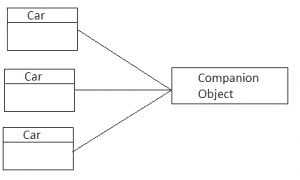

# 第四章：类和对象

Kotlin 语言为面向对象编程提供了全面的支持。我们将审查强大的结构，这些结构使我们能够简化数据模型的定义，并以一种简单灵活的方式对其进行操作。我们将了解 Kotlin 如何简化和改进许多从 Java 中已知的概念的实现。我们将看看不同类型的类、属性、初始化块和构造函数。我们将学习**运算符重载**和接口默认实现。

在本章中，我们将涵盖以下主题：

+   类声明

+   属性

+   属性访问语法

+   构造函数和初始化块

+   构造函数

+   继承

+   接口

+   数据类

+   破坏性声明

+   运算符重载

+   对象声明

+   对象表达式

+   伴生对象

+   枚举类

+   密封类

+   嵌套类

# 类

类是面向对象编程的基本构建块。事实上，Kotlin 类与 Java 类非常相似。然而，Kotlin 允许更多的功能，以及更简单和更简洁的语法。

# 类声明

在 Kotlin 中，使用`class`关键字定义类。以下是最简单的类声明--一个名为`Person`的空类：

```kt
    class Person 
```

`Person`的定义不包含任何主体。尽管如此，它可以使用默认构造函数进行实例化：

```kt
    val person = Person() 
```

即使是类实例化这样简单的任务在 Kotlin 中也得到了简化。与 Java 不同，Kotlin 不需要`new`关键字来创建类实例。由于 Kotlin 与 Java 的强大互操作性，我们可以以完全相同的方式实例化在 Java 和 Kotlin 中定义的类（不需要`new`关键字）。用于实例化类的语法取决于创建类实例的实际语言（Kotlin 或 Java），而不是声明类的语言：

```kt
    // Instantiate Kotlin class inside Java file 
    Person person = new Person() 

    // Instantiate class inside Kotlin file 
    var person = Person() 
```

在 Java 文件中使用`new`关键字而在 Kotlin 文件中永远不要使用`new`关键字是一个经验法则。

# 属性

属性只是*支持字段*及其访问器的组合。它可以是具有 getter 和 setter 的*支持字段*，也可以是只有其中一个的*支持字段*。属性可以在顶层（直接在文件内部）或作为成员（例如，在类、接口等内部）进行定义。

一般来说，建议定义属性（具有 getter/setter 的私有字段）而不是直接访问公共字段（根据*Effective Java, by Joshua Bloch,*书中的第 14 项建议：在公共类中，使用访问器方法，而不是公共字段）。

**Java 私有字段的 getter 和 setter 约定

Getter**：一个无参数方法，其名称对应于属性名称，并带有`get`前缀（对于`Boolean`属性，可能会使用`is`前缀）

**Setter**：以`set`开头的单参数方法：例如，`setResult(String resultCode)`

Kotlin 通过语言设计来保护这一原则，因为这种方法提供了各种封装的好处：

+   能够在不改变外部 API 的情况下改变内部实现

+   强制不变量（调用验证对象状态的方法）

+   能够在访问成员时执行附加操作（例如，记录操作）

要定义顶级属性，我们只需在 Kotlin 文件中定义它：

```kt
    //Test.kt 
    val name:String  
```

假设我们需要一个类来存储有关人员的基本数据。这些数据可以从外部 API（后端）下载，也可以从本地数据库中检索。我们的类将需要定义两个（成员）属性，`name`和`age`。让我们先看一下 Java 的实现：

```kt
    public class Person { 

        private int age; 
        private String name; 

        public Person(String name, int age) { 
            this.name = name; 
            this.age = age; 
        } 

        public int getAge() { 
            return age; 
        } 

        public void setAge(int age) { 
            this.age = age; 
        } 

        public String getName() { 
            return name; 
        } 

        public void setName(String name) { 
            this.name = name; 
        } 
    } 
```

这个类只包含两个属性。由于我们可以让 Java IDE 为我们生成访问器代码，至少我们不必自己编写代码。然而，这种方法的问题在于我们无法摆脱这些自动生成的代码块，这使得代码非常冗长。我们（开发人员）大部分时间都在阅读代码，而不是编写代码，因此阅读冗余的代码浪费了大量宝贵的时间。而且，像重构属性名称这样的简单任务变得有点棘手，因为 IDE 可能不会更新构造函数参数名称。

幸运的是，使用 Kotlin 可以显著减少样板代码。Kotlin 通过引入内置于语言中的*属性*的概念来解决这个问题。让我们看一下前面的 Java 类的 Kotlin 等价物：

```kt
    class Person { 
        var name: String 
        var age: Int 

        constructor(name: String, age: Int) { 
            this.name = name 
            this.age = age 
        } 
    } 
```

这是前面的 Java 类的确切等价物：

+   `constructor`方法相当于在创建对象实例时调用的 Java 构造函数

+   Kotlin 编译器生成 getter 和 setter

我们仍然可以定义 getter 和 setter 的自定义实现。我们将在*自定义 getter/setter 部分*中更详细地讨论这一点。

我们已经定义的所有构造函数都被称为*次要构造函数*。Kotlin 还提供了另一种非常简洁的语法来定义构造函数。我们可以将构造函数（带有所有参数）定义为类头的一部分。这种类型的构造函数被称为*主构造函数*。让我们将属性声明从次要构造函数移动到主构造函数，以使我们的代码变得更短：

```kt
    class Person constructor(name: String, age: Int) { 
        var name: String 
        var age: Int 

        init { 
            this.name = name 
            this.age = age 
            println("Person instance created") 
        } 
    } 
```

在 Kotlin 中，与次要构造函数相反，主构造函数不能包含任何代码，因此所有初始化代码必须放在初始化块（`init`）中。初始化块将在类创建期间执行，因此我们可以在其中将构造函数参数赋值给字段。

为了简化代码，我们可以删除初始化块，并直接在属性初始化程序中访问构造函数参数。这使我们能够将构造函数参数赋值给字段：

```kt
    class Person constructor(name: String, age: Int) { 
        var name: String = name 
        var age: Int = age 
    } 
```

我们设法使代码变得更短，但仍然包含大量样板，因为类型声明和属性名称被重复（构造函数参数、字段赋值和字段本身）。当属性没有任何自定义的 getter 或 setter 时，我们可以通过在主构造函数中直接添加 val 或 var 修饰符来定义它们：

```kt
    class Person constructor (var name: String, var age: Int) 
```

最后，如果主构造函数没有任何注解（`@Inject`等）或可见性修饰符（`public`，`private`等），那么可以省略`constructor`关键字：

```kt
    class Person (var name: String, var age: Int)
```

当构造函数接受几个参数时，最好将每个参数定义在新的一行中，以提高代码可读性并减少潜在合并冲突的机会（当从源代码存储库合并分支时）：

```kt
    class Person( 
        var name: String,  
        var age: Int 
    ) 
```

总之，前面的例子等同于本节开头呈现的 Java 类--两个属性都直接在类主构造函数中定义，Kotlin 编译器为我们做了所有工作--它生成了适当的字段和访问器（getter/setter）。

请注意，此表示法仅包含有关此数据模型类的最重要信息--其名称、参数名称、类型和可变性（`val`/`var`）信息。实现几乎没有样板。这使得类非常易于阅读、理解和维护。

# 读写属性与只读属性

在前面的例子中，所有属性都被定义为读写（生成了 setter 和 getter）。要定义只读属性，我们需要使用`val`关键字，这样只会生成 getter。让我们看一个简单的例子：

```kt
    class Person( 
        var name: String, 

        // Read-write property (generated getter and setter)

        val age: Int      // Read-only property (generated getter) 
    ) 

    \\usage 
    val person = Person("Eva", 25) 

    val name = person.name 
    person.name = "Kate" 

    val age = person.age 
    person.age = 28 \\error: read-only property 
```

Kotlin 不支持只写属性（只生成 setter 的属性）。

| **关键字** | **读** | **写** |
| --- | --- | --- |
| `var` | 是 | 是 |
| `val` | 是 | 否 |
| （不支持） | 否 | 是 |

# Kotlin 和 Java 之间的属性访问语法

Kotlin 引入的另一个重大改进是访问属性的方式。在 Java 中，我们会使用相应的方法（`setSpeed`/`getSpeed`）来访问属性。Kotlin 提倡*属性访问*语法，这是一种更具表现力的访问属性的方式。让我们比较这两种方法，假设我们有一个简单的`Car`类，它有一个名为`speed`的属性：

```kt
    class Car (var speed: Double) 

    //Java access properties using method access syntax 
    Car car = new Car(7.4) 
    car.setSpeed(9.2) 
    Double speed = car.getSpeed(); 

    //Kotlin access properties using property access syntax 
    val car: Car = Car(7.4) 
    car.speed = 9.2 
    val speed = car.speed 
```

正如我们所看到的，在 Kotlin 中，访问或修改对象属性时不需要添加`get`、`set`前缀和括号。使用属性访问语法允许直接使用增量（++）和减量（--）运算符与属性访问一起使用：

```kt
    val car = Car(7.0) 
    println(car.speed)  //prints 7.0 
    car.speed++ 
    println(car.speed)  //prints 8.0 
    car.speed-- 
    car.speed-- 
    println(car.speed) //prints: 6.0 
```

# 增量和减量运算符

有两种类型的增量（++）和减量（--）运算符：前增量/前减量，其中运算符在表达式之前定义，和后增量/后减量，其中运算符在表达式之后定义：

```kt
    ++speed //pre increment

    --speed //pre decrement 

    speed++ //post increment 

    speed-- //post decrement

```

在前面的例子中，使用后增量/减量与前增量/减量不会改变任何东西，因为这些操作是按顺序执行的。但是当增量/减量运算符与函数调用结合时，这将产生很大的差异。

在预增量运算符中，速度被检索，增加，并作为参数传递给函数：

```kt
    var speed = 1.0 
    println(++speed) // Prints: 2.0   
    println(speed)   // Prints: 2.0 
```

在后增量运算符中，速度被检索，作为参数传递给函数，然后增加，所以旧值被传递给函数：

```kt
    var speed = 1.0 
    println(speed++) // Prints: 1.0 
    println(speed) // Prints: 2.0 
```

这对于预减量和后减量运算符也是类似的。

属性访问语法不仅限于在 Kotlin 中定义的类。遵循 Java 约定的 getter 和 setter 的每个方法在 Kotlin 中表示为属性。

这意味着我们可以在 Java 中定义一个类，并使用*属性访问*语法在 Kotlin 中访问其属性。让我们定义一个 Java `Fish`类，有两个属性，`size`和`isHungry`，然后在 Kotlin 中实例化这个类并访问这些属性：

```kt
    //Java class declaration 
    public class Fish { 
        private int size; 
        private boolean hungry; 

        public Fish(int size, boolean isHungry) { 
            this.size = size; 
            this.hungry = isHungry; 
        } 

        public int getSize() { 
            return size; 
        } 

        public void setSize(int size) { 
            this.size = size; 
        } 

        public boolean isHungry() { 
            return hungry; 
        } 

        public void setHungry(boolean hungry) { 
            this.hungry = hungry; 
        } 
    } 

    //Kotlin class usage 
    val fish = Fish(12, true) 
    fish.size = 7 
    println(fish.size) // Prints: 7 
    fish.isHungry = true 
    println(fish.isHungry) // Prints: true 
```

这两种方式都可以，所以我们可以使用非常简洁的语法在 Kotlin 中定义`Fish`类，并以通常的 Java 方式访问它，因为 Kotlin 编译器将生成所有必需的 getter 和 setter：

```kt
    //Kotlin class declaration 
    class Fish(var size: Int, var hungry: Boolean) 

    //class usage in Java 
    Fish fish = new Fish(12, true); 
    fish.setSize(7); 
    System.out.println(fish.getSize()); 
    fish.setHungry(false); 
    System.out.println(fish.getHungry()); 
```

正如我们所看到的，用于访问类属性的语法取决于类使用的实际语言，而不是声明类的语言。这允许更多地使用在 Android 框架中定义的许多类的习惯用法。让我们看一些例子：

| **Java 方法访问语法** | **Kotlin 属性访问语法** |
| --- | --- |
| `activity.getFragmentManager()` | `activity.fragmentManager` |
| `view.setVisibility(Visibility.GONE)` | `view.visibility = Visibility.GONE` |
| `context.getResources().getDisplayMetrics().density` | `context.resources.displayMetrics.density` |

属性访问语法导致更简洁的代码，减少了原始 Java 语言的复杂性。请注意，虽然在 Kotlin 中仍然可以使用方法访问语法，但属性访问语法通常是更好的选择。

在 Android 框架中有一些方法的名称使用`is`前缀；在这种情况下，布尔属性也有`is`前缀：

```kt
    class MainActivity : AppCompatActivity() { 

        override fun onDestroy() { // 1 
            super.onDestroy() 

            isFinishing() // method access syntax 
            isFinishing // property access syntax 
            finishing // error 
        } 
    } 
```

1.  Kotlin 使用`override`修饰符标记重写的成员，而不是像 Java 那样使用`@Override`注解。

尽管使用`finishing`可能是最自然和一致的方法，但由于潜在的冲突，无法默认使用它。

另一种情况下，我们无法使用属性访问语法的是当属性只定义了 setter 而没有 getter 时，因为 Kotlin 不支持只写属性，就像这个例子：

```kt
    fragment.setHasOptionsMenu(true) 
    fragment.hasOptionsMenu = true // Error!
```

# 自定义 getter/setter

有时我们希望对属性的使用有更多的控制。我们可能希望在使用属性时执行其他辅助操作；例如，在将值分配给字段之前验证值，记录整个操作，或使实例状态无效。我们可以通过指定自定义 setter 和/或 getter 来实现。让我们将`ecoRating`属性添加到我们的`Fruit`类中。在大多数情况下，我们会像这样将此属性添加到类声明头中：

```kt
    class Fruit(var weight: Double, 

                val fresh: Boolean, 

                val ecoRating: Int) 
```

如果我们想定义自定义的 getter 和 setter，我们需要在类体中定义属性，而不是在类声明头中。让我们将`ecoRating`属性移到类主体中：

```kt
class Fruit(var weight: Double, val fresh: Boolean, ecoRating: Int)     

{ 
    var ecoRating: Int = ecoRating  
} 
```

当属性在类的主体内部定义时，我们必须用值初始化它（即使可空属性也需要用空值初始化）。我们可以提供默认值，而不是用构造函数参数填充属性：

```kt
    class Fruit(var weight: Double, val fresh: Boolean) { 
        var ecoRating: Int = 3 
    } 
```

我们还可以基于其他属性计算默认值：

```kt
    class Apple(var weight: Double, val fresh: Boolean) { 
        var ecoRating: Int = when(weight) { 
            in 0.5..2.0 -> 5 
            in 0.4..0.5 -> 4 
            in 0.3..0.4 -> 3 
            in 0.2..0.3 -> 2 
            else -> 1 
        } 
    } 
```

不同的值将为不同的权重构造函数参数设置。

当属性在类体中定义时，类型声明可以省略，因为它可以从上下文中推断出来：

```kt
    class Fruit(var weight: Double) { 
        var ecoRating = 3 
    } 
```

让我们定义一个具有默认行为的自定义 getter 和 setter，该行为将等同于前面的属性：

```kt
    class Fruit(var weight: Double) { 
        var ecoRating: Int = 3 
        get() { 
            println("getter value retrieved") 
            return field 
        } 
        set(value) { 
            field = if (value < 0) 0 else value 
            println("setter new value assigned $field") 
        } 
    } 

    // Usage 
    val fruit = Fruit(12.0) 
    val ecoRating = fruit.ecoRating 

    // Prints: getter value retrieved 
    fruit.ecoRating = 3;        

    // Prints: setter new value assigned 3 
    fruit.ecoRating = -5;       

    // Prints: setter new value assigned 0 
```

在`get`和`set`块内，我们可以访问一个名为`field`的特殊变量，它指的是属性的对应后备字段。请注意，Kotlin 属性声明与自定义 getter/setter 紧密相关。这与 Java 相矛盾，并解决了字段声明通常位于包含类和相应 getter/setter 的文件顶部的问题，因此我们无法在单个屏幕上看到它们，因此代码更难阅读。除了位置之外，Kotlin 属性行为与 Java 非常相似。每次从`ecoRating`属性中检索值时，都会执行`get`块，每次将新值分配给`ecoRating`属性时，都会执行`set`块。

这是一个读写属性（`var`），因此它可能包含相应的 getter 和 setter。如果我们只显式定义其中一个，另一个将使用默认实现。

要使属性值在检索属性值时每次计算，我们需要显式定义 getter：

```kt
    class Fruit(var weight: Double) { 
        val heavy             // 1 
        get() = weight > 20  
    } 

    //usage 
    var fruit = Fruit(7.0) 
    println(fruit.heavy) //prints: false 
    fruit.weight = 30.5 
    println(fruit.heavy) //prints: true 
```

1.  自 Kotlin 1.1 开始，类型可以省略（它将被推断）。

# getter 与属性默认值

在前面的示例中，我们使用了 getter，因此每次检索值时都会计算属性值。通过省略 getter，我们可以为属性创建默认值。这个值将在类创建期间仅计算一次，永远不会改变（改变`weight`属性不会影响`isHeavy`属性的值）：

```kt
    class Fruit(var weight: Double) { 
        val isHeavy = weight > 20 
    } 

    var fruit = Fruit(7.0) 
    println(fruit.isHeavy) // Prints: false 
    fruit.weight = 30.5 
    println(fruit.isHeavy) // Prints: false 
```

这种类型的属性有后备字段，因为它的值始终在对象创建期间计算。我们还可以创建没有后备字段的读写属性：

```kt
    class Car { 
        var usable: Boolean = true 
        var inGoodState: Boolean = true 

       var crashed: Boolean 
       get() = !usable && !inGoodState 
       set(value) { 
           usable = false 
           inGoodState = false 
       } 
    } 
```

这种类型的属性没有后备字段，因为它的值始终使用另一个属性计算。

# 延迟初始化属性

有时我们知道属性不会为空，但它不会在声明时初始化值。让我们看看常见的 Android 示例--检索布局元素的引用：

```kt
    class MainActivity : AppCompatActivity() { 

       private var button: Button? = null 

       override fun onCreate(savedInstanceState: Bundle?) { 
           super.onCreate(savedInstanceState) 
           button = findViewById(R.id.button) as Button 
       } 
    } 
```

`button`变量不能在声明时初始化，因为`MainActivity`布局尚未初始化。我们可以在`onCreate`方法中检索定义在布局中的按钮的引用，但为了做到这一点，我们需要将变量声明为可空（`Button?`）。

这种方法似乎相当不实用，因为在调用`onCreate`方法后，`button`实例始终可用。然而，客户端仍然需要使用安全调用运算符或其他空值检查来访问它。

为了避免在访问属性时进行空值检查，我们需要一种方法来告诉 Kotlin 编译器，这个变量将在使用之前填充，但它的初始化将被延迟。为此，我们可以使用`lateinit`修饰符：

```kt
    class MainActivity : AppCompatActivity() { 

        private lateinit var button: Button 

        override fun onCreate(savedInstanceState: Bundle?) { 
            button = findViewById(R.id.button) as Button 
            button.text = "Click Me" 
        } 
    } 
```

现在，通过将属性标记为`lateinit`，我们可以在不执行空值检查的情况下访问我们的应用程序实例。

`lateinit`修饰符告诉编译器，这个属性是非空的，但它的初始化被延迟了。当我们在初始化之前尝试访问属性时，应用程序会抛出`UninitializedPropertyAccessException`。这没关系，因为我们假设这种情况不应该发生。

在声明时无法初始化变量的情况非常普遍，而且并不总是与视图有关。属性可以通过依赖注入或单元测试的`setup`方法进行初始化。在这种情况下，我们无法在构造函数中提供非空值，但仍希望避免空值检查。

**lateinit 属性和框架**

`lateinit`属性在属性由依赖注入框架注入时也很有帮助。流行的 Android 依赖注入框架**Dagger**使用`@Inject`注解来标记需要注入的属性：

`@Inject lateinit var locationManager: LocationManager`

我们知道属性永远不会为空（因为它将被注入），但 Kotlin 编译器不理解这个注释。

类似的情况也发生在流行的框架**Mockito**中：`@Mock lateinit var mockEventBus: EventBus`

变量将被模拟，但这将在测试类创建后的某个时候发生。

# 属性注释

Kotlin 从单个属性生成多个 JVM 字节码元素（`private`字段，getter，setter）。有时框架注解处理器或基于反射的库需要将特定元素定义为公共字段。这种行为的一个很好的例子是 JUnit 测试框架。它要求通过测试类字段或 getter 方法提供规则。当定义`ActivityTestRule`或 Mockito 的（用于单元测试的模拟框架）`Rule`注解时，我们可能会遇到这个问题：

```kt
    @Rule 
    val activityRule = ActivityTestRule(MainActivity::class.Java) 
```

前面的代码注释了 JUnit 无法识别的 Kotlin 属性，因此无法正确初始化`ActivityTestRule`。JUnit 注解处理器期望在字段或 getter 上有`Rule`注解。有几种方法可以解决这个问题。我们可以通过使用`@JvmField`注释将 Kotlin 属性公开为 Java 字段：

```kt
    @JvmField @Rule 
    val activityRule = ActivityTestRule(MainActivity::class.Java) 
```

该字段将具有与基础属性相同的可见性。关于`@JvmField`注释的使用有一些限制。如果属性具有支持字段，不是私有的，没有 open，override 或 const 修饰符，并且不是委托属性，我们可以使用`@JvmField`注释属性。

我们还可以通过直接向 getter 添加注释来注释 getter：

```kt
    val activityRule 
    @Rule get() = ActivityTestRule(MainActivity::class.java) 
```

如果我们不想定义 getter，我们仍然可以使用使用地点目标（`get`）向 getter 添加注释。通过这样做，我们只需指定由 Kotlin 编译器生成的哪个元素将被注释：

```kt
    @get:Rule  
    val activityRule = ActivityTestRule(MainActivity::class.Java) 
```

# 内联属性

我们可以通过使用`inline`修饰符来优化属性调用。在编译期间，每个属性调用都将被优化。调用属性时，调用将被替换为属性体：

```kt
    inline val now: Long  
        get() { 
            println("Time retrieved") 
            return System.currentTimeMillis() 
        } 
```

使用内联属性时，我们使用`inline`修饰符。前面的代码将被编译为：

```kt
    println("Time retrieved") 
    System.currentTimeMillis() 
```

内联可以提高性能，因为不需要创建额外的对象。不会调用 getter，因为体会替换属性的使用。内联有一个限制——它只能应用于没有支持字段的属性。

# 构造函数

Kotlin 允许我们定义没有任何构造函数的类。我们还可以定义一个主构造函数和一个或多个次要构造函数：

```kt
    class Fruit(val weight: Int) { 
        constructor(weight: Int, fresh: Boolean) : this(weight) { } 
    } 

    //class instantiation 
    val fruit1 = Fruit(10) 
    val fruit2 = Fruit(10, true) 
```

不允许为次要构造函数声明属性。如果我们需要一个由次要构造函数初始化的属性，我们必须在类体中声明它，并且可以在次要构造函数体中初始化它。让我们定义`fresh`属性：

```kt
    class Test(val weight: Int) { 
        var fresh: Boolean? = null 

        //define fresh property in class body 

        constructor(weight: Int, fresh: Boolean) : this(weight) { 
            this.fresh = fresh 

            //assign constructor parameter to fresh property 
        } 
    } 
```

请注意，我们将`fresh`属性定义为可空，因为当使用主构造函数创建对象实例时，`fresh`属性将为 null：

```kt
    val fruit = Fruit(10) 
    println(fruit.weight) // prints: 10 
    println(fruit.fresh) // prints: null 
```

我们还可以为`fresh`属性分配默认值，使其成为非空：

```kt
    class Fruit(val weight: Int) { 
        var fresh: Boolean = true 

        constructor(weight: Int, fresh: Boolean) : this(weight) { 
            this.fresh = fresh 
        } 
    } 

    val fruit = Fruit(10) 
    println(fruit.weight) // prints: 10 
    println(fruit.fresh) // prints: true 
```

当定义主构造函数时，每个次要构造函数都必须隐式或显式调用主构造函数。隐式调用意味着我们直接调用主构造函数。显式调用意味着我们调用另一个调用主构造函数的次要构造函数。要调用另一个构造函数，我们使用`this`关键字：

```kt
class Fruit(val weight: Int) { 

    constructor(weight: Int, fresh: Boolean) : this(weight) // 1 

    constructor(weight: Int, fresh: Boolean, color: String) : 

                this(weight, fresh) // 2 
} 
```

1.  调用主构造函数

1.  调用次要构造函数

如果类没有主构造函数，并且超类具有非空构造函数，则每个次要构造函数都必须使用`super`关键字初始化基类或调用另一个执行此操作的构造函数：

```kt
class ProductView : View { 
   constructor(ctx: Context) : super(ctx) 
   constructor(ctx: Context, attrs : AttributeSet) : 

               super(ctx, attrs) 
} 
```

通过使用`@JvmOverloads`注释，可以大大简化视图示例，该注释将在`@JvmOverloads`部分中描述。

默认情况下，此生成的构造函数将是公共的。如果我们想要阻止生成这样的隐式`public`构造函数，我们必须声明一个带有`private`或`protected`可见性修饰符的空主构造函数：

```kt
    class Fruit private constructor()  
```

要更改构造函数的可见性，我们需要在类定义头部显式使用`constructor`关键字。当我们想要注释构造函数时，也需要`constructor`关键字。一个常见的例子是使用 Dagger（依赖注入框架）`@Inject`注释注释类构造函数：

```kt
    class Fruit @Inject constructor() 
```

可以同时应用可见性修饰符和注释：

```kt
    class Fruit @Inject private constructor { 
        var weight: Int? = null 
    } 
```

# 属性与构造函数参数

需要注意的重要事情是，如果从构造函数属性声明中删除`var`/`val`关键字，我们将得到一个构造函数参数声明。这意味着属性将被更改为构造函数参数，因此不会生成访问器，我们将无法在类实例上访问属性：

```kt
    class Fruit(var weight:Double, fresh:Boolean) 

    val fruit = Fruit(12.0, true) 
    println(fruit.weight) 
    println(fruit.fresh) // error 
```

在上面的例子中，我们有一个错误，因为`fresh`缺少`val`或`var`关键字，所以它是一个构造函数参数，而不是类属性，如`weight`。以下表总结了编译器访问器生成：

| **类声明** | **生成的 Getter** | **生成的 Setter** | **类型** |
| --- | --- | --- | --- |
| `class Fruit (name:String)` | 否 | 否 | 构造函数参数 |
| `class Fruit (val name:String)` | 是 | 否 | 属性 |
| `class Fruit (var name:String)` | 是 | 是 | 属性 |

有时我们可能会想知道何时应该使用属性，何时应该使用方法。遵循的一个好的指导原则是在以下情况下使用属性而不是方法：

+   它不会抛出异常

+   计算便宜（或在第一次运行时缓存）

+   它在多次调用时返回相同的结果

# 带有默认参数的构造函数

自从 Java 早期以来，对象创建存在严重缺陷。当对象需要多个参数并且其中一些参数是可选时，很难创建对象实例。有几种方法可以解决这个问题，例如，Telescoping 构造函数模式，JavaBeans 模式，甚至 Builder 模式。它们各有利弊。

# 模式

这些模式解决了对象创建的问题。每个模式的解释如下：

+   **Telescoping 构造函数模式**：具有一系列构造函数的类，其中每个构造函数都添加一个新参数。现在被认为是一种反模式，但 Android 框架仍在一些地方使用它；例如，`android.view.View`类：

```kt
        val view1 = View(context) 
        val view1 = View(context, attributeSet) 
        val view1 = View(context, attributeSet, defStyleAttr) 
```

+   **JavaBeans 模式**：无参数构造函数加上一个或多个设置器方法来配置对象。这种模式的主要问题是我们无法确定对象上是否已调用了所有必需的方法，因此它可能只是部分构造的：

```kt
        val animal = Animal() 
        fruit.setWeight(10) 
        fruit.setSpeed(7.4) 
        fruit.setColor("Gray")
```

+   **构建器模式**：使用另一个对象，即构建器，逐步接收初始化参数，然后在调用构建方法时一次性返回生成的对象；例如，`android.app.Notification.Builder`或`android.app.AlertDialog.Builder`：

```kt
        Retrofit retrofit = new Retrofit.Builder() 
                                .baseUrl("https://api.github.com/") 
                                .build();
```

长期以来，`builder`是最广泛使用的，但*默认参数*和*命名参数语法*的组合是更简洁的选项。让我们定义一些默认值：

```kt
    class Fruit(weight: Int = 0, fresh: Boolean = true, color: 

                String = "Green") 
```

通过定义默认参数值，我们可以以多种方式创建对象，而无需传递所有参数：

```kt
    val fruit = Fruit(7.4, false) 
    println(fruit.fresh) // prints: false 

    val fruit2 = Fruit(7.4) 
    println(fruit.fresh) // prints: true 
```

使用带有默认参数的参数语法可以在对象创建时给我们更多的灵活性。我们可以按任何顺序传递所需的参数，而无需定义多个方法和构造函数，就像以下示例中所示：

```kt
val fruit1 = Fruit (weight = 7.4, fresh = true, color = "Yellow") 

val fruit2 = Fruit (color = "Yellow") 
```

# 继承

正如我们已经知道的那样，所有 Kotlin 类型的超类型都是`Any`。它相当于 Java 的`Object`类型。每个 Kotlin 类都显式或隐式地扩展了`Any`类。如果我们没有指定父类，`Any`将被隐式设置为类的父类：

```kt
    class Plant // Implicitly extends Any 
    class Plant : Any // Explicitly extends Any 
```

Kotlin 像 Java 一样，提倡单一继承，所以一个类只能有一个父类，但可以实现多个接口。

与 Java 相比，Kotlin 中的每个类和每个方法默认都是 final 的。这符合*Effective Java Item 17: Design and document for inheritance or else prohibit it*规则。这用于防止子类修改基类的意外行为。修改基类的代码可能会导致子类的不正确行为，因为基类的更改代码不再符合其子类的假设。

这意味着在使用`open`关键字显式声明之前，类和方法都不能被扩展或覆盖。这与 Java 的`final`关键字完全相反。

假设我们想声明一个基类`Plant`和子类`Tree`*：*

```kt
    class Plant  
    class Tree : Plant() // Error 
```

前面的代码不会编译，因为`Plant`类默认是 final 的。让我们将其改为`open`：

```kt
    open class Plant  
    class Tree : Plant() 
```

请注意，我们在 Kotlin 中通过使用冒号字符（:）来简单地定义继承。没有 Java 中的`extends`或`implements`关键字。

现在让我们在`Plant`类中添加一些方法和属性，并尝试在`Tree`类中覆盖它：

```kt
    open class Plant { 
        var height: Int = 0 
        fun grow(height: Int) {} 
    } 

    class Tree : Plant() { 
        override fun grow(height: Int) { // Error 
            this.height += height 
        } 
    } 
```

这段代码也不会编译。我们已经说过，默认情况下所有方法也是关闭的，因此我们想要覆盖的每个方法都必须显式标记为`open`。让我们通过将`grow`方法标记为 open 来修复代码：

```kt
    open class Plant { 
        var height: Int = 0 
        open fun grow(height: Int) {} 
    } 

    class Tree : Plant() { 
        override fun grow(height: Int) { 
            this.height += height 
        } 
    } 
```

类似地，我们可以打开并覆盖`height`属性：

```kt
    open class Plant { 
        open var height: Int = 0 
        open fun grow(height: Int) {} 
    } 

    class Tree : Plant() { 
        override var height: Int = super.height 
            get() = super.height 
            set(value) { field = value} 

        override fun grow(height: Int) { 
            this.height += height 
        } 
    } 
```

要快速覆盖任何成员，转到声明成员的类，添加`open`修饰符，然后转到要覆盖成员的类，运行`override`成员（Windows 的快捷键是*Ctrl* + *O*，macOS 的快捷键是*Command* + *O*）操作，并选择要覆盖的所有成员。这样所有必需的代码将由 Android Studio 生成。

假设所有树都以相同的方式生长（相同的生长算法适用于所有树）。我们想允许创建`Tree`类的新子类以更好地控制树，但同时我们希望保留我们的生长算法--不允许`Tree`类的任何子类覆盖此行为。为了实现这一点，我们需要将`Tree`类中的`grow`方法显式标记为`final`：

```kt
    open class Plant { 
        var height: Int = 0 

        open fun grow(height: Int) {} 
    } 

    class Tree : Plant() { 
        final override fun grow(height: Int) { 
            this.height += height 
        } 
    } 

    class Oak : Tree() { 
        // 1
    } 
```

1.  这里不可能覆盖 grow 方法，因为它是`final`

让我们总结一下所有这些`open`和`final`行为。为了使子类中的方法可以被重写，我们需要在父类中明确将其标记为`open`。为了确保重写的方法不会被任何子类再次重写，我们需要将其标记为`final`。

在前面的例子中，`Plant`类中的 grow 方法实际上并没有提供任何功能（它的主体为空）。这表明也许我们根本不想实例化`Plant`类，而是将其视为基类，只实例化诸如扩展`Plant`类的`Tree`等各种类。我们应该将`Plant`类标记为`abstract`以禁止其实例化：

```kt
    abstract class Plant { 
        var height: Int = 0 

        abstract fun grow(height: Int) 
    } 

    class Tree : Plant() { 
        override fun grow(height: Int) { 
            this.height += height 
        } 
    } 
    val plant = Plant() 

    // error: abstract class can't be instantiated 
    val tree = Tree() 
```

将类标记为抽象也会使方法默认为开放状态，因此我们不必将每个成员显式标记为`open`。请注意，当我们将`grow`方法定义为抽象时，我们必须删除其主体，因为`abstract`方法不能有主体。

# JvmOverloads 注解

Android 平台中的一些类使用 Telescoping 构造函数，这被认为是一种反模式。这样的类的一个很好的例子是`android.view.View 类`。可能会有一种情况，只使用一个构造函数（从 Kotlin 代码中膨胀自定义视图），但是在子类化子类`android.view.View`时，最好重写所有三个构造函数，因为类将在所有场景中正确工作。通常我们的自定义视图类会像这样：

```kt
    class CustomView : View { 

        constructor(context: Context?) : this(context, null) 

        constructor(context: Context?, attrs: AttributeSet?) : 

                    this(context, attrs, 0) 

        constructor(context: Context?, attrs: AttributeSet?, defStyleAttr: Int) : super(context, attrs, defStyleAttr) { 
            //... 
        } 
     } 
```

这种情况引入了大量样板代码，只是为了将构造函数委托给其他构造函数。Kotlin 解决这个问题的方法是使用`@JvmOverload`注解：

```kt
    class KotlinView @JvmOverloads constructor( 
        context: Context,  
        attrs: AttributeSet? = null,  
        defStyleAttr: Int = 0 
    ) : View(context, attrs, defStyleAttr) 
```

使用`@JvmOverload`注解注释构造函数会告诉编译器在 JVM 字节码中为每个具有默认值的参数生成额外的构造函数重载。在这种情况下，将生成所有必需的构造函数：

```kt
public SampleView(Context context) { 
    super(context); 
} 

public SampleView(Context context, @Nullable AttributeSet attrs) { 
    super(context, attrs); 
} 

public SampleView(Context context, @Nullable AttributeSet attrs, int defStyleAttr) { 
    super(context, attrs, defStyleAttr); 
} 
```

# 接口

Kotlin 接口类似于 Java 8 接口，与以前的 Java 版本的接口相反。使用`interface`关键字定义接口。让我们定义一个`EmailProvider`接口：

```kt
    interface EmailProvider { 
        fun validateEmail() 
   } 
```

要在 Kotlin 中实现前面的接口，使用与扩展类相同的语法--一个冒号字符（`:`）。与 Java 不同，没有`implements`关键字：

```kt
    class User:EmailProvider { 
        override fun validateEmail() { 
            //email validation 
        } 
    } 
```

可能会产生一个问题，如何同时扩展一个类并实现一个接口。只需在冒号后面放置类名，并使用逗号字符添加一个或多个接口。虽然不要求将超类放在第一个位置，但这被认为是一个良好的做法：

```kt
    open class Person {

        interface EmailProvider { 
            fun validateEmail() 
        } 

        class User: Person(), EmailProvider { 
        override fun validateEmail(){ 
            //email validation 
        } 
    } 
```

与 Java 一样，Kotlin 类只能扩展一个类，但可以实现一个或多个接口。我们还可以在接口中声明属性：

```kt
    interface EmailProvider { 
        val email: String 
        fun validateEmail() 
    } 
```

所有方法和属性都必须在实现接口的类中被重写：

```kt
    class User() : EmailProvider { 

        override val email: String = "UserEmailProvider" 

        override fun validateEmail() { 
            //email validation 
        } 
    } 
```

此外，可以使用主构造函数中定义的属性来重写接口中的参数：

```kt
    class User(override val email: String) : EmailProvider { 
        override fun validateEmail() { 
            //email validation 
        } 
    } 
```

在接口中定义的所有没有默认实现的方法和属性默认被视为抽象，因此我们不必显式地将它们定义为抽象。所有抽象方法和属性必须由实现接口的具体（非抽象）类实现（重写）。

然而，在接口中定义方法和属性的另一种方式。Kotlin 与 Java 8 类似，引入了对接口的重大改进。接口不仅可以定义行为，还可以实现它。这意味着接口可以提供默认的方法或属性实现。唯一的限制是接口不能引用任何后备字段--存储状态（因为没有好的存储位置）。这是接口和抽象类之间的不同因素。接口是无状态的（它们不能有状态），而抽象类是有状态的（它们可以有状态）。让我们看一个例子：

```kt
    interface EmailProvider { 

        fun validateEmail(): Boolean 

        val email: String 

        val nickname: String 
        get() = email.substringBefore("@") 
    } 
    class User(override val email: String) : EmailProvider { 
        override fun validateEmail() { 
            //email validation 
        } 
    } 
```

`EmailProvider`接口为`nickname`属性提供了默认实现，因此我们不必在`User`类中定义它，我们仍然可以像类中定义的任何其他属性一样使用该属性：

```kt
    val user = User (" johnny.bravo@test.com") 
    print(user.nickname) //prints: johnny 
```

方法也是一样。只需在接口中定义一个带有方法体的方法，因此`User`类将从接口中获取所有默认实现，并且只需要覆盖`email`成员--这是唯一一个没有默认实现的推断成员：

```kt
    interface EmailProvider { 

        val email: String 

        val nickname: String 
        get() = email.substringBefore("@") 

        fun validateEmail() = nickname.isNotEmpty() 
    } 

    class User(override val email: String) : EmailProvider 

    //usage 
    val user = User("joey@test.com") 
    print(user.validateEmail()) // Prints: true 
    print(user.nickname) // Prints: joey 
```

与默认实现相关的一个有趣的案例是，一个类不能继承自多个类，但可以实现多个接口。我们可以有两个包含具有相同签名和默认实现方法的接口：

```kt
    interface A { 
        fun foo() { 
            println("A") 
        } 
    } 

    interface B { 
        fun foo() { 
            println("B") 
        } 
    } 
```

在这种情况下，冲突必须通过在实现接口的类中覆盖`foo`方法来显式解决：

```kt
    class Item : A, B { 
        override fun foo() { 
            println("Item") 
        } 
    } 

    //usage 
    val item = Item() 
    item.foo() //prints: Item 
```

我们仍然可以通过使用尖括号限定`super`并指定父接口类型名称来调用默认接口实现：

```kt
    class Item : A, B { 
        override fun foo() { 
            val a = super<A>.foo() 
            val b = super<B>.foo() 
            print("Item $a $b") 
        } 
    } 

    //usage 
    val item = Item() 
    item.foo() 

    //Prints: A

              B

              ItemsAB
```

# 数据类

通常，我们创建一个唯一目的是存储数据的类；例如，从服务器或本地数据库检索的数据。这些类是应用程序数据模型的构建块：

```kt
    class Product(var name: String?, var price: Double?) { 

       override fun hashCode(): Int { 
           var result = if (name != null) name!!.hashCode() else 0 
           result = 31 * result + if (price != null) price!!.hashCode() 

           else 0 
           return result 
       } 

       override fun equals(other: Any?): Boolean = when { 
           this === other -> true 
           other == null || other !is Product -> false 
           if (name != null) name != other.name else other.name != 

                             null -> false 
           price != null -> price == other.price 
           else -> other.price == null 
       } 

       override fun toString(): String { 
           return "Product(name=$name, price=$price)" 
       } 
    } 
```

在 Java 中，我们需要生成大量冗余的 getter/setter 以及`hashCode`和`equals`方法。Android Studio 可以为我们生成大部分代码，但是维护这些代码仍然是一个问题。在 Kotlin 中，我们可以通过在类声明头部添加`data`关键字来定义一种特殊类型的类，称为数据类：

```kt
    class Product(var name: String, var price: Double) 

    // normal class

    data class Product(var name: String, var price: Double) 

    // data class
```

数据类通过 Kotlin 编译器生成的方法为类添加了额外的功能。这些方法包括`equals`、`hashCode`、`toString`、`copy`和多个`componentN`方法。限制是数据类不能标记为*abstract*、*inner*和*sealed*。让我们更详细地讨论数据修饰符添加的方法。

# equals 和 hashCode 方法

在处理数据类时，通常需要比较两个实例的结构相等性（它们包含相同的数据，但不一定是相同的实例）。我们可能只是想检查`User`类的一个实例是否等于另一个`User`实例，或者两个产品实例是否代表相同的产品。用于检查对象是否相等的常见模式是使用一个使用`hashCode`方法内部的`equals`方法：

```kt
    product.equals(product2)  
```

对于重写`hashCode`的实现，通用约定是两个相等的对象（根据`equals`实现）需要具有相同的哈希码。背后的原因是`hashCode`经常在`equals`之前进行比较，因为它的性能更好--比较哈希码比对象中的每个字段要便宜得多。

如果`hashCode`相同，那么`equals`方法会检查两个对象是否是相同实例，相同类型，然后通过比较所有重要字段来验证它们是否相等。如果第一个对象的至少一个字段不等于第二个对象的相应字段，则这些对象不被视为相等。另一种情况是，当两个对象具有相同的`hashCode`并且所有重要（比较的）字段具有相同的值时，两个对象是相等的。让我们来看一个包含两个字段`name`和`price`的 Java 产品类的例子：

```kt
    public class Product { 

        private String name; 
        private Double price; 

        public Product(String name, Double price) { 
            this.name = name; 
            this.price = price; 
        } 

        @Override 
        public int hashCode() { 
            int result = name != null ? name.hashCode() : 0; 
         result = 31 * result + (price != null ? 

                                 price.hashCode() : 0); 
            return result; 
    } 

        @Override 
        public boolean equals(Object o) { 
            if (this == o) { 
                return true; 
            } 
            if (o == null || getClass() != o.getClass()) { 
                return false; 
            } 

            Product product = (Product) o; 

            if (name != null ? !name.equals(product.name) : 

            product.name != null) { 
                return false; 
            } 
            return price != null ? price.equals(product.price) : 

            product.price == null; 
        } 

        public String getName() { 
            return name; 
        } 

        public void setName(String name) { 
            this.name = name; 
        } 

        public Double getPrice() { 
            return price; 
        } 

        public void setPrice(Double price) { 
            this.price = price; 
        } 
    } 
```

这种方法在 Java 和其他面向对象编程语言中被广泛使用。在早期，程序员们不得不为每个需要进行比较的类手动编写这段代码，并确保代码正确并比较每个重要的值。

如今，像 Android Studio 这样的现代 IDE 可以生成这段代码并更新适当的方法。我们不必编写代码，但我们仍然必须通过确保所有必需的字段通过`equals`方法进行比较来维护它。有时我们不知道这是否是 IDE 生成的标准代码，还是经过调整的版本。对于每个 Kotlin 数据类，这些方法都是由编译器自动生成的，因此这个问题不存在。以下是 Kotlin 中`Product`的定义，其中包含了之前 Java 类中定义的所有方法：

```kt
    data class Product(var name: String, var price: Double) 
```

前面的类包含了之前 Java 类中定义的所有方法，但没有大量的样板代码需要维护。

在第二章，*奠定基础*中，我们提到，在 Kotlin 中，使用结构相等运算符（==）将始终在幕后调用`equals`方法，这意味着我们可以轻松而安全地比较我们的`Product`数据类的实例：

```kt
    data class Product(var name:String, var price:Double) 

    val productA = Product("Spoon", 30.2) 
    val productB = Product("Spoon", 30.2) 
    val productC = Product("Fork", 17.4) 

    print(productA == productA) // prints: true 
    print(productA == productB) // prints: true 
    print(productB == productA) // prints: true 
    print(productA == productC) // prints: false 
    print(productB == productC) // prints: false 
```

默认情况下，`hashCode`和`equals`方法是基于主构造函数中声明的每个属性生成的。在大多数情况下，这已经足够了，但如果我们需要更多的控制，我们仍然可以在数据类中自己重写这些方法。在这种情况下，编译器不会生成默认实现。

# toString 方法

生成的方法包含主构造函数中声明的所有属性的名称和值：

```kt
    data class Product(var name:String, var price:Double) 
    val productA = Product("Spoon", 30.2) 
    println(productA) // prints: Product(name=Spoon, price=30.2) 
```

我们实际上可以将有意义的数据记录到控制台或日志文件中，而不是像 Java 中那样记录类名和内存地址（`Person@a4d2e77`）。这使得调试过程变得简单得多，因为我们有一个适当的、人类可读的格式。

# 复制方法

默认情况下，Kotlin 编译器还会生成一个适当的`copy`方法，允许我们轻松创建对象的副本：

```kt
    data class Product(var name: String, var price: Double) 

    val productA = Product("Spoon", 30.2) 
    print(productA) // prints: Product(name=Spoon, price=30.2) 

    val productB = productA.copy() 
    print(productB) // prints: Product(name=Spoon, price=30.2) 
```

Java 没有命名参数语法，因此在调用`copy`方法的 Java 代码时，我们需要传递所有参数（参数的顺序对应于主构造函数中定义的属性的顺序）。在 Kotlin 中，这种方法减少了对`copy`构造函数或`copy`工厂的需求：

+   `copy`构造函数接受一个参数，类型是包含构造函数的类，并返回这个类的`newInstance`：

```kt
        val productB = Product(productA) 
```

+   `copy`工厂是一个静态工厂，它接受一个参数，其类型是包含工厂的类，并返回这个类的新实例：

```kt
        val productB = ProductFactory.newInstance(productA)
```

`copy`方法接受与主构造函数中声明的所有属性相对应的参数。与默认参数语法结合使用时，我们可以提供所有或只有一些属性来创建修改后的实例副本：

```kt
    data class Product(var name:String, var price:Double) 

    val productA = Product("Spoon", 30.2) 
    print(productA) // prints: Product(name=Spoon, price=30.2) 

    val productB = productA.copy(price = 24.0) 
    print(productB) // prints: Product(name=Spoon, price=24.0) 

    val productC = productA.copy(price = 24.0, name = "Knife") 
    print(productB) // prints: Product(name=Knife, price=24.0) 
```

这是创建对象副本的一种非常灵活的方式，我们可以很容易地说出副本应该如何与原始实例不同。另一方面，编程方法提倡不可变性的概念，可以通过无参数调用`copy`方法轻松实现：

```kt
    //Mutable object - modify object state 
    data class Product(var name:String, var price:Double) 

    var productA = Product("Spoon", 30.2) 
    productA.name = "Knife" 

    //immutable object - create new object instance 
    data class Product(val name:String, val price:Double) 

    var productA = Product("Spoon", 30.2) 
    productA = productA.copy(name = "Knife") 
```

我们可以定义不可变属性（`val`）而不是定义可变属性（`var`）并修改对象状态，使对象不可变，并通过获取具有更改值的副本来对其进行操作。这种方法减少了多线程应用程序中数据同步的需求，以及与之相关的潜在错误的数量，因为不可变对象可以在线程之间自由共享。

# 破坏性声明

有时将对象重构为多个变量是有意义的。这种语法称为**解构声明**：

```kt
    data class Person(val firstName: String, val lastName: String, 

                      val height: Int) 

    val person = Person("Igor", "Wojda", 180) 
    var (firstName, lastName, height) = person 
    println(firstName) // prints: "Igor" 
    println(lastName) // prints: "Wojda" 
    println(height) // prints: 180 
```

解构声明允许我们一次创建多个变量。前面的代码将导致创建`firstName`、`lastName`和`height`变量的值。在幕后，编译器将生成以下代码：

```kt
    val person = Person("Igor", "Wojda", 180) 
    var firstName = person.component1() 
    var lastName = person.component2() 
    var height = person.component3() 
```

对于数据类的主构造函数中声明的每个属性，Kotlin 编译器将生成一个`componentN`方法。组件函数的后缀对应于主构造函数中声明的属性的顺序，因此`firstName`对应于`component1`，`lastName`对应于`component2`，`height`对应于`component3`。实际上，我们可以直接在`Person`类上调用这些方法来检索属性值，但这样做没有意义，因为它们的名称是无意义的，代码会非常难以阅读和维护。我们应该将这些方法留给编译器来解构对象，并使用属性访问语法，如`person.firstName`。

我们还可以使用下划线省略一个或多个属性：

```kt
    val person = Person("Igor", "Wojda", 180) 
    var (firstName, _, height) = person 
    println(firstName) // prints: "Igor" 
    println(height) // prints: 180 
```

在这种情况下，我们只想创建两个变量，`firstName`和`height`；`lastName`被忽略。编译器生成的代码如下所示：

```kt
    val person = Person("Igor", "Wojda", 180) 
    var firstName= person.component1() 
    var height = person.component3() 
```

我们还可以解构简单类型，如`String`：

```kt
    val file = "MainActivity.kt" 
    val (name, extension) = file.split(".", limit = 2) 
```

破坏性声明也可以与`for`循环一起使用：

```kt
    val authors = listOf( 
       Person("Igor", "Wojda", 180), 
       Person("Marcin", "Moskała", 180) 
    ) 

    println("Authors:") 
    for ((name, surname) in authors) { 
        println("$name $surname") 
    }
```

# 运算符重载

Kotlin 具有一组预定义的具有固定符号表示（`+，*`等）和固定优先级的运算符。大多数运算符直接转换为方法调用；有些转换为更复杂的表达式。以下表格包含 Kotlin 中所有可用运算符的列表：

| **运算符标记** | **对应的方法/表达式** |
| --- | --- |
| `a + b` | `a.plus(b)` |
| `a - b` | `a.minus(b)` |
| `a * b` | `a.times(b)` |
| `a / b` | `a.div(b)` |
| `a % b` | `a.rem(b)` |
| `a..b` | `a.rangeTo(b)` |
| `a += b` | `a.plusAssign(b)` |
| `a -= b` | `a.minusAssign(b)` |
| `a *= b` | `a.timesAssign(b)` |
| `a /= b` | `a.divAssign(b)` |
| `a %= b` | `a.remAssign(b)` |
| `a++` | `a.inc()` |
| `a--` | `a.dec()` |
| `a in b` | `b.contains(a)` |
| `a !in b` | `!b.contains(a)` |
| `a[i]` | `a.get(i)` |
| `a[i, j]` | `a.get(i, j)` |
| `a[i_1, ..., i_n]` | `a.get(i_1, ..., i_n)` |
| `a[i] = b` | `a.set(i, b)` |
| `a[i, j] = b` | `a.set(i, j, b)` |
| `a[i_1, ..., i_n] = b` | `a.set(i_1, ..., i_n, b)` |
| `a()` | `a.invoke()` |
| `a(i)` | `a.invoke(i)` |
| `a(i, j)` | `a.invoke(i, j)` |
| `a(i_1, ..., i_n)` | `a.invoke(i_1, ..., i_n)` |
| `a == b` | `a?.equals(b) ?: (b === null)` |
| `a != b` | `!(a?.equals(b) ?: (b === null))` |
| `a > b` | `a.compareTo(b) > 0` |
| `a < b` | `a.compareTo(b) < 0` |
| `a >= b` | `a.compareTo(b) >= 0` |
| `a <= b` | `a.compareTo(b) <= 0` |

Kotlin 编译器将表示特定操作的标记（左列）转换为将被调用的相应方法或表达式（右列）。

我们可以通过在类`operator`方法中使用它们来为每个运算符提供自定义实现。让我们定义一个简单的`Point`类，其中包含`x`和`y`属性以及两个运算符，`plus`和`times`： 

```kt
data class Point(var x: Double, var y: Double) { 
   operator fun plus(point: Point) = Point(x + point.x, y+ point.y) 

   operator fun times(other: Int) = Point(x * other, y * other) 
} 

//usage 
var p1 = Point(2.9, 5.0) 
var p2 = Point(2.0, 7.5) 

println(p1 + p2)     // prints: Point(x=4.9, y=12.5) 
println(p1 * 3)      // prints: Point(x=8.7, y=21.0) 
```

通过定义`plus`和`times`运算符，我们可以对任何`Point`实例执行加法和乘法操作。每次调用`+`或`*`操作时，Kotlin 都会调用相应的运算符方法`plus`或`times`。在幕后，编译器将生成方法调用：

```kt
    p1.plus(p2) 
    p1.times(3) 
```

在我们的示例中，我们将另一个`point`实例传递给`plus`运算符方法，但这种类型并不是强制的。运算符方法实际上并没有覆盖超类中的任何方法，因此它没有固定参数和固定类型的固定声明。我们不必从特定的 Kotlin 类型继承才能重载运算符。我们需要的只是一个具有适当签名的方法，标记为`operator`。Kotlin 编译器将通过运行与运算符对应的方法来完成其余工作。实际上，我们可以定义多个具有相同名称但不同参数类型的运算符：

```kt
data class Point(var x: Double, var y: Double) { 
   operator fun plus(point: Point) = Point(x + point.x, y +point.y) 

   operator fun plus(vector:Double) = Point(x + vector, y + vector) 
} 

var p1 = Point(2.9, 5.0) 
var p2 = Point(2.0, 7.5) 

println(p1 + p2) // prints: Point(x=4.9, y=12.5) 
println(p1 + 3.1) // prints: Point(x=6.0, y=10.1) 
```

两个运算符都工作正常，因为 Kotlin 编译器可以选择正确的运算符重载。许多基本运算符都有相应的复合赋值运算符（`plus`有`plusAssign`，`times`有`timesAssign`等），因此当我们定义诸如`+`运算符时，Kotlin 也支持`+`操作和`+=`操作：

```kt
    var p1 = Point(2.9, 7.0) 
    var p2 = Point(2.0, 7.5) 

    p1 += p2 
    println(p1) // prints: Point(x=4.9, y=14.5) 
```

注意重要的区别，在某些情况下可能是性能关键。复合赋值运算符（例如，`+=`运算符）具有`Unit`返回类型，因此它只是修改现有对象的状态，而基本运算符（例如，`+`运算符）总是返回对象的新实例：

```kt
    var p1 = Wallet(39.0, 14.5) 
    p1 += p2          // update state of p1  
    val p3 = p1 + p2  //creates new object p3      
```

当我们定义具有相同参数类型的`plus`和`plusAssign`运算符时，当我们尝试使用`plusAssign`（复合）运算符时，编译器会抛出错误，因为它不知道应该调用哪个方法：

```kt
    data class Point(var x: Double, var y: Double) { 
        init { 
            println("Point created $x.$y") 
        } 
        operator fun plus(point: Point) = Point(x + point.x, y + point.y) 

        operator fun plusAssign(point:Point) { 
            x += point.x 
            y += point.y 
        } 
    } 

    \\usage 
    var p1 = Point(2.9, 7.0) 
    var p2 = Point(2.0, 7.5) 
    val p3 = p1 + p2 
    p1 += p2 // Error: Assignment operations ambiguity 
```

运算符重载也适用于在 Java 中定义的类。我们所需要的是一个具有与运算符方法名称对应的适当签名和名称的方法。Kotlin 编译器将运算符的使用转换为此方法。Java 中不存在运算符修饰符，因此在 Java 类中不需要它：

```kt
    // Java 
    public class Point { 

        private final int x; 
        private final int y; 

        public Point(int x, int y) { 
            this.x = x; 
            this.y = y; 
        } 

        public int getX() { 
            return x; 
        } 

        public int getY() { 
            return y; 
        } 

        public Point plus(Point point) { 
            return new Point(point.getX() + x, point.getY() + y); 
        } 
    } 

    //Main.kt 
    val p1 = Point(1, 2) 
    val p2 = Point(3, 4) 
    val p3 = p1 + p2; 
    println("$x:{p3.x}, y:${p3.y}") //prints: x:4, y:6  
```

# 对象声明

在 Java 中有几种声明单例的方法。以下是定义具有私有构造函数并通过静态工厂方法检索实例的类的最常见方法：

```kt
    public class Singleton { 

        private Singleton() { 
        } 

        private static Singleton instance; 

        public static Singleton getInstance() { 
            if (instance == null) { 
                instance = new Singleton(); 
            } 

            return instance; 
        } 
    } 
```

前面的代码对于单个线程来说运行良好，但它不是线程安全的，因此在某些情况下可能会创建两个`Singleton`实例。有几种方法可以解决这个问题。我们可以使用如下所示的`synchronized`块：

```kt
    //synchronized  
    public class Singleton { 

        private static Singleton instance = null; 

        private Singleton(){ 
        } 

        private synchronized static void createInstance() { 
            if (instance == null) { 
                instance = new Singleton(); 
            } 
        } 

        public static Singleton getInstance() { 
            if (instance == null) createInstance(); 
            return instance; 
        } 
    } 
```

然而，这种解决方案非常冗长。在 Kotlin 中，有一种特殊的语言构造用于创建称为**对象声明**的单例，因此我们可以以更简单的方式实现相同的结果。定义对象类似于定义类；唯一的区别是我们使用`object`关键字而不是`class`关键字：

```kt
    object Singleton 
```

我们可以像在类中一样向对象声明添加方法和属性：

```kt
    object SQLiteSingleton { 
        fun getAllUsers(): List<User> { 
            //... 
        } 
    } 
```

这种方法的访问方式与任何 Java 静态方法相同：

```kt
    SQLiteSingleton.getAllUsers() 
```

对象声明是延迟初始化的，它们可以嵌套在其他对象声明或非内部类中。此外，它们不能分配给变量。

# 对象表达式

对象表达式等效于 Java 的匿名类。它用于实例化可能继承自某个类或实现接口的对象。一个经典的用例是当我们需要定义实现某个接口的对象时。这就是在 Java 中我们如何实现`ServiceConnection`接口并将其分配给一个变量的方式：

```kt
    ServiceConnection serviceConnection = new ServiceConnection() { 
        @Override 
        public void onServiceDisconnected(ComponentName name) { 
            ...

        } 

        @Override 
        public void onServiceConnected(ComponentName name, 

            IBinder service) 

        {

            ... 
        } 
    } 
```

前面实现的最接近 Kotlin 等效的是以下内容：

```kt
    val serviceConnection = object: ServiceConnection { 

     override fun onServiceDisconnected(name: ComponentName?) { } 

     override fun onServiceConnected(name: ComponentName?, 

         service: IBinder?) { } 
    } 
```

前面的示例使用了对象表达式，它创建了一个实现`ServiceConnection`接口的匿名类的实例。对象表达式也可以扩展类。以下是我们如何创建抽象类`BroadcastReceiver`的实例的方式：

```kt
    val broadcastReceiver = object : BroadcastReceiver() { 
       override fun onReceive(context: Context, intent: Intent) { 
           println("Got a broadcast ${intent.action}") 
       } 
    } 

    val intentFilter = IntentFilter("SomeAction"); 
    registerReceiver(broadcastReceiver, intentFilter) 
```

虽然对象表达式允许我们创建一个匿名类型的对象，该对象可以实现某个接口并扩展某个类，但我们可以使用它们轻松解决与适配器模式相关的有趣问题。

适配器设计模式允许通过将一个类的接口转换为客户端期望的接口，使本来不兼容的类一起工作。

假设我们有一个`Player`接口和一个需要`Player`作为参数的函数：

```kt
    interface Player { 
        fun play() 
    } 

    fun playWith(player: Player) { 
        print("I play with") 
        player.play() 
    } 
```

此外，我们从一个公共库中有一个`VideoPlayer`类，该类定义了`play`方法，但它没有实现我们的`Player`接口：

```kt
    open class VideoPlayer { 
        fun play() { 
            println("Play video") 
        } 
    } 
```

`VideoPlayer`类满足所有接口要求，但不能作为`Player`传递，因为它没有实现该接口。要将其用作播放器，我们需要创建一个适配器。在这个例子中，我们将其实现为一个匿名类型的对象，该对象实现了`Player`接口：

```kt
    val player = object: VideoPlayer(), Player { } 
    playWith(player) 
```

我们能够解决问题而不定义`VideoPlayer`子类。我们还可以在对象表达式中定义自定义方法和属性：

```kt
    val data = object { 
        var size = 1 
        fun update() { 
            //... 
        } 
    } 

    data.size = 2 
    data .update() 
```

这是一种非常简单的方法来定义在 Java 中不存在的自定义匿名对象。要在 Java 中定义类似的类型，我们需要定义自定义接口。现在我们可以为`VideoPlayer`类添加行为，以完全实现`Player`接口：

```kt
    open class VideoPlayer { 
        fun play() { 
            println("Play video") 
        } 
    } 

    interface Player{ 
        fun play() 
        fun stop() 
    } 

    //usage 
    val player = object: VideoPlayer(), Player { 
        var duration:Double = 0.0 

        fun stop() { 
            println("Stop  video") 
        } 
    } 

    player.play() // println("Play video") 
    player.stop() // println("Stop  video") 
    player.duration = 12.5 
```

在上述代码中，我们可以调用在`VideoPlayer`类中定义的匿名对象（`player`）方法和表达对象。

# 伴生对象

与 Java 相反，Kotlin 缺乏定义静态成员的能力，但它允许我们定义与类相关联的*对象*。换句话说，对象只初始化一次；因此只存在一个对象实例，跨特定类的所有实例共享其状态。当一个单例对象与同名类相关联时，它被称为该类的**伴生对象**，而该类被称为该对象的**伴生类**：



上图展示了`Car`类的三个实例共享一个对象实例。

在伴生对象内定义的成员，如方法和属性，可以类似于我们在 Java 中访问静态字段和方法的方式进行访问。伴生对象的主要目的是拥有与类相关但不一定与该类的任何特定实例相关的代码。这是定义在 Java 中将被定义为静态的成员的一个很好的方式；例如，工厂，它创建一个类实例方法转换一些单位，活动请求代码，共享首选项键等。要定义最简单的伴生对象，我们需要定义一个代码块：

```kt
    class ProductDetailsActivity { 

        companion object { 
        } 
    } 
```

现在让我们定义一个`start`方法，这将允许我们以一种简单的方式启动一个活动：

```kt
    //ProductDetailsActivity.kt 
    class ProductDetailsActivity : AppCompatActivity() { 

        override fun onCreate(savedInstanceState: Bundle?) { 
            super.onCreate(savedInstanceState) 
            val product = intent.getParcelableExtra<Product>

                (KEY_PRODUCT) // 3 
            //... 
        } 

        companion object { 

            const val KEY_PRODUCT = "product" // 1 

            fun start(context: Context, product: Product) { // 2 
                val intent = Intent(context, 

                    ProductDetailsActivity::class.java) 
                intent.putExtra(KEY_PRODUCT, product) // 3 
                context.startActivity(intent) 
            } 
        }   
    } 

    // Start activity 
    ViewProductActivity.start(context, productId) // 2 
```

1.  只存在一个`key`的单个实例

1.  方法`start`可以在不创建对象实例的情况下调用。就像 Java 静态方法一样。

1.  在实例创建后检索值。

请注意，我们能够在活动实例创建之前调用`start`。让我们使用伴生对象来跟踪`Car`类的实例数量。为了实现这一点，我们需要定义具有私有 setter 的`count`属性。它也可以定义为顶级属性，但最好将其放在伴生对象内部，因为我们不希望在类外部允许计数器修改：

```kt
    class Car { 
        init { 
            count++; 
        } 

        companion object { 
            var count:Int = 0 
            private set 
        } 
    } 
```

类可以访问伴生对象中定义的所有方法和属性，但伴生对象无法访问任何类内容。伴生对象分配给特定类，但不分配给特定实例：

```kt
    println(Car.count) // Prints 0   
    Car() 
    Car() 
    println(Car.count) // Prints: 2 
```

要直接访问伴生对象的实例，我们可以使用类名。

我们还可以通过更冗长的语法`Car.Companion.count`访问伴生对象，但在大多数情况下没有必要这样做，除非我们想从 Java 代码中访问`companion`。

# 伴生对象实例化

伴生对象是由伴生类创建并保存在其静态属性中的单例。`companion`对象的实例化是懒惰的。这意味着`companion`对象将在首次需要时实例化--当访问其成员或创建包含`companion`对象的类的实例时。要标记`Car`类实例及其对应的`companion`对象何时创建，我们需要添加两个初始化块--一个用于`Car`类，另一个用于伴生对象。

`companion`对象内的初始化块与类中的初始化块完全相同--它在实例创建时执行：

```kt
    class Car { 
        init { 
            count++; 
            println("Car created") 
        } 

        companion object { 
            var count: Int = 0 

            init { 
                println("Car companion object created") 
            } 
        }  
    } 
```

虽然类初始化块相当于 Java 构造函数体，但编译对象初始化块相当于 Kotlin 中的 Java 静态初始化块。目前，`count`属性可以被任何客户端更新，因为它可以从`Car`类的外部访问。我们将在本章的`Visibility`修饰符部分解决这个问题。现在让我们访问`Car`的`companion`对象类成员：

```kt
    Car.count  // Prints: Car companion object created 
    Car() // Prints: Car created 
```

通过访问`companion`对象中定义的`count`属性，我们触发了它的创建，但请注意，`Car`类的实例并没有被创建。稍后当我们创建`Car`类的实例时，`companion`对象已经被创建。现在让我们在访问`companion`对象之前实例化`Car`类：

```kt
    Car()  
    //Prints: Car companion object created 
    //Prints: Car created 

    Car()  //Prints: Car created 
    Car.count 
```

`companion`对象与`Car`类的第一个实例一起创建，因此当我们创建用户类的其他实例时，该类的`companion`对象已经存在，因此不会被创建。

请记住，前面的实例描述了两个不同的示例。两者不能同时在一个程序中成立，因为类的`companion`对象只能存在一个实例，并且它是在需要时第一次创建的。

`companion`对象也可以包含函数、实现接口，甚至扩展类。我们可以定义一个`companion`对象，其中包括一个静态构造方法，还可以覆盖实现以供测试目的使用：

```kt
  abstract class Provider<T> { // 1 

     abstract fun creator(): T // 2 

     private var instance: T? = null // 3 
     var override: T? = null // 4 

     fun get(): T = override ?: instance ?: creator().also { instance = it } //5 
  } 
```

1.  Provider 是一个泛型类。

1.  用于创建实例的抽象函数。

1.  用于保存已创建实例的字段。

1.  用于测试的字段，提供实例的替代实现。

1.  返回覆盖实例（如果已设置），创建实例（如果已创建），或者使用 create 方法创建实例并将实例字段填充的函数。

通过这样的实现，我们可以定义一个带有默认静态构造函数的接口：

```kt
  interface MarvelRepository { 

     fun getAllCharacters(searchQuery: String?): Single<List<MarvelCharacter>> 

     companion object : Provider<MarvelRepository>() { 
         override fun creator() = MarvelRepositoryImpl() 
     } 
  } 
```

要获取实例，我们需要使用：

```kt
    MarvelRepository.get() 
```

如果我们需要为测试目的指定其他实例（例如，在 Espresso 测试中），那么我们总是可以使用对象表达式来指定它们：

```kt
    MarvelRepository.override = object : MarvelRepository { 
        override fun getAllCharacters(searchQuery: String?): 

        Single<List<MarvelCharacter>> { 
            //... 
        } 
    } 
```

`companion`对象在 Kotlin Android 世界中非常受欢迎。它们主要用于定义在 Java 中是静态的所有元素（常量字段、静态创建者等），但它们还提供了额外的功能。

# 枚举类

枚举类型（`enum`）是由一组命名值组成的数据类型。要定义枚举类型，我们需要在类声明头部添加`enum`关键字：

```kt
    enum class Color { 
        RED, 
        ORANGE, 
        BLUE, 
        GRAY, 
        VIOLET 
    } 

    val favouriteColor = Color.BLUE 
```

将字符串解析为`enum`，使用`valueOf`方法（就像在 Java 中一样）：

```kt
    val selectedColor = Color.valueOf("BLUE") 
    println(selectedColor == Color.BLUE) // prints: true 
```

或者使用 Kotlin 辅助方法：

```kt
    val selectedColor = enumValueOf<Color>("BLUE") 
    println(selectedColor == Color.BLUE) // prints: true 
```

要显示`Color`枚举中的所有值，使用 values 函数（就像在 Java 中一样）：

```kt
    for (color in Color.values()) { 
        println("name: ${it.name}, ordinal: ${it.ordinal}") 
    } 
```

或者使用 Kotlin 的`enumerateValues`辅助方法：

```kt
    for (color in enumValues<Color>()) { 
        println("name: ${it.name}, ordinal: ${it.ordinal}")    
    } 

    // Prints: 
    name: RED, ordinal: 0 
    name: ORANGE, ordinal: 1 
    name: BLUE, ordinal: 2 
    name: GRAY, ordinal: 3 
    name: VIOLET, ordinal: 4 
```

`enum`类型也可以有自己的构造函数，并且可以为每个`enum`常量关联自定义数据。让我们添加具有`red`、`green`和`blue`颜色分量值的属性：

```kt
    enum class Color(val r: Int, val g: Int, val b: Int) { 
        RED(255, 0, 0), 
        ORANGE(255, 165, 0), 
        BLUE(0, 0, 255), 
        GRAY(49, 79, 79), 
        VIOLET(238, 130, 238) 
    } 

    val color = Color.BLUE 
    val rValue =color.r 
    val gValue = color.g 
    val bValue = color.b 
```

有了这些值，我们可以定义一个函数，用于计算每种颜色的 RGB 值。

请注意，最后一个常量（`VIOLET`）后面跟着一个分号。这是 Kotlin 代码中实际需要分号的罕见情况。它将常量定义与成员定义分开：

```kt
    enum class Color(val r: Int, val g: Int, val b: Int) { 
        BLUE(0, 0, 255), 
        ORANGE(255, 165, 0), 
        GRAY(49, 79, 79), 
        RED(255, 0, 0), 
        VIOLET(238, 130, 238); 

        fun rgb() = r shl 16 + g shl 8 + b 
    } 

    fun printHex(num: Int) { 
        println(num.toString(16)) 
    } 

    printHex(Color.BLUE.rgb()) // Prints: ff 
    printHex(Color.ORANGE.rgb()) // Prints: ffa500 
    printHex(Color.GRAY.rgb()) // Prints: 314f4f 
```

`rgb()`方法访问特定枚举的`r`、`g`和`b`变量数据，并分别计算每个`enum`元素的值。我们还可以使用`init`块和 Kotlin 标准库的`require`函数为枚举构造函数参数添加验证：

```kt
    enum class Color(val r: Int, val g: Int, val b: Int) { 
        BLUE(0, 0, 255), 
        ORANGE(255, 165, 0), 
        GRAY(49, 79, 79), 
        RED(255, 0, 0), 
        VIOLET(238, 130, 238); 

        init { 
            require(r in 0..255) 
            require(g in 0..255) 
            require(b in 0..255) 
       } 

       fun rgb() = r shl 16 + g shl 8 + b 
    } 
```

定义不正确的枚举将导致异常：

```kt
    GRAY(33, 33, 333) // IllegalArgumentException: Failed requirement. 
```

有些情况下，我们希望将与每个常量基本不同的行为关联起来。为此，我们可以在每个枚举块中定义一个抽象方法或属性，并在其中重写它。让我们定义枚举`Temperature`和`temperature`属性：

```kt
    enum class Temperature { COLD, NEUTRAL, WARM } 

    enum class Color(val r: Int, val g: Int, val b: Int) { 
        RED(255, 0, 0) { 
            override val temperature = Temperature.WARM 
        },  
        ORANGE(255, 165, 0) { 
            override val temperature = Temperature.WARM 
        },  
        BLUE(0, 0, 255) { 
            override val temperature = Temperature.COLD 
        }, 
        GRAY(49, 79, 79) { 
            override val temperature = Temperature.NEUTRAL 
        },  
        VIOLET(238, 130, 238 { 
            override val temperature = Temperature.COLD 
        }; 

        init { 
            require(r in 0..256) 
            require(g in 0..256) 
            require(b in 0..256) 
        } 

        fun rgb() = (r * 256 + g) * 256 + b 

        abstract val temperature: Temperature 
    } 

    println(Color.BLUE.temperature) //prints: COLD 
    println(Color.ORANGE.temperature) //prints: WARM 
    println(Color.GRAY.temperature) //prints: NEUTRAL 
```

现在，每种颜色不仅包含 RGB 信息，还包含描述其温度的额外枚举。我们已经添加了一个属性，但以类似的方式，我们可以为每个枚举元素添加自定义方法。

# 命名方法的中缀调用

中缀调用是 Kotlin 的一个特性，它允许我们创建更流畅和可读的代码。它允许我们编写更接近自然人类语言的代码。我们已经在第二章中看到了中缀方法的用法，它允许我们轻松地创建`Pair`类的实例。这里是一个快速提醒：

```kt
    var pair = "Everest" to 8848 
```

`Pair`类表示两个值的通用对。在这个类中，值没有附加的含义，因此它可以用于任何目的。`Pair`是一个数据类，因此它包含所有数据类方法（`equals`，`hashCode`，`component1`等）。以下是来自 Kotlin 标准库的`Pair`类的定义：

```kt
    public data class Pair<out A, out B>( // 1 
       public val first: A, 
       public val second: B 
    ) : Serializable { 

       public override fun toString(): String = "($first, $second)" 

       // 2 
    } 
```

1.  在泛型类型后面使用的`out`修饰符的含义将在第六章中描述，泛型是你的朋友。

1.  对有自定义`toString`方法的对。这是为了使打印语法更可读，而第一个和第二个名称在大多数使用情况下都没有意义。

在我们深入学习如何定义我们自己的中缀方法之前，让我们将所提供的代码翻译成更熟悉的形式。每个中缀方法都可以像任何其他方法一样使用：

```kt
    val mountain = "Everest"; 
    var pair = mountain.to(8848) 
```

本质上，中缀表示法只是调用方法而不使用点运算符和调用运算符（括号）的能力。中缀表示法看起来不同，但在底层仍然是常规方法调用。在上述两个例子中，我们只是在`String`类实例上调用*to*方法。*to*是一个扩展函数，将在第七章中解释，*扩展函数和属性*，但我们可以想象它是`String`类的方法，在这种情况下，它只是返回一个包含自身和传递的参数的`Pair`实例。我们可以像对待任何数据类对象一样操作返回的`Pair`：

```kt
    val mountain = "Everest"; 
    var pair = mountain.to(8848) 
    println(pair.first) //prints: Everest 
    println(pair.second) //prints: 8848 
```

在 Kotlin 中，当方法只有一个参数时，才允许使用中缀方法。此外，中缀表示法不会自动发生——我们需要显式地将方法标记为中缀。让我们用中缀方法定义我们的`Point`类：

```kt
    data class Point(val x: Int, val y: Int) {

        infix fun moveRight(shift: Int) = Point(x + shift, y)

    }
```

用法示例：

```kt
    val pointA = Point(1,4) 
    val pointB = pointA moveRight 2 
    println(pointB) //prints: Point(x=3, y=4) 
```

请注意，我们正在创建一个新的`Point`实例，但我们也可以修改现有的实例（如果类型是可变的）。这个决定是开发人员做出的，但中缀更常用于不可变类型。

我们可以将`infix`方法与枚举结合使用，实现非常流畅的语法。让我们实现自然语法，以便从经典扑克牌中定义卡片。它包括 52 张牌：每种四种花色的 13 张牌：梅花、方块、红桃和黑桃。


上述图像的来源：[`mathematica.stackexchange.com/questions/16108/standard-deck-of-52-playing-cards-in-curated-data`](https://mathematica.stackexchange.com/questions/16108/standard-deck-of-52-playing-cards-in-curated-data)

目标是定义语法，使我们能够以这种方式定义卡片的花色和等级：

```kt
    val card = KING of HEARTS 
```

首先，我们需要两个枚举来表示所有的等级和花色：

```kt
    enum class Suit { 
        HEARTS,  
        SPADES,  
        CLUBS,  
        DIAMONDS 
    } 

    enum class Rank { 
        TWO, THREE, FOUR, FIVE, 
        SIX, SEVEN, EIGHT, NINE, 
        TEN, JACK, QUEEN, KING, ACE;  
    } 
```

然后我们需要一个类来表示由特定等级和特定套房组成的卡片：

```kt
    data class Card(val rank: Rank, val suit: Suit) 
```

现在我们可以像这样实例化一个`Card`类：

```kt
    val card = Card(Rank.KING, Suit.HEARTS) 
```

为了简化语法，我们在`Rank`枚举中引入了一个新的中缀方法：

```kt
    enum class Rank { 
        TWO, THREE, FOUR, FIVE, 
        SIX, SEVEN, EIGHT, NINE, 
        TEN, JACK, QUEEN, KING, ACE; 

        infix fun of(suit: Suit) = Card(this, suit) 
    } 
```

这将允许我们创建一个像这样的`Card`调用：

```kt
    val card = Rank.KING.of(Suit.HEARTS) 
```

因为该方法被标记为中缀，所以我们可以删除点调用运算符和括号：

```kt
    val card = Rank.KING of Suit.HEARTS 
```

使用静态导入将允许我们缩短语法，甚至实现我们的最终结果：

```kt
    import Rank.KING 
    import Suit.HEARTS 

    val card = KING of HEARTS 
```

除了非常简单之外，这段代码还是 100%类型安全的。我们只能使用预定义的`Rank`和`Suit`枚举来定义卡片，因此我们无法错误地定义一些虚构的卡片。

# 可见性修饰符

Kotlin 支持四种类型的可见性修饰符（访问修饰符）--`private`、`protected`、`public`和`internal`。Kotlin 不支持包私有 Java 修饰符。主要区别在于，Kotlin 中的默认可见性修饰符是`public`，不需要显式指定，因此可以省略特定声明。所有修饰符都可以应用于基于其声明位置分为两个主要组的各种元素：顶层元素和嵌套成员。

来自第三章的快速提醒，*玩转函数*，顶层元素是直接在 Kotlin 文件内声明的元素，而不是嵌套在类、对象、接口或函数内的元素。在 Java 中，我们只能在顶层声明类和接口，而 Kotlin 还允许在那里声明函数、对象、属性和扩展。

首先，我们有顶层元素的可见性修饰符：

+   `public`（默认）：元素在任何地方可见。

+   `private`：元素在包含声明的文件内可见。

+   `protected`：在顶层不可用。

+   `internal`：元素在同一模块中随处可见。对于同一模块中的元素，它是公共的。

**Java 和 Kotlin 中的模块是什么？**

模块只是一组一起编译的 Kotlin 文件；例如，IntelliJ IDEA 模块、Gradle 项目。应用程序的模块化结构允许更好地分布责任，并加快构建时间，因为只重新编译了更改的模块。

让我们看一个例子：

```kt
    //top.kt  
    public val version: String = "3.5.0" // 1 

    internal class UnitConveter // 3 

    private fun printSomething() {  
        println("Something") 
    } 

    fun main(args: Array<String>) { 
        println(version) // 1, Prints: "3.5.0" 
        UnitConveter() // 2, Accessible 
        printSomething() // 3, Prints: Something 
    } 

    // branch.kt 
    fun main(args: Array<String>) { 
        println(version) // 1, Accessible
        UnitConveter() // 2, Accessible
        printSomething() // 3, Error 
    } 

    // main.kt in another module 
    fun main(args: Array<String>) { 
        println(version) // 1, Accessible 
        UnitConveter() // 2, Error 
        printSomething() // 3, Accessible
    } 
```

1.  `version`属性是公共的，因此可以在所有文件中访问。

1.  `UnitConveter`在 branch.kt 文件中可访问，因为它在同一模块中，但在`main.kt`中不可访问，因为它位于另一个模块中。

1.  `printSomething`函数只能在定义它的同一文件中访问。

请注意，Kotlin 中的包不会提供任何额外的可见性特权。

第二组成员包括在顶层元素内声明的元素。主要是方法、属性、构造函数，有时是对象、伴生对象、getter 和 setter，偶尔是嵌套类和嵌套接口。以下是必须遵守的规则：

+   `public`（默认）：看到声明类的客户端可以看到其公共成员。

+   `private`：元素仅在包含成员的类或接口内部可见。

+   `protected`：在包含声明的类和子类内可见。它不适用于对象内部，因为对象无法被打开。

+   `internal`：在此模块内看到声明类的任何客户端都可以看到其内部成员。

让我们定义一个顶层元素。在这个例子中，我们将定义类，但相同的逻辑适用于任何具有嵌套成员的顶层元素：

```kt
    class Person { 
        public val name: String = "Igor" 
        protected var age:Int = 23 
        internal fun learn() {} 
        private fun speak() {} 
    } 
```

当我们创建`Person`类的实例时，我们只能访问用 public 修饰符标记的`name`属性和用 internal 修饰符标记的`learn`方法：

```kt
    // main.kt inside the same package as Person definition 
    val person = Person() 
    println(person.name)   // 1 
    person.speak()         // 2, Error 
    person.age             // 3, Error 
    person.learn()         // 4 
```

1.  可以访问`Person`实例的`client`也可以访问`name`属性。

1.  `speak`方法只能在`Person`类内部访问。

1.  `age`属性在`Person`类及其子类内部可访问。

1.  在可以访问`Person`类实例的模块内的`client`也可以访问其`public`成员。

继承可访问性类似于外部访问可访问性，但主要区别在于，标记为`protected`修饰符的成员也在子类内可见：

```kt
    open class Person { 
        public val name: String = "Igor" 
        private fun speak() {} 
        protected var age: Int = 23 
        internal fun learn() {} 
    } 

    class Student() : Person() { 
        fun doSth() { 
            println(name) 
            learn() 
            print(age) 
            // speak()  // 1 
        } 
    }  
```

1.  在`Student`子类中，我们可以访问标记为 public、protected 和 internal 的成员，但不能访问标记为 private 修饰符的成员。

# 内部修饰符和 Java 字节码

很明显，`public`，`private`和`protected`修饰符在编译为 Java 时是如何直接对应的。但是，内部修饰符存在问题，因为它在 Java 中没有直接对应，因此在 Java 字节码上也没有支持。这就是为什么内部修饰符实际上被编译为`public`修饰符，并且为了表明它不应该在 Java 中使用，它的名称被改变（改变以使其不再可用）。例如，当我们有`Foo`类时：

```kt
    open class Foo { 
        internal fun boo() { } 
    } 
```

可以通过以下方式从 Java 中使用它：

```kt
    public class Java { 
        void a() { 
            new Foo().boo$production_sources_for_module_SmallTest(); 
       } 
    } 
```

内部可见性受到 Kotlin 的保护，可以通过 Java 适配器绕过，这是相当有争议的，但没有其他可能性来实现它。

除了在类中定义可见性修饰符，我们还能够在覆盖成员时覆盖它们。这使我们能够在继承层次结构中减弱访问限制：

```kt
    open class Person { 
        protected open fun speak() {} 
    } 

    class Student() : Person() { 
        public override fun speak() { 
        } 
    } 

    val person = Person() 
    //person.speak() // 1 

    val student = Student() 
    student.speak() // 2
```

1.  错误，speak 方法不可访问，因为它是受保护的。

1.  speak 方法的可见性已更改为 public，以便我们可以访问它。

定义成员和它们的可见性范围的修饰符非常简单，所以让我们看看如何定义类和构造函数的可见性。正如我们所知，主构造函数定义在类头中，因此在一行中需要两个可见性修饰符：

```kt
    internal class Fruit private constructor { 
       var weight: Double? = null 

       companion object { 
           fun create() = Fruit() 
       } 
    } 
```

假设前面的类是在顶层定义的，它将在模块内可见，但只能在包含类声明的文件内实例化：

```kt
    var fruit: Fruit? = null    // Accessible
    fruit = Fruit()             // Error 
    fruit = Fruit.create()      // Accessible
```

getter 和 setter 默认具有与属性相同的可见性修饰符，但我们可以修改它。Kotlin 允许我们在`get`/`set`关键字之前放置可见性修饰符：

```kt
    class Car { 
        init { 
            count++; 
            println("Car created") 
        } 

        companion object { 
            init { 
                println("Car companion object created") 
            } 

            var count: Int = 0 
                private set 
        } 
    } 
```

在前面的示例中，我们已更改了 getter 的可见性。请注意，这种方法允许我们更改可见性修饰符，而不更改其默认实现（由编译器生成）。现在，我们的实例计数器是安全的，因为它是只读的外部客户端，但我们仍然可以从`Car`类内部修改属性值。

# 封闭类

封闭类是具有有限子类的类（封闭子类型层次结构）。在 Kotlin 1.1 之前，这些子类必须在封闭类主体内定义。Kotlin 1.1 放宽了这一限制，并允许我们在同一文件中定义封闭类的子类声明。所有类都在彼此附近声明，因此我们可以通过简单地查看一个文件来轻松看到所有可能的子类：

```kt
    //vehicle.kt 

    sealed class Vehicle()
    class Car : Vehicle()
    class Truck : Vehicle()
    class Bus : Vehicle()
```

要将类标记为封闭类，只需在类声明头部添加`sealed`修饰符。前面的声明意味着`Vehicle`类只能由三个类`Car`，`Truck`和`Bus`扩展，因为它们在同一个文件中声明。我们可以在`vehicle.kt`文件中添加第四个类，但不可能在另一个文件中定义这样的类。

`sealed`子类型限制仅适用于`Vehicle`类的直接继承者。这意味着`Vehicle`只能由在同一文件中定义的类（`Car`，`Truck`或`Bus`）扩展，但假设`Car`，`Truck`或`Bus`类是开放的，那么它们可以由在任何文件中声明的类扩展：

```kt
    //vehicle.kt 
    sealed class Vehicle() 
    open class Bus : Vehicle() 

    //data.kt 
    class SchoolBus:Bus() 
```

要防止这种行为，我们还需要将`Car`，`Truck`或`Bus`类标记为 sealed：

```kt
    //vehicle.kt 
    sealed class Vehicle() 
    sealed class Bus : Vehicle() 

    //data.kt 
    class SchoolBus:Bus() //Error cannot access Bus 
```

封闭类与`when`表达式非常配合。无需`else`子句，因为编译器可以验证封闭类的每个子类在`when`块内有相应的子句：

```kt
    when (vehicle) { 
        is Car -> println("Can transport 4 people") 
        is Truck -> println("Can transport furnitures ") 
        is Bus -> println("Can transport 50 people ") 
    } 
```

我们可以安全地将一个新的子类添加到`Vehicle`类中，因为如果应用程序中的`when`表达式的相应子句缺失，应用程序将无法编译。这修复了 Java `switch`语句的问题，程序员经常忘记添加适当的封装，导致运行时程序崩溃或未检测到的错误。

密封类默认是抽象的，因此抽象修饰符是多余的。密封类永远不能是`open`或`final`。我们还可以用对象替换子类，以确保只存在一个实例：

```kt
    sealed class Employee() 

    class Programmer : Employee() 
    class Manager : Employee() 
    object CEO : Employee() 
```

前面的声明不仅保护了继承层次结构，还限制了 CEO 只能有一个实例。密封类有一些有趣的应用超出了本书的范围，但了解它们是很好的：

+   定义诸如链表或二叉树（[`en.wikipedia.org/wiki/Algebraic_data_type`](https://en.wikipedia.org/wiki/Algebraic_data_type)）之类的数据类型。

+   通过禁止客户端扩展我们的类来保护应用程序模块或库的继承层次结构，并仍然保持我们扩展它的能力。

+   状态机，其中一些状态包含在其他状态中没有意义的数据（[`en.wikipedia.org/wiki/Finite-state_machine`](https://en.wikipedia.org/wiki/Finite-state_machine)）

+   词法分析的可能标记类型列表

# 嵌套类

嵌套类是在另一个类内部定义的类。将小类嵌套在顶级类中可以使代码更接近其使用位置，并允许更好地对类进行分组。典型的例子是`Tree`/`Leaf`监听器或演示状态。Kotlin 与 Java 类似，允许我们定义*嵌套类*，有两种主要方法可以这样做。我们可以将类定义为类的成员：

```kt
    class Outer { 
        private val bar: Int = 1 

        class Nested { 
            fun foo() = 2 
        } 
    } 

    val demo = Outer.Nested().foo() // == 2 
```

前面的例子允许我们创建一个`Nested`类的实例，而不创建`Outer`类的实例。在这种情况下，一个类不能直接引用其封闭类中定义的实例变量或方法（它只能通过对象引用来使用它们）。这相当于 Java 的静态嵌套类和一般静态成员。

为了能够访问外部类的成员，我们必须通过将嵌套类标记为`inner`来创建第二种类：

```kt
    class Outer { 
        private val bar: Int = 1 

        inner class Inner { 
            fun foo() = bar 
        } 
    } 

    val outer = Outer() 
    val demo = outer.Inner().foo() // == 1 
```

现在要实例化`inner`类，我们必须首先实例化`Outer`类。在这种情况下，`Inner`类可以访问外部类中定义的所有方法和属性，并与外部类共享状态。每个`Outer`类的实例只能存在一个`Inner`类的实例。让我们总结一下区别：

| **行为** | **类（成员）** | **内部类（成员）** |
| --- | --- | --- |
| 表现为 Java 的静态成员 | 是 | 否 |
| 此类的实例可以存在而不需要封闭类的实例 | 是 | 否 |
| 有对外部类的引用 | 否 | 是 |
| 与外部类共享状态（可以访问外部类成员） | 否 | 是 |
| 实例数量 | 无限 | 每个外部类实例一个 |

在决定是否应该定义`inner`类或顶级类时，我们应该考虑潜在的类使用情况。如果该类只对单个类实例有用，我们应该将其声明为*inner*。如果*inner*类在某个时刻对除了为其*外部类*服务之外的其他上下文有用，那么我们应该将其声明为顶级类。

# 导入别名

别名是引入类型的新名称的一种方式。如果类型名称已在文件中使用，不合适或太长，可以引入不同的名称并在编写代码时使用它而不是原始类型名称。别名不会引入新类型，它只在编译时（编写代码时）可用。编译器将类别名替换为实际类，因此在运行时它不存在。

有时我们需要在单个文件中使用几个同名类。例如，InterstitialAd 类型在 Facebook 和 Google 广告库中都有定义。假设我们想在单个文件中同时使用它们。这种情况在需要实现两个广告提供商以允许它们之间的利润比较的项目中很常见。问题是在单个文件中使用两种数据类型意味着我们需要通过完全限定的类名（命名空间+类名）访问其中一个或两个。

```kt
    import com.facebook.ads.InterstitialAd 

    val fbAd = InterstitialAd(context, "...") 
    val googleAd = com.google.android.gms.ads.InterstitialAd(context)
```

**限定与未限定的类名**

未限定的类名只是类的名称；例如，`Box`。限定的类名是命名空间与类名的组合；例如，`com.test.Box`。

在这些情况下，人们经常说最好的解决方法是重命名其中一个类，但有时这可能不可行（类是在外部库中定义的）或不可取（类名与后端数据库表一致）。在这种情况下，当两个类都位于外部库中时，解决类命名冲突的方法是使用`import`别名。我们可以使用它将 Google 的`InterstitialAd`重命名为`GoogleAd`，将 Facebook 的`InterstitialAd`重命名为`FbAd`：

```kt
    import com.facebook.ads.InterstitialAd as FbAd 
    import com.google.android.gms.ads.InterstitialAd as GoogleAd 
```

现在我们可以在文件中使用这些别名，就好像它们是实际的类型一样：

```kt
    val fbAd = FbAd(context, "...") 
    val googleAd = GoogleAd(context) 
```

使用`import`别名，我们可以明确地重新定义导入文件中的类的名称。在这种情况下，我们不必使用两个别名，但这有助于提高可读性--拥有`FbAd`和`GoogleAd`要比`InterstitialAd`和`GoogleAd`更好。我们不再需要使用完全限定的类名，因为我们只是告诉编译器"每当你遇到`GoogleAd`别名时，在编译期间将其转换为`com.google.android.gms.ads.InterstitialAd`，每当你遇到`FbAd`别名时，将其转换为`com.facebook.ads.InterstitialAd`。导入别名仅在定义别名的文件内起作用。

# 总结

在本章中，我们讨论了面向对象编程的构造，这些构造是对象导向编程的基础。我们学会了如何定义接口和各种类，以及`inner`、`sealed`、`enum`和数据类之间的区别。我们了解到所有元素默认都是公共的，所有类/接口默认都是`final`（*默认情况下*），因此我们需要明确地打开它们以允许继承和成员重写。

我们讨论了如何使用非常简洁的数据类结合更强大的属性来定义适当的数据模型。我们知道如何使用编译器生成的各种方法来正确操作数据，以及如何重载运算符。

我们学会了如何使用对象声明创建单例，以及如何使用对象表达式定义匿名类型的对象，这些对象可以扩展某个类和/或实现某个接口。我们还介绍了`lateinit`修饰符的用法，它允许我们延迟初始化非空数据类型。

在下一章中，我们将通过研究与**函数式编程**（**FP**）相关的概念来讨论 Kotlin 更加功能性的一面。我们将讨论函数类型、lambda 和高阶函数。
