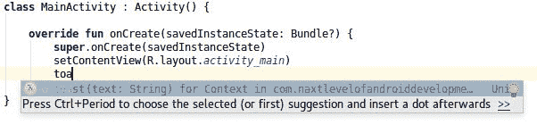
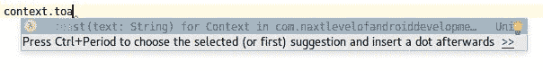
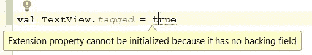
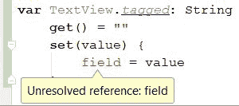
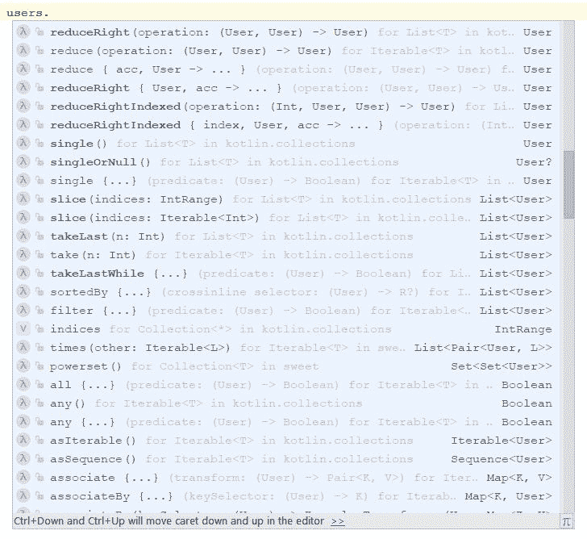

# 第七章：扩展函数和属性

在以前的章节中，大多数概念对 Java 开发人员来说都很熟悉。在本章中，我们介绍了一个在 Java 中完全不知道的功能--扩展。这是 Kotlin 最好的功能之一，许多 Kotlin 开发人员都将其称为自己最喜欢的功能之一。扩展在 Android 开发中有了很大的改进。

本章中，我们将涵盖以下主题：

+   扩展函数

+   扩展属性

+   成员扩展函数

+   通用扩展函数

+   集合处理

+   带接收器的函数类型和带接收器的函数文字

+   Kotlin 通用扩展函数到任何对象

+   Kotlin 领域特定语言

# 扩展函数

所有较大的 Java 项目都有实用程序类，例如`StringUtils`，`ListUtils`，`AndroidUtils`等。这是如此流行，因为 util 函数捕捉常见模式，并允许以更简单的方式进行测试和使用。问题在于 Java 对这种函数的创建和使用支持非常差，因为它们必须实现为某个类的静态函数。让我们通过一个例子讨论这个问题。每个 Java Android 开发人员都很熟悉用于显示`Toast`的以下代码：

```kt
    Toast.makeText(context, text, Toast.LENGTH_SHORT).show(); 
```

在 Android 项目中通常用于显示错误或短消息，并且通常出现在大多数 Android 教程的开头。由于它使用类似构建器的静态函数，实现此功能的代码是冗长的。也许每个 Java Android 开发人员至少有一次忘记在返回的对象上调用`show`方法，这使他检查所有周围的条件以找出为什么这不起作用。所有这些都使得这个简单的功能成为打包为 util 函数的完美候选者。但实际上很少以这种方式使用。为什么？要理解这一点，让我们首先看看它在 Java 中是如何实现的：

```kt
public class AndroidUtils { 
    public static void toast(Context context, String text) { 
        Toast.makeText(context, text, Toast.LENGTH_SHORT).show(); 
    } 
} 

// Usage 
AndroidUtils.toast(context, "Some toast"); 
```

当程序员想要使用以下函数时，他们需要记住有这样的函数，在哪个类中定位，以及它的名称是什么。因此，它的使用并不比以前简单。在不改变 Android SDK 实现的情况下，无法将其实现为`Context`（`Activity`的超类）的方法，但在 Kotlin 中，可以创建一个扩展函数，其行为类似于在类内部定义的实际方法。以下是我们如何将`toast`实现为`Context`的扩展：

```kt
    fun Context.toast(text: String) { // 1 
        Toast.makeText(this, text, LENGTH_LONG).show() //2 
    } 

    // Usage 
    context.toast("Some toast")  
```

1.  `Context` 不在参数列表中，而是在函数名之前。这是我们定义我们要扩展的类型的方式。

1.  在函数体内，我们可以使用 this 关键字引用调用扩展函数的对象。

扩展函数和标准函数之间在一般结构上的唯一区别是在函数名之前指定了接收器类型。在函数体内部，我们可以使用`this`关键字访问接收器对象（调用扩展的对象），或直接调用其函数或属性。有了这样的定义，`toast`函数就像在`Context`中定义的方法一样：

```kt
    context.toast("Some toast") 

    Alternatively: 
    class MainActivity :Activity() { 

        override fun onCreate(savedInstanceState: Bundle?){ 
            super.onCreate(savedInstanceState) 
            toast("Some text") 
        } 
    } 
```

这使得使用`toast`函数比实现整个显示 toast 的代码更容易。我们还可以从 IDE 中得到建议，在`Context`（如在`Activity`内部）或`Context`的实例中调用此函数时，我们可以调用此函数：



在前面的例子中，`Context` 是 `toast` 函数的接收器类型，`this` 实例是对接收器对象的引用。可以显式访问接收器对象的所有函数和属性，因此我们可以采用以下定义：

```kt
    fun Collection<Int>.dropPercent(percent: Double) 
        = this.drop(floor(this.size * percent) 
```

然后我们可以用以下内容替换它：

```kt
    fun Collection<Int>.dropPercent(percent: Double) 
        = drop(floor(size * percent)) 
```

扩展函数有多种有用的用例。类似的扩展函数可以为`View`，`List`，`String`和 Android 框架或第三方库中定义的其他类以及开发人员定义的自定义类定义。扩展函数可以添加到任何可访问的类型，甚至可以添加到`Any`对象。以下是一个可以在每个对象上调用的扩展函数：

```kt
fun Any?.logError(error: Throwable, message: String = "error") { 
    Log.e(this?.javaClass?.simpleName ?: "null", message, error) 
} 
```

以下是一些调用示例：

```kt
    user.logError(e, "NameError") // Logs: User: NameError ... 
    "String".logError(e) // String: error ... 
    logError(e) // 1, MainActivity: error ... 
```

1.  假设我们在`MainActivity`中调用这个函数。

我们可以简单地向任何我们想要的类添加任何方法。这对于 Android 开发是一个很大的改进。有了它，我们有一种方法可以向类型添加丢失的方法或属性。

# 扩展函数的内部机制

虽然 Kotlin 扩展函数可能看起来像魔术，但在幕后它们实际上非常简单。顶级扩展函数被编译为具有接收对象的静态函数的第一个参数。让我们看看已经介绍的`toast`函数：

```kt
    // ContextExt.kt 

    fun Context.toast(text: String) { 
        Toast.makeText(this, text, LENGTH_LONG).show() 
    } 

```

这个函数在编译和反编译为 Java 后，会看起来类似于以下函数：

```kt
//Java 
public class ContextExtKt { 
    public static void toast(Context receiver, String text) { 
        Toast.makeText(receiver, text, Toast.LENGTH_SHORT).show(); 
    } 
}
```

Kotlin 顶级扩展函数被编译为具有接收对象的静态函数的第一个参数。这就是为什么我们仍然可以从 Java 中使用扩展函数：

```kt
    // Java 
    ContextExtKt.toast(context, "Some toast") 
```

此外，这意味着从 JVM 字节码的角度来看，该方法并没有真正添加，但在编译期间，所有扩展函数的用法都被编译为静态函数调用。虽然扩展函数只是函数，但函数修饰符可以应用于它们，就像它们也可以应用于任何其他函数一样。例如，扩展函数可以标记为`inline`：

```kt
inline fun Context.isPermissionGranted (permission: String): Boolean = ContextCompat.checkSelfPermission (this, permission) ==  PackageManager.PERMISSION_GRANTED 
```

与其他`inline`函数一样，函数调用将在应用程序编译期间替换为实际的主体。我们可以使用扩展函数实际上可以做任何我们可以做的事情。它们可以是单个表达式，具有默认参数，可以通过命名参数使用等等。但这种实现还有其他一些不太直观的后果。在接下来的章节中，我们将对它们进行描述。

# 没有方法重写

当存在具有相同名称和参数的成员函数和扩展函数时，成员函数总是优先。这是一个例子：

```kt
    class A { 
        fun foo() { 
            println("foo from A") 
        } 
    } 

    fun A.foo() { 
        println("foo from Extension") 
    } 

    A().foo() // Prints: foo from A 
```

这总是成立的。即使是来自超类的方法也会受到扩展函数的影响：

```kt
    open class A { 
        fun foo() { 
            println("foo from A") 
        } 
    } 

    class B: A() 

    fun B.foo() { 
        println("foo from Extension") 
    } 

    A().foo() // foo from A 
```

关键是扩展函数不允许修改真实对象的行为。我们只能添加额外的功能。这使我们得到了保障，因为我们知道没有人会改变我们正在使用的对象的行为，这可能导致难以追踪的错误。

# 访问接收器元素

扩展函数被编译为具有接收对象的静态函数的第一个参数，因此我们没有额外的访问权限。`private`和`protected`元素是不可访问的，具有 Java `default`，Java `package`或 Kotlin `internal`修饰符的元素与我们对标准对象进行操作时一样被访问。

由于这样，这些元素得到了应有的保护。请记住，扩展函数虽然强大而有用，但只是一种语法糖，其中并没有魔法。

# 扩展是静态解析的

扩展函数只是具有接收器作为第一个参数的函数，因此它们的调用是由调用函数的类型在编译时解析的。例如，当超类和子类都有扩展函数时，那么在调用期间选择的扩展函数取决于我们正在操作的属性的类型。这是一个例子：

```kt
    abstract class A 
    class B: A() 

    fun A.foo() { println("foo(A)") } 
    fun B.foo() { println("foo(B)") } 

    val b = B() 
    b.foo() // prints: foo(B) 
    (b as A).foo() // 1, prints: foo(A) 
    val a: A = b 
    a.foo() // 1, prints: foo(A) 
```

1.  在这里，我们期望`foo(B)`，而实际上对象的类型是`B`，但是由于扩展是静态解析的，它使用了`A`的扩展函数，因为变量的类型是`A`，在编译期间没有关于对象是什么的信息。

这个事实有时是有问题的，因为当我们为我们最常转换的类型定义扩展函数时，我们不应该为它的子类实现扩展函数。

这是一个重要的限制，应该牢记在心，特别是在公共库实现期间，因为这种方式，一些扩展函数可能会阻止其他函数并导致意外行为。

# 伴生对象扩展

如果一个类定义了一个伴生对象，那么您也可以为这个伴生对象定义扩展函数（和属性）。要区分对类的扩展和对伴生对象的扩展，需要在扩展类型和函数名称之间添加`.Companion`：

```kt
    class A { 
        companion object {} 
    } 
    fun A.Companion.foo() { print(2) } 
```

当它被定义时，`foo`方法可以像在`A`伴生对象内定义的方法一样使用：

```kt
    A.foo() 
```

请注意，我们使用类类型而不是类实例来调用此扩展。要允许为伴生对象创建扩展函数，需要在类内明确定义一个伴生对象。即使是一个空的。没有它，就不可能定义扩展函数：


# 使用扩展函数进行操作符重载

操作符重载是 Kotlin 的一个重要特性，但通常我们需要使用 Java 库和那里未定义的操作符。例如，在 RxJava 中，我们使用`CompositeDisposable`函数来管理订阅。这个集合使用`add`方法来添加新元素。这是一个添加到`CompositeDisposable`的示例订阅*：*

```kt
    val subscriptions = CompositeDisposable() 

    subscriptions.add(repository 
       .getAllCharacters(qualifiedSearchQuery) 
       .subscribeOn(Schedulers.io()) 
       .observeOn(AndroidSchedulers.mainThread()) 
       .subscribe(this::charactersLoaded, view::showError)) 
```

向可变集合添加新元素的标准 Kotlin 方式是使用`plusAssign`运算符（`+=`）。这不仅更通用，而且更清晰，而且我们可以省略括号：

```kt
    val list = mutableListOf(1,2,3) 
    list.add(1) 
    list += 1 
```

要在我们的示例中应用它，我们可以添加以下扩展：

```kt
operator fun CompositeDisposable.plusAssign(disposable: Disposable) 

{ 
    add(disposable)  
} 
```

现在我们可以在`CompositeDisposable`上使用`plusAssign`方法：

```kt
    subscriptions += repository 
       .getAllCharacters(qualifiedSearchQuery) 
       .subscribeOn(Schedulers.io()) 
       .observeOn(AndroidSchedulers.mainThread()) 
       .subscribe(this::charactersLoaded, view::showError)
```

# 顶级扩展函数应该在哪里使用？

扩展函数在我们觉得其他程序员定义的类缺少某些方法时最常用。例如，如果我们认为`View`应该包含`show`和`hide`方法，使用起来比可见性字段设置更容易，那么我们可以自己实现它：

```kt
    fun View.show() { visibility = View.VISIBLE } 
    fun View.hide() { visibility = View.GONE } 
```

无需记住保存 util 函数的类的名称。在 IDE 中，我们只需在对象后面加一个点，就可以搜索与该对象一起提供的所有方法，包括来自项目和库的扩展函数。调用看起来不错，就像原始对象成员一样。这就是扩展函数的美，但也是一个危险。现在已经有大量的 Kotlin 库，它们只是一堆扩展函数。当我们使用大量扩展函数时，我们的 Android 代码可能不像正常的 Android 代码。这既有利有弊。以下是利：

+   代码更短，更易读

+   代码呈现更多逻辑而不是 Android 样板

+   扩展函数通常在多个地方进行测试，或者至少在多个地方使用，因此更容易找出它们是否正常工作

+   当我们使用扩展函数时，我们很少会犯一个愚蠢的错误，导致数小时的代码调试

为了说明最后两点，我们将回到`toast`函数。在编写以下内容时很难出错：

```kt
    toast("Some text") 
```

虽然在以下情况下更容易出错：

```kt
    Toast.makeText(this, "Some text",Toast.LENGTH_LONG).show() 
```

在项目中强大的扩展使用的最大问题是，实际上我们正在制定自己的 API。我们正在命名和实现函数，并决定应该有哪些参数。当一些开发人员加入团队时，他需要学习我们创建的整个 API。Android API 有很多缺点，但它的优势在于它是通用的，并且所有 Android 开发人员都知道它。

这是否意味着我们应该放弃扩展？绝对不是！这是一个很好的功能，可以帮助我们使代码简洁清晰。关键是我们应该以聪明的方式使用它们：

+   避免执行相同操作的多个扩展。

+   短小简单的功能通常不需要成为扩展。

+   在项目周围保持一种编码风格。与您的团队交流并指定一些标准。

+   在使用具有扩展功能的公共库时要小心。将它们保留为无法更改的代码，并将您的扩展与它们匹配以保持 API 清晰。

# 扩展属性

在本节中，我们将首先了解什么是扩展属性，然后我们将继续学习这些属性可以在哪里使用。正如我们已经知道的，Kotlin 中的属性是由它们的访问器（getter 和 setter）定义的：

```kt
    class User(val name: String, val surname: String) { 
        val fullName: String 
        get() = "$name $surname" 
    } 
```

我们还可以定义扩展属性。唯一的限制是该属性不能有后备字段。原因是扩展不能存储状态，因此没有好地方来存储此字段。以下是`TextView`的扩展属性定义示例：

```kt
    val TextView.trimmedText: String 
    get() = text.toString().trim() 

    // Usage 
    textView.trimmedText 
```

与扩展函数一样，上述实现将被编译为具有第一个参数的接收器的访问器函数。以下是 Java 中的简化结果：

```kt
    public class AndroidUtilsKt { 
        String getTrimmedText(TextView receiver) { 
            return receiver.getText().toString().trim(); 
        } 
    } 
```

如果它是一个读写属性，那么 setter 和 getter 都将被实现。请记住，只有不需要 Java 字段的属性才允许被定义为扩展属性。例如，这是非法的：



# 扩展属性应该在哪里使用？

扩展属性通常可以与扩展函数互换使用。它们通常都用作顶级工具。当我们希望对象具有一些未经原生开发的属性时，就会使用扩展属性。决定我们应该使用扩展函数还是扩展属性的决定几乎与我们在类内部使用不带后备字段的函数或属性的决定相同。只是提醒一下，根据惯例，当底层算法满足以下条件时，应优先选择属性而不是函数：

+   不会抛出错误

+   具有 O（1）复杂度

+   计算成本低（或在第一次运行时缓存）

+   在调用中返回相同的结果

让我们来看一个简单的问题。我们经常需要在 Android 中获取一些服务，但用于获取它们的代码很复杂：

```kt
    PreferenceManager.getDefaultSharedPreferences(this) 
    getSystemService(Context.LAYOUT_INFLATER_SERVICE) as LayoutInflater 
    getSystemService(Context.ALARM_SERVICE) as AlarmManager 
```

要使用诸如`AlarmManager`或`LayoutInflater`之类的服务，程序员必须记住每个服务的以下内容：

+   提供它的函数的名称（例如`getSystemService`）和包含它的类（例如`Context`）

+   指定此服务的字段名称（例如`Context.ALARM_SERVICE`）

+   服务应该转换为的类的名称（例如`AlarmManager`）

这很复杂，这是我们可以通过扩展属性优化使用的完美场所。我们可以这样定义扩展属性：

```kt
    val Context.preferences: SharedPreferences 
        get() = PreferenceManager 
            .getDefaultSharedPreferences(this) 

    val Context.inflater: LayoutInflater 
        get() = getSystemService(Context.LAYOUT_INFLATER_SERVICE) 
            as LayoutInflater 

    val Context.alarmManager: AlarmManager 
        get() = getSystemService(Context.ALARM_SERVICE) 
            as AlarmManager 
```

从现在开始，我们可以像`Context`的属性一样使用`preferences`，`inflater`和`alarmManager`：

```kt
context.preferences.contains("Some Key") 
context.inflater.inflate(R.layout.activity_main, root) 
context.alarmManager.setRepeating(ELAPSED_REALTIME, triggerAt, 

   interval, pendingIntent) 
```

这些都是良好的只读扩展函数使用的完美例子。让我们专注于`inflater`扩展属性。它有助于获取通常需要的元素，但是没有扩展很难获取。这是有帮助的，因为程序员只需要记住他们需要的是一个 inflater，他们需要`Context`来拥有它，而不需要记住提供系统服务的方法的名称（`getSystemService`），获取`inflater`属性的键的名称（`ALARM_SERVICE`），它位于哪里（在`Context`中），以及这个服务应该被转换为什么（`AlarmManager`）。换句话说，这个扩展节省了很多工作和程序员的记忆。此外，根据指南，属性 getter 的执行时间很短，复杂度为**O**(*1*),它不会抛出任何错误，并且总是返回相同的`inflater`（实际上，它可能是一个不同的实例，但从程序员的角度来看，它的使用方式总是相同的，这才是重要的）。

我们已经看到了只读扩展属性，但我们还没有看到读写扩展属性。这是一个很好的例子，是对扩展函数部分中我们看到的`hide`和`show`函数的替代品：

```kt
    var View.visible: Boolean 
    get() = visibility == View.VISIBLE 
    set(value) { 
        visibility = if (value) View.VISIBLE else View.GONE 
    } 
```

我们可以使用这个属性来改变视图元素的可见性：

```kt
    button.visible = true // the same as show() 
    button.visible = false // the same as hide() 

    Also, we can check view element visibility: 

    if(button.visible) { /* ... */ } 
```

一旦我们定义了它，我们就可以将其视为真正的`View`属性。重要的是，我们设置的内容与我们获取的内容保持一致。因此，假设没有其他线程改变元素的可见性，我们可以设置一些属性值：

```kt
    view.visible = true 
```

然后 getter 将始终提供相同的值：

```kt
    println(view.visible) // Prints: true 
```

最后，getter 和 setter 内部没有其他逻辑，只是特定属性的更改。因此，我们之前提出的其他约定也得到了满足。

# 成员扩展函数和属性

我们已经看到了顶层扩展函数和属性，但也可以在类或对象内部定义它们。在那里定义的扩展称为成员扩展，它们通常用于不同于顶层扩展的各种问题。

让我们从成员扩展被使用的最简单的用例开始。假设我们需要删除`String`列表的每第三个元素。这是一个允许我们删除每个 i^(th)元素的扩展函数：

```kt
    fun List<String>.dropOneEvery(i: Int) = 
        filterIndexed { index, _ -> index % i == (i - 1) } 
```

该函数的问题在于，它不应该被提取为一个 util 扩展，因为：

+   它没有准备好用于不同类型的列表（比如`User`列表或`Int`列表）

+   这是一个很少有用的函数，所以可能不会在项目的其他地方使用

这就是为什么我们希望将其保持为私有，并且将其作为成员扩展函数放在我们使用它的类内部的好主意：

```kt
    class UsersItemAdapter : ItemAdapter() { 
        lateinit var usersNames: List<String> 

        fun processList() { 
        usersNames = getUsersList() 
            .map { it.name } 
            .dropOneEvery(3) 
        } 

        fun List<String>.dropOneEvery(i: Int) = 
            filterIndexed { index, _ -> index % i == (i - 1) } 

        // ... 
    } 
```

这是我们使用成员扩展函数的第一个原因，是为了保护函数的可访问性。在这种情况下，可以通过在同一文件中的顶层定义一个带有私有修饰符的函数来实现。但是成员扩展函数的行为与顶层函数不同。在前面的代码中使用的函数是公共的，但它只能在`List<String>`上调用，并且只能在`UsersItemAdapter`中调用。因此，它只能在`UsersItemAdapter`类及其子类内部或在`UsersItemAdapter`的扩展函数内部使用：

```kt
    fun UsersItemAdapter.updateUserList(newUsers: List<User>) { 
        usersNames = newUsers 
           .map { it.name } 
           .dropOneEvery(3) 
    } 
```

请注意，要使用成员扩展函数，我们需要实现它的对象和将调用这些扩展函数的对象。这是因为我们可以使用这两个对象的元素。这是关于成员扩展的重要信息：它们可以在没有限定符的情况下使用接收器类型和成员类型的元素。让我们看看它可能如何使用。这是另一个例子，类似于前一个例子，但它使用了私有属性`category`：

```kt
    class UsersItemAdapter( 
        private val category: Category 
    ) : ItemAdapter() { 

       lateinit var usersNames: List<String> 

       fun processList() { 
            usersNames = getUsersList() 
                .fromSameCategory() 
                .map { it.name } 
       } 

       fun List<User>.fromSameCategory() = 
           filter { u -> u.category.id == category.id } 

       private fun getUsersList() = emptyList<User>() 
    } 
```

在成员扩展函数`fromSameCategory`内部，我们正在操作一个扩展接收器（`List<User>`），但我们也在使用`UsersItemAdapter`中的`category`属性。我们在这里看到，以这种方式定义的函数需要是一个方法，并且可以类似于其他方法一样使用。与标准方法相比的优势在于我们可以在`List`上调用函数，因此我们可以保持清晰的流处理，而不是使用非扩展方法：

```kt
    // fromSameCategory defined as standard method 
    usersNames = fromSameCategory(newUsers) 
         .dropLast(3) 

    // fromSameCategory defined as member extension function 
    usersNames = newUsers

         .fromSameCategory() 
         .dropLast(3) 
```

另一个常见的用法是成员扩展函数或属性可以像普通方法一样使用，但我们正在利用成员函数内部可以使用接收器属性和方法而不命名它们的事实，这样我们可以有更短的语法，并且我们实际上是在接收器上调用它们，而不是使用相同类型作为参数调用它们。例如，我们可以采用以下方法：

```kt
    private fun setUpRecyclerView(recyclerView: RecyclerView) { 
        recyclerView.layoutManager  
            = LinearLayoutManager(recyclerView.context) 
        recyclerView.adapter 
            = MessagesAdapter(mutableListOf()) 
    } 

    // Usage 
    setUpRecyclerView(recyclerView) 
```

然后我们可以用以下成员扩展函数替换它：

```kt
    private fun RecyclerView.setUp() { 
        layoutManager = LinearLayoutManager(context) 
        adapter = MessagesAdapter(mutableListOf()) 
    } 

    // Usage 
    recyclerView.setUp() 
```

使用成员扩展函数，我们可以实现更简单的调用和更简单的函数体。这次尝试的最大问题是不清楚我们使用的哪些函数是`RecyclerView`的成员，哪些是`Activity`和`RecyclerView`扩展的成员。这个问题将在接下来的页面中提出。

# 接收器的类型

当我们有一个成员扩展函数时，管理我们正在调用哪些元素变得更加复杂。在成员扩展内部，我们隐式访问以下内容：

+   来自此类及其超类的成员函数和属性。

+   接收器类型的函数和属性，包括来自接收器类型及其超类型的函数和属性

+   顶级函数和属性

因此，在`setUp`扩展函数内部，我们可以同时使用成员和接收器的方法和属性：

```kt
    class MainActivity: Activity() { 

       override fun onCreate(savedInstanceState: Bundle?) { 
           super.onCreate(savedInstanceState) 
           setContentView(R.layout.main_activity) 
           val buttonView = findViewById(R.id.button_view) as Button 
           buttonView.setUp() 
       } 

       private fun Button.setUp() { 
           setText("Click me!") // 1, 2 
           setOnClickListener { showText("Hello") } // 2 
       } 

       private fun showText(text: String) { 
           toast(text) 
       } 
    } 
```

1.  `setText`是`Button`类的方法。

1.  我们可以交替使用`Button`类和`MainActivity`类的成员。

这可能有点棘手--也许大多数人不会注意到是否存在错误，并且`setText`调用将与`showText`调用交换。

虽然我们可以在成员扩展内部使用来自不同接收器的元素，为了区分它们，所有类型的接收器都被命名。首先，所有可以被`this`关键字使用的对象都被称为**隐式接收器**。它们的成员可以在没有限定符的情况下访问。在`setUp`函数内部，有两个隐式接收器：

+   **扩展接收器**：扩展定义的类的实例（`Button`）

+   **分发接收器**：扩展声明的类的实例（`MainActivity`）

请注意，虽然扩展接收器和分发接收器的成员都是同一个函数体中的隐式接收器，但可能存在一种情况，我们在两者中都使用具有相同签名的成员。例如，如果我们将上一个类更改为在`textView`中显示文本而不是在`toast`函数中显示它，并将方法名称更改为`setText`，那么我们将使用具有相同签名的分发和扩展接收器的方法（一个在`Button`类中定义，另一个在`MainActivity`类中定义）：

```kt
    class MainActivity: Activity() { 

        override fun onCreate(savedInstanceState: Bundle?) { 
            super.onCreate(savedInstanceState) 
            setContentView(R.layout.main_activity) 
            val buttonView = findViewById(R.id.button_view) as Button 
            buttonView.setUp() 
        } 

        private fun Button.setUp() { 
            setText("Click me!") 
            setOnClickListener { setText("Hello") } // 1 
        } 

        private fun setText(text: String) { 
            textView.setText(text) 
        } 
    } 
```

1.  `setText`既是分发接收器的方法，也是扩展接收器的方法。哪一个会被调用？

因此，`setText`函数将从**扩展接收器**中调用，并且按钮点击将更改所点击按钮的文本！这是因为扩展接收器始终优先于分发接收器。但是，在这种情况下，仍然可以使用分发接收器，方法是使用限定的 this 语法（带有标签的`this`关键字，即区分我们要引用的接收器）：

```kt
    private fun Button.setUp() { 
        setText("Click me!") 
        setOnClickListener {  
            this@MainActivity.setText("Hello")  
        } 
    } 
```

这样，我们可以解决区分分发接收器和扩展接收器的问题。

# 成员扩展函数和属性在底层

成员扩展函数和属性与顶级扩展函数和属性编译方式相同，唯一的区别是它们在类内部，并且它们不是静态的。这是一个简单的扩展函数的例子：

```kt
    class A { 
        fun boo() {} 

        fun Int.foo() { 
            boo() 
         } 
    } 
```

这是它编译后的样子（经过简化）：

```kt
    public final class A { 
        public final void boo() { 
            ...

        } 

        public final void foo(int $receiver) { 
            this.boo(); 
        } 
    } 
```

请注意，虽然它们只是带有接收者作为第一个参数的方法，但我们可以像其他函数一样使用它们。访问修饰符的工作方式相同，如果我们将成员扩展函数定义为 open，那么我们可以在其子类中重写它。

# 通用扩展函数

当我们编写实用函数时，通常希望它们是通用的。最常见的例子是对集合（`List`，`Map`和`Set`）的扩展。这里有一个对`List`的扩展属性的例子：

```kt
    val <T> List<T>.lastIndex: Int 
        get() = size - 1 
```

前面的例子定义了一个通用类型的扩展属性。这种扩展用于许多不同的问题。例如，启动另一个`Activity`是一个重复的任务，通常需要在项目中的多个地方实现。Android IDE 提供的用于启动`Activity`的方法并不简单。这是用于启动名为`SettingsActivity`的新 Activity 的代码：

```kt
    startActivity(Intent (this, SettingsActivity::class.java)) 
```

请注意，这种简单而重复的任务需要大量不太清晰的代码。但是我们可以定义扩展函数，使用`reified`类型的通用内联扩展函数来更简单地创建`Intent`和启动没有参数的`Activity`：

```kt
    inline fun <reified T : Any> Context.getIntent() 
       = Intent(this, T::class.java) 

    inline fun <reified T : Any> Context.startActivity() 
       = startActivity(getIntent<T>()) 
```

现在我们可以通过以下简单地启动`Activity`：

```kt
    startActivity<SettingsActivity>() 
```

或者我们可以这样创建`intent`：

```kt
    val intent = getIntent<SettingsActivity>() 
```

这样，我们可以以较低的成本使这个常见的任务更容易。此外，像**Anko**（[`github.com/Kotlin/anko`](https://github.com/Kotlin/anko)）这样的库提供了扩展函数，提供了一种简单的方式来启动带有额外参数或标志的`Activity`，就像这个例子中一样：

```kt
    startActivity<SettingsActivity>(userKey to user) 
```

本书不涵盖库的内部实现，但我们可以通过将 Anko 库依赖添加到我们的项目中来简单地使用这个扩展。这个例子的重点是几乎所有重复的代码都可以用扩展来替换为更简单的代码。还有其他启动`Activity`的替代方式，比如基于参数注入的`ActivityStarter`库（[`github.com/MarcinMoskala/ActivityStarter`](https://github.com/MarcinMoskala/ActivityStarter)），它对 Kotlin 有很好的支持。它允许经典的参数注入：

```kt
    class StudentDataActivity : BaseActivity() {

        lateinit @Arg var student: Student

        @Arg(optional = true) var lesson: Lesson = Lesson.default()

    }
```

或者，作为替代方案，它允许在 Kotlin 属性委托中进行延迟注入（这在第八章，*委托*中有描述）：

```kt
  class StudentDataActivity : BaseActivity() {

      @get:Arg val student: Student by argExtra()

      @get:Arg(optional = true) 

      var lesson: Lesson by argExtra(Lesson.default())

  }
```

带有这些参数的`Activity`可以使用生成的静态函数启动：

```kt
    StudentDataActivityStarter.start(context, student, lesson)

    StudentDataActivityStarter.start(context, student) 
```

让我们看另一个例子。在 Android 中，我们经常需要以 JSON 格式存储对象。例如，当我们需要将它们发送到 API 或将它们存储在文件中时。用于将对象序列化和反序列化为 JSON 的最流行的库是 Gson。让我们看一下使用 Gson 库的标准方式：

```kt
    val user = User("Marcin", "Moskala") 
    val json: String = globalGson.toJson(user) 
    val userFromJson = globalGson.fromJson(json, User::class.java) 
```

我们可以通过带有`inline`修饰符的扩展函数在 Kotlin 中改进它。这里有一个使用 GSON 将对象打包和解包为 JSON 格式的扩展函数的例子：

```kt
    inline fun Any.toJson() = globalGson.toJson(this)!! 

    inline fun <reified T : Any> String.fromJson() 
      = globalGson.fromJson(this, T::class.java) 

    // Usage 
    val user = User("Marcin", "Moskala") 
    val json: String = user.toJson() 
    val userFromJson: User = json.fromJson<User>() 
```

`globalGson`实例是`Gson`的全局实例。这是常见的做法，因为我们经常定义一些序列化程序和反序列化程序，这是定义它们和构建`Gson`实例的更简单和更有效的方式。

示例展示了通用扩展函数给开发人员提供了哪些可能性。它们就像代码提取的下一个级别：

+   它们是顶层的，但也可以在对象上调用，所以很容易管理

+   它们是通用的，因此是通用的，可以应用于任何东西

+   当内联时，它们允许我们定义`reified`类型参数

这就是为什么泛型扩展函数在 Kotlin 中经常使用。此外，标准库提供了许多泛型扩展。在下一节中，我们将看到一些集合扩展函数。这部分很重要，不仅因为它提供了关于泛型扩展函数的使用知识，而且因为它最终描述了 Kotlin 中列表处理的工作原理以及如何使用它。

# 集合处理

集合处理是编程中最常见的任务之一。这就是为什么开发人员学习的第一件事之一是如何迭代集合以对元素进行操作。要求年轻的开发人员从列表中打印所有用户，他们很可能会使用`for`循环：

```kt
    for (user in users) { 
        println(user) 
    } 
```

如果我们要求他们只显示在学校通过的用户，那么他们很可能会在这个循环中添加一个`if`条件：

```kt
    for (user in users) { 
        if ( user.passing ) {   
            println(user) 
        } 
    } 
```

这仍然是正确的实现，但当任务变得更加复杂时，真正的问题就开始了。如果他们被要求打印通过的三名最优秀的学生呢？在循环中实现这一点非常复杂，而在 Kotlin 流处理中实现它却很简单。让我们在示例中看看。这是学生的示例列表：

```kt
    data class Student( 
        val name: String,  
        val grade: Double,  
        val passing: Boolean 
    ) 

    val students = listOf( 
        Student("John", 4.2, true), 
        Student("Bill", 3.5, true), 
        Student("John", 3.2, false), 
        Student("Aron", 4.3, true), 
        Student("Jimmy", 3.1, true) 
    ) 
```

让我们使用从 Java 中已知的命令式方法（使用循环和排序方法）来过滤学生：

```kt
    val filteredList = ArrayList<Student>() 
    for (student in students) { 
        if(student.passing) filteredList += student 
    } 

    Collections.sort(filteredList) { p1, p2 -> 
        if(p1.grade > p2.grade) -1 else 1 
    } 

    for (i in 0..2) { 
        val student = filteredList[i] 
        println(student) 
    } 

    // Prints: 
    // Student(name=Aron, grade=4.3, passing=true) 
    // Student(name=John, grade=4.2, passing=true) 
    // Student(name=Bill, grade=3.5, passing=true) 
```

我们可以使用 Kotlin 流处理以更简单的方式实现相同的结果：

```kt
    students.filter { it.passing } // 1 
       .sortedByDescending { it.grade } // 2 
       .take(3) // 3 
       .forEach(::println) // 4 
```

1.  只取通过的学生。

1.  根据他们的成绩对学生进行排序（降序以使成绩更好的学生处于更高的位置）。

1.  只取前三个。

1.  逐个打印它们。

关键在于每个流处理函数，例如前面示例中的`sortedByDescending`，`take`和`forEach`，都提取了一个小功能，其威力来自它们的组合。结果比使用经典循环更简单和更可读。

流处理实际上是一种非常常见的语言特性。它在 C＃，JavaScript，Scala 和许多其他语言中都有，包括自 Java 8 版本以来。流行的响应式编程库，如 RxJava，也大量利用这个概念来处理数据。在本节中，我们将深入研究 Kotlin 集合处理。

# Kotlin 集合类型层次结构

Kotlin 类型层次结构设计得非常好。标准集合实际上是来自本地语言（如 Java）的集合，这些集合隐藏在接口后面。它们的创建是通过标准的顶层函数（`listOf`，`setOf`，`mutableListOf`等）进行的，因此它们可以在通用模块（编译为多个平台的模块）中创建和使用。此外，Kotlin 接口可以像它们在 Java 中的等效接口一样起作用（如`List`，`Set`等），这使得 Kotlin 集合高效且与外部库高度兼容。同时，Kotlin 集合接口层次结构可以在通用模块中使用。这个层次结构很简单，了解它是有利可图的：


Kotlin 集合接口层次结构

最通用的接口是`Iterable`。它表示可以迭代的元素序列。任何实现`iterable`的对象都可以在`for`循环中使用：

```kt
    for (i in iterable) { /* ... */ } 
```

许多不同类型都实现了可迭代接口：所有集合，进展（`1..10`，`'a'..'z'`），甚至`String`。它们都允许我们迭代它们的元素：

```kt
    for (char in "Text") { print("($char)") } // Prints: (T)(e)(x)(t) 
```

`Collection`接口表示元素的集合并扩展`Iterable`。它添加了`size`属性和`contains`，`containsAll`和`isEmpty`方法。

从`Collection`继承的两个主要接口是`List`和`Set`。它们之间的区别在于`Set`是无序的，不包含重复元素（根据`equals`方法）。`List`和`Set`接口都不包含任何允许我们改变对象状态的方法。这就是为什么默认情况下，Kotlin 集合被视为不可变的。当我们有一个`List`的实例时，它在 Android 中很可能是`ArrayList`。`ArrayList`是一个可变集合，但是当它隐藏在`List`接口后，它实际上的行为就像是不可变的，因为它不公开任何允许我们应用更改的方法（除非进行向下转型）。

在 Java 中，集合是可变的，但 Kotlin 集合接口默认只提供不可变行为（例如，没有改变集合状态的方法，比如`add`和`removeAt`）：

```kt
    val list = listOf('a', 'b', 'c') 
    println(list[0]) // Prints: a 
    println(list.size) // Prints: 3 
    list.add('d') // Error 
    list.removeAt(0) // Error 
```

所有不可变接口（`Collection`，`List`等）都有它们的可变等价物（`MutableCollection`，`MutableList`等），它们继承自相应的不可变接口。可变意味着实际对象可以被修改。这些接口代表了标准库中的可变集合：

+   `MutableIterable`允许在应用更改的情况下进行迭代

+   `MutableCollection`确保添加和删除元素的方法

+   `MutableList`和`MutableSet`是`List`和`Set`的可变等价物

现在我们可以修复之前的例子，并使用`add`和`remove`方法更改集合：

```kt
    val list = mutableListOf('a', 'b', 'c') 
    println(list[0]) // Prints: a 
    println(list.size) // Prints: 3 
    list.add('d') 
    println(list) // Prints: [a, b, c, d] 
    list.removeAt(0) 
    println(list) // Prints: [b, c, d] 
```

不可变和可变接口都只提供了一些方法，但是 Kotlin 标准库为它们提供了许多有用的扩展：



这使得处理集合比在 Java 中更容易。

Kotlin 使用扩展来实现集合处理方法。这种方法有很多优势；例如，如果我们想要实现一个自定义集合（比如`List`），我们只需要实现一个只包含几个方法的`iterable`接口。我们仍然可以使用为`iterable`接口提供的所有扩展。

另一个原因是这些函数作为接口的扩展函数时可以灵活使用。例如，大多数这些集合处理函数实际上是`Iterable`的扩展，而`Iterable`被许多更多的类型实现，例如`String`或`Range`。因此，也可以在`IntRange`上使用所有扩展函数。这是一个例子：

```kt
    (1..5).map { it * 2 }.forEach(::print) // Prints: 246810
```

这使得所有这些扩展真正通用。集合流处理方法作为扩展函数实现也有一个缺点。虽然扩展是静态解析的，但是为特定类型覆盖扩展函数是不正确的，因为当它在接口后面时，其行为将与直接访问时不同。

让我们分析一些用于集合处理的扩展函数。

# map、filter、flatMap 函数

我们已经简要介绍了`map`，`filter`和`flatMap`，因为它们是最基本的流处理函数。`map`函数返回根据参数中的函数更改的元素的列表：

```kt
    val list = listOf(1,2,3).map { it * 2 }

    println(list) // Prints: [2, 4, 6]
```

`filter`函数只允许与提供的谓词匹配的元素：

```kt
    val list = listOf(1,2,3,4,5).map { it > 2 } 

    println(list) // Prints: [3, 4, 5] 
```

`flatMap`函数返回由原始集合的每个元素调用的变换函数产生的所有元素的单个列表：

```kt
    val list = listOf(10, 20).flatMap { listOf(it, it+1, it + 2) } 
    println(list) // Prints: [10, 11, 12, 20, 21, 22] 
```

它通常用于展平集合的列表：

```kt
    shops.flatMap { it.products } 
    schools.flatMap { it.students } 
```

让我们看一下这些扩展函数的简化实现：

```kt
inline fun <T, R> Iterable<T>.map(transform: (T) -> R): List<R> { //1 
    val destination = ArrayList<R>() 
    for (item in this) destination.add(transform(item)) // 2 
    return destination 
} 

inline fun <T> Iterable<T>.filter(predicate: (T) -> Boolean): List<T> { // 1 
    val destination = ArrayList<T>() 
    for (item in this) if(predicate(item)) destination.add(item) // 2 
    return destination 
} 

inline fun <T, R> Iterable<T>.flatMap(transform: (T) -> Collection<R>): List<R> { 

// 1 
    val destination = ArrayList<R>() 
    for (item in this) destination.addAll(transform(item)) // 2 
    return destination 
} 
```

1.  所有这些函数都是内联的。

1.  所有这些函数内部都使用 for 循环，并返回一个包含适当元素的新列表。

大多数 Kotlin 标准库扩展函数类型都是`inline`的，因为它使 lambda 表达式的使用更有效率。因此，整个集合流处理实际上在运行时大部分编译为嵌套循环。例如，这是一个简单的处理：

```kt
    students.filter { it.passing } 
       .map { "${it.name} ${it.surname}" } 
```

编译和反编译为 Java 后，它看起来像下面这样（清理过的）：

```kt
    Collection destination1 = new ArrayList(); 
    Iterator it = students.iterator(); 
    while(it.hasNext()) { 
        Student student = (Student) it.next(); 
        if(student.getPassing()) { 
            destination1.add(student); 
        } 
    }  
    Collection destination2 = new ArrayList(destination1.size()); 
    it = destination2.iterator(); 
    while(it.hasNext()) { 
        Student student = (Student) it.next(); 
        String var = student.getName() + " " + student.getSurname(); 
        destination2.add(var); 
    } 
```

# `forEach`和`onEach`函数

`forEach`函数已经在关于函数的章节中讨论过。它是`for`循环的一种替代方法，因此它对列表中的每个元素执行一个操作：

```kt
    listOf("A", "B", "C").forEach { print(it) } // prints: ABC 
```

自 Kotlin 1.1 以来，还有一个类似的函数`onEach`，它也对每个元素执行一个操作。它返回一个扩展接收器（这个列表），所以我们可以在流处理的中间对每个元素执行一个操作。常见的用例是日志记录。以下是一个例子：

```kt

    (1..10).filter { it % 3 == 0 } 
       .onEach(::print) // Prints: 369 
       .map { it / 3 } 
       .forEach(::print) // Prints: 123 
```

# 带有索引和索引变体

有时，元素处理的方式取决于它在列表中的索引。解决这个问题的最通用的方法是使用`withIndex`函数，它返回带有索引的值列表：

```kt
    listOf(9,8,7,6).withIndex() // 1 
       .filter { (i, _) -> i % 2 == 0 } // 2 
       .forEach { (i, v) -> print("$v at $i,") }  
    // Prints: 9 at 0, 7 at 2, 
```

1.  `withIndex`函数将每个元素打包成包含元素和其索引的`IndexedValue`。

1.  在 lambda 中，`IndexedValue`被解构为索引和值，但是值没有被使用，而是用下划线代替。它可能被省略，但这种方式的代码更易读。这行代码只过滤了偶数索引的元素。

此外，还有不同流处理方法的变体，提供了一个索引：

```kt
    val list1 = listOf(2, 2, 3, 3) 
        .filterIndexed { index, _ -> index % 2 == 0 } 
    println(list1) // Prints: [2, 3] 

    val list2 = listOf(10, 10, 10) 
        .mapIndexed { index, i -> index * i } 
    println(list2) // Prints: [0, 10, 20] 

    val list3 = listOf(1, 4, 9) 
        .forEachIndexed { index, i -> print("$index: $i,") } 
    println(list3) // Prints: 0: 1, 1: 4, 2: 9 
```

# `sum`、`count`、`min`、`max`和`sorted`函数

`sum`函数计算列表中所有元素的总和。它可以在`List<Int>`、`List<Long>`、`List<Short>`、`List<Double>`、`List<Float>`和`List<Byte>`上调用：

```kt
    val sum = listOf(1,2,3,4).sum() 
    println(sum) // Prints: 10 
```

通常我们需要对元素的一些属性进行求和，比如对所有用户的点数进行求和。可以通过将用户列表映射到点数列表，然后计算总和来处理：

```kt
    class User(val points: Int) 
    val users = listOf(User(10), User(1_000), User(10_000)) 

    val points = users.map { it.points }. sum() 
    println(points) // Prints: 11010 
```

但是我们通过调用`map`函数不必要地创建了一个中间集合，直接对点数进行求和会更有效率。为了做到这一点，我们可以使用适当的选择器使用`sumBy`：

```kt
    val points = users.sumBy { it.points } 
    println(points) // Prints: 11010
```

`sumBy`期望从选择器返回`Int`，并返回所有元素的总和为`Int`。如果值不是`Int`而是`Double`，那么我们可以使用`sumByDouble`，它返回`Double`：

```kt
    class User(val points: Double) 
    val users = listOf(User(10.0), User(1_000.0), User(10_000.0)) 

    val points = users.sumByDouble { it.points } 
    println(points) // Prints: 11010.0 
```

`count`函数提供了类似的功能，当我们需要计算与谓词匹配的元素时使用它：

```kt
    val evens = (1..5).count { it % 2 == 1 } 
    val odds = (1..5).count { it % 2 == 0 } 
    println(evens) // Prints: 3 
    println(odds) // Prints: 2 
```

`count`函数在没有任何谓词的情况下返回集合或可迭代对象的大小：

```kt
    val nums = (1..4).count() 
    println(nums) // Prints: 4   
```

接下来的重要函数是`min`和`max`，它们是返回列表中最小和最大元素的函数。它们可以用于具有自然排序的元素列表（实现`Comparable<T>`接口）。以下是一个示例：

```kt
    val list = listOf(4, 2, 5, 1) 
    println(list.min()) // Prints: 1 
    println(list.max()) // Prints: 5 
    println(listOf("kok", "ada", "bal", "mal").min()) // Prints: ada 
```

同样，使用`sorted`函数。它返回一个排序后的列表，但需要在实现`Comparable<T>`接口的元素集合上调用。以下是一个示例，说明如何使用`sorted`来获取按字母数字顺序排序的字符串列表：

```kt
    val strs = listOf("kok", "ada", "bal", "mal").sorted() 
    println(strs) // Prints: [ada, bal, kok, mal] 
```

如果项目不可比较怎么办？有两种方法可以对它们进行排序。第一种方法是根据可比较的成员进行排序。我们已经看到一个例子，当我们根据他们的成绩对学生进行排序时：

```kt
    students.filter { it.passing } 
       .sortedByDescending { it.grade } 
       .take(3) 
       .forEach(::println) 
```

在上面的示例中，我们使用可比较的`grade`属性对学生进行排序。在这里，使用了`sortedByDescending`，它的工作方式类似于`sortedBy`，唯一的区别是顺序是降序的（从大到小）。函数内部的选择器可以返回任何可与自身比较的值。以下是一个示例，其中使用`String`来指定顺序：

```kt
    val list = listOf(14, 31, 2) 
    print(list.sortedBy { "$it" }) // Prints: [14, 2, 31] 
```

类似的函数可以用来根据选择器找到最小和最大的元素：

```kt
    val minByLen = listOf("ppp", "z", "as") 
        .minBy { it.length } 
    println(minByLen) // Prints: "z" 

    val maxByLen = listOf("ppp", "z", "as") 
        .maxBy { it.length } 
    println(maxByLen) // Prints: "ppp" 
```

指定排序顺序的第二种方法是定义一个`Comparator`，它将确定如何比较元素。接受比较器的函数变体应该有一个`With`后缀。比较器可以由将 lambda 转换为 SAM 类型的适配器函数来定义：

```kt
    val comparator = Comparator<String> { e1, e2 ->  
        e2.length - e1.length  
    } 
    val minByLen = listOf("ppp", "z", "as") 
       .sortedWith(comparator) 
    println(minByLen) // Prints: [ppp, as, z]
```

Kotlin 还包括用于简化`Comparator`创建的标准库顶层函数（`compareBy`，`compareByDescending`）。这是我们如何创建一个比较器，按`surname`和`name`按字母顺序对学生进行排序的：

```kt
    data class User(val name: String, val surname: String) { 
        override fun toString() = "$name $surname" 
    } 

    val users = listOf( 
       User("A", "A"), 
       User("B", "A"), 
       User("B", "B"), 
       User("A", "B") 
    ) 
    val sortedUsers = users 
       .sortedWith(compareBy({ it.surname }, { it.name })) 

    print(sortedUsers) // [A A, B A, A B, B B] 
```

注意，我们可以使用属性引用而不是 lambda 表达式：

```kt
    val sortedUsers = users 
       .sortedWith(compareBy(User::surname, User::name)) 
    print(sortedUsers) // [A A, B A, A B, B B]  
```

另一个重要的函数是`groupBy`，它根据选择器对元素进行分组。`groupBy`返回`Map`，即从选择的键到选择映射到以下键的元素列表的映射：

```kt
    val grouped = listOf("ala", "alan", "mulan", "malan") 
        .groupBy { it.first() } 
    println(grouped) // Prints: {'a': ["ala", "alan"], "m": ["mulan", "malan"]} 
```

让我们看一个更复杂的例子。我们需要从每个班级的学生名单中得到最好的学生名单。这是我们如何从学生名单中得到他们的：

```kt
    class Student(val name: String, val classCode: String, val meanGrade: Float) 

    val students = listOf( 
       Student("Homer", "1", 1.1F), 
       Student("Carl", "2", 1.5F), 
       Student("Donald", "2", 3.5F), 
       Student("Alex", "3", 4.5F), 
       Student("Marcin", "3", 5.0F), 
       Student("Max", "1", 3.2F) 
    ) 

    val bestInClass = students 
       .groupBy { it.classCode } 
       .map { (_, students) -> students.maxBy { it.meanGrade }!! } 
       .map { it.name } 

    print(bestInClass) // Prints: [Max, Donald, Marcin]
```

# 其他流处理函数

有许多不同的流处理函数，没有必要在这里描述它们全部，因为 Kotlin 在其网站上包含了很好的文档。大多数扩展函数的名称都是不言自明的，没有必要真正阅读文档来猜测它们在做什么。在 Android Studio 中，我们可以通过按下*Ctrl*（mac 上的*command*键）并点击要阅读其实现的函数来检查真正的实现。

在对可变集合进行处理时，集合处理的重要区别在于，虽然它们可以使用为可变类型定义的额外扩展（`MutableIterable`和`MutableCollection`），但重要的区别在于改变对象的函数是用现在的祈使形式来表达（例如，`sort`），而返回具有更改值的新集合的函数通常是用动词的过去形式来表达（例如，`sorted`）。这里有一个例子：

+   `sort`：对可变对象进行排序的函数。它返回`Unit`。

+   `sorted`：返回一个排序后的集合的函数。它不会改变被调用的集合。

```kt
    val list = mutableListOf(3,2,4,1) 
    val list2 = list.sorted() 
    println(list) // [3,2,4,1] 
    println(list2) // [1,2,3,4] 
    list.sort() 
    println(list) // [1,2,3,4] 
```

# 流集合处理的例子

我们已经看到了一些流处理函数，但是需要一些技巧和创造力来将它们用于复杂的用例。这就是为什么在这一部分，我们将讨论一些复杂的流处理示例。

假设我们再次需要找到根据他们的成绩通过的最好的三名学生。关键区别在于，在这种情况下，学生的最终顺序必须与一开始的顺序相同。请注意，在按成绩排序操作期间，这个顺序会丢失。但是，如果我们保持值和索引在一起，我们可以保留它。由此，我们可以稍后根据保留的索引对元素进行排序。这是如何实现这个处理的：

```kt
    data class Student( 
       val name: String, 
       val grade: Double, 
       val passing: Boolean 
    ) 

    val students = listOf( 
       Student("John", 4.2, true), 
       Student("Bill", 3.5, true), 
       Student("John", 3.2, false), 
       Student("Aron", 4.3, true), 
       Student("Jimmy", 3.1, true) 
    ) 

    val bestStudents = students.filter { it.passing } // 1 
       .withIndex() // 2 
       .sortedBy { it.value.grade } // 3 
       .take(3) // 4 
       .sortedBy { it.index } // 5 
       .map { it.value } // 6 

    // Print list of names 
    println(bestStudents.map { it.name }) // [John, Bill, Jimmy] 
```

1.  过滤以保留只有通过的学生

1.  添加索引以能够重现元素顺序

1.  根据他们的成绩对学生进行排序

1.  只取最好的 10 名学生

1.  通过排序重现顺序

1.  将值与索引映射到只有值

请注意，这个实现是简洁的，对集合执行的每个操作都可以逐行轻松阅读。

集合流处理的重大优势在于它易于管理这个过程的复杂性。我们知道大多数操作的复杂度，如`map`或`filter`，是**O**(*n*)，排序操作的复杂度是**O**(*n*log(n)*)。流操作的复杂度是每个步骤的最大复杂度，因此上述处理的复杂度是**O**(*n*log(n)*)，因为`sortedBy`是具有最大复杂度的步骤。

作为下一个例子，假设我们有一个包含不同类别中玩家结果的列表：

```kt
    class Result( 
       val player: Player, 
       val category: Category, 
       val result: Double 
    ) 
    class Player(val name: String) 
    enum class Category { SWIMMING, RUNNING, CYCLING } 
```

我们有一些示例数据：

```kt
    val results = listOf( 
       Result("Alex", Category.SWIMMING, 23.4), 
       Result("Alex", Category.RUNNING, 43.2), 
       Result("Alex", Category.CYCLING, 15.3), 
       Result("Max", Category.SWIMMING, 17.3), 
       Result("Max", Category.RUNNING, 33.3), 
       Result("Bob", Category.SWIMMING, 29.9), 
       Result("Bob", Category.CYCLING, 18.0) 
    ) 
```

这是我们如何在每个类别中找到最好的玩家：

```kt
    val bestInCategory = results.groupBy { it.category } // 1 
       .mapValues { it.value.maxBy { it.result }?.player } // 2 
    print(bestInCategory)  
    // Prints: {SWIMMING=Bob, RUNNING=Alex, CYCLING=Bob} 
```

1.  我们将结果分组到类别中。返回类型是`Map<Category>`和`List<Result>`。

1.  我们正在映射`map`函数的值。在内部，我们找到了这个类别中的最佳结果，并且我们正在取得与这个结果相关联的玩家。`mapValues`函数的返回值是`Map<Category>`，`Player?>`。

前面的例子展示了在 Kotlin 中如何通过集合处理函数轻松解决与集合相关的复杂问题。在使用 Kotlin 一段时间后，大多数这些函数对程序员来说都很熟悉，然后集合处理问题就变得相当容易解决。当然，像上面介绍的那样复杂的函数很少见，但是简单的、几步的处理在日常编程中是相当常见的。

# 序列

`Sequence`是一个接口，也用于引用元素的集合。它是`Iterable`的替代品。对于`Sequence`，大多数集合处理函数（`map`，`flatMap`，`filter`，`sorted`等）都有单独的实现。关键区别在于，所有这些函数都是以这样的方式构造的，它们返回序列，该序列包装在前一个序列上。由于这个原因，以下几点成为真实：

+   序列的大小不需要事先知道

+   序列处理更有效，特别是对于大型集合，我们想要执行多个转换（详细信息将在后面描述）

在 Android 中，序列用于处理非常大的集合或处理事先不知道大小的元素（例如读取可能很长的文档的行）。有不同的创建序列的方式，但最简单的是在`Iterable`上调用`asSequence`函数，或者使用`sequenceOf`顶级函数来制作类似列表的序列。

序列的大小不需要事先知道，因为值是在需要时计算的。这是一个例子：

```kt
    val = generateSequence(1) { it + 1 } // 1\. Instance of GeneratorSequence 
       .map { it * 2 } // 2\. Instance of TransformingSequence 
       .take(10) // 3\. Instance of  TakeSequence 
       .toList() // 4\. Instance of List 

    println(numbers) // Prints: [2, 4, 6, 8, 10, 12, 14, 16, 18, 20]
```

1.  函数`generateSequence`是序列生成的一种方式。这个序列包含从 1 到无穷大的下一个数字。

1.  `map`函数将一个序列打包到另一个序列中，它从第一个序列中获取值，然后计算转换后的值。

1.  函数`take(10)`还会将一个序列打包到另一个序列中，该序列在第 10 个元素结束。如果没有这行代码的执行，当我们在一个无限序列上操作时，处理时间将是无限的。

1.  最后，函数`toList`正在处理每个值并返回最终列表。

重要的是要强调，在最后一步（在终端操作中）元素是一个接一个地处理的。让我们看另一个例子，其中每个操作也打印值以进行日志记录。让我们从以下代码开始：

```kt
    val seq = generateSequence(1) { println("Generated ${it+1}"); it + 1 } 
       .filter { println("Processing of filter: $it"); it % 2 == 1 } 
       .map { println("Processing map: $it"); it * 2 } 
       .take(2) 
```

控制台会打印什么？绝对什么都不会打印。没有计算出任何值。原因是所有这些中间操作都是惰性的。要检索结果，我们需要使用一些终端操作，比如`toList`。让我们使用以下操作：

```kt
    seq.toList() 
```

然后我们会在控制台中看到以下内容：

```kt
Processing of filter: 1 
Processing map: 1 
Generated 2 
Processing of filter: 2 
Generated 3 
Processing of filter: 3 
Processing map: 3 
```

请注意，元素是一个接一个地完全处理的。在标准列表处理中，操作的顺序将完全不同：

```kt
    (1..4).onEach { println("Generated $it") } 
       .filter { println("Processing filter: $it"); it % 2 == 1 } 
       .map { println("Processing map: $it"); it * 2 } 
```

前面的代码打印如下：

```kt
Generated 1 
Generated 2 
Generated 3 
Generated 4 
Processing filter: 1 
Processing filter: 2 
Processing filter: 3 
Processing filter: 4 
Processing map: 1 
Processing map: 3 
```

这解释了为什么序列比经典的集合处理更有效--不需要在中间步骤中创建集合。值是按需逐个处理的。

# 带接收者的函数文字

就像函数有一个函数类型，允许它们被保存为对象一样，扩展函数也有它们的类型，允许它们以这种方式被保存。它被称为带接收者的函数类型。它看起来像简单的函数类型，但接收者类型位于参数之前（就像在扩展定义中一样）：

```kt
    var power: Int.(Int) -> Int
```

引入带接收者的函数类型使函数和类型之间具有完全的内聚性，因为现在所有函数都可以表示为对象。它可以使用带接收者的 lambda 表达式或带接收者的匿名函数来定义。

在带接收者的 lambda 表达式定义中，唯一的区别是我们可以通过`this`引用接收者，并且可以明确使用接收者元素。对于 lambda 表达式，必须在参数中指定类型，因为没有语法来指定接收者类型。这里将`power`定义为带接收者的 lambda 表达式：

```kt
    power = { n -> (1..n).fold(1) { acc, _ -> this * acc } } 
```

匿名函数还允许我们定义接收者，并且其类型放在函数名之前。在这样的函数中，我们可以在主体内部使用`this`来引用扩展接收者对象。请注意，匿名扩展函数正在指定接收者类型，因此可以推断属性类型。这里将`power`定义为匿名扩展函数：

```kt
    power = fun Int.(n: Int) = (1..n).fold(1) { acc, _ -> this * acc } 
```

带接收者的函数类型可以像接收者类型的方法一样使用：

```kt
    val result = 10.power(3) 
    println(result) // Prints: 1000 
```

函数类型最常用作函数参数。这里有一个示例，其中参数函数用于在创建元素后配置元素：

```kt
    fun ViewGroup.addTextView(configure: TextView.()->Unit) { 
        val view = TextView(context) 
        view.configure() 

        addView(view) 

    }

    // Usage 
    val linearLayout = findViewById(R.id.contentPanel) as LinearLayout 

    linearLayout.addTextView { // 1 
        text = "Marcin" // 2 
        textSize = 12F // 2 
    }
```

1.  在这里，我们使用 lambda 表达式作为参数。

1.  在 lambda 表达式中，我们可以直接调用接收者方法。

# Kotlin 标准库函数

Kotlin stdlib 提供了一组扩展函数（`let`，`apply`，`also`，`with`，`run`和`to`），具有通用的非受限接收者（通用类型没有限制）。它们是小巧方便的扩展，了解它们非常有利，因为它们在所有 Kotlin 项目中都非常有用。其中一个函数`let`在第二章中简要介绍过，我们看到它如何可以用作对空值检查的替代方法：

```kt
    savedInstanceState?.let{ state ->  
        println(state.getBoolean("isLocked"))
    } 
```

`let`所做的就是调用指定的函数并返回其结果。在上面的示例中，它与安全调用运算符一起使用，只有当属性`savedInstanceState`不为 null 时才会调用。`let`函数实际上只是一个带有参数函数的通用扩展函数：

```kt
    inline fun <T, R> T.let(block: (T) -> R): R = block(this) 
```

在 stdlib 中，有更多类似于`let`的函数。这些函数是`apply`，`also`，`with`和`run`。它们很相似，所以我们将一起描述它们。以下是其余函数的定义：

```kt
inline fun <T> T.apply(block: T.() -> Unit): T { 

    block(); 

    return this 

} 
inline fun <T> T.also(block: (T) -> Unit): T { 

    block(this); 

    return this 

} 
inline fun <T, R> T.run(block: T.() -> R): R = block() 
inline fun <T, R> with(receiver: T, block: T.() -> R): R = receiver.block() 
```

让我们看看使用示例：

```kt
    val mutableList = mutableListOf(1) 

    val mutableList = mutableListOf(1)

    val letResult = mutableList.let {

        it.add(2)

        listOf("A", "B", "C")

    }

    println(letResult) // Prints: [A, B, C]

    val applyResult = mutableList.apply {

        add(3)

        listOf("A", "B", "C")

    }

    println(applyResult) // Prints: [1, 2, 3]

    val alsoResult = mutableList.also {

       it.add(4)

       listOf("A", "B", "C")

    }

    println(alsoResult) // Prints: [1, 2, 3, 4]

    val runResult = mutableList.run {

       add(5)

       listOf("A", "B", "C")

    }

    println(runResult) // Prints: [A, B, C]

    val withResult = with(mutableList) {

       add(6)

       listOf("A", "B", "C")

    }

    println(withResult) // Prints: [A, B, C]

    println(mutableList) // Prints: [1, 2, 3, 4, 5, 6]
```

这些差异总结在以下表中：

| **返回的对象/参数函数类型** | **带接收者的函数文字**（接收对象表示为*this*） | **函数文字**（接收对象表示为*it*） |
| --- | --- | --- |
| **接收对象** | `apply` | `also` |
| **函数文字的结果** | `run` /`with` | `let` |

虽然这些函数很相似，并且在许多情况下可以互换使用，但有一些约定规定了哪些函数更适用于特定的用例。

# let 函数

当我们想要在流处理中将标准函数用作扩展函数时，首选`let`函数：

```kt
    val newNumber = number.plus(2.0) 
       .let { pow(it, 2.0) } 
       .times(2) 
```

与其他扩展一样，它可以与安全调用运算符结合使用：

```kt
    val newNumber = number?.plus(2.0) 
       ?.let { pow(it, 2.0) } 
```

当我们只想要解包可空的可读写属性时，也更倾向于使用`let`函数。在这种情况下，无法智能转换此属性，我们需要对其进行遮蔽，就像在这个解决方案中一样：

```kt
    var name: String? = null 

    fun Context.toastName() { 
        val name = name
        if(name != null) { 
            toast(name) 
        } 
    }   
```

`name`变量是遮蔽属性名称，如果 name 是可读写属性，则这是必要的，因为智能转换只允许在可变或局部变量上。

我们可以用`let`的用法和安全调用运算符来替换前面的代码：

```kt
    name?.let { setNewName(it) } 
```

请注意，使用 Elvis 运算符，当`name`为`null`时，我们可以轻松添加`return`或异常抛出：

```kt
    name?.let { setNewName(it) } ?: throw Error("No name setten") 
```

类似的方式，`let`可以用作以下语句的替代：

```kt
    val comment = if(field == null) getComment(field) else "No comment 
```

使用`let`函数的实现将如下所示：

```kt
    val comment = field?.let { getComment(it) } ?: "No comment" 
```

这种方式使用的`let`函数在转换接收器的方法链中是首选的：

```kt
    val text = "hello {name}" 

    fun correctStyle(text: String) = text 
       .replace("hello", "hello,") 

    fun greet(name: String) { 
        text.replace("{name}", name) 
           .let { correctStyle(it) } 
           .capitalize() 
           .let { print(it) } 
    } 

    // Usage 
    greet("reader") // Prints: Hello, reader 
```

我们还可以通过将函数引用作为参数来使用更简单的语法：

```kt
    text.replace("{name}", name) 
       .let(::correctStyle) 
       .capitalize() 
       .let(::print)
```

# 使用 apply 函数进行初始化

有时我们需要通过调用一些方法或修改一些属性来创建和初始化对象，比如当我们创建一个`Button`时：

```kt
    val button = Button(context) 
    button.text = "Click me"   
    button.isVisible = true 
    button.setOnClickListener { /* ... */ } 
    this.button = button 
```

我们可以通过使用`apply`扩展函数来减少代码冗长。我们可以从`button`作为接收对象的上下文中调用所有这些方法：

```kt
    button = Button(context).apply { 
        text = "Click me" 
        isVisible = true 
        setOnClickListener { /* ... */ } 
    } 
```

# also 函数

`also`函数与`apply`类似，唯一的区别是参数函数接受一个参数而不是一个接收器。当我们想对一个对象进行一些不是初始化的操作时，它是首选的：

```kt
    abstract class Provider<T> { 

       var original: T? = null 
       var override: T? = null 

       abstract fun create(): T 

       fun get(): T = override ?: original ?: create().also { original = it } 
    } 
```

当我们需要在处理过程中进行一些操作时，例如在使用构建器模式构建对象时，`also`函数也是首选的：

```kt
    fun makeHttpClient(vararg interceptors: Interceptor) =  
        OkHttpClient.Builder() 
            .connectTimeout(60, TimeUnit.SECONDS) 
            .readTimeout(60, TimeUnit.SECONDS) 
            .also { it.interceptors().addAll(interceptors) } 
            .build() 
```

`also`更受欢迎的另一种情况是当我们已经在扩展函数中，而且不想添加另一个扩展接收器时：

```kt
    class Snail { 
        var name: String = "" 
        var type: String = "" 

        fun greet() { 
            println("Hello, I am $name") 
        } 
    } 

    class Forest { 
        var members = listOf<Sneil>() 

       fun Sneil.reproduce(): Sneil = Sneil().also { 
           it.name = name 
           it.type = type 
           members += it 
       } 
    } 
```

# run 和 with 函数

`run`和`with`函数都接受带有接收器的 lambda 文字作为参数，并返回其结果。它们之间的区别在于`run`接受一个接收器，而`with`函数不是扩展函数，它将我们正在操作的对象作为参数。当我们设置对象时，这两个函数都可以作为`apply`函数的替代品：

```kt
    val button = findViewById(R.id.button) as Button 

    button.apply { 
        text = "Click me" 
        isVisible = true 
        setOnClickListener { /* ... */ } 
    } 

    button.run { 
        text = "Click me" 
        isVisible = true 
        setOnClickListener { /* ... */ } 
    } 

    with(button) { 
        text = "Click me" 
        isVisible = true 
        setOnClickListener { /* ... */ } 
    } 
```

`apply`，`run`和`with`之间的区别在于`apply`返回一个接收对象，而`run`和`with`返回函数文字的结果。尽管当我们需要其中任何一个时，我们应该选择返回它的函数。当我们不需要任何返回值时，应该使用哪一个是有争议的。大多数情况下，建议使用`run`或`with`函数，因为`also`更常用于需要返回值的情况。

关于`run`和`with`函数之间的区别：当值可为空时，应该使用`run`函数而不是`with`函数，因为这样我们可以使用安全调用或非空断言：

```kt
    val button = findViewById(R.id.button) as? Button 

    button?.run { 
        text = "Click me" 
        isVisible = true 
       setOnClickListener { /* ... */ } 
    } 

```

当表达式很短时，`with`函数优于`run`：

```kt

    val button = findViewById(R.id.button) as Button 

    with(button) { 
        text = "Click me" 
        isVisible = true 
        setOnClickListener { /* ... */ } 
    } 
```

另一方面，当表达式很长时，`run`优于`with`：

```kt
    itemAdapter.holder.button.run { 
        text = "Click me" 
        isVisible = true 
        setOnClickListener { /* ... */ } 
    } 
```

# to 函数

`infix`函数是在第四章，*类和对象*中引入的，但它们不仅可以定义为成员类，还可以定义为扩展函数。这使得可以为任何对象创建一个`infix`扩展函数。其中一种这样的扩展函数是`to`，它在第二章，*打下基础*中简要描述过。现在我们有了理解其实现所需的知识。这是`to`的定义：

```kt
    infix fun <A, B> A.to(that: B): Pair<A, B> = Pair(this, that) 
```

这样可以在任何两个对象之间放置`to`，并以这种方式与它们创建`Pair`：

```kt
    println( 1 to 2 == Pair(1, 2) ) // Prints: true 
```

注意，我们可以创建`infix`扩展函数的事实使我们可以将`infix`函数定义为任何类型的扩展。这是一个例子：

```kt
    infix fun <T> List<T>.intersection(other: List<T>) 
        = filter { it in other } 

    listOf(1, 2, 3) intersection listOf(2, 3, 4) // [2,3] 
```

# 领域特定语言

诸如带有接收器的 lambda 文字和成员扩展函数之类的功能使得可以定义类型安全的构建器，这些构建器来自 Groovy。最著名的 Android 示例是 Gradle 配置，`build.gradle`，目前是用 Groovy 编写的。这些构建器是 XML、HTML 或配置文件的良好替代品。与 Kotlin 的优势是我们可以使这些配置完全类型安全，并提供更好的 IDE。这样的构建器是 Kotlin**领域特定语言**（**DSL**）的一个例子。

Android 中最流行的 Kotlin DSL 模式是可选回调类的实现。它用于解决回调接口缺乏对多个方法的功能支持的问题。传统上，实现需要使用对象表达式，就像下面的例子中一样：

```kt
searchView.addTextChangedListener(object : TextWatcher { 
  override fun beforeTextChanged(s: CharSequence, start: Int, count: Int, after: Int) {} 

  override fun onTextChanged(s: CharSequence, start: Int, before: Int, count: Int) { 
    presenter.onSearchChanged(s.toString()) 
  } 

  override fun afterTextChanged(s: Editable) {} 
}) 
```

这种实现的主要问题如下：

+   我们需要实现接口中的所有方法

+   需要为每个方法实现函数结构

+   我们需要使用对象表达式

让我们定义以下类，将回调作为可变属性保存：

```kt
class TextWatcherConfig : TextWatcher { 

  private var beforeTextChangedCallback: (BeforeTextChangedFunction)? = null // 1 
  private var onTextChangedCallback: (OnTextChangedFunction)? = null // 1 
  private var afterTextChangedCallback: (AfterTextChangedFunction)? = null // 1 

  fun beforeTextChanged(callback: BeforeTextChangedFunction){  // 2 
    beforeTextChangedCallback = callback 
  } 

  fun onTextChanged(callback: OnTextChangedFunction) { // 2 
    onTextChangedCallback = callback 
  } 

  fun afterTextChanged(callback: AfterTextChangedFunction) { // 2 
    afterTextChangedCallback = callback 
  } 

  override fun beforeTextChanged (s: CharSequence?, start: Int, count: Int, 

  after: Int) { // 3 

    beforeTextChangedCallback?.invoke(s?.toString(), start, count, after) // 4 
  } 

  override fun onTextChanged(s: CharSequence?, start: Int, before: 

  Int, count: Int) { // 3 
    onTextChangedCallback?.invoke(s?.toString(), start, before, count) // 4 

  } 

  override fun afterTextChanged(s: Editable?) { // 3 
    afterTextChangedCallback?.invoke(s) 
  } 
} 

private typealias BeforeTextChangedFunction = 

(text: String?, start: Int, count: Int, after: Int)->Unit 

private typealias OnTextChangedFunction = 

(text: String?, start: Int, before: Int, count: Int)->Unit 

private typealias AfterTextChangedFunction = 

(s: Editable?)->Unit 

```

1.  当调用任何重写的函数时使用的回调。

1.  用于设置新回调的函数。它们的名称对应于处理程序函数的名称，但它们包括回调作为参数。

1.  每个事件处理函数只是在回调存在时调用回调。

1.  为了简化使用，我们还改变了类型，原始方法中的`CharSequence`被改为了`String`。

现在我们需要的是一个扩展函数，它将简化回调配置。它的名称不能与`TextView`的任何名称相同，但我们需要做的只是做一个小修改：

```kt
fun TextView.addOnTextChangedListener(config: TextWatcherConfig.()->Unit) { 
    val textWatcher = TextWatcherConfig() 
    textWatcher.config() 
    addTextChangedListener(textWatcher) 
} 
```

有了这样的定义，我们可以这样定义我们需要的回调：

```kt
    searchView.addOnTextChangedListener { 
       onTextChanged { text, start, before, count ->  
           presenter.onSearchChanged(text)  
       } 
    } 
```

我们使用下划线来隐藏未使用的参数，以改进我们的实现：

```kt
    searchView.addOnTextChangedListener { 
        onTextChanged { text, _, _, _ -> 
            presenter.onSearchChanged(text) 
        } 
    } 
```

现在另外两个回调`beforeTextChanged`和`afterTextChanged`被忽略了，但我们仍然可以添加其他实现：

```kt
    searchView.addOnTextChangedListener { 
        beforeTextChanged { _, _, _, _ -> 
            Log.i(TAG, "beforeTextChanged invoked") 
        } 
        onTextChanged { text, _, _, _ -> 
            presenter.onSearchChanged(text) 
        } 
        afterTextChanged { 
            Log.i(TAG, "beforeTextChanged invoked") 
        } 
    } 
```

以这种方式定义的监听器具有以下属性：

+   它比对象表达式实现更短

+   它包括默认函数实现

+   它允许我们隐藏未使用的参数

在 Android SDK 中，有多个具有多个处理程序的监听器，可选回调类的 DSL 实现在 Android 项目中非常流行。类似的实现也可以在库中找到，比如前面提到的 Anko。

另一个例子是 DSL，它将用于定义布局结构，而不使用 XML 布局文件。我们将定义一个函数来添加和配置`LinearLayout`和`TextView`，并使用它来定义一个简单的视图。

```kt
    fun Context.linearLayout(init: LinearLayout.() -> Unit): LinearLayout { 
        val layout = LinearLayout(this) 
        layout.layoutParams = LayoutParams(WRAP_CONTENT, WRAP_CONTENT) 
        layout.init() 
        return layout 
    } 

    fun ViewGroup.linearLayout(init: LinearLayout.() -> Unit): LinearLayout { 
        val layout = LinearLayout(context) 
        layout.layoutParams = LayoutParams(WRAP_CONTENT, WRAP_CONTENT) 
        layout.init() 
        addView(layout) 
        return layout  
    } 

    fun ViewGroup.textView(init: TextView.() -> Unit): TextView { 
        val layout = TextView(context) 
        layout.layoutParams = LayoutParams(WRAP_CONTENT, WRAP_CONTENT) 
        layout.init() 
        addView(layout) 
        return layout 
    } 

    // Usage 
    class MainActivity : AppCompatActivity() { 

       override fun onCreate(savedInstanceState: Bundle?) { 
           super.onCreate(savedInstanceState) 
           val view = linearLayout { 
               orientation = LinearLayout.VERTICAL 
               linearLayout { 
                   orientation = LinearLayout.HORIZONTAL 
                   textView { text = "A" } 
                   textView { text = "B" } 
               } 
               linearLayout { 
                   orientation = LinearLayout.HORIZONTAL 
                   textView { text = "C" } 
                   textView { text = "D" } 
               } 
           } 
           setContentView(view) 
       } 
    } 
```

我们还可以从头开始定义我们自己的自定义 DSL。让我们制作一个简单的 DSL，定义一系列文章。我们知道每篇文章应该在不同的类别中定义，并且文章有其名称、URL 和标签。我们想要实现的是以下定义：

```kt
   category("Kotlin") {

       post {

           name = "Awesome delegates"

           url = "SomeUrl.com"

       }

       post {

           name = "Awesome extensions"

           url = "SomeUrl.com"

       }

   }

   category("Android") {

       post {

           name = "Awesome app"

           url = "SomeUrl.com"

           tags = listOf("Kotlin", "Google Login")

       }

    }
```

这里最简单的对象是`Post`类。它保存帖子属性并允许它们被更改：

```kt
    class Post { 
        var name: String = "" 
        var url: String = "" 
        var tags: List<String> = listOf() 
    } 
```

接下来，我们需要定义一个类来保存类别。它需要存储一系列帖子，还需要包含其名称。还必须定义一个函数，允许简单的帖子添加。这个函数需要包含一个函数参数，其中`Post`是接收者类型。以下是定义：

```kt
    class PostCategory(val name: String) { 
        var posts: List<Post> = listOf() 

        fun post(init: Post.()->Unit) { 
            val post = Post() 
            post.init() 
            posts += post 
        } 
    } 
```

此外，我们需要一个类来保存类别列表，并允许简单的类别定义：

```kt
    class PostList { 

        var categories: List<PostCategory> = listOf() 

        fun category(name: String, init: PostCategory.()->Unit) { 
            val category = PostCategory(name) 
            category.init() 
            categories += category 
        } 
    } 
```

现在我们需要的是`definePosts`函数，其定义可能如下：

```kt
    fun definePosts(init: PostList.()->Unit): PostList { 
        val postList = PostList() 
        postList.init() 
        return postList 
    } 
```

这就是我们需要的全部。现在我们可以通过一个简单的类型安全构建器来定义对象结构：

```kt
val postList = definePosts { 
   category("Kotlin") { 
       post { 
           name = "Awesome delegates" 
           url = "SomeUrl.com" 
       } 
       post { 
           name = "Awesome extensions" 
           url = "SomeUrl.com" 
       } 
   } 
   category("Android") { 
       post { 
           name = "Awesome app" 
           url = "SomeUrl.com" 
           tags = listOf("Kotlin", "Google Login") 
       } 
   } 
} 
```

DSL 是一个非常强大的概念，在 Kotlin 社区中越来越受欢迎。由于库的存在，已经可以使用 Kotlin DSL 完全替代以下内容：

+   Android 布局文件（Anko）

+   Gradle 配置文件

+   HTML 文件（`kotlinx.html`）

+   JSON 文件（Kotson）

还有很多其他的配置文件。让我们看一个定义了 Kotlin DSL 以提供类型安全构建器的示例库。

# Anko

Anko 是一个库，提供了 DSL 来定义 Android 视图，而无需任何 XML 布局。这与我们已经看到的示例非常相似，但 Anko 使得完全可以从项目中删除 XML 布局文件成为可能。这里是一个用 Anko DSL 编写的示例视图：

```kt
    verticalLayout { 
        val name = editText() 
        button("Say Hello") { 
            onClick { toast("Hello, ${name.text}!") } 
        } 
    } 
```

这就是结果：


[`github.com/Kotlin/anko`](https://github.com/Kotlin/anko)

使用 Anko DSL 也可以定义更复杂的布局。这些视图可以放置在作为视图的自定义类上，甚至直接放在`onCreate`方法中：

```kt
    override fun onCreate(savedInstanceState: Bundle?) { 
        super.onCreate(savedInstanceState) 

       verticalLayout { 
           padding = dip(30) 
           editText { 
               hint = "Name" 
               textSize = 24f 
           } 
           editText { 
                hint = "Password" 
                textSize = 24f 
           } 
           button("Login") { 
              textSize = 26f 
           } 
       }  
    } 
```

要了解更多关于这个例子的信息，您可以访问 Anko Wiki 网站[`github.com/Kotlin/anko/wiki/Anko-Layouts`](https://github.com/Kotlin/anko/wiki/Anko-Layouts)。

目前还有争议，DSL 布局定义是否会取代 XML 定义。在撰写本文时，以这种方式定义视图并不那么流行，因为缺乏来自 Google 的支持，但是 Google 宣布他们将支持 Kotlin，因此这个想法有可能变得更加流行，基于 DSL 的布局也可能会得到更多支持，甚至有朝一日成为通用的。

# 总结

在本章中，我们讨论了 Kotlin 扩展函数和属性，包括顶层定义和类型成员定义。我们看到了 Kotlin 标准库扩展函数如何简化集合处理和执行各种操作。我们还描述了带有接收者的函数类型以及带有接收者的函数文字。此外，我们还看到了标准库中一些重要的通用函数，它们使用了扩展：`let`，`apply`，`also`，`with`，`run`和`to`。最后，我们看到了 DSL 如何在 Kotlin 中定义以及它的用途。

在下一章中，将介绍在 Java 世界中不存在的下一个功能，它在 Kotlin 开发中提供了非常大的可能性--类和属性委托。
