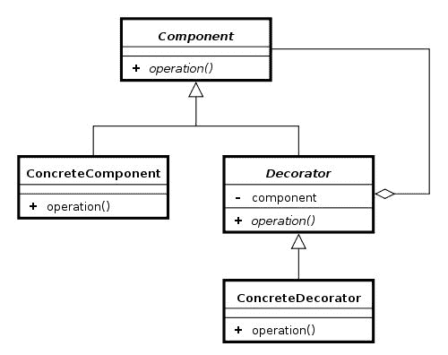

# 第八章：代理

Kotlin 非常重视设计模式。之前，我们已经看到了单例模式的使用是如何通过对象声明简化的，以及观察者模式的使用是如何通过高阶函数和函数类型变得微不足道的。此外，Kotlin 通过 lambda 表达式和函数类型简化了大多数函数模式的使用。在本章中，我们将看到委托和装饰器模式的使用是如何通过类委托简化的。我们还将看到一个在编程世界中非常新的特性——属性委托——以及它是如何用来使 Kotlin 属性更加强大的。

在本章中，我们将涵盖以下主题：

+   委托模式

+   类委托

+   装饰器模式

+   属性委托

+   标准库中的属性委托

+   创建自定义属性委托

# 类委托

Kotlin 有一个名为**类委托**的特性。这是一个非常不起眼的特性，但有许多实际应用。值得注意的是，它与两种设计模式——委托模式和装饰器模式——密切相关。我们将在接下来的章节中更详细地讨论这些模式。委托和装饰器模式已经为人所知多年，但在 Java 中，它们的实现需要大量样板代码。Kotlin 是第一批为这些模式提供本地支持并将样板代码减少到最低程度的语言之一。

# 委托模式

在面向对象编程中，委托模式是一种设计模式，它是继承的一种替代方法。委托意味着对象通过将请求委托给另一个对象（委托）来处理请求，而不是扩展类。

为了支持从 Java 中所知的多态行为，两个对象都应该实现相同的接口，该接口包含所有委托的方法和属性。委托模式的一个简单示例如下：

```kt
    interface Player { // 1 
        fun playGame() 
    } 

    class RpgGamePlayer(val enemy: String) : Player { 
        override fun playGame() { 
            println("Killing $enemy") 
        } 
    } 

    class WitcherPlayer(enemy: String) : Player { 
        val player = RpgGamePlayer(enemy) // 2 

        override fun playGame() { 
            player.playGame() // 3 
        } 
    } 

    // Usage 
    RpgGamePlayer("monsters").playGame() // Prints: Killing monsters 
    WitcherPlayer("monsters").playGame() // Prints: Killing monsters 
```

1.  当我们谈论类委托时，需要有一个定义了委托方法的接口。

1.  我们要委托的对象（委托）。

1.  `WitcherPlayer`类中的所有方法都应该调用委托对象（`player`）上的相应方法。

这被称为委托，因为`WitcherPlayer`类将`Player`接口中定义的方法委托给了`RpgGamePlayer`类型的实例（`player`）。使用继承而不是委托也可以达到类似的结果。它看起来如下：

```kt
    class WitcherPlayer() : RpgGamePlayer() 
```

乍一看，这两种方法可能看起来相似，但委托和继承有很多不同之处。一方面，继承更受欢迎，使用更为普遍。它经常在 Java 中使用，并与多种面向对象模式相关联。另一方面，有一些来源强烈支持委托。例如，影响深远的《设计模式》一书，由四人组合编写，包含了这样的原则：*更倾向于对象组合而不是类继承*。此外，流行的《Effective Java》一书中包含了这样的规则：*更倾向于组合而不是继承*（第 6 条）。它们都强烈支持委托模式。以下是一些支持使用委托模式而不是继承的基本论点：

+   通常类并不是为了继承而设计的。当我们重写方法时，我们并不知道关于类内部行为的基本假设（方法何时被调用，这些调用如何影响对象、状态等）。例如，当我们重写方法时，我们可能不知道它被其他方法使用，因此重写的方法可能会被超类意外调用。即使我们检查方法何时被调用，这种行为也可能在类的新版本中发生变化（例如，如果我们从外部库扩展类），从而破坏我们子类的行为。非常少量的类被正确设计和记录为继承，但几乎所有非抽象类都是为使用而设计的（这包括委托）。

+   在 Java 中，可以将一个类委托给多个类，但只能继承一个。

+   通过接口，我们指定要委托的方法和属性。这与*接口隔离*原则（来自 SOLID 原则）兼容--我们不应该向客户端公开不必要的方法。

+   有些类是 final 的，所以我们只能委托给它们。事实上，所有不设计用于继承的类都应该是 final 的。Kotlin 的设计者意识到了这一点，并且默认情况下将 Kotlin 中的所有类都设为 final。

+   将类设为 final 并提供适当的接口是公共库的良好实践。我们可以更改类的实现而不必担心会影响库的用户（只要从接口的角度来看行为是相同的）。它们不可继承，但仍然是很好的委托候选者。

有关如何设计支持继承的类以及何时应使用委托的更多信息可以在书籍*Effective Java*中找到，在*Item 16: Favor composition over inheritance*中找到。

当然，使用委托而不是继承也有缺点。以下是主要问题：

+   我们需要创建指定应该委托哪些方法的接口

+   我们无法访问受保护的方法和属性

在 Java 中，使用继承还有一个更有力的论据：它要容易得多。即使比较我们`WitcherPlayer`示例中的代码，我们也可以看到委托需要大量额外的代码：

```kt
     class WitcherPlayer(enemy: String) : Player { 
         val player = RpgGamePlayer(enemy)    
         override fun playGame() { 
             player.playGame() 
         } 
     } 

     class WitcherPlayer() : RpgGamePlayer() 
```

当我们处理具有多个方法的接口时，这是特别棘手的。幸运的是，现代语言重视委托模式的使用，并且许多语言都具有本地类委托支持。Swift 和 Groovy 对委托模式有很强的支持，Ruby、Python、JavaScript 和 Smalltalk 也通过其他机制支持。Kotlin 也强烈支持类委托，并且使用这种模式非常简单，几乎不需要样板代码。例如，示例中的`WitcherPlayer`类可以在 Kotlin 中以这种方式实现：

```kt
    class WitcherPlayer(enemy: String) : Player by RpgGamePlayer(enemy) {} 
```

使用`by`关键字，我们通知编译器将`WitcherPlayer`中定义的`Player`接口的所有方法委托给`RpgGamePlayer`。在`WitcherPlayer`构造期间创建了一个`RpgGamePlayer`的实例。简单来说：`WitcherPlayer`将在`Player`接口中定义的方法委托给一个新的`RpgGamePlayer`对象。

这里真正发生的是，在编译期间，Kotlin 编译器从`Player`在`WitcherPlayer`中生成了未实现的方法，并用对`RpgGamePlayer`实例的调用填充它们（就像我们在第一个示例中实现的那样）。最大的改进是我们不需要自己实现这些方法。还要注意的是，如果委托方法的签名发生变化，那么我们不需要更改所有委托给它的对象，因此类更容易维护。

还有另一种创建和保存委托实例的方法。它可以由构造函数提供，就像这个例子中一样：

```kt
    class WitcherPlayer(player: Player) : Player by player 
```

我们还可以委托给构造函数中定义的属性：

```kt
    class WitcherPlayer(val player: Player) : Player by player 
```

最后，我们可以委托给在类声明期间可访问的任何属性：

```kt
    val d = RpgGamePlayer(10) 
    class WitcherPlayer(a: Player) : Player by d 
```

此外，一个对象可以有多个不同的委托：

```kt
    interface Player { 
        fun playGame() 
    } 

    interface GameMaker { // 1 
        fun developGame() 
    } 

    class WitcherPlayer(val enemy: String) : Player { 
        override fun playGame() { 
            print("Killin $enemy! ") 
        } 
    } 

    class WitcherCreator(val gameName: String) : GameMaker{ 
        override fun developGame() { 
            println("Makin $gameName! ") 
        } 
    } 

    class WitcherPassionate : 
        Player by WitcherPlayer("monsters"), 
        GameMaker by WitcherCreator("Witcher 3") { 

        fun fulfillYourDestiny() { 
            playGame() 
            developGame() 
        } 
    } 

    // Usage 
    WitcherPassionate().fulfillYourDestiny() // Killin monsters! Makin Witcher 3! 
```

1.  `WitcherPlayer`类将`Player`接口委托给一个新的`RpgGamePlayer`对象，`GameMaker`委托给一个新的`WitcherCreator`对象，并且还包括`fulfillYourDestiny`函数，该函数使用了来自两个委托的函数。请注意，`WitcherPlayer`和`WitcherCreator`都没有标记为 open，没有这个标记，它们就不能被扩展。但它们可以被委托。

有了这样的语言支持，委托模式比继承更有吸引力。虽然这种模式既有优点又有缺点，但知道何时应该使用它是很好的。应该使用委托的主要情况如下：

+   当你的子类违反了*里氏替换原则*；例如，当我们处理继承仅用于重用超类代码的情况，但它实际上并不像那样工作。

+   当子类只使用超类的部分方法时。在这种情况下，只是时间问题，直到有人调用了他们本不应该调用的超类方法。使用委托，我们只重用我们选择的方法（在接口中定义）。

+   当我们不能或者不应该继承时，因为：

+   这个类是 final 的

+   它不可访问，也不可从接口后面使用

+   它只是不适合继承

请注意，虽然 Kotlin 中的类默认是 final 的，但大多数类都将保持 final。如果这些类放在库中，那么我们很可能无法更改或打开这个类。委托将是唯一的选择，以创建具有不同行为的类。

里氏替换原则是面向对象编程中的一个概念，它规定所有子类应该像它们的超类一样工作。简单来说，如果某个类的单元测试通过，那么它的子类也应该通过。这个原则由 Robert C. Martin 推广，他将其列为最重要的面向对象编程规则之一，并在流行的书籍*Clean Code*中描述了它。

《Effective Java》一书指出：“只有在子类真正是超类的子类型的情况下才适合使用继承。”换句话说，只有当类`B`扩展类`A`时，两个类之间存在*is-a*关系。如果你想让类`B`扩展类`A`，问问自己“每个 B 都是一个 A 吗？”在接下来的部分，该书建议在其他所有情况下应该使用组合（最常见的实现是委托）。

值得注意的是，Cocoa（苹果的 UI 框架，用于构建在 iOS 上运行的软件程序）很常用委托而不是继承。这种模式变得越来越流行，在 Kotlin 中得到了很好的支持。

# 装饰器模式

另一个常见的情况是，当我们实现装饰器模式时，Kotlin 类委托非常有用。装饰器模式（也称为包装器模式）是一种设计模式，它使得可以在不使用继承的情况下向现有类添加行为。与扩展不同，我们可以在不修改对象的情况下添加新行为，装饰器模式使用委托，但是以一种非常特定的方式--委托是从类的外部提供的。经典结构如下 UML 图所示：



装饰器模式的经典实现的 UML 图。来源：[`upload.wikimedia.org`](http://upload.wikimedia.org)

装饰器包含它装饰的对象，同时实现相同的接口。

来自 Java 世界的装饰器使用最广泛的例子是`InputStream`。有不同类型的类型扩展了`InputStream`，还有很多装饰器可以用来为它们添加功能。这个装饰器可以用来添加缓冲，获取压缩文件的内容，或者将文件内容转换为 Java 对象。让我们看一个使用多个装饰器来读取一个压缩的 Java 对象的例子：

```kt
    // Java 
    FileInputStream fis = new FileInputStream("/someFile.gz"); // 1 
    BufferedInputStream bis = new BufferedInputStream(fis); // 2 
    GzipInputStream gis = new GzipInputStream(bis); // 3 
    ObjectInputStream ois = new ObjectInputStream(gis); // 4 
    SomeObject someObject = (SomeObject) ois.readObject(); // 5 
```

1.  创建一个用于读取文件的简单流。

1.  创建一个包含缓冲的新流。

1.  创建一个包含读取 GZIP 文件格式中压缩数据功能的新流。

1.  创建一个新的流，添加反序列化原始数据和之前使用`ObjectOutputStream`写入的对象的功能。

1.  流在`ObjectInputStream`的`readObject`方法中使用，但是这个例子中的所有对象都实现了`InputStream`（这使得可以以这种方式打包它），并且可以通过这个接口指定的方法来读取。

请注意，这种模式也类似于继承，但我们可以决定我们想要使用哪些装饰器以及以什么顺序。这样更加灵活，并在使用过程中提供更多可能性。一些人认为，如果设计者能够制作一个具有所有设计功能的大类，然后使用方法来打开或关闭其中的一些功能，那么`InputStream`的使用会更好。这种方法将违反*单一责任原则*，并导致更加复杂和不太可扩展的代码。

尽管装饰器模式被认为是实际应用中最好的模式之一，但在 Java 项目中很少被使用。这是因为实现并不简单。接口通常包含多个方法，在每个装饰器中创建对它们的委托会生成大量样板代码。在 Kotlin 中情况不同--我们已经看到在 Kotlin 中类委托实际上是微不足道的。让我们看一些在装饰器模式中实际类委托使用的经典例子。假设我们想要将第一个位置作为*零*元素添加到几个不同的`ListAdapters`中。这个额外的位置有一些特殊的属性。我们无法使用继承来实现这一点，因为这些不同列表的`ListAdapters`是不同类型的（这是标准情况）。在这种情况下，我们可以改变每个类的行为（DRY 规则），或者我们可以创建一个装饰器。这是这个装饰器的简短代码：

```kt
class ZeroElementListDecorator(val arrayAdapter: ListAdapter) : 
    ListAdapter by arrayAdapter { 
  override fun getCount(): Int = arrayAdapter.count + 1 
  override fun getItem(position: Int): Any? = when { 
      position == 0 -> null 
      else -> arrayAdapter.getItem(position - 1) 
  } 

  override fun getView(position: Int, convertView: View?,parent: 

ViewGroup): View = when { 
    position == 0 -> parent.context.inflator

        .inflate(R.layout.null_element_layout, parent, false) 
    else -> arrayAdapter.getView(position - 1, convertView, parent) 
  } 
} 

override fun getItemId(position: Int): Long = when { 
  position == 0 -> 0 
  else -> arrayAdapter.getItemId(position - 1) 
} 
```

我们在这里使用了`Context`的扩展属性`inflator`，这在 Kotlin Android 项目中经常包含，并且应该从第七章 *扩展函数和属性*中了解：

```kt
    val Context.inflater: LayoutInflater 
        get() = LayoutInflater.from(this) 
```

以这种方式定义的`ZeroElementListDecorator`类总是添加一个具有静态视图的第一个元素。在这里我们可以看到它的简单使用示例：

```kt
    val arrayList = findViewById(R.id.list) as ListView 
    val list = listOf("A", "B", "C") 
    val arrayAdapter = ArrayAdapter(this, 

          android.R.layout.simple_list_item_1, list) 
    arrayList.adapter = ZeroElementListDecorator(arrayAdapter) 
```

在`ZeroElementListDecorator`中，我们可能会觉得需要重写四个方法很复杂，但实际上还有八个方法，我们不需要重写它们，这要归功于 Kotlin 的类委托。我们可以看到 Kotlin 类委托使得装饰器模式的实现变得更加容易。

装饰器模式实际上非常简单实现，而且非常直观。它可以在许多不同的情况下用来扩展类的额外功能。它非常安全，通常被称为一种良好的实践。这些例子只是类委托提供的可能性之一。我相信读者会发现更多使用这些模式的用例，并使用类委托使项目更加清晰、安全和简洁。

# 属性委托

Kotlin 不仅允许类委托，还允许属性委托。在本节中，我们将找出委托属性是什么，审查 Kotlin 标准库中的属性委托，并学习如何创建和使用自定义属性委托。

# 什么是委托属性？

让我们从解释什么是属性委托开始。这里是属性委托的使用示例：

```kt
    class User(val name: String, val surname: String) 

    var user: User by UserDelegate() // 1 

    println(user.name) 
    user = User("Marcin","Moskala")
```

1.  我们将`user`属性委托给`UserDelegate`的一个实例（由构造函数创建）。

属性委托类似于类委托。我们使用相同的关键字（`by`）将属性委托给一个对象。对属性（`set`/`get`）的每次调用都将被委托给另一个对象（`UserDelegate`）。这样我们可以为多个属性重用相同的行为，例如，仅当满足某些条件时设置属性值，或者在访问/更新属性时添加日志条目。

我们知道属性实际上不需要后备字段。它可以只由 getter（只读）或 getter/setter（读/写）定义。在幕后，属性委托只是被转换为相应的方法调用（`setValue`/`getValue`）。上面的例子将被编译为这样的代码：

```kt
    var p$delegate = UserDelegate() 
    var user: User 
    get() = p$delegate.getValue(this, ::user) 
    set(value) { 
        p$delegate.setValue(this, ::user, value) 
    } 
```

该示例显示，通过使用`by`关键字，我们将 setter 和 getter 调用委托给委托。这就是为什么任何具有正确参数的`getValue`和`setValue`函数的对象（稍后将描述）都可以用作委托（对于只读属性，只需要`getValue`，因为只需要 getter）。重要的是，作为属性委托的所有类需要具有这两种方法。不需要接口。以下是`UserDelegate`的示例实现：

```kt
class UserDelegate { 
    operator fun getValue(thisRef: Any?, property: KProperty<*>): 

          User = readUserFromFile() 

    operator fun setValue(thisRef: Any?, property: KProperty<*>, 

          user:User) { 
        saveUserToFile(user) 
    } 
    //... 
} 
```

`setValue`和`getValue`方法用于设置和获取属性的值（属性设置器调用被委托给`setValue`方法，属性获取器将值委托给`getValue`方法）。这两个函数都需要标记为`operator`关键字。它们有一些特殊的参数集，用于确定委托可以服务的位置和属性。如果属性是只读的，那么对象只需要具有`getValue`方法就能够作为其委托：

```kt
class UserDelegate { 

    operator fun getValue(thisRef: Any?, property: KProperty<*>):

        User = readUserFromFile() 
} 
```

`getValue`方法返回的类型和用户在`setValue`方法中定义的属性的类型决定了委托属性的类型。

`getValue`和`setValue`函数的第一个参数（`thisRef`）的类型包含了委托使用的上下文的引用。它可以用于限制委托可以使用的类型。例如，我们可以以以下方式定义只能在`Activity`类内部使用的委托：

```kt
class UserDelegate { 

    operator fun getValue(thisRef: Activity, property: KProperty<*>): 

          User = thisRef.intent

          .getParcelableExtra("com.example.UserKey") 
} 
```

正如我们所见，所有上下文中都会提供对`this`的引用。只有在扩展函数或扩展属性中才会放置 null。对`this`的引用用于从上下文中获取一些数据。如果我们将其类型定义为`Activity`，那么我们只能在`Activity`内部（`this`的类型为`Activity`的任何上下文）中使用此委托。

此外，如果我们想要强制委托只能在顶层使用，我们可以将第一个参数（`thisRef`）的类型指定为`Nothing?`，因为这种类型的唯一可能值是`null`。

这些方法中的另一个参数是`property`。它包含对委托属性的引用，其中包含其元数据（属性名称、类型等）。

属性委托可用于任何上下文中定义的属性（顶级属性、成员属性、局部变量等）：

```kt
    var a by SomeDelegate() // 1 

    fun someTopLevelFun() { 
        var b by SomeDelegate() // 2 
    } 

    class SomeClass() { 
        var c by SomeDelegate() // 3 

        fun someMethod() { 
            val d by SomeDelegate() // 4 
        } 
    } 
```

1.  使用委托的顶级属性

1.  使用委托的局部变量（在顶级函数内部）

1.  使用委托的成员属性

1.  使用委托的局部变量（在方法内部）

在接下来的几节中，我们将描述 Kotlin 标准库中的委托。它们不仅因为它们经常有用而重要，而且因为它们是如何使用属性委托的好例子。

# 预定义的委托

Kotlin 标准库包含一些非常方便的属性委托。让我们讨论它们如何在实际项目中使用。

# `lazy`函数

有时我们需要初始化一个对象，但我们希望确保对象只在第一次使用时初始化一次。在 Java 中，我们可以通过以下方式解决这个问题：

```kt
    private var _someProperty: SomeType? = null 
    private val somePropertyLock = Any() 
    val someProperty: SomeType 
    get() { 
        synchronized(somePropertyLock) { 
            if (_someProperty == null) { 
                _someProperty = SomeType() 
            } 
            return _someProperty!! 
        } 
    } 
```

这种构造在 Java 开发中很常见。Kotlin 允许我们通过提供`lazy`委托来以更简单的方式解决这个问题。它是最常用的委托。它只适用于只读属性（`val`），用法如下：

```kt
    val someProperty by lazy { SomeType() } 
```

标准库中提供委托的`lazy`函数：

```kt
    public fun <T> lazy(initializer: () -> T): 

          Lazy<T> =  SynchronizedLazyImpl(initializer) 
```

在这个例子中，`SynchronizedLazyImpl` 的对象被正式地用作属性委托。尽管通常它被称为**惰性委托**，来自于相应的函数名。其他委托也是从提供它们的函数的名称命名的。

惰性委托还具有线程安全机制。默认情况下，委托是完全线程安全的，但我们可以改变这种行为，使这个函数在我们知道永远不会有多个线程同时使用它的情况下更有效。要完全关闭线程安全机制，我们需要将`enum`类型值`LazyThreadSafetyMode.NONE`作为`lazy`函数的第一个参数。

`val someProperty by lazy(LazyThreadSafetyMode.NONE) { SomeType() }`

由于惰性委托，属性的初始化被延迟直到需要值。使用惰性委托提供了几个好处：

+   更快的类初始化导致更快的应用程序启动时间，因为值的初始化被延迟到第一次使用它们时

+   某些值可能永远不会在某些流程中使用，因此它们永远不会被初始化——我们在节省资源（内存、处理器时间、电池）。

另一个好处是有些对象需要在它们的类实例创建后才能创建。例如，在`Activity`中，我们不能在使用`setContentView`方法设置布局之前访问资源，这个方法通常在`onCreate`方法中调用。我将在这个例子中展示它。让我们看一下使用经典 Java 方式填充视图引用元素的 Java 类：

```kt
//Java 
public class MainActivity extends Activity { 

    TextView questionLabelView 
    EditText answerLabelView 
    Button confirmButtonView 

    @Override 
    public void onCreate(Bundle savedInstanceState) { 
        super.onCreate(savedInstanceState); 
        setContentView(R.layout.activity_main); 

        questionLabelView = findViewById<TextView>

              (R.id.main_question_label);    
        answerLabelView   = findViewById<EditText>

              (R.id.main_answer_label);    
        confirmButtonView = findViewById<Button>

              (R.id.main_button_confirm);      
    } 
} 
```

如果我们将其翻译成 Kotlin，一对一，它将如下所示：

```kt
class MainActivity : Activity() { 

    var questionLabelView: TextView? = null 
    var answerLabelView: TextView? = null 
    var confirmButtonView: Button? = null 

    override fun onCreate(savedInstanceState: Bundle) { 
        super.onCreate(savedInstanceState) 
        setContentView(R.layout.main_activity) 

        questionLabelView = findViewById<TextView>

              (R.id.main_question_label)   

        answerLabelView = findViewById<TextView>

              (R.id.main_answer_label)

        confirmButtonView = findViewById<Button>

              (R.id.main_button_confirm)

    } 

}
```

使用惰性委托，我们可以以更简单的方式实现这种行为：

```kt
class MainActivity : Activity() { 

   val questionLabelView: TextView by lazy 

{ findViewById(R.id.main_question_label) as TextView } 
   val answerLabelView: TextView by lazy 

{ findViewById(R.id.main_answer_label) as TextView } 
   val confirmButtonView: Button by lazy 

{ findViewById(R.id.main_button_confirm) as Button } 

   override fun onCreate(savedInstanceState: Bundle) { 
     super.onCreate(savedInstanceState) 
     setContentView(R.layout.main_activity) 
   } 
} 
```

这种方法的好处如下：

+   属性在一个地方声明和初始化，所以代码更简洁。

+   属性是非空的，而不是可空的。这可以避免大量无用的空值检查。

+   属性是只读的，因此我们可以获得所有的好处，比如线程同步或智能转换。

+   传递给惰性委托的 lambda（包含`findViewById`）只有在第一次访问属性时才会执行。

+   值将在类创建后被获取。这将加快启动速度。如果我们不使用其中一些视图，它们的值根本不会被获取（当视图复杂时，`findViewById`并不是一种高效的操作）。

+   未使用的属性将被编译器标记。在 Java 实现中不会，因为编译器会注意到设置的值作为使用。

我们可以通过提取共同的行为并将其转换为扩展函数来改进前面的实现：

```kt
fun <T: View> Activity.bindView(viewId: Int) = lazy { findViewById(viewId) as T } 
```

然后，我们可以用更简洁的代码定义视图绑定：

```kt
class MainActivity : Activity() { 

  var questionLabelView: TextView by bindView(R.id.main_question_label)  // 1 
  var answerLabelView: TextView by bindView(R.id.main_answer_label)   // 1 
  var confirmButtonView: Button by bindView(R.id.main_button_confirm) // 1 

  override fun onCreate(savedInstanceState: Bundle) { 
    super.onCreate(savedInstanceState) 
    setContentView(R.layout.main_activity) 
  } 
} 
```

1.  我们不需要为`bindView`函数提供的类型设置类型，因为它是从属性类型中推断出来的。

现在我们有一个单一的委托，在我们第一次访问特定视图时会在后台调用`findViewById`。这是一个非常简洁的解决方案。

还有另一种处理这个问题的方法。目前流行的是*Kotlin Android Extension*插件，它会在`Activities`和`Fragments`中自动生成视图的自动绑定。我们将在第九章中讨论实际应用，*制作你的 Marvel 画廊应用*。

即使有这样的支持，仍然有保持绑定的好处。一个是明确知道我们正在使用的视图元素，另一个是元素 ID 的名称和我们保存该元素的变量的名称之间的分离。此外，编译时间更快。

相同的机制可以应用于解决其他与 Android 相关的问题。例如，当我们向`Activity`传递参数时。标准的 Java 实现如下：

```kt
//Java 
class SettingsActivity extends Activity { 

  final Doctor DOCTOR_KEY = "doctorKey" 
  final String TITLE_KEY = "titleKey" 

  Doctor doctor 
  Address address 
  String title 

  public static void start ( Context context, Doctor doctor, 

  String title ) { 
    Intent intent = new Intent(context, SettingsActivity.class ) 
    intent.putExtra(DOCTOR_KEY, doctor) 
    intent.putExtra(TITLE_KEY, title) 
    context.startActivity(intent) 
  } 

  @Override 
  public void onCreate(Bundle savedInstanceState) { 
    super.onCreate(savedInstanceState); 
    setContentView(R.layout.activity_main); 

    doctor = getExtras().getParcelable(DOCTOR_KEY)   
    title = getExtras().getString(TITLE_KEY)   

    ToastHelper.toast(this, doctor.id) 
    ToastHelper.toast(this, title) 
  } 
} 
```

我们可以在 Kotlin 中编写相同的实现，但也可以在变量声明时检索参数值（`getString` / `getParcerable` ）。为此，我们需要以下扩展函数：

```kt
fun <T : Parcelable> Activity.extra(key: String) = lazy 

    { intent.extras.getParcelable<T>(key) } 

fun Activity.extraString(key: String) = lazy 

    { intent.extras.getString(key) } 
```

然后我们可以通过使用 `extra` 和 `extraString` 委托来获取额外的参数：

```kt
class SettingsActivity : Activity() { 

    private val doctor by extra<Doctor>(DOCTOR_KEY) // 1 
    private val title by extraString(TITLE_KEY) // 1 

    override fun onCreate(savedInstanceState: Bundle?) { 
        super.onCreate(savedInstanceState) 
        setContentView(R.layout.settings_activity) 
        toast(doctor.id) // 2 
        toast(title) // 2 
    } 

    companion object { // 3 
        const val DOCTOR_KEY = "doctorKey" 
        const val TITLE_KEY = "titleKey" 

    fun start(context: Context, doctor: Doctor, title: String) { // 3 
        ontext.startActivity(getIntent<SettingsActivity>().apply { // 4 
            putExtra(DOCTOR_KEY, doctor) // 5 
            putExtra(TITLE_KEY, title) // 5 
        }) 
    } 
  } 

} 
```

1.  我们正在定义应该从 `Activity` 参数中检索值的属性，使用相应的键。

1.  在 `onCreate` 方法中，我们从参数中访问属性。当我们请求属性（使用 getter）时，延迟委托将从额外中获取其值，并将其存储以供以后使用。

1.  要创建一个启动活动的静态方法，我们需要使用伴生对象。

1.  `SettingsActivity::class.java` 是 Java 类引用 `SettingsActivity.class` 的类似物。

1.  我们正在使用第七章中定义的方法，*扩展函数和属性*。

我们还可以编写函数来检索其他可以由 **Bundle** 持有的类型（例如 `Long` 、`Serializable` ）。这是一个非常好的替代方案，可以避免使用诸如 `ActivityStarter` 等参数注入库，从而保持非常快的编译时间。我们可以使用类似的函数来绑定字符串、颜色、服务、存储库和模型和逻辑的其他部分：

```kt
fun <T> Activity.bindString(@IdRes id: Int): Lazy<T> = 

    lazy { getString(id) } 
fun <T> Activity.bindColour(@IdRes id: Int): Lazy<T> = 

    lazy { getColour(id) } 
```

在 `Activity` 中，所有繁重的或依赖于参数的内容都应该使用延迟委托（或异步提供）。同时，所有依赖于需要延迟初始化的元素的元素也应该定义为延迟。例如，依赖于 `doctor` 属性的 `presenter` 的定义：

```kt
    val presenter by lazy { MainPresenter(this, doctor) } 
```

否则，尝试构造 `MainPresenter` 对象将在类创建时进行，此时我们还不能从意图中读取值，也无法填充 `doctor` 属性，应用程序将崩溃。

我认为这些示例足以让我们相信，延迟委托在 Android 项目中非常有用。它也是一个很好的属性委托入门，因为它简单而优雅。

# notNull 函数

`notNull` 委托是最简单的标准库委托，这就是为什么它将首先被介绍。使用方法如下：

```kt
    var someProperty: SomeType by notNull()
```

提供大多数标准库委托（包括 `notNull` 函数）的函数是在 `object` 委托中定义的。要使用它们，我们需要引用这个对象（`Delegates.notNull()` ），或者导入它（`import kotlin.properties.Delegates.notNull` ）。在示例中，我们将假设这个 `object` 已经被导入，因此我们将省略对它的引用。

`notNull` 委托允许我们将变量定义为非空，即在稍后初始化而不是在对象构造时初始化。我们可以定义变量为非空而不提供默认值。`notNull` 函数是 `lateinit` 的一种替代方式：

```kt
    lateinit var someProperty: SomeType 
```

`notNull` 委托提供了几乎与 `lateinit` 相同的效果（只是错误消息不同）。在尝试在设置值之前使用此属性时，它将抛出 `IllegalStateException` 并终止 Android 应用程序。因此，只有在我们知道值将在第一次尝试使用之前设置时，才应该使用它。

`lateinit` 和 `notNull` 委托之间的区别非常简单。`lateinit` 比 `notNull` 委托更快，因此应尽可能使用 `lateinit` 委托。但它有限制，`lateinit` 不能用于原始类型或顶级属性，因此在这种情况下，应使用 `notNull` 代替。

让我们来看一下 `notNull` 委托的实现。以下是 `notNull` 函数的实现：

```kt
    public fun <T: Any> notNull(): ReadWriteProperty<Any?, T> =  

        NotNullVar() 
```

如我们所见，`notNull` 实际上是一个返回对象的函数，该对象是我们实际委托的实例，隐藏在 `ReadWriteProperty` 接口后面。让我们来看一个实际的委托定义：

```kt
private class NotNullVar<T: Any>() : ReadWriteProperty<Any?, T> { // 1 
  private var value: T? = null 

  public override fun getValue(thisRef: Any?, 

  property: KProperty<*>): T { 
     return value ?: throw IllegalStateException("Property 

            ${property.name} should be initialized before get.") // 2 
  } 

  public override fun setValue(thisRef: Any?, 

  property: KProperty<*>, value: T) { 
     this.value = value 
  } 
} 
```

1.  类是私有的。这是可能的，因为它是由函数 `notNull` 提供的，该函数将其作为 `ReadWriteProperty<Any?, T>` 返回，而该接口是公共的。

1.  这里展示了如何提供返回值。如果在使用过程中为 null，则表示未设置值，方法将抛出错误。否则，它会返回该值。

这个委托应该很容易理解。`setValue`函数将值设置为可空字段，`getValue`如果不为 null 则返回该字段，如果为 null 则抛出异常。以下是此错误的示例：

```kt
    var name: String by Delegates.notNull() 
    println(name) 

    // Error: Property name should be initialized before get. 
```

这是一个关于委托属性使用的非常简单的例子，也是对属性委托工作原理的良好介绍。委托属性是非常强大的构造，具有多种应用。

# 可观察委托

可观察是可变属性最有用的标准库委托。每次设置一个值（调用`setValue`方法）时，都会调用声明中的 lambda 函数。可观察委托的一个简单示例如下：

```kt
    var name: String by Delegates.observable("Empty"){ 
        property, oldValue, newValue -> // 1 
        println("$oldValue -> $newValue") // 2 
    } 

    // Usage 
    name = "Martin" // 3, 

    Prints: Empty -> Martin 
    name = "Igor" // 3, 

    Prints: Martin -> Igor 
    name = "Igor" // 3, 4 

    Prints: Igor -> Igor
```

1.  lambda 函数的参数如下：

+   `property`：委托属性的引用。这里是对 name 的引用。这与`setValue`和`getValue`中描述的属性相同。它是`KProperty`类型。在这种情况下（以及大多数情况下），当未使用时可以使用下划线（“`_`”符号）代替。

+   `oldValue`：更改前的`property`的先前值。

+   `newValue`：更改后的`property`的新值。

1.  每次将新值设置到属性时都会调用 lambda 函数。

1.  当我们设置新值时，该值会更新，但同时也会调用委托中声明的 lambda 方法。

1.  注意，每次使用 setter 时都会调用 lambda，并且不管新值是否等于先前的值都没有关系。

特别重要的是要记住，每次设置新值时都会调用 lambda，而不是在对象的内部状态更改时。例如：

```kt
    var list: MutableList<Int> by observable(mutableListOf()) 

    { _, old, new ->  
        println("List changed from $old to $new") 
    } 

    // Usage 
    list.add(1)  // 1 
    list =  mutableListOf(2, 3) 

    // 2, prints: List changed from [1] to [2, 3] 
```

1.  不打印任何内容，因为我们没有更改属性（未使用 setter）。我们只更改了列表内部定义的属性，而不是对象本身。

1.  在这里我们改变了列表的值，因此会调用可观察委托中的 lambda 函数并打印文本。

可观察委托对于不可变类型非常有用，与可变类型相反。幸运的是，Kotlin 中的所有基本类型默认都是不可变的（`List`，`Map`，`Set`，`Int`，`String`）。让我们看一个实际的 Android 示例：

```kt
    class SomeActivity : Activity() { 

        var list: List<String> by Delegates.observable(emptyList()) { 
            prop, old, new -> if(old != new) updateListView(new) 
        }   
        //  ... 
    } 
```

每次更改列表时，视图都会更新。请注意，虽然`List`是不可变的，但是当我们想要应用任何更改时，我们需要使用 setter，以便确保在此操作之后列表将被更新。这比记住每次列表更改时都调用`updateListView`方法要容易得多。这种模式可以广泛用于项目中声明编辑视图的属性。它改变了更新视图机制的工作方式。

使用可观察委托可以解决的另一个问题是，在`ListAdapters`中，列表中的元素每次更改时都必须调用`notifyDataSetChanged`。在 Java 中，经典解决方案是封装此列表，并在修改它的每个函数中调用`notifyDataSetChanged`。在 Kotlin 中，我们可以使用可观察属性委托来简化这个过程：

```kt
var list: List<LocalDate> by observable(list) { _, old, new ->  // 1 
  if(new != old) notifyDataSetChanged() 
} 
```

1.  请注意，这里的列表是不可变的，因此没有办法在不使用`notifyDataSetChanged`的情况下更改其元素。

可观察委托用于定义在属性值更改时应发生的行为。当我们有应该在每次更改属性时执行的操作，或者当我们想要将属性值与视图或其他值绑定时，它最常用。但在函数内部，我们无法决定是否设置新值。为此，可以使用`vetoable`委托。

# 可否决的委托

`vetoable`函数是一个标准库属性委托，其工作方式类似于可观察委托，但有两个主要区别：

+   在设置新值之前，会先调用参数中的 lambda

+   它允许声明中的 lambda 函数决定是否接受或拒绝新值

例如，如果我们假设列表必须始终包含比旧列表更多的项目，则我们将定义以下`vetoable`委托：

```kt
var list: List<String> by Delegates.vetoable(emptyList()) 

{ _, old, new ->  
   new.size > old.size 
} 
```

如果新列表不包含比旧列表更多的项目，则值将不会更改。因此，我们可以将`vetoable`视为`observable`，它也决定是否应更改值。假设我们想要将列表绑定到视图，但它至少需要有三个元素。我们不允许进行任何可能导致其具有更少元素的更改。实现如下：

```kt
var list: List<String> by Delegates.vetoable(emptyList()) 

{ prop, old, new ->  
    if(new.size < 3) return@vetoable false // 1 
    updateListView(new) 
    true // 2 
} 
```

1.  如果新列表的大小小于 3，则我们不接受它，并从 lambda 返回`false`。通过标签返回的`false`值（用于从 lambda 表达式返回）是新值不应被接受的信息。

1.  此 lambda 函数需要返回一个值。此值可以从带有标签的`return`中获取，也可以从 lambda 主体的最后一行获取。这里的值`true`表示应接受新值。

这是其用法的一个简单示例：

```kt
    listVetoable = listOf("A", "B", "C") // Update A, B, C 
    println(listVetoable) // Prints: [A, B, C] 
    listVetoable = listOf("A") // Nothing happens 
    println(listVetoable) // Prints: [A, B, C] 
    listVetoable = listOf("A", "B", "C", "D", "E")  

    // Prints: [A, B, C, D, E] 
```

由于某些其他原因，我们还可以使其不可改变，例如，我们可能仍在加载数据。此外，可否决的属性委托可以用于验证器。例如：

```kt
    var name: String by Delegates.vetoable("") 

    { prop, old, new ->  
    if (isValid(new)) { 
        showNewData(new) 
        true 
    } else { 
        showNameError() 
        false 
    }
```

此属性只能更改为符合谓词`isValid(new)`的值。

# 将属性委托给 Map 类型

标准库包含了对具有`String`键类型的`Map`和`MutableMap`的扩展，提供了`getValue`和`setValue`函数。由于它们，`map`也可以用作属性委托：

```kt
    class User(map: Map<String, Any>) { // 1 
        val name: String by map 
        val kotlinProgrammer: Boolean by map 
    } 

    // Usage 
    val map: Map<String, Any> = mapOf( // 2 
        "name" to "Marcin", 
        "kotlinProgrammer" to true 
    ) 
    val user = User(map) // 3 
    println(user.name)  // Prints: Marcin 
    println(user.kotlinProgrammer)  // Prints: true 
```

1.  映射键类型需要是`String`，而值类型没有限制。通常是`Any`或`Any?`

1.  创建包含所有值的`Map`

1.  为对象提供一个`map`。

当我们在`Map`中保存数据时，这可能很有用，也适用于以下情况：

+   当我们想要简化对这些值的访问时

+   当我们定义一个结构，告诉我们应该在此映射中期望哪种键

+   当我们要求委托给`Map`的属性时，其值将从此映射值中获取，键等于属性名称

它是如何实现的？这是标准库中的简化代码：

```kt
operator fun <V, V1: V> Map<String, V>.getValue( // 1 
      thisRef: Any?, // 2 
      property: KProperty<*>): V1 { // 3 
          val key = property.name // 4 
          val value = get(key) 
          if (value == null && !containsKey(key)) { 
              throw NoSuchElementException("Key ${property.name} 

              is missing in the map.") 
          } else { 
              return value as V1 // 3 
          } 
      } 
```

1.  `V` 是列表上的一种值

1.  `thisRef`的类型是`Any?`，因此`Map`可以在任何上下文中用作属性委托。

1.  `V1`是返回类型。这通常是从属性推断出来的，但它必须是类型`V`的子类型

1.  属性的名称用作`map`上的`key`。

请记住，这只是一个扩展函数。对象要成为委托所需的一切就是包含`getValue`方法（对于读写属性还需要`setValue`）。我们甚至可以使用`object`声明从匿名类的对象创建委托：

```kt
val someProperty by object { // 1 
    operator fun  getValue(thisRef: Any?, 

    property: KProperty<*>) = "Something" 
} 
println(someProperty) // prints: Something 
```

1.  对象没有实现任何接口。它只包含具有正确签名的`getValue`方法。这足以使其作为只读属性委托工作。

请注意，在请求属性的值时，`map`中需要有一个具有这样名称的条目，否则将抛出错误（使属性可为空不会改变它）。

将字段委托给 map 可能很有用，例如，当我们从 API 中获得一个具有动态字段的对象时。我们希望将提供的数据视为对象，以便更轻松地访问其字段，但我们还需要将其保留为映射，以便能够列出 API 提供的所有字段（甚至是我们没有预期的字段）。

在前面的示例中，我们使用了不可变的`Map`；因此，对象属性是只读的（`val`）。如果我们想要创建一个可以更改的对象，那么我们应该使用`MutableMap`，然后可以将属性定义为可变的（`var`）。这是一个例子：

```kt
class User(val map: MutableMap<String, Any>) { 
    var name: String by map 
    var kotlinProgrammer: Boolean by map 

    override fun toString(): String = "Name: $name, 

    Kotlin programmer: $kotlinProgrammer" 
} 

// Usage 
val map = mutableMapOf( // 1 
    "name" to "Marcin", 
    "kotlinProgrammer" to true 
) 
val user = User(map) 
println(user) // prints: Name: Marcin, Kotlin programmer: true 
user.map.put("name", "Igor") // 1  
println(user) // prints: Name: Igor, Kotlin programmer: true 
user.name = "Michal" // 2 
println(user) // prints: Name: Michal, Kotlin programmer: true 
```

1.  属性值可以通过更改`map`的值来更改

1.  属性值也可以像其他属性一样更改。真正发生的是值的更改被委托给`setValue`，它正在更改`map`。

虽然这里的属性是可变的，但`setValue`函数也必须提供。它被实现为`MutableMap`的扩展函数。以下是简化的代码：

```kt
    operator fun <V> MutableMap<String, V>.setValue( 
        thisRef: Any?,  
        property: KProperty<*>,  
        value: V 
    ) { 
        put(property.name, value) 
    } 
```

请注意，即使是如此简单的函数也可以允许使用常见对象的创新方式。这显示了属性委托所提供的可能性。

Kotlin 允许我们定义自定义委托。现在，我们可以找到许多库，提供了可以用于 Android 中不同目的的新属性委托。在 Android 中可以使用属性委托的各种方式。在下一节中，我们将看到一些自定义属性委托的例子，并且我们将看看这个功能在哪些情况下真的很有帮助。

# 自定义委托

以前的所有委托都来自标准库，但我们可以轻松实现自己的属性委托。我们已经看到，为了允许一个类成为委托，我们需要提供`getValue`和`setValue`函数。它们必须具有具体的签名，但无需扩展类或实现接口。要将对象用作委托，我们甚至不需要更改其内部实现，因为我们可以将`getValue`和`setValue`定义为扩展函数。但是，当我们创建自定义类以成为委托时，接口可能会有用：

+   它将定义函数结构，这样我们就可以在 Android Studio 中生成适当的方法。

+   如果我们正在创建库，那么我们可能希望将委托类设置为私有或内部，以防止不当使用。我们在`notNull`部分看到了这种情况，其中类`NotNullVar`是私有的，并且作为`ReadWriteProperty<Any?, T>`的接口。

提供完整功能以允许某个类成为委托的接口是`ReadOnlyProperty`（用于只读属性）和`ReadWriteProperty`（用于读写属性）。这些接口非常有用，让我们看看它们的定义：

```kt
    public interface ReadOnlyProperty<in R, out T> { 
        public operator fun getValue(thisRef: R, 

            property: KProperty<*>): T 
    } 

    public interface ReadWriteProperty<in R, T> { 
       public operator fun getValue(thisRef: R, 

           property: KProperty<*>): T 
       public operator fun setValue(thisRef: R, 

           property: KProperty<*>, value: T) 
    } 
```

参数的值已经解释过了，但让我们再看一遍：

+   `thisRef`：委托使用的对象的引用。其类型定义了委托可以使用的上下文。

+   `property`：包含有关委托属性的数据的引用。它包含有关此属性的所有信息，例如其名称或类型。

+   `value`：要设置的新值。

`thisRef`和`property`参数在以下委托中未使用：Lazy、Observable 和 Vetoable。`Map`、`MutableMap`和`notNull`使用属性来获取键的属性名称。但是这些参数可以在不同的情况下使用。

让我们看一些小而有用的自定义属性委托的例子。我们已经看到了用于只读属性的延迟属性委托；然而，有时我们需要一个可变的延迟属性。如果在初始化之前要求值，那么它应该从初始化程序中填充其值并返回它。在其他情况下，它应该像普通的可变属性一样工作：

```kt
fun <T> mutableLazy(initializer: () -> T): ReadWriteProperty<Any?, T> = MutableLazy<T>(initializer) 

private class MutableLazy<T>(val initializer: () -> T) : ReadWriteProperty<Any?, T> { 

   private var value: T? = null 
   private var initialized = false 

   override fun getValue(thisRef: Any?, property: KProperty<*>): T { 
       synchronized(this) { 
           if (!initialized) { 
               value = initializer() 
           } 
           return value as T 
       } 
   } 

   override fun setValue(thisRef: Any?, 

       property: KProperty<*>, value: T) { 
       synchronized(this) { 
           this.value = value 
           initialized = true 
       } 
   } 
} 
```

1.  委托被隐藏在接口后面，并由一个函数提供，因此允许我们更改`MutableLazy`的实现，而不必担心它会影响使用它的代码。

1.  我们正在实现`ReadWriteProperty`。这是可选的，但非常有用，因为它强制了读写属性的正确结构。它的第一个类型是`Any?`，意味着我们可以在任何上下文中使用这个属性委托，包括顶层。它的第二个类型是泛型。请注意，对这种类型没有限制，因此它也可能是可空的。

1.  属性的值存储在`value`属性中，其存在性存储在一个初始化的属性中。我们需要这样做是因为我们希望允许`T`是可空类型。然后值中的`null`可能意味着它尚未初始化，或者它只是等于`null`。

1.  我们不需要使用`operator`修饰符，因为它已经在接口中使用了。

1.  如果在设置任何值之前调用`getValue`，则该值将使用初始化程序填充。

1.  我们需要将值转换为`T`，因为它可能不为空，并且我们将值初始化为可空，初始值为 null。

这种属性委托在 Android 开发中的不同用例中可能会很有用；例如，当属性的默认值存储在文件中，我们需要读取它（这是一个繁重的操作）：

```kt
    var gameMode : GameMode by MutableLazy { 
        getDefaultGameMode()  
    } 

    var mapConfiguration : MapConfiguration by MutableLazy { 
        getSavedMapConfiguration() 
    } 

    var screenResolution : ScreenResolution by MutableLazy { 
        getOptimalScreenResolutionForDevice() 
    } 
```

这样，如果用户在使用之前设置了此属性的自定义值，我们就不必自己计算它。第二个自定义属性委托将允许我们定义属性的 getter：

```kt
    val a: Int get() = 1 
    val b: String get() = "KOKO" 
    val c: Int get() = 1 + 100 
```

在 Kotlin 1.1 之前，我们总是需要定义属性的类型。为了避免这种情况，我们可以定义以下扩展函数到函数类型（因此也是 lambda 表达式）：

```kt
    inline operator fun <R> (() -> R).getValue( 
        thisRef: Any?, 
        property: KProperty<*> 
    ): R = invoke() 
```

然后我们可以这样定义具有类似行为的属性：

```kt
    val a by { 1 } 
    val b by { "KOKO" } 
    val c by { 1 + 100 } 
```

这种方式不被推荐，因为它的效率降低，但它是委托属性提供给我们的可能性的一个很好的例子。这样一个小的扩展函数将函数类型转换为属性委托。这是在 Kotlin 编译后的简化代码（请注意，扩展函数被标记为内联，因此它的调用被替换为它的主体）：

```kt
    private val `a$delegate` = { 1 } 
    val a: Int get() = `a$delegate`() 
    private val `b$delegate` = {  "KOKO" } 
    val b: String get() = `b$delegate`() 
    private val `c$delegate` = { 1 + 100 } 
    val c: Int get() = `c$delegate`() 
```

在下一节中，我们将看到为真实项目创建的一些自定义委托。它们将与它们解决的问题一起呈现。

# 视图绑定

当我们在项目中使用**Model-View-Presenter**（**MVP**）时，我们需要通过 Presenter 在 View 中进行所有更改。因此，我们被迫在视图上创建多个函数，例如：

```kt
    override fun getName(): String { 
        return nameView.text.toString() 
    } 

    override fun setName(name: String) { 
        nameView.text = name 
    } 
```

我们还必须在以下`interface`中定义函数：

```kt
    interface MainView { 
        fun getName(): String 
        fun setName(name: String) 
    } 
```

通过使用属性绑定，我们可以简化前面的代码并减少对 setter/getter 方法的需求。我们可以将属性绑定到视图元素。这是我们想要实现的结果：

```kt
    override var name: String by bindToTex(R.id.textView) 
```

和`interface`：

```kt
    interface MainView { 
        var name: String 
    } 
```

前面的例子更简洁，更易于维护。请注意，我们通过参数提供元素 ID。一个简单的类将给我们带来预期的结果，如下所示：

```kt
fun Activity.bindToText( 
    @IdRes viewId: Int ) = object : 

    ReadWriteProperty<Any?, String> { 

  val textView by lazy { findViewById<TextView>(viewId) } 

  override fun getValue(thisRef: Any?, 

      property: KProperty<*>): String { 
      return textView.text.toString() 
  } 

  override fun setValue(thisRef: Any?, 

      property: KProperty<*>, value: String) { 
      textView.text = value 
  } 
} 
```

我们可以为不同的视图属性和不同的上下文（`Fragment`，`Service`）创建类似的绑定。另一个非常有用的工具是绑定到可见性，它将逻辑属性（类型为`Boolean`）绑定到`view`元素的可见性：

```kt
fun Activity.bindToVisibility( 
   @IdRes viewId: Int ) = object : 

   ReadWriteProperty<Any?, Boolean> { 

   val view by lazy { findViewById(viewId) } 

  override fun getValue(thisRef: Any?, 

      property: KProperty<*>): Boolean { 
      return view.visibility == View.VISIBLE 
  } 

  override fun setValue(thisRef: Any?, 

      property: KProperty<*>, value: Boolean) { 
      view.visibility = if(value) View.VISIBLE else View.GONE 
  } 
} 
```

这些实现提供了在 Java 中很难实现的可能性。类似的绑定可以用于其他`View`元素，以使 MVP 的使用更简洁和简单。刚刚呈现的片段只是简单的例子，但更好的实现可以在库`KotlinAndroidViewBindings`中找到（[`github.com/MarcinMoskala/KotlinAndroidViewBindings`](https://github.com/MarcinMoskala/KotlinAndroidViewBindings)）。

# 首选绑定

为了展示更复杂的例子，我们将尝试帮助使用`SharedPreferences`。对于这个问题，有更好的 Kotlin 方法，但这个尝试很好分析，并且是我们在扩展属性上使用属性委托的一个合理例子。因此，我们希望能够将保存在`SharedPreferences`中的值视为`SharedPreferences`对象的属性。以下是示例用法：

```kt
    preferences.canEatPie = true 
    if(preferences.canEatPie) { 
        // Code 
    } 
```

如果我们定义以下扩展属性定义，我们就可以实现它：

```kt
    var SharedPreferences.canEatPie: 

    Boolean by bindToPreferenceField(true) // 1

    var SharedPreferences.allPieInTheWorld: 

    Long by bindToPreferenceField(0,"AllPieKey") //2
```

1.  布尔类型的属性。当属性是非空时，必须在函数的第一个参数中提供默认值。

1.  属性可以提供自定义键。这在实际项目中非常有用，因为我们必须控制这个键（例如，不要在属性重命名时无意中更改它）。

让我们通过深入研究非空属性的工作原理来分析它是如何工作的。首先，让我们看看提供函数。请注意，属性的类型决定了从 `SharedPreferences` 中获取值的方式（因为有不同的函数，比如 `getString`、`getInt` 等）。为了获取它，我们需要将这个类类型作为 `inline` 函数的 `reified` 类型提供，或者通过参数提供。这就是委托提供函数的样子：

```kt
inline fun <reified T : Any> bindToPreferenceField( 
      default: T?, 
      key: String? = null 
): ReadWriteProperty<SharedPreferences, T> // 1 
    = bindToPreferenceField(T::class, default, key) 

fun <T : Any> bindToPreferenceField( // 2 
    clazz: KClass<T>, 
    default: T?, 
    key: String? = null 
): ReadWriteProperty<SharedPreferences, T> 
      = PreferenceFieldBinder(clazz, default, key) // 1 
```

1.  这两个函数都返回接口 `ReadWriteProperty<SharedPreferences, T>` 后面的对象。请注意，这里的上下文设置为 `SharedPreferences`，因此只能在那里或在 `SharedPreferences` 扩展中使用。定义这个函数是因为类型参数不能重新定义，我们需要将类型作为普通参数提供。

1.  请注意，`bindToPreferenceField` 函数不能是私有的或内部的，因为内联函数只能使用相同或更少限制的函数。

最后，让我们看看 `PreferenceFieldDelegate` 类，它是我们的委托：

```kt
internal open class PreferenceFieldDelegate<T : Any>( 
      private val clazz: KClass<T>, 
      private val default: T?, 
      private val key: String? 
) : ReadWriteProperty<SharedPreferences, T> { 

  override operator fun getValue(thisRef: SharedPreferences, 

  property: KProperty<*>): T

    = thisRef.getLong(getValue<T>(clazz, default, getKey(property))

  override fun setValue(thisRef: SharedPreferences, 

  property: KProperty<*>, value: T) { 
     thisRef.edit().apply 

     { putValue(clazz, value, getKey(property)) }.apply() 
  } 

  private fun getKey(property: KProperty<*>) = 

  key ?: "${property.name}Key" 
} 
```

现在我们知道了 `thisRef` 参数的用法。它的类型是 `SharedPreferences`，我们可以使用它来获取和设置所有的值。以下是用于根据属性类型获取和保存值的函数的定义：

```kt
internal fun SharedPreferences.Editor.putValue(clazz: KClass<*>, value: Any, key: String) {

   when (clazz.simpleName) {

       "Long" -> putLong(key, value as Long)

       "Int" -> putInt(key, value as Int)

       "String" -> putString(key, value as String?)

       "Boolean" -> putBoolean(key, value as Boolean)

       "Float" -> putFloat(key, value as Float)

       else -> putString(key, value.toJson())

   }

}

internal fun <T: Any> SharedPreferences.getValue(clazz: KClass<*>, default: T?, key: String): T = when (clazz.simpleName) {

   "Long" -> getLong(key, default as Long)

   "Int" -> getInt(key, default as Int)

   "String" -> getString(key, default as? String)

   "Boolean" -> getBoolean(key, default as Boolean)

   "Float" -> getFloat(key, default as Float)

   else -> getString(key, default?.toJson()).fromJson(clazz)

} as T
```

我们还需要定义 `toJson` 和 `fromJson`：

```kt
var preferencesGson: Gson = GsonBuilder().create()

internal fun Any.toJson() = preferencesGson.toJson(this)!!

internal fun <T : Any> String.fromJson(clazz: KClass<T>) = preferencesGson.fromJson(this, clazz.java)
```

有了这样的定义，我们可以为 `SharedPreferences` 定义额外的扩展属性：

```kt
var SharedPreferences.canEatPie: Boolean by bindToPreferenceField(true) 
```

正如我们在第七章 *扩展函数和属性* 中已经看到的，Java 中没有我们可以添加到类中的字段。在底层，扩展属性被编译为 getter 和 setter 函数，并且它们将调用委托创建。

```kt
val 'canEatPie$delegate' = bindToPreferenceField(Boolean::class, true) 

fun SharedPreferences.getCanEatPie(): Boolean { 
  return 'canEatPie$delegate'.getValue(this, 

  SharedPreferences::canEatPie) 
} 

fun SharedPreferences.setCanEatPie(value: Boolean) { 
  'canEatPie$delegate'.setValue(this, SharedPreferences::canEatPie, 

   value) 
} 
```

还要记住，扩展函数实际上只是带有第一个参数扩展的静态函数：

```kt
val 'canEatPie$delegate' = bindToPreferenceField(Boolean::class, true) 

fun getCanEatPie(receiver: SharedPreferences): Boolean {

   return 'canEatPie$delegate'.getValue(receiver, 

   SharedPreferences::canEatPie)

}

fun setCanEatPie(receiver: SharedPreferences, value: Boolean) {

   'canEatPie$delegate'.setValue(receiver, 

    SharedPreferences::canEatPie, value)

}
```

介绍的例子应该足以理解属性委托的工作原理以及它们的用法。属性委托在 Kotlin 开源库中被广泛使用。它们被用于快速简单的依赖注入（例如 Kodein、Injekt、TornadoFX）、绑定到视图、`SharedPreferences` 或其他元素（已经包括 `PreferenceHolder` 和 `KotlinAndroidViewBindings`）、在配置定义中定义属性键（例如 Konfig），甚至用于定义数据库列结构（例如 Kwery）。还有许多用法等待被发现。

# 提供委托

自 Kotlin 1.1 开始，有一个名为 `provideDelegate` 的操作符，用于在类初始化期间提供委托。`provideDelegate` 的主要动机是它允许根据属性的特性（名称、类型、注解等）提供自定义委托。

`provideDelegate` 操作符返回委托，所有具有此操作符的类型不需要自己是委托就可以作为委托使用。以下是一个例子：

```kt
    class A(val i: Int) { 

        operator fun provideDelegate( 
            thisRef: Any?, 
            prop: KProperty<*> 
        ) = object: ReadOnlyProperty<Any?, Int> { 

            override fun getValue( 
                thisRef: Any?, 
                property: KProperty<*> 
            ) = i 
        } 
    } 

    val a by A(1) 
```

在这个例子中，`A` 被用作委托，虽然它既不实现 `getvalue` 也不实现 `setvalue` 函数。这是可能的，因为它定义了一个 `provideDelegate` 操作符，它返回将用于代替 `A` 的委托。属性委托被编译为以下代码：

```kt
    private val a$delegate = A().provideDelegate(this, this::prop) 
    val a: Int 
    get() = a1$delegate.getValue(this, this::prop) 
```

在 Kotlin 支持的库 `ActivityStarter` 的一部分中可以找到实际的例子（[`github.com/MarcinMoskala/ActivityStarter`](https://github.com/MarcinMoskala/ActivityStarter)）。活动参数是使用注解定义的，但我们可以使用属性委托来简化从 Kotlin 使用，并允许属性定义为可能是只读的而不是 `lateinit`。

```kt
    @get:Arg(optional = true) val name: String by argExtra(defaultName)

    @get:Arg(optional = true) val id: Int by argExtra(defaultId)

    @get:Arg val grade: Char  by argExtra()

    @get:Arg val passing: Boolean  by argExtra() 
```

但也有一些要求：

+   当使用 `argExtra` 时，属性的 getter 必须被注解

+   如果参数是可选的，并且类型不可为空，我们需要指定默认值。

为了检查这些要求，我们需要引用属性以获取 getter 注释。我们不能在 `argExtra` 函数中拥有这样的引用，但我们可以在 `provideDevegate` 中实现它们：

```kt
fun <T> Activity.argExtra(default: T? = null) = ArgValueDelegateProvider(default)

fun <T> Fragment.argExtra(default: T? = null) = ArgValueDelegateProvider(default)

fun <T> android.support.v4.app.Fragment.argExtra(default: T? = null) = 

        ValueDelegateProvider(default)

class ArgValueDelegateProvider<T>(val default: T? = null) {

    operator fun provideDelegate(

        thisRef: Any?,

        prop: KProperty<*>

    ): ReadWriteProperty<Any, T> {

        val annotation = prop.getter.findAnnotation<Arg>()

        when {

            annotation == null -> 

            throw Error(ErrorMessages.noAnnotation)

            annotation.optional && !prop.returnType.isMarkedNullable && 

            default == null -> 

            throw Error(ErrorMessages.optionalValueNeeded)

        }

        return ArgValueDelegate(default)

    }

}

internal object ErrorMessages {

    const val noAnnotation = 

     "Element getter must be annotated with Arg"

    const val optionalValueNeeded = 

    "Arguments that are optional and have not-

        nullable type must have defaut value specified"

}
```

当条件不满足时，这种委托会抛出适当的错误：

```kt
val a: A? by ArgValueDelegateProvider() 

// Throws error during initialization: Element getter must be annotated with Arg
```

`@get:Arg(optional = true) val a: A by ArgValueDelegateProvider()` 在初始化期间抛出错误：`必须指定可选且非空类型的参数的默认值`。

这种方式在对象初始化期间，不接受不可接受的参数定义，而是抛出适当的错误，而不是在意外情况下破坏应用程序。

# 总结

在本章中，我们描述了类委托、属性委托，以及它们如何用于消除代码中的冗余。我们将委托定义为其他对象或属性调用的对象。我们学习了与类委托密切相关的委托模式和装饰器模式的设计模式。

委托模式被提及为继承的一种替代方案，装饰器模式是一种向实现相同接口的不同类添加功能的方式。我们已经看到了属性委托的工作原理，以及 Kotlin 标准库的属性委托：`notNull`，`lazy`，`observable`，`vetoable`，以及使用 `Map` 作为委托的用法。我们学习了它们的工作原理以及何时应该使用它们。我们还看到了如何制作自定义属性委托，以及实际用例示例。

对不同特性及其用法的了解是不够的，还需要理解它们如何结合在一起构建出色的应用程序。在下一章中，我们将编写一个演示应用程序，并解释本书中描述的各种 Kotlin 特性如何结合在一起。
