# 第九章：制作您的 Marvel 画廊应用程序

我们已经看到了最重要的 Kotlin 功能，它们使得 Android 开发更加简单和高效，但仅仅通过查看这些部分很难理解整个画面。因此，在本章中，我们将构建一个完整的用 Kotlin 编写的 Android 应用程序。

在本章中，选择要实现的应用程序是一个艰难的决定。它必须简短而简单，但同时应尽可能多地利用 Kotlin 功能。同时，我们希望最小化使用的库的数量，因为这是一本关于 Kotlin 的 Android 开发书籍，而不是关于 Android 库的书籍。我们希望它看起来尽可能好，但同时我们也希望避免实现自定义图形元素，因为它们通常复杂且实际上并不从 Kotlin 的角度提供好处。

我们最终决定制作一个 Marvel 画廊应用程序--一个小型应用程序，我们可以用来查找我们最喜欢的 Marvel 角色并显示他们的详细信息。所有数据都是通过 Marvel 网站的 API 提供的。

# Marvel 画廊

让我们实现我们的 Marvel 画廊应用程序。该应用程序应允许以下用例：

+   启动应用程序后，用户可以看到一个角色画廊。

+   启动应用程序后，用户可以通过角色名称搜索角色。

+   当用户点击角色图片时，会显示一个简介。角色简介包括角色名称、照片、描述和出现次数。

以下是描述应用程序主要功能的三种用例。在接下来的章节中，我们将逐一实现它们。如果在本章中迷失了方向，记住您可以随时在 GitHub 上查看完整的应用程序（[`github.com/MarcinMoskala/MarvelGallery`](https://github.com/MarcinMoskala/MarvelGallery)）。

为了更好地理解我们想要构建的内容，让我们看一些来自我们应用程序最终版本的截图：

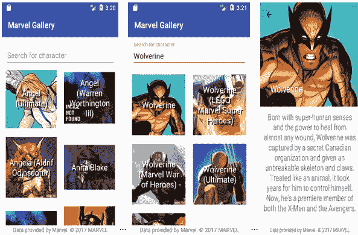

# 如何使用本章

本章展示了构建应用程序所需的所有步骤和代码。其目的是展示应用程序开发的逐步过程。在阅读本章时，专注于开发过程，并尝试理解所呈现的代码的目的。您不需要完全理解布局，也不必理解单元测试的定义，只要理解它们在做什么即可。专注于应用程序结构和使最终代码更简单的 Kotlin 解决方案。大多数解决方案已在前几章中进行了描述，因此只有简要描述。本章的价值在于它们的使用是在具体应用程序的上下文中呈现的。

您可以从 GitHub（[`github.com/MarcinMoskala/MarvelGallery`](https://github.com/MarcinMoskala/MarvelGallery)）下载应用程序代码。

在 GitHub 上，您可以查看最终代码，下载它，或者使用 Git 将其克隆到您的计算机上：

```kt
git clone git@github.com:MarcinMoskala/MarvelGallery.git

```

该应用程序还包括使用**Espresso**编写的 UI 测试，但本章未展示它们，以使对 Espresso 使用不熟练的读者更容易理解。

本章的每个部分在此项目上都有一个对应的 Git 分支，因此如果您想看到每个部分结束时的代码是什么样子，只需切换到相应的分支即可：

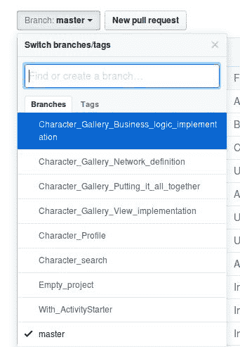

此外，在本地，当您克隆存储库后，可以使用以下 Git 命令检出相应的分支：

```kt
git checkout Character_search

```

如果您有本书的电子版本，并且想通过复制和粘贴代码的方式制作整个应用程序，那么您可以这样做，但请记住将文件放在对应包的文件夹中。这样，您将保持项目的清晰结构。

请注意，如果您将书中的代码放在其他文件夹中，将会显示警告：

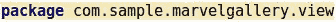

您可以故意将文件放在任何文件夹中，因为第二个修复建议是将文件移动到与定义的包对应的路径中：

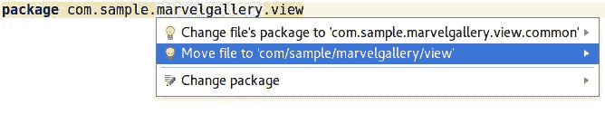

您可以使用它将文件移动到正确的位置。

# 创建一个空项目

在我们开始实现功能之前，我们需要创建一个空的 Kotlin Android 项目，其中只有一个活动，`MainActivty`。这个过程在第一章中已经描述过了，*开始你的 Kotlin 冒险*。因此，我们不需要深入描述它，但我们会展示在 Android Studio 3.0 中的步骤是什么：

1.  为新项目设置名称、包和位置。记得勾选包括 Kotlin 支持选项：*.*

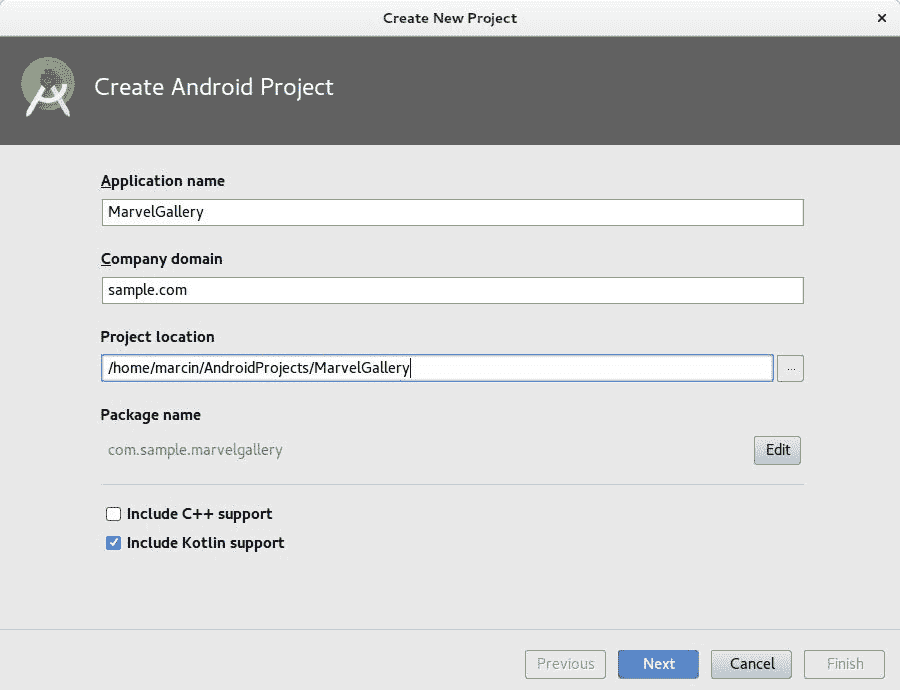

1.  我们可以选择其他最小的 Android 版本，但在这个例子中，我们将设置 API 16：

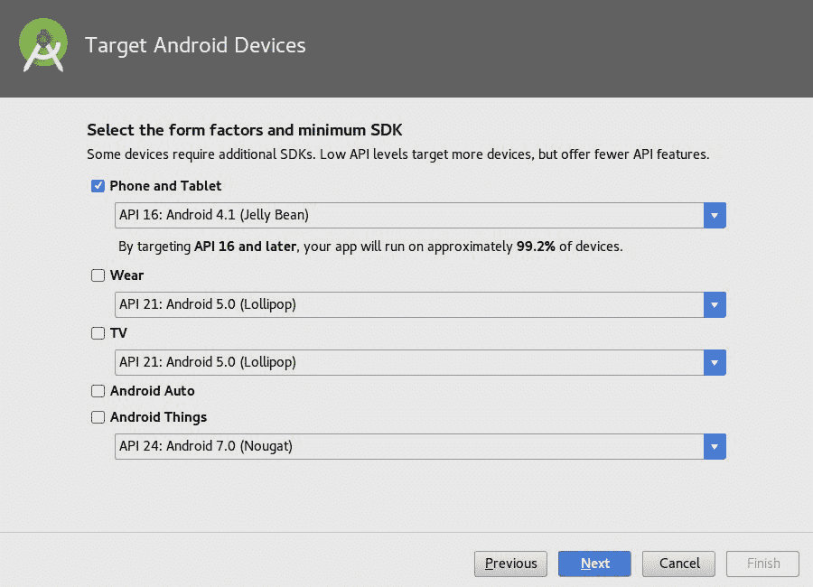

1.  选择一个模板。我们不需要这些模板中的任何一个，所以我们应该从空活动开始*：*

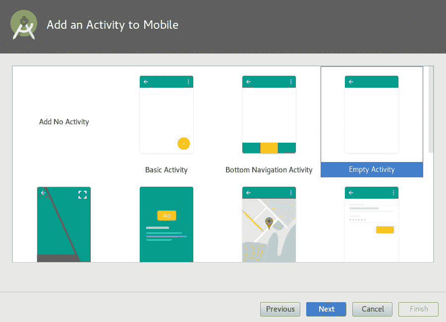

1.  命名新创建的活动。我们可以保留第一个视图命名为`MainActivity` *:*

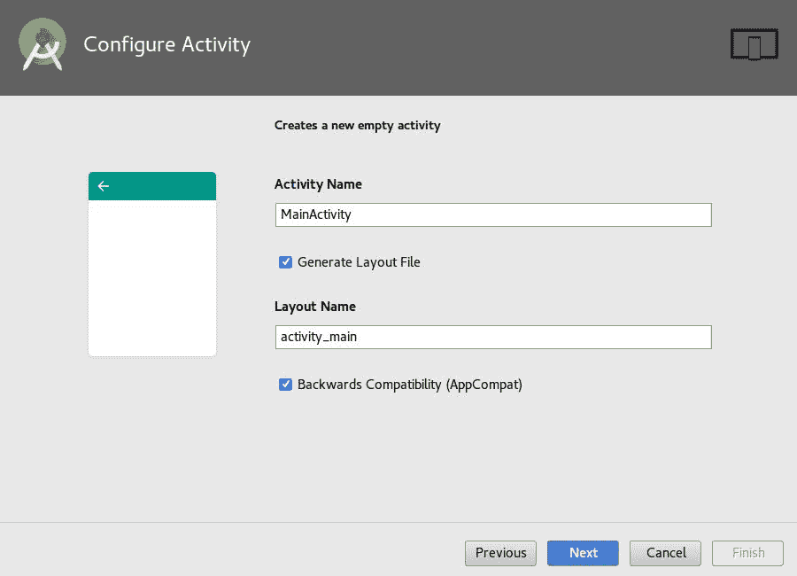

对于 Android Studio 3.x 之前的版本，我们需要遵循稍微不同的步骤：

使用空的*Activity*从模板创建项目。

1. 配置项目中的 Kotlin（例如，*Ctrl*/*Cmd* + *Shift* + *A*和配置项目中的 Kotlin）。

2. 将所有 Java 类转换为 Kotlin（例如，在`MainActivity`中*Ctrl/Cmd+Shift+A*和将 Java 文件转换为 Kotlin 文件）。

经过这些步骤，我们将拥有一个使用空 Activity 创建的 Kotlin Android 应用：

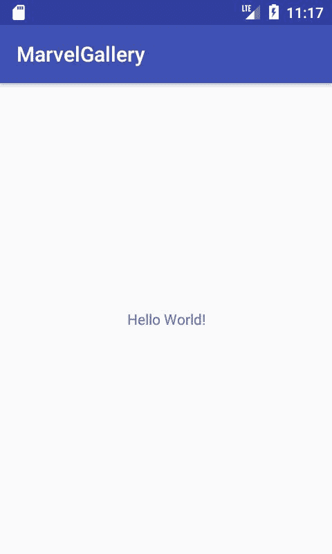

# 角色画廊

在这一部分，我们将实现一个单一用例——启动应用后，用户可以看到一个角色画廊。

这是一个相当复杂的用例，因为它需要呈现视图、与 API 进行网络连接和实现业务规则。因此，我们将把它分成以下任务：

+   视图实现

+   与 API 通信

+   角色显示的业务逻辑实现

+   把所有东西放在一起

这样的任务要容易实现得多。让我们依次实现它们。

# 视图实现

让我们从视图实现开始。在这里，我们将定义角色列表的外观。为了测试目的，我们还将定义一些角色并显示它们。

让我们从`MainActivity`布局实现开始。我们将使用`RecyclerView`来显示一个元素列表。`RecyclerView`布局分布在一个单独的依赖项中，我们需要将其添加到`app`模块的`build.gradle`文件中：

```kt
implementation "com.android.support:recyclerview-v7:$android_support_version" 
```

`android_support_version`实例是一个尚未定义的变量。其背后的原因是所有 Android 支持库的版本应该是相同的，当我们将这个版本号提取为一个分隔变量时，就更容易管理了。这就是为什么我们应该用对`android_support_version`的引用来替换每个 Android 支持库的硬编码版本：

```kt
implementation "com.android.support:appcompat-  

    v7:$android_support_version" 
implementation "com.android.support:design:$android_support_version" 
implementation "com.android.support:support-

    v4:$android_support_version" 
implementation "com.android.support:recyclerview-

    v7:$android_support_version" 
```

并且我们需要设置支持库版本值。良好的做法是在项目的`build*.*gradle`文件中的`buildscript`部分定义它，在`kotlin*_*version`定义之后：

```kt
ext.kotlin_version = '1.1.4-2' 
ext.android_support_version = "26.0.1" 
```

现在我们可以开始实现`MainActivity`布局。这是我们想要实现的效果：

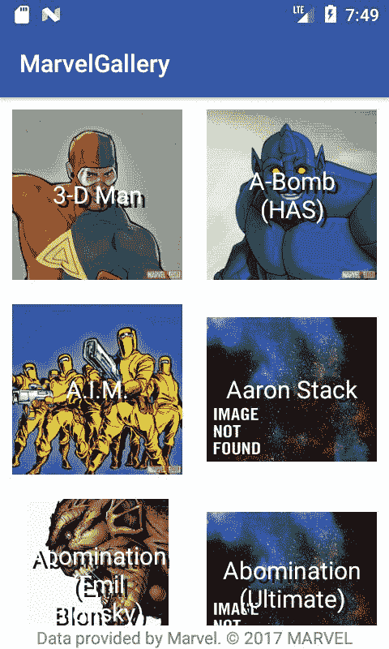

我们将把角色元素放入`RecyclerView`中，打包到`SwipeRefreshLayout`中以允许滑动刷新。此外，为了满足 Marvel 的版权要求，需要有一个呈现的标签，告知数据是由 Marvel 提供的。布局`activity_main`（`res/layout/activity_main.xml`）应该被替换为以下定义：

```kt
<?xml version="1.0" encoding="utf-8"?> 
<RelativeLayout  

   android:id="@+id/charactersView" 
   android:layout_width="match_parent" 
   android:layout_height="match_parent" 
   android:background="@android:color/white" 
   android:fitsSystemWindows="true"> 

   <android.support.v4.widget.SwipeRefreshLayout  

       android:id="@+id/swipeRefreshView" 
       android:layout_width="match_parent" 
       android:layout_height="match_parent"> 

       <android.support.v7.widget.RecyclerView 
           android:id="@+id/recyclerView" 
           android:layout_width="match_parent" 
           android:layout_height="match_parent" 
           android:scrollbars="vertical" /> 

   </android.support.v4.widget.SwipeRefreshLayout> 

   <TextView 
       android:layout_width="match_parent" 
       android:layout_height="wrap_content" 
       android:layout_alignParentBottom="true" 
       android:background="@android:color/white" 
       android:gravity="center" 
       android:text="@string/marvel_copyright_notice" /> 
</RelativeLayout> 
```

我们需要在字符串（`res/values/strings.xml`）中添加版权声明：

```kt
<string name="marvel_copyright_notice">

    Data provided by Marvel. © 2017 MARVEL

</string> 
```

这是一个预览：

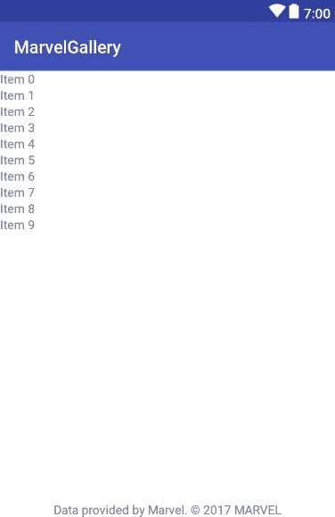

下一步是定义项目视图。我们希望每个元素都是正方形的。为了做到这一点，我们需要定义一个可以保持正方形形状的视图（将其放在`view/views`中）：

```kt
package com.sample.marvelgallery.view.views 

import android.util.AttributeSet 
import android.widget.FrameLayout 
import android.content.Context 

class SquareFrameLayout @JvmOverloads constructor( // 1 
       context: Context, 
       attrs: AttributeSet? = null, 
       defStyleAttr: Int = 0 
) : FrameLayout(context, attrs, defStyleAttr) { 

   override fun onMeasure(widthMeasureSpec: Int, 

   heightMeasureSpec: Int) { 
       super.onMeasure(widthMeasureSpec, widthMeasureSpec) // 2 
   } 
} 
```

1.  使用`JvmOverloads`注解，我们避免了通常用于在 Android 中定义自定义视图的望远镜构造函数。这在第四章中有描述，*类和对象*。

1.  我们强制元素始终具有与宽度相同的高度。

使用`SquareFrameLayout`，我们可以定义画廊项目的布局。这就是我们想要的样子：


我们需要定义`ImageView`来显示角色图像，以及`TextView`来显示其名称。虽然`SquareFrameLayout`实际上是具有固定高度的`FrameLayout`，但它的子元素（图像和文本）默认情况下是一个在另一个上面。让我们将布局添加到`res/layout`文件夹中的`item_character.xml`文件中：

```kt
// ./res/layout/item_character.xml 

<com.sample.marvelgallery.view.views.SquareFrameLayout  

   android:layout_width="match_parent" 
   android:layout_height="wrap_content" 
   android:gravity="center_horizontal" 
   android:orientation="horizontal" 
   android:padding="@dimen/element_padding"> 

   <ImageView 
       android:id="@+id/imageView" 
       android:layout_width="match_parent" 
       android:layout_height="match_parent"/> 

   <TextView 
       android:id="@+id/textView" 
       android:layout_width="match_parent" 
       android:layout_height="match_parent" 
       android:gravity="center" 
       android:paddingLeft="10dp" 
       android:paddingRight="10dp" 
       android:shadowColor="#111" 
       android:shadowDx="5" 
       android:shadowDy="5" 
       android:shadowRadius="0.01" 
       android:textColor="@android:color/white" 
       android:textSize="@dimen/standard_text_size" 
       tools:text="Some name" /> 
</com.sample.marvelgallery.view.views.SquareFrameLayout> 
```

请注意，我们还在`dimens`中定义的`element_padding`等值。让我们将它们添加到`res/values`文件夹中的`dimen.xml`文件中：

```kt
<?xml version="1.0" encoding="utf-8"?> 
<resources> 
   <dimen name="character_header_height">240dp</dimen> 
   <dimen name="standard_text_size">20sp</dimen> 
   <dimen name="character_description_padding">10dp</dimen> 
   <dimen name="element_padding">10dp</dimen> 
</resources> 
```

正如我们所看到的，每个元素都需要显示角色的名称和图像。因此，角色的模型需要包含这两个属性。让我们为角色定义一个简单的模型：

```kt
package com.sample.marvelgallery.model 

data class MarvelCharacter( 
       val name: String, 
       val imageUrl: String 
) 
```

要使用`RecyclerView`显示元素列表，我们需要实现`RecyclerView`列表和一个项目适配器。列表适配器用于管理列表中的所有元素，而项目适配器是单个项目类型的适配器。在这里，我们只需要一个项目适配器，因为我们显示单一类型的项目。然而，最好假设在将来可能会有其他类型的元素在这个列表上，例如漫画或广告。列表适配器也是一样--在这个例子中我们只需要一个，但在大多数项目中不止一个列表，最好将通用行为提取到一个单独的抽象类中。

虽然这个例子旨在展示 Kotlin 如何在更大的项目中使用，我们将定义一个抽象列表适配器，我们将其命名为`RecyclerListAdapter`，以及一个抽象项目适配器，我们将其命名为`ItemAdapter`。这是`ItemAdapter`的定义：

```kt
package com.sample.marvelgallery.view.common 

import android.support.v7.widget.RecyclerView 
import android.support.annotation.LayoutRes 
import android.view.View 

abstract class ItemAdapter<T : RecyclerView.ViewHolder>

(@LayoutRes open val layoutId: Int) { // 1 

   abstract fun onCreateViewHolder(itemView: View): T // 2 

   @Suppress("UNCHECKED_CAST") // 1 
   fun bindViewHolder(holder: RecyclerView.ViewHolder) { 
       (holder as T).onBindViewHolder() // 1 
   } 

   abstract fun T.onBindViewHolder() // 1, 3 
} 
```

1.  我们需要将持有者作为类型参数传递，以允许直接对其字段进行操作。持有者是在`onCreateViewHolder`中创建的，因此我们知道它的类型将始终是类型参数`T`。因此，我们可以在`bindViewHolder`上将持有者转换为`T`并将其用作`onBindViewHolder`的接收器对象。`@Suppress("UNCHECKED_CAST")`的抑制只是为了在我们知道可以在这种情况下安全转换时隐藏警告。

1.  用于创建视图持有者的函数。在大多数情况下，它将是一个只调用构造函数的单表达式函数。

1.  在`onBindViewHolder`函数中，我们将设置 item 视图上的所有值。

这是`RecyclerListAdapter`的定义：

```kt
package com.sample.marvelgallery.view.common 

import android.support.v7.widget.RecyclerView 
import android.view.LayoutInflater 
import android.view.ViewGroup 

open class RecyclerListAdapter( // 1 
       var items List<AnyItemAdapter> = listOf() 
) : RecyclerView.Adapter<RecyclerView.ViewHolder>() { 

   override final fun getItemCount() = items.size // 4 

   override final fun getItemViewType(position: Int) = 

       items[position].layoutId // 3, 4 

   override final fun onCreateViewHolder(parent: ViewGroup, 

       layoutId: Int): RecyclerView.ViewHolder { // 4 

   val itemView = LayoutInflater.from(parent.context)

       .inflate(layoutId, parent, false) 
       return items.first 

       { it.layoutId == layoutId }.onCreateViewHolder(itemView) // 3 
   } 

   override final fun onBindViewHolder

   (holder: RecyclerView.ViewHolder, position: Int) { // 4 
       items[position].bindViewHolder(holder) 
   } 
} 

typealias AnyItemAdapter = ItemAdapter 

    <out RecyclerView.ViewHolder> // 5 
```

1.  类是`open`而不是`abstract`，因为它可以被初始化和使用而不需要任何子类。我们定义子类是为了允许我们为不同的列表定义自定义方法。

1.  我们将项目保存在列表中。

1.  我们将使用布局来区分项目类型。因此，我们不能在同一个列表上使用具有相同布局的两个项目适配器，但这个解决方案简化了很多事情。

1.  方法是`RecyclerView.Adapter`的重写方法，但它们还使用`final`修饰符来限制它们在子类中的重写。所有扩展`RecyclerListAdapter`的列表适配器都应该操作项目。

1.  我们定义类型别名来简化任何`ItemAdapter`的定义。

使用上述定义，我们可以定义`MainListAdapter`（角色列表的适配器）和`CharacterItemAdapter`（列表上项目的适配器）。这是`MainListAdapter`的定义：

```kt
package com.sample.marvelgallery.view.main 

import com.sample.marvelgallery.view.common.AnyItemAdapter 
import com.sample.marvelgallery.view.common.RecyclerListAdapter 

class MainListAdapter(items: List<AnyItemAdapter>) : RecyclerListAdapter(items) 
```

在这个项目中，我们不需要在`MainListAdapter`中定义任何特殊方法，但是为了展示定义它们有多容易，这里呈现了具有额外添加和删除方法的`MainListAdapter`：

```kt
class MainListAdapter(items: List<AnyItemAdapter>) : RecyclerListAdapter(items) { 

   fun add(itemAdapter: AnyItemAdapter) { 
       items += itemAdapter) 
       val index = items.indexOf(itemAdapter) 
       if (index == -1) return 
       notifyItemInserted(index) 
   } 

   fun delete(itemAdapter: AnyItemAdapter) { 
       val index = items.indexOf(itemAdapter) 
       if (index == -1) return 
       items -= itemAdapter 
       notifyItemRemoved(index) 
   } 
 }    
```

这是`CharacterItemAdapter`的定义：

```kt
package com.sample.marvelgallery.view.main 

import android.support.v7.widget.RecyclerView 
import android.view.View 
import android.widget.ImageView 
import android.widget.TextView 
import com.sample.marvelgallery.R 
import com.sample.marvelgallery.model.MarvelCharacter 
import com.sample.marvelgallery.view.common.ItemAdapter 
import com.sample.marvelgallery.view.common.bindView 
import com.sample.marvelgallery.view.common.loadImage 

class CharacterItemAdapter( 
       val character: MarvelCharacter // 1 
) : ItemAdapter<CharacterItemAdapter.ViewHolder>(R.layout.item_character) { 

   override fun onCreateViewHolder(itemView: View) = ViewHolder(itemView) 

   override fun ViewHolder.onBindViewHolder() { // 2 
       textView.text = character.name 
       imageView.loadImage(character.imageUrl) // 3 
   } 

   class ViewHolder(itemView: View) : RecyclerView.ViewHolder(itemView)  

   { 
       val textView by bindView<TextView>(R.id.textView) // 4 
       val imageView by bindView<ImageView>(R.id.imageView) // 4 
   } 
} 
```

1.  `MarvelCharacter`通过构造函数传递。

1.  `onBindViewHolder`方法用于设置视图。它被定义为`ItemAdapter`中的抽象成员扩展函数，由于这样，现在我们可以在其主体内明确使用`textView`和`imageView`。

1.  `loadImage`函数尚未定义。我们稍后将其定义为扩展函数。

1.  在视图持有者中，我们使用`bindView`函数将属性绑定到视图元素，该函数很快将被定义。

在内部，我们使用尚未定义的函数`loadImage`和`bindView`。`bindView`是一个顶级扩展函数，用于`RecyclerView.ViewHolder`，它提供了一个懒惰的委托，该委托通过其 ID 找到视图：

```kt
// ViewExt.kt 
package com.sample.marvelgallery.view.common 

import android.support.v7.widget.RecyclerView 
import android.view.View 

fun <T : View> RecyclerView.ViewHolder.bindView(viewId: Int)  
      = lazy { itemView.findViewById<T>(viewId) } 
```

我们还需要定义`loadImage`扩展函数，它将帮助我们从 URL 下载图像并将其放入`ImageView`中。用于此目的的两个典型库是**Picasso**和**Glide**。我们将使用 Glide，并且为此，我们需要在`build.gradle`中添加依赖项：

```kt
implementation "com.android.support:recyclerview-

v7:$android_support_version" 
implementation "com.github.bumptech.glide:glide:$glide_version" 
```

在项目`build.gradle`中指定版本：

```kt
ext.android_support_version = "26.0.0" 
ext.glide_version = "3.8.0" 
```

在`AndroidManifest`中添加使用互联网的权限：

```kt
<manifest  
   package="com.sample.marvelgallery"> 
   <uses-permission android:name="android.permission.INTERNET" /> 
   <application 
... 
```

最后，我们可以为`ImaveView`类定义`loadImage`扩展函数：

```kt
// ViewExt.kt 
package com.sample.marvelgallery.view.common 

import android.support.v7.widget.RecyclerView 
import android.view.View 
import android.widget.ImageView 
import com.bumptech.glide.Glide 

fun <T : View> RecyclerView.ViewHolder.bindView(viewId: Int)  
       = lazy { itemView.findViewById<T>(viewId) } 

fun ImageView.loadImage(photoUrl: String) { 
   Glide.with(context) 
           .load(photoUrl) 
           .into(this) 
} 
```

是时候定义将显示此列表的活动了。我们将使用另一个元素，**Kotlin Android 扩展**插件。它用于简化从代码访问视图元素。它的使用很简单 - 我们在模块`build.gradle`中添加`kotlin-android-extensions`插件：

```kt
apply plugin: 'com.android.application' 
apply plugin: 'kotlin-android' 
apply plugin: 'kotlin-android-extensions' 

And we have some view defined in layout: 

<TextView 
   android:id="@+id/nameView" 
   android:layout_width="wrap_content" 
   android:layout_height="wrap_content" /> 
```

然后我们可以在`Activity`中导入对此视图的引用：

```kt
import kotlinx.android.synthetic.main.activity_main.* 
```

我们可以直接使用其名称访问`View`元素，而无需使用`findViewById`方法或定义注释：

```kt
nameView.text = "Some name" 
```

我们将在项目中的所有活动中使用 Kotlin Android 扩展。现在让我们定义`MainActivity`以显示带有图像的角色列表：

```kt
package com.sample.marvelgallery.view.main 

import android.os.Bundle 
import android.support.v7.app.AppCompatActivity 
import android.support.v7.widget.GridLayoutManager 
import android.view.Window 
import com.sample.marvelgallery.R 
import com.sample.marvelgallery.model.MarvelCharacter 
import kotlinx.android.synthetic.main.activity_main.* 

class MainActivity : AppCompatActivity() { 

   private val characters = listOf( // 1 
       MarvelCharacter(name = "3-D Man", imageUrl = "http://i.annihil.us/u/prod/marvel/i/mg/c/e0/535fecbbb9784.jpg"), 
       MarvelCharacter(name = "Abomination (Emil Blonsky)", imageUrl = "http://i.annihil.us/u/prod/marvel/i/mg/9/50/4ce18691cbf04.jpg") 
   ) 

   override fun onCreate(savedInstanceState: Bundle?) { 
       super.onCreate(savedInstanceState) 
       requestWindowFeature(Window.FEATURE_NO_TITLE) // 2 
       setContentView(R.layout.activity_main) 
       recyclerView.layoutManager = GridLayoutManager(this, 2) // 3 
       val categoryItemAdapters = characters

       .map(::CharacterItemAdapter) // 4 
       recyclerView.adapter = MainListAdapter(categoryItemAdapters) 
   } 
} 
```

1.  在这里，我们定义了一个临时的角色列表以显示。

1.  我们使用此窗口功能，因为我们不想显示标题。

1.  我们使用`GridLayoutManager`作为`RecyclerView`布局管理器以实现网格效果。

1.  我们正在使用`CharacterItemAdapter`构造函数引用从字符创建项目适配器。

现在我们可以编译项目，然后我们会看到以下屏幕：

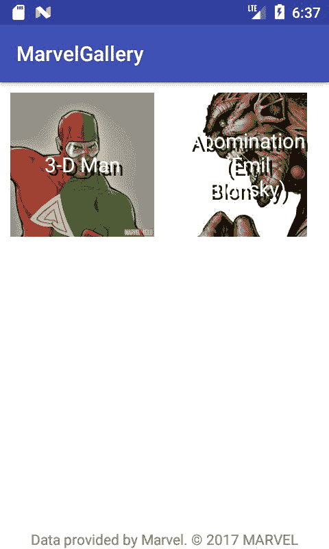

# 网络定义

到目前为止，所呈现的数据是在应用程序内部硬编码的，但我们希望改为使用 Marvel API 的数据。为此，我们需要定义一些网络机制，以从服务器检索数据。我们将使用**Retrofit**，这是一个流行的 Android 库，用于简化网络操作，以及 RxJava，这是一个用于响应式编程的流行库。对于这两个库，我们将仅使用基本功能，以使其使用尽可能简单。要使用它们，我们需要在模块`build.gradle`中添加以下依赖项：

```kt
dependencies { 
   implementation "org.jetbrains.kotlin:kotlin-stdlib-jre7:

   $kotlin_version" 
   implementation "com.android.support:appcompat-v7:

   $android_support_version" 
   implementation "com.android.support:recyclerview-v7:

   $android_support_version" 
   implementation "com.github.bumptech.glide:glide:$glide_version" 

   // RxJava 
   implementation "io.reactivex.rxjava2:rxjava:$rxjava_version" 

   // RxAndroid 
   implementation "io.reactivex.rxjava2:rxandroid:$rxandroid_version" 

   // Retrofit 
   implementation(["com.squareup.retrofit2:retrofit:$retrofit_version", 
                   "com.squareup.retrofit2:adapter- 

                    rxjava2:$retrofit_version", 
                   "com.squareup.retrofit2:converter-

                    gson:$retrofit_version", 
                   "com.squareup.okhttp3:okhttp:$okhttp_version", 
                   "com.squareup.okhttp3:logging-

                   interceptor:$okhttp_version"]) 

  testImplementation 'junit:junit:4.12' 
  androidTestImplementation 

  'com.android.support.test:runner:1.0.0' 
  androidTestImplementation   

  'com.android.support.test.espresso:espresso-core:3.0.0' 
} 
```

在项目`build.gradle`中定义版本定义：

```kt
ext.kotlin_version = '1.1.3-2' 
ext.android_support_version = "26.0.0" 
ext.glide_version = "3.8.0" 
ext.retrofit_version = '2.2.0' 
ext.okhttp_version = '3.6.0' 
ext.rxjava_version = "2.1.2" 
ext.rxandroid_version = '2.0.1' 
```

我们已经在`AndroidManifest`中定义了互联网权限，因此不需要添加它。简单的`Retrofit`定义可能如下所示：

```kt
val retrofit by lazy { makeRetrofit() } // 1 

private fun makeRetrofit(): Retrofit = Retrofit.Builder() 
       .baseUrl("http://gateway.marvel.com/v1/public/") // 2 
       .build() 
```

1.  我们可以将`retrofit`实例保留为惰性顶级属性。

1.  在这里我们定义`baseUrl`

但是 Retrofit 还有一些额外的要求需要满足。我们需要添加转换器以将 Retrofit 与 RxJava 一起使用，并将对象序列化为 JSON 进行发送。我们还需要拦截器，这些拦截器将用于提供 Marvel API 所需的标头和额外查询。这是一个小应用程序，因此我们可以将所有所需的元素定义为顶级函数。完整的 Retrofit 定义将如下所示：

```kt
// Retrofit.kt 
package com.sample.marvelgallery.data.network.provider 

import com.google.gson.Gson 
import okhttp3.OkHttpClient 
import retrofit2.Retrofit 
import retrofit2.adapter.rxjava2.RxJava2CallAdapterFactory 
import retrofit2.converter.gson.GsonConverterFactory 
import java.util.concurrent.TimeUnit 

val retrofit by lazy { makeRetrofit() } 

private fun makeRetrofit(): Retrofit = Retrofit.Builder() 
       .baseUrl("http://gateway.marvel.com/v1/public/") 
       .client(makeHttpClient()) 
       .addConverterFactory(GsonConverterFactory.create(Gson())) // 1 
       .addCallAdapterFactory(RxJava2CallAdapterFactory.create()) // 2 
       .build() 

private fun makeHttpClient() = OkHttpClient.Builder() 
       .connectTimeout(60, TimeUnit.SECONDS) // 3 
       .readTimeout(60, TimeUnit.SECONDS) // 4 
       .addInterceptor(makeHeadersInterceptor()) // 5 
       .addInterceptor(makeAddSecurityQueryInterceptor()) // 6 
       .addInterceptor(makeLoggingInterceptor()) // 7 
       .build() 
```

1.  添加一个允许使用 GSON 库对对象 JSON 进行序列化和反序列化的转换器。

1.  添加一个转换器，它将允许 RxJava2 类型（Observable，Single）作为网络请求返回值的可观察对象。

1.  我们添加自定义拦截器。我们需要定义它们所有。

让我们定义所需的拦截器。`makeHeadersInterceptor`用于为每个请求添加标准标头：

```kt
// HeadersInterceptor.kt 
package com.sample.marvelgallery.data.network.provider 

import okhttp3.Interceptor 

fun makeHeadersInterceptor() = Interceptor { chain -> // 1 
   chain.proceed(chain.request().newBuilder() 
           .addHeader("Accept", "application/json") 
           .addHeader("Accept-Language", "en") 
           .addHeader("Content-Type", "application/json") 
           .build()) 
}
```

1.  拦截器是 SAM，因此我们可以使用 SAM 构造函数来定义它。

`makeLoggingInterceptor`函数用于在调试模式下运行应用程序时在控制台上显示日志：

```kt
// LoggingInterceptor.kt 
package com.sample.marvelgallery.data.network.provider 

import com.sample.marvelgallery.BuildConfig 
import okhttp3.logging.HttpLoggingInterceptor 

fun makeLoggingInterceptor() = HttpLoggingInterceptor().apply { 
   level = if (BuildConfig.DEBUG) HttpLoggingInterceptor.Level.BODY 

           else HttpLoggingInterceptor.Level.NONE 
} 
```

`makeAddRequiredQueryInterceptor`函数更复杂，因为它用于提供 Marvel API 用于验证用户的查询参数。这些参数需要使用 MD5 算法计算的哈希。它还需要来自 Marvel API 的公钥和私钥。每个人都可以在[`developer.marvel.com/`](https://developer.marvel.com/)生成自己的密钥。生成密钥后，我们需要将它们放在`gradle.properties`文件中：

```kt
org.gradle.jvmargs=-Xmx1536m 
marvelPublicKey=REPLEACE_WITH_YOUR_PUBLIC_MARVEL_KEY 
marvelPrivateKey=REPLEACE_WITH_YOUR_PRIVATE_MARVEL_KEY 
```

还在 Android 的`defaultConfig`部分的模块`build.gradle`中添加以下定义：

```kt
defaultConfig { 
   applicationId "com.sample.marvelgallery" 
   minSdkVersion 16 
   targetSdkVersion 26 
   versionCode 1 
   versionName "1.0" 
   testInstrumentationRunner 

   "android.support.test.runner.AndroidJUnitRunner" 
   buildConfigField("String", "PUBLIC_KEY", "\"${marvelPublicKey}\"") 
   buildConfigField("String", "PRIVATE_KEY", "\"${marvelPrivateKey}\"") 
} 
```

项目重建后，您将能够通过`BuildConfig.PUBLIC_KEY`和`BuildConfig.PRIVATE_KEY`访问这些值。使用这些密钥，我们可以生成 Marvel API 所需的查询参数：

```kt
// QueryInterceptor.kt 
package com.sample.marvelgallery.data.network.provider 

import com.sample.marvelgallery.BuildConfig 
import okhttp3.Interceptor 

fun makeAddSecurityQueryInterceptor() = Interceptor { chain -> 
   val originalRequest = chain.request() 
   val timeStamp = System.currentTimeMillis() 

   // Url customization: add query parameters 
   val url = originalRequest.url().newBuilder() 
           .addQueryParameter("apikey", BuildConfig.PUBLIC_KEY) // 1 
           .addQueryParameter("ts", "$timeStamp") // 1 
           .addQueryParameter("hash", calculatedMd5(timeStamp.toString() + BuildConfig.PRIVATE_KEY + BuildConfig.PUBLIC_KEY)) // 1 
           .build() 

   // Request customization: set custom url 
   val request = originalRequest 
           .newBuilder() 
           .url(url) 
           .build() 

   chain.proceed(request) 
} 
```

1.  我们需要提供三个额外的查询：

+   `apikey`：只包括我们的公钥。

+   `ts`：只包含设备时间的毫秒数。它用于提高下一个查询中提供的哈希的安全性。

+   `hash`：这是从时间戳、私钥和公钥依次计算 MD5 哈希的`String`。

这是用于计算 MD5 哈希的函数的定义：

```kt
// MD5.kt 
package com.sample.marvelgallery.data.network.provider 

import java.math.BigInteger 
import java.security.MessageDigest 

/** 
* Calculate MD5 hash for text 
* @param timeStamp Current timeStamp 
* @return MD5 hash string 
*/ 
fun calculatedMd5(text: String): String { 
   val messageDigest = getMd5Digest(text) 
   val md5 = BigInteger(1, messageDigest).toString(16) 
   return "0" * (32 - md5.length) + md5 // 1 
} 

private fun getMd5Digest(str: String): ByteArray = MessageDigest.getInstance("MD5").digest(str.toByteArray()) 

private operator fun String.times(i: Int) = (1..i).fold("") { acc, _ -> acc + this } 
```

1.  我们正在使用 times 扩展运算符来填充哈希，如果它比 32 短。

我们已经定义了拦截器，因此我们可以定义实际的 API 方法。Marvel API 包含许多表示字符、列表等的数据模型。我们需要将它们定义为单独的类。这样的类称为**数据传输对象**（**DTOs**）。我们将定义我们需要的对象：

```kt
package com.sample.marvelgallery.data.network.dto 

class DataContainer<T> { 
   var results: T? = null 
} 

package com.sample.marvelgallery.data.network.dto 

class DataWrapper<T> { 
   var data: DataContainer<T>? = null 
} 

package com.sample.marvelgallery.data.network.dto 

class ImageDto { 

   lateinit var path: String // 1 
   lateinit var extension: String // 1 

   val completeImagePath: String 
       get() = "$path.$extension" 
} 

package com.sample.marvelgallery.data.network.dto 

class CharacterMarvelDto { 
   lateinit var name: String // 1 
   lateinit var thumbnail: ImageDto // 1 

   val imageUrl: String 
       get() = thumbnail.completeImagePath 
} 
```

1.  对于可能未提供的值，我们应该设置默认值。必须提供的值可能会用`lateinit`前缀。

Retrofit 使用反射来创建基于接口定义的 HTTP 请求。这是我们如何实现定义 HTTP 请求的接口：

```kt
package com.sample.marvelgallery.data.network 

import com.sample.marvelgallery.data.network.dto.CharacterMarvelDto 
import com.sample.marvelgallery.data.network.dto.DataWrapper 
import io.reactivex.Single 
import retrofit2.http.GET 
import retrofit2.http.Query 

interface MarvelApi { 

   @GET("characters") 
   fun getCharacters( 
           @Query("offset") offset: Int?, 
           @Query("limit") limit: Int? 
   ): Single<DataWrapper<List<CharacterMarvelDto>>> 
}  
```

有了这样的定义，我们最终可以得到一个字符列表：

```kt
retrofit.create(MarvelApi::class.java) // 1 

    .getCharacters(0, 100) // 2

    .subscribe({ /* code */ }) // 3 
```

1.  我们使用`retrofit`实例来创建一个对象，根据`MarvelApi`接口定义进行 HTTP 请求。

1.  我们创建一个准备发送到 API 的可观察对象。

1.  通过`subscribe`，我们发送一个 HTTP 请求并开始监听响应。第一个参数是在成功接收响应时调用的回调函数。

这样的网络定义可能已经足够了，但我们可能会实现得更好。最大的问题是我们现在需要操作 DTO 对象，而不是我们自己的数据模型对象。对于映射，我们应该定义一个额外的层。存储库模式用于此目的。当我们实现单元测试时，这种模式也非常有帮助，因为我们可以模拟存储库而不是整个 API 定义。这是我们想要的存储库定义：

```kt
package com.sample.marvelgallery.data 

import com.sample.marvelgallery.model.MarvelCharacter 
import io.reactivex.Single 

interface MarvelRepository { 

   fun getAllCharacters(): Single<List<MarvelCharacter>> 
} 

And here is the implementation of MarvelRepository: 

package com.sample.marvelgallery.data 

import com.sample.marvelgallery.data.network.MarvelApi 
import com.sample.marvelgallery.data.network.provider.retrofit 
import com.sample.marvelgallery.model.MarvelCharacter 
import io.reactivex.Single 

class MarvelRepositoryImpl : MarvelRepository { 

   val api = retrofit.create(MarvelApi::class.java) 

   override fun getAllCharacters(): Single<List<MarvelCharacter>> = api.getCharacters( 
           offset = 0, 
           limit = elementsOnListLimit 
   ).map { 
       it.data?.results.orEmpty().map(::MarvelCharacter) // 1 
   } 

   companion object { 
       const val elementsOnListLimit = 50 
   } 
} 
```

1.  我们正在获取 DTO 元素的列表，并使用构造函数引用将其映射到`MarvelCharacter`。

为使其工作，我们需要在`MarvelCharacter`中定义一个额外的构造函数，以`CharacterMarvelDto`作为参数：

```kt
package com.sample.marvelgallery.model 

import com.sample.marvelgallery.data.network.dto.CharacterMarvelDto 

class MarvelCharacter( 
       val name: String, 
       val imageUrl: String 
) { 

   constructor(dto: CharacterMarvelDto) : this( 
           name = dto.name, 
           imageUrl = dto.imageUrl 
   ) 
} 
```

提供`MarvelRepository`实例的不同方法。在最常见的实现中，具体的`MarvelRepository`实例作为构造函数参数传递给`Presenter`。但是对于 UI 测试（如 Espresso 测试）呢？我们不想测试 Marvel API，也不想使 UI 测试依赖于它。解决方案是制作一个机制，在正常运行时生成标准实现，但也允许我们为测试目的设置不同的实现。我们将制作以下通用机制的实现（将其放在数据中）：

```kt
package com.sample.marvelgallery.data 

abstract class Provider<T> { 

   abstract fun creator(): T 

   private val instance: T by lazy { creator() } 
   var testingInstance: T? = null 

   fun get(): T = testingInstance ?: instance 
} 
```

我们可以使用一些依赖注入库，如**Dagger**或**Kodein**，而不是定义自己的`Provider`。在 Android 开发中，Dagger 用于此类目的非常普遍，但我们决定不在此示例中包含它，以避免给不熟悉该库的开发人员增加额外的复杂性。

我们可以使`MarvelRepository`的伴生对象提供者扩展上述类：

```kt
package com.sample.marvelgallery.data 

import com.sample.marvelgallery.model.MarvelCharacter 
import io.reactivex.Single 

interface MarvelRepository { 

   fun getAllCharacters(): Single<List<MarvelCharacter>> 

   companion object : Provider<MarvelRepository>() { 
       override fun creator() = MarvelRepositoryImpl() 
   } 
} 
```

由于前面的定义，我们可以使用`MarvelRepository`的伴生对象来获取`MarvelRepository`的实例：

```kt
val marvelRepository = MarvelRepository.get()  
```

它将是 MarvelRepositoryImpl 的延迟实例，直到有人设置`testingInstance`属性的非空值为止：

```kt
MarvelRepository.get() // Returns instance of MarvelRepositoryImpl 

MarvelRepository.testingInstance= object: MarvelRepository { 
   override fun getAllCharacters(): Single<List<MarvelCharacter>>  
         = Single.just(emptyList()) 
} 

MarvelRepository.get() // returns an instance of an anonymous class in which the returned list is always empty. 
```

这样的构造对使用 Espresso 进行 UI 测试非常有用。它在项目中用于元素覆盖，并且可以在 GitHub 上找到。为了让不熟悉测试的开发人员更容易理解，本节中没有介绍它。如果你想看到它，可以在[`github.com/MarcinMoskala/MarvelGallery/blob/master/app/src/androidTest/java/com/sample/marvelgallery/MainActivityTest.kt`](https://github.com/MarcinMoskala/MarvelGallery/blob/master/app/src/androidTest/java/com/sample/marvelgallery/MainActivityTest.kt)找到。

最后让我们通过实现角色画廊显示的业务逻辑来将这个存储库与视图连接起来。

# 业务逻辑实现

我们已经实现了视图和存储库部分，现在是时候最终实现业务逻辑了。在这一点上，我们只需要获取角色列表并在用户进入屏幕或刷新时显示它。我们将使用一种称为**Model-View-Presenter**（**MVP**）的架构模式从视图实现中提取这些业务逻辑规则。以下是简化的规则：

+   **Model**：这是负责管理数据的层。模型的责任包括使用 API、缓存数据、管理数据库等。

+   **Presenter**：Presenter 是模型和视图之间的中间人，它应该包含所有的演示逻辑。Presenter 负责对用户交互做出反应，使用和更新模型和视图。

+   **View**：这负责呈现数据并将用户交互事件转发给 Presenter。

在我们实现这种模式时，我们将 Activity 视为视图，并且对于每个视图，我们需要创建一个 Presenter。编写单元测试来检查业务逻辑规则是否正确实现是一个好的实践。为了简化，我们需要将 Activity 隐藏在一个易于模拟的接口后面，该接口代表了 Presenter 与视图（Activity）的所有可能的交互。此外，我们将在 Activity 中创建所有依赖项（例如`MarvelRepository`），并通过构造函数将它们作为隐藏在接口后面的对象（例如，将`MarvelRepositoryImpl`作为`MarvelRepository`）传递给 Presenter。

在 Presenter 中，我们需要实现以下行为：

+   当 Presenter 等待响应时，显示加载动画

+   视图创建后，加载并显示角色列表

+   调用刷新方法后，加载角色列表

+   当 API 返回角色列表时，它会显示在视图上

+   当 API 返回错误时，它会显示在视图上

正如我们所看到的，Presenter 需要通过构造函数获取 View 和`MarvelRepository`，并且应该指定在视图创建或用户请求列表刷新时将调用的方法：

```kt
package com.sample.marvelgallery.presenter 

import com.sample.marvelgallery.data.MarvelRepository 
import com.sample.marvelgallery.view.main.MainView 

class MainPresenter(val view: MainView, val repository: MarvelRepository) { 

   fun onViewCreated() { 
   } 

   fun onRefresh() { 
   } 
} 
```

视图需要指定用于显示角色列表、显示错误和在视图刷新时显示进度条的方法（在`view/main`中定义，并将`MainActivity`移动到`view/main`）：

```kt
package com.sample.marvelgallery.view.main.main 

import com.sample.marvelgallery.model.MarvelCharacter 

interface MainView { 
   var refresh: Boolean 
   fun show(items: List<MarvelCharacter>) 
   fun showError(error: Throwable) 
} 
```

在向 Presenter 添加逻辑之前，让我们先定义两个单元测试：

```kt
// test source set 
package com.sample.marvelgallery 

import com.sample.marvelgallery.data.MarvelRepository 
import com.sample.marvelgallery.model.MarvelCharacter 
import com.sample.marvelgallery.presenter.MainPresenter 
import com.sample.marvelgallery.view.main.MainView 
import io.reactivex.Single 
import org.junit.Assert.assertEquals 
import org.junit.Assert.fail 
import org.junit.Test 

@Suppress("IllegalIdentifier") // 1 
class MainPresenterTest { 

   @Test 
   fun `After view was created, list of characters is loaded and displayed`() { 
       assertOnAction { onViewCreated() }.thereIsSameListDisplayed() 
   } 

   @Test 
   fun `New list is shown after view was refreshed`() { 
       assertOnAction { onRefresh() }.thereIsSameListDisplayed() 
   } 

   private fun assertOnAction(action: MainPresenter.() -> Unit) 
           = PresenterActionAssertion(action) 

   private class PresenterActionAssertion

   (val actionOnPresenter: MainPresenter.() -> Unit) { 

       fun thereIsSameListDisplayed() { 
           // Given 
           val exampleCharacterList = listOf(// 2 
                   MarvelCharacter("ExampleName", "ExampleImageUrl"), 
                   MarvelCharacter("Name1", "ImageUrl1"), 
                   MarvelCharacter("Name2", "ImageUrl2") 
           ) 

           var displayedList: List<MarvelCharacter>? = null 

           val view = object : MainView { //3 
               override var refresh: Boolean = false 

               override fun show(items: List<MarvelCharacter>) { 
                   displayedList = items // 4 
               } 

               override fun showError(error: Throwable) { 
                   fail() //5 
               } 
           } 
           val marvelRepository = object : MarvelRepository { // 3 
               override fun getAllCharacters(): 

                Single<List<MarvelCharacter>> 
                  = Single.just(exampleCharacterList) // 6 
           } 

           val mainPresenter = MainPresenter(view, marvelRepository) 

           // 3 

           // When 
           mainPresenter.actionOnPresenter() // 7 

           // Then 
           assertEquals(exampleCharacterList, displayedList) // 8 
       } 
   } 
} 
```

1.  Kotlin 单元测试允许使用描述性名称，但会显示警告。需要抑制此警告。

1.  定义一个要显示的示例角色列表。

1.  定义一个视图和存储库，并使用它们创建一个 Presenter。

1.  当显示元素列表时，我们应该将其设置为显示的列表。

1.  当调用`showError`时，测试失败。

1.  `getAllCharacters` 方法只是返回一个示例列表。

1.  我们在 Presenter 上调用一个定义好的动作。

1.  我们检查存储库返回的列表是否与显示的列表相同。

为了简化前面的定义，我们可以提取`BaseMarvelRepository`和`BaseMainView`，并将示例数据保存在一个单独的类中：

```kt
// test source set 
package com.sample.marvelgallery.helpers 

import com.sample.marvelgallery.data.MarvelRepository 
import com.sample.marvelgallery.model.MarvelCharacter 
import io.reactivex.Single 

class BaseMarvelRepository( 
       val onGetCharacters: () -> Single<List<MarvelCharacter>> 
) : MarvelRepository { 

   override fun getAllCharacters() = onGetCharacters() 
} 

// test source set 
package com.sample.marvelgallery.helpers 

import com.sample.marvelgallery.model.MarvelCharacter 
import com.sample.marvelgallery.view.main.MainView 

class BaseMainView( 
       var onShow: (items: List<MarvelCharacter>) -> Unit = {}, 
       val onShowError: (error: Throwable) -> Unit = {}, 
       override var refresh: Boolean = false 
) : MainView { 

   override fun show(items: List<MarvelCharacter>) { 
       onShow(items) 
   } 

   override fun showError(error: Throwable) { 
       onShowError(error) 
   } 
} 

// test source set 
package com.sample.marvelgallery.helpers 

import com.sample.marvelgallery.model.MarvelCharacter 

object Example { 
   val exampleCharacter = MarvelCharacter

   ("ExampleName", "ExampleImageUrl") 
   val exampleCharacterList = listOf( 
           exampleCharacter, 
           MarvelCharacter("Name1", "ImageUrl1"), 
           MarvelCharacter("Name2", "ImageUrl2") 
   ) 
} 
```

现在我们可以简化`PresenterActionAssertion`的定义：

```kt
package com.sample.marvelgallery 

import com.sample.marvelgallery.helpers.BaseMainView 
import com.sample.marvelgallery.helpers.BaseMarvelRepository 
import com.sample.marvelgallery.helpers.Example 
import com.sample.marvelgallery.model.MarvelCharacter 
import com.sample.marvelgallery.presenter.MainPresenter 
import io.reactivex.Single 
import org.junit.Assert.assertEquals 
import org.junit.Assert.fail 
import org.junit.Test 

@Suppress("IllegalIdentifier") 

class MainPresenterTest { 

   @Test 
   fun `After view was created, list of characters is loaded and displayed`() { 
       assertOnAction { onViewCreated() }.thereIsSameListDisplayed() 
   } 

   @Test 
   fun `New list is shown after view was refreshed`() { 
       assertOnAction { onRefresh() }.thereIsSameListDisplayed() 
   } 

   private fun assertOnAction(action: MainPresenter.() -> Unit) 
           = PresenterActionAssertion(action) 

   private class PresenterActionAssertion

   (val actionOnPresenter: MainPresenter.() -> Unit) { 

       fun thereIsSameListDisplayed() { 
           // Given 
           var displayedList: List<MarvelCharacter>? = null 

           val view = BaseMainView( 
                   onShow = { items -> displayedList = items }, 
                   onShowError = { fail() } 
           ) 
           val marvelRepository = BaseMarvelRepository( 
                 onGetCharacters = 

           { Single.just(Example.exampleCharacterList) } 
           ) 

           val mainPresenter = MainPresenter(view, marvelRepository) 

           // When 
           mainPresenter.actionOnPresenter() 

           // Then 
           assertEquals(Example.exampleCharacterList, displayedList) 
       } 
   } 
} 
```

我们开始测试：

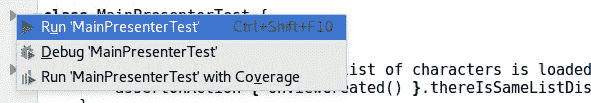

我们会发现它们没有通过：


原因是`MainPresenter`中的功能尚未实现。满足这个单元测试的最简单的代码如下：

```kt
package com.sample.marvelgallery.presenter 

import com.sample.marvelgallery.data.MarvelRepository 
import com.sample.marvelgallery.view.main.MainView 

class MainPresenter(val view: MainView, val repository: MarvelRepository) { 

   fun onViewCreated() { 
       loadCharacters() 
   } 

   fun onRefresh() { 
       loadCharacters() 
   } 

   private fun loadCharacters() { 
       repository.getAllCharacters() 
               .subscribe({ items -> 
                   view.show(items) 
               }) 
   } 
} 
```

现在我们的测试通过了：

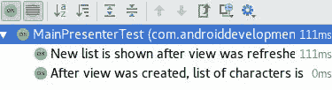

但是以下实现存在两个问题：

+   在 Android 中不起作用，因为`getAllCharacters`正在使用网络操作，而不能像这个例子中一样在主线程上运行

+   如果用户在加载完成之前离开应用程序，我们将会有内存泄漏

为了解决第一个问题，我们需要指定哪些操作应该在哪些线程上运行。网络请求应该在 I/O 线程上运行，我们应该在 Android 主线程上观察（因为我们在回调中改变了视图）：

```kt
repository.getAllCharacters() 
       .subscribeOn(Schedulers.io()) // 1 
       .observeOn(AndroidSchedulers.mainThread()) // 2 
       .subscribe({ items -> view.show(items) }) 
```

1.  我们指定网络请求应该在 IO 线程中运行。

1.  我们指定回调应该在主线程上启动。

虽然这些是常见的调度程序，但我们可以将它们提取到顶层扩展函数中：

```kt
// RxExt.kt 
package com.sample.marvelgallery.data 

import io.reactivex.Single 
import io.reactivex.android.schedulers.AndroidSchedulers 
import io.reactivex.schedulers.Schedulers 

fun <T> Single<T>.applySchedulers(): Single<T> = this 
       .subscribeOn(Schedulers.io()) 
       .observeOn(AndroidSchedulers.mainThread()) 

And use it in MainPresenter: 

repository.getAllCharacters() 
       .applySchedulers() 
       .subscribe({ items -> view.show(items) }) 
```

测试不允许访问 Android 主线程。因此，我们的测试将无法通过。此外，在单元测试中运行在新线程上的操作并不是我们想要的，因为我们会有问题断言同步。为了解决这些问题，我们需要在单元测试之前覆盖调度程序，使一切都在同一个线程上运行（将其添加到`MainPresenterTest`类中）：

```kt
package com.sample.marvelgallery 

import com.sample.marvelgallery.helpers.BaseMainView 
import com.sample.marvelgallery.helpers.BaseMarvelRepository 
import com.sample.marvelgallery.helpers.Example 
import com.sample.marvelgallery.model.MarvelCharacter 
import com.sample.marvelgallery.presenter.MainPresenter 
import io.reactivex.Single 
import io.reactivex.android.plugins.RxAndroidPlugins 
import io.reactivex.plugins.RxJavaPlugins 
import io.reactivex.schedulers.Schedulers 
import org.junit.Assert.assertEquals 
import org.junit.Assert.fail 
import org.junit.Before 
import org.junit.Test 

@Suppress("IllegalIdentifier") 

class MainPresenterTest { 

   @Before 
   fun setUp() { 
       RxAndroidPlugins.setInitMainThreadSchedulerHandler { 

           Schedulers.trampoline() } 
       RxJavaPlugins.setIoSchedulerHandler { Schedulers.trampoline() } 
       RxJavaPlugins.setComputationSchedulerHandler { 

           Schedulers.trampoline() } 
       RxJavaPlugins.setNewThreadSchedulerHandler { 

           Schedulers.trampoline() } 
   } 

   @Test 
   fun `After view was created, list of characters is loaded and 

        displayed`() { 
       assertOnAction { onViewCreated() }.thereIsSameListDisplayed() 
   } 

   @Test 
   fun `New list is shown after view was refreshed`() { 
       assertOnAction { onRefresh() }.thereIsSameListDisplayed() 
   } 
```

现在单元测试再次通过了：


另一个问题是，如果用户在我们收到服务器响应之前离开应用程序，会出现内存泄漏。一个常见的解决方案是将所有订阅保留在 composite 中，并在用户离开应用程序时将它们全部处理掉：

```kt
private var subscriptions = CompositeDisposable() 

fun onViewDestroyed() { 
   subscriptions.dispose() 
} 
```

在更大的应用程序中，大多数 Presenter 都有一些订阅。因此，收集订阅并在用户销毁视图时处理它们的功能可以被视为常见行为，并在`BasePresenter`中提取。此外，为了简化流程，我们可以创建一个`BaseActivityWithPresenter`类，它将在`Presenter`接口后面保存 Presenter，并在视图被销毁时调用`onViewDestroyed`方法。让我们在我们的应用程序中定义这个机制。以下是`Presenter`的定义：

```kt
package com.sample.marvelgallery.presenter 

interface Presenter { 
   fun onViewDestroyed() 
} 
```

以下是`BasePresenter`的定义：

```kt
package com.sample.marvelgallery.presenter 

import io.reactivex.disposables.CompositeDisposable 

abstract class BasePresenter : Presenter { 

   protected var subscriptions = CompositeDisposable() 

   override fun onViewDestroyed() { 
       subscriptions.dispose() 
   } 
} 
```

以下是`BaseActivityWithPresenter`的定义：

```kt
package com.sample.marvelgallery.view.common 

import android.support.v7.app.AppCompatActivity 
import com.sample.marvelgallery.presenter.Presenter 

abstract class BaseActivityWithPresenter : AppCompatActivity() { 

   abstract val presenter: Presenter 

   override fun onDestroy() { 
       super.onDestroy() 
       presenter.onViewDestroyed() 
   } 
} 
```

为了简化将新订阅添加到订阅中的定义，我们可以定义一个加法分配运算符：

```kt
// RxExt.ext 
package com.sample.marvelgallery.data 

import io.reactivex.Single 
import io.reactivex.android.schedulers.AndroidSchedulers 
import io.reactivex.disposables.CompositeDisposable 
import io.reactivex.disposables.Disposable 
import io.reactivex.schedulers.Schedulers 

fun <T> Single<T>.applySchedulers(): Single<T> = this 
       .subscribeOn(Schedulers.io()) 
       .observeOn(AndroidSchedulers.mainThread()) 

operator fun CompositeDisposable.plusAssign(disposable: Disposable) { 
   add(disposable) 
} 
```

我们可以使用这两种解决方案来使`MainPresenter`更安全：

```kt
package com.sample.marvelgallery.presenter 

import com.sample.marvelgallery.data.MarvelRepository 
import com.sample.marvelgallery.data.applySchedulers 
import com.sample.marvelgallery.data.plusAssign 
import com.sample.marvelgallery.view.main.MainView 

class MainPresenter( 
       val view: MainView, 
       val repository: MarvelRepository 
) : BasePresenter() { 

   fun onViewCreated() { 
       loadCharacters() 
   } 

   fun onRefresh() { 
       loadCharacters() 
   } 

   private fun loadCharacters() { 
       subscriptions += repository.getAllCharacters() 
               .applySchedulers() 
               .subscribe({ items -> 
                   view.show(items) 
               }) 
   } 
} 
```

前两个`MainPresenter`行为已经实现。现在是时候转向下一个--当 API 返回错误时，它会显示在视图上。我们可以将这个要求作为`MainPresenterTest`中的一个测试添加：

```kt
@Test 
fun `New list is shown after view was refreshed`() { 
   assertOnAction { onRefresh() }.thereIsSameListDisplayed() 
} 

@Test 
fun `When API returns error, it is displayed on view`() { 
   // Given 
   val someError = Error() 
   var errorDisplayed: Throwable? = null 
   val view = BaseMainView( 
           onShow = { _ -> fail() }, 
           onShowError = { errorDisplayed = it } 
   ) 
   val marvelRepository = BaseMarvelRepository 

   { Single.error(someError) } 
   val mainPresenter = MainPresenter(view, marvelRepository) 
   // When 
   mainPresenter.onViewCreated() 
   // Then 
   assertEquals(someError, errorDisplayed) 
} 

private fun assertOnAction(action: MainPresenter.() -> Unit) 
       = PresenterActionAssertion(action) 
```

使这个测试通过的一个简单的改变是在`MainPresenter`的订阅方法中指定错误处理程序：

```kt
subscriptions += repository.getAllCharacters() 
       .applySchedulers() 
       .subscribe({ items -> // onNext 
           view.show(items) 
       }, { // onError 
           view.showError(it) 
       }) 
```

虽然`subscribe`是 Java 方法，我们不能使用命名参数约定。这种调用并不真正描述性。这就是为什么我们将在`RxExt.kt`中定义一个名为`subscribeBy`的自定义订阅方法：

```kt
// Ext.kt

fun <T> Single<T>.applySchedulers(): Single<T> = this

       .subscribeOn(Schedulers.io())

       .observeOn(AndroidSchedulers.mainThread())

fun <T> Single<T>.subscribeBy(

       onError: ((Throwable) -> Unit)? = null,

       onSuccess: (T) -> Unit

): Disposable = subscribe(onSuccess, { onError?.invoke(it) })
```

我们将使用它而不是订阅：

```kt
subscriptions += repository.getAllCharacters()

       .applySchedulers()

       .subscribeBy(

               onSuccess = view::show,

               onError = view::showError

      )
```

`subscribeBy`的完整版本定义了不同的 RxJava 类型（如 Observable、Flowable 等），以及许多其他有用的 Kotlin 扩展到 RxJava，可以在**RxKotlin**库中找到（[`github.com/ReactiveX/RxKotlin`](https://github.com/ReactiveX/RxKotlin)）。

为了显示和隐藏列表加载，我们将定义额外的监听器来监听在处理之前和之后总是发生的事件：

```kt
subscriptions += repository.getAllCharacters()

       .applySchedulers()

       .doOnSubscribe { view.refresh = true },}

               onSuccess = view::show,

       .doFinally { view.refresh = false }

       .subscribeBy(

                     onSuccess = view::show,

                     onError = view::showError,

                onFinish = { view.refresh = false }

       )
```

测试又通过了：

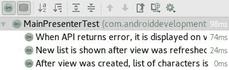

`subscribe`方法变得越来越难以阅读，但我们将解决这个问题，还有另一个业务规则，其定义如下--当 Presenter 等待响应时，会显示刷新。在`MainPresenterTest`中定义其单元测试：

```kt
package com.sample.marvelgallery 

import com.sample.marvelgallery.helpers.BaseMainView 
import com.sample.marvelgallery.helpers.BaseMarvelRepository 
import com.sample.marvelgallery.helpers.Example 
import com.sample.marvelgallery.model.MarvelCharacter 
import com.sample.marvelgallery.presenter.MainPresenter 
import io.reactivex.Single 
import io.reactivex.android.plugins.RxAndroidPlugins 
import io.reactivex.plugins.RxJavaPlugins 
import io.reactivex.schedulers.Schedulers 
import org.junit.Assert.* 
import org.junit.Before 
import org.junit.Test 

@Suppress("IllegalIdentifier") 

class MainPresenterTest { 

   @Test 
   fun `When presenter is waiting for response, refresh is displayed`()  

   { 
       // Given 
       val view = BaseMainView(refresh = false) 
       val marvelRepository = BaseMarvelRepository( 
               onGetCharacters = { 
                   Single.fromCallable { 
                       // Then 
                       assertTrue(view.refresh) // 1 
                       Example.exampleCharacterList 
                   } 
               } 
       ) 
       val mainPresenter = MainPresenter(view, marvelRepository) 
       view.onShow = { _ -> 
           // Then 
           assertTrue(view.refresh) // 1 
       } 
       // When 
       mainPresenter.onViewCreated() 
       // Then 
       assertFalse(view.refresh) // 1 
   } 
 } 
```

1.  我们期望在网络请求期间和显示元素时刷新显示，但在处理完成后不刷新。

我们期望在网络请求期间和显示元素时刷新显示，但在处理完成后不刷新。

在 RxJava2 的这个版本中，回调内的断言不会破坏测试，而是在执行报告中显示错误：

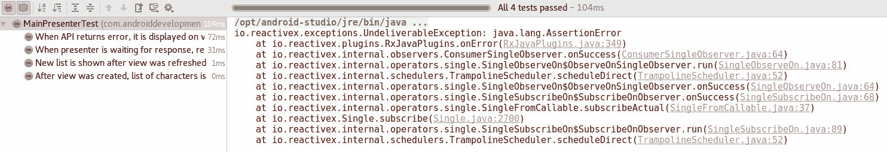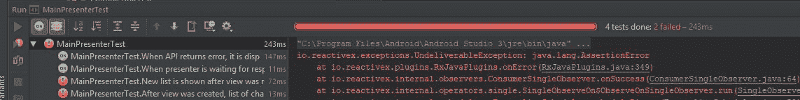

可能在未来的版本中，将可以添加一个处理程序，允许从回调内部使测试失败。

为了显示和隐藏列表加载，我们将定义额外的监听器来监听在处理之前和之后总是发生的事件：

```kt
subscriptions += repository.getAllCharacters()

       .applySchedulers()

       .doOnSubscribe { view.refresh = true }

       .doFinally { view.refresh = false }

       .subscribeBy(

                     onSuccess = view::show,

                     onError = view::showError

        )
```

在这些更改之后，所有测试又通过了：

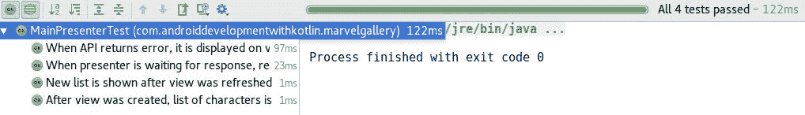

现在我们有一个完全功能的 Presenter、网络和视图。是时候把它们全部连接起来，完成第一个用例的实现了。

# 把它们放在一起

我们已经准备好在项目中使用`MainPresenter`。现在我们需要在`MainActivity`中使用它：

```kt
package com.sample.marvelgallery.view.main 

import android.os.Bundle 
import android.support.v7.widget.GridLayoutManager 
import android.view.Window 
import com.sample.marvelgallery.R 
import com.sample.marvelgallery.data.MarvelRepository 
import com.sample.marvelgallery.model.MarvelCharacter 
import com.sample.marvelgallery.presenter.MainPresenter 
import com.sample.marvelgallery.view.common.BaseActivityWithPresenter 
import com.sample.marvelgallery.view.common.bindToSwipeRefresh 
import com.sample.marvelgallery.view.common.toast 
import kotlinx.android.synthetic.main.activity_main.* 

class MainActivity : BaseActivityWithPresenter(), MainView { // 1 

   override var refresh by bindToSwipeRefresh(R.id.swipeRefreshView) 

   // 2 
   override val presenter by lazy 

   { MainPresenter(this, MarvelRepository.get()) } // 3 

   override fun onCreate(savedInstanceState: Bundle?) { 
       super.onCreate(savedInstanceState) 
       requestWindowFeature(Window.FEATURE_NO_TITLE) 
       setContentView(R.layout.activity_main) 
       recyclerView.layoutManager = GridLayoutManager(this, 2) 
       swipeRefreshView.setOnRefreshListener 

       { presenter.onRefresh() } // 4 
       presenter.onViewCreated() // 4 
   } 

   override fun show(items: List<MarvelCharacter>) { 
       val categoryItemAdapters = items.map(::CharacterItemAdapter) 
       recyclerView.adapter = MainListAdapter(categoryItemAdapters) 
   } 

   override fun showError(error: Throwable) { 
       toast("Error: ${error.message}") // 2 
       error.printStackTrace() 
   } 
} 
```

1.  Activity 应该扩展`BaseActivityWithPresenter`并实现`MainView`。

1.  `bindToSwipeRefresh`和`toast`还没有实现。

1.  我们使 Presenter 懒惰。第一个参数是指向`MainView`接口后面的活动的引用。

1.  我们需要使用它的方法将事件传递给 Presenter。

在前面的代码中，我们使用了两个已在书中描述的函数，`toast`用于在屏幕上显示提示，`bindToSwipeRefresh`用于绑定滑动刷新的可见性属性：

```kt
// ViewExt.kt 
package com.sample.marvelgallery.view.common 

import android.app.Activity 
import android.content.Context 
import android.support.annotation.IdRes 
import android.support.v4.widget.SwipeRefreshLayout 
import android.support.v7.widget.RecyclerView 
import android.view.View 
import android.widget.ImageView 
import android.widget.Toast 
import com.bumptech.glide.Glide 
import kotlin.properties.ReadWriteProperty 
import kotlin.reflect.KProperty 

fun <T : View> RecyclerView.ViewHolder.bindView(viewId: Int) 
       = lazy { itemView.findViewById<T>(viewId) } 

fun ImageView.loadImage(photoUrl: String) { 
   Glide.with(context) 
           .load(photoUrl) 
           .into(this) 
} 

fun Context.toast(text: String, length: Int = Toast.LENGTH_LONG) { 
   Toast.makeText(this, text, length).show() 
} 

fun Activity.bindToSwipeRefresh(@IdRes swipeRefreshLayoutId: Int): ReadWriteProperty<Any?, Boolean> 
       = SwipeRefreshBinding(lazy { findViewById<SwipeRefreshLayout>(swipeRefreshLayoutId) }) 

private class SwipeRefreshBinding(lazyViewProvider: Lazy<SwipeRefreshLayout>) : ReadWriteProperty<Any?, Boolean> { 

   val view by lazyViewProvider 

   override fun getValue(thisRef: Any?, 

   property: KProperty<*>): Boolean { 
       return view.isRefreshing 
   } 

   override fun setValue(thisRef: Any?, 

   property: KProperty<*>, value: Boolean) { 
       view.isRefreshing = value 
   } 
} 
```

现在我们的应用程序应该正确显示角色列表：

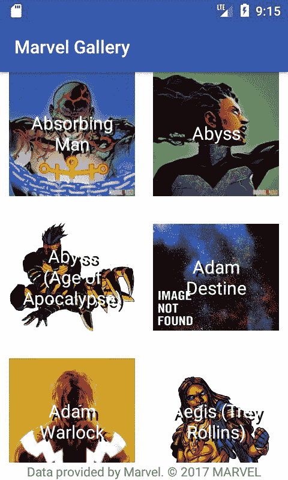

我们的第一个用例已经实现。我们可以继续下一个。

# 角色搜索

我们需要实现的另一个行为是角色搜索。以下是用例定义，启动应用程序后，用户可以通过角色名称搜索角色。

为了添加它，我们将在`activity_main`布局中添加`EditText`：

```kt
<?xml version="1.0" encoding="utf-8"?> 
<RelativeLayout  

   android:id="@+id/charactersView" 
   android:layout_width="match_parent" 
   android:layout_height="match_parent" 
   android:background="@android:color/white" 
   android:fitsSystemWindows="true"> 

<!-- Dummy item to prevent EditText from receiving 

     focus on initial load --> 
   <LinearLayout 
       android:layout_width="0px" 
       android:layout_height="0px" 
       android:focusable="true" 
       android:focusableInTouchMode="true" 
       tools:ignore="UselessLeaf" /> 

  <android.support.design.widget.TextInputLayout 
     android:id="@+id/searchViewLayout" 
     android:layout_width="match_parent" 
     android:layout_height="wrap_content" 
     android:layout_margin="@dimen/element_padding"> 

     <EditText 
         android:id="@+id/searchView" 
         android:layout_width="match_parent" 
         android:layout_height="wrap_content" 
         android:layout_centerHorizontal="true" 
         android:hint="@string/search_hint" /> 

  </android.support.design.widget.TextInputLayout> 

   <android.support.v4.widget.SwipeRefreshLayout  
       android:id="@+id/swipeRefreshView" 
       android:layout_width="match_parent" 
       android:layout_height="match_parent" 
       android:layout_below="@+id/searchViewLayout" 
       app:layout_behavior="@string/appbar_scrolling_view_behavior"> 

       <android.support.v7.widget.RecyclerView 
           android:id="@+id/recyclerView" 
           android:layout_width="match_parent" 
           android:layout_height="match_parent" 
           android:scrollbars="vertical" /> 

   </android.support.v4.widget.SwipeRefreshLayout> 

   <TextView 
       android:layout_width="match_parent" 
       android:layout_height="wrap_content" 
       android:layout_alignParentBottom="true" 
       android:background="@android:color/white" 
       android:gravity="center" 
       android:text="@string/marvel_copyright_notice" /> 
</RelativeLayout> 
```

我们需要添加**Android Support Design**库依赖，以允许使用`TextInputLayout`：

```kt
implementation "com.android.support:appcompat-v7:$android_support_version" 
implementation "com.android.support:design:$android_support_version" 
implementation "com.android.support:recyclerview-v7:$android_support_version" 
```

在`strings.xml`中定义了`search_hint`字符串：

```kt
<resources> 
   <string name="app_name">MarvelGallery</string> 
   <string name="search_hint">Search for character</string> 
   <string name="marvel_copyright_notice">

      Data provided by Marvel. © 2017 MARVEL

   </string> 
</resources> 
```

此外，为了在键盘打开时保持通知有关 Marvel 版权的标签，我们还需要在`AndroidManifest`中的`activity`定义中将`adjustResize`设置为`windowSoftInputMode`：

```kt
<activity 
   android:name="com.sample.marvelgallery.view.main.MainActivity" 
   android:windowSoftInputMode="adjustResize"> 
   <intent-filter> 
       <action android:name="android.intent.action.MAIN" /> 
       <category android:name="android.intent.category.LAUNCHER" /> 
   </intent-filter> 
</activity> 
```

我们应该看到以下预览：

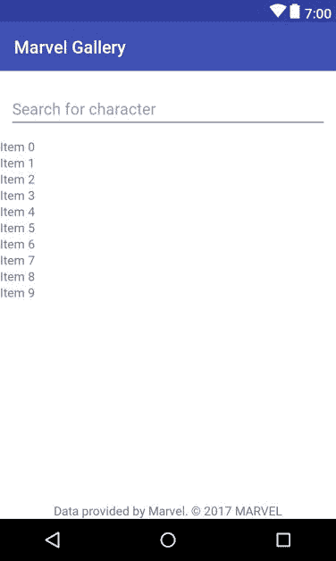

现在我们在`MainActivity`中添加了一个搜索字段：

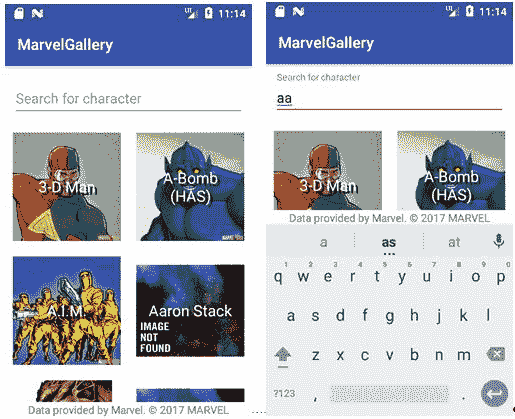

我们期望的行为是，每当用户更改搜索字段中的文本时，将加载新列表。我们需要在`MainPresenter`中添加一个新方法，用于通知 Presenter 文本已更改。我们将称之为`onSearchChanged`：

```kt
fun onRefresh() { 
   loadCharacters() 
} 

fun onSearchChanged(text: String) { 
   // TODO 
}

private fun loadCharacters() {

   subscriptions += repository.getAllCharacters()

           .applySchedulers()

           .doOnSubscribe { view.refresh = true }

           .doFinally { view.refresh = false }

           .subscribeBy(

               onSuccess = view::show,

               onError = view::showError

         )

   }

}
```

我们需要更改`MarvelRepository`的定义，以接受搜索查询作为`getAllCharacters`参数（记得也更新`BaseMarvelRepository`）：

```kt
interface MarvelRepository { 

   fun getAllCharacters(searchQuery: String?): 

   Single<List<MarvelCharacter>> 

   companion object : Provider<MarvelRepository>() { 
       override fun creator() = MarvelRepositoryImpl() 
   } 
} 
```

因此，我们必须更新实现：

```kt
class MarvelRepositoryImpl : MarvelRepository { 

   val api = retrofit.create(MarvelApi::class.java) 

   override fun getAllCharacters(searchQuery: String?): 

   Single<List<MarvelCharacter>> = api.getCharacters( 
           offset = 0, 
           searchQuery = searchQuery, 
           limit = elementsOnListLimit 
   ).map { it.data?.results.orEmpty().map(::MarvelCharacter) ?: 

    emptyList() } 

   companion object { 
       const val elementsOnListLimit = 50 
   } 
} 
```

我们还需要更新网络请求的定义：

```kt
interface MarvelApi { 

   @GET("characters") 
   fun getCharacters( 
           @Query("offset") offset: Int?, 
           @Query("nameStartsWith") searchQuery: String?, 
           @Query("limit") limit: Int? 
   ): Single<DataWrapper<List<CharacterMarvelDto>>> 
} 
```

为了允许代码编译，我们需要在`MainPresenter`中提供`null`作为`getAllCharacters`参数：

```kt
private fun loadCharacters() {

   subscriptions += repository.getAllCharacters(null)

           .applySchedulers()

           .doOnSubscribe { view.refresh = true }

           .doFinally { view.refresh = false }

           .subscribeBy(

                       onSuccess = view::show,

                       onError = view::showError

         )

   }

}
```

我们需要更新`BaseMarvelRepository`：

```kt
package com.sample.marvelgallery.helpers 

import com.sample.marvelgallery.data.MarvelRepository 
import com.sample.marvelgallery.model.MarvelCharacter 
import io.reactivex.Single 

class BaseMarvelRepository( 
       val onGetCharacters: (String?) -> Single<List<MarvelCharacter>> 
) : MarvelRepository { 

   override fun getAllCharacters(searchQuery: String?) 
           = onGetCharacters(searchQuery) 
} 
```

现在我们的网络实现返回一个从查询开始的角色列表，或者如果我们没有指定任何查询，则返回一个填充列表。是时候实现 Presenter 了。让我们定义以下测试：

```kt
@file:Suppress("IllegalIdentifier") 

package com.sample.marvelgallery 

import com.sample.marvelgallery.helpers.BaseMainView 
import com.sample.marvelgallery.helpers.BaseMarvelRepository 
import com.sample.marvelgallery.presenter.MainPresenter 
import io.reactivex.Single 
import org.junit.Assert.* 
import org.junit.Test 

class MainPresenterSearchTest { 

   @Test 
   fun `When view is created, then search query is null`() { 
       assertOnAction { onViewCreated() } searchQueryIsEqualTo null 
   } 

   @Test 
   fun `When text is changed, then we are searching for new query`() { 
       for (text in listOf("KKO", "HJ HJ", "And so what?")) 
           assertOnAction { onSearchChanged(text) } 

           searchQueryIsEqualTo text 
   } 

   private fun assertOnAction(action: MainPresenter.() -> Unit)  
         = PresenterActionAssertion(action) 

   private class PresenterActionAssertion(val actionOnPresenter: 

       MainPresenter.() -> Unit) { 

       infix fun searchQueryIsEqualTo(expectedQuery: String?) { 
           var checkApplied = false 
           val view = BaseMainView(onShowError = { fail() }) 
           val marvelRepository = BaseMarvelRepository { searchQuery -> 
               assertEquals(expectedQuery, searchQuery) 
               checkApplied = true 
               Single.never() 
           } 
           val mainPresenter = MainPresenter(view, marvelRepository) 
           mainPresenter.actionOnPresenter() 
           assertTrue(checkApplied) 
       } 
   } 
} 
```

为了使以下测试通过，我们需要将搜索查询作为`MainPresenter`的`loadCharacters`方法的参数添加默认参数：

```kt
fun onSearchChanged(text: String) { 
   loadCharacters(text) 
} 

private fun loadCharacters(searchQuery: String? = null) {

   subscriptions += repository.getAllCharacters(searchQuery)

           .applySchedulers()

           .doOnSubscribe { view.refresh = true }

           .doFinally { view.refresh = false }

           .subscribeBy(

                       onSuccess = view::show,

                       onError = view::showError

         )

   }

}
```

但棘手的部分是 Marvel API 不允许将空格作为搜索查询。应该发送一个`null`。因此，如果用户删除最后一个字符，或者尝试在搜索字段中只放置空格，那么应用程序将崩溃。我们应该防止这种情况发生。这是一个测试，检查 Presenter 是否将只有空格的查询更改为`null`：

```kt
@Test 
fun `When text is changed, then we are searching for new query`() { 
   for (text in listOf("KKO", "HJ HJ", "And so what?")) 
       assertOnAction { onSearchChanged(text) } 

       searchQueryIsEqualTo text 
} 

@Test 
fun `For blank text, there is request with null query`() { 
   for (emptyText in listOf("", "   ", "       ")) 
       assertOnAction { onSearchChanged(emptyText) } 

       searchQueryIsEqualTo null 
} 

private fun assertOnAction(action: MainPresenter.() -> Unit)  
      = PresenterActionAssertion(action) 

We can implement a security mechanism in the loadCharacters method: 

private fun loadCharacters(searchQuery: String? = null) { 
   val qualifiedSearchQuery = if (searchQuery.isNullOrBlank()) null 

                              else searchQuery 
   subscriptions += repository 
           .getAllCharacters(qualifiedSearchQuery) 
           .applySchedulers() 
           .smartSubscribe( 
                   onStart = { view.refresh = true }, 
                   onSuccess = view::show, 
                   onError = view::showError, 
                   onFinish = { view.refresh = false } 
           ) 
} 
```

现在所有的测试都通过了：

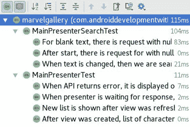

我们仍然需要实现一个`Activity`功能，当文本发生变化时将调用 Presenter。我们将使用第七章中定义的可选回调类来实现：

```kt
// TextChangedListener.kt 
package com.sample.marvelgallery.view.common 

import android.text.Editable 
import android.text.TextWatcher 
import android.widget.TextView 

fun TextView.addOnTextChangedListener(config: TextWatcherConfiguration.() -> Unit) { 
   addTextChangedListener(TextWatcherConfiguration().apply { config() }
   addTextChangedListener(textWatcher) 
} 

class TextWatcherConfiguration : TextWatcher { 

   private var beforeTextChangedCallback: 

   (BeforeTextChangedFunction)? = null 
   private var onTextChangedCallback: 

   (OnTextChangedFunction)? = null 
   private var afterTextChangedCallback: 

   (AfterTextChangedFunction)? = null 

   fun beforeTextChanged(callback: BeforeTextChangedFunction) { 
       beforeTextChangedCallback = callback 
   } 

   fun onTextChanged(callback: OnTextChangedFunction) { 
       onTextChangedCallback = callback 
   } 

   fun afterTextChanged(callback: AfterTextChangedFunction) { 
       afterTextChangedCallback = callback 
   } 

   override fun beforeTextChanged(s: CharSequence, 

   start: Int, count: Int, after: Int) { 
       beforeTextChangedCallback?.invoke(s.toString(), 

       start, count, after) 
   } 

   override fun onTextChanged(s: CharSequence, start: Int, 

   before: Int, count: Int) { 
       onTextChangedCallback?.invoke(s.toString(), 

       start, before, count) 
   } 

   override fun afterTextChanged(s: Editable) { 
       afterTextChangedCallback?.invoke(s) 
   } 
} 

private typealias BeforeTextChangedFunction = 

  (text: String, start: Int, count: Int, after: Int) -> Unit 
private typealias OnTextChangedFunction = 

  (text: String, start: Int, before: Int, count: Int) -> Unit 
private typealias AfterTextChangedFunction = 

  (s: Editable) -> Unit 
```

并在`MainActivity`的`onCreate`方法中使用它：

```kt
package com.sample.marvelgallery.view.main 

import android.os.Bundle 
import android.support.v7.widget.GridLayoutManager 
import android.view.Window 
import com.sample.marvelgallery.R 
import com.sample.marvelgallery.data.MarvelRepository 
import com.sample.marvelgallery.model.MarvelCharacter 
import com.sample.marvelgallery.presenter.MainPresenter 
import com.sample.marvelgallery.view.common.BaseActivityWithPresenter 
import com.sample.marvelgallery.view.common.addOnTextChangedListener 
import com.sample.marvelgallery.view.common.bindToSwipeRefresh 
import com.sample.marvelgallery.view.common.toast 
import kotlinx.android.synthetic.main.activity_main.* 

class MainActivity : BaseActivityWithPresenter(), MainView { 

   override var refresh by bindToSwipeRefresh(R.id.swipeRefreshView) 
   override val presenter by lazy 

     { MainPresenter(this, MarvelRepository.get()) } 

   override fun onCreate(savedInstanceState: Bundle?) { 
       super.onCreate(savedInstanceState) 
       requestWindowFeature(Window.FEATURE_NO_TITLE) 
       setContentView(R.layout.activity_main) 
       recyclerView.layoutManager = GridLayoutManager(this, 2) 
       swipeRefreshView.setOnRefreshListener { presenter.onRefresh() } 
       searchView.addOnTextChangedListener { 
           onTextChanged { text, _, _, _ -> 
               presenter.onSearchChanged(text) 
           } 
       } 
       presenter.onViewCreated() 
   } 

   override fun show(items: List<MarvelCharacter>) { 
       val categoryItemAdapters = items.map(::CharacterItemAdapter) 
       recyclerView.adapter = MainListAdapter(categoryItemAdapters) 
   } 

   override fun showError(error: Throwable) { 
       toast("Error: ${error.message}") 
       error.printStackTrace() 
   } 
} 
```

这就是我们需要定义角色搜索功能的全部内容。现在我们可以构建应用程序并使用它来查找我们喜欢的角色：

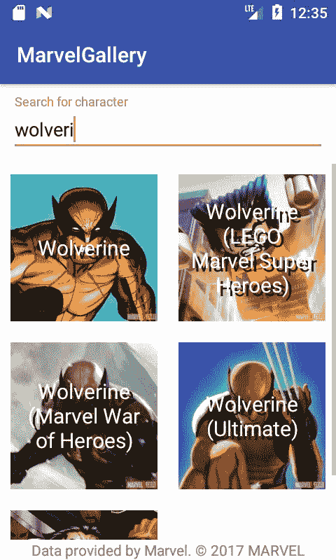

有了一个正确工作的应用程序，我们可以继续下一个用例。

# 角色概要显示

仅仅通过角色搜索是不够的。为了使应用程序功能正常，我们应该添加角色描述显示。这是我们定义的用例--当用户点击某个角色图片时，会显示一个概要。角色概要包含角色名称、照片、描述和出现次数。

要实现这个用例，我们需要创建一个新的活动和布局，来定义这个`Activity`的外观。为此，在`com.sample.marvelgallery.view.character`包中创建一个名为`CharacterProfileActivity`的新 Activity：

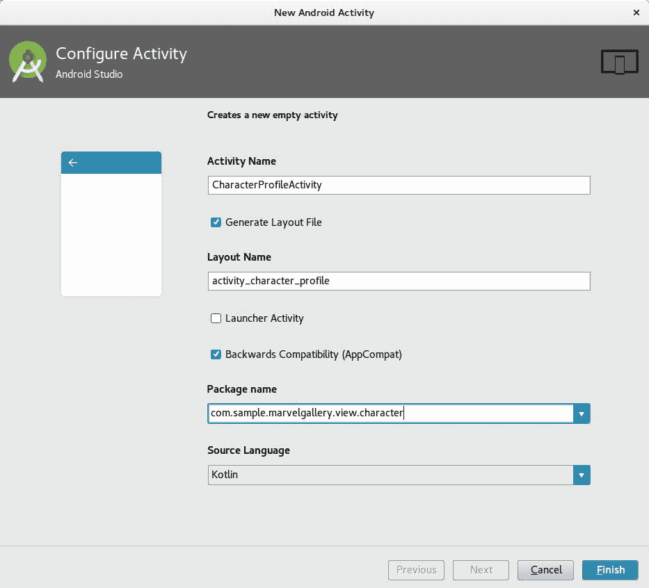

我们将从布局更改（在`activity_character_profile.xml`中）开始实现它。这是我们想要实现的最终结果：


基本元素是`CoordinatorLayout`，其中`AppBar`和`CollapsingToolbarLayout`都用于实现材料设计中的折叠效果：


逐步实现折叠效果。

我们还需要用于描述和出现次数的`TextView`，这些将在下一个用例中填充数据。这是完整的`activity_character_profile`布局定义：

```kt
<?xml version="1.0" encoding="utf-8"?> 
<android.support.design.widget.CoordinatorLayout  

   android:id="@+id/character_detail_layout" 
   android:layout_width="match_parent" 
   android:layout_height="match_parent" 
   android:background="@android:color/white"> 

   <android.support.design.widget.AppBarLayout 
       android:id="@+id/appBarLayout" 
       android:layout_width="match_parent" 
       android:layout_height="wrap_content" 
       android:theme="@style/ThemeOverlay.AppCompat.ActionBar"> 

       <android.support.design.widget.CollapsingToolbarLayout 
           android:id="@+id/toolbarLayout" 
           android:layout_width="match_parent" 
           android:layout_height="match_parent" 
           app:contentScrim="?attr/colorPrimary" 
           app:expandedTitleTextAppearance="@style/ItemTitleName" 
           app:layout_scrollFlags="scroll|exitUntilCollapsed"> 

           <android.support.v7.widget.AppCompatImageView 
               android:id="@+id/headerView" 
               android:layout_width="match_parent" 
               android:layout_height="@dimen/character_header_height" 
               android:background="@color/colorPrimaryDark" 
               app:layout_collapseMode="parallax" /> 

           <android.support.v7.widget.Toolbar 
               android:id="@+id/toolbar" 
               android:layout_width="match_parent" 
               android:layout_height="?attr/actionBarSize" 
               android:background="@android:color/transparent" 
               app:layout_collapseMode="pin" 
               app:popupTheme="@style/ThemeOverlay.AppCompat.Light" /> 

       </android.support.design.widget.CollapsingToolbarLayout> 
   </android.support.design.widget.AppBarLayout> 

   <android.support.v4.widget.NestedScrollView 
       android:layout_width="match_parent" 
       android:layout_height="match_parent" 
       android:overScrollMode="never" 
       app:layout_behavior="@string/appbar_scrolling_view_behavior"> 

       <LinearLayout 
           android:id="@+id/details_content_frame" 
           android:layout_width="match_parent" 
           android:layout_height="match_parent" 
           android:focusableInTouchMode="true" 
           android:orientation="vertical"> 

           <TextView 
               android:id="@+id/descriptionView" 
               android:layout_width="match_parent" 
               android:layout_height="wrap_content" 
               android:gravity="center" 
               android:padding="@dimen/character_description_padding" 
               android:textSize="@dimen/standard_text_size" 
               tools:text="This is some long text that will be visible as an character description." /> 

           <TextView 
               android:id="@+id/occurrencesView" 
               android:layout_width="match_parent" 
               android:layout_height="wrap_content" 
               android:padding="@dimen/character_description_padding" 
               android:textSize="@dimen/standard_text_size" 
               tools:text="He was in following comics:\n* KOKOKO \n* KOKOKO \n* KOKOKO \n* KOKOKO \n* KOKOKO \n* KOKOKO \n* KOKOKO \n* KOKOKO \n* KOKOKO \n* KOKOKO \n* KOKOKO " /> 
       </LinearLayout> 

   </android.support.v4.widget.NestedScrollView> 

   <TextView 
       android:layout_width="match_parent" 
       android:layout_height="wrap_content" 
       android:layout_gravity="bottom" 
       android:background="@android:color/white" 
       android:gravity="bottom|center" 
       android:text="@string/marvel_copyright_notice" /> 

   <ProgressBar 
       android:id="@+id/progressView" 
       style="?android:attr/progressBarStyleLarge" 
       android:layout_width="wrap_content" 
       android:layout_height="wrap_content" 
       android:layout_gravity="center" 
       android:visibility="gone" /> 

</android.support.design.widget.CoordinatorLayout> 
```

我们还需要在`styles.xml`中添加以下样式：

```kt
<resources> 

   <!-- Base application theme. --> 
   <style name="AppTheme" 

          parent="Theme.AppCompat.Light.DarkActionBar"> 
       <!-- Customize your theme here. --> 
       <item name="colorPrimary">@color/colorPrimary</item> 
       <item name="colorPrimaryDark">@color/colorPrimaryDark</item> 
       <item name="colorAccent">@color/colorAccent</item> 
   </style> 
   <style name="AppFullScreenTheme" 

          parent="Theme.AppCompat.Light.NoActionBar"> 
       <item name="android:windowNoTitle">true</item> 
       <item name="android:windowActionBar">false</item> 
       <item name="android:windowFullscreen">true</item> 
       <item name="android:windowContentOverlay">@null</item> 
   </style> 

   <style name="ItemTitleName" 

          parent="TextAppearance.AppCompat.Headline"> 
       <item name="android:textColor">@android:color/white</item> 
       <item name="android:shadowColor">@color/colorPrimaryDark</item> 
       <item name="android:shadowRadius">3.0</item> 
   </style> 

   <style name="ItemDetailTitle" 

          parent="@style/TextAppearance.AppCompat.Small"> 
       <item name="android:textColor">@color/colorAccent</item> 
   </style> 

</resources> 
```

我们需要在`AndroidManifest`中将`AppFullScreenTheme`定义为`CharacterProfileActivity`的主题：

```kt
<activity android:name=".view.CharacterProfileActivity" 
   android:theme="@style/AppFullScreenTheme" /> 
```

这是定义的布局的预览：

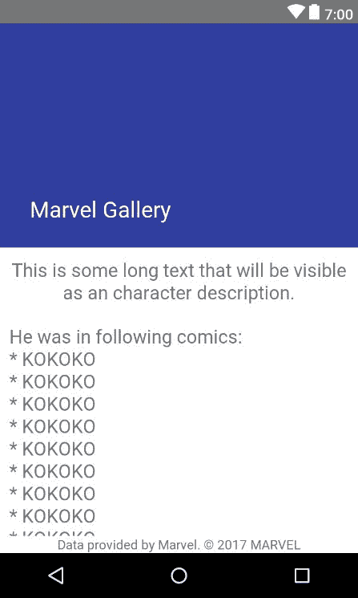

这个视图将用于显示有关角色的数据，但首先我们需要从`MainActivity`中打开它。我们需要在`CharacterItemAdapter`中设置`onClickListener`，它调用构造函数提供的`clicked`回调：

```kt
package com.sample.marvelgallery.view.main 

import android.support.v7.widget.RecyclerView 
import android.view.View 
import android.widget.ImageView 
import android.widget.TextView 
import com.sample.marvelgallery.R 
import com.sample.marvelgallery.model.MarvelCharacter 
import com.sample.marvelgallery.view.common.ItemAdapter 
import com.sample.marvelgallery.view.common.bindView 
import com.sample.marvelgallery.view.common.loadImage 

class CharacterItemAdapter( 
       val character: MarvelCharacter, 
       val clicked: (MarvelCharacter) -> Unit 
) : ItemAdapter<CharacterItemAdapter.ViewHolder>(R.layout.item_character) { 

   override fun onCreateViewHolder(itemView: View) = 

   ViewHolder(itemView) 

   override fun ViewHolder.onBindViewHolder() { 
       textView.text = character.name 
       imageView.loadImage(character.imageUrl) 
       itemView.setOnClickListener { clicked(character) } 
   } 

   class ViewHolder(itemView: View) : 

   RecyclerView.ViewHolder(itemView) { 
       val textView by bindView<TextView>(R.id.textView) 
       val imageView by bindView<ImageView>(R.id.imageView) 
   } 
} 
```

我们需要更新`MainActivity`：

```kt
package com.sample.marvelgallery.view.main 

import android.os.Bundle 
import android.support.v7.widget.GridLayoutManager 
import android.view.Window 
import com.sample.marvelgallery.R 
import com.sample.marvelgallery.data.MarvelRepository 
import com.sample.marvelgallery.model.MarvelCharacter 
import com.sample.marvelgallery.presenter.MainPresenter 
import com.sample.marvelgallery.view.character.CharacterProfileActivity 
import com.sample.marvelgallery.view.common.BaseActivityWithPresenter 
import com.sample.marvelgallery.view.common.addOnTextChangedListener 
import com.sample.marvelgallery.view.common.bindToSwipeRefresh 
import com.sample.marvelgallery.view.common.toast 
import kotlinx.android.synthetic.main.activity_main.* 

class MainActivity : BaseActivityWithPresenter(), MainView { 

   override var refresh by bindToSwipeRefresh(R.id.swipeRefreshView) 
   override val presenter by lazy

   { MainPresenter(this, MarvelRepository.get()) } 

   override fun onCreate(savedInstanceState: Bundle?) { 
       super.onCreate(savedInstanceState) 
       requestWindowFeature(Window.FEATURE_NO_TITLE) 
       setContentView(R.layout.activity_main) 
       recyclerView.layoutManager = GridLayoutManager(this, 2) 
       swipeRefreshView.setOnRefreshListener { presenter.onRefresh() } 
       searchView.addOnTextChangedListener { 
           onTextChanged { text, _, _, _ -> 
               presenter.onSearchChanged(text) 
           } 
       } 
       presenter.onViewCreated() 
   } 

   override fun show(items: List<MarvelCharacter>) { 
       val categoryItemAdapters = 

       items.map(this::createCategoryItemAdapter) 
       recyclerView.adapter = MainListAdapter(categoryItemAdapters) 
   } 

   override fun showError(error: Throwable) { 
       toast("Error: ${error.message}") 
       error.printStackTrace() 
   } 

   private fun createCategoryItemAdapter(character: MarvelCharacter) 
           = CharacterItemAdapter(character, 

             { showHeroProfile(character) }) 

   private fun showHeroProfile(character: MarvelCharacter) { 
       CharacterProfileActivity.start(this, character) 
   } 
} 
```

在前面的实现中，我们使用了`CharacterProfileActivity`伴生对象中的一个方法来启动`CharacterProfileActivity`。我们需要将`MarvelCharacter`对象传递给这个方法。传递`MarvelCharacter`对象的最有效方式是将其作为*parcelable*传递。为了允许这样做，`MarvelCharacter`必须实现`Parcelable`接口。这就是为什么一个有用的解决方案是使用一些注解处理库，如**Parceler**，**PaperParcel**或**Smuggler**，来生成必要的元素。我们将使用项目中已经存在的 Kotlin Android 扩展解决方案。在书籍出版时，它仍然是实验性的，因此需要在`build.gradle`模块中添加以下定义：

```kt
androidExtensions {

   experimental = true

}
```

我们需要在类之前添加`Parcelize`注解，并且需要使这个类实现`Parcelable`。我们还需要添加错误抑制，以隐藏默认的 Android 警告：

```kt
package com.sample.marvelgallery.model 

import android.annotation.SuppressLint 
import android.os.Parcelable 
import com.sample.marvelgallery.data.network.dto.CharacterMarvelDto 

import kotlinx.android.parcel.Parcelize

@SuppressLint("ParcelCreator")

@Parcelize

   constructor(dto: CharacterMarvelDto) : this( 
           name = dto.name, 
           imageUrl = dto.imageUrl 
   )
} 
```

现在我们可以实现`start`函数和`character`字段，它将使用属性委托从 Intent 中获取参数值：

```kt
package com.sample.marvelgallery.view.character 

import android.content.Context 
import android.support.v7.app.AppCompatActivity 
import android.os.Bundle 
import android.view.MenuItem 
import com.sample.marvelgallery.R 
import com.sample.marvelgallery.model.MarvelCharacter 
import com.sample.marvelgallery.view.common.extra 
import com.sample.marvelgallery.view.common.getIntent 
import com.sample.marvelgallery.view.common.loadImage 
import kotlinx.android.synthetic.main.activity_character_profile.* 

class CharacterProfileActivity : AppCompatActivity() { 

   val character: MarvelCharacter by extra(CHARACTER_ARG) // 1 

   override fun onCreate(savedInstanceState: Bundle?) { 
       super.onCreate(savedInstanceState) 
       setContentView(R.layout.activity_character_profile) 
       setUpToolbar() 
       supportActionBar?.title = character.name 
       headerView.loadImage(character.imageUrl, centerCropped = true) // 1 
   } 

   override fun onOptionsItemSelected(item: MenuItem): Boolean = when { 
       item.itemId == android.R.id.home -> onBackPressed().let { true } 
       else -> super.onOptionsItemSelected(item) 
   } 

   private fun setUpToolbar() { 
       setSupportActionBar(toolbar) 
       supportActionBar?.setDisplayHomeAsUpEnabled(true) 
   } 

   companion object { 

       private const val CHARACTER_ARG = "com.sample.marvelgallery.view.character.CharacterProfileActivity.CharacterArgKey" 

       fun start(context: Context, character: MarvelCharacter) { 
           val intent = context 
                   .getIntent<CharacterProfileActivity>() // 1 
                   .apply { putExtra(CHARACTER_ARG, character) } 
           context.startActivity(intent) 
       } 
   } 
} 
```

1.  `extra`和`getIntent`扩展函数已经在书中介绍过，但在项目中尚未实现。此外，`loadImage`将显示错误，因为它需要更改。

我们需要更新`loadImage`，并将`extra`和`getIntent`定义为顶级函数：

```kt
// ViewExt.kt 
package com.sample.marvelgallery.view.common 

import android.app.Activity 
import android.content.Context 
import android.content.Intent 
import android.os.Parcelable 
import android.support.annotation.IdRes 
import android.support.v4.widget.SwipeRefreshLayout 
import android.widget.ImageView 
import android.widget.Toast 
import com.bumptech.glide.Glide 
import kotlin.properties.ReadWriteProperty 
import kotlin.reflect.KProperty 
import android.support.v7.widget.RecyclerView 
import android.view.View 

fun <T : View> RecyclerView.ViewHolder.bindView(viewId: Int)  
      = lazy { itemView.findViewById<T>(viewId) } 

fun ImageView.loadImage(photoUrl: String, centerCropped: Boolean = false) { 
   Glide.with(context) 
           .load(photoUrl) 
           .apply { if (centerCropped) centerCrop() } 
           .into(this) 
} 

fun <T : Parcelable> Activity.extra(key: String, default: T? = null): Lazy<T>  
      = lazy { intent?.extras?.getParcelable<T>(key) ?: default ?: throw Error("No value $key in extras") } 

inline fun <reified T : Activity> Context.getIntent() = Intent(this, T::class.java) 

// ...
```

我们可以使用一些库来生成这些方法，而不是定义启动 Activity 的函数。例如，我们可以使用`ActivityStarter`库。这就是`CharacterProfileActivity`将会是什么样子：

```kt
class CharacterProfileActivity : AppCompatActivity() { 

   @get:Arg val character: MarvelCharacter by argExtra() 

   override fun onCreate(savedInstanceState: Bundle?) { 
       super.onCreate(savedInstanceState) 
       setContentView(R.layout.activity_character_profile) 
       setUpToolbar() 
       supportActionBar?.title = character.name 
       headerView.loadImage(character.imageUrl, centerCropped = true) // 1 
   } 

   override fun onOptionsItemSelected(item: MenuItem): Boolean = when { 
       item.itemId == android.R.id.home -> onBackPressed().let { true } 
       else -> super.onOptionsItemSelected(item) 
   } 

   private fun setUpToolbar() { 
       setSupportActionBar(toolbar) 
       supportActionBar?.setDisplayHomeAsUpEnabled(true) 
   } 
} 
```

我们应该启动它或使用生成的类`CharacterProfileActivityStarter`的静态方法获取其 Intent：

```kt
CharacterProfileActivityStarter.start(context, character) 
val intent = CharacterProfileActivityStarter.getIntent(context, character) 
```

为了允许它，我们需要在模块`build.gradle`中使用**kapt**插件（用于支持 Kotlin 中的注解处理）：

```kt
apply plugin: 'kotlin-kapt' 
```

在`build.gradle`模块中的`ActivityStarter`依赖项：

```kt
implementation 'com.github.marcinmoskala.activitystarter:activitystarter:1.00' 
implementation 'com.github.marcinmoskala.activitystarter:activitystarter-kotlin:1.00' 
kapt 'com.github.marcinmoskala.activitystarter:activitystarter-compiler:1.00' 
```

经过这些更改，当我们点击`MainActivity`中的角色时，`CharacterProfileActivity`将会启动：

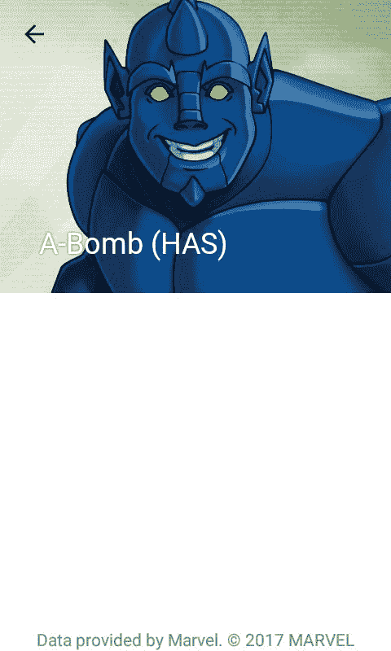

我们正在显示名称并展示角色照片。下一步是显示描述和事件列表。所需的数据可以在 Marvel API 中找到，我们只需要扩展 DTO 模型来获取它们。我们需要添加`ListWrapper`来保存列表：

```kt
package com.sample.marvelgallery.data.network.dto 

class ListWrapper<T> { 
   var items: List<T> = listOf() 
} 
```

我们需要定义`ComicDto`，其中包含有关事件发生的数据：

```kt
package com.sample.marvelgallery.data.network.dto 

class ComicDto { 
   lateinit var name: String 
} 
```

我们需要更新`CharacterMarvelDto`：

```kt
package com.sample.marvelgallery.data.network.dto 

class CharacterMarvelDto { 

   lateinit var name: String 
   lateinit var description: String 
   lateinit var thumbnail: ImageDto 
   var comics: ListWrapper<ComicDto> = ListWrapper() 
   var series: ListWrapper<ComicDto> = ListWrapper() 
   var stories: ListWrapper<ComicDto> = ListWrapper() 
   var events: ListWrapper<ComicDto> = ListWrapper() 

   val imageUrl: String 
       get() = thumbnail.completeImagePath 
} 
```

现在从 API 中读取数据并保存在 DTO 对象中，但为了在项目中使用它们，我们还需要更改`MarvelCharacter`类的定义，并添加一个新的构造函数：

```kt
@SuppressLint("ParcelCreator")

@Parcelize

class MarvelCharacter( 
       val name: String, 
       val imageUrl: String, 
       val description: String, 
       val comics: List<String>, 
       val series: List<String>, 
       val stories: List<String>, 
       val events: List<String> 
) : Parcelable { 

   constructor(dto: CharacterMarvelDto) : this( 
           name = dto.name, 
           imageUrl = dto.imageUrl, 
           description = dto.description, 
           comics = dto.comics.items.map { it.name }, 
           series = dto.series.items.map { it.name }, 
           stories = dto.stories.items.map { it.name }, 
           events = dto.events.items.map { it.name } 
   ) 
} 
```

现在我们可以更新`CharacterProfileActivity`来显示描述和事件列表：

```kt
class CharacterProfileActivity : AppCompatActivity() { 

   val character: MarvelCharacter by extra(CHARACTER_ARG) 
   override fun onCreate(savedInstanceState: Bundle?) { 
       super.onCreate(savedInstanceState) 
       setContentView(R.layout.activity_character_profile) 
       setUpToolbar() 
       supportActionBar?.title = character.name 
       descriptionView.text = character.description 
       occurrencesView.text = makeOccurrencesText() // 1 
       headerView.loadImage(character.imageUrl, centerCropped = true) 
   } 

   override fun onOptionsItemSelected(item: MenuItem): Boolean = when { 
       item.itemId == android.R.id.home -> onBackPressed().let { true } 
       else -> super.onOptionsItemSelected(item) 
   } 

   private fun setUpToolbar() { 
       setSupportActionBar(toolbar) 
       supportActionBar?.setDisplayHomeAsUpEnabled(true) 
   } 

   private fun makeOccurrencesText(): String = "" // 1, 2 
           .addList(R.string.occurrences_comics_list_introduction, character.comics) 
           .addList(R.string.occurrences_series_list_introduction, character.series) 
           .addList(R.string.occurrences_stories_list_introduction, character.stories) 
           .addList(R.string.occurrences_events_list_introduction, character.events) 

   private fun String.addList(introductionTextId: Int, list: List<String>): String { // 3 
       if (list.isEmpty()) return this 
       val introductionText = getString(introductionTextId) 
       val listText = list.joinToString(transform = 

           { " $bullet $it" }, separator = "\n") 
       return this + "$introductionText\n$listText\n\n" 
   } 

   companion object { 
       private const val bullet = '\u2022' // 4 
       private const val CHARACTER_ARG = "com.naxtlevelofandroiddevelopment.marvelgallery.presentation.heroprofile.CharacterArgKey" 

       fun start(context: Context, character: MarvelCharacter) { 
           val intent = context 
                   .getIntent<CharacterProfileActivity>() 
                   .apply { putExtra(CHARACTER_ARG, character) } 
           context.startActivity(intent) 
       } 
   } 
}
```

1.  出现列表的组合是一个相当复杂的任务，因此我们将其提取到函数`makeOccurrencesText`中。在那里，对于每种出现类型（漫画、系列等），我们希望在有这种类型的出现时显示介绍文本和列表。我们还希望在每个项目前加上一个项目符号。

1.  `makeOccurrencesText`是一个单表达式函数，它使用`addList`来将初始空字符串附加上我们想要显示的下一个列表。

1.  `addList`是一个成员扩展函数。如果提供的列表为空，则返回一个未更改的字符串，或者返回一个附加了介绍文本和带有项目列表的字符串。

1.  这是用作列表项目符号的角色。

我们还需要在`strings.xml`中定义字符串：

```kt
<resources> 
   <string name="app_name">Marvel Gallery</string> 
   <string name="marvel_copyright_notice">

       Data provided by Marvel. © 2017 MARVEL</string> 
   <string name="search_hint">Search for character</string> 
   <string name="occurrences_comics_list_introduction">Comics:</string> 
   <string name="occurrences_series_list_introduction">Series:</string> 
   <string name="occurrences_stories_list_introduction">Stories:</string> 
   <string name="occurrences_events_list_introduction">Events:</string> 
</resources> 
```

现在我们可以看到整个角色资料--角色名称、图片、描述以及在漫画、系列、事件和故事中的出现列表：

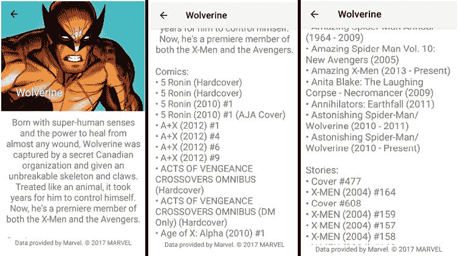

# 摘要

应用程序已经完成，但仍然可以添加许多功能。在这个应用程序中，我们看到了 Kotlin 如何简化 Android 开发的一些示例。但仍然有很多解决方案等待发现。Kotlin 简化了 Android 开发的任何层次--从常见操作，如监听器设置或视图元素引用，到高级功能，如函数式编程或集合处理。

这本书无法涵盖关于 Kotlin 的 Android 开发的所有内容。它旨在展示足够的内容，以便每个人都可以开始自己的冒险，拥有充满想法和功能理解的行囊。下一步是打开 Android Studio，创建自己的项目，并开始享受 Kotlin 带来的乐趣。大冒险就在你面前。
