# 第二部分。模块 2

> ***Android 游戏编程实例***
> 
> *通过构建三个沉浸式和引人入胜的游戏来利用 Android SDK 的力量*

# 第一章。玩家 1 UP

旧式街机和弹球机使用的术语“1 UP”是对玩家的一种通知，告诉他们现在正在玩游戏（上升）。它也被用来表示获得额外生命。你准备好构建三个伟大的游戏了吗？

我们将一起构建三个酷炫的游戏。这本书展示了这三个游戏的每一行代码；你永远不需要参考代码文件来了解发生了什么。此外，构建所有三个游戏所需的整个文件集包含在可以从 Packt 网站书籍页面获取的下载捆绑包中。

所有代码、Android 清单文件以及图形和音频资源都包含在下载中。这三个酷炫的游戏在实现上越来越具有挑战性。

第一个项目使用一个简单但功能齐全的游戏引擎，清楚地展示了主游戏循环的基本要素。游戏将具备主屏幕、高分、音效和动画等功能。但随着项目的进行，当我们添加功能和尝试平衡游戏玩法时，我们很快就会看到我们需要更多的灵活性来添加功能。

在第二个项目中，一个硬核复古平台游戏，我们将看到如何使用简单灵活的设计来构建一个相对快速且非常灵活的游戏引擎，该引擎可扩展且可重用。这种灵活性将使我们能够制作一个相当复杂且功能齐全的游戏。这个游戏将有多级、不同环境和更多内容。这反过来又突显了能够更快地绘制图形的需求。这让我们进入了第三个项目。

在第三个项目中，我们将构建一个类似 Asteroids 的游戏，称为 **Asteroids 模拟器**。尽管这个游戏不会像前一个项目那样有那么多功能，但它将具有超过 60 帧每秒的数百个动画游戏对象的超级平滑绘制。我们将通过了解和使用 **嵌入式系统开放图形库**（**OpenGL ES 2**）来实现这一点。

在这本书的结尾，你将拥有一整套设计理念、技术和代码模板，你可以在未来的游戏中使用。通过了解在 Android 上制作游戏的多种方式的优缺点，你将能够以最合适的方式成功设计和构建游戏。

# 深入了解游戏

快速浏览三个项目。

## Tappy Defender

用一根手指飞得像 Flappy Bird 一样，到达你的家园星球，同时避开多个敌人。特色功能包括：

+   基本动画

+   主屏幕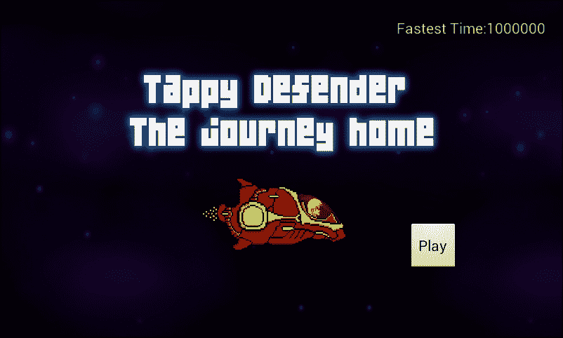

+   碰撞检测

+   高分

+   简单的 HUD

+   一指触摸屏控制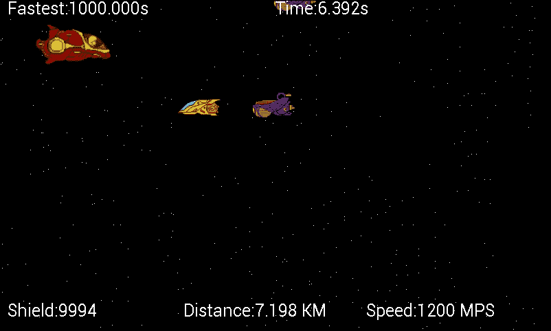

## 艰难的复古平台游戏

这是一款真正难以击败的复古风格平台游戏。我们必须引导鲍勃从地下火洞穿过城市、森林，最终到达山区。它有四个挑战级别。特色功能包括：

+   更高级、更灵活的游戏引擎

+   更高级的“精灵表”角色动画

+   一个关卡构建器引擎，用于以文本格式设计您的关卡

+   多重滚动视差背景

+   关卡之间的过渡

+   更高级的 HUD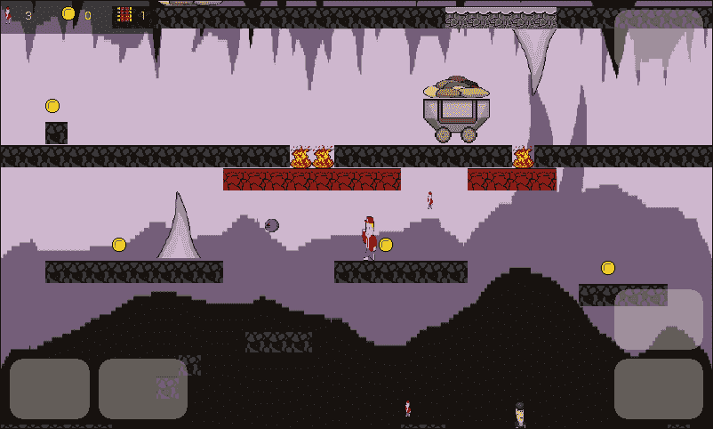

+   添加大量额外的多样化关卡

+   声音管理器，轻松管理音效

+   拾取物品

+   可升级的枪械

+   搜索并摧毁敌方无人机

+   用于巡逻敌方守卫的简单 AI 脚本

+   如火山坑等危险

+   用于营造氛围的风景对象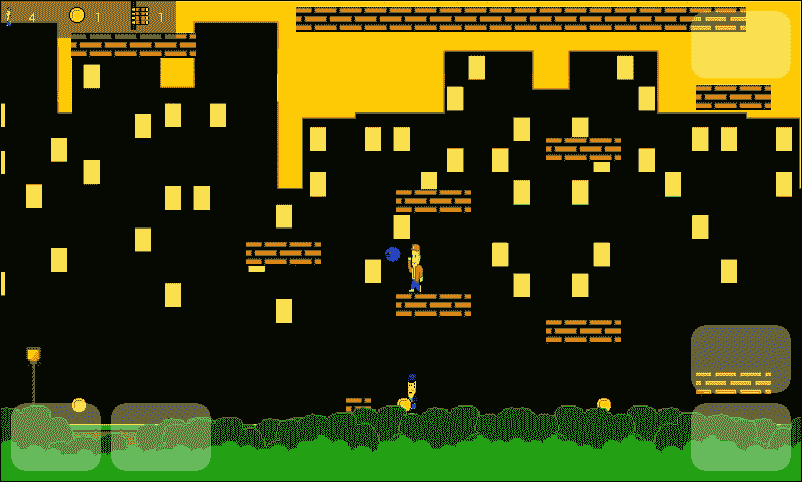

## 小行星模拟器

这是一款经典的射击游戏，具有复古矢量图形风格的视觉效果。它涉及使用快速射击枪清除平滑动画的旋转小行星的波浪。特色功能包括：

+   每秒 60 帧或更好，即使在旧硬件上

+   OpenGL ES 2 简介

+   难度递增的波浪射击游戏

+   高级多阶段碰撞检测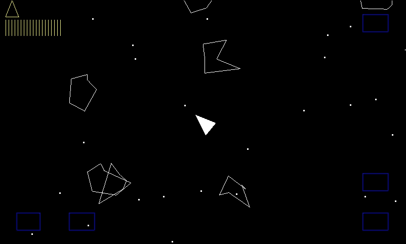

# 设置您的开发环境

本书和下载包中的所有代码都将在您喜欢的 Android IDE 中运行。然而，我发现最新的 Android Studio 特别易于使用，代码也是在此环境中编写和测试的。

如果您目前不使用 Android Studio，我鼓励您尝试一下。以下是如何快速启动和运行的简要概述。本指南包括安装 Java JDK 的步骤，以防您是 Android 开发的初学者。

### 小贴士

如果您已经准备好了您偏好的开发环境，那么请直接跳转到第二章, *Tappy Defender – 第一步*。

我们需要做的第一件事是为使用 Java 开发 Android 准备您的 PC。幸运的是，这对我们来说变得相当简单。

### 小贴士

如果您在 Mac 或 Linux 上学习，本书中的所有内容仍然适用。接下来的两个教程包含 Windows 特定的说明和截图。然而，根据 Mac 或 Linux 进行轻微的步骤调整应该不会太难。

我们需要做的只是：

1.  安装**Java 开发工具包**（**JDK**），它允许我们使用 Java 进行开发。

1.  然后安装 Android Studio，使 Android 开发变得快速且简单。Android Studio 使用 JDK 和一些其他特定于 Android 的工具，这些工具在我们安装 Android Studio 时会自动安装。

## 安装 JDK

我们需要做的第一件事是获取 JDK 的最新版本。为了完成本指南，请执行以下步骤：

1.  我们需要访问 Java 网站，因此请访问：[`www.oracle.com/technetwork/java/javase/downloads/index.html`](http://www.oracle.com/technetwork/java/javase/downloads/index.html)。

1.  找到此处显示的三个按钮，并点击以下图像中突出显示的 **JDK** 按钮。它们位于网页的右侧。然后，点击 **JDK** 选项下的 **下载** 按钮：

1.  您将被带到具有多个选项下载 JDK 的页面。在 **产品/文件描述** 列表中，您需要点击与您的操作系统匹配的选项。Windows、Mac、Linux 以及一些其他不太常见的选项都列出了。

1.  这里常问的一个问题是，我是否有 32 位或 64 位 Windows？要找出答案，请右键单击您的 **我的电脑** 图标（Windows 8 上的 **此电脑**），点击 **属性** 选项，然后在 **系统** 标题下查看 **系统类型** 条目：

1.  点击稍显隐藏的 **接受许可协议** 复选框：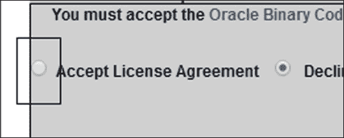

1.  现在，点击 **为您的操作系统下载** 并输入之前确定的版本。等待下载完成。

1.  在您的 `下载` 文件夹中，双击您刚刚下载的文件。截至撰写本文时，64 位 Windows PC 的最新版本是 `jdk-8u5-windows-x64`。如果您使用 Mac/Linux 或 32 位操作系统，您的文件名将相应变化。

1.  在几个安装对话框中的第一个对话框中，点击 **下一步** 按钮，您将看到以下对话框：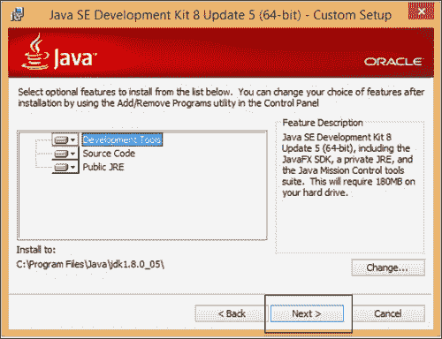

1.  通过点击 **下一步** 接受前一个图像中显示的默认设置。在下一个对话框中，您可以通过点击 **下一步** 接受默认的安装位置。

1.  接下来是 Java 安装程序的最后一个对话框；为此，点击 **关闭**。

    ### 注意

    JDK 已安装。接下来，我们将确保 Android Studio 能够使用 JDK。

1.  右键单击您的 **我的电脑** 图标（Windows 8 上的 **此电脑**），然后点击 **属性** | **高级系统设置** | **环境变量...** | **新...**（在 **系统变量** 下，不在 **用户变量** 下）。现在，您可以看到 **新系统变量** 对话框：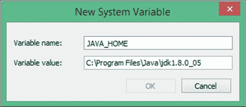

1.  在 **变量名** 为 **JAVA_HOME** 的字段中输入，并在 **变量值** 字段中输入 `C:\Program Files\Java\jdk1.8.0_05`。如果您在其他位置安装了 JDK，那么您在 **变量值** 字段中输入的文件路径需要指向您放置它的位置。您的确切文件路径可能以不同的结尾结束，以匹配您下载时的最新 Java 版本。

1.  点击 **确定** 保存您的新的设置。

1.  现在在 **系统变量** 下，点击 **路径**，然后点击 **编辑...** 按钮。在 **变量值** 字段中的文本末尾，输入以下文本以将我们的新变量添加到 Windows 将使用的文件路径中，`;JAVA_HOME`。务必不要遗漏开头的分号。

1.  点击 **确定** 保存更新的 **路径** 变量。

1.  现在，再次点击**确定**以清除**高级系统设置**对话框。

JDK 现在已安装在我们的 PC 上。

## 安装 Android Studio

不拖延，让我们立即安装 Android Studio，然后我们可以开始我们的第一个游戏项目。访问：

[`developer.android.com/sdk/index.html`](https://developer.android.com/sdk/index.html)

1.  点击标有**下载 Android Studio for Windows**的按钮开始下载 Android Studio。这将带您进入另一个网页，其中有一个与您刚才点击的按钮非常相似的按钮。

1.  通过勾选复选框接受许可协议，并通过点击标有**下载 Android Studio for Windows**的按钮开始下载，等待下载完成。

1.  在您刚刚下载 Android Studio 的文件夹中，右键单击`android-studio-bundle-135.12465-windows.exe`文件，并点击**以管理员身份运行**。您的文件名末尾将根据 Android Studio 的版本和您的操作系统而有所不同。

1.  当被问及是否允许来自未知发布者的以下程序更改您的计算机时，点击**是**。在下一屏幕上，点击**下一步**。

1.  在此处显示的屏幕上，您可以选择哪些 PC 用户可以使用 Android Studio。选择适合您的选项，因为所有选项都将正常工作，然后点击**下一步**：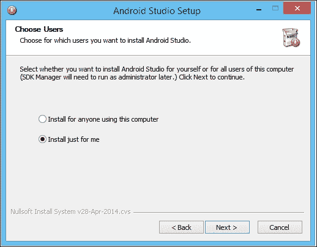

1.  在下一个对话框中，保留默认设置，然后点击**下一步**。

1.  在**选择开始菜单文件夹**对话框中，保留默认设置并点击**安装**。

1.  在安装完成对话框中，点击**完成**以首次运行 Android Studio。

1.  下一个对话框是为已经使用过 Android Studio 的用户准备的，所以假设您是第一次用户，请选择**我没有先前的 Android Studio 版本或我不想导入我的设置**复选框。然后点击**确定**：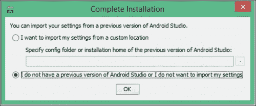

那是我们需要的最后一款软件。我们将在下一章直接开始使用 Android Studio。

# 摘要

本章故意保持尽可能短，这样我们就可以开始构建一些游戏。我们现在就这样做。

# 第二章 Tappy Defender – 第一步

欢迎来到第一个游戏，我们将在接下来的三章中学习它。在本章中，我们将仔细检查最终产品的目标。如果我们确切地知道我们想要实现什么，这对构建游戏非常有帮助。

然后，我们可以查看我们代码的结构，包括我们将遵循的大致设计模式。然后，我们将组装我们第一个游戏引擎的代码框架。最后，为了完成本章，我们将从游戏中绘制第一个真实对象并在屏幕上对其进行动画处理。

我们将准备好进入第三章，*Tappy Defender – Taking Flight*，在那里我们可以在完成第四章，*Tappy Defender – Going Home*中的第一个游戏之前取得真正的进展。

# 规划第一个游戏

在本节中，我们将详细说明我们的游戏将是什么样子。背景故事；我们的英雄是谁，他们试图实现什么？游戏机制；玩家实际上会做什么？他会按哪些按钮，以及这种方式是如何成为一种挑战或有趣的事情的？然后，我们将研究规则。胜利、死亡和进步由什么构成？最后，我们将变得技术性，开始研究我们实际上将如何构建游戏。

## 背景

瓦莱丽自 20 世纪 80 年代初以来一直在保卫人类的前哨阵地。她的勇敢事迹最初在 1981 年的街机经典游戏《Defender》中被永久记录。然而，在 30 多年的前线战斗后，她即将退休，是时候开始回家的旅程了。不幸的是，在最近的一次小冲突中，她的飞船引擎和导航系统严重受损。因此，现在她必须仅靠她的助推器飞回家。

这意味着她必须通过同时向上和向前推力来驾驶她的飞船，有点像弹跳，同时避开试图撞向她的敌人。在一次与地球的最近通信中，瓦莱丽声称这就像“试图驾驶一只跛脚的鸟”。这是瓦莱丽在她的受损飞船中的概念艺术，因为它有助于尽早可视化我们的游戏。

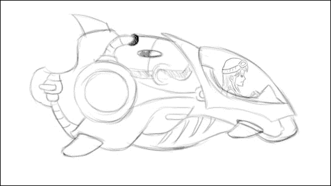

现在我们已经对我们的英雄和她所处的困境有了一些了解，我们更仔细地看看游戏的机制。

## 游戏机制

机制是玩家必须执行并变得擅长以能够打败游戏的关键动作。在设计游戏时，你可以依赖经过验证和测试的机制想法，或者你可以发明自己的。在 Tappy Defender 中，我们将使用一种机制，即玩家轻触并保持屏幕以助推飞船。

这种助推将使飞船上升屏幕，但也会使飞船加速，因此更容易受到攻击。当玩家移开手指时，助推器将关闭，飞船将向下坠落并减速，从而使飞船稍微不那么容易受到攻击。因此，需要非常精细和精湛的助推与不助推之间的平衡，才能生存下来。

Tappy Defender 当然深受 Flappy Bird 及其众多类似游戏成功的影响。

与 Flappy Bird 那样的得分系统不同，Tappy Defender 的目标是到达“家”。然后，玩家可以多次重玩游戏，以尝试打破他们最快的记录。当然，为了更快，玩家必须更频繁地助推，并将瓦莱丽置于更大的危险之中。

### 注意

在不太可能的情况下，如果你从未玩过或见过《Flappy Bird》，现在花 5 分钟玩这种类型的游戏是非常值得的。你可以从 Google Play 商店下载许多受《Flappy Bird》启发的应用程序：

[`play.google.com/store/search?q=flappy%20bird&c=apps`](https://play.google.com/store/search?q=flappy%20bird&c=apps)

## 游戏规则

在这里，我们将定义一些平衡游戏并使其对玩家公平和一致的事物：

+   玩家的飞船比敌人的飞船更坚固。这是因为玩家的飞船有护盾。每次玩家与敌人碰撞时，敌人会立即被摧毁，但玩家会失去一个护盾。玩家有三个护盾。

+   玩家需要飞行一定数量的公里才能到达家中。

+   每当玩家到达家中，他们就会赢得游戏。如果他们的时间是最快的，他们也会获得一个新的最快时间，就像高分一样。

+   敌人将在屏幕最右侧的随机高度出现，并以随机速度向玩家飞来。

玩家始终位于屏幕的远左侧，但加速会使敌人更快接近。

## 设计

我们将使用宽松的设计模式，我们将根据控制部分、模型部分和视图来分离我们的代码。这就是我们将代码分成三个区域的方法。

### 控制

这是控制我们代码其他部分的代码部分。它将决定何时显示视图，它将从模型初始化所有我们的游戏对象，并且它将根据模型中的数据状态提示决策。

### 模型

模型是我们的游戏数据和逻辑。船看起来是什么样子？我们的船在屏幕上的位置在哪里？它们移动得多快，等等。此外，我们代码中的模型部分是每个游戏对象的智能系统。尽管我们游戏中的敌人没有复杂的 AI，但它们会知道并自行决定移动的速度，何时重生等等。

### 视图

视图正如其名。这是我们代码的一部分，将根据模型的状态进行实际绘制。当控制代码的一部分告诉它时，它将绘制。它不会对游戏对象有任何影响。例如，视图不会决定对象的位置或其外观。它只是绘制，然后把控制权交回控制代码。

### 设计模式现实检查

事实上，这种分离并不像讨论中提到的那么清晰。实际上，绘制和控制代码位于同一个类中。然而，你将看到，绘制和控制的逻辑在那个类中是分开的。

通过将我们的游戏分成这三个部分，我们将看到我们如何简化开发并避免陷入混乱的代码，这些代码随着我们向游戏中添加新功能而不断扩展。

让我们更仔细地看看这个模式在我们代码中的位置。

## 游戏代码结构

首先，我们必须考虑我们正在工作的系统。在这种情况下，是 Android 系统。如果您已经制作了一段时间的 Android 应用，您可能会想知道这种模式与 Android Activity 生命周期有什么关系。如果您是 Android 新手，您可能会问 Activity 生命周期是什么。

### Android Activity 生命周期

Android Activity 生命周期是我们必须在其中工作的框架，以制作任何类型的 Android 应用。有一个名为 `Activity` 的类，我们必须从中派生出来，并且它是我们应用的入口点。此外，我们需要意识到这个类，即我们的游戏是一个对象，也有一些我们可以重写的方法。这些方法控制着我们的应用生命周期。

当用户启动应用时，我们的 `Activity` 对象被创建，并且会按顺序调用我们可以重写的一系列方法。这就是发生的事情。

当 `Activity` 对象被创建时，会按顺序调用三个方法；`onCreate()`、`onStart()` 和 `onResume()`。此时，应用现在正在运行。此外，当用户退出应用或应用被中断，例如被电话呼叫，会调用 `onPause` 方法。用户可能会决定，也许在完成电话通话后，返回到应用。如果发生这种情况，会调用 `onResume` 方法，随后应用再次运行。

如果用户没有返回到应用或 Android 系统决定它需要为其他事情使用系统资源，将调用两个进一步的方法来清理。首先 `onStop()`，然后 `onDestroy()`。现在应用已被销毁，任何尝试再次返回到游戏的行为都将导致 Activity 生命周期从头开始。

作为游戏程序员，我们只需要意识到这个生命周期并遵守一些良好的管理规则。随着我们的进行，我们将实现并解释这些良好的管理规则。

### 注意

Android Activity 生命周期比我刚才解释的要复杂得多，也更为微妙。然而，我们已经知道了一切，足以开始编写我们的第一个游戏。如果您想了解更多信息，请查看 Android 开发者网站上的这篇文章：

[`developer.android.com/reference/android/app/Activity.html`](http://developer.android.com/reference/android/app/Activity.html)

一旦我们处理了 Android Activity 生命周期，我们代表模式控制部分的类的核心方法将像这样简单：

1.  更新我们游戏对象的状态。

1.  根据它们的状态绘制游戏对象。

1.  暂停以锁定帧率。

1.  获取玩家输入。实际上，由于第 1、2 和 3 部分发生在线程中，这部分可以在任何时间发生。

1.  重复。

在我们开始真正构建游戏之前，还有一些最后的准备工作。

## Android Studio 文件结构

Android 系统对我们放置类文件的位置非常讲究，包括 `Activity`，以及我们在文件层次结构中放置我们的资产（如声音文件和图形）的位置。

这里是一个关于我们将要放置所有内容的快速概述。你不需要记住这些，因为当我们添加资源时会提醒你正确的文件夹。我们将在第一次需要创建活动/类的时候逐步进行。

提前提醒，以下是 Tappy Defender 项目结束时你的 Android Studio 项目资源管理器将看起来像的标注图：

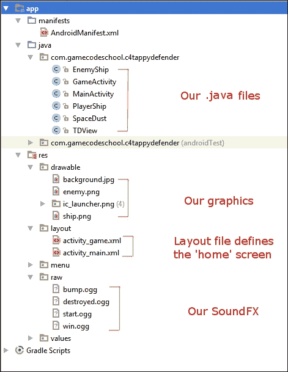

现在，我们可以真正开始构建 Tappy Defender。

# 构建主页

由于我们已经完成了所有的规划和准备，我们可以开始编写代码。

### 注意

要使用代码文件，你仍然需要创建一个 Android Studio 项目。此外，你还需要在每个 JAVA 文件的非常第一行代码中更改包名。将包名更改为与创建的项目包名匹配。最后，你需要确保任何如图片或声音文件等资源都放置在项目中的适当文件夹里。每个项目的所有必需资源都包含在下载包中。

## 创建项目

打开 Android Studio，按照以下步骤创建一个新项目。所有将在这个章节结束时用到的文件都包含在`Chapter2`文件夹中的下载包里。

1.  在**欢迎使用 Android Studio**对话框中，点击**创建新的 Android Studio 项目**。

1.  在接下来的**创建新项目**窗口中，我们需要输入一些关于我们应用的基本信息。这些信息将被 Android Studio 用于确定包名。

    ### 注意

    在以下图片中，你可以看到**编辑**链接，你可以在此处自定义包名（如果需要的话）。

1.  如果你将复制粘贴提供的代码到你的项目中，那么在**应用程序名称**字段中输入`C1 Tappy Defender`，在**公司域名**字段中输入`gamecodeschool.com`，如以下截图所示：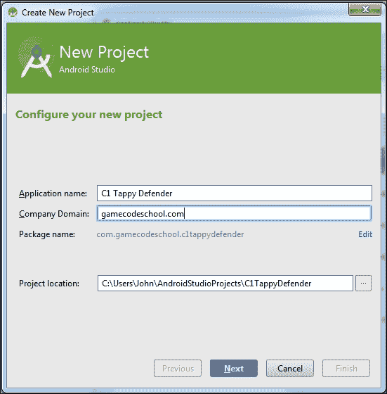

1.  准备好时，点击**下一步**按钮。当被问及你的应用将运行在哪些设备形式上时，我们可以接受默认设置（**手机和平板**）。所以再次点击**下一步**。

1.  在**添加活动到移动设备**对话框中，只需点击**空白活动**，然后点击**下一步**按钮。

1.  在**自定义活动**对话框中，我们同样可以接受默认设置，因为`MainActivity`似乎是我们主要活动的合适名称。所以点击**完成**按钮。

### 我们所做

Android Studio 已经构建了项目并创建了许多文件，其中大部分我们将在构建这个游戏的过程中看到并编辑。如前所述，即使你只是在复制粘贴代码，你也必须完成这一步，因为 Android Studio 在幕后做一些事情来使我们的项目工作。

## 构建主页 UI

我们 Tappy Defender 游戏的第一部分和最简单部分是主屏幕。我们需要的只是一个关于游戏的场景整洁图片、一个最高分和一个开始游戏的按钮。完成后的主屏幕将看起来有点像这样：

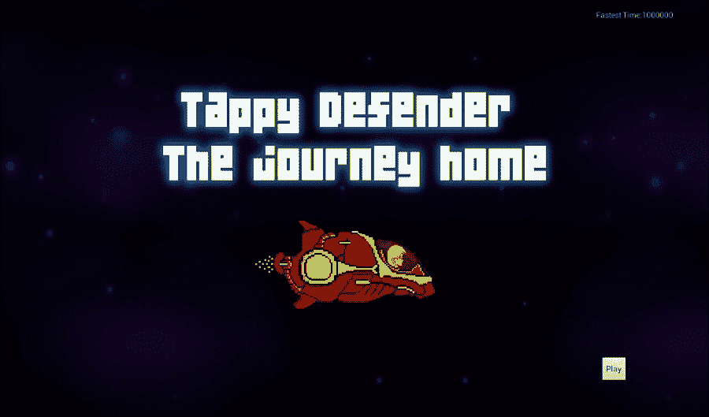

当我们构建项目时，Android Studio 会为我们打开两个文件以便编辑。您可以在下面的 Android Studio UI 设计器中看到它们作为标签页。这些文件（和标签页）是`MainActivity.java`和`activity_main.xml`：

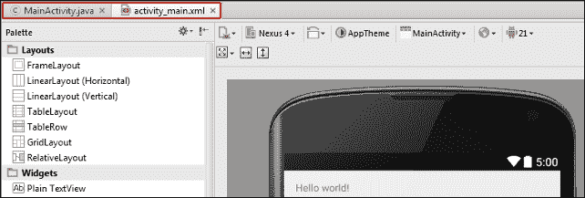

`MainActivity.java`文件是我们游戏的入口点，我们很快就会看到更多细节。`activity_main.xml`文件是我们主屏幕将使用的 UI 布局。现在，我们可以继续编辑`activity_main.xml`文件，使其看起来像我们的主屏幕应该的样子。

1.  首先，您的游戏将以 Android 设备的横屏模式运行。如果我们将我们的 UI 预览窗口更改为横屏，我们将更准确地看到您的进度。寻找下一张图片中显示的按钮。它就在 UI 预览之前：

1.  点击前一张截图中的按钮，您的 UI 预览将切换到如下所示的横屏模式：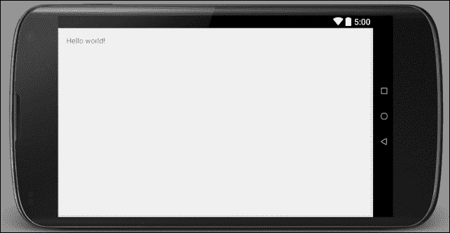

1.  确保通过单击其标签打开`activity_main.xml`。

1.  现在，我们将设置一个背景图片。您可以使用自己的图片，或者从下载包中的`Chapter2/drawable/background.jpg`使用我的图片。将您选择的照片添加到 Android Studio 项目中`drawable`文件夹。

1.  在 UI 设计器的**属性**窗口中，找到并单击如图所示的**背景**属性：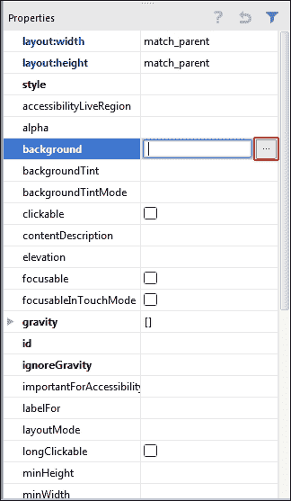

1.  此外，在上一张图片中，标记为**...**的按钮被轮廓包围。它位于**背景**属性的正右方。点击那个**...**按钮，浏览并选择您将使用的背景图片文件。

1.  接下来，我们需要一个用于显示最高分的**TextView**小部件。请注意，布局中已经有一个**TextView**小部件。它写着**Hello World**。您将修改它并用于我们的最高分。左键单击它并将其拖动到您想要的位置。如果您打算使用提供的背景，可以复制它，或者将其放置在背景看起来最好的位置。

1.  接下来，在**属性**窗口中，找到并单击**id**属性。输入`textHighScore`。请准确无误地输入，因为当我们稍后在教程中编写一些 Java 代码时，我们将引用此 ID 来操作它，以显示玩家的最快时间。

1.  您还可以编辑**文本**属性，将其设置为`High Score: 99999`或类似内容，以便**TextView**看起来更合适。然而，这并不是必需的，因为您的 Java 代码将在稍后处理这一点。

1.  现在，我们将从组件面板中拖动一个按钮，如下面的截图所示：

1.  将它拖动到背景上看起来不错的地方。如果您使用提供的背景，可以复制我，或者将其放置在您背景上看起来最好的位置。

1.  接下来，在属性窗口中，找到并点击按钮的 id 属性。输入 buttonPlay。请准确无误地输入，因为我们将在稍后的教程中编写一些 Java 代码时，将引用此 ID 来操作它。同时编辑文本属性，使其显示为“播放”。

### 我们所做的是

现在我们有一个酷炫的背景，上面整齐地排列着小部件（一个**TextView**和一个**Button**），用于您的首页。我们可以通过 Java 代码向**Button**小部件添加功能。回顾第四章中的**TextView**，*Tappy Defender – Going Home*。重要的是，这两个小部件都分配了一个唯一的 ID，我们可以使用它来在 Java 代码中引用和操作。

## 编码功能

现在，我们为游戏的主页有一个简单的布局。现在，我们需要添加允许玩家点击**播放**按钮开始游戏的功能。

点击`MainActivity.java`文件的标签。为我们自动生成的代码并不完全符合我们的需求。因此，我们将从头开始，因为这样做比修改现有的代码要简单快捷。

删除`MainActivity.java`文件中的所有内容（除了包名），并在其中输入以下代码。当然，您的包名可能不同。

```java
package com.gamecodeschool.c1tappydefender;

import android.app.Activity;
import android.os.Bundle;

public class MainActivity extends Activity{

    // This is the entry point to our game
    @Override
    protected void onCreate(Bundle savedInstanceState) {
        super.onCreate(savedInstanceState);

        //Here we set our UI layout as the view
        setContentView(R.layout.activity_main);

    }
}
```

提到的代码是我们当前主`MainActivity`类的当前内容，也是我们游戏的入口点，即`onCreate`方法。以`setContentView...`开头的代码行是将我们的 UI 布局从`activity_main.xml`加载到玩家屏幕上的代码行。我们现在可以运行游戏并看到我们的主页，但让我们再取得一些进展，然后我们将在本章末尾查看如何在真实设备上运行游戏。

现在，让我们处理我们的主页上的**播放**按钮。将以下代码中的两个高亮行添加到`onCreate`方法中，紧接在调用`setContentView()`之后。第一行新代码创建了一个新的`Button`对象，并获取了 UI 布局中`Button`的引用。第二行是监听按钮点击的代码。

```java
//Here we set our UI layout as the view
setContentView(R.layout.activity_main);

// Get a reference to the button in our layout
final Button buttonPlay =
 (Button)findViewById(R.id.buttonPlay);
// Listen for clicks
buttonPlay.setOnClickListener(this);

```

注意，我们的代码中存在一些错误。我们可以通过按住键盘上的*Alt*键然后按*Enter*键来解决这些错误。这将添加一个对`Button`类的导入指令。

我们仍然有一个错误。我们需要实现一个接口，以便我们的代码能够监听按钮点击。修改如高亮显示的`MainActivity`类声明：

```java
public class MainActivity extends Activity 
 implements View.OnClickListener{

```

当我们实现 `onClickListener` 接口时，我们也必须实现 `onClick` 方法。这是我们处理按钮点击时发生的事情的地方。我们可以通过在 `onCreate` 方法之后但仍在 `MainActivity` 类内部的位置右键单击，然后导航到 **生成** | **实现方法** | **onClick(v:View):void** 来自动生成 `onClick` 方法。或者直接添加给定的代码。

我们还需要让 Android Studio 添加另一个导入指令，用于 `Android.view.View`。再次使用 *Alt* | *Enter* 键盘组合。

现在，我们可以滚动到 `MainActivity` 类的底部附近，看到 Android Studio 已经为我们实现了一个空的 `onClick` 方法。此时，你的代码应该没有错误。以下是 `onClick` 方法：

```java
@Override
public void onClick(View v) {
  //Our code goes here
}
```

由于我们只有一个 `Button` 对象和一个监听器，我们可以安全地假设在我们主屏幕上的任何点击都是玩家在按下我们的**播放**按钮。

Android 使用 `Intent` 类在活动之间切换。由于当点击**播放**按钮时我们需要转到新的活动，我们将创建一个新的 `Intent` 对象，并将我们未来的 `Activity` 类 `GameActivity` 的名称传递给其构造函数。然后我们可以使用 `Intent` 对象来切换活动。将以下代码添加到 `onClick` 方法的主体中：

```java
// must be the Play button.
// Create a new Intent object
Intent i = new Intent(this, GameActivity.class);
// Start our GameActivity class via the Intent
startActivity(i);
// Now shut this activity down
finish();    
```

再次，我们的代码中出现了错误，因为我们需要生成一个新的导入指令，这次是针对 `Intent` 类，所以再次使用 *Alt* | *Enter* 键盘组合。我们代码中仍然有一个错误。这是因为我们的 `GameActivity` 类还不存在。我们现在将解决这个问题。

## 创建 GameActivity

我们已经看到，当玩家点击**播放**按钮时，主活动将关闭，游戏活动将开始。因此，我们需要创建一个新的活动，名为 `GameActivity`，这将是我们游戏实际执行的地方。

1.  从主菜单导航到 **文件** | **新建** | **活动** | **空白活动**。

1.  在 **自定义活动** 对话框中，将 **活动名称** 字段更改为 `GameActivity`。

1.  我们可以接受此对话框中的所有其他默认设置，因此点击 **完成**。

1.  正如我们在 `MainActivity` 类中所做的那样，我们将从头开始编写这个类。因此，从 `GameActivity.java` 中删除整个代码内容。

### 我们所做的工作

Android Studio 已经为我们生成了两个新文件，并在幕后做了一些工作，我们很快将调查这些工作。新文件是 `GameActivity.java` 和 `activity_game.xml`。它们都自动在我们打开的两个新标签页中打开，位于 UI 设计器上方的其他标签页相同的位置。

我们将永远不会需要 `activity_game.xml`，因为我们将会构建一个动态生成的游戏视图，而不是静态的用户界面。现在可以将其关闭或忽略。我们将在本章的 *编写游戏循环* 部分开始编写游戏时回到 `GameActivity.java` 文件。

## 配置 AndroidManifest.xml 文件

我们简要地提到，当我们创建一个新的项目或一个新的活动时，Android Studio 为我们做的不仅仅是创建两个文件。这就是我们以这种方式创建新项目/活动的原因。

在幕后发生的一件事是创建和修改`manifests`目录中的`AndroidManifest.xml`文件。

此文件对于我们的应用程序正常工作是必需的。此外，它需要被编辑以使我们的应用程序以我们想要的方式工作。Android Studio 已经为我们自动配置了基础知识，但现在我们将对此文件进行两项操作。

通过编辑`AndroidManifest.xml`文件，我们将强制我们的两个活动以全屏运行，并且我们将锁定它们为横幅布局。让我们在这里进行这些更改：

1.  现在打开`manifests`文件夹，双击`AndroidManifest.xml`文件以在代码编辑器中打开它。

1.  在`AndroidManifest.xml`文件中，找到以下代码行：

    ```java
    android:name=".MainActivity"
    ```

1.  紧接着，输入或复制粘贴以下两行代码，使`MainActivity`全屏运行并锁定在横幅方向：

    ```java
    android:theme="@android:style/Theme.NoTitleBar.Fullscreen"
    android:screenOrientation="landscape"
    ```

1.  在`AndroidManifest.xml`文件中，找到以下代码行：

    ```java
    android:name=".GameActivity"
    ```

1.  紧接着，输入或复制粘贴以下两行代码，使`GameActivity`全屏运行并锁定在横幅方向：

    ```java
    android:theme="@android:style/Theme.NoTitleBar.Fullscreen"
    android:screenOrientation="landscape"
    ```

### 我们所做

我们现在已将我们的游戏中的两个活动配置为全屏。这对玩家来说呈现了一个更加令人愉悦的外观。此外，我们还禁用了玩家通过旋转他们的 Android 设备来影响我们的游戏的能力。

# 编写游戏循环

我们提到我们不会为我们的游戏屏幕使用 UI 布局，而是一个动态绘制的视图。这就是我们的图案视图发挥作用的地方。让我们创建一个新的类来表示我们的视图，然后我们将放入 Tappy Defender 游戏的根本构建块。

## 构建视图

我们将暂时不修改我们的两个活动类，以便我们可以查看代表我们游戏视图的类。正如我们在本章开头讨论的那样，视图和控制方面将是同一个类的部分。

Android API 为我们提供了满足我们需求的理想类。`android.view.SurfaceView`类不仅为我们提供了一个用于绘制像素、文本、线条和精灵的视图，而且还使我们能够快速处理玩家输入。

似乎这还不够有用，我们还可以通过实现可运行接口来创建一个线程，使我们的主游戏循环能够同时获取玩家输入和其他系统基本要素。现在，我们将处理您新`SurfaceView`实现的一般结构，以便我们可以在项目进展过程中填写细节。

### 为视图创建一个新类

不再拖延，我们可以创建一个新的类，该类扩展了`SurfaceView`。

1.  右键单击包含我们的`.java`文件的文件夹，选择**新建** | **Java 类**，然后点击**确定**。

1.  在**创建新类**对话框中，将新类命名为`TDView,`（Tappy Defender 视图）。现在，点击**确定**让 Android Studio 自动生成该类。

1.  新类将在代码编辑器中打开。修改代码，使其扩展`SurfaceView`并实现`Runnable`，如前一小节所述。编辑以下代码的高亮部分：

    ```java
    package com.gamecodeschool.c1tappydefender;

    import android.view.SurfaceView;

    public class TDView extends SurfaceView implements Runnable{

    }
    ```

1.  使用*Alt* | *Enter*组合来导入缺失的类。

1.  注意，我们代码中仍然存在错误。这是因为我们必须为我们的`SurfaceView`实现提供一个构造函数。在`TDView`类声明下方右键单击，然后导航到**生成** | **构造函数** | **SurfaceView(Context:context)**。或者，您也可以像下一个代码块中所示那样直接输入。现在点击**确定**。

### 我们所做

现在我们有一个名为`TDView`的新类，它扩展了`SurfaceView`以满足我们的绘图需求，并实现了`Runnable`以满足我们的线程需求。我们还生成了一个构造函数，我们将很快使用它来初始化我们的新类。

传递给我们的构造函数的`Context`参数是对 Android 系统中我们的`GameActivity`类持有的当前应用程序状态的引用。这个`Context`参数对于我们将在这个项目中实现的大量事情非常有用/必要。

到目前为止，我们的`TDView`类将看起来像这样：

```java
package com.gamecodeschool.c1tappydefender;

import android.content.Context;
import android.view.SurfaceView;

public class TDView extends SurfaceView implements Runnable{

    public TDView(Context context) {
        super(context);
    }
}
```

### 结构化类代码

现在我们已经将`TDView`类扩展为`SurfaceView`类，我们可以开始编写代码了。为了控制游戏，我们需要能够更新所有游戏数据/对象。这意味着需要一个`update`方法。此外，我们显然希望在更新后每帧都绘制所有游戏数据，因此我们将所有的绘图代码放在一个名为`draw`的方法中。此外，我们需要控制这个操作的频率。因此，一个`control`方法似乎也应该成为类的一部分。

我们还知道，所有事情都需要在您的线程中发生；因此，为了实现这一点，我们应该将代码包裹在`run`方法中。最后，我们需要一种方式来控制线程何时以及何时不应执行其工作，因此我们需要一个由布尔值控制的无限循环，例如`playing`。

将以下代码复制到我们的`TDView`类体中，以实现我们刚刚讨论的内容：

```java
@Override
    public void run() {
        while (playing) {
            update();
            draw();
            control();
        }
    }
```

这是我们游戏的基础框架。`run`方法将在一个线程中执行，但只有在布尔实例`playing`为真时才会执行游戏循环。然后，它将更新所有游戏数据，根据这些游戏数据绘制屏幕，并控制`run`方法再次被调用的时间。

现在，我们可以快速构建这段代码。首先，我们可以实现从`run`方法中调用的三个方法。在`run`方法的括号闭合后，在`TDView`类体中输入以下代码：

```java
private void update(){

}

private void draw(){

}

private void control(){

}
```

我们现在需要声明我们的`playing`成员变量。我们可以使用`volatile`关键字来完成，因为它将从线程外部和内部访问。在`TDView`类声明之后立即输入此代码：

```java
volatile boolean playing;
```

现在，我们知道我们可以通过无限循环和`playing`变量来控制`run`方法中的代码执行。我们还需要启动和停止实际的线程本身。不仅在我们决定的时候，而且在玩家意外退出游戏的时候。如果他接到电话或者只是在他的设备上轻触主页按钮会怎样。

为了处理这些事件，我们需要`TDView`类和`GameActivity`协同工作。现在，在`TDView`类中，我们可以实现一个`pause`方法和一个`resume`方法。在它们内部，我们放置停止和启动我们的线程的代码。在`TDView`类的主体中实现这两个方法：

```java
// Clean up our thread if the game is interrupted or the player quits
public void pause() {
        playing = false;
        try {
            gameThread.join();
        } catch (InterruptedException e) {

        }
    }

    // Make a new thread and start it
    // Execution moves to our R
    public void resume() {
           playing = true;
           gameThread = new Thread(this);
           gameThread.start();
    }
```

现在，我们需要一个名为`gameThread`的`Thread`类实例。我们可以在类声明之后，紧随我们的布尔`playing`参数之后将其声明为`TDView`的成员变量。如下所示：

```java
volatile boolean playing;
Thread gameThread = null;

```

注意，`onPause`和`onResume`方法是公开的。我们现在可以向我们的`GameActivity`类添加代码，在适当的时间调用这些方法。记住，`GameActivity`扩展了`Activity`。因此，使用重写的`Activity`生命周期方法。

通过重写`onPause`方法，每当活动暂停时，我们可以关闭线程。这可以避免玩家可能感到尴尬，并不得不向他的呼叫者解释为什么他们能在背景中听到音效。

通过重写`onResume()`，我们可以在 Android 生命周期中实际运行之前启动线程的最后阶段。

### 注意

注意`TDView`类的`pause`方法和`resume`方法与`GameActivity`类的重写`onPause`和`onResume`方法之间的区别。

## 游戏活动

在实现/覆盖此方法之前，请注意，它们所做的一切只是调用各自方法的父版本，然后调用它们对应的`TDView`类中的公共方法。

你可能还记得我们创建新的`GameActivity`类时删除了整个代码内容？考虑到这一点，以下是我们在`GameActivity.java`中需要的代码概要，包括在上一节中讨论的`GameActivity`类主体中重写的方法的实现。在`GameActivity.java`中输入此代码：

```java
package com.gamecodeschool.c1tappydefender;

import android.app.Activity;
import android.os.Bundle;

public class GameActivity extends Activity {

    // This is where the "Play" button from HomeActivity sends us
    @Override
    protected void onCreate(Bundle savedInstanceState) {
        super.onCreate(savedInstanceState);

    }

    // If the Activity is paused make sure to pause our thread
    @Override
    protected void onPause() {
        super.onPause();
        gameView.pause();
    }

    // If the Activity is resumed make sure to resume our thread
    @Override
    protected void onResume() {
        super.onResume();
        gameView.resume();
    }

}
```

最后，让我们继续并声明一个`TDView`类的对象。在`GameActivity`类声明之后立即这样做：

```java
// Our object to handle the View
private TDView gameView;
```

现在，在`onCreate`方法中，我们需要实例化你的对象，记住在`TDView.java`中的构造函数需要一个`Context`对象作为参数。然后，我们在`setContentView()`调用中使用新实例化的对象。记得当我们构建我们的主页时，我们调用了`setContentView()`并传递了我们的 UI 设计。这次，我们将玩家的视图设置为我们的`TDView`类的对象。将以下代码复制到`GameActivity`类的`onCreate`方法中：

```java
// Create an instance of our Tappy Defender View (TDView)
// Also passing in "this" which is the Context of our app
gameView = new TDView(this);

// Make our gameView the view for the Activity
setContentView(gameView);
```

到目前为止，我们实际上可以运行我们的游戏并点击**播放**按钮来进入`GameView`活动，该活动将使用`TDView`作为其视图并启动我们的线程。显然，目前什么也看不到，所以让我们专注于设计模式的模型部分，并构建我们第一个游戏对象的基本轮廓。在本章结束时，我们将看到如何在 Android 设备上运行游戏。

# 玩家飞船对象

我们需要尽可能地将代码的模型部分与其他部分分开。我们可以通过创建一个用于玩家飞船的类来实现这一点。让我们将我们的新类命名为`PlayerShip`。

现在请向项目中添加一个新的类，并将其命名为`PlayerShip`。以下是完成此操作的几个快速步骤。现在，右键单击包含我们的`.java`文件的文件夹，导航到**新建** | **Java 类**，然后输入`PlayerShip`作为名称，点击**确定**。

我们需要我们的`PlayerShip`类能够了解关于自己的什么？作为最低要求，它至少需要能够：

+   知道它在屏幕上的位置

+   它看起来像什么

+   它飞行的速度有多快

这些要求表明我们可以声明几个成员变量。在我们生成的类声明之后输入代码：

```java
private Bitmap bitmap;
private int x, y;
private int speed = 0;
```

如同往常，使用*Alt* | *Enter*键盘组合导入任何缺少的类。在之前的代码块中，我们看到我们声明了一个类型为`Bitmap`的对象，我们将使用它来存储代表我们的船的图形。

我们还声明了三个`int`类型的变量；`x`和`y`用于存储飞船的屏幕坐标，另一个`int`类型的变量`speed`用于存储飞船移动的速度值。

现在，让我们考虑我们的`PlayerShip`类需要做什么。再次作为最低要求，它至少需要做到：

+   准备自己

+   更新自己

+   与我们的视图共享其状态

构造函数似乎是准备自己的理想位置。我们可以初始化其`x`和`y`坐标变量，并使用`speed`变量设置一个起始速度。

构造函数还需要做的一件事是加载表示其外观的位图图形。加载位图需要 Android 的`Context`对象。这意味着我们编写的构造函数将需要从我们的视图中接收一个`Context`对象。

考虑到所有这些，以下是我们的`PlayerShip`构造函数，以实现待办事项列表中的第一点：

```java
// Constructor
public PlayerShip(Context context) {
        x = 50;
        y = 50;
        speed = 1;
        bitmap = BitmapFactory.decodeResource 
        (context.getResources(), R.drawable.ship);

    }
```

如同往常一样，我们需要使用 *Alt* | *Enter* 组合键导入一些新的类。在导入初始化我们的位图对象的行所需的所有新类之后，我们可以看到我们仍然有一个错误；`Cannot resolve symbol ship`。

让我们分析加载飞船位图的行，因为我们将在整本书中多次看到它。

`BitmapFactory` 类正在使用其静态方法 `decodeResource()` 尝试加载我们的玩家飞船图形。它需要两个参数。第一个是来自传递给视图的 `Context` 对象提供的 `getResources` 方法。

第二个参数 `R.drawable.ship` 是从名为 `drawable` 的（R）资源文件夹请求一个名为 `ship` 的图形。要解决这个错误，我们只需要将我们的图形 `ship.png` 复制到项目的 `drawable` 文件夹中。

简单地将 `Chapter2/drawable` 文件夹中包含的 `ship.png` 图形从下载包拖放到 Android Studio 项目资源管理器窗口中的 `res/drawable` 文件夹。以下是一个 `ship.png` 图像：

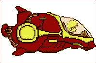

我们列表中 `PlayerShip` 需要做的第二件事是更新自己。让我们实现一个公共的 `update` 方法，可以从我们的 `TDView` 类中调用。每次调用该方法时，它将简单地增加飞船的 *x* 值 1。显然，我们需要比这更高级。现在，在 `PlayerShip` 类中按如下方式实现该方法：

```java
public void update() {
  x++;
}
```

待办事项列表中的第三项是将其状态与视图共享。我们可以通过提供一些类似这样的获取器方法来实现：

```java
//Getters
public Bitmap getBitmap() {
  return bitmap;
}

public int getSpeed() {
  return speed;
}

public int getX() {
  return x;
}

public int getY() {
  return y;
}
```

现在，你的 `TDView` 类可以被实例化，并找出它对任何 `PlayerShip` 对象的喜好。然而，只有 `PlayerShip` 类本身可以决定它应该看起来像什么，它有什么属性，以及它的行为方式。

我们可以看到我们将如何将玩家的飞船绘制到屏幕上，并对其进行动画处理。

# 绘制场景

正如我们将看到的，绘制位图实际上是非常简单的。但我们将用于在图形上绘制坐标系的系统需要简要说明。

## 绘图和绘制

当我们将 `Bitmap` 对象绘制到屏幕上时，我们传递想要绘制对象的坐标。给定 Android 设备的可用坐标取决于其屏幕的分辨率。

例如，当三星 Galaxy S4 手机以横向视图持有时，其屏幕分辨率为 1920 像素（宽）和 1080 像素（高）。

这些坐标的编号系统从左上角的 0,0 开始，向下和向右延伸，直到右下角是像素 1919, 1079。1920/ 1919 和 1080/ 1079 之间明显的 1 像素差异是因为编号从 0 开始。

因此，当我们绘制位图或其他可绘制对象到屏幕上时，我们必须指定 *x*，*y* 坐标。

此外，位图当然由许多像素组成。所以，给定位图的哪个像素将被绘制到我们将指定的*x*，*y*屏幕坐标上？

答案是`Bitmap`对象的最左上角像素。看看下一张图，它应该会使用三星 Galaxy S4 作为示例来阐明屏幕坐标。


目前，当我们只在任意位置绘制一艘船时，这些信息意义不大。在下一章，当我们开始将我们的图形限制在可见屏幕上，并在它们消失时重新生成它们时，它将变得更加重要。

所以，让我们记住这一点，继续将我们的船绘制到屏幕上。

## 绘制玩家船

现在我们已经知道了所有这些，我们可以在`TDView`类中添加一些代码，这样我们就可以看到`PlayerShip`类的实际效果。首先，我们需要一个具有类作用域的新`PlayerShip`对象。以下代码是`TDView`类的声明：

```java
//Game objects
private PlayerShip player;
```

我们还需要一些我们尚未见过的对象来帮助我们实际进行绘图。我们需要一个画布和一些画笔。

### 画布和画笔对象

命名恰当的`Canvas`类提供了你所期望的——一个虚拟画布，我们可以在此画布上绘制我们的图形。

我们可以使用`Canvas`类创建一个虚拟画布，并将其投影到我们的`SurfaceView`对象上，这是你的`GameActivity`类的视图。我们实际上可以在我们的`Canvas`对象上添加`Bitmap`对象，甚至使用我们的`Paint`对象的方法来操纵单个像素。此外，我们还需要一个`SurfaceHolder`类的对象。这允许我们在操作`Canvas`对象时锁定它，并在我们准备好绘制帧时解锁它。

我们将在接下来的过程中更详细地了解这些类是如何工作的。在输入上一行代码后立即输入以下代码：

```java
// For drawing
private Paint paint;
private Canvas canvas;
private SurfaceHolder ourHolder;
```

如同往常，我们需要使用*Alt | Enter*键盘组合来导入接下来的两行代码所需的一些新类。从这一点开始，我们将保存数字链接，并假设你知道每次添加新类时都要这样做。

接下来，我们需要设置以准备绘图。最好的地方是在`TDView()`构造函数中这样做。输入以下代码以准备我们的`Paint`和`SurfaceHolder`对象以进行操作：

```java
// Initialize our drawing objects
ourHolder = getHolder();
paint = new Paint();
```

在上一行代码之后，我们最终可以调用`new()`来初始化我们的`PlayerShip`对象：

```java
// Initialize our player ship
player = new PlayerShip(context);
```

现在，我们可以跳转到`TDView`类的`update`方法并执行以下操作：

```java
// Update the player
player.update();
```

就这样。`PlayerShip`类（模型的一部分）知道该做什么，我们可以在`PlayerShip`类中添加各种人工智能。`TDView`类（控制器）只是说何时更新。你可以很容易地想象，我们所需做的就是创建具有不同属性和行为的大量不同游戏对象，并在每一帧调用它们的`update`方法。

现在，跳转到`TDView`类的`draw`方法。让我们通过以下操作来绘制我们的`player`对象：

1.  确认我们的`SurfaceHolder`类是有效的。

1.  锁定`Canvas`对象。

1.  通过调用`drawColor()`清除屏幕。

1.  通过调用`drawBitmap()`并传入`PlayerShip`位图以及*x*，*y*坐标，在其上泼溅一些虚拟油漆。

1.  最后，解锁`Canvas`对象并绘制场景。

为了实现这些，请在`draw`方法中输入以下代码：

```java
if (ourHolder.getSurface().isValid()) {

  //First we lock the area of memory we will be drawing to
  canvas = ourHolder.lockCanvas();

  // Rub out the last frame
  canvas.drawColor(Color.argb(255, 0, 0, 0));

  // Draw the player
  canvas.drawBitmap(
    player.getBitmap(), 
    player.getX(), 
    player.getY(), 
    paint);

  // Unlock and draw the scene
  ourHolder.unlockCanvasAndPost(canvas);
}
```

到这一点，我们实际上可以运行游戏。如果我们的视力足够快或者我们的 Android 设备足够慢，我们几乎可以看到我们的玩家宇宙飞船以极快的速度飞越屏幕。

在我们将游戏部署之前，还有一件事要做。

## 控制帧率

我们几乎看不到任何东西的原因是，尽管我们只在每一帧沿着*x*轴（在`PlayerShip`类的`update`方法中）移动我们的船一个像素，但我们的线程以无限制的方式调用`run`方法。这可能在每秒发生数百次。我们需要做的是控制这个速率。

每秒 60 帧（FPS）是一个合理的目标。这个目标意味着需要计时。Android 系统以毫秒（千分之一秒）为单位测量时间。因此，我们可以将以下代码添加到`control`方法中：

```java
try {
    gameThread.sleep(17);
    } catch (InterruptedException e) {

    }
```

在前面的代码中，我们通过调用`gameThread.sleep`并将`17`作为方法参数，使线程暂停了 17 毫秒（*1000（毫秒）/60（FPS）*）。我们将代码包裹在一个`try`/`catch`块中。

# 部署游戏

现在，我们可以运行我们的游戏，看到我们的宇宙飞船在太空中漂浮（从*x*轴上的 50 像素和*y*轴上的 50 像素开始）。

Android Studio 使我们能够相当快速地创建模拟器，在开发 PC 上测试我们的游戏。然而，即使是最简单的游戏在模拟器上运行也不会很好。当我们开始测试像玩家输入这样的东西时，体验如此糟糕，最好完全避免使用模拟器。

解决方案是在真实的 Android 设备上进行调试。为此做准备非常容易。

## 在 Android 设备上调试

首件事是访问您的设备制造商的网站，获取并安装您设备和操作系统所需的任何驱动程序。

接下来的几个步骤将为调试设置 Android 设备。请注意，不同制造商的菜单选项结构可能略有不同。以下序列可能非常接近，如果不是完全相同，以在大多数设备上启用调试。

1.  点击**设置**菜单选项或**设置**应用。

1.  点击**开发者**选项。

1.  点击**USB 调试**的复选框。

1.  将您的 Android 设备连接到开发系统的 USB 端口。下一张图片显示了 Android 选项卡。在 Android Studio UI 的底部，您可以看到已检测到**三星 GT-I9100 Android 4.1.2（API 16）**：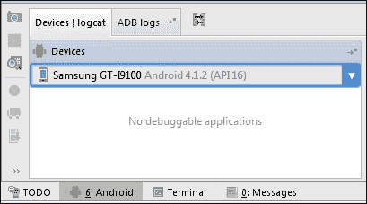

1.  点击 Android Studio 工具栏中的**播放**图标：

1.  当提示时，点击**OK**以在所选设备上运行游戏。

游戏现在将在设备上运行。任何输出或错误都可以在**logcat**窗口中看到，也在**Android**标签页上：

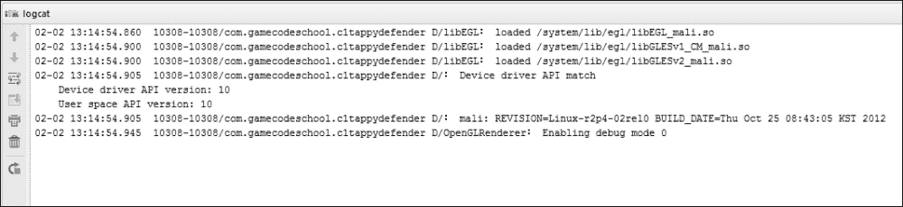

惊叹地看着我们的玩家飞船从左到右缓慢移动。

# 摘要

在本章中，我们花费了大量时间设置结构、游戏循环和线程。我们还花费时间处理 Android Activity 生命周期。

现在，我们已经有了所有这些，我们可以轻松地开始添加更多游戏对象，使 Tappy Defender 在下一章中快速感觉更像一个真正的游戏。

# 第三章。Tappy Defender –起飞

我们现在可以快速添加许多新对象和一些功能。到本章结束时，我们将非常接近一个可玩的游戏。我们将检测玩家触摸屏幕，以便他可以控制飞船。我们将在`SpaceShip`类中添加虚拟加速器，以使飞船上下移动并增加速度。

然后，我们将检测 Android 设备的分辨率，并使用它来做诸如防止玩家从屏幕上加速，以及检测敌人何时需要重生的事情。

我们将创建一个新的`EnemyShip`类，它将代表自杀式敌人。我们还将看到我们如何可以轻松地生成并控制它们，而无需更改代码控制部分中的任何逻辑。

我们将通过添加`SpaceDust`类并生成数十个来添加滚动效果，使其看起来像玩家正在飞快地穿过太空。

最后，我们将了解并实现碰撞检测，这样我们就知道玩家是否被敌人击中，以及查看一个图形技巧，帮助我们调试碰撞检测代码。

# 控制飞船

我们玩家的飞船现在在屏幕上无目的地漂浮，从左边 50 像素和顶部 50 像素开始，缓慢向右漂移。现在，我们可以给玩家控制飞船的能力。

记住控制的设计是一个手指轻触并保持以加速，释放以停止加速并减速。

## 检测触摸

我们扩展的`SurfaceView`类非常适合处理屏幕触摸。

我们需要做的就是在我们`TDView`类中重写`onTouchEvent`方法。让我们看看完整的代码，然后我们可以更仔细地检查它，以确保我们理解正在发生的事情。在`TDView`类中输入此方法，并按常规方式导入必要的类。我已经突出显示了我们将稍后自定义的代码部分：

```java
// SurfaceView allows us to handle the onTouchEvent
@Override
public boolean onTouchEvent(MotionEvent motionEvent) {

    // There are many different events in MotionEvent
    // We care about just 2 - for now.
    switch (motionEvent.getAction() & MotionEvent.ACTION_MASK) {

        // Has the player lifted their finger up?
        case MotionEvent.ACTION_UP:
 // Do something here
            break;

        // Has the player touched the screen?
        case MotionEvent.ACTION_DOWN:
 // Do something here
           break;
    }
   return true;
}
```

这就是`onTouchEvent`方法目前的工作方式。玩家触摸屏幕；这可以是任何类型的接触。它可能是一划、一捏、多指等等。一个详细的消息被发送到`onTouchEvent`方法。

事件的详细信息包含在 `MotionEvent` 类参数中，正如我们在代码中所看到的。`MotionEvent` 类包含大量数据。它知道屏幕上有多少个手指，每个手指的坐标，以及是否进行了任何手势。

由于我们正在实现一个简单的点击并保持以加速，释放以停止加速的控制方案；我们可以简单地使用 `motionEvent.getAction() & MotionEvent.ACTION_MASK` 条件进行切换，并处理许多可能的不同情况中的两种。

当玩家从屏幕上移除手指时，`MotionEvent.ACTION_UP:` 事件，正如其名称所暗示的，会告诉我们这一点。然后，也许不出所料，`MotionEvent.ACTION_DOWN:` 事件会告诉我们玩家是否在屏幕上放置了手指。

### 注意

我们可以通过 `MotionEvent` 类得知的信息非常广泛。为什么不在这里看看其全部潜在范围：[`developer.android.com/reference/android/view/MotionEvent.html`](http://developer.android.com/reference/android/view/MotionEvent.html)。我们还会在下一章中进一步探讨这个类，我们将在 第五章 开始构建的项目中构建 *平台游戏 – 升级游戏引擎*。

## 为飞船添加加速器

现在，我们只需要考虑我们将如何使用这些事件来控制飞船。首先，飞船需要知道它是否在加速。这暗示了一个布尔成员变量。在 `PlayerShip` 类声明之后添加此代码：

```java
private boolean boosting;
```

然后，我们需要在创建 `PlayerShip` 对象时对其进行初始化。因此，将以下代码添加到 `PlayerShip` 构造函数中：

```java
boosting = false;
```

现在，我们需要让 `onTouchEvent` 方法在 `boosting` 之间切换为 true 和 false，即加速和不加速。将这些方法添加到 `PlayerShip` 类中：

```java
public void setBoosting() {
  boosting = true;
}

public void stopBoosting() {
  boosting = false;
}
```

现在，我们可以从 `onTouchEvent` 方法中调用这些公共方法来控制飞船是否在加速的状态。在 `onTouchEvent` 方法中添加以下新代码：

```java
// Has the player lifted there finger up?
case MotionEvent.ACTION_UP:
 player.stopBoosting();
  break;

// Has the player touched the screen?
case MotionEvent.ACTION_DOWN:
 player.setBoosting();
  break;
```

现在，我们的视图正在与我们的模型进行通信；我们只需要让加速变量根据其所在的状态做些事情。这段代码的逻辑位置将在 `PlayerShip` 类的 `update` 方法中。

我们将根据飞船是否正在加速来改变飞船的 `speed` 变量。起初这似乎很简单，但仅仅根据飞船是否加速来增加速度有几个小问题：

+   一个问题是，`update` 方法每秒被调用 60 次。因此，要让飞船以荒谬的速度飞行，不需要太大的提升。我们需要限制飞船的速度。

+   另一个问题是我们的小飞船在加速时会上升屏幕，而且没有任何东西可以阻止它直接飞出屏幕顶部，从此消失。我们需要将飞船的 *x* 和 *y* 坐标限制在屏幕内。

+   当飞船不加速且速度稳步回到零时，什么会再次将飞船降下来？我们需要一个简单的重力物理模拟。

为了解决这三个问题，我们可以在`PlayerShip`类中添加代码。然而，在我们这样做之前，我们先简单谈谈游戏平衡。我们很快就会看到的代码使用了不同的整数值，例如，我们将`GRAVITY`初始化为`-12`，将`MAX_SPEED`初始化为`20`。这些数字在现实中没有任何意义！

这些只是使游戏平衡的任意数字。您可以随意调整所有这些任意数字，使游戏更难、更容易，甚至不可能。在第四章“Tappy Defender – Going Home”的结尾，我们将更仔细地研究游戏迭代，并再次看看难度和平衡。

在心中牢记我们之前提到的三个问题，在`PlayerShip`类声明之后添加以下成员变量：

```java
private final int GRAVITY = -12;

// Stop ship leaving the screen
private int maxY;
private int minY;

//Limit the bounds of the ship's speed
private final int MIN_SPEED = 1;
private final int MAX_SPEED = 20;
```

现在，我们已经开始解决我们的三个问题，我们可以在`PlayerShip`类的`update`方法中添加代码。我们将删除上一章中添加的那一行代码。那只是为了快速查看我们的飞船在行动中的样子。接下来，我们将查看`PlayerShip`类的`update`方法的新代码。稍后我们会更详细地研究：

```java
public void update() {

  // Are we boosting?
  if (boosting) {
    // Speed up
    speed += 2;
  } else {
    // Slow down
    speed -= 5;
  }

  // Constrain top speed
  if (speed > MAX_SPEED) {
    speed = MAX_SPEED;
}

  // Never stop completely
  if (speed < MIN_SPEED) {
    speed = MIN_SPEED;
}

  // move the ship up or down
  y -= speed + GRAVITY;

  // But don't let ship stray off screen
  if (y < minY) {
    y = minY;
  }

  if (y > maxY) {
    y = maxY;
  }

}
```

从上一块代码的顶部开始，我们根据飞船是否加速，在每一帧游戏中以看似随意的数量增加和减少速度变量。

然后，我们将飞船的速度限制在之前添加的变量指定的最大 20 和最小 1 之间。通过`y -= speed + GRAVITY`这一行代码，我们根据速度和重力将屏幕上的图形向上或向下移动。`GRAVITY`和`MAX_SPEED`的看似随意的值非常适合让玩家笨拙且危险地在太空中弹跳。

最后，我们通过确保飞船图形永远不会超出`maxY`和`minY`来阻止飞船从屏幕上消失。您可能已经注意到，到目前为止，我们还没有初始化`maxY`和`minY`。此外，我们到底要将它们初始化为多少，因为许多 Android 设备的屏幕分辨率差异很大？

我们需要做的是在运行时发现 Android 设备的分辨率，并使用这些信息来初始化`MaxY`和`minY`。

## 检测屏幕分辨率

我们知道我们需要玩家屏幕的最大*y*坐标。在项目后期，当我们开始添加背景和敌舰时，我们会意识到我们还需要最大*x*坐标。考虑到这一点，让我们看看我们如何获取这些信息，并将其提供给`PlayerShip`类。

检测屏幕分辨率最方便的时间是在应用启动时，在我们视图和模型实例化之前。这意味着我们的 `GameActivity` 类是做这件事的好地方。我们现在将向 `GameActivity` 类的 `onCreate` 方法中添加代码。将以下新代码添加到 `onCreate` 类中，在调用 `new...` 创建我们的 `TDView` 对象之前：

```java
// Get a Display object to access screen details
Display display = getWindowManager().getDefaultDisplay();
// Load the resolution into a Point object
Point size = new Point();
display.getSize(size);
```

之前的代码使用 `getWindowManager().getDefaultDisplay();` 声明并初始化了一个 `Display` 类型的对象。然后我们创建了一个新的 `Point` 类型的对象。`Point` 对象可以存储两个坐标，然后我们将它作为参数传递给我们的新 `Display` 对象的 `getSize` 方法。

现在我们已经将运行游戏的 Android 设备的分辨率整洁地存储在 `size` 中。现在将这个值传递到需要它的代码部分。首先，我们将更改传递给 `new` 调用的参数，该调用初始化我们的 `TDView` 对象。按照下面的说明更改 `new` 调用来将屏幕分辨率传递给 `TDView` 构造函数：

```java
// Create an instance of our Tappy Defender View
// Also passing in this.
// Also passing in the screen resolution to the constructor
gameView = new TDView(this, size.x, size.y);

```

然后，当然，我们需要更新 `TDView` 构造函数本身。在 `TDView.java` 文件中，修改 `TDView` 构造函数的签名，使其现在看起来像这样：

```java
TDView(Context context, int x, int y) {
```

现在，仍然在构造函数中，改变我们初始化 `PlayerShip` 对象玩家的方式：

```java
player = new PlayerShip(context, x, y);
```

当然，我们现在必须修改 `PlayerShip` 类本身的构造函数声明，如下所示：

```java
public PlayerShip(Context context, int screenX, int screenY) {
```

此外，我们还可以在 `PlayerShip` 构造函数中初始化 `maxY` 和 `minY` 变量。在我们看到代码之前，我们需要考虑这究竟是如何工作的。

包含我们的宇宙飞船图形的位图的坐标是在 `TDView` 类的 `draw` 方法中通过传递给 `drawBitmap()` 的 *x = 0* 和 *y = 0* 坐标绘制的。这意味着在开始绘制飞船的坐标之后，有一些像素偏右。看看下面的图片来可视化这一点：

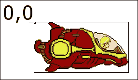

因此，我们必须考虑到这一点来设置我们的 `minY` 和 `maxY` 值。如图所示，位图的顶部像素确实正好绘制在飞船的 *y* 上。然后我们可以确信 `minY` 应该是零。

然而，船的底部是在 *y + 位图的高度* 处绘制的。

我们现在可以在构造函数中添加两行代码来初始化这些变量：

```java
maxY = screenY - bitmap.getHeight();
minY = 0;
```

你现在可以运行游戏并测试你的助推器了！

# 构建敌人

现在我们已经实现了水龙头控制，是时候添加一些玩家可以加速躲避的敌人了。

这将比我们添加玩家的宇宙飞船要容易得多，因为我们需要的很多东西已经准备好了。我们只需要编写一个表示敌人的类，实例化我们需要的敌人对象，调用它们的 `update` 方法，然后绘制它们。

正如我们将看到的，我们的敌人`update`方法将与`PlayerShip`的方法相当不同。它需要处理像简单 AI 飞向玩家这样的东西。它还需要处理当它离开屏幕时的重生。

## 设计敌人

首先，创建一个新的 Java 类，并将其命名为`EnemyShip`。在类内部添加以下成员变量，以便您的新的类看起来像这样：

```java
public class EnemyShip{
    private Bitmap bitmap;
    private int x, y;
    private int speed = 1;

    // Detect enemies leaving the screen
    private int maxX;
    private int minX;

    // Spawn enemies within screen bounds
    private int maxY;
    private int minY;
}
```

现在，添加一些 getter 和 setter 方法，以便`draw`方法可以访问它需要绘制的内容，以及它需要绘制的地方。这里没有什么新奇的或不同寻常的地方：

```java
//Getters and Setters
public Bitmap getBitmap(){
  return bitmap;
}

public int getX() {
  return x;
}

public int getY() {
  return y;
}
```

## 生成敌人

让我们来完整实现`EnemyShip`构造函数。现在输入代码，然后我们将更仔细地查看：

```java
// Constructor
public EnemyShip(Context context, int screenX, int screenY){
    bitmap = BitmapFactory.decodeResource 
    (context.getResources(), R.drawable.enemy);

  maxX = screenX;
  maxY = screenY;
  minX = 0;
  minY = 0;

  Random generator = new Random();
  speed = generator.nextInt(6)+10;

  x = screenX;
  y = generator.nextInt(maxY) - bitmap.getHeight();
}
```

构造函数的签名与`PlayerShip`类完全相同。一个用于操作您的`Bitmap`对象和`screenX`、`screenY`的`Context`类，它们持有屏幕的分辨率。

正如我们在`PlayerShip`类中所做的那样，我们将一个图像加载到`Bitmap`中。当然，我们还需要将一个名为`enemy.png`的图像文件添加到我们项目的`drawable`文件夹中。下载包的`Chapter3/drawable`文件夹中有一个整洁的敌人图形，或者您可以自己设计。对于这个游戏来说，任何大约 32 x 32 到 256 x 256 大小的图形都足够了。同样，像提供的那些图形一样，您的图形不需要是正方形的。我们将看到，当它显示在不同屏幕尺寸上时，我们的游戏引擎在视觉上是不完美的，我们将在下一个项目中解决这个问题：


接下来，我们初始化`maxX`、`maxY`、`minX`和`minY`。虽然敌人只水平移动，但我们需要`maxY`和`minY`坐标来确保我们在一个合理的身高处生成它们。`maxX`坐标将使我们能够在水平方向上刚好在屏幕外生成它们。

我们创建了一个新的`Random`对象，并生成一个介于 10 和 15 之间的随机数。这些是我们敌人可以旅行的最大和最小速度。这些值相当任意，我们可能在第四章 *Tappy Defender – 回家*进行一些游戏测试时调整它们。

### 注意

如果您想知道`generator.nextInt(6)+10;`是如何生成一个介于 10 到 15 之间的数字的，那是因为`6`参数导致`nextInt()`返回一个介于 0 到 5 之间的数字。

我们然后将敌人船的*x*坐标设置为屏幕，这样它就会在屏幕的右侧生成。实际上，这是在屏幕外生成。然而，这是可以的，因为它将随后进入玩家的视野，而不是一次性出现。

现在我们基于`maxY`——敌人的位图高度（`bitmap.getHeight()`）——生成另一个随机数，为我们的敌人船生成一个随机但合理的*y*坐标。

我们现在需要通过编写它们的更新方法来赋予我们的敌人生命。

## 让敌人思考

现在，我们可以处理 `EnemyShip` 类的 `update` 方法。目前，我们只需要处理两件事。首先，让敌人飞向玩家的屏幕末端。我们需要考虑敌人的速度和玩家的速度来准确模拟这一点。我们需要这样做的原因是，当玩家加速时，他期望自己的速度会增加，物体会更快速地向他冲来。然而，飞船的图形在水平方向上是静态的。

我们可以在玩家动态设置的速度（通过加速）的同时，按比例增加敌人的移动速度，这个速度既包括敌人的静态速度也包括随机生成的速度。这将给玩家一种加速的感觉，尽管船的图形从未向前移动。

另一个问题是我们需要检测敌舰最终会飞离屏幕，在左侧。我们需要检测这种情况发生，并在右侧以新的随机 *y* 坐标和新的随机速度重新生成它。这与我们在构造函数中做的是一样的。

最后，在我们实际编写代码之前，让我们考虑一下。如果敌人要记录并使用玩家的速度，它将需要能够获取它。注意，在下一块代码中，`EnemyShip` 类的 `update` 方法声明有一个参数来接收玩家的速度。

我们将在不久后添加代码到 `TDView` 类的 `update` 方法中，看看这是如何传递的。为 `EnemyShip` 类的 `update` 方法输入以下代码以实现我们刚才讨论的内容：

```java
public void update(int playerSpeed){

  // Move to the left
  x -= playerSpeed;
  x -= speed;

  //respawn when off screen
  if(x < minX-bitmap.getWidth()){
    Random generator = new Random();
    speed = generator.nextInt(10)+10;
    x = maxX;
    y = generator.nextInt(maxY) - bitmap.getHeight();
  }
}
```

如您所见，我们首先将敌人的 *x* 坐标减少了玩家的速度，然后是敌人的速度。当玩家加速时，敌人会以更快的速度飞向玩家。然而，如果玩家没有加速，敌人将以之前和随机生成的速度攻击。

```java
// Move to the left
x -= playerSpeed;
x -= speed;
```

在此之后，我们简单地检测了敌人位图的右边缘是否已经从屏幕的左侧消失。这是通过检测 `EnemyShip` 类的 *x* 坐标是否是位图宽度之外的来实现。

```java
if(x < minX-bitmap.getWidth()){
```

然后我们重新生成同一个对象再次攻击玩家。这对玩家来说看起来就像是一个全新的敌人。

我们必须做的最后三件事是从 `EnemyShip` 创建一个新的对象，通过声明和初始化对象来实现。实际上，让我们创建三个。

在这里，我们在 `TDView.java` 文件中声明了我们的玩家飞船，可以像这样声明三艘敌舰：

```java
// Game objects
private PlayerShip player;
public EnemyShip enemy1;

```

```java
public EnemyShip enemy2;
public EnemyShip enemy3;

```

现在，在我们的 `TDView` 类的构造函数中，初始化我们的三个新敌人：

```java
// Initialize our player ship
player = new PlayerShip(context, x, y);
enemy1 = new EnemyShip(context, x, y);
enemy2 = new EnemyShip(context, x, y);
enemy3 = new EnemyShip(context, x, y);

```

在我们的 `TDView` 类的 `update` 方法中，我们依次调用每个新对象的 `update` 方法。在这里，我们还可以看到我们如何将玩家的速度传递给每个敌人，以便他们可以在自己的 `update` 方法中使用它来相应地调整速度。

```java
// Update the player
player.update();
// Update the enemies
enemy1.update(player.getSpeed());
enemy2.update(player.getSpeed());
enemy3.update(player.getSpeed());
```

最后，在 `TDView` 类的 `draw` 方法中，我们将我们的新敌人绘制到屏幕上。

```java
// Draw the player
canvas.drawBitmap
    (player.getBitmap(), player.getX(), player.getY(), paint);

canvas.drawBitmap
 (enemy1.getBitmap(), 
 enemy1.getX(), 
 enemy1.getY(), paint);

canvas.drawBitmap
 (enemy2.getBitmap(), 
 enemy2.getX(), 
 enemy2.getY(), paint);

canvas.drawBitmap
 (enemy3.getBitmap(), 
 enemy3.getX(), 
 enemy3.getY(), paint);

```

现在，你可以运行游戏并尝试一下。

第一个也是最明显的问题是玩家和敌人可以直接穿过彼此。我们将在本章后面的*碰撞检测*部分解决这个问题。但此时，我们可以通过绘制一个星/太空尘埃场作为背景来提高玩家的沉浸感。

# 飞行的刺激——滚动背景

实现太空尘埃将会非常快且简单。我们只需创建一个具有与其他游戏对象非常相似属性的`SpaceDust`类。在随机位置将它们生成到游戏中，以随机速度向玩家移动，并在屏幕的远右侧以随机速度和`y`坐标重生它们。

然后在我们的`TDView`类中，我们可以声明一系列这些对象，每帧更新并绘制它们。

创建一个新的类，命名为`SpaceDust`。现在输入以下代码：

```java
public class SpaceDust {

    private int x, y;
    private int speed;

    // Detect dust leaving the screen
    private int maxX;
    private int maxY;
    private int minX;
    private int minY;

    // Constructor
    public SpaceDust(int screenX, int screenY){

        maxX = screenX;
        maxY = screenY;
        minX = 0;
        minY = 0;

        // Set a speed between  0 and 9
        Random generator = new Random();
        speed = generator.nextInt(10);

        //  Set the starting coordinates
        x = generator.nextInt(maxX);
        y = generator.nextInt(maxY);
    }

    public void update(int playerSpeed){
        // Speed up when the player does
        x -= playerSpeed;
        x -= speed;

        //respawn space dust
        if(x < 0){
            x = maxX;
            Random generator = new Random();
            y = generator.nextInt(maxY);
            speed = generator.nextInt(15);
        }
    }

    // Getters and Setters
    public int getX() {

        return x;
    }

    public int getY() {

        return y;
    }
}
```

下面是`SpaceDust`类中发生的事情。在上一个代码块顶部，我们声明了我们常用的速度、最大和最小变量。它们将允许我们检测`SpaceDust`对象何时离开屏幕左侧并需要在右侧重生，并为重生对象的高度提供合理的边界。

然后在`SpaceDust`构造函数内部，我们使用随机值初始化`speed`、`x`和`y`变量，但在这个我们刚刚初始化的最大和最小变量设定的范围内。

然后我们实现`SpaceDust`类的`update`方法，该方法根据对象的速度和玩家的速度将对象向左移动，然后检查对象是否已经飞出屏幕的左侧边缘，如果已经飞出，则使用随机但适当的值重生它。

在底部，我们提供了两个获取方法，以便我们的`draw`方法知道如何绘制每一粒尘埃。

现在，我们可以创建一个`ArrayList`对象来存储所有的`SpaceDust`对象。在`TDView`类顶部附近其他游戏对象的声明下方声明它：

```java
// Make some random space dust
public ArrayList<SpaceDust> dustList = new
  ArrayList<SpaceDust>();
```

在`TDView`构造函数中，我们可以使用`for`循环初始化一系列的`SpaceDust`对象，然后将它们存储到`ArrayList`对象中：

```java
int numSpecs = 40;

for (int i = 0; i < numSpecs; i++) {
  // Where will the dust spawn?
  SpaceDust spec = new SpaceDust(x, y);
  dustList.add(spec);
}
```

我们总共创建了四十粒尘埃。每次循环中，我们创建一个新的尘埃粒子，`SpaceDust`构造函数给它分配一个随机位置和速度。然后我们使用`dustList.add(spec);`将`SpaceDust`对象放入我们的`ArrayList`对象中。

接下来，我们跳转到`TDView`类的`update`方法，并使用增强型`for`循环对每个`SpaceDust`对象调用`update()`。

```java
for (SpaceDust sd : dustList) {
  sd.update(player.getSpeed());
}
```

记住我们传递了玩家速度，这样尘埃的速度会相对于玩家的速度增加或减少。

现在要绘制所有我们的太空尘埃，我们遍历我们的 `ArrayList` 对象，一次绘制一个点。当然，我们将代码添加到 `TDView` 类的 `draw` 方法中，但我们必须确保首先绘制太空尘埃，这样它就会出现在其他游戏对象之后。此外，我们在使用 `Canvas` 对象的 `drawPoint` 方法绘制每个 `SpaceDust` 对象的单个像素之前，添加了一行额外的代码来切换像素颜色为白色。

在 `TDView` 类的 `draw` 方法中，添加以下代码来绘制我们的尘埃：

```java
// White specs of dust
paint.setColor(Color.argb(255, 255, 255, 255));

//Draw the dust from our arrayList
for (SpaceDust sd : dustList) {
      canvas.drawPoint(sd.getX(), sd.getY(), paint);

    // Draw the player
    // ...
}
```

这里唯一的新东西是 `canvas.drawpoint...` 这行代码。除了在屏幕上绘制位图之外，`Canvas` 类还允许我们绘制原语，如点和线，以及文本和形状等。我们将在第四章 Tappy Defender – Going Home 中使用这些功能来绘制我们的游戏 HUD。

为什么不运行应用程序并查看我们实现了多少有趣的功能？在这个屏幕截图中，我为了好玩，临时增加了 `SpaceDust` 对象的数量到 `200`。你还可以看到我们绘制了敌人，它们在随机的 *y* 坐标上以随机速度攻击：

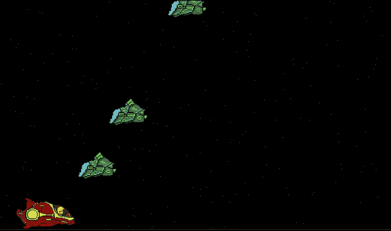

# 发生碰撞的事物 - 碰撞检测

碰撞检测是一个相当广泛的主题。在这本书的三个项目中，我们将使用各种不同的方法来检测物体何时发生碰撞。

因此，这里快速看一下我们的碰撞检测选项，以及在什么情况下不同的方法可能是合适的。

实际上，我们只需要知道我们游戏中的某些物体何时触摸其他物体。然后我们可以通过爆炸、减少护盾、播放声音或采取适当的行动来响应该事件。我们需要对不同的选项有一个广泛的理解，这样我们才能在任何特定的游戏中做出正确的决定。

## 碰撞检测选项

首先，这里有一些我们可以利用的不同数学计算，以及它们可能何时有用。

### 矩形交集

这种碰撞检测类型非常直接。我们画一个想象中的矩形；我们可以称之为击中框或边界矩形，围绕我们想要测试碰撞的物体。然后测试它们是否相交。如果相交，我们就有了碰撞：


当击中框相交时，我们就有碰撞。从之前的图像中我们可以看到，这远非完美。然而，在某些情况下，这已经足够了。要实现这种方法，我们只需要测试两个物体的 *x* 和 *y* 坐标是否相交。

不要使用以下代码。它仅用于演示目的。

```java
if(ship.getHitbox().right > enemy.getHitbox().left  
    && ship.getHitbox().left < enemy.getHitbox().right ){
    // Ship is intersecting enemy on x axis
    //But they could be at different heights

    if(ship.getHitbox().top < enemy.getHitbox().bottom  
        && ship.getHitbox().bottom > enemy.getHitbox().top ){
        // Ship is intersecting enemy on y axis as well
        // Crash
    }
}
```

之前的代码假设我们有一个`getHitbox`方法，它可以返回给定对象的左和右 *x* 坐标以及上和下 *y* 坐标。在上面的代码中，我们首先检查 *x* 轴是否重叠。如果没有重叠，那么就没有必要继续下去。如果重叠，然后检查 *y* 轴。如果没有重叠，那可能是一个在上方或下方的敌人快速掠过。如果它们在 *y* 轴上也重叠，那么我们就有了碰撞。

注意，我们可以以任何顺序检查 *x* 和 *y* 轴，只要我们检查它们两个。

### 半径重叠

这种方法也在检查两个碰撞框是否相互重叠，但正如标题所暗示的，它是通过圆形来实现的。这显然有明显的优点和缺点。主要是这种方法与更圆的形状配合得很好，而与细长的形状配合得不好。

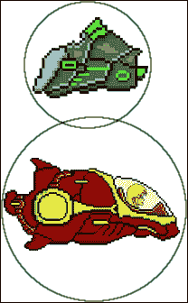

从上一张图中，很容易看出对于这些特定的对象，半径重叠方法是不准确的，而且不难想象对于一个像球这样的圆形物体，它将是完美的。

这就是我们如何实现这个方法。

### 注意

以下代码仅用于演示目的。

```java
// Get the distance of the two objects from 
// the edges of the circles on the x axis
distanceX = (ship.getHitBox.centerX + ship.getHitBox.radius) - 
  (enemy.getHitBox.centerX + enemy.getHitBox.radius;

// Get the distance of the two objects from 
// the edges of the circles on the y axis
distanceY = (ship.getHitBox.centerY + ship.getHitBox.radius) -  
  (enemy.getHitBox.centerY + enemy.getHitBox.radius;

// Calculate the distance between the center of each circle
double distance = Math.sqrt
    (distanceX * distanceX + distanceY * distanceY);

// Finally see if the two circles overlap
if (distance < ship.getHitBox.radius + enemy.getHitBox.radius) {
    // bump
}
```

代码再次做出了一些假设。比如我们有一个`getHitBox`方法，它可以返回半径以及中心 *x* 和 *y* 坐标。此外，因为静态`Math.sqrt`方法接受并返回一个类型为`double`的变量，我们将在我们的`SpaceShip`和`EnemyShip`类中开始使用不同的类型。

### 注意

如果我们初始化距离的方式`Math.sqrt(distanceX * distanceX + distanceY * distanceY);`看起来有点令人困惑，它只是在使用毕达哥拉斯定理来获取三角形的斜边长度，这个斜边长度等于两个圆心之间画出的直线长度。在我们的解决方案的最后一条线中，我们测试`distance < ship.getHitBox.radius + enemy.getHitBox.radius`，然后我们可以确定我们肯定有一个碰撞。这是因为如果两个圆的中心点比它们半径的总和还要近，它们必须重叠。

### 跨越数算法

这种方法在数学上更复杂。然而，正如我们将在我们的第三个和最后一个项目中看到的那样，它非常适合检测一个点是否与凸多边形相交：

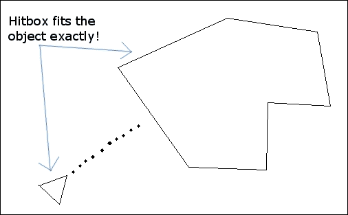

这对于制作小行星克隆游戏是完美的，我们将在我们的最终项目中更深入地探讨这种方法，并看到它在实际中的应用。

## 优化

正如我们所看到的，不同的碰撞检测方法可能至少有两个问题，这取决于你在哪种情况下使用哪种方法。问题是缺乏准确性和对 CPU 周期的消耗。

### 多个碰撞框

第一个问题，缺乏准确性，可以通过每个对象有多个碰撞框来解决。

我们只需将所需数量的碰撞框添加到游戏对象中，以最有效地将其“包裹”，然后依次对每个对象执行相同的矩形交集代码。

### 邻居检查

这种方法允许我们只检查彼此大致位于同一区域的对象。这可以通过检查给定两个对象位于我们游戏中的哪个区域来实现，然后只有在有实际可能发生碰撞的情况下才执行更耗 CPU 的碰撞检测。

假设有 10 个对象需要相互检查，那么我们需要执行 10 的平方（100）次碰撞检测。如果我们首先进行邻居检查，可以显著减少这个数量。在非常假设的情况图中，如果我们首先检查对象是否共享同一个区域，那么对于我们的 10 个对象，我们只需要进行最多 11 次碰撞检测，而不是 100 次。

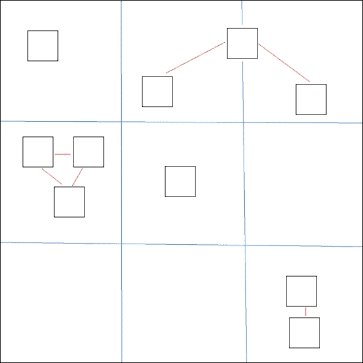

在代码中实现这一点可能就像为每个游戏对象添加一个区域成员变量，然后遍历对象列表，检查它们是否位于同一个区域。

### 注意

在我们的三个游戏项目中，我们将使用所有这些选项和优化。

## Tappy Defender 的最佳选项

现在我们知道了我们的碰撞检测选项，我们可以在当前游戏中决定最佳的行动方案。我们的所有飞船都是近似矩形的（或正方形），它们上面几乎没有或没有极端部分，我们只关心一个对象的碰撞（与其他所有对象）。

这通常意味着我们可以为玩家和敌人使用单个矩形碰撞框，并执行纯角对齐的全局碰撞检测。如果你对我们选择简单方案感到失望，那么你将很高兴听到，在接下来的两个项目中，我们将涉及所有更复杂的技巧。

为了让生活更加便捷，Android API 提供了一个方便的 `Rect` 类，它不仅能表示我们的碰撞框，还包含一个整洁的 `intersects` 方法，基本上与矩形交集碰撞检测做的是同样的事情。让我们来思考如何将碰撞检测添加到我们的游戏中。

首先，我们所有的敌人和我们的玩家飞船都需要一个碰撞框。将以下代码添加到声明新的 `Rect` 成员变量 `hitbox` 中。在 `PlayerShip` 和 `EnemyShip` 类中执行此操作：

```java
// A hit box for collision detection
private Rect hitBox;
```

### 小贴士

**重要！**

确保为 `EnemyShip` 类和 `PlayerShip` 类执行之前的步骤以及接下来的三个代码块。我会每次提醒你，但认为提前提一下也很有必要。

现在，我们需要为 `PlayerShip` 类和 `EnemyShip` 类添加一个获取器方法。将以下代码添加到这两个类中：

```java
public Rect getHitbox(){
  return hitBox;
}
```

接下来，我们需要确保在两个构造函数中初始化我们的碰撞框。确保在构造函数的末尾输入代码：

```java
// Initialize the hit box
hitBox = new Rect(x, y, bitmap.getWidth(), bitmap.getHeight());
```

现在，我们需要确保击中区域与我们的敌人和玩家的坐标保持最新。做这件事的最佳地方是敌人和玩家飞船的`update`方法。接下来的代码块将使用飞船的当前坐标更新击中区域。确保在`update()`方法的末尾添加此代码块，以便在`update`方法完成调整后更新击中区域。再次提醒，将其添加到`PlayerShip`和`EnemyShip`中：

```java
// Refresh hit box location
hitBox.left = x;
hitBox.top = y;
hitBox.right = x + bitmap.getWidth();
hitBox.bottom = y + bitmap.getHeight();
```

我们的击中区域坐标代表了我们位图的轮廓。这种情况几乎是完美的，除了边缘周围的透明部分。

现在，我们可以使用`TDView`类的`update`方法中的击中区域来检测碰撞。但在做之前，我们需要决定当发生碰撞时我们将做什么。

我们需要参考我们游戏规则。我们之前在第二章，*Tappy Defender – 第一步*中讨论过这些规则。我们知道玩家有三个护盾，但敌人被击中一次后就会爆炸。将像护盾这样的东西留到章节的后面部分是有道理的，但我们需要某种方式来查看我们的碰撞检测是否在起作用并确保它正常工作。

在这个阶段，承认碰撞的最简单方法可能是让敌舰消失并重新生成，就像它是一个全新的敌人一样。我们已经有了一个实现这个功能的机制。我们知道当敌人移动到屏幕的左侧时，它会像在右侧的新敌人一样重新生成。我们只需要将敌人瞬间传送到屏幕左侧之外的位置，`EnemyShip`类就会完成剩下的工作。

我们需要能够改变`EnemyShip`对象的*x*坐标。让我们在`EnemyShip`类中添加一个 setter 方法，这样我们就可以操作所有敌舰的*x*坐标。如下所示：

```java
// This is used by the TDView update() method to
// Make an enemy out of bounds and force a re-spawn
public void setX(int x) {
  this.x = x;
}
```

现在，我们可以执行碰撞检测，并在被击中时做出反应。接下来的代码块使用静态方法`Rect.intersects()`通过依次比较玩家飞船的击中区域和每个敌人击中区域来检测碰撞。如果检测到碰撞，适当的敌人将被移出屏幕，准备在下一帧由其自己的`update`方法重新生成。在`TDView`类的`update`方法的最顶部输入此代码：

```java
// Collision detection on new positions
// Before move because we are testing last frames
// position which has just been drawn

// If you are using images in excess of 100 pixels
// wide then increase the -100 value accordingly
if(Rect.intersects
  (player.getHitbox(), enemy1.getHitbox())){
    enemy1.setX(-100);
}

if(Rect.intersects
  (player.getHitbox(), enemy2.getHitbox())){
    enemy2.setX(-100);
}

if(Rect.intersects
  (player.getHitbox(), enemy3.getHitbox())){
    enemy3.setX(-100);
}
```

就这样，我们的碰撞检测现在将正常工作。能够真正看到正在发生的事情可能很好。为了调试的目的，让我们在所有的飞船周围画一个矩形，这样我们就可以看到击中区域。我们将使用`Paint`类的`drawRect`方法，并将我们的击中区域属性作为参数传递，以定义要绘制的区域。正如你所期望的，这段代码将放在`draw`方法中。注意，它应该在绘制我们飞船的代码之前，这样矩形就会在飞船后面绘制，但在清除屏幕之后，如高亮代码所示：

```java
// Rub out the last frame
canvas.drawColor(Color.argb(255, 0, 0, 0));

// For debugging
// Switch to white pixels
paint.setColor(Color.argb(255, 255, 255, 255));

// Draw Hit boxes
canvas.drawRect(player.getHitbox().left, 
 player.getHitbox().top, 
 player.getHitbox().right, 
 player.getHitbox().bottom, 
 paint);

canvas.drawRect(enemy1.getHitbox().left, 
 enemy1.getHitbox().top, 
 enemy1.getHitbox().right, 
 enemy1.getHitbox().bottom, 
 paint);

canvas.drawRect(enemy2.getHitbox().left, 
 enemy2.getHitbox().top, 
 enemy2.getHitbox().right, 
 enemy2.getHitbox().bottom, 
 paint);

canvas.drawRect(enemy3.getHitbox().left, 
 enemy3.getHitbox().top, 
 enemy3.getHitbox().right, 
 enemy3.getHitbox().bottom, 
 paint);

```

现在，我们可以运行 Tappy Defender，并看到游戏在调试模式下的击中框完全启用的情况：

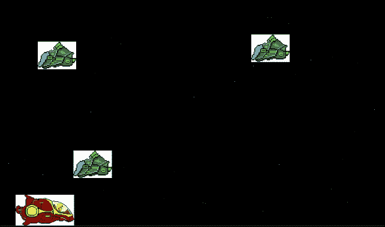

当我们完成调试代码后，我们可以将其注释掉，然后在需要时再次取消注释。

# 摘要

现在我们拥有了完成整个游戏所需的所有游戏对象。它们都在我们的设计模式的模型部分内部思考和代表自己。此外，我们的玩家现在终于可以控制他的宇宙飞船了，我们也可以检测到他何时撞毁。

在下一章中，我们将为我们的游戏添加最后的修饰，包括添加 HUD（抬头显示）、实现游戏规则、添加一些额外功能，并对游戏进行测试以平衡一切。

# 第四章 Tappy Defender – 回家

我们已经进入了第一款游戏的冲刺阶段。在本章中，我们将绘制一个 HUD（头部显示单元）来显示玩家在游戏中的信息，并实现游戏规则，以便玩家可以赢、输和获得最快时间。

之后，我们将制作一个暂停屏幕，让玩家在赢或输后可以欣赏他们的成就（或者不是）。

在本章中，我们还将生成我们自己的音效，并将其添加到游戏中。之后，我们将允许玩家保存他们的最快时间，最后我们将添加一些小的改进，包括根据玩家安卓设备的屏幕分辨率进行的一点点难度平衡。

# 显示 HUD

我们需要开始让我们的游戏更加完善。游戏有一个得分或者，在我们的情况下，是一个时间，以及其他规则。为了使玩家能够监控他们的进度，我们需要显示游戏的统计数据。

在这里，我们将快速设置一个 HUD，它将在玩家躲避敌人时在屏幕上显示他们所需了解的一切。我们还将声明并初始化向 HUD 提供数据的变量。在下一节“实现规则”中，我们可以开始操作如护盾、时间、最快时间等变量。

我们可以从向`TDView`类添加一些成员变量开始。我们使用浮点值来表示`distanceRemaining`变量，因为我们将会使用伪千米和千米分数来表示英雄到达她家园星球之前剩余的距离。对于`timeTaken`、`timeStarted`和`fastestTime`变量，我们将使用**长**类型，因为时间以毫秒表示，值会变得非常大。在`TDView`类声明之后添加此代码：

```java
private float distanceRemaining;
private long timeTaken;
private long timeStarted;
private long fastestTime;
```

现在，我们将只保留这些变量默认的值，并专注于在 HUD 中显示它们。在下一节“实现规则”中，我们将使它们变得有用和有意义。

现在，我们可以继续绘制我们的 HUD，以显示玩家在游戏过程中可能想要了解的所有数据。像往常一样，我们将使用我们多才多艺的`Paint`类对象`paint`来完成大部分工作。这次，我们使用`drawText`方法向屏幕添加文本，使用`setTextAlign`方法对齐文本，并使用`setTextSize`调整文本大小。

我们现在可以将此代码添加到`TDView`类的`draw`方法中。将其添加为最后要绘制的内容，在调用`unlockCanvasAndPost()`之前，如高亮代码所示：

```java
// Draw the hud
paint.setTextAlign(Paint.Align.LEFT);
paint.setColor(Color.argb(255, 255, 255, 255));
paint.setTextSize(25);
canvas.drawText("Fastest:"+ fastestTime + "s", 10, 20, paint);
canvas.drawText("Time:" + timeTaken + "s", screenX / 2, 20, paint);
canvas.drawText("Distance:" + 
 distanceRemaining / 1000 + 
 " KM", screenX / 3, screenY - 20, paint);

canvas.drawText("Shield:" + 
 player.getShieldStrength(), 10, screenY - 20, paint);

canvas.drawText("Speed:" + 
 player.getSpeed() * 60 + 
 " MPS", (screenX /3 ) * 2, screenY - 20, paint);

// Unlock and draw the scene
ourHolder.unlockCanvasAndPost(canvas);
```

输入此代码后，我们有一些错误和一些疑问。

首先，我们将处理疑问。在下一节“实现规则”中，我们将更仔细地查看我们对`fastestTime`、`timeTaken`、`distanceRemaining`以及`getSpeed`返回的值的操作。简而言之，它们是距离和时间的表示，旨在让玩家了解他们的表现。它们不是距离的真实模拟，尽管时间是准确的。

我们将首先处理由调用不存在的方法`player.getShieldStrength`引起的第一个错误。向`PlayerShip`类添加一个成员变量`shieldStrength`：

```java
private int shieldStrength;
```

在`PlayerShip`构造函数中将它初始化为`2`：

```java
 shieldStrength = 2;
```

在`PlayerShip`类中实现你缺失的 getter 方法：

```java
public int getShieldStrength() {
  return shieldStrength;
}
```

最后的错误是由未声明的变量`screenX`和`screenY`引起的。现在很明显，我们需要在这个代码部分的屏幕分辨率。处理这个问题最快的方法是创建一些新的类变量`screenX`和`screenY`。现在就在`TDView`类声明之后声明这些变量：

```java
private int screenX;
private int screenY;
```

正如我们将看到的，知道屏幕坐标在许多地方都很有用，所以这样做是有意义的。

现在，在`TDView`构造函数中，使用`GameActivity`类传入的分辨率初始化`screenX`和`screenY`。在构造函数的开始处执行此操作：

```java
screenX = x;
screenY = y;
```

我们现在可以运行游戏并查看我们的 HUD。我们 HUD 中带有有意义数据的部分只有**护盾**和**速度**标签。速度是每秒米数（MPS）的伪测量值。当然，它与现实无关，但它与旋转的星星、接近的敌人以及玩家与家的距离减少有关：

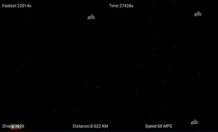

# 实现规则

现在，我们应该暂停并思考在项目后期需要做什么，因为它将影响我们在实现规则时的操作。当玩家的飞船被摧毁或玩家达到他们的目标时，游戏将结束。这意味着游戏需要重新启动。我们不希望每次都退出到主屏幕，因此我们需要一种从`TDView`类内部重新启动游戏的方法。

为了方便起见，我们将在`TDView`类中实现一个`startGame`方法。构造函数将能够调用它，并且我们的游戏循环在必要时也可以调用它。

还需要将构造函数当前执行的一些任务传递给新的 `startGame` 方法，以便它能够正确地完成其工作。此外，我们将使用 `startGame` 来初始化我们游戏规则和 HUD 所需的某些变量。

为了完成我们讨论的内容，`startGame()` 将需要一个应用 `Context` 对象的副本。所以，就像我们对 `startX` 和 `startY` 所做的那样，我们现在将 `context` 作为 `TDView` 的成员。在 `TDView` 类声明之后声明它：

```java
private Context context;
```

在调用 `super()` 之后立即在构造函数中初始化它，如下所示：

```java
super(context);
this.context  = context;

```

我们现在可以实施新的 `startGame` 方法。大部分代码只是从构造函数中移动过来。请注意这些微妙但重要的差异，例如使用类的屏幕坐标版本 `screenX` 和 `screenY` 而不是构造函数参数 *x* 和 *y*。此外，我们还初始化了 `distanceRemaining`、`timeTaken` 和 `timeStarted`。

```java
private void startGame(){
    //Initialize game objects
        player = new PlayerShip(context, screenX, screenY);
        enemy1 = new EnemyShip(context, screenX, screenY);
        enemy2 = new EnemyShip(context, screenX, screenY);
        enemy3 = new EnemyShip(context, screenX, screenY);

        int numSpecs = 40;
        for (int i = 0; i < numSpecs; i++) {
            // Where will the dust spawn?
            SpaceDust spec = new SpaceDust(screenX, screenY);
            dustList.add(spec);
        }

        // Reset time and distance
        distanceRemaining = 10000;// 10 km
        timeTaken = 0;

        // Get start time
        timeStarted = System.currentTimeMillis();
}
```

### 注意

你想知道 `timeStarted` 初始化发生了什么吗？我们使用 `System` 类的方法 `currentTimeMillis` 来初始化 `startTime`。现在，`startTime` 保存了自 1970 年 1 月 1 日以来的毫秒数。我们将在接下来的部分中看到它是如何被使用的，*结束游戏*。`System` 类有很多用途。在这里，我们使用它来获取自 1970 年 1 月 1 日以来的毫秒数。这是一个在计算机中测量时间的通用系统。它被称为 Unix 时间，而 1970 年 1 月 1 日第一毫秒之前被称为 Unix 纪元。

现在，注释掉或删除 `TDView` 构造函数中现在不再需要的代码，但用 `startGame()` 调用替换它：

```java
// Initialize our player ship
//player = new PlayerShip(context, x, y);
//enemy1 = new EnemyShip(context, x, y);
//enemy2 = new EnemyShip(context, x, y);
//enemy3 = new EnemyShip(context, x, y);

//int numSpecs = 40;

//for (int i = 0; i < numSpecs; i++) {
      // Where will the dust spawn?
      //SpaceDust spec = new SpaceDust(x, y);
      //dustList.add(spec);
//}

startGame();

```

接下来，我们想要创建一个方法来减少 `PlayerShip` 的护盾强度。这样，当我们检测到碰撞时，我们可以每次减少一个。将此简单方法添加到 `PlayerShip` 类中：

```java
public void reduceShieldStrength(){
  shieldStrength --;
}
```

现在，我们可以跳转到 `TDView` 类的 `update` 方法，并添加代码以进一步实现我们的游戏规则。我们将在进行所有碰撞检测之前添加一个布尔变量 `hitDetected`。在每个检测到击中的 `if` 块内部，我们可以将 `hitDetected` 设置为 `true`。

然后，在所有碰撞检测代码之后，我们可以检查是否检测到击中，并相应地减少玩家的护盾强度。以下是 `TDView` 类的 `update` 方法的顶部部分，其中新的代码行被突出显示：

```java
// Collision detection on new positions
// Before move because we are testing last frames
// position which has just been drawn
boolean hitDetected = false;
if(Rect.intersects(player.getHitbox(), enemy1.getHitbox())){
 hitDetected = true;
    enemy1.setX(-100);
}

if(Rect.intersects(player.getHitbox(), enemy2.getHitbox())){
 hitDetected = true;
    enemy2.setX(-100);
}

if(Rect.intersects(player.getHitbox(), enemy3.getHitbox())){
 hitDetected = true;
    enemy3.setX(-100);
}

if(hitDetected) {
 player.reduceShieldStrength();
 if (player.getShieldStrength() < 0) {
 //game over so do something
 }
}

```

注意在调用 `player.reduceShieldStrength` 之后嵌套的 `if` 语句。这检测玩家是否已经失去了所有的护盾并失败了。我们将很快处理这里发生的事情。

我们离完成游戏规则已经非常接近了。我们只需要根据玩家的速度减少`distanceRemaining`的相对值。这样我们就可以知道玩家何时成功。我们还需要更新`timeTaken`变量，以便每次调用绘制方法时更新 HUD。这看起来可能并不重要，但稍微提前思考一下，我们可以预见游戏结束的时间，无论是由于玩家失败还是获胜。让我们来谈谈游戏的结束。

# 游戏结束

如果游戏没有结束，游戏正在进行，如果玩家刚刚死亡或获胜，则游戏结束。我们需要知道游戏何时结束以及何时在进行。让我们创建一个新的成员变量`gameEnded`，并在`TDView`类声明之后声明它：

```java
private boolean gameEnded;
```

现在，我们可以在`startGame`方法中初始化`gameEnded`。将此代码作为方法中的最后一行输入。

```java
gameEnded = false;
```

现在，我们可以完成游戏规则逻辑的最后几行，但将它们包裹在一个测试中，以查看游戏是否已经结束。将以下代码添加到`TDView`类的`update`方法末尾，以条件性地更新我们的游戏规则逻辑：

```java
if(!gameEnded) {
            //subtract distance to home planet based on current speed
            distanceRemaining -= player.getSpeed();

            //How long has the player been flying
            timeTaken = System.currentTimeMillis() - timeStarted;
}
```

我们的 HUD 现在将具有准确的数据，以让玩家了解他们确切的情况。我们还可以检测玩家何时到达家并获胜，因为`distanceRemaining`将超过零。此外，当剩余距离小于零时，我们可以测试`timeTaken`是否小于`fastestTime`，并在必要时更新`fastestTime`。我们还可以将`gameEnded`设置为`true`。将此代码直接添加到`TDView`类`update`方法的最后一个代码块之后：

```java
//Completed the game!
if(distanceRemaining < 0){
  //check for new fastest time
  if(timeTaken < fastestTime) {
    fastestTime = timeTaken;
  }

  // avoid ugly negative numbers
  // in the HUD
  distanceRemaining = 0;

  // Now end the game
  gameEnded = true;
}
```

当玩家获胜时，我们结束了游戏；现在，在`TDView`类的`update`方法中添加此行代码以结束游戏，当玩家失去所有护盾时：

```java
if(hitDetected) {
  player.reduceShieldStrength();
  if (player.getShieldStrength() < 0) {
 gameEnded = true;
 }
}
```

现在，我们只需要在`gameEnded`设置为`true`时让一些事情真正发生。

做这件事的一种方法是根据`gameEnded`布尔值是真是假来交替绘制 HUD。在`draw`方法中识别 HUD 绘制代码，如下再次显示，以便于参考：

```java
// Draw the HUD
paint.setTextAlign(Paint.Align.LEFT);
paint.setColor(Color.argb(255, 255, 255, 255));
paint.setTextSize(25);
canvas.drawText("Fastest:"+ fastestTime + "s", 10, 20, paint);
canvas.drawText("Time:" + timeTaken + "s", screenX / 2, 20, paint);

canvas.drawText("Distance:" + 
  distanceRemaining / 1000 + 
  " KM", screenX / 3, screenY - 20, paint);

canvas.drawText("Shield:" + 
  player.getShieldStrength(), 10, screenY - 20, paint);

canvas.drawText("Speed:" + 
  player.getSpeed() * 60 +
  " MPS", (screenX /3 ) * 2, screenY - 20, paint);
```

我们希望将这段代码包裹在一个`if-else`块中。如果游戏没有结束，则绘制正常 HUD，否则绘制替代 HUD。将 HUD 绘制代码包裹如下：

```java
if(!gameEnded){
  // Draw the hud
  paint.setTextAlign(Paint.Align.LEFT);
  paint.setColor(Color.argb(255, 255, 255, 255));
  paint.setTextSize(25);
  canvas.drawText("Fastest:"+ fastestTime + "s", 10, 20, paint);

  canvas.drawText("Time:" + 
    timeTaken + 
    "s", screenX / 2, 20,   paint);

  canvas.drawText("Distance:" + 
    distanceRemaining / 1000 + 
    " KM", screenX / 3, screenY - 20, paint);

  canvas.drawText("Shield:" + 
    player.getShieldStrength(), 10, screenY - 20, paint);

  canvas.drawText("Speed:" + 
    player.getSpeed() * 60 +
    " MPS", (screenX /3 ) * 2, screenY - 20, paint);

}else{
 //this happens when the game is ended
}

```

现在，让我们处理`else`块，我们将在这个块中执行游戏结束时的操作。我们将绘制一个大的**游戏结束**，并显示从 HUD 中获取的结束游戏统计数据。线程将继续，但 HUD 将停止更新。在`else`块中输入以下代码：

```java
// Show pause screen
paint.setTextSize(80);
paint.setTextAlign(Paint.Align.CENTER);
canvas.drawText("Game Over", screenX/2, 100, paint);
paint.setTextSize(25);
canvas.drawText("Fastest:"+ 
  fastestTime + "s", screenX/2, 160, paint);

canvas.drawText("Time:" + timeTaken + 
  "s", screenX / 2, 200, paint);

canvas.drawText("Distance remaining:" + 
  distanceRemaining/1000 + " KM",screenX/2, 240, paint);

paint.setTextSize(80);
canvas.drawText("Tap to replay!", screenX/2, 350, paint);
```

注意，我们使用`setTextSize()`切换文本大小，并使用`setTextAlign()`将屏幕中心的所有文本对齐。这就是运行游戏时的样子。我们只需要在游戏结束后有一种方法可以重启游戏：

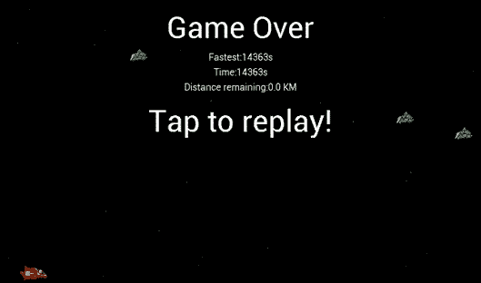

## 重启游戏

为了允许玩家在游戏结束后重新开始，我们只需要监听触摸并调用`startGame()`。让我们编辑我们的`onTouchListener()`代码来实现这一点。我们感兴趣的修正案例是`MotionEvent.ACTION_DOWN:`。我们可以在其中添加条件，如果游戏结束时屏幕被触摸，则重新启动。要添加到`MotionEvent.ACTION_DOWN:`案例的新代码已突出显示：

```java
// Has the player touched the screen?
case MotionEvent.ACTION_DOWN:
    player.setBoosting();
 // If we are currently on the pause screen, start a new game
 if(gameEnded){
 startGame();
 }
   break;
```

尝试一下。你现在可以从暂停菜单通过点击屏幕来重新启动游戏。是不是只有我觉得这里有点安静？

# 添加声音效果

在安卓中添加声音效果非常简单。首先，让我们看看我们可以在哪里获取我们的声音效果。如果你只想继续编码，你可以使用我在`Chapter4/assets`文件夹中的声音效果。

## 生成声音效果

我们需要为我们的 Tappy Defender 游戏准备四个声音效果：

+   当我们的玩家撞到外星人的声音，我们将称之为`bump.ogg`。

+   当玩家被摧毁时的声音，我们将称之为`destroyed.ogg`。

+   当游戏刚开始时的一种有趣的声音，我们将称之为`start.ogg`。

+   最后，一种胜利时的欢呼声类型的声音，我们将称之为`win.ogg`。

这里是使用 BFXR 制作这些声音效果的快速指南。从[www.bfxr.net](http://www.bfxr.net)获取 BFXR 的免费副本。

按照网站上的简单说明来设置它。尝试一些这些操作来制作我们酷炫的声音效果。

### 注意

这是一个非常简化的教程。你可以用 BFXR 做很多事情。要了解更多，请阅读之前 URL 上的网站上的提示。

1.  运行`bfxr.exe`。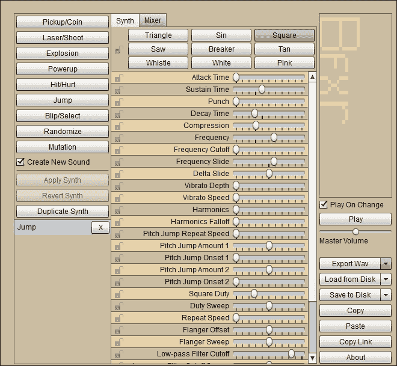

1.  尝试所有预设类型，这些类型会生成你正在工作的随机声音。当你得到一个接近你想要的声音时，移动到下一步：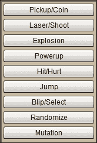

1.  使用滑块来微调你新声音的音高、时长和其他方面：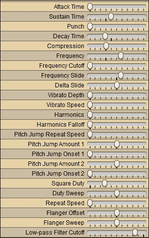

1.  通过点击**导出 Wav**按钮保存你的声音。尽管这个按钮的名称是`.wav`，但我们会看到我们还可以保存其他格式的文件。

1.  安卓喜欢使用 OGG 格式的声音，所以当被要求命名文件时，在文件名末尾使用`.ogg`扩展名。记住我们需要创建`bump.ogg`、`destroyed.ogg`、`start.ogg`和`win.ogg`。

1.  重复步骤 2 到 5，创建我们讨论过的四个声音效果。

1.  右键点击 Android Studio 中的`app`文件夹。从弹出菜单中，导航到**新建** | **Android 资源目录**。

1.  在**目录名称**字段中，输入`assets`。点击**确定**来创建`assets`文件夹。

1.  使用你的操作系统文件管理器将一个名为`assets`的文件夹添加到项目的根目录中，然后将四个声音文件添加到项目中的新`assets`文件夹。

## SoundPool 类

要播放我们的声音，我们将使用`SoundPool`类。我们使用已弃用的`SoundPool`构造函数，因为新版本需要 API 21 或更高版本，而且很可能许多读者仍在使用 Android 的早期版本。我们可以动态获取 Android 版本，并为 API 级别 21 之前和之后提供不同的代码版本，但较旧的构造函数符合我们的需求。

## 编写声音效果

声明一个`SoundPool`对象和一些整数来表示单个声音。在`TDView`类声明之后立即添加此代码：

```java
private SoundPool soundPool;
    int start = -1;
    int bump = -1;
    int destroyed = -1;
    int win = -1;
```

接下来，我们可以初始化我们的`SoundPool`对象和整数声音 ID。我们按照要求将代码包裹在`try`-`catch`块中。

注意，调用`load()`开始了一个将我们的`.ogg`文件转换为原始声音数据的过程。如果在调用`playSound()`时此过程尚未完成，则声音将无法播放。`load()`的调用顺序很可能是它们被使用的顺序，以最大限度地减少这种可能性。按照如下所示，将此代码放入我们的`TDView`类的构造函数中。新的代码已高亮显示：

```java
TDView(Context context, int x, int y) {
  super(context);
  this.context  = context;

 // This SoundPool is deprecated but don't worry
 soundPool = new SoundPool(10, AudioManager.STREAM_MUSIC,0);
 try{
 //Create objects of the 2 required classes
 AssetManager assetManager = context.getAssets();
 AssetFileDescriptor descriptor;

 //create our three fx in memory ready for use
 descriptor = assetManager.openFd("start.ogg");
 start = soundPool.load(descriptor, 0);

 descriptor = assetManager.openFd("win.ogg");
 win = soundPool.load(descriptor, 0);

 descriptor = assetManager.openFd("bump.ogg");
 bump = soundPool.load(descriptor, 0);

 descriptor = assetManager.openFd("destroyed.ogg");
 destroyed = soundPool.load(descriptor, 0);

 }catch(IOException e){
 //Print an error message to the console
 Log.e("error", "failed to load sound files");
 }

```

在我们的代码中代表游戏中的适当事件的适当位置使用适当的引用调用`playSound()`。我们有四个声音，所以将调用四次`playSound()`。

第一个放在`startGame()`方法的最后：

```java
soundPool.play(start, 1, 1, 0, 0, 1);
```

下两个在`if(hitDetected)`块中高亮显示：

```java
if(hitDetected) {
 soundPool.play(bump, 1, 1, 0, 0, 1);
  player.reduceShieldStrength();
  if (player.getShieldStrength() < 0) {
 soundPool.play(destroyed, 1, 1, 0, 0, 1);
      paused = true;
  }
}
```

最后一个在`if(distanceRemaining < 0)`块中，如下所示高亮显示：

```java
//Completed the game!
if(distanceRemaining < 0){
 soundPool.play(win, 1, 1, 0, 0, 1);
     //check for new fastest time
     if(timeTaken < fastestTime) {
         fastestTime = timeTaken;
     }

     // avoid ugly negative numbers
     // in the HUD
     distanceRemaining = 0;

     // Now end the game
     gameEnded = true;
}
```

现在是时候运行 Tappy Defender 并听到实际操作的声音了。

我们将看到如何通过在玩家达到高分时将其保存到文件，并在 Tappy Defender 启动时再次加载，来保存玩家的最高分。

# 添加持久性

你可能已经注意到当前的最快时间是零，因此永远无法打破。另一个问题是，每次玩家退出游戏时，高分都会丢失。现在，我们将从文件中加载默认高分。当达到新的高分时，将其保存到文件中。无论玩家是否退出游戏，甚至关闭他们的手机，他们的高分都将保持不变。

首先，我们需要两个新对象。在`TDView`类声明之后，将它们声明为`TDView`类的成员。第一个是一个`SharedPreferences`对象，第二个是一个`Editor`对象，它实际上为我们写入文件：

```java
private SharedPreferences prefs;
private SharedPreferences.Editor editor;
```

我们首先使用`prefs`，因为我们只想尝试加载一个高分，如果有的话。我们还将初始化`editor`，以便在保存我们的高分时使用。我们在`TDView`构造函数中这样做：

```java
// Get a reference to a file called HiScores. 
// If id doesn't exist one is created
prefs = context.getSharedPreferences("HiScores", 
  context.MODE_PRIVATE);

// Initialize the editor ready
editor = prefs.edit();

// Load fastest time from a entry in the file
//  labeled "fastestTime"
// if not available highscore = 1000000
fastestTime = prefs.getLong("fastestTime", 1000000);
```

让我们使用我们的`Editor`对象在适当的时候将任何新的最快时间写入`HiScores`文件。添加额外的显示行以将建议的更改添加到我们的文件中，首先放入缓冲区，然后提交更改：

```java
//Completed the game!
if(distanceRemaining < 0){
 soundPool.play(win, 1, 1, 0, 0, 1);
     //check for new fastest time
     if(timeTaken < fastestTime) {
         // Save high score
         editor.putLong("fastestTime", timeTaken);
         editor.commit();
         fastestTime = timeTaken;
     }

     // avoid ugly negative numbers
     // in the HUD
     distanceRemaining = 0;

     // Now end the game
     gameEnded = true;
}
```

我们最后需要做的是让主屏幕加载速度最快，并将其显示给玩家。我们将以与我们在 `TDView` 构造函数中相同的方式加载最快时间。我们还将通过其 ID `textHighScore` 获取对 `TextView` 的引用，这是我们早在 第二章，*Tappy Defender – 第一步* 中分配的。然后我们使用 `setText` 方法将其显示给玩家。

打开 `MainActivity.java` 文件，并将高亮代码添加到 `onCreate` 方法中，以实现我们刚才讨论的内容：

```java
// This is the entry point to our game
@Override
protected void onCreate(Bundle savedInstanceState) {
  super.onCreate(savedInstanceState);

  //Here we set our UI layout as the view
  setContentView(R.layout.activity_main);

 // Prepare to load fastest time
 SharedPreferences prefs;
 SharedPreferences.Editor editor;
 prefs = getSharedPreferences("HiScores", MODE_PRIVATE);

  // Get a reference to the button in our layout
  final Button buttonPlay =
    (Button)findViewById(R.id.buttonPlay);

 // Get a reference to the TextView in our layout
 final TextView textFastestTime = 
 (TextView)findViewById(R.id.textHighScore);

  // Listen for clicks
  buttonPlay.setOnClickListener(this);

 // Load fastest time
 // if not available our high score = 1000000
 long fastestTime = prefs.getLong("fastestTime", 1000000);

 // Put the high score in our TextView
 textFastestTime.setText("Fastest Time:" + fastestTime);

}
```

现在，我们有一个完整的可工作游戏。然而，它还没有真正完成。为了制作一个真正可玩且有趣的游戏，我们必须改进、精炼、测试和迭代。

# 迭代

我们如何使我们的游戏更好、更易玩？让我们看看一些可能性，然后继续实施它们。

## 多种不同的敌人图形

让我们通过在游戏中添加更多图形来使敌人更有趣。首先，我们需要将额外的图形添加到项目中。从下载包的 `Chapter4/drawables` 文件夹中复制并粘贴 `enemy2.png` 和 `enemy3.png` 到 Android Studio 的 `drawables` 文件夹中。

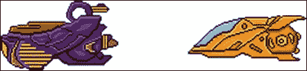

enemy2 和 enemy3

现在，我们只需要修改 `EnemyShip` 构造函数。此代码生成一个介于 0 和 2 之间的随机数，然后根据该随机数加载不同的敌人位图。我们的完成后的构造函数现在看起来是这样的：

```java
// Constructor
public EnemyShip(Context context, int screenX, int screenY){
 Random generator = new Random();
 int whichBitmap = generator.nextInt(3);
 switch (whichBitmap){
 case 0:
 bitmap = BitmapFactory.decodeResource
 (context.getResources(), R.drawable.enemy3);
 break;

 case 1:
 bitmap = BitmapFactory.decodeResource
 (context.getResources(), R.drawable.enemy2);
 break;

 case 2:
 bitmap = BitmapFactory.decodeResource
 (context.getResources(), R.drawable.enemy);
 break;
 }

    maxX = screenX;
    maxY = screenY;
    minX = 0;
    minY = 0;

    speed = generator.nextInt(6)+10;
    x = screenX;
    y = generator.nextInt(maxY) - bitmap.getHeight();

    // Initialize the hit box
    hitBox = new Rect(x, y, bitmap.getWidth(),  bitmap.getHeight());

}
```

注意，我们只需要将 `Random generator = new Random();` 这行代码移动到构造函数的顶部，这样我们就可以使用它来选择位图，并在构造函数的后面生成随机高度，就像通常一样。

## 平衡练习

游戏中可能最大的可玩性问题是在中等/高分辨率屏幕上玩游戏与在低分辨率屏幕上玩游戏时难度的差异。例如，我的一个测试设备是三星 Galaxy S2。现在它已经几年了，当以横屏位置持有时，屏幕分辨率为 800 x 480 像素。为了比较，我在具有横屏模式下 1920 x 1080 像素的三星 Galaxy S4 上测试了游戏。这是 S2 分辨率的超过两倍。

在 S4 设备上，玩家似乎可以毫不费力地在几乎微不足道的敌人之间滑行，而在 S2 设备上，玩家则面临几乎无法穿透的外星钢铁壁垒。

解决这个问题的真正方法是使用伪真实世界坐标绘制游戏对象，然后将这些坐标以相同的比例映射回设备，无论分辨率如何。这样，游戏在 S2 和 S4 设备上看起来和玩起来都一样。在下一个项目中，我们将构建一个更先进的游戏引擎来完成这项工作。

当然，我们仍然需要考虑实际物理屏幕大小，使玩家的体验多样化，但这是游戏玩家更易于接受的情况。

作为一种快速且不完美的解决方案，我们将改变飞船的大小和敌人的数量。所以，在低分辨率下，我们将有三个敌人，但我们将缩小它们的大小。在高分辨率下，我们将逐渐增加敌人的数量。

在`EnemyShip`类中，在将敌人图形加载到我们的`Bitmap`对象中的`switch`块之后，添加一行突出显示的行以调用我们很快将要编写的新的方法`scaleBitmap()`：

```java
switch (whichBitmap){
    case 0:
          bitmap = BitmapFactory.decodeResource(context.getResources(),           
          R.drawable.enemy3);
          break;

    case 1:
          bitmap = BitmapFactory.decodeResource(context.getResources(),           
          R.drawable.enemy2);
          break;

   case 2:
          bitmap = BitmapFactory.decodeResource(context.getResources(),           
          R.drawable.enemy);
          break;
}

scaleBitmap(screenX);

```

现在，我们将编写我们的新`scaleBitmap`方法。这个简单的辅助方法接受一个参数，正如我们所看到的，它是屏幕的水平分辨率。然后我们使用分辨率和静态`createScaledBitmap`方法，根据屏幕的分辨率以 2 或 3 的比例减少我们的`Bitmap`对象。将新的`scaleBitmap`方法添加到`EnemyShip`类中：

```java
public void scaleBitmap(int x){

  if(x < 1000) {
       bitmap = Bitmap.createScaledBitmap(bitmap,
       bitmap.getWidth() / 3,
       bitmap.getHeight() / 3,
       false);
  }else if(x < 1200){
       bitmap = Bitmap.createScaledBitmap(bitmap,
       bitmap.getWidth() / 2,
       bitmap.getHeight() / 2,
       false);
   }
}
```

在低分辨率屏幕上，敌人将被缩小。现在，让我们增加高分辨率屏幕上的敌人数量。

为了这个，我们将在`TDView`类中添加代码，以在更高分辨率的屏幕上添加额外的敌人。

### 注意

警告！这段代码很糟糕，但它能工作，并且它展示了我们如何在下一个项目中改进。在规划游戏时，总是在良好的设计和简洁性之间进行权衡。通过从一开始就保持事物组织，我们可以在最后阶段进行一些黑客行为。是的，我们可以重新设计生成和存储游戏对象的方式，如果 Tappy Defender 是一个持续的项目，那么这将是有价值的。

在前三个之后，添加两个更多的敌人飞船对象，如下所示：

```java
// Game objects
private PlayerShip player;
public EnemyShip enemy1;
public EnemyShip enemy2;
public EnemyShip enemy3;
public EnemyShip enemy4;
public EnemyShip enemy5;

```

现在，在`startGame`方法中添加代码，有条件地初始化这两个新对象：

```java
enemy1 = new EnemyShip(context, screenX, screenY);
enemy2 = new EnemyShip(context, screenX, screenY);
enemy3 = new EnemyShip(context, screenX, screenY);

if(screenX > 1000){
 enemy4 = new EnemyShip(context, screenX, screenY);
}

if(screenX > 1200){
 enemy5 = new EnemyShip(context, screenX, screenY);
}

```

在`update`方法中添加代码以更新我们的第四和第五个敌人并检查碰撞：

```java
// Collision detection on new positions
// Before move because we are testing last frames
// position which has just been drawn
boolean hitDetected = false;
if(Rect.intersects(player.getHitbox(), enemy1.getHitbox())){
  hitDetected = true;
  enemy1.setX(-100);
}

if(Rect.intersects(player.getHitbox(), enemy2.getHitbox())){
  hitDetected = true;
  enemy2.setX(-100);        
}

if(Rect.intersects(player.getHitbox(), enemy3.getHitbox())){
  hitDetected = true;
  enemy3.setX(-100);       
}

if(screenX > 1000){
 if(Rect.intersects(player.getHitbox(), enemy4.getHitbox())){
 hitDetected = true;
 enemy4.setX(-100); 
 }
}

if(screenX > 1200){
 if(Rect.intersects(player.getHitbox(), enemy5.getHitbox())){
 hitDetected = true;
 enemy5.setX(-100);
 }
}

if(hitDetected) {
soundPool.play(bump, 1, 1, 0, 0, 1);
            player.reduceShieldStrength();
            if (player.getShieldStrength() < 0) {
                soundPool.play(destroyed, 1, 1, 0, 0, 1);
                gameEnded = true;
            }
}

// Update the player
player.update();
// Update the enemies
enemy1.update(player.getSpeed());
enemy2.update(player.getSpeed());
enemy3.update(player.getSpeed());

if(screenX > 1000) {
 enemy4.update(player.getSpeed());
}
if(screenX > 1200) {
 enemy5.update(player.getSpeed());
}

```

最后，在`draw`方法中，在适当的时候绘制额外的敌人：

```java
// Draw the player
canvas.drawBitmap(player.getBitmap(), player.getX(), player.getY(), paint);
canvas.drawBitmap(enemy1.getBitmap(),
  enemy1.getX(), enemy1.getY(), paint);
canvas.drawBitmap(enemy2.getBitmap(),
  enemy2.getX(), enemy2.getY(), paint);
canvas.drawBitmap(enemy3.getBitmap(),
  enemy3.getX(), enemy3.getY(), paint);

if(screenX > 1000) {
 canvas.drawBitmap(enemy4.getBitmap(),
 enemy4.getX(), enemy4.getY(), paint);
}
if(screenX > 1200) {
 canvas.drawBitmap(enemy5.getBitmap(),
 enemy5.getX(), enemy5.getY(), paint);
}

```

当然，我们现在意识到我们可能希望缩放玩家。这清楚地表明我们可能需要一个`Ship`类，我们可以从中派生出`PlayerShip`和`EnemyShip`。

将这添加到我们为更高分辨率屏幕添加额外敌人的繁琐方式中，并且可能一个更具有多态性的解决方案是值得的。我们将看到我们如何可以真正改进这个和游戏引擎的几乎每个其他方面，在下一个项目中。

## 格式化时间

看看玩家 HUD 中时间是如何格式化的：


不好！让我们编写一个简单的辅助方法，让它看起来好得多。我们将在`TDView`类中添加一个新的方法，称为`formatTime()`。该方法使用游戏中经过的毫秒数（`timeTaken`），并将它们重新组织成秒和秒的分数。在适当的地方用零填充分数，并将结果作为`String`返回，以便在`TDView`类的`draw`方法中绘制。这个方法接受一个参数而不是仅仅使用成员变量`timeTaken`的原因是我们可以在一分钟内重用这段代码。

```java
private String formatTime(long time){
    long seconds = (time) / 1000;
    long thousandths = (time) - (seconds * 1000);
    String strThousandths = "" + thousandths;
    if (thousandths < 100){strThousandths = "0" + thousandths;}
    if (thousandths < 10){strThousandths = "0" + strThousandths;}
    String stringTime = "" + seconds + "." + strThousandths;
    return stringTime;
}
```

我们修改了绘制玩家 HUD 中时间的行。为了说明，在下一段代码中，我已将原始行全部注释掉，并提供了新的行，其中包含了我们的`formatTime()`调用，并对其进行了突出显示：

```java
//canvas.drawText("Time:" + timeTaken + "s", screenX / 2, 20, paint);
canvas.drawText("Time:" + 
 formatTime(timeTaken) + 
 "s", screenX / 2, 20, paint);

```

此外，通过一个小的更改，我们可以在 HUD 中的**最快：**标签上使用这种格式化。同样，旧行已被注释，新行被突出显示。在`TDView`类的`draw`方法中找到并修改代码：

```java
//canvas.drawText("Fastest:" + fastestTime + "s", 10, 20, paint);
canvas.drawText("Fastest:" + 
 formatTime(fastestTime) + 
 "s", 10, 20, paint);

```

我们还应该更新暂停屏幕上的时间格式。需要更改的行已被注释，新添加的行被突出显示：

```java
// Show pause screen
paint.setTextSize(80);
paint.setTextAlign(Paint.Align.CENTER);
canvas.drawText("Game Over", screenX/2, 100, paint);
paint.setTextSize(25);

// canvas.drawText("Fastest:"
  + fastestTime + "s", screenX/2, 160, paint);
canvas.drawText("Fastest:"+ 
 formatTime(fastestTime) + "s", screenX/2, 160, paint);

// canvas.drawText("Time:" + 
  timeTaken + "s", screenX / 2, 200, paint);
canvas.drawText("Time:" 
 + formatTime(timeTaken) + "s", screenX / 2, 200, paint);

canvas.drawText("Distance remaining:" +
  distanceRemaining/1000 + " KM",screenX/2, 240, paint);
paint.setTextSize(80);
canvas.drawText("Tap to replay!", screenX/2, 350, paint);
```

**最快：**现在以与**时间：**相同的方式在游戏内 HUD 和暂停屏幕 HUD 中格式化。看看我们现在整洁的时间格式：


## 处理返回按钮

我们将快速添加一小段代码来处理当玩家在他们的 Android 设备上按下返回按钮时会发生什么。将这个新方法添加到`GameActivity`和`MainActivity`类中。我们只需检查是否按下了返回按钮，如果是，就调用`finish()`来让操作系统知道我们已经完成了这个活动。

```java
// If the player hits the back button, quit the app
public boolean onKeyDown(int keyCode, KeyEvent event) {
  if (keyCode == KeyEvent.KEYCODE_BACK) {
       finish();
       return true;
  }
  return false;
}
```

# 完成的游戏

最后，如果你是跟随理论而不是实践，这里是一个在高清屏幕上完成的`GameActivity`，有几百个额外的星星和盾牌：

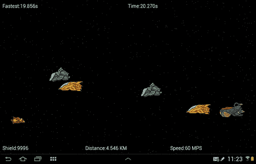

# 摘要

我们已经实现了基本游戏引擎的各个组成部分。我们可以做更多的事情。当然，一个现代移动游戏将比我们的游戏有更多的事情发生。当有更多游戏对象时，我们如何处理碰撞？我们能不能把我们的类层次结构稍微整理一下，因为我们的`PlayerShip`和`EnemyShip`类之间有很多相似之处？我们如何添加复杂的内部角色动画，而不会使我们的代码结构混乱，如果我们想有智能敌人，敌人实际上能思考怎么办？

我们需要逼真的背景、辅助目标、升级道具和拾取物品。我们希望游戏世界具有现实世界的坐标，无论屏幕分辨率如何，都能准确映射。

我们需要一个更智能的游戏循环，无论在哪个 CPU 上运行，都能以相同的速度运行游戏。最重要的是，我们真正需要的，比这些都要多的是一台非常大的机关枪。让我们打造一个经典平台游戏。

# 第五章。平台游戏 – 升级游戏引擎

欢迎来到这本书的第二个项目。在这里，我们将打造一个真正的艰难复古平台游戏。虽然制作起来不难，但当你玩的时候却很难打败。在项目结束时，我们还将讨论如果你希望的话，如何让游戏玩起来不那么严厉。

本章将完全专注于我们的游戏引擎，并本质上将导致 Tappy Defender 代码的升级版本。

首先，我们将讨论我们希望通过这个游戏实现什么：背景故事、游戏机制和规则。

接着，我们将快速创建一个活动，实例化一个视图，该视图将完成所有工作。

之后，我们将完善我们的 `PlatformView` 类的基本结构，它与我们的 `TDView` 类有一些微妙但重要的区别。最值得注意的是，`PlatformView` 将有一种简单但有效的方法来管理我们游戏中所有事件的时机。

然后，我们将开始迭代构建我们的 `GameObject` 类，几乎游戏世界中的每个实体都将从这个类派生出来。

接下来，我们将讨论视口的概念，通过视口玩家可以看到游戏世界。我们将不再设计我们的游戏对象以屏幕分辨率级别运行，但它们现在存在于一个有自己 *x* 和 *y* 坐标的世界上，我们可以将其视为虚拟米。在 *z* 轴上还有一个简单的深度系统。这将由我们新的 `Viewport` 类处理。

之后，我们将探讨如何设计和布局我们的游戏内容。这是通过一个用作关卡设计师的类来完成的，并且可以用非编程方式来绘制跳跃、敌人、奖励和目标，这些构成了关卡布局。

为了管理关卡设计和将它们加载到我们的游戏引擎中，我们需要另一个类。我们将称之为 `LevelManager`。

最后在本章中，我们将查看 `PlatformView` 类中增强的 `update` 和 `draw` 方法，这样我们就可以真正运行我们的新游戏，并在屏幕上看到第一个输出。

有这么多事情要做，我们最好开始行动了。

# 游戏

我们将要构建的游戏基于 80 年代一些残酷难度的平台游戏的游戏玩法，例如《鲍勃的复仇》和《不可能的任务》。这些游戏具有困难的跳跃和需要极端精确的时间控制，同时给玩家一个无法原谅的生命/机会数量。这种游戏风格对我们来说很适用，因为我们实际上可以在四个章节中仅用四个章节构建一个多级可玩游戏。

类的设计将使您轻松添加自己的额外功能，或者如果您想使游戏稍微容易一些，也可以做到。

## 背景故事

我们的英雄鲍勃刚刚从秘密任务中返回，任务是摧毁位于地球中心的邪恶科学家，他发现自己深陷地下。更糟糕的是，尽管他击败了邪恶的科学家，但似乎已经来不及拯救地球，因为强大的守卫和致命的飞行机器人无人机已经被他释放出来。

鲍勃必须从深埋地下的炽热洞穴中穿过，经过严密守卫的城市和森林，高耸入云的山脉，他希望在那里生活，摆脱恐怖的新秩序，这个新秩序已经占领了整个星球。

在他的四个关卡之旅中，他必须避开守卫，摧毁无人机，收集大量金钱，并升级他最初微不足道的机关枪。

## 游戏机制

游戏将关于执行精确跳跃，规划通过关卡的最佳路线以收集战利品和逃脱。鲍勃将能够站在边缘上，他的整个脚趾悬空，进行看似不可能的跳跃。鲍勃将能够控制跳跃的距离，这意味着有时他需要确保自己不要跳得太远。

鲍勃在尝试通过重兵把守的区域逃脱之前，需要收集机枪升级。

鲍勃只有三条命，但在他的旅途中可能会找到更多。

## 游戏规则

当鲍勃被无人机/守卫抓住、触碰火焰或从游戏世界中掉落时，他将在当前关卡的开始处重生。无人机可以飞行，并且一旦鲍勃进入视野，就会立即锁定他。鲍勃需要确保他有足够的火力来对付无人机。守卫将在关卡预定的部分巡逻，但它们很坚固，只能被鲍勃的机枪击退。通常，鲍勃需要执行精确时间跳来通过守卫。

环境也将非常艰难。鲍勃需要完全掌握每个级别，因为一次错误的跳跃会让他直线下坠，回到起点，直接落入敌人的魔爪，甚至可能葬身火海。

# 升级游戏引擎

所有关于守卫、无人机、火焰、可收集物品、枪支以及暗示的更大游戏世界的讨论，都表明需要一个更复杂的系统来管理。我们游戏引擎的一个目标将是使这种复杂性易于管理。另一个目标将是将关卡设计从编码中分离出来。当我们的游戏完成时，你将能够坐下来设计最邪恶、最有回报的关卡，在多个不同的环境中进行设计，而不必触碰代码。

## 平台活动

我们首先从我们的`Activity`类开始，这是进入我们游戏的大门。这里没有太多新内容，所以我们快速构建它。创建一个新的项目，在**应用程序名称**字段中输入`C5 平台游戏`。选择**手机和平板电脑**，然后当提示时选择**空白活动**。在**活动名称**字段中，键入`PlatformActivity`。

### 小贴士

显然，你不必完全遵循我的命名选择，但请记住在代码中进行一些小的修改，以反映你自己的命名选择。

你可以从`layout`文件夹中删除`activity_platform.xml`。你还可以删除`PlatformActivity.java`文件中的所有代码。只需留下包声明。现在，我们有一个完全空白的画布，可以开始编码。以下是到目前为止我们的整个项目：

```java
package com.gamecodeschool.c5platformgame;
```

让我们开始构建我们的引擎。就像在我们的 Tappy Defender 项目中一样，我们将构建一个类来处理游戏视图方面。不出所料，我们将把这个类命名为`PlatformView`。因此，我们的`PlatformActivity`类需要实例化一个`PlatformView`对象，并将其设置为应用程序的主视图，就像在先前的项目中一样。

我们将对我们的引擎进行一些重大的升级，但这主要发生在视图方面。在接下来我们将查看的`PlatformActivity`类的代码中，我们与先前的项目做得很相似。首先，在重写的`onCreate`方法中声明`PlatformView`对象并将其设置为主要的视图；然而，在我们这样做之前，我们还会捕获并传递设备的屏幕分辨率。

我们使用`Display`类，并通过链式调用`getWindowManager()`和`getDefaultDisplay()`方法来获取游戏将运行的物理显示硬件的属性。然后，我们创建一个名为`resolution`的`Point`类型对象，并通过调用`display.getSize(size)`将显示的分辨率存储到我们的`Point`对象中。

这将屏幕的水平和垂直像素数分别存储到`size.x`和`size.y`中。然后，我们可以通过调用其构造函数并传递存储在`size.x`和`size.y`中的值来实例化一个新的`PlatformView`对象。和之前一样，我们也会传递应用程序的`Context`对象（`this`），就像在先前的项目中一样，我们将发现它有很多用途。

然后，我们可以通过调用`setContentView()`以通常的方式将`platformView`设置为视图。和之前一样，我们重写`Activity`类的生命周期方法`onPause()`和`onResume()`，使它们调用我们即将编写的`PlatformView`类中的相应方法。这两个方法然后可以启动和停止我们的`Thread`类。

这里是我们刚刚讨论的`PlatformActivity`类的全部代码，没有显著的新方面。将代码输入或复制粘贴到您的项目中。本章的代码可以在 Packt Publishing 网站上的书籍页面的下载捆绑包中找到。本章的所有代码和资源都可以在`Chapter5`文件夹中找到。此文件名为`PlatformActivity.java`。

### 提示

当提示导入所有新类时，或者当鼠标悬停在错误上并出现缺失类导致的错误时，请按*Alt* | *Enter*键盘组合来导入所有新类。

```java
import android.app.Activity;
import android.graphics.Point;
import android.os.Bundle;
import android.view.Display;

public class PlatformActivity extends Activity {

    // Our object to handle the View
    private PlatformView platformView;

    @Override
    protected void onCreate(Bundle savedInstanceState) {
        super.onCreate(savedInstanceState);

        // Get a Display object to access screen details
        Display display = getWindowManager().getDefaultDisplay();

        // Load the resolution into a Point object
        Point resolution = new Point();
        display.getSize(resolution);

        // And finally set the view for our game
        // Also passing in the screen resolution
        platformView = new PlatformView
        (this, resolution.x, resolution.y);

        // Make our platformView the view for the Activity
        setContentView(platformView);

    }

    // If the Activity is paused make sure to pause our thread
    @Override
    protected void onPause() {
        super.onPause();
        platformView.pause();
    }

    // If the Activity is resumed make sure to resume our thread
    @Override
    protected void onResume() {
        super.onResume();
        platformView.resume();
    }
}
```

### 注意

显然，直到我们创建我们的`PlatformView`类，我们的`PlatformActivity`类代码中都会有错误。

## 锁定布局为横屏

就像我们在上一个项目中做的那样，我们将确保游戏仅在横屏模式下运行。我们将使我们的`AndroidManifest.xml`文件强制我们的`PlatformActivity`类以全屏方式运行，并且我们还将将其锁定为横屏布局。让我们进行以下更改：

1.  现在，打开 `manifests` 文件夹，双击 `AndroidManifest.xml` 文件，在代码编辑器中打开它。

1.  在 `AndroidManifest.xml` 文件中，找到以下代码行：

    ```java
    android:name=".PlatformActivity"
    ```

1.  紧接着，输入或复制粘贴以下两行代码，使 `PlatformActivity` 运行全屏并锁定为横屏模式。

    ```java
    android:theme="@android:style/Theme.NoTitleBar.Fullscreen"
    android:screenOrientation="landscape"
    ```

现在，我们可以继续深入到我们游戏的核心部分，看看我们如何实现我们之前讨论的所有改进。

## `PlatformView` 类

到完成时，这个类将依赖于许多其他类。我不想逐个展示每个类，因为这会相当难以跟踪，而且不清楚哪些代码实现了哪些功能会变得混乱。相反，我们将按需查看和编写每个功能，然后多次回顾许多类以添加更多功能。这将保持对代码每个部分的特定目的的关注。

话虽如此，我们已经非常小心地处理了这个问题，尽管我们将多次回顾这些类，但我们不会不断删除代码，而是会添加代码。当我们添加代码时，代码将在其适当的环境中呈现，新部分将在现有代码中突出显示。

关于类的结构，它们被设计得尽可能简单，同时，又不会限制你轻松添加功能和扩展代码的潜力。

这不是关于游戏引擎设计的课程，而更多的是关于展示我们可以学习到多少不同的功能，并将它们压缩到四个章节中，而不会使代码变得难以管理。

如果你计划构建大规模的游戏，尤其是在团队合作的情况下，那么需要一个更健壮的设计。这种更健壮的设计也意味着将需要大量的额外类、接口、包等等。

### 小贴士

如果你对这类讨论感兴趣，我强烈推荐 Mario Zechner 编写的书籍，书名为 *《Android 游戏入门》*，由 APRESS 出版。Mario 是 LibGDX 跨平台游戏库的创始人/创建者，他的书详细介绍了构建高度可扩展和可重用代码库所需的设计模式。这本书的缺点是，要构建一个简单的复古蛇游戏，可能需要大约 600 页。

首先，让我们创建一个类。在 Android Studio 项目资源管理器中，右键单击包名，然后导航到 **新建** | **Java 类**。将新类命名为 `PlatformView`。删除类的自动生成内容，因为我们很快就会添加自己的代码。

我们将在整个项目过程中继续向这个类添加代码。本章添加到类中的全部代码可以在 `Chapter5/PlatformView.java` 的下载包中找到。

我们需要一个可以管理我们等级的类。让我们称它为 `LevelManager`。

我们还需要一个可以存储我们关卡数据的类，因为每次我们创建新的/不同的关卡设计时，我们都可以扩展它。让我们称这个父类为`LevelData`，以及鲍勃需要逃离的第一个真实关卡，`LevelCave`。

此外，由于这个游戏将有许多敌人、道具和地形类型，我们需要一个更干净的系统来管理它们。我们需要一个相当通用的`GameObject`类，所有不同的游戏对象都可以扩展它。然后我们可以在`update`和`draw`方法中非常容易地管理它们。

由于必要性，我们还将构建一个稍微复杂的方法来检测玩家的输入。我们将创建一个`InputController`类来委托所有来自`PlatformView`的代码。然而，这个类的细节我们将在下一章完全实现我们的`Player`对象来表示玩家之前不会看到。

我们可以用与第一个项目非常相似但有一些显著不同的代码快速编写我们的基本`PlatformView`类，但我们将讨论这些不同之处。

### `PlatformView`的基本结构

这里是我们开始所需的必要导入和我们的成员变量。随着项目的继续，我们将添加很多内容。

注意，我们还声明了三种新的对象类型，`lm`将是我们`LevelManager`类，`vp`将是我们`Viewport`类，而`ic`是我们的`InputController`类。我们将从本章开始工作于其中的一些。当然，这些声明将在我们实现相应的类之前显示错误。

```java
import android.content.Context;
import android.graphics.Canvas;
import android.graphics.Color;
import android.graphics.Paint;
import android.graphics.Rect;
import android.util.Log;
import android.view.SurfaceHolder;
import android.view.SurfaceView;

public class PlatformView extends SurfaceView 
  implements Runnable {

  private boolean debugging = true;
  private volatile boolean running;
  private Thread gameThread = null;

  // For drawing
  private Paint paint;
  // Canvas could initially be local.
  // But later we will use it outside of draw()
  private Canvas canvas;
  private SurfaceHolder ourHolder;

  Context context;
  long startFrameTime;
  long timeThisFrame;
  long fps;

   // Our new engine classes
   private LevelManager lm;
   private Viewport vp;
   InputController ic;
```

这里，我们有我们的`PlatformView`构造函数。在这个阶段，它没有做任何新的事情，实际上，它的代码比我们的`TDView`构造函数要少，但它很快就会得到增强。现在，按照下面的代码输入：

```java
PlatformView(Context context, int screenWidth, 
    int screenHeight) {

    super(context);
    this.context = context;

    // Initialize our drawing objects
    ourHolder = getHolder();
    paint = new Paint();
}
```

这里是我们的线程的`run`方法。注意在调用`update()`之前，我们获取当前时间的毫秒数并将其放入`startFrameTime`长变量中。然后，在`draw()`完成后，我们再次调用系统时间并测量自帧开始以来经过的毫秒数。然后我们执行计算`fps = 1000 / thisFrameTime`，这给出了我们游戏在最后一帧中每秒运行的帧数。这个值存储在`fps`变量中。随着游戏的进行，我们将到处使用这个值。按照我们刚才讨论的，编写`run`方法，如下所示：

```java
@Override
public void run() {

  while (running) {
       startFrameTime = System.currentTimeMillis();

       update();
       draw();

      // Calculate the fps this frame
      // We can then use the result to
      // time animations and movement.
      timeThisFrame = System.currentTimeMillis() - startFrameTime;
            if (timeThisFrame >= 1) {
                fps = 1000 / timeThisFrame;
            }
     }
}
```

在本章的后面部分，我们将看到我们如何管理多个对象类型带来的额外复杂性，并在必要时更新它们。现在，只需像这样给`PlatformView`类添加一个空的`update`方法：

```java
private void update() {
  // Our new update() code will go here
}
```

这里，我们看到我们`draw`方法中熟悉的部分。在本章的后面部分，我们将看到一些新的代码。现在，按照下面的代码添加`draw`方法的基本内容，因为这将保持不变：

```java
private void draw() {

     if (ourHolder.getSurface().isValid()){
      //First we lock the area of memory we will be drawing to
      canvas = ourHolder.lockCanvas();

      // Rub out the last frame with arbitrary color
      paint.setColor(Color.argb(255, 0, 0, 255));
      canvas.drawColor(Color.argb(255, 0, 0, 255));

      // New drawing code will go here

      // Unlock and draw the scene
      ourHolder.unlockCanvasAndPost(canvas);
  }
}
```

组装视图的第一阶段最后的部分是`pause`和`resume`方法，当操作系统调用相应的 Activity 生命周期方法时，由`PlatformActivity`调用。它们与上一个项目中的内容没有变化，但在这里再次列出是为了完整性和便于跟踪。将这些方法添加到`PlatformView`类中：

```java
// Clean up our thread if the game is interrupted    
public void pause() {
  running = false;
   try {
       gameThread.join();
   } catch (InterruptedException e) {
       Log.e("error", "failed to pause thread");
   }
}

// Make a new thread and start it
// Execution moves to our run method
public void resume() {
   running = true;
   gameThread = new Thread(this);
   gameThread.start();

}

}// End of PlatformView
```

现在，我们已经编写并准备好了我们的视图的基本轮廓。让我们首先看看`GameObject`类。

### `GameObject`类

我们知道我们需要一个父类来包含我们游戏中的大多数对象，因为我们希望改进上一个项目的僵化和代码重复。从上一个项目中，我们也知道它将需要许多属性和方法。

首先，我们需要一个简单的类来表示我们所有未来`GameObject`类的世界位置。这个类将在*x*和*y*轴上持有详细的位置。请注意，这些与我们的游戏将在其上运行的设备的像素坐标完全独立。我们可以将*z*坐标视为层号。较低的数字先被绘制。因此，创建一个新的 Java 类，命名为`Vector2Point5D`，并输入以下代码：

```java
public class Vector2Point5D {

    float x;
    float y;
    int z;
}
```

现在，让我们来看看并编写`GameObject`类的基本工作轮廓，然后在整个项目中，我们可以回来添加额外的功能。创建一个新的 Java 类，命名为`GameObject`。让我们看看我们需要编写哪些代码来使这个类变得有用。首先，我们导入所需的类。

```java
import android.content.Context;
import android.graphics.Bitmap;
import android.graphics.BitmapFactory;
```

当我们编写`GameObject`本身时，请注意，该类不提供构造函数，因为这将根据我们正在实现的特定`GameObject`以不同的方式处理。

代码中您首先会注意到的是`worldLocation`变量，正如您所期望的，它是`Vector2Point5D`类型。然后我们有两个浮点成员，它们将持有`GameObject`类的宽度和高度。接下来，我们有布尔变量`active`和`visible`，它们可能被用来标记一个对象当它处于活动状态、可见状态或其他状态时。我们将在本章的后面部分开始看到这如何有益。

我们还需要知道任何给定对象有多少帧的内部动画。默认值将是`1`，因此`animFrameCount`将相应地初始化。

我们有一个名为`type`的`char`类。这个`type`变量将决定任何特定的`GameObject`可能是什么。它将被广泛使用。目前最后一个成员变量是`bitmapName`。我们将看到知道图形的名称，即代表我们每个单独对象的外观，将变得很有用。添加我们刚刚讨论的成员变量：

```java
public abstract class GameObject {

    private Vector2Point5D worldLocation;
    private float width;
    private float height;

    private boolean active = true;
    private boolean visible = true;
    private int animFrameCount = 1;
    private char type;

    private String bitmapName;

```

现在，我们可以看看`GameObject`功能的第一部分。我们有抽象方法`update()`。计划是所有对象都需要更新自己。结果证明，在仅仅四章中就过于雄心勃勃了，我们的一些对象（主要是平台和场景）将只提供一个空的`update()`实现。然而，没有任何东西阻止你使场景比我们现在有时间做的更互动，或者一旦我们看到事物是如何工作的，使平台更加动态和冒险。添加抽象的`update`方法：

```java
public abstract void update(long fps, float gravity);
```

我们处理管理我们图形的方法。我们有一个获取器来检索`bitmapName`。然后，我们有`prepareBitmap()`，它使用字符串`bitmapName`从`.png`图像文件创建一个 Android 资源 ID。此文件必须位于项目的`drawable`文件夹中。正如我们之前所看到的，一个位图被创建。

现在的`prepareBitmap`方法做了些新的事情。它使用`createScaledBitmap`方法来改变我们刚刚创建的位图的大小。它不仅使用了我们之前讨论过的`animFrameCount`，还使用了方法参数`pixelsPerMetre`变量。

想法是，每个设备都有一个`pixelsPerMetre`值，这个值适合该设备，这将帮助我们创建跨不同分辨率的设备上的相同游戏视图。当我们讨论`Viewport`类时，我们将看到这个`pixelsPerMetre`值是从哪里获得的。在`GameObject`类中输入以下方法：

```java
public String getBitmapName() {
        return bitmapName;
}

public Bitmap prepareBitmap(Context context, 
    String bitmapName, 
    int pixelsPerMetre) {

   // Make a resource id from the bitmapName
   int resID = context.getResources().
        getIdentifier(bitmapName,
        "drawable", context.getPackageName());

    // Create the bitmap
    Bitmap bitmap = BitmapFactory.
        decodeResource(context.getResources(),
        resID);

    // Scale the bitmap based on the number of pixels per metre
    // Multiply by the number of frames in the image
    // Default 1 frame
    bitmap = Bitmap.createScaledBitmap(bitmap,
                (int) (width * animFrameCount * pixelsPerMetre),
                (int) (height * pixelsPerMetre),
                false);

    return bitmap;
}
```

我们还希望能够知道每个`GameObject`在世界中的位置，当然，也要设置它在世界中的位置。这里有一个获取器和设置器，它们正是这样做的。

```java
    public Vector2Point5D getWorldLocation() {
        return worldLocation;
    }

    public void setWorldLocation(float x, float y, int z) {
        this.worldLocation = new Vector2Point5D();
        this.worldLocation.x = x;
        this.worldLocation.y = y;
        this.worldLocation.z = z;
    }
```

我们还希望能够获取和设置我们之前讨论过的许多成员变量。这些获取器和设置器将做到这一点。

```java
    public void setBitmapName(String bitmapName){
        this.bitmapName = bitmapName;
    }

    public float getWidth() {
        return width;
    }

    public void setWidth(float width) {
        this.width = width;
    }

    public float getHeight() {
        return height;
    }

    public void setHeight(float height) {
        this.height = height;
    }
```

此外，我们还想检查和更改我们的活动变量和可见变量的状态。

```java
    public boolean isActive() {
        return active;
    }

    public boolean isVisible() {
        return visible;
    }

    public void setVisible(boolean visible) {
        this.visible = visible;
    }
```

设置和获取每个`GameObject`的`type`。

```java
    public char getType() {
        return type;
    }

    public void setType(char type) {
        this.type = type;
    }

}// End of GameObject
```

现在，我们将从`GameObject`创建我们的第一个许多子类。在 Android Studio 资源管理器中右键单击包名，创建一个名为`Grass`的类。这将是我们玩家可以行走的第一个基本瓦片类型。

这段简单的代码使用构造函数来初始化高度、宽度、类型及其在游戏世界中的位置。请注意，所有这些信息都作为参数传递给构造函数。`Grass`类“知道”的唯一事情，以及与其他一些简单`GameObject`子类区分开来的少数几个因素之一，是用于`bitmapName`的值，在这个例子中是`turf`。

如前所述，我们还提供了一个空的`update`方法实现：

```java
public class Grass extends GameObject {

    Grass(float worldStartX, float worldStartY, char type) {
        final float HEIGHT = 1;
        final float WIDTH = 1;

        setHeight(HEIGHT); // 1 metre tall
        setWidth(WIDTH); // 1 metre wide

        setType(type);

        // Choose a Bitmap
        setBitmapName("turf");

        // Where does the tile start
        // X and y locations from constructor parameters
        setWorldLocation(worldStartX, worldStartY, 0);
    }

    public void update(long fps, float gravity) {}
}
```

现在，将下载包中的`Chapter5/drawable`文件夹中的`turf.png`图形添加到 Android Studio 的`drawable`文件夹中。

最后，我们将实现一个绝对基础的`Player`类，它也将扩展`GameObject`。我们不会在这个类中放入任何功能，只提供一个*x*和*y*世界位置。这样，我们将实现的`Viewport`类就知道在哪里聚焦。

这里是`Player`类，它将代表我们的英雄鲍勃。在这个阶段，这个类非常简单直接，几乎与`Grass`类完全相同。随着我们的进展，它将发生重大变化和演变。注意，我们将类型设置为`p`。

```java
import android.content.Context;

public class Player extends GameObject {

    Player(Context context, float worldStartX, 
        float worldStartY, int pixelsPerMetre) {

        final float HEIGHT = 2;
        final float WIDTH = 1;

        setHeight(HEIGHT); // 2 metre tall
        setWidth(WIDTH); // 1 metre wide

        setType('p');

        // Choose a Bitmap
        // This is a sprite sheet with multiple frames
        // of animation. So it will look silly until we animate it
        // In chapter 6.

        setBitmapName("player");

        // X and y locations from constructor parameters

        setWorldLocation(worldStartX, worldStartY, 0);

    }

    public void update(long fps, float gravity) {

    }
}
```

将下载包中的`drawable`文件夹中的`player.png`图形添加到 Android Studio 中的`drawable`文件夹。这个图形是一个多帧精灵表，所以在我们将其在第六章中动画化之前，它不会很好地显示，*平台游戏 – 鲍勃、哔哔声和碰撞*，但作为现在的占位符它将发挥作用。

正如我们接下来将要看到的，玩家看到的游戏世界视图将聚焦于鲍勃，正如你可能预期的那样。

### 视口视图

视口可以被视为跟随我们游戏动作的电影摄像机。它定义了要向玩家展示的游戏世界区域。通常，它将集中在鲍勃身上。

它还通过确定哪些对象在玩家的视野内和视野外，使我们的绘制方法更有效。如果敌人在任何给定时刻都不相关，就没有必要绘制或处理它们。

这将显著加快诸如碰撞检测等任务，通过实施第一阶段检测，从要检查碰撞的对象列表中移除屏幕外的对象，这做起来出奇地简单。

此外，我们的`Viewport`类将负责将游戏世界坐标转换为屏幕上绘制适当的像素坐标。我们还将看到这个类是如何计算我们的`GameObject`类在`prepareBitmap`方法中使用的`pixelsPerMetre`值的。

`Viewport`类确实是一个全能的类。所以让我们开始编码。

首先，我们将声明一大堆有用的变量。我们还有一个`Vector2Point5D`，它将仅用于表示当前在视口中是世界中央焦点的任何点。然后，我们有`pixelsPerMetreX`和`pixelsPerMetreY`的单独整数值。

### 注意

实际上，在这个实现中，`pixelsPerMetrX`和`pixelsPerMetreY`之间没有区别。然而，`Viewport`类可以被升级以考虑设备宽高比的不同，基于屏幕大小，而不仅仅是分辨率。在这个实现中我们没有这样做。

接下来，我们简单地有屏幕在两个轴上的分辨率：`screenXResolution`和`screenYResolution`。然后我们有`screenCentreX`和`screenCentreY`，这两个变量基本上是前两个变量除以二得到的中间值。

在我们声明的变量列表中，我们有`metresToShowX`和`metresToShowY`，这将是我们将挤压到视口中的米数。更改这些值将在屏幕上显示更多或更少的游戏世界。

最后一个成员，我们将在这一点上声明，是`int numClipped`。我们将使用它来输出调试文本，以查看我们的`Viewport`类在使绘制、更新和多阶段碰撞检测更有效方面产生的影响。

创建一个名为`Viewport`的新类，并声明我们刚刚讨论的变量：

```java
import android.graphics.Rect;

public class Viewport {
    private Vector2Point5D currentViewportWorldCentre;
    private Rect convertedRect;
    private int pixelsPerMetreX;
    private int pixelsPerMetreY;
    private int screenXResolution;
    private int screenYResolution;
    private int screenCentreX;
    private int screenCentreY;
    private int metresToShowX;
    private int metresToShowY;
    private int numClipped;
```

现在，让我们看看构造函数。构造函数只需要知道屏幕的分辨率。这通过参数*x*和*y*获得，当然，我们将它们分别分配给`screenXResolution`和`screenYResolution`。

然后，如之前建议的那样，我们将这两个先前变量除以二，并将结果分别赋值给`screenCentreX`和`screenCentreY`。

`pixelsPerMetreX`和`pixelsPerMetreY`是通过除以 32 和 18（再次分别）计算得出的，因此分辨率为 840 x 400 像素的设备将具有每米*x/y*像素为 32/22。现在，我们有了变量，它们指的是当前设备上表示我们游戏世界一米的屏幕实际面积。我们将在代码中多次看到这一点，它将非常有用。

实际上，我们将绘制一个比这稍宽的区域，以确保屏幕边缘没有难看的间隙/线条，并将 34 赋值给`metresToShowX`和 20 赋值给`metresToShowY`。现在，我们有了变量，它们指的是我们将在每一帧中绘制的游戏世界部分的数量。

### 提示

一旦我们有一些屏幕输出，您就可以通过调整这些值来为玩家创建更或更缩放或更缩小的体验。

在构造函数接近结束时，我们创建了一个名为`convertedRect`的新`Rect`对象，我们很快就会看到它的作用。我们在`currentViewportWorldCentre`上调用`new()`，因此它很快就可以投入使用。

```java
 Viewport(int x, int y){

        screenXResolution = x;
        screenYResolution = y;

        screenCentreX = screenXResolution / 2;
        screenCentreY = screenYResolution / 2;

        pixelsPerMetreX = screenXResolution / 32;
        pixelsPerMetreY = screenYResolution / 18;

        metresToShowX = 34;
        metresToShowY = 20;

        convertedRect = new Rect();
        currentViewportWorldCentre = new Vector2Point5D();

}
```

### 注意

如果在这个项目中的某些截图看起来与您得到的结果略有不同，那是因为一些图像是使用不同的视口设置来突出游戏世界不同方面的。

我们为`Viewport`类编写的第一个方法是`setWorldCentre()`。它接收一个*x*和*y*参数，这些参数立即被分配为`currentWorldCentre`。我们需要这个方法，因为当然玩家会在世界中移动，我们需要让`Viewport`类知道鲍勃的位置。此外，正如我们将在第八章中看到的，*整合所有元素*，我们还将遇到一种我们不想让鲍勃成为关注中心的情况。

```java
void setWorldCentre(float x, float y){
  currentViewportWorldCentre.x  = x;
  currentViewportWorldCentre.y  = y;
}
```

现在，一些简单的方法，这些方法在我们前进的过程中将非常有用。

```java
public int getScreenWidth(){
  return  screenXResolution;
}

public int getScreenHeight(){
  return  screenYResolution;
}

public int getPixelsPerMetreX(){
  return  pixelsPerMetreX;
}
```

我们通过`worldToScreen()`方法履行`Viewport`类的一个主要角色。正如其名所示，这是将当前可见视口内所有对象的坐标从世界坐标转换为可以实际绘制到屏幕上的像素坐标的方法。它返回我们之前准备的`rectToDraw`对象作为结果。

这就是`worldToScreen()`函数的工作原理。它接收一个对象的*x*和*y*世界位置，以及该对象的宽度和高度。有了这些值，每个值依次从对象的坐标乘以当前屏幕每米的像素数中减去，然后从适当的世界视口中心（*x*或*y*）中减去。然后，对于对象的左上坐标，从像素屏幕中心值中减去，对于底部和右部坐标，则加上。

这些值随后被打包到`convertedRect`的左、上、右和底部值中，并返回给`PlatformView`的`draw`方法。将`worldToScreen`方法添加到`Viewport`类中：

```java

public Rect worldToScreen(
  float objectX, 
  float objectY, 
  float objectWidth, 
  float objectHeight){

   int left = (int) (screenCentreX -               
    ((currentViewportWorldCentre.x - objectX) 
    * pixelsPerMetreX));

    int top =  (int) (screenCentreY -         
    ((currentViewportWorldCentre.y - objectY) 
    * pixelsPerMetreY));

   int right = (int) (left + 
    (objectWidth * 
    pixelsPerMetreX));

  int bottom = (int) (top + 
    (objectHeight * 
    pixelsPerMetreY));

  convertedRect.set(left, top, right, bottom);

  return convertedRect;
}
```

现在，我们实现`Viewport`类的第二个主要功能，移除当前对我们没有兴趣的对象。我们称之为裁剪，我们将调用的方法是`clipObjects()`。

再次，我们接收对象的`x`、`y`、`width`和`height`作为参数。测试开始时，我们假设我们想要裁剪当前对象，并将`true`赋值给`clipped`。

然后，四个嵌套的`if`语句测试对象的每个点是否在视口相关边的范围内。如果是，我们将`clipped`设置为`false`。我们将设计的一些层级将超过一千个对象，但我们将看到，在任何给定帧中，我们很少需要处理（更新、碰撞检测和绘制）超过四分之一的对象。输入`clipObjects`方法的代码：

```java

public boolean clipObjects(float objectX, 
  float objectY, 
  float objectWidth, 
  float objectHeight) {

  boolean clipped = true;

   if (objectX - objectWidth < 
    currentViewportWorldCentre.x + (metresToShowX / 2)) {

    if (objectX + objectWidth > 
      currentViewportWorldCentre.x - (metresToShowX / 2)) {

      if (objectY - objectHeight <           
        currentViewportWorldCentre.y + 
        (metresToShowY / 2)) {

        if (objectY + objectHeight >       
          currentViewportWorldCentre.y - 
          (metresToShowY / 2)){

                 clipped = false;
        }     
      }

    }

  }

   // For debugging
   if(clipped){
       numClipped++;
   }

   return clipped;
}
```

现在，我们提供对`numClipped`变量的访问，以便它可以被读取并在每一帧重置为零。

```java
public int getNumClipped(){
  return numClipped;    
}

public void resetNumClipped(){
  numClipped = 0;
}

}// End of Viewport
```

让我们声明并初始化我们的`Viewport`对象。在`PlatformView`构造函数中初始化我们的`Paint`对象后，添加此代码。新的代码在此处突出显示：

```java
  // Initialize our drawing objects
  ourHolder = getHolder();
  paint = new Paint();

 // Initialize the viewport
 vp = new Viewport(screenWidth, screenHeight);

}// End of constructor
```

现在，我们可以在我们的游戏世界中描述和定位对象，并专注于我们感兴趣的世界精确部分。让我们看看我们实际上如何将对象放入这个世界，这样我们就可以像之前那样更新和绘制它们。我们还将探讨层级概念。

### 创建层级

在这里，我们将看到如何构建我们的`LevelManager`、`LevelData`以及我们的第一个真实层级`LevelCave`。

`LevelManager`类最终需要我们`InputController`类的副本。因此，为了尽量保持我们的意图，即不删除任何代码，我们在`LevelManager`构造函数中包含一个`InputController`参数。

让我们快速创建一个`InputController`类的空白模板。以通常的方式创建一个新的类，命名为`InputController`。添加以下代码：

```java
public class InputController {
    InputController(int screenWidth, int screenHeight) {
    }
}
```

现在，让我们看看我们的，最初非常简单的`LevelData`类。创建一个新的类，命名为`LevelData`，并添加以下代码。在这个阶段，它只包含一个用于字符串的`ArrayList`对象。

```java
import java.util.ArrayList;

public class LevelData {
    ArrayList<String> tiles;

    // This class will evolve along with the project

    // Tile types
    // . = no tile
    // 1 = Grass

}
```

接下来，我们可以开始制作最终将成为我们第一个可玩关卡的代码。创建一个新的类，命名为`LevelCave`，并添加以下代码：

```java
import java.util.ArrayList;

public class LevelCave extends LevelData{
    LevelCave() {
    tiles = new ArrayList<String>();
    this.tiles.add("p.............................................");
    this.tiles.add("..............................................");
    this.tiles.add(".....................111111...................");
    this.tiles.add("..............................................");
    this.tiles.add("............111111............................");
    this.tiles.add("..............................................");
    this.tiles.add(".........1111111..............................");
    this.tiles.add("..............................................");
    this.tiles.add("..............................................");
    this.tiles.add("..............................................");
    this.tiles.add("..............................11111111........");
    this.tiles.add("..............................................");
    }
}
```

### 小贴士

在`LevelCave`文件中，玩家`p`的位置是任意的。只要它在文件中，`Player`对象就会被初始化。玩家角色的实际出生位置是由调用`loadLevel`方法来确定的，正如我们很快就会看到的。我通常将玩家的`p`放在地图的第一行的第一个元素上，这样就不太容易被遗忘。

现在，让我们谈谈这个关卡设计是如何工作的。我们将在`LevelCave`类的`tiles.add("..."`部分输入字母数字字符。我们将输入不同的字母数字字符，具体取决于我们想在关卡中放置哪种`GameObject`。目前，我们只有`p`来表示`Player`对象，`1`来表示`Grass`对象，以及点号（`.`）来表示一个游戏世界米平方的空地。

### 小贴士

这意味着在上一块代码中用`1`字符定位`Grass`对象的方式可以完全按照你的喜好来安排。情况就是这样，每次我们查看我们的`LevelCave`类的代码时，请随意发挥和实验。

随着项目的进行，我们将添加超过二十个不同的`GameObject`子类。其中一些将是静止的，如`Grass`，其他将是思考型、侵略性的敌人。所有这些都可以放置在我们的关卡设计中。

现在，我们可以实现管理我们关卡类的代码。创建一个新的 Java 类，命名为`LevelManager`。随着我们逐步进行，输入`LevelManager`类的代码，并逐块讨论。

首先，是一些导入指令。

```java
import android.content.Context;
import android.graphics.Bitmap;
import android.graphics.Rect;
import java.util.ArrayList;
```

现在，构造函数中有一个`String`类型的`level`来保存关卡名称，`mapWidth`和`mapHeight`来存储当前关卡在游戏世界米中的宽度和高度，一个`Player`对象，因为我们知道我们始终会有一个，以及一个名为`playerIndex`的整型。

很快，我们将有一个包含许多`GameObject`类的`ArrayList`对象，并且始终拥有`Player`对象的索引将很有用。

接下来，我们有布尔值`playing`，因为我们需要知道游戏何时在播放或暂停，以及一个名为`gravity`的浮点数。

### 小贴士

在本项目的背景下，重力不会发挥其全部潜力，但它可以很容易地被操纵，以便不同的关卡有不同的重力。这就是为什么它位于`LevelManager`类中的原因。

最后，我们声明一个类型为`LevelData`的对象，一个用于存储所有`GameObject`对象的`ArrayList`对象，一个用于存储玩家控制按钮表示的`ArrayList`对象，以及一个用于存储我们将需要的绝大多数`Bitmap`对象的常规数组。

```java
public class LevelManager {

    private String level;
    int mapWidth;
    int mapHeight;

    Player player;
    int playerIndex;

    private boolean playing;
    float gravity;

    LevelData levelData;
    ArrayList<GameObject> gameObjects;

    ArrayList<Rect> currentButtons;
    Bitmap[] bitmapsArray;
```

然后，在构造函数中，我们检查签名并看到它接收一个`Context`对象，`pixelsPerMetre`，这是在`Viewport`类构建时确定的，`screenWidth`直接来自`Viewport`类，我们`InputController`类的一个副本，以及要加载的关卡名称。`int`参数`px`和`py`是玩家的起始坐标。

我们将关卡参数分配给我们的成员变量`level`，然后我们切换以确定我们的当前关卡将使用哪个类。当然，目前我们只有`LevelCave`。

然后，我们初始化我们的`gameObject ArrayList`和`bitmapsArray`。接着，我们调用`loadMapData()`方法，这是我们很快将要编写的方法。在此之后，我们将`playing`设置为`true`，最后我们有一个获取`playing`状态的方法。在`LevelManager`类中输入我们刚刚讨论的代码：

```java
public LevelManager(Context context, 
    int pixelsPerMetre, int screenWidth, 
    InputController ic, 
    String level, 
    float px, float py) {

    this.level = level;

    switch (level) {
        case "LevelCave":
        levelData = new LevelCave();
        break;

        // We can add extra levels here

    }

    // To hold all our GameObjects
    gameObjects = new ArrayList<>();

    // To hold 1 of every Bitmap
    bitmapsArray = new Bitmap[25];

    // Load all the GameObjects and Bitmaps
    loadMapData(context, pixelsPerMetre, px, py);

    // Ready to play
    playing = true;
}

public boolean isPlaying() {
    return playing;
}
```

现在，我们有一个非常简单的方法，它将使我们能够根据我们目前正在处理的`GameObject`的类型获取任何`Bitmap`对象。这样，每个`GameObject`就不必持有自己的`Bitmap`对象。例如，我们可以设计一个包含数百个`Grass`对象的关卡。这可能会轻易耗尽即使是现代平板电脑的内存。

我们的`getBitmap`方法接受一个`int`值作为索引，并返回一个`Bitmap`对象。我们将在下一个方法中看到如何访问`index`的适当值：

```java
    // Each index Corresponds to a bitmap
    public Bitmap getBitmap(char blockType) {

        int index;
        switch (blockType) {
            case '.':
                index = 0;
                break;

            case '1':
                index = 1;
                break;

            case 'p':
                index = 2;
                break;

            default:
                index = 0;
                break;
        }// End switch

        return bitmapsArray[index];

 }// End getBitmap
```

以下方法将使我们能够获取调用`getBitmap`方法的`index`。只要`char`情况与我们所创建的各个`GameObject`子类持有的`type`值相对应，并且此方法返回的索引与`bitmapsArray`中保存的适当`Bitmap`的索引相匹配，我们只需每个`Bitmap`对象的一个副本即可。

```java
// This method allows each GameObject which 'knows'
// its type to get the correct index to its Bitmap
// in the Bitmap array.
public int getBitmapIndex(char blockType) {

    int index;
        switch (blockType) {
            case '.':
                index = 0;
                break;

            case '1':
                index = 1;
                break;

            case 'p':
                index = 2;
                break;

            default:
                index = 0;
                break;

        }// End switch

        return index;
    }// End getBitmapIndex()
```

现在，我们使用`LevelManager`类进行实际的工作，并从我们的设计中加载我们的关卡。该方法需要`pixelsPerMetre`和`Player`对象的坐标来完成其工作。由于这是一个较大的方法，解释和代码已被分成几个部分。

在这个第一部分，我们简单地声明一个名为`index`的`int`类型并将其设置为`-1`。当我们遍历我们的关卡设计时，它将帮助我们跟踪我们的进度。

然后，我们使用`ArrayList`的大小和第一个元素的长度分别计算地图的高度和宽度。

```java
// For now we just load all the grass tiles
// and the player. Soon we will have many GameObjects
private void loadMapData(Context context, 
  int pixelsPerMetre, 
  float px, float py) {

   char c;

   //Keep track of where we load our game objects
   int currentIndex = -1;

   // how wide and high is the map? Viewport needs to know
   mapHeight = levelData.tiles.size();
   mapWidth = levelData.tiles.get(0).length();
```

我们进入一个嵌套的`for`循环，从我们的`ArrayList`对象中的第一个字符串的第一个元素开始。我们在处理第一个字符串之前，从左到右工作，然后转到第二个字符串。

我们检查当前位置是否存在除空格（.）之外的对象，如果存在，则进入一个`switch`块以在指定位置创建适当的对象。

如果我们遇到`1`，则向`ArrayList`添加一个新的`Grass`对象，如果遇到`p`，则初始化在`LevelManager`类构造函数中传递的位置的`Player`对象。当创建一个新的`Player`对象时，我们也初始化我们的`playerIndex`和`player`对象，以便将来使用。

```java
for (int i = 0; i < levelData.tiles.size(); i++) {
            for (int j = 0; j < 
                    levelData.tiles.get(i).length(); j++) {

                c = levelData.tiles.get(i).charAt(j);

                    // Don't want to load the empty spaces
                    if (c != '.'){ 
                      currentIndex++;
                      switch (c) {

                        case '1':
                            // Add grass to the gameObjects
                            gameObjects.add(new Grass(j, i, c));
                            break;

                        case 'p':
                            // Add a player to the gameObjects
                            gameObjects.add(new Player
                                (context, px, py, 
                                 pixelsPerMetre));

                            // We want the index of the player
                            playerIndex = currentIndex;
                            // We want a reference to the player
                            player = (Player)           
                            gameObjects.get(playerIndex);

                            break;

            }// End switch
```

如果`gameObjects ArrayList`中已添加新对象，我们需要检查相应的位图是否已添加到`bitmapsArray`中。如果没有，我们使用当前考虑的`GameObject`类的`prepareBitmap`方法添加一个。以下是执行此检查和准备位图的代码（如果需要）：

```java
// If the bitmap isn't prepared yet
if (bitmapsArray[getBitmapIndex(c)] == null) {

    // Prepare it now and put it in the bitmapsArrayList
    bitmapsArray[getBitmapIndex(c)] =
        gameObjects.get(currentIndex).
        prepareBitmap(context,                                                
        gameObjects.get(currentIndex).                                                        
        getBitmapName(),                                     
        pixelsPerMetre);

}// End if

}// End if (c != '.'){ 

}// End for j

}// End for i

}// End loadMapData()

}// End LevelManager
```

回到`PlatformView`类，为了使用所有级别对象，我们在`PlatformView`构造函数中初始化我们的`Viewport`类之后立即调用`loadLevel()`。新代码已被突出显示，现有代码提供上下文：

```java
  // Initialize the viewport
  vp = new Viewport(screenWidth, screenHeight);

 // Load the first level
 loadLevel("LevelCave", 15, 2);

}
```

当然，现在我们需要在`PlatformView`类中实现`loadLevel`方法。

`loadLevel`方法需要知道要加载哪个级别，因此`LevelManager`构造函数中的`switch`语句可以执行其工作，并且它还需要坐标来生成我们的英雄 Bob。

我们通过调用其构造函数并使用从`vp`检索的视口数据和刚刚讨论的级别/玩家数据来初始化我们的`LevelManager`对象。

然后，我们创建一个新的`InputController`类，再次从`vp`传递一些数据。当我们构建`InputController`类时，我们将在第六章 *Bob，哔哔声和颠簸* 中看到我们如何使用这些数据。最后，我们调用`vp.setWorldCentre()`并将玩家的位置作为坐标传递给它。这样屏幕就定位在 Bob 上了。

```java
public void loadLevel(String level, float px, float py) {

    lm = null;

    // Create a new LevelManager
    // Pass in a Context, screen details, level name 
    // and player location
    lm = new LevelManager(context, 
        vp.getPixelsPerMetreX(), 
        vp.getScreenWidth(), 
        ic, level, px, py);

    ic = new InputController(vp.getScreenWidth(),       
        vp.getScreenHeight());

    // Set the players location as the world centre     
    vp.setWorldCentre(lm.gameObjects.get(lm.playerIndex)
        .getWorldLocation().x,
        lm.gameObjects.get(lm.playerIndex)
        .getWorldLocation().y);
    }
```

我们可以在我们的`update`方法中添加一些代码，使其首先利用我们新的`Viewport`类的主要功能。

### 增强的更新方法

最后，我们可以使用我们方便的`ArrayList`游戏对象和`Viewport`功能来完善我们的增强`update`方法。在接下来的代码中，我们简单地使用增强的`for`循环遍历每个`GameObject`。我们检查它是否`isActive()`，然后通过一个`if`语句将对象的定位和尺寸发送到`clipObjects()`。如果`clipObjects()`返回`false`，则对象没有被裁剪，并且通过调用`go.setVisible(true)`将对象标记为可见。否则，它被标记为不可见，通过调用`go.setVisible(false)`。这是目前任何对象更新的唯一方面。我们将在本章末尾运行游戏时看到它已经很有用了。在`update`方法中输入新代码：

```java
for (GameObject go : lm.gameObjects) {
        if (go.isActive()) {
            // Clip anything off-screen
            if (!vp.clipObjects(go.getWorldLocation().x,                                
                go.getWorldLocation().y, 
                go.getWidth(), 
                go.getHeight())) {

                // Set visible flag to true
                go.setVisible(true);

            } else {
                // Set visible flag to false
                go.setVisible(false);
                // Now draw() can ignore them

            }
        }

    }
}
```

### 增强绘图方法

现在，我们可以更精确地确定需要绘制哪些对象。首先，我们声明并初始化一个新的`Rect`对象，称为`toScreen2d`。

然后，我们遍历`gameObjects ArrayList`，为每个层（从最低层开始）进行一次循环。在这个阶段，这并不是严格必要的，因为我们的所有对象默认都位于层零。我们将在项目结束前添加层-1 和 1 的对象，我们不希望如果可能的话重写代码。

接下来，我们检查对象是否可见并且位于当前层。如果是的话，我们将当前对象的位置和尺寸传递给`worldToScreen`方法，该方法将结果返回到我们之前准备好的`toScreen2d Rect`对象。然后，我们使用`bitmapArray`调用`drawBitmap()`来提供适当的位图，并传入`toScreen2d`的坐标。更新后的`draw`方法如下所示：

```java
private void draw() {

    if (ourHolder.getSurface().isValid()) {
        //First we lock the area of memory we will be drawing to
        canvas = ourHolder.lockCanvas();

        // Rub out the last frame with arbitrary color
        paint.setColor(Color.argb(255, 0, 0, 255));
        canvas.drawColor(Color.argb(255, 0, 0, 255));
 // Draw all the GameObjects
 Rect toScreen2d = new Rect();

 // Draw a layer at a time
 for (int layer = -1; layer <= 1; layer++){
 for (GameObject go : lm.gameObjects) {
 //Only draw if visible and this layer
 if (go.isVisible() && go.getWorldLocation().z 
 == layer) { 

 toScreen2d.set(vp.worldToScreen
 (go.getWorldLocation().x,
 go.getWorldLocation().y,
 go.getWidth(),
 go.getHeight()));

 // Draw the appropriate bitmap
 canvas.drawBitmap(
 lm.bitmapsArray
 [lm.getBitmapIndex(go.getType())],
 toScreen2d.left,
 toScreen2d.top, paint);
 }
 }
}

```

现在，仍然在`draw`方法中，我们将调试信息打印到屏幕上，包括我们`gameObjects ArrayList`的大小与这一帧被裁剪的对象数量的比较。

然后，我们通过常规调用`unlockCanvasAndPost()`来完成`draw`方法。注意，在`if(debugging)`块的末尾，我们调用`vp.resetNumClipped`将`numClipped`变量重置为零，以便为下一帧做好准备。将此代码直接添加到`draw`方法中的上一段代码之后：

```java
// Text for debugging
if (debugging) {
 paint.setTextSize(16);
 paint.setTextAlign(Paint.Align.LEFT);
 paint.setColor(Color.argb(255, 255, 255, 255));
 canvas.drawText("fps:" + fps, 10, 60, paint);

 canvas.drawText("num objects:" + 
 lm.gameObjects.size(), 10, 80, paint);

 canvas.drawText("num clipped:" + 
 vp.getNumClipped(), 10, 100, paint);

 canvas.drawText("playerX:" + 
 lm.gameObjects.get(lm.playerIndex).
 getWorldLocation().x,
 10, 120, paint);

 canvas.drawText("playerY:" + 
 lm.gameObjects.get(lm.playerIndex).
 getWorldLocation().y, 
 10, 140, paint);

 //for reset the number of clipped objects each frame
 vp.resetNumClipped();

}// End if(debugging)

// Unlock and draw the scene
ourHolder.unlockCanvasAndPost(canvas);

}// End (ourHolder.getSurface().isValid())
}// End draw()
```

在这个项目中，我们第一次真正运行我们的游戏并看到一些结果：

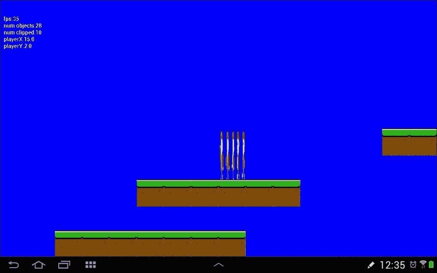

注意图像中`LevelCave`设计的草地精确布局。您还可以看到我们的压缩比伯精灵图集，以及有 28 个对象，但其中 10 个已经被裁剪。随着我们的关卡变得更大，裁剪与未裁剪的比例将显著增加，大多数对象将被裁剪。

# 摘要

在本章中，我们覆盖了很多内容，现在我们有一个非常完善的游戏引擎。

由于我们已经完成了大部分的设置工作，从现在开始，我们添加的大部分代码也将产生可见（或可听）的结果，并且会更有满足感，因为我们能够定期运行我们的游戏来查看改进。

在下一章中，我们将添加音效和输入检测，从而使比伯栩栩如生。然后，我们将看到他的世界有多么危险，并将立即添加碰撞检测，以便他能够站在平台上。

# 第六章：平台游戏 – 比伯、哔哔声和颠簸

现在我们已经设置了基本游戏引擎，我们可以开始取得一些快速进展。在本章中，我们将快速添加一个`SoundManager`类，我们将使用它来在任意位置和任意时间制造噪音。之后，我们将为比伯添加一些实质性的内容并实现`Player`类中所需的核心功能。然后，我们可以处理多阶段碰撞检测的第二阶段（裁剪之后），并让比伯获得站在平台上的有用技能。

在我们完成这个显著的成就之后，我们将通过实现 `InputController` 类将鲍勃的控制权交给玩家。鲍勃最终将能够四处奔跑和跳跃。在本章结束时，我们将动画化鲍勃的精灵图集，让他看起来真的在跑，而不是到处滑动。

# `SoundManager` 类

在接下来的几章中，我们将为各种事件添加音效。有时这些声音将直接在主 `PlatformView` 类中触发，但有时它们需要在代码的更远端触发，比如在 `InputController` 类中，甚至在 `GameObject` 类内部。我们将快速创建一个简单的 `SoundManager` 类，可以在需要哔哔声时传递和使用。

创建一个新的 Java 类，命名为 `SoundManager`。这个类有三个主要部分。在第一部分，我们简单地声明一个 `SoundPool` 对象和一些 `int` 变量来保存每个音效的引用。进入代码的第一部分，声明和成员：

```java
import android.content.Context;
import android.content.res.AssetFileDescriptor;
import android.content.res.AssetManager;
import android.media.AudioManager;
import android.media.SoundPool;
import android.util.Log;

import java.io.IOException;

public class SoundManager {
    private SoundPool soundPool;
    int shoot = -1;
    int jump = -1;
    int teleport = -1;
    int coin_pickup = -1;
    int gun_upgrade = -1;
    int player_burn = -1;
    int ricochet = -1;
    int hit_guard = -1;
    int explode = -1;
    int extra_life = -1;
```

类的第二部分是 `loadSound` 方法，它意外地加载所有声音到内存中，以便播放。我们将在 `PlatformView` 构造函数中初始化 `SoundManager` 对象后调用它。接下来输入以下代码：

```java
public void loadSound(Context context){
    soundPool = new SoundPool(10, AudioManager.STREAM_MUSIC,0);
    try{
        //Create objects of the 2 required classes
        AssetManager assetManager = context.getAssets();
        AssetFileDescriptor descriptor;

        //create our fx
        descriptor = assetManager.openFd("shoot.ogg");
        shoot = soundPool.load(descriptor, 0);

        descriptor = assetManager.openFd("jump.ogg");
        jump = soundPool.load(descriptor, 0);

        descriptor = assetManager.openFd("teleport.ogg");
        teleport = soundPool.load(descriptor, 0);

        descriptor = assetManager.openFd("coin_pickup.ogg");
        coin_pickup = soundPool.load(descriptor, 0);

        descriptor = assetManager.openFd("gun_upgrade.ogg");
        gun_upgrade = soundPool.load(descriptor, 0);

        descriptor = assetManager.openFd("player_burn.ogg");
        player_burn = soundPool.load(descriptor, 0);

        descriptor = assetManager.openFd("ricochet.ogg");
        ricochet = soundPool.load(descriptor, 0);

        descriptor = assetManager.openFd("hit_guard.ogg");
        hit_guard = soundPool.load(descriptor, 0);

        descriptor = assetManager.openFd("explode.ogg");
        explode = soundPool.load(descriptor, 0);

        descriptor = assetManager.openFd("extra_life.ogg");
        extra_life = soundPool.load(descriptor, 0);

    }catch(IOException e){
        //Print an error message to the console
        Log.e("error", "failed to load sound files");

    }

}
```

最后，对于我们的 `SoundManager` 类，我们需要能够播放任何我们喜欢的声音。这个 `playSound` 方法简单地切换传入的参数字符串。当我们有一个 `SoundManager` 对象时，我们只需用适当的字符串参数调用 `playSound()`：

```java
public void playSound(String sound){
        switch (sound){
            case "shoot":
                soundPool.play(shoot, 1, 1, 0, 0, 1);
                break;

            case "jump":
                soundPool.play(jump, 1, 1, 0, 0, 1);
                break;

            case "teleport":
                soundPool.play(teleport, 1, 1, 0, 0, 1);
                break;

            case "coin_pickup":
                soundPool.play(coin_pickup, 1, 1, 0, 0, 1);
                break;

            case "gun_upgrade":
                soundPool.play(gun_upgrade, 1, 1, 0, 0, 1);
                break;

            case "player_burn":
                soundPool.play(player_burn, 1, 1, 0, 0, 1);
                break;

            case "ricochet":
                soundPool.play(ricochet, 1, 1, 0, 0, 1);
                break;

            case "hit_guard":
                soundPool.play(hit_guard, 1, 1, 0, 0, 1);
                break;

            case "explode":
                soundPool.play(explode, 1, 1, 0, 0, 1);
                break;

            case "extra_life":
                soundPool.play(extra_life, 1, 1, 0, 0, 1);
                break;

        }

    }
}// End SoundManager
```

在你的新游戏引擎类（上一章中）声明 `PlatformView` 类之后，声明一个新的 `SoundManager` 类对象。

```java
// Our new engine classes
private LevelManager lm;
private Viewport vp;
InputController ic;
SoundManager sm;

```

接下来，在 `PlatformView` 构造函数中初始化 `SoundManager` 对象并调用 `loadSound()`，如下所示：

```java
// Initialize the viewport
vp = new Viewport(screenWidth, screenHeight);

sm = new SoundManager();
sm.loadSound(context);

loadLevel("LevelCave", 15, 2);
```

你可以使用 BFXR 创建你自己的声音，或者只需从 `Chapter6/assets` 文件夹中复制我的声音。将所有声音复制到你的 Android Studio 项目的 `assets` 文件夹中。如果你的项目中还没有 `assets` 文件夹，请在 `src/main` 文件夹中创建一个 `assets` 文件夹以实现这一点。

现在，我们可以在任何我们想要的地方播放音效。是时候让我们的英雄鲍勃复活了。

# 介绍鲍勃

在这里，我们可以为 `Player` 类添加实质性的内容。然而，这不会是我们最后一次访问 `Player` 类。现在，我们将添加必要的功能，让鲍勃能够移动。在我们完成这个之后，我们将添加代码，让玩家可以使用即将到来的碰撞检测代码和 `Animation` 类。

首先，我们需要向 `Player` 类添加一些成员。`Player` 类需要知道它能够移动多快，当玩家按下左右控制键时，以及它是否在坠落或跳跃。此外，`Player` 类还需要知道它已经跳跃了多久以及它应该跳跃多久。

下一个代码块为我们提供了监控所有这些内容的变量。我们很快就会看到，我们如何使用它们让鲍勃做我们想要的事情。

现在，我们知道这些变量的用途了。我们可以在类声明之后立即添加此代码：

```java
public class Player extends GameObject {

 final float MAX_X_VELOCITY = 10;
 boolean isPressingRight = false;
 boolean isPressingLeft = false;

 public boolean isFalling;
 private boolean isJumping;
 private long jumpTime;
 private long maxJumpTime = 700;// jump 7 10ths of second

```

此外，还有一些与运动相关的条件我们需要跟踪，但它们在其他类中也会很有用。因此，我们将它们作为成员添加到`GameObject`类中。我们将跟踪当前的水平速度和垂直速度，对象面对的方向，以及对象是否可以移动，以下是一些变量。将这些添加到`GameObject`类中：

```java
private float xVelocity;
private float yVelocity;
final int LEFT = -1;
final int RIGHT = 1;
private int facing;
private boolean moves = false;
```

现在，在`GameObject`类中，我们将添加一个`move`方法。这个方法简单地检查任一轴上的速度是否为零，如果是，则通过改变其`worldLocation`对象来移动对象。此方法使用速度（`xVelocity`或`yVelocity`）除以当前每秒帧数来计算每帧要移动的距离。这确保了移动将完全正确，无论当前每秒帧数是多少。我们的游戏是否执行流畅，或者略有波动，或者 Android 设备中的 CPU 有多强大或多弱，这都不重要。我们很快就会在`Player`类的`update`方法中调用这个`move`方法。在项目的后期，我们也会在其他类中调用它。

```java
void move(long fps){
        if(xVelocity != 0) {
            this.worldLocation.x += xVelocity / fps;
        }

        if(yVelocity != 0) {
            this.worldLocation.y += yVelocity / fps;
        }
    }
```

接下来，在`GameObject`类中，我们为之前添加的新变量提供了一组 getter 和 setter。需要注意的是，两个速度变量的 setter（`setxVelocity`和`setyVelocity`）在实际上传值之前会检查`if(moves)`。将这些新的 getter 和 setter 添加到`GameObject`类中。

```java
public int getFacing() {
  return facing;
}

public void setFacing(int facing) {
  this.facing = facing;
}

public float getxVelocity() {
  return xVelocity;
}

public void setxVelocity(float xVelocity) {
  // Only allow for objects that can move
  if(moves) {
    this.xVelocity = xVelocity;
  }
}

public float getyVelocity() {
  return yVelocity;
}

public void setyVelocity(float yVelocity) {
  // Only allow for objects that can move
  if(moves) {
    this.yVelocity = yVelocity;
  }
}

public boolean isMoves() {
  return moves;
}

public void setMoves(boolean moves) {
  this.moves = moves;
}

public void setActive(boolean active) {
  this.active = active;
}
```

现在，回到`Player`类的构造函数中，我们可以在创建对象时使用这些新方法来设置对象。将以下高亮代码添加到`Player`构造函数中：

```java
setHeight(HEIGHT); // 2 metre tall
setWidth(WIDTH); // 1 metre wide

// Standing still to start with
setxVelocity(0);
setyVelocity(0);
setFacing(LEFT);
isFalling = false;

// Now for the player's other attributes
// Our game engine will use these
setMoves(true);
setActive(true);
setVisible(true);
//...

```

最后，我们可以在`Player`类的`update`方法中实际使用所有这些新代码。

首先，我们处理当`isPressingRight`或`isPressingLeft`为真时会发生什么。当然，我们仍然需要能够通过屏幕触摸来设置这些变量。非常简单，接下来的代码块将水平速度设置为`MAX_X_VELOCITY`，如果`isPressingRight`为真，或者设置为`-MAX_X_VELOCITY`，如果`isPressingLeft`为真。如果两者都不为真，则将水平速度设置为零，即站立不动。

```java
public void update(long fps, float gravity) {
 if (isPressingRight) {
 this.setxVelocity(MAX_X_VELOCITY);
 } else if (isPressingLeft) {
 this.setxVelocity(-MAX_X_VELOCITY);
 } else {
 this.setxVelocity(0);
 }

```

接下来，我们检查玩家移动的方向，并使用`RIGHT`或`LEFT`作为参数调用`setFacing()`。

```java
//which way is player facing?
if (this.getxVelocity() > 0) {
  //facing right
  setFacing(RIGHT);
} else if (this.getxVelocity() < 0) {
  //facing left
  setFacing(LEFT);
}//if 0 then unchanged
```

现在，我们可以处理跳跃了。当玩家按下跳跃按钮时，如果成功，`isJumping`将被设置为真，`jumpTime`将被设置为当前系统时间。然后我们可以在每一帧进入`if(isJumping)`块中，测试鲍勃跳了多久，如果没有超过`maxJumpTime`，则采取两种可能的行为之一。

第一个动作是：如果我们还没有跳到一半，将*y*速度设置为`-gravity`（向上）。第二个动作是：如果鲍勃跳过一半以上，他的*y*速度设置为`gravity`（向下）。

当`maxJumpTime`超过时，`isJumping`被设置为`false`，直到玩家下一次点击跳跃按钮。以下代码中的最后一个`else`子句在`isJumping`为`false`时执行，并将玩家的`y`速度设置为`gravity`。注意，设置`isFalling`为`true`的附加代码行。正如我们将看到的，这个变量用于控制玩家最初尝试跳跃时发生的情况，以及在我们的碰撞检测代码的部分。它基本上阻止了玩家在空中跳跃的能力。

```java
// Jumping and gravity
if (isJumping) {
  long timeJumping = System.currentTimeMillis() - jumpTime;
  if (timeJumping < maxJumpTime) {
    if (timeJumping < maxJumpTime / 2) {
      this.setyVelocity(-gravity);//on the way up
       } else if (timeJumping > maxJumpTime / 2) {
          this.setyVelocity(gravity);//going down
       }
  } else {
    isJumping = false;
  }
} else {
      this.setyVelocity(gravity);
      // Read Me!
      // Remove this next line to make the game easier
      // it means the long jumps are less punishing
      // because the player can take off just after the platform
      // They will also be able to cheat by jumping in thin air
      isFalling = true;
}
```

在处理跳跃后立即，我们调用`move()`来更新*x*和*y*坐标，如果它们已经改变。

```java
 // Let's go!
 this.move(fps);
}// end update()
```

这段话有点长，但除了实际的控制之外，这几乎是我们允许玩家移动所需的一切。我们只需要在每个帧中从我们的`PlatformView`类的`update`方法中调用`update()`方法一次，我们的玩家角色就会立刻行动起来。

在`PlatformView`类的`update`方法中，添加以下代码，如下所示，高亮显示：

```java
// Set visible flag to true
go.setVisible(true);

if (lm.isPlaying()) {
 // Run any un-clipped updates
 go.update(fps, lm.gravity);
}

} else {
  // Set visible flag to false
  //...
```

接下来，我们可以看到正在发生的事情。让我们在`PlatformView`类的`draw`方法中的`if(debugging)`块中添加一些更多的文本输出。添加新的高亮代码，如下所示：

```java
canvas.drawText("playerY:" +   lm.gameObjects.get(lm.playerIndex).getWorldLocation().y,
  10, 140, paint);

canvas.drawText("Gravity:" + 
 lm.gravity, 10, 160, paint);

canvas.drawText("X velocity:" +   lm.gameObjects.get(lm.playerIndex).getxVelocity(), 
 10, 180, paint);

canvas.drawText("Y velocity:" +   lm.gameObjects.get(lm.playerIndex).getyVelocity(), 
 10, 200, paint);

//for reset the number of clipped objects each frame
```

为什么不现在运行游戏呢？你可能已经注意到下一个问题是玩家消失了。

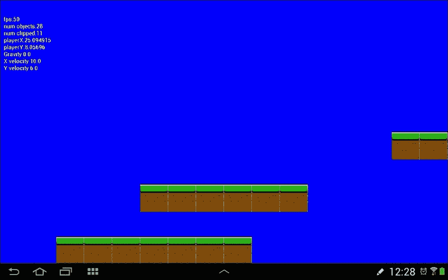

这是因为我们现在有了重力，而且调用`update()`的线程在应用程序启动时立即运行，甚至在我们的关卡和玩家角色设置完成之前。

我们需要做两件事。首先，我们只希望当`LevelManager`类完成其工作后，`update()`方法才运行。其次，我们需要在每一帧更新`Viewport`类的焦点，以便即使玩家正在坠落（他经常会这样做），屏幕也会以他为中心，这样我们就可以观看他的死亡。

让我们在暂停模式下开始游戏，这样玩家就不会错过了。首先，我们将在`LevelManager`类中添加一个方法，用于在播放和不播放之间切换播放状态。一个好的名字可能是`switchPlayingStatus()`。将新方法添加到`LevelManager`中，如下所示：

```java
public void switchPlayingStatus() {
        playing = !playing;
        if (playing) {
            gravity = 6;
        } else {
            gravity = 0;
        }
    }
```

现在，只需删除或注释掉`LevelManager`构造函数中设置`playing`为`true`的那行代码。不久，这将由屏幕触摸和刚刚编写的该方法来处理：

```java
// Load all the GameObjects and Bitmaps
loadMapData(context, pixelsPerMetre, px, py);

//playing = true;
//..
```

我们将编写一小段临时代码，只是很小的一段。我们已经知道我们最终会将监控玩家输入的责任委托给我们的新`InputController`类。在重写的`onTouchEvent`方法中的这段小代码非常值得努力，因为我们现在就可以使用暂停功能。

此代码将使用我们刚刚编写的方法在每次触摸屏幕时切换播放状态。将重写的方法添加到`PlatformView`类中。我们将在本章的后面部分替换一些代码。

```java
@Override
public boolean onTouchEvent(MotionEvent motionEvent) {
  switch (motionEvent.getAction() & MotionEvent.ACTION_MASK) {
    case MotionEvent.ACTION_DOWN:
         lm.switchPlayingStatus();
         break;
   }
return true;
}
```

你可以在`Player`类中将`isPressingRight`设置为 true，然后运行游戏并轻触屏幕。然后我们会看到玩家像幽灵一样从屏幕底部坠落，同时向右移动：

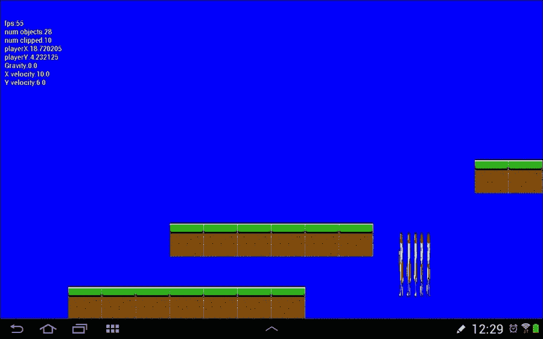

现在，让我们每帧更新视口，使其保持在玩家中心。将以下高亮代码添加到`PlatformView`类的`update`方法末尾：

```java
if (lm.isPlaying()) {
    //Reset the players location as the centre of the viewport
    vp.setWorldCentre(lm.gameObjects.get(lm.playerIndex)
        .getWorldLocation().x,
        lm.gameObjects.get(lm.playerIndex)
        .getWorldLocation().y);}
}// End of update()
```

如果你现在运行游戏，尽管玩家仍然会向右下落，但至少屏幕会聚焦在他身上，以便观看这一过程。

我们将处理永无止境的下落问题。

# 多阶段碰撞检测

我们已经看到我们的玩家角色只是简单地穿过世界并坠入虚无。当然，我们需要玩家能够站在平台上。以下是我们将要做的。

我们将为每个重要的对象提供一个碰撞盒，这样我们就可以在`Player`类中提供方法来测试碰撞盒是否与玩家接触。每帧一次，我们将所有未被视口裁剪的碰撞盒发送到这个新方法中进行碰撞测试。

我们这样做主要有两个原因。首先，通过只发送未裁剪的碰撞盒进行碰撞测试，我们大大减少了检查的数量，如第三章“Tappy Defender – Taking Flight”中所述，在“碰撞检测”部分*Things that go bump*。其次，通过在`Player`类中处理检查，我们可以给玩家多个不同的碰撞盒，并根据被击中的碰撞盒做出不同的反应。

让我们创建自己的碰撞盒类，这样我们就可以按照自己的意愿来设计它。它需要使用浮点坐标，需要一个`intersects`方法以及一些 getter 和 setter。创建一个新的类，命名为`RectHitbox`。

在这里，我们看到`RectHitbox`只是一些简单的 getter 和 setter 方法。它还有一个`intersects`方法，如果传入的`RectHitbox`与其自身相交，则返回`true`。关于`intersects()`代码的工作原理的解释，请参阅第三章“Tappy Defender – Taking Flight”。将以下代码输入到新类中：

```java
public class RectHitbox {
    float top;
    float left;
    float bottom;
    float right;
    float height;

    boolean intersects(RectHitbox rectHitbox){
        boolean hit = false;

        if(this.right > rectHitbox.left
                && this.left < rectHitbox.right ){
            // Intersecting on x axis

            if(this.top < rectHitbox.bottom
                    && this.bottom > rectHitbox.top ){
                // Intersecting on y as well
                // Collision
                hit = true;
            }
        }

        return hit;
    }

    public void setTop(float top) {
        this.top = top;
    }

    public float getLeft() {
        return left;
    }

    public void setLeft(float left) {
        this.left = left;
    }

    public void setBottom(float bottom) {
        this.bottom = bottom;
    }

    public float getRight() {
        return right;
    }

    public void setRight(float right) {
        this.right = right;
    }

    public float getHeight() {
        return height;
    }

    public void setHeight(float height) {
        this.height = height;
    }
}
```

现在，我们可以在`GameObject`中将`RectHitbox`类作为成员添加。在类声明之后添加它。

```java
private RectHitbox rectHitbox = new RectHitbox();
```

然后，我们添加一个初始化碰撞盒的方法和一个方法，以便在需要时获取它的副本。将这些方法添加到`GameObject`中：

```java
public void setRectHitbox() {
   rectHitbox.setTop(worldLocation.y);
   rectHitbox.setLeft(worldLocation.x);
   rectHitbox.setBottom(worldLocation.y + height);
   rectHitbox.setRight(worldLocation.x + width);
}

RectHitbox getHitbox(){
  return rectHitbox;
}
```

现在我们为`Grass`对象添加一个对`setRectHitbox()`的调用，然后我们可以开始与之碰撞。在`Grass`类的构造函数的末尾添加这一行高亮代码。重要的是，`setRectHitbox()`的调用必须在`setWorldLocation()`的调用之后，否则碰撞框将不会围绕草块包裹。

```java
// Where does the tile start
// X and y locations from constructor parameters
setWorldLocation(worldStartX, worldStartY, 0);
setRectHitbox();
}// End of Grass constructor
```

在我们开始理解将要进行碰撞检测的代码之前，我们需要`Player`类有自己的碰撞框集合。我们需要了解有关玩家角色的以下信息：

+   当头部撞到它上面的东西时

+   当脚部落在下面的平台上时

+   当玩家走进它两侧的东西时

为了实现这一点，我们将创建四个碰撞框；一个用于头部，一个用于脚部，以及每个左右手边的碰撞框。由于它们是玩家独有的，我们将在`Player`类中创建碰撞框。

在`Player`类声明之后立即声明四个碰撞框：

```java
RectHitbox rectHitboxFeet;
RectHitbox rectHitboxHead;
RectHitbox rectHitboxLeft;
RectHitbox rectHitboxRight;
```

现在在构造函数中，我们调用新的`RectHitbox()`来准备它们。请注意，我们没有费心为碰撞框分配任何值。我们很快就会看到如何做到这一点。像这样在`Player`构造函数的末尾添加四个`new()`调用：

```java
rectHitboxFeet = new RectHitbox();
rectHitboxHead = new RectHitbox();
rectHitboxLeft = new RectHitbox();
rectHitboxRight = new RectHitbox();
```

我们将看到我们将在哪里正确地初始化它们。接下来的代码中的碰撞框值是根据代表每个角色帧的矩形内实际形状所占用的空间手动估计的。如果你使用不同的角色图形，你可能需要调整你使用的精确值。

图表显示了每个碰撞框将定位的大致图形表示。左右碰撞框之间明显的距离不足是因为动画的不同帧比这个略宽。这是一个妥协。

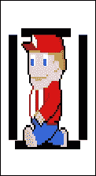

代码必须放置在`Player`类`update`方法中`move()`调用之后。这样，每当玩家位置发生变化时，碰撞框都会更新。在所示位置添加高亮代码，然后我们就更接近能够开始与物体碰撞。

```java
// Let's go!
this.move(fps);

// Update all the hitboxes to the new location
// Get the current world location of the player
// and save them as local variables we will use next
Vector2Point5D location = getWorldLocation();
float lx = location.x;
float ly = location.y;

//update the player feet hitbox
rectHitboxFeet.top = ly + getHeight() * .95f;
rectHitboxFeet.left = lx + getWidth() * .2f;
rectHitboxFeet.bottom = ly + getHeight() * .98f;
rectHitboxFeet.right = lx + getWidth() * .8f;

// Update player head hitbox
rectHitboxHead.top = ly;
rectHitboxHead.left = lx + getWidth() * .4f;
rectHitboxHead.bottom = ly + getHeight() * .2f;
rectHitboxHead.right = lx + getWidth() * .6f;

// Update player left hitbox
rectHitboxLeft.top = ly + getHeight() * .2f;
rectHitboxLeft.left = lx + getWidth() * .2f;
rectHitboxLeft.bottom = ly + getHeight() * .8f;
rectHitboxLeft.right = lx + getWidth() * .3f;

// Update player right hitbox
rectHitboxRight.top = ly + getHeight() * .2f;
rectHitboxRight.left = lx + getWidth() * .8f;
rectHitboxRight.bottom = ly + getHeight() * .8f;
rectHitboxRight.right = lx + getWidth() * .7f;

}// End update()
```

在下一个阶段，我们可以检测一些碰撞并对它们做出反应。仅涉及玩家的碰撞，例如坠落、撞头或试图穿过墙壁，将在`Player`类中的这个下一个方法中直接处理。请注意，该方法还返回一个`int`值来表示是否发生了碰撞以及碰撞发生在玩家身上的哪个位置，以便可以处理与拾取物或火坑等物品的其他碰撞。

新的`checkCollisions`方法接收一个`RectHitbox`作为参数。这将是我们当前正在检查碰撞的任何对象的`RectHitbox`。将`checkCollisions`方法添加到`Player`类中。

```java
public int checkCollisions(RectHitbox rectHitbox) {
    int collided = 0;// No collision

    // The left
    if (this.rectHitboxLeft.intersects(rectHitbox)) {
        // Left has collided
        // Move player just to right of current hitbox
        this.setWorldLocationX(rectHitbox.right - getWidth() * .2f);
        collided = 1;
    }

    // The right
    if (this.rectHitboxRight.intersects(rectHitbox)) {
        // Right has collided
        // Move player just to left of current hitbox
        this.setWorldLocationX(rectHitbox.left - getWidth() * .8f);
        collided = 1;
    }

    // The feet
    if (this.rectHitboxFeet.intersects(rectHitbox)) {
        // Feet have collided
        // Move feet to just above current hitbox
        this.setWorldLocationY(rectHitbox.top - getHeight());
        collided = 2;
    }

    // Now the head
    if (this.rectHitboxHead.intersects(rectHitbox)) {
        // Head has collided. Ouch!
        // Move head to just below current hitbox bottom
        this.setWorldLocationY(rectHitbox.bottom);
        collided = 3;
    }

    return collided;
}
```

如前述代码所示，我们需要向`GameObject`类添加一些 setter 方法，以便在检测到碰撞时可以更改*x*和*y*世界坐标。将以下两个方法添加到`GameObject`类中：

```java
public void setWorldLocationY(float y) {
  this.worldLocation.y = y;
}

public void setWorldLocationX(float x) {
  this.worldLocation.x = x;
}
```

最后一步是选择所有相关对象并测试碰撞。我们在`PlatformView`类的`update`方法中这样做，之后根据哪个身体部位与哪种对象类型发生碰撞来采取进一步行动。我们的 switch 块最初将只有一个默认情况，因为我们只有一个可能的对象类型可以与草地平台发生碰撞。注意，当检测到脚部碰撞时，我们将`isFalling`变量设置为`false`，使玩家能够跳跃。在所示位置输入高亮代码：

```java
// Set visible flag to true
go.setVisible(true);

// check collisions with player
int hit = lm.player.checkCollisions(go.getHitbox());
if (hit > 0) {
 //collision! Now deal with different types
 switch (go.getType()) {

 default:// Probably a regular tile
 if (hit == 1) {// Left or right
 lm.player.setxVelocity(0);
 lm.player.setPressingRight(false);
 }

 if (hit == 2) {// Feet
 lm.player.isFalling = false;
 }

 break;
 }
}

```

### 注意

随着我们在这个项目中继续前进，我们将更多地使用存储在`hit`中的值来进行基于碰撞的进一步决策。

让我们真正控制玩家。

# 玩家输入

首先，让我们在`Player`类中添加一些方法，这样我们的输入控制器就能够调用它们，然后操作`Player`类`update`方法使用的变量来移动。

我们已经玩过了`isPressingRight`变量，并且还有一个`isPressingLeft`变量。此外，我们还想能够跳跃。如果你查看`Player`类的`update`方法，我们已经有处理这些情况的代码。我们只需要让玩家能够通过触摸屏幕来启动这些动作。

我们之前的按钮布局设计和迄今为止编写的代码，表明有一个向左走的方法，一个向右走的方法，以及一个跳跃的方法。

你也会注意到，我们将一个`SoundManager`的副本传递给`startJump`方法，这使得我们能够在跳跃尝试成功时播放一个整洁的复古跳跃声音。将这三个新方法添加到`Player`类中：

```java
public void setPressingRight(boolean isPressingRight) {
        this.isPressingRight = isPressingRight;
    }

    public void setPressingLeft(boolean isPressingLeft) {
        this.isPressingLeft = isPressingLeft;
    }

    public void startJump(SoundManager sm) {
        if (!isFalling) {//can't jump if falling
            if (!isJumping) {//not already jumping
                isJumping = true;
                jumpTime = System.currentTimeMillis();
                sm.playSound("jump");
            }
        }
    }
```

现在，我们可以专注于`InputController`类。让我们将控制权从`onTouchEvent`方法传递到我们的`InputController`类。在`PlatformView`类中将`onTouchEvent`方法中的代码更改为以下内容：

```java
@Override
    public boolean onTouchEvent(MotionEvent motionEvent) {
        if (lm != null) {
            ic.handleInput(motionEvent, lm, sm, vp);
        }
        //invalidate();
        return true;
    }
```

我们的新方法中有一个错误。这仅仅是因为我们调用了`handleInput`方法，但还没有实现它。我们现在将这样做。

### 注意

如果你想知道关于`lm != null`的检查，那是因为`onTouchEvent`方法是从 Android UI 线程触发的，并且不受我们的控制。如果我们传递`lm`并开始尝试使用它，当它未初始化时，游戏将会崩溃。

我们现在可以在`InputController`类中完成所有需要做的事情。现在打开这个类，我们将计划我们将要做什么。

我们需要一个向左走的按钮，一个向右走的按钮，一个跳跃的按钮，一个切换暂停的按钮，稍后我们还需要一个开枪的按钮。因此，我们真的需要突出显示屏幕上的不同区域来代表每个任务。

为了做到这一点，我们将声明四个 `Rect` 对象，每个任务一个。然后在构造函数中，我们将通过基于玩家屏幕分辨率进行一些简单计算来定义这四个 `Rect` 对象的点。

我们定义了一些方便的变量，`buttonWidth`、`buttonHeight` 和 `buttonPadding`，基于设备的屏幕分辨率来帮助我们整齐地安排我们的 `Rect` 坐标。输入以下成员和 `InputController` 构造函数，如下所示：

```java
import android.graphics.Rect;
import android.view.MotionEvent;
import java.util.ArrayList;

public class InputController {

    Rect left;
    Rect right;
    Rect jump;
    Rect shoot;
    Rect pause;

    InputController(int screenWidth, int screenHeight) {

        //Configure the player buttons
        int buttonWidth = screenWidth / 8;
        int buttonHeight = screenHeight / 7;
        int buttonPadding = screenWidth / 80;

        left = new Rect(buttonPadding,
            screenHeight - buttonHeight - buttonPadding,
            buttonWidth,
            screenHeight - buttonPadding);

        right = new Rect(buttonWidth + buttonPadding,
            screenHeight - buttonHeight - buttonPadding,
            buttonWidth + buttonPadding + buttonWidth,
            screenHeight - buttonPadding);

        jump = new Rect(screenWidth - buttonWidth - buttonPadding,
            screenHeight - buttonHeight - buttonPadding -                           
            buttonHeight - buttonPadding,
            screenWidth - buttonPadding,
            screenHeight - buttonPadding - buttonHeight -                           
            buttonPadding);

        shoot = new Rect(screenWidth - buttonWidth - buttonPadding,
            screenHeight - buttonHeight - buttonPadding,
            screenWidth - buttonPadding,
            screenHeight - buttonPadding);

        pause = new Rect(screenWidth - buttonPadding -                          
            buttonWidth,
            buttonPadding,
            screenWidth - buttonPadding,
            buttonPadding + buttonHeight);

    }
```

我们将使用四个 `Rect` 对象在屏幕上绘制按钮。`draw` 方法将需要一个它们的副本。输入 `getButtons` 方法的代码以实现这一点：

```java
public ArrayList getButtons(){
   //create an array of buttons for the draw method
   ArrayList<Rect> currentButtonList = new ArrayList<>();
   currentButtonList.add(left);
   currentButtonList.add(right);
   currentButtonList.add(jump);
   currentButtonList.add(shoot);
   currentButtonList.add(pause);
   return  currentButtonList;
}
```

我们现在可以处理实际的玩家输入。这个项目与之前的有所不同，因为需要监控和响应许多不同的玩家动作，有时是同时进行的。正如你所期望的，Android API 有功能使我们尽可能容易地做到这一点。

`MotionEvent` 类中包含比我们迄今为止所看到更多的数据。之前，我们只是简单地检查了 `ACTION_DOWN` 和 `ACTION_UP` 事件。现在，我们需要深入挖掘以获取更多的事件数据。

为了记录和传递多个手指触摸、离开和移动到屏幕上的详细信息，`MotionEvent` 类将它们全部存储在一个数组中。当玩家的第一个手指触摸屏幕时，详细信息、坐标等存储在位置零。然后后续动作随后存储在数组中的较后位置。

与任何此类手指活动相关的数组中的位置并不一致。在某些情况下，例如检测特定手势，这可能会成为一个问题，程序员需要捕获、记住并响应 `MotionEvent` 类中持有的手指 ID。

幸运的是，在这种情况下，我们有明确定义的屏幕区域，代表我们的按钮，我们最需要知道的是手指是否在其中一个预定义区域内按下或释放屏幕。

我们只需要找出有多少手指导致了事件，并且因此存储在数组中，通过调用 `motionEvent.getPointerCount()`。然后我们遍历这些事件中的每一个，同时提供一个 `switch` 块来处理它们，无论屏幕的哪个区域发生了 `ACTION_DOWN` 或 `ACTION_UP`。我们的事件存储在数组中的哪个位置并不重要，只要我们检测到它并对其做出响应。

在我们可以编写解决方案之前，我们还需要知道的是，数组中的后续动作存储为 `ACTION_POINTER_DOWN` 和 `ACTION_POINTER_UP`；因此，在接下来的代码中，每次循环遍历时，我们需要检查和处理 `ACTION_DOWN` 和 `ACTION_POINTER_DOWN`。

在所有这些讨论之后，这是我们的 `handleInput` 方法，每次屏幕被触摸或释放时都会被调用：

```java
public void handleInput(MotionEvent motionEvent,LevelManager l,     
  SoundManager sound, Viewport vp){

    int pointerCount = motionEvent.getPointerCount();

    for (int i = 0; i < pointerCount; i++) {

        int x = (int) motionEvent.getX(i);
        int y = (int) motionEvent.getY(i);

        if(l.isPlaying()) {
            switch  (motionEvent.getAction() &
            MotionEvent.ACTION_MASK) {

            case MotionEvent.ACTION_DOWN:
                    if (right.contains(x, y)) {
                    l.player.setPressingRight(true);
                    l.player.setPressingLeft(false);

                    } else if (left.contains(x, y)) {
                    l.player.setPressingLeft(true);
                    l.player.setPressingRight(false);

                    } else if (jump.contains(x, y)) {
                    l.player.startJump(sound);

                    } else if (shoot.contains(x, y)) {

                    } else if (pause.contains(x, y)) {
                    l.switchPlayingStatus();
                    }

                break;

                case MotionEvent.ACTION_UP:
                    if (right.contains(x, y)) {
                    l.player.setPressingRight(false);

                    } else if (left.contains(x, y)) {
                    l.player.setPressingLeft(false);
                }

                break;

                case MotionEvent.ACTION_POINTER_DOWN:
                if (right.contains(x, y)) {
                    l.player.setPressingRight(true);
                    l.player.setPressingLeft(false);

                    } else if (left.contains(x, y)) {
                    l.player.setPressingLeft(true);
                        l.player.setPressingRight(false);

                    } else if (jump.contains(x, y)) {
                    l.player.startJump(sound);

                    } else if (shoot.contains(x, y)) {
                    //Handle shooting here

                    } else if (pause.contains(x, y)) {
                    l.switchPlayingStatus();
                }

                    break;

                case MotionEvent.ACTION_POINTER_UP:
                    if (right.contains(x, y)) {
                    l.player.setPressingRight(false);
                   //Log.w("rightP:", "up" );

                    } else if (left.contains(x, y)) {
                    l.player.setPressingLeft(false);
                   //Log.w("leftP:", "up" );

                    } else if (shoot.contains(x, y)) {
                    //Handle shooting here
                    } else if (jump.contains(x, y)) {
                   //Handle more jumping stuff here later
                }

                break;
}// End if(l.playing)

}else {// Not playing
    //Move the viewport around to explore the map
    switch (motionEvent.getAction() & MotionEvent.ACTION_MASK) {

    case MotionEvent.ACTION_DOWN:

        if (pause.contains(x, y)) {
            l.switchPlayingStatus();
            //Log.w("pause:", "DOWN" );
        }

      break;
            }
        }
    }
}
}
```

### 注意

如果你想知道为什么我们费心设置了两组控制代码，一组用于播放，另一组用于不播放，那是因为在 第八章 *整合所有元素* 中，我们将在游戏暂停时添加一个酷炫的新功能。当然，`togglePlayingStatus` 方法不需要这样做，即使没有对播放状态的测试也能正常工作。它只是节省了我们以后对代码进行一些细微的修改。

现在我们需要做的就是打开 `PlatformView` 类，获取包含所有控制按钮的数组副本，并将它们绘制到屏幕上。我们使用 `drawRoundRect` 方法绘制整洁的圆角矩形，以表示屏幕上将对玩家的触摸做出响应的区域。在调用 `unlockCanvasAndPost()` 之前，在 `draw` 方法中输入此代码：

```java
//draw buttons
paint.setColor(Color.argb(80, 255, 255, 255));
ArrayList<Rect> buttonsToDraw;
buttonsToDraw = ic.getButtons();

for (Rect rect : buttonsToDraw) {
  RectF rf = new RectF(rect.left, rect.top, 
    rect.right, rect.bottom);

    canvas.drawRoundRect(rf, 15f, 15f, paint);
}
```

此外，在我们调用 `unlockCanvasAndPost()` 之前，让我们先画一个简单的暂停屏幕，这样我们就能知道游戏是暂停还是正在播放。

```java
//draw paused text
if (!this.lm.isPlaying()) {
    paint.setTextAlign(Paint.Align.CENTER);
    paint.setColor(Color.argb(255, 255, 255, 255));

    paint.setTextSize(120);
    canvas.drawText("Paused", vp.getScreenWidth() / 2,                       
    vp.getScreenHeight() / 2, paint);
}
```

你现在可以跳来跳去，还可以听到一个不错的复古跳跃声音。为什么不通过编辑 `LevelCave` 并将几个句点字符 (`.`) 替换为几个更多的 `1` 字符来在场景中添加更多草地呢。下一张截图显示了玩家跳来跳去以及用于控制的按钮：

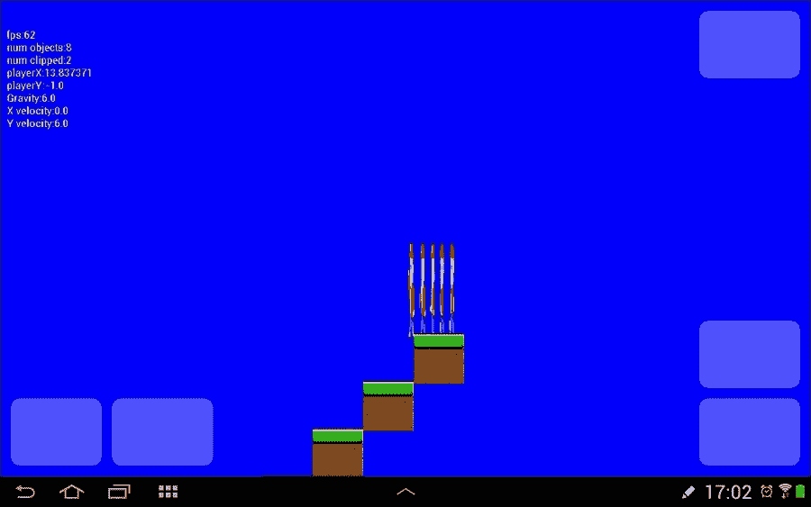

### 注意

我们将设计一些可玩的真实关卡，并在 第八章 *整合所有元素* 中将它们连接起来。现在，只需用 `LevelCave` 做任何看起来有趣的事情即可。

现在，我们可以摆脱那个丑陋的挤压玩家图形，并从中制作一个整洁的小动画。

# 动画鲍勃

精灵图集动画通过快速改变屏幕上绘制的图像来实现。就像一个孩子可能在书的角落画一个棍状人的各个阶段，然后快速翻动它，使其看起来在移动一样。

鲍勃的动画帧已经包含在我们用来代表他的 `player.png` 文件中。


我们需要做的只是当玩家移动时逐个遍历它们。

这相当简单易行。我们将创建一个简单的动画类，它处理计时功能，并在请求时返回精灵图集的适当部分。然后我们可以为任何需要动画的 `GameObject` 初始化一个新的动画对象。此外，当它们在 `PlatformView` 的 `draw` 方法中被绘制时，如果对象是动画的，我们将对其进行稍微不同的处理。

在本节中，我们还将看到如何使用跟踪玩家朝向的面向变量。它将使我们能够根据玩家的朝向反转精灵图集。

让我们从创建动画类开始。创建一个新的 Java 类，命名为`Animation`。接下来的代码将声明变量，这些变量将保存要操作的位图、位图的名称，以及一个`rect`参数来定义精灵图集中的区域，这是当前相关动画帧的坐标。

此外，我们还有`frameCount`、`currentFrame`、`frameTicker`和`framePeriod`，它们保存和控制可用帧的数量、当前帧号和帧变化的时机。正如你所期望的，我们还需要知道动画帧的宽度和高度，这些由`frameWidth`和`frameHeight`保存。

此外，`Animation`类将经常引用每米像素数；因此，将这个值保存在成员变量中是有意义的。

在`Animation`类中输入我们讨论过的这些成员变量：

```java
import android.content.Context;
import android.graphics.Bitmap;
import android.graphics.Rect;

public class Animation {
    Bitmap bitmapSheet;
    String bitmapName;
    private Rect sourceRect;
    private int frameCount;
    private int currentFrame;
    private long frameTicker;
    private int framePeriod;
    private int frameWidth;
    private int frameHeight;
    int pixelsPerMetre;
```

接下来，我们有构造函数，它为我们的动画对象准备使用。我们很快就会看到我们是如何为实际动画做准备的。注意，签名中有相当多的参数，表明动画是相当可配置的。只需注意，这里的 FPS 不是指游戏的帧率，而是指动画的帧率。

```java
Animation(Context context, 
  String bitmapName, float frameHeight, 
  float frameWidth, int animFps, 
  int frameCount, int pixelsPerMetre){

   this.currentFrame = 0;
   this.frameCount = frameCount;
   this.frameWidth = (int)frameWidth * pixelsPerMetre;
   this.frameHeight = (int)frameHeight * pixelsPerMetre;
   sourceRect = new Rect(0, 0, this.frameWidth, this.frameHeight);

   framePeriod = 1000 / animFps;
   frameTicker = 0l;
   this.bitmapName = "" + bitmapName;
   this.pixelsPerMetre = pixelsPerMetre;
}
```

我们可以处理类的实际功能。`getCurrentFrame`方法首先检查对象是否在移动或是否能够移动。在这个阶段，这看起来可能有点奇怪，因为这个方法将只由一个动画的`GameObject`类调用。因此，看起来奇怪的检查是在确定是否需要新的帧。

如果一个对象移动（例如鲍勃），但处于静止状态，那么我们不需要改变动画帧。然而，如果一个动画对象从未有过速度，比如咆哮的火焰，那么我们需要一直给它动画。它将永远不会有任何速度，所以`moves`变量将是`false`，但方法将继续进行。

该方法使用`time`、`frameTicker`和`framePeriod`来确定是否是显示下一个动画帧的时候，并且是否增加帧数以显示。然后，如果动画处于最后一帧，它将回到第一帧。

最后，计算并返回代表包含所需帧的精灵图集部分的精确左右位置，这些位置被返回给调用代码。

```java
public Rect getCurrentFrame(long time, 
    float xVelocity, boolean moves){

    if(xVelocity!=0 || moves == false) {
    // Only animate if the object is moving 
    // or it is an object which doesn't move
    // but is still animated (like fire)

        if (time > frameTicker + framePeriod) {
            frameTicker = time;
            currentFrame++;
            if (currentFrame >= frameCount) {
                currentFrame = 0;
            }
        }
    }

    //update the left and right values of the source of
    //the next frame on the spritesheet
    this.sourceRect.left = currentFrame * frameWidth;
    this.sourceRect.right = this.sourceRect.left + frameWidth;

    return sourceRect;

}

}// End of Animation class
```

接下来，我们可以向`GameObject`类添加一些成员。

```java
// Most objects only have 1 frame
// And don't need to bother with these
private Animation anim = null;
private boolean animated;
private int animFps = 1;
```

一些与我们的`Animation`类交互的方法，设置和获取变量，使动画工作，并通知`draw`方法对象是否是动画的。

```java
public void setAnimFps(int animFps) {
  this.animFps = animFps;
}

public void setAnimFrameCount(int animFrameCount) {
  this.animFrameCount = animFrameCount;
}

public boolean isAnimated() {
  return animated;
}
```

最后，在`GameObject`中，有一个方法，需要动画的对象可以使用它来设置整个动画对象。注意，是这个`setAnimated`方法在新的动画对象上调用`new()`。

```java
public void setAnimated(Context context, int pixelsPerMetre,  
  boolean animated){

 this.animated = animated;
 this.anim = new Animation(context, bitmapName,
     height,
     width,
     animFps,
     animFrameCount,
     pixelsPerMetre );
}
```

下一个方法充当`PlatformView`类的`draw`方法和`Animation`类的`getRectToDraw`方法之间的中间件。

```java
public Rect getRectToDraw(long deltaTime){
  return anim.getCurrentFrame(
    deltaTime, 
    xVelocity, 
    isMoves());
}
```

然后，我们需要更新`Player`类，以便根据其所需的特定帧数和每秒帧数初始化其动画对象。`Player`类中的新代码如下所示：

```java
setBitmapName("player");

final int ANIMATION_FPS = 16;
final int ANIMATION_FRAME_COUNT = 5;

// Set this object up to be animated
setAnimFps(ANIMATION_FPS);
setAnimFrameCount(ANIMATION_FRAME_COUNT);
setAnimated(context, pixelsPerMetre, true);

// X and y locations from constructor parameters
setWorldLocation(worldStartX, worldStartY, 0);
```

我们可以使用`draw`方法中的所有这些新代码来实现我们的动画。下一块代码检查当前正在绘制的`GameObject`是否`isAnimated()`。如果是，它通过`GameObject`类的`getRectToDraw`方法使用`getNextRect()`方法从精灵图中获取适当的矩形。

注意，下一段代码是从`draw`方法中提取的，它最初调用了`drawBitmap()`，现在被包裹在新代码的末尾的`else`子句中。基本的逻辑是这样的。如果动画正在播放，则执行新代码，否则按常规方式执行。

除了我们知道的动画代码外，我们还检查`if(go.getFacing() == 1)`，并使用`Matrix`类在需要时通过在*x*轴上按-1 的比例缩放位图来翻转位图。

这里是所有新代码，包括原始的`drawBitmap()`调用，它被包裹在新代码末尾的`else`子句中：

```java
toScreen2d.set(vp.worldToScreen
  go.getWorldLocation().x,
  go.getWorldLocation().y,
  go.getWidth(),
  go.getHeight()));

if (go.isAnimated()) {
 // Get the next frame of the bitmap
 // Rotate if necessary
 if (go.getFacing() == 1) {
 // Rotate
 Matrix flipper = new Matrix();
 flipper.preScale(-1, 1);
 Rect r = go.getRectToDraw(System.currentTimeMillis());
 Bitmap b = Bitmap.createBitmap(
 lm.bitmapsArray[lm.getBitmapIndex(go.getType())],
 r.left,
 r.top,
 r.width(),
 r.height(),
 flipper,
 true);
 canvas.drawBitmap(b, toScreen2d.left, toScreen2d.top, paint);
} else {
 // draw it the regular way round
 canvas.drawBitmap(
 lm.bitmapsArray[lm.getBitmapIndex(go.getType())],
 go.getRectToDraw(System.currentTimeMillis()),
 toScreen2d, paint);
}
} else { // Just draw the whole bitmap
 canvas.drawBitmap(
 lm.bitmapsArray[lm.getBitmapIndex(go.getType())],
 toScreen2d.left,
 toScreen2d.top, paint);
}

```

现在，你可以运行游戏，看到 Bob 所有的动画辉煌。截图无法显示他的动作，但你可以看到他现在完美成型：

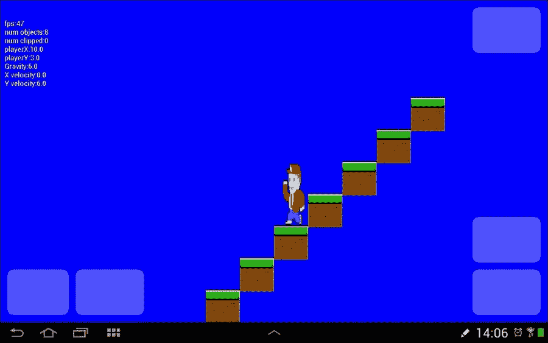

# 摘要

我们的游戏正在稳步推进。在这个阶段，我们可以在`LevelCave`中构建一个巨大的关卡设计，到处奔跑和跳跃。然而，我们将保存以推迟尝试使游戏可玩，直到我们添加更多整洁的功能。

这些整洁的功能将包括一挺机枪，它可以通过可收集的拾取物和一些 Bob 可以射击的敌人进行升级。我们将在下一章开始介绍这些内容。

# 第七章：平台游戏 - 枪支、生命、金钱和敌人

在本章中，我们将做很多事情。首先，我们将构建一个具有可变射速的机枪，并让它射击子弹。然后，我们将介绍拾取物或可收集物品。这些物品在玩家试图逃入下一级时提供了一些搜寻的东西。

然后，就在 Bob 开始认为他的生活是幸福的一生的草地和可收集物品时，我们将为他构建两个对手，让他智胜或杀死。一个归巢无人机和一个巡逻守卫。我们将很容易将这些事物添加到我们的关卡设计中。

# 准备瞄准射击

现在，我们可以给我们的英雄配备一把枪，稍后，我们可以给他一些敌人来射击。我们将创建一个`MachineGun`类来完成所有工作，并创建一个`Bullet`类来表示它发射的弹丸。`Player`类将控制`MachineGun`类，而`MachineGun`类将控制并跟踪它发射的所有`Bullet`对象。

创建一个新的 Java 类，命名为`Bullet`。子弹并不复杂。我们的子弹将需要一个*x*和*y*位置、一个水平速度和一个方向来帮助计算速度。

这意味着以下简单的类、构造函数以及一大堆 getter 和 setter 方法：

```java
public class Bullet  {

    private float x;
    private float y;
    private float xVelocity;
    private int direction;

    Bullet(float x, float y, int speed, int direction){
        this.direction = direction;
        this.x = x;
        this.y = y;
        this.xVelocity = speed * direction;
    }

    public int getDirection(){
        return direction;
    }

    public void update(long fps, float gravity){
        x += xVelocity / fps;
    }

    public void hideBullet(){
        this.x = -100;
        this.xVelocity = 0;
    }

    public float getX(){
        return x;
    }

    public float getY(){
        return y;
    }

}
```

现在让我们实现`MachineGun`类。

创建一个新的 Java 类，命名为`MachineGun`。首先，我们添加一些成员。`maxBullets`变量不是玩家拥有的射击次数，那是无限的，它是`MachineGun`类可以拥有的子弹对象的数量。10 个对于一把非常快速的射击枪来说是足够的，就像我们将会看到的那样。`numBullets`和`nextBullet`成员帮助类跟踪其 10 个子弹。`rateOfFire`变量控制玩家能够多快地按下射击按钮，而`lastShotTime`将帮助通过跟踪上次发射子弹的系统时间来强制执行`rateOfFire`。这将成为武器的可升级方面。

输入我们讨论的代码如下。

```java
import java.util.concurrent.CopyOnWriteArrayList;

public class MachineGun extends GameObject{
    private int maxBullets = 10;
    private int numBullets;
    private int nextBullet;
    private int rateOfFire = 1;//bullets per second
    private long lastShotTime;

    private CopyOnWriteArrayList<Bullet> bullets;

    int speed = 25;
```

### 注意

为了功能上的考虑，我们可以将存储我们的子弹的`CopyOnWriteArrayList` `bullets`视为一个普通的`ArrayList`对象。我们使用这个更复杂且稍微慢一点的类，因为它线程安全，子弹可以从 UI 线程访问，当玩家按下射击按钮时，以及从我们的线程中访问。这篇文章解释了`CopyOnWriteArrayList`，如果你想了解更多，请访问：

[`examples.javacodegeeks.com/java-basics/exceptions/java-util-concurrentmodificationexception-how-to-handle-concurrent-modification-exception/`](http://examples.javacodegeeks.com/java-basics/exceptions/java-util-concurrentmodificationexception-how-to-handle-concurrent-modification-exception/)

我们有一个只初始化子弹、`lastShotTime`和`nextBullet`的构造函数：

```java
MachineGun(){
   bullets = new CopyOnWriteArrayList<Bullet>();
   lastShotTime = -1;
   nextBullet = -1;
}
```

在这里，我们通过调用每个子弹的`bullet.update`方法来更新枪控制的所有的`Bullet`对象。

```java
public void update(long fps, float gravity){
        //update all the bullets
        for(Bullet bullet: bullets){
            bullet.update(fps, gravity);
        }
    }
```

接下来，我们有一些 getter 方法，将允许我们了解我们的枪及其子弹的信息，以便进行碰撞检测和绘制子弹。

```java
public int getRateOfFire(){
  return rateOfFire;
}

public void setFireRate(int rate){
  rateOfFire = rate;
}

public int getNumBullets(){
  //tell the view how many bullets there are
  return numBullets;
}

public float getBulletX(int bulletIndex){
  if(bullets != null && bulletIndex < numBullets) {
       return bullets.get(bulletIndex).getX();
    }

  return -1f;
}

public float getBulletY(int bulletIndex){
  if(bullets != null) {
       return bullets.get(bulletIndex).getY();
     }
     return -1f;
}
```

我们还有一个快速的帮助方法，用于当我们想要停止绘制子弹时。我们将它隐藏起来，直到它准备好在`shoot`方法中重新分配。`shoot`方法中。

```java
public void hideBullet(int index){
  bullets.get(index).hideBullet();
}
```

一个 getter 方法，返回移动的方向：

```java
public int getDirection(int index){
  return bullets.get(index).getDirection();
}
```

现在，我们添加一个更全面的方法，实际上发射子弹。该方法比较上次发射的射击时间与当前的`rateOfFire`。然后继续增加`nextBullet`并创建一个新的`Bullet`对象（如果允许的话）。子弹以与鲍勃面对的方向相同的速度飞出。注意，如果成功发射了子弹，该方法返回`true`。这样，`InputController`类就可以播放一个与玩家按钮按压相对应的声音效果。

```java
public boolean shoot(float ownerX, float ownerY, 
    int ownerFacing, float ownerHeight){

    boolean shotFired = false;
    if(System.currentTimeMillis() - lastShotTime  >                          
      1000/rateOfFire){

        //spawn another bullet;
        nextBullet ++;

        if(numBullets >= maxBullets){
            numBullets = maxBullets;
        }

        if(nextBullet == maxBullets){
            nextBullet = 0;
        }

        lastShotTime = System.currentTimeMillis();
        bullets.add(nextBullet, 
                new Bullet(ownerX, 
                (ownerY+ ownerHeight/3), speed, ownerFacing));

        shotFired = true;
        numBullets++;
    }
    return shotFired;
}
```

最后，当玩家找到机枪升级拾取物时，我们有一个可以调用的方法。我们将在本章后面看到更多。在这里，我们简单地增加`rateOfFire`，这使得玩家可以更猛烈地按下射击按钮，同时仍然得到结果。

```java
public void upgradeRateOfFire(){
  rateOfFire += 2;
}
}// End of MachineGun class
```

现在，我们将修改`Player`类以携带`MachineGun`。给`Player`一个成员变量，它是一个`MachineGun`。

```java
public MachineGun bfg;
```

在`Player`构造函数中，添加一行代码来初始化我们新的`MachineGun`对象：

```java
bfg = new MachineGun();
```

在`Player`类的`update`方法中，在调用玩家的`move()`之前，添加对`MachineGun`类`update`方法的调用。如下所示：

```java
bfg.update(fps, gravity);

// Let's go!
this.move(fps);
```

在`Player`类中添加一个方法，以便我们的`InputController`可以访问虚拟扳机。正如我们所见，如果射击成功，该方法返回`true`，这样`InputController`类就知道是否播放射击声音。

```java
public boolean pullTrigger() {
        //Try and fire a shot
        return bfg.shoot(this.getWorldLocation().x,  
           this.getWorldLocation().y, 
           getFacing(), getHeight());
}
```

现在，我们可以对我们的`InputController`类做一些小的添加，以便玩家可以射击。要添加的代码如下所示，突出显示在现有代码中：

```java
} else if (jump.contains(x, y)) {
  l.player.startJump(sound);

} else if (shoot.contains(x, y)) {
 if (l.player.pullTrigger()) {
 sound.playSound("shoot");
 }

} else if (pause.contains(x, y)) {
  l.switchPlayingStatus();

}
```

不要忘记我们新的控制系统是如何工作的，我们还需要在`InputController`类的`MotionEvent.ACTION_POINTER_DOWN`情况中添加相同的额外代码。像往常一样，以下是突出显示的代码和丰富的上下文：

```java
} else if (jump.contains(x, y)) {
  l.player.startJump(sound);

} else if (shoot.contains(x, y)) {
 if (l.player.pullTrigger()) {
 sound.playSound("shoot");
}

} else if (pause.contains(x, y)) {
  l.switchPlayingStatus();
}
```

现在我们有了枪，它已经上膛，我们也知道如何拉动扳机。我们只需要绘制子弹。

在`draw`方法中添加新代码，就在我们绘制调试文本之前，如下所示：

```java
//draw the bullets
paint.setColor(Color.argb(255, 255, 255, 255));
for (int i = 0; i < lm.player.bfg.getNumBullets(); i++) {
   // Pass in the x and y coords as usual
   // then .25 and .05 for the bullet width and height
   toScreen2d.set(vp.worldToScreen
            (lm.player.bfg.getBulletX(i),
            lm.player.bfg.getBulletY(i),
            .25f,
            .05f));

        canvas.drawRect(toScreen2d, paint);
}

// Text for debugging
if (debugging) {
// etc
```

我们现在将发射一些子弹。请注意，射速令人不满意且缓慢。我们将添加一些拾取物，玩家可以通过它们来增加枪的射速。

## 拾取物

拾取物是可以被玩家收集的游戏对象。它们包括升级、额外生命、金钱等等。我们现在将实现这些可收集物品中的每一个。由于我们的游戏引擎设置得如此，这将出人意料地简单。

我们首先要做的是创建一个类来保存当前玩家的状态。我们想要监控收集到的金钱、机枪的威力以及剩余的生命值。让我们称它为`PlayerState`。创建一个新的 Java 类，并将其命名为`PlayerState`。

除了我们刚才提到的变量之外，我们还想让`PlayerState`类记住一个*x*和*y*位置，当玩家失去生命时可以重生。输入这些成员变量和简单的构造函数：

```java
import android.graphics.PointF;

public class PlayerState {

    private int numCredits;
    private int mgFireRate;
    private int lives;
    private float restartX;
    private float restartY;

    PlayerState() {
        lives = 3;
        mgFireRate = 1;
        numCredits = 0;
    }
```

现在，我们需要一个我们可以调用的方法来初始化重生位置。我们将在稍后调用此方法时使用它。此外，我们还需要一个方法来重新加载位置。这是`PlayerState`类的下两个方法：

```java
public void saveLocation(PointF location) {
   // The location saves each time the player uses a teleport
     restartX = location.x;
     restartY = location.y;
}

public PointF loadLocation() {
   // Used every time the player loses a life
   return new PointF(restartX, restartY);
}
```

我们只需要一整套 getter 和 setter 来让我们访问这个类的成员：

```java
public int getLives(){
  return lives;
}

public int getFireRate(){
  return mgFireRate;
}

public void increaseFireRate(){
  mgFireRate += 2;
}

public void gotCredit(){
  numCredits ++;
}

public int getCredits(){
  return numCredits;
}

public void loseLife(){
  lives--;
}

public void addLife(){
  lives++;
}

public void resetLives(){
  lives = 3;
}
public void resetCredits(){
  lives = 0;
}

}// End PlayerState class
```

接下来，声明一个`PlayerState`类型的对象，作为`PlatformView`类的成员：

```java
// Our new engine classes
private LevelManager lm;
private Viewport vp;
InputController ic;
SoundManager sm;
private PlayerState ps;

```

在`PlatformView`构造函数中初始化它：

```java
vp = new Viewport(screenWidth, screenHeight);
sm = new SoundManager();
sm.loadSound(context);
ps = new PlayerState();

loadLevel("LevelCave", 10, 2);
```

现在，在`loadLevel`方法中，创建一个`RectF`对象，存储玩家的起始位置，并将其传递给`PlayerState`对象`ps`以安全保存。每次玩家死亡时，都可以使用此位置重新生成。

```java
ic = new InputController(vp.getScreenWidth(), vp.getScreenHeight());

PointF location = new PointF(px, py);
ps.saveLocation(location);

//set the players location as the world centre of the viewport
```

现在，我们将创建三个类，每个类对应我们的一个拾取物。这些类非常简单。它们扩展了`GameObject`，设置一个位图，有一个碰撞框和一个世界中的位置。此外，请注意，它们都在构造函数中接收一个类型，并使用`setType()`来存储这个值。我们将很快看到如何使用它们的类型来处理玩家“拾取”它们时发生的情况。创建三个新的 Java 类：`Coin`、`ExtraLife`和`MachineGunUpgrade`。注意，拾取物比平台小一点，也许正如我们预期的那样。依次输入它们的代码。

以下是`Coin`的代码：

```java
public class Coin extends GameObject{

    Coin(float worldStartX, float worldStartY, char type) {

        final float HEIGHT = .5f;
        final float WIDTH = .5f;

        setHeight(HEIGHT); 
        setWidth(WIDTH); 

        setType(type);

        // Choose a Bitmap
        setBitmapName("coin");

        // Where does the tile start
        // X and y locations from constructor parameters
        setWorldLocation(worldStartX, worldStartY, 0);
        setRectHitbox();
    }

    public void update(long fps, float gravity){}
}
```

现在，对于`ExtraLife`：

```java
public class ExtraLife extends GameObject{

    ExtraLife(float worldStartX, float worldStartY, char type) {

        final float HEIGHT = .8f;
        final float WIDTH = .65f;

        setHeight(HEIGHT); 
        setWidth(WIDTH); 

        setType(type);

        // Choose a Bitmap

        setBitmapName("life");

        // Where does the tile start
        // X and y locations from constructor parameters
        setWorldLocation(worldStartX, worldStartY, 0);
        setRectHitbox();
    }

    public void update(long fps, float gravity){}
}
```

最后，是`MachineGunUpgrade`类：

```java
public class MachineGunUpgrade extends GameObject{
    MachineGunUpgrade(float worldStartX, 
        float worldStartY, 
        char type) {

        final float HEIGHT = .5f;
        final float WIDTH = .5f;

        setHeight(HEIGHT); 
        setWidth(WIDTH); 

        setType(type);

        // Choose a Bitmap

        setBitmapName("clip");

        // Where does the tile start
        // X and y locations from constructor parameters
        setWorldLocation(worldStartX, worldStartY, 0);
        setRectHitbox();
    }

    public void update(long fps, float gravity){}
}
```

现在，更新`LevelManager`类以期望我们在关卡设计中使用这三个新对象，并将它们添加到`GameObjects`的`ArrayList`中。为此，我们需要在三个地方更新`LevelManager`类：`getBitmap()`、`getBitmapIndex()`和`loadMapData()`。以下是每个这些小的更新，新代码在现有代码中突出显示。

在`getBitmap()`中添加以下内容：

```java
case 'p':
  index = 2;
  break;

case 'c':
 index = 3;
 break;

case 'u':
 index = 4;
 break;

case 'e':
 index = 5;
 break;

default:
  index = 0;
  break;
```

添加相同的添加，但这次是到`getBitmapIndex()`：

```java
case 'p':
  index = 2;
  break;

case 'c':
 index = 3;
 break;

case 'u':
 index = 4;
 break;

case 'e':
 index = 5;
 break;

default:
  index = 0;
  break;
```

在`LevelManager`中做出最终更改，通过以下对`loadMapData()`的添加来实现：

```java
case 'p':// a player
    // Add a player to the gameObjects
    gameObjects.add(new Player(context, px, py, pixelsPerMetre));
    // We want the index of the player
    playerIndex = currentIndex;
    // We want a reference to the player object
    player = (Player) gameObjects.get(playerIndex);
    break;

case 'c':
 // Add a coin to the gameObjects
 gameObjects.add(new Coin(j, i, c));
 break;

case 'u':
 // Add a machine gun upgrade to the gameObjects
 gameObjects.add(new MachineGunUpgrade(j, i, c));
 break;

case 'e':
 // Add an extra life to the gameObjects
 gameObjects.add(new ExtraLife(j, i, c));
 break;
}

```

现在，我们可以将三个适当命名的图形添加到 drawable 文件夹中，并开始将它们添加到我们的`LevelCave`设计中。请将`clip.png`、`coin.png`和`life.png`从下载包中的`Chapter7/drawables`文件夹复制到 Android Studio 项目的`drawable`文件夹中。

添加一个方便的注释列表，标识所有游戏对象类型。我们将在整个项目中添加这些注释，以及将代表它们在我们关卡设计中的字母数字代码。将以下注释添加到`LevelData`类中：

```java
// Tile types
// . = no tile
// 1 = Grass
// 2 = Snow
// 3 = Brick
// 4 = Coal
// 5 = Concrete
// 6 = Scorched
// 7 = Stone

//Active objects
// g = guard
// d = drone
// t = teleport
// c = coin
// u = upgrade
// f = fire
// e  = extra life

//Inactive objects
// w = tree
// x = tree2 (snowy)
// l = lampost
// r = stalactite
// s = stalacmite
// m = mine cart
// z = boulders

```

在我们增强`LevelCave`类以使用我们的新对象之前，我们希望检测玩家收集它们或与它们碰撞，并采取适当的行动。我们将首先向`Player`类添加一个快速的帮助方法。这样做的原因是因为当玩家与另一个对象碰撞时，`Player`类中的`checkCollisions`方法的默认操作是停止角色移动。我们不希望这种情况发生在拾取物上，因为这会对玩家造成困扰。因此，我们将快速向`Player`类添加一个`restorePreviousVelocity`方法，我们可以在不需要此默认操作时调用它。将此方法添加到`Player`类中：

```java
public void restorePreviousVelocity() {
  if (!isJumping && !isFalling) {
       if (getFacing() == LEFT) {
           isPressingLeft = true;
           setxVelocity(-MAX_X_VELOCITY);
         } else {
           isPressingRight = true;
                     setxVelocity(MAX_X_VELOCITY);
       }
    }
}
```

现在，我们可以依次处理我们每个拾取物的碰撞。将这些情况添加到处理`PlatformView`类中的`update`方法碰撞的 switch 块中，以处理我们的三个拾取物：

```java
switch (go.getType()) {
 case 'c':
 sm.playSound("coin_pickup");
 go.setActive(false);
 go.setVisible(false);
 ps.gotCredit();

 // Now restore state that was 
 // removed by collision detection
 if (hit != 2) {// Any hit except feet
 lm.player.restorePreviousVelocity();
 }
 break;

case 'u':
 sm.playSound("gun_upgrade");
 go.setActive(false);
 go.setVisible(false);
 lm.player.bfg.upgradeRateOfFire();
 ps.increaseFireRate();
 if (hit != 2) {// Any hit except feet
 lm.player.restorePreviousVelocity();
 }
 break;

case 'e':
 //extralife
 go.setActive(false);
 go.setVisible(false);
 sm.playSound("extra_life");
 ps.addLife();

 if (hit != 2) {
 lm.player.restorePreviousVelocity();
 }
 break;

default:// Probably a regular tile
    if (hit == 1) {// Left or right
        lm.player.setxVelocity(0);
        lm.player.setPressingRight(false);
    }

    if (hit == 2) {// Feet
        lm.player.isFalling = false;
    }
    break;
}
```

最后，将新对象添加到我们的`LevelCave`类中。

### 小贴士

我建议以下代码片段是一个简单的布局，用于演示我们的新对象，但你的布局可以像你喜欢的任何大小或复杂程度。我们将在下一章设计并链接一些关卡时做些更复杂的事情。

将以下代码输入到`LevelCave`或使用你自己的设计进行扩展：

```java
public class LevelCave extends LevelData{
  LevelCave() {
    tiles = new ArrayList<String>();
 this.tiles.add("p.............................................");
 this.tiles.add("..............................................");
 this.tiles.add("..............................................");
 this.tiles.add("..............................................");
 this.tiles.add("....................c.........................");
 this.tiles.add("....................1........u................");
 this.tiles.add(".................c..........u1................");
 this.tiles.add(".................1.........u1.................");
 this.tiles.add("..............c...........u1..................");
 this.tiles.add("..............1..........u1...................");
 this.tiles.add("......................e..1....e.....e.........");
 this.tiles.add("....11111111111111111111111111111111111111....");
}

```

简单布局将看起来像这样：

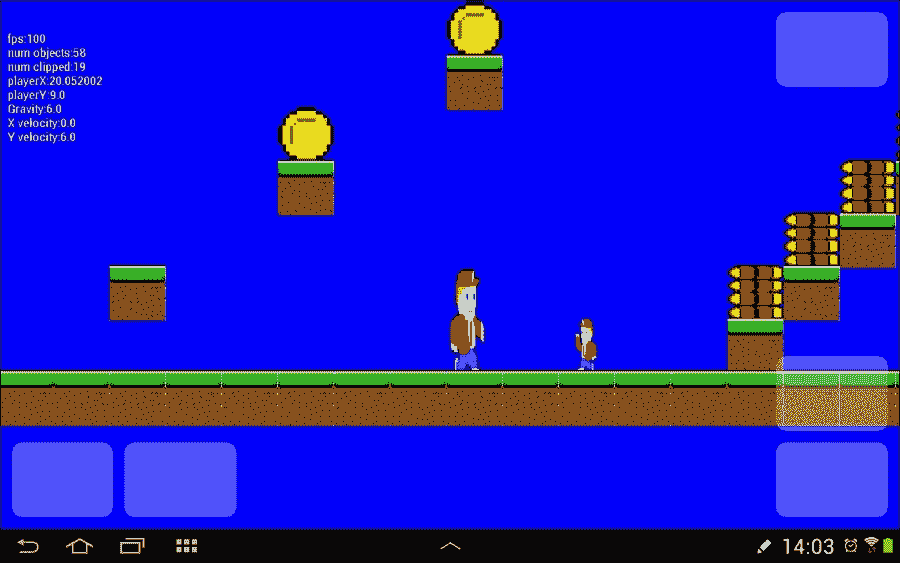

尝试收集拾取物，你会听到令人愉悦的声音效果。此外，每次我们收集一个拾取物，`PlayerState`类都会存储一个更新。这将在我们下一章构建 HUD 时很有用。最有趣的是；如果你收集了机枪升级，然后尝试射击你的枪，你会发现它更加令人满意。

我们最好让那些子弹做些事情。然而，在我们这样做之前，让我们给玩家提供一些额外的炮弹作为几个敌人的形式。

### 无人机

无人机是一个简单但邪恶的敌人。当它在视图中检测到玩家时，它会直飞向玩家。如果无人机接触到玩家，玩家将立即死亡。

让我们构建一个`Drone`类。创建一个新的 Java 类，命名为`Drone`。我们需要成员变量来记住我们上次设置航点的时刻。这将限制无人机获取鲍勃坐标导航更新的频率。这将阻止无人机过于精确。它需要一个航点/目标坐标，并且还需要通过`MAX_X_VELOCITY`和`MAX_Y_VELOCITY`知道速度限制。

```java
import android.graphics.PointF;

public class Drone extends GameObject {

    long lastWaypointSetTime;
    PointF currentWaypoint;

    final float MAX_X_VELOCITY = 3;
    final float MAX_Y_VELOCITY = 3;
```

现在，在`Drone`构造函数中，初始化通常的`GameObject`成员，特别是`Drone`类的一些成员，如`currentWaypoint`。不要忘记，如果我们打算射击无人机，它将需要一个碰撞框，我们在调用`setWorldLocation()`之后调用`setRectHitBox()`。

```java
Drone(float worldStartX, float worldStartY, char type) {
    final float HEIGHT = 1;
    final float WIDTH = 1;
    setHeight(HEIGHT); // 1 metre tall
    setWidth(WIDTH); // 1 metres wide

    setType(type);

    setBitmapName("drone");
    setMoves(true);
    setActive(true);
    setVisible(true);

    currentWaypoint = new PointF();

    // Where does the drone start
    // X and y locations from constructor parameters
    setWorldLocation(worldStartX, worldStartY, 0);
    setRectHitbox();
    setFacing(RIGHT);
}
```

这里是`update`方法的实现，该方法比较无人机的坐标与其`currentWaypoint`变量，并相应地改变其速度。然后，我们通过调用`move()`然后`setRectHitbox()`来结束`update()`方法。

```java
public void update(long fps, float gravity) {
  if (currentWaypoint.x > getWorldLocation().x) {
       setxVelocity(MAX_X_VELOCITY);
   } else if (currentWaypoint.x < getWorldLocation().x) {
       setxVelocity(-MAX_X_VELOCITY);
   } else {
       setxVelocity(0);
   }

    if (currentWaypoint.y >= getWorldLocation().y) {
       setyVelocity(MAX_Y_VELOCITY);
     } else if (currentWaypoint.y < getWorldLocation().y) {
       setyVelocity(-MAX_Y_VELOCITY);
     } else {
       setyVelocity(0);
  }

  move(fps);

  // update the drone hitbox
   setRectHitbox();

}
```

在我们的`Drone`类的最后一个方法中，通过传递鲍勃的坐标作为参数来更新`currentWaypoint`变量。注意，我们检查是否已经过去了足够的时间以便进行更新，以确保我们的无人机不会过于精确。

```java
public void setWaypoint(Vector2Point5D playerLocation) {
  if (System.currentTimeMillis() > lastWaypointSetTime + 2000) {//Has 2 seconds passed
        lastWaypointSetTime = System.currentTimeMillis();
        currentWaypoint.x = playerLocation.x;
        currentWaypoint.y = playerLocation.y;
     }
}
}// End Drone class
```

将`Chapter7/drawable`中的无人机图形`drone.png`添加到你的项目中的`drawable`文件夹。

然后，我们需要在`LevelManager`类中的通常三个地方添加无人机，就像我们对每个拾取物所做的那样。现在，向`getBitmap()`、`getBitmapIndex()`和`loadMapData()`添加代码。这些是按照顺序的三个小的代码添加。

在`getBitmap`方法中添加高亮代码：

```java
case 'e':
  index = 5;
  break;

case 'd':
 index = 6;
 break;

default:
  index = 0;
  break;
```

在`getBitmapIndex`方法中添加高亮代码：

```java
case 'e':
  index = 5;
  break;

case 'd':
 index = 6;
 break;

default:
  index = 0;
  break;
```

在`loadMapData`方法中添加高亮代码：

```java
case 'e':
   // Add an extra life to the gameObjects
   gameObjects.add(new ExtraLife(j, i, c));
   break;

case 'd':
 // Add a drone to the gameObjects
 gameObjects.add(new Drone(j, i, c));
 break;

```

燃烧的问题是如何让无人机知道去哪里？在每一帧，如果视图中有一个无人机，我们可以发送玩家的坐标。在`PlatformView`类的`update`方法中执行以下代码块中所示的操作。

通常，新代码会以高亮和现有代码的上下文显示。如果你还记得`Drone`类中的`setWaypoint()`代码，它每 2 秒只接受更新。这阻止了无人机过于精确。

```java
if (lm.isPlaying()) {
   // Run any un-clipped updates
   go.update(fps, lm.gravity);

 if (go.getType() == 'd') {
 // Let any near by drones know where the player is
 Drone d = (Drone) go;
 d.setWaypoint(lm.player.getWorldLocation());
 }
}
```

现在，这些邪恶的无人机可以被战略性地放置在关卡周围，它们会锁定玩家。为了让无人机完全投入使用，我们最后需要做的是检测它们实际撞击玩家的时刻。这很简单。只需在`PlatformView`类的`update`方法中为无人机添加一个`switch`块中的情况：

```java
case 'e':
  //extralife
   go.setActive(false);
   go.setVisible(false);
   sm.playSound("extra_life");
   ps.addLife();
   if (hit != 2) {// Any hit except feet
       lm.player.restorePreviousVelocity();
   }
   break;

case 'd':
 PointF location;
 //hit by drone
 sm.playSound("player_burn");
 ps.loseLife();
 location = new PointF(ps.loadLocation().x, 
 ps.loadLocation().y);
 lm.player.setWorldLocationX(location.x);
 lm.player.setWorldLocationY(location.y);
 lm.player.setxVelocity(0);
 break;

default:// Probably a regular tile
  if (hit == 1) {// Left or right
       lm.player.setxVelocity(0);
       lm.player.setPressingRight(false);
  }

   if (hit == 2) {// Feet
       lm.player.isFalling = false;
   }
```

将一大群无人机添加到`LevelCave`中，并观察它们飞向玩家。注意，如果无人机抓住玩家，玩家就会死亡并重生。

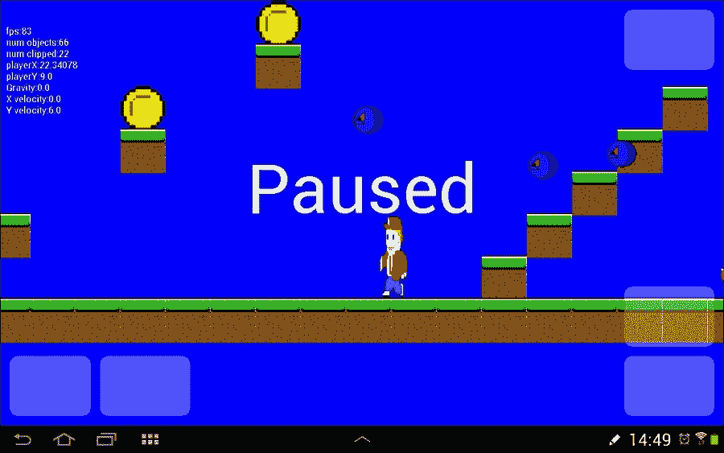

现在，好像这个世界还不够危险，有那么多敌对无人机，让我们再添加一种敌人类型。

### 守卫

守卫敌人将是脚本练习的一部分。我们将让`LevelManager`类自动生成一个简单的脚本，为我们的守卫生成巡逻路线。

路线将是可能的最简单路线；它将只是守卫之间连续行走的两个航点。通过预先编程我们的守卫为两个预定的航点，这将更快、更简单。然而，通过花时间自动生成它，我们可以在我们设计的任何关卡中（在一定的参数内）放置守卫，并且行为将由我们处理。

我们的守卫将会动画化，所以我们将使用精灵图集，并在构造函数中配置动画细节；就像我们对`Player`类所做的那样。

创建一个新的类，命名为`Guard`。首先，处理成员变量。我们的`Guard`类不仅需要两个航点，还需要一个变量来指示当前航点是哪一个。像其他移动对象一样，它还需要速度。以下是类声明和成员变量，以开始编写你的类：

```java
import android.content.Context;

public class Guard extends GameObject {

    // Guards just move on x axis between 2 waypoints

    private float waypointX1;// always on left
    private float waypointX2;// always on right
    private int currentWaypoint;
    final float MAX_X_VELOCITY = 3;
```

我们需要通过构造函数设置我们的守卫。首先，设置动画变量、位图和大小。然后，像往常一样，设置守卫在关卡中的位置、击中框和它面对的方式。然而，在构造函数的最后一行，我们将`currentWaypoint`设置为`1`；这是新的。我们将在本类的`update`方法中看到这是如何影响守卫行为的。

```java
Guard(Context context, float worldStartX, 
  float worldStartY, char type, 
  int pixelsPerMetre) {

        final int ANIMATION_FPS = 8;
        final int ANIMATION_FRAME_COUNT = 5;
        final String BITMAP_NAME = "guard";
        final float HEIGHT = 2f;
        final float WIDTH = 1;

        setHeight(HEIGHT); // 2 metre tall
        setWidth(WIDTH); // 1 metres wide

        setType(type);

        setBitmapName("guard");
        // Now for the player's other attributes
        // Our game engine will use these
        setMoves(true);
        setActive(true);
        setVisible(true);

        // Set this object up to be animated
        setAnimFps(ANIMATION_FPS);
        setAnimFrameCount(ANIMATION_FRAME_COUNT);
        setBitmapName(BITMAP_NAME);
        setAnimated(context, pixelsPerMetre, true);

        // Where does the tile start
        // X and y locations from constructor parameters
        setWorldLocation(worldStartX, worldStartY, 0);
        setxVelocity(-MAX_X_VELOCITY);
        currentWaypoint = 1;
}
```

接下来，添加一个方法，我们的`LevelManager`类将使用它来让`Guard`类知道它的两个航点：

```java
public void setWaypoints(float x1, float x2){
  waypointX1 = x1;
  waypointX2 = x2;
}
```

现在，我们将编写`Guard`类的“大脑”，即其`update`方法。基本上，你可以把这个方法分成两个主要部分。首先，`if(currentWaypoint == 1)`，其次，`if(currentWaypoint == 2)`。在每个`if`块内部，简单地检查护甲是否到达或超过了适当的巡逻点。如果是，则切换巡逻点，反转速度，并让护甲朝相反方向前进。

最后，调用`move()`然后`setRectHitbox()`来更新护甲到护甲的新位置。添加`update`方法的代码，然后我们将看到如何将其投入使用。

```java
public void update(long fps, float gravity) {
  if(currentWaypoint == 1) {// Heading left
       if (getWorldLocation().x <= waypointX1) {
          // Arrived at waypoint 1
           currentWaypoint = 2;
           setxVelocity(MAX_X_VELOCITY);
           setFacing(RIGHT);
      }
  }

  if(currentWaypoint == 2){
    if (getWorldLocation().x >= waypointX2) {
         // Arrived at waypoint 2
          currentWaypoint = 1;
          setxVelocity(-MAX_X_VELOCITY);
          setFacing(LEFT);
      }
  }

  move(fps);
   // update the guards hitbox
   setRectHitbox();
}
}// End Guard class
```

记得将下载包的`Chapter7/drawables`文件夹中的`guard.png`添加到项目的`drawable`文件夹中。

现在，我们可以向`LevelManager`类添加通常的三个新增功能，以加载我们可能在我们级别设计中找到的所有护甲。

在`getBitmap()`中，添加以下高亮代码：

```java
case 'd':
  index = 6;
  break;

case 'g':
 index = 7;
 break;

default:
  index = 0;
  break;
```

在`getBitmapIndex()`中，添加以下高亮代码：

```java
case 'd':
  index = 6;
  break;

case 'g':
 index = 7;
 break;

default:
  index = 0;
  break;
```

在`loadMapData()`中，添加以下高亮代码：

```java
case 'd':
     // Add a drone to the gameObjects
     gameObjects.add(new Drone(j, i, c));
     break;
case 'g':
 // Add a guard to the gameObjects
 gameObjects.add(new Guard(context, j, i, c, pixelsPerMetre));
 break;

```

我们很快将为`LevelManager`添加一些全新的内容。这是一个创建脚本（设置两个巡逻点）的方法。为了使这个新方法能够工作，它需要知道这个地砖是否适合行走。我们将为`GameObject`添加一个新的属性、一个获取器和设置器，以便这个功能可以轻松被发现。

在类声明之后立即将这个新成员添加到`GameObject`类中：

```java
private boolean traversable = false;
```

将这两个方法添加到`GameObject`类中，以获取和设置这个变量：

```java
public void setTraversable(){
  traversable = true;
}

public boolean isTraversable(){
  return traversable;
}
```

现在，在`Grass`类的构造函数中，添加对`setTraversable()`的调用。我们必须记住，如果我们想让我们的护甲能够在它们上面巡逻，我们必须为所有未来设计的`GameObject`派生类都这样做。在`Grass`中，在构造函数顶部添加此行：

```java
setTraversable();
```

接下来，我们将查看`LevelManager`类的新`setWaypoints`方法。它需要检查级别设计，并为该级别中存在的任何`Guard`对象计算两个巡逻点。

我们将把这个方法分成几个部分，这样我们就可以看到每个阶段的操作。

首先，我们需要遍历所有的`gameObjects`类，寻找`Guard`对象。

```java
public void setWaypoints() {
  // Loop through all game objects looking for Guards
    for (GameObject guard : this.gameObjects) {
       if (guard.getType() == 'g') {
```

如果我们到达代码的这个点，这意味着我们已经找到了一个需要设置两个巡逻点的护甲。首先，我们需要找到护甲“站立”的地砖。然后，我们计算两侧最后一个可穿越地砖的坐标，但每侧的最大范围是五个地砖。这些将是两个巡逻点。以下是添加到`setWaypoints`方法的代码。代码中包含大量注释，以在不打断流程的情况下清楚地说明正在发生的事情。

```java
// Set waypoints for this guard
// find the tile beneath the guard
// this relies on the designer putting 
// the guard in sensible location

int startTileIndex = -1;
int startGuardIndex = 0;
float waypointX1 = -1;
float waypointX2 = -1;

for (GameObject tile : this.gameObjects) {
    startTileIndex++;
    if (tile.getWorldLocation().y == 
            guard.getWorldLocation().y + 2) {

        // Tile is two spaces below current guard
        // Now see if has same x coordinate
        if (tile.getWorldLocation().x == 
            guard.getWorldLocation().x) {

            // Found the tile the guard is "standing" on
            // Now go left as far as possible 
            // before non travers-able tile is found
            // Either on guards row or tile row
            // upto a maximum of 5 tiles. 
            //  5 is an arbitrary value you can
            // change it to suit

            for (int i = 0; i < 5; i++) {// left for loop
                if (!gameObjects.get(startTileIndex -
                    i).isTraversable()) {

                    //set the left waypoint
                    waypointX1 = gameObjects.get(startTileIndex - 
                        (i + 1)).getWorldLocation().x;

                     break;// Leave left for loop
                     } else {
                    // Set to max 5 tiles as 
                    // no non traversible tile found
                    waypointX1 = gameObjects.get(startTileIndex -
                        5).getWorldLocation().x;
               }
                }// end get left waypoint

                for (int i = 0; i < 5; i++) {// right for loop
                    if (!gameObjects.get(startTileIndex +
                        i).isTraversable()) {

                        //set the right waypoint
                        waypointX2 = gameObjects.get(startTileIndex +
                            (i - 1)).getWorldLocation().x;

                    break;// Leave right for loop
                    } else {
                    //set to max 5 tiles away
                    waypointX2 = gameObjects.get(startTileIndex +
                       5).getWorldLocation().x;
                }

                }// end get right waypoint

        Guard g = (Guard) guard;
        g.setWaypoints(waypointX1, waypointX2);
    }
}
}
}
}
}// End setWaypoints()
```

现在，我们可以在`LevelManager`构造函数的最后调用我们的新`setWaypoints`方法。我们需要在`GameObject`类的`ArrayList`被填充之后调用此方法，否则其中将没有护甲。添加对`setWaypoints()`的调用，如下所示：

```java
// Load all the GameObjects and Bitmaps
loadMapData(context, pixelsPerMetre, px, py);
// Set waypoints for our guards
setWaypoints();

```

接下来，将此代码添加到`PlatformView`类的`update`方法中的碰撞检测开关块中，这样我们就可以撞到守卫了。

```java
case 'd':
    PointF location;
    //hit by drone
    sm.playSound("player_burn");
    ps.loseLife();
    location = new PointF(ps.loadLocation().x, 
        ps.loadLocation().y);

    lm.player.setWorldLocationX(location.x);
    lm.player.setWorldLocationY(location.y);
    lm.player.setxVelocity(0);
    break;

case 'g':
 // Hit by guard
 sm.playSound("player_burn");
 ps.loseLife();
 location = new PointF(ps.loadLocation().x,
 ps.loadLocation().y);

 lm.player.setWorldLocationX(location.x);
 lm.player.setWorldLocationY(location.y);
 lm.player.setxVelocity(0);
 break;

default:// Probably a regular tile
    if (hit == 1) {// Left or right
        lm.player.setxVelocity(0);
        lm.player.setPressingRight(false);
    }
    if (hit == 2) {// Feet
        lm.player.isFalling = false;
    }
```

最后，向`LevelCave`类添加一些`g`字母。确保将它们放置在平台上方一个空格处，因为它们的高度是 2 米，就像这个伪代码中一样：

```java
................g............................
...........................d.................
111111111111111111111111111111111111111111111
```

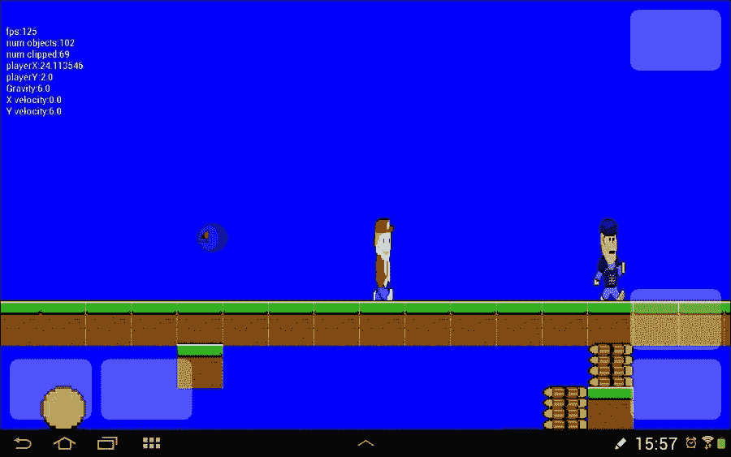

# 概述

我们实现了枪械、拾取物、无人机和守卫。这意味着我们现在有很多危险，但我们有一把不能造成任何伤害的机关枪。我们将在下一章首先改变这一点，通过实现子弹的碰撞检测。然而，我们将做得比仅仅让它们击中敌人更进一步。

# 第八章。平台游戏 – 整合一切

最后，我们将让子弹造成一些伤害。当子弹的能量被一团草吸收时，回弹声音非常令人满意。我们将添加大量新的平台类型和静态场景对象，使我们的关卡更有趣。我们将通过实现多个滚动透视背景来提供真实的运动和沉浸感。

我们还将为玩家添加一个需要躲避的动画火焰砖块，以及一个特殊的`Teleport`类，用于将关卡链接成一个可玩的游戏。然后，我们将使用所有的游戏对象和背景来创建四个，链接的，并且完全可玩的游戏关卡。

然后，我们将添加一个 HUD 来跟踪拾取物和生命值。最后，我们将讨论一些在这个项目中仅用四章无法涵盖的有趣事物。

# 子弹碰撞检测

检测子弹碰撞相当直接。我们遍历我们的`MachineGun`对象持有的所有现有`Bullet`对象。接下来，我们将每个子弹的点转换为`RectHitBox`对象，并使用`intersects()`方法与视口中的每个对象进行测试。

如果我们被击中，我们会检查它击中了什么类型的对象。然后，我们切换到处理我们关心的每种类型的对象。如果是`Guard`对象，我们会将其击退一点，如果是`Drone`对象，我们会将其摧毁，如果是其他任何东西，我们只需让子弹消失并播放一种沉闷/回弹声音。

我们只是将我们讨论的逻辑放置在我们处理玩家碰撞的`switch`块之后，但在那之前，我们会在所有未剪辑的对象上调用`update()`，如下所示：

```java
default:// Probably a regular tile
    if (hit == 1) {// Left or right
        lm.player.setxVelocity(0);
        lm.player.setPressingRight(false);
    }

   if (hit == 2) {// Feet
        lm.player.isFalling = false;
    }
    break;
}
}

//Check bullet collisions
for (int i = 0; i < lm.player.bfg.getNumBullets(); i++) {
 //Make a hitbox out of the the current bullet
 RectHitbox r = new RectHitbox();
 r.setLeft(lm.player.bfg.getBulletX(i));
 r.setTop(lm.player.bfg.getBulletY(i));
 r.setRight(lm.player.bfg.getBulletX(i) + .1f);
 r.setBottom(lm.player.bfg.getBulletY(i) + .1f);

 if (go.getHitbox().intersects(r)) {
 // Collision detected
 // make bullet disappear until it 
 // is respawned as a new bullet
 lm.player.bfg.hideBullet(i);

 //Now respond depending upon the type of object hit
 if (go.getType() != 'g' && go.getType() != 'd') {
 sm.playSound("ricochet");

 } else if (go.getType() == 'g') {
 // Knock the guard back
 go.setWorldLocationX(go.getWorldLocation().x +
 2 * (lm.player.bfg.getDirection(i)));

 sm.playSound("hit_guard");

 } else if (go.getType() == 'd') {
 //destroy the droid
 sm.playSound("explode");
 //permanently clip this drone
 go.setWorldLocation(-100, -100, 0);
 }
 }
}

if (lm.isPlaying()) {
    // Run any un-clipped updates
    go.update(fps, lm.gravity);
        //...
```

尝试一下，这真的很令人满意，尤其是在高射速的情况下。

# 添加一些火焰砖块

这些新的`GameObject`派生对象将意味着鲍勃会立即死亡。它们不会移动，但会进行动画。我们将看到我们只需设置`GameObject`已经存在的属性就能实现这一点。

将此功能添加到我们的游戏中很简单，因为我们已经实现了我们需要的所有功能。我们已经有了一种定位和添加新砖块的方法，一种检测和响应碰撞的方法，精灵表动画，等等。让我们一步一步来做，然后我们可以将这些危险和生命威胁元素添加到我们的世界中。

我们可以将类的整个功能放入其构造函数中。我们所做的只是配置对象，就像我们配置我们的`Grass`对象一样，但除此之外，我们还要配置所有动画设置，就像我们对`Player`和`Guard`对象所做的那样。`fire.png`精灵图集有 3 帧动画，我们希望在一秒钟内播放。

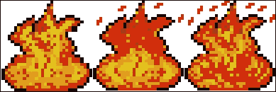

创建一个新的类，命名为`Fire`，并向其中添加以下代码：

```java
import android.content.Context;

public class Fire extends GameObject{

    Fire(Context context, float worldStartX, 
    float worldStartY, char type, int pixelsPerMetre) {

        final int ANIMATION_FPS = 3;
        final int ANIMATION_FRAME_COUNT = 3;
        final String BITMAP_NAME = "fire";

        final float HEIGHT = 1;
        final float WIDTH = 1;

        setHeight(HEIGHT); // 1 metre tall
        setWidth(WIDTH); // 1 metre wide

        setType(type);
        // Now for the player's other attributes
        // Our game engine will use these
        setMoves(false);
        setActive(true);
        setVisible(true);

        // Choose a Bitmap
        setBitmapName(BITMAP_NAME);
        // Set this object up to be animated
        setAnimFps(ANIMATION_FPS);
        setAnimFrameCount(ANIMATION_FRAME_COUNT);
        setBitmapName(BITMAP_NAME);
        setAnimated(context, pixelsPerMetre, true);

        // Where does the tile start
        // X and y locations from constructor parameters
        setWorldLocation(worldStartX, worldStartY, 0);
        setRectHitbox();
    }

 public void update(long fps, float gravity) {
 }
}
```

当然，现在我们需要将下载包中的`Chapter8/drawable`文件夹中的`fire.png`精灵图集添加到项目的`drawable`文件夹中。

然后，我们将向我们的`LevelManager`类添加内容，就像我们为所有新的`GameObject`派生类所做的那样，通常有三种方式。

在`getBitmap`方法中，添加以下高亮代码：

```java
case 'g':
    index = 7;
    break;

case 'f':
 index = 8;
 break;

default:
    index = 0;
    break;
```

在`getBitmapIndex`方法中：

```java
case 'g':
    index = 7;
    break;

case 'f':
 index = 8;
 break;

default:
    index = 0;
    break;
```

在`loadMapData()`方法中：

```java
case 'g':
     // Add a guard to the gameObjects
     gameObjects.add(new Guard(context, j, i, c, pixelsPerMetre));
     break;

 case 'f':
 // Add a fire tile the gameObjects
 gameObjects.add(new Fire
 (context, j, i, c, pixelsPerMetre));

 break;

```

最后，我们在碰撞检测的`switch`块中添加内容，以处理接触这个糟糕瓦片的后果。

```java
case 'g':
    //hit by guard
    sm.playSound("player_burn");
    ps.loseLife();
    location = new PointF(ps.loadLocation().x,
        ps.loadLocation().y);
    lm.player.setWorldLocationX(location.x);
    lm.player.setWorldLocationY(location.y);
    lm.player.setxVelocity(0);
    break;

case 'f':
 sm.playSound("player_burn");
 ps.loseLife();
 location = new PointF(ps.loadLocation().x,
 ps.loadLocation().y);
 lm.player.setWorldLocationX(location.x);
 lm.player.setWorldLocationY(location.y);
 lm.player.setxVelocity(0);
 break;

default:// Probably a regular tile
    if (hit == 1) {// Left or right
        lm.player.setxVelocity(0);
        lm.player.setPressingRight(false);
    }

    if (hit == 2) {// Feet
        lm.player.isFalling = false;
    }
    break;
```

为什么不在`LevelCave`中添加几个`f`瓦片并实验玩家能够跳过的内容。这有助于我们在本章后面设计一些具有挑战性的关卡。

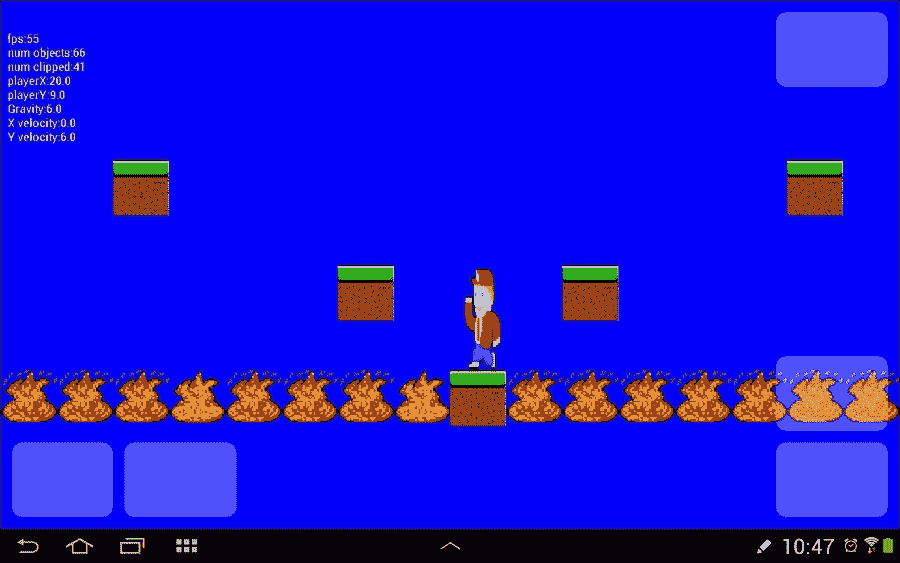

我们不希望我们的玩家整段时间都在草地上行走，所以让我们添加一些更多的变化。

# 眼睛的甜点

本章接下来的三个部分将纯粹是美学上的。我们将添加一大堆不同的瓦片图形以及相应的类，这样我们就可以使用更多的艺术许可来使我们的关卡更有趣。瓦片之间的区别将是纯粹视觉上的，但将它们做得比这更有功能性将相对简单。

例如，我们可以轻松地检测与雪瓦片的碰撞，并在停止后让玩家短暂移动以模拟打滑，或者也许；混凝土瓦片可以让玩家移动得更快，从而改变我们设计大跳跃的方式等等。关键是，你不必像这里展示的那样直接复制粘贴类。

我们还将添加一些完全具有美感的道具：矿车、巨石、钟乳石等等。这些物体将不会有碰撞检测。这将允许关卡设计师使关卡更加视觉上吸引人。

### 小贴士

要使这些美学元素更具有功能性，只需在碰撞检测的`switch`块中添加一个击中框和情况来处理后果。

可能，我们添加的最具视觉意义的改进将是滚动背景。我们将添加一些类，允许关卡设计师向关卡设计中添加多个不同的滚动背景。

### 小贴士

为什么不将下载包中`Chapter8/drawable`文件夹中的所有图形添加到项目的`drawable`文件夹中。这样，你将拥有所有准备好的图形，并可用于本节以及接下来的两节。

## 新的平台瓦片

现在添加所有这些类，文件名如所示。我已经从代码中移除了所有注释，因为它们在功能上都与 `Grass` 类相同。按照所示名称创建以下每个类，并输入代码：

这是 `Brick` 类的代码：

```java
public class Brick extends GameObject {

    Brick(float worldStartX, float worldStartY, char type) {
        setTraversable();
        final float HEIGHT = 1;
        final float WIDTH = 1;
        setHeight(HEIGHT); 
        setWidth(WIDTH); 
        setType(type);
        setBitmapName("brick");
        setWorldLocation(worldStartX, worldStartY, 0);
        setRectHitbox();
    }

    public void update(long fps, float gravity) {
    }
}
```

这是 `Coal` 类的代码：

```java
public class Coal extends GameObject {

    Coal(float worldStartX, float worldStartY, char type) {
        setTraversable();
        final float HEIGHT = 1;
        final float WIDTH = 1;
        setHeight(HEIGHT); 
        setWidth(WIDTH);
        setType(type);
        setBitmapName("coal");
        setWorldLocation(worldStartX, worldStartY, 0);
        setRectHitbox();
    }

    public void update(long fps, float gravity) {
    }
}
```

这是 `Concrete` 类的代码：

```java
public class Concrete extends GameObject {

    Concrete(float worldStartX, float worldStartY, char type) {
        setTraversable();
        final float HEIGHT = 1;
        final float WIDTH = 1;
        setHeight(HEIGHT);
        setWidth(WIDTH);
        setType(type);
        setBitmapName("concrete");
        setWorldLocation(worldStartX, worldStartY, 0);
        setRectHitbox();
    }

    public void update(long fps, float gravity) {
    }
}
```

下面的代码是 `Scorched` 类的代码：

```java
public class Scorched extends GameObject {

    Scorched(float worldStartX, float worldStartY, char type) {
        setTraversable();
        final float HEIGHT = 1;
        final float WIDTH = 1;
        setHeight(HEIGHT);
        setWidth(WIDTH);
        setType(type);
        setBitmapName("scorched");
        setWorldLocation(worldStartX, worldStartY, 0);
        setRectHitbox();
    }

    public void update(long fps, float gravity) {
    }
}
```

这是 `Snow` 类的代码：

```java
public class Snow extends GameObject {

    Snow(float worldStartX, float worldStartY, char type) {
        setTraversable();
        final float HEIGHT = 1;
        final float WIDTH = 1;
        setHeight(HEIGHT);
        setWidth(WIDTH);
        setType(type);
        setBitmapName("snow");
        setWorldLocation(worldStartX, worldStartY, 0);
        setRectHitbox();
    }

    public void update(long fps, float gravity) {
    }
}
```

这是 `Stone` 类的代码：

```java
public class Stone extends GameObject {

    Stone(float worldStartX, float worldStartY, char type) {
        setTraversable();
        final float HEIGHT = 1;
        final float WIDTH = 1;
        setHeight(HEIGHT);
        setWidth(WIDTH); 
        setType(type);
        setBitmapName("stone");
        setWorldLocation(worldStartX, worldStartY, 0);
        setRectHitbox();
    }

    public void update(long fps, float gravity) {
    }
}
```

现在，正如我们习惯的那样，我们需要将它们全部添加到我们的 `LevelManager` 中，通常在三个地方。

在 `getBitmap()` 中，我们简单地按正常方式添加它们。请注意，尽管值是任意的，但我们将使用数字 2、3、4 等来表示类型。这使得在设计关卡时更容易记住，所有我们的实际平台都是数字。实际的索引数字对我们来说并不重要，只要它们与 `getBitmapIndex` 方法中的相同。此外，请记住，在我们的 `LevelData` 类的注释中有一个类型列表，便于设计关卡时参考。

```java
case 'f':
    index = 8;
    break;

case '2':
 index = 9;
 break;

case '3':
 index = 10;
 break;

case '4':
 index = 11;
 break;

case '5':
 index = 12;
 break;

case '6':
 index = 13;
 break;

case '7':
 index = 14;
 break;

default:
    index = 0;
    break;
```

在 `getBitmapIndex()` 中，我们做同样的事情：

```java
case 'f':
    index = 8;
    break;

case '2':
 index = 9;
 break;

case '3':
 index = 10;
 break;

case '4':
 index = 11;
 break;

case '5':
 index = 12;
 break;

case '6':
 index = 13;
 break;

case '7':
 index = 14;
 break;

default:
    index = 0;
    break;
```

在 `loadMapData()` 中，我们只需对新的 `GameObjects` 调用 `new()` 来将它们添加到我们的 `gameObjects` 列表中。

```java
case 'f':
    // Add a fire tile the gameObjects
    gameObjects.add(new Fire(context, j, i, c, pixelsPerMetre));
    break;

case '2':
 // Add a tile to the gameObjects
 gameObjects.add(new Snow(j, i, c));
 break;

case '3':
 // Add a tile to the gameObjects
 gameObjects.add(new Brick(j, i, c));
 break;

case '4':
 // Add a tile to the gameObjects
 gameObjects.add(new Coal(j, i, c));
 break;

case '5':
 // Add a tile to the gameObjects
 gameObjects.add(new Concrete(j, i, c));
 break;

case '6':
 // Add a tile to the gameObjects
 gameObjects.add(new Scorched(j, i, c));
 break;

case '7':
 // Add a tile to the gameObjects
 gameObjects.add(new Stone(j, i, c));
 break;

```

现在，尽情地为 `LevelCave` 类添加不同的地形：

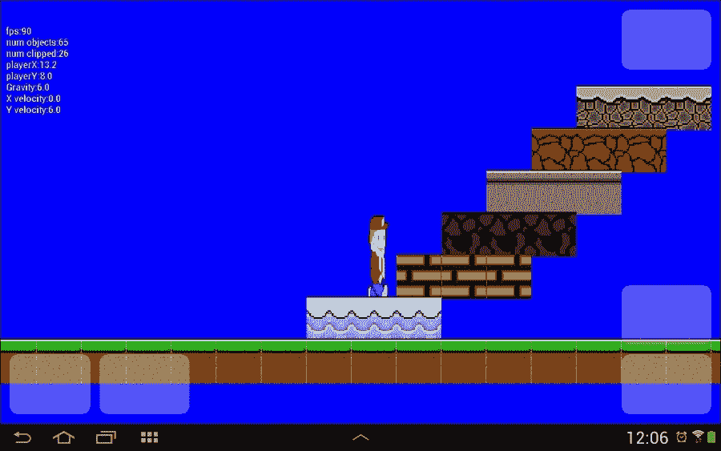

现在添加一些景观对象。

## 新的景观对象

在这里，我们将添加一些不做什么但看起来很漂亮的对象。我们将通过简单地不添加碰撞盒并将它们随机设置为 z 层 -1 或 1 来让游戏引擎知道。然后玩家可以出现在它们的前面或后面。

我们首先添加所有类，然后像往常一样在三个地方更新 `LevelManager`。按照以下方式创建每个新类：

这是 `Boulders` 类：

```java
public class Boulders extends GameObject {

    Boulders(float worldStartX, float worldStartY, char type) {

        final float HEIGHT = 1;
        final float WIDTH = 3;

        setHeight(HEIGHT); // 1 metre tall
        setWidth(WIDTH); // 1 metre wide

        setType(type);

        // Choose a Bitmap
        setBitmapName("boulder");
        setActive(false);//don't check for collisions etc

        // Randomly set the tree either just in front or just 
        //behind the player -1 or 1
        Random rand = new Random();
        if(rand.nextInt(2)==0) {
            setWorldLocation(worldStartX, worldStartY, -1);
        }else{
            setWorldLocation(worldStartX, worldStartY, 1);//
        }
        //No hitbox!!

    }

    public void update(long fps, float gravity) {
    }
}
```

从现在开始，我移除了所有的注释以节省数字墨水。类功能与 `Boulders` 中的相同，只是属性略有不同。

这是 `Cart` 类：

```java
public class Cart extends GameObject {

  Cart(float worldStartX, float worldStartY, char type) {

        final float HEIGHT = 2;
        final float WIDTH = 3;
        setWidth(WIDTH);
        setHeight(HEIGHT);
        setType(type);
        setBitmapName("cart");
        setActive(false);
        Random rand = new Random();
        if(rand.nextInt(2)==0) {
          setWorldLocation(worldStartX, worldStartY, -1);
        }else{
          setWorldLocation(worldStartX, worldStartY, 1);
        }
     }

  public void update(long fps, float gravity) {
     }
}
```

这是 `Lampost` 类的代码：

```java
public class Lampost extends GameObject {

  Lampost(float worldStartX, float worldStartY, char type) {

        final float HEIGHT = 3;
        final float WIDTH = 1;
        setHeight(HEIGHT);
        setWidth(WIDTH); 
        setType(type);
        setBitmapName("lampost");
        setActive(false);
        Random rand = new Random();
        if(rand.nextInt(2)==0) {
          setWorldLocation(worldStartX, worldStartY, -1);
        }else{
          setWorldLocation(worldStartX, worldStartY, 1);
        }
  }

    public void update(long fps, float gravity) {
   }
}
```

这是 `Stalagmite` 类：

```java
import java.util.Random;

public class Stalagmite extends GameObject {

  Stalagmite(float worldStartX, float worldStartY, char type) {

        final float HEIGHT = 3;
        final float WIDTH = 2;
        setHeight(HEIGHT);
        setWidth(WIDTH);
        setType(type);
        setBitmapName("stalacmite");
        setActive(false);
        Random rand = new Random();
        if(rand.nextInt(2)==0) {
         setWorldLocation(worldStartX, worldStartY, -1);
        }else{
         setWorldLocation(worldStartX, worldStartY, 1);
        }
    }

    public void update(long fps, float gravity) {
    }
}
```

这是 `Stalactite` 类：

```java
import java.util.Random;

public class Stalactite extends GameObject {

  Stalactite(float worldStartX, float worldStartY, char type) {

        final float HEIGHT = 3;
        final float WIDTH = 2;
        setHeight(HEIGHT);
        setWidth(WIDTH);
        setType(type);
        setBitmapName("stalactite");
        setActive(false);
        Random rand = new Random();
        if(rand.nextInt(2)==0) {
          setWorldLocation(worldStartX, worldStartY, -1);
        }else{
          setWorldLocation(worldStartX, worldStartY, 1);
        }
  }

     public void update(long fps, float gravity) {
     }
}
```

这是 `Tree` 类的代码：

```java
import java.util.Random;

public class Tree extends GameObject {

  Tree(float worldStartX, float worldStartY, char type) {

       final float HEIGHT = 4;
       final float WIDTH = 2;
       setWidth(WIDTH);
        setHeight(HEIGHT);
        setType(type);
        setBitmapName("tree1");
        setActive(false);
        Random rand = new Random();
        if(rand.nextInt(2)==0) {
          setWorldLocation(worldStartX, worldStartY, -1);
        }else{
          setWorldLocation(worldStartX, worldStartY, 1);
        }
     }

     public void update(long fps, float gravity) {
     }
}
```

这就是 `Tree2` 类：

```java
import java.util.Random;

public class Tree2 extends GameObject {

  Tree2(float worldStartX, float worldStartY, char type) {

        final float HEIGHT = 4;
        final float WIDTH = 2;
        setWidth(WIDTH);
        setHeight(HEIGHT);
        setType(type);
        setBitmapName("tree2");
        setActive(false);
        Random rand = new Random();
        if(rand.nextInt(2)==0) {
          setWorldLocation(worldStartX, worldStartY, -1);
        }else{
          setWorldLocation(worldStartX, worldStartY, 1);
        }
  }

     public void update(long fps, float gravity) {
     }
}
```

那就是所有新的景观对象类。现在，我们可以更新 `LevelManager` 类中的 `getBitmap` 方法，添加七个新类型。

```java
case '7':
    index = 14;
    break;

case 'w':
 index = 15;
 break;

case 'x':
 index = 16;
 break;

case 'l':
 index = 17;
 break;

case 'r':
 index = 18;
 break;

case 's':
 index = 19;
 break;

case 'm':
 index = 20;
 break;

case 'z':
 index = 21;
 break;

default:
    index = 0;
    break;
```

以同样的方式更新 `getBitmapIndex` 方法：

```java
case '7':
    index = 14;
    break;

case 'w':
 index = 15;
 break;

case 'x':
 index = 16;
 break;

case 'l':
 index = 17;
 break;

case 'r':
 index = 18;
 break;

case 's':
 index = 19;
 break;

case 'm':
 index = 20;
 break;

case 'z':
 index = 21;
 break;

default:
    index = 0;
    break;
```

最后，确保我们的新景观项目被添加到我们的 `gameObjects` 数组列表中：

```java
case '7':
    // Add a tile to the gameObjects
    gameObjects.add(new Stone(j, i, c));
    break;

case 'w':
 // Add a tree to the gameObjects
 gameObjects.add(new Tree(j, i, c));
 break;

case 'x':
 // Add a tree2 to the gameObjects
 gameObjects.add(new Tree2(j, i, c));
 break;

case 'l':
 // Add a tree to the gameObjects
 gameObjects.add(new Lampost(j, i, c));
 break;

case 'r':
 // Add a stalactite to the gameObjects
 gameObjects.add(new Stalactite(j, i, c));
 break;

case 's':
 // Add a stalagmite to the gameObjects
 gameObjects.add(new Stalagmite(j, i, c));
 break;

case 'm':
 // Add a cart to the gameObjects
 gameObjects.add(new Cart(j, i, c));
 break;

case 'z':
 // Add a boulders to the gameObjects
 gameObjects.add(new Boulders(j, i, c));
 break;

```

现在，我们可以使用景观来设计关卡。注意当对象在零层绘制时与在第一层绘制时的外观略有不同，以及玩家角色是穿过前面还是后面：

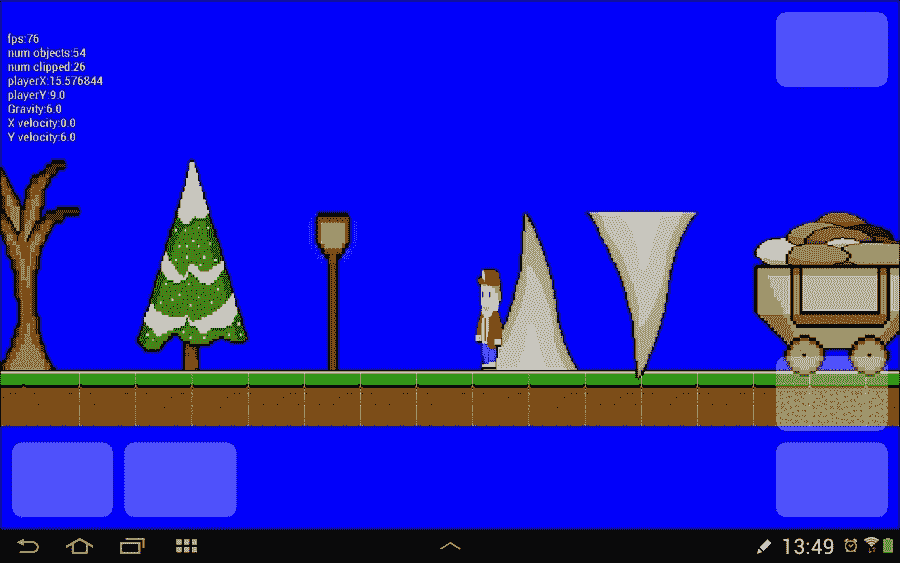

### 小贴士

当然，如果你想撞到路灯柱，被钟乳石刺穿，或者跳到矿车上，那么只需给它们一个碰撞盒。

我们还有另一种美化游戏世界的方法。

## 滚动透视背景

垂直背景是滚动背景，我们越远地滚动它们就越慢。所以，如果我们在玩家的脚下有草地边缘，我们会快速滚动它。然而，如果我们在远处有山脉，我们会慢速滚动它。这种效果可以给玩家带来运动感。

为了实现这些，我们首先将添加一个数据结构来表示背景的参数。我们将把这个类命名为 `BackgroundData`，然后实现一个 `Background` 类，它具有控制滚动的功能，然后我们将看到如何在我们的关卡设计中定位和定义背景。最后，我们将编写一个 `drawBackground` 方法，我们将在常规的 `draw` 方法中调用它。

确保你已经将下载包中 `Chapter8/drawable` 文件夹中的所有图形添加到了你的项目中的 `drawable` 文件夹。

首先，让我们构建一个简单的类来保存数据结构，这将定义我们的背景。正如我们可以在下一块代码中看到的那样，我们有很多参数和成员变量。我们需要知道哪个位图将代表一个背景，它在 *z* 轴上的哪一层来绘制（在 1 前面或在 -1 后面），在 *y* 轴上它在世界中的起始和结束位置，背景将如何滚动，以及背景将有多高。

`isParallax` 布尔值旨在提供选项来有一个静态的背景，但我们不会实现这个功能。当你看到背景类的代码时，你会看到如果你想要添加这个功能，它是很容易的。

创建一个新的类，命名为 `BackgroundData`，然后使用以下代码实现它：

```java
public class BackgroundData {
  String bitmapName;
     boolean isParallax;
     //layer 0 is the map
     int layer;
     float startY;
     float endY;
     float speed;
     int height;
     int width;

     BackgroundData(String bitmap, boolean isParallax, 
     int layer, float startY, float endY, 
     float speed, int height){

      this.bitmapName = bitmap;
      this.isParallax = isParallax;
      this.layer = layer;
      this.startY = startY;
      this.endY = endY;
      this.speed = speed;
      this.height = height;
  }
}
```

现在，我们将我们的新类型 `ArrayList` 添加到 `LevelData` 类中：

```java
ArrayList<String> tiles;
ArrayList<BackgroundData> backgroundDataList;

// This class will evolve along with the project
```

接下来，让我们创建 `Background` 类本身。创建一个新的类，命名为 `Background`。首先，我们设置一些变量来保存背景图像的一个副本以及一个反转的副本。我们将通过交替放置正图像和反转图像来使背景看起来是无限的。我们将在代码的后续部分看到如何实现这一点。

我们还有用于图像宽度和高度的像素变量。`reversedFirst` 布尔值将确定当前绘制在屏幕左侧（第一）的图像副本是哪个。当玩家移动和图像滚动时，它将改变。`xClip` 变量将保存 *x* 轴（图像的）上的精确像素，我们将从屏幕的左侧边缘开始切割图像并绘制它。

`y`、`endY`、`z` 和 `speed` 成员变量用于存储作为参数传入的相关值：

```java
import android.content.Context;
import android.graphics.Bitmap;
import android.graphics.BitmapFactory;
import android.graphics.Matrix;

public class Background {

     Bitmap bitmap;
     Bitmap bitmapReversed;

     int width;
     int height;

     boolean reversedFirst;
     int xClip;// controls where we clip the bitmaps each frame
     float y;
     float endY;
     int z;

     float speed;
     boolean isParallax;//Not currently used
```

现在，在构造函数中，我们从一个作为参数传递的图形文件名称创建一个 Android 资源 ID。然后，通过调用`BitmapFactory.decodeResource()`创建实际的位图。我们将`reversedFirst`设置为`false`，因此我们将从屏幕左侧的常规（非反转）图像副本开始。我们初始化我们的成员变量，然后通过调用`Bitmap.createScaledBitmap()`并传入位图、屏幕宽度和背景（在游戏世界中）的高度（乘以`pixelsPerMetre`）来缩放我们刚刚创建的位图，使位图正好适合当前设备的屏幕。

### 提示

注意，我们必须为我们的背景设计选择适当的高度，否则它们将看起来被拉伸。

在构造函数中我们做的最后一件事是创建一个`Matrix`对象，并将其与位图一起发送到`createScaledBitmap`方法，因此我们现在在`bitmapReversed Bitmap`对象中存储了背景图像的反转副本。

```java
  Background(Context context, int yPixelsPerMetre, 
    int screenWidth, BackgroundData data){

      int resID =   context.getResources().getIdentifier
      (data.bitmapName, "drawable", 
      context.getPackageName());

          bitmap = BitmapFactory.decodeResource
          (context.getResources(), resID);

          // Which version of background (reversed or regular) is // currently drawn first (on left)
          reversedFirst = false;

          //Initialize animation variables.
          xClip = 0;  //always start at zero
          y = data.startY;
          endY = data.endY;
          z = data.layer;
          isParallax = data.isParallax;
          speed = data.speed; //Scrolling background speed

          //Scale background to fit the screen.
          bitmap = Bitmap.createScaledBitmap(bitmap, screenWidth,
                data.height * yPixelsPerMetre
                , true); 

          width = bitmap.getWidth();
          height = bitmap.getHeight();

          // Create a mirror image of the background
          Matrix matrix = new Matrix();  
          matrix.setScale(-1, 1); //Horizontal mirror effect.
          bitmapReversed = Bitmap.createBitmap(
          bitmap, 0, 0, width, height, matrix, true);

    }
}
```

现在，我们在关卡设计中添加两个背景。我们填写了已经讨论过的必需参数。注意，层 1 上的“草地”背景比层-1 上的“天际线”背景滚动得快得多。这将创建所需的透视效果。在`LevelCave`构造函数的末尾添加此代码：

```java
backgroundDataList = new ArrayList<BackgroundData>();
// note that speeds less than 2 cause problems
this.backgroundDataList.add(
  new BackgroundData("skyline", true, -1, 3, 18, 10, 15 ));

this.backgroundDataList.add(
  new BackgroundData("grass", true, 1, 20, 24, 24, 4 ));
```

### 注意

当然，大多数洞穴没有草地和天际线。这只是一个演示，为了使代码工作。我们将在本章稍后重新设计`LevelCave`并设计一些更合适的关卡。

现在，我们通过声明一个新`Arraylist`对象作为`LevelManager`类的一个成员，使用我们的`LevelManager`类来加载它们。

```java
LevelData levelData;
ArrayList<GameObject> gameObjects;
ArrayList<Background> backgrounds;

```

然后，在`LevelManager`中添加一个新方法来加载背景数据：

```java
private void loadBackgrounds(Context context, 
  int pixelsPerMetre, int screenWidth) {

  backgrounds = new ArrayList<Background>();
     //load the background data into the Background objects and
     // place them in our GameObject arraylist
     for (BackgroundData bgData : levelData.backgroundDataList) {
            backgrounds.add(new Background(context,       
            pixelsPerMetre, screenWidth, bgData));
     }
}
```

我们在`LevelManager`构造函数中调用新方法：

```java
// Load all the GameObjects and Bitmaps
loadMapData(context, pixelsPerMetre, px, py);
loadBackgrounds(context, pixelsPerMetre, screenWidth);

```

而且，这不是最后一次，我们将升级我们的`Viewport`类，以使我们的`PlatformView`方法能够获取它们所需的信息，以绘制透视背景。

```java
public int getPixelsPerMetreY(){
  return  pixelsPerMetreY;
}

public int getyCentre(){
  return screenCentreY;
}

public float getViewportWorldCentreY(){
  return currentViewportWorldCentre.y;
}
```

然后，我们将在`PlatformView`类中添加一个实际执行绘制的方法。我们将在接下来的`onDraw()`方法中，在正确的位置调用此方法。注意，我们正在使用我们刚刚添加到`Viewport`类中的新方法。

首先，我们定义四个`Rect`对象，我们将使用它们来保存`bitmap`和`reversedBitmap`的起始和结束点。

按照以下方式实现`drawBackground`方法的第一部分：

```java
private void drawBackground(int start, int stop) {

     Rect fromRect1 = new Rect();
     Rect toRect1 = new Rect();
     Rect fromRect2 = new Rect();
     Rect toRect2 = new Rect();
```

现在，我们只需使用`start`和`stop`参数遍历所有背景，以决定哪些背景具有我们目前感兴趣绘制的*z*层。

```java
     for (Background bg : lm.backgrounds) {
     if (bg.z < start && bg.z > stop) {

```

接下来，我们将背景的世界坐标发送到`Viewport`类进行裁剪。如果没有裁剪（应该绘制），我们通过我们之前添加到`Viewport`类中的新方法获取起始像素坐标和结束像素坐标在*y*轴上。注意，我们将结果转换为`int`变量，以便绘制到屏幕上。

```java
          // Is this layer in the viewport?
            // Clip anything off-screen
            if (!vp.clipObjects(-1, bg.y, 1000, bg.height)) {
                float floatstartY = ((vp.getyCentre() -                     
                    ((vp.getViewportWorldCentreY() - bg.y) * 
                    vp.getPixelsPerMetreY())));

                int startY = (int) floatstartY;

                float floatendY = ((vp.getyCentre() -           
                    ((vp.getViewportWorldCentreY() - bg.endY) *                                 
                    vp.getPixelsPerMetreY())));

                int endY = (int) floatendY;
```

接下来的代码块是真正动作发生的地方。我们使用两个 `Bitmap` 对象的第一个和第二个的起始和结束坐标初始化四个 `Rect` 对象。请注意，计算出的点（或像素）是由 `xClip` 决定的，它最初为零。因此，一开始，我们只会看到 `background`（如果它没有被裁剪）横跨屏幕的宽度。很快，我们将看到我们根据鲍勃的速度修改 `xClip`，从而显示每个位图的不同区域：

```java
        // Define what portion of bitmaps to capture 
        // and what coordinates to draw them at
        fromRect1 = new Rect(0, 0, bg.width - bg.xClip,     
          bg.height);

        toRect1 = new Rect(bg.xClip, startY, bg.width, endY);
             fromRect2 = new Rect(bg.width - bg.xClip, 0, bg.width, bg.height);

        toRect2 = new Rect(0, startY, bg.xClip, endY);
        }// End if (!vp.clipObjects...
```

现在，我们确定当前正在绘制的背景（常规或反转）是哪一个，然后先绘制这个背景，然后绘制另一个。

```java
          //draw backgrounds
            if (!bg.reversedFirst) {

                canvas.drawBitmap(bg.bitmap,
                    fromRect1, toRect1, paint);
                canvas.drawBitmap(bg.bitmapReversed, 
                    fromRect2, toRect2, paint);

            } else {
                canvas.drawBitmap(bg.bitmap, 
                    fromRect2, toRect2, paint);

                canvas.drawBitmap(bg.bitmapReversed, 
                    fromRect1, toRect1, paint);
            }
```

我们可以根据鲍勃的速度和方向进行滚动，`lv.player.getxVelocity()` 以及如果 `xClip` 达到了当前第一个背景的末尾，`if (bg.xClip >= bg.width)`，简单地将 `xClip` 设置为零，并更改我们首先显示的位图。

```java
          // Calculate the next value for the background's
            // clipping position by modifying xClip
            // and switching which background is drawn first,
            // if necessary.
            bg.xClip -= lm.player.getxVelocity() / (20 / bg.speed);
            if (bg.xClip >= bg.width) {
                bg.xClip = 0;
                bg.reversedFirst = !bg.reversedFirst;
            } 
            else if (bg.xClip <= 0) {
                bg.xClip = bg.width;
                bg.reversedFirst = !bg.reversedFirst;

            }
        }
    }
}
```

然后，我们在游戏对象之前添加对 `drawBackground()` 的调用，对于具有小于零的 *z* 层的背景。

```java
// Rub out the last frame with arbitrary color
paint.setColor(Color.argb(255, 0, 0, 255));
canvas.drawColor(Color.argb(255, 0, 0, 255));

// Draw parallax backgrounds from -1 to -3
drawBackground(0, -3);

// Draw all the GameObjects
Rect toScreen2d = new Rect();
```

在子弹被抽取后，但在那些具有超过零的 *z* 排序的背景的调试文本之前。

```java
// Draw parallax backgrounds from layer 1 to 3
drawBackground(4, 0);

// Text for debugging
```

现在，我们真的可以开始在我们的等级设计中发挥创意了。

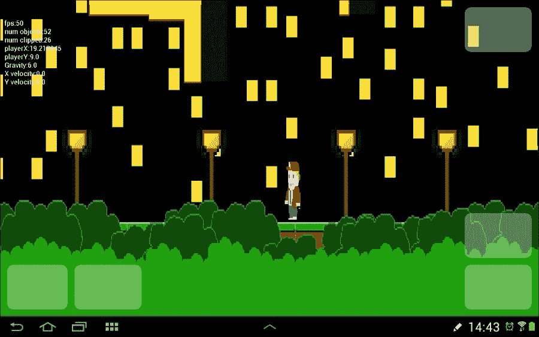

很快，我们将制作一些真正的可玩等级，这些等级使用了我们在过去四章中实现的所有功能。在我们这样做之前，让我们先在 `Viewport` 类上玩玩。

对于玩家来说，扫描整个等级并规划路线将非常有用。同样，在设计等级时，通过放大等级来查看特定部分的等级外观，而不必让玩家角色到达那个部分以便在屏幕上看到它，这也会很有帮助。所以，让我们将暂停屏幕变成一个可移动的视口。

## 带有可移动视口的暂停菜单

这很好，也很快捷。我们只需向我们的 `Viewport` 类添加一些新方法来改变焦点中心。然后，我们将从 `InputController` 中调用它们。

如果你还记得我们在 第六章 中实现 `InputController` 类时，*平台游戏 – 鲍勃、哔哔声和碰撞*，我们将所有控制逻辑包裹在 `if(playing)` 测试中。我们已经在 `else` 子句中实现了暂停按钮。我们将会做的是将左、右、跳跃和射击按钮分别用作左、右、上和下，以移动视口。

首先，将这些方法添加到 `Viewport` 类中：

```java
public void moveViewportRight(int maxWidth){
  if(currentViewportWorldCentre.x < maxWidth -       
    (metresToShowX/2)+3) {

     currentViewportWorldCentre.x += 1;
  }
}

public void moveViewportLeft(){
  if(currentViewportWorldCentre.x > (metresToShowX/2)-3){
    currentViewportWorldCentre.x -= 1;
     }
}

public void moveViewportUp(){
  if(currentViewportWorldCentre.y > (metresToShowY /2)-3) {
        currentViewportWorldCentre.y -= 1;
   }
}

public void moveViewportDown(int maxHeight){
  if(currentViewportWorldCentre.y < 
    maxHeight - (metresToShowY / 2)+3) {

    currentViewportWorldCentre.y += 1;
  }
}
```

现在，将这些调用添加到我们刚才讨论的 `InputController` 类中 `if` 条件的 `else` 子句的方法中。

```java
//Move the viewport around to explore the map
switch (motionEvent.getAction() & MotionEvent.ACTION_MASK) {
  case MotionEvent.ACTION_DOWN:
 if (right.contains(x, y)) {
 vp.moveViewportRight(l.mapWidth);
 } else if (left.contains(x, y)) {
 vp.moveViewportLeft();
 } else if (jump.contains(x, y)) {
 vp.moveViewportUp();
 } else if (shoot.contains(x, y)) {
 vp.moveViewportDown(l.mapHeight);
 } else if (pause.contains(x, y)) {
 l.switchPlayingStatus();
 }
      break;
}
```

在暂停屏幕上，玩家可以四处张望并规划他们的路线，当他们处于更复杂的等级时。他们可能需要这样做。

## 等级和游戏规则

我们已经实现了许多功能，但我们仍然没有将这些功能全部整合成一个可玩游戏的方法。我们需要能够在关卡之间旅行，并且当这样做时，玩家状态能够持续。

### 在关卡之间旅行

由于我们将设计四个关卡，我们希望玩家能够在它们之间旅行。首先，让我们向`LevelManager`构造函数开始处的`switch`语句中添加我们即将构建的所有四个关卡：

```java
switch (level) {
  case "LevelCave":
     levelData = new LevelCave();
     break;

// We can add extra levels here
case "LevelCity": 
 levelData = new LevelCity(); 
 break; 

case "LevelForest": 
 levelData = new LevelForest(); 
 break;

case "LevelMountain": 
 levelData = new LevelMountain(); 
 break;
}
```

正如我们所知，我们通过从`PlatformView`构造函数中调用`loadLevel()`来开始游戏。参数包括关卡名称和玩家出生的坐标。如果你正在设计自己的关卡，那么你需要决定从哪个关卡和坐标开始。如果你将跟随我提供的关卡进行，请将`PlatformView`构造函数中的`loadLevel()`调用设置如下：

```java
loadLevel("LevelCave", 1, 16);
```

在`if(lm.isPlaying())`块中，在`update`方法中，我们将视口设置为每帧都居中显示玩家；添加以下代码以检测（并残忍地杀死）玩家如果他从地图上掉落，以及如果玩家用尽生命，游戏将重新开始，拥有三条生命、零金钱和没有升级：

```java
if (lm.isPlaying()) {
    // Reset the players location as 
    // the world centre of the viewport
    //if game is playing
    vp.setWorldCentre(lm.gameObjects.get(lm.playerIndex)
        .getWorldLocation().x,
        lm.gameObjects.get(lm.playerIndex)
        .getWorldLocation().y);

 //Has player fallen out of the map?
 if (lm.player.getWorldLocation().x < 0 ||
 lm.player.getWorldLocation().x > lm.mapWidth ||
 lm.player.getWorldLocation().y > lm.mapHeight) {

 sm.playSound("player_burn");
 ps.loseLife();
 PointF location = new PointF(ps.loadLocation().x,
 ps.loadLocation().y);

 lm.player.setWorldLocationX(location.x);
 lm.player.setWorldLocationY(location.y);
 lm.player.setxVelocity(0);
 }

 // Check if game is over
 if (ps.getLives() == 0) {
 ps = new PlayerState();
 loadLevel("LevelCave", 1, 16);
 }
}
```

现在，我们可以创建一个特殊的`GameObject`类，当被触摸时，它会将玩家发送到预定的关卡和位置。然后我们可以有策略地将这些对象添加到我们的关卡设计中，它们将作为我们关卡之间的链接。创建一个新的类，命名为`Teleport`。如果你还没有这样做，请将`Chapter8/drawable`中的`door.png`文件添加到项目的`drawable`文件夹中。

这就是我们的`Teleport`对象在游戏中的外观：

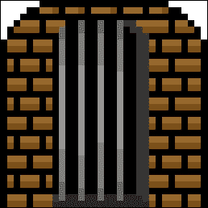

让我们创建一个简单的类来保存每个`Teleport`对象所需的数据。创建一个新的类，命名为`Location`，如下所示：

```java
public class Location {
     String level;
     float x;
     float y;

     Location(String level, float x, float y){
        this.level = level;
        this.x = x;
        this.y = y;
     }
}
```

实际的`Teleport`类看起来就像任何其他`GameObject`类一样，但请注意，它还有一个成员`Location`变量。我们将看到关卡设计将如何保存`Teleport`的目的地，`LevelManager`类将初始化它，然后当玩家与之碰撞时，我们可以加载新的位置，将玩家发送到他的目的地。

```java
public class Teleport extends GameObject {

    Location target;

    Teleport(float worldStartX, float worldStartY, 
        char type, Location target) {

        final float HEIGHT = 2;
        final float WIDTH = 2;
        setHeight(HEIGHT); // 2 metres tall
        setWidth(WIDTH); // 1 metre wide
        setType(type);
        setBitmapName("door");

        this.target = new Location(target.level, 
            target.x, target.y);

        // Where does the tile start
        // X and y locations from constructor parameters
        setWorldLocation(worldStartX, worldStartY, 0);

        setRectHitbox();
    }

    public Location getTarget(){
        return target;
    }

    public void update(long fps, float gravity){
    }
}
```

为了使我们的`Teleport`类能够以让关卡设计师决定它确切行为的方式工作，我们需要向我们的`LevelData`类添加如下内容：

```java
ArrayList<String> tiles;
ArrayList<BackgroundData> backgroundDataList;
ArrayList<Location> locations;

// This class will evolve along with the project
```

然后，我们需要在我们想要放置传送门/门的关卡设计中添加一个`t`，以及类似于下一行代码的条目，位于我们正在设计的关卡类构造函数中。

注意，你可以在地图中拥有任意多的`Teleport`对象，只要它们在代码中定义的顺序与在设计中出现的顺序相匹配。我们将在稍后查看我们的实际关卡设计时看到这是如何工作的，但代码看起来像这样：

```java
// Declare the values for the teleports in order of appearance
locations = new ArrayList<Location>();
this.locations.add(new Location("LevelCity", 118f, 18f));
```

如同往常，我们需要更新`LevelManager`类以加载和定位我们的传送点。以下是`getBitmap()`的新代码：

```java
case 'z':
  index = 21;
  break;

case 't':
 index = 22;
 break;

default:
  index = 0;
  break;
```

为`getBitmapIndex()`编写的新的代码：

```java
case 'z':
  index = 21;
     break;

case 't':
 index = 22;
 break;

default:
  index = 0;
  break;
```

我们还需要在加载阶段跟踪我们的`Teleport`对象，以防有多个。所以，在`loadMapData`方法中添加一个新的局部变量，如下所示：

```java
//Keep track of where we load our game objects
int currentIndex = -1;
int teleportIndex = -1;
// how wide and high is the map? Viewport needs to know
```

最后，对于`LevelManager`类，我们从关卡设计中初始化所有传送数据，将其存放在对象中，并将其添加到我们的`gameObject ArrayList`中。

```java
case 'z':
    // Add a boulders to the gameObjects
    gameObjects.add(new Boulders(j, i, c));
    break;

 case 't':
 // Add a teleport to the gameObjects
 teleportIndex++;
 gameObjects.add(new Teleport(j, i, c,
 levelData.locations.get(teleportIndex)));

 break;

```

我们真的非常接近能够在任何地方传送。我们需要检测与传送的碰撞，然后加载一个新关卡，玩家位于期望的位置。这段代码将放在`PlatformView`类的碰撞检测开关块中，如下所示：

```java
case 'f':
    sm.playSound("player_burn");
    ps.loseLife();
    location = new PointF(ps.loadLocation().x,
      ps.loadLocation().y); 
    lm.player.setWorldLocationX(location.x);
    lm.player.setWorldLocationY(location.y);
    lm.player.setxVelocity(0);
    break;

case 't':
 Teleport teleport = (Teleport) go;
 Location t = teleport.getTarget();
 loadLevel(t.level, t.x, t.y);
 sm.playSound("teleport");
 break;

default:// Probably a regular tile
    if (hit == 1) {// Left or right
        lm.player.setxVelocity(0);
        lm.player.setPressingRight(false);
    }
    if (hit == 2) {// Feet
        lm.player.isFalling = false;
    }
    break;
```

当加载新关卡时，`Player`、`MachineGun`和`Bullet`对象都是从零开始创建的。因此，我们需要在我们的`loadLevel`方法中添加一行，将`PlayerState`类中的当前机枪射速重新加载到`MachineGun`类中。添加以下高亮代码：

```java
ps.saveLocation(location);

// Reload the players current fire rate from the player state
lm.player.bfg.setFireRate(ps.getFireRate());

```

现在，我们可以真正开始设计关卡了。

## 关卡设计

你可以直接从`Chapter8/java`文件夹复制粘贴四个类到你的项目中开始游戏，或者你可以从头开始并设计自己的关卡。这些关卡相当大，复杂，难以击败。在书中或电子书中以任何有意义的方式打印关卡设计都是不可能的，所以你需要打开`LevelCave`、`LevelCity`、`LevelForest`和`LevelMountain`设计文件，才能看到四个关卡的具体细节。

然而，以下是对关卡、图片和一些截图的简要讨论，但不是来自四个设计的实际代码。

### 注意

注意，以下截图展示了新的 HUD，这是我们将在本章最后讨论的最后一个内容。

### 洞穴

洞穴关卡是整个游戏开始的地方。它不仅包含适度令人沮丧的跳跃，还有大量的火焰，使得坠落可能致命。

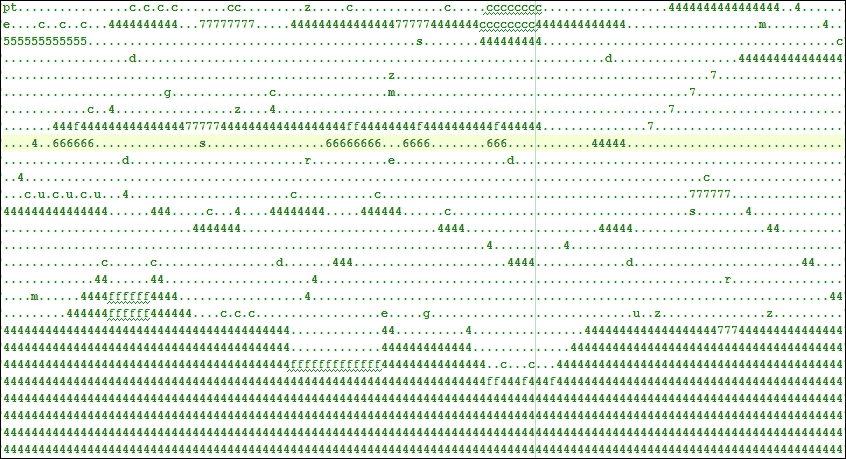

作为玩家开始时只有一把微弱的机枪，这个关卡中只有几个无人机。但有两个笨拙的守卫需要翻越。


### 城市

城市拥有巨大的奖励，特别是在左下角有硬币，在左上角有机枪升级。

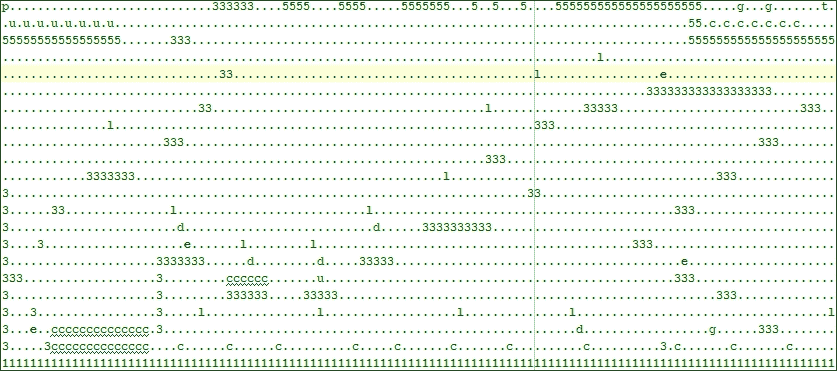

然而，如果玩家想要收集所有散落的硬币而不是选择留下它们，那么底层有一个非常难以跳跃的守卫。必须穿越几乎垂直的上升，沿着左手边向上爬，这可能会令人沮丧。如果玩家选择不升级机枪，他可能会在通往下一关的门外的双重守卫处遇到困难。

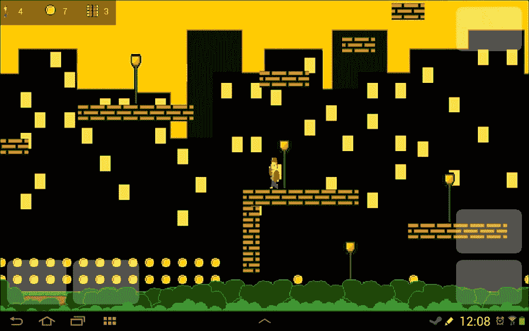

### 森林

森林可能是所有关卡中最具挑战性的关卡，因为有一段非常长的跳跃，很容易跳过或跳得太低。

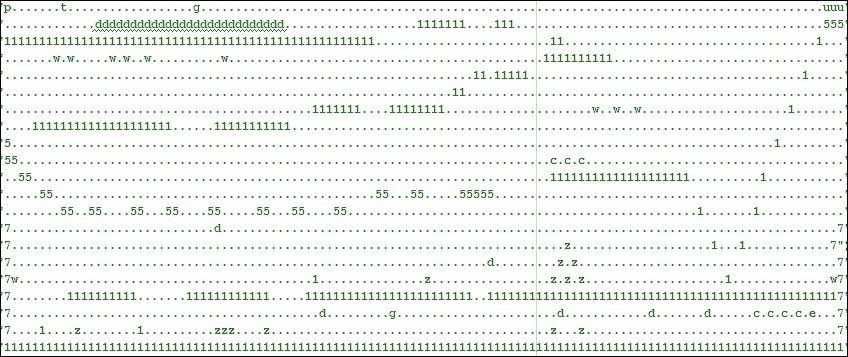

并且有超过一打无人机等着扑向鲍勃，他的像素正悬挂在平台边缘，摇摇欲坠。

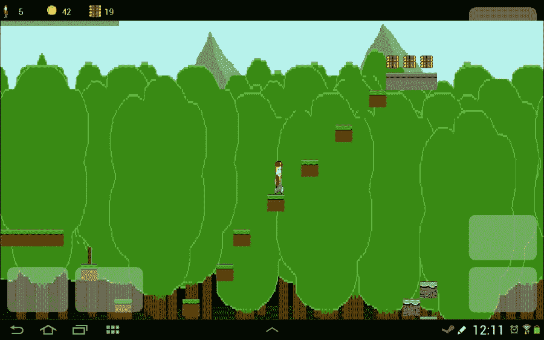

### 山脉

新鲜的山间空气意味着鲍勃几乎已经成功了。没有守卫或无人机在视线范围内。

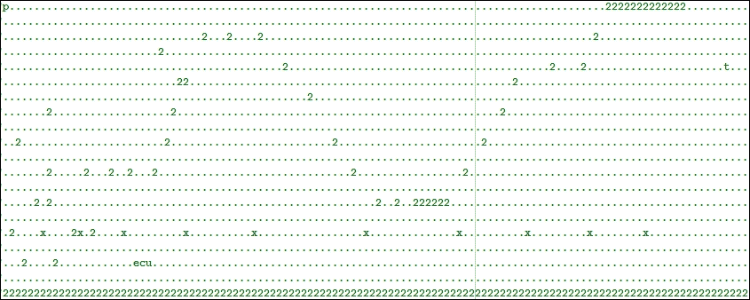

然而，看看那些跳跃的蜿蜒路径，大多数情况下，如果鲍勃有一个像素放错位置，他就会被直接扔回底部。

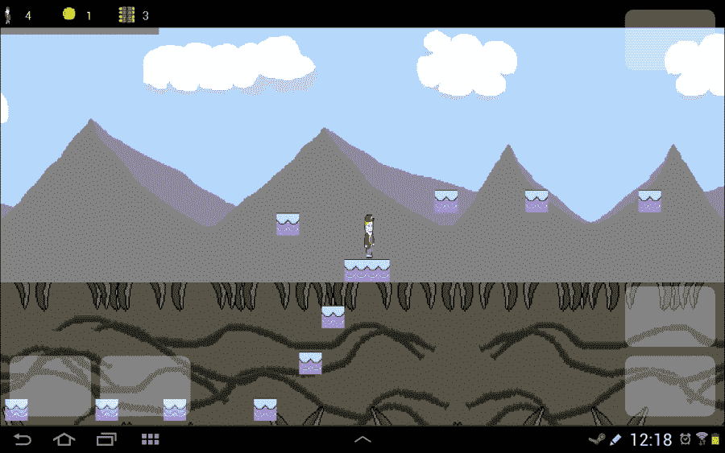

### 小贴士

如果你想尝试每个关卡而不完成前面的艰难关卡，当然，你只需从你选择的关卡和位置开始即可。为此，只需将`PlatformView`构造函数中对`loadLevel()`的调用更改为以下之一：

```java
loadLevel("LevelMountain", 118, 17);
loadLevel("LevelForest", 1, 17);
loadLevel("LevelCity", 118, 18);
loadLevel("LevelCave", 1, 16);
```

### HUD

最后的修饰是添加一个 HUD。这个代码位于`PlatformView`的`draw`方法中，使用了现有游戏对象中的一些图形。

在调用`drawBackground()`的最后和绘制调试文本之前添加代码：

```java
// Draw the HUD
// This code needs bitmaps: extra life, upgrade and coin
// Therefore there must be at least one of each in the level

int topSpace = vp.getPixelsPerMetreY() / 4;
int iconSize = vp.getPixelsPerMetreX();
int padding = vp.getPixelsPerMetreX() / 5;
int centring = vp.getPixelsPerMetreY() / 6;
paint.setTextSize(vp.getPixelsPerMetreY()/2);
paint.setTextAlign(Paint.Align.CENTER);

paint.setColor(Color.argb(100, 0, 0, 0));
canvas.drawRect(0,0,iconSize * 7.0f, topSpace*2 + iconSize,paint);
paint.setColor(Color.argb(255, 255, 255, 0));

canvas.drawBitmap(lm.getBitmap('e'), 0, topSpace, paint);
canvas.drawText("" + ps.getLives(), (iconSize * 1) + padding, 
  (iconSize) - centring, paint);

canvas.drawBitmap(lm.getBitmap('c'), (iconSize * 2.5f) + padding, 
  topSpace, paint);

canvas.drawText("" + ps.getCredits(), (iconSize * 3.5f) + padding * 2, (iconSize) - centring, paint);

canvas.drawBitmap(lm.getBitmap('u'), (iconSize * 5.0f) + padding, 
  topSpace, paint);

canvas.drawText("" + ps.getFireRate(), (iconSize * 6.0f) + padding * 2, (iconSize) - centring, paint);
```

我想我们已经完成了！

# 摘要

我们完成了平台游戏，因为那里已经没有空间了。为什么不尝试实现以下的一些或所有改进和功能呢？

修改`Player`类中的代码，使鲍勃逐渐加速和减速，而不是始终以全速奔跑。只需在玩家按住左右键的每一帧增加速度，在他们不按的每一帧减少速度。

一旦你做到了这一点，就将前面的代码添加到`update`方法中的碰撞检测`switch`块中，使玩家在雪地上打滑，在混凝土上加速，并为每种地砖类型提供不同的行走/着陆音效。

在鲍勃身上画一把枪，并调整`Bullet`对象生成的位置高度，使其看起来是从他的机枪枪管中发射出来的。

使一些物体可推动。给`GameObject`添加一个`isPushable`成员，并使碰撞检测简单地使物体稍微后退。也许，鲍勃可以推动矿车进入火中，以跳过更宽的火坑。请注意，推动掉落到另一个级别的物体将比推动保持在同一*y*坐标的物体更复杂。

可破坏的地砖听起来很有趣。给它们一个强度变量，当被子弹击中时减少，当达到零时从`gameObjects`中移除。

移动平台是优秀平台游戏的标准配置。只需将航点添加到地砖对象中，并将移动代码添加到`update`方法中。挑战将是分配航点。你可以让它们全部向左向右或向上向下移动一定距离，或者做一些类似于我们为`Guard`对象编写的`setTileWaypoint`方法。

通过保存收集到的总金币数、记住已解锁的关卡，并在菜单屏幕上提供重新播放任何解锁关卡的功能，使游戏更具持续性。

使用传送门作为航点使游戏更容易。调整视口缩放以适应不同的屏幕尺寸。当前的缩放对于一些小手机来说可能有点太低。

添加计时赛跑以获得高分、排行榜和成就，并添加更多关卡。

在下一章中，我们将查看一个更小的项目，但仍然很有趣，因为我们将使用 OpenGL ES 进行超快、平滑的绘图。

# 第九章：使用 OpenGL ES 2 在 60 FPS 下玩《小行星》

欢迎来到最终项目。在接下来的三个章节中，我们将使用 OpenGL ES 2 图形 API 构建一个类似《小行星》的游戏。如果你想知道 OpenGL ES 2 究竟是什么，那么我们将在本章后面讨论其细节。

我们将构建一个非常简单但有趣且具有挑战性的游戏，我们可以在一次绘制和动画化数百个对象，甚至在相当旧的 Android 设备上。

使用 OpenGL，我们将把我们的绘图效率提升到一个更高的水平，并且通过一些不太复杂的数学计算，我们的移动和碰撞检测将比我们之前的项目有极大的提升。

到本章结束时，我们将拥有一个基本的 OpenGL ES 2 引擎，它将以 60 FPS 或更高的帧率将我们的简单但暂时静态的宇宙飞船绘制到屏幕上。

### 小贴士

如果你从未见过或玩过 1980 年代的街机游戏《小行星》（1979 年 11 月发布），为什么不现在去看看它的克隆版或视频呢？

免费网页游戏在[`www.freeasteroids.org/`](http://www.freeasteroids.org/)。

在 YouTube 上查看[`www.youtube.com/watch?v=WYSupJ5r2zo`](https://www.youtube.com/watch?v=WYSupJ5r2zo)。

让我们具体讨论一下我们打算构建的内容。

# 小行星模拟器

我们的游戏将设定在一个四方向滚动的世界中，玩家可以在其中狩猎小行星时穿越世界。世界将被一个矩形边界包围，以防止小行星漂移得太远，边界也将作为玩家需要避免的另一个危险。

## 游戏控制

我们将使用经过少量修改的`InputController`类，甚至可以保持相同的按钮布局。然而，正如我们将看到的，我们将以非常不同于我们的复古平台游戏的方式在屏幕上绘制按钮。此外，玩家将不会左右移动，而是通过 360 度旋转飞船左右移动。跳跃按钮将变成一个推力切换开关，用于打开和关闭前进运动，而射击按钮将保持原样。我们还将有一个暂停按钮放在相同的位置。

## 游戏规则

当小行星撞击边界时，它将弹回游戏世界。如果玩家撞击边界，将损失一条生命，飞船将在屏幕中心重生。如果小行星撞击飞船，这也会是致命的。

玩家开始时有三个生命值，必须清除所有的小行星模拟器中的小行星。HUD 将显示剩余的小行星和生命值。如果玩家清除了所有的小行星，下一波将比上一波有更多的小行星。它们也会稍微快一点。每清除一波都会获得额外的生命值。

我们将在项目进行过程中实现这些规则。

# 介绍 OpenGL ES 2

OpenGL ES 2 是嵌入式系统中的**开放图形库**（**OpenGL**）的第二大版本。它是桌面系统的 OpenGL 在移动设备上的实现。

## 为什么使用它以及它是如何工作的？

OpenGL 作为一个本地进程运行，不像我们其余的 Java 那样在 Dalvik 虚拟机上运行。这是它超级快的原因之一。OpenGL ES API 移除了与本地代码交互的所有复杂性，OpenGL 本身也在其本地代码库中提供了非常高效和快速的算法。

OpenGL 的第一个版本在 1992 年完成。重点是，即使在那时，OpenGL 也使用了可能最有效的代码和算法来绘制图形。现在，超过 20 年后，它已经不断得到改进和优化，并且已经适应了与最新的图形硬件一起工作，无论是移动设备还是桌面设备。所有移动 GPU 制造商都专门设计他们的硬件以兼容最新的 OpenGL ES 版本。

因此，试图改进 OpenGL ES 可能是一个徒劳的任务。

### 提示

当专门为 Windows 设备开发时，还有一个可行的图形 API 选项，称为 DirectX。

## 第二版有什么好处？

OpenGL ES 1 的最初版本在当时确实给人留下了深刻印象。我记得当我第一次在手机上玩 3D 射击游戏时，差点从椅子上摔下来！现在这当然是家常便饭。然而，与桌面版本的 OpenGL 相比，OpenGL ES 1 有一个主要的缺点。

OpenGL ES 1 有一个被称为固定功能管道的东西。要绘制的几何形状进入 GPU 并绘制，但任何进一步操纵单个像素的操作都需要在 OpenGL ES 接管游戏帧的绘制之前进行。

现在，有了 OpenGL ES 2，我们可以访问所谓的可编程管道。也就是说，我们可以将我们的图形发送出去绘制，但我们还可以编写在 GPU 上运行的代码，这些代码能够独立操纵每个像素。这是一个非常强大的功能，尽管我们不会深入探索它。

在 GPU 上运行的额外代码被称为**着色器**程序。我们可以在称为**顶点着色器**的地方编写代码来操纵我们图形的几何形状（位置）。我们还可以编写代码来单独操纵每个像素的外观，这被称为**片段着色器**。

### 注意

实际上，我们甚至可以做得比像素操作更好。片段不一定是像素。这取决于硬件和正在处理的图形的具体性质。它可能是一个以上的像素或亚像素：屏幕硬件中构成像素的几个光之一。

对于像这样的简单游戏，OpenGL ES 2 的缺点是，即使你不会对它们做很多事情，也必须至少提供一个顶点着色器和一个片段着色器。然而，正如我们将看到的，这并不困难。尽管我们不会深入探讨着色器，但我们将编写一些着色器代码，使用**GL 着色器语言**（**GLSL**），并一瞥它们提供的可能性。

### 小贴士

如果可编程图形管道和着色器的力量太过激动人心，以至于无法留到另一天，那么我强烈推荐 Jacobo Rodríguez 的《GLSL Essentials》。

[`www.packtpub.com/hardware-and-creative/glsl-essentials`](https://www.packtpub.com/hardware-and-creative/glsl-essentials)

本书探讨了桌面上的 OpenGL 着色器，对任何具有基本编程知识并愿意学习不同语言（GLSL）的读者来说都易于理解，尽管它与 Java 有一些语法相似之处。

我们将如何使用 OpenGL ES 2？

## 我们将如何使用 OpenGL ES 2？

在 OpenGL 中，一切都是点、线或三角形。此外，我们还可以将颜色和纹理附加到这种基本几何形状，并将这些元素组合起来，以制作我们今天在现代移动游戏中看到的复杂图形。

我们将使用每种类型的一些元素（点、线和三角形），这些元素统称为原语。

在这个项目中，我们不会使用纹理。幸运的是，无纹理原语的外观非常适合构建类似 Asteroids 的游戏。

除了原语之外，OpenGL 还使用矩阵。**矩阵**是一种执行算术的方法和结构。这种算术可以从非常简单的中学水平计算（移动（平移）坐标）到执行更复杂的数学，将我们的游戏世界坐标转换为 GPU 可以使用的 OpenGL 屏幕坐标。

关键在于 OpenGL API 完全提供了矩阵及其使用方法。这意味着我们只需要了解哪些方法执行哪些图形操作，而无需关心幕后（在 GPU 上）可能出现的复杂数学。

在 OpenGL 中了解着色器、原语和矩阵的最好方法就是直接开始使用它们。

# 准备 OpenGL ES 2

首先，我们从`Activity`类开始，正如之前一样，它是我们游戏的入口点。创建一个新的项目，在**应用程序名称**字段中输入`C9 Asteroids`。选择**手机和平板电脑**，然后当提示时选择**空白活动**。在**活动名称**字段中输入`AsteroidsActivity`。

### 小贴士

显然，你不必完全遵循我的命名选择，但请记住对代码进行一些小的修改，以反映你自己的命名选择。

你可以从`layout`文件夹中删除`activity_asteroids.xml`。你还可以从`AsteroidsActivity.java`文件中删除所有代码。只需留下包声明。

## 锁定布局为横屏

就像我们为前两个项目所做的那样，我们将确保游戏只在横屏模式下运行。我们将修改我们的`AndroidManifest.xml`文件，强制我们的`AsteroidsActivity`类全屏运行，并将其锁定为横屏方向。让我们进行以下更改：

1.  现在打开`manifests`文件夹，双击`AndroidManifest.xml`文件，在代码编辑器中打开它。

1.  在`AndroidManifest.xml`文件中，找到以下代码行：

    ```java
    android:name=".AsteroidsActivity"
    ```

1.  立即输入或复制粘贴以下两行代码，使`PlatformActivity`全屏运行并锁定为横屏方向：

    ```java
    android:theme="@android:style/Theme.NoTitleBar.Fullscreen"
    android:screenOrientation="landscape"
    ```

现在我们可以继续用 OpenGL 实现我们的 Asteroids 模拟游戏了。

## 活动

首先，我们有我们熟悉的`Activity`类。这里唯一的新事物是我们视图类的类型。我们声明了一个名为`asteroidsView`的成员，其类型为`GLSurfaceView`。这个类将为我们提供轻松访问 OpenGL 的途径。我们很快就会看到这一点。请注意，我们只是通过传递`Activity`上下文和以通常方式获得的屏幕分辨率来初始化`GLSurfaceView`。按以下方式实现`AsteroidsActivity`类：

```java
package com.gamecodeschool.c9asteroids;

import android.app.Activity;
import android.graphics.Point;
import android.opengl.GLSurfaceView;
import android.os.Bundle;
import android.view.Display;

public class AsteroidsActivity extends Activity {

    private GLSurfaceView asteroidsView;

    @Override
    public void onCreate(Bundle savedInstanceState) {
        super.onCreate(savedInstanceState);

        // Get a Display object to access screen details
        Display display = getWindowManager().getDefaultDisplay();

        // Load the resolution into a Point object
        Point resolution = new Point();
        display.getSize(resolution);

        asteroidsView = new AsteroidsView 
          (this, resolution.x, resolution.y); 

        setContentView(asteroidsView);
    }

    @Override
    protected void onPause() {
        super.onPause();

        asteroidsView.onPause();

    }

    @Override
    protected void onResume() {
        super.onResume();

        asteroidsView.onResume();

    }
}
```

接下来，我们将看到一些 OpenGL 代码。

## 视图

在这里，我们将实现`GLSurfaceView`类。实际上，真正的动作不会在这里发生，但它确实允许我们附加一个 OpenGL 渲染器。这是一个实现了`Renderer`接口的类。同样，在这个关键的`Renderer`中，`GLSurfaceView`类使我们能够重写`onTouchListener`方法，这样我们就可以像在之前的项目中`SurfaceView`所做的那样检测玩家输入。

### 注意

Android Studio 不会自动导入或甚至建议所有必需的 OpenGL 导入。因此，我在代码列表中包含了某些类的所有导入。此外，你还会注意到有时我们使用静态导入。这也会使代码更易于阅读。

在下面的代码中，我们声明并初始化了一个新的`GameManager`对象，我们将在不久后实现它。我们通过调用`setEGLContextClientVersion(2)`将 OpenGL 版本设置为 2，并通过调用`setRenderer()`并传入我们的`GameManager`对象来设置我们的关键渲染器对象。创建一个名为`AsteroidsView`的新类，并按以下方式实现它：

```java
import android.content.Context;
import android.opengl.GLSurfaceView;

public class AsteroidsView extends GLSurfaceView{

    GameManager gm;

    public AsteroidsView(Context context, int screenX, int screenY) {
        super(context);

        gm = new GameManager(screenX, screenY);

        // Which version of OpenGl we are using
        setEGLContextClientVersion(2);

        // Attach our renderer to the GLSurfaceView
        setRenderer(new AsteroidsRenderer(gm));

    }

}
```

现在，我们可以看看我们的`GameManager`类涉及的内容。

## 管理我们游戏的一个类

这个类将控制玩家所在的关卡、生命值以及游戏世界的整体大小等。随着项目的进展，它会有所发展，但与之前项目中`LevelManager`和`PlayerState`类的综合深度相比，它将保持相当简单，尽管它实际上取代了这两个类。

在接下来的代码中，我们声明`int`成员来保存游戏世界的宽度和高度；我们可以根据需要将其做得更大或更小。我们使用布尔值`playing`来跟踪游戏的状态。

`GameManager`类还需要知道屏幕的宽度和高度（以像素为单位），当对象在`AsteroidsView`类中初始化时，这个信息被传递给构造函数。

还要注意`metresToShowX`和`metresToShowY`成员变量。这些可能听起来与上一个项目中我们的`Viewport`类很熟悉。这些变量将被用于完全相同的目的：定义游戏世界的当前可视区域。然而，这一次，OpenGL 将负责在绘制之前裁剪哪些对象（使用矩阵）。我们很快就会看到这是在哪里发生的。

### 注意

注意，尽管 OpenGL 负责裁剪和缩放我们想要显示的游戏世界区域，但这不会影响每一帧更新哪些对象。然而，正如我们将看到的，这正是我们想要的游戏，因为我们希望所有对象在每一帧都更新自己，即使它们在屏幕之外。因此，这个游戏不需要`Viewport`类。

最后，我们希望有一个方便的方法来暂停和恢复游戏，我们通过`switchPlayingStatus`方法提供这个功能。创建一个新的类，命名为`GameManager`，并按如下所示实现：

```java
public class GameManager {

    int mapWidth = 600;
    int mapHeight = 600;
    private boolean playing = false;

    // Our first game object
    SpaceShip ship;

    int screenWidth;
    int screenHeight;

    // How many metres of our virtual world
    // we will show on screen at any time.
    int metresToShowX = 390;
    int metresToShowY = 220;

    public GameManager(int x, int y){

        screenWidth = x;
        screenHeight = y;

    }

    public void switchPlayingStatus() {
        playing = !playing;

    }

    public boolean isPlaying(){
        return playing;
    }
}
```

现在，我们可以首次查看这些功能强大的着色器以及我们将如何管理它们。

## 管理简单的着色器

一个应用程序可以有多个着色器。然后我们可以将不同的着色器附加到不同的游戏对象上，以创建所需的效果。

在这个游戏中，我们只会使用一个顶点着色器和一个片段着色器。然而，当你看到如何将着色器附加到原语时，你会明白拥有更多着色器是多么简单。

1.  首先，我们需要在 GPU 上执行的着色器代码。

1.  然后我们需要编译那段代码。

1.  最后，我们需要将两个编译好的着色器链接成一个 GL 程序。

在实现这个下一个简单的类时，我们将看到如何将这个功能捆绑成一个单独的方法调用，这个调用可以由我们的游戏对象执行，并将准备运行的 GL 程序返回给游戏对象。当我们在本章的后面构建`GameObject`类时，我们将看到如何使用这个 GL 程序。

让我们继续在新的类中实现必要的三个步骤。创建一个新的类，并将其命名为`GLManager`。添加如下所示的静态导入：

```java
import static android.opengl.GLES20.GL_FRAGMENT_SHADER;
import static android.opengl.GLES20.GL_VERTEX_SHADER;
import static android.opengl.GLES20.glAttachShader;
import static android.opengl.GLES20.glCompileShader;
import static android.opengl.GLES20.glCreateProgram;
import static android.opengl.GLES20.glCreateShader;
import static android.opengl.GLES20.glLinkProgram;
import static android.opengl.GLES20.glShaderSource;
```

接下来，我们将添加一些可以在本章后面的 `GameObject` 类中使用的公共静态最终成员变量。虽然我们将在使用它们时看到它们的确切工作方式，但这里有一个快速的初步解释。

`COPONENTS_PER_VERTEX` 是将用于表示我们游戏对象中单个顶点（点）的值的数量。正如你所见，我们将其初始化为三个坐标：*x*、*y* 和 *z*。

我们还有 `FLOAT_SIZE`，其初始化为 `4`。这是 Java 中 `float` 类型的字节数。正如我们很快就会看到的，OpenGL 喜欢以 `ByteBuffer` 的形式接收所有传入它的原型的数据。我们需要确保我们精确地知道 `ByteBuffer` 中每条信息的位置。

接下来，我们声明 `STRIDE` 并将其初始化为 `COMPONENTS_PER_VERTEX * FLOAT_SIZE`。由于 OpenGL 使用 `float` 类型来存储它处理的所有数据，因此 `STRIDE` 现在等于表示单个顶点数据的字节数。请将这些成员添加到类的顶部：

```java
public class GLManager {

     // Some constants to help count the number of bytes between
     // elements of our vertex data arrays
     public static final int COMPONENTS_PER_VERTEX = 3;
     public  static final int FLOAT_SIZE = 4;
     public static final int STRIDE =
       (COMPONENTS_PER_VERTEX)
        * FLOAT_SIZE;

     public static final int ELEMENTS_PER_VERTEX = 3;// x,y,z
```

GLSL 是一种独立的语言，它也有自己的类型，并且可以使用这些类型的变量。在这里，我们声明并初始化了一些字符串，我们可以在代码中更干净地引用这些变量。

这些类型的讨论超出了本书的范围，但简单来说，它们将代表一个矩阵（`u_matrix`）、一个位置（`a_position`）和一个颜色（`u_Color`）。我们很快将在着色器代码中看到这些变量实际是哪种 GLSL 类型。

在字符串之后，我们声明了三个 `int` 类型的变量。这三个公共静态（但不是最终）成员将用于存储我们着色器中同名类型的存储位置。这允许我们在将最终绘制原型的指令交给 OpenGL 之前，在着色器程序中操作这些值。

```java
// Some constants to represent GLSL types in our shaders
public static final String U_MATRIX = "u_Matrix";
public static final String A_POSITION = "a_Position";
public static final String U_COLOR = "u_Color";

// Each of the above constants also has a matching int
// which will represent its location in the open GL glProgram
public static int uMatrixLocation;
public static int aPositionLocation;
public static int uColorLocation;
```

最后，我们来到了我们的 GLSL 代码，它是一个打包在字符串中的顶点着色器。注意，我们声明了一个名为 `u_Matrix` 的变量，其类型为 `uniform mat4`，以及一个名为 `a_Position` 的变量，其类型为 `attribute vec4`。我们将在后面的 `GameObject` 类中看到如何获取这些变量的位置，以便我们能从 Java 代码中传递它们的值。

代码中以 `void main()` 开头的行是实际着色器代码执行的地方。注意，`gl_position` 被分配了我们刚才声明的两个变量的乘积的值。同样，`gl_PointSize` 被分配了 `3.0` 的值。这将是我们绘制所有点原型的尺寸。在上一段代码块之后直接输入顶点着色器的代码：

```java
// A very simple vertexShader glProgram
// that we can define with a String

private static String vertexShader =
     "uniform mat4 u_Matrix;" +
     "attribute vec4 a_Position;" +

     "void main()" +
     "{" +
       "gl_Position = u_Matrix * a_Position;" +
       "gl_PointSize = 3.0;"+
  "}";
```

接下来，我们将实现片段着色器。这里发生了一些事情。首先，行精度 `mediump` float 告诉 OpenGL 以中等精度绘制，因此速度中等。然后我们可以看到我们的变量 `u_Color` 被声明为类型 `uniform vec4`。我们将在后面的 `GameObject` 类中看到如何将 `color` 值传递给这个变量。

当执行从`void main()`开始时，我们只需将`u_Color`赋值给`gl_FragColor`。所以，无论分配给`u_Colour`的颜色是什么，所有片段都将具有该颜色。在片段着色器之后，我们声明一个名为`program`的`int`，它将作为我们的 GL 程序的句柄。

在上一段代码块之后立即输入片段着色器的代码：

```java
// A very simple fragment Shader
// that we can define with a String

private static String fragmentShader = 
    "precision mediump float;" + 
    "uniform vec4 u_Color;" + 
    "void main()" + 
    "{" + 
        "gl_FragColor = u_Color;" + 
    "}";

// A handle to the GL glProgram public static int program; 
```

这是一个获取方法，它返回 GL 程序的句柄：

```java
public static int program;
public static int getGLProgram(){
return program;
}
```

下一个方法可能看起来很复杂，但它所做的只是返回一个编译和链接好的程序给调用者。它是通过调用 OpenGL 的`linkProgram`方法，并将`compileVertexShader()`和`compileFragmentShader()`作为参数来实现的。接下来，我们看到这两个新方法，它们只需要调用我们的`compileShader()`方法，并使用 OpenGL 常量表示着色器类型和适当的字符串，该字符串包含匹配的 GLSL 着色器代码。

将我们刚才讨论的三个方法放入`GLManager`类中：

```java
public static int buildProgram(){
    // Compile and link our shaders into a GL glProgram object
    return linkProgram(compileVertexShader(),compileFragmentShader());

}

private static int compileVertexShader() {
    return compileShader(GL_VERTEX_SHADER, vertexShader);
}

private static int compileFragmentShader() {
    return compileShader(GL_FRAGMENT_SHADER, fragmentShader);
}
```

现在我们看到当我们的方法`compileShader()`被调用时会发生什么。首先，我们根据`type`参数创建一个着色器的句柄。然后，我们将该句柄和代码传递给`glShaderSource()`。最后，我们使用`glCompileShader()`编译着色器，并返回一个调用方法的句柄：

```java
private static int compileShader(int type, String shaderCode) {

    // Create a shader object and store its ID
    final int shader = glCreateShader(type);

    // Pass in the code then compile the shader
    glShaderSource(shader, shaderCode);
    glCompileShader(shader);

    return shader;
}
```

现在我们可以看到这个过程中的最后一步。我们使用`glCreateProgram()`创建一个空的程序。然后我们依次使用`glAttachShader()`将编译好的着色器附加到程序上，最后使用`glLinkProgram()`将它们链接成一个我们可以实际使用的程序：

```java
private static int linkProgram(int vertexShader, int fragmentShader) {

  // A handle to the GL glProgram -
  // the compiled and linked shaders
     program = glCreateProgram();

     // Attach the vertex shader to the glProgram.
     glAttachShader(program, vertexShader);

     // Attach the fragment shader to the glProgram.
     glAttachShader(program, fragmentShader);

     // Link the two shaders together into a glProgram.
     glLinkProgram(program);

     return program;
}
}// End GLManager
```

注意，我们创建了一个程序，并且我们可以通过其句柄和`getProgram`方法访问它。我们还可以访问我们创建的所有公共静态成员，因此我们将能够从我们的 Java 代码中调整着色器程序中的变量。

## 游戏的主循环——渲染器

现在我们将看到我们的代码真正的主要内容所在。创建一个新的类，并将其命名为`AsteroidsRenderer`。这是我们附加到`GLSurfaceView`上的渲染器类。添加以下导入语句，注意其中一些是静态的：

```java
import android.graphics.PointF;
import android.opengl.GLSurfaceView.Renderer;
import android.util.Log;
import javax.microedition.khronos.egl.EGLConfig;
import javax.microedition.khronos.opengles.GL10;
import static android.opengl.GLES20.GL_COLOR_BUFFER_BIT;
import static android.opengl.GLES20.glClear;
import static android.opengl.GLES20.glClearColor;
import static android.opengl.GLES20.glViewport;
import static android.opengl.Matrix.orthoM;
```

现在我们将构建类。首先要注意的是，我们之前已经提到过，这个类实现了`Renderer`接口，因此我们需要重写三个方法。它们是`onSurfaceCreated()`、`onSurfaceChanged()`和`onDrawFrame()`。此外，我们还将在这个类中最初添加一个构造函数来设置一切，一个`createObjects`方法，我们将最终在其中初始化所有游戏对象，一个`update`方法，我们将每帧更新所有对象，以及一个`draw`方法，我们将每帧绘制所有对象。

我们将在实现每个方法时探索和解释它，我们还将看到我们的方法如何适应 OpenGL 渲染器系统，该系统决定了这个类的流程。

要开始，我们有一些成员变量值得仔细查看。

布尔调试将用于在控制台开启和关闭输出。`frameCounter`、`averageFPS` 和 `fps` 变量不仅用于检查我们达到的帧率，还将传递给我们的游戏对象，这些对象将根据每一帧的经过时间自行更新。

我们第一个真正有趣的变量是浮点数组 `viewportMatrix`。正如其名所示，它将保存一个 OpenGL 可以用来计算游戏世界视口的矩阵。

我们有一个 `GameManager` 来保存对 `GameManager` 对象的引用，这是 `AsteroidsView` 传递给这个类构造函数的。最后，我们有两个 `PointF` 对象。

我们将在构造函数中初始化 `PointF` 对象，并使用它们做几件不同的事情，以避免在主游戏循环中解引用任何对象。当垃圾收集器开始清理丢弃的对象时，即使是 OpenGL 也会变慢。避免召唤垃圾收集器将是整个游戏的目标。

在 `AsteroidsRenderer` 类的顶部输入成员变量：

```java
public class AsteroidsRenderer implements Renderer {

// Are we debugging at the moment

boolean debugging = true;

// For monitoring and controlling the frames per second

long frameCounter = 0;
long averageFPS = 0;
private long fps;

// For converting each game world coordinate
// into a GL space coordinate (-1,-1 to 1,1)
// for drawing on the screen

private final float[] viewportMatrix = new float[16];

// A class to help manage our game objects
// current state.

private GameManager gm;

// For capturing various PointF details without
// creating new objects in the speed critical areas

PointF handyPointF;
PointF handyPointF2;
```

这里是我们的构造函数，其中我们从参数初始化我们的 `GameManager` 引用，并创建两个便于使用的 `PointF` 对象以供使用：

```java
public AsteroidsRenderer(GameManager gameManager) {

     gm = gameManager;

     handyPointF = new PointF();
     handyPointF2 = new PointF();

}
```

这是第一个重写的方法。每次创建带有附加渲染器的 `GLSurfaceView` 类时都会调用它。我们调用 `glClearColor()` 来设置 OpenGL 每次清除屏幕时将使用的颜色。然后我们使用我们的 `GLManager.buildProgram()` 方法构建着色器程序，并调用我们即将编写的 `createObjects` 方法。

```java
@Override
public void onSurfaceCreated(GL10 glUnused, EGLConfig config) {

   // The color that will be used to clear the
   // screen each frame in onDrawFrame()
   glClearColor(0.0f, 0.0f, 0.0f, 0.0f);

   // Get GLManager to compile and link the shaders into an object
   GLManager.buildProgram();

   createObjects();

}
```

下一个重写的方法是在 `onSurfaceCreated()` 之后一次调用，以及屏幕方向改变时。在这里，我们调用 `glViewport()` 方法告诉 OpenGL 将像素坐标映射到 OpenGL 坐标系上。

OpenGL 坐标系与我们之前在两个项目中习惯处理的像素坐标系非常不同。屏幕中心是 0,0，左侧和底部是 -1，顶部和右侧是 1。

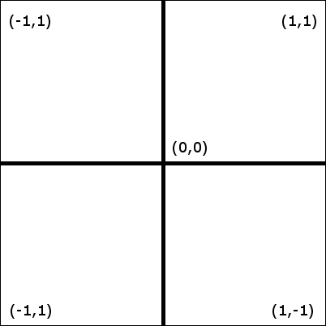

前面的情况还进一步复杂化，因为大多数屏幕不是正方形，但范围 -1 到 1 必须代表 *x* 和 *y* 轴。幸运的是，我们的 `glViewport()` 已经为我们处理了这个问题。

在这个方法中我们看到最后一件事情是调用 `orthoM` 方法，并将 `viewportMatrix` 作为第一个参数。OpenGL 现在将为 OpenGL 本身准备 `viewportMatrix` 以供使用。`orthoM` 方法创建一个矩阵，将坐标转换为正交视图。如果我们的坐标是三维的，它将产生所有对象看起来距离相同的效果。由于我们正在制作一个二维游戏，这也适合我们。

输入 `onSurfaceChanged` 方法的代码：

```java
@Override
    public void onSurfaceChanged(GL10 glUnused, int width, int height) {

        // Make full screen
        glViewport(0, 0, width, height);

        /*
            Initialize our viewport matrix by passing in the starting
            range of the game world that will be mapped, by OpenGL to
            the screen. We will dynamically amend this as the player
            moves around.

            The arguments to setup the viewport matrix:
            our array,
            starting index in array,
            min x, max x,
            min y, max y,
            min z, max z)
        */

            orthoM(viewportMatrix, 0, 0, 
        gm.metresToShowX, 0, 
        gm.metresToShowY, 0f, 1f);
}
```

这里是我们的`createObjects`方法，如您所见，我们创建了一个类型为`SpaceShip`的对象，并将地图的高度和宽度传递给构造函数。我们将在本章后面构建`SpaceShip`类及其父类`GameObject`。输入`createObjects`方法：

```java
    private void createObjects() {
        // Create our game objects

        // First the ship in the center of the map
        gm.ship = new SpaceShip(gm.mapWidth / 2, gm.mapHeight / 2);
    }
```

这是重写的`onDrawFrame`方法。它被系统连续调用。当我们把`AsteroidsRenderer`附加到视图上时，我们可以控制这个方法的调用时间，但默认的 OpenGL 控制的连续调用正是我们所需要的。

我们将`startFrameTime`设置为当前系统时间。然后，如果`isPlaying()`返回`true`，我们调用我们即将实现的`update`方法。然后，我们调用`draw()`，这将告诉所有我们的对象绘制自己。

然后，我们更新`timeThisFrame`和`fps`，可选地输出每 100 帧的平均帧数，如果我们在调试的话。

现在我们知道 OpenGL 会每秒调用`onDrawFrame()`数百次。我们将有条件地每次调用我们的`update`方法以及调用我们的`draw`方法。我们实际上已经实现了游戏循环，除了实际的`draw`和`update`方法本身。

将`onDrawFrame`方法添加到类中：

```java
@Override
public void onDrawFrame(GL10 glUnused) {

        long startFrameTime = System.currentTimeMillis();

        if (gm.isPlaying()) {
            update(fps);
        }

        draw();

        // Calculate the fps this frame
        // We can then use the result to
        // time animations and more.
        long timeThisFrame = System.currentTimeMillis() - startFrameTime;
        if (timeThisFrame >= 1) {
            fps = 1000 / timeThisFrame;
        }

        // Output the average frames per second to the console
        if (debugging) {
            frameCounter++;
            averageFPS = averageFPS + fps;
            if (frameCounter > 100) {
                averageFPS = averageFPS / frameCounter;
                frameCounter = 0;
                Log.e("averageFPS:", "" + averageFPS);
            }
        }
    }
```

这里是我们的`update`方法，目前先留一个空体：

```java
    private void update(long fps) {

    }
```

现在，我们来到我们的`draw`方法，它由`onDrawFrame`方法每帧调用一次。在这里，我们将飞船的当前位置加载到我们手头的`PointF`对象之一中。显然，因为我们还没有实现我们的`SpaceShip`类，这个方法调用将产生错误。

在`draw()`方法中我们接下来要做的事情非常有趣。我们根据游戏世界中的当前位置和分配给`metresToShowX`和`metresToShowY`的值修改我们的`viewportMatrix`。简单来说，我们是在以飞船为中心，向所有四个方向延伸出我们希望显示距离的一半。记住，这发生在每一帧，所以我们的视口将始终跟随玩家飞船。

接下来，我们调用`glClear()`使用在`onSurfaceCreated()`中设置的颜色清除屏幕。在`draw()`方法中我们做的最后一件事是在我们的`SpaceShip`对象上调用一个`draw`方法。这暗示了与我们的前两个游戏相比，有一个相当基本的设计变化。

我们已经提到过这一点，但在这里我们可以看到它是如何运作的：每个对象都会绘制自己。同时，请注意我们传递了新配置的`viewportMatrix`。

输入`draw`方法的代码：

```java
private void draw() {

    // Where is the ship?
    handyPointF = gm.ship.getWorldLocation();

    // Modify the viewport matrix orthographic projection
    // based on the ship location
    orthoM(viewportMatrix, 0,
        handyPointF.x - gm.metresToShowX / 2,
        handyPointF.x + gm.metresToShowX / 2,
        handyPointF.y - gm.metresToShowY / 2,
        handyPointF.y + gm.metresToShowY / 2,
        0f, 1f);

    // Clear the screen
    glClear(GL_COLOR_BUFFER_BIT);

    // Start drawing!

    // Draw the ship
    gm.ship.draw(viewportMatrix);
}
}
```

现在，我们可以构建我们的`GameObject`超级类，紧接着是其第一个子类`SpaceShip`。我们将看到这些对象如何使用 OpenGL 来绘制自己。

# 构建一个 OpenGL 友好的 GameObject 超级类

让我们直接进入代码。正如我们将看到的，这个 `GameObject` 将与上一个项目中的 `GameObject` 类有很多共同之处。最显著的区别是，这个最新的 `GameObject` 将当然使用 GL 程序的句柄、子类中的原始（顶点）数据以及包含在 `viewportMatrix` 中的视口矩阵来自动绘制。

创建一个新的类，命名为 `GameObject`，并输入以下导入语句，注意其中一些是静态的：

```java
import android.graphics.PointF;
import java.nio.ByteBuffer;
import java.nio.ByteOrder;
import java.nio.FloatBuffer;
import static android.opengl.GLES20.GL_FLOAT;
import static android.opengl.GLES20.GL_LINES;
import static android.opengl.GLES20.GL_POINTS;
import static android.opengl.GLES20.GL_TRIANGLES;
import static android.opengl.GLES20.glDrawArrays;
import static android.opengl.GLES20.glEnableVertexAttribArray;
import static android.opengl.GLES20.glGetAttribLocation;
import static android.opengl.GLES20.glGetUniformLocation;
import static android.opengl.GLES20.glUniform4f;
import static android.opengl.GLES20.glUniformMatrix4fv;
import static android.opengl.GLES20.glUseProgram;
import static android.opengl.Matrix.multiplyMM;
import static android.opengl.Matrix.setIdentityM;
import static android.opengl.Matrix.setRotateM;
import static android.opengl.Matrix.translateM;
import static android.opengl.GLES20.glVertexAttribPointer;
import static com.gamecodeschool.c9asteroids.GLManager.*;
```

有很多成员变量，其中许多是自解释的，注释只是为了刷新我们的记忆，但也有一些是完全新的。

例如，我们有一个 `enum` 来表示我们将创建的每种 `GameObject` 类型。这样做的原因是我们将绘制一些对象为点，一些为线，一个为三角形。我们使用 OpenGL 的方式在不同类型的原始数据之间是一致的；因此，这就是为什么我们将代码打包在这个父类中。然而，最终绘制原始数据的调用取决于原始数据的类型。我们可以使用 `type` 变量在 `switch` 语句中执行正确的 `draw` 方法类型。

我们还有一个 `int numElements` 和 `numVertices`，它们保存构成任何给定 `GameObject` 的点的数量。这些将在我们很快就会看到的子类中设置。

我们还有一个名为 `modelVertices` 的浮点数组，它将保存构成模型的所有顶点。

在 `GameObject` 类中输入第一组成员变量，并查看注释以刷新记忆或明确各种成员最终将用于什么：

```java
public class GameObject {

    boolean isActive;

    public enum Type {SHIP, ASTEROID, BORDER, BULLET, STAR}

    private Type type;

    private static int glProgram =-1;

    // How many vertices does it take to make
    // this particular game object?
    private int numElements;
    private int numVertices;

    // To hold the coordinates of the vertices that
    // define our GameObject model
    private float[] modelVertices;

    // Which way is the object moving and how fast?
    private float xVelocity = 0f;
    private float yVelocity = 0f;
    private float speed = 0;
    private float maxSpeed = 200;

    // Where is the object centre in the game world?
    private PointF worldLocation = new PointF();
```

接下来，我们将添加另一批成员变量。首先，也是最重要的，我们有一个名为 `vertices` 的 `FloatBuffer`。正如我们所知，OpenGL 在本地代码中执行，`FloatBuffers` 是它喜欢消费数据的方式。我们将看到如何将所有顶点打包到这个 `FloatBuffer` 中。

我们还将使用 `GLManager` 类中的所有公共静态成员来帮助我们正确实现。

在 OpenGL 方面，第二有趣的新成员可能是我们还有另外三个名为 `modelMatrix`、`viewportModelMatrix` 和 `rotateViewportModelMatrix` 的浮点数组。这些将在帮助 OpenGL 准确绘制 `GameObject` 类时发挥关键作用。当我们到达这个类的 `draw` 方法时，我们将详细检查它们是如何初始化和使用的。

我们还有一些成员变量，用于保存不同的角度和旋转速率。我们将很快看到我们如何使用和更新这些变量，以便通知 OpenGL 我们对象的朝向：

```java
    // This will hold our vertex data that is
    // passed into the openGL glProgram
    // OPenGL likes FloatBuffer
    private FloatBuffer vertices;

    // For translating each point from the model (ship, asteroid etc)
    // to its game world coordinates
    private final float[] modelMatrix = new float[16];

    // Some more matrices for Open GL transformations
    float[] viewportModelMatrix = new float[16];
    float[] rotateViewportModelMatrix = new float[16];

    // Where is the GameObject facing?
    private float facingAngle = 90f;

    // How fast is it rotating?
    private float rotationRate = 0f;

    // Which direction is it heading?
    private float travellingAngle = 0f;

    // How long and wide is the GameObject?
    private float length;
    private float width;
```

我们现在实现构造函数。首先，我们检查是否已经编译了着色器，因为我们只需要做一次。如果没有，这就是 `if(glProgram == -1)` 块内的内容。

我们调用 `setGLProgram()`，然后使用 `glUseProgram()` 并将 `glProgram` 作为参数。这就是我们必须要做的，`GLManager` 会完成其余的工作，我们的 OpenGL 程序就准备好了。

在我们继续之前，我们通过调用相应的方法（`glGetUniformLocation()` 和 `glGetAttrtibuteLocation`）来保存我们的关键着色器变量的位置，以获取它们在 GL 程序中的位置。我们将在该类的 `draw` 方法中看到我们如何使用这些位置来操作着色器中的值。

最后，我们将 `isActive` 设置为 `true`。将此方法输入到 `GameObject` 类中：

```java
public GameObject(){
    // Only compile shaders once
    if (glProgram == -1){
        setGLProgram();

        // tell OpenGl to use the glProgram
        glUseProgram(glProgram);

        // Now we have a glProgram we need the locations
        // of our three GLSL variables.
        // We will use these when we call draw on the object.
        uMatrixLocation = glGetUniformLocation(glProgram, U_MATRIX);
        aPositionLocation = glGetAttribLocation(glProgram, A_POSITION);
        uColorLocation = glGetUniformLocation(glProgram, U_COLOR);
    }

    // Set the object as active
    isActive = true;

}
```

现在我们有几个获取器和设置器，包括 `getWorldLocation()`，我们在 `AsteroidsRenderer` 的 `draw` 方法中调用它，以及 `setGLProgram()`。这使用了 `GLManager` 类的静态方法 `getGLProgram()` 来获取我们的 GL 程序句柄。

将所有这些方法输入到 `GameObject` 类中：

```java
public boolean isActive() {
  return isActive;
}

public void setActive(boolean isActive) {
  this.isActive = isActive;
}

public void setGLProgram(){
  glProgram = GLManager.getGLProgram();
}

public Type getType() {
  return type;
}

public void setType(Type t) {
  this.type = t;
}

public void setSize(float w, float l){
  width = w;
  length = l;

}

public PointF getWorldLocation() {
  return worldLocation;
}

public void setWorldLocation(float x, float y) {
  this.worldLocation.x = x;
  this.worldLocation.y = y;
}
```

下一个方法 `setVertices()` 是准备对象以便 OpenGL 绘制的重要步骤。在我们的每个子类中，我们将构建一个浮点数数组来表示构成游戏对象形状的顶点。显然，每个游戏对象的形状都是不同的，但 `setVertices` 方法不需要理解这种差异，它只需要数据。

如我们可以在下一块代码中看到，该方法接收一个浮点数组作为参数。然后，它在 `numElements` 中存储与数组长度相等的元素数量。请注意，元素的数量与表示的顶点数量不同。需要一个 (*x*，*y*，和 *z*) 元素来构成一个顶点。因此，我们可以通过将 `numElements` 除以 `ELEMENTS_PER_VERTEX` 来将正确的值存储到 `numVertices` 中。

现在，我们可以通过调用 `allocateDirect()` 并传入我们新初始化的变量以及 `FLOAT_SIZE` 来实际初始化我们的 `ByteBuffer`。`ByteOrder.nativeOrder` 方法简单地检测特定系统的端序，而 `asFloatBuffer()` 告诉 `ByteBuffer` 将存储的数据类型。现在，我们可以通过调用 `vertices.put(modelVertices)` 将我们的顶点数组存储到顶点 `ByteBuffer` 中。这些数据现在已准备好传递给 OpenGL。

### 小贴士

如果你想了解更多关于端序的信息，请查看这篇维基百科文章：

[端序](http://en.wikipedia.org/wiki/Endianness)

将 `setVertices` 方法输入到 `GameObject` 类中：

```java
public void setVertices(float[] objectVertices){

    modelVertices = new float[objectVertices.length];
    modelVertices = objectVertices;

    // Store how many vertices and elements there is for future use
    numElements = modelVertices.length;

    numVertices = numElements/ELEMENTS_PER_VERTEX;

    // Initialize the vertices ByteBuffer object based on the
    // number of vertices in the ship design and the number of
    // bytes there are in the float type
    vertices = ByteBuffer.allocateDirect(
            numElements
            * FLOAT_SIZE)
            .order(ByteOrder.nativeOrder()).asFloatBuffer();

    // Add the ship into the ByteBuffer object
    vertices.put(modelVertices);

}
```

现在，我们可以看到我们实际上是如何绘制 `ByteBuffer` 的内容的。乍一看，以下代码可能看起来很复杂，但当我们讨论 `ByteBuffer` 中数据的性质以及 OpenGL 绘制这些数据所经过的步骤时，我们会发现它实际上非常直接。

由于我们尚未编写第一个 `GameObject` 子类的代码，有一件关键的事情要指出。表示游戏对象形状的顶点是以其自身的中心为零基准的。

OpenGL 坐标系统的中心是**0,0**，但为了清楚起见，这与它无关。这被称为模型空间。下一张图是我们即将创建的宇宙飞船在模型空间中的表示：

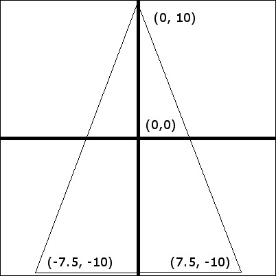

这就是我们`ByteBuffer`中包含的数据。这些数据不考虑方向（飞船或小行星是否旋转），不考虑其在游戏世界中的位置，并且作为提醒，它与 OpenGL 坐标系统完全无关。

因此，在我们绘制`ByteBuffer`之前，我们需要转换这些数据，或者更准确地说，我们需要准备一个适当的矩阵，我们将这个矩阵与数据一起传递给 OpenGL，这样 OpenGL 就会知道如何使用或转换这些数据。

我已经将`draw`方法分成六个部分来讨论我们是如何做到这一点的。请注意，我们的`viewPort`矩阵是在`AsteroidsRenderer`类的`draw`方法中准备的，该方法以飞船的位置为中心，基于我们想要显示的游戏世界的比例，并作为参数传递。

首先，我们调用`glUseProgram()`并传入我们程序的句柄。然后我们通过`vertices.position(0)`将我们的`ByteBuffer`的内部指针设置到开始位置。

`glVertexAttributePointer`方法使用我们的`aPositionLocation`变量以及`GLManager`静态常量，当然还有`vertices` `ByteBuffer`，将我们的顶点与顶点着色器中的`aPosition`变量关联起来。最后，对于这段代码，我们告诉 OpenGL 启用属性数组：

```java
    public void draw(float[] viewportMatrix){

        // tell OpenGl to use the glProgram
        glUseProgram(glProgram);

        // Set vertices to the first byte
        vertices.position(0);

        glVertexAttribPointer(
              aPositionLocation,
              COMPONENTS_PER_VERTEX,
              GL_FLOAT,
              false,
              STRIDE,
              vertices);

        glEnableVertexAttribArray(aPositionLocation);
```

现在，我们将我们的矩阵投入使用。通过调用`setIndentityM()`，我们从`modelMatrix`数组中创建一个单位矩阵。

### 注意

正如我们将要看到的，我们将使用和组合相当多的矩阵。一个单位矩阵充当一个起点或容器，我们可以在此基础上构建一个矩阵，该矩阵结合了我们需要的所有变换。关于单位矩阵的一个非常简单但并不完全准确的想法是，它就像数字 1。当你乘以一个单位矩阵时，它不会对总和的其他部分造成任何改变。然而，这个答案是正确的，可以继续进行方程的下一部分。如果你感到烦恼并且想了解更多，请查看这些关于矩阵和单位矩阵的快速教程。

矩阵：

[`www.khanacademy.org/math/precalculus/precalc-matrices/Basic_matrix_operations/v/introduction-to-the-matrix`](https://www.khanacademy.org/math/precalculus/precalc-matrices/Basic_matrix_operations/v/introduction-to-the-matrix)

单位矩阵：

[`www.khanacademy.org/math/precalculus/precalc-matrices/zero-identity-matrix-tutorial/v/identity-matrix`](https://www.khanacademy.org/math/precalculus/precalc-matrices/zero-identity-matrix-tutorial/v/identity-matrix)

然后，我们将新的 `modelMatrix` 传递到 `translateM` 方法中。平移是数学术语，意为移动。仔细观察传递给 `translateM()` 的参数。我们传递了对象的 *x* 和 *y* 世界位置。这是 OpenGL 知道对象位置的方式：

```java
    // Translate model coordinates into world coordinates
    // Make an identity matrix to base our future calculations on
    // Or we will get very strange results
    setIdentityM(modelMatrix, 0);
    // Make a translation matrix

    /*
        Parameters:
        m   matrix
        mOffset index into m where the matrix starts
        x   translation factor x
        y   translation factor y
        z   translation factor z
    */
    translateM(modelMatrix, 0, worldLocation.x, worldLocation.y, 0);
```

我们知道 OpenGL 有一个矩阵可以将我们的对象转换到其世界位置。它还有一个 `ByteBuffer` 类，包含模型空间坐标，但它如何将平移后的模型空间坐标转换为使用 OpenGL 坐标系绘制的视口？

它使用视口矩阵，该矩阵由每一帧修改并传递到这个方法中。我们所需做的只是使用 `multiplyMM()` 将 `viewportMatrix` 和最近平移的 `modelMatrix` 相乘。此方法创建组合或乘积矩阵，并将结果存储在 `viewportModelMatrix` 中：

```java
   // Combine the model with the viewport
   // into a new matrix
   multiplyMM(viewportModelMatrix, 0, 
      viewportMatrix, 0, modelMatrix, 0);
```

我们几乎完成了矩阵的创建。OpenGL 需要对 `ByteBuffer` 中的顶点进行的唯一其他可能的扭曲是将它们旋转到 `facingAngle` 参数。

接下来，我们创建一个适合当前对象面向角度的旋转矩阵，并将结果存储回 `modelMatrix`。

然后，我们将新旋转的 `modelMatrix` 与我们的 `viewportModelMatrix` 相结合或相乘，并将结果存储在 `rotateViewportModelMatrix` 中。这是我们最终将传递到 OpenGL 系统中的矩阵：

```java
   /*
        Now rotate the model - just the ship model

        Parameters
        rm  returns the result
        rmOffset    index into rm where the result matrix starts
        a   angle to rotate in degrees
        x   X axis component
        y   Y axis component
        z   Z axis component
    */
    setRotateM(modelMatrix, 0, facingAngle, 0, 0, 1.0f);

    // And multiply the rotation matrix into the model-viewport 
    // matrix
    multiplyMM(rotateViewportModelMatrix, 0, 
      viewportModelMatrix, 0, modelMatrix, 0);
```

现在，我们使用 `glUniformMatrix4fv()` 方法传入矩阵，并使用 `uMatrixLocation` 变量（这是顶点着色器中与矩阵相关的变量的位置）以及我们的最终矩阵作为参数。

我们还通过调用 `glUniform4f()` 并使用 `uColorLocation` 和一个 RGBT（红色、绿色、蓝色、透明度）值来选择颜色。所有值都设置为 1.0，因此片段着色器将绘制白色。

```java
   // Give the matrix to OpenGL

    glUniformMatrix4fv(uMatrixLocation, 1, false,                                        
    rotateViewportModelMatrix, 0);

    // Assign a color to the fragment shader
    glUniform4f(uColorLocation, 1.0f, 1.0f, 1.0f, 1.0f);
```

最后，我们根据对象类型进行切换，并绘制点、线或三角形原语：

```java
   // Draw the point, lines or triangle
    switch (type){
        case SHIP:
        glDrawArrays(GL_TRIANGLES, 0, numVertices);
        break;

        case ASTEROID:
        glDrawArrays(GL_LINES, 0, numVertices);
        break;

        case BORDER:
        glDrawArrays(GL_LINES, 0, numVertices);
        break;

       case STAR:
        glDrawArrays(GL_POINTS, 0, numVertices);
        break;

        case BULLET:
        glDrawArrays(GL_POINTS, 0, numVertices);
        break;
    }

} // End draw()

}// End class
```

现在我们已经拥有了 `GameObject` 类的基础，我们可以创建一个表示我们的飞船并将其绘制到屏幕上的类。

# 飞船

这个类既简洁又简单，尽管它将随着项目的进展而发展。构造函数接收游戏世界内的起始位置。我们使用 `GameObject` 类的方法设置飞船的类型和世界位置，并设置宽度和高度。

我们声明并初始化一些变量以简化模型空间坐标的初始化，然后我们继续初始化一个包含三个顶点的浮点数组，这三个顶点代表我们的飞船。注意，这些值是以 *x = 0* 和 *y = 0* 为中心的。

接下来我们只需调用 `setVertices()`，`GameObject` 将准备 `ByteBuffer` 以供 OpenGL 使用：

```java
public class SpaceShip extends GameObject{

  public SpaceShip(float worldLocationX, float worldLocationY){
       super();

        // Make sure we know this object is a ship
        // So the draw() method knows what type
        // of primitive to construct from the vertices

        setType(Type.SHIP);

        setWorldLocation(worldLocationX,worldLocationY);

        float width = 15;
        float length = 20;

        setSize(width, length);

        // It will be useful to have a copy of the
        // length and width/2 so we don't have to keep dividing by 2
        float halfW = width / 2;
        float halfL = length / 2;

        // Define the space ship shape
        // as a triangle from point to point
        // in anti clockwise order
        float [] shipVertices = new float[]{

               - halfW, - halfL, 0,
               halfW, - halfL, 0,
               0, 0 + halfL, 0

      };

       setVertices(shipVertices);

     }

}
```

最后，我们能够看到我们辛勤工作的成果。

# 以 60 + FPS 的速度绘制

在三个简单的步骤中，我们将能够一瞥我们的宇宙飞船：

+   将 `SpaceShip` 对象添加到 `GameManager` 成员变量中：

    ```java
    private boolean playing = false;

     // Our first game object
     SpaceShip ship;

         int screenWidth;
    ```

+   将对新的 `SpaceShip()` 的调用添加到 `createObjects` 方法中：

    ```java
    private void createObjects() {

      // Create our game objects
     // First the ship in the center of the map
     gm.ship = new SpaceShip(gm.mapWidth / 2, gm.mapHeight / 2);
    }
    ```

+   在`AsteroidsRenderer`的`draw`方法中调用绘制太空船的调用，在每个帧中：

    ```java
    // Start drawing!
    // Draw the ship
    gm.ship.draw(viewportMatrix);

    ```

运行游戏并查看输出：

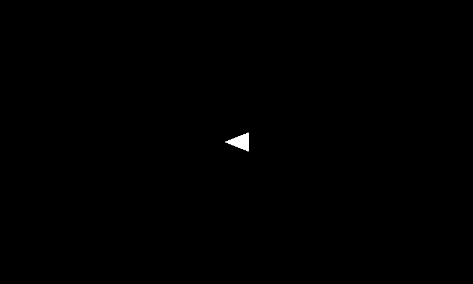

并不是特别令人印象深刻的视觉效果，但在调试模式下，当输出到一台老式的三星 Galaxy S2 手机的控制台时，它每秒可以运行 67 到 212 帧。

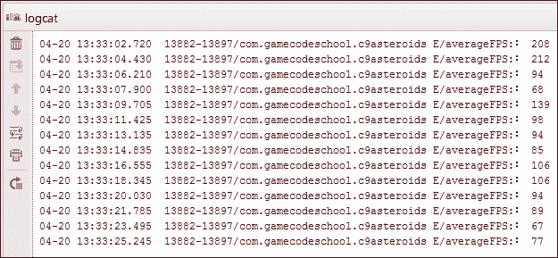

在整个项目中，我们的目标是将数百个对象添加到游戏中，并保持每秒 60 帧以上的帧率。

### 小贴士

该书的一位评论者报告说，在 Nexus 5 上帧率超过了每秒 1000 帧！因此，如果你计划将此发布到 Google Play 商店，考虑一个最大帧率锁定策略以节省电池寿命将是值得考虑的。

# 摘要

设置绘图系统有点冗长。然而，现在它已经完成，我们可以更容易地生成新对象。我们只需要定义类型和顶点，然后我们可以轻松地绘制它们。

正是因为这个基础，下一章将更加视觉上令人满意。接下来，我们将创建闪烁的星星、游戏世界边界、旋转和移动的小行星、快速移动的子弹，以及 HUD，并添加完整的控制和太空船的运动。

# 第十章. 使用 OpenGL ES 2 移动和绘制

在本章中，我们将实现所有的图形、游戏玩法和移动。在超过 30 页的内容中，我们将完成除了碰撞检测之外的所有内容。我们能实现这么多，是因为我们在上一章中打下的基础。

首先，我们将绘制一个静态的边界围绕我们的游戏世界，然后是一些闪烁的星星，接着添加太空船的运动以及一些子弹。之后，我们将快速添加玩家的控制，我们将在屏幕上快速移动。

我们还将通过实现带有一些新音效的`SoundManager`类来制造一些噪音。

一旦完成这些，我们将在世界中添加随机形状的小行星，它们在旋转的同时移动。

然后，我们可以添加一个 HUD 来突出屏幕的可触摸区域，并提供剩余玩家生命和需要摧毁以进入下一级的小行星的计数。

# 绘制静态游戏边界

在这个简单的类中，我们定义了四组点，这些点将代表四条线。不出所料，`GameObject`类将使用这些点作为线的端点来绘制边界。

在构造函数中，即整个类的内容，我们通过调用`setType()`设置类型，将世界位置设置为地图的中心，以及将`height`和`width`设置为整个地图的高度和宽度。

然后，我们在一个浮点数组中定义四条线，并调用`setVertices()`来准备一个`FloatBuffer`。

创建一个名为`Border`的新类，并添加以下代码：

```java
public class Border extends GameObject{

  public Border(float mapWidth, float mapHeight){

        setType(Type.BORDER);
        //border center is the exact center of map
        setWorldLocation(mapWidth/2,mapHeight/2);

        float w = mapWidth;
        float h = mapHeight;
        setSize(w, h);

       // The vertices of the border represent four lines
       // that create a border of a size passed into the constructor
       float[] borderVertices = new float[]{
           // A line from point 1 to point 2
            - w/2, -h/2, 0,
            w/2, -h/2, 0,
            // Point 2 to point 3
            w/2, -h/2, 0,
            w/2, h/2, 0,
            // Point 3 to point 4
            w/2, h/2, 0,
            -w/2, h/2, 0,
            // Point 4 to point 1
            -w/2, h/2, 0,
            - w/2, -h/2, 0,
    };

        setVertices(borderVertices);

  }

}
```

然后，我们可以将一个`Border`对象声明为`GameManager`的一个成员，如下所示：

```java
// Our game objects
SpaceShip ship;
Border border;

```

在`AsteroidsRenderer`的`createObjects`方法中初始化它，如下所示：

```java
// Create our game objects

// First the ship in the center of the map
gm.ship = new SpaceShip(gm.mapWidth / 2, gm.mapHeight / 2);

// The deadly border
gm.border = new Border(gm.mapWidth, gm.mapHeight);

```

现在，我们可以通过在`AsteroidsRendrer`类的`draw`方法中添加一行代码来绘制我们的边界：

```java
gm.ship.draw(viewportMatrix);
gm.border.draw(viewportMatrix);

```

你现在可以运行游戏了。如果你想真正看到边界，你可以将飞船初始化的位置改为靠近边界的某个地方。记住，在`draw`方法中，我们围绕飞船中心化视口。为了看到边界，将`SpaceShip`类中的这一行代码改为如下：

```java
setWorldLocation(10,10);
```

运行游戏看看。

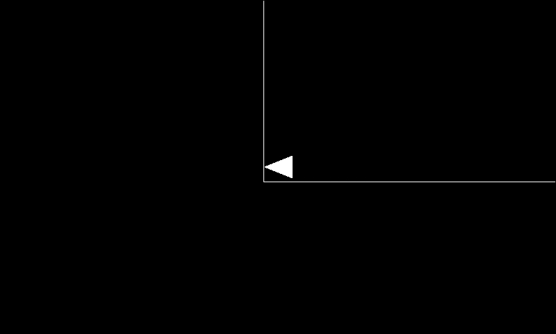

改回这个：

```java
setWorldLocation(worldLocationX,worldLocationY);
```

现在，我们将用星星填满边界内的区域。

# 闪烁的星星

我们将比静态边界更灵活。在这里，我们将向一个简单的`Star`类添加一个`update`方法，该方法可以用来随机切换星星的开和关。

我们将其类型设置为`normal`，并在边界的限制内为星星创建一个随机位置，然后像往常一样调用`setWorldLocation()`。

星星将以点的方式绘制，因此我们的顶点数组将简单地包含一个位于模型空间 0,0,0 的顶点。然后，我们像往常一样调用`setVertices()`。

创建一个新的类，命名为`Star`，并输入所讨论的代码：

```java
public class Star extends GameObject{

    // Declare a random object here because
    // we will use it in the update() method
    // and we don't want GC to have to keep clearing it up
    Random r;

    public Star(int mapWidth, int mapHeight){
    setType(Type.STAR);
    r = new Random();
    setWorldLocation(r.nextInt(mapWidth),r.nextInt(mapHeight));

    // Define the star
    // as a single point
    // in exactly the coordinates as its world location
    float[] starVertices = new float[]{

                0,
                0,
                0

    };

    setVertices(starVertices);

    }
```

这里是我们的`Star`类的`update`方法。正如我们所见，在每一帧中，星星切换其状态的概率是千分之一。为了更多的闪烁，使用较低的种子值，而为了较少的闪烁，使用较高的种子值。

```java
public void update(){

  // Randomly twinkle the stars
     int n = r.nextInt(1000);
     if(n == 0){
       // Switch on or off
       if(isActive()){
         setActive(false);
        }else{
          setActive(true);
        }
   }

}
```

然后，我们声明一个`Star`数组，作为`GameManager`的一个成员，以及一个额外的`int`变量来控制我们想要绘制的星星数量，如下所示：

```java
// Our game objects
SpaceShip ship;
Border border;
Star[] stars;
int numStars = 200;

```

在`AsteroidsRenderer`的`createObjects`方法中初始化`Star`对象数组如下：

```java
// The deadly border
gm.border = new Border(gm.mapWidth, gm.mapHeight);

// Some stars
gm.stars = new Star[gm.numStars];
for (int i = 0; i < gm.numStars; i++) {

 // Pass in the map size so the stars no where to spawn
 gm.stars[i] = new Star(gm.mapWidth, gm.mapHeight);
}

```

现在，我们可以通过将这些代码行添加到`AsteroidsRenderer`类的`draw`方法中来绘制我们的星星。注意，我们首先绘制星星，因为它们在背景中。

```java
// Start drawing!

// Some stars
for (int i = 0; i < gm.numStars; i++) {

 // Draw the star if it is active
 if(gm.stars[i].isActive()) {
 gm.stars[i].draw(viewportMatrix);
 }
}

gm.ship.draw(viewportMatrix);
gm.border.draw(viewportMatrix);
```

当然，为了使它们闪烁，我们从`AsteroidsRenderer`类的`update`方法中调用它们的`update`方法，如下所示：

```java
private void update(long fps) {

 // Update (twinkle) the stars
 for (int i = 0; i < gm.numStars; i++) {
 gm.stars[i].update();
 }

}
```

你现在可以运行游戏了：

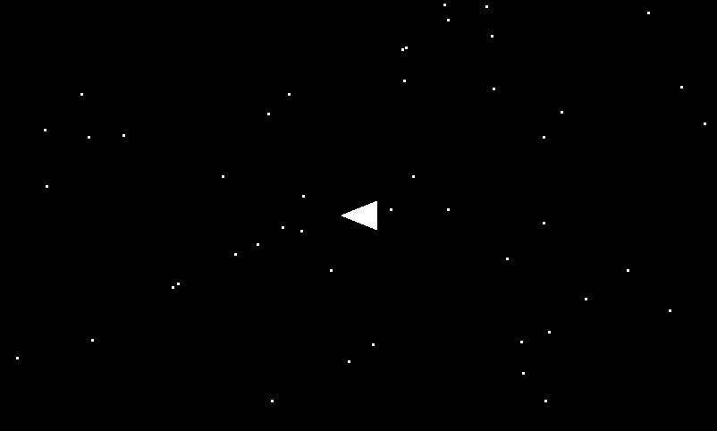

# 使飞船栩栩如生

首先，我们需要对我们的`GameObject`类添加一些更多功能。我们在`GameObject`中这样做，因为子弹和陨石与飞船有惊人的相似之处。

我们需要一些 getter 和 setter 来获取和设置旋转速率、移动角度和面向角度。将以下方法添加到`GameObject`类中：

```java
public void setRotationRate(float rotationRate) {
  this.rotationRate = rotationRate;
}

public float getTravellingAngle() {
  return travellingAngle;
}

public void setTravellingAngle(float travellingAngle) {
  this.travellingAngle = travellingAngle;
}

public float getFacingAngle() {
  return facingAngle;
}

public void setFacingAngle(float facingAngle) {
  this.facingAngle = facingAngle;
}
```

现在，我们添加一个`move`方法，该方法根据当前每秒帧数调整对象的*x*和*y*坐标以及`facingAngle`。添加`move`方法：

```java
void move(float fps){
  if(xVelocity != 0) {
       worldLocation.x += xVelocity / fps;
    }

     if(yVelocity != 0) {
       worldLocation.y += yVelocity / fps;
    }

     // Rotate
     if(rotationRate != 0) {
       facingAngle = facingAngle + rotationRate / fps;
    }

}
```

为了完成我们对`GameObject`类的补充，添加以下用于速度、速度和最大速度的 getter 和 setter：

```java
public float getxVelocity() {
  return xVelocity;
}

public void setxVelocity(float xVelocity) {
  this.xVelocity = xVelocity;
}

public float getyVelocity() {
  return yVelocity;
}

public void setyVelocity(float yVelocity) {
  this.yVelocity = yVelocity;
}

public float getSpeed() {
  return speed;
}

public void setSpeed(float speed) {
  this.speed = speed;
}

public float getMaxSpeed() {
  return maxSpeed;
}

public void setMaxSpeed(float maxSpeed) {
  this.maxSpeed = maxSpeed;
}
```

我们可以向`SpaceShip`类添加一些功能。添加以下三个成员以控制玩家的飞船是否转向或向前移动：

```java
boolean isThrusting;
private boolean isPressingRight = false;
private boolean isPressingLeft = false;
```

现在，在`SpaceShip`构造函数内部，让我们设置飞船的最大速度。我在现有代码中突出显示了新的一行代码：

```java
setSize(width, length);

setMaxSpeed(150);

// It will be useful to have a copy of the
```

接下来，在`SpaceShip`类中，我们添加一个`update`方法，首先根据`isThrusting`是`true`还是`false`增加和减少速度。

```java
public void update(long fps){

float speed = getSpeed();
if(isThrusting) {
  if (speed < getMaxSpeed()){
       setSpeed(speed + 5);
     }

     }else{
       if(speed > 0) {
         setSpeed(speed - 3);
        }else {
         setSpeed(0);
        }
}
```

然后，我们根据角度设置*x*和*y*速度，即船面对的方向和速度。

### 注意

我们使用速度乘以船面对的角度的余弦值来设置*x*轴上的速度。这是因为余弦函数是一个完美的变体，当船正好面向左或右时，它会返回-1 或 1 的值；当船正好向上或向下时，变体会返回精确的 0 值。它也会在中间返回精细的值。角度的正弦在*y*轴上以完全相同的方式工作。代码看起来稍微复杂一些，是因为我们需要将我们的角度转换为弧度，并且必须将 90 度添加到我们的`facingAngle`中，因为 0 度是指向三点的。这个事实不利于我们在*x*，*y*平面上以我们有的方式使用它，所以我们将其修改为 90 度，船就会按预期移动。有关此工作方式的更多信息，请查看这个教程：

[使用三角函数计算 2D 游戏中的航向 - 第一部分](http://gamecodeschool.com/essentials/calculating-heading-in-2d-games-using-trigonometric-functions-part-1/)

```java
setxVelocity((float) 
  (speed* Math.cos(Math.toRadians(getFacingAngle() + 90))));

setyVelocity((float) 
  (speed* Math.sin(Math.toRadians(getFacingAngle() + 90))));

```

现在，我们根据玩家是否向左或向右转动设置旋转速率。最后，我们调用`move()`以使所有更新生效。

```java
if(isPressingLeft){
  setRotationRate(360);
}

else if(isPressingRight){
  setRotationRate(-360);
     }else{
       setRotationRate(0);
    }

     move(fps);
}
```

现在，我们需要添加一个`pullTrigger`方法，目前我们只是返回`true`。我们还提供了三个方法供我们的未来`InputController`调用并触发`update`方法，以进行各种更改。

```java
public boolean pullTrigger() {
  //Try and fire a shot
  // We could control rate of fire from here
  // But lets just return true for unrestricted rapid fire
  // You could remove this method and any code which calls it

   return true;
}

public void setPressingRight(boolean pressingRight) {
  isPressingRight = pressingRight;
}

public void setPressingLeft(boolean pressingLeft) {
  isPressingLeft = pressingLeft;
}

public void toggleThrust() {
  isThrusting = ! isThrusting;
}
```

我们已经在每一帧中绘制了船，但需要在`AsteroidsRenderer`类的`update`方法中添加一行代码。将此行代码添加到调用`SpaceShip`类的`update`方法：

```java
// Update (twinkle) the stars
for (int i = 0; i < gm.numStars; i++) {
  gm.stars[i].update();
}

// Run the ship,s update() method
gm.ship.update(fps);

```

显然，在我们添加玩家控制之前，我们无法实际移动。让我们快速为游戏添加一些子弹。然后，我们将添加声音和控件，以便我们可以看到和听到我们添加的酷炫新功能。

# 连续射击子弹

自从 70 年代的 Pong 以来，我就沉迷于游戏，并记得当一位朋友在家里有一台太空侵略者机器大约一周时的喜悦。尽管真正让小行星比太空侵略者更好的是你可以射击得多快。在这个传统中，我们将制作一个令人满意的快速射击子弹流。

创建一个新的类`Bullet`，它有一个顶点，并将以点的方式绘制。请注意，我们还声明并初始化了一个`inFlight`布尔值。

```java
public class Bullet extends GameObject {

  private boolean inFlight = false;

  public Bullet(float shipX, float shipY) {
       super();

       setType(Type.BULLET);

       setWorldLocation(shipX, shipY);

       // Define the bullet
       // as a single point
       // in exactly the coordinates as its world location
       float[] bulletVertices = new float[]{

                0,
                0,
                0

       };

    setVertices(bulletVertices);

}
```

接下来，我们有`shoot`方法，该方法将子弹的`facingAngle`设置为船的`facingAngle`。这将导致子弹在按下射击按钮时以船当时面对的方向移动。我们还设置`inFlight`为`true`，并查看这在`update`方法中的使用方式。最后，我们将速度设置为`300`。

我们还添加了一个`resetBullet`方法，它将子弹设置在船内并取消其速度和速度。这给我们提供了关于我们将如何实现子弹的线索。子弹将隐形地坐在船内，直到它们被发射。

```java
public void shoot(float shipFacingAngle){

     setFacingAngle(shipFacingAngle);
     inFlight = true;
     setSpeed (300);
}

public void resetBullet(PointF shipLocation){

     // Stop moving if bullet out of bounds
     inFlight = false;
     setxVelocity(0);
     setyVelocity(0);
     setSpeed(0);
     setWorldLocation(shipLocation.x, shipLocation.y);

}

public boolean isInFlight(){
  return  inFlight;
}
```

现在，我们根据子弹的`facingAngle`和速度移动子弹，只有当`inFlight`为真时。否则，我们保持子弹在船内。然后，我们调用`move()`。

```java
public void update(long fps, PointF shipLocation){
        // Set the velocity if bullet in flight
        if(inFlight){
            setxVelocity((float)(getSpeed()* 
               Math.cos(Math.toRadians(getFacingAngle() + 90))));
            setyVelocity((float)(getSpeed()* 
               Math.sin(Math.toRadians(getFacingAngle() + 90))));
        }else{
            // Have it sit inside the ship
            setWorldLocation(shipLocation.x, shipLocation.y);
        }

        move(fps);
    }
}
```

现在，我们有一个`Bullet`类，我们可以在`GameManager`类中声明一个数组，用来存放这种类型的一组对象。

```java
int numStars = 200;
Bullet [] bullets;
int numBullets = 20;

```

在`AsteroidsRenderer`中的`createObjects()`方法中初始化它们，紧接上一节中的星星之后。注意我们如何初始化它们在游戏世界中的位置，即船的中心。

```java
// Some bullets
gm.bullets = new Bullet[gm.numBullets];
for (int i = 0; i < gm.numBullets; i++) {
  gm.bullets[i] = new Bullet(
     gm.ship.getWorldLocation().x,
     gm.ship.getWorldLocation().y);
}
```

在`update`方法中更新它们，再次紧接我们的闪烁星星之后。

```java
// Update all the bullets
for (int i = 0; i < gm.numBullets; i++) {

    // If not in flight they will need the ships location
    gm.bullets[i].update(fps, gm.ship.getWorldLocation());

}
```

在`draw`方法中再次绘制它们，在星星之后。

```java
for (int i = 0; i < gm.numBullets; i++) {
  gm.bullets[i].draw(viewportMatrix);
}
```

子弹现在可以发射了！

我们将添加一个`SoundManager`和`InputController`类，然后我们就可以看到我们的船和它的快速射击枪在行动了。

# 重用现有类

让我们快速将`SoundManager`和`InputController`类添加到这个项目中，因为它们只需要稍作调整就能满足我们的需求。

在`AsteroidsView`和`AsteroidsRenderer`类中为`SoundManager`和`InputController`对象添加一个成员。

```java
private InputController ic;
private SoundManager sm;
```

在`AsteroidsView`类的`onCreate`方法中初始化新对象，并像这样调用`loadSound`方法：

```java
public AsteroidsView(Context context, int screenX, int screenY) {
  super(context);

 sm = new SoundManager();
 sm.loadSound(context);
 ic = new InputController(screenX, screenY);
     gm = new GameManager(screenX, screenY);
```

同样在`AsteroidsView`中，向调用`AsteroidsRenderer`构造函数的调用中添加两个额外的参数，以传递`SoundManager`和`InputController`对象的引用。

```java
setEGLContextClientVersion(2);
setRenderer(new AsteroidsRenderer(gm,sm,ic));

```

现在在`AsteroidsRenderer`构造函数中添加两个额外的参数，并像这样初始化两个新成员：

```java
public AsteroidsRenderer(GameManager gameManager,
 SoundManager soundManager, InputController inputController) {

        gm = gameManager;
 sm = soundManager;
 ic = inputController;

       handyPointF = new PointF();
       handyPointF2 = new PointF();

}
```

在我们添加这两个类之前，你的 IDE 中会出现错误。我们现在就来添加它们。

## 添加 SoundManager 类

`SoundManager`类的工作方式与上一个项目完全相同，所以这里没有新的内容需要解释。

将下载包`Chapter10/assets`文件夹中的所有声音文件添加到你的项目资源文件夹中。和前两个项目一样，你可能需要在项目的`.../app/src/main`文件夹中创建资源文件夹。

### 小贴士

和往常一样，你可以使用提供的声音效果或创建自己的。

现在，向项目中添加一个名为`SoundManager`的新类。请注意，该类的功能与上一个项目相同，但代码不同，仅仅是因为声音文件及其相关变量的名称不同。将此代码添加到`SoundManager`类中：

```java
public class SoundManager {
    private SoundPool soundPool;
    private int shoot = -1;
    private int thrust = -1;
    private int explode = -1;
    private int shipexplode = -1;
    private int ricochet = -1;
    private int blip = -1;
    private int nextlevel = -1;
    private int gameover = -1;

    public void loadSound(Context context){
        soundPool = new SoundPool(10, AudioManager.STREAM_MUSIC,0);
        try{
            //Create objects of the 2 required classes
            AssetManager assetManager = context.getAssets();
            AssetFileDescriptor descriptor;

            //create our fx
            descriptor = assetManager.openFd("shoot.ogg");
            shoot = soundPool.load(descriptor, 0);

            descriptor = assetManager.openFd("thrust.ogg");
            thrust = soundPool.load(descriptor, 0);

            descriptor = assetManager.openFd("explode.ogg");
            explode = soundPool.load(descriptor, 0);

            descriptor = assetManager.openFd("shipexplode.ogg");
            shipexplode = soundPool.load(descriptor, 0);

            descriptor = assetManager.openFd("ricochet.ogg");
            ricochet = soundPool.load(descriptor, 0);

            descriptor = assetManager.openFd("blip.ogg");
            blip = soundPool.load(descriptor, 0);

            descriptor = assetManager.openFd("nextlevel.ogg");
            nextlevel = soundPool.load(descriptor, 0);

            descriptor = assetManager.openFd("gameover.ogg");
            gameover = soundPool.load(descriptor, 0);

        }catch(IOException e){
            //Print an error message to the console
            Log.e("error", "failed to load sound files");
        }
    }

    public void playSound(String sound){
        switch (sound){
            case "shoot":
                soundPool.play(shoot, 1, 1, 0, 0, 1);
                break;

            case "thrust":
                soundPool.play(thrust, 1, 1, 0, 0, 1);
                break;

            case "explode":
                soundPool.play(explode, 1, 1, 0, 0, 1);
                break;

            case "shipexplode":
                soundPool.play(shipexplode, 1, 1, 0, 0, 1);
                break;

            case "ricochet":
                soundPool.play(ricochet, 1, 1, 0, 0, 1);
                break;

            case "blip":
                soundPool.play(blip, 1, 1, 0, 0, 1);
                break;

            case "nextlevel":
                soundPool.play(nextlevel, 1, 1, 0, 0, 1);
                break;

            case "gameover":
                soundPool.play(gameover, 1, 1, 0, 0, 1);
                break;

        }

    }
}
```

现在，我们可以在任何有我们新类引用的地方调用`playSound()`。

## 添加 InputController 类

这与上一个项目中的方式相同，只是我们调用适当的`PlayerShip`方法而不是 Bob 的。此外，在游戏暂停时，我们不会移动视口，因此当游戏暂停时，不需要以不同的方式处理屏幕触摸；这使得这个`InputController`更简单、更短。

将`onTouchEvent`方法添加到`AsteroidsView`类中，以便将处理触摸的责任传递给`InputController`：

```java
@Override
    public boolean onTouchEvent(MotionEvent motionEvent) {
        ic.handleInput(motionEvent, gm, sm);
        return true;
    }
```

添加一个名为`InputController`的新类，并添加以下代码，除了处理玩家射击的方式外，其他都很直接。

我们声明一个成员`int currentBullet`，它跟踪我们将要发射的下一个子弹来自我们即将声明的数组。然后，当按下射击按钮时，我们可以数出子弹，并在数组中的最后一个子弹发射后回到第一个子弹。

创建一个名为`InputController`的新类，并输入以下代码：

```java
public class InputController {

    private int currentBullet;

    Rect left;
    Rect right;
    Rect thrust;
    Rect shoot;
    Rect pause;

    InputController(int screenWidth, int screenHeight) {

        //Configure the player buttons
        int buttonWidth = screenWidth / 8;
        int buttonHeight = screenHeight / 7;
        int buttonPadding = screenWidth / 80;

        left = new Rect(buttonPadding,
            screenHeight - buttonHeight - buttonPadding,
            buttonWidth,
            screenHeight - buttonPadding);

        right = new Rect(buttonWidth + buttonPadding,
            screenHeight - buttonHeight - buttonPadding,
            buttonWidth + buttonPadding + buttonWidth,
            screenHeight - buttonPadding);

        thrust = new Rect(screenWidth - buttonWidth - 
            buttonPadding,
            screenHeight - buttonHeight - buttonPadding - 
            buttonHeight - buttonPadding,
            screenWidth - buttonPadding,
            screenHeight - buttonPadding - buttonHeight - 
            buttonPadding);

        shoot = new Rect(screenWidth - buttonWidth - 
            buttonPadding,
            screenHeight - buttonHeight - buttonPadding,
            screenWidth - buttonPadding,
            screenHeight - buttonPadding);

        pause = new Rect(screenWidth - buttonPadding - 
            buttonWidth,
            buttonPadding,
            screenWidth - buttonPadding,
            buttonPadding + buttonHeight);
```

让我们将所有按钮打包成一个列表，并通过公共方法使它们可用。

```java
    }    
    public ArrayList getButtons(){

        //create an array of buttons for the draw method
        ArrayList<Rect> currentButtonList = new ArrayList<>();
        currentButtonList.add(left);
        currentButtonList.add(right);
        currentButtonList.add(thrust);
        currentButtonList.add(shoot);
        currentButtonList.add(pause);
        return  currentButtonList;
    }
```

接下来，我们像以前一样处理输入，只是我们调用我们的`Ship`类的方法。

```java
public void handleInput(MotionEvent motionEvent,GameManager l,                                      
  SoundManager sound){

        int pointerCount = motionEvent.getPointerCount();

        for (int i = 0; i < pointerCount; i++) {
        int x = (int) motionEvent.getX(i);
        int y = (int) motionEvent.getY(i);

          switch (motionEvent.getAction() & 
             MotionEvent.ACTION_MASK) {

            case MotionEvent.ACTION_DOWN:
                    if (right.contains(x, y)) {
                    l.ship.setPressingRight(true);
                    l.ship.setPressingLeft(false);
                 } else if (left.contains(x, y)) {
                    l.ship.setPressingLeft(true);
                    l.ship.setPressingRight(false);
                    } else if (thrust.contains(x, y)) {
                    l.ship.toggleThrust();
                    } else if (shoot.contains(x, y)) {
                        if (l.ship.pullTrigger()) {
                        l.bullets[currentBullet].shoot
                                (l.ship.getFacingAngle());

                            currentBullet++;
                       // If we are on the last bullet restart
                       // from the first one again
                       if(currentBullet == l.numBullets){
                            currentBullet = 0;
                        }

                           sound.playSound("shoot");
                    }

                    } else if (pause.contains(x, y)) {
                    l.switchPlayingStatus();
                    }
                    break;

            case MotionEvent.ACTION_UP:
            if (right.contains(x, y)) {
                    l.ship.setPressingRight(false);
                } else if (left.contains(x, y)) {
                    l.ship.setPressingLeft(false);
                }

                break;

            case MotionEvent.ACTION_POINTER_DOWN:
            if (right.contains(x, y)) {
                    l.ship.setPressingRight(true);
                    l.ship.setPressingLeft(false);
                } else if (left.contains(x, y)) {
                    l.ship.setPressingLeft(true);
                 l.ship.setPressingRight(false);
                } else if (thrust.contains(x, y)) {
                    l.ship.toggleThrust();
                } else if (shoot.contains(x, y)) {
                    if (l.ship.pullTrigger()) {
                    l.bullets[currentBullet].shoot
                            (l.ship.getFacingAngle());

                        currentBullet++;
                    // If we are on the last bullet restart
                    // from the first one again
                    if(currentBullet == l.numBullets){
                        currentBullet = 0;
                    }
                    sound.playSound("shoot");
                    }
                } else if (pause.contains(x, y)) {
                    l.switchPlayingStatus();
                }
                break;

            case MotionEvent.ACTION_POINTER_UP:
            if (right.contains(x, y)) {
                    l.ship.setPressingRight(false);
                } else if (left.contains(x, y)) {
                    l.ship.setPressingLeft(false);
                }

                break;
            }
         }

    }
}
```

现在，我们可以四处飞行并发射几发太空弹！当然，在我们绘制 HUD 之前，你将不得不估计屏幕位置。别忘了玩家需要先点击暂停按钮（右上角）。

### 注意

注意，目前我们未使用`resetBullet`方法，并且一旦你发射了二十发子弹，你就不能再发射了。我们可以快速检查子弹是否位于边界之外的位置，然后调用`resetBullet`，但我们将与所有碰撞检测一起完全处理这个问题。

当然，没有彗星的彗星游戏是不完整的。

# 绘制和移动彗星

最后，我们将添加我们酷炫的旋转彗星。首先，我们将查看构造函数，它与其他游戏对象构造函数相当相似，只是我们将世界位置随机设置。然而，请特别注意不要在地图中心生成它们，因为太空船从这里开始游戏。

创建一个名为`Asteroid`的新类，并添加此构造函数。请注意，我们尚未定义任何顶点。我们将此委托给即将看到的`generatePoints`方法。

```java
public class Asteroid extends GameObject{

    PointF[] points;

    public Asteroid(int levelNumber, int mapWidth, int mapHeight){
        super();

        // set a random rotation rate in degrees per second
        Random r = new Random();
        setRotationRate(r.nextInt(50 * levelNumber) + 10);

        // travel at any random angle
        setTravellingAngle(r.nextInt(360));

        // Spawn asteroids between 50 and 550 on x and y
        // And avoid the extreme edges of map
        int x = r.nextInt(mapWidth - 100)+50;
        int y = r.nextInt(mapHeight - 100)+50;

        // Avoid the center where the player spawns
        if(x > 250 && x < 350){ x = x + 100;}
        if(y > 250 && y < 350){ y = y + 100;}

        // Set the location
        setWorldLocation(x,y);

        // Make them a random speed with the maximum
        // being appropriate to the level number
        setSpeed(r.nextInt(25 * levelNumber)+1);

        setMaxSpeed(140);

        // Cap the speed
        if (getSpeed() > getMaxSpeed()){
            setSpeed(getMaxSpeed());
        }

        // Make sure we know this object is a ship
        setType(Type.ASTEROID);

        // Define a random asteroid shape
        // Then call the parent setVertices()
        generatePoints();

    }
```

我们的更新方法简单地根据速度和移动角度计算速度，就像我们在`SpaceShip`类中做的那样。然后，它以通常的方式调用`move()`。

```java
public void update(float fps){

  setxVelocity ((float) (getSpeed() * Math.cos(Math.toRadians  (getTravellingAngle() + 90))));

  setyVelocity ((float) (getSpeed() * Math.sin(Math.toRadians(getTravellingAngle() + 90))));

     move(fps);

}
```

在这里，我们看到`generatePoints`方法，它将创建一个形状随机的彗星。简单来说，每个彗星将有六个顶点。每个顶点都有一个随机生成的位置，但在这个相当严格的限制范围内，所以我们不会得到任何重叠的线条。

```java
// Create a random asteroid shape
public void generatePoints(){
  points = new PointF[7];

   Random r = new Random();
   int i;

     // First a point roughly centre below 0
     points[0] = new PointF();
     i = (r.nextInt(10))+1;
     if(i % 2 == 0){i = -i;}
     points[0].x = i;
     i = -(r.nextInt(20)+5);
     points[0].y = i;

     // Now a point still below centre but to the right and up a bit
     points[1] = new PointF();
     i = r.nextInt(14)+11;
     points[1].x = i;
     i = -(r.nextInt(12)+1);
     points[1].y =  i;

     // Above 0 to the right
     points[2] = new PointF();
     i = r.nextInt(14)+11;
     points[1].x = i;
     i = r.nextInt(12)+1;
     points[2].y = i;

     // A point roughly centre above 0
     points[3] = new PointF();
     i = (r.nextInt(10))+1;
     if(i % 2 == 0){i = -i;}
     points[3].x = i;
     i = r.nextInt(20)+5;
     points[3].y =  i;

     // left above 0
     points[4] = new PointF();
     i = -(r.nextInt(14)+11);
     points[4].x = i;
     i = r.nextInt(12)+1;
     points[4].y = i ;

     // left below 0
     points[5] = new PointF();
     i = -(r.nextInt(14)+11);
     points[5].x =  i;
     i = -(r.nextInt(12)+1);

     points[5].y = i;
```

现在，我们有六个点，我们用这些点构建表示顶点的浮点数数组。最后，我们调用`setVertices()`来创建我们的`ByteBuffer`。注意，小行星将以一系列线条的形式绘制，这就是为什么数组中的最后一个顶点与第一个顶点相同。

```java
  // Now use these points to draw our asteroid
  float[] asteroidVertices = new float[]{
     // First point to second point
     points[0].x, points[0].y, 0,
     points[1].x, points[1].y, 0,

     // 2nd to 3rd
     points[1].x, points[1].y, 0,
     points[2].x, points[2].y, 0,

     // 3 to 4
     points[2].x, points[2].y, 0,
     points[3].x, points[3].y, 0,

     // 4 to 5
     points[3].x, points[3].y, 0,
     points[4].x, points[4].y, 0,

     // 5 to 6
     points[4].x, points[4].y, 0,
     points[5].x, points[5].y, 0,

     // 6 back to 1
     points[5].x, points[5].y, 0,
     points[0].x, points[0].y, 0,
};

setVertices(asteroidVertices);

}// End method

}// End class
```

现在你可能已经预料到了，我们在`GameManager`中添加了一个数组来存储所有的小行星。同时，我们将声明一些变量，它们将存储玩家当前所在的关卡，以及起始（基础）小行星的数量。然后，当我们初始化所有小行星时，我们将看到我们将如何确定需要摧毁多少小行星才能清除一个关卡。

```java
Asteroid [] asteroids;
int numAsteroids;
int numAsteroidsRemaining;
int baseNumAsteroids = 10;
int levelNumber = 1;
```

在`GameManager`构造函数中初始化数组：

```java
// For all our asteroids
asteroids = new Asteroid[500];
```

使用之前声明的变量在`createObjects`方法中初始化对象本身，以确定基于当前关卡的小行星数量。

```java
// Determine the number of asteroids
gm.numAsteroids = gm.baseNumAsteroids * gm.levelNumber;
// Set how many asteroids need to be destroyed by player
gm.numAsteroidsRemaining = gm.numAsteroids;
// Spawn the asteroids

for (int i = 0; i < gm.numAsteroids * gm.levelNumber; i++) {
     // Create a new asteroid
     // Pass in level number so they can be made
     // appropriately dangerous.
     gm.asteroids[i] = new Asteroid
      (gm.levelNumber, gm.mapWidth, gm.mapHeight);

}
```

在`update`方法中更新它们。

```java
// Update all the asteroids
for (int i = 0; i < gm.numAsteroids; i++) {
  if (gm.asteroids[i].isActive()) {
    gm.asteroids[i].update(fps);
  }
}
```

最后，我们可以在`draw`方法中绘制所有我们的小行星。

```java
// The bullets
for (int i = 0; i < gm.numBullets; i++) {
  gm.bullets[i].draw(viewportMatrix);
}

for (int i = 0; i < gm.numAsteroids; i++) {
 if (gm.asteroids[i].isActive()) {
 gm.asteroids[i].draw(viewportMatrix);
 }

}

```

现在，运行游戏并查看那些平滑的、60+ FPS、旋转的小行星。

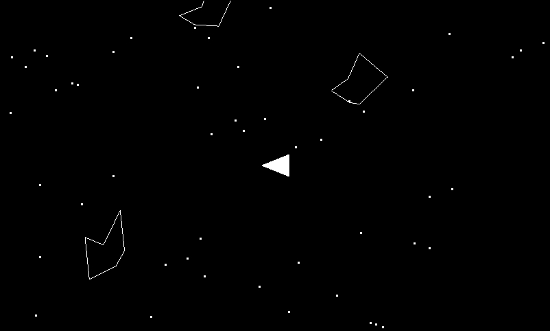

现在，我们需要通过添加按钮图形以及一些其他叠加信息，使用 HUD（Head-Up Display）使控制飞船变得容易。

# 分数和 HUD

HUD 对象永远不会旋转。此外，它们是在`InputController`类中基于屏幕坐标定义的，而不是游戏世界或甚至 OpenGL 坐标。因此，我们的`GameObject`类不是一个合适的父类。

为了简化，三个 HUD 类中的每一个都将有自己的`draw`方法。我们将看到如何使用新的视口矩阵以一致的大小和屏幕位置绘制它们。

一旦我们创建了所有三个 HUD 类，我们将添加所有对象声明、初始化和绘制代码。

## 添加控制按钮

我们将为第一个 HUD 对象创建一个类，它是一个简单的按钮。

### 注意

我明确地显示了所有导入，因为它们不会自动导入。注意，接下来的两个类也需要这些导入。代码通常都在下载包中，如果你只想复制粘贴的话。

创建一个新的类，命名为`GameButton`，然后添加以下导入语句。请确保根据你使用的章节代码或你为项目命名的名称，正确地声明包名。

```java
import android.graphics.PointF;
import java.nio.ByteBuffer;
import java.nio.ByteOrder;
import java.nio.FloatBuffer;
import static android.opengl.GLES20.GL_FLOAT;
import static android.opengl.GLES20.GL_LINES;
import static android.opengl.GLES20.glDrawArrays;
import static android.opengl.GLES20.glEnableVertexAttribArray;
import static android.opengl.GLES20.glGetAttribLocation;
import static android.opengl.GLES20.glGetUniformLocation;
import static android.opengl.GLES20.glUniform4f;
import static android.opengl.GLES20.glUniformMatrix4fv;
import static android.opengl.GLES20.glUseProgram;
import static android.opengl.Matrix.orthoM;
import static android.opengl.GLES20.glVertexAttribPointer;
import static com.gamecodeschool.c10asteroids.GLManager.A_POSITION;
import static com.gamecodeschool.c10asteroids.GLManager.COMPONENTS_PER_VERTEX;
import static com.gamecodeschool.c10asteroids.GLManager.FLOAT_SIZE;
import static com.gamecodeschool.c10asteroids.GLManager.STRIDE;
import static com.gamecodeschool.c10asteroids.GLManager.U_COLOR;
import static com.gamecodeschool.c10asteroids.GLManager.U_MATRIX;
```

首先，我们声明一些成员；`viewportMatrix`，我们将把我们的新矩阵放入其中，用于从`InputController`类的基于屏幕坐标的视口变换——一个`int glprogram`值，一个`int numVertices`值和一个`FloatBuffer`类。

```java
public class GameButton {

    // For button coordinate
    // into a GL space coordinate (-1,-1 to 1,1)
    // for drawing on the screen
    private final float[] viewportMatrix = new float[16];

    // A handle to the GL glProgram -
    // the compiled and linked shaders
    private static int glProgram;

    // How many vertices does it take to make
    // our button
    private int numVertices;

    // This will hold our vertex data that is
    // passed into openGL glProgram
    private FloatBuffer vertices;
```

在构造函数中，我们首先通过调用`orthoM()`并使用屏幕的高度和宽度作为`0,0`来创建我们的视口矩阵。这使得 OpenGL 将一个与设备分辨率相同的坐标范围映射到 OpenGL 坐标范围之上。

然后，我们获取传入按钮的坐标并将其缩小以使其更小。然后，我们初始化一个顶点数组作为四条线来表示一个按钮。显然，我们将需要创建一个新的按钮对象来表示`InputController`类中的每一个按钮。

```java
public GameButton(int top, int left, 
    int bottom, int right, GameManager gm){

    //The HUD needs its own viewport
    // notice we set the screen height in pixels as the
    // starting y coordinates because
    // OpenGL is upside down world :-)
    orthoM(viewportMatrix, 0, 0, 
        gm.screenWidth, gm.screenHeight, 0, 0, 1f);

        // Shrink the button visuals to make
        // them less obtrusive while leaving
        // the screen area they represent the same.
        int width = (right - left) / 2;
        int height = (top - bottom) / 2;
        left = left + width / 2;
        right = right - width / 2;
        top = top - height / 2;
        bottom = bottom + height / 2;

        PointF p1 = new PointF();
        p1.x = left;
        p1.y = top;

        PointF p2 = new PointF();
        p2.x = right;
        p2.y = top;

        PointF p3 = new PointF();
        p3.x = right;
        p3.y = bottom;

        PointF p4 = new PointF();
        p4.x = left;
        p4.y = bottom;

        // Add the four points to an array of vertices
        // This time, because we don't need to animate the border
        // we can just declare the world space coordinates, the
        // same as above.
        float[] modelVertices = new float[]{
                // A line from point 1 to point 2
                p1.x, p1.y, 0,
                p2.x, p2.y, 0,
                // Point 2 to point 3
                p2.x, p2.y, 0,
                p3.x, p3.y, 0,
                // Point 3 to point 4
                p3.x, p3.y, 0,
                p4.x, p4.y, 0,
                // Point 4 to point 1
                p4.x, p4.y, 0,
                p1.x, p1.y, 0
        };
```

现在，我们从`GameObject`中复制一小部分代码来准备`ByteBuffer`，但我们仍然使用我们的静态`GLManager.getGLProgram()`来获取 GL 程序的句柄。

```java
       // Store how many vertices and 
       // elements there is for future use
       final int ELEMENTS_PER_VERTEX = 3;// x,y,z
       int numElements = modelVertices.length;
       numVertices = numElements/ELEMENTS_PER_VERTEX;

       // Initialize the vertices ByteBuffer object based on the
       // number of vertices in the button and the number of
       // bytes there are in the float type
       vertices = ByteBuffer.allocateDirect(
                numElements
                * FLOAT_SIZE)
                .order(ByteOrder.nativeOrder()).asFloatBuffer();

       // Add the button into the ByteBuffer object
       vertices.put(modelVertices);

       glProgram = GLManager.getGLProgram();

}
```

最后，我们实现`draw`方法，这是从`GameObject`中的`draw`方法的简化版本。请注意，我们不需要与模型、平移和旋转矩阵纠缠，并且我们还向片段着色器传递了不同的颜色。

```java
public void draw(){

    // And tell OpenGl to use the glProgram
    glUseProgram(glProgram);

    // Now we have a glProgram we need the locations
    // of our three GLSL variables
    int uMatrixLocation = glGetUniformLocation(glProgram, U_MATRIX);

    int aPositionLocation = 
        glGetAttribLocation(glProgram, A_POSITION);

    int uColorLocation = glGetUniformLocation(glProgram, U_COLOR);

    vertices.position(0);

    glVertexAttribPointer(
        aPositionLocation,
        COMPONENTS_PER_VERTEX,
        GL_FLOAT,
        false,
        STRIDE,
        vertices);

    glEnableVertexAttribArray(aPositionLocation);

    // give the new matrix to OpenGL
    glUniformMatrix4fv(uMatrixLocation, 1, false, viewportMatrix, 0);

    // Assign a different color to the fragment shader
    glUniform4f(uColorLocation, 0.0f, 0.0f, 1.0f, 1.0f);

    // Draw the lines
    // start at the first element of the
    // vertices array and read in all vertices
    glDrawArrays(GL_LINES, 0, numVertices);

}
}// End class
```

## 计数图标

这个类与`GameButton`相同，除了计数图标将是一条单一的垂直线；因此，我们只需要两个顶点。

然而，请注意，我们在构造函数中有一个名为`nthIcon`的参数。调用代码将负责让`TallyIcon`知道已经创建的`TallyIcon`对象的总数，再加一。然后，当前的`TallyIcon`对象可以使用填充变量来适当地定位自己。

创建一个名为`TallyIcon`的新类，并输入以下代码。正如我们之前所做的那样，根据需要包含静态导入。以下是所有声明和构造函数的代码：

```java
public class TallyIcon {

    // For button coordinate
    // into a GL space coordinate (-1,-1 to 1,1)
    // for drawing on the screen
    private final float[] viewportMatrix = new float[16];

    // A handle to the GL glProgram -
    // the compiled and linked shaders
    private static int glProgram;

    // How many vertices does it take to make
    // our button
    private int numVertices;

    // This will hold our vertex data that is
    // passed into openGL glProgram
    //private final FloatBuffer vertices;
    private FloatBuffer vertices;

    public TallyIcon(GameManager gm, int nthIcon){

        // The HUD needs its own viewport
        // notice we set the screen height in pixels as the
        // starting y coordinates because
        // OpenGL is upside down world :-)
        orthoM(viewportMatrix, 0, 0,
          gm.screenWidth, gm.screenHeight, 0, 0f, 1f);

        float padding = gm.screenWidth / 160;
        float iconHeight = gm.screenHeight / 15;
        float iconWidth = 1; // square icons
        float startX = 10 + (padding + iconWidth)* nthIcon;
        float startY = iconHeight * 2 + padding;

        PointF p1 = new PointF();
        p1.x = startX;
        p1.y = startY;

        PointF p2 = new PointF();
        p2.x = startX;
        p2.y = startY - iconHeight;

        // Add the four points to an array of vertices
        // This time, because we don't need to animate the border
        // we can just declare the world space coordinates, the
        // same as above.
        float[] modelVertices = new float[]{
                // A line from point 1 to point 2
                p1.x, p1.y, 0,
                p2.x, p2.y, 0,

        };

        // Store how many vertices and 
        //elements there is for future use
        final int ELEMENTS_PER_VERTEX = 3;// x,y,z
        int numElements = modelVertices.length;
        numVertices = numElements/ELEMENTS_PER_VERTEX;

        // Initialize the vertices ByteBuffer object based on the
        // number of vertices in the button and the number of
        // bytes there are in the float type
        vertices = ByteBuffer.allocateDirect(
                numElements
                * FLOAT_SIZE)
                .order(ByteOrder.nativeOrder()).asFloatBuffer();

        // Add the button into the ByteBuffer object
        vertices.put(modelVertices);

        glProgram = GLManager.getGLProgram();
    }
```

这现在看起来可能很熟悉的绘制方法。

```java
    public void draw(){

        // And tell OpenGl to use the glProgram
        glUseProgram(glProgram);

        // Now we have a glProgram we need the locations
        // of our three GLSL variables
        int uMatrixLocation = 
        glGetUniformLocation(glProgram, U_MATRIX);

        int aPositionLocation = 
        glGetAttribLocation(glProgram, A_POSITION);

        int uColorLocation = 
        glGetUniformLocation(glProgram, U_COLOR);

        vertices.position(0);

        glVertexAttribPointer(
                aPositionLocation,
                COMPONENTS_PER_VERTEX,
                GL_FLOAT,
                false,
                STRIDE,
                vertices);

        glEnableVertexAttribArray(aPositionLocation);

        // Just give the passed in matrix to OpenGL
        glUniformMatrix4fv(uMatrixLocation, 1, 
          false, viewportMatrix, 0);

        // Assign a color to the fragment shader
        glUniform4f(uColorLocation, 1.0f, 1.0f, 0.0f, 1.0f);

        // Draw the lines
        // start at the first element of the vertices array and read in all vertices
        glDrawArrays(GL_LINES, 0, numVertices);
    }
```

现在是最后的 HUD 元素。

## 生命图标

我们最后的图标将是一种迷你飞船，用来指示玩家剩余的生命数。

我们将使用线条构建一个三角形形状以创建一个漂亮的空心效果。请注意，`LifeIcon`构造函数也使用`nthIcon`元素来控制填充和在屏幕上的位置。

创建一个名为`LifeIcon`的新类，并输入以下代码，记住所有不会自动导入的导入。以下是声明和构造函数：

```java
public class LifeIcon {

     // Remember the static import for GLManager

     // For button coordinate
     // into a GL space coordinate (-1,-1 to 1,1)
     // for drawing on the screen
     private final float[] viewportMatrix = new float[16];

     // A handle to the GL glProgram -
     // the compiled and linked shaders
     private static int glProgram;

     // Each of the above constants also has a matching int
     // which will represent its location in the open GL glProgram
     // In GameButton they are declared as local variables

     // How many vertices does it take to make
     // our button
     private int numVertices;

     // This will hold our vertex data that is
     // passed into openGL glProgram
     //private final FloatBuffer vertices;
     private FloatBuffer vertices;

     public LifeIcon(GameManager gm, int nthIcon){

     // The HUD needs its own viewport
     // notice we set the screen height in pixels as the
     // starting y coordinates because
     // OpenGL is upside down world :-)
     orthoM(viewportMatrix, 0, 0,
       gm.screenWidth, gm.screenHeight, 0, 0f, 1f);

     float padding = gm.screenWidth / 160;
     float iconHeight = gm.screenHeight / 15;
     float iconWidth = gm.screenWidth / 30;
     float startX = 10 + (padding + iconWidth)* nthIcon;
     float startY = iconHeight;

     PointF p1 = new PointF();
     p1.x = startX;
     p1.y = startY;

     PointF p2 = new PointF();
     p2.x = startX + iconWidth;
     p2.y = startY;

     PointF p3 = new PointF();
     p3.x = startX + iconWidth/2;
     p3.y = startY - iconHeight;

     // Add the four points to an array of vertices
     // This time, because we don't need to animate the border
     // we can just declare the world space coordinates, the
     // same as above.
     float[] modelVertices = new float[]{
               // A line from point 1 to point 2
               p1.x, p1.y, 0,
               p2.x, p2.y, 0,
               // Point 2 to point 3
               p2.x, p2.y, 0,
               p3.x, p3.y, 0,
               // Point 3 to point 1
               p3.x, p3.y, 0,
               p1.x, p1.y, 0,

  };

     // Store how many vertices and elements there is for future 
     // use
     final int ELEMENTS_PER_VERTEX = 3;// x,y,z
     int numElements = modelVertices.length;
     numVertices = numElements/ELEMENTS_PER_VERTEX;

     // Initialize the vertices ByteBuffer object based on the
     // number of vertices in the button and the number of
     // bytes there are in the float type
     vertices = ByteBuffer.allocateDirect(
              numElements
              * FLOAT_SIZE)
              .order(ByteOrder.nativeOrder()).asFloatBuffer();

     // Add the button into the ByteBuffer object
     vertices.put(modelVertices);

       glProgram = GLManager.getGLProgram();
     }
```

这里是`LifeIcon`类的`draw`方法：

```java
    public void draw(){

            // And tell OpenGl to use the glProgram
            glUseProgram(glProgram);

            // Now we have a glProgram we need the locations
            // of our three GLSL variables
            int uMatrixLocation = glGetUniformLocation 
              (glProgram, U_MATRIX);
            int aPositionLocation = glGetAttribLocation 
              (glProgram, A_POSITION);
            int uColorLocation = glGetUniformLocation 
               (glProgram, U_COLOR);

            vertices.position(0);

            glVertexAttribPointer(
                    aPositionLocation,
                    COMPONENTS_PER_VERTEX,
                    GL_FLOAT,
                    false,
                    STRIDE,
                    vertices);

            glEnableVertexAttribArray(aPositionLocation);

            // Just give the passed in matrix to OpenGL
            glUniformMatrix4fv(uMatrixLocation, 1, 
              false, viewportMatrix, 0);
            // Assign a color to the fragment shader
            glUniform4f(uColorLocation, 1.0f, 
              1.0f, 0.0f, 1.0f);
            // Draw the lines
            // start at the first element of 
            // the vertices array and read in all vertices
            glDrawArrays(GL_LINES, 0, numVertices);
        }

}
```

我们有三个 HUD 类，并且可以将它们绘制到屏幕上。

### 声明、初始化和绘制 HUD 对象

我们将声明、初始化和绘制我们的 HUD 对象，就像所有的`GameObject`类一样。然而，请注意，正如预期的那样，我们不向`draw`方法传递视口矩阵，因为 HUD 类提供了自己的。

将这些成员添加到`GameManager`：

```java
TallyIcon[] tallyIcons;
int numLives = 3;
LifeIcon[] lifeIcons;
```

正如我们对`asteroids`数组所做的那样，在`GameManager`构造函数中初始化`tallyIcons`和`lifeIcons`：

```java
lifeIcons = new LifeIcon[50];
tallyIcons = new TallyIcon[500];
```

在`AsteroidsRenderer`类中添加一个新的成员数组：

```java
// This will hold our game buttons
private final GameButton[] gameButtons = new GameButton[5];
```

将此代码添加以创建所有新 HUD 类的对象。将其添加到`createObjects`方法中的关闭花括号之前：

```java
// Now for the HUD objects
// First the life icons
for(int i = 0; i < gm.numLives; i++) {
    // Notice we send in which icon this represents
    // from left to right so padding and positioning is correct.
    gm.lifeIcons[i] = new LifeIcon(gm, i);
}

// Now the tally icons (1 at the start)
for(int i = 0; i < gm.numAsteroidsRemaining; i++) {
    // Notice we send in which icon this represents
    // from left to right so padding and positioning is correct.
    gm.tallyIcons[i] = new TallyIcon(gm, i);
}

// Now the buttons
ArrayList<Rect> buttonsToDraw = ic.getButtons();
int i = 0;
for (Rect rect : buttonsToDraw) {
    gameButtons[i] = new GameButton(rect.top, rect.left, 
        rect.bottom, rect.right, gm);

    i++;

}
```

现在我们可以根据剩余的生命数和下一关之前剩余的陨石数来绘制我们的 HUD。将此代码添加到`draw`方法的末尾：

```java
// the buttons
for (int i = 0; i < gameButtons.length; i++) {
  gameButtons[i].draw();
}

// Draw the life icons
for(int i = 0; i < gm.numLives; i++) {
     // Notice we send in which icon this represents
     // from left to right so padding and positioning is correct.
     gm.lifeIcons[i].draw();
}

// Draw the level icons
for(int i = 0; i < gm.numAsteroidsRemaining; i++) {
  // Notice we send in which icon this represents
  // from left to right so padding and positioning is correct.
  gm.tallyIcons[i].draw();
}
```

你现在可以飞来飞去，欣赏你新的 HUD。

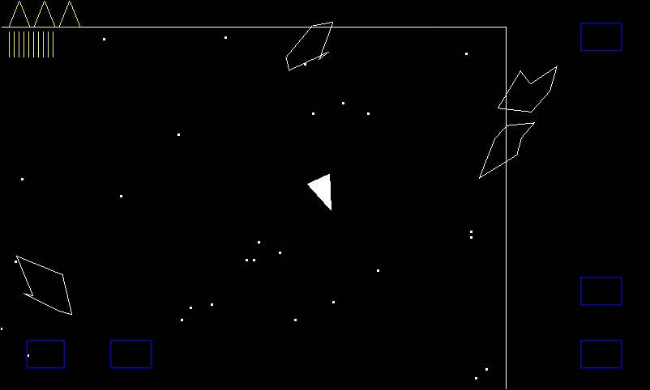

显然，如果我们想要利用我们的生命和陨石计数指示器，那么我们首先需要能够射击小行星，以及在飞船被击中时检测它们。

# 概述

我们在本章中取得了许多成果，实际上简单地添加更多游戏对象也很容易。也许，偶尔会出现像原始街机经典游戏中的 UFO。

在下一章中，我们将利用之前项目中学到的知识来设置碰撞检测并完成游戏。然而，一个具有精确、干净、平滑移动线条的游戏需要比我们迄今为止使用的更精确的碰撞检测。

因此，我们将专注于仅实现精确、高效的碰撞检测，这将使我们的《小行星》模拟器完整。

# 第十一章。碰撞事件——第二部分

这个游戏的碰撞检测比前两个游戏复杂得多。因此，代码将会有很多注释。有时注释会稍微详细或以略不同的方式解释一些内容。

然而，这并不意味着它需要是件苦差事。我们需要做的是花点时间考虑一个对我们有效的策略。

希望到本章结束时，我们的碰撞检测解决方案将看起来很简单。

# 碰撞检测规划

我们试图实现的目标可以分为以下两类：

+   我们对边界的期望：

    +   小行星、子弹和飞船需要知道它们何时与边界发生碰撞

    +   小行星在接触边界时应该反向并返回游戏区域

    +   子弹应该在边界处重置

    +   飞船应该减去一条生命并在中心重生

+   我们对小行星的期望。我们需要知道并响应以下情况：

    +   飞船接触小行星

    +   当子弹接触小行星时

    +   就像原始的《小行星》游戏一样，我们不会对小行星之间的碰撞做出反应

虽然我们不会在小行星碰撞中检测小行星，但你会看到，当我们的碰撞检测接近完成时，实现小行星之间的碰撞检测不会带来太大的额外挑战。然而，它会给设备的 CPU 带来额外的压力。

我们知道我们需要检测边界碰撞上的对象和小行星碰撞上的对象。

## 与边界的碰撞

虽然听起来很明显，但边界只是四条静态的直线。这使得边界碰撞与小行星碰撞成为不同的问题。

我们感兴趣的所有对象都有顶点（或者子弹的情况是一个顶点）。这最初可能表明我们可以简单地从模型空间和存储在`worldLocation`中的对象中心计算每个顶点的世界位置。我们可以这样做，但忽略了小行星和飞船会旋转的事实，这会不断改变所有顶点的实际世界位置。

我们需要翻译和旋转模型空间顶点，然后测试它们是否触碰了边界。我们可以在对象的`update`方法中为每一帧做这件事，但只有在对象非常接近边界时，我们才偶尔需要旋转的坐标。

### 边界碰撞检测的第一阶段

这表明，一个初步检查，碰撞检测的第一阶段，更有效率。它意味着顶点的平移和旋转需要在对象本身之外进行。

我们将使用基于对象中心和其宽度和高度的简单矩形相交检查。如果这个便宜的方法返回一个命中，然后我们将旋转和转换每个顶点，并单独检查它们的实际世界坐标与边界的位置。

一旦计算出了顶点的旋转游戏世界位置，碰撞检测就变得简单了。

```java
if (any point falls outside the border){collision has occurred}
```

正如我们将看到的，对于小行星检测，一个两阶段解决方案是合适的。此外，旋转和转换是涉及的，但它远不那么重要。

## 与小行星碰撞

测试与小行星的碰撞在某些方面是相似的。我们需要找出船或子弹的任何单个顶点是否穿入了由小行星顶点包含的空间。

第一个问题是小行星不仅是一个移动的目标，而且是一个旋转的目标。我们不仅需要旋转和转换所有对象的顶点，还需要小行星。

我们还需要计算小行星上每对顶点之间的线。幸运的是，在这个时候，我们可以依赖一个比我更伟大的数学家设计的巧妙算法。我们将使用交叉数算法。这是它的工作原理。

### 交叉数

我们计算由一对顶点形成的线，并使用交叉数算法来查看测试对象中的特定顶点是否穿过了那条线。如果它确实穿过了，我们将变量从 0 增加到 1。

我们将测试点与来自小行星的每个顶点对形成的每条线进行测试，每次测试时增加我们的变量。如果测试顶点与交叉数算法中的每条线测试后，我们的变量是奇数，我们就有了一个命中。如果是偶数，则没有发生碰撞。

当然，如果没有发生碰撞，我们必须继续测试测试对象中的每一个顶点与由小行星顶点对形成的每一条线的碰撞。

这里是交叉数算法在作用中的视觉表示。

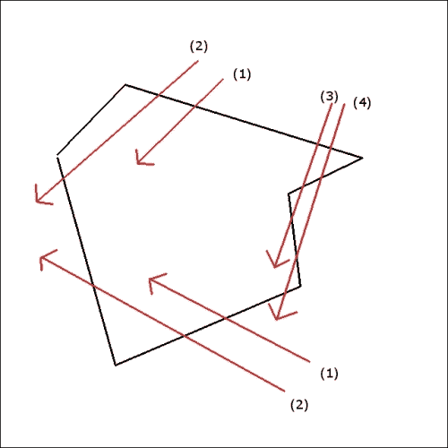

当然，在所有这些复杂的计算进行中，我们肯定会想先进行一个简单的初步测试，看看是否有可能发生了碰撞，然后再进行复杂的测试。

### 边界碰撞检测的第一阶段和概述

当测试单个顶点时，例如子弹、旋转的三角形（如飞船）或旋转的小行星，半径重叠测试非常合适。

这是我们将用于测试与小行星碰撞的整个过程的概述：

1.  被测试物体的半径是否与小行星的半径重叠？

1.  如果是，物体的第一个顶点是否穿过了小行星的第一条线？

1.  如果是，`crossingNumber ++`。

1.  对物体的每条线重复步骤 2。

1.  如果 `crossingNumber` 是奇数，则向调用代码返回 true，因为发生了碰撞。

1.  如果 `crossingNumber` 是偶数，则尚未发生碰撞（重复步骤 2、3 和 4，使用待测试物体的下一个顶点）。

1.  如果所有顶点都已测试并且我们到达这里，那么没有发生碰撞。

我们将设置一个名为 `CD` 的碰撞检测类，其中包含两个静态方法。`detect` 方法将检测与小行星的碰撞，并且会在每一帧中对每一颗小行星与每一颗子弹和飞船进行检测。

`contain` 方法将检查与每个小行星、子弹和飞船的边界的碰撞。

在对象本身之外进行计算意味着我们需要为将要测试的对象以及提供给新 `CD` 类方法的数据准备大量数据。

## 碰撞包类

我们知道我们需要一组数据来正确执行检测。下一个类将保存我们的碰撞检测类方法执行其工作所需的所有数据，并且每个需要检测碰撞的对象都将有一个。

当需要将所有点旋转到其实际位置时，我们的碰撞包需要知道物体面向的方向。我们有一个名为 `facingAngle` 的浮点数。

显然，我们需要一个模型空间顶点的副本。就像旋转的位置一样，我们不会每帧都更新，而只是在第一阶段的碰撞检测显示可能发生碰撞之后才这样做。

我们还将保留包含这些顶点的数组长度的预计算值。这可能在碰撞检测过程中节省时间。

因此，我们还需要物体的世界坐标。这将每帧更新一次。

每个对象都将有一个预计算的 `radius` 变量，这是从物体的中心到其最远顶点的尺寸。这将在我们的 `detect` 方法中用于半径重叠，第一阶段检测。

我们还将有几个 `PointF` 对象，`currentPoint` 和 `currentPoint2`，这些只是方便的对象，将避免我们在两个碰撞检测方法的密集部分可能调用垃圾收集器。

创建一个新的类，命名为 `CollisionPackage`，并实现我们刚刚讨论的成员：

```java
// All objects which can collide have a collision package.
// Asteroids, ship, bullets. The structure seems like slight
// overkill for bullets but it keeps the code generic,
// and the use of vertexListLength means there isn't any
// actual speed overhead. Also if we wanted line, triangle or
// even spinning bullets the code wouldn't need to change.

public class CollisionPackage {

    // All the members are public to avoid multiple calls
    // to getters and setters.

    // The facing angle allows us to calculate the
    // current world coordinates of each vertex using
    // the model-space coordinates in vertexList.
    public float facingAngle;

    // The model-space coordinates
    public PointF[] vertexList;

    /* 
    The number of vertices in vertexList
    is kept in this next int because it is pre-calculated
    and we can use it in our loops instead of
    continually calling vertexList.length.
   */
    public int vertexListLength;

    // Where is the centre of the object?
    public PointF worldLocation;

    /* 
    This next float will be used to detect if the circle shaped
    hitboxes collide. It represents the furthest point
    from the centre of any given object.
    Each object will set this slightly differently.
    The ship will use height/2 an asteroid will use 25
    To allow for a max length rotated coordinate.
   */
    public float radius;

    // A couple of points to store results and avoid creating new
    // objects during intensive collision detection
    public PointF currentPoint = new PointF();
    public PointF currentPoint2 = new PointF();
```

接下来，我们有一个简单的构造函数，它将在每个对象的构造函数结束时接收每个对象所需的所有数据。按照以下方式实现`CollisionPackage`构造函数：

```java
public CollisionPackage(PointF[] vertexList, PointF worldLocation, 
  float radius, float facingAngle){ 

        vertexListLength = vertexList.length;
        this.vertexList = new PointF[vertexListLength];
        // Make a copy of the array

        for (int i = 0; i < vertexListLength; i++) {
            this.vertexList[i] = new PointF();
            this.vertexList[i].x = vertexList[i].x;
            this.vertexList[i].y = vertexList[i].y;
        }

        this.worldLocation = new PointF();
        this.worldLocation = worldLocation;

        this.radius = radius;

        this.facingAngle = facingAngle;

    }

}
```

这就是我们需要用于高级碰撞检测的所有数据。

### 将碰撞包添加到对象中并使其可访问

现在，我们有了我们的`CollisionPackage`类。我们将看到如何为每个需要监控的对象添加一个。

#### 将碰撞包添加到`Bullet`类

打开`Bullet`类，我们将看到如何在最简单的情况下（只是一个点）使用我们的`CollisionPackage`构造函数。为碰撞包添加一个新成员。

在`Bullet`类中添加一个类型为`CollisionPackage`的新成员：

```java
CollisionPackage cp;
```

现在，我们创建一个结构，将其传递给我们的`CollisionPackage`构造函数并初始化碰撞包。注意，我们发送一个包含模型空间坐标的单元素数组，这些坐标将是 0,0,0。然后，我们发送世界位置，1 作为半径和子弹面向的角度。在`Bullet`类构造函数的末尾输入以下代码：

```java
// Initialize the collision package
// (the object space vertex list, x any world location
// the largest possible radius, facingAngle)

// First, build a one element array
PointF point = new PointF(0,0);
PointF[] points = new PointF[1];
points[0] = point;

// 1.0f is an approximate representation 
//of the size of a bullet
cp = new CollisionPackage(points, getWorldLocation(),
1.0f, getFacingAngle());
```

最后，对于`Bullet`类，我们通过在`Bullet`类的`update`方法的末尾添加以下代码来在每一帧更新碰撞包：

```java
        move(fps);

 // Update the collision package
 cp.facingAngle = getFacingAngle();
 cp.worldLocation = getWorldLocation();

```

现在，我们的子弹都已设置好用于检测。

#### 将碰撞包添加到`SpaceShip`类

打开`SpaceShip`类并添加这些成员。然后我们将看到如何在`SpaceShip`构造函数中使用它们：

```java
CollisionPackage cp;

// Next, a 2d representation using PointF of
// the vertices. Used to build shipVertices
// and to pass to the CollisionPackage constructor
PointF[] points;
```

在这里，我们与`Bullet`类相比做了些额外的事情。我们添加了三个额外的模型空间坐标。OpenGL 不会知道这些，也不需要它们。它们位于构成船的每条线的中间。我们这样做是为了使小行星的顶点难以漂移到船内，而船的顶点不在小行星内。这是我们所解决问题的可视化表示。船的顶点被强调以突出问题。请参考以下图表：


我们可以通过测试所有小行星的顶点与船的所有线以及我们计划做的事情来解决此问题；测试船的所有顶点与小行星的所有线。然而，仅仅在船上添加几个额外的点就能产生几乎完美的检测，如下所示：


现在，在`SpaceShip`构造函数中调用`setVertices()`之后立即实现我们刚才讨论的代码：

```java
setVertices(shipVertices);

// Initialize the collision package
// (the object space vertex list, x any world location
// the largest possible radius, facingAngle)

points = new PointF[6];
points[0] = new PointF(- halfW, - halfL);

points[2] = new PointF(halfW, - halfL);
points[4] = new PointF(0, 0 + halfL);

// To make collision detection more accurate we will define some
// more points on the midpoints of all our sides.
// It is possible that the point of an asteroid will pass through
// the side of the ship and we do not test for this!
// We only test for the point of a ship 
// passing through the side of an asteroid!!
// This is computationally cheaper than running both tests.
// Although not as accurate we will see it is very close.
// We can think of this visually as 
// adding extra sensors on the sides of our ship
// Here we use an equation to find the midpoint 
// of a line which you can find an explanation of
// on most good high school math web sites.

points[1] = new PointF(points[0].x + 
 points[2].x/2,(points[0].y + points[2].y)/2);

points[3] = new PointF((points[2].x + points[4].x)/2,
 (points[2].y + points[4].y)/2);

points[5] = new PointF((points[4].x + points[0].x)/2,
 (points[4].y + points[0].y)/2);

cp = new CollisionPackage(points, getWorldLocation(), 
 length/2, getFacingAngle());

}// End SpaceShip constructor
```

接下来，就像我们在`Bullet`类中所做的那样，在`SpaceShip`类的`update`方法中同步碰撞包。我们在调用`move()`更新船的坐标后，在方法的末尾这样做。

```java
move(fps);

 // Update the collision package
 cp.facingAngle = getFacingAngle();
 cp.worldLocation = getWorldLocation();

}// End SpaceShip update()
```

最后，我们将向小行星添加碰撞包。

#### 将碰撞包添加到`Asteroid`类

打开`Asteroid`类并添加一个`CollisionPackage`成员：

```java
CollisionPackage cp;
```

在`Asteroid`构造函数的末尾，在调用`generatePoints()`之后，我们初始化`CollisionPackage`对象：

```java
// Define a random asteroid shape
// Then call the parent setVertices()
generatePoints();

// Initialize the collision package
// (the object space vertex list, x any world location
// the largest possible radius, facingAngle)
cp = new CollisionPackage
 (points, getWorldLocation(), 25, getFacingAngle());

```

接下来，我们添加一个辅助方法，当检测到碰撞时，它会反转移动方向并将陨石弹回几个像素。当我们检测到与边界的碰撞时，我们将调用这个方法。将`bounce`方法添加到`Asteroid`类中：

```java
public void bounce(){

  // Reverse the travelling angle
    if(getTravellingAngle() >= 180){
      setTravellingAngle(getTravellingAngle()-180);
     }else{
      setTravellingAngle(getTravellingAngle() + 180);
    }

    // Reverse velocity because occasionally they get stuck
    setWorldLocation((getWorldLocation().x + -getxVelocity()/3), (getWorldLocation().y + -getyVelocity()/3));

    // Speed up by 10%
    setSpeed(getSpeed() * 1.1f);

    // Not too fast though
    if(getSpeed() > getMaxSpeed()){
      setSpeed(getMaxSpeed());

}
```

与`SpaceShip`和`Bullet`类一样，我们将在`update`方法的末尾调用`move`之后更新碰撞包：

```java
move(fps);

// Update the collision package
cp.facingAngle = getFacingAngle();
cp.worldLocation = getWorldLocation();

}
```

现在，我们需要做一些对于其他类来说不需要做的事情。我们的交叉数算法使用的是线而不是顶点，因此我们需要通过将其与第一个顶点连接来制作一条线。由于我们的碰撞数据代码的工作方式，我们不需要对`SpaceShip`类做这件事。碰撞数据代码将测试子弹和飞船的点与陨石的线，而不是反过来。

这是添加到`generatePoints`方法第七点的额外代码。在下面的代码中，我包括了新高亮代码两侧的现有代码：

```java
// left below 0
points[5] = new PointF();
i = -(r.nextInt(14)+11);
points[5].x =  i;
i = -(r.nextInt(12)+1);

points[5].y = i;

// We add on an extra point that we won't use in asteroidVertices[].
// The point is the same as the first. 
// This is because the last vertex
// links back to the first to create a line. 
// This line will need to be
// used in calculations when we do our collision detection.

// Here is the extra vertex- same as the first.
points[6] = new PointF();
points[6].x = points[0].x;
points[6].x = points[0].x;

// Now use these points to draw our asteroid
float[] asteroidVertices = new float[]{
// First point to second point
points[0].x, points[0].y, 0,
points[1].x, points[1].y, 0,
```

现在，我们可以讨论构建碰撞检测类本身了。

## CD 类概要

现在，我们将实现碰撞检测的第一阶段。正如讨论的那样，我们将使用的算法计算量很大，我们只想在存在实际碰撞可能性的情况下使用它们。

因此，我们将使用第三章中讨论的半径重叠方法，即 Tappy Defender – Taking Flight，检查每一颗子弹和飞船与每一颗陨石之间的碰撞。我们将使用简化的矩形交集方法检查陨石、飞船和子弹与边界之间的碰撞。

在接下来的两个部分之后，你实际上将能够玩游戏，但你将看到我们迄今为止使用的碰撞检测的基本方法对于这种类型的游戏来说还不够令人满意。

这些初步检查将决定我们是否继续进行更精确且计算量更大的检查。

我们将在“精确碰撞检测与边界”和“精确碰撞检测与陨石”这两个部分实现这些第二阶段的检查，这些部分将使用更高级的算法，并充分利用我们的碰撞包中的数据。

要开始，创建一个新的类，并将其命名为`CD`。添加一个`PointF`成员对象并初始化它。我们将在代码的关键部分使用它来避免创建新的对象。

```java
private static PointF rotatedPoint = new PointF();
```

现在，让我们讨论这些方法。

### 实现陨石和飞船的半径重叠

让我们把第一个方法添加到`CD`类中，用于检测子弹和陨石之间的碰撞，以及飞船和陨石之间的碰撞。正如我们讨论的那样，我们现在只实现这个方法的第一部分。以下是半径重叠代码的实现。

代码通过构建一个假设的缺失一边的三角形，然后使用毕达哥拉斯定理来计算两个物体中心点之间的距离，即缺失的一边。如果两个物体的总半径大于两个物体中心点之间的距离，我们就有一个重叠。

添加带有半径重叠代码的 `detect` 方法。注意，如果半径重叠，我们返回 `true`。这一行代码将在本章后面替换为更精确的检测。

```java
public static boolean detect(CollisionPackage cp1, 
    CollisionPackage cp2) {

    boolean collided = false;

   // Check circle collision between the two objects

   // Get the distance of the two objects from
   // the centre of the circles on the x axis
   float distanceX = (cp1.worldLocation.x)
        - (cp2.worldLocation.x);

   // Get the distance of the two objects from
   // the centre of the circles on the y axis
   float distanceY = (cp1.worldLocation.y)
        - (cp2.worldLocation.y);

        // Calculate the distance between the center of each circle
        double distance = Math.sqrt
            (distanceX * distanceX + distanceY * distanceY);

        // Finally see if the two circles overlap
        // If they do it is worth doing the more intensive
        // and accurate check.
        if (distance < cp1.radius + cp2.radius) {

         // Log.e("Circle collision:","true");
         // todo  Eventually we will add the 
         // more accurate code here
         // todo and delete the line below.

            collided = true;
        }

        return collided;
    }
```

现在，让我们讨论边界。

### 实现边界的矩形相交

我们将检查是否有小行星、子弹或飞船需要被包含在边界内。如前所述，我们将执行一个简单的矩形相交测试，并在检测到时返回 `true`。稍后，我们将删除返回 `true` 并添加更复杂的代码。

按照下面的示例实现 `contain` 方法：

```java
// Check if anything hits the border
public static boolean contain(float mapWidth, float mapHeight,                                              
  CollisionPackage cp) {

   boolean possibleCollision = false;

    // Check if any corner of a virtual rectangle
    // around the centre of the object is out of bounds.
    // Rectangle is best because we are testing 
    // against straight sides (the border)
    // If it is we have a possible collision.

    if (cp.worldLocation.x - cp.radius < 0) {
            possibleCollision = true;
        } else if (cp.worldLocation.x + cp.radius > mapWidth) {
            possibleCollision = true;
        } else if (cp.worldLocation.y - cp.radius < 0) {
            possibleCollision = true;
        } else if (cp.worldLocation.y + cp.radius > mapHeight) {
            possibleCollision = true;
        }

        if (possibleCollision) {
            // todo For now we return true
            return true;
        }

        return false; // No collision
}
```

现在，我们有两个方法，我们只需要在所有适当的对象组合上调用它们。

# 执行检查

我们离能够玩我们的游戏已经很近了，尽管碰撞检测是简化的。首先添加一些处理检测到某些碰撞时会发生什么的方法，然后看看我们如何实际使用我们的 `CD` 类。

## 辅助方法

首先，我们需要一些辅助方法来响应，当我们检测到各种类型的碰撞时。

我们需要一个方法来处理当飞船被摧毁时的情况，以及当小行星被摧毁时的情况。接下来的两个小节将涵盖这一点。

### 摧毁一艘船

飞船的死亡可以在两个地方检测到，因此添加一个处理后续事件的方法是有意义的。在下一个方法中，我们将飞船的位置重置为地图中心，播放声音，并减少 `numLives`。

如果 `numLives` 等于零，将 `levelNumber` 重置为一，将 `numLives` 设置为三，调用 `createObjects()` 重新绘制一个关卡，暂停游戏，然后播放一个适合让玩家知道他正在重新开始的声音。

现在，将 `lifeLost` 方法添加到 `AsteroidsRenderer` 类中：

```java
public void lifeLost(){
        // Reset the ship to the center
        gm.ship.setWorldLocation(gm.mapWidth/2, gm.mapHeight/2);
        // Play a sound
        sm.playSound("shipexplode");

        // Deduct a life
        gm.numLives = gm.numLives -1;

        if(gm.numLives == 0){
            gm.levelNumber = 1;
            gm.numLives = 3;
            createObjects();
            gm.switchPlayingStatus();
            sm.playSound("gameover");
        }
    }
```

我们将处理小行星死亡时会发生什么。

### 摧毁一个小行星

当飞船或子弹击中小行星时，将调用此方法。首先，我们将触发碰撞的小行星设置为 `setActive(false)`。它将不再被绘制或更新。

接下来，我们播放一个声音并减少 `numAsteroidsRemaining`。最后，如果 `numAsteroidsRemaining` 等于零，玩家已经清空了一个整个关卡。在这种情况下，我们增加 `levelNumber` 和 `numLives`，播放胜利的声音，并通过调用 `createObjects()` 开始一个更难的关卡。

现在，将 `destroyAsteroid()` 方法添加到 `AsteroidsRenderer` 类中：

```java
public void destroyAsteroid(int asteroidIndex){

  gm.asteroids[asteroidIndex].setActive(false);
     // Play a sound
     sm.playSound("explode");
     // Reduce the number of active asteroids
     gm.numAsteroidsRemaining --;

     // Has the player cleared them all?
     if(gm.numAsteroidsRemaining == 0){
     // Play a victory sound

     // Increment the level number
     gm.levelNumber ++;

     // Extra life
     gm.numLives ++;

     sm.playSound("nextlevel");
     // Respawn everything
     // With more asteroids
     createObjects();

}
}
}// End class
```

我们现在可以调用我们新的 `CD` 类的静态方法，并在检测到碰撞时做出响应。

## 在 update() 中测试碰撞

首先，我们将检查飞船是否需要包含。我们只需使用`mapWidth`、`mapHeight`和飞船的碰撞包调用`CD.contain()`。如果有碰撞，代码将调用`lifeLost()`。

在`update`方法中更新对象的所有代码之后添加碰撞检测代码：

```java
// End of all updates!!

// All objects are in their new locations
// Start collision detection

// Check if the ship needs containing
if (CD.contain(gm.mapWidth, gm.mapHeight, gm.ship.cp)) {

  lifeLost();

}
```

这是检测是否有任何小行星试图离开小行星模拟器的代码。它的工作方式与之前的代码块完全相同，只是我们遍历每个小行星，检查它是否活跃，并在检测到碰撞时在小行星上调用`bounce`。

```java
// Check if an asteroid needs containing
for (int i = 0; i < gm.numAsteroids; i++) {
  if (gm.asteroids[i].isActive()) {
       if (CD.contain(gm.mapWidth, gm.mapHeight, 
       gm.asteroids[i].cp)) {

          // Bounce the asteroid back into the game
          gm.asteroids[i].bounce();

          // Play a sound
          sm.playSound("blip");

       }
    }

}
```

子弹的代码看起来有点复杂，但实际上并不复杂。对`CD.contain()`的调用是相同的，我们为每个子弹都这样做。然而，为了使子弹在离开视口（如果是在边界之前）时重置，需要进行一些最后的游戏平衡，否则飞船可以绕着转并从远处摧毁小行星。

输入检测子弹与边界和视口边缘碰撞的代码：

```java
// Check if bullet needs containing
// But first see if the bullet is out of sight
// If it is reset it to make game harder
for (int i = 0; i < gm.numBullets; i++) {

    // Is the bullet in flight?
    if (gm.bullets[i].isInFlight()) {

   // Comment the next block to make the game easier!!!
   // It will allow the bullets to go all the way from
   // ship to border without being reset. 
   // These lines reset the bullet when
   // shortly after they leave the players view.
   // This forces the player to go 'hunting' for the
   // asteroids instead of spinning round spamming the
   // fire button...
   // This code would be better with a viewport.clip() method
   // like in project 2 but seems a bit excessive just for these
   // few 15ish lines of code.

   // Start comment out to make easier
   handyPointF = gm.bullets[i].getWorldLocation();
   handyPointF2 = gm.ship.getWorldLocation();

   if(handyPointF.x > handyPointF2.x + gm.metresToShowX / 2){
        // Reset the bullet
        gm.bullets[i].resetBullet(gm.ship.getWorldLocation());

    }else
        if(handyPointF.x < handyPointF2.x - gm.metresToShowX / 2){
            // Reset the bullet
            gm.bullets[i].resetBullet(gm.ship.getWorldLocation());

        }else
        if(handyPointF.y > handyPointF2.y + gm.metresToShowY/ 2){
            // Reset the bullet
            gm.bullets[i].resetBullet(gm.ship.getWorldLocation());
       }else
        if(handyPointF.y < handyPointF2.y - gm.metresToShowY / 2){
            // Reset the bullet
            gm.bullets[i].resetBullet(gm.ship.getWorldLocation());
                }
            // End comment out to make easier

            // Does bullet need containing?
            if (CD.contain(gm.mapWidth, gm.mapHeight,      
                gm.bullets[i].cp)) {

                 // Reset the bullet
                 gm.bullets[i].resetBullet
                    (gm.ship.getWorldLocation());
                 // Play a sound
                 sm.playSound("ricochet");
          }

     }

}
```

你现在可以运行游戏，看看`CD.contain()`方法如何很好地将所有内容保持在小行星模拟器内。

我们将调用`detect`方法来查看是否有任何东西撞到小行星。

首先，检查子弹。注意，在我们麻烦`CD.detect`方法之前，我们进行初步检查以确保子弹在飞行中，并且小行星是活跃的。然后，我们只需传入两个碰撞包，`CD.detect`就会完成剩余的工作。如果子弹与边界碰撞，我们就在适当的子弹上调用`resetBullet()`。

```java
// Now we see if anything has hit an asteroid

// Check collisions between asteroids and bullets
// Loop through each bullet and asteroid in turn

for (int bulletNum = 0; bulletNum < gm.numBullets; bulletNum++) {
    for (int asteroidNum = 0; asteroidNum < gm.numAsteroids;                            
        asteroidNum++) {

        // Check that the current bullet is in flight
        // and the current asteroid is 
        // active before proceeding
        if (gm.bullets[bulletNum].isInFlight() &&                                           
            gm.asteroids[asteroidNum].isActive())

            // Perform the collision checks by 
            // passing in the collision packages

            // A Bullet only has one vertex. 
            // Our collision detection works on vertex pairs

          if (CD.detect(gm.bullets[bulletNum].cp,                                           
              gm.asteroids[asteroidNum].cp)) {

                // If we get a hit...
                destroyAsteroid(asteroidNum);

                // Reset the bullet
                gm.bullets[bulletNum].resetBullet
                    (gm.ship.getWorldLocation());
           }

    }
}
```

现在，我们测试飞船。如果检测到碰撞，我们调用`destroyAsteroid()`然后调用`lifeLost()`。

```java
// Check collisions between asteroids and ship
// Loop through each asteroid in turn

for (int asteroidNum = 0; asteroidNum < gm.numAsteroids;                            
     asteroidNum++) {

    // Is the current asteroid active before proceeding
    if (gm.asteroids[asteroidNum].isActive()) {

        // Perform the collision checks by
        // passing in the collision packages
        if (CD.detect(gm.ship.cp, gm.asteroids[asteroidNum].cp)) {

        // hit!
        destroyAsteroid(asteroidNum);
        lifeLost();
       }
    }
}
```

到目前为止，你可以玩游戏，我们的基本碰撞检测将工作。然而，如果飞得太靠近小行星，你会在不接触它或仅射击子弹的情况下失去生命。我们需要能够擦过边界或小行星的表面，并且只有在实际点进入另一个对象的精确空间时才得分。

# 与边界的精确碰撞检测

为了升级我们的`detect`方法，我们需要将`if(possibleCollision)`块中的返回语句替换为更精确的检测代码。

首先，将`radianAngle`初始化为对象面向的方向的弧度等效值（以度为单位）。`Math`类使用弧度，因为它们在计算中比容易可视化的度数测量更有数学意义。

变量`cosAngle`和`sinAngle`正如其名，用于跟随此代码块的代码块中。

### 小贴士

值得注意的是，`Math.cos()`和`Math.sin()`方法相对耗时。我们可以通过预先计算`sin`和`cos`的 360 个值，然后使用简单的查找方法来代替这个计算，从而加快我们的碰撞检测类。

然而，我们仍然保持每秒超过 60 帧的目标，所以在这里不要这样做。

删除返回语句，并在`if(possibleCollision)`块中添加以下代码：

```java
if (possibleCollision) {

 double radianAngle = ((cp.facingAngle/180)*Math.PI);
 double cosAngle = Math.cos(radianAngle);
 double sinAngle = Math.sin(radianAngle);

```

在下一块代码中，输入一个`for`循环，该循环遍历对象的每个顶点，将它们从模型空间坐标转换为世界空间坐标，然后使用我们之前计算出的`facingAngle`对象的余弦和正弦值来将它们旋转到游戏世界中的精确位置。

```java
    //Rotate each and every vertex then check for a collision
    // If just one is then we have a collision.
    // Once we have a collision no need to check further
    for (int i = 0 ; i < cp.vertexListLength; i++){
        // First update the regular un-rotated model space coordinates
        // relative to the current world location (centre of object)
        float worldUnrotatedX = 
                cp.worldLocation.x + cp.vertexList[i].x;

        float worldUnrotatedY =  
                cp.worldLocation.y + cp.vertexList[i].y;

        // Now rotate the newly updated point, stored in currentPoint
        // around the centre point of the object (worldLocation)
        cp.currentPoint.x = cp.worldLocation.x + (int)                                   
            ((worldUnrotatedX - cp.worldLocation.x)
            * cosAngle - (worldUnrotatedY - cp.worldLocation.y)
            * sinAngle);

        cp.currentPoint.y = cp.worldLocation.y + (int)                                   
            ((worldUnrotatedX - cp.worldLocation.x)
            * sinAngle+(worldUnrotatedY - cp.worldLocation.y)
            * cosAngle);
```

现在我们所做的只是检查旋转并转换后的顶点是否落在边界/地图的左侧、右侧、顶部或底部之外。如果是，我们返回`true`；如果不是，循环继续以相同的方式检查每个顶点（转换、旋转、检查等）。

```java
     // Check the rotated vertex for a collision
     if (cp.currentPoint.x < 0) {

       return true;
     } else if (cp.currentPoint.x > mapWidth) {

       return true;
     } else if (cp.currentPoint.y < 0) {

       return true;
     } else if (cp.currentPoint.y > mapHeight) {

       return true;
   }

}
```

你现在可以运行游戏，并观看子弹满意地砰然撞入边界或驾驶你的飞船危险地靠近边界。

让我们改进我们的小行星碰撞。

# 与小行星的精确碰撞检测

我们这样做是因为有一个更复杂的最后一步。就像在边界检测中一样，我们需要转换和旋转我们的对象的顶点。然而这次，我们需要为两个对象都这样做。

此外，一旦我们旋转并转换了小行星的顶点，我们还需要以顶点对的形式处理它们，这些顶点对形成了一条线。这些是我们将测试每个顶点与其他对象每个顶点的线。这个测试当然是我们之前讨论的交叉数方法。

我们需要在`if (distance < cp1.radius + cp2.radius) { ...}`的主体中完成所有这些，我们之前只是将`collided`布尔值设置为`true`。

代码量相当大，所以我们将它分成几块，看看每个阶段发生了什么。此外，代码缩进并不总是从块到块保持一致，以便以最可读的方式格式化。

接下来的几块代码是上述需要替换的`if`块的全部内容。

### 小贴士

如前所述，我们也可以在这里使用正弦和余弦查找表。

我们可以创建一个方法来旋转角度，因为我们经常这样做。但这并不像看起来那么简单。如果我们把旋转代码放在方法中，我们可能不得不在它里面放以下正弦和余弦计算，这将使它变慢，或者在我们调用方法之前和`for`循环之前预先计算它，这本身也是一种不太整洁的做法。

此外，如果你考虑我们需要一个角度的正弦和余弦值超过一个，那么这个方法需要*知道*使用哪个值，这并不是什么火箭科学，但它开始变得比我们最初想象的还要紧凑。因此，我选择完全避免方法调用，即使代码有点零散。实际上，如果你把所有这些都放在方法调用中，你仍然可以在旧 Galaxy S2 手机上获得近 60 FPS。所以如果你想整理一下，那就去做吧；我只是觉得讨论为什么我这样做是有价值的。

在我们跳入`for`循环之前，就像我们在边界检测中做的那样，我们将计算一些在整个方法执行期间不会改变的事情。即从两个碰撞包中的每个碰撞包面对角度的正弦和余弦值。

```java
     if (distance < cp1.radius + cp2.radius) {

            double radianAngle1 = ((cp1.facingAngle / 180) * Math.PI);
            double cosAngle1 = Math.cos(radianAngle1);
            double sinAngle1 = Math.sin(radianAngle1);

            double radianAngle2 = ((cp2.facingAngle / 180) * Math.PI);
            double cosAngle2 = Math.cos(radianAngle2);
            double sinAngle2 = Math.sin(radianAngle2);

            int numCrosses = 0;    // The number of times we cross a side

            float worldUnrotatedX;
            float worldUnrotatedY;
```

现在，我们遍历`cp2`中的所有顶点，然后依次将每个顶点与`cp1`中的所有边（顶点对）进行测试。记住，陨石有一个额外的填充顶点，它与第一个顶点相同。因此，我们可以测试陨石的最后一侧。在调用`CD.detect()`时，我们必须始终将陨石碰撞包作为第二个参数传递。

在下一块代码中，我们将测试对象相对于陨石进行平移和旋转。

```java
for (int i = 0; i < cp1.vertexListLength; i++) {

    worldUnrotatedX = cp1.worldLocation.x + cp1.vertexList[i].x;
    worldUnrotatedY = cp1.worldLocation.y + cp1.vertexList[i].y;

    // Now rotate the newly updated point, stored in currentPoint
    // around the centre point of the object (worldLocation)
    cp1.currentPoint.x = cp1.worldLocation.x +
        (int) ((worldUnrotatedX - cp1.worldLocation.x)
        * cosAngle1 - (worldUnrotatedY - cp1.worldLocation.y) *
        sinAngle1);

    cp1.currentPoint.y = cp1.worldLocation.y + 
        (int) ((worldUnrotatedX - cp1.worldLocation.x)
        * sinAngle1 + (worldUnrotatedY - cp1.worldLocation.y) *                   
         cosAngle1);

    // cp1.currentPoint now hold the x/y 
    // world coordinates of the first point to test
```

现在每次使用一对顶点，从陨石中平移和旋转，使其到达最终的世界空间坐标，为下一块代码做准备，我们将使用上一块和这一块中计算出的顶点位置。

```java
// Use two vertices at a time to represent the line we are testing
// We don't test the last vertex because we are testing pairs
// and the last vertex of cp2 is the padded extra vertex.
// It will form part of the last side when we test vertexList[5]

for (int j = 0; j < cp2.vertexListLength - 1; j++) {

    // Now we get the rotated coordinates of 
    // BOTH the current 2 points being
    // used to form a side from cp2 (the asteroid)
    // First we need to rotate the model-space 
    // coordinate we are testing
    // to its current world position
    // First update the regular un-rotated model space coordinates
    // relative to the current world location (centre of object)

    worldUnrotatedX = cp2.worldLocation.x + cp2.vertexList[j].x;
    worldUnrotatedY = cp2.worldLocation.y + cp2.vertexList[j].y;

    // Now rotate the newly updated point, stored in worldUnrotatedX/y
    // around the centre point of the object (worldLocation)

    cp2.currentPoint.x = cp2.worldLocation.x + 
          (int) ((worldUnrotatedX - cp2.worldLocation.x)
          * cosAngle2 - (worldUnrotatedY - cp2.worldLocation.y) *                   
          sinAngle2);

    cp2.currentPoint.y = cp2.worldLocation.y + 
          (int) ((worldUnrotatedX - cp2.worldLocation.x)
          * sinAngle2 + (worldUnrotatedY - cp2.worldLocation.y) *                   
          cosAngle2);

    // cp2.currentPoint now hold the x/y world coordinates
    // of the first point that
    // will represent a line from the asteroid

    // Now we can do exactly the same for the 
    // second vertex and store it in
    // currentPoint2\. We will then have a point and a line (two 
    // vertices)we can use the
    // crossing number algorithm on.

    worldUnrotatedX = cp2.worldLocation.x + cp2.vertexList[i + 1].x;
    worldUnrotatedY = cp2.worldLocation.y + cp2.vertexList[i + 1].y;

    // Now rotate the newly updated point, stored in worldUnrotatedX/Y
    // around the centre point of the object (worldLocation)
    cp2.currentPoint2.x = cp2.worldLocation.x + 
          (int) ((worldUnrotatedX - cp2.worldLocation.x)
          * cosAngle2 - (worldUnrotatedY - cp2.worldLocation.y) *                   
          sinAngle2);

    cp2.currentPoint2.y = cp2.worldLocation.y + 
          (int) ((worldUnrotatedX - cp2.worldLocation.x)
          * sinAngle2 + (worldUnrotatedY - cp2.worldLocation.y) *                   
           cosAngle2);
```

在这里，我们检测当前顶点（无论是飞船还是子弹）是否跨越了由当前顶点对形成的陨石线。如果是，我们增加`numCrosses`。

```java
// And now we can test the rotated point from cp1 against the
// rotated points which form a side from cp2

if (((cp2.currentPoint.y > cp1.currentPoint.y) !=                               
       (cp2.currentPoint2.y > cp1.currentPoint.y)) &&
       (cp1.currentPoint.x < (cp2.currentPoint2.x -                                
     cp2.currentPoint2.x)    *(cp1.currentPoint.y - 
        cp2.currentPoint.y) / (cp2.currentPoint2.y  -                               
  cp2.currentPoint.y) + cp2.currentPoint.x)){

        numCrosses++;

}
```

最后，我们使用模运算符来确定`numCrosses`是奇数还是偶数。如前所述，对于奇数我们返回`true`（碰撞），对于偶数返回`false`（无碰撞）。

```java
            }
            }
            // So do we have a collision?
            if (numCrosses % 2 == 0) {
                // even number of crosses(outside asteroid)
                collided = false;
            } else {
                // odd number of crosses(inside asteroid)
                collided = true;
            }

        }// end if
```

现在，你可以将你的飞船开到陨石旁边，只有在真正看起来你应该被击中时才会被击中。请参考以下截图：

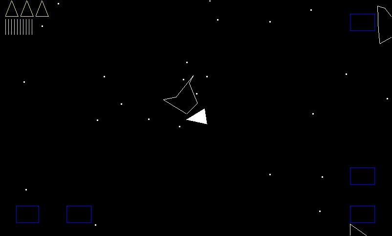

现在，我们的碰撞检测和 Asteroids 模拟游戏已经完成了！

# 最后的修饰

我们可以继续改进我们的游戏。例如，当当前小行星被摧毁时，生成两个或三个更小的陨石并不太难。我们只需要一个数组来存储这些较小的陨石。当我们停用常规陨石时，该数组会在常规陨石相同的位置激活一些之前实例化的较小陨石。然后我们可以对计算陨石数量的方式做一些小的修改，这样我们就会有一个整洁的新功能。

休闲游戏经典《小行星》有一个平均水平的 UFO 偶尔会出现。设计一个由线条组成的 UFO 形状很简单，并且它可以随机从左到右或从右到左移动，同时上下移动一点。

最后，我们可以添加一个超空间按钮。这是玩家在确信死亡即将到来时的最后手段。点击超空间按钮，飞船将在一个随机位置重生。我们只需要在`InputController`类中的数组中添加一个按钮，并在`Ship`类中调用一个新的简单`randomHyperspaceJump`方法。

我们还可以添加 Google Play 成就和排行榜，然后发布游戏。如果你发布一个使用 OpenGL 的游戏，你需要在`AndroidManifest.xml`文件中添加以下声明：

```java
<uses-feature android:glEsVersion="0x00020000" android:required="true" />
```

尝试添加我们讨论的一些改进，也许还可以添加一些你自己的想法。无论你是否发布你的游戏，我都非常乐意听到你的想法或看到你项目链接到[gamecodeschool.com](http://gamecodeschool.com)。

我认为我们完成了！

# 摘要

我希望你喜欢我们这次快速浏览，制作 Android 游戏，并希望你能继续制作许多新游戏！
