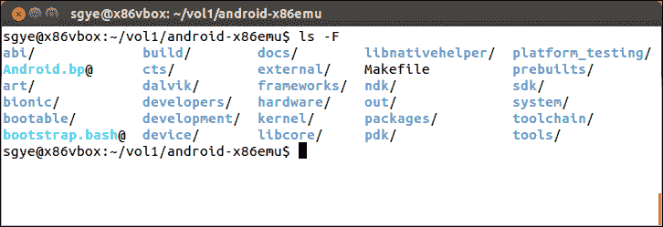
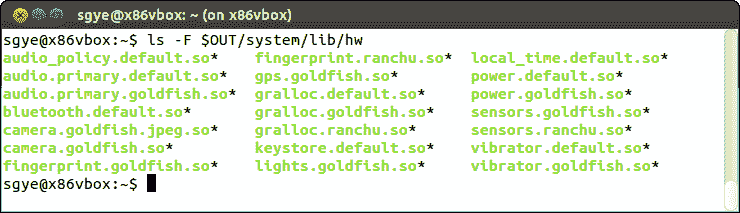
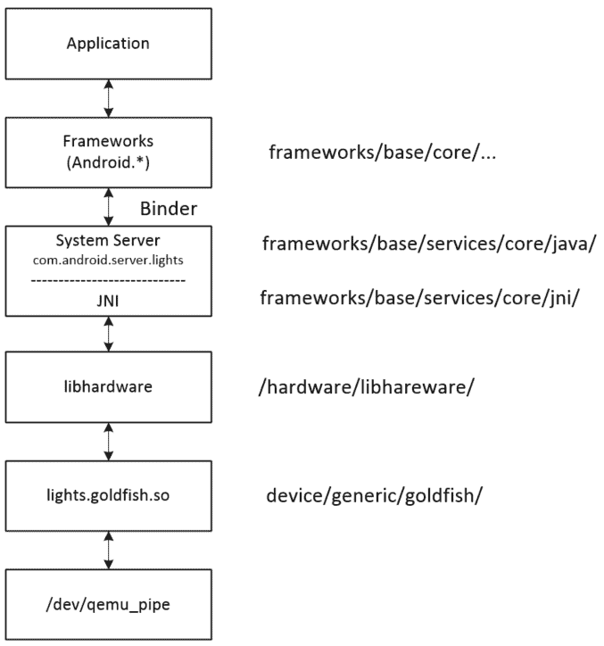
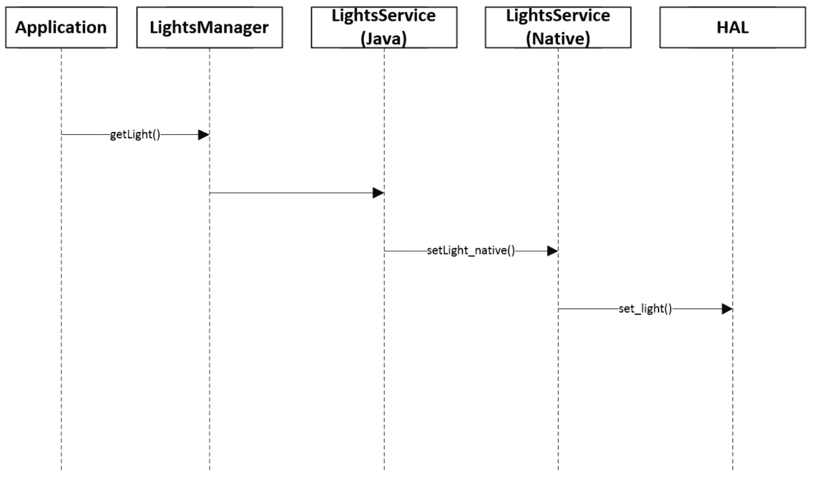
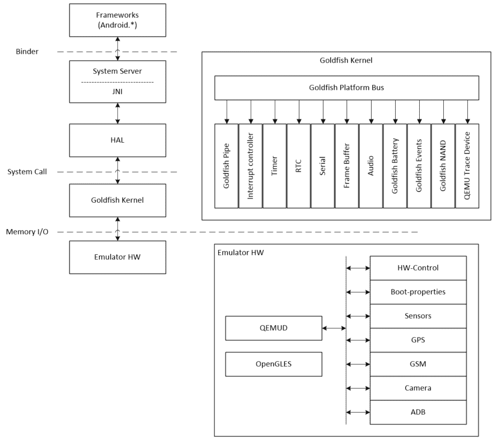

# 第三章：发现内核、HAL 和虚拟硬件

一旦我们设置了开发环境并准备好了可用的源代码，我们就可以更深入地探索 Android 系统架构。我们首先将查看 AOSP 源代码树。之后，我们将研究本书中将使用的虚拟硬件平台。基于我们对虚拟硬件的理解，我们将查看与系统定制相关的层。在本章中，我们将涵盖以下主题：

+   使用 goldfish 灯光服务对 Android HAL 进行深度分析

+   查看 goldfish 的硬件规范

+   goldfish 内核中 QEMU 管道实现的概述

# AOSP 内部有什么？

在我们深入细节之前，让我们再次查看 AOSP 源代码树的顶层：



以下表格简要描述了每个文件夹。我们将在本书中查看其中的一些：

| **目录** | **描述** |
| --- | --- |
| `packages` | 库存 Android 应用程序。 |
| `libcore` | 核心 Java 库。Nougat 之前使用 Apache Harmony。Nougat 使用 OpenJDK。Nougat 中使用了 Java 8 的一些功能。 |
| `frameworks/*` | Android 框架核心组件。 |
| `frameworks/base/services` | Android 系统服务。 |
| `art` | Android 运行时。 |
| `dalvik` | Dalvik 虚拟机。 |
| `libnativehelper` | 与 JNI 一起使用的辅助函数。 |
| `system/*` | 原生服务和库。 |
| `system/core` | 启动 Android 所需的最小 Linux 系统。 |
| `bionic` | C 库。 |
| `external` | 导入到 AOSP 的外部项目。它包括 HAL 层和系统服务。 |
| `hardware` | HAL 和硬件库。 |
| `device` | 设备特定的文件和组件。 |
| `bootable` | 恢复和引导加载程序。 |
| `abi` | 最小 C++运行时类型信息支持。 |
| `build` | 构建系统和 Makefiles。 |
| `sdk` | Android SDK。 |
| `cts` | 兼容性测试套件。 |
| `development` | 开发工具。 |
| `ndk` | Android NDK。 |
| `tools` | 各种 IDE 工具。 |
| `prebuilts` | 预构建的镜像和二进制文件。 |

对于特定的模块或组件，我们可能需要深入多个子文件夹的多个层级来了解其中包含的内容。这对于`frameworks`、`system`和`external`文件夹尤其如此。`frameworks`中的子文件夹包含 Android 框架层代码，但 Android 系统服务也位于`frameworks/base/services`中，我们将在本节稍后查看它们。`system`和`external`文件夹中的内容也是如此。

# Android 模拟器 HAL

我们在第二章“设置开发环境”中构建了 Android 模拟器。为了对 Android 模拟器 HAL 有一个概览，我们可以查看以下`$OUT/system/lib/hw`文件夹：



我们可以看到有一系列共享库。这些都是 goldfish HAL 的共享库。上述共享库的源代码可以在`device/generic/goldfish`文件夹中找到。下表显示了共享库、设备节点和硬件模块之间的关系：

| **硬件** | **设备** | **库 (HAL)** |
| --- | --- | --- |
| `audio` | `/dev/eac` | `audio.primary.goldfish.so` |
| `camera` | `/dev/qemu_pipe` | `camera.goldfish.jpeg.so` `camera.goldfish.so` |
| `fingerprint` | `/dev/qemu_pipe` | `fingerprint.goldfish.so` |
| `gps` | `/dev/qemu_pipe` | `gps.goldfish.so` |
| `lights` | `/dev/qemu_pipe` | `lights.goldfish.so` |
| `power` | `/dev/qemu_pipe` | `power.goldfish.so` |
| `sensors` | `/dev/qemu_pipe` | `sensors.goldfish.so` |
| `vibrator` | `/dev/qemu_pipe` | `vibrator.goldfish.so` |
| `graphics` | `/dev/qemu_pipe` | `gralloc.goldfish.so` |
| `serial` | `/dev/ttyS[0 - 2]` | 简单设备不需要单独的共享库 |

从前表可以看出，除了串行端口和音频外，所有其他硬件模块都使用设备节点`/dev/qemu_pipe`与内核通信。QEMU 管道设备在模拟设备和 Android 模拟器之间提供了一个桥梁。由于 QEMU 管道是模拟器的重要设备，我们将在本章后面介绍它。

通常，HAL 实现是一个共享库，它将在运行时由系统服务加载。实际上，当决定实际实现时，它取决于硬件本身的复杂性。例如，对于像串行端口这样的简单硬件，没有单独的共享库。串行端口的系统服务实现直接访问设备节点。

对于更复杂的硬件设备，例如图形设备，还有一个在后台运行的专用守护进程 SurfaceFlinger，以及与之相关的多个共享库。

在本章中，我们将分析 goldfish 设备的 HAL，并以此为例了解框架、系统服务器和 HAL 实现之间的关系。然后，我们将介绍 goldfish 设备的硬件接口。最后，我们将分析 goldfish 内核中的 QEMU 管道实现。

# 调用序列

我们将以灯光硬件接口为例，解释 HAL、系统服务和硬件管理器是如何协同工作的。



灯光 HAL、系统服务和硬件管理器

如前图所示，当应用程序想要访问硬件资源时，它首先需要获取硬件管理器的一个实例。对于 goldfish 灯光，应用程序中的代码可能如下所示：

```java
LightsManager lights =  
LocalServices.getService(LightsManager.class); 
mBacklight = lights.getLight(LightsManager.LIGHT_ID_BACKLIGHT); 
mBacklight.setBrightness(brightness); 

```

硬件管理器与系统服务通信以获取硬件访问权限。通常，硬件管理器是用 Java 实现的。由于硬件管理器和系统服务在不同的进程空间中运行，它通过 binder 接口调用系统服务。系统服务的上层也是用 Java 实现的。在系统服务接收到请求后，它将使用 JNI 调用 HAL 库，因为 HAL 通常是用 C 或 C++实现的。



灯光服务的调用序列

前面的图示显示了当应用程序想要更改设备上的灯光时的调用序列。在本节中，我们将使用自下而上的方法来查看从 HAL 到应用程序层的调用序列。

# 金鱼灯 HAL

goldfish 灯光 HAL 实现可以在`$AOSP/device/generic/goldfish/lights`文件夹中找到。要实现 HAL 层，硬件供应商通常需要实现以下三个数据结构：

```java
struct hw_module_t; 
struct hw_module_methods_t; 
struct hw_device_t; 

```

所有的前三个数据结构都在 goldfish 的`lights_qemu.c`文件中实现。在 HAL 实现中，我们首先需要定义名为`HAL_MODULE_INFO_SYM`的`struct hw_module_t`，如下所示。这将在系统中注册硬件模块 ID `LIGHTS_HARDWARE_MODULE_ID`。之后，灯光系统服务可以使用`hw_get_module`函数获取该模块：

```java
/* 
 * The emulator lights Module 
 */ 
struct hw_module_t HAL_MODULE_INFO_SYM = { 
    .tag = HARDWARE_MODULE_TAG, 
    .version_major = 1, 
    .version_minor = 0, 
    .id = LIGHTS_HARDWARE_MODULE_ID, 
    .name = "Goldfish lights Module", 
    .author = "The Android Open Source Project", 
    .methods = &lights_module_methods, 
}; 

```

你可能会注意到，在前面的数据结构中`method`字段有一个指向`lights_module_methods`的指针。它如下定义：

```java
static struct hw_module_methods_t lights_module_methods = { 
    .open =  open_lights, 
}; 

```

这定义了第二个 HAL 数据结构`hw_module_methods_t`。在这个数据结构内部，它定义了一个`open_lights`方法，这是 HAL 初始化硬件的函数。让我们看一下这个函数如下：

```java
/** Open a new instance of a lights device using name */ 
static int 
open_lights( const struct hw_module_t* module, char const *name, 
struct hw_device_t **device ) 
{ 
    void* set_light; 

    if (0 == strcmp( LIGHT_ID_BACKLIGHT, name )) { 
      set_light = set_light_backlight; 
    } else if (0 == strcmp( LIGHT_ID_KEYBOARD, name )) { 
      set_light = set_light_keyboard; 
    } else if (0 == strcmp( LIGHT_ID_BUTTONS, name )) { 
      set_light = set_light_buttons; 
    } else if (0 == strcmp( LIGHT_ID_BATTERY, name )) { 
      set_light = set_light_battery; 
    } else if (0 == strcmp( LIGHT_ID_NOTIFICATIONS, name )) { 
      set_light = set_light_notifications; 
    } else if (0 == strcmp( LIGHT_ID_ATTENTION, name )) { 
       set_light = set_light_attention; 
    } else { 
        D( "%s: %s light isn't supported yet.", __FUNCTION__, name ); 
        return -EINVAL; 
    } 

struct light_device_t *dev = 
    malloc( sizeof(struct light_device_t) ); 
    if (dev == NULL) { 
        return -EINVAL; 
    } 
    memset( dev, 0, sizeof(*dev) ); 

    dev->common.tag = HARDWARE_DEVICE_TAG; 
    dev->common.version = 0; 
    dev->common.module = (struct hw_module_t*)module; 
    dev->common.close = (int (*)(struct hw_device_t*))close_lights; 
    dev->set_light = set_light; 

    *device = (struct hw_device_t*)dev; 
    return 0; 
} 

```

在`open_lights`内部，它为继承自第三个 HAL 数据结构`hw_device_t`的`light_device_t`数据结构分配内存。当初始化`light_device_t`数据结构时，它注册了两个函数，`close_lights`和`set_light`，这样系统服务就可以调用这些函数来改变灯光或关闭设备。`set_light`函数指针根据灯光类型设置为特定的函数。

在每个`set_light_xxx`函数内部，它通过 QEMU 管道设备`/dev/qemu_pipe`与内核空间通信。例如，我们可以看一下`set_light_backlight`：

```java
static int 
set_light_backlight( struct light_device_t* dev, struct light_state_t const* state ) 
{ 
    /* Get Lights service. */ 
    intfd = qemud_channel_open( LIGHTS_SERVICE_NAME ); 

    if (fd < 0) { 
      ... 

    /* send backlight command to perform the backlight setting. */ 
    if (qemud_channel_send( fd, buffer, -1 ) < 0) { 
        E( "%s: could not query lcd_backlight: %s",
        __FUNCTION__, strerror(errno) ); 
        close( fd ); 
        return -1; 
    } 

    close( fd ); 
    return 0; 
} 

```

在`set_light_backlight`函数内部，它调用`qemud_channel_open`和`qemud_channel_send`来完成实际工作。这两个函数最终都使用 QEMU 管道设备`/dev/qemu_pipe`。

# 系统服务和硬件管理器

要分析应用程序如何访问灯光硬件，请参考灯光服务调用序列的图示。在一个应用程序中，调用`getService(LightsManager.class)`函数以获取`LightsManager`实例如下：

```java
LightsManager lights =  
LocalServices.getService(LightsManager.class); 
mBacklight = lights.getLight(LightsManager.LIGHT_ID_BACKLIGHT); 

```

通常，硬件管理器和系统服务在大多数硬件接口中是分别在不同的进程中实现的。然而，灯的硬件非常简单，所以系统服务和硬件管理器都在同一个进程中实现。

系统服务包括两部分：Java 和 JNI。JNI 的实现可以在 `frameworks/base/services/core/jni` 目录下找到，而 Java 的实现可以在 `frameworks/base/services/core/java/com/android/server` 目录下找到。`LightsManager` 和 `LightsService` 都是在 `frameworks/base/services/core/java/com/android/server/lights` 目录下实现的。

这个目录中有三个文件，如下所示。它们实现了 `LightsManager` 和 `LightsService`：

```java
$ ls
Light.java  LightsManager.java  LightsService.java  

```

让我们先看看 `LightsManager`。从以下代码片段中我们可以看到，`LightsManager` 只向调用者返回一个抽象类 `Light`：

```java
package com.android.server.lights; 

public abstract class LightsManager { 
    public static final intLIGHT_ID_BACKLIGHT = 0; 
    public static final intLIGHT_ID_KEYBOARD = 1; 
    public static final intLIGHT_ID_BUTTONS = 2; 
    public static final intLIGHT_ID_BATTERY = 3; 
    public static final intLIGHT_ID_NOTIFICATIONS = 4; 
    public static final intLIGHT_ID_ATTENTION = 5; 
    public static final intLIGHT_ID_BLUETOOTH = 6; 
    public static final intLIGHT_ID_WIFI = 7; 
    public static final intLIGHT_ID_COUNT = 8; 

    public abstract Light getLight(int id); 
} 

```

让我们跟随代码来查看抽象类 `Light`。在 `Light` 抽象类中，它定义了一系列必须实现的功能。这些功能在 `LightsService` 类中实现：

```java
package com.android.server.lights; 

public abstract class Light { 
    public static final intLIGHT_FLASH_NONE = 0; 
    public static final intLIGHT_FLASH_TIMED = 1; 
    public static final intLIGHT_FLASH_HARDWARE = 2; 

    /** 
     * Light brightness is managed by a user setting. 
     */ 
    public static final intBRIGHTNESS_MODE_USER = 0; 

    /** 
     * Light brightness is managed by a light sensor. 
     */ 
    public static final intBRIGHTNESS_MODE_SENSOR = 1; 

    public abstract void setBrightness(int brightness); 
    public abstract void setBrightness(int brightness, 
    intbrightnessMode); 
    public abstract void setColor(int color); 
    public abstract void setFlashing(int color, int mode, intonMS, 
    intoffMS); 
    public abstract void pulse(); 
    public abstract void pulse(int color, intonMS); 
    public abstract void turnOff(); 
} 

```

在以下代码片段中的 `LightsService.java` 中，它实现了 `Light` 类定义的功能列表：

```java
... 
private final class LightImpl extends Light { 

        private LightImpl(int id) { 
            mId = id; 
        } 

        @Override 
        public void setBrightness(int brightness) { 
            setBrightness(brightness, BRIGHTNESS_MODE_USER); 
        } 
... 

```

抽象类 `Light` 中的这组函数调用 `setLightLocked` 函数来完成实际工作。在这个函数中，它调用一个本地函数，`setLight_native`，来调用 `LightsService` 的本地部分：

```java
private void setLightLocked(int color, int mode, int onMS, int offMS, int brightnessMode) { 
     if (color != mColor || mode != mMode || onMS != mOnMS
     || offMS != mOffMS) { 
         if (DEBUG) Slog.v(TAG, "setLight #" + mId + ": color=#" 
                 + Integer.toHexString(color)); 
         mColor = color; 
         mMode = mode; 
         mOnMS = onMS; 
         mOffMS = offMS; 
         Trace.traceBegin(Trace.TRACE_TAG_POWER, 
         "setLight(" + mId + ", 0x" +  
         Integer.toHexString(color) + ")"); 
         try { 
 setLight_native(mNativePointer, 
              mId, color, mode, onMS, offMS, 
              brightnessMode); 
         } finally { 
             Trace.traceEnd(Trace.TRACE_TAG_POWER); 
         } 
     } 
} 

```

除了 `setLight_native`，`LightService` 还调用了另外两个本地函数，`init_native` 和 `finalize_native`。我们可以在以下代码片段中看到这一点。这两个函数调用到 HAL 层函数，正如我们在上一节中讨论的那样：

```java
public LightsService(Context context) { 
    super(context); 

    mNativePointer = init_native(); 

    for (inti = 0; i<LightsManager.LIGHT_ID_COUNT; i++) { 
      mLights[i] = new LightImpl(i); 
    } 
} 

... 

@Override 
protected void finalize() throws Throwable { 
 finalize_native(mNativePointer); 
    super.finalize(); 
} 

... 

private static native long init_native(); 
private static native void finalize_native(long ptr); 

static native void setLight_native(long ptr, int light, int color, int mode, int onMS, int offMS, int brightnessMode); 

```

我们已经看到了 `LightsManager` 的实现和 `LightsService` 的 Java 实现。现在，让我们探索 `LightsService` 实现的 JNI 部分。JNI 部分在 `com_android_server_lights_LightsService.cpp` 中实现，可以在 `$AOSP/frameworks/base/services/core/jni` 目录下找到。我们将看看这些在 `LightsService` 中使用的三个本地函数是如何连接到 HAL 层的：

```java
static jlong init_native(JNIEnv* /* env */, jobject /* clazz */) 
{ 
    int err; 
    hw_module_t* module; 
    Devices* devices; 

    devices = (Devices*)malloc(sizeof(Devices)); 

    err = hw_get_module(LIGHTS_HARDWARE_MODULE_ID,  
        (hw_module_tconst**)&module); 
    if (err == 0) { 
        devices->lights[LIGHT_INDEX_BACKLIGHT] 
                = get_device(module, LIGHT_ID_BACKLIGHT); 
        devices->lights[LIGHT_INDEX_KEYBOARD] 
                = get_device(module, LIGHT_ID_KEYBOARD); 
        devices->lights[LIGHT_INDEX_BUTTONS] 
                = get_device(module, LIGHT_ID_BUTTONS); 
        devices->lights[LIGHT_INDEX_BATTERY] 
                = get_device(module, LIGHT_ID_BATTERY); 
        devices->lights[LIGHT_INDEX_NOTIFICATIONS] 
                = get_device(module, LIGHT_ID_NOTIFICATIONS); 
        devices->lights[LIGHT_INDEX_ATTENTION] 
                = get_device(module, LIGHT_ID_ATTENTION); 
        devices->lights[LIGHT_INDEX_BLUETOOTH] 
                = get_device(module, LIGHT_ID_BLUETOOTH); 
        devices->lights[LIGHT_INDEX_WIFI] 
                = get_device(module, LIGHT_ID_WIFI); 
    } else { 
        memset(devices, 0, sizeof(Devices)); 
    } 

    return (jlong)devices; 
} 

```

在 `init_native` 函数中，它调用 `hw_get_module` 函数使用 `LIGHTS_HARDWARE_MODULE_ID` 作为硬件 ID 来获取灯 HAL 模块。如果你回顾一下，它在 HAL 中定义。这个函数加载了 HAL 实现的共享库。在这种情况下，它加载了 `lights.goldfish.so`。在加载共享库之后，它调用 `get_device` 来初始化所有灯设备。我们可以在以下代码片段中看到 `get_device` 的实现：

```java
static light_device_t* get_device(hw_module_t* module, char const* name) 
{ 
    int err; 
    hw_device_t* device; 
    err = module->methods->open(module, name, &device); 
    if (err == 0) { 
        return (light_device_t*)device; 
    } else { 
        return NULL; 
    } 
} 

```

在 `get_device` 函数中，它调用了 `open` 方法并获取了 HAL 数据结构 `hw_device_t` 的实例。我们之前在金鱼灯 HAL 中讨论了 `open` 方法。

现在，让我们看看另一个本地函数，`setLight_native`：

```java
static void setLight_native(JNIEnv* /* env */, jobject /* clazz */, jlong ptr, jint light, jint colorARGB, jint flashMode, jint onMS, jint offMS, jint brightnessMode) 
{ 
    Devices* devices = (Devices*)ptr; 
    light_state_t state; 

    if (light < 0 || light >= LIGHT_COUNT || devices->lights[light] == 
    NULL) { 
        return ; 
    } 

    memset(&state, 0, sizeof(light_state_t)); 
    state.color = colorARGB; 
    state.flashMode = flashMode; 
    state.flashOnMS = onMS; 
    state.flashOffMS = offMS; 
    state.brightnessMode = brightnessMode; 

    { 
        ALOGD_IF_SLOW(50, "Excessive delay setting light"); 
        devices->lights[light]->set_light(devices->lights[light], 
        &state); 
    } 
} 

```

在 `setLight_native` 函数中，它首先获取数据结构 `Devices` 的指针。之后，它调用 HAL 函数 `set_light` 来完成实际工作。

最后，让我们看看本地方法`finalize_native`的实现：

```java
static void finalize_native(JNIEnv* /* env */, jobject /* clazz */, jlong ptr) 
{ 
    Devices* devices = (Devices*)ptr; 
    if (devices == NULL) { 
        return; 
    } 

    free(devices); 
} 

```

我们可以看到，`finalize_native`函数只是释放了所有使用的资源。

# Android 模拟器内核和硬件

我们以金鱼灯为例，从应用程序到金鱼 HAL 执行调用序列分析。现在我们可以查看内核层和底层硬件。我们也可以从上到下再次概述，以了解整个系统是如何工作的。



金鱼架构

我们使用前面的图来详细解释金鱼内核和硬件。正如您所看到的，前面的图与我们在第一章“Android 系统编程简介”中看到的架构图相似。这个架构图是 Android 的一般架构图，但前面的图是针对金鱼的特定图。

从图中，我们可以看到我们感兴趣的 goldfish 内核和模拟器硬件的部分。从上到下，应用程序利用 Android 框架实现功能并访问硬件。框架通常位于与系统服务层不同的进程中，因此它们使用 Binder IPC 进行通信。系统服务通过 JNI 与**HAL**通信，因为**HAL**通常是用本地语言实现的。**HAL**是硬件控制的用户空间实现，它通过系统调用与内核空间中的设备驱动程序通信。在金鱼硬件的情况下，设备驱动程序通过内存 I/O 寄存器访问虚拟硬件，正如我们将在下一节中讨论的 Android 模拟器硬件。

# Android 模拟器硬件

与真实硬件不同，大多数 Android 模拟器硬件接口都是使用 QEMU 进行模拟的，QEMU 是一个流行的开源模拟器引擎，被许多开源项目使用。Android 开发团队定制了 QEMU 并添加了一个名为 goldfish 的虚拟硬件平台。正如我们在第二章“设置开发环境”中提到的，在最新的 SDK 中目前有 Android 模拟器的两个版本可用。原始 Android 模拟器的代号是 goldfish，新的一个是 ranchu。然而，在 QEMU 中用于设备模拟的虚拟硬件代码库在这两个版本中是相同的。

关于 goldfish 硬件接口的详细信息可以在文档`GOLDFISH-VIRTUAL-HARDWARE.TXT`中找到。该文档可以在 AOSP 源代码的`$AOSP/platform/external/qemu/docs/GOLDFISH-VIRTUAL-HARDWARE.TXT`中找到。

对于不同的内核版本，硬件接口可能会有一些差异。在这本书中，我们将查看基于 Intel x86 的 ranchu 虚拟硬件，它使用 Android Linux 版本 3.10.0。让我们看看本章中我们将讨论的金鱼设备。

# Goldfish 平台总线

在 goldfish 的架构图中，我们有一个内核和 goldfish 硬件的详细图。我们可以看到所有 goldfish 设备都是通过 goldfish 平台总线进行枚举的。平台总线是一种特殊设备，能够将系统上找到的其他平台设备枚举到内核中。这种灵活性允许我们在运行特定的模拟系统配置时自定义哪些虚拟设备可用。以下表格定义了 goldfish 平台总线寄存器。

**Goldfish 平台总线 32 位 I/O 寄存器**：

| **偏移量** | **名称** | **摘要** |
| --- | --- | --- |
| `0x00` | `BUS_OP` | R: 迭代到枚举中的下一个设备。W: 开始设备枚举。 |
| `0x04` | `GET_NAME` | W: 将设备名称复制到内核内存。 |
| `0x08` | `NAME_LEN` | R: 读取当前设备名称的长度。 |
| `0x0c` | `ID` | R: 读取当前设备的 ID。 |
| `0x10` | `IO_BASE` | R: 读取当前设备的 I/O 基础地址。 |
| `0x14` | `IO_SIZE` | R: 读取当前设备的 I/O 基础大小。 |
| `0x18` | `IRQ_BASE` | R: 读取当前设备的基中断。 |
| `0x1c` | `IRQ_COUNT` | R: 读取当前设备的中断计数。 |
| `0x20` | `NAME_ADDR_HIGH` | # 仅适用于 64 位虚拟机架构：W: 将 `GET_NAME` 使用的名称缓冲区内核地址的高 32 位写入。必须在 `GET_NAME` 写入之前写入。 |

# QEMU 管道设备

在 goldfish 硬件中，最重要的模拟设备之一是 QEMU 管道设备。这是一个完全特定于 QEMU 的特殊设备，但允许虚拟进程以极高的性能直接与模拟器通信。这是通过避免任何内核内存复制来实现的，依赖于 QEMU 能够在运行时（在内核控制的适当条件下）访问虚拟内存。从 goldfish 架构图中我们可以看到，许多其他硬件接口，如 GPS、传感器、基带、摄像头等，都是通过 QEMU 管道进行模拟的。以下表格定义了 QEMU 管道设备寄存器。

**QEMU 管道设备寄存器**：

| **偏移量** | **名称** | **摘要** |
| --- | --- | --- |
| `0x00` | `COMMAND` | W: 写入以执行命令（见以下）。 |
| `0x04` | `STATUS` | R: 读取状态。 |
| `0x08` | `CHANNEL` | RW: 读取或设置当前通道 ID。 |
| `0x0c` | `SIZE` | RW: 读取或设置当前缓冲区的大小。 |
| `0x10` | `ADDRESS` | RW: 读取或设置当前缓冲区的物理地址。 |
| `0x14` | `WAKES` | R: 读取唤醒标志。 |
| `0x18` | `PARAMS_ADDR_LOW` | RW: 读取/设置参数块地址的低字节。 |
| `0x1c` | `PARAMS_ADDR_HIGH` | RW: 读取/设置参数块地址的高字节。 |
| `0x20` | `ACCESS_PARAMS` | W: 使用参数块执行访问。 |

有关设备操作的详细信息，请参阅 AOSP 文档 `ANDROID-QEMU-PIPE.TXT`。

# Goldfish 音频设备

goldfish 音频设备实现了具有以下属性的虚拟声卡：

+   以固定的 44.1 kHz 频率进行立体声输出，使用有符号 16 位样本。这是强制性的。

+   以固定 8 kHz 频率进行单声道输入，使用有符号 16 位样本。这是可选的。

以下表格定义了 goldfish 音频设备寄存器：

| **偏移量** | **名称** | **摘要** |
| --- | --- | --- |
| `0x00` | `INT_STATUS` |  |
| `0x04` | `INT_ENABLE` |  |
| `0x08` | `SET_WRITE_BUFFER_1` | W: 设置第一个内核输出缓冲区的地址。 |
| `0x0c` | `SET_WRITE_BUFFER_2` | W: 设置第二个内核输出缓冲区的地址。 |
| `0x10` | `WRITE_BUFFER_1` | W: 将第一个内核缓冲区样本发送到输出。 |
| `0x14` | `WRITE_BUFFER_2` | W: 将第二个内核缓冲区样本发送到输出。 |
| `0x18` | `READ_SUPPORTED` | R: 如果输入受支持则读取 1，否则为 0。 |
| `0x1c` | `SET_READ_BUFFER` |  |
| `0x20` | `START_READ` |  |
| `0x24` | `READ_BUFFER_AVAILABLE` |  |
| `0x28` | `SET_WRITE_BUFFER_1_HIGH` | # 仅适用于 64 位虚拟机 CPU：W: 设置第一个内核输出缓冲区地址的高 32 位。 |
| `0x30` | `SET_WRITE_BUFFER_2_HIGH` | # 仅适用于 64 位虚拟机 CPU：W: 设置第二个内核输出缓冲区地址的高 32 位。 |
| `0x34` | `SET_READ_BUFFER_HIGH` | # 仅适用于 64 位虚拟机 CPU：W: 设置内核输入缓冲区地址的高 32 位。 |

# Goldfish 串口

Android 模拟器有其自己的虚拟串口实现。它始终保留前两个虚拟串口：

+   第一个用于接收内核消息。这是通过在内核命令行中添加 `console=ttyS0` 参数来实现的。

+   第二个用于设置旧的 `qemud` 通道，用于较老的 Android 平台版本。这是通过在内核命令行中添加 `android.qemud=ttyS1` 来实现的。`qemud` 通道作为 Linux 守护进程实现，用作虚拟机和模拟器之间的通道。在最新的模拟器版本中，使用 QEMU 管道代替 `qemud`。

以下表格定义了 goldfish 串口寄存器：

| **偏移量** | **名称** | **摘要** |
| --- | --- | --- |
| `0x00` | `PUT_CHAR` | W: 将单个 8 位值写入串口。 |
| `0x04` | `BYTES_READY` | R: 读取可用的缓冲输入字节数。 |
| `0x08` | `CMD` | W: 发送命令（见下文）。 |
| `0x10` | `DATA_PTR` | W: 写入内核缓冲区地址。 |
| `0x14` | `DATA_LEN` | W: 写入内核缓冲区大小。 |
| `0x18` | `DATA_PTR_HIGH` | # 仅适用于 64 位虚拟机 CPU：W: 写入内核缓冲区地址的高 32 位。 |

CMD I/O 寄存器用于向设备发送各种命令，以下值用于标识：

```java
0x00 CMD_INT_DISABLE   Disable device. 
0x01 CMD_INT_ENABLE    Enable device. 
0x02 CMD_WRITE_BUFFER  Write buffer from kernel to device. 
0x03 CMD_READ_BUFFER   Read buffer from device to kernel. 

```

每个设备实例使用一个中断请求（IRQ），用于指示有 incoming/buffered 数据要读取。

# Goldfish 内核

Goldfish 内核可以从 AOSP 源代码库中下载。您可以使用以下命令下载和构建内核源代码：

```java
$ git clone https://android.googlesource.com/kernel/goldfish.git 
$ cd goldfish 
$ git checkout -b android-goldfish-3.10 origin/android-goldfish-3.10 
$ make i386_ranchu_defconfig 
$ make 

```

下表列出了金鱼设备驱动程序。这是基于内核版本 3.10.0。目前，内核版本 3.10.0 适用于 ranchu，而 3.4.67 适用于 goldfish。下表列出了一些金鱼特定设备。在 ranchu 中，Virtio 设备用作块设备来模拟 EMMC。Virtio 设备是 QEMU 中的半虚拟化设备，其性能优于模拟硬件设备。

| **设备** | **路径** |
| --- | --- |
| 金鱼平台总线 | `drivers/platform/goldfish/pdev_bus.c` |
| QEMU 管道 | `drivers/platform/goldfish/goldfish_pipe.c` |
| 帧缓冲 | `drivers/video/goldfishfb.c` |
| 金鱼音频 | `drivers/staging/goldfish/goldfish_audio.c` |
| 金鱼 NAND | `drivers/staging/goldfish/goldfish_nand.c` |
| 金鱼电池 | `drivers/power/goldfish_battery.c` |
| 金鱼事件 | `drivers/input/keyboard/goldfish_events.c` |
| 金鱼 MMC | `drivers/mmc/host/android-goldfish.c` |
| 金鱼串行 | `drivers/tty/goldfish.c` |

# QEMU 管道

由于 QEMU 管道被用作模拟许多金鱼设备的通道，我们可以回顾其中一个主要功能，`goldfish_pipe_read_write`，以了解虚拟机和主机之间的数据传输：

```java
static ssize_t goldfish_pipe_read_write(struct file *filp, char __user *buffer, size_t bufflen, int is_write) 
{ 
... 
    /* Now, try to transfer the bytes in the current page */ 
    spin_lock_irqsave(&dev->lock, irq_flags); 
    if (access_with_param(dev, is_write ? CMD_WRITE_BUFFER : 
    CMD_READ_BUFFER, xaddr, avail, pipe, &status)) { 
      writel((u32)(u64)pipe, dev->base + PIPE_REG_CHANNEL); 
#ifdef CONFIG_64BIT 
    writel((u32)((u64)pipe >> 32), dev->base + PIPE_REG_CHANNEL_HIGH); 
#endif 
    writel(avail, dev->base + PIPE_REG_SIZE); 
    writel(xaddr, dev->base + PIPE_REG_ADDRESS); 
#ifdef CONFIG_64BIT 
    writel((u32)((u64)xaddr>> 32), dev->base + PIPE_REG_ADDRESS_HIGH); 
#endif 
    writel(is_write ? CMD_WRITE_BUFFER : CMD_READ_BUFFER, 
      dev->base + PIPE_REG_COMMAND); 
    status = readl(dev->base + PIPE_REG_STATUS); 
} 
    spin_unlock_irqrestore(&dev->lock, irq_flags); 

if (status > 0 && !is_write) 
    set_page_dirty(page); 
put_page(page); 
... 

```

从前面的代码中我们可以看到，它首先调用了 `access_with_param` 函数。这是在虚拟机和模拟器之间使用共享内存进行数据传输的最快方式。使用这种方法，金鱼内核在启动时分配一块内存。虚拟机和模拟器将使用这块共享内存来交换它们之间的参数。如果 `access_with_param` 函数失败，它将通过以下序列通过 QEMU 管道设备传输数据：

```java
write_channel(<channel>) 
write_address(<buffer-address>) 
REG_SIZE    = <buffer-size> 
REG_CMD     = CMD_WRITE_BUFFER/CMD_READ_BUFFER 
status = REG_STATUS 

```

现在让我们看一下下面的 `access_with_param` 函数：

```java
/* A value that will not be set by qemu emulator */ 
#define INITIAL_BATCH_RESULT (0xdeadbeaf) 
static int access_with_param(struct goldfish_pipe_dev *dev, const int cmd, unsigned long address, unsigned long avail, struct goldfish_pipe *pipe, int *status) 
{ 
   struct access_params *aps = dev->aps; 

   if (aps == NULL) 
         return -1; 

   aps->result = INITIAL_BATCH_RESULT; 
   aps->channel = (unsigned long)pipe; 
   aps->size = avail; 
   aps->address = address; 
   aps->cmd = cmd; 
   writel(cmd, dev->base + PIPE_REG_ACCESS_PARAMS); 
   /* 
    * If the aps->result has not changed, that means 
    * that the batch command failed 
    */ 
   if (aps->result == INITIAL_BATCH_RESULT) 
         return -1; 
   *status = aps->result; 
   return 0; 
} 

```

`aps` 的地址是虚拟机和模拟器之间预先分配的共享内存。所有需要用于单个操作的数据结构都填充在这个数据结构 `aps` 中。命令将被写入寄存器 `PIPE_REG_ACCESS_PARAMS`。对 `PIPE_REG_ACCESS_PARAMS` 的写入将触发操作。QEMU 将读取 `access_params` 块的内容，使用其字段执行操作，然后将返回值写回 `aps->result`。共享内存 `aps` 和 QEMU 管道设备之间的区别类似于 DMA 和基于寄存器的设备 I/O。在大量内存访问中，共享内存或 DMA 要高效得多。

您可以自行探索金鱼设备驱动程序的其余部分。

# 摘要

在本章中，我们介绍了 AOSP 源代码的内容。之后，我们以 goldfish lights HAL 为例，分析了从应用程序到 HAL 的调用序列。最后，我们再次回顾了 Android 架构，使用 Android 系统为模拟器。我们还回顾了 goldfish 内核和硬件，以了解它们如何与其他软件栈协同工作。在下一章中，我们将开始着手构建我们自己的 x86emu 设备，并使用它来探索如何扩展模拟器以支持额外的功能。
