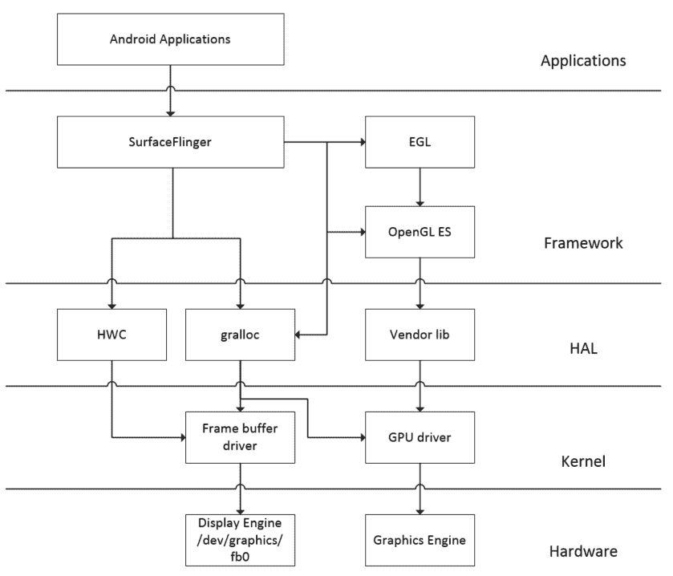
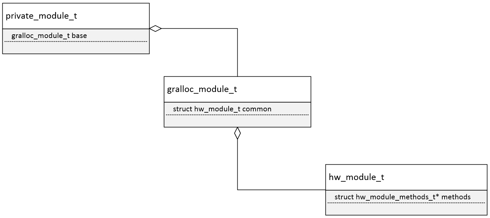
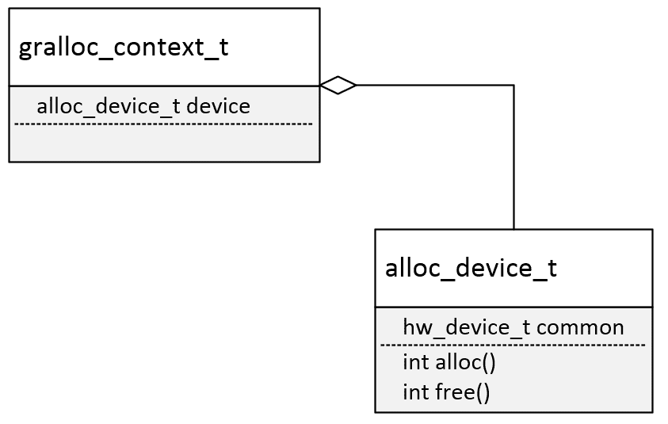
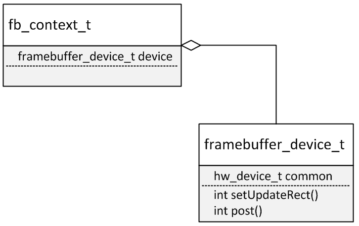
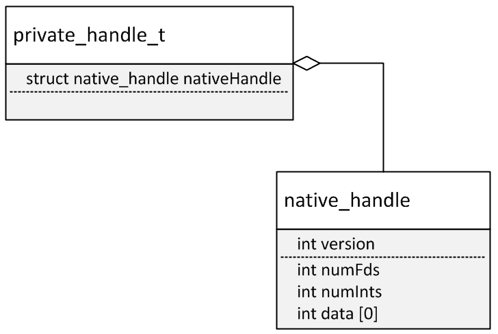
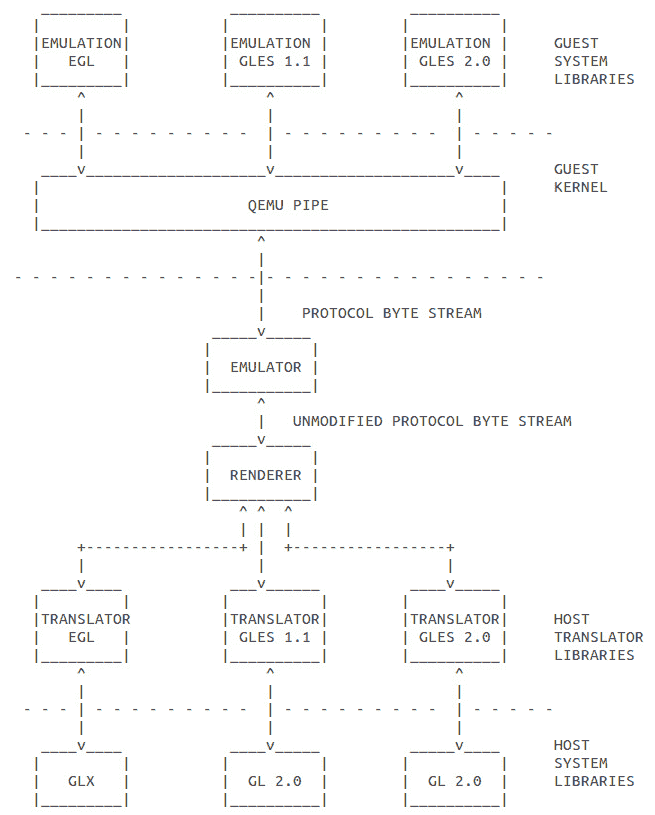

# 第十章：启用图形

在上一章中，我们学习了如何使用 PXE 和 NFS 启动 x86vbox 设备。我们可以将设备引导到嵌入式 Linux 环境，这是 Android-x86 引导的第一阶段。在这个阶段，我们可以使用调试控制台来验证系统的状态，以确保我们在启动真正的 Android 系统之前一切正常。在本章中，我们将讨论在 Android 系统启动过程中遇到的第一问题。这是关于如何为 x86vbox 设备启用 Android 图形系统。本章将涵盖以下主题：

+   Android 图形架构概述

+   深入探讨图形 HAL

+   分析 Android 模拟器图形 HAL 进行比较

图形系统可能是 Android 系统架构中最复杂的软件堆栈。

正如您将看到的，本章的内容比其他章节都要长。阅读和理解本章的内容可能更困难。我的建议是，您可以在阅读本章的同时打开源代码编辑器并加载相关源代码。这将极大地帮助您理解源代码以及我在本章中想要阐述的点。

# Android 图形架构简介

Android 中的图形系统与我们讨论过的架构相似，即第三章中提到的*发现内核、HAL 和虚拟硬件*。在那里，我们以 goldfish lights HAL 为例，从应用层到 HAL 和设备驱动层进行了详细分析。这种分析有助于我们垂直理解 Android 架构。

然而，图形系统可能是 Android 架构中最复杂的系统。需要另一本书来详细介绍 Android 图形系统。本书的重点是如何将 Android 系统移植到新的硬件平台。为了专注于这个目标，我们将在本章中讨论图形 HAL，而不是整个图形系统。如果我们能选择正确的图形 HAL 并正确配置它，图形系统就能正常工作。

根据谷歌关于图形实现文档，Android 图形支持需要以下组件：

+   EGL 驱动程序

+   OpenGL ES 1.x 驱动程序

+   OpenGL ES 2.0 驱动程序

+   OpenGL ES 3.x 驱动程序（可选）

+   Vulkan（可选）

+   Gralloc HAL 实现

+   硬件合成器 HAL 实现

在前面的列表中，OpenGL ES 实现是图形系统中最复杂的组件。我们将讨论它如何在 Android 模拟器和 Android-x86 中选取和集成，但我们不会深入讨论如何分析 OpenGL ES 实现，而是会概述底层的 OpenGL ES 库。Android 系统中必须支持 OpenGL ES 1.x 和 2.0。OpenGL ES 3.x 目前是一个可选组件。EGL 驱动通常作为 OpenGL ES 实现的一部分实现，我们将在讨论 Android 模拟器和 Android-x86（x86vbox）图形系统时看到这一点。

Vulkan 是 Khronos Group 新一代 GPU API。Vulkan 是新的且可选的，仅在 Android 7 中引入。涵盖 Vulkan 超出了本书的范围，因此我们不会讨论它。Gralloc HAL 是处理图形硬件的 HAL，是我们深入分析的重点。在大多数图形系统的移植工作中，Gralloc HAL 是启用图形的关键。

硬件合成器是图形 HAL 的一部分。然而，它不是 Android 模拟器或 Android-x86 必须拥有的组件。**硬件合成器**（**HWC**）HAL 用于将表面合成到屏幕上。HWC 抽象了如叠加层等对象，并帮助卸载一些通常使用 OpenGL 完成的工作。



Android 图形架构

如前所述的 Android 图形架构图所示，我们也可以将相关组件在 Android 架构中划分为不同的层，就像我们在前面的章节中所做的那样。这个架构图是图形系统的一个简化视图。**SurfaceFlinger**是提供图形相关系统支持的系统服务，面向应用层。**SurfaceFlinger**将连接到**OpenGL ES**库和**HAL**层组件以执行实际工作。在**HAL**中，我们有**HWC**、**gralloc**以及与内核空间中的驱动程序通信的特定于供应商的 GPU 库。

# 深入分析图形 HAL

在我们了解图形系统架构概述之后，我们将分析 Gralloc 模块，它是图形 HAL。在 AOSP 源代码中，Gralloc HAL 实现的骨架可以在以下文件夹中找到：

`$AOSP/hardware/libhardware/modules/gralloc`

这是一个通用实现，为开发者提供创建他们自己的 Gralloc 模块的参考。Gralloc 将访问帧缓冲区和 GPU，为上层提供服务。在本节中，我们将首先分析这个通用实现。在分析完这个通用的 Gralloc HAL 模块之后，我们将介绍 Android 模拟器的 Gralloc HAL。

# 加载 Gralloc 模块

当应用程序开发者将图像绘制到屏幕上时，有两种方式可以实现。他们可以使用 Canvas 或 OpenGL。从 Android 4.0 开始，这两种方法默认都使用硬件加速。要使用硬件加速，我们需要使用 Open GL 库，最终 Gralloc 模块将作为图形系统初始化的一部分被加载。正如我们在第三章“发现内核、HAL 和虚拟硬件”中看到的，每个 HAL 模块都有一个引用 ID，该 ID 可以被 `hw_get_module` 函数用来将其加载到内存中。`hw_get_module` 函数定义在 `$AOSP/hardware/libhardware/hardware.c` 文件中：

```java
int hw_get_module(const char *id, const struct hw_module_t **module) 
{ 
    return hw_get_module_by_class(id, NULL, module); 
} 

```

在 `hw_get_module` 中，它实际上调用另一个函数，`hw_get_module_by_class` 来完成工作：

```java
int hw_get_module_by_class(const char *class_id, const char *inst, 
                           const struct hw_module_t **module) 
{ 
    int i = 0; 
    char prop[PATH_MAX] = {0}; 
    char path[PATH_MAX] = {0}; 
    char name[PATH_MAX] = {0}; 
    char prop_name[PATH_MAX] = {0}; 

    if (inst) 
        snprintf(name, PATH_MAX, "%s.%s", class_id, inst); 
    else 
        strlcpy(name, class_id, PATH_MAX); 

    snprintf(prop_name, sizeof(prop_name), "ro.hardware.%s", name); 
    if (property_get(prop_name, prop, NULL) > 0) { 
        if (hw_module_exists(path, sizeof(path), name, prop) == 0) { 
            goto found; 
        } 
    } 

    for (i=0 ; i<HAL_VARIANT_KEYS_COUNT; i++) { 
        if (property_get(variant_keys[i], prop, NULL) == 0) { 
            continue; 
        } 
        if (hw_module_exists(path, sizeof(path), name, prop) == 0) { 
            goto found; 
        } 
    } 

    /* Nothing found, try the default */ 
    if (hw_module_exists(path, sizeof(path), name, "default") == 0) { 
        goto found; 
    } 

    return -ENOENT; 

found: 
    return load(class_id, path, module); 
} 

```

在前面的函数中，它试图在 `/system/lib/hw` 或 `/vendor/lib/hw` 中使用以下名称查找 Gralloc 模块的共享库：

```java
gralloc.<ro.hardware>.so 
gralloc.<ro.product.board>.so 
gralloc.<ro.board.platform>.so 
gralloc.<ro.arch>.so 

```

如果上述文件中的任何一个存在，它们将调用 `load` 函数来加载共享库。如果它们都不存在，将使用默认的共享库 `gralloc.default.so`。Gralloc 的硬件模块 ID 在 `gralloc.h` 文件中定义如下：

```java
#define GRALLOC_HARDWARE_MODULE_ID "gralloc" 

```

`load` 函数将调用 `dlopen` 来加载库，并调用 `dlsym` 来获取数据结构 `hw_module_t` 的地址：

```java
static int load(const char *id, 
        const char *path, 
        const struct hw_module_t **pHmi) 
{ 
    int status = -EINVAL; 
    void *handle = NULL; 
    struct hw_module_t *hmi = NULL; 

    handle = dlopen(path, RTLD_NOW); 
    if (handle == NULL) { 
        char const *err_str = dlerror(); 
        ALOGE("load: module=%s\n%s", path, err_str?err_str:"unknown"); 
        status = -EINVAL; 
        goto done; 
    } 

    const char *sym = HAL_MODULE_INFO_SYM_AS_STR; 
    hmi = (struct hw_module_t *)dlsym(handle, sym); 
    if (hmi == NULL) { 
        ALOGE("load: couldn't find symbol %s", sym); 
        status = -EINVAL; 
        goto done; 
    } 

    if (strcmp(id, hmi->id) != 0) { 
        ALOGE("load: id=%s != hmi->id=%s", id, hmi->id); 
        status = -EINVAL; 
        goto done; 
    } 

    hmi->dso = handle; 

    status = 0; 

    done: 
    if (status != 0) { 
        hmi = NULL; 
        if (handle != NULL) { 
            dlclose(handle); 
            handle = NULL; 
        } 
    } else { 
        ALOGV("loaded HAL id=%s path=%s hmi=%p handle=%p", 
                id, path, *pHmi, handle); 
    } 

    *pHmi = hmi; 

    return status; 
} 

```

在我们获取到数据结构 `hw_module_t` 的地址后，我们可以调用 Gralloc HAL 中定义的 `open` 方法来初始化帧缓冲区和 GPU。

如我们在第三章“发现内核、HAL 和虚拟硬件”中讨论的，硬件供应商需要实现以下三个 HAL 数据结构：

```java
struct hw_module_t; 
struct hw_module_methods_t; 
struct hw_device_t; 

```

在 HAL 共享库加载后，数据结构 `hw_module_t` 被用来发现 HAL 模块，正如我们在前面的代码片段中看到的。每个 HAL 模块都应该在数据结构 `hw_module_methods_t` 中实现一个 `open` 方法，该方法负责硬件的初始化。我们可以看到，在以下代码片段中，`gralloc_device_open` 函数被定义为 Gralloc 模块的 `open` 方法：

```java
static struct hw_module_methods_t gralloc_module_methods = { 
        .open = gralloc_device_open 
}; 

struct private_module_t HAL_MODULE_INFO_SYM = { 
    .base = { 
        .common = { 
            .tag = HARDWARE_MODULE_TAG, 
            .version_major = 1, 
            .version_minor = 0, 
            .id = GRALLOC_HARDWARE_MODULE_ID, 
            .name = "Graphics Memory Allocator Module", 
            .author = "The Android Open Source Project", 
            .methods = &gralloc_module_methods 
        }, 
        .registerBuffer = gralloc_register_buffer, 
        .unregisterBuffer = gralloc_unregister_buffer, 
        .lock = gralloc_lock, 
        .unlock = gralloc_unlock, 
    }, 
    .framebuffer = 0, 
    .flags = 0, 
    .numBuffers = 0, 
    .bufferMask = 0, 
    .lock = PTHREAD_MUTEX_INITIALIZER, 
    .currentBuffer = 0, 
}; 

```

在数据结构 `hw_module_methods_t` 中，`open` 方法被分配为一个静态函数，`gralloc_device_open`。`HAL_MODULE_INFO_SYM` 符号定义为 `struct private_module_t`。

你可能会注意到，当我们加载 Gralloc 模块时，实际上是将 `HAL_MODULE_INFO_SYM_AS_STR` 符号映射到 `hw_module_t`，而在默认的 Gralloc 模块中，数据结构 `hw_module_t` 是通过另外两个继承的数据结构 `private_module_t` 和 `gralloc_module_t` 实现的。让我们看看 `private_module_t`、`gralloc_module_t` 和 `hw_module_t` 之间的关系。

如果你在这部分的分析中感到有些困惑，我建议你在阅读这部分内容的同时查看源代码。如果你没有 AOSP 源代码，有一个非常好的 AOSP 代码交叉引用网站 [`xref.opersys.com/`](http://xref.opersys.com/)。

您可以访问此网站并搜索我们正在讨论的数据结构。

数据结构`private_module_t`在以下文件中定义：

`$AOSP/hardware/libhardware/modules/gralloc/gralloc_priv.h`

```java
struct private_module_t { 
    gralloc_module_t base; 

    private_handle_t* framebuffer; 
    uint32_t flags; 
    uint32_t numBuffers; 
    uint32_t bufferMask; 
    pthread_mutex_t lock; 
    buffer_handle_t currentBuffer; 
    int pmem_master; 
    void* pmem_master_base; 

    struct fb_var_screeninfo info; 
    struct fb_fix_screeninfo finfo; 
    float xdpi; 
    float ydpi; 
    float fps; 
}; 

```

如我们所见，第一个基类字段，或者说在 C++术语中的成员变量，是数据结构`gralloc_module_t`。第二个成员变量`framebuffer`是`private_handle_t`数据类型的指针。它是一个指向 framebuffer 的句柄，我们将在后面探讨它。

成员变量`flags`用于指示系统是否支持双缓冲。如果支持，则`PAGE_FLIP`位设置为 1；否则，设置为 0。

`numBuffers`成员变量表示 framebuffer 中的缓冲区数量。它与可见分辨率和虚拟分辨率相关。例如，如果显示器的可见分辨率为 800 x 600，则虚拟分辨率可以是 1600 x 600。在这种情况下，framebuffer 可以为显示器提供两个缓冲区，并且系统可以支持显示器的双缓冲。

`bufferMask`成员变量用于标记 framebuffer 设备中缓冲区的使用情况。如果我们假设 framebuffer 中有两个缓冲区，则`bufferMask`变量在二进制中可以有四个值：00、01、10 和 11。值 00 表示两个缓冲区都为空。值 01 表示第一个缓冲区正在使用，第二个缓冲区为空。值 10 表示第一个缓冲区为空，第二个缓冲区正在使用。值 11 表示两个缓冲区都在使用。

`lock`成员变量用于保护对`private_module_t`的访问。

`currentBuffer`成员变量用于跟踪用于渲染的当前缓冲区。

`info`和`finfo`成员变量是数据类型`fb_var_screeninfo`和`fb_fix_screeninfo`。它们用于存储显示设备的属性。`fb_var_screeninfo`中的属性是可编程的，而`fb_fix_screeninfo`中的属性是只读的。

`xdpi`和`ydpi`成员变量用于以水平和垂直方向描述像素密度。

`fps`成员变量是每秒显示的帧数。

`gralloc_module_t`数据结构在以下文件中定义：

`$AOSP/hardware/libhardware/include/hardware/gralloc.h`

```java
typedef struct gralloc_module_t { 
    struct hw_module_t common; 
    int (*registerBuffer)(struct gralloc_module_t const* module, 
            buffer_handle_t handle); 
    int (*unregisterBuffer)(struct gralloc_module_t const* module, 
            buffer_handle_t handle); 
    int (*lock)(struct gralloc_module_t const* module, 
            buffer_handle_t handle, int usage, 
            int l, int t, int w, int h, 
            void** vaddr); 
    int (*unlock)(struct gralloc_module_t const* module, 
            buffer_handle_t handle); 
    ... 
} 

```

如我们所预期，`gralloc_module_t`中的第一个字段是来自前面代码片段的`hw_module_t`。这三个数据结构之间的关系类似于以下 UML 类图中的面向对象表示法：



Gralloc 数据结构之间的关系

这是 C 语言中模拟继承关系的方式。这样，我们可以将`private_module_t`的数据类型转换为`gralloc_module_t`或`hw_module_t`。

在`gralloc_module_t`中定义了一组成员函数。在本章中，我们将查看其中的四个。

`registerBuffer` 和 `unregisterBuffer` 成员函数用于注册或注销一个缓冲区。要注册一个缓冲区，我们需要将缓冲区映射到应用程序的进程空间。

`lock` 和 `unlock` 成员函数用于锁定或解锁一个缓冲区。缓冲区使用 `buffer_handle_t` 作为函数的参数进行描述。我们可以使用 `l`、`t`、`w` 和 `h` 参数来提供缓冲区的位置和大小。缓冲区锁定后，我们可以在 `vaddr` 输出参数中获取缓冲区的地址。使用完毕后，我们应该解锁缓冲区。

# 初始化 GPU

我们已经讨论了 Gralloc 模块的 HAL 数据结构 `hw_module_t` 和 `hw_module_methods_t`。最后一个，`hw_device_t`，在 Gralloc HAL 模块的 `open` 方法中初始化。现在我们可以查看 Gralloc 模块的 `open` 方法如下：

```java
int gralloc_device_open(const hw_module_t* module, const char* name, 
        hw_device_t** device) 
{ 
    int status = -EINVAL; 
    if (!strcmp(name, GRALLOC_HARDWARE_GPU0)) { 
        gralloc_context_t *dev; 
        dev = (gralloc_context_t*)malloc(sizeof(*dev)); 

        memset(dev, 0, sizeof(*dev)); 

        dev->device.common.tag = HARDWARE_DEVICE_TAG; 
        dev->device.common.version = 0; 
        dev->device.common.module = const_cast<hw_module_t*>(module); 
        dev->device.common.close = gralloc_close; 

        dev->device.alloc   = gralloc_alloc; 
        dev->device.free    = gralloc_free; 

        *device = &dev->device.common; 
        status = 0; 
    } else { 
        status = fb_device_open(module, name, device); 
    } 
    return status; 
} 

```

如此可见，`gralloc_device_open` 函数可以根据输入参数 `name` 初始化两种设备，`GRALLOC_HARDWARE_GPU0` 和 `GRALLOC_HARDWARE_FB0`。

让我们先看看 GPU0 设备的初始化。`open` 方法的输出参数是 `hw_device_t` 数据结构的地址。调用应用程序获取 `hw_device_t` 实例后，可以使用硬件设备来完成它们的工作。在 Gralloc HAL 的 `open` 方法中，它首先为 `gralloc_context_t` 数据结构分配内存。之后，它填充其 `device` 成员变量并将输出参数赋值给 `dev->device.common` 成员变量的地址。正如我们所期望的，输出是 `hw_device_t` 实例的地址。让我们看看 `gralloc_context_t`、`alloc_device_t` 和 `hw_device_t` 之间的关系：



如前图所示，`gralloc_context_t` 的第一个字段或成员变量是 `device`，其数据类型为 `alloc_device_t`：

```java
struct gralloc_context_t { 
    alloc_device_t  device; 
    /* our private data here */ 
}; 

```

以下是对 `alloc_device_t` 数据结构的定义。它在 `gralloc.h` 文件中定义：

```java
typedef struct alloc_device_t { 
    struct hw_device_t common; 

    int (*alloc)(struct alloc_device_t* dev, 
            int w, int h, int format, int usage, 
            buffer_handle_t* handle, int* stride); 

    int (*free)(struct alloc_device_t* dev, 
            buffer_handle_t handle); 

    void (*dump)(struct alloc_device_t *dev, char *buff, int buff_len); 

    void* reserved_proc[7]; 
} alloc_device_t; 

```

我们可以看到 `alloc_device_t` 的第一个字段的数据类型是 `hw_device_t`。这是我们讨论 `private_module_t`、`gralloc_module_t` 和 `hw_module_t` 之间的关系时提到的 C 语言中模拟继承关系的技巧。

Gralloc 设备的 `alloc` 和 `free` 方法在 `gralloc.cpp` 文件中的 `gralloc_alloc` 和 `gralloc_free` 函数中实现。

# 初始化帧缓冲

如果我们使用 `GRALLOC_HARDWARE_FB0` 作为 `name` 值调用 Gralloc 模块的 `open` 方法，它将初始化帧缓冲设备。调用 `fb_device_open` 函数来打开帧缓冲设备：

```java
status = fb_device_open(module, name, device); 

```

`fb_device_open` 函数在 `framebuffer.cpp` 文件中实现如下：

```java
int fb_device_open(hw_module_t const* module, const char* name, 
        hw_device_t** device) 
{ 
    int status = -EINVAL; 
    if (!strcmp(name, GRALLOC_HARDWARE_FB0)) { 
        /* initialize our state here */ 
        fb_context_t *dev = (fb_context_t*)malloc(sizeof(*dev)); 
        memset(dev, 0, sizeof(*dev)); 

        /* initialize the procs */ 
        dev->device.common.tag = HARDWARE_DEVICE_TAG; 
        dev->device.common.version = 0; 
        dev->device.common.module = const_cast<hw_module_t*>(module); 
        dev->device.common.close = fb_close; 
        dev->device.setSwapInterval = fb_setSwapInterval; 
        dev->device.post            = fb_post; 
        dev->device.setUpdateRect = 0; 

        private_module_t* m = (private_module_t*)module; 
        status = mapFrameBuffer(m); 
        if (status >= 0) { 
            int stride = m->finfo.line_length / 
            (m->info.bits_per_pixel >> 3); 
            /* 
             * Auto detect current depth and select mode 
             */ 
            int format; 
            if (m->info.bits_per_pixel == 32) { 
                format = (m->info.red.offset == 16) ?  
                HAL_PIXEL_FORMAT_BGRA_8888 
                : (m->info.red.offset == 24) ? 
                HAL_PIXEL_FORMAT_RGBA_8888 : 
                HAL_PIXEL_FORMAT_RGBX_8888; 
            } else if (m->info.bits_per_pixel == 16) { 
                format = HAL_PIXEL_FORMAT_RGB_565; 
            } else { 
                ALOGE("Unsupported format %d", m->info.bits_per_pixel); 
                return -EINVAL; 
            } 
            const_cast<uint32_t&>(dev->device.flags) = 0; 
            const_cast<uint32_t&>(dev->device.width) = m->info.xres; 
            const_cast<uint32_t&>(dev->device.height) = m->info.yres; 
            const_cast<int&>(dev->device.stride) = stride; 
            const_cast<int&>(dev->device.format) = format; 
            const_cast<float&>(dev->device.xdpi) = m->xdpi; 
            const_cast<float&>(dev->device.ydpi) = m->ydpi; 
            const_cast<float&>(dev->device.fps) = m->fps; 
            const_cast<int&>(dev->device.minSwapInterval) = 1; 
            const_cast<int&>(dev->device.maxSwapInterval) = 1; 
            *device = &dev->device.common; 
        } 
    } 
    return status; 
} 

```

在 `fb_device_open` 函数中，它为 `fb_context_t` 数据结构分配内存。之后，它填充数据结构中的字段。正如我们在 GPU0 初始化中讨论的那样，我们期望输出为 `hw_device_t` 数据结构的一个实例，以便调用者可以通过 `hw_device_t` HAL 数据结构使用帧缓冲区设备。这三个数据结构 `fb_context_t`、`framebuffer_device_t` 和 `hw_device_t` 之间有类似的继承关系，如下面的图所示：



`fb_context_t`、`framebuffer_device_t` 和 `hw_device_t` 之间的关系

`fb_context_t` 数据结构将 `framebuffer_device_t` 作为第一个字段，如下所示：

```java
struct fb_context_t { 
    framebuffer_device_t  device; 
}; 

```

相应地，`framebuffer_device_t` 数据结构将 `hw_device_t` 作为第一个字段，因此 `fb_context_t` 可以用作 `framebuffer_device_t` 或 `hw_device_t`：

```java
typedef struct framebuffer_device_t { 
    struct hw_device_t common; 

    const uint32_t  flags; 

    const uint32_t  width; 
    const uint32_t  height; 

    const int       stride; 

    const int       format; 

    const float     xdpi; 
    const float     ydpi; 

    const float     fps; 

    const int       minSwapInterval; 

    const int       maxSwapInterval; 

    const int       numFramebuffers; 

    int reserved[7]; 
    int (*setSwapInterval)(struct framebuffer_device_t* window, 
            int interval); 
    int (*setUpdateRect)(struct framebuffer_device_t* window, 
            int left, int top, int width, int height); 
    int (*post)(struct framebuffer_device_t* dev, buffer_handle_t 
    buffer); 
    int (*compositionComplete)(struct framebuffer_device_t* dev); 
    void (*dump)(struct framebuffer_device_t* dev, char *buff, int 
    buff_len); 
    int (*enableScreen)(struct framebuffer_device_t* dev, int enable); 
    void* reserved_proc[6]; 

} framebuffer_device_t; 

```

对于 `framebuffer_device_t` 中剩余的字段，它们是：

+   `flags`: 用于描述帧缓冲区的某些属性。

+   `width` 和 `height`：帧缓冲区的像素尺寸。

+   `stride`：帧缓冲区的像素步长或每行的像素数。

+   `format`：帧缓冲区像素格式。可以是 `HAL_PIXEL_FORMAT_RGBX_8888`、`HAL_PIXEL_FORMAT_565` 等。

+   `xdpi` 和 `ydpi`：帧缓冲区显示面板的每英寸像素分辨率。

+   `fps`：显示面板的每秒帧数。

+   `minSwapInterval`：此帧缓冲区支持的最低交换间隔。

+   `maxSwapInterval`：此帧缓冲区支持的最高交换间隔。

+   `numFramebuffers`：支持的帧缓冲区数量。

在填充 `framebuffer_device_t` 的所有字段之前，`fb_device_open` 函数调用 `mapFrameBuffer` 函数以获取帧缓冲区信息。除了获取帧缓冲区信息外，此 `mapFrameBuffer` 函数还将帧缓冲区映射到当前进程空间，以便当前进程可以使用它。在 Android 中，Gralloc 模块由 SurfaceFlinger 拥有和管理。

让我们看看 `mapFrameBuffer` 函数：

```java
static int mapFrameBuffer(struct private_module_t* module) 
{ 
    pthread_mutex_lock(&module->lock); 
    int err = mapFrameBufferLocked(module); 
    pthread_mutex_unlock(&module->lock); 
    return err; 
} 

```

正如我们所见，`mapFrameBuffer` 首先获取一个互斥锁，然后调用另一个函数 `mapFrameBufferLocked` 来完成剩余的工作：

```java
int mapFrameBufferLocked(struct private_module_t* module) 
{ 
    // already initialized... 
    if (module->framebuffer) { 
        return 0; 
    } 

    char const * const device_template[] = { 
            "/dev/graphics/fb%u", 
            "/dev/fb%u", 
            0 }; 

    int fd = -1; 
    int i=0; 
    char name[64]; 

    while ((fd==-1) && device_template[i]) { 
        snprintf(name, 64, device_template[i], 0); 
        fd = open(name, O_RDWR, 0); 
        i++; 
    } 
    if (fd < 0) 
        return -errno; 
    ... 

```

在 `mapFrameBufferLocked` 函数中，它检查是否存在 `/dev/graphics/fb0` 或 `/dev/fb0` 设备节点。如果设备节点存在，它将尝试打开它并将文件描述符存储在 `fd` 变量中：

```java
    ... 
    struct fb_fix_screeninfo finfo; 
    if (ioctl(fd, FBIOGET_FSCREENINFO, &finfo) == -1) 
        return -errno; 

    struct fb_var_screeninfo info; 
    if (ioctl(fd, FBIOGET_VSCREENINFO, &info) == -1) 
        return -errno; 
    ... 

```

接下来，它将使用 `ioctl` 命令获取帧缓冲区信息。有两个帧缓冲区数据结构，`fb_fix_screeninfo` 和 `fb_var_screeninfo`，可以用来与帧缓冲区通信。`fb_fix_screeninfo` 数据结构存储固定的帧缓冲区信息，而 `fb_var_screeninfo` 数据结构存储可编程的帧缓冲区信息：

```java
    ... 
    info.reserved[0] = 0; 
    info.reserved[1] = 0; 
    info.reserved[2] = 0; 
    info.xoffset = 0; 
    info.yoffset = 0; 
    info.activate = FB_ACTIVATE_NOW; 

    /* 
     * Request NUM_BUFFERS screens (at lest 2 for page flipping) 
     */ 
    info.yres_virtual = info.yres * NUM_BUFFERS; 

    uint32_t flags = PAGE_FLIP; 
#if USE_PAN_DISPLAY 
    if (ioctl(fd, FBIOPAN_DISPLAY, &info) == -1) { 
        ALOGW("FBIOPAN_DISPLAY failed, page flipping not supported"); 
#else 
    if (ioctl(fd, FBIOPUT_VSCREENINFO, &info) == -1) { 
        ALOGW("FBIOPUT_VSCREENINFO failed, page flipping not supported"); 
#endif 
        info.yres_virtual = info.yres; 
        flags &= ~PAGE_FLIP; 
    } 

    if (ioctl(fd, FBIOGET_FSCREENINFO, &finfo) == -1) 
        return -errno; 

    if (finfo.smem_len <= 0) 
        return -errno; 

    if (finfo.smem_len / finfo.line_length < info.yres_virtual) 
        info.yres_virtual = finfo.smem_len / finfo.line_length; 

    if (info.yres_virtual < info.yres * 2) { 
        // we need at least 2 for page-flipping 
        info.yres_virtual = info.yres; 
        flags &= ~PAGE_FLIP; 
        ALOGW("page flipping not supported (yres_virtual=%d, 
        requested=%d)", 
                info.yres_virtual, info.yres*2); 
    } 
    ... 

```

在获取到帧缓冲区信息后，它试图设置帧缓冲设备的虚拟分辨率。`xres`和`yres`字段用于存储帧缓冲设备的可见分辨率，而`xres_virtual`和`yres_virtual`字段用于存储帧缓冲设备的虚拟分辨率。

为了设置虚拟分辨率，它试图将虚拟垂直分辨率增加到`info.yres * NUM_BUFFERS`值。`NUM_BUFFERS`是用于帧缓冲设备中可以使用的缓冲区数量的宏。在我们的情况下，`NUM_BUFFERS`的值是`2`，因此我们可以使用双缓冲技术来显示。它使用`ioctl`命令`FBIOPUT_VSCREENINFO`来设置虚拟分辨率。如果它成功设置了虚拟分辨率，它将在`flags`中设置`PAGE_FLIP`位；否则，它将清除`PAGE_FLIP`位：

```java
    ... 
    if (ioctl(fd, FBIOGET_VSCREENINFO, &info) == -1) 
        return -errno; 

    if (finfo.smem_len / finfo.line_length < info.yres_virtual) 
        info.yres_virtual = finfo.smem_len / finfo.line_length; 

    uint64_t  refreshQuotient = 
    ( 
            uint64_t( info.upper_margin + info.lower_margin + info.yres ) * 
            ( info.left_margin  + info.right_margin + info.xres ) * 
            info.pixclock 
    ); 

    /* Beware, info.pixclock might be 0 under emulation, so avoid  
     * a division-by-0 here (SIGFPE on ARM) */ 
    int refreshRate = refreshQuotient > 0 ? (int)(1000000000000000LLU / 
    refreshQuotient) : 0; 

    if (refreshRate == 0) { 
        // bleagh, bad info from the driver 
        refreshRate = 60*1000;  // 60 Hz 
    } 
    ... 

```

在设置虚拟分辨率后，它将计算刷新率。要了解刷新率的计算，可以参考 Linux 内核源代码中的文档`Documentation/fb/framebuffer.txt`：

```java
    ... 
    if (int(info.width) <= 0 || int(info.height) <= 0) { 
        // the driver doesn't return that information 
        // default to 160 dpi 
        info.width  = ((info.xres * 25.4f)/160.0f + 0.5f); 
        info.height = ((info.yres * 25.4f)/160.0f + 0.5f); 
    } 

    float xdpi = (info.xres * 25.4f) / info.width; 
    float ydpi = (info.yres * 25.4f) / info.height; 
    float fps  = refreshRate / 1000.0f; 

    module->finfo = finfo; 
    module->xdpi = xdpi; 
    module->ydpi = ydpi; 
    module->fps = fps; 
    ... 

```

接下来，它将计算水平和垂直的像素密度。它还将刷新率转换为每秒帧数，并将其存储到`fps`中。在它有了所有信息后，它将它们存储到数据结构`private_module_t`的字段中。

最后，它将帧缓冲区映射到进程地址空间：

```java
    ... 
    while (info.yres_virtual > 0) { 
        size_t fbSize = roundUpToPageSize(finfo.line_length * 
        info.yres_virtual); 
        module->numBuffers = info.yres_virtual / info.yres; 
        void* vaddr = mmap(0, fbSize, PROT_READ|PROT_WRITE, MAP_SHARED, 
        fd, 0); 
        if (vaddr != MAP_FAILED) { 
            module->info = info; 
            module->flags = flags; 
            module->bufferMask = 0; 
            module->framebuffer = new private_handle_t(dup(fd), 
            fbSize, 0); 
            module->framebuffer->base = intptr_t(vaddr); 
            memset(vaddr, 0, fbSize); 
            return 0; 
        } 

        ALOGE("Error mapping the framebuffer (%s)", strerror(errno)); 

        info.yres_virtual -= info.yres; 
        ALOGW("Fallback to use fewer buffer: %d", info.yres_virtual /  
        info.yres); 
        if (ioctl(fd, FBIOPUT_VSCREENINFO, &info) == -1) 
            break; 

        if (info.yres_virtual <= info.yres) 
            flags &= ~PAGE_FLIP; 
    } 

    return -errno; 
} 

```

按虚拟分辨率计算的帧缓冲区大小是`finfo.line_length * info.yres_virtual`。`finfo.line_length`的值等于每行的字节数，而`info.yres_virtual`的值是每帧的行数。为了进行内存映射，我们必须使用`roundUpToPageSize`函数将大小四舍五入到页面边界。

在帧缓冲设备中可以使用的实际缓冲区数量是`info.yres_virtual`除以`info.yres`，并存储在`numBuffers`字段中。`bufferMask`字段被设置为 0，这意味着所有缓冲区都是空的，可以用来使用。

它调用`mmap`系统调用来将帧缓冲区映射到当前进程地址空间。当前进程地址空间中帧缓冲区的起始地址是`vaddr`，由`mmap`系统调用返回。它被存储到`framebuffer->base`字段中，这样 Gralloc 模块就可以使用它来为应用程序分配缓冲区。

到目前为止，我们已经完成了对`mapFrameBuffer`函数的分析。这个函数负责在 Gralloc HAL 模块中初始化帧缓冲设备的大部分工作。

# 图形缓冲区的分配和释放

到目前为止，在本章中，我们已经讨论了加载 Gralloc 模块和 Gralloc 模块提供的`open`方法。现在让我们回顾上层加载、初始化和使用 Gralloc 模块时的要点：

+   例如，Gralloc 模块主要被 `SurfaceFlinger` 使用。`SurfaceFlinger` 使用 Gralloc；当它创建 `FramebufferNativeWindow` 的实例时，在 `FramebufferNativeWindow` 构造函数中，它将调用 `hw_get_module` 来获取 `hw_module_t` 的实例。

+   在 `hw_module_t` 数据结构中，它有一个名为 `methods` 的字段，其数据类型为 `hw_module_methods_t`。在 `hw_module_methods_t` 中，它有一个返回 `hw_device_t` 数据结构的 `open` 方法。

+   通过 `hw_device_t`，`SurfaceFlinger` 可以使用 `hw_device_t` 内部的 `alloc` 和 `free` 方法来分配或释放图形缓冲区。

让我们在本节中看看 Gralloc 模块如何分配和释放图形缓冲区。我们首先查看 `gralloc_alloc` 的源代码：

```java
static int gralloc_alloc(alloc_device_t* dev, 
        int w, int h, int format, int usage, 
        buffer_handle_t* pHandle, int* pStride) 
{ 
    if (!pHandle || !pStride) 
        return -EINVAL; 

    size_t size, stride; 

    int align = 4; 
    int bpp = 0; 
    switch (format) { 
        case HAL_PIXEL_FORMAT_RGBA_8888: 
        case HAL_PIXEL_FORMAT_RGBX_8888: 
        case HAL_PIXEL_FORMAT_BGRA_8888: 
            bpp = 4; 
            break; 
        case HAL_PIXEL_FORMAT_RGB_888: 
            bpp = 3; 
            break; 
        case HAL_PIXEL_FORMAT_RGB_565: 
        case HAL_PIXEL_FORMAT_RAW16: 
            bpp = 2; 
            break; 
        default: 
            return -EINVAL; 
    } 

    private_module_t* m = reinterpret_cast<private_module_t*>( 
                        dev->common.module); 

    size_t bpr = usage & GRALLOC_USAGE_HW_FB ? m->finfo.line_length : 
    (w*bpp + (align-1)) & ~(align-1); 
    size = bpr * h; 
    stride = bpr / bpp; 

    int err; 
    if (usage & GRALLOC_USAGE_HW_FB) { 
        err = gralloc_alloc_framebuffer(dev, size, usage, pHandle); 
    } else { 
        err = gralloc_alloc_buffer(dev, size, usage, pHandle); 
    } 

    if (err < 0) { 
        return err; 
    } 

    *pStride = stride; 
    return 0; 
} 

```

如前述代码片段所示，`alloc` 方法是在 `gralloc_alloc` 函数中实现的。`gralloc_alloc` 有以下参数：

+   `dev`: 它具有从 `hw_device_t` 继承的 `alloc_device` 数据类型。

+   `w` : 它是图形缓冲区的宽度。

+   `h`: 它是图形缓冲区的高度。

+   `format` : 它定义了像素的颜色格式。例如，格式可以是 `HAL_PIXEL_FORMAT_RGBA_8888`、`HAL_PIXEL_FORMAT_RGB_888`、`HAL_PIXEL_FORMAT_RGB_565` 等。

+   `usage` : 它定义了图形缓冲区的用途。例如，如果设置了 `GRALLOC_USAGE_HW_FB` 位，缓冲区将从帧缓冲区分配。

+   `pHandle` : 它具有 `buffer_handle_t` 数据类型。我们将讨论这个数据结构的详细信息。它用于存储分配的缓冲区。

+   `pStride` : 每行的像素数。

在 `gralloc_alloc` 中，它检查像素的格式以决定像素的大小。它可以是以 32 位、24 位、16 位等。像素的大小存储在 `bpp` 变量中。`bpr` 变量是每行的字节数，它是通过 `w` 乘以 `bpp` 计算得出的。`bpr` 变量需要对齐到四个字节的边界以进行内存分配。缓冲区的大小可以通过 `h` 乘以 `bpr` 来计算。

在计算缓冲区大小后，它将根据 `GRALLOC_USAGE_HW_FB` 位调用 `gralloc_alloc_framebuffer` 或 `gralloc_alloc_buffer` 函数。

由 `gralloc_alloc` 分配的图形缓冲区存储在 `buffer_handle_t` 数据类型中。`buffer_handle_t` 被定义为 `native_handle` 的指针。`native_handle` 被用作 `private_handle_t` 的父类。`private_handle_t` 是实际用于管理图形缓冲区的数据类型，它是一个硬件相关的数据结构。



private_handle_t 和 native_handle 之间的关系

上述图表显示了 `private_handle_t` 和 `native_handle` 之间的关系。以下是对 `native_handle` 的定义：

```java
typedef struct native_handle 
{ 
    int version;     /* sizeof(native_handle_t) */ 
    int numFds;      /* number of file-descriptors at &data[0] */ 
    int numInts;     /* number of ints at &data[numFds] */ 
    int data[0];     /* numFds + numInts ints */ 
} native_handle_t; 

```

`version` 字段被设置为 `native_handle` 的大小。`numFds` 和 `numInts` 字段描述了 `data` 数组中的文件描述符和整数的数量。`data` 数组用于存储特定于硬件的信息，我们可以在以下 `private_handle_t` 的定义中看到：

```java
#ifdef __cplusplus 
struct private_handle_t : public native_handle { 
#else 
struct private_handle_t { 
    struct native_handle nativeHandle; 
#endif 

    enum { 
        PRIV_FLAGS_FRAMEBUFFER = 0x00000001 
    }; 

    // file-descriptors 
    int     fd; 
    // ints 
    int     magic; 
    int     flags; 
    int     size; 
    int     offset; 

    // FIXME: the attributes below should be out-of-line 
    uint64_t base __attribute__((aligned(8))); 
    int     pid; 

#ifdef __cplusplus 
    static inline int sNumInts() { 
        return (((sizeof(private_handle_t) - 
        sizeof(native_handle_t))/sizeof(int)) - sNumFds); 
    } 
    static const int sNumFds = 1; 
    static const int sMagic = 0x3141592; 

    private_handle_t(int fd, int size, int flags) : 
        fd(fd), magic(sMagic), flags(flags), size(size), offset(0), 
        base(0), pid(getpid()) 
    { 
        version = sizeof(native_handle); 
        numInts = sNumInts(); 
        numFds = sNumFds; 
    } 
    ~private_handle_t() { 
        magic = 0; 
    } 

    static int validate(const native_handle* h) { 
        const private_handle_t* hnd = (const private_handle_t*)h; 
        if (!h || h->version != sizeof(native_handle) || 
                h->numInts != sNumInts() || h->numFds != sNumFds || 
                hnd->magic != sMagic) 
        { 
            ALOGE("invalid gralloc handle (at %p)", h); 
            return -EINVAL; 
        } 
        return 0; 
    } 
#endif 
}; 

```

`fd` 成员变量是一个文件描述符，用于描述帧缓冲区或共享内存区域。`magic` 成员变量存储为在 `sMagic` 静态变量中定义的魔术数字。`flags` 成员变量用于描述图形缓冲区的类型。例如，如果它等于 `PRIV_FLAGS_FRAMEBUFFER`，则此缓冲区是从帧缓冲区分配的。`size` 成员变量是图形缓冲区的大小。`offset` 成员变量是从内存起始地址的偏移量。`base` 成员变量是为缓冲区分配的地址。`pid` 成员变量是图形缓冲区创建者的进程 ID。

构造函数填充 `native_handle` 的成员变量。`validate` 成员函数用于验证图形缓冲区是否是 `private_handle_t` 的实例。

正如我们之前提到的，我们正在分析的 Gralloc 模块是 AOSP 中的默认实现，构建为 `galloc.default.so`。在这个实现中，GPU 不被使用，缓冲区将分配在帧缓冲区或共享内存中。尽管这不是性能的理想情况，但它具有最少的硬件依赖性，这对于理解更复杂的 Gralloc 模块实现是一个很好的参考。

# 从帧缓冲区分配

从 `gralloc_alloc` 函数中我们可以看到，当 `usage` 位设置为 `GRALLOC_USAGE_HW_FB` 时，调用 `gralloc_alloc_framebuffer` 函数。`gralloc_alloc_framebuffer` 函数将从帧缓冲区设备分配缓冲区：

```java
static int gralloc_alloc_framebuffer_locked(alloc_device_t* dev, 
        size_t size, int usage, buffer_handle_t* pHandle) 
{ 
    private_module_t* m = reinterpret_cast<private_module_t*>( 
            dev->common.module); 

    // allocate the framebuffer 
    if (m->framebuffer == NULL) { 
        // initialize the framebuffer, the framebuffer is mapped once 
        // and forever. 
        int err = mapFrameBufferLocked(m); 
        if (err < 0) { 
            return err; 
        } 
    } 

    const uint32_t bufferMask = m->bufferMask; 
    const uint32_t numBuffers = m->numBuffers; 
    const size_t bufferSize = m->finfo.line_length * m->info.yres; 
    if (numBuffers == 1) { 
        // If we have only one buffer, we never use page-flipping.  
        // Instead we return a regular buffer which will be 
        // memcpy'ed to the main screen when post is called. 
        int newUsage = (usage & ~GRALLOC_USAGE_HW_FB) |   
        GRALLOC_USAGE_HW_2D; 
        return gralloc_alloc_buffer(dev, bufferSize, newUsage, 
        pHandle); 
    } 

    if (bufferMask >= ((1LU<<numBuffers)-1)) { 
        // We ran out of buffers. 
        return -ENOMEM; 
    } 

    // create a "fake" handles for it 
    intptr_t vaddr = intptr_t(m->framebuffer->base); 
    private_handle_t* hnd = new private_handle_t(dup(m->framebuffer-
    >fd), 
    size, private_handle_t::PRIV_FLAGS_FRAMEBUFFER); 

    // find a free slot 
    for (uint32_t i=0 ; i<numBuffers ; i++) { 
        if ((bufferMask & (1LU<<i)) == 0) { 
            m->bufferMask |= (1LU<<i); 
            break; 
        } 
        vaddr += bufferSize; 
    } 

    hnd->base = vaddr; 
    hnd->offset = vaddr - intptr_t(m->framebuffer->base); 
    *pHandle = hnd; 

    return 0; 
} 

static int gralloc_alloc_framebuffer(alloc_device_t* dev, 
        size_t size, int usage, buffer_handle_t* pHandle) 
{ 
    private_module_t* m = reinterpret_cast<private_module_t*>( 
            dev->common.module); 
    pthread_mutex_lock(&m->lock); 
    int err = gralloc_alloc_framebuffer_locked(dev, size, usage,  
    pHandle); 
    pthread_mutex_unlock(&m->lock); 
    return err; 
} 

```

`gralloc_alloc_framebuffer` 首先获取一个互斥锁，并调用另一个函数，`gralloc_alloc_framebuffer_locked`。在锁定版本中，它调用之前分析的 `mapFrameBufferLocked` 函数，以获取帧缓冲区信息并将其映射到当前进程地址空间。

它将检查帧缓冲区设备是否支持双缓冲。如果它支持双缓冲，它将创建一个新的 `private_handle_t` 实例，并填充此实例中的信息，然后返回给调用者。如果缓冲区是从帧缓冲区设备分配的，它将标记 `private_handle_t` 的 `flags` 成员变量为 `PRIV_FLAGS_FRAMEBUFFER`。它还将设置帧缓冲区的 `usage` 状态在 `bufferMask` 中，这是 `private_module_t` 的成员变量。

如果它不支持双缓冲，它将调用 `gralloc_alloc_buffer` 从系统内存分配缓冲区并返回给调用者。

# 从系统内存分配

当 `usage` 位未设置为 `GRALLOC_USAGE_HW_FB` 或系统不支持双缓冲时，我们必须使用 `gralloc_alloc_buffer` 从系统内存分配缓冲区。让我们看看 `gralloc_alloc_buffer` 的实现：

```java
static int gralloc_alloc_buffer(alloc_device_t* dev, 
        size_t size, int /*usage*/, buffer_handle_t* pHandle) 
{ 
    int err = 0; 
    int fd = -1; 

    size = roundUpToPageSize(size); 

    fd = ashmem_create_region("gralloc-buffer", size); 
    if (fd < 0) { 
        ALOGE("couldn't create ashmem (%s)", strerror(-errno)); 
        err = -errno; 
    } 

    if (err == 0) { 
        private_handle_t* hnd = new private_handle_t(fd, size, 0); 
        gralloc_module_t* module = reinterpret_cast<gralloc_module_t*>( 
                dev->common.module); 
        err = mapBuffer(module, hnd); 
        if (err == 0) { 
            *pHandle = hnd; 
        } 
    } 

    ALOGE_IF(err, "gralloc failed err=%s", strerror(-err)); 

    return err; 
} 

```

在 `gralloc_alloc_buffer` 中，它首先将缓冲区大小向上舍入到页面大小。然后使用 `ashmem_create_region` 创建一个匿名共享内存区域。它创建一个新的 `private_handle_t` 实例来表示这个共享内存区域。

这个共享内存区域被描述为一个文件描述符。要使用它，我们需要将其映射到当前进程的地址空间。这是通过 `mapBuffer` 函数完成的：

```java
int mapBuffer(gralloc_module_t const* module, 
        private_handle_t* hnd) 
{ 
    void* vaddr; 
    return gralloc_map(module, hnd, &vaddr); 
} 

```

`mapBuffer` 调用另一个函数 `gralloc_map` 来进行内存映射：

```java
static int gralloc_map(gralloc_module_t const* /*module*/, 
        buffer_handle_t handle, 
        void** vaddr) 
{ 
    private_handle_t* hnd = (private_handle_t*)handle; 
    if (!(hnd->flags & private_handle_t::PRIV_FLAGS_FRAMEBUFFER)) { 
        size_t size = hnd->size; 
        void* mappedAddress = mmap(0, size, 
                PROT_READ|PROT_WRITE, MAP_SHARED, hnd->fd, 0); 
        if (mappedAddress == MAP_FAILED) { 
            ALOGE("Could not mmap %s", strerror(errno)); 
            return -errno; 
        } 
        hnd->base = uintptr_t(mappedAddress) + hnd->offset; 
        //ALOGD("gralloc_map() succeeded fd=%d, off=%d, size=%d, vaddr=%p", 
        //        hnd->fd, hnd->offset, hnd->size, mappedAddress); 
    } 
    *vaddr = (void*)hnd->base; 
    return 0; 
} 

```

在 `grallo_map` 中，如果 `private_handle_t` 中的文件描述符是帧缓冲设备，我们不需要再次进行映射，因为帧缓冲已经在 `fb_device_open` 中初始化并映射到 `SurfaceFlinger` 地址空间，正如我们之前分析的。

如果是一个共享内存区域，需要使用 `mmap` 系统函数将其映射到当前进程的地址空间。

# 释放图形缓冲区

正如我们之前提到的，Gralloc 模块可以用来分配和释放图形缓冲区。现在我们已经学会了如何从帧缓冲设备或系统内存分配缓冲区，让我们看看如何释放图形缓冲区。

要释放图形缓冲区，使用 `gralloc_free` 函数：

```java
static int gralloc_free(alloc_device_t* dev, 
        buffer_handle_t handle) 
{ 
    if (private_handle_t::validate(handle) < 0) 
        return -EINVAL; 

    private_handle_t const* hnd = reinterpret_cast<private_handle_t const*>
    (handle); 
    if (hnd->flags & private_handle_t::PRIV_FLAGS_FRAMEBUFFER) { 
        // free this buffer 
        private_module_t* m = reinterpret_cast<private_module_t*>( 
                dev->common.module); 
        const size_t bufferSize = m->finfo.line_length * m->info.yres; 
        int index = (hnd->base - m->framebuffer->base) / bufferSize; 
        m->bufferMask &= ~(1<<index);  
    } else {  
        gralloc_module_t* module = reinterpret_cast<gralloc_module_t*>( 
                dev->common.module); 
        terminateBuffer(module, const_cast<private_handle_t*>(hnd)); 
    } 

    close(hnd->fd); 
    delete hnd; 
    return 0; 
} 

```

要释放一个图形缓冲区，使用 `buffer_handle_t` 描述缓冲区。`gralloc_free` 将首先使用 `private_handle_t::validate` 静态函数验证缓冲区。

`handle` 参数可以转换为 `private_handle_t` 的指针，正如我们从之前关于 `private_handle_t` 和 `native_handle` 的讨论中回忆的那样。如果 `hnd` 的 `flags` 字段是 `PRIV_FLAGS_FRAMEBUFFER`，这意味着缓冲区是从帧缓冲设备分配的。它将更新 `bufferMask` 以从帧缓冲中释放它。

如果缓冲区是从系统内存分配的，它将调用 `terminateBuffer` 函数来释放内存：

```java
int terminateBuffer(gralloc_module_t const* module, 
        private_handle_t* hnd) 
{ 
    if (hnd->base) { 
        // this buffer was mapped, unmap it now 
        gralloc_unmap(module, hnd); 
    } 

    return 0; 
} 

```

`terminateBuffer` 函数调用另一个函数 `gralloc_unmap` 来释放内存：

```java
static int gralloc_unmap(gralloc_module_t const* /*module*/, 
        buffer_handle_t handle) 
{ 
    private_handle_t* hnd = (private_handle_t*)handle; 
    if (!(hnd->flags & private_handle_t::PRIV_FLAGS_FRAMEBUFFER))  
    { 
        void* base = (void*)hnd->base; 
        size_t size = hnd->size; 
        //ALOGD("unmapping from %p, size=%d", base, size); 
        if (munmap(base, size) < 0) { 
            ALOGE("Could not unmap %s", strerror(errno)); 
        } 
    } 
    hnd->base = 0; 
    return 0; 
} 

```

在 `gralloc_unmap` 中，它再次检查这个缓冲区不是来自帧缓冲，并调用 `munmap` 系统函数来释放它。

# 渲染帧缓冲

正如我们在本章前面讨论的那样，Gralloc 模块可以支持两种类型的设备：Gralloc 设备和帧缓冲设备。在 Gralloc 设备的 `open` 方法中，它创建一个名为 `GRALLOC_HARDWARE_GPU0` 的设备，并支持两种方法，`alloc` 和 `free`，正如我们可以在下面的代码片段中看到的那样。我们已经在本章前面详细讨论了这两种方法：

```java
    ... 
    if (!strcmp(name, GRALLOC_HARDWARE_GPU0)) { 
        gralloc_context_t *dev; 
        dev = (gralloc_context_t*)malloc(sizeof(*dev)); 

        /* initialize our state here */ 
        memset(dev, 0, sizeof(*dev)); 

        /* initialize the procs */ 
        dev->device.common.tag = HARDWARE_DEVICE_TAG; 
        dev->device.common.version = 0; 
        dev->device.common.module = const_cast<hw_module_t*>(module); 
        dev->device.common.close = gralloc_close; 

        dev->device.alloc   = gralloc_alloc; 
        dev->device.free    = gralloc_free; 

        *device = &dev->device.common; 
    ... 

```

在帧缓冲设备 `open` 方法中，它创建一个名为 `GRALLOC_HARDWARE_FB0` 的设备，并支持四种方法 `close`、`setSwapInterval`、`post` 和 `setUpdateRect`：

```java
    ... 
    if (!strcmp(name, GRALLOC_HARDWARE_FB0)) { 
        /* initialize our state here */ 
        fb_context_t *dev = (fb_context_t*)malloc(sizeof(*dev)); 
        memset(dev, 0, sizeof(*dev)); 

        /* initialize the procs */ 
        dev->device.common.tag = HARDWARE_DEVICE_TAG; 
        dev->device.common.version = 0; 
        dev->device.common.module = const_cast<hw_module_t*>(module); 
        dev->device.common.close = fb_close; 
        dev->device.setSwapInterval = fb_setSwapInterval; 
        dev->device.post            = fb_post; 
        dev->device.setUpdateRect = 0; 

        private_module_t* m = (private_module_t*)module; 
    ... 

```

您可以参考 AOSP 源代码或以下 URL 获取有关这些方法实现的信息：

[`xref.opersys.com/android-7.0.0_r1/xref/hardware/libhardware/modules/gralloc/framebuffer.cpp`](http://xref.opersys.com/android-7.0.0_r1/xref/hardware/libhardware/modules/gralloc/framebuffer.cpp)

让我们看看 `post` 方法，它在 `fb_post` 中实现：

```java
static int fb_post(struct framebuffer_device_t* dev, buffer_handle_t buffer) 
{ 
    if (private_handle_t::validate(buffer) < 0) 
        return -EINVAL; 

    fb_context_t* ctx = (fb_context_t*)dev; 

    private_handle_t const* hnd = reinterpret_cast<private_handle_t const*>
    (buffer); 
    private_module_t* m = reinterpret_cast<private_module_t*>( 
            dev->common.module); 

    if (hnd->flags & private_handle_t::PRIV_FLAGS_FRAMEBUFFER) { 
        const size_t offset = hnd->base - m->framebuffer->base; 
        m->info.activate = FB_ACTIVATE_VBL; 
        m->info.yoffset = offset / m->finfo.line_length; 
        if (ioctl(m->framebuffer->fd, FBIOPUT_VSCREENINFO, &m->info) == -1) { 
            ALOGE("FBIOPUT_VSCREENINFO failed"); 
            m->base.unlock(&m->base, buffer);  
            return -errno; 
        } 
        m->currentBuffer = buffer; 

    } else { 
        // If we can't do the page_flip, just copy the buffer to the front  
        // FIXME: use copybit HAL instead of memcpy 

        void* fb_vaddr; 
        void* buffer_vaddr; 

        m->base.lock(&m->base, m->framebuffer,  
                GRALLOC_USAGE_SW_WRITE_RARELY,  
                0, 0, m->info.xres, m->info.yres, &fb_vaddr); 

        m->base.lock(&m->base, buffer,  
                GRALLOC_USAGE_SW_READ_RARELY,  
                0, 0, m->info.xres, m->info.yres, &buffer_vaddr); 

        memcpy(fb_vaddr, buffer_vaddr, m->finfo.line_length * m-
        >info.yres); 

        m->base.unlock(&m->base, buffer);  
        m->base.unlock(&m->base, m->framebuffer);  
    } 

    return 0; 
} 

```

在应用程序准备完图形缓冲区后，它需要将缓冲区发布到显示，以便用户可以在屏幕上看到它。这个 `fb_post` 函数用于将图形缓冲区显示到屏幕上。它接受两个参数，`dev` 和 `buffer`。`dev` 参数是 `framebuffer_device_t` 数据结构实例的指针，这之前已经讨论过（参考 `fb_context_t` 和 `framebuffer_device_t` 之间关系的图）。根据之前的讨论，`dev` 可以转换为 `ctx`，它是 `fb_context_t` 指针。

在我们获得设备实例后，我们可以按照以下方式从其中获取 Gralloc 模块的实例：

```java
private_module_t* m = reinterpret_cast<private_module_t*>( 
dev->common.module); 

```

另一个参数是 `buffer`，它具有 `buffer_handle_t` 数据类型。它包括要发布的缓冲区。正如我们之前讨论的，它可以转换为 `private_handle_t` 的指针，并存储在 `hnd` 变量中。这个缓冲区可以是系统内存中的图形缓冲区，也可以是帧缓冲区的一部分。根据 `hnd->flags` 成员变量的值，我们可以确定它是哪种类型的缓冲区。

如果它是帧缓冲区的一部分，我们需要将其激活为显示的缓冲区。这可以通过使用帧缓冲区的 `ioctl` 函数来完成。要调用 `ioctl` 函数，我们需要一个 `fb_var_screeninfo` 数据结构，这可以在 `m->info` 中找到。为了在双缓冲中交换缓冲区，我们只需设置垂直偏移并按照以下方式激活它：

```java
    ... 
        m->info.activate = FB_ACTIVATE_VBL; 
        m->info.yoffset = offset / m->finfo.line_length; 
        if (ioctl(m->framebuffer->fd, FBIOPUT_VSCREENINFO, &m->info) == -1) { 
    ... 

```

如果它是在系统内存中分配的缓冲区，我们需要将其复制到帧缓冲区。在这种情况下，它首先尝试锁定图形缓冲区和帧缓冲区，然后使用 `memcpy` 复制图形缓冲区：

```java
memcpy(fb_vaddr, buffer_vaddr, m->finfo.line_length * m->info.yres); 

```

# Android 模拟器的图形 HAL

在我们分析了默认 Gralloc 模块实现之后，我们想简要地看看另一个 Gralloc 模块实现，以便我们可以比较在不同图形硬件上应该如何实现 Gralloc 模块。

在本节中我们将要分析的 Gralloc 模块是 Android 模拟器使用的 Gralloc 模块。默认的 Gralloc 模块 `gralloc.default.so` 只使用帧缓冲区设备，并且不使用 GPU。如果使用默认的 Gralloc 模块，OpenGL 支持必须在软件层中实现。目前的情况是 VirtualBox，因为 VirtualBox 主机端没有 Mesa/DRM 兼容的 OpenGL 实现。这并不意味着 VirtualBox 不支持 OpenGL。它确实支持 OpenGL 和 3D 硬件加速，但实现并不符合开源 Mesa/DRM 架构。

如果您对关于 VirtualBox 上 OpenGL 支持的此主题感兴趣，您可以在 Android-x86 讨论组中阅读以下线程：

[`groups.google.com/forum/?hl=en#!starred/android-x86/gZYx6oWx4LI`](https://groups.google.com/forum/?hl=en#!starred/android-x86/gZYx6oWx4LI)

# 硬件 GLES 模拟概述

Android 模拟器上的 3D 图形支持以不同的方式实现，如下所示：

+   `host`：这是默认模式。这也称为硬件 GLES 模拟。它使用特定的翻译库将客户机 EGL/GLES 命令转换为宿主 GL 命令。这需要在宿主机器上安装有效的 OpenGL 驱动程序。

+   `swiftshader`：这是一个用于在 CPU 上进行高性能图形渲染的软件库。它利用现代 CPU 上的 SIMD 来执行图形渲染。

+   `mesa`：这已被弃用。这是一个使用 Mesa3D 库的软件库。它的速度比 swiftshader 模式慢，并且比 `host` 模式慢得多。

+   `guest`：这是在客户机侧的纯软件实现。

在模拟器中选择图形模式，您可以通过命令行使用 `-gpu` 选项指定，或者在 `config.ini` 配置文件中定义，如下所示：

```java
hw.gps=yes 
hw.gpu.enabled=yes 
hw.gpu.mode=swiftshader 

```

我们将在此处查看 `host` 模式下的 Gralloc 模块实现。在硬件 GLES 模拟中，实现了几个宿主“翻译”库：EGL、GLES 1.1 和 Khronos 定义的 GLES 2.0 ABIs（应用程序二进制接口）。这些库将相应的函数调用转换为调用适当的宿主 OpenGL API。

在模拟的客机系统中实现了用于 EGL、GLES 1.1 和 GLES 2.0 ABIs 的相同系统库集合。它们收集 EGL/GLES 函数调用的序列，并将它们转换为发送到模拟器程序的定制线协议流，该流通过称为“QEMU 管道”的高速通信通道发送。管道使用定制的内核驱动程序实现，它可以提供主机和客机系统之间非常快速的通信通道。我在第三章“发现内核、HAL 和虚拟硬件”中简要介绍了 QEMU 管道，您可以参考它以获取更多信息。



硬件 GLES 模拟

您可以在模拟器源代码的 `$AOSP/external/qemu/distrib/android-emugl/DESIGN` 中找到前面的图表。

在本章中，不会使用 manifest 文件下载模拟器源代码。您可以参考以下 URL：

[`android.googlesource.com/platform/external/qemu/+/master/distrib/android-emugl/DESIGN`](https://android.googlesource.com/platform/external/qemu/+/master/distrib/android-emugl/DESIGN)

或者，您可以使用以下命令获取整个仓库：

```java
$ git clone https://android.googlesource.com/platform/external/qemu  

```

前面的图示显示了 GLES 仿真的主机（模拟器）端和客户机端的组件。我们可以将主机端实现视为 GPU，**QEMU PIPE**是 GPU 和 CPU 之间的连接。需要访问 GPU 进行 3D 图形加速的两个东西是 Gralloc 模块和供应商库。这里的供应商库是指 Android 模拟器的硬件 GLES 仿真库。Gralloc 模块是我们本节想要探索的模块。

GLES 硬件仿真 Gralloc 模块与我们本章中讨论的默认 Gralloc 模块非常相似。它需要实现以下三个 HAL 数据结构：

```java
struct hw_module_t; 
struct hw_module_methods_t; 
struct hw_device_t; 

```

对于第一个数据结构，`hw_module_t`，两个 Gralloc 模块都有自己的实现，称为`private_module_t`，它继承自`hw_module_t`，但定义不同，如下面的代码片段所示。

默认 Gralloc 模块中的`private_module_t`如下：

```java
struct private_module_t { 
    gralloc_module_t base; 

    private_handle_t* framebuffer; 
    uint32_t flags; 
    uint32_t numBuffers; 
    uint32_t bufferMask; 
    pthread_mutex_t lock; 
    buffer_handle_t currentBuffer; 
    int pmem_master; 
    void* pmem_master_base; 

    struct fb_var_screeninfo info; 
    struct fb_fix_screeninfo finfo; 
    float xdpi; 
    float ydpi; 
    float fps; 
}; 

```

GLES 仿真 Gralloc 模块中的`private_module_t`如下：

```java
struct private_module_t { 
    gralloc_module_t base; 
}; 

```

对于`hw_device_t`数据结构实现，我们可以从以下表格中获取详细信息。我们可以使用`hw_module_methods_t`数据结构中的`open`方法创建两种设备，`GPU0`和`FB0`。在这两种实现中，都使用了从`hw_device_t`继承的数据结构：

| **Gralloc 模块中的** **hw_device_t** | **GPU0** | **FB0** |
| --- | --- | --- |
| Android 模拟器 | `gralloc_device_t` | `fb_device_t` |
| 默认 Gralloc | `gralloc_context_t` | `fb_context_t` |

我们在*初始化 GPU*部分分析了`gralloc_context_t`和`fb_context_t`。我们可以在以下 GLES 仿真实现中查看`gralloc_device_t`和`fb_device_t`的定义：

```java
struct gralloc_device_t { 
    alloc_device_t  device; 

    AllocListNode *allocListHead;    // double linked list of allocated buffers 
    pthread_mutex_t lock; 
}; 

struct fb_device_t { 
    framebuffer_device_t  device; 
}; 

```

# 初始化 GLES 仿真的 GPU0 和 FB0

正如我们所知，设备初始化是在`hw_module_methods_t`数据结构中定义的`open`方法中完成的。让我们看看 GLES 仿真的`open`方法的实现。它是在`gralloc_device_open`函数中实现的，如下面的代码片段所示：

```java
static int gralloc_device_open(const hw_module_t* module, 
                               const char* name, 
                               hw_device_t** device) 
{ 
    int status = -EINVAL; 

    D("gralloc_device_open %s\n", name); 

    pthread_once( &sFallbackOnce, fallback_init ); 
    if (sFallback != NULL) { 
        return sFallback->common.methods->open(&sFallback->common, 
        name, device); 
    } 

    if (!strcmp(name, GRALLOC_HARDWARE_GPU0)) { 

        // Create host connection and keep it in the TLS. 
        // return error if connection with host can not be established 
        HostConnection *hostCon = HostConnection::get(); 
        if (!hostCon) { 
            ALOGE("gralloc: failed to get host connection 
            while opening %s\n", 
            name); 
            return -EIO; 
        } 

        // 
        // Allocate memory for the gralloc device (alloc interface) 
        // 
        gralloc_device_t *dev; 
        dev = (gralloc_device_t*)malloc(sizeof(gralloc_device_t)); 
        if (NULL == dev) { 
            return -ENOMEM; 
        } 

        // Initialize our device structure 
        // 
        dev->device.common.tag = HARDWARE_DEVICE_TAG; 
        dev->device.common.version = 0; 
        dev->device.common.module = const_cast<hw_module_t*>(module); 
        dev->device.common.close = gralloc_device_close; 

        dev->device.alloc   = gralloc_alloc; 
        dev->device.free    = gralloc_free; 
        dev->allocListHead  = NULL; 
        pthread_mutex_init(&dev->lock, NULL); 

        *device = &dev->device.common; 
        status = 0; 
    } 
    else if (!strcmp(name, GRALLOC_HARDWARE_FB0)) { 
    ... 
    } 

    return status; 
} 

```

前面的代码片段是`GPU0`初始化的一部分。在它为`GPU0`或`FB0`创建设备之前，它将调用一个`fallback_init`函数来检查系统设置中的硬件仿真。在`fallback_init`中，它将检查一个`ro.kernel.qemu.gles`系统属性。如果这个属性设置为 0，则 GPU 仿真将被禁用。将使用默认的 Gralloc 模块。在这种情况下，默认 Gralloc 模块中定义的`open`方法，即`sFallback`，将被调用。

对于`GPU0`初始化，它将检查设备名称是否等于`GRALLOC_HARDWARE_GPU0`。如果是`GPU0`，它将首先获取主机连接。主机连接是我们之前讨论的主机和客户机系统之间的 QEMU pipe 链接。

之后，它初始化`GPU0`设备，就像我们为默认 Gralloc 模块讨论的初始化过程一样。

接下来，让我们看一下以下 `FB0` 的初始化：

```java
static int gralloc_device_open(const hw_module_t* module, 
                               const char* name, 
                               hw_device_t** device) 
{ 
    int status = -EINVAL; 

    D("gralloc_device_open %s\n", name); 

    pthread_once( &sFallbackOnce, fallback_init ); 
    if (sFallback != NULL) { 
        return sFallback->common.methods->open(&sFallback->common, 
        name, device); 
    } 

    if (!strcmp(name, GRALLOC_HARDWARE_GPU0)) { 
      ... 
    } 
    else if (!strcmp(name, GRALLOC_HARDWARE_FB0)) { 

        // return error if connection with host can not be established 
        DEFINE_AND_VALIDATE_HOST_CONNECTION; 

        // 
        // Query the host for Framebuffer attributes 
        // 
        D("gralloc: query Frabuffer attribs\n"); 
        EGLint width = rcEnc->rcGetFBParam(rcEnc, FB_WIDTH); 
        D("gralloc: width=%d\n", width); 
        EGLint height = rcEnc->rcGetFBParam(rcEnc, FB_HEIGHT); 
        D("gralloc: height=%d\n", height); 
        EGLint xdpi = rcEnc->rcGetFBParam(rcEnc, FB_XDPI); 
        D("gralloc: xdpi=%d\n", xdpi); 
        EGLint ydpi = rcEnc->rcGetFBParam(rcEnc, FB_YDPI); 
        D("gralloc: ydpi=%d\n", ydpi); 
        EGLint fps = rcEnc->rcGetFBParam(rcEnc, FB_FPS); 
        D("gralloc: fps=%d\n", fps); 
        EGLint min_si = rcEnc->rcGetFBParam(rcEnc,  
        FB_MIN_SWAP_INTERVAL); 
        D("gralloc: min_swap=%d\n", min_si); 
        EGLint max_si = rcEnc->rcGetFBParam(rcEnc, 
        FB_MAX_SWAP_INTERVAL); 
        D("gralloc: max_swap=%d\n", max_si); 

        // 
        // Allocate memory for the framebuffer device 
        // 
        fb_device_t *dev; 
        dev = (fb_device_t*)malloc(sizeof(fb_device_t)); 
        if (NULL == dev) { 
            return -ENOMEM; 
        } 
        memset(dev, 0, sizeof(fb_device_t)); 

        // Initialize our device structure 
        // 
        dev->device.common.tag = HARDWARE_DEVICE_TAG; 
        dev->device.common.version = 0; 
        dev->device.common.module = const_cast<hw_module_t*>(module); 
        dev->device.common.close = fb_close; 
        dev->device.setSwapInterval = fb_setSwapInterval; 
        dev->device.post            = fb_post; 
        dev->device.setUpdateRect   = 0; //fb_setUpdateRect; 
        dev->device.compositionComplete = fb_compositionComplete; 

        const_cast<uint32_t&>(dev->device.flags) = 0; 
        const_cast<uint32_t&>(dev->device.width) = width; 
        const_cast<uint32_t&>(dev->device.height) = height; 
        const_cast<int&>(dev->device.stride) = width; 
        const_cast<int&>(dev->device.format) = 
        HAL_PIXEL_FORMAT_RGBA_8888; 
        const_cast<float&>(dev->device.xdpi) = xdpi; 
        const_cast<float&>(dev->device.ydpi) = ydpi; 
        const_cast<float&>(dev->device.fps) = fps; 
        const_cast<int&>(dev->device.minSwapInterval) = min_si; 
        const_cast<int&>(dev->device.maxSwapInterval) = max_si; 
        *device = &dev->device.common; 

        status = 0; 
    } 

```

在 `FB0` 初始化中，它尝试使用 `DEFINE_AND_VALIDATE_HOST_CONNECTION` 宏获取主机连接和一个 `rcEnc` 指针，这是一个 `renderControl_encoder_context_t` 数据结构的实例。有了 `rcEnc`，它可以从主机连接中获取帧缓冲区属性（`width`、`height`、`xdpi`、`ydpi`、`fps`、`min_si` 和 `max_si`）。之后，它创建了一个 `fb_device_t` 数据结构的实例，并在该实例中填写了帧缓冲区属性。

# GPU0 设备实现

正如我们在默认的 Gralloc 模块中所做的那样，我们将分析 `GPU0` 设备中的 `alloc` 和 `free` 方法。`alloc` 方法实现在 `gralloc_alloc` 函数中。`gralloc_alloc` 函数比默认 Gralloc 模块中的函数要长得多，但它基本上做了三件事：

+   检查 `usage` 参数并决定像素格式以确定像素的大小。

+   根据由 `usage` 参数提供的信息，`w`、`h`、`format` 和 `usage` 创建一个共享内存区域并在主机端（GPU）分配缓冲区。

+   在 Gralloc 设备数据结构 `grdev` 中存储共享内存区域和主机端（GPU）缓冲区信息。

现在让我们看一下 `gralloc_alloc` 的代码：

```java
static int gralloc_alloc(alloc_device_t* dev, 
                         int w, int h, int format, int usage, 
                         buffer_handle_t* pHandle, int* pStride) 
{ 
    D("gralloc_alloc w=%d h=%d usage=0x%x\n", w, h, usage); 

    gralloc_device_t *grdev = (gralloc_device_t *)dev; 
    if (!grdev || !pHandle || !pStride) { 
        ALOGE("gralloc_alloc: Bad inputs (grdev: %p, pHandle: %p, 
        pStride: %p", 
        grdev, pHandle, pStride); 
        return -EINVAL; 
    } 

    // 
    // Note: in screen capture mode, both sw_write 
    // and hw_write will be on 
    // and this is a valid usage 
    // 
    bool sw_write = (0 != (usage & GRALLOC_USAGE_SW_WRITE_MASK)); 
    bool hw_write = (usage & GRALLOC_USAGE_HW_RENDER); 
    bool sw_read = (0 != (usage & GRALLOC_USAGE_SW_READ_MASK)); 
    bool hw_cam_write = usage & GRALLOC_USAGE_HW_CAMERA_WRITE; 
    bool hw_cam_read = usage & GRALLOC_USAGE_HW_CAMERA_READ; 
    bool hw_vid_enc_read = usage & GRALLOC_USAGE_HW_VIDEO_ENCODER; 

    // Keep around original requested format for later validation 
    int frameworkFormat = format; 
    // Pick the right concrete pixel format given the endpoints as    
    // encoded in the usage bits.  
    // Every end-point pair needs explicit listing here. 
    if (format == HAL_PIXEL_FORMAT_IMPLEMENTATION_DEFINED) { 
        // Camera as producer 
        ... 
    if (usage & GRALLOC_USAGE_HW_FB) { 
        // keep space for postCounter 
        ashmem_size += sizeof(uint32_t); 
    } 

    if (sw_read || sw_write || hw_cam_write || hw_vid_enc_read) { 
        // keep space for image on guest memory if SW access is needed 
        // or if the camera is doing writing 
        if (yuv_format) { 
            size_t yStride = (w*bpp + (align - 1)) & ~(align-1); 
            size_t uvStride = (yStride / 2 + (align - 1)) & ~(align-1); 
            size_t uvHeight = h / 2; 
            ashmem_size += yStride * h + 2 * (uvHeight * uvStride); 
            stride = yStride / bpp; 
        } else { 
            size_t bpr = (w*bpp + (align-1)) & ~(align-1); 
            ashmem_size += (bpr * h); 
            stride = bpr / bpp; 
        } 
    } 

    D("gralloc_alloc format=%d, ashmem_size=%d, stride=%d, 
    tid %d\n", format, 
            ashmem_size, stride, gettid()); 

```

在 `gralloc_alloc` 的前面代码中，它首先创建了一个 `gralloc_device_t` 数据结构的实例。之后，它检查 `usage` 和 `format` 参数以确定像素的大小以及相应的 GLES 颜色格式和像素类型，并将它们存储在 `bpp`、`glFormat` 和 `glType` 变量中。有了必要的信息，它可以计算出需要为图形缓冲区分配的共享内存的大小，并将其存储在 `ashmem_size` 变量中：

```java
    // 
    // Allocate space in ashmem if needed 
    // 
    int fd = -1; 
    if (ashmem_size > 0) { 
        // round to page size; 
        ashmem_size = (ashmem_size + (PAGE_SIZE-1)) & ~(PAGE_SIZE-1); 

        fd = ashmem_create_region("gralloc-buffer", ashmem_size); 
        if (fd < 0) { 
            ALOGE("gralloc_alloc failed to create ashmem region: %s\n", 
                    strerror(errno)); 
            return -errno; 
        } 
    } 

    cb_handle_t *cb = new cb_handle_t(fd, ashmem_size, usage, 
                                      w, h, frameworkFormat, format, 
                                      glFormat, glType); 

    if (ashmem_size > 0) { 
        // 
        // map ashmem region if exist 
        // 
        void *vaddr; 
        int err = map_buffer(cb, &vaddr); 
        if (err) { 
            close(fd); 
            delete cb; 
            return err; 
        } 

        cb->setFd(fd); 
    } 

    // 
    // Allocate ColorBuffer handle on the host (only if h/w access is   
    //allowed) only do this for some h/w usages, not all. 
    // 
    if (usage & (GRALLOC_USAGE_HW_TEXTURE | GRALLOC_USAGE_HW_RENDER | 
                    GRALLOC_USAGE_HW_2D | GRALLOC_USAGE_HW_COMPOSER | 
                    GRALLOC_USAGE_HW_FB) ) { 
        DEFINE_HOST_CONNECTION; 
        if (hostCon && rcEnc) { 
            cb->hostHandle = rcEnc->rcCreateColorBuffer(rcEnc, w, h, 
            glFormat); 
            D("Created host ColorBuffer 0x%x\n", cb->hostHandle); 
        } 

        if (!cb->hostHandle) { 
           // Could not create colorbuffer on host !!! 
           close(fd); 
           delete cb; 
           return -EIO; 
        } 
    } 

```

至于共享内存大小 `ashmem_size`，它使用 `ashmem_create_region` 函数分配一个共享内存区域，并获取共享内存区域作为一个 `fd` 文件描述符。为了存储共享内存区域和 GPU 缓冲区（我们将讨论的主机端缓冲区），它创建了一个 `cb_handle_t` 数据结构的实例。如果我们回想一下，我们在默认的 Gralloc 模块中使用了 `private_handle_t` 数据结构来表示分配的图形缓冲区。在这里，`cb_handle_t` 是 `private_handle_t` 的等价物：

```java
struct cb_handle_t : public native_handle { 

    cb_handle_t(int p_fd, int p_ashmemSize, int p_usage, 
                int p_width, int p_height, int p_frameworkFormat, 
                int p_format, int p_glFormat, int p_glType) : 
    ... 
    // file-descriptors 
    int fd;   

    // ints 
    int magic; 
    int usage; 
    int width; 
    int height; 
    int frameworkFormat; 
    int format; 
    int glFormat; 
    int glType; 
    int ashmemSize; 

    union { 
        intptr_t ashmemBase; 
        uint64_t padding; 
    } __attribute__((aligned(8))); 

    int ashmemBasePid; 
    int mappedPid; 
    int lockedLeft; 
    int lockedTop; 
    int lockedWidth; 
    int lockedHeight; 
    uint32_t hostHandle; 
}; 

```

因为 `cb_handle_t` 是一个大型数据结构，所以在前面的代码片段中我们没有展示 `cb_handle_t` 的所有成员函数。从成员变量中我们可以看出，它们与 `private_handle_t` 类似。您可以参考 `private_handle_t` 的部分来了解大多数成员变量的解释。请注意最后一个成员变量 `hostHandle`，它用于存储在 GPU 上分配的缓冲区（在 GLES 模拟中的主机端）。如果您对主机端 GLES 模拟感兴趣，可以参考 QEMU 源代码。

让我们看一下 `gralloc_alloc` 的最后一部分代码：

```java
    // 
    // alloc succeeded - insert the allocated handle to the allocated    
    // list 
    // 
    AllocListNode *node = new AllocListNode(); 
    pthread_mutex_lock(&grdev->lock); 
    node->handle = cb; 
    node->next =  grdev->allocListHead; 
    node->prev =  NULL; 
    if (grdev->allocListHead) { 
        grdev->allocListHead->prev = node; 
    } 
    grdev->allocListHead = node; 
    pthread_mutex_unlock(&grdev->lock); 

    *pHandle = cb; 
    if (frameworkFormat == HAL_PIXEL_FORMAT_YCbCr_420_888) { 
        *pStride = 0; 
    } else { 
        *pStride = stride; 
    } 
    return 0; 
} 

```

在缓冲区在 GPU 上分配并且从系统内存中获取共享内存区域后，它们被存储在`grdev`变量中，并添加到`gralloc_device_t`中的双链表节点。

对于`gralloc_device_t`的`free`方法，它比`alloc`简单得多。为了节省空间，这里不会列出源代码。`free`方法是在`gralloc_free`函数中实现的。它所做的是：

1.  验证`buffer_handle_t`指向有效的`cb_handle_t`数据结构。

1.  在主机端（GPU）释放缓冲区，调用`rcCloseColorBuffer`函数。

1.  在共享内存区域取消映射缓冲区并释放共享内存。

1.  从链表中移除节点。

1.  释放`cb_handle_t`数据结构使用的内存。

# FB0 设备实现

对于`FB0`设备的实现，我们将像分析默认的 Gralloc 模块那样查看`post`方法。这是在`fb_post`函数中实现的，我们可以如下查看其实现：

```java
static int fb_post(struct framebuffer_device_t* dev, buffer_handle_t buffer) 
{ 
    fb_device_t *fbdev = (fb_device_t *)dev; 
    cb_handle_t *cb = (cb_handle_t *)buffer; 

    if (!fbdev || !cb_handle_t::validate(cb) || !cb->canBePosted()) { 
        return -EINVAL; 
    } 

    // Make sure we have host connection 
    DEFINE_AND_VALIDATE_HOST_CONNECTION; 

    // increment the post count of the buffer 
    intptr_t *postCountPtr = (intptr_t *)cb->ashmemBase; 
    if (!postCountPtr) { 
        // This should not happen 
        return -EINVAL; 
    } 
    (*postCountPtr)++; 

    // send post request to host 
    rcEnc->rcFBPost(rcEnc, cb->hostHandle); 
    hostCon->flush(); 

    return 0; 
} 

```

它所做的是非常简单的；它增加缓冲区的 post 计数，并调用`rcFBpost`函数来更新 GPU 中的缓冲区。

我们现在已经完成了对 Android 模拟器图形 HAL 的分析。希望对通用图形 HAL 和 Android 模拟器图形 HAL 的分析能帮助你理解你系统中的图形 HAL。

# 摘要

在本章中，我们探讨了并回顾了两个 Gralloc HAL 模块的实现，即默认的 Gralloc 模块和 Android 模拟器使用的模块。默认的 Gralloc HAL 仅使用帧缓冲设备，而 OpenGLES 支持使用软件实现。Android 模拟器使用的是主机端的硬件仿真。其实现与基于 GPU 的 Gralloc 模块类似。

由于图形系统非常复杂，我们将在下一章查看 VirtualBox 特定实现时，继续更深入地探讨这个主题。我们将解释 Gralloc HAL 和 OpenGL ES 库的加载过程。我们将为 Android 构建一个 VirtualBox 扩展包，以便我们可以利用 VirtualBox 提供的功能。
