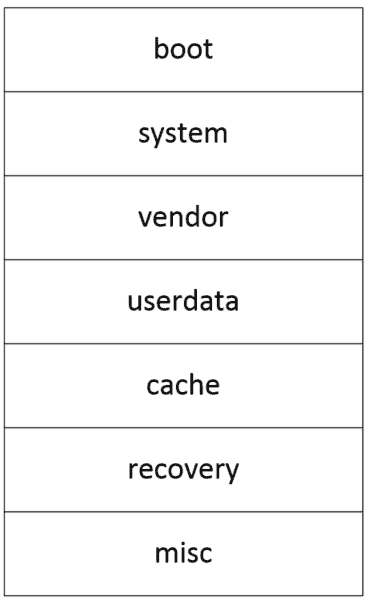
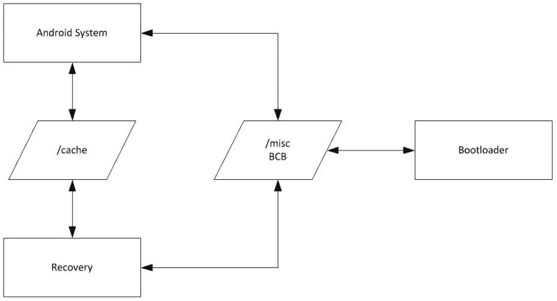
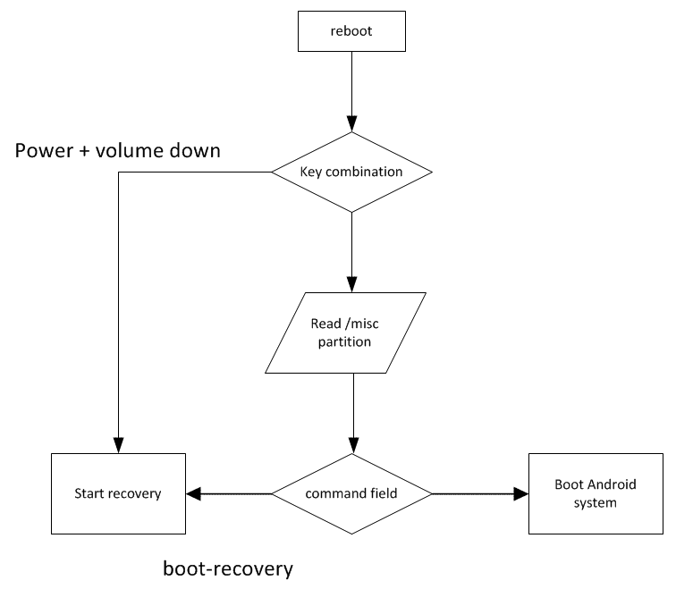
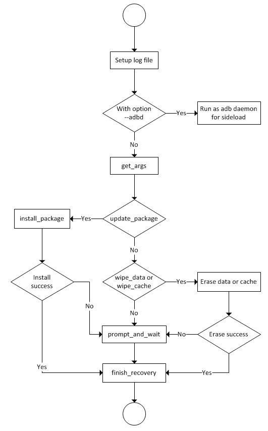
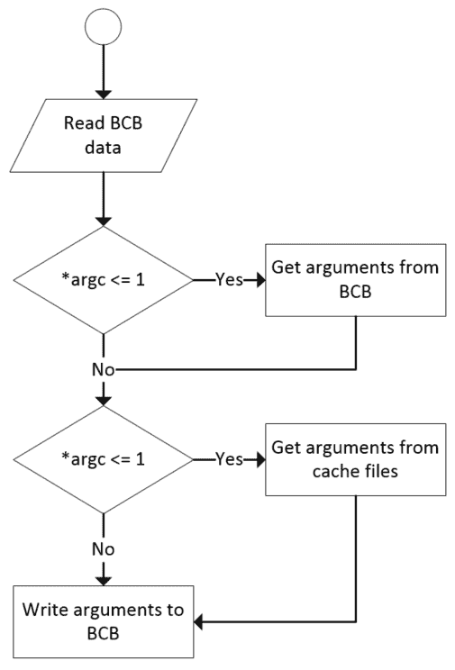
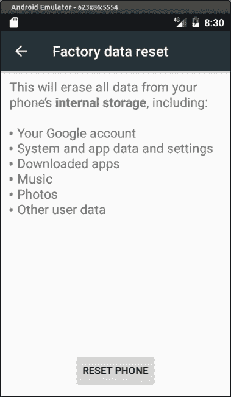

# 第十二章：介绍恢复

在这本书中，我们到目前为止已经完成了两个项目。通过第一个 x86emu 项目，我们学习了如何扩展现有设备以支持附加功能。之后，我们通过第二个项目 x86vbox 学习了如何创建新设备。在 Android 的系统级编程中，还有一个重要的话题，那就是如何修补或更新已发布的系统。

在 Android 系统中，修补或更新已发布系统的方法是使用一个名为**恢复**的工具。在接下来的三个章节中，我们将学习如何在 x86vbox 设备上构建恢复。由于 x86vbox 是为 VirtualBox 构建的，我们将使用 VirtualBox 作为本章的虚拟硬件，第十四章，*创建 OTA 更新包*。我们还将使用我们构建的恢复准备和测试几个更新包。在本章中，我们将涵盖以下主题：

+   恢复介绍

+   分析恢复源代码

+   为 x86vbox 构建恢复

# 恢复介绍

在 Android 中，恢复是一个包含内核和专用 ramdisk 的最小 Linux 环境。当这个最小 Linux 环境启动时，它会运行一个二进制工具，即恢复，以进入所谓的恢复模式。恢复模式的 Linux 内核和 ramdisk 通常存储在一个专用的可启动分区中。在恢复模式下，内核和根文件系统都在内存中，因此它可以管理其他分区而无需任何依赖。

在现场更新设备有两种方法。第一种方法是使用引导加载程序中的 fastboot 协议。设备可以通过引导加载程序进行重写。在这种情况下，您可以在 fastboot 模式下启动您的设备，并使用 Android SDK 中的 fastboot 工具来重写您的设备。第二种方法是通过恢复模式来重写设备。如果您将设备启动到恢复模式，您可以使用存储上的映像文件或通过 USB 在 sideload 模式下提供映像来重写设备。

引导加载程序和恢复可以使用的映像文件不同。来自 AOSP 构建输出的映像文件可以直接由引导加载程序使用。我们可以直接使用`fastboot`工具在引导加载程序中重写`system.img`、`userdata.img`、`boot.img`或`recovery.img`映像文件。我们不能使用这些映像文件进行恢复。我们必须使用 AOSP 中提供的工具专门构建恢复映像文件。我们将在下一章中介绍这个主题。

与快启协议相比，恢复模式的关键优势在于支持**空中**（**OTA**）更新。如果 OTA 服务器上有可用的更新，用户将收到通知。用户可以将更新下载到缓存或数据分区。在更新包使用其签名进行验证后，用户可以响应更新通知。之后，设备将重启进入恢复模式。在恢复模式下，将启动恢复二进制文件，并使用存储在`/cache/recovery/command`文件中的命令行参数来查找更新包以更新系统镜像。

# Android 设备分区

要在设备上启用恢复，我们需要再次查看设备分区。在 Android SDK 中，我们有以下可用于模拟器的镜像文件：

```java
$ ls system-images/android-25/default/x86
build.prop   kernel-ranchu  ramdisk.img        system.img
kernel-qemu  NOTICE.txt     source.properties  userdata.img  

```

启动模拟器后，我们可以看到以下分区已挂载：

```java
root@x86emu:/ # mount
rootfs / rootfs ro,seclabel,relatime 0 0
tmpfs /dev tmpfs rw,seclabel,nosuid,relatime,mode=755 0 0
devpts /dev/pts devpts rw,seclabel,relatime,mode=600 0 0
proc /proc proc rw,relatime 0 0
sysfs /sys sysfs rw,seclabel,relatime 0 0
selinuxfs /sys/fs/selinux selinuxfs rw,relatime 0 0
debugfs /sys/kernel/debug debugfs rw,seclabel,relatime 0 0
none /acct cgroup rw,relatime,cpuacct 0 0
none /sys/fs/cgroup tmpfs rw,seclabel,relatime,mode=750,gid=1000 0 0
tmpfs /mnt tmpfs rw,seclabel,relatime,mode=755,gid=1000 0 0
none /dev/cpuctl cgroup rw,relatime,cpu 0 0
/dev/block/vda /system ext4 ro,seclabel,relatime,data=ordered 0 0
/dev/block/vdb /cache ext4 rw,seclabel,nosuid,nodev,noatime,errors=panic,data=ordered 0 0
/dev/block/vdc /data ext4 rw,seclabel,nosuid,nodev,noatime,errors=panic,data=ordered 0 0
...  

```

我们可以看到`system`、`data`和`cache`分区已挂载为 virtio 块设备。由于 virtio 是网络和磁盘设备驱动程序的虚拟化标准，性能应该优于物理设备驱动程序。仅使用这些分区，我们无法创建一个可以使用恢复工具的系统。在下图中，这些是我们需要在存储设备上拥有的最小分区，以支持快启和恢复：



Android 设备分区

+   **引导**：这是包含内核和 ramdisk 镜像的分区。

+   **系统**：这是包含 Android 系统的分区。它通常作为只读挂载，只能在 OTA 更新期间进行更改。

+   **厂商**：这是包含厂商私有系统文件的分区。它与系统分区类似，作为只读挂载，只能在 OTA 更新期间进行更改。

+   **用户数据**：此分区包含用户安装的应用程序保存的数据。此分区通常不会在 OTA 更新过程中被触及。

+   **缓存**：此分区持有临时数据。OTA 包安装可以使用它作为工作空间。

+   **恢复**：此分区包含用于恢复的 Linux 内核和 ramdisk。它与引导分区类似，只是 ramdisk 镜像仅用于恢复模式。

+   **杂项**：此分区由恢复用于在不同引导会话之间存储信息。

在本章中，我们将为 x86vbox 设备构建恢复。正如我们从第八章“在 VirtualBox 上创建自己的设备”到第十一章“启用 VirtualBox 特定硬件接口”所学的，我们只为 x86vbox 设备使用一个分区来存储所有内容。我们将在本章前面的解释基础上，稍后扩展 x86vbox 设备以使用多个分区。

# 分析恢复

在我们开始为我们的 x86vbox 设备构建恢复之前，我们将分析恢复的代码流程以了解其工作原理。从最终用户的角度来看，有两种进入恢复模式的方法。当用户想要执行出厂重置或可用 OTA 更新时，主系统可以在重置系统之前将恢复命令写入**引导加载程序控制块**（**BCB**）和缓存分区。

进入恢复模式的第二种方法是手动使用键组合。在关闭手机后，同时按下一个键组合以手动进入恢复模式。键组合由设备制造商定义，例如，它可以是音量下键和电源按钮的组合。

在这两种情况下，进入恢复模式与引导加载程序的实现密切相关。Android 系统、恢复和引导加载程序通过两个接口相互通信：分区`/cache`和`/misc`。我们可以使用以下图表来描述通信接口：



Android 系统、恢复和引导加载程序的接口

在前面的图表中，引导加载程序使用`/misc`分区中的**BCB**与 Android 系统和恢复进行通信。Android 系统和恢复使用`/cache`分区中的信息相互通信。让我们深入了解这两个通信通道的细节。

# BCB

BCB 是引导加载程序与主系统和恢复之间的通信接口。

Android 系统在恢复源代码中也被称为主系统。在本章中，我们将主系统一词与 Android 系统视为同义词。

BCB 以原始分区格式存储在`/misc`分区中，这意味着这个分区就像一个没有文件系统的二进制文件一样被使用。

恢复使用`recovery.fstab`文件挂载系统中的所有分区。如果我们查看`recovery.fstab`中`/misc`分区的文件系统类型，它是`emmc`，这是恢复中使用的原始文件系统之一：

```java
/dev/block/by-name/misc    /misc    emmc    defaults    defaults  

```

恢复支持五种文件系统类型，包括两种原始文件系统和三种正常文件系统。

支持的两个原始文件系统是：

+   `mtd`：这是旧版 Android 设备中使用的分区。这些设备使用 NAND 闪存和 MTD 分区。

+   `emmc`：这是最近 Android 设备中使用的原始 eMMC 块设备。

`boot`、`recovery`和`misc`分区可以是`mtd`或`emmc`文件系统类型。

支持的正常文件系统类型包括：

+   `yaffs2`：`yaffs2`文件系统通常用于 MTD 设备的`system`、`userdata`或`cache`分区。这通常用于较老的 Android 设备。

+   `ext4`：在最新的 Android 设备中，使用 eMMC 块设备。通常在 eMMC 块设备上使用标准的 Linux `ext4`文件系统。与`yaffs2`文件系统类型一样，`system`、`userdata`或`cache`分区可以使用`ext4`格式。

+   `vfat`：这是用于外部存储（如 SD 卡或 USB）的文件系统类型。

让我们回到 BCB 的话题。在`$AOSP/bootable/recovery/bootloader.h`文件中，BCB 被定义为以下数据结构：

```java
struct bootloader_message { 
    char command[32]; 
    char status[32]; 
    char recovery[768]; 
    char stage[32]; 
    char reserved[224]; 
}; 

```

当主系统想要将设备重启到恢复模式时，会使用`command`字段。这可能是用户从设置中选择出厂重置或可用 OTA 更新时的情况。引导加载程序也可以使用此字段，当引导加载程序完成固件更新时，它可能想要进入恢复模式进行最后的清理。

系统引导加载程序在完成固件更新后更新`status`字段。

`recovery`字段由主系统用于向恢复发送消息，或者恢复可能使用此字段向主系统发送消息。

`stage`字段用于指示更新的阶段。在某些情况下，安装更新包可能需要多次重启。恢复用户界面可以使用此字段来显示安装的当前阶段：



在前面的图中，显示与检查键组合和 BCB 相关的引导加载程序逻辑。只要引导加载程序根据 AOSP 恢复定义处理 BCB，实现可以是供应商特定的。通常，引导加载程序首先检查键组合，以决定用户是否想要进入恢复模式。如果没有按下键组合，它将检查 BCB 以决定引导路径。

# 缓存分区

缓存分区中有三个文件，可以作为主系统和恢复工具之间的通信通道。这三个文件是：

+   `/cache/recovery/command`：这是一个从恢复点输入参数的文件。此文件中每行有一个命令。可能在此文件中提供的参数是：

    +   `-send_intent=anystring`：主系统可能使用此命令在恢复退出后向自身发送消息

    +   `-update_package=path`：此命令指定安装 OTA 包文件的路径

    +   `-wipe_data`：此命令指示恢复擦除用户数据（和缓存），然后重启

    +   `-wipe_cache`：此命令指示恢复擦除缓存（但不擦除用户数据），然后重启

    +   `-set_encrypted_filesystem=on|off`：启用/禁用加密文件系统

    +   `-just_exit`：不执行任何操作；退出并重启

+   `/cache/recovery/log`：恢复的运行时日志文件位于`/tmp/recovery.log`。在恢复退出之前，它将备份旧日志文件并将当前日志文件移动到`/cache/recovery/log`。

+   `/cache/recovery/intent`：在恢复退出之前，它将检查是否有任何需要通过此文件发送到主系统的意图。意图可以是主系统通过`/cache/recovery/command`文件中的`-send_intent`命令发送给恢复的消息。

# 恢复的主流程

在我们了解了关于恢复以及与恢复相关的所有背景知识后，让我们看看恢复的主要工作流程。我们将使用以下流程图来探索恢复的工作流程：

1.  当开始恢复时，它首先将日志文件设置为 `/tmp/recovery.log`。

1.  之后，它检查 `--adbd` 选项。如果指定了此选项，它将运行用于侧载的 `adb` 守护程序。您可以参考 `$AOSP/bootable/recovery/adb_install.cpp` 中的源代码，了解如何以 `adb` 守护程序启动恢复。

1.  它通过调用 `get_args` 函数从缓存分区和 BCB 中检索和处理参数。

1.  根据 `get_args` 从中检索到的命令，它可能会调用 `install_package` 函数来安装更新，或者调用 `wipe_data` 或 `wipe_cache` 函数来擦除用户数据或缓存分区。

1.  如果没有更新包或擦除数据的命令，它将调用 `prompt_and_wait` 函数进入恢复用户界面。根据用户输入，它可能会调用 `apply_from_adb` 或 `apply_from_sdcard` 从 USB 或 SD 卡更新包。它可能会调用 `wipe_data` 或 `wipe_cache` 函数来擦除用户数据或缓存分区等。

1.  在所有任务完成或用户选择退出恢复后，它将调用清理函数 `finish_recovery` 来进行最后的清理。之后，它将重新启动或关闭系统：



恢复工作流程

根据前面的流程分析，我们可以查看 `$AOSP/bootable/recovery/recovery.cpp` 中的 `main` 函数的代码片段如下：

```java
int 
main(int argc, char **argv) { 
    time_t start = time(NULL); 

    redirect_stdio(TEMPORARY_LOG_FILE); 

    ... 
    if (argc == 2 && strcmp(argv[1], "--adbd") == 0) { 
        adb_main(0, DEFAULT_ADB_PORT); 
        return 0; 
    } 

    printf("Starting recovery (pid %d) on %s", getpid(), 
    ctime(&start)); 

    load_volume_table(); 
    get_args(&argc, &argv); 

    ... 
    ui->Print("Supported API: %d\n", RECOVERY_API_VERSION); 

    int status = INSTALL_SUCCESS; 

    if (update_package != NULL) { 
        status = install_package(update_package, &should_wipe_cache, 
        TEMPORARY_INSTALL_FILE, true); 
        if (status == INSTALL_SUCCESS && should_wipe_cache) { 
            wipe_cache(false, device); 
        } 
    ... 
    } else if (should_wipe_data) { 
        if (!wipe_data(false, device)) { 
            status = INSTALL_ERROR; 
        } 
    } else if (should_wipe_cache) { 
        if (!wipe_cache(false, device)) { 
            status = INSTALL_ERROR; 
        } 
    } else if (sideload) { 
    ... 
    Device::BuiltinAction after = shutdown_after ? Device::SHUTDOWN : 
    Device::REBOOT; 
    if ((status != INSTALL_SUCCESS && !sideload_auto_reboot) || ui-
    >IsTextVisible()) { 
        Device::BuiltinAction temp = prompt_and_wait(device, status); 
        if (temp != Device::NO_ACTION) { 
            after = temp; 
        } 
    } 

    // Save logs and clean up before rebooting or shutting down. 
    finish_recovery(send_intent); 

    switch (after) { 
        case Device::SHUTDOWN: 
            ui->Print("Shutting down...\n"); 
            property_set(ANDROID_RB_PROPERTY, "shutdown,"); 
            break; 

        case Device::REBOOT_BOOTLOADER: 
            ui->Print("Rebooting to bootloader...\n"); 
            property_set(ANDROID_RB_PROPERTY, "reboot,bootloader"); 
            break; 

        default: 
            ui->Print("Rebooting...\n"); 
            property_set(ANDROID_RB_PROPERTY, "reboot,"); 
            break; 
    } 
    sleep(5); // should reboot before this finishes 
    return EXIT_SUCCESS; 
} 

```

在我们了解了恢复工作流程的概述后，我们将看看恢复如何在 `get_args` 函数中从 BCB 或缓存文件中检索参数。之后，我们将从用户的角度查看两个重要的工作流程：工厂重置和 OTA 更新。

# 从 BCB 和缓存文件中检索参数

如我们在恢复的主要函数中看到的那样，它调用了 `get_args` 函数从主系统或引导加载程序中检索参数。以下是为 `get_args` 的流程图。它与恢复的 `main` 函数位于同一 `$AOSP/bootable/recovery/recovery.cpp` 文件中。



get_args 流程图

从以下代码片段中，我们可以看到它调用了 `get_bootloader_message` 函数来获取 BCB 数据结构 `boot`：

```java
static void 
get_args(int *argc, char ***argv) { 
    struct bootloader_message boot; 
    memset(&boot, 0, sizeof(boot)); 
    get_bootloader_message(&boot);  // this may fail, leaving a zeroed 
                                    //structure 
    stage = strndup(boot.stage, sizeof(boot.stage)); 
    ... 

```

如果没有参数，`argc` 的值将小于或等于 1。它将尝试从 BCB 中获取参数，如下面的代码片段所示。在 BCB 的 `recovery` 字段中，命令将以 `recovery\n` 开始。`recovery\n` 之后的内容与缓存命令文件格式相同，即 `/cache/recovery/command`：

```java
if (*argc <= 1) { 
    boot.recovery[sizeof(boot.recovery) - 1] = '\0'; 
    const char *arg = strtok(boot.recovery, "\n"); 
    if (arg != NULL && !strcmp(arg, "recovery")) { 
        *argv = (char **) malloc(sizeof(char *) * MAX_ARGS); 
        (*argv)[0] = strdup(arg); 
        for (*argc = 1; *argc < MAX_ARGS; ++*argc) { 
            if ((arg = strtok(NULL, "\n")) == NULL) break; 
            (*argv)[*argc] = strdup(arg); 
        } 
        LOGI("Got arguments from boot message\n"); 
    } else if (boot.recovery[0] != 0 && boot.recovery[0] != 255) { 
        LOGE("Bad boot message\n\"%.20s\"\n", boot.recovery); 
    } 
} 

```

如果可以从 BCB 中检索到参数，它将跳过缓存命令文件。否则，它将尝试按照以下方式从缓存命令文件中读取参数：

```java
if (*argc <= 1) { 
    FILE *fp = fopen_path(COMMAND_FILE, "r"); 
    if (fp != NULL) { 
        char *token; 
        char *argv0 = (*argv)[0]; 
        *argv = (char **) malloc(sizeof(char *) * MAX_ARGS); 
        (*argv)[0] = argv0;  // use the same program name 

        char buf[MAX_ARG_LENGTH]; 
        for (*argc = 1; *argc < MAX_ARGS; ++*argc) { 
            if (!fgets(buf, sizeof(buf), fp)) break; 
            token = strtok(buf, "\r\n"); 
            if (token != NULL) { 
                (*argv)[*argc] = strdup(token); 
            } else { 
                --*argc; 
            } 
        } 

        check_and_fclose(fp, COMMAND_FILE); 
        LOGI("Got arguments from %s\n", COMMAND_FILE); 
    } 
} 

```

在处理完 BCB 和缓存命令文件后，它将 BCB 块写入`/misc`分区，以便在更新或擦除过程中出现任何错误时，重启后相同的进程将继续：

```java
strlcpy(boot.command, "boot-recovery", sizeof(boot.command)); 
strlcpy(boot.recovery, "recovery\n", sizeof(boot.recovery)); 
int i; 
for (i = 1; i < *argc; ++i) { 
    strlcat(boot.recovery, (*argv)[i], sizeof(boot.recovery)); 
    strlcat(boot.recovery, "\n", sizeof(boot.recovery)); 
} 
set_bootloader_message(&boot); 

```

从前面的代码分析中，我们可以看到缓存命令文件只是一个普通的文本文件。它可以通过使用标准的 C 函数来访问。要访问 BCB 数据结构的`/misc`分区，使用`get_bootloader_message`函数读取 BCB，并使用`set_bootloader_message`函数写入 BCB。BCB 数据结构`bootloader_message`在`bootloader.h`文件中定义，相关函数在`bootloader.cpp`文件中实现。

`/misc`分区是一个原始分区，它被`bootloader.cpp`中的代码作为一个普通文件而不是文件系统卷来使用。

我们可以快速查看`get_bootloader_message`函数及其支持函数`get_bootloader_message_block`，如下所示：

```java
int get_bootloader_message(struct bootloader_message *out) { 
    Volume* v = volume_for_path("/misc"); 
    if (v == NULL) { 
      LOGE("Cannot load volume /misc!\n"); 
      return -1; 
    } 
    if (strcmp(v->fs_type, "mtd") == 0) { 
        return get_bootloader_message_mtd(out, v); 
    } else if (strcmp(v->fs_type, "emmc") == 0) { 
        return get_bootloader_message_block(out, v); 
    } 
    LOGE("unknown misc partition fs_type \"%s\"\n", v->fs_type); 
    return -1; 
} 

```

在`get_bootloader_message`函数中，它将根据分区类型调用另一个函数，`/misc`。正如我们所见，支持的原始文件系统类型是`mtd`和`emmc`。我们可以查看`emmc`版本的`get_bootloader_message_block`，如下所示：

```java
static int get_bootloader_message_block(struct bootloader_message *out, 
const Volume* v) { 
    wait_for_device(v->blk_device); 
    FILE* f = fopen(v->blk_device, "rb"); 
    if (f == NULL) { 
        LOGE("Can't open %s\n(%s)\n", v->blk_device, strerror(errno)); 
        return -1; 
    } 
    struct bootloader_message temp; 
    int count = fread(&temp, sizeof(temp), 1, f); 
    if (count != 1) { 
        LOGE("Failed reading %s\n(%s)\n", v->blk_device, 
        strerror(errno)); 
        return -1; 
    } 
    if (fclose(f) != 0) { 
        LOGE("Failed closing %s\n(%s)\n", v->blk_device, 
        strerror(errno)); 
        return -1; 
    } 
    memcpy(out, &temp, sizeof(temp)); 
    return 0; 
} 

```

正如我们所见，在`get_bootloader_message_block`函数中，它使用 C 函数`fopen`、`fread`和`fclose`将`/misc`分区作为普通文件访问。

现在我们已经完成了 BCB 和缓存文件处理的分析。在接下来的两节中，我们将探讨恢复过程中最重要的两个工作流程：

+   工厂数据重置

+   OTA 更新

# 工厂数据重置

恢复的主要功能之一是支持工厂数据重置。通常，用户可以从设备上的设置中选择工厂数据重置，如下面的截图所示：



工厂数据重置

整个过程可以分为以下步骤：

1.  用户从设置中选择工厂数据重置。

1.  主系统将`--wipe_data`写入`/cache/recovery/command`。

1.  主系统重新启动设备进入恢复模式。我们已经在上一节讨论 BCB 时对此进行了分析。

1.  恢复从 BCB 或`/cache/recovery/command`中的`get_args()`检索参数。在读取参数后，恢复将使用`boot-recovery`和`--wipe_data`写入 BCB。

1.  恢复擦除`/data`和`/cache`分区。在此之后，任何后续的重启将继续此步骤，直到擦除完成或用户从恢复用户界面采取其他操作退出恢复。

1.  在擦除`/data`和`/cache`分区后，恢复调用`finish_recovery`函数来擦除 BCB。

1.  恢复将设备重新启动到主系统。

我们已经分析了前面的大多数步骤，除了`finish_recovery`。让我们看看`finish_recovery`函数：

```java
static void 
finish_recovery(const char *send_intent) { 
    // By this point, we're ready to return to the main system... 
    if (send_intent != NULL) { 
        FILE *fp = fopen_path(INTENT_FILE, "w"); 
        if (fp == NULL) { 
            LOGE("Can't open %s\n", INTENT_FILE); 
        } else { 
            fputs(send_intent, fp); 
            check_and_fclose(fp, INTENT_FILE); 
        } 
    } 

    if (locale != NULL) { 
        LOGI("Saving locale \"%s\"\n", locale); 
        FILE* fp = fopen_path(LOCALE_FILE, "w"); 
        fwrite(locale, 1, strlen(locale), fp); 
        fflush(fp); 
        fsync(fileno(fp)); 
        check_and_fclose(fp, LOCALE_FILE); 
    } 

    copy_logs(); 

    struct bootloader_message boot; 
    memset(&boot, 0, sizeof(boot)); 
    set_bootloader_message(&boot); 

    if (ensure_path_mounted(COMMAND_FILE) != 0 || 
        (unlink(COMMAND_FILE) && errno != ENOENT)) { 
        LOGW("Can't unlink %s\n", COMMAND_FILE); 
    } 

    ensure_path_unmounted(CACHE_ROOT); 
    sync();  // For good measure. 
} 

```

在`finish_recovery`函数中，它将意图写入`/cache/recovery/intent`。然后，它处理本地文件并创建日志文件备份。最后，通过调用`set_bootloader_message`擦除 BCB，并删除`/cache/recovery/command`以恢复正常的启动过程。

# OTA 更新

OTA 更新是恢复的另一个主要功能。在手动进入恢复模式后，可以使用恢复用户界面更新 OTA 包。在接收到更新通知后也可以自动更新。在这两种情况下，更新包的路径可能不同，但安装过程是相同的。在本节中，我们将查看设备接收到 OTA 更新通知后的流程。然后，我们将探讨安装过程的细节：

1.  设备接收到 OTA 更新通知后，主系统将 OTA 包下载到`/cache/update.zip`。

1.  主系统将`--update_package=/cache/update.zip`命令写入`/cache/recovery/command`。

1.  主系统将设备重新启动到恢复模式。

1.  恢复过程在`get_args()`中从 BCB 或`/cache/recovery/command`检索参数。读取参数后，恢复过程将使用`boot-recovery`和`update_package=...`写入 BCB。

1.  恢复过程调用`install_package`来安装更新。在此步骤中，任何后续的重启将继续此步骤，直到安装完成。

1.  如果安装失败，将调用`prompt_and_wait`函数来显示错误并等待用户操作。如果安装成功完成，它将进入下一步。

1.  恢复过程调用`finish_recovery`函数来擦除 BCB 并删除`/cache/recovery/command`文件。

1.  恢复过程将设备重新启动到主系统。

一旦更新包下载完成，安装将由`install_package`函数完成：

```java
int 
install_package(const char* path, bool* wipe_cache, const char* install_file, bool needs_mount) 
{ 
    modified_flash = true; 

    FILE* install_log = fopen_path(install_file, "w"); 
    if (install_log) { 
        fputs(path, install_log); 
        fputc('\n', install_log); 
    } else { 
        LOGE("failed to open last_install: %s\n", strerror(errno)); 
    } 
    int result; 
    if (setup_install_mounts() != 0) { 
        LOGE("failed to set up expected mounts for install; 
        aborting\n"); 
        result = INSTALL_ERROR; 
    } else { 
        result = really_install_package(path, wipe_cache, needs_mount); 
    } 
    if (install_log) { 
        fputc(result == INSTALL_SUCCESS ? '1' : '0', install_log); 
        fputc('\n', install_log); 
        fclose(install_log); 
    } 
    return result; 
} 

```

在`install_package`函数中，它首先设置安装日志文件。日志文件路径是`/tmp/last_install`。然后，它调用`setup_install_mounts`来挂载相关分区。实际的安装是在`really_install_package`函数中完成的，如下面的代码片段所示：

```java
static int 
really_install_package(const char *path, bool* wipe_cache, bool needs_mount) 
{ 
    ui->SetBackground(RecoveryUI::INSTALLING_UPDATE); 
    ... 

    MemMapping map; 
    if (sysMapFile(path, &map) != 0) { 
        LOGE("failed to map file\n"); 
        return INSTALL_CORRUPT; 
    } 

    int numKeys; 
    Certificate* loadedKeys = load_keys(PUBLIC_KEYS_FILE, &numKeys); 
    if (loadedKeys == NULL) { 
        LOGE("Failed to load keys\n"); 
        return INSTALL_CORRUPT; 
    } 
    LOGI("%d key(s) loaded from %s\n", numKeys, PUBLIC_KEYS_FILE); 

    ui->Print("Verifying update package...\n"); 

    int err; 
    err = verify_file(map.addr, map.length, loadedKeys, numKeys); 
    free(loadedKeys); 
    LOGI("verify_file returned %d\n", err); 
    if (err != VERIFY_SUCCESS) { 
        LOGE("signature verification failed\n"); 
        sysReleaseMap(&map); 
        return INSTALL_CORRUPT; 
    } 

    /* Try to open the package. 
     */ 
    ZipArchive zip; 
    err = mzOpenZipArchive(map.addr, map.length, &zip); 
    if (err != 0) { 
        LOGE("Can't open %s\n(%s)\n", path, err != -1 ? strerror(err) : 
        "bad"); 
        sysReleaseMap(&map); 
        return INSTALL_CORRUPT; 
    } 

    /* Verify and install the contents of the package. 
     */ 
    ui->Print("Installing update...\n"); 
    ui->SetEnableReboot(false); 
    int result = try_update_binary(path, &zip, wipe_cache); 
    ui->SetEnableReboot(true); 
    ui->Print("\n"); 

    sysReleaseMap(&map); 

    return result; 
} 

```

在`really_install_package`函数中，它初始化用户界面并在屏幕上显示包位置。然后，它为更新包创建内存映射，这是`zip`函数所需的。之后，它使用其签名验证更新包。最后，它调用另一个函数`try_update_binary,`来完成安装。

`try_update_binary`函数执行三个任务：

1.  从更新包中提取`update_binary`。

1.  准备环境以执行`update_binary`。

1.  监控安装进度。

让我们详细了解这三个任务：

```java
static int 
try_update_binary(const char* path, ZipArchive* zip, bool* wipe_cache) { 
    const ZipEntry* binary_entry = 
            mzFindZipEntry(zip, ASSUMED_UPDATE_BINARY_NAME); 
    if (binary_entry == NULL) { 
        mzCloseZipArchive(zip); 
        return INSTALL_CORRUPT; 
    } 

    const char* binary = "/tmp/update_binary"; 
    unlink(binary); 
    int fd = creat(binary, 0755); 
    if (fd < 0) { 
        mzCloseZipArchive(zip); 
        LOGE("Can't make %s\n", binary); 
        return INSTALL_ERROR; 
    } 
    bool ok = mzExtractZipEntryToFile(zip, binary_entry, fd); 
    close(fd); 
    mzCloseZipArchive(zip); 

    if (!ok) { 
        LOGE("Can't copy %s\n", ASSUMED_UPDATE_BINARY_NAME); 
        return INSTALL_ERROR; 
    } 

```

它尝试从更新包中提取`update_binary`。`update_binary`在更新包中的路径在`META-INF/com/google/android/update-binary`中预定义。

如果`update_binary`可以成功提取，它将被复制到`/tmp/update_binary`：

```java
int pipefd[2]; 
pipe(pipefd); 
const char** args = (const char**)malloc(sizeof(char*) * 5); 
args[0] = binary; 
args[1] = EXPAND(RECOVERY_API_VERSION);   // defined in Android.mk 
char* temp = (char*)malloc(10); 
sprintf(temp, "%d", pipefd[1]); 
args[2] = temp; 
args[3] = (char*)path; 
args[4] = NULL; 

pid_t pid = fork(); 
if (pid == 0) { 
    umask(022); 
    close(pipefd[0]); 
    execv(binary, (char* const*)args); 
    fprintf(stdout, "E:Can't run %s (%s)\n", binary, strerror(errno)); 
    _exit(-1); 
} 

```

如前述代码片段所示，在提取`update_binary`之后，它将准备环境以执行`update_binary`。更新包的安装实际上是通过脚本由`update_binary`完成的。以下参数被传递给`update_binary`以执行：

+   `update_binary`的路径

+   恢复版本

+   父进程和子进程之间的管道用于通信

+   更新包的路径

在环境准备就绪后，它将派生一个子进程来运行`update_binary`。父进程将通过管道与子进程通信来监控安装进度：

```java
    close(pipefd[1]); 

    *wipe_cache = false; 

    char buffer[1024]; 
    FILE* from_child = fdopen(pipefd[0], "r"); 
    while (fgets(buffer, sizeof(buffer), from_child) != NULL) { 
        char* command = strtok(buffer, " \n"); 
        if (command == NULL) { 
            continue; 
        } else if (strcmp(command, "progress") == 0) { 
            char* fraction_s = strtok(NULL, " \n"); 
            char* seconds_s = strtok(NULL, " \n"); 

            float fraction = strtof(fraction_s, NULL); 
            int seconds = strtol(seconds_s, NULL, 10); 

            ui->ShowProgress(fraction * (1-VERIFICATION_PROGRESS_FRACTION), 
            seconds); 
        } else if (strcmp(command, "set_progress") == 0) { 
            char* fraction_s = strtok(NULL, " \n"); 
            float fraction = strtof(fraction_s, NULL); 
            ui->SetProgress(fraction); 
        } else if (strcmp(command, "ui_print") == 0) { 
            char* str = strtok(NULL, "\n"); 
            if (str) { 
                ui->Print("%s", str); 
            } else { 
                ui->Print("\n"); 
            } 
            fflush(stdout); 
        } else if (strcmp(command, "wipe_cache") == 0) { 
            *wipe_cache = true; 
        } else if (strcmp(command, "clear_display") == 0) { 
            ui->SetBackground(RecoveryUI::NONE); 
        } else if (strcmp(command, "enable_reboot") == 0) { 
            ui->SetEnableReboot(true); 
        } else { 
            LOGE("unknown command [%s]\n", command); 
       } 
    } 
    fclose(from_child); 

    int status; 
    waitpid(pid, &status, 0); 
    if (!WIFEXITED(status) || WEXITSTATUS(status) != 0) { 
       LOGE("Error in %s\n(Status %d)\n", path, WEXITSTATUS(status)); 
       return INSTALL_ERROR; 
    } 

```

如前述代码片段所示，父进程将从子进程接收命令以显示进度，打印信息到屏幕，或在安装后设置清理配置。

# 为 x86vbox 构建恢复

在分析恢复源代码的工作流程和关键元素后，我们现在可以开始为我们的 x86vbox 设备构建它。

支持恢复构建的更改包括对 x86vbox 设备的更改以及对`recovery`和`newinstaller`的更改。

# 构建配置

在我们查看本章的更改之前，让我们先看看配置文件。像往常一样，我们为每个章节都有一个清单文件。我们根据第十一章的源代码，*启用 VirtualBox 特定的硬件接口*进行本章的更改。以下是我们将要更改的项目：

```java
<?xml version="1.0" encoding="UTF-8"?> 
<manifest> 

  <remote  name="github" 
           revision="refs/tags/android-7.1.1_r4_x86vbox_ch12_r1" 
           fetch="." /> 

  <remote  name="aosp" 
           fetch="https://android.googlesource.com/" /> 
  <default revision="refs/tags/android-7.1.1_r4" 
           remote="aosp" 
           sync-c="true" 
           sync-j="1" /> 

  ... 
  <project path="bootable/newinstaller" 
  name="platform_bootable_newinstaller" remote="github" /> 
  <project path="device/generic/common" name="device_generic_common" 
  groups="pdk" remote="github" /> 
  <project path="device/generic/x86vbox" name="x86vbox" remote="github" 
  /> 
  <project path="bootable/recovery" name="android_bootable_recovery" 
  remote="github" groups="pdk" /> 
  ... 

```

我们可以看到我们需要更改四个项目：`recovery`、`newinstaller`、`common`和`x86vbox`。我们使用`android-7.1.1_r4_x86vbox_ch12_r1`标签作为本章源代码的基线。

我们可以使用以下命令从 GitHub 和 AOSP 获取源代码：

```java
$ repo init -u https://github.com/shugaoye/manifests -b android-7.1.1_r4_ch12_aosp
$ repo sync 

```

在我们获取本章的源代码后，我们可以设置环境并按如下方式构建系统：

```java
$ source build/envsetup.sh
$ lunch x86vbox-eng
$ make -j4

```

要构建`initrd.img`，您可以运行以下命令：

```java
$ make initrd USE_SQUASHFS=0 

```

# x86vbox 的更改

对于 x86vbox 设备，我们首先需要更改 Makefiles 设备。由于我们从通用的 Android-x86 设备继承了 x86vbox，所以我们只有以下 Makefiles：

```java
$ ls *.mk
AndroidProducts.mk  BoardConfig.mk  x86vbox.mk  

```

`AndroidProducts.mk`是 Android 构建系统的入口，它包括我们的`x86vbox.mk` Makefile。在`x86vbox.mk`中，我们添加以下与恢复相关的文件：

```java
PRODUCT_COPY_FILES += \ 
... 
device/generic/x86vbox/recovery.fstab:recovery/root/etc/recovery.fstab \    device/generic/x86vbox/recovery/root/init.recovery.x86vbox.rc:root/init.recovery.x86vbox.rc \    device/generic/x86vbox/recovery/root/sbin/network_start.sh:recovery/root/sbin/network_start.sh \    device/generic/x86vbox/recovery/root/sbin/create_partitions.sh:recovery/root/sbin/create_partitions.sh \ 
... 

```

这些更改包括两部分。第一部分与针对 VirtualBox 的特定环境设置相关，因为我们是在 VirtualBox 的虚拟硬件上运行恢复。x86vbox 特定的初始化脚本`init.recovery.x86vbox.rc`将在系统启动时由 init 进程执行。

第二部分与存储设备的分区有关。正如我们在前面的章节中讨论的，我们不能像在第八章，*在 VirtualBox 上创建自己的设备*，到第十一章，*启用 VirtualBox 特定的硬件接口*中那样，使用单个分区进行恢复。分区表定义在 `recovery.fstab` 文件中。让我们首先看看启动脚本，`init.recovery.x86vbox.rc`：

```java
on init 
    exec -- /system/bin/logwrapper /system/bin/sh /system/etc/init.sh 

service network_start /sbin/network_start.sh 
    user root 
    seclabel u:r:recovery:s0 
    oneshot 

service console /system/bin/sh 
    class core 
    console 
    disabled 
    user shell 
    group shell log 
    seclabel u:r:shell:s0 

on property:ro.debuggable=1 
    start console 

```

作为 Android 的 init 脚本，恢复也有一个针对特定设备的 init 脚本，`init.recovery.${ro.hardware}.rc`。在我们的例子中，它是 `init.recovery.x86vbox.rc`。在 `init.recovery.x86vbox.rc` 中，它调用 Android-x86 HAL 初始化脚本，`/system/etc/init.sh`。在第八章，*在 VirtualBox 上创建自己的设备*中的 Android 启动部分的 HAL 初始化过程中，我们详细解释了 `/system/etc/init.sh` 脚本。

我们在 `init.recovery.x86vbox.rc` 中添加了两个服务，`network_start` 和 `console`。有了这两个服务，我们能够启用 VirtualBox 特定的网络接口，并且在启动后也可以拥有一个控制台。有了这个调试控制台，我们可以在本书的后续部分更容易地调试恢复过程。

`x86vbox.mk` 中的另一个重要部分是我们为恢复添加了一个 `recovery.fstab` 分区表，如下所示：

```java
/dev/block/sda1 /system  ext4  ro          wait 
/dev/block/sda2 /data    ext4  noatime,... wait 
/dev/block/sda3 /sdcard  vfat  defaults    voldmanaged=sdcard:auto 
/dev/block/sda5 /cache   ext4  noatime,... wait 
/dev/block/sda6 /misc    emmc  defaults    defaults 
/dev/block/sda7 /recovery emmc defaults    defaults 

```

如我们所见，我们现在有六个分区。我们实际上并没有一个支持 fastboot 协议和恢复 BCB 的引导加载程序，所以我们实际上并不使用 `/boot` 和 `/recovery` 分区。然而，我们确实有一个来自 Android-x86 的两阶段引导过程，并且我们可以有一个无需引导加载程序支持的解决方案。我们将在本章稍后查看对 `newinstaller` 的更改时看到这一点。

`recovery.fstab` 分区表由恢复使用，我们需要更改 Android 主系统的相关分区表，即 `device/generic/common/fstab.x86` 中的文件。

我们需要在 `device/generic/common/fstab.x86` 中添加两个条目，如下所示：

```java
/dev/block/sda3  /sdcard  vfat  defaults  voldmanaged=sdcard:auto 
/dev/block/sda5  /cache   ext4  noatime,... wait 

```

这个 `fstab.x86` 文件将在构建过程中被复制到系统镜像中，作为 `fstab.x86vbox`。init 进程将处理它以挂载分区。你可能想知道为什么分区表中没有 `/system` 和 `/data`。我们使用两阶段引导，它们在 Android 启动之前的第一阶段引导中挂载。`/system` 和 `/data` 的来源可以通过内核参数进行配置，正如我们在前面章节中解释两阶段引导过程时讨论的那样。

请注意，恢复和主系统应该挂载相同的块设备分区。例如，如果恢复和主系统为 `/cache` 挂载不同的分区，它们将无法通过 `/cache/recovery/command` 中的命令文件相互通信。

这就是`x86vbox.mk`更改的全部内容，现在让我们看看另一个 Makefile，`BoardConfig.mk`。为了启用恢复的构建，我们需要在`BoardConfig.mk`中添加以下两个宏：

```java
TARGET_NO_KERNEL := false 
TARGET_NO_RECOVERY := false 

```

这两个宏的默认值都设置为 true，这意味着内核和恢复在默认配置中都没有内置。

我们添加了另一个与恢复源代码更改相关的宏，我们将在稍后查看源代码更改：

```java
# Double buffer cannot work well on virtualbox 
RECOVERY_GRAPHICS_FORCE_SINGLE_BUFFER := true 

```

`RECOVERY_GRAPHICS_FORCE_SINGLE_BUFFER`宏是从**Team Win Recovery Project**（**TWRP**）的最新代码中借用的。随着 x86vbox Makefiles 的更改，我们实际上可以构建 TWRP。这是一个许多第三方 ROM（如 LineageOS/CyanogenMod、Omnirom 等）常用的第三方恢复工具。

# 恢复更改

AOSP 恢复代码在 VirtualBox 上可以很好地工作。只有一个与显示相关的问题。为了修复显示问题，我们需要更改恢复源代码中的两个文件。

我们使用前面提到的`RECOVERY_GRAPHICS_FORCE_SINGLE_BUFFER`宏来配置帧缓冲区更改。我们首先需要将其添加到恢复 Makefile `minui/Android.mk`中，如下所示：

```java
ifeq ($(RECOVERY_GRAPHICS_FORCE_SINGLE_BUFFER), true) 
LOCAL_CFLAGS += -DRECOVERY_GRAPHICS_FORCE_SINGLE_BUFFER 
endif 

```

由于双缓冲在 VirtualBox 上目前无法很好地工作，我们必须将其禁用如下：

```java
... 
    /* check if we can use double buffering */ 
#ifndef RECOVERY_GRAPHICS_FORCE_SINGLE_BUFFER 
    if (vi.yres * fi.line_length * 2 <= fi.smem_len) { 
        double_buffered = true; 

        memcpy(gr_framebuffer+1, gr_framebuffer, sizeof(GRSurface)); 
        gr_framebuffer[1].data = gr_framebuffer[0].data + 
            gr_framebuffer[0].height * gr_framebuffer[0].row_bytes; 

        gr_draw = gr_framebuffer+1; 

    } else { 
#else 
    { 
        printf("RECOVERY_GRAPHICS_FORCE_SINGLE_BUFFER := true\n"); 
#endif 
        double_buffered = false; 

        gr_draw = (GRSurface*) malloc(sizeof(GRSurface)); 
        memcpy(gr_draw, gr_framebuffer, sizeof(GRSurface)); 
        gr_draw->data = (unsigned char*) malloc(gr_draw->height * 
        gr_draw->row_bytes); 
        if (!gr_draw->data) { 
            perror("failed to allocate in-memory surface"); 
            return NULL; 
        } 
    }  
... 

```

通过对 TWRP 的类似更改，TWRP 也可以为 x86vbox 构建。构建 TWRP 的分支包含在 GitHub 的源代码中，您可以自己尝试。

# 新安装器更改

如我们在 BCB 部分所讨论的，引导加载程序根据 BCB 中存储的参数来决定引导路径。BCB 中存储的恢复命令与`/cache`分区中的`/cache/recovery/command`相同。实际上，我们可以将相同的逻辑移动到`initrd.img`的第一阶段引导中。在这种情况下，我们可以借助第一阶段引导实现相同的结果。工厂数据重置和 OTA 更新的逻辑将变为以下步骤：

1.  用户可以选择工厂数据重置或可用的 OTA 更新。

1.  主系统将命令`--wipe_data`或`--update_package=/cache/update.zip`写入`/cache/recovery/command`。

1.  主系统重新启动设备。

1.  在第一阶段引导中，init 脚本将检查`/cache`分区中是否存在`/cache/recovery/command`文件。

1.  如果`/cache/recovery/command`存在，它将加载`ramdisk-recovery.img`，否则，它将加载`ramdisk.img`。

1.  其余步骤将与正常引导过程或恢复引导过程相同。

为了实现前面的逻辑，我们在`$AOSP/bootable/newinstaller/initrd/init`文件中添加了一个 shell 函数`find_ramdisk`，如下所示：

```java
find_ramdisk() 
{ 
   busybox mount /dev/sda5 /hd 
   if [ ! -e /hd/recovery/command ]; then 
         busybox umount /hd 
         if [ "$RECOVERY" = "1" ]; then 
               RAMDISK=/mnt/$SRC/ramdisk-recovery.img 
         else 
               RAMDISK=/mnt/$SRC/ramdisk.img 
         fi 
   else 
         busybox umount /hd 
         RAMDISK=/mnt/$SRC/ramdisk-recovery.img 
         return 
   fi 
   echo boot using $RAMDISK ... 
} 

```

在这个函数中，我们将缓存分区挂载到`/hd`，并检查`/hd/recovery/command`是否存在。如果存在，我们将`RAMDISK`变量设置为`ramdisk-recovery.img`；否则，我们将其设置为`ramdisk.img`。init 脚本将在稍后提取`RAMDISK`变量中包含的 ramdisk，如下所示：

```java
... 
   zcat $RAMDISK | cpio -id > /dev/null  
... 

```

还有一个名为`RECOVERY`的变量，它在`find_ramdisk`中定义，可以从内核命令行传递给 init 脚本。使用这个变量，我们可以强制引导到恢复模式。

# 测试恢复

在我们构建了恢复和 AOSP 镜像之后，我们可以在 VirtualBox 中测试它们。正如我们在第九章中学到的，*使用 PXE/NFS 启动 x86vbox*，我们可以使用 PXE 引导系统，并使用 NFS 访问 AOSP 镜像。为了测试恢复，我们可以在`$HOME/.VirtualBox/TFTP/pxelinux.cfg/default`文件中添加一个选项，使用`kernel`和`ramdisk/recovery.img`引导。尽管我们现在可以引导系统到恢复模式，但我们无法使用本章中的恢复来更新系统。我们将在接下来的两章中了解更多信息。

# 摘要

我们已经完成了对 x86vbox 设备的恢复分析和实现。在本章的第一部分，我们分析了恢复源代码中的工作流程和关键元素。在本章的第二部分，我们将第一部分中获得的知识应用于 x86vbox 设备的恢复实现。我们修改了 x86vbox 设备本身以添加恢复支持。我们还修改了恢复源代码以修复显示问题。最后，我们修改了 newinstaller，以便我们可以在主系统和恢复系统中都有完整的引导流程。

在下一章中，我们将讨论如何创建恢复包，并解释恢复包中包含的内容。
