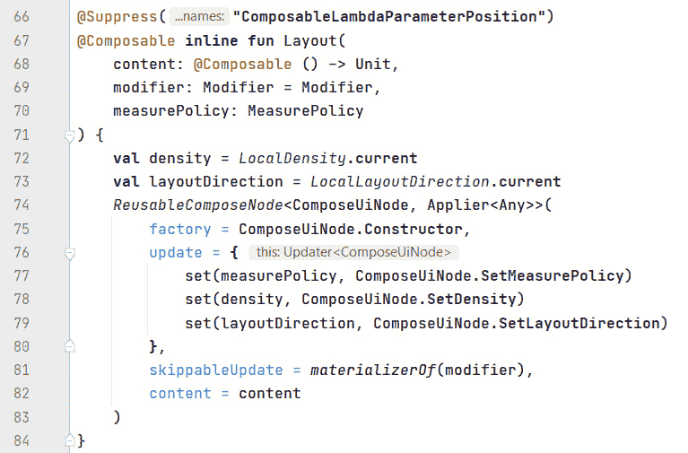
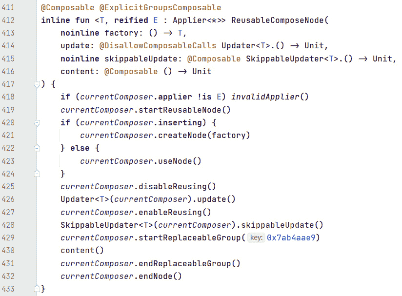
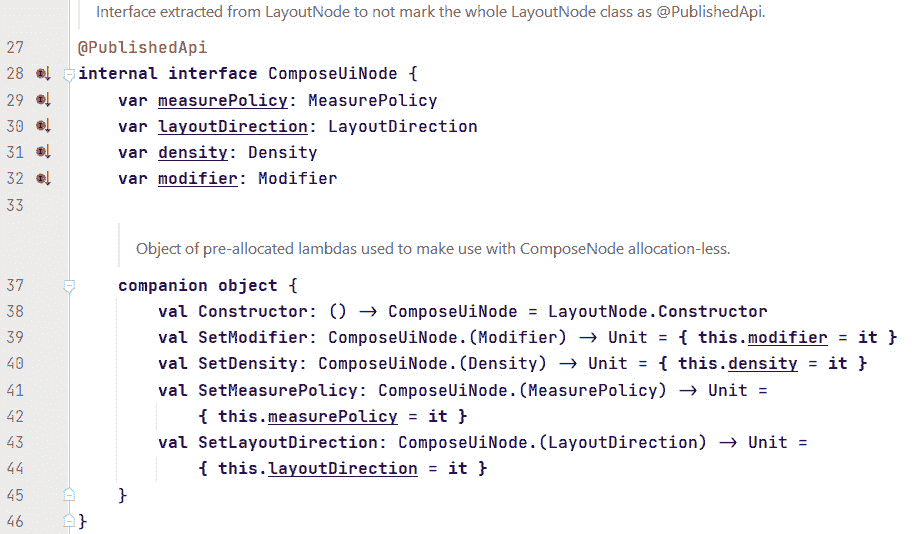
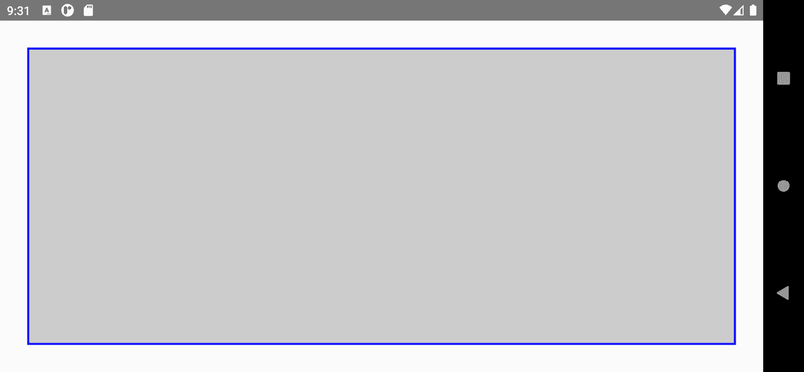
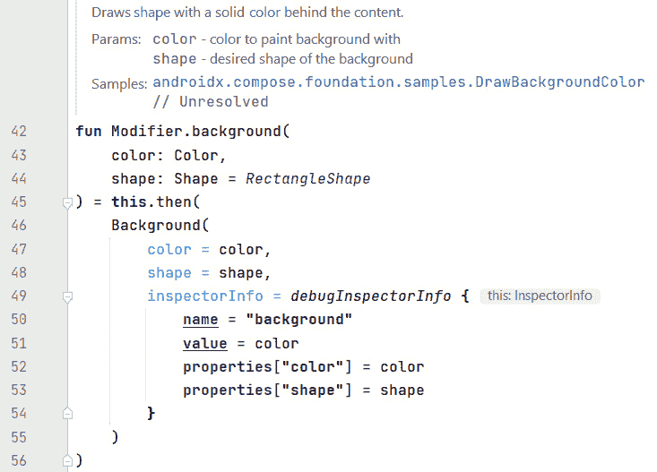
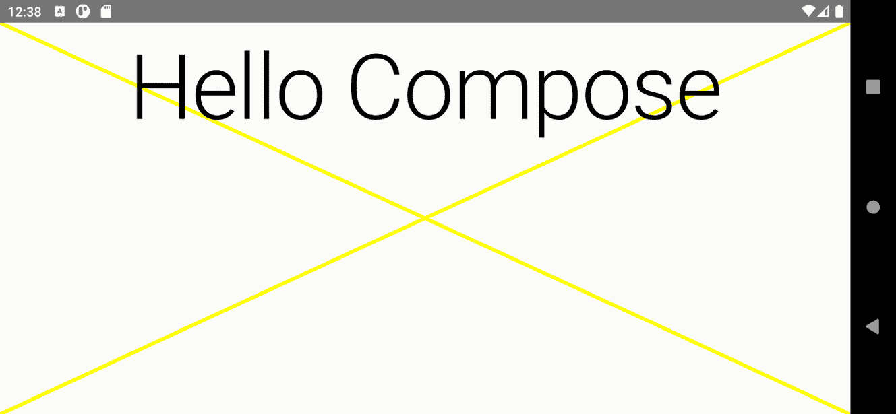

# 第三章：探索 Compose 的关键原则

在本书的第一章中，我们构建并运行了我们的第一个 Jetpack Compose 应用。然后，在*第二章*，*理解声明式范式*中，我们解释了 Android 传统 UI 工具箱的命令式本质，展示了其一些弱点，并看到了声明式方法如何克服它们。

在本章中，我们通过考察 Jetpack Compose 依赖的一些关键原则来建立这些基础。这些知识对于编写表现良好的 Compose 应用至关重要。本章介绍了这些关键原则。

在本章中，我们将涵盖以下主题：

+   仔细研究可组合函数

+   组合和重新组合**用户界面**（**UI**）

+   修改可组合函数的行为

我们将首先回顾可组合函数，这是可组合 UI 的构建块。这次，我们将深入挖掘其背后的思想和概念。到第一主要部分的结尾，你将全面理解什么是可组合函数，它们是如何编写的，以及它们是如何被使用的。

以下部分将专注于创建和更新 UI。您将了解 Jetpack Compose 如何实现其他 UI 框架所说的重绘。这种机制在 Compose 中被称为**重新组合**，每当与 UI 相关的内容发生变化时，它就会自动发生。为了保持这个过程流畅，您的可组合函数必须遵循一些最佳实践。我将在本节中为您解释它们。

我们将通过扩展我们对修饰符概念的了解来结束本章。我们将仔细研究修饰符链是如何工作的，以及您需要记住什么才能始终得到预期的结果。您还将学习如何实现自定义修饰符。它们允许您修改任何可组合函数，使其看起来或表现成您想要的方式。

现在，让我们开始吧！

# 技术要求

请参阅*第一章*，*构建您的第一个 Compose 应用*中的*技术要求*部分，了解如何安装和设置 Android Studio，以及如何获取示例应用。如果您想尝试*仔细研究可组合函数*部分中的`ShortColoredTextDemo()`和`ColoredTextDemo()`可组合函数，您可以使用位于本书 GitHub 仓库顶层目录中的`Sandbox`应用项目。打开`SandboxActivity`，从位于`/chapter_03`文件夹中的`code_snippets.txt`复制可组合函数。

# 仔细研究可组合函数

Compose 应用程序的 UI 是通过编写和调用可组合函数来构建的。我们已经在之前的章节中做了这两件事，但关于可组合函数的结构及其内部结构的解释相当基础——现在是时候解决这个问题了。

## 可组合函数的构建块

一个 `@Composable`。
所有可组合函数都必须这样标记，因为注解会通知 Compose 编译器该函数将数据转换为 UI 元素。

Kotlin 函数的签名由以下部分或构建块组成：

+   一个可选的可见性修饰符（`private`、`protected`、`internal` 或 `public`）

+   `fun` 关键字

+   一个名称

+   参数列表（可以空着）或，可选地，一个默认值

+   一个可选的返回类型

+   一段代码块

让我们更详细地探讨这些部分。

默认可见性（如果你省略了修饰符）是 `public`。这意味着（可组合的）函数可以从任何地方调用。如果一个函数打算被重用（例如，一个与你的品牌风格匹配的文本），它应该是公开可用的。另一方面，如果一个函数与特定的 **上下文**（如一个类）相关联，限制其访问可能是有意义的。关于函数可见性应该有多严格，有一个公开的讨论。最终，你和你的团队需要就一个观点达成一致，并坚持下去。为了简单起见，我的例子通常是公开的。

可组合函数的名称使用 *PascalCase* 语法：它以大写字母开头，其余字符为小写。如果名称由多个单词组成，每个单词都遵循这个规则。名称应该是名词（`Demo`），或者是一个带有描述性形容词的前缀的名词（`FancyDemo`）。与其它（普通）Kotlin 函数不同，它不应该是一个动词或动词短语（`getDataFromServer`）。可在 [`github.com/androidx/androidx/blob/androidx-main/compose/docs/compose-api-guidelines.md`](https://github.com/androidx/androidx/blob/androidx-main/compose/docs/compose-api-guidelines.md) 找到的 *Jetpack Compose API 指南* 文件，详细说明了这些命名约定。

你想要传递给可组合函数的所有数据都通过一个逗号分隔的列表提供，该列表被括号包围。如果一个可组合函数不需要值，列表保持为空。以下是一个可以接收两个参数的可组合函数示例：

```java
@Composable
fun ColoredTextDemo(
  text: String = "",
  color: Color = Color.Black
) {
  Text(
    text = text,
    style = TextStyle(color = color)
  )
}
```

在 Kotlin 中，函数参数定义为 `name: type`。参数通过逗号分隔。你可以通过添加 `= ...` 来指定默认值。当函数被调用时，如果没有为特定参数提供值，就会使用这个默认值。

函数的返回类型是可选的。在这种情况下，函数返回`Unit`。`Unit`是一个只有一个值的类型：`Unit`。如果，像这个例子一样，它被省略了，函数体将直接跟在参数列表之后。您将要编写的多数可组合函数都不需要返回任何内容，因此不需要返回类型。需要返回类型的情况将在*返回值*部分介绍。

如果一个函数的代码包含多个语句或表达式，它将被括号包围。Kotlin 提供了一个很好的缩写，如果只需要执行一个表达式，那就是 Jetpack Compose 本身经常使用的。

```java
@Composable
fun ShortColoredTextDemo(
    text: String = "",
    color: Color = Color.Black
) = Text(
    text = text,
    style = TextStyle(color = color)
)
```

如您所见，表达式遵循一个等号。这意味着`ShortColoredTextDemo()`返回`Text()`返回的任何内容。

与 Java 不同，Kotlin 不知道`void`关键字，所以所有函数都必须返回**一些内容**。通过省略返回类型，我们隐式地告诉 Kotlin 函数的返回类型是`kotlin.Unit`。这个类型只有一个值：`Unit`对象。因此，`Unit`对应于 Java 中的`void`。

让我们通过打印调用一个可组合函数的结果来测试这一点：

```java
class SandboxActivity : ComponentActivity() {
  override fun onCreate(savedInstanceState: Bundle?) {
    super.onCreate(savedInstanceState)
    setContent {
      println(ColoredTextDemo(
        text = "Hello Compose",
        color = Color.Blue
      ))
    }
  }
}
```

如果您运行应用程序，以下行将被打印：

```java
I/System.out: kotlin.Unit
```

虽然这看起来可能并不太令人兴奋，但其影响是深远的。想想看：尽管`ColoredTextDemo()`可组合函数返回了没有太多意义的内容，但屏幕上显示了某些文本。这是因为它调用了另一个可组合函数，称为`Text()`。所以，无论需要显示文本的什么内容，都必须在`Text()`内部发生，并且它与可组合函数的返回值无关。

在上一章中，我说过可组合函数会**发出**UI 元素。我将在下一节解释这意味着什么。

## 发出 UI 元素

通过嵌套对可组合函数的调用创建 Compose UI，这些函数可以由 Jetpack Compose 库、其他开发者的代码或您的应用程序提供。

让我们找出一旦`ColoredTextDemo()`调用了`androidx.compose.material.Text()`会发生什么。要在 Android Studio 中查看（包括其他）可组合函数的源代码，您可以在按住*Ctrl*键（在 Mac 上为*cmd*键）的同时单击它们的名称。

请注意

我只会展示重要的步骤，因为否则我需要复制太多的代码。为了获得最佳的学习体验，请直接在您的 IDE 中跟随调用链。

`Text()`定义了两个变量，`textColor`和`mergedStyle`，并将它们传递给`androidx.compose.foundation.text.BasicText()`。尽管您可以在代码中使用`BasicText()`，但如果可能的话，您应该选择`androidx.compose.material.Text()`，因为它会从主题中消耗样式信息。请参阅*第六章*，*将部件组合在一起*，了解更多关于主题的信息。

`BasicText()` 立即委托给 `CoreText()`，它也属于 `androidx.compose.foundation.text` 包。它是一个内部可组合函数，这意味着你无法在应用程序中使用它。

`CoreText()` 初始化并记住相当多的变量。这里没有必要解释它们的所有内容，但最重要的是调用另一个可组合函数：`Layout()`。

`Layout()` 属于 `androidx.compose.ui.layout` 包。它是布局的核心可组合函数，其目的是对子节点进行尺寸和位置调整。*第四章*，*布局 UI 元素*，对此进行了详细的介绍。现在，我们还需要找出 *发出 UI 元素* 的含义。所以，让我们看看 `Layout()` 做了什么：



图 3.1 – Layout() 的源代码

`Layout()` 调用 `ReusableComposeNode()`，它属于 `androidx.compose.runtime` 包。这是一个可组合函数，它 *发出* 一个所谓的 `factory` 参数。`update` 和 `skippableUpdate` 参数接收执行节点更新的代码，后者处理修饰符（我们将在本章末尾对其进行更详细的探讨）。最后，`content` 包含成为节点子节点的可组合函数。

注意事项

当我们谈论可组合函数 *发出* UI 元素时，我们的意思是 **节点** 被添加到 Jetpack Compose 内部的数据结构中。这最终会导致 UI 元素可见。

要完成调用链，让我们简要看看 `ReusableComposeNode()`:



图 3.2 – ReusableComposeNode() 的源代码

`currentComposer` 是 `androidx.compose.runtime.Composables.kt` 内的一个顶级变量。它的类型是 `Composer`，这是一个接口。`Composer` 是由 Jetpack Compose Kotlin 编译器插件针对的，并由代码生成助手使用；你的代码不应直接调用它。`ReusableComposeNode` 确定是否创建新节点或是否重用现有节点。然后它执行更新，并通过调用 `content()` 最终将内容发出到节点。

根据你目前所知，让我对节点进行更详细的阐述。`Layout()` 将 `ComposeUiNode.Constructor` 传递给 `ReusableComposeNode` 作为 `factory` 参数，该参数用于创建一个节点（`currentComposer.createNode(factory)`）。因此，节点的特性由 `ComposeUiNode` 接口定义：



图 3.3 – ComposeUiNode 的源代码

节点有四个属性，如以下类或接口定义：

+   `MeasurePolicy`

+   `LayoutDirection`

+   `Density`

+   `Modifier`

从本质上讲，一个节点是 Compose 层次结构中的一个元素。你不会在代码中处理它们，因为节点是 Jetpack Compose 内部工作的一部分，这些工作没有暴露给应用程序。然而，你将在本书中看到`MeasurePolicy`、`LayoutDirection`、`Density`和`Modifier`。它们代表与应用程序相关的重要数据结构和概念。

这就结束了我们对 UI 元素是如何发出的（节点被添加到 Jetpack Compose 内部的某些数据结构中）的调查。在下一节中，我们将查看返回值的可组合函数。

## 返回值

你的大部分可组合函数不需要返回任何东西，因此它们不会指定返回类型。这是因为可组合函数的主要目的是组合 UI。正如你在上一节中看到的，这是通过发出 UI 元素或元素层次结构来完成的。但何时我们需要返回不同于`Unit`的东西呢？

一些我的例子使用了`remember {}`来保留状态以供将来使用，以及`stringResource()`来访问存储在`strings.xml`文件中的字符串。为了能够执行它们的任务，这两个都必须是可组合的函数。

让我们看看`stringResource()`来了解原因。记住，你可以按 Ctrl + 点击一个名称来查看其源代码。这个函数相当短；它只做了两件事：

```java
val resources = resources()
return resources.getString(id)
```

`resources()`也是一个可组合函数。它返回`LocalContext.current.resources`。`LocalContext`是`AndroidCompositionLocals.android.kt`中的一个顶级变量，属于`androidx.compose.ui.platform`包。它返回一个`StaticProvidableCompositionLocal`的实例，该实例持有`android.content.Context`。此对象提供对资源的访问。

即使返回的数据与 Jetpack Compose 无关，获取它的代码也必须遵循 Jetpack Compose 的机制，因为最终它将从一个可组合函数中被调用。重要的是要记住，如果你需要返回属于组合和重新组合机制的部分，你必须通过使用`@Composable`注解来使你的函数可组合。此外，这样的函数不遵循可组合函数的命名约定，而是遵循*camelCase*风格（它们以小写字母开头，后续单词以大写字母开头）并且由动词短语（如`rememberScrollState`）组成。

在下一节中，我们将回到在应用程序级别组合 UI。你将了解更多关于**组合**和**重新组合**这两个术语。

# 组合和重新组合 UI

与命令式 UI 框架不同，Jetpack Compose 不需要开发者主动修改组件树，当应用程序数据的变化需要更改 UI 时。相反，Jetpack Compose 会自动检测这些变化，并只更新受影响的部分。

如您现在所知，Compose UI 是基于当前应用数据声明的。在我之前的例子中，您已经看到了很多条件表达式（如`if`或`when`），这些表达式决定了哪个可组合函数被调用或它接收哪些参数。因此，我们在代码中描述了*完整*的 UI。将要执行的分支取决于运行时的应用数据（状态）。React 的 Web 框架有一个类似的概念，称为 Virtual DOM。但这不是与我说*Compose 会自动检测这些更改并只更新受影响的部分*相矛盾吗？

从概念上讲，Jetpack Compose 在需要应用更改时重新生成整个 UI。这当然会浪费时间、电池和处理能力。而且可能会被用户注意到屏幕闪烁。因此，该框架投入了大量精力确保仅重新生成需要更新的 UI 元素树的部分。

在上一节中，您已经看到了一些这些努力的例子，我简要提到了`update`和`skippableUpdate`。为了确保`ColorPickerDemo`快速且可靠：


图 3.4 – ColorPickerDemo 应用

该应用旨在通过指定其**红色、绿色和蓝色**（**RGB**）部分来设置颜色。此颜色用作文本的背景色（显示颜色的十六进制字符串值）。前景色与所选颜色互补。

在接下来的几节中，我们将查看其代码。您将了解滑块如何在其值发生变化时进行通信。

## 在可组合函数之间共享状态

有时候，您可能想在多个可组合函数中使用一个状态。例如，您可能希望使用一个滑块设置的颜色部分来创建完整的颜色，而这个颜色反过来又成为文本的背景色。那么，您如何共享状态？让我们先看看`ColorPicker()` – 它在`Column()`中垂直排列三个滑块：

```java
@Composable
fun ColorPicker(color: MutableState<Color>) {
  val red = color.value.red
  val green = color.value.green
  val blue = color.value.blue
  Column {
    Slider(
      value = red,
      onValueChange = { color.value = Color(it, green, 
                                            blue) 
})
    Slider(
      value = green,
      onValueChange = { color.value = Color(red, it, blue) })
    Slider(
      value = blue,
      onValueChange = { color.value = Color(red, green, it) })
  }
}
```

可组合函数接收一个参数：`MutableState<Color>`。`color`的`value`属性包含一个`androidx.compose.ui.graphics.Color`实例。它的`red`、`green`和`blue`属性返回一个基于所谓的`ColorSpaces.Srgb`的`Float`。

我的代码没有设置特定的颜色空间，因此它默认为`ColorSpaces.Srgb`。这导致返回的值在`0F`和`1F`之间。前三条线将颜色的红色、绿色和蓝色部分分配给名为`red`、`green`和`blue`的局部变量。它们用于`Slider()`函数；让我们看看它是如何工作的。

在我的例子中，每个滑块接收两个参数：`value`和`onValueChange`。第一个指定滑块将显示的值。它必须在`0F`和`1F`之间（这与`red`、`green`和`blue`相匹配）。如果需要，你可以通过可选的`valueRange`参数提供替代范围。`onValueChange`在用户拖动滑块手柄或点击下方的细线时被调用。三个 lambda 表达式的代码相当相似：创建一个新的`Color`对象并将其分配给`color.value`。受其他滑块控制的颜色部分来自相应的局部变量。它们没有被更改。当前滑块的新颜色部分可以从`it`中获得，因为它是新的滑块值，它被传递给`onValueChange`。

到目前为止，你可能想知道为什么`ColorPicker()`接收被包裹在`MutableState<Color>`中的颜色。直接使用`color: Color`传递它不是足够吗？如*图 3.4*所示，应用程序以互补的背景和前景颜色显示所选颜色作为文本。但`ColorPicker()`不会发出文本。这发生在其他地方（如你将很快看到的，在`Column()`内部）。为了显示正确的颜色，文本也必须接收它。由于颜色更改发生在`ColorPicker()`内部，我们必须通知调用者。作为参数传递的普通`Color`实例无法做到这一点，因为 Kotlin 函数参数是不可变的。

我们可以使用全局属性来实现可变性。但这对 Jetpack Compose 来说并不推荐。可组合组件不应使用任何全局变量。将影响可组合函数外观或行为的所有数据作为参数传递是一种最佳实践。如果这些数据在可组合组件内部被修改，你应该使用`MutableState`。通过接收状态将状态移动到可组合组件的调用者称为`MutableState`，在可组合组件内部应用更改是将更改逻辑作为 lambda 表达式传递。在我的例子中，`onValueChange`只会将新的滑块值提供给 lambda 表达式。

重要

尽量使你的可组合组件无副作用。无副作用意味着使用相同的参数集重复调用函数，将始终产生相同的结果。除了从调用者获取所有相关数据外，无副作用还要求不依赖全局属性或调用返回不可预测值的函数。有一些场景下你希望有副作用。我将在*第七章*“技巧、窍门和最佳实践”中介绍这些内容。

现在，让我们学习颜色是如何传递给文本的：

```java
Column(
  modifier = Modifier.width(min(400.dp, maxWidth)),
  horizontalAlignment = Alignment.CenterHorizontally
) {
  val color = remember { mutableStateOf(Color.Magenta) }
  ColorPicker(color)
  Text(
    modifier = Modifier
      .fillMaxWidth()
      .background(color.value),
    text =
    "#${color.value.toArgb().toUInt().toString(16)}",
    textAlign = TextAlign.Center,
    style = MaterialTheme.typography.h4.merge(
      TextStyle(
        color = color.value.complementary()
      )
    )
  )
}
```

`ColorPicker()`和`Text()`在`Column()`内部垂直排列（水平居中）。列的宽度是`400`密度无关像素或`maxWidth`，取决于哪个值更小。`maxWidth`由预定义的`BoxWithConstraints()`组合函数定义（你将在*控制大小*部分了解更多关于它的内容）。`ColorPicker()`和`Text()`的颜色定义如下：

```java
val color = remember { mutableStateOf(Color.Magenta) }
```

当`Column()`首次组合时，会执行`mutableStateOf(Color.Magenta)`。这创建了`color`。

但`remember`是什么意思？任何后续的组合，称为`color`接收由`mutableStateOf`创建的值——即`MutableState<Color>`（状态提升）。传递给`remember`的 lambda 表达式被称为**计算**。它只会被评估一次。重组总是返回相同的值。

如果引用保持不变，如何改变颜色？实际颜色是通过`value`属性访问的。你在`ColorPicker()`的代码中看到了这一点。`Text()`不会修改颜色——它只是与之一起工作。因此，我们将`color.value`（即颜色）而不是可变状态（`color`）传递给其一些参数，例如`background`。请注意，这是一个修饰符。你将在*修改行为*部分了解更多关于它们的内容。它设置由组合函数发出的 UI 元素的背景颜色。

此外，你注意到`TextStyle()`内部的`complementary()`调用吗？这是它的作用：

```java
fun Color.complementary() = Color(
  red = 1F - red,
  green = 1F - green,
  blue = 1F - blue
)
```

`complementary()`是`Color`的扩展函数。它计算接收到的颜色的互补色。这样做是为了使文本（使用三个滑块选择的颜色的十六进制 RGB 值）可读，无论当前选中的颜色（用作文本的背景）如何。

在本节中，我谈到了一些非常重要的 Jetpack Compose 概念。让我们回顾一下我们到目前为止学到了什么：

+   组合 UI 是通过嵌套调用组合函数来定义的

+   组合函数会发出 UI 元素或 UI 元素层次结构

+   首次构建 UI 的过程被称为**组合**

+   在对应用数据进行更改后重建 UI 的过程被称为**重组**

+   重组是自动发生的

    重要

    你的应用无法预测重组何时以及多久发生一次。如果涉及动画，这可能会在每一帧发生。因此，使你的组合函数尽可能快是非常重要的。你永远不应该进行耗时的计算、加载数据或保存数据，或访问网络。任何这样的代码都必须在组合函数之外执行。它们只接收准备好的数据。此外，请注意，重组的顺序是不确定的。这意味着 `Column()` 的第一个子元素可能在源代码中出现在其后的兄弟元素之后才被重组。重组可以并行发生，也可能被跳过。因此，永远不要依赖于特定的重组顺序，也永远不要在组合函数中计算在其他地方需要的东西。

在下一节中，我们将完成对 `ColorPickerDemo` 应用的浏览。我会向你展示如何指定和限制组合函数的尺寸。

## 控制尺寸

我的大部分示例都包含 `fillMaxSize()` 或 `fillMaxWidth()` 这样的代码。这两个修饰符都控制组合函数的大小。`fillMaxSize()` 使用所有可用的水平和垂直空间，而 `fillMaxWidth()` 只最大化水平扩展。

然而，`fillMaxWidth()` 可能不是滑块的合适选择。在我看来，由于需要拖动滑块的手柄到达最小或最大值，大滑块使用起来会感到笨拙。所以，问题是如何限制其宽度？最直接的方法是使用 `width()` 修饰符。它将组合函数的首选宽度设置为特定的大小。我希望滑块的最大宽度为 400 密度无关像素。如果屏幕更小，则使用其宽度。以下是实现方法：

```java
modifier = Modifier.width(min(400.dp, maxWidth)),
```

修饰符属于包含 `ColorPicker()` 和 `Text()` 的 `Column()` 属性。

`maxWidth` 由 `BoxWithConstraints()` 组合函数提供：

```java
BoxWithConstraints(
  contentAlignment = Alignment.Center,
  modifier = Modifier.fillMaxSize()
) {
  Column ...
}
```

其内容接收一个 `BoxWithConstraintsScope` 范围的实例，该范围提供了对 `constraints`、`minWidth`、`minHeight`、`maxWidth` 和 `maxHeight` 的访问。`BoxWithConstraints()` 根据传入的约束定义其内容，基于可用空间。你将在 *第四章* 中了解更多，*布局 UI 元素*。

这就完成了对 `ColorPickerDemo` 应用的浏览。在下一节中，我们将更详细地了解组合函数层次结构如何在 `Activity` 中显示。

## 在 Activity 中显示组合函数层次结构

在前一节中，我们构建了一个由三个滑块和一些文本组成的 UI 元素层次结构。我们使用 `setContent`（`androidx.activity.ComponentActivity` 的扩展函数）将其嵌入到一个 `Activity` 中。这意味着你不能在 *任何* 活动上调用 `setContent`，而只能是在扩展 `ComponentActivty` 的活动上。`androidx.appcompat.app.AppCompatActivity` 就是这种情况。

然而，这个类继承了很多与旧 View 基础世界相关的功能，例如对工具栏和选项菜单的支持。Jetpack Compose 处理这些方式不同。你将在 *第六章*，*整合组件* 中了解更多。因此，你应该避免使用 `AppCompatActivity`，如果可能的话，应该扩展 `ComponentActivity`。有关结合基于 View 和 Compose UI 的信息，请参阅 *第九章*，*探索互操作性 API*。

让我们回到 `setContent`。它期望两个参数：

+   `parent`，一个可选的 `CompositionContext`

+   `content`，一个用于声明 UI 的可组合函数

你很可能会在大多数情况下省略 `parent`。`CompositionContext` 是一个属于 `androidx.compose.runtime` 包的抽象类。它用于在逻辑上连接两个组合。这指的是 Jetpack Compose 的内部工作原理，你不需要在你的应用代码中担心这些。然而，为了了解这意味着什么，让我们看看 `setContent` 的源代码：


图 3.5 – `setContent` 的源代码

首先，使用 `findViewById()` 来确定活动是否已经包含一个 `androidx.compose.ui.platform.ComposeView` 的实例。如果是这样，这个视图的 `setParentCompositionContext()` 和 `setContent()` 方法将被调用。

首先让我们看看 `setParentCompositionContext()` 方法。它属于 `AbstractComposeView`，这是 `ComposeView` 的直接父类。它设置一个 `CompositionContext`，这个上下文应该是视图组合的父级。如果这个上下文是 `null`，它将自动确定：`AbstractComposeView` 包含一个名为 `ensureCompositionCreated()` 的私有函数。它调用另一个 `setContent` 的实现（这是定义在 `Wrapper.android.kt` 中的 `ViewGroup` 的内部扩展函数）并将 `resolveParentCompositionContext()` 调用的结果作为 `parent` 传递。

现在，让我们回到前面截图所示的 `setContent()` 版本。一旦调用 `setParentCompositionContext()`，它将调用另一个版本的 `setContent()`。这个实现属于 `ComposeView`。它设置视图的内容。

如果 `findViewById()` 返回的不是 `ComposeView`，则创建一个新的实例，并在调用 `setParentCompositionContext()` 和 `setContent()` 之后将其传递给 `setContentView`。

在本节中，我们继续探讨了 Jetpack Compose 的一些内部工作原理。你现在知道 `ComposeView` 是连接旧式 View 基础世界的缺失环节。我们将在 *第九章*，*探索互操作性 API* 中重新访问这个类。

在下一节中，我们将返回修饰符；你将学习它们在底层是如何工作的，以及你如何编写自己的修饰符。

# 修改可组合函数的行为

与传统命令式 UI 框架中的组件不同，可组合函数不共享一组基本属性。它们也不自动（在继承意义上）重用功能。这必须通过调用其他可组合函数来显式完成。它们的视觉外观和行为可以通过参数、修饰符或两者共同控制。从某种意义上说，修饰符拾取了组件属性的概念，但对其进行了增强 – 与组件属性不同，修饰符可以完全由开发者自行决定使用。

你已经在我的例子中看到了很多修饰符，例如以下这些：

+   `width()`

+   `fillMaxWidth()`

+   `fillMaxSize()`

这些控制相应 UI 元素的宽度和大小；`background()` 可以设置背景颜色和形状，而 `clickable {}` 允许用户通过点击 UI 元素与可组合函数进行交互。Jetpack Compose 提供了大量的修饰符，因此熟悉其中大部分可能需要一些时间。从概念上讲，这些修饰符可以分配到几个类别之一，如 *动作* (`draggable()`), *对齐* (`alignByBaseline()`) 或 *绘图* (`paint()`)。你可以在 [`developer.android.com/jetpack/compose/modifiers-list`](https://developer.android.com/jetpack/compose/modifiers-list) 找到按类别分组的修饰符列表。

为了进一步熟悉修饰符，让我们看看 `ModifierDemo` 示例。它包含几个可组合函数。以下截图显示了正在运行 `OrderDemo()` 的应用程序：



图 3.6 – ModifierDemo 应用程序

可组合函数在其所有边上产生一个 32 密度无关像素的间隙，然后是一个 2 密度无关像素宽的蓝色边框。内部矩形被涂成浅灰色。

这就是代码的样子：

```java
@Composable
fun OrderDemo() {
  var color by remember { mutableStateOf(Color.Blue) }
  Box(
    modifier = Modifier
      .fillMaxSize()
      .padding(32.dp)
      .border(BorderStroke(width = 2.dp, color = color))
      .background(Color.LightGray)
      .clickable {
        color = if (color == Color.Blue)
          Color.Red
        else
          Color.Blue
      }
  )
}
```

`Box()` 是可点击的 – 点击它将边框颜色从蓝色变为红色，然后再变回。如果你在间隙内点击，则不会发生任何事。然而，如果你在 `.padding(32.dp)` 之前移动 `.clickable { }`，点击也会在间隙内工作。这是故意的。下面是发生的事情：你通过结合几个修饰符并使用 `.` 来定义一个修饰符链。这样做时，你指定了修饰符的使用顺序。修饰符在链中的位置决定了它的执行时机。由于 `clickable {}` 只对可组合组件边界内的点击做出反应，因此当它出现在 `clickable {}` 之前时，填充不会考虑点击。

在下一节中，我将向你展示 Jetpack Compose 如何在内部处理修饰符和修饰符链。

## 理解修饰符如何工作

接受修饰符的可组合函数应通过 `modifier` 参数接收它们，并将其分配一个默认值 `Modifier`。`modifier` 应该是第一个可选参数，因此它出现在所有必需参数之后，除了尾随 lambda 参数。

让我们看看一个可组合函数如何接收 `modifier` 参数：

```java
@Composable
fun TextWithYellowBackground(
  text: String,
  modifier: Modifier = Modifier
) {
  Text(
    text = text,
    modifier = modifier.background(Color.Yellow)
  )
}
```

这样，可组合的元素可以从调用者那里接收一个修饰符链。如果没有提供，`Modifier` 就会作为一个新的空链。在两种情况下，可组合的元素都可以添加额外的修饰符，例如在之前的代码片段中使用的 `background()`。

如果一个组合函数接受一个将应用于其对应 UI 元素特定部分或子元素的修饰符，那么这个部分或子元素的名称应该用作前缀，例如 `titleModifier`。这样的修饰符遵循我之前提到的规则。它们应该分组并出现在父修饰符之后。请参阅 [`developer.android.com/reference/kotlin/androidx/compose/ui/Modifier`](https://developer.android.com/reference/kotlin/androidx/compose/ui/Modifier) 以获取有关修饰符参数定义的更多信息。

现在你已经知道了如何在组合函数中定义 `modifier` 参数，让我们更深入地关注一下链式调用的概念。`Modifier` 既是接口也是伴随对象。接口属于 `androidx.compose.ui` 包。它定义了几个函数，例如 `foldIn()` 和 `foldOut()`。尽管如此，你不需要它们。重要的是 `then()`。它连接两个修饰符。正如你很快就会看到的，你需要在你的修饰符中调用它。`Element` 接口扩展了 `Modifier`。它定义了 `Modifier` 链中包含的单个元素。最后，`Modifier` 伴随对象是空的、默认的修饰符，它不包含任何元素。

总结

修饰符是一个有序的、不可变的修饰符元素集合。

接下来，让我们看看 `background()` 修饰符是如何实现的：



图 3.7 – background() 修饰符的源代码

`background()` 是 `Modifier` 的一个扩展函数。它接收一个 `Modifier` 实例。它调用 `then()` 并返回结果（一个连接的修饰符）。`then()` 需要一个参数：应该与当前修饰符连接的 *其他* 修饰符。在 `background()` 的情况下，*其他* 是 `Background` 的一个实例。这个类扩展了 `InspectorValueInfo` 并实现了 `DrawModifier` 接口，而 `DrawModifier` 接口反过来又扩展了 `Modifier.Element`。由于 `InspectorValueInfo` 主要用于调试目的，我将不再进一步阐述。另一方面，`DrawModifier` 非常有趣。实现可以绘制到 UI 元素的空间中。我们将在最后一节中使用这一点。

## 实现自定义修饰符

虽然 Jetpack Compose 包含了一个广泛的修饰符列表，但你可能想实现自己的。让我给你展示如何做到这一点。我的例子 `drawYellowCross()` 在内容后面绘制了两条粗黄色的线条，这里的 `Text()` 是一些文本：



图 3.8 – 自定义修饰符

修饰符的调用方式如下：

```java
Text(
  text = "Hello Compose",
  modifier = Modifier
    .fillMaxSize()
    .drawYellowCross(),
  textAlign = TextAlign.Center,
  style = MaterialTheme.typography.h1
)
```

如你所见，修饰符很好地整合到了现有的修饰符链中。现在，让我们看看源代码：

```java
fun Modifier.drawYellowCross() = then(
  object : DrawModifier {
    override fun ContentDrawScope.draw() {
      drawLine(
        color = Color.Yellow,
        start = Offset(0F, 0F),
        end = Offset(size.width - 1, size.height - 1),
        strokeWidth = 10F
      )
      drawLine(
        color = Color.Yellow,
        start = Offset(0F, size.height - 1),
        end = Offset(size.width - 1, 0F),
        strokeWidth = 10F
      )
      drawContent()
    }
  }
)
```

`drawYellowCross()` 是 `Modifier` 的一个扩展函数。这意味着我们可以调用 `then()` 并简单地返回结果。`then()` 接收一个 `DrawModifier` 的实例。之后，我们只需要实现一个函数，称为 `draw()`，它是 `ContentDrawScope` 的扩展函数。这个接口定义了一个函数（`drawContent()`）并扩展了 `DrawScope`；这样，我们就能够访问到相当多的绘图原语，例如 `drawLine()`、`drawRect()` 和 `drawImage()`。`drawContent()` 绘制 UI 元素，因此根据它的调用时间，元素会出现在其他绘图原语之前或之后。在我的例子中，它是最后的指令，所以 UI 元素（例如，`Text()`）是最顶层的一个。

Jetpack Compose 还包括一个名为 `drawBehind {}` 的修饰符。它接收一个包含绘图原语的表达式 lambda，就像我的例子一样。为了更深入地了解 Jetpack Compose 的内部机制，你可能想看看它的源代码。要查看它，只需在按住 *Ctrl* 键的同时点击代码中的 `drawBehind()` 即可。

这就结束了我对修饰符的解释。正如你所见，它们是一种非常优雅的方式来控制可组合函数的视觉外观和行为。

# 摘要

本章向你介绍了 Jetpack Compose 的关键原则。我们仔细研究了可组合函数的底层思想和概念，你现在知道了它们是如何编写和使用的。我们还关注了如何创建和更新 UI，以及 Jetpack Compose 如何实现其他框架所说的重绘或更新屏幕。当相关应用数据发生变化时，UI 会发生变化，或者所谓的重新组合会自动发生，这是与传统基于 View 的方法相比的一个优势，在传统方法中，开发者必须强制性地更改组件树。

然后，我们扩展了对修饰符概念的理解。我们研究了修饰符链的工作方式以及你需要注意什么，以确保始终得到预期的结果。例如，为了在填充内接收点击，`padding {}` 必须在 `modifier` 链中的 `clickable {}` 之后出现。最后，你学习了如何实现自定义修饰符。

在*第四章*“布局 UI 元素”中，我们将探讨如何布局 UI 元素，并介绍**单测量遍历**。我们将探索内置布局，同时也会编写一个自定义的 Compose 布局。
