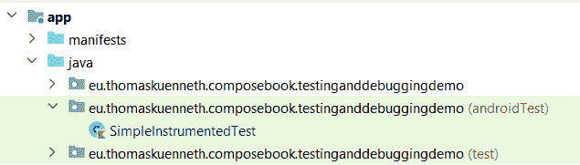
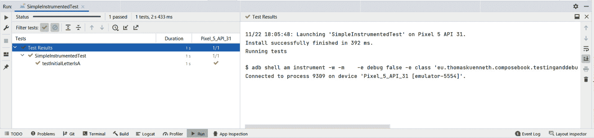
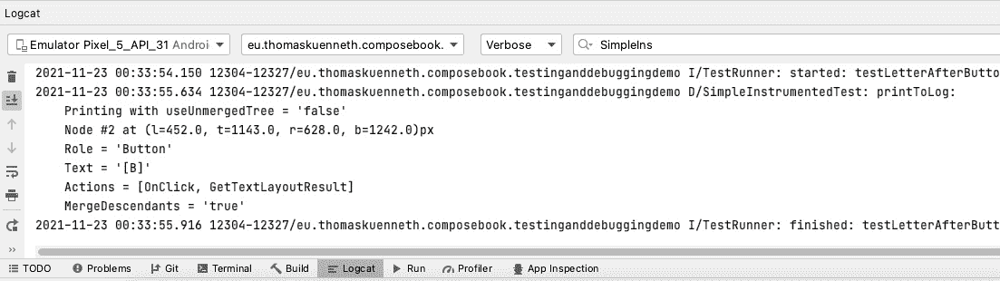
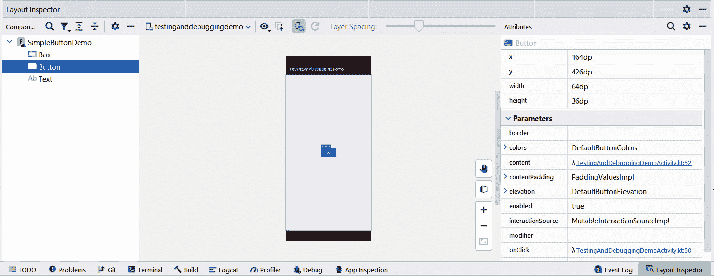
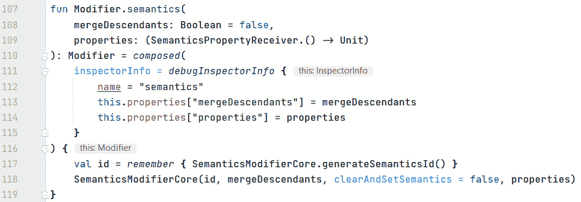

# 第十章：测试和调试 Compose 应用

编程是一个非常富有创造性的过程。使用 Jetpack Compose 实现看起来很棒的 **用户界面**（**UI**）和流畅的动画是纯粹的乐趣。然而，打造一个出色的应用不仅仅需要编写代码。测试和调试同样重要，因为无论您如何精心设计和实现您的应用，错误和故障都是不可避免的，至少在非平凡程序中是这样。但无需害怕，因为您可以使用强大的工具来检查您的代码是否按预期运行。

本章向您介绍这些工具。其主要部分如下所示：

+   设置和编写测试

+   理解语义

+   调试 Compose 应用

在第一部分主要章节中，我将向您介绍有关测试的重要术语和技术。我们将设置基础设施，编写一个简单的单元测试，然后转向 Compose 特定内容——例如，`createComposeRule()` 和 `createAndroidComposeRule()`。

*理解语义* 部分建立在这些基础之上。我们将探讨如何在测试中选择或找到可组合函数，以及为什么使您的应用可访问也有助于编写更好的测试。您还将了解操作和断言。

失败的测试通常表明存在错误，除非当然，失败是故意的。如果您怀疑测试正在检查的代码有错误，那么就需要进行调试会话。最后一部分主要章节，*调试 Compose 应用*，解释了如何检查您的 Compose 代码。我们将回顾在 *理解语义* 部分中讨论的语义树。最后，我将向您展示如何利用 `InspectorInfo` 和 `InspectorValueInfo`。

# 技术要求

本章基于 `TestingAndDebuggingDemo` 示例。请参考 *第一章* 的 *技术要求* 部分，了解如何安装和设置 Android Studio 以及如何获取本书配套的代码库。

本章的所有代码文件都可以在 GitHub 上找到：[`github.com/PacktPublishing/Android-UI-Development-with-Jetpack-Compose/tree/main/chapter_10`](https://github.com/PacktPublishing/Android-UI-Development-with-Jetpack-Compose/tree/main/chapter_10)。

# 设置和编写测试

作为一名软件开发人员，您可能喜欢编写代码。看到应用增加功能会感到非常满足，可能比编写测试——或者更糟糕的是，发现错误——更有成就感。然而，测试和调试是必不可少的。最终，您的代码将包含错误，因为所有非平凡程序都会这样。为了使您作为开发者的生活更轻松，您需要熟悉编写测试以及调试您自己的和别人的代码。测试一个应用有多个方面，对应着不同类型的测试，如下所述：

+   **单元测试**：你需要确保业务逻辑按预期工作。例如，这意味着公式和计算总是产生正确的结果。

+   **集成测试**：应用的所有构建块是否正确集成？根据应用的功能，这可能包括访问远程服务、与数据库通信或在设备上读取和写入文件。

+   **UI 测试**：UI 是否准确？所有 UI 元素是否在所有支持的屏幕尺寸上都可见？它们是否总是显示正确的值？按钮点击或滑块移动等交互是否触发了预期的功能？还有非常重要的一点：应用的所有部分是否都易于访问？

测试的数量因类型而异。长期以来，人们一直声称，理想情况下，你大部分的测试应该是单元测试，其次是集成测试。这导致了一种**测试金字塔**的概念，其中单元测试是其基础，UI 测试是顶端。就像所有的隐喻一样，测试金字塔也经历了支持和严厉的批评。如果你想了解更多关于它以及一般测试策略的信息，请参阅本章末尾的*进一步阅读*部分。Jetpack Compose 测试是 UI 测试。因此，虽然你可能编写了许多相应的测试用例，但使用单元测试测试底层业务逻辑可能更为重要。

为了使测试可靠、易懂和可重复，使用了自动化。在下一节中，我将向你展示如何使用*JUnit 4*测试框架编写单元测试。

## 实现单元测试

单位是小的、独立的代码片段——通常是函数、方法、子程序或属性，具体取决于编程语言。让我们看看以下代码片段中的简单 Kotlin 函数：

```java
fun isEven(num: Int): Boolean {
  val div2 = num / 2
  return (div2 * 2) == num
}
```

`isEven()`确定传递的`Int`值是否为偶数。如果是这样，函数返回`true`；否则，返回`false`。该算法基于这样一个事实：只有偶数`Int`值才能被`2`整除而没有余数。假设我们经常使用这个函数，我们当然想确保结果总是正确的。但我们如何做到这一点（如何测试这一点）？为了彻底验证`isEven()`，我们需要检查从`Int.MIN_VALUE`到`Int.MAX_VALUE`的所有可能的输入值。即使在快速的计算机上，这也可能需要一些时间。编写良好单元测试的艺术部分在于识别所有重要的边界和转换。关于`isEven()`，以下可能是一些：

+   `Int.MIN_VALUE`和`Int.MAX_VALUE`

+   一个负偶数和一个负奇数`Int`值

+   一个正偶数和一个正奇数`Int`值

要编写和执行单元测试，你应该将以下依赖项添加到你的模块级`build.gradle`属性文件中：

```java
androidTestImplementation "androidx.test.ext:junit:1.1.3"
androidTestImplementation "androidx.compose.ui:ui-test-
  junit4:$compose_version"
debugImplementation "androidx.compose.ui:ui-test-
  manifest:$compose_version"
testImplementation 'junit:junit:4.13.2'
androidTestImplementation "androidx.test.espresso:espresso-
  core:3.4.0"
```

根据你将添加到你的应用程序项目中的测试类型，一些前面的依赖项可能是可选的。例如，`androidx.test.espresso`只在你的应用程序也包含你希望测试的旧式视图（例如在互操作性场景中）时需要。

单元测试是在你的开发机器上执行的。测试类放置在`app/src/test/java`目录中，并通过`SimpleUnitTest`可用：

![图 10.1 – Android Studio 项目工具窗口中的单元测试]

![img/B17075_10_1.jpg]

图 10.1 – Android Studio 项目工具窗口中的单元测试

让我们看看以下代码片段中的类：

```java
Package
  eu.thomaskuenneth.composebook.testinganddebuggingdemo
import org.junit.*
import org.junit.Assert.assertEquals
class SimpleUnitTest {
  companion object {
    @BeforeClass
    @JvmStatic
    fun setupAll() {
      println("Setting things up")
    }
  }
  @Before
  fun setup() {
    println("Setup test")
  }
  @After
  fun teardown() {
    println("Clean up test")
  }
  @Test
  fun testListOfInts() {
    val nums = listOf(Int.MIN_VALUE, -3, -2, 2, 3,
                      Int.MAX_VALUE)
    val results = listOf(true, false, true, true, false,
                         false)
    nums.forEachIndexed { index, num ->
      val result = isEven(num)
      println("isEven($num) returns $result")
      assertEquals(result, results[index])
    }
  }
}
```

一个测试类包含一个或多个测试。一个`@Test`。它检查某些定义明确的情景、条件或标准。测试应该是独立的，这意味着它们不应该依赖于之前的测试。我的例子是测试`isEven()`对于六个输入值是否返回正确的结果。这样的检查基于**断言**。断言定义了期望的行为。如果断言未满足，则测试失败。

如果你需要在每个测试之前或之后执行某些操作，你可以实现函数并用`@Before`或`@After`注解它们。你也可以使用`@Rule`实现类似的功能。我们将在下一节中探讨这个问题。要在所有测试之前运行代码，你需要实现一个带有`@BeforeClass`和`@JvmStatic`注解的伴生对象中的函数。`@AfterClass`在所有测试运行完毕后用于清理。

你可以通过在**项目**工具窗口中右键单击测试类并选择**运行 '…'**来运行单元测试。一旦为测试类创建了一个启动配置，你也可以通过菜单栏和工具栏来运行测试。测试结果在**运行**工具窗口中显示，如下面的截图所示：

![图 10.2 – Android Studio 运行工具窗口中的测试结果]

![img/B17075_10_2.jpg]

图 10.2 – Android Studio 运行工具窗口中的测试结果

尽管测试通过了，但我的`isEven()`实现可能仍然不完美。虽然测试检查了上下限，但它没有测试负数和正数之间的转换。让我们纠正这个问题并添加另一个测试，如下所示：

```java
@Test
fun testIsEvenZero() {
  assertEquals(true, isEven(0))
}
```

幸运的是，这个测试也通过了。

重要提示

请密切关注单元测试接收的参数和它产生的结果。始终测试边界和转换。确保覆盖所有代码路径（如果可能的话），并注意由于无效参数（例如，除以零或错误的数字格式）引起的异常等陷阱。

请记住，可组合函数是顶级 Kotlin 函数，因此它们是单元测试的理想候选者。让我们看看这是如何工作的。在下一节中，你将学习如何测试一个简单的 Compose UI。

## 测试可组合函数

`SimpleButtonDemo()` 可组合组件（属于 `TestingAndDebuggingDemo` 示例）显示一个带有按钮的框，按钮居中。第一次点击按钮会将文本从 **A** 更改为 **B**。后续点击会在 **B** 和 **A** 之间切换。代码如下所示：

```java
@Composable
fun SimpleButtonDemo() {
  val a = stringResource(id = R.string.a)
  val b = stringResource(id = R.string.b)
  var text by remember { mutableStateOf(a) }
  Box(
    modifier = Modifier.fillMaxSize(),
    contentAlignment = Alignment.Center
  ) {
    Button(onClick = {
      text = if (text == a) b else a
    }) {
      Text(text = text)
    }
  }
}
```

文本存储为可变的 `String` 状态。它在 `onClick` 块内部更改，并用作 `Text()` 可组合组件的参数。如果我们想测试 `SimpleButtonDemo()`，我们可能需要检查的一些方面包括这些：

+   **UI 的初始状态**：初始按钮文本是否为 **A**？

+   **行为**：第一次按钮点击是否会将文本更改为 **B**？

    后续点击是否会切换到 **B** 和 **A** 之间？

下面是一个简单的测试类的样子：

```java
@RunWith(AndroidJUnit4::class)
class SimpleInstrumentedTest {
  @get:Rule
  val rule = createComposeRule()
  @Before
  fun setup() {
    rule.setContent {
      SimpleButtonDemo()
    }
  }
  @Test
  fun testInitialLetterIsA() {
    rule.onNodeWithText("A").assertExists()
  }
}
```

与 *实现单元测试* 部分的 `SimpleUnitTest` 类不同，它的源代码存储在 `app/src/androidTest/java` 目录中（与普通单元测试的 `…/test/…` 相反）。`SimpleInstrumentedTest` 是一个 **仪器化测试**。与普通单元测试不同，它们不是在开发机上本地执行，而是在 Android 模拟器或真实设备上执行，因为它们需要 Android 特定的功能来运行。仪器化测试可以通过 **项目** 工具窗口访问，如下面的截图所示：



图 10.3 – Android Studio 项目工具窗口中的仪器化测试

您可以通过在 **项目** 工具窗口中右键单击测试类并选择 **运行 '…'** 来运行仪器化测试。一旦为测试类创建了启动配置，您也可以使用菜单栏和工具栏来运行测试。测试结果在 **运行** 工具窗口中显示，如下面的截图所示：



图 10.4 – Android Studio 运行工具窗口中的仪器化测试结果

在你的测试类中，JUnit 的 `@Before` 和 `@After` 注解。有几个预定义的规则——例如，`TestName` 规则可以在测试方法内部提供当前测试名称，如下所示：

```java
@get:Rule
var name = TestName()
...
@Test
fun testPrintMethodName() {
  println(name.methodName)
}
```

当 `testPrintMethodName()` 函数运行时，它会打印其名称。您可以在通过添加 `get:` 到属性获取器的 `@Rule` 注解中看到输出。如果不这样做，将导致执行期间出现 `ValidationError`（`The @Rule '…' must be public`）消息。

Compose 测试基于规则。`createComposeRule()` 返回 `ComposeContentTestRule` 接口的一个实现，它扩展了 `ComposeTestRule`。此接口反过来又扩展了 `org.junit.rules.TestRule`。每个 `TestRule` 实例实现 `apply()` 方法。此方法接收 `Statement` 并返回相同的、修改后的或完全新的 `Statement`。然而，编写自己的测试规则超出了本书的范围。要了解更多信息，请参阅本章末尾的“进一步阅读”部分。

`createComposeRule()` 返回的 `ComposeContentTestRule` 接口实现取决于平台。在 Android 上，它是 `AndroidComposeTestRule<ComponentActivity>`。这就是为什么你应该在模块级别的 `build.gradle` 文件中添加对 `androidx.compose.ui:ui-test-manifest` 的依赖。否则，你可能需要在清单文件中手动添加对 `ComponentActivity` 的引用。

`createAndroidComposeRule()` 允许你为除了 `ComponentActivity` 之外的活动类创建 `AndroidComposeTestRule`。如果你需要在测试中使用此活动的功能，这很有用。在桌面或 Web 的 Compose 中，`createComposeRule()` 可能会返回 `ComposeContentTestRule` 的不同实现，具体取决于 Compose UI 的托管位置。为了使你的测试平台无关，尽可能使用 `createComposeRule()`。

你的测试用例使用（包括其他）由 `ComposeContentTestRule` 实现提供的方法。例如，`setContent()` 将可组合函数设置为当前屏幕的内容——即要测试的 UI。`setContent()` 应该在每个测试中恰好调用一次。为了实现这一点，只需在带有 `@Before` 注解的函数中调用它。

重要提示

如果你想在多个平台上重用你的测试，尽量只依赖 `ComposeContentTestRule`、`ComposeContentTestRule` 和 `TestRule` 接口中定义的方法。避免调用实现中的函数。

接下来，让我们看看 `testInitialLetterIsA()`。这个测试用例检查初始按钮文本是否为 `"A"`。这个比较是通过调用 `assertExists()` 和 `onNodeWithText()` 来完成的，后者被称为 **finder**。Finder 在 **semantics nodes** 上工作，你将在“理解语义”部分了解更多关于这些内容。但首先：为什么我们还需要 *找到* 要测试的可组合元素呢？

与传统的视图系统不同，Jetpack Compose 不使用引用来识别单个 UI 元素。请记住，在命令式方法中，在运行时修改组件树需要这样的引用。但 Compose 并不是这样工作的——相反，我们根据状态声明 UI 应该是什么样子。然而，为了测试某个可组合元素是否看起来和表现如预期，我们需要在 Compose 层级的所有其他子元素中找到它。

这就是 `Role`、`Text` 和 `Actions` 的作用。它用于可访问性和测试。

在我们继续之前，让我们简要回顾一下：`onNodeWithText()` 尝试查找具有给定文本的复合元素（更准确地说，是一个语义节点）。`assertExists()` 检查当前 UI 中是否存在匹配的节点。如果是，则测试通过。否则，测试失败。

# 理解语义

在上一节中，我向您展示了一个简单的测试用例，用于检查按钮文本是否与给定的字符串匹配。这里还有一个测试用例。它点击按钮以查看按钮文本是否按预期更改：

```java
@Test
fun testLetterAfterButtonClickIsB() {
  rule.onNodeWithText("A")
    .performClick()
    .assert(hasText("B"))
}
```

再次，我们首先查找按钮。`performClick()`（这被称为 `Assert(hasText("B"))`）检查按钮文本是否为 **B**。断言确定测试是否通过或失败。

`onNodeWithText()`（`SemanticsNodeInteractions Provider` 的扩展函数）返回一个 `SemanticsNodeInteraction` 语义节点。`SemanticsNodeInteractionsProvider` 接口是测试的主要入口点，通常由测试规则实现。它定义了两个方法，如下所示：

+   `onNode()` 查找并返回一个与给定条件匹配的语义节点（`SemanticsNodeInteraction`）。

+   `onAllNodes()` 查找所有与给定条件匹配的语义节点。它返回一个 `SemanticsNodeInteractionCollection` 实例。

它们都被称为 **查找器**，因为它们返回匹配特定条件的语义节点。

## 与语义节点一起工作

要查看上一节中用 `testLetterAfterButtonClickIsB()` 测试的语义节点的外观，您可以在 `.assert(…)` 之后添加以下表达式：

```java
.printToLog("SimpleInstrumentedTest")
```

结果在 **Logcat** 中可见，如下截图所示：



图 10.5 – Logcat 中的语义节点

`SemanticsNodeInteraction` 代表一个语义节点。您可以通过执行 `performClick()` 或断言 `assertHasClickAction()` 等操作与节点交互，或者导航到其他节点，如 `onChildren()`。这些函数是 `SemanticsNodeInteraction` 的扩展函数。`SemanticsNodeInteractionCollection` 是语义节点的一个集合。

让我们看看另一个查找函数，`onNodeWithContentDescription()`。我们将使用它来测试 `Image()` 是否是当前 UI 的一部分。代码如下所示：

```java
@Composable
fun ImageDemo() {
  Image(
    painter = painterResource(id =
        R.drawable.ic_baseline_airport_shuttle_24),
    contentDescription = stringResource(id =
        R.string.airport_shuttle),
    contentScale = ContentScale.FillBounds,
    modifier = Modifier
      .size(width = 128.dp, height = 128.dp)
      .background(Color.Blue)
  )
}
```

如果您的应用 UI 包含图像，您通常应该为它们添加内容描述。内容描述用于，例如，由辅助软件向视觉障碍人士描述当前屏幕上显示的内容。因此，通过添加它们，您可以大大提高可用性。此外，内容描述有助于查找复合元素。您可以在以下代码片段中看到这些用法：

```java
@RunWith(AndroidJUnit4::class)
class AnotherInstrumentedTest {
  @get:Rule
  val rule = createComposeRule()
  @Test
  fun testImage() {
    var contentDescription = ""
    rule.setContent {
      ImageDemo()
      contentDescription = stringResource(id =
          R.string.airport_shuttle)
    }
    rule.onNodeWithContentDescription(contentDescription)
      .assertWidthIsEqualTo(128.dp)
  }
}
```

`testImage()` 首先设置内容（`ImageDemo()`）。然后查找具有给定内容描述的语义节点。最后，`assertWidthIsEqualTo()` 检查由该节点表示的 UI 元素的宽度是否为 128 密度无关像素宽。

小贴士

你有没有注意到我使用了 `stringResource()` 来获取内容描述？硬编码的值可能导致测试中产生微妙的错误（例如，拼写错误或打字错误）。为了避免这些错误，请尝试以编写测试的方式，让它们访问与被测试代码相同的值。但请记住，在底层，`stringResource()` 依赖于 Android 资源。因此，测试用例是平台特定的。

使用 `onNodeWithText()` 和 `onNodeWithContentDescription()` 可以轻松找到包含文本和图像的可组合函数。但如果你需要找到其他内容的语义节点——例如，一个 `Box()`？以下示例 `BoxButtonDemo()` 展示了一个在内部居中的 `Button()` 的 `Box()`。点击按钮会切换框的背景颜色，从白色变为浅灰色，然后再变回白色：

```java
val COLOR1 = Color.White
val COLOR2 = Color.LightGray
@Composable
fun BoxButtonDemo() {
  var color by remember { mutableStateOf(COLOR1) }
  Box(
    modifier = Modifier
      .fillMaxSize()
      .background(color = color),
    contentAlignment = Alignment.Center
  ) {
    Button(onClick = {
      color = if (color == COLOR1)
        COLOR2
      else
        COLOR1
    }) {
      Text(text = stringResource(id = R.string.toggle))
    }
  }
}
```

测试 `BoxButtonDemo()` 意味着找到框，检查其初始背景颜色，点击按钮，然后再次检查颜色。为了能够找到框，我们使用 `testTag()` 修饰符对其进行标记，如下面的代码片段所示。应用标签允许我们在测试中找到修改后的元素：

```java
val TAG1 = "BoxButtonDemo"
Box(
  modifier = ...
    .testTag(TAG1)
    ...
```

我们可以检查框是否存在，如下所示：

```java
@Test
fun testBoxInitialBackgroundColorIsColor1() {
  rule.setContent {
    BoxButtonDemo()
  }
  rule.onNode(hasTestTag(TAG1)).assertExists()
}
```

`onNode()` 查找器接收一个 `hasTestTag()` 参数。`hasTestTag()` 查找具有给定测试标签的节点。有几个预定义的匹配器。例如，`isEnabled()` 返回节点是否启用，而 `isToggleable()` 如果节点可以被切换则返回 `true`。

小贴士

Google 在 [`developer.android.com/jetpack/compose/testing-cheatsheet`](https://developer.android.com/jetpack/compose/testing-cheatsheet) 提供了一份测试速查表。它很好地将查找器、匹配器、操作和断言分组。

要完成测试代码，我们需要检查框的背景颜色。但我们该如何做呢？根据之前的示例，你可能期望有一个 `hasBackgroundColor()` 匹配器。不幸的是，目前还没有。测试只能依赖于语义树中可用的内容，但如果它不包含我们所需的信息，我们可以轻松地添加它。我将在下一节中向你展示如何操作。

## 添加自定义语义属性

如果你想要向测试暴露更多信息，你可以创建自定义语义属性。这需要以下步骤：

+   定义 `SemanticsPropertyKey`

+   通过使用 `SemanticsPropertyReceiver` 使其可用

你可以在以下代码片段中看到这些用法：

```java
val BackgroundColorKey =
        SemanticsPropertyKey<Color>("BackgroundColor")
var SemanticsPropertyReceiver.backgroundColor by
 BackgroundColorKey
@Composable
fun BoxButtonDemo() {
  ...
  Box(
    modifier = ...
      .semantics { backgroundColor = color }
      .background(color = color),
      ...
```

使用 `SemanticsPropertyKey`，你可以以类型安全的方式在语义块中设置键值对。每个键都有一个静态定义的值类型——在我的例子中，这是 `Color`。`SemanticsPropertyReceiver` 是由 `semantics {}` 块提供的范围。它旨在通过扩展函数设置键值对。

这是如何在测试用例中访问自定义语义属性的方法：

```java
@Test
fun testBoxInitialBackgroundColorIsColor1() {
  rule.setContent {
    BoxButtonDemo()
  }
  rule.onNode(SemanticsMatcher.expectValue
             (BackgroundColorKey,COLOR1))
     .assertExists()
}
```

`expectValue()` 检查给定键的值是否等于预期值。

在编写测试时，向语义树添加自定义值可能会有很大帮助。然而，请仔细考虑你是否真的需要依赖 `SemanticsPropertyKey`。语义树还由辅助功能框架和工具使用，因此，避免将无关信息污染语义树至关重要。一种解决方案是重新思考测试策略。我们可能不是测试“盒子的初始背景颜色是否为白色”，而是测试我们传递给 `background()` 函数的值是否代表白色。

这部分内容结束了关于测试可组合函数的章节。在下一节中，我们将探讨调试 Compose 应用。

# 调试 Compose 应用

本节的标题 *调试 Compose 应用* 可能表明与调试传统的基于视图的应用存在重大差异。幸运的是，情况并非如此。在 Android 上，所有可组合层次结构都封装在 `androidx.compose.ui.platform.ComposeView` 中。如果你调用了 `ComponentActivity` 的 `setContent {}` 扩展函数，或者你故意在一个布局中包含可组合层次结构（参见 *第九章*，*探索互操作性 API*），这会间接发生。无论如何，最终 `ComposeView` 都会在屏幕上显示——例如，在 Activity 或 Fragment 中。因此，关于 Android 应用基本构建块（活动、片段、服务、广播接收器、意图和内容提供者）的所有方面都保持不变。

当然，任何 UI 框架都提倡特定的调试习惯。例如，视图系统需要关注 `null` 引用。此外，你还需要确保状态的变化能够可靠地触发组件树的更新。幸运的是，这些都不适用于 Jetpack Compose。由于可组合项是 Kotlin 函数，你可以在需要时通过逐步执行代码来跟踪可组合层次结构的创建，并检查 `State`。

为了在运行时仔细检查你的可组合函数的视觉表示，你可以使用 Android Studio 的 **布局检查器**，如下面的截图所示。一旦你在模拟器或真实设备上部署了你的应用，请使用 **工具** 菜单中的 **布局检查器** 打开此工具：



图 10.6 – Android Studio 中的布局检查器

你可以使用 Android Studio 主窗口左侧的树来选择要检查的可组合项。重要属性显示在右侧。工具窗口的中心包含一个可配置、可缩放的预览。你还可以启用 **三维** （**3D**）模式。这允许你通过点击和拖动来旋转布局，从而通过视觉检查层次结构。

如果你想要为了调试目的记录可组合项的重要值，你可以通过修饰符轻松实现这一点。下一节将展示如何进行操作。

## 使用自定义修饰符进行日志记录和调试

正如我在 *第三章* 的“修改行为”部分中解释的，*探索 Compose 的关键原则*，修饰符是一个有序的不可变修饰符元素集合。修饰符可以改变 Compose UI 元素的看起来和行为。您通过实现 `Modifier` 的扩展函数来创建自定义修饰符。以下代码片段使用 `DrawScope` 接口打印可组合的大小：

```java
fun Modifier.simpleDebug() = then(object : DrawModifier {
  override fun ContentDrawScope.draw() {
    println("width=${size.width}, height=${size.height}")
    drawContent()
  }
})
```

根据您选择哪个接口，您可以记录不同的方面。例如，使用 `LayoutModifier`，您可以访问与布局相关的信息。

重要提示

虽然这可能是一个巧妙的技巧，但它绝对不是修饰符的主要用途。因此，如果您仅为了调试目的实现自定义修饰符，您应该仅在调试时将其添加到修饰符链中。

此外，还有一个内置功能可以提供用于调试目的的附加信息。几个修饰符可以接收一个 `inspectorInfo` 参数，这是 `InspectorInfo` 的扩展函数。这个类是 `InspectableValue` 接口的构建器（该接口定义了一个可由工具检查的值，从而可以访问值的私有部分）。`InspectorInfo` 有三个属性，如下所示：

+   `name`（为 `InspectableValue` 提供 `nameFallback`）

+   `value`（为 `InspectableValue` 提供 `valueOverride`）

+   `properties`（为 `InspectableValue` 提供 `inspectableElements`）

要了解 `inspectorInfo` 的使用方法，请查看以下截图中的 `semantics {}` 修饰符的实现，该修饰符为测试和可访问性添加了语义键值对。请参阅“添加自定义语义属性”部分以获取详细信息：




图 10.7 – `semantics {}` 修饰符的源代码

`semantics {}` 调用 `composed {}` 修饰符，该修饰符接收两个参数，`inspectorInfo` 和 `factory`（要组合的修饰符）。`inspectorInfo` 参数获取 `debugInspectorInfo {}` 工厂方法的结果（该方法接收一个 `name` 实例和两个用于 `properties` 的元素作为参数）。

`composed {}` 将 `ComposedModifier` 类添加到修饰符链中。这个私有类实现了 `Modifier.Element` 接口，并扩展了 `InspectorValueInfo`，后者反过来实现了 `InspectorValueInfo`。`inspectableElements` 属性保持 `Sequence` 的 `ValueElements`。

要启用调试检查器信息，您必须将 `androidx.compose.ui.platform` 包中的全局顶级变量 `isDebugInspectorInfoEnabled` 设置为 `true`。然后，您可以使用反射访问和打印调试检查器信息。以下是您需要的代码：

```java
.semantics { backgroundColor = color }.also {
  (it as CombinedModifier).run {
    val inner = this.javaClass.getDeclaredField("inner")
    inner.isAccessible = true
    val value = inner.get(this) as InspectorValueInfo
    value.inspectableElements.forEach {
      println(it)
    }
  }
}
```

`semantics {}` 返回的修饰符类型为 `CombinedModifier`，因为 `composed {}` 调用了 `then()`，它底层使用 `CombinedModifier`。你不仅可以打印原始的可检查元素，还可以根据需要自定义输出。

# 摘要

在本章中，我们探讨了与测试相关的重要术语和技术。在第一个主要部分，我们在开发机上本地设置基础设施，编写并运行了一个简单的单元测试，然后转向 Compose 特定内容。我向你介绍了 `createComposeRule()` 和 `createAndroidComposeRule()`。

接下来，我们探讨了如何在 Compose 层级中找到可组合函数，以及为什么使你的应用可访问也有助于编写更好的测试。你还学习了动作和断言。最后，我们在语义树中添加了自定义条目。

最后一个主要部分解释了如何调试 Compose 应用。我们回顾了语义树，并展示了如何利用 `InspectorInfo` 和 `InspectorValueInfo` 来调试自定义修饰符。

第十一章，*结论和下一步*，总结了本书内容。我们展望未来，看看 Jetpack Compose 的未来版本可能会添加什么。例如，我们预览了 Compose 的 Material 3，它将 *Material You* 设计概念引入 Compose 应用。我们还超越了 Android，考察了其他平台上的 Compose。

# 进一步阅读

+   本书假设读者对如何测试 Android 应用有基本的了解。要了解更多信息，请参阅[在 Android 上测试应用](https://developer.android.com/training/testing)。

+   [Catalin Tudose 的《JUnit in Action》](https://manning.com/books/junit-in-action)（Manning Publications，2020，ISBN 978-1617297045）是 JUnit 测试框架最新版本的全面介绍。

+   如果你想要了解更多关于测试自动化的信息，你可能想查看 [Arnon Axelrod 的《Complete Guide to Test Automation: Techniques, Practices, and Patterns for Building and Maintaining Effective Software Projects》](https://www.apress.com/gp/book/9781484238318)（Apress，2018，ISBN 978-1484238318）。

+   要深入了解测试金字塔隐喻，你可能想参考 [Ham Vocke 的《实用测试金字塔》](https://martinfowler.com/articles/practical-test-pyramid.html)。
