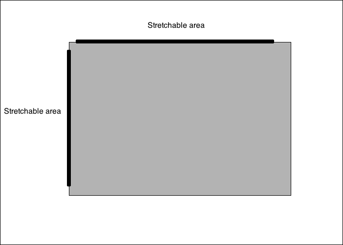
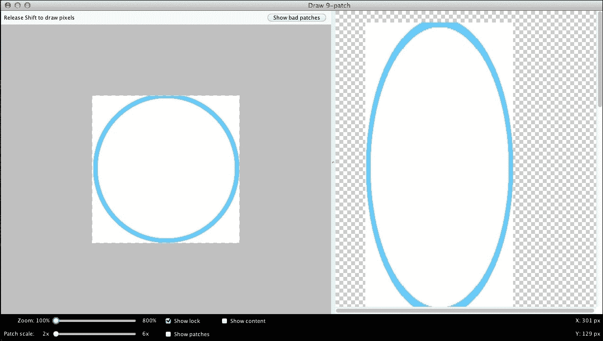
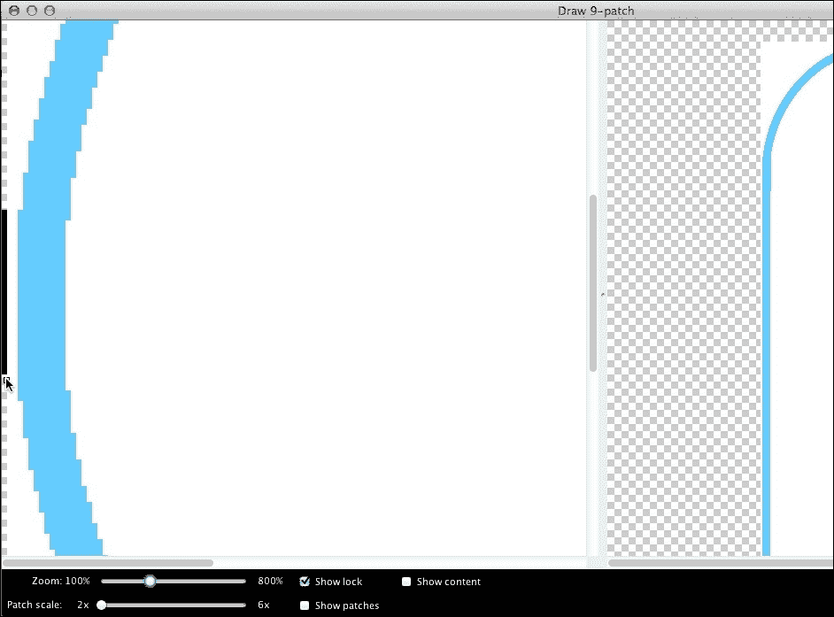
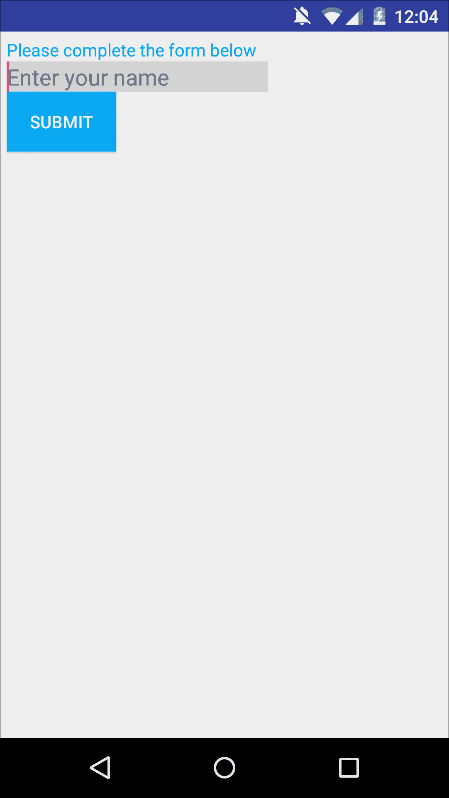
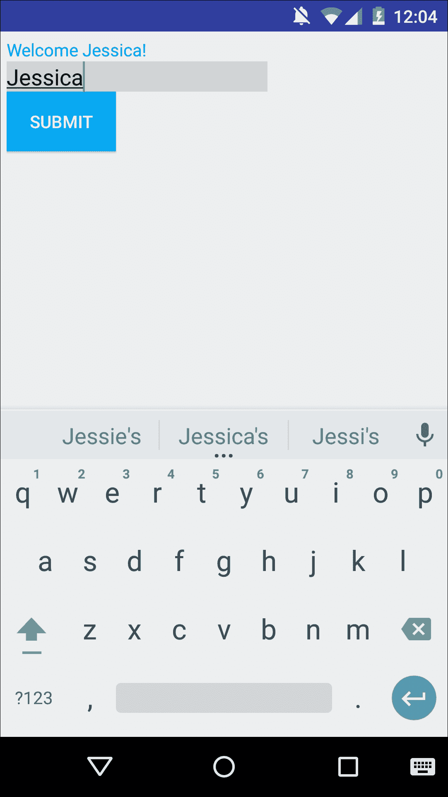
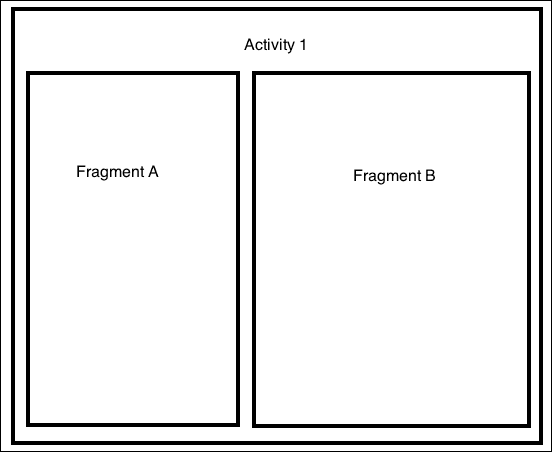
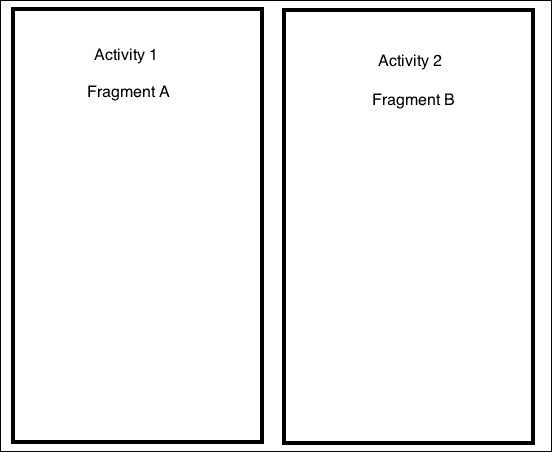

# 第三章。扩展你的 UI – 片段、资源以及收集用户输入

在上一章中，我们专注于为你的应用程序用户界面创建一个坚实的基础。在本章中，我们将使用额外的资源，如数组、尺寸和 9-patch 图像，在此基础上构建。

一旦我们完善了 UI 的 *外观*，我们将探讨如何使 UI 对用户输入做出反应，然后再看看一个可以帮助我们充分利用大屏幕设备的 UI 组件：*片段*。由于片段不是利用额外屏幕空间的 *唯一* 方法，我们还将看看 Android N 中即将推出的多窗口和画中画模式。

# 更多资源类型

如果你的应用程序有任何文本，那么一般来说，文本应该属于你项目中的 `res/strings.xml` 文件作为字符串资源，而不是在应用程序代码中。尽管我们在上一章中提到了字符串资源，但它们是绝大多数 Android 应用程序的一个基本组成部分，因此有必要更详细地研究它们，特别是关于你可以使用字符串资源执行的一些更复杂的任务，例如创建字符串数组。

## 创建和样式化字符串资源

字符串是一个简单的资源，你只需在项目中的 `res/values/strings.xml` 文件中定义一次，然后在整个项目中多次使用它。

你可以使用以下语法定义字符串资源：

```java
<resources> 

<string name="string_name">This is the text that'll appear whenever you reference this string resource.</string> 

</resources> 

```

你还可以选择为字符串资源添加样式属性，这样每次你在应用程序中使用字符串资源时，它都有完全相同的样式。Android 支持以下 HTML 标记：

+   `<b>` 用于加粗文本

+   `<i>` 用于斜体文本

+   `<u>` 用于下划线文本

将你选择的 HTML 标记包裹在你想样式的文本周围：

```java
<?xml version="1.0" encoding="utf-8"?> 
<resources> 

<string name="Hello World">Hello world, <b>welcome</b> to my app!</string> 

<string name="click">Please click the <i>button</i> to continue</string> 

</resources> 

```

虽然你通常会在应用程序的布局资源文件中引用字符串资源，但你也可以通过 Java 代码引用字符串：

```java
String string = getString(R.string.string_name);
```

## 创建字符串数组

字符串数组正如其名：字符串资源数组。

当你有多个相关的字符串总是同时出现时，字符串数组非常有用，例如在重复出现的菜单中的选项列表。

虽然你可以将每个项目定义为单独的字符串资源，然后单独引用每个字符串，但这非常耗时，而且你还需要记住一个长长的不同字符串 ID 列表！通常，将所有字符串资源添加到单个数组中更有意义，这样你只需通过引用单个字符串数组就可以显示所有这些字符串。

你通常在专门的 `res/values/arrays.xml` 文件中创建字符串数组。例如，以下 XML 定义了一个名为 **ingredients** 的字符串数组，它包含五个字符串资源：

```java
<?xml version="1.0" encoding="utf-8"?> 
<resources> 

   <string-array  

//Create your string array// 

name="ingredients"> 

//Give your array a descriptive name// 

      <item>Self-raising flour</item> 

//Add each string to your array// 

      <item>Butter</item> 
      <item>Caster sugar</item> 
      <item>Eggs</item> 
      <item>Baking powder</item> 
   </string-array> 

</resources> 

```

要加载这个字符串数组，请使用 `Resources` 类的 `getStringArray()` 方法：

```java
Resources res = getResources(); 
String[] ingredients = res.getStringArray (R.array.ingredients); 

```

字符串数组对于快速填充旋转器控件也非常有用。假设旋转器控件的选项是静态和预定的，您可以在字符串数组中定义所有这些选项，然后加载数组到旋转器控件中。

### 注意

**旋转器**是一个用户界面元素，用户可以从选项列表中选择一个值。当用户触摸旋转器控件时，会弹出一个下拉菜单，显示所有可用选项。用户可以从列表中选择一个选项，然后旋转器控件将显示所选选项在其默认未打开状态下。

要使用字符串数组填充一个旋转器，请将旋转器控件添加到您的活动布局资源文件中，然后使用`android:entries:`引用数组

```java
<Spinner 
    android:layout_height="wrap_content" 
    android:layout_width="match_parent" 
    android:id="@+id/spinnerOfIngredients" 
    android:entries="@array/ingredients"> 
</Spinner> 

```

## 在`dimens.xml`中定义维度

Android 支持多种不同的度量单位，您可以使用 XML 或 Java 将其硬编码到项目中，例如`android:textSize="20sp"`。然而，您也可以在项目中的`res/values/dimens.xml`文件中预先定义您想要使用的维度：

```java
<?xml version="1.0" encoding="utf-8"?> 
<resources> 
  <dimen name="textview_width">26dp</dimen> 
  <dimen name="textview_height">35dp</dimen> 
  <dimen name="headline_size">41sp</dimen> 
  <dimen name="bodytext_size">20sp</dimen> 
</resources> 

```

然后，您可以通过引用`dimens.xml`文件中的相应值来设置您的 UI 组件的大小：

```java
<TextView 
   android:layout_height="@dimen/textview_height" 
   android:layout_width="@dimen/textview_width" 
   android:textSize="@dimen/headline_size"/> 
```

您还可以使用 Java 应用`dimens.xml`文件中的值：

```java
textElement.setWidth(getResources().getDimensionPixelSize(R.dimen.headline_size)); 

```

但是，为什么还要费劲使用`dimens.xml`文件，当您可以直接在布局中添加维度信息时？

虽然这似乎是最快的选择，但将维度与布局和应用程序代码混合并不是一个好的实践。类似于字符串资源，`dimens.xml`文件提供了一个单一、专门的地点，您可以在这里更改项目维度，而无需触及您的其他代码。它还有助于创建一致的用户界面，因为它鼓励您定义一组值一次，然后在您的整个应用程序中使用这些相同的值。

其次，您可以使用多个`dimens.xml`文件来创建一个更灵活的用户界面。以这种方式使用`dimens.xml`文件确实需要一些准备工作，因为您需要创建多个针对 Android 不同通用密度的`res/values`文件夹。同样地，您也需要创建多个`drawable`文件夹来管理您项目中的图片。

打开您项目的`res`文件夹，并创建以下文件夹：

+   `values-ldpi`：针对 120dpi 设备

+   `values-mdpi`：针对 60dpi 设备

+   `values-hdpi`：针对 240dpi 设备

+   `values-xhdpi`：针对 320dpi 设备

+   `values-xxhdpi`：针对 480dpi 设备

然后，在每个文件夹中创建一个`dimens.xml`文件：


这可能看起来工作量很大，但一旦您建立了这种结构，您就可以使用您的`dimens`文件来定义针对每个屏幕密度类别的优化值集。然后，当 Android 系统加载您的布局时，它将选择最适合当前屏幕配置的`dimens.xml`文件，并将文件中的维度应用到您的布局上。

### 小贴士

**下载示例代码**

您可以从[`www.packtpub.com`](http://www.packtpub.com)的账户下载本书的示例代码文件。如果您在其他地方购买了此书，您可以访问[`www.packtpub.com/support`](http://www.packtpub.com/support)并注册，以便将文件直接通过电子邮件发送给您。您可以通过以下步骤下载代码文件：

1.  使用您的电子邮件地址和密码登录或注册我们的网站。

1.  将鼠标指针悬停在顶部的**支持**选项卡上。

1.  点击**代码下载与勘误**。

1.  在**搜索**框中输入书籍名称。

1.  选择您想要下载代码文件的书籍。

1.  从下拉菜单中选择您购买此书的来源。

1.  点击**代码下载**。

您还可以通过点击 Packt Publishing 网站上书籍网页上的**代码文件**按钮来下载代码文件。您可以通过在**搜索**框中输入书籍名称来访问此页面。请注意，您需要登录您的 Packt 账户。

文件下载完成后，请确保使用最新版本的软件解压缩或提取文件夹：

+   适用于 Windows 的 WinRAR / 7-Zip

+   适用于 Mac 的 Zipeg / iZip / UnRarX

+   适用于 Linux 的 7-Zip / PeaZip

## 颜色状态列表

每当用户与 UI 元素交互时，您的应用程序都会发出信号，表明它已记录此交互。有时，此信号是内置的：新屏幕加载，弹出窗口打开，或复选框中出现*勾选*。然而，如果无法立即明显地看出 UI 元素已记录用户的输入，您应提供视觉提示。一种可能的方法是使用**颜色状态列表**。

颜色状态列表定义了一系列状态，并为这些状态中的每一个分配了一种颜色。当您将颜色状态列表应用于视图时，视图将根据其当前状态显示列表中的不同颜色。

颜色状态列表最常应用于按钮。例如，一个灰色按钮在按下状态时可能会短暂地变成更深的灰色，这样用户就不会对按钮是否已记录他们的交互产生任何疑问。

### 注意

颜色状态列表类似于我们在上一章中查看的状态列表资源——我们只是使用颜色而不是图像来表示状态的变化。

要创建颜色状态列表，打开您的项目`res/drawable`文件夹，并创建一个新的 XML 文件；给文件起一个表明其用途的名字，例如`res/drawable/button_background.xml`。然后，在此文件中填写所有想要触发颜色变化的不同状态以及您想要使用的颜色。

可能的状态包括以下内容：

+   `android:state_pressed="true/false."`

+   `android:state_focused="true/false."`

+   `android:state_selected="true/false."`

+   `android:state_checkable="true/false."`

+   `android:state_checked="true/false."`

+   `android:state_enabled="true/false."`

+   `android:state_window_focused= "true/false."`

在这个例子中，我们将向颜色状态列表中添加两个状态：

```java
<selector  > 

//A color state list must be inside a single selector element// 

<item 

//Add each state and color as a separate <item>// 

android:state_pressed="true" 

//If the current state is pressed...// 

android:color="@color/green" /> 

//....Apply the color green to this view// 

<item 

android:color="@color/blue/> 

//If the View is in its default state, apply the color blue instead. We're using blue as the default that'll be applied to the view when none of the above states are relevant// 

```

### 注意

你在选择元素内放置`<item>`元素的顺序至关重要，因为系统会按照顺序遍历颜色状态列表，并选择第一个适用于视图当前状态的项。正如前一个示例中看到的，你可以创建一个默认颜色，当其他状态都不适用时，这个颜色将被应用到视图中。如果你创建了默认状态，那么你必须*始终*将其放置在颜色状态列表的末尾，作为最后的手段。

剩下的唯一事情就是将颜色状态列表资源应用到你的视图中：

```java
<Button 
   android:layout_width="match_parent" 
   android:layout_height="wrap_content" 
   android:text="@string/button_text" 
   android:background:="@drawable/button_background" /> 

```

你也可以使用`R.drawable.button_text`在 Java 中引用你的颜色状态列表资源。

# 与 9-patch 图像一起工作

9-patch 图形是一种可拉伸位图，允许你在需要调整图像大小以适应当前屏幕时，定义系统可以和不可以拉伸的区域。

当你将普通图像转换为 9-patch 图像时，你会在图像的顶部和左侧添加一个额外的 1 像素宽的边框。这个 1 像素的边框精确地指出了系统在需要创建拉伸效果而不是简单地调整整个图像大小时应该复制的像素：



你的边框不必是连续的线条；如果你有任何不想让系统拉伸的区域，只需在该区域留出空白即可。在先前的示例中，系统可以通过复制带有黑色线条标记的像素来水平或垂直拉伸可绘制元素。然而，角落没有被标记，所以这些角落将保持相同的大小，从而创建一个更尖锐、更清晰的角落。

### 注意

将图像转换为 9-patch 格式会在你的图像外围添加一个额外的像素。当你创建图像的目的是将其转换为 9-patch 时，请记住这一点！

虽然你的图像可以包含多个可拉伸部分，但你的线条必须正好是 1 像素宽，Android 系统才能正确识别这些线条；相应地拉伸你的图像（如果适用），然后从完成的图像中移除线条。如果你添加任何超过一个像素宽的线条，系统将把这些线条视为图像的另一个部分。

如果你确实使用了 9-patch，你仍然需要为 Android 的通用屏幕密度（`ldpi`、`mdpi`、`hdpi`、`xhdpi`和`xxhdpi`）中的每一个提供这些图像的备用版本。当系统加载你的应用时，它会选择最适合当前屏幕密度的 9-patch 图像，然后如果需要，它会拉伸图像的可拉伸部分。

### 注意

9-patch 图像可以拉伸，但不能缩小。在创建针对不同密度文件夹的 9-patch 图像时，为了获得最佳效果，你应该针对每个密度类别选择最低的共同分辨率。

## 我该如何创建 9-patch 图像？

有很多不同的 PNG 编辑器，但我会使用 Draw 9-patch，因为这个编辑器包含在 Android SDK 中，所以您很可能已经在计算机上安装了它。

您可以在计算机的`sdk/tools`文件夹中找到`Draw9patch.bat`程序。启动编辑器，通过将其拖动到 Draw 9-patch 窗口中导入您的图像。

9-patch 工作空间包括以下内容：

+   **左侧面板**：这是绘图区域，您在这里定义图像的可拉伸部分。

+   **右侧面板**：这是预览区域，它显示了图形拉伸后的预览效果。当您在左侧面板中编辑图像时，请确保您关注这个预览。



要定义可以水平拉伸的区域，通过点击在图像顶部绘制一条线。每次点击都会在您的线上添加一个新像素。



如果您犯了错误，可以在点击每个要删除的像素时按住***Shift***键来删除像素。

要定义可以垂直拉伸的区域，点击以在图像的左侧边缘绘制一条线。

一旦您对结果满意，通过选择**文件** | **保存 9-patch**来保存您的 9-patch 图像。这将使用`.9.png`扩展名保存您的图像。然后您可以将此图形资源添加到您的项目中。

### 注意

如果您不喜欢 Draw 9-patch，或者您只是想尝试一个替代方案，有几个免费的在线工具可以帮助您创建 9-patch 图像，包括[`draw9patch.com/`](http://draw9patch.com/)。

# 注册用户输入

输入控件是您 UI 的交互组件，例如按钮、`EditText`字段和复选框。

我们已经看到了如何将输入控件拖放到您的 UI 中，但输入控件默认不注册用户输入。

要将 UI 组件，如按钮和`EditText`字段，转换为完全功能的交互组件，您需要编写一些额外的代码。

## 处理点击事件

点击事件是您的 UI 必须处理的最常见的输入事件之一。点击事件简单地说是用户触摸屏幕上的元素，例如点击按钮或复选框。

按钮不能单独处理点击事件；您需要创建一个监听器并将其分配给按钮。当用户点击按钮时，监听器会注册点击并执行您的`onClick`方法中的代码。

让我们假设您的布局中只有一个按钮，并且您希望该按钮能够注册点击事件。与 Android 中的许多事物一样，您可以通过 XML 或通过您的应用程序代码创建相同的效果。

### 通过 Java 处理 onClick

您可以使用`Java`来处理这些事件。

```java
Button button = (Button) findViewById(R.id.button1

//Get a reference to the view you want to assign the listener to// 
button.setOnClickListener(new View.OnClickListener() { 

//Assign the setOnClickListener listener to this view// 

                @Override 
                public void onClick(View view) { 

//Override the onClick method//  

.... 
.... 

// This is where you'd implement the code that tells your app what action it needs to perform whenever it registers a click event, for example you might want your app to launch a new activity, open a menu, or start playing a video// 

} 
  }); 

```

### 通过 XML 处理 onClick

您可以通过在布局资源文件中添加`android:onClick`属性到您的视图，然后添加相应的 Java 文件中的`onClick`方法来创建相同的功能：

```java
<Button 
      android:id="@+id/button1"
      android:layout_width="wrap_content"
      android:layout_height="wrap_content"
      android:onClick="buttonClicked"
      android:text="Click me" /> 

```

无论用户何时点击此按钮，都会执行 `buttonClicked` 方法，因此下一步是将此方法添加到您的 Java 文件中：

```java
public void buttonClicked(View v) { 
Toast.makeText(this, "The button has been clicked!", Toast.LENGTH_LONG).show(); 

//So you can test whether the buttonClicked method is working correctly, we'll tell the app to display a "The button has been clicked" message whenever buttonClicked is executed//  

  } 

```

## 注册 EditText 输入

当您将 `EditText` 添加到 UI 中时，用户可以在字段中输入文本，但默认情况下，`EditText` 无法读取或使用这些信息。

为了让 `EditText` 获取用户输入，您需要执行以下操作：

1.  使用 `findViewById` 获取 `EditText` 字段的引用。

1.  使用 `getText()` 从 `EditText` 字段获取文本。

您可能还希望使用 `setText()` 在 UI 的其他地方显示此文本。

现在您已经知道如何注册点击事件并从 `EditText` 获取用户输入，让我们看看一个结合所有这些功能的示例应用。

### 示例应用

我们将创建一个简单的应用，要求用户在 `EditText` 中输入他们的名字，然后轻触 **提交** 按钮。应用将然后从 `EditText` 字段中检索用户的姓名，并在 `TextView` 中作为欢迎信息的一部分显示它。

创建一个包含这三个屏幕元素的简单布局：

```java
<LinearLayout 

  android:orientation="vertical" 
  android:layout_width="match_parent" 
  android:layout_height="match_parent" > 

      <TextView 
          android:id="@+id/textView1" 
          android:layout_width="wrap_content" 
          android:layout_height="wrap_content" 
          android:text="@string/form" 
          android:textColor="@color/blue" /> 

//Add the TextView. Initially this view will display instructions, but once the user has submitted their name it'll update to display our welcome message instead// 

       <EditText 
          android:id="@+id/editText1" 
          android:layout_width="wrap_content" 
          android:layout_height="wrap_content" 

//Add the EditText// 

          android:background="@color/grey" 

//Depending on your app's color scheme, an empty EditText may blend into the background, so you may want to give the EditText its own background color//  

          android:hint="@string/yourName" 
          android:ems="10" > 

//Make it clear what information the user needs to enter, using android:hint// 

          <requestFocus /> 
      </EditText> 

      <Button 
          android:id="@+id/button1" 
          android:layout_width="wrap_content" 
          android:layout_height="wrap_content" 
          android:background="@color/blue" 
          android:text="@string/submit" 
          android:textColor="@color/white" /> 

//Add the Submit button// 

</LinearLayout> 

```

接下来，打开 `res/values/strings.xml` 并创建字符串资源：

```java
<resources> 
<string name="app_name">Form</string> 
  <string name="form">Please complete the form below</string> 
  <string name="yourName">Enter your name</string> 
  <string name="submit">Submit</string> 
</resources> 

```



现在您已经有了 UI，是时候让这些屏幕元素能够注册并处理用户输入了。

在此示例中，我们创建了一个事件监听器并将其分配给我们的 `submitButton`。当用户轻触 **提交** 按钮时，应用会注册此交互并检索 `EditText` 字段中当前的所有文本。然后它将此值设置为 `TextView`，用 `EditText` 的值替换默认的 **请完成以下表格** 文本，并添加其他两段文本，以创建我们的完整欢迎信息：

```java
package com.example.jessica.myapplication; 

import android.os.Bundle; 
import android.app.Activity; 
import android.view.View; 
import android.widget.Button; 
import android.widget.EditText; 
import android.widget.TextView; 

public class MainActivity extends Activity { 

  Button submitButton; 
  EditText nameEdit; 
  TextView welcomeText; 

  @Override 
  public void onCreate(Bundle savedInstanceState) { 
      super.onCreate(savedInstanceState); 
      setContentView(R.layout.activity_main); 
      submitButton = (Button)findViewById(R.id.button1); 

  submitButton.setOnClickListener(new View.OnClickListener() { 
          public void onClick(View view) { 

//Assign the setOnClickListener to your submitButton// 

              nameEdit = (EditText) findViewById(R.id.editText1); 

//Get a reference to the EditText// 

              welcomeText = (TextView)                findViewById(R.id.textView1); 

//Get the text from nameText and set it to the welcomeText TextView. At this point, I'm adding a bit of extra text (Welcome, and !) to create a nicer greeting//  

              welcomeText.setText("Welcome " +                nameEdit.getText().toString() + "!"); 
          } 
      }); 
  } 

} 

```

就这样——启动您的应用并尝试与不同的 UI 元素进行交互。



# 使用片段

当您为预 Android N 设备开发 UI 时，您将遇到的一个主要限制是，在任何时候您只能显示屏幕上的单个活动。片段为您提供了一种克服这种限制的方法；尽管**技术上**您仍然一次只能显示一个活动；每个活动可以由多个片段组成。

### 注意

Android N 引入了多窗口模式，这使用户能够同时显示多个应用，尽管它们来自不同的应用，但可以一次性查看多个活动！我们将在本章后面更详细地探讨多窗口模式。

一个片段是您应用用户界面中的一个独立、模块化的部分，您可以在一个活动中嵌入它。您**不能**将片段作为一个独立的应用程序元素实例化。将片段视为一种具有自己的生命周期、行为和（通常是）自己的用户界面的*子活动*。

## 我们为什么需要片段？

Android 团队在 Android 3.0 版本中引入了片段，也称为**蜂巢**，主要是为了帮助开发者更好地利用大设备（如平板电脑）上可用的额外屏幕空间。使用片段，您可以把每个活动分成不同的组件，然后分别控制每个部分。

您还可以创建多个布局，根据当前屏幕配置以不同的方式组合您项目中的片段。例如，您可以创建一个多栏布局，在单个活动中组合多个片段；您还可以创建一个单栏布局，单独显示每个片段，这更适合较小的屏幕。然后，您的应用程序可以根据当前设备选择最合适的布局（多栏或单栏）。

以这种方式，片段对于充分利用大屏幕设备非常有用，同时也能为在较小屏幕上查看您的应用的用户提供良好的用户体验。

### 注意

您还可能想使用片段来创建针对横向和纵向握持优化的布局。例如，您可以为横向握持设备创建一个布局，在该布局中，多个片段并排显示，而当设备处于纵向模式时，您可以创建一个单栏布局，一次显示一个片段。

使用片段的最后一个主要好处是，当片段的主活动正在运行时，您可以独立地添加、删除和替换每个片段，以创建一个真正动态的用户界面。

让我们看看一个提供单栏和多栏布局的应用程序可能的工作方式示例。

想象一个包含两个片段的活动（**活动 1**）：**片段 A** 和 **片段 B**。**片段 A** 显示项目列表。当用户在**片段 A**中选择一个项目时，**片段 B** 会更新以显示与所选项目相关的信息。

此应用程序包含两个不同的布局，并根据设备屏幕的大小选择要显示的布局。如果屏幕足够大，可以容纳**片段 A**和**片段 B**，则应用程序在**活动 1**中以多栏布局并排显示这些片段。



如果没有足够的空间容纳两个片段，应用程序将分别显示每个片段，就像单栏布局中的不同屏幕一样。

在这种情况下，**活动 1**仅显示**片段 A**。当用户从**片段 A**中选择一个项目时，屏幕更新以显示**片段 B**。这意味着您的应用程序创建了一个全新的活动（**活动 2**），它仅仅是为了托管**片段 B**：



### 注意

虽然片段是重要的工具，可以帮助您创建更灵活的布局，但片段并不是万能的解决方案。即使您在用户界面中包含了片段，您仍然需要遵循所有常规的指南和最佳实践*以及使用片段*。

## 片段生命周期

尽管片段有自己的生命周期，但它的生命周期会直接受到宿主活动生命周期的直接影响。宿主活动的每个生命周期回调都会导致其所有片段产生类似的回调；例如，当宿主活动的`onStop()`方法被调用时，活动中的所有片段也会收到`onStop()`的调用，当活动被销毁时，其所有片段也会被销毁。

您只能在宿主活动处于恢复状态时独立操作片段的生命周期。此时，您可以添加、移除和替换片段。然而，一旦宿主活动离开恢复状态，所有片段都会失去独立性，再次依赖于宿主活动的生命周期。

就像活动一样，片段可以存在于三种状态：

+   **恢复状态**：片段在运行的活动中可见。

+   **暂停状态**：另一个活动在前台并且有焦点，但片段的宿主活动仍然可见。

+   **停止状态**：要么是宿主活动已被停止，要么是片段已被从活动中移除并添加到返回栈中。停止状态的片段仍然存活，但对用户来说不再可见。

活动生命周期和片段生命周期的最大区别在于如何恢复每个生命周期并获取其状态：

+   **活动**：当一个活动被停止时，它会被放入由系统管理的活动返回栈中。

+   **片段**：当一个片段被停止时，它只会被放入由宿主活动管理的返回栈中*如果*您明确请求保存该实例。为了进行此请求，在移除片段的事务中调用`addToBackStack()`。

### 注意

**什么是返回栈？为什么它如此重要？**

返回栈会跟踪用户可以通过点击设备的**返回**按钮撤销的所有操作，无论是物理返回键还是 Android 的背光软键。如果您将片段添加到返回栈中，那么用户就可以回退到该片段。如果您没有将片段添加到返回栈中，用户就无法恢复该片段。

## 创建片段

在本节中，我将向您展示如何创建一个简单的片段。第一步是定义片段的 UI 组件：

1.  打开您项目的`res`文件夹。

1.  右键点击`layout`文件夹，选择**新建**，然后选择**布局资源文件**。

1.  给您的布局资源文件起一个描述性的名称，例如`list_fragment`。

1.  选择您想要使用的**根元素**选项。

1.  请确保**目录名称**选项设置为**布局**。

1.  点击**确定**。

打开您的新布局资源文件并定义您的片段 UI：

```java
<?xml version="1.0" encoding="utf-8"?> 
<LinearLayout     
android:orientation="vertical"  
android:layout_width="match_parent" 
android:layout_height="match_parent"> 

 <TextView 
      android:layout_width="wrap_content" 
      android:layout_height="wrap_content" 
      android:text="This is a fragment" 
      android:id="@+id/textView" /> 

</LinearLayout> 

```

在我们创建实际的片段之前，让我们花一点时间来探讨向后兼容性问题；具体来说，如何在运行 Android Honeycomb 之前版本的 Android 设备上也能享受到片段的好处。

### 片段和向后兼容性

当你开发应用程序时，你应该尽可能支持尽可能多的 Android 版本，因为这将为你提供最广泛的潜在受众。由于片段直到 Android 3.0 才被引入 Android，如果你的应用程序需要与运行 Android Honeycomb 之前版本的设备兼容，你需要在项目中添加 **Android 支持库** 的 `v4` 版本。

### 注意

Android 支持库是一组方便的代码库，它使你能够使用在 Android 平台的早期版本中不可用的特性和 API。

一旦将 v4 库添加到你的项目中，你就可以使用片段，同时保持与运行 Android 1.6 及以上版本的设备的向后兼容性。

要将此库添加到你的项目中，请启动 Android SDK 管理器，打开 `Extras` 文件夹并下载 **Android 支持库**（如果你使用 Eclipse）或 **Android 支持存储库**（如果你使用 Android Studio）。

如果你正在使用 Android Studio，请通过打开其模块级别的 `build.gradle` 文件并将支持库添加到依赖项部分来将库添加到你的项目中：

```java
dependencies { 
.... 
.... 
.... 
  compile 'com.android.support:support-v4:23.1.0' 
} 

```

如果你正在使用 Eclipse 进行开发，请执行以下操作：

1.  在你的项目根目录下创建 `libs` 目录。

1.  在你的 Android SDK 目录中定位名为 JAR 文件的支持库（例如，`<sdk>/extras/android/support/v4/android-support-v4.jar`）。将此 JAR 文件复制到你在上一步中创建的 `libs` 目录中。

1.  右键单击 JAR 文件，选择 **Build Path**，然后选择 **Add to Build Path**。

你还需要从 v4 支持库中导入片段类（`import android.support.v4.app.Fragment`），并使用 `FragmentActivity` 而不是常规的 `Activity` 类来扩展（`public class ListFragment extends FragmentActivity`）。

### 注意

关于应该支持哪些版本的 Android 系统并没有硬性规定，尽管你通常会希望尽可能多地支持版本，同时不牺牲你的应用程序功能。如果你决定不支持 Android 平台的早期版本，那么你不需要使用支持库。如果你不确定，查看 Google 关于当前运行每个 Android 平台版本的 Android 设备百分比的统计数据可能会有所帮助，这些数据可在 [`developer.android.com/about/dashboards/index.html`](http://developer.android.com/about/dashboards/index.html) 找到。

### 创建你的片段类

除了创建布局之外，你还需要有一个与你的片段关联的类。这个类必须扩展 `Fragment` 或 `FragmentActivity`。

要将新类添加到你的项目中，请执行以下操作：

1.  打开你的`Java`文件夹，然后右键单击你的项目包名。

1.  选择**新建**然后**Java 类**。

1.  给你的类一个描述性的名称，例如，`ListFragment`。

打开你的新`ListFragment`类；它将看起来像这样：

```java
package com.example.jessica.myapplication; 

public class ListFragment { 
} 

```

你需要做出以下更改：

```java
package com.example.jessica.myapplication; 

import android.os.Bundle; 
import android.support.v4.app.Fragment; 
import android.view.LayoutInflater; 
import android.view.View; 
import android.view.ViewGroup; 

public class ListFragment extends Fragment { 

//Remember, if you want your app to work on devices running anything earlier than Honeycomb, you need to extend FragmentActivity rather than extending the Fragment class// 

    @Override 

//To inflate your fragment's layout inside the current activity, you need to override the onCreateView() method//  

    public View onCreateView(LayoutInflater inflater, ViewGroup container,  

//Your implementation of onCreateView() must return a View, which is the root of your fragment's layout// 

Bundle savedInstanceState) { 

///savedInstanceState is a Bundle that passes data about the previous instance of the fragment, just in case this fragment is being resumed//  

      View view = inflater.inflate(R.layout.list_fragment, 
              container, false); 
      return view; 

//Inflate a new view hierarchy from the specified layout resource file. In this example, that's list_fragment.xml//   

  } 
} 

```

`inflate()`方法（在前面代码中）接受以下参数：

+   正在填充的布局文件（`R.layout.list_fragment`）。

+   应将填充的片段布局插入的父`ViewGroup`（`container`）。

+   表示填充的布局应在填充期间附加到`ViewGroup`上的`false`布尔值。

下一步是将片段添加到你的活动中。你有两种选择：

+   在你的活动对应的 XML 布局文件中嵌入片段

+   通过你的应用程序代码在运行时添加片段

最直接的方法是将你的片段嵌入到布局文件中；然而，这确实有一个很大的缺点——当你声明性地添加片段时，片段是静态的，将一直保留在宿主活动上，直到它被销毁。你*无法*在宿主活动的生命周期中添加或删除此片段。

通过应用程序代码向活动添加片段提供了更多的自由和灵活性，但以编程方式实现片段会更困难。

由于这是最直接的方法，让我们先看看如何通过你的布局资源文件添加片段。

### 声明性地向你的活动添加片段

你可以使用与声明视图相同的方式使用`<fragment>`向活动添加片段：

```java
<?xml version="1.0" encoding="utf-8"?> 
<LinearLayout  
android:orientation="vertical"  
android:layout_width="match_parent" 
android:layout_height="match_parent"> 

   <fragment 
      android:id="@+id/listFragment" 
      android:layout_width="match_parent" 
      android:layout_height="match_parent" 

//Add the fragment// 

     class="com.example.jessica.myapplication.ListFragment" /> 

//Identify the fragment you want to instantiate, using the class attribute// 

</LinearLayout> 

```

或者，你可以使用`android:name`来识别片段：

```java
<fragment android:name="com.example.jessica.myapplication.ListFragment" 
android:id="@+id/listFragment" 
android:layout_width="match_parent" 
android:layout_height="match_parent" /> 

```

当创建此活动的布局时，系统将实例化指定的片段，检索其布局，然后将其显示在原始`<fragment>`标签的位置。

## 在运行时向活动添加片段

如果你想在宿主活动的生命周期中添加、删除或替换你的片段，事情会变得稍微复杂一些，因为你需要在运行时将这些片段放置在活动中，这意味着需要深入研究你的应用程序代码。

在这个例子中，我们将使用相同的`list_fragment.xml`文件和之前创建的`ListFragment.java`类。然而，我们将使用`FrameLayout`而不是`<fragment>`占位符，这是一个特殊的容器视图，指示片段最终将在布局文件中显示的位置：

```java
<?xml version="1.0" encoding="utf-8"?> 
<LinearLayout  
android:orientation="vertical"  
android:layout_width="match_parent" 
android:layout_height="match_parent"> 

  <FrameLayout  

      android:id="@+id/fragment_container" 
      android:layout_width="match_parent" 
      android:layout_height="match_parent" /> 

</LinearLayout> 

```

然后你需要告诉你的活动在运行时用你的片段替换`FrameLayout`容器：

```java
package com.example.jessica.myapplication; 

import android.support.v7.app.AppCompatActivity; 
import android.os.Bundle; 
import android.support.v4.app.FragmentActivity; 

public class MainActivity extends FragmentActivity { 

  @Override 
  public void onCreate(Bundle savedInstanceState) { 
      super.onCreate(savedInstanceState); 
      setContentView(R.layout.activity_main); 

       if (findViewById(R.id.list_fragment) != null) { 

          if (savedInstanceState != null) { 
              return; 
          } 

           // Create a new Fragment// 
          ListFragment firstFragment = new ListFragment(); 

          firstFragment.setArguments(getIntent().getExtras()); 

// If this activity was started with special instructions from an Intent, pass the Intent's extras to the fragment as arguments// 

           getSupportFragmentManager().beginTransaction() 

// Call the beginTransaction() method on the fragment manager instance// 

                  .add(R.id.list_fragment, 

//Call the add() method of the fragment transaction instance, and pass it the resource ID of the view that'll contain the fragment (R.id.list_fragment) and the fragment class instance(firstFragment)// 

firstFragment).commit(); 

//The final piece of the above code calls the commit() method of the fragment transaction// 

        } 
    } 
} 

```

当你在运行时添加片段时，你可以自由地根据需要添加、删除和替换此片段。这些更改被称为**片段事务**。

### 片段事务和返回栈

片段事务是对活动做出的响应用户交互的更改。

每当您执行片段事务时，您都有选择将此事务保存到回退栈中的选项。如果您确实将事务添加到回退栈，用户可以通过按设备的物理 *返回* 按钮或软键来导航回此片段状态。

如果您执行的事务移除或替换了一个片段，并且**没有**将事务添加到回退栈，当您提交该事务时，该片段将被销毁，用户无法导航回它。

如果您想要将片段事务添加到回退栈中，请确保在活动 `onCreate()` 方法期间将片段添加到宿主活动中。然后，在提交将移除片段的事务之前，您可以通过调用 `transaction.addToBackStack` 来将片段添加到回退栈。

在下一节中，您将学习如何添加、移除和替换片段。无论您执行的是哪种片段事务，您都需要从 `FragmentManager` 类获取 `FragmentTransaction` 实例：

```java
import android.support.v4.app.FragmentTransaction; 
import android.support.v4.app.FragmentManager; 

//Add the FragmentTransaction and FragmentManager import statements// 

FragmentManager fragmentManager = getSupportFragmentManager(); 
FragmentTransaction fragmentTransaction = fragmentManager.beginTransaction(); 

//Get the FragmentTransaction instance//  

```

您可以执行以下片段事务。

#### 添加片段

您可以使用 `add()` 方法将片段添加到活动中。

将 `add()` 方法传递给您想要放置片段的 `ViewGroup`，识别您想要添加的片段，然后提交事务。例如，看看这里：

```java
fragmentTransaction.add(R.id.fragment_container, firstFragment).commit(); 

```

#### 移除片段

要从活动中移除一个片段，您需要使用 `remove()` 方法。此方法需要一个引用到您想要移除的片段实例，以及前面提到的 `commit()` 方法。

在这个例子中，我们正在移除一个名为 `previousFragment` 的片段：

```java
fragmentTransaction.remove(previousFragment).commit(); 

```

#### 替换片段

要在运行时用一个片段替换另一个片段，您需要调用片段事务实例的 `replace()` 方法。

以下示例展示了如何用一个片段替换另一个片段（`newFragment`），以便用户可以选择导航回上一个片段。我们还将替换的片段添加到回退栈中：

```java
Fragment newFragment = new Fragment(); 

// Create a new fragment// 

FragmentTransaction transaction = getSupportFragmentManager().beginTransaction(); 

//Create a new transaction// 

transaction.replace(R.id.list_fragment, newFragment); 

//The replace() method takes two arguments: the id of the view containing the fragment that's being replaced, and an instance of the new fragment// 

transaction.addToBackStack(null); 

//Give the user a way of reversing the transaction by adding the replaced fragment to the back stack. Note that addToBackStack() takes an optional String parameter that identifies this fragment state on the back stack. If you don't need this parameter, you can just pass null, similar to what we're doing in this example// 

transaction.commit(); 

// Commit the transaction// 

```

### 注意

如果您在事务中添加了多个更改，然后调用 `addToBackStack()`，则在您调用 `commit()` 之前应用的所有更改都将作为一个单独的事务添加到回退栈中。

# Android N 中的多窗口支持

从 Android N 开始，Android 操作系统在平板电脑和智能手机上都原生支持多窗口。

这种新的多窗口模式为用户提供了在分屏环境中同时显示多个应用的选择，可以是并排排列或上下排列。用户可以通过拖动分隔线来调整这些分屏应用的大小，使一个应用更大，另一个应用更小。

给用户同时查看多个应用的能力对生产力是个好消息，为多应用多任务处理铺平了道路，例如在 Google Chrome 中打开餐厅的地址，然后直接将地址输入到 Google Maps 中，或者在观看 YouTube 视频时无需放弃回复即将到来的短信。

多窗口支持的另一个主要好处是，用户可以直接从一项活动拖动数据并将其放入另一项活动中，只要这些活动共享同一屏幕。由于这种直接拖放对于各种日常任务都很有用，如果你的应用尚未支持拖放，那么你应该为 Android N 启用它。

## 多窗口模式是如何工作的？

安卓智能手机和平板电脑用户可以通过以下方式切换到多窗口模式：

+   这也可以通过打开概览屏幕（也称为**最近应用屏幕**或**任务列表**）并长按活动标题来实现。然后用户可以将活动拖动到屏幕的高亮部分以在多窗口模式下打开该活动。

+   这可以通过打开他们想要在多窗口模式下查看的活动，然后按下**概览**按钮来实现。然后设备将当前活动置于多窗口模式，并打开概览屏幕，以便用户选择另一个活动来共享屏幕。

在多窗口模式下，任何给定时间只有一个活动是活跃的；这是用户最近与之交互的活动，也称为最顶层活动。所有其他活动都处于暂停状态，尽管它们对用户仍然可见。这意味着某些活动即使在暂停时可能也需要继续运行；例如，视频播放活动即使在它们不是最顶层活动时也应该继续播放视频内容。

### 注意

如果你正在开发一个视频播放应用，解决方案是在`onStop`中暂停视频，并在`onStart`中恢复播放，而不是在你的应用`onPause`处理程序中。

当用户与暂停的活动交互时，该活动将被恢复，而**其他**应用则被置于暂停状态。

## 为多窗口模式准备你的应用

如果你的应用针对 Android N 或更高版本，并且**没有**指定你的应用是否支持多窗口模式，Android 系统会假设你的应用包含多窗口支持。

然而，明确指出你的应用或活动是否支持多窗口模式，通过将新的`android:resizeableActivity`属性添加到项目`Manifest`文件的`<activity>`或`<application>`部分是一个好的做法：

+   `android:resizeableActivity="true."`：此应用或活动可以在手机和平板电脑上以多窗口模式启动。

+   `android:resizeableActivity="false."`：此应用或活动不能以多窗口模式启动。如果用户尝试以多窗口模式启动此活动，应用将接管整个屏幕。如果您想确保系统始终以全屏模式显示您的应用，您需要使用`android:resizeableActivity="false"`来**明确**禁用多窗口支持。

您还可以设置最小允许尺寸，以便用户无法将您的 UI 缩小到指定的尺寸；您可以使用`android:minimalSize`属性这样做。如果用户尝试调整活动的大小，使其小于`android:minimalSize`，系统将裁剪活动到用户请求的大小，而不是缩小您的内容。

由于您的应用在多窗口模式下可能需要以不同的方式行为，Android N 扩展了`Activity`类，以便您可以查询活动以确定它是否处于多窗口模式：

+   `Activity.inMultiWindow`：此方法用于确定当前活动是否处于多窗口模式。此方法的`Fragment`版本是`Fragment.inMultiWindow`。

+   `Activity.onMultiWindowChanged`：每当活动切换到或退出多窗口模式时，都会调用此方法。此方法的片段版本是`Fragment.onMultiWindowChanged`。

### 测试您的应用的多窗口支持

如果您的应用针对 Android N 或更高版本，并且您**没有**明确禁用多窗口支持，那么您需要以多窗口模式测试您的应用，以确保您提供了最佳的用户体验。

特别是，您应该检查以下内容：

+   **您的应用在全屏和多窗口模式之间平滑切换**。以全屏模式启动您的应用，然后切换到多窗口模式。检查此操作是否快速、平滑，并且不会导致您的应用延迟。

+   **您的应用在多窗口模式下正确调整大小**。以多窗口模式启动您的应用，打开另一个应用，然后拖动分隔线以测试您的应用在不同尺寸下的表现。特别是，检查所有 UI 元素是否保持可见和可访问，检查触摸目标是否不会缩小到难以交互的程度，并检查您的应用文本是否可读。测试您的应用在与其他应用共享空间时，在并排和一上一下配置下的调整大小处理方式。您还应该检查连续执行多次调整大小操作不会导致延迟或使您的应用崩溃。

+   **系统尊重您的应用的最小尺寸**。如果您已指定最小尺寸，请检查系统是否会通过拖动分隔线防止用户将您的应用缩小到`android:minimalSize`值以下。

+   **您的应用在可见但非活动状态下的行为符合预期**。例如，如果您开发了一个视频播放应用，您应该验证当它不是最顶层活动时，您的应用是否继续按预期播放视频。

如果你明确禁用了多窗口支持（通过在`Manifest`中包含`android:resizableActivity="false"`），那么你也应该在 Android N 设备上安装你的应用，并验证是否无法以多窗口模式查看你的应用。

## 逐帧模式

Android N 并没有将多任务功能限制在智能手机和平板电脑上！Android 7.0 还引入了专为 Android TV 用户设计的多任务功能。

这种新的**画中画**（**PIP**）模式为 Android TV 用户提供了在屏幕角落观看固定窗口的能力，同时另一个活动在后台运行。用户可以在这两个模式之间切换。如果用户尝试在主屏幕上播放另一个视频，PIP 窗口将自动关闭。

要在你的 Android TV 应用中使用此功能，你需要通过在`Manifest`中添加`android:resizeableActivity="true"`和`android:supportsPictureInPictur="true"`来注册你的应用的视频活动。然后，你可以通过调用`getActivity().enterPictureInPicture`来决定触发你的应用中 PIP 模式的事件。

当你的活动切换到 PIP 时，系统认为活动处于暂停状态，并调用你的活动的`onPause`方法。然而，PIP 的整个目的就是你的应用继续在屏幕角落播放视频。因此，确保你的应用检查活动是否因为处于 PIP 模式而暂停是至关重要的。如果是，你的应用将继续播放其视频内容：

```java
@Override 
public void onPause() { 

   // If onPause is called due to PIP, do not pause playback//  

if (inPictureInPicture()) { 
       // Continue playback// 

       ... 
   } 

   // If the activity isn't paused due to PIP mode, then pause playback if necessary//   

   ... 
} 

```

请记住，在 PIP 模式下，你的视频内容在一个小的叠加窗口中显示。这意味着用户无法清楚地看到小细节或与任何 UI 元素交互。因此，如果你的视频活动具有这些功能之一，你应该在活动进入 PIP 时移除它们。然后，当你的活动切换回全屏模式时，你可以恢复这些 UI 元素。

例如，看看这个：

```java
@Override 
public void onPictureInPictureChanged(boolean inPictureInPicture) { 
   if (inPictureInPicture) { 

       //This is where you'd hide the controls in PIP mode//  

       ... 
   } else { 

       //This is where you'd restore any controls that are hidden when the activity enters PIP mode// 

       ... 
   } 
} 

```

# 摘要

在本章中，我们看到了如何使用数组、维度、9-patch 图像和颜色状态列表将基本 UI 提升到下一个层次。我们还探讨了如何通过将片段和多窗口模式纳入你的设计来创建一个更灵活的用户界面。

现在我们已经花费了几章来探讨构建有效 UI 的机制，现在是时候转换一下思路，看看创建出色的 Android 用户界面的*理论*了。

随着 Android 平台不同版本的推出，已经出现并消失了大量的最佳实践和指南，但在 5.0 版本中，Android 团队宣布了 Android UI 的全新方向。

它被称为 Material Design，这是我们下一章的主题。
