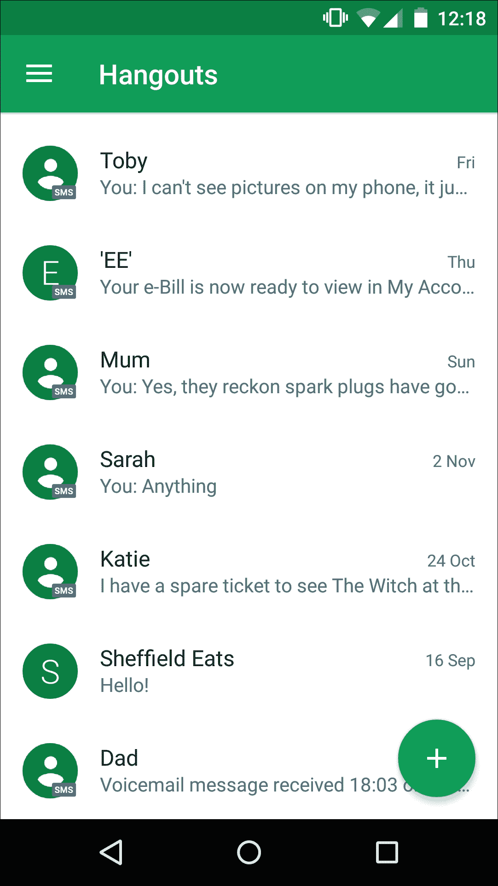
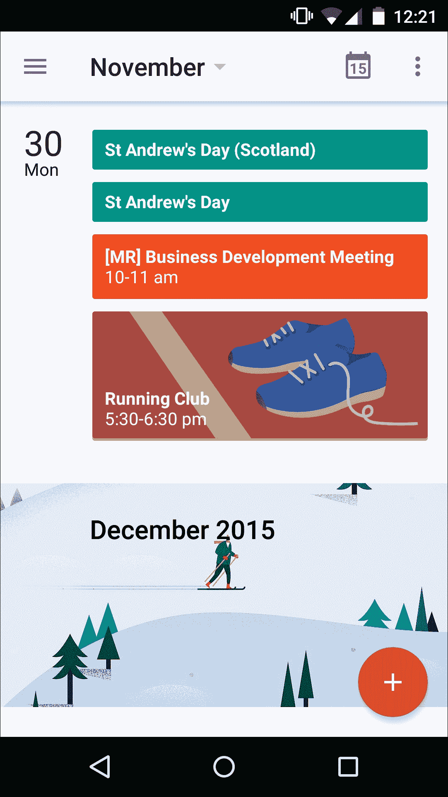
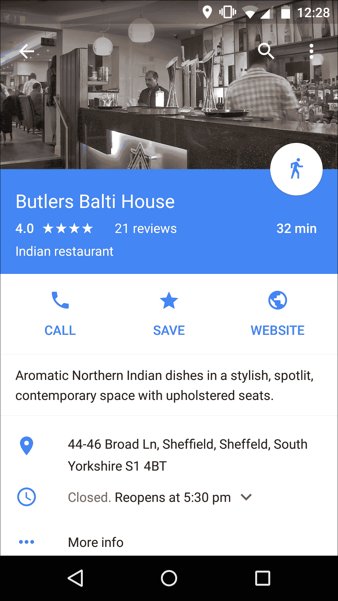
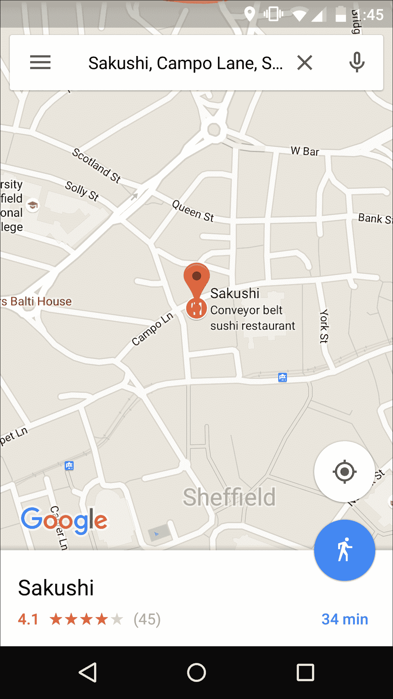
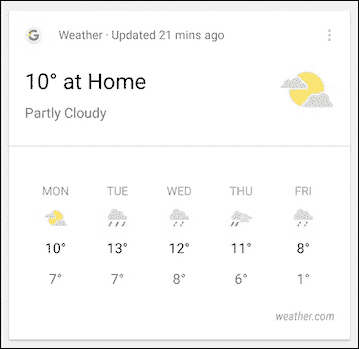

# 第四章：开始使用材料设计

在 2014 年 Google I/O 大会上宣布，并在 Android Lollipop 中首次亮相，材料设计是来自 Google 的新设计语言。

这对 Android 来说尤其是个大新闻，因为材料设计的整体目的是提供更一致的用户体验；作为一个开放平台，Android 特别容易受到不一致性的影响。打开您的 Android 设备的应用程序抽屉，花些时间翻阅您的应用程序，您可能会遇到至少几个看起来和感觉与其他应用程序*非常*不同的应用程序。

材料设计旨在通过提供所需的工具和指南，改变这一切，以提供更统一的用户体验。

通过遵循材料设计原则，您可以创建外观美观、运行流畅，并感觉像是 Android 平台无缝扩展的应用程序。谁会不想要这样的呢？

然而，材料设计不仅仅是关于如何给按钮添加阴影、UI 的主要文本应该有多不透明的技术规范。因此，在我们深入探讨如何创建一个与 Google 新设计方向完美匹配的 UI 之前，让我们通过了解其背后的理论来更好地理解材料设计是什么。

# 材料设计的理念

材料设计基于将现实世界材料的物理属性转化为虚拟屏幕的想法，并且从纸张、墨水和印刷技术中汲取了许多灵感。

材料设计鼓励设计师和开发者创建屏幕上的对象，这些对象似乎具有现实世界对象的相同特性。这意味着使用阴影、光线和高度等技术来创造深度和边缘感。

材料设计对象的移动方式也模仿了现实世界中物体的移动方式；例如，两个现实世界物体不能同时占据同一空间或相互穿过，因此您的屏幕对象也不应该如此。

为了帮助您创造这种幻觉，材料设计引入了模拟 3D 空间的概念，其中所有 UI 对象都拥有*X*、*Y*和*Z*坐标。*Z*坐标尤为重要，因为正*Z*轴向外延伸至用户，创造出对材料设计至关重要的深度感。

### 注意

在材料设计中，每个对象都占据*Z*轴上的一个位置，每个对象都有标准的 1dp 厚度。

所有操作都在材料设计的模拟 3D 环境中进行；物体出现、消失，并转化为新的物体，而不会打破连续 3D 环境的幻觉。

当物体在 Material Design 空间中移动时，它们模仿纸张如何被洗牌和装订在一起。例如，你可以沿着一个共同的边缘或 *接缝* 将两片材料绑在一起，使它们一起移动。相比之下，当两片材料重叠但沿着 *Z* 轴占据不同的位置时，它们 *没有* 被绑定在一起，因此可以独立移动。

这些设计原则可能会给你的用户界面带来独特的视觉和感觉，但 Material Design 不仅仅是关于你的 UI 看起来如何。你可以使用 Material Design 元素，如深度和阴影，为用户提供视觉线索，关于你的界面层次结构，微妙地引导他们走向他们需要与之交互的 UI 元素。如果使用得当，Material Design 可以帮助确保你的用户本能地知道如何导航和与你的应用程序的用户界面交互。

掌握 Material Design 的最有效方法之一是查看一些做得很好的 Material Design 示例，这样你就知道你的目标是什么。

由于 Material Design 是 Google 的设计语言，还有什么地方比 Google 自己的应用程序更好的地方去寻找指导呢？

## 案例研究 – Hangouts

Hangouts 应用程序已经进行了重大改造，以符合 Material Design。

最显著的 UI 变化之一是“创建新消息”按钮，现在它以浮动操作按钮的形式出现，也称为 FAB。作为最重要的操作，这个 FAB 在主 Hangouts 屏幕的右下角显著且方便地定位，因此当用户需要创建新消息时，总是触手可及。



Hangouts 应用程序使用了两个 Material Design 的基本元素——高度和阴影——来营造出 FAB（浮动操作按钮）似乎漂浮在其他所有 UI 元素之上的感觉。这自然将用户的注意力引向屏幕上最重要的任务；在这个例子中，最重要的任务是创建一条新消息。

## 案例研究 – Google Calendar

Material Design 鼓励使用鲜艳的颜色和大图像。你会在更新的 Google Calendar 应用程序中找到这两者。



Google Calendar 是一个很好的 UI 示例，其中颜色和图像不仅使应用程序看起来很有趣，而且通过帮助用户一眼就能看到他们的日程安排中的重要信息而发挥作用。例如，只需快速浏览一下之前的日历图像，就可以看到我周一晚上有一个跑步俱乐部，多亏了那双大号、色彩鲜艳的运动鞋图片。

日历也是一个很好的 Material Design 动画示例。花些时间在日历应用程序中四处移动，你会遇到不同的动画装饰，例如屏幕上的元素在屏幕上移动进出，组装成新的视图。

这些简短动画使在 Google Calendar 应用中导航变得更加流畅、自然，并且通常更加愉快。

## 案例研究 – Google Maps

Google Maps 使用 Material Design 的**底部面板**概念来创建沉浸式体验，用户可以选择一个位置，然后探索与该位置相关的所有信息，而无需离开地图环境。

打开 Google Maps 应用并选择一个位置（无论是大型旅游景点、著名地标，还是您当地的酒吧），您会注意到从屏幕底部升起的一个底部面板。在其默认状态下，此底部面板显示了一些关于您选择位置的事实，但当您将面板向上拖动时，它会扩展以填充整个屏幕。这个扩展的面板包含更多信息，包括营业时间、联系方式、照片以及您选择位置的用户评价：



底部面板使用阴影和提升来营造一些组件位置高于其他组件的印象。在我们的 Google Maps 截图中，照片组件被样式化，因此看起来比底部面板的其他部分低。

读完底部面板提供的一切后，您可以通过将面板从屏幕上拖动来关闭它。底部面板将折叠起来，露出主要的 Google Maps 屏幕，给您留下整个时间主要屏幕都隐藏在底部面板后面的印象。

# 开始使用 Material Design

现在我们已经探讨了 Material Design 背后的主要概念，并看到了一些做得很好的 Material Design 示例，是时候看看您如何可以将一些核心的 Material Design 原则应用到您自己的 Android 应用中了。

接下来的几节将向您展示如何使用视觉技术，如阴影和提升，为您的应用进行 Material Design 改造。您还将学习如何通过添加 FAB、卡片和`RecyclerView`等元素，对应用的功能进行一些更基本的更改。让我们首先确保您的应用看起来符合要求。

## 将 Material 主题应用到您的应用

应用 Material 主题是使整个应用具有一致 Material Design 外观最快、最简单的方法。

Android 提供了浅色和深色变体供您选择：

+   `Theme.Material`: 这是 Material 主题的深色版本。这被认为是默认的 Material 主题。

+   `Theme.Material.Light`: 这是 Material 主题的浅色变体。

+   `Theme.Material.Light.DarkActionBar`: 这是主题的浅色版本，但具有深色操作栏。

要将 Material 主题应用到您的应用中，您需要创建一个新的样式，该样式继承自您想要使用的主题版本（`Theme.Material`、`Theme.Material.Light`或`Theme.Material.Light.DarkActionBar`）。打开您的项目`res/values/styles.xml`文件，并创建一个新的样式，继承自您选择的主题：

```java
<resources> 
  <style name="AppTheme" parent="android:Theme.Material"> 

//Inherits from the standard Theme.Material// 

  </style> 
</resources> 

```

为了在保持 Material Design 外观和感觉的同时赋予您的应用自己的身份，您可能希望向继承的 Material Design 样式添加自己的自定义设置。最常见的自定义之一是更改主题的基本颜色；例如，您可能希望将操作栏的颜色更改为与您的应用*主颜色*相匹配。

Material Design 使用两种类型的颜色：主色和强调色。正如其名所示，主色是在整个应用中使用的主体颜色——在 Google Hangouts 中，主色是绿色。

强调颜色是一种更亮的色调，您可以使用它来突出显示应用最重要的元素，例如浮动操作按钮或标题。通过使用一致的基色和偶尔的更醒目的强调颜色，您可以创建一个色彩丰富且充满活力的用户界面，同时不会分散用户对应用内容的注意力。

当您需要自定义继承的 Material Design 主题中使用的颜色时，有多个可用的属性可供使用：

+   `colorPrimary`: 这设置操作栏背景的颜色。这是您应用的主颜色。

+   `colorAccent`: 这是您应用的强调颜色。这应该与您应用的主颜色相协调，并且是吸引用户注意重要 UI 元素的好方法。

+   `colorControlNormal`: 这设置应用框架控制在其默认的非激活状态下的颜色。

+   `colorControlActivated`: 这设置框架控制在其激活状态下的颜色。此属性覆盖`colorAccent`。

+   `android:textColorPrimary`: 这设置控件上的文本颜色。在运行 Lollipop 版本之前的 Android 设备上，此属性设置溢出菜单和操作栏标题的颜色。

以下属性仅在运行 Android 5.0 或更高版本的设备上有效：

+   `colorPrimaryDark`: 这是您应用主颜色的深色变体。此属性设置导航栏（通过`navigationBarColor`）和状态栏（通过`statusBarColor`）的颜色。

+   `colorControlHighlight`: 这是应用于应用框架控制高亮显示的颜色，例如涟漪动画。您可以使用此属性提供与您的应用配色方案相协调的视觉反馈。但请勿过度使用——过多的视觉反馈可能会让用户感到不知所措。

+   `colorSwitchThumbNormal`: 用户通过拖动开关的`Thumb`部分来回切换。此属性设置`Thumb`元素在*关闭*位置时的颜色。

+   `android:colorButtonNormal`: 这设置按钮在其默认的非按下状态下的颜色。

+   `android:colorEdgeEffect`: 这设置应用滚动超出内容边界时的滚动效果颜色。

+   `android:navigationBarColor`：这设置了导航栏的颜色，即出现在设备底部并包含  ***Back**,*  ***Home**,* 和  ***Recent*** 软键的栏。

要创建材料主题的自己的变体，请将任何前面的属性添加到我们之前创建的样式中：

```java
<resources> 

  <style name="AppTheme" parent="android:Theme.Material"> 

    <item name="android:colorPrimary">@color/blue</item> 

//Specifies that the theme's primary color should be blue// 

    <item name="colorPrimaryDark">@color/darkblue</item> 

//Specifies that the navigation bar and status bar should be dark blue// 

    <item name="colorAccent">@color/white</item> 

//Specifies that the app's accent color should be white// 

<item name="colorSwitchThumbNormal">@color/white</item> 

//All the switches should have a white thumb element// 

  </style> 

</resources> 

```

现在，您已经知道如何自定义受材料启发的主题中的颜色，但您应该使用什么颜色呢？再次强调，材料设计有答案。

### 选择您的配色方案

选择您的配色方案是您需要做出的最重要的 UI 决定之一，因为您选择的颜色将影响用户界面的每一个部分。

为了帮助您做出这个关键的设计决定，Android 团队发布了一套主色和强调色调色板，这些颜色设计得相互补充。您可以在 [`www.google.com/design/spec/style/color.html#`](https://www.google.com/design/spec/style/color.html) 找到完整的材料设计调色板。

在选择您应用的配色方案时，您应该从主调色板中选择三种色调（即任何标记为 500 的颜色）和从辅助调色板中选择一种强调色（即任何不是 500 的颜色）。

### 小贴士

**需要一些帮助选择您的调色板吗？**

在众多颜色和阴影的选择中感到困惑？您可能想查看许多可以为您生成完整材料设计调色板的网站之一。只需选择两种颜色，网站就会根据您的选择生成一个包含主色和强调色的完整调色板。网上有很多调色板生成器，但其中最简单、最容易使用的是 Material Palette，网址为 [`www.materialpalette.com/`](http://www.materialpalette.com/)。

### 向后兼容性

材料主题仅在 Android 5.0（API 级别 21）及以上版本中可用，因此在其默认状态下，您无法在运行早期版本 Android 的设备上使用材料主题或任何由此派生的自定义主题。

然而，您可以使用 **AppCompat 库** 使材料主题对 API 7 及以上版本的运行用户可用。

要将此库添加到您的项目中，请确保您已下载 **Android Support Library** 的最新版本（如果您使用 Eclipse）或 **Android Support Repository**（如果您使用 Android Studio）。AppCompat 依赖于 v4 支持库，因此请确保您已将此库添加到您的项目中。

Android Studio 用户需要在他们的模块级 `build.gradle` 文件中添加 AppCompat 作为依赖项：

```java
dependencies { 
    ... 
    compile 'com.android.support:appcompat-v7:23.1.0' 
} 

```

Eclipse 用户需要在他们的 Android SDK 目录中找到 AppCompat 库，将其复制到项目 `libs` 目录中，右键单击 JAR 文件并选择 **Build Path**，然后选择 **Add to Build Path**。

要使用 AppCompat，请确保您项目中的所有活动都扩展了 `AppCompatActivity`：

```java
import android.support.v7.app.AppCompatActivity; 

public class MainActivity extends AppCompatActivity { 

```

您的主题还必须继承自 `Theme.AppCompat`：

```java
<style name="AppTheme" parent="Theme.AppCompat"> 

```

在此之后，您可以像平常一样自定义材料主题。

## 创造深度感

材料设计结合了三种视觉技术来创造深度感：

+   **光源**：在材料设计的模拟 3D 环境中，虚拟光源照亮屏幕上的对象，并允许它们投射阴影。照明可以是主光源（投射方向性阴影）或环境照明（从所有角度创建柔和阴影）。

+   **阴影**：这些为用户提供关于每个对象深度的关键视觉线索。当对象移动时，阴影会继续提供重要信息，包括对象移动的方向，以及此对象与其他屏幕上对象之间的距离是增加还是减少。对象投射的形状由对象的背景定义，而不是其内容，因此，无论按钮图标形状如何，圆形按钮都会投射圆形阴影。

+   **高度**：每个 UI 元素都有自己的高度，这是对象沿 *Z* 轴的高度。高度可以帮助您传达每个屏幕上不同 UI 元素的重要性，自然地将用户的注意力吸引到屏幕上最重要的元素。

您可以通过指定对象的高度来创建阴影。当您添加高度时，框架会自动在对象后面的项目上投射阴影。对象的高度决定了其阴影的外观；具有更高 *Z* 值的视图将投射更大、更柔和的阴影。

要设置视图的高度，请使用 `android:elevation` 属性：

```java
<TextView 
  android:layout_width="wrap_content" 
  android:layout_height="wrap_content" 
  android:elevation="20dp" 
  android:text="Hello down there!" /> 

```

### 小贴士

只需记住，所有材料元素都具有 1dp 的厚度，因此高度是从一个表面的顶部到另一个表面的顶部的距离。

如果您想以编程方式设置视图的高度，请使用 `View.setElevation` 和 `View.getElevation` 方法。

每个对象都有一个默认的 *静止* 高度，应在您的应用中保持一致。例如，如果您在一个屏幕上将浮动操作按钮定位在 10dp，那么它应该在 *每个* 屏幕上定位在 10dp。

对象还可以具有响应式高度，这是指它们根据用户操作临时改变其高度。例如，如果用户在图库应用中选择了一张图片，这张图片可能会临时增加其高度以指示其选中状态。

响应式高度也应跨您的应用保持一致，因此，如果图库应用中的图片通过 5dp 改变高度，所有其他具有响应式高度的其他图片必须显示完全相同的 5dp 行为。

如果对象改变高度，它应尽快返回其原始高度——通常是在输入事件完成或取消后。

当添加具有响应式高度的组件时，请确保没有可能发生一个组件在改变高度时遇到另一个组件的情况。请记住，在 Material Design 中，对象不能相互穿过！如果空间紧张，那么一个解决方案是使用动画暂时将对象移开；例如，您可以将一个对象向右移动几个像素，以便为正在改变高度的另一个对象腾出空间。

### 创建 Material Design 结构

在这个阶段，您已经选择了您的调色板，创建了一个定制的 Material 主题版本，并且知道如何为用户界面添加高度。

下一步是查看您可以添加到您的应用中的新结构元素，这样它不仅看起来像 Material 应用，而且也表现得像 Material 应用。

让我们从最熟悉的 Material Design 功能之一：浮动操作按钮开始。

## 浮动操作按钮

FAB 是一张看似漂浮在用户界面之上的圆形材料片（因此得名）。如果您有一个需要用户随时可用的持久操作，您应该考虑将其显示为 FAB。

浮动图标按钮代表一个单一推荐的操作，并使用熟悉的系统图标。

### 注意

您可以在[`www.google.com/design/icons/`](https://www.google.com/design/icons/)找到所有系统图标。

通过 XML 将 FAB 添加到项目中相对简单，因为它使用了您已经熟悉的许多属性，例如`android:id`和`layout_width`。然而，在我们的 FAB 示例中，我们将使用一个名为`CoordinatorLayout`的新元素。这个属性允许您控制 UI 元素之间的交互方式，并且对于告诉 FAB 在用户滚动屏幕时应该如何反应特别有用；是移动还是保持在同一位置？

在这个例子中，我们将 FAB 放置在`CoordinatorLayout`内部，并告诉它保持在工具栏的底部：

```java
<?xml version="1.0" encoding="utf-8"?> 
<android.support.design.widget.CoordinatorLayout 
......... 
......... 
.......... 

<android.support.design.widget.FloatingActionButton 
  android:id="@+id/myfab" 
  android:layout_width="wrap_content" 
  android:layout_height="wrap_content" 
  app:layout_anchor="@id/actionbar" 

//The FAB should stay anchored to the action bar//  

  app:layout_anchorGravity="bottom|right|end" 
  android:layout_margin="@dimen/fab_margin" 
  app:elevation="20dp" 

//Set the button's elevation so it appears to hover above the rest of the UI, and casts a shadow across the items behind it//   

  android:src="img/ic_dialog_email" /> 

//This references the icon that the FAB should display. In this example, I'm using the create new email icon//  

</android.support.design.widget.CoordinatorLayout> 

```

您可能会注意到我们没有指定 FAB 的背景颜色；这是因为 FAB 默认使用您主题的`colorAccent`属性，除非您指定了其他颜色。

您可以像往常一样添加点击事件。所以，为了使事情更有趣，我将加入另一个来自 Material Design 的新元素：**Snackbar**。

Snackbar 与 Toast 类似，但关键区别是用户可以与之交互。用户通过从屏幕上滑动来关闭 Snackbar。Snackbar 出现在屏幕底部。因此，它们非常适合显示与我们的 FAB 相关的消息，而 FAB 恰好位于屏幕底部：

```java
fab.setOnClickListener(new View.OnClickListener() { 
    @Override public void onClick(View v) { 
        Snackbar.make(content, "The FAB has been clicked!",          Snackbar.LENGTH_SHORT).show(); 

//Create a snackbar and display the message "The FAB has been clicked!"// 

    } 
}); 

```

在创建 FAB 时，有一些指南您应该记住：

+   **保持积极**：仅使用 FAB 进行积极操作，例如**创建**、**喜欢**、**分享**或**导航**，永远不要用于破坏性操作，例如**存档**或**垃圾箱**。

+   **使用一致的间距**：在移动设备上，你应该将 FABs 放置在边缘 16dp 或更多的地方。在平板尺寸的设备上，浮动动作按钮应至少距离边缘 24dp。

+   **避免自定义 FABs**：始终使用标准圆形图标，并且不要被给动作按钮额外尺寸的诱惑所吸引。如果你确实想给 FAB 添加自己的风格，你总是可以动画化按钮内的图标。

+   **不要包含溢出动作**：溢出菜单属于工具栏，而不是 FABs。

### 小贴士

**用 FAB 动画给人留下深刻印象**

作为突出的 UI 元素，FABs 是让用户通过动画装饰感到惊喜和愉悦的绝佳机会。例如，你可以设计你的“创建新电子邮件”FAB，使其在点击时变成一封新电子邮件。尝试不同的动画和过渡效果，但不要过分！动画应该是细微的，是最后的润色，永远不要阻碍用户的操作或分散他们对应用实际内容的注意力。

## 底部面板

底部面板是一张从屏幕底部滑动的材料面板，是对用户操作的响应，例如在谷歌地图中选择兴趣点时出现的面板。

底部面板的初始高度相对于它包含的列表项的高度，但底部面板的初始高度不应超过其 16:9 的比例。

底部面板最初仅覆盖屏幕的一部分，但当用户向上滑动时，它们会扩展以填充整个屏幕。当底部面板扩展到其完整高度时，用户可以滚动查看其内容；再次，谷歌地图应用是这种功能的完美示例。

底部面板最适合显示三个或更多不需要描述的动作。如果你想要显示少于三个动作，或者你想要包含详细描述，那么你应该考虑使用对话框或菜单。

底部面板有两种类型：

+   持续底部面板：

    这些是贯穿整个应用的结构性元素。它们显示补充主视图的应用内内容。即使它们未被积极使用，持续底部面板仍然可见，并且它们与应用其余部分处于相同的高度。持续底部面板通过以独特的方式呈现内容，有助于将用户的注意力吸引到重要内容上。

+   模态底部面板：

    这是一个临时材料面板，其高度高于其他内容。

    你可以使用模态底部面板以列表或网格格式展示操作，作为菜单和简单对话框的替代方案。用户不可能忽略模态面板；当一个活动的模态底部面板滑入屏幕时，屏幕的其他部分会变暗。用户必须先关闭模态面板，才能与底层内容进行交互。如果你需要向用户展示一系列操作，且用户界面中没有合适的位置插入菜单按钮时，模态底部面板非常方便。

然而，在屏幕空间较少的大屏幕上，对话框和菜单等组件可能比模态底部面板更合适。这是因为，正如其名所示，底部面板总是出现在屏幕底部。对于在较大设备（如横握模式的平板电脑）上与你的应用交互的用户来说，模态面板可能出现在用户触发面板的显著距离之外。这可能听起来不是什么大问题，但这样的小烦恼真的会累积起来，逐渐削弱用户对你的应用的整体体验。



上一张截图显示了模态底部面板在展开前的默认状态。

## CardView

卡片为你提供了一个方便且一致的方式来显示相关内容，特别是包含多种数据类型的内容。例如，你可以创建一个包含关于特定主题的图片、链接、文本或视频的卡片。

当你想在交互式功能（如**+1**、评论和用户评价）旁边显示数据时，卡片也很有用。只是要注意不要让卡片上信息过多。

卡片具有恒定的宽度和可变的高度，可以根据可用空间临时扩展。

每张卡片由内容块组成。一张典型的卡片通常包括以下内容：

+   *标题或主要标题*。这应该表明卡片是关于什么的。

+   *富媒体*，例如图片或视频。包括富媒体可以帮助用户一眼就能从你的卡片中获取有价值的信息；例如，如果你正在设计一个天气应用，每张卡片上都有一个图片，意味着用户只需瞥一眼那张卡片就能对天气情况有一个大致的了解。



+   *辅助文本*。提供有关卡片的重要信息的文本。

+   *主要操作*。这是用户可以在卡片上下文中执行的最重要操作。将其视为卡片上的 FAB（浮动操作按钮）的等价物。

+   *可选的辅助操作*。这些可以是图标、文本，甚至是 UI 控件，使用户能够更改卡片的内容。在我们的天气示例中，你可以包括一个滑块，允许用户滚动查看每个小时的天气预报。

当您设计卡片的内容层次结构时，您应该将最重要的内容放置在顶部，而补充图标通常属于卡片的最底部。

使用 `CardView` 将卡片添加到您的布局中。以下代码展示了如何通过 XML 添加一个空白的卡片到您的布局中：

```java
<android.support.v7.widget.CardView 

     android:layout_width="match_parent" 
     android:layout_height="wrap_content"> 

</android.support.v7.widget.CardView> 

```

您以与添加常规布局内容相同的方式向 `Cardview` 添加内容。以下示例演示了如何创建一个包含 `Contacts` 卡片的 `LinearLayout`。此 `Contacts CardView` 显示每个人的姓名和头像：

```java
<?xml version="1.0" encoding="utf-8"?> 

<LinearLayout   

  android:layout_width="match_parent" 

  android:layout_height="match_parent" 
  android:padding="20dp"  > 

  <android.support.v7.widget.CardView 
      android:layout_width="match_parent" 
      android:layout_height="wrap_content" 
      android:id="@+id/contacts" > 

   <LinearLayout  

    android:orientation="vertical" 
    android:layout_width="match_parent" 
    android:layout_height="match_parent"> 

<TextView 
     android:id="@+id/contactName" 
     android:layout_width="wrap_content" 
     android:layout_height="wrap_content" 
     android:text="@string/contactName" /> 

 <ImageView 
     android:layout_width="wrap_content" 
     android:layout_height="wrap_content" 
     android:id="@+id/contactphoto" 
     android:src="img/avatar" /> 

</LinearLayout> 

  </android.support.v7.widget.CardView> 

</LinearLayout> 

```

您可以使用 `CardViews` 在运行 Android 2.1（API 级别 7）及更高版本的设备上，通过将 `v7 cardview` 库添加到您的项目中来实现。如果您正在使用 Eclipse，您需要将此库添加到项目中的 `libs` 目录，然后选择**构建路径**，接着选择**添加到构建路径**。Android Studio 用户需要在他们的模块级 `build.gradle` 文件中将此库添加为依赖项：

```java
dependencies { 
     compile 
     'com.android.support:cardview-v7:21.0.+' 
} 

```

在您的布局中添加一个标准的 `CardView` 非常直接，但如果您想自定义 Android 的标准 `CardView`，您可以做出以下更改：

+   使用 `cardView:cardCornerRadius` 更改卡片的角度半径，例如，`card_view:cardCornerRadius="10dp"`。或者，您可以通过使用 `cardView.setRadius` 方法通过您的应用程序代码设置角度半径。

+   使用 `card_view:cardBackgroundColor` 更改卡片背景颜色。

+   使用 `card_view:cardElevation` 为您的卡片添加一个高度并创建一个阴影。

## 列表和 RecyclerView

列表为您提供了一种以一致、易于阅读的格式展示相关数据类型的方法。

列表由连续的列和行组成，这些列和行作为瓷砖的容器。您应该在每个瓷砖中优先考虑您最重要的内容；想象您正在设计一个电子邮件应用程序，其中每个电子邮件都由一个瓷砖表示。通常，每个瓷砖会以较大的字体显示发件人的姓名和主题标题，因为这是最重要的信息，然后您会在较小的字体中提供电子邮件文本的预览。

典型的列表瓷砖包含以下内容：

+   **文本**：在单行列表中，每个瓷砖包含一行文本。在双行列表中，每个瓷砖最多包含两行文本。如果您需要显示超过两行的文本，请考虑使用卡片。同一列表中的瓷砖之间的文本量可能会有所不同。

+   **主要操作**：这些在列表中的每个瓷砖上都是一致的。在我们的电子邮件示例中，主要操作可能是*打开电子邮件*，并且此主要操作将出现在列表中的每个瓷砖上。

+   **可选补充操作**：这些通常以图标或辅助文本的形式出现，并且应放置在每个瓷砖的右侧。

使用 `RecyclerView` 创建列表，`RecyclerView` 是用于显示大量数据集的容器。与 `ListView` 相比，`RecyclerView` 提供了改进的性能，因为它直接回收视图。当项目视图对用户不再可见时，`RecyclerView` 会自动用数据集中的不同元素替换它们的内 容，从而实现更平滑的滚动。

`RecyclerView` 还提供了对常见操作（如从列表中删除项目）的默认动画，并提供布局管理器来帮助您在列表中定位项目。

`RecyclerView` 为您提供了三个内置布局管理器供您选择：

+   `LinearLayoutManager` 以水平或垂直滚动列表的形式显示项目

+   `GridLayoutManager` 以网格的形式显示项目

+   `StaggeredGridLayoutManager` 以交错网格的形式显示项目

要在项目中使用 `RecyclerView`，您需要执行以下步骤：

1.  将 `RecyclerView` 支持库添加到项目的 Gradle 构建文件中 (`com.android.support:recyclerview-v7:23.1.0`)。

1.  定义您的数据源。

1.  将 `RecyclerView` 添加到布局文件中，就像添加一个常规视图一样：

    ```java
            <android.support.v7.widget.RecyclerView
            android:id="@+id/recylerview"
            android:layout_width="match_parent"
            android:layout_height="match_parent"
            android:scrollbars="vertical" /> 

    ```

1.  指定您想要使用的布局管理器：

    ```java
            mLayoutManager = new LinearLayoutManager(this);
            mRecyclerView.setLayoutManager(mLayoutManager); 

    ```

1.  创建一个适配器。要使用 `RecyclerView`，您需要创建一个扩展 `RecyclerView.Adapter` 类的适配器：

    ```java
            public class MyRecyclerAdapter extends
            RecyclerView.Adapter<MyRecyclerAdapter.ViewHolder> { 

    ```

1.  创建 `ViewHolder`。`RecyclerView` 适配器依赖于 `ViewHolder` 对象，该对象存储了对所有视图的引用，因此您不需要使用多个 `findViewById()` 方法。

    ```java
            public class ViewHolder extends
            RecyclerView.ViewHolder { 

    ```

1.  通过 `setAdapter` 方法将适配器分配给您的 `RecyclerView`。

## 动画和过渡

材料设计的两个更多关键特性是新动画和过渡。当正确使用时，这些视觉效果不仅看起来很棒，而且还服务于两个主要目的。

### 加强材料设计的错觉

材料设计的一个关键方面是屏幕上的元素具有与物理对象相同的特性，动画是帮助您真正强调这一点的强大工具。

在现实世界中，物体的运动方式取决于它们的物理特性。通过改变动画，您可以创造出不同的屏幕对象具有不同的物理特性的感觉。例如，您可以通过使物体移动得更慢来暗示物体比其他物体更重。如果用户看到物体快速移动并迅速加速，他们会认为该物体较轻。

材料设计的另一个基本方面是所有屏幕上的对象似乎都在一个连续的 3D 空间中出现、消失和转换的错觉。使您的应用程序感觉像真实的三维环境的最强大方法之一是在应用程序的活动之间创建视觉连续性。

传统上，Android 应用程序被设计为一系列屏幕，其中每个活动都是一个单独的屏幕。材料设计通过使用过渡来模糊这些边界，从而使用户能够轻松地从活动切换到下一个活动。

例如，当一个新的活动开始时，之前活动的元素可能会淡出，而新活动的元素则通过动画方式进入屏幕。如果这两个活动有共同元素，你可以对这些元素进行动画处理，使它们看起来重新排列成一个新的布局，这实际上是一个全新的活动。这样，你可以创建一个更加流畅和沉浸式的用户体验，让用户感觉就像是在你的应用环境中移动，而不是从一个屏幕切换到另一个屏幕。

### 小贴士

**进入和退出**

在你的对象进入和退出屏幕的方式上多花些心思，因为这些是加强 Material Design 连续 3D 环境幻觉的理想机会。如果一个对象以相当快的速度进入屏幕，用户就会认为这个对象已经在屏幕外移动了一段距离，并且在移动过程中加速了。如果一个对象在退出屏幕时减速，用户就会认为这个对象将在屏幕外停下来。

你还应该寻找机会利用这些假设来为你带来优势。例如，如果你知道某个对象将会再次出现，你可以让它以缓慢的速度退出屏幕，然后在适当的时候慢慢回到屏幕上，给用户一种这个对象一直在屏幕外悬浮的印象。

## 提供用户视觉反馈

无论用户何时与 UI 元素交互，你的应用都应该提供某种形式的视觉确认，表明它已成功记录了他们的交互。

### 注意

最常见的用户交互是触摸事件，因此在本节中，我将重点关注这种类型的事件。只是要注意，你的应用可能需要处理其他形式的用户输入，例如用户在虚拟键盘上打字或通过设备麦克风发出指令。

在 Material Design 中，触摸波纹是提供这种视觉确认的主要机制。

触摸波纹效果是一种特别有用的动画，你可以用它来传达关于触摸事件的额外信息，例如事件的持续时间、施加的压力量以及触摸事件发生的位置（触摸波纹从输入点向外扩散）。

你可能还想让材料动画响应用户输入，例如，当用户长按照片时，让它看起来稍微抬起。

### 动画——一个警告

动画可能是你拥有的最有力量或最具破坏性的工具之一。

我们的眼睛擅长检测和跟踪运动，但如果多个元素同时移动，或者以随机模式移动，那么用户将无法跟上！糟糕的动画比没有动画还要糟糕。

你还应该避免使用耗时且没有其他目的，仅仅是为了看起来漂亮的动画。理想情况下，你应该旨在通过微妙、意外的动画使用来让用户感到意外，从而以某种方式增强他们的体验，而不是仅仅为了使用动画。

## 完成细节

现在你已经创建了一个具有材料设计外观和感觉的用户界面，并添加了一些结构元素，如浮动操作按钮和卡片，现在是时候给你的材料设计应用添加完成细节了。

### 设计你的产品图标

你的产品图标应该传达你的应用身份，同时表明你的应用目的和核心功能。

### 小贴士

**建立你的品牌**

如果你正在创建多个应用，每个产品图标都应该独特，但你也应该利用每个图标作为机会来创建和加强一个跨越所有 Android 提供的更广泛品牌。在相关的产品图标之间追求一致性。

产品图标应该反映我们在本章中探讨的相同材料设计原则，因此，再次提醒，你应该将纸张和墨水的物理特性作为你的主要灵感来源。你的产品图标应该看起来就像其他材料设计对象一样被切割、折叠和照亮，但真正的挑战是在传达所有这些信息的同时，创建一个干净、简单的产品图标。

两个特别有效的材料设计图标示例是 Google 日历和 Gmail 产品图标。这两个图标都使用简单的形状来创造阴影、深度和边缘感，同时清楚地传达了应用的主要目的和功能。

下面是 Gmail 的图标：


下面是 Google 日历的图标：


为了使设计你的产品图标更容易，材料设计引入了**产品图标解剖学**的概念。这些是你可以纳入你设计的标准化形状，以帮助在产品图标之间促进一致的外观和感觉。你可以在[`www.google.com/design/spec/style/icons.html#icons-product-icons`](https://www.google.com/design/spec/style/icons.html#icons-product-icons)查看这些标准化形状。

每个产品图标都应该包含相同的结构元素。这些元素总是从正上方观看，并且每个组件都位于前一个组件的顶部：

+   **完成**：这是一种柔和的色调，你应该用它来突出所有产品图标元素的上边缘。你不应该将这种色调应用到图标的左侧、右侧或底部元素上。

+   **材料背景**：这是一张作为你图标背景的材料。

+   **材料前景**：这是一个位于材料背景之上的元素，并在背景上投下阴影。

+   **阴影**：这是一种出现在所有凸起材料元素边缘的柔和阴影。这种阴影应该沿着产品图标的右侧和底部线条略微加重。

### 注意

**创建完美的产品图标**

虽然分层纸张元素对于创建深度感是有效的，但请注意不要通过添加过多的层来使您的应用过于复杂。您应该追求一个具有所有阴影、深度和边缘的产品图标，但它应该*仍然*提供简单流畅的外观。

您应该提供 48dp 大小的图标，边缘为 1dp。

#### 系统图标

在上一节中，我们深入探讨了产品图标，这些图标是您应用程序独有的，但系统图标又如何呢？

好消息是，Android 团队已经为所有系统图标进行了材料设计的改造。除非您有非常，*非常*充分的理由不这样做，否则您应该使用这些标准系统图标。

您可以从[`www.google.com/design/spec/style/icons.html#icons-system-icons`](https://www.google.com/design/spec/style/icons.html#icons-system-icons)获取整个包。

### 字体和写作

在本节中，我们将探讨创建符合材料设计原则的文本所需了解的所有内容，从一般写作建议到关于文本不透明度的具体指南。

#### 字体

作为一名 Android 开发者，您需要了解两种主要的字体：

+   **Roboto**：自 Android 4.0 以来，Roboto 一直是 Android 的标准字体。

+   **Noto**：自 Android 2.2 发布以来，Noto 一直是所有未覆盖 Roboto 字体的语言的标准字体。

材料设计同时使用这两种字体。

#### 文本透明度

您可以使用不同级别的透明度来向用户传达每段文本的重要性。

您应使用的透明度级别将根据您的文本颜色和应用程序背景颜色而有所不同。当您向深色背景添加浅色文本时，您应该使用以下：

+   **主要文本**：100%透明度

+   **次要文本**：70%透明度

+   **提示文本、禁用文本和图标**：30%透明度

当您向浅色背景添加深色文本时，您应该使用以下：

+   **主要文本**：87%透明度

+   **次要文本**：54%透明度

+   **提示文本、禁用文本和图标**：38%透明度

当您向 UI 添加文本时，请检查您的背景颜色是否会使您的文本难以阅读。此外，请注意，过多的对比度会使您的文本同样难以阅读；理想情况下，您的文本应保持 7:1 的对比度比。

#### 写作指南

现在您已经知道您的文本在屏幕上应该是什么样子了，是时候将我们的注意力转向您的文本实际上*要表达的内容*了。

为了确保您的用户界面尽可能用户友好，您应该创建以下文本：

+   **清晰**: 用户会欣赏简单、直接的言语，不需要重复阅读。仔细选择你的词汇，并寻找传达信息的最简单方式；例如，说*转到问题 2*比说*导航到问题 2*更好。

+   **易于理解**: 在撰写文本时，要考虑到有些人可能在使用你的应用时使用的是第二语言。即使你将你的应用翻译成其他语言，文化特定的短语和俚语可能无法在翻译过程中保留。你的目标应该是写出对*所有人*都易于理解的文本。相关的是，当你创建字符串资源时，通常是一个好主意包括详细的描述，甚至可能还有额外的注释，这样如果应用最终被翻译，你就有更大的机会确保其被准确翻译。

+   **必要**: 文本的全部目的是帮助用户导航并从你的应用中获得价值，所以每次你想要在 UI 中添加文本时，问问自己—*用户真的需要知道这个吗？* 例如，如果你创建了一个包含表单和**提交**按钮的屏幕，你的用户可能不需要你添加**请完成表单然后点击提交按钮**的免责声明，因为他们可能已经知道该怎么做。

+   **简洁**: 你决定包含的文本应该是简短、清晰、直接。为了将文本保持在最短，尽可能使用缩写（比如用*can't*代替*can not*）。

+   **缺少标点符号**: 标点符号会增加视觉杂乱，所以你应该尽可能省略标点符号。特别是你应该避免使用感叹号。每次你想要添加感叹号时，问问自己—*我真的想对用户大喊吗？*

+   **使用现在时态**: 大多数 UI 事件都发生在现在，所以除非你有一个*非常*充分的理由不这样做，你应该使用现在时态。

+   **使用主动动词**: 通过选择主动动词而不是被动动词来使你的写作更具吸引力。唯一的例外是，如果被动形式比主动形式更短、更简单。

+   **使用正确的语气**: 正确的语气是友好、尊重的，并且坚定地关注用户。你应该直接称呼用户为*你*，并避免将你自己和用户一起称为*我们*。

# 摘要

在本章中，我们探讨了材料设计的核心原则，包括创建具有独特材料设计外观和感觉的用户界面，并介绍了如何将一些新的结构特性纳入我们的应用中。

在过去几章中，我们主要关注了创建优秀用户界面的技术方面。在接下来的几章中，我们将转变焦点，探讨如何通过草图、线框和原型来捕捉灵感的火花。
