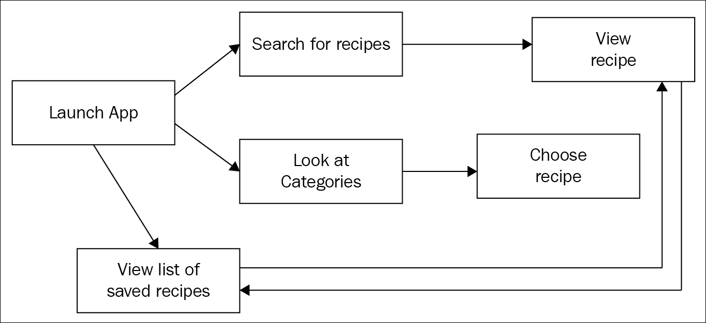
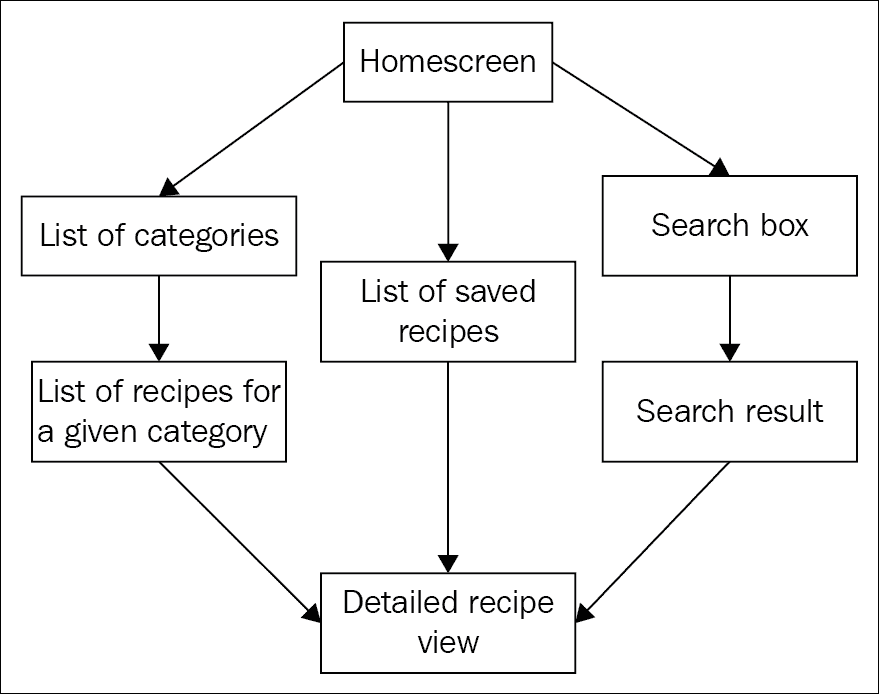
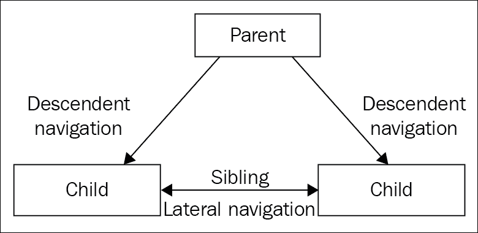
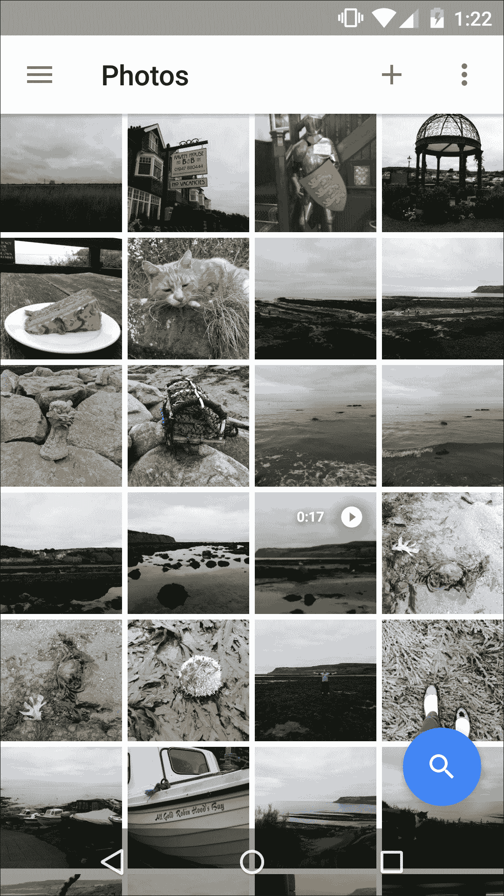
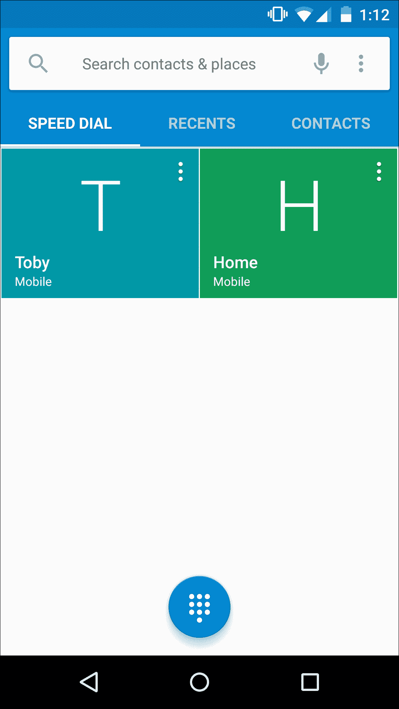
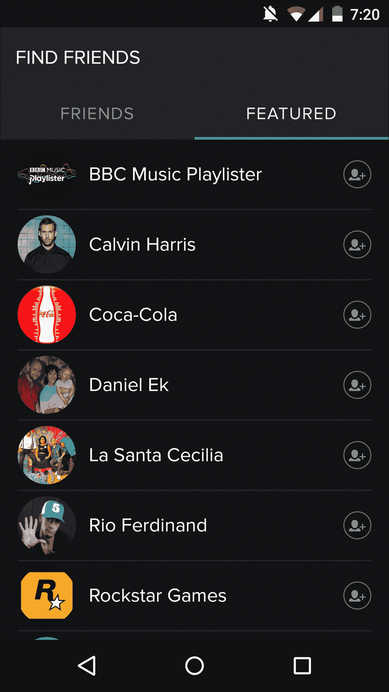

# 第五章。将您的创意转化为详细草图

Google Play 商店中有许多应用程序，并非所有应用程序都拥有五星评级。

尽管有各种原因可能导致有人给应用程序低评分和负面评论（可能是存在错误、难以导航、缺少用户期望的功能，或者用户界面杂乱无章、令人困惑），但通常在所有负面的 Google Play 评论背后隐藏着一个普遍的真理——应用程序提供了糟糕的用户体验。

移动用户是一群不可饶恕的人，在当今竞争激烈的市场中，仅仅有一个有趣的想法、不寻常的概念或深思熟虑的功能是不够的，您的应用程序还需要易于使用。

这就是为什么提前花时间规划您的应用程序是**至关重要的**。

奇怪的是，尽管设计师和开发者有相同的目标（创建人们喜欢使用的出色应用程序），但我们往往将设计和开发视为彼此分离的，但如果你要创建一个出色的应用程序，那么你需要了解**两者**的点点滴滴。

无论您是否有为生产力应用程序的伟大创意，它能为您节省大量时间，或者是一个人们愿意花几个小时玩耍的谜题应用程序，设计都是**一切**。您的应用程序设计将对其实用性、有用性和最终普及度产生巨大影响；设计糟糕的应用程序难以理解，使用起来也不太有趣！

为移动设备设计可能很困难，但这也是最具挑战性的开发平台之一，因为它是一个快速发展的行业，新硬件不断发布。这意味着有很多机会创造出完全独特的东西，让您的用户感到震惊。

本章将向您展示如何成为一名具有设计思维的开发者，了解如何设计**并**开发出令人惊叹的应用程序，这些应用程序在 Google Play 商店上获得好评将毫无问题。

# 头脑风暴 - 利用移动硬件

当您设计移动应用程序时，不要忘记典型的 Android 设备拥有许多独特的硬件，这些硬件是移动平台独有的。只需想想您的移动应用程序可以因为这种独特的硬件做出哪些反应：触摸手势、倾斜、音频输入和输出、地理位置，等等。

如果您希望您的应用程序在众人中脱颖而出，您需要寻找以新颖和引人入胜的方式使用这些硬件功能的方法。

在我们开始规划我们的应用程序之前，让我们看看一些您可能希望将其融入移动应用程序中的最有趣的 Android 硬件功能。

## 触摸和手势

与应用程序互动的最常见方式是通过设备的触摸屏，因此您肯定希望将手势集成到设计中。

需要记住的一件事是，用户对与 Android 应用交互的手势确实有期望。他们期望能够通过滑动、拖动、捏合和点击屏幕元素来执行某些操作。虽然你希望你的应用因其独特的触摸和手势使用而脱颖而出，但你还需要确保你的用户能够直观地了解如何与你的应用交互。

不要试图仅仅为了创新而重新发明常见的手势。例如，大多数用户都期望能够通过点击或拖动来移动滑块——那么重新发明已经完美运行的东西有什么意义呢？

正如你将在本章中发现的，设计完美的 Android 应用是在创造独特和创新的东西与感觉熟悉的东西之间取得平衡的行为。

## GPS

位置感知并不仅限于 Google Maps 风格的 APP！

你可以用很多不同的方式使用 GPS 坐标；例如，你可能想创建一个应用，根据用户的当前位置建议附近的活动和旅游景点，为照片标记拍照位置，或者向可能想知道他们认识的人是否附近的朋友广播用户的坐标。

### 备注

不要陷入认为位置感知仅用于获取方向的陷阱。你可以用很多方式使用这个硬件特性来增强你的 Android 应用。

## 震动

当音频警报变得分散注意力或令人烦恼时（无论是令用户烦恼还是令周围的人烦恼！），你应该使用震动。尽管这个硬件特性容易被忽视，但请花一点时间思考一下你的应用如何可能利用震动作为与用户沟通的额外方式。

一个例子可以是冥想应用，它会播放舒缓的音乐或放松的海浪声。想象一下，当你想要微妙地通知用户他们已经冥想了整整 15 分钟时，以防他们过于投入而忘记了时间。在这种情况下，音频通知会显得突兀，并完全破坏氛围。用微妙的震动来提醒用户不是更好吗？

## 音频输入/输出

当你想到音频输入时，你可能会想到和朋友交谈或向如 Google 搜索等应用发出语音命令。当涉及到输出时，你可能会想到音频通知、听朋友说话，或者听音乐和有声读物。

这些都是有效的例子，但音频是一个具有无限可能性的特性，所以考虑一下你的应用是否可以用更创造性和不寻常的方式使用音频输入和输出。

尤其是如果你的应用程序将在可能不便或不适通过其他方式与应用程序交互的情况下使用，那么你将希望大量使用音频输入和输出。向我们的智能手机发出快速语音命令通常比长时间在键盘上敲击更符合社会规范，后者往往被视为不礼貌。

在极端情况下，音频为用户提供了一种与其他方法可能危险时与你的应用程序沟通的手段。如果你正在创建一个提供驾驶指南的应用程序，那么鼓励驾驶员为了阅读基于文本的指示而将视线从道路上移开，这绝对是一个坏主意。

## 与其他设备交互

没有哪个 Android 设备是孤岛！Android 智能手机和平板电脑可以通过蓝牙、近场通信（NFC）、Wi-Fi 和移动网络等渠道连接，这为你的应用程序开辟了一个全新的可能性世界。

更令人兴奋的是，Android 智能手机和平板电脑还可以与不太传统的 Android 设备和谷歌服务连接，例如可穿戴设备、Android 电视和信标。如果你的应用程序能够从额外的设备发送和接收信息，它是否能够提供更好的用户体验？

### 注意

谷歌的信标平台允许你的应用程序与被称为信标的简单、低功耗设备交互。附近的信标对于为用户提供创新的位置和邻近体验非常有用。它们超出了本书的范围，但你可以在[`developers.google.com/beacons/`](https://developers.google.com/beacons/)上了解更多信息。

这些只是你在应用程序头脑风暴早期阶段可能想要考虑的一些与硬件相关的功能。

如果你目前头脑中充满了想法，那么这是一个好事！记下你所有异想天开的想法，这样你就可以在你对应用程序有更多计划后重新审视它们。即使这些想法最终不适合你最终创建的应用程序，那么谁知道呢，它们可能最终非常适合你的下一个 Android 项目！

### 小贴士

**不要过分热情！**

当你在头脑风暴所有可以包含在你应用程序中的酷炫和创意功能时，黄金法则不是仅仅为了加入某个功能而将其塞入你的应用程序。

即使你有一个你认为绝对是天才的想法，如果它与你的当前项目不匹配，那么不要浪费一个好主意在一个不适合它的应用程序上。记下你的想法，并记住，即使你目前没有在项目中实施它，这并不意味着它不会在下一个项目中找到自己的位置。这是一个在整个规划、设计和开发过程中都值得记住的规则。

# 用户体验（UX）与用户界面（UI）的区别

尽管用户体验（UX）和用户界面（UI）经常被互换使用，但它们并不完全相同。

UX 代表**用户体验**。你写的所有代码都贡献于用户体验，无论是 UI 代码（例如创建按钮并将其放置在屏幕上的 XML 代码）还是非视觉代码，例如记住用户的地址并使用它来自动填写你应用中的所有表单的代码。

非视觉代码和视觉代码结合在一起来提供你的应用程序的用户体验，但如果单独看待，视觉代码**仅**提供你的应用程序的 UI。

### 小贴士

**市场调研**

在本章中，我将鼓励你检查其他应用程序如何提供有效的 UI 和 UX。但作为一般规则，如果你发现自己难以克服特定的设计问题，翻阅一下你智能手机或平板电脑上安装的几个 Android 应用程序，看看它们如何处理类似的设计挑战可能会有所帮助。如果你需要一般的灵感，那么查看一些提供有效 UI 和 UX 的 Android 应用程序的例子通常是激发创造力的最佳方式。

# 头脑风暴你的应用

当你有一个新的 Android 项目想法时，第一步是将你的所有想法都记录在纸上。

## 写一个概念

一个经过深思熟虑的应用程序解决了一个具体（理想情况下是**独特**）的问题，而捕捉这种信息的最佳方式是写一个清晰的概念。

一个概念应该简短而直接，所以尽量用一句话来表达你的应用，例如，“我想为高中生创建一个简单的笔记应用。”

## 创建一个终极功能列表

现在是时候让你的想象力自由驰骋，写下你希望你的应用拥有的所有功能。这个列表可能包括不切实际的功能，但没关系。把这看作是你梦想中的功能列表，如果你不考虑时间、金钱和技术限制，你会在你的应用中包含所有这些功能。

## 确定你的应用程序的主要任务

最有效的应用程序都有一个明确的初级任务。一个笔记应用可能具有社交功能，如标记笔记中的人、录制视频的能力以及图像支持，但其主要任务是快速创建基于文本的笔记。其他所有都是额外的加分项。

要找到你的应用程序核心的一个好方法就是快速解释你的应用程序的目的，这被称为**产品声明**。

使用以下模板来编写你的产品定义声明：

*(是什么使你的应用程序与众不同) (你的应用程序是什么)*

以下是一些产品声明的例子：

+   一个简洁简单的笔记应用

+   一个安全加密的短信应用

+   一个漂亮的锁屏替换应用

在你整个项目开发过程中，这个产品声明都应该放在你的脑海中，所以你可能想要把它写在便利贴上。

恭喜你，你刚刚将你的灵感火花转化为关于你想创建的应用类型的一个明确的声明。但在你继续这个想法之前，是时候问自己一些艰难的问题了。

## 这个应用程序适合移动设备吗？

现在，我们几乎可以在我们的移动设备上做和我们在家用电脑上一样的事情。我们可以在智能手机和平板电脑上发送电子邮件、观看 YouTube 视频、撰写长篇文本文档、编辑照片和检查 Facebook。

移动设备也接管了许多其他电子和非电子物品的角色。我们可以在 Google 日历应用中添加约会，而不是在纸日历上乱写，我们可以将所有联系人存储在数字电话簿中，而不是实体电话簿中，随着相机手机的日益强大，我们不再需要携带笨重的数码相机来拍摄高质量的照片。

每当你想到一个软件点子时，你可能会自然而然地认为它必须以移动应用的形式出现。但即使是功能最强大的移动设备也有其局限性，所以总是要问自己你的想法是否可能在不同的平台上表现得更好。

想象一下，如果你有一个软件点子，可以帮助专业摄影师对他们的照片进行详细和复杂的编辑。你可能自然会认为这必须是一个移动应用程序；毕竟，我们用手机拍照的数量比以往任何时候都要多。但考虑你的目标受众；专业摄影师可能会用他们的相机手机拍很多照片吗？他们不是更有可能拥有专业的摄影设备吗？此外，考虑深入图像编辑是否适合你典型移动设备上的小触摸屏。

将这个特定的想法作为桌面计算机上的软件来开发可能更有意义，也许还有一个配套的移动应用程序，它提供了一些更适合移动环境的功能。这样，用户可以在他们的相机手机上拍照，并在路上做一些简单的调整。然后，如果他们决定想要进行更复杂的编辑，他们总是可以在回家后启动他们的电脑。

## 你有预算吗？

在开始一个新项目之前，重要的是仔细审视你的预算，看看这个特定的项目是否可行。

虽然“预算”这个词意味着金钱，但预算也可以与时间相关。如果你是一个独自热爱 Android 的爱好者，在业余时间为了乐趣而开发应用程序，那么你最大的挑战可能是找到空闲时间来投入到你的项目中，而不是寻找资金。估算你可以实际投入到项目中的时间，然后利用这些信息来计算你需要多长时间才能完成。

对自己诚实，关于你能够实现什么以及你可以在项目中投入多少时间和金钱。

无论你的主要限制是金钱还是时间，你可能会意识到这个特定的项目实际上并不实用；也许你太忙了，无法在合理的时间内完成项目，你知道你会在到达终点线之前耗尽精力；或者也许你的项目需要更多的帮助，而你的预算不足以雇佣更多的人。

如果是这样，你可能需要重新考虑你的项目，使其更具实用性。也许你可以缩减功能列表，或者通过暂停一项爱好来腾出更多时间。虽然由于时间或财务限制而削减功能可能会令人沮丧，但与继续进行项目并在几个月后发现，从现实的角度来看，你永远无法达到终点线相比，这要令人沮丧得多。

在这个阶段告诉自己一些艰难的真相将帮助你避免在某种不切实际的事情上投入时间、精力和金钱。

# 规划你的应用

计划是一个容易跳过的步骤，尤其是如果你是独自一人，但花些时间正确地规划你的项目不仅会增加你创建更有效应用的机会，还会增加你真正完成项目的可能性，而不是半途而废。

不要冒险跳过这个阶段！

## 确定你的目标受众

在你规划应用的早期阶段，你可能会告诉自己，“这个应用是个好主意，每个人都会想使用它！”

如果你认同这个说法，那么你的应用将会完美——但仅限于你自己。由于只为你自己开发应用（尽管，如果你碰巧喜欢最终产品，那将是一个额外的加分项），在规划你的应用时，你首先需要回答的问题是，“我是为谁构建这个产品的？”

太常发生的情况是我们直到计划过程的后期才确定我们的目标受众，或者更糟糕的是，我们过于冲动，在没有真正了解我们为谁构建应用的情况下就开始构建应用。你的目标受众应该影响你应用的每一个部分：从外观和感觉，到你想要包含的功能，甚至如何营销和推广最终产品。

希望你已经对你要针对的目标有了一个大致的了解，但为了确保你创建出人们真正想要使用的东西，你需要更深入地了解你确切的目标受众。实现这一目标的一种方法是通过开发用户画像和用例：

+   **用户画像**：这是你创建为你构建应用的人的具体模型的地方。一个用户画像是一个代表你的目标受众的个体用户。为了鼓励你将这个用户画像视为一个真实的人，你应该给你的用户画像起一个名字。

+   **用例**：这是你的用户画像可能如何、何时以及在哪里使用你的应用的场景。

### 创建用户画像

为了帮助你创建详细的用户画像，向你的用户画像提出以下问题：

+   你多大了？这可能是一个确切的年龄，比如 18-25 岁，或者可能更普遍，比如儿童或年轻人。

+   你的兴趣和爱好是什么？你喜欢足球吗？烘焙？购物？锻炼？

+   你认同自己是男性还是女性（尽管并非所有应用都会针对特定的性别）？

+   你住在哪里？这可能是一个特定的国家、城市，或者是一个地区类型，如乡村或海边。

+   你有孩子吗？

+   你有工作吗？如果有，你做什么？

+   你目前是否在学校、大学或大学？

+   你有没有任何特定的专业领域？

+   你最常使用哪种类型的应用？

+   你还使用其他类型的应用吗？

+   你永远不会使用哪种类型的应用？

+   什么影响了你的决策？

+   你对 Android 有多熟悉？你是专业用户，还是仅仅知道足够的知识来应付？

+   在情感层面上什么能触动你？什么让你生气、快乐或悲伤？

### 注意

这绝对不是一个详尽的列表，但这些问题应该足以让你更详细地思考你针对的是哪类人。

让我们看看用户画像如何帮助你规划应用程序的例子。想象一下，你有一个食谱应用的创意，并已经列出了一长串你可能想要包含的功能：

+   能够根据特定的饮食需求（无麸质、纯素食、素食、低脂、非乳制品）、供应人数以及烹饪难度来筛选食谱。

+   每顿饭的估计卡路里数。

+   每顿饭的估计成本。

+   社交媒体集成，让用户可以与朋友和家人分享他们最喜欢的食谱。

+   能够对每个食谱提供一系列反馈；无论是发表评论、上传他们的尝试照片，还是给食谱打星。

+   一个在线剪贴簿，用户可以保存他们最喜欢的食谱。

+   能够通过应用程序购买食材。

+   视频教程，让用户可以选择阅读说明或跟随视频进行操作。

+   一个内置的计时器。

你记下的想法越多，你就会越意识到，即使你的所有想法都经过深思熟虑、实用，并且能为你的应用增加真正的价值，但试图将每一个想法都融入一个单一的应用程序中，这根本是不切实际的。

这不仅会给你带来在时间和精力上实现这么多功能的噩梦，而且对于打开你的应用的每一个用户来说，也会是一个噩梦，他们立刻就会面对一个详尽、混乱的功能列表——而且可能还有一个杂乱无章、令人困惑的用户界面！

你应该始终致力于为一个非常具体的受众设计完美的应用，而不是一个试图吸引所有人的通用应用；这种应用很可能会最终让所有人都感到不满意。

那么，你如何决定你最初列表中的哪些功能应该被保留呢？答案是创建一个用户画像，然后挑选出所有能吸引这个特定用户画像的功能。

让我们为我们的食谱应用创建一个用户画像。想象一下，我们的目标受众主要是面临首次自己做饭挑战的大学生。为了帮助我们让这个目标受众栩栩如生，让我们创建一个单名的用户画像——认识妮可：

+   她今年 18 岁

+   她是一名大学生

+   她和另外五个学生住在学生宿舍里

+   她没有车

+   这是她第一次离开家庭住所生活，所以她几乎没有为自己做饭的经验

+   她非常注重金钱

#### 移动用户画像

当你设计一个移动应用时，你也需要考虑**移动用户画像**。这是一组人们在使用移动应用时所假设的额外特征。

如果你像许多喜欢通过 Facebook 移动应用随时随地跟踪朋友和家人动态的 Facebook 用户一样，那么想想你使用移动应用的方式与你在笔记本电脑或电脑上使用 Facebook 的方式有何不同。你可能会自动避免那些你知道会耗尽设备电池或消耗数据套餐的活动，比如观看或上传视频。但当你通过桌面访问 Facebook 时，这大概不是你特别担心的事情。

在设计你的移动应用时，请记住，典型的移动用户画像具有以下特征：

+   有限的数据套餐。

+   有限的电池电量。

+   通常在移动中，所以他们可能有不稳定的互联网接入和移动网络信号。

+   很少将全部注意力放在他们的 Android 设备上。移动用户是世界上最好的多任务处理者之一，他们在酒吧等待朋友时、在公交车站消磨时间时，或者在沙发上半看电视时都会瞥一眼他们的设备。典型的移动用户不想长时间盯着你的应用 UI；如果他们这样做，那么这通常是一个明确的信号，表明你做错了什么，用户正在试图弄清楚他们接下来应该做什么。

+   在小屏幕上查看你的应用。即使你最大的 Android 平板电脑，其屏幕也比其他电子设备，如电视和笔记本电脑小得多。

+   对他们的 Android 设备有情感上的联系。我们与智能手机的关系，特别是，与我们与电脑等电子设备的关系非常不同。我们的智能手机总是陪伴在我们身边——无论是在我们手中、口袋里、包里，还是在工作中桌子上，我们用它们来完成非常个人化的任务，比如与家人和朋友保持联系，以及拍摄我们疯狂夜晚外出和度假的照片。我们在移动设备上存储了大量的敏感信息，所以我们自然会对它们产生保护欲！你还没有对我们的手机有特殊的感情吗？只需想想当你伸手进口袋或包里找手机，却发现它不在那里的那一刻的盲目恐慌。这是我们每个人都经历过（虽然希望你的手机最终在另一个外套口袋里，并没有真正丢失）的感觉。

如果你忽视这些属性中的任何一个——例如，你开发了一个消耗大量移动数据的应用程序，或者请求对大量敏感信息的非必要访问——那么你的用户将会有糟糕的体验。你的挑战是在尊重移动用户角色的所有特性的同时，为你的特定目标受众创造一个引人入胜的用户体验。

### 创建使用案例

妮可什么时候可能会使用我们的食谱应用？是什么促使她启动你的应用程序？她通过与应用程序互动希望实现什么？

这里有一些妮可的使用案例：

+   虽然是周末，但也是妮可学生贷款到账前的最后几天，所以她通常的周末外卖美食计划已经取消。她需要做些既美味又符合她当前预算的东西。

+   为了节省金钱，妮可和她的室友们决定轮流准备公共餐食。今天轮到妮可，因此她需要一个能够喂饱六个饥饿学生的食谱——如果还有剩余的话，那就更好了！

+   妮可很匆忙；她起床晚了，在她下午的讲座前只有一个多小时的时间。她需要一个超级简单、超级快就能做好的食谱。

### 确定功能列表

再看看我们食谱应用的初始功能列表。现在，我们有一个非常具体的用户角色和一些使用案例；我们应该挑选哪些功能包含在我们的应用中？哪些功能会吸引妮可？

我将选择以下内容：

+   **根据烹饪难度过滤食谱的能力**：这对我们的初学者厨师来说是一个首要任务，尤其是当她需要赶在下一堂课之前匆忙吃饭时。

+   **根据可以喂多少人过滤食谱的能力**：如果妮可要为她的室友做饭，那么她需要能够轻松访问可以喂六个人的食谱。

+   **每餐的预估成本**：作为一名预算意识强的学生，妮可不想把她的学生贷款全部花在昂贵的食材上。她希望能够清楚地看到每餐烹饪的成本——尤其是在她下一次学生贷款分期付款到来之前的最后几天！

+   **视频教程**：妮可是一个不熟练的厨师，所以她肯定会欣赏观看食物准备过程而不是仅仅阅读说明的选项。她现在 18 岁，这意味着她已经习惯了在 YouTube 上观看视频教程，所以用智能手机观看烹饪视频的想法对她来说具有很大的吸引力。

+   **内置的计时器**：这是妮可第一次离开家庭居住，所以她还没有时间积累烹饪用具。她也不想把学生贷款浪费在像计时器这样的无聊东西上，所以如果您的应用可以提供这种功能，那就更好了！

+   **通过应用购买食材的选项**：作为一名 18 岁的年轻人，妮可是一位在线购物的高手，所以将所需的食材直接送到她家门口是她（亚马逊）愿望清单上的首要事项。妮可也没有车，所以去超市或当地的农贸市场并不是世界上最容易的事情。理想情况下，我们的食谱应用能够交叉检查多个供应商，并建议她可以以最低成本购买每个食材的地方，以节省更多的学生贷款。

我们列表中还有其他一些功能可能也会吸引妮可；例如，她可能是一个素食主义者，或者有几个经过验证的家庭食谱想要上传到应用中，但要注意不要对您的用户画像过于具体。

虽然根据饮食需求筛选食谱或允许用户将他们自己的食谱添加到应用中可能会为某些用户增加价值，但请自问这些功能是否真的与您的目标受众相关，而不仅仅是您的用户画像？如果您不确定，那么尝试将功能添加到您的列表中，并从上到下阅读，这些新功能是否**合适**？或者它们是否像 sore thumb 一样突出？

### 注意

即使您现在决定不添加某些功能到您的应用中，它们也可能在后续版本中找到它们的位置。如果您觉得某个功能有潜力，但在这个早期阶段并不是您应用的绝对关键，那么记下它；您可以在以后的时间回到它。

### 仔细审视您的目标受众

您已经确定了目标受众，但在我们进一步推进之前，退一步仔细审视您选择的受众。针对这个特定群体的人进行目标定位是否**真的**合理？

#### 您的目标受众需要一款移动应用吗？

您的应用是否为您的目标受众提供了他们通过其他平台无法获得的东西？

假设你有一个关于跟踪用户预约的应用程序的想法；他们是否已经在其他地方获得了这种功能？越来越多的地方，如牙医、医生和发型师，通过短信提醒客户即将到来的预约，或者如果你针对的是不太懂技术的用户，他们可能更喜欢在纸日历上记下他们的日程。

虽然假设所有事物作为移动应用都更好是有诱惑力的，但如果他们的需求已经通过其他媒介得到满足，你的目标受众不太可能费力去下载移动应用。

#### 你的目标受众是否使用 Android？

那些严肃的商业用户选择 BlackBerry，而所有酷炫的孩子都选择 iPhone 的日子已经过去了。如今，界限变得模糊，在多个平台上发布应用已成为常见做法。但在你得出结论之前，检查是否有证据表明你的目标受众更倾向于某个移动平台而不是另一个。快速进行一次谷歌搜索，查找任何关于移动人口统计的最新研究，看看是否有任何数据对你的计划中的 Android 应用提出警告。

#### 好的，所以你的目标受众使用的是 Android 设备，但它们是否拥有合适的 Android 设备？

不要假设你的目标受众自动拥有足够强大的 Android 设备来运行你的应用程序，尤其是考虑到 Android 平台如此碎片化。

如果你设计的应用依赖于用户访问最新的 Android 操作系统版本，那么你已经在限制你的受众。如果你正在为更可能在其设备上安装最新版本 Android 的先进 Android 用户开发应用，这可能是有意义的，但如果你的目标是普通非 Android 用户、老年用户或预算紧张的人，他们可能还没有投资于最新的 Android 设备，比如精打细算的学生，这可能不是一个好主意。

#### 他们是否使用这种 "类型" 的应用？

即使你的应用将具有独特的目标受众、功能、UI 和 UX 组合，仍然可以识别出应用程序的 *类型*。值得注意的是，这些类型并不对应于 Google Play 商店中的类别，后者要具体得多。

应用程序 *类型* 可以分为四个类别：

+   **实用工具**：这些包括天气、新闻、旅行和生产力应用

+   **娱乐工具**：例如壁纸、社交媒体、图像编辑和摄影应用

+   **游戏**：这一点相当直观，Google Play 有一个专门的游戏类别，这使得识别这类应用变得更加容易

+   **娱乐**：这包括音乐、视频、绘画、有声读物、播客和漫画书应用

在类别之间有一些交叉和灰色区域（例如，购物应用是娱乐工具还是有用的工具？），但你在规划你的应用和确定目标受众上花的时间越多，就越明显你的应用属于哪个类别。我们的食谱应用是一个有用的工具，因为它帮助学生自己烹饪，可能是有史以来第一次。然而，如果我们的应用包含大量以圣诞节为主题的食谱并针对喜欢烘焙节日美食的熟练厨师，那么它更有可能属于娱乐工具类别。

确定你计划开发哪种类型的应用，并确定你的目标受众是否可能使用这种类型的应用。

#### 你的目标受众愿意为这个应用付费吗？

你可以选择以某种方式让你的应用盈利。流行的方法包括要求用户在下载应用之前支付一次性费用；发布免费和付费版本的应用；或者销售人员所说的*升级机会*，这可能包括解锁特殊*专业*功能或应用内额外内容，如新关卡、角色、游戏内货币或额外生命。你甚至可以选择提供月度或年度订阅。

如果你选择让你的应用盈利，那么考虑对你为目标受众开发的应用类型最合适的盈利方式。对于一些预算更紧张的人来说，为移动应用付费可能感觉像是一种浪费，或者年轻的目标受众可能没有使用诸如信用卡和借记卡这样的东西的机会。

你还应该考虑你应用的目的。我们食谱应用吸引人的部分之一是它能够通过教授学生如何为自己烹饪来节省他们的钱，而不是依赖外卖和外出就餐，因此要求他们付费下载我们的应用实际上并没有太多意义。哪个学生愿意为本来应该*节省*他们钱的应用付费呢？

另一个选择是免费发布你的应用，但要求可选的捐款来支持你作为 Android 开发者的工作。这对于为更高级的 Android 用户或可能也是开发者的用户创建应用的开发者来说是一个流行的选择，因为他们更有可能欣赏创建出色的 Android 应用所付出的辛勤工作。

另一种让你的应用盈利的方式是通过包含广告，但如果你选择走广告这条路，那么确保它们尽可能不引人注目。在我们的食谱应用示例中，广告可能是一个可行的选择，因为它不需要我们精打细算的学生直接掏钱。

### 注意

**在你的应用中包含广告**

如果你决定包含广告，那么这将为你的应用打开一个额外的收入渠道：如果用户升级到你的应用的付费版本，你可以提供移除广告的服务。然而，如果你针对的是更高级的移动用户，那么你应该考虑你的目标受众使用诸如广告拦截器等工具的可能性。在这种情况下，通过请求可选的捐款来支持你作为 Android 开发者的工作可能会得到更好的回应。

如果你决定让你的应用盈利，它应该始终反映你的应用为你的目标受众提供的价值。如果你的用户决定在应用上投资金钱，那么你应该提供一些值得他们辛苦赚来的现金的东西。

#### 你的目标受众中是否有人足够多，以至于你的项目可以盈利？

虽然具体化是好事，但你的应用必须吸引足够多的人，才能使你的项目有利可图。

### 注意事项

一个有利可图的项目不一定意味着它能为你赚钱（尽管那总是令人愉快！），对你来说成功意味着什么？可能意味着有*X*数量的人下载了你的应用，或者在 Google Play 上获得了 3 星以上的评分。

我们已经决定，我们的食谱应用将针对那些不擅长烹饪且希望获取快速、简单、便宜食谱的学生。我们可以通过针对那些对健康敏感的学生进一步缩小我们的目标群体，他们感兴趣的食谱快速、简单、便宜，而且低热量，富含维生素和矿物质。虽然对健康敏感的学生确实存在，但这更是一个细分的目标受众，如果你决定走这条路，你应该进行一些额外的市场研究，以了解是否真的有一个显著的市场需求这种非常具体的应用。

希望在仔细审查你的目标受众后，你会得出结论，你的目标受众确实迫切需要你心中所想的那种应用。如果不是这样，那么现在回到本节的开头，探索你的最初想法是否更适合不同的目标受众，正是时候。

### 小贴士

**是时候认真了**

在本章的目的下，我们创建了一个快速且通用的用户画像和一些可能的使用案例。然而，当你创建一个真实的 Android 应用时，你通常会想要进行某种形式的市场研究，这意味着与你要为你的应用创建的人建立联系，并获取他们对你的项目的看法。

好消息是，如果你认为站在当地商业街中间拿着记事本就是地狱（同感），那么互联网是市场调研的理想之地。例如，论坛和社交媒体可以帮助你与可能有一天会使用你的应用程序的人建立联系，或者你可以尝试联系相关机构，看看他们是否愿意将你与目标受众联系起来。在我们的食谱应用程序示例中，你可以尝试联系当地大学，看看他们是否愿意帮助你进行市场调研——尤其是既然你正在开发一个免费应用程序，可以帮助学生克服第一次自己做饭的挑战。

实际市场调研没有替代品，因此你应该始终努力与你的目标受众取得联系，因为他们的反馈将对你创建现实的人物角色和用例非常有价值，同时也有助于你确定你的真实目标受众希望在应用程序中看到哪些功能。

## 确定用户和产品目标

目标是那些如此明显以至于实际上很容易被忽视的事情之一。你为什么要发布这个应用程序？对你来说有什么好处？为什么有人会下载你的应用程序？这些问题可能很难回答，但它们对于整个规划过程来说可能是至关重要的。

当你有一套明确定义的目标时，你可以在回答设计相关问题时随时参考它们。你是否应该包括一个“分享到 Facebook”的功能？为了找到答案，只需查阅你的目标——这个功能将如何帮助用户实现他们的目标，或者帮助你实现你的目标？

你需要确定两种类型的目标。

### 产品目标

这并不只是关于用户！创建一个惊人的应用程序需要时间、努力，甚至可能还需要金钱，即使你只是为了乐趣而创建应用程序，你也应该从中获得一些东西！所以，你希望通过创建这个惊人的应用程序实现什么目标？

你的产品目标可能包括以下内容：

+   你希望达到的下载量

+   你希望在 Google Play 上获得的评论数量

+   在 Google Play 上的最低星级评分

+   传播你公司、产品或服务的信息

+   通过用户升级到应用程序的专业版本、应用内购买、广告或你选择的额外收入渠道产生的财务回报

### 用户目标

这些是选择下载和使用你应用程序的人的目标。他们希望实现什么？在我们的食谱应用程序示例中，主要用户目标之一是找到经济实惠的食谱，这些食谱不会让你破产。

在这个阶段，您不需要定义*如何*实现这些目标，因为可能存在多种实现相同目标的方法。例如，我们可能在我们应用程序的主屏幕上添加一个搜索框，以便用户可以根据食材的成本来筛选食谱；或者您可能决定将您的食谱分为类别，然后在用户屏幕顶部显示这些类别作为标签——**每人头下£1 的食谱**； **每人头下£2 的食谱**，等等。

目前，请专注于确定用户目标，并将定义实现这些目标所需的功能留到以后。

有时，聚焦于有意义的用户目标可能并不简单。也许您只能想到一些宽泛的、一般化的目标，这些目标并不特别有帮助。例如，想象一下您有一个关于文档编辑应用程序的想法，您确信它可能是下一个 Google Drive，但您唯一能想到的目标是“我想能够创建和编辑文档。”这并不具体！关键是把这个宽泛的、一般化的目标分解开来。用户将如何创建这些文档？他们可能想要进行哪些编辑？他们可能想要对完成的文档做些什么？头脑风暴您的答案。

在头脑风暴会议之后，您应该有一份更具体的用户目标列表。在我们的文档编辑应用程序中，这些可能包括“我想能够……”

+   快速轻松地创建新文档，这样我就可以随时记笔记

+   使用各种格式化技术使我的文档更具视觉吸引力

+   通过社交媒体与他人分享我的文档

+   与朋友和同事协作编辑文档

## 创建路线图

路线图是您将应用程序从初始发布版本发展到您在编写最终功能列表时心中所想的版本的关键。实际上，现在正是仔细审视这个列表并决定哪些功能应该包含在您应用程序的第一个版本中的最佳时机。

这个初始版本应包括所有满足您应用程序主要任务所需的功能（想象一下发布一个带有大量滤镜但缺乏拍照功能的相机应用程序！）。它还应包括其他高优先级功能，这些功能通常是在您进行市场研究或创建用户画像和用例时反复出现的功能。

如果您不确定某个功能是否重要到足以包含在您应用程序的第一个版本中，请问自己：“没有这个功能，我的应用程序是否仍然可用？”您的应用程序的第一个版本应仅包含必需的功能*。

### 注意

我们在谈论的是您应用程序的初始*版本*，而不是初始*发布*。这是因为您不一定必须将初始版本发布给公众。

在我们完成识别目标受众的所有工作之后，你最终功能列表中的一些项目可能已经不再相关，因此现在是时候再次审视我们的列表，并划掉任何不必要的功能。

你应该剩下的是一个列表，其中包含你的应用无法正常运行的必备功能，以及一些非必需但会为你的应用增加价值的额外功能。后者将成为你路线图的基础。

到目前为止，路线图更像是一个指南而不是严格的日程安排，但创建一个粗略的路线图有助于你可视化项目随时间可能的发展。它还为你提供了一个大致的想法，即你何时可能准备好发布不同的功能。

创建你的路线图时，查看你想要的功能列表，并寻找它们之间的关系。例如，你可能会将所有与社交媒体相关的功能或所有允许用户上传自己内容的特征分组在一起。

你通常会希望将相关功能一起发布，所以一旦你组成了这些组，你应该根据它们的重要性顺序对它们进行排名。这将是你发布这些功能的顺序，所以下一步是将这些组分配给应用的不同版本；例如，如果你决定社交媒体功能比上传新内容的能力更重要，你可能会选择在版本 2.0 中发布这些功能，而后者可能成为版本 3.0 的基础。

### 小贴士

**小批量、频繁发布**

不要试图将大量功能压缩到单个发布中。小批量、频繁发布比每次更新包含大量新功能但让用户等待数月数月要好得多。

你的典型 Android 用户很快就会忘记一个很少更新的应用。即使他们没有忘记你的应用，他们可能仍然难以适应引入太多变化的更新。

小批量、频繁发布也能让你更好地控制开发过程，并使你更容易满足这些截止日期。大量发布很难正确规划，而且通常压力很大，所以请为自己和你的用户做点好事，创建一个包含大量小型、频繁发布的路线图。

你还应该尝试在你的路线图中添加截止日期，即使它们是推测性的截止日期，因为它们会促使你开始思考每个功能开发需要多长时间。这些截止日期可能是模糊的，例如，“二月份，我希望发布版本 1.0”，或者“在 1.0 版本发布后四周内发布版本 2.0。”或者，它们可能与年度事件相对应；例如，如果你正在开发购物应用，你可能会决定在圣诞节前夕或在一月销售旺季期间发布此应用。

至少，你应该设定一个希望完成应用第一个版本的截止日期。

## 一些需要考虑的最终事项

你几乎完成了你的应用规划！在我们进入设计阶段之前，还有一些最后的细节需要考虑。

### 你应该支持哪些设备？

你应该支持哪些类型的设备？你的应用应该与哪些版本的 Android 兼容？这些问题很棘手，不幸的是，每次你开始一个新的 Android 项目时，你都必须面对这些问题。

考虑到 Android 应用可以在任何设备上运行，除非你明确设置它不运行，可能会诱使你这样想：“我会等等看我的应用在哪些设备上运行良好”，但这确实是一个最终导致应用在你的典型 Android 手机上运行良好，但在其他所有设备上运行不佳的方法。

取决于你提供一种适用于各种平板电脑、大屏手机和横屏或竖屏模式的 Android 智能手机的体验。创建一个能在多种设备上运行的应用并不容易，但你在规划如何支持不同的设备和屏幕配置上投入的精力越多，实施起来就越容易。除非你有非常好的理由不这样做，否则现在就是开始思考如何支持尽可能多的不同 Android 设备的时候了。

如果你决定不支持某些设备，那么你的用户会感激你提前告知，而不是等到他们第一次启动你的应用时发现它完全无法在他们设备上运行。至少，确保在应用 Google Play 描述中提前告知用户不支持哪些设备。

### 你应该如何推广你的应用？

大多数时候，你推广应用的对象将与你的目标受众相同，但这并不总是如此。例如，如果你正在开发一个教育应用，帮助幼儿学习字母表，这个应用可能对家长更有吸引力，而不是你的目标用户（在这种情况下，还在学习阅读的儿童不太可能搜索 Google Play，寻找可以下载的应用）。

# 设计你的应用

到目前为止，你应该有一个关于你想要创建的应用的详细计划。你已经完成了以下工作：

+   一个书面概念

+   一个最终的功能列表

+   识别了你的应用的主要任务

+   编写了一个产品定义声明

+   通过创建用户画像和一些用例来识别你的目标受众，并将这些信息纳入你的计划中

+   开始思考一些棘手的问题，包括盈利模式、市场研究和推广你的应用

现在，是时候开始探索你的应用应该如何看起来了。设计应用 UI 的想法可能看起来令人畏惧（尤其是如果你没有设计经验的话），但投入额外的精力进行 UI 设计可以将一个不错应用变成一个*优秀*的应用；难道我们不是都希望创造优秀应用吗？

在本章的最后部分，我将向你展示如何迈出设计一个有效且吸引人的用户界面（UI）的第一步。

## 高级流程

制定你的应用程序结构的第一阶段是创建一个高级流程图。这是你绘制用户将通过你的应用程序完成不同任务的不同路径的基本计划的地方。

如你所猜测的，表达应用程序高级流程最流行的方式是使用流程图。你如何创建这个流程图取决于你。你可能想使用你最喜欢的图像编辑软件创建一个数字图表，或者你可能想用纸和笔回到过去。选择对你来说最有效的方法。

你通常用形状表示屏幕，用线条或箭头表示导航。你可能还想要给你的流程图中的屏幕编号，尤其是如果你正在规划大量屏幕。这样，当是时候创建线框图时，你可以在线框图中为屏幕编号，以与流程图中的屏幕相对应。

开始寻找改进用户体验的方法永远不会太早，而在这一早期阶段评估你的应用程序用户体验的最简单方法之一是查看用户完成不同任务需要执行多少次交互。

你的流程图非常适合识别任何减少或简化完成每个任务所需步骤数量的机会，无论是删除屏幕、重新排序屏幕还是更改应用程序的导航。例如，你可能会决定在屏幕 A 上包含一个菜单，这样用户就可以直接跳转到屏幕 E 和屏幕 F。

你还应该确定哪个屏幕应该是你的应用程序的主屏幕或首页。首页应该帮助用户完成应用程序的主要任务。由于我们的食谱应用程序旨在帮助用户找到快速、便宜且易于制作的食谱，我们可能会决定选择**搜索食谱**屏幕作为我们的首页。

此流程图也是确定你可能会用太多选项让用户感到不知所措的区域的完美机会。如果你打算在首页上包含一个搜索框，是否明智地在同一页面上显示所有用户保存的食谱以及应用程序的主要**设置**？你可能决定将其中一些内容移动到不同的屏幕，或者暂时将其隐藏在侧菜单或单独的标签页中。

或者，你可能决定，如果你足够仔细地设计你的应用程序，你可以通过在单个屏幕上显示所有这些内容来避免让用户感到不知所措。如果你选择后者，那么请注意，你应该为这个屏幕额外分配一些时间，以确保用户体验尽可能简单明了。

### 小贴士

**成为批评家**

在处理你的高级工作流程时，审视其他 app 如何以尽可能少的摩擦将用户从第一个屏幕引导到他们想要的位置可能会有所帮助。

查看你 Android 设备上安装的应用，如果你特别喜欢某个应用，为这个应用快速制作一个流程图。尝试确定这个流程为什么如此有效。绘制你不太喜欢的 app 的流程图也可能有所帮助，然后尝试找出为什么这个流程不适合你。这些练习将帮助你养成对应用流程进行批判性思考的习惯，这对于你有效地分析和优化自己的 app 流程图至关重要。

## 创建屏幕列表

一旦你创建了高级流程，列出所有你需要创建的屏幕，以便用户能够完成他们的各种任务和目标。

我们的食谱 app 的屏幕列表看起来可能像这样：

+   主屏幕

+   类别列表

+   某个类别的食谱列表

+   已保存食谱列表

+   详细食谱视图

+   搜索框

+   搜索结果

## 创建屏幕地图

现在是时候将我们的流程图和屏幕列表结合起来，创建一个屏幕地图，以表达构成我们 app 的所有不同屏幕之间的导航关系。

如果有疑问，请参考你的流程图并回顾用户可能通过你的 app 采取的不同路径。

以下是我们食谱 app 的屏幕地图的一个示例：

### 注意

一个屏幕不一定等于一个活动。一个屏幕也可能等于一个作为多窗格布局一部分显示的碎片。

### 将屏幕分组为多窗格布局

我们在设计屏幕地图时没有针对任何特定的 Android 设备，但 Android 应用必须足够灵活，以适应广泛的设备，从小型手机到大型平板电脑。

为了以最有效的方式向用户展示内容，你可能想要将相关的屏幕分组在一起。然后，你可以根据用户的设备和屏幕配置以不同的组合展示这些**碎片**。

较小的屏幕通常只适合一次显示一个内容窗格，因此我们地图中的每个屏幕通常相当于较小设备上的一个屏幕。

然而，有时会有更多的屏幕空间可用，例如，当用户在平板电脑、大屏手机或甚至横屏模式下的 Android 智能手机上查看你的 app 时。当有更多空间可用时，你的 app 应该充分利用，而使用碎片就是一种方法。

碎片可以帮助你创建一个能够适应多种不同设备类型、屏幕尺寸和屏幕方向的 app。将屏幕组合成多窗格布局也有助于最小化用户完成每个任务所需进行的交互次数。

我们如何将我们的食谱应用程序中的不同屏幕分组，以便我们能够有效地在多面板布局中显示多个片段，并且在单面板布局中显示单个片段？

在较小的屏幕上，我们可能希望将食谱应用程序的主屏幕显示为一个单独的、独立的片段。然而，如果用户在较大屏幕上查看我们的应用程序，那么显示在主屏幕片段旁边的其他信息可能有什么意义？

让我们回顾一下用户在主屏幕上可能想要执行的所有任务。他们可能想要执行以下操作：

+   访问类别列表

+   访问他们保存的食谱

+   进行搜索

+   访问食谱

允许用户从主屏幕执行这些任务中的任何一项都会增加价值，但我会选择*进行搜索*，因为我感觉这是用户在我们食谱应用程序中最常想要执行的任务。因此，在较小的屏幕上，我希望用户看到主屏幕；但在较大设备上，我希望用户看到主屏幕片段*和*搜索片段的多面板布局。

逐步浏览你的屏幕图，寻找将你的屏幕分组到多面板布局的任何其他方法，以便用户在较大设备上访问你的应用程序。

### 注意

当你显示多个面板的内容时，接受的惯例是从左到右按详细程度递增的顺序排列你的内容。

## 导航

你的应用程序的导航应该感觉直观且毫不费力，以至于即使是新用户也应该能够轻松地导航你的应用程序。由于你已经创建了一个屏幕图，确定你的应用程序的导航应该是一件轻而易举的事情。

应该很容易导航到应用程序中最重要目的地；例如，在我们的食谱应用程序中，主屏幕将是最突出和最易访问的屏幕。

当你通过在导航层次结构中将其放置得更高来优先考虑一个屏幕时，这个屏幕被称为**父级**。那些不太重要的屏幕，你通常将它们放置在父级屏幕之下，被称为**子级**。继续这个主题，具有相同父级的屏幕被称为**兄弟**，它们通常具有相同的优先级。你也可能听到**集合**这个词，有时用来指代具有相同父级的多个屏幕。

导航可以分为以下几类：

+   ** descendant navigation**：当用户深入导航到你的应用程序时，他们是从较高层次结构下降到较低层次结构。从父级屏幕移动到子级屏幕是下降导航的一个例子。

+   **横向导航**：这是用户在兄弟屏幕之间移动的地方。

为了帮助你确定最适合你应用程序的导航类型，问自己以下问题。

### 你的应用程序最重要的任务是什么？

识别所有用户可能想要执行的任务，然后为这些任务中的每一个分配一个优先级。你应该通过在你的应用导航层次结构中突出显示这些任务，让用户能够轻松完成高优先级任务。例如，如果你正在设计一个音乐应用，你应该让用户能够轻松播放音乐（一个高优先级任务），而像能够推文分享你正在收听的歌链接这样的低优先级任务，可以放在导航层次结构的较低位置。

### 有没有可以组合在一起的任务？

你应该在相关功能之间创建某种导航关系；例如，你可以将它们包含在同一个菜单中，同一个屏幕中，或者在同一个父屏幕中的标签行中。

在我们的音乐应用示例中，能够搜索特定艺术家的更多专辑、查看本周的前 10 首热门歌曲、浏览新发行的音乐以及查看你的朋友目前正在收听的歌曲等所有功能都有助于你发现新的音乐，因此你可能会决定将这些功能放在你的应用导航结构中一起放置。

### 我的导航是否一致？

一致性至关重要。即使你设计的导航尽可能简单，如果导航在不同屏幕之间有所不同，那么你最终会得到一些非常沮丧和困惑的用户。

## 常见导航模式

在规划你的应用导航时，你应该专注于如何最好地满足目标受众的需求以及他们将在你的应用中执行的任务。然而，有一些常见的导航模式可以帮助你在构建适合特定应用的独特导航结构时取得先机。

### 嵌入式导航

如果你的应用结构简单，你可能选择将导航嵌入到你的内容中。这种方式的缺点是，将导航嵌入会减少显示应用内容的空间，因此可能不适合屏幕较小的设备。

### 按钮 和 简单目标

最直接的导航模式之一是在应用的父屏幕中包含可触摸的目标，例如按钮。当用户触摸这些目标之一时，会打开一个子屏幕，该屏幕可能包含更多的可触摸目标。

这种导航易于理解，但请注意，在单个屏幕上包含大量可触摸目标可能会使你的应用在较小的设备上难以导航。

### 列表

如果你需要显示大量文本，那么垂直滚动列表（如经典的基于文本的菜单）可以提供一种简单直观的导航应用的方法。

只要注意不要创建一个导航层次结构，其中列表导致更多的列表，因为这种导航可能会导致完成每个任务所需的触摸次数失控。

### 网格、卡片和轮播

当你需要显示大量视觉内容，如视频或照片时，你可能想使用垂直滚动网格、水平滚动轮播或卡片：

基于网格的导航示例

### 标签页

虽然 Android 的传统导航模型是分层的（从父屏幕移动到子屏幕），但在某些情况下，水平导航可能更有意义，尤其是如果你的应用具有许多兄弟屏幕。

标签页是水平导航的一个常见例子。如果你的应用包含大量分组内容、兄弟屏幕、或同等重要的分类数据集或内容，那么标签页是理想的导航形式，因为它们允许你在单个父容器中嵌入多个屏幕。标签页为用户提供了一种直接访问所有这些内容的方式，而无需每次想要访问不同的兄弟屏幕时都返回到父视图。

标签页也是确保用户意识到你应用所有兄弟屏幕的有用方式。有了标签页，用户无需探索任何隐藏菜单，因为所有应用兄弟屏幕都整齐地排列在屏幕顶部。

如果你确实选择基于标签页的导航，以下是一些你应该记住的最佳实践：

+   当用户选择标签页时，可能会出现新内容，但标签页本身应保持不变。

+   标签标签应仅由图标或文本组成。如果你确实选择文本标签，你应该尽量使它们尽可能短。

+   不要将标签页之间的切换视为历史记录。如果用户从标签页 A 切换到标签页 B，按下他们的设备上的**返回**按钮*不应该*将他们带回到标签页 A。

+   将标签水平排列在屏幕顶部作为单行。标签页永远不应该在屏幕底部运行。如果你确实想在屏幕底部显示操作，请使用分割操作栏。

+   将滑动手势保留用于在标签页之间导航。不要包含任何支持滑动手势的标签页内内容，因为用户可能会意外地在标签页之间滑动。

+   不要在标签页内包含进一步的分栏内容。还记得那部电影《盗梦空间》吗？没有人想要一个*分栏盗梦空间*。

+   如果你怀疑你的用户可能会频繁地在标签页之间切换以比较内容，那么这是一个你应该将内容合并到更少标签页的信号。或者，也许标签页根本不是你应用的最佳导航解决方案？

+   标签页非常适合显示多个兄弟视图，但你应该将标签页限制在每个父屏幕不超过四个。如果你确实需要显示超过四个兄弟视图，那么再次提醒，标签页可能不是你特定应用的正确导航解决方案。

### 水平分页（滑动视图）

水平分页是另一种在兄弟屏幕之间导航的流行方法，有时也称为*滑动视图*。像标签页一样，当你的应用具有多个兄弟屏幕时，水平分页非常有用。

如你所猜，从名字中可以看出，滑动视图是一种导航形式，一次只显示一个屏幕，用户通过**从右滑动**或**从左滑动**的手势在屏幕的兄弟之间导航。

当你的应用有少量兄弟屏幕，并且这些屏幕之间存在有序关系时，水平分页效果最佳；例如，日历应用通常使用水平分页在月份之间导航。

## 社交层

在我们的食谱应用中，我们简要地提到了让用户通过社交媒体与朋友和家人分享他们最喜欢的食谱的想法。即使这样的简单社交功能也能为应用增加真正的价值，因此考虑你的应用是否可能从一些社交功能中受益是值得的。至少，给你的用户提供通过社交媒体分享应用内容的选项是一种快速简单的方式，可以推广你的应用。

### 备注

将社交方面添加到你的应用不是强制性的！你应该只在社交功能以某种方式为你的应用增加价值时才包含它们；不是**每个**应用都必须有社交方面。

当你在决定是否包含社交层时，请自问以下问题：

+   你的用户可以从建议的社交功能中获得什么？

+   社交层会如何提升用户体验？

+   哪些具体的社交功能可能为你的目标受众带来最大的价值？

+   哪些社交功能可能有助于营造社区感？

+   建议的社交功能需要用户付出多少努力？潜在的回报是什么？从用户的角度来看，这些功能**值得**吗？

+   添加社交层到你的应用有哪些优点？

+   潜在的缺点是什么？

当你考虑社交功能时，社交媒体应用，如 Facebook 和 Twitter，可能会立即浮现在你的脑海中。然而，有无数种方法可以巧妙地将社交功能整合到你的应用中，而不会将其变成一个社交**媒体**应用。

一些具有有效社交功能的非社交媒体应用示例包括 Google 日历和 Spotify。

每次你在 Google 日历中创建新事件时，应用都会提示你查看你的设备**联系人**，并邀请朋友、家人、工作同事和其他联系人参加你的活动。然后，每个联系人都可以接受或拒绝这个邀请，而你也会得到额外的安全保障，知道接受你邀请的每个人在活动临近时都会收到自动的 Google 日历提醒。

Spotify 使用社交功能帮助你找到新的音乐来听。如果你打开 Spotify 并导航到**活动**，你会看到一张列表，列出了你的 Spotify 朋友一直在听的音乐，如果你没有 Spotify 好友，应用会为你推荐一些可以关注的人。

# 摘要

在本章中，我们通过记录我们的用户和产品目标以及确定我们的目标受众，制定了一个新的 Android 项目的详细计划。我们创建了一个概念、产品定义声明、功能列表，并考虑了我们的应用盈利选项。

然后，我们开始绘制我们的应用草图，通过创建路线图、流程图、屏幕列表和带有完整导航的屏幕图。在下一章中，您将看到如何将这个粗糙的草图转化为详细的文档或数字线框，并用虚拟内容填充这个线框。
