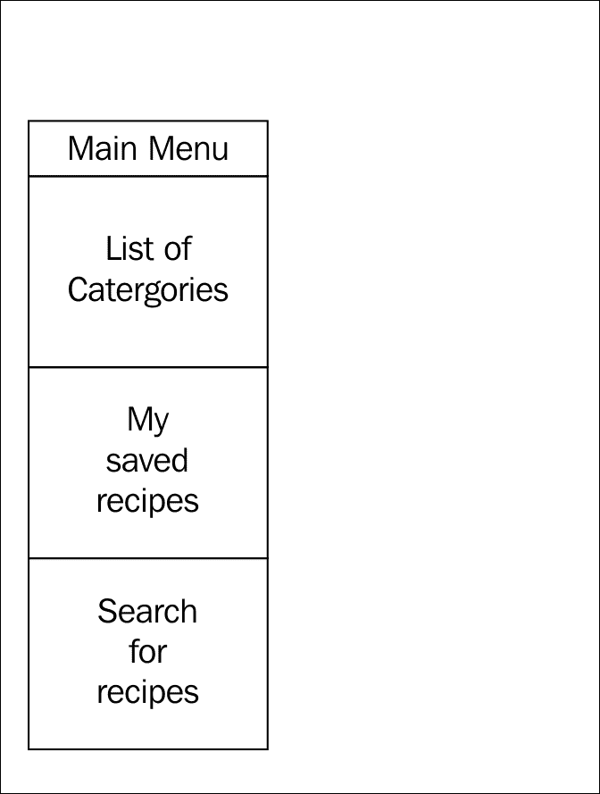
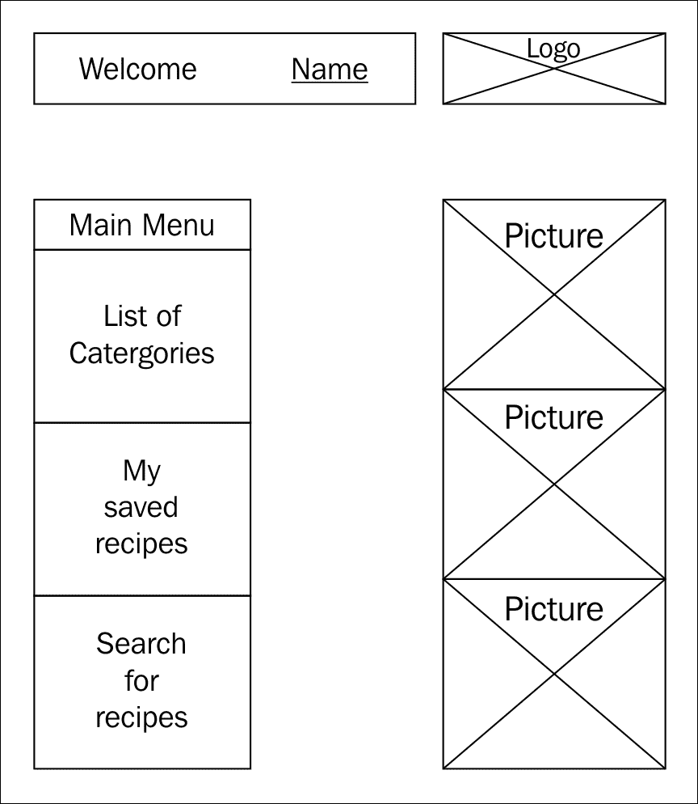
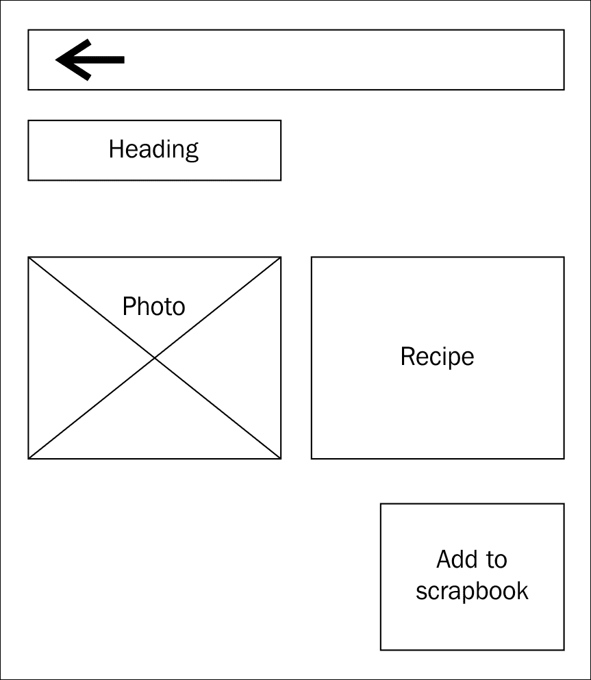
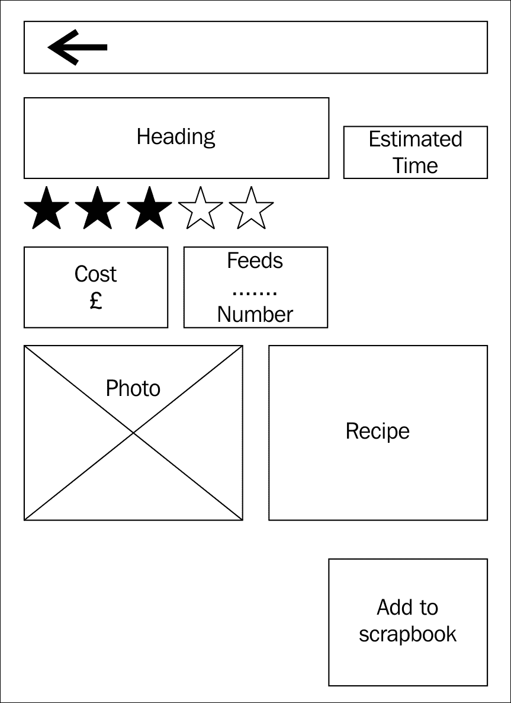
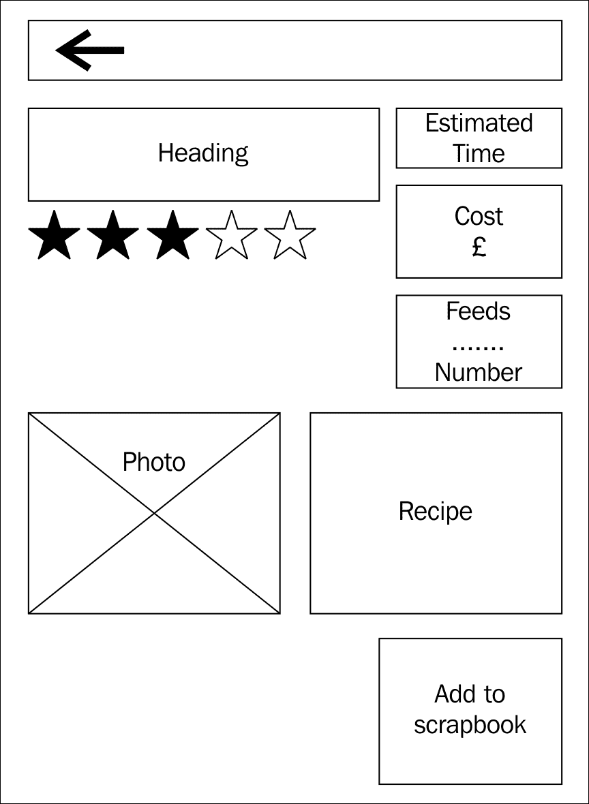
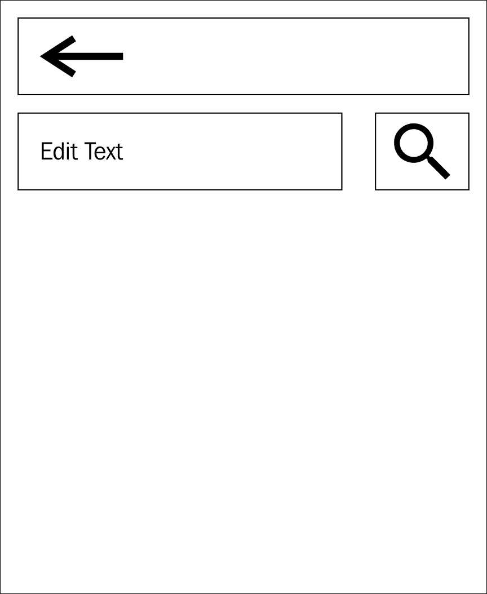
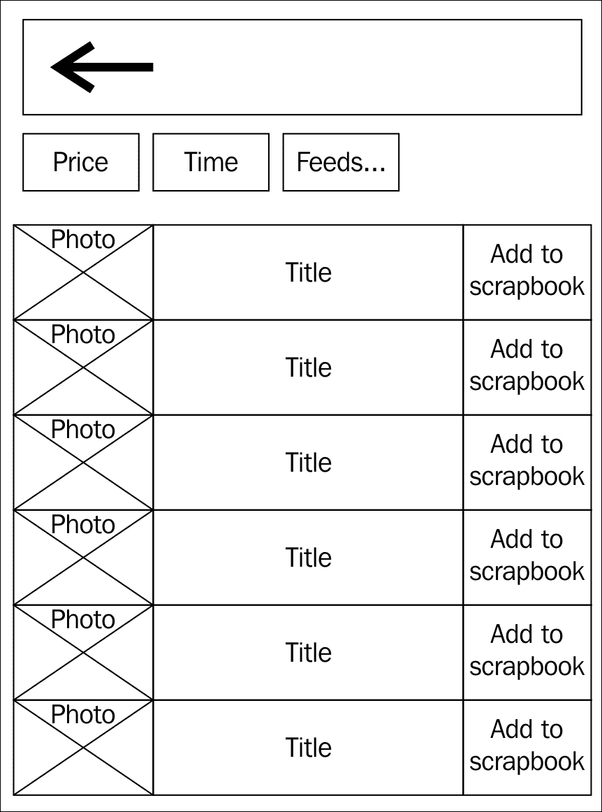
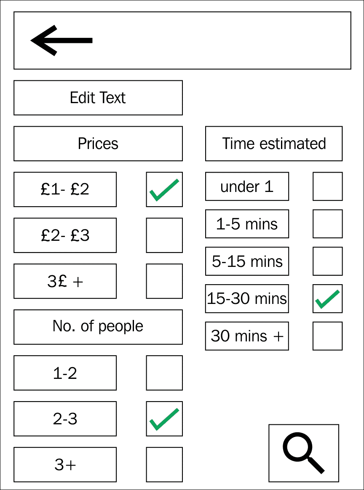
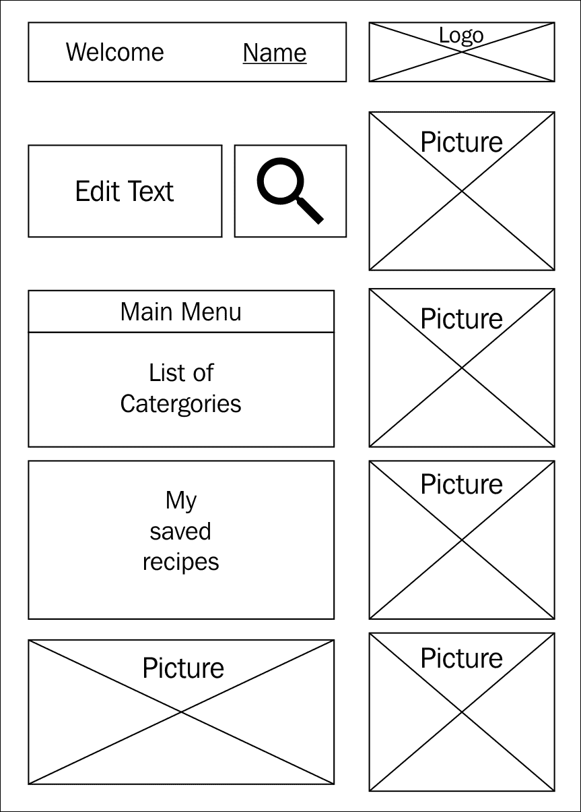

# 第六章：将你的草图转换为线框图

在上一章中，我们通过创建屏幕图和流程图等东西，在非常高的层面上集中规划我们的屏幕。在本章中，我们将从高级规划转向开始设计将构成我们的应用屏幕。

在屏幕设计过程中，你通常会完成以下步骤：

+   **初稿线框图**：这是你开始通过使用纸张和铅笔快速草图来布局屏幕的地方。线框图是你应用布局的低保真度、视觉表示；有时，它被称为骨架、轮廓、页面示意图或屏幕蓝图。为了帮助你专注于每个屏幕的布局、功能和可用性，线框图通常会去除所有外观和感觉元素，至少最初是这样，大多数内容和文本。

+   **数字线框图**：一旦你对铅笔和纸张的线框图感到满意，就是时候使用数字软件来细化这些初稿了。这一步也是你检查你正在形成的设计是否适合你想要展示的内容类型的地方，通过开始添加每个屏幕最终将显示的内容和文本。

+   **原型制作**：下一步是基于你的数字线框图使用纸张和铅笔创建原型。

+   **可用性测试**：这是你在实际用户身上测试你的纸质原型的地方。这种测试对于突出显示你导航中的任何问题，并帮助你了解用户界面对用户理解有多容易至关重要。

### 注意

在设计中，低保真度指的是概念、设计替代方案和屏幕布局的粗略表示。通过创建低保真度原型和线框图，你可以在不投入太多时间和精力到设计过程中去的情况下测试各种想法。高保真度设计是指填补设计低保真度前身所缺失的所有细节。在本章中，我们将使用纸张和铅笔创建低保真度线框图，然后把这些初步想法发展成为更详细、高保真度的数字线框图。

# 什么是线框图？

将线框图想象成屏幕布局的骨架，它描述了主要 UI 组件在屏幕层次结构中应该如何排列。线框图的目的在于关注诸如功能、可用性、行为以及内容的定位和优先级等问题。线框图**不是**关于图形设计的。实际上，在这个阶段，最好省略所有与设计相关的元素。你可能甚至故意让你的线框图看起来非常粗糙和草图般，以帮助你专注于每个屏幕*做什么*，而不是它看起来像什么。

你的线框图通常不会包括颜色，除非你使用颜色来区分 UI 中的某些元素；例如，你可能想拿一支彩色铅笔在相关内容组周围画一个框，或者添加没有屏幕上物理存在的元素，如交互和运动。

你可以使用铅笔和纸、在白板上涂鸦或使用广泛的免费和商业软件应用来创建线框图。然而，对于初稿来说，使用铅笔和纸快速草图线框图是有意义的。

## 线框图的优点是什么？

线框图听起来很简单，但这些看似简单的草图是设计更有效应用屏幕的重要步骤。以下是几个值得你拿出铅笔盒、拿起笔记本并线框图你的应用的理由：

+   线框图非常适合快速测试不同的布局。

    制作草图既快又简单，这意味着线框图是探索多种不同潜在布局的完美机会。

    线框图鼓励你发挥创意，尝试不同的 UI 元素的位置和尺寸以及不同的导航。它们也是映射 UI 元素之间关系的一种简单方法。

    通过线框图多种不同的可能性，你可以发现构成你应用的每个屏幕的最佳布局。

    虽然从技术上讲，你可以在设计过程的每个阶段进行实验，但你在项目上投入的时间和精力越多，你就越不愿意尝试新的想法和不同的布局。

    在线框图多种不同的布局时，你应该注意的一点是，线框图是屏幕的静态表示。线框图并不擅长显示交互细节或移动元素。你需要发挥想象力来更好地了解你的布局中任何交互或移动元素的工作方式，或者花更多的时间原型设计和测试你的布局，这将在本章后面讨论。

+   它们帮助你早期在设计过程中识别问题。

    就像生活中的一切一样，有时候理论上的事情比实际操作中做得更好，所以你在屏幕地图或脑海中看似不错的想法，一旦尝试实施可能会立刻出现问题。

    无论你的应用经历了多次广泛的设计变更还是仅仅是一些微调，设计变更都是创建移动应用不可避免的一部分，所以不是尽早发现潜在问题更好吗？线框图是快速发现设计问题的最快、最简单的方法之一，而且修改线框图大约比修改高保真原型或更糟糕的，已经处于开发中的用户界面要容易 1 亿倍。

    在线框图阶段发现问题也意味着你更有可能做出必要的更改，以正确解决这些问题，即使这意味着彻底改变你的设计。当你发现后续问题，你自然会倾向于寻找解决方案和快速修复，以修补问题而不会对你的设计造成太大干扰。这种做法可能短期内让你生活更轻松，但长期来看，可能不会让最终用户感到非常满意。

+   它们鼓励你捕捉一个完整的设计，而不是随意发挥。

    你是否觉得你对应用的外观有一个清晰的心理图像？也许你在开始规划过程之前就有了这个愿景。如果是这样，那很好，但你仍然需要将这个愿景记录在纸上！

    心理图像的边缘往往有点模糊，有时，直到你试图在纸上捕捉它们，你甚至都没有意识到它们有多模糊。一旦你开始尝试重现你心中的景象，你可能会意识到，你的设计中仍有一些部分悬而未决。

    随着你进入设计流程，在面前实际存在的某个东西上进行重绘和细化，远比在虚空中飘浮的图像要容易得多。

+   它为每个人提供了一个共同的设计语言。

    在本质上，线框图基本上只是标注和注释的草图，因此它们是每个人都能理解的东西。如果你的应用是一个团队项目，这是一个好消息，因为线框图有助于弥合开发应用和设计应用之间的差距，而无需使用任何开发人员或设计师的专业术语。

    如果你正在为某个客户开发应用，线框图也是确保客户对其项目进展有一个清晰了解的绝佳方式。然后你可以获取客户的反馈，并希望在他们进入项目下一个阶段之前，获得他们对设计的认可。

    人们自然不愿意对某人显然花费数小时，甚至数天时间完美化设计提出批评。虽然想要照顾团队成员的感情是好事，但这从长远来看并不能帮助你创建出最好的应用。

    确保你的线框图看起来像是一个快速草图，即使是最有礼貌的团队成员也应该感到舒适地指出其缺陷。

+   它们鼓励你更详细地思考导航问题。

    过度估计设计不良导航的负面影响是不可能的。如果一个用户无法轻松地在你应用中导航，他们很可能会直接退出你的应用。

    我们在上一个章节中提到了导航，但到目前为止，导航在屏幕地图上不过是一组向上、向下和侧向的箭头。线框设计是开始思考如何实现你的应用导航的完美机会。用户究竟将通过标签、操作栏还是他们的设备的**返回**按钮从主页移动到设置页？线框设计是设计有效导航的关键步骤。实际上，每次你创建线框时，你首先需要决定屏幕上应该出现哪些导航元素，正如你将在本章后面看到的。

## 创建线框

创建线框可能看起来相当直接。任何人都可以随意堆砌一堆草图，对吧？虽然线框设计应该是快速和简单的，但如果你想要从你的线框设计会议中获得最大价值，那么你将想要尽可能多地思考你的线框。

在早期草稿中，最有效的线框设计方法是简单地使用纸张和铅笔绘制你的屏幕。理想情况下，你应该为每个屏幕制作几个版本，纸张草图是测试几个想法的最快方式。一旦完成草图，只需将草图并排放置，并决定哪个设计最有效，或者你也可以甚至决定从多个草图中选择元素来创建完美的布局。

即使你更喜欢数字线框设计，并迫不及待地想坐在电脑前启动你最喜欢的图像编辑程序，你也应该先花时间创建粗略草图，因为这正是让你的想法流动起来，并在进入耗时更长的数字线框设计过程之前快速测试多个设计的方法。

### 创建你的第一个线框

在你的线框设计会议期间，将你的屏幕地图放在手边是有帮助的，这样你可以随时参考它。当你开始一个新的项目时，通常从用户启动你的应用时将看到的第一个屏幕开始是有意义的。在我们的食谱应用中，这恰好就是主页。

在你的屏幕上绘制一个粗略的轮廓，然后确定你需要包含哪些导航元素。对于我们的食谱主页，这些元素如下：

+   用户可以从哪些屏幕到达主页。本质上，你需要考虑用户如何导航回到上一个屏幕。很多时候，这可以通过设备的**返回**按钮自动处理，但你也可以通过动作栏中出现的左指箭头或一个 UI 元素，如**返回上一个屏幕**按钮来提供向后导航。为了简化问题，让我们假设向后导航是由设备的**返回**软键自动处理的。

+   用户可以导航到的屏幕。在我们的食谱示例中，这是已保存食谱列表、类别列表和搜索屏幕。为了以紧凑的方式展示所有这些选项，我打算将它们添加到一个菜单中，该菜单将出现在屏幕的左侧：

接下来，决定你需要显示哪些内容。首先添加最重要的内容，如图片、标题、副标题和其他大型内容块，然后按内容层次结构逐步进行。

对于我的主页，我想显示应用的标题和标志，以及一些诱人的用户可以通过遵循此应用中包含的食谱制作的菜肴的图片：

### 小贴士

**感觉灵感枯竭了吗？**

如果你正为灵感而苦恼，那么批判性地审视其他应用是一个很好的启动创意过程的方法。从评分高的 Google Play 商店或 Google 自己的应用套件中汲取灵感是最佳选择。后者尤其有用，因为它们通常是最新最佳实践和设计原则的绝佳示例，尤其是 Material Design。

花些时间浏览不同的屏幕，问问自己你喜欢每个屏幕布局的哪些方面，以及是否有可以改进的地方。创建你特别喜欢的屏幕的线框图可能会有所帮助，然后寻找任何可以用于你自己的线框图的相似之处、元素或一般设计原则。

## 探索更多线框图

每次你创建线框图时，过程都会因你创建的应用类型、你想要显示的内容、屏幕的目的以及你的目标受众等因素而略有不同。然而，可以识别出某些在多个应用中出现的**类型**的屏幕，因为这些屏幕通常具有相似的特征和 UI 元素。

以我们的主页线框图为例。许多应用都有某种形式的主页，这些屏幕通常包括标题、标志和主菜单等元素——就像我们的食谱应用主页一样。除了主页之外，这个应用还是几个其他常见**类型**的屏幕的绝佳示例。由于你很可能在自己的项目中遇到这些屏幕，让我们看看如何为每个这些屏幕创建线框图的方法。

我将从我称之为**细节**屏幕的内容开始。这是一个当用户在前一个屏幕上选择一个项目时出现的屏幕，应用会显示一个包含有关所选项目更多信息的新屏幕。在我们的食谱应用中，包含每个食谱的屏幕就是一个细节屏幕；用户浏览食谱列表，找到一个他们喜欢的，然后点击食谱。这时，他们会进入一个单独的屏幕，包含他们需要重新制作这道菜所需的所有信息。

### 备注

在我们的屏幕图中，我们将这个屏幕称为*详细食谱视图*。

### 细节屏幕的线框设计

如其名所示，细节屏幕都是关于展示信息，这通常是文本和媒体（如图片、视频或音频）的混合。

让我们遵循我们用于线框设计主页的过程，首先确定我们需要添加的所有导航元素。看一下屏幕图，我发现我需要添加以下内容：

+   用户可以从哪些屏幕到达详细食谱屏幕。由于我们在主页线框设计中忽略了向后导航，让我们在这里更详细地探讨它。根据屏幕图，用户可以从搜索结果屏幕、特定类别的食谱列表和保存的食谱列表到达详细食谱屏幕。尽管我们可能依赖于用户点击设备上的**返回**软键返回上一个屏幕，但线框设计完全是关于探索不同选项，所以我要尝试一些不同的事情，并在这个特定的线框中添加一个**返回上一个屏幕**按钮。

+   用户可以导航到的屏幕。在我们的简单屏幕图中，详细食谱屏幕看起来像是应用程序中的最后一个屏幕，但在现实中，你很少在移动应用程序中遇到这种*死胡同*。当用户将这个食谱添加到他们保存的食谱列表中时，我认为如果应用程序将用户带到他们的在线剪贴簿，以便他们可以查看所有保存的食谱，这将是有帮助的。为了创建这种效果，我将添加一个**添加到剪贴簿**按钮，当按下时，执行此操作*并*将用户带到他们的在线剪贴簿。

现在，是内容展示的时候了。不分先后顺序，我希望这个屏幕显示以下内容：

+   食谱的标题

+   制作这个食谱有多难

+   烹饪所需时间的估算

+   成本估算

+   这个食谱可以供多少人食用

+   一张诱人、令人垂涎的成品照片

+   本身就是食谱

### 小贴士

**你真的需要一个细节屏幕吗？**

创建细节屏幕的黄金法则就是它*必须*包含足够的信息，以证明其作为独立屏幕的地位。例如，想象你刚刚下载了一个应用程序，你可以用它来查看你当地电影院正在上映的电影。

第一屏幕是一个时间表，显示了所有电影及其放映时间。你可以点击时间表中的每部电影，应用程序将加载一个新屏幕，专门用于所选电影。你可能会在这个屏幕上找到哪些新信息？也许是一个剧情简介或主演女演员和男演员的列表？或者是一个星级评分或链接到评论，这样你可以决定这是否是一部你需要带着爆米花在大银幕上观看的电影，或者你是否应该等待它在 Netflix 上播出？

现在，假设你没有看到任何这些额外信息，详情屏幕只是重复了你在主屏幕上已经看到的信息。你会觉得这是一个设计精良、提供良好用户体验的应用吗？答案是响亮的**不**。

如果你确实决定包含一个详情屏幕，那么请确保它包含一些新信息。如果没有，那么它就没有价值，因此，它就没有在应用中的位置。

总是首先在你的线框图中添加最重要的内容。在这个例子中，那就是**标题**、成品图片以及**食谱**本身：

当你沿着内容层次结构向下工作时，你可能会遇到可以在屏幕布局中多个位置工作的内容。如果是这样，那么这是通过创建多个线框图来尝试不同布局的理想时机。然后你可以将这些草图并排放置，并决定你更喜欢哪种布局，或者你可以从多个线框图中组合元素来创建你完美的布局。以下是我为详细食谱屏幕创建的线框图选择：

这个线框图包含了一些可能在不同的位置工作的元素——特别是包含估计时间、估计成本和这个食谱可以喂多少人以及食谱的星级评分的文本框。线框图为你提供了一个快速简单的方法来测试这些元素在多个不同位置的效果。

在这些元素的不同位置绘制线框图时，我决定在所有这些线框图中保持主要的内容区域相同：

### 备注

我们还可以在这个屏幕上添加更多内容；例如，可能让用户能够发表评论、上传照片或为每个食谱打分（满分 10 分）会很好。你可能还希望包含多张成品照片，让用户可以滚动查看这些照片。为了使这一章简短，我不会绘制所有这些选项的线框图，但如果你有创意，你可能想拿一张纸和一支铅笔，创建包含所有这些额外内容的自己的线框图。

### 绘制搜索屏幕的线框图

许多应用都有某种形式的搜索功能，我们的食谱应用也不例外，所以让我们看看如何绘制搜索屏幕的线框图。

你现在应该知道了！看看屏幕图，并确定你需要包含的所有导航元素：

+   用户可以从哪些屏幕到达搜索屏幕。根据屏幕图，用户只能从主页屏幕到达搜索屏幕。

+   用户可以导航到的所有屏幕。用户只能从搜索屏幕到达的屏幕是搜索结果屏幕。

在之前的线框中，我们通过依赖设备的**返回**软键和创建一个**返回上一屏幕**按钮来处理向后导航，所以这次让我们尝试一些不同的方法！我打算在操作栏中使用一个向左的箭头。

### 注意事项

在现实生活中创建 Android 应用时，你通常会选择一种导航方式并在整个应用中使用它，而不是我们在本章中使用的混合方式。尽管我在尝试很多不同的导航选项，但请记住，在实际项目中，你会选择一种导航形式并在整个应用中应用它，以避免让用户感到困惑和沮丧。

让我们创建我们的搜索功能。我会保持简单，并使用以下内容：

+   一个`EditText`，用户可以输入他们想要搜索的关键词。

+   用户按下以提交他们的搜索词的按钮。我将使用标准的搜索系统图标来标记此按钮，以确保用户立即知道此按钮执行的操作。

你可能已经注意到，在之前的线框中，我们使用的是一般术语，如标题框和图像，而现在，我们使用的是技术术语*EditText*。这是因为线框设计没有严格的规则，所以如果你已经有了创建某些 UI 元素的想法，并且想要将此信息添加到你的线框中，那么请继续！

### 注意事项

唯一的例外是当你打算与他人分享你的线框，尤其是如果这些人本身不是 Android 开发者时！如果你与非 Android 类型的人一起创建线框作为协作努力，那么你应该坚持使用民用术语，如文本框和图像。

虽然这种布局没有问题，但不可否认的是，它相当基础。如果我们的用户能够根据几个不同的标准搜索食谱会更好：

+   该食谱制作有多简单

+   购买食材的成本

+   该食谱可以供多少人食用

实现此功能的方法有很多，但我想到的两种方法是这里：

+   通过在现有的搜索屏幕线框中添加复选框，让用户能够根据不同的标准过滤食谱。用户可以输入他们想要搜索的任何关键词，并选择相关的复选框；例如，他们可能会搜索包含单词`prawn madras`（美味，美味）的食谱，然后选择标记为**成本 £2-£3**和**烹饪时间 15-20 分钟**的复选框。

+   坚持使用我们简单的搜索屏幕，但在搜索结果屏幕中添加过滤器。用户像平常一样搜索关键词，然后被带到搜索结果屏幕，该屏幕包含额外的过滤器，使用户能够缩小搜索结果。

这两种方案都是可行的，所以我迅速地为每种方法制作了线框图。这是一个很好的例子，说明了你可以如何使用线框图快速测试各种布局：

在这个线框图中，用户像往常一样进行搜索，但搜索结果屏幕包含三个新的按钮（**价格**、**时间**和**订阅...**），他们可以使用这些按钮根据不同的标准过滤搜索结果。

下面的线框图是搜索屏幕的新版本，用户像往常一样在`EditText`中输入搜索词，但随后使用各种复选框来更具体地说明他们想要看到的搜索结果：

#### 搜索屏幕作为一个片段

无论你在设计和开发过程的哪个阶段，你都应该始终考虑如何支持尽可能多的不同 Android 设备。

当你忙于制作线框图时，很容易陷入只针对一种设备进行设计的陷阱。虽然这确实让线框图制作变得容易，但从长远来看，这并不会对 UI 设计产生很大的效果。

### 小贴士

**横屏和竖屏线框图**

在线框图阶段对内容的尺寸和位置进行调整，不仅有助于你更好地支持多种屏幕配置，还能帮助你设计出在横屏和竖屏模式下都能良好运行的 APP。

为多个屏幕进行规划可能意味着创建针对不同屏幕配置的多个线框图，或者可能意味着使用片段以不同的方式组合你的内容。

在上一章中，我们提到在较小设备上显示我们的搜索屏幕作为一个独立的活动，但在较大屏幕设备上，将其作为片段与主页并排显示。既然我们已经为第一种可能性制作了线框图，那么绘制搜索屏幕作为多窗格布局的一部分似乎也是正确的。

为了加快这个流程，我将重用我们之前创建的主页线框图以及原始的基本搜索屏幕线框图。

和往常一样，让我们从导航开始。除了左侧菜单中的“搜索食谱”项目外，我们主页线框图中的大多数导航元素仍然有效。由于在这种情况下搜索框将出现在主页旁边，我们可以从菜单中删除此链接。

同样，原始的搜索线框图包含一个带有左向箭头的操作栏，这现在不再必要；由于片段作为主页的一部分出现，用户除了退出应用外没有其他地方可以导航回，我们不希望帮助他们这样做！

导航问题解决后，让我们看看内容。原始主页和搜索线框图中的所有内容仍然相关，因此它们在我们的多窗格布局中都有位置。

让我们来看看最终的结果：

### 注意

**感到不知所措了吗？**

在尝试为多个设备设计的同时确定每个元素的最佳位置，可能会让你对着一张空白的纸发呆，想知道**从哪里开始**？如果你感到不知所措，那么将线框视为一系列草稿可能会有所帮助。

在创建你的第一个草稿时，你应该在不担心尝试支持多个设备的情况下绘制线框。相反，集中精力定义你的应用在其**自然**状态下的外观。如果你不担心在小型手机上空间不足，你希望那个标题有多宽？理想情况下，那个按钮应该离屏幕边缘有多远？你真的想并排显示两张图片吗？你确定你不会更喜欢三张？或者四张？五张呢？

拿起铅笔，无忧无虑地绘制线框。然后，在你为自己出色的初稿拍手称快之后，你就可以开始担心这个线框如何在不同设备上转换了。

## 数字线框

一旦你对你的纸质线框感到满意，你应该进一步发展它们。这可能意味着使用你信任的铅笔和纸张创建一个更详细、经过深思熟虑的草图，或者这可能意味着将这些纸质线框发展成**数字**线框。

如果你决定数字化你的线框，市面上有大量的线框软件，从专业的图像编辑程序，如 Adobe Photoshop、Illustrator 和 Fireworks，一直到专门为线框设计的工具，如 Pidoco、Axure、InDesign、Sketch、Omnigraffle 和 Balsamiq Mockups。

上一张图片是我们食谱应用主屏幕的示例，使用 Balsamiq 数字线框工具创建。

如果你不确定要使用哪个工具，那么快速进行一次谷歌搜索会返回大量的潜在线框软件，这时你将面临一个全新的问题——选择太多！

如果你难以在几个潜在的线框工具之间做出选择，那么请自问以下问题：

+   这个工具是否具备我需要的所有功能？在做出决定之前，你应该确保你选择的工具具备你快速轻松创建针对你**特定**项目线框所需的所有功能。如果你在投资专业的线框软件，这一点尤为重要。如果你下载了免费的线框软件，然后发现它并不完全适合你，那么至少你没有浪费你辛苦赚来的钱！为了避免被有说服力的网站文案所影响，记下你理想的线框工具应该包含的所有功能。然后你可以检查每个潜在的工具是否符合你的标准；如果不符，那么你可以继续考虑下一个。

+   是否可定制？能够调整线框图程序以满足你的具体需求总是积极的，但如果你在开发不寻常或利基的用户界面时，这一点尤为重要。

+   你能存储可重用元素吗？你通常会在多个屏幕上使用许多 UI 元素，例如操作栏、菜单和按钮。为了提升线框图过程，留意一下允许你轻松存储和重用视觉元素的工具。

+   学习曲线是怎样的？专业的矢量插图工具可能听起来正是你项目所需的东西，但复杂的工具可能会让你感到困惑，尤其是如果你对设计不太熟悉。线框图的整个目的就是通过快速测试多个布局来节省你的时间。然而，如果你花几个小时埋头于程序的用户手册而不是实际创建线框图，那么整个练习就变得毫无意义。

+   你是否已经熟悉具有线框图潜力的软件？即使这个程序不是最现代或功能最丰富的，如果你能在合理的时间内用它创建有效的线框图，那么使用这个老牌的软件，而不是花时间学习新软件，可能是有意义的。

如果你正在与众多线框图工具的多样性作斗争，那么你可能想要专注于免费的线框图软件，而不是一头扎进购买专业的图像编辑工具。免费工具的巨大好处是，你可以通过下载几个并快速试用，*无需*支付巨额账单，就能亲自看看它们是否适合你。

### 向你的线框图添加内容

到目前为止，我们一直强调不在线框图中添加内容；但到了某个时候，你需要测试你的屏幕形状是否适合你想要显示的内容类型。一旦你对一系列满意的数字线框图感到满意，就是时候测试你的内容是否适合这些线框图，或者你是否需要调整这些线框图。

内容，主要是副本，在*任何*平台上看起来都不太吸引人，但在移动设备上更是如此。智能手机或平板电脑的小屏幕可能会使未分化的文本块看起来更大。

如果你打算以优雅的方式展示你的应用副本，那么你需要对其设计进行一些思考，而线框图是完美的起点。

当你进入数字线框图领域时，你可以开始尝试设计元素，如不同的字体、文本大小、项目符号和编号列表，以及标题和副标题。最终结果？一个将你闪耀、引人入胜的副本与吸引人的展示和设计相结合的 UI——基本上，是用户真正*想要*阅读的文本。

如果你把内容和复制设计问题留到最终屏幕设计摆在你面前的时候，那么你可能会试图说服自己这并不是一个真正的大问题；或者你会寻找最快最简单的工作方案，即使这些方案并不适合最佳的屏幕设计。

当你在线框中添加内容时，牢记真实内容的外观至关重要。使用恰好适合你的线框大小和长度的文本很诱人。不幸的是，除非你非常幸运，否则这并不是真实内容的工作方式，因此在使用线框时使用逼真的文本很重要。

虽然你可以使用经典的`Lorem ipsum`拉丁语填充文本或一些占位符内容，但测试你的布局是否适合你想要显示的内容的最佳方式是使用最终将出现在屏幕上的相同复制内容。

在我们的食谱应用的情况下，这带来了一点问题，因为每个详细食谱屏幕上的文本都将不同。例如，每个食谱标题的长度都不同，那么我们如何确保所有这些标题都能适合可用空间？

解决办法是查看最终需要放入标题框中的所有标题的完整范围，然后计算出平均长度。你还应该尽力寻找尴尬的内容，因为这有助于你规划你的 UI 如何支持这些边缘情况。在这种情况下，这意味着找到最长和最短的食谱标题，然后想出如何有效地展示它们。

当详细的食谱屏幕需要显示简短标题时，标题框的大小会保持固定还是缩小？如果它缩小了，我们如何防止大量空白出现在新缩小的框周围？框会扩展以容纳具有异常冗长标题的食谱吗？文本会换行到多行吗？

你不需要为每一种可能性都绘制线框，但你应该尝试识别所有可能由复制和内容引起的重大问题。只有在这种情况下，你才能创建一个足够灵活的线框，以便轻松处理不寻常的复制和内容。

# 纸质原型是什么？

一旦你创建了一个相对满意的数字线框，通过纸质原型来测试这个设计是个好主意。

纸质原型是在你创建组成你应用的各个屏幕的草图时，将每个屏幕表示为单独的一张纸。然后你在一个用户（或者理想情况下，*多个用户*）身上测试这个纸质原型，并将用户的反馈纳入你的数字线框中。这种可用性测试方法可能看起来很简单，但实际上它是一种非常有价值的方法，可以审查和改进你的设计，使其尽可能完美。

创建纸质原型是设计过程中的一个重要步骤，主要有两个原因：

+   **它们非常适合识别你可能忽视的任何可用性问题**：发现你自己的设计中的错误并不总是容易的。纸质原型为你提供了一个在不需要编写任何代码的情况下对你的目标受众进行应用测试的方法。而且正如我们之前讨论的，你越早发现设计中的缺陷，就越容易修复这些缺陷。

+   **它们帮助你提前测试你的应用导航**：设计简单且无摩擦的导航是创建成功应用的关键部分，但在实际体验导航之前，很难正确评估导航。原型提供了一种测试你计划中的导航的方法，并亲眼看到用户导航你的应用是容易还是困难。如果你跳过纸质原型阶段，风险是直到你真正开始构建应用时，你才意识到你的导航有问题。而且由于导航应该在应用中保持一致，如果你发现你需要调整一个屏幕的导航，你可能会发现你需要改变所有屏幕的导航；而这不是你希望在最后一刻才发现的事情！纸质原型增加了你第一次就做对导航的机会。

## 可用性测试

纸质原型非常适合可用性测试。理想情况下，你希望对你的目标受众成员进行原型测试，但只要他们没有参与设计过程，同事、朋友和家人也可以作为很好的替代者。

为了进行最有效的可用性测试，你希望有人像普通用户一样，在下载了你的应用后，以**盲测**的方式对你的应用进行真实反应。如果你请了一位对你项目有内部知识的人帮忙，那么这并不能真正复制典型的用户体验。

在可用性测试中，测试对象与纸质原型互动，而你则操纵原型以反映用户的行为。例如，如果他们点击了“**转到主页**”按钮，你应该切换页面并向他们展示你的主页原型。好吧，这听起来可能有点愚蠢，但它也是在你投入更多时间进行设计和开发应用之前发现潜在可用性问题的最有效方法之一，所以为了这个目的，感觉有点愚蠢也是值得的。

当用户在使用你的纸质原型时，请他们提供反馈，并确保提示他们解释他们为何执行每个动作以及他们期望接下来会发生什么。你也应该鼓励他们说出任何让他们感到困惑的地方，或者如果他们对你的用户界面有任何不喜欢的地方。他们是否理解如何导航到下一个屏幕？他们是否立即理解在每个新屏幕上需要执行的任务，或者他们需要停下来思考？

理想情况下，您将获得足够的信息来对您的数字线框进行一些修订。如果您对线框进行了任何重大更改，那么请考虑创建一套新的纸质原型并在同一用户上进行测试。重复此过程，直到您的测试对象能够轻松地导航您的纸质原型，并且没有进一步的反馈或建议。

在这个阶段，您应该有一套您感到自信的数字线框。我们将在下一章中使用这些线框来创建更详细、更精细的数字原型。

### 快速原型设计

如果您的应用程序是团队合作的结果，您可能希望考虑将纸质原型设计作为快速原型设计方法的一部分。

在快速原型设计中，每个团队成员都会创建一个纸质原型并在单个用户上进行测试。然后团队聚集在一起分享他们的反馈和想法，此时每个人会创建第二个原型。同样，在团队再次聚集分享反馈之前，每个原型都会在单个用户上进行测试。您可以根据集体反馈更新您的数字线框。这是从多个用户那里收集反馈并整合所有这些宝贵信息到您的设计中的一种最快、最简单的方法。

# 摘要

当谈到开发 Android 应用程序时，规划的价值是无法高估的。

在本章中，我们探讨了如何将上一章中制定的高级计划转化为实际的屏幕设计。我们创建了快速纸质线框，然后以此为基础创建包含内容和副本的详细数字线框。最后，我们创建了纸质原型，并探讨了可用性测试如何帮助您完善屏幕设计，使它们尽可能完美。在下一章中，我们将探讨如何使用 Android Studio 和 Android SDK 创建更复杂和精细的数字原型。

如果这一章是您对线框和原型设计的第一次尝试，那么您可能仍然感到不知所措，但重要的是要记住，只要您在进行某种形式的线框和原型设计，那么您就已经比之前做了更多的规划。

唯一的警告是，在设计过程的早期阶段不要投入太多时间和精力去完美化您的屏幕设计。您的设计应该一开始就非常粗糙，随着您通过不同的规划阶段，逐渐变得更加精细和详细。

如果你仍然不确定，那么请再次查看本章中包含的食谱线框图，并问自己“我如何可以改进这些设计？”然后，绘制线框图！你甚至可能想要根据这些线框图创建原型。或者，启动你最喜欢的 Android 应用，创建所有主要屏幕的线框图和原型版本。这些都是提高你技能的有价值的方法，这样当你开始规划自己的真实 Android 项目时，你将是一名线框图和原型制作的专家。

现在我们已经为我们的应用程序得到了一个粗略的设计，是时候深入开发工作了。在下一章中，你将使用 Android Studio 根据你的线框图和纸版原型创建一个可工作的数字原型。
