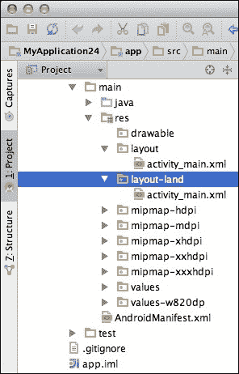
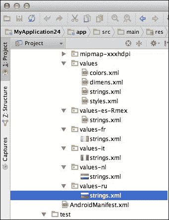
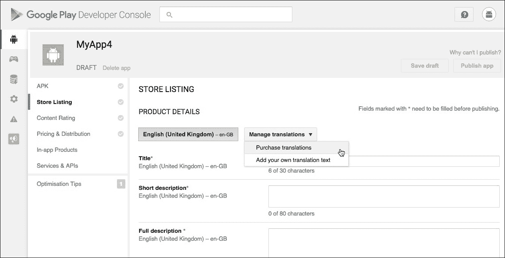

# 第八章. 扩大受众范围 – 支持多种设备

Android 是一个对硬件限制很少的移动操作系统。制造商可以自由地创建配备高端硬件的 Android 设备，如 DSLR 级别的相机、巨大的内部存储和闪电般的 CPU；或者他们可以创建更经济实惠的设备，采用无装饰的硬件设计。Android 屏幕也可以有各种尺寸、形状和屏幕密度。

这些设备唯一共同点就是它们都运行 Android 操作系统——即使在这一点上，Android 智能手机和平板电脑也不一致。当前的 Android 智能手机和平板电脑市场由许多不同版本的 Android 操作系统组成，从遗留版本一直到最新的 Android 发布。即使两台设备运行的是完全相同的 Android 版本，也无法保证它们完全相同，因为制造商有修改 Android 操作系统的坏习惯，以推出他们自己的**原始设备制造商**（**OEM**）版本。运行 Android 7.0 的三星智能手机可能并不一定与运行 Android 7.0 的索尼智能手机相同。

这种灵活性对制造商来说是个好消息，他们可以通过推出新的和创新型的硬件、软件和屏幕配置，使他们的设备在竞争中脱颖而出。对消费者来说也是个好消息，他们可以四处寻找，找到最适合他们的 Android 设备。

但这对开发者来说好吗？*有点儿*。

所有这些关于硬件、软件和屏幕配置的变体意味着有很多机会进行创新并推出真正原创的应用。然而，这也带来了巨大的挑战，因为你需要创建一个能够在所有可能遇到的不同硬件、软件和屏幕配置上提供一致体验的应用。

不幸的是，没有快速解决的办法。本质上，创建灵活用户界面的关键是提供一系列替代资源，这些资源针对所有可能遇到的不同硬件、软件、屏幕配置、语言和区域设置进行了优化，这可以说是 Android 应用开发中最耗时的一部分。

在本章中，我将涵盖你需要牢记的所有主要方面，如果你打算创建一个尽可能兼容多种不同 Android 设备的灵活应用。

# 支持不同的 Android 版本

虽然大多数 Android 平台的新版本都引入了令人兴奋的新功能，你可能会迫不及待地在应用中使用它们，但如果你想要触及尽可能广泛的受众，那么你还需要尽可能支持尽可能多的旧版 Android 平台。

这是一个微妙的平衡行为。支持旧版 Android 平台需要时间和精力，而且你走得越远，就越需要努力才能让你的应用与旧版 Android 良好地协同工作。

如果你继续努力支持越来越旧的 Android 版本，在某个时候，你不可避免地会发现自己在遇到无法支持你最初想要创建的应用类型的 Android 版本时，不得不妥协你的应用的 UI、功能以及整体用户体验。在我们的食谱应用示例中，我们依赖于设备足够强大，能够在用户进行搜索时加载多个高分辨率图片。如果用户运行的是较旧的 Android 操作系统版本，处理这些图片可能会导致搜索结果加载得更慢。尽管问题出在用户的设备上，但典型的 Android 用户更有可能责怪你的应用，而不是他们过时的智能手机或平板电脑。

我们可以缩小图片或甚至完全删除它们，但你愿意在没有看到成品照片的情况下尝试一个食谱吗？在这个时候，你应该退一步问问自己，所有这些时间和努力，以及妥协，是否真的*值得*。

为了确定支持旧版 Android 何时变得比其价值更大，你需要查看当前的 Android 市场——特别是运行每个版本 Android 操作系统的设备数量。一旦你有了这些信息，你就可以做出明智的决定，关于何时继续支持旧版 Android 已不再有意义。

获取这些信息的一个来源是谷歌的仪表板（[`developer.android.com/about/dashboards/index.html`](http://developer.android.com/about/dashboards/index.html)），它提供了运行每个版本 Android 的设备相对数量的百分比。但请注意，这些信息是以非常特定的方式收集的。这基本上是过去 7 天内访问谷歌 Play 商店的所有设备的快照。这些数据来自谷歌 Play 应用，并不一定代表整个 Android 市场的当前状态。还值得注意的是，谷歌 Play 应用仅与 Android 2.2 及以上版本兼容，因此运行低于 2.2 版本的 Android 的设备不包括在这组数据中；尽管根据谷歌在 2013 年 8 月的数据，运行低于 Android 2.2 版本的设备仅占大约 1%，所以我们这里谈论的是一个非常小的百分比。

花些时间探索仪表板数据，并决定你将支持哪些版本的 Android，以及哪些版本你将不支持。

## 指定最小和目标 API 级别

一旦你决定了要支持哪些版本的 Android，你需要在你的项目中包含这些信息。如何添加这些信息将取决于你使用的 IDE，因此你需要打开以下文件之一：

+   清单文件（Eclipse）

+   模块级别的 `build.gradle` 文件（Android Studio）

我们将在下一节讨论这个文件的组成部分。

### minSdkVersion

这个属性标识了你的应用兼容的最低 API 级别，例如，`minSdkVersion 16`。Google Play 将使用你的应用的 `minSdkVersion` 属性来确定用户是否可以在设备上安装它。

当你在考虑你的应用的 `minSdkVersion` 值时，确保你咨询仪表板统计信息，因为这提供了你潜在受众的快照。最终，你需要决定支持这个受众的每一部分额外的时间和工作是否值得。

### targetSdkVersion

这个属性标识了你在测试你的应用时使用的最高 API 级别。

`targetSdkVersion` 的值对于向前兼容性尤其重要，因为系统不会应用在新 Android 版本中引入的任何行为更改，直到你更新你的应用的 `targetSdkVersion` 值。为了确保你的应用能够从最新的 Android 功能中受益，你应该将你的应用的 `targetSdkVersion` 值设置为 Android 的最新版本。每当 Google 发布新的 Android 版本时，将你的应用更新为目标新的 SDK 应始终是最高优先级，但你应该在彻底测试你的应用与最新的 SDK 版本兼容性之后才这样做。*永远不要*在没有测试的情况下盲目更新你的 `targetSdkVersion` 值。

理想情况下，你的 `targetSdkVersion` 和 `compileSdkVersion` 值应该始终与 Android SDK 的最新版本相对应。

### compileSdkVersion

这个属性告诉 Gradle 应该使用哪个版本的 Android SDK 来编译你的应用。

你的 `compileSdkVersion` 值不包括在你的发布 APK 中；它仅用于编译时。更改你的 `compileSdkVersion` 值不会改变运行时行为，因此建议你始终使用最新的 SDK 进行编译。

## 运行时检查版本

有时候，你会有一个明确的截止点，对于你的应用停止支持更早版本的 Android 来说是合理的，但这条线可能并不总是那么明确。

假设你的应用包含一个在 Android 5.0 及更早版本上不受支持的辅助功能，但除了这个功能外，你的应用与更早版本的 Android 兼容。由于这个 Marshmallow 及以上版本的功能不是必需的，阻止运行 Android 5.0 或更早版本的设备用户安装你的应用是没有意义的。在这种情况下，你可以通过确保任何依赖于更高 API 级别的代码仅在相关 API 可用时执行来禁用此功能。基本上，运行 Android 5.0 或更低版本的用户的设备将无法使用此功能，但这些用户仍然可以安装并使用你的应用。

你可以通过使用`Build`常量类来指定相关代码何时运行来实现这一点；例如，以下代码验证你的应用是否运行在 Lollipop 或更高版本：

```java
if (Build.VERSION.SDK_INT >= Build.VERSION_CODES.LOLLIPOP) 

```

Android 为每个平台版本提供唯一的代码，你应该与`Build`常量类（在这个例子中，代码是`LOLLIPOP`）一起使用。你可以在官方 Android 文档中找到这些代码的完整列表（[`developer.android.com/reference/android/os/Build.VERSION_CODES.html`](http://developer.android.com/reference/android/os/Build.VERSION_CODES.html)）。

# 支持不同屏幕

Android 设备形状和尺寸各异。作为开发者，你的任务是创建一个 UI，使其在小屏幕的预算友好型智能手机上看起来和在大屏幕的顶级 Android 平板电脑上一样好，以及介于两者之间的所有设备。

所以让我们来分解一下。Android 以两种方式对屏幕进行分类：

+   **屏幕尺寸**：传统上，Android 支持四种通用屏幕尺寸：`small`、`normal`、`large`和`xlarge`。然而，Android 3.2（API 级别 13）引入了一些新的配置限定符，允许你更具体地指定屏幕尺寸。

+   **屏幕密度**：设备的屏幕密度是其分辨率和显示尺寸的组合，以每英寸点数（**dpi**）来衡量。设备的 dpi 越高，每个单独的像素越小，这意味着每英寸的清晰度和细节越多。Android 支持六种通用密度：低（`ldpi`）、中（`mdpi`）、高（`hdpi`）、超高（`xhdpi`）、超超高（`xxhdpi`）和超超超高（`xxxhdpi`）。

你可以预期你的应用将被安装在屏幕尺寸和密度各不相同的设备上。你应该有更高的目标；仅仅让你的应用兼容这些不同的屏幕配置是不够的，你应该让用户感觉到你的应用是专门为他们的特定屏幕设计的，无论屏幕的大小和密度如何。

在本节中，我将向您展示如何创建一个能够处理广泛不同尺寸和密度的应用。您将不断遇到的一个基本主题是，您的应用布局和可绘制资源必须以适合当前屏幕的尺寸进行渲染。Android 系统足够智能，可以自动处理大部分渲染工作，并将布局和资源缩放到适合当前尺寸和密度，但您不应依赖 Android 系统为您完成所有艰苦的工作。

仅靠 Android 的自动渲染无法提供最佳的用户体验。您需要提供多个版本的资源，这些资源针对不同的屏幕尺寸和密度进行了优化。这些资源可以是字符串、布局、图形或任何其他您的应用所需的静态资源。

要将这些资源添加到您的项目中，您需要创建项目目录的替代版本，并使用正确的配置限定符进行标记；例如，如果您有一个针对横向布局优化的布局，您需要创建一个 `res/layout-land` 目录，然后将您的横向布局文件放置在这个目录中。然后，当用户运行您的应用时，Android 系统将自动加载与当前屏幕配置最匹配的资源，无论是默认布局还是您的横向优化布局 `res/layout-land`。

## 配置限定符

Android 支持一系列配置限定符，您可以将这些限定符附加到项目的资源目录中。这些配置限定符是控制系统显示资源版本的关键。

配置限定符指定了资源是为哪些特性设计的，例如为特定屏幕尺寸或屏幕密度设计的图像。您可以在官方 Android 文档中找到有效配置限定符的完整列表，具体为 **“提供资源”页面中的表 2** ([`developer.android.com/guide/topics/resources/providing-resources.html#AlternativeResources`](http://developer.android.com/guide/topics/resources/providing-resources.html#AlternativeResources))。

您需要使用的配置限定符将根据您的应用和目标设备类型而有所不同，但作为最低要求，您通常使用尺寸、密度和屏幕方向限定符来提供针对不同屏幕配置优化的可绘制资源和布局。

要使用配置限定符，在您的项目 `res/` 目录中创建一个新的目录，并使用以下格式命名：

```java
<resources_name>-<config_qualifier> 

```

因此，如果您正在创建一个用于存放针对横向模式手持设备优化的布局的目录，您将使用 `land` 限定符并创建一个 `res/layout-land` 目录，然后将您的布局优化布局放置在这个目录中。

### 注意

永远不要将任何资源直接放置在项目`res/`目录中，因为这会导致编译器错误。您也不能嵌套替代资源，因此您不能创建一个`res/drawable/drawable-xxhdpi/`目录。

您可以同时使用多个限定符，通过破折号分隔每个限定符；例如，一个`res/drawable-en-hdpi`目录将包含为设置为英语语言（`en`）且屏幕密度属于高密度范围的设备设计的可绘制资源。如果您确实使用了多个限定符，它们在目录名称中出现的顺序至关重要。它们必须与在**提供资源**页面（[`developer.android.com/guide/topics/resources/providing-resources.html#AlternativeResources`](http://developer.android.com/guide/topics/resources/providing-resources.html#AlternativeResources)）中出现的顺序相同。如果您以错误的顺序使用限定符，Android 系统将无法识别该目录，并随后忽略它包含的所有资源。

您无需担心目录名称的大小写，因为资源编译器在处理之前会将目录名称转换为小写。如果您的项目包含由多个配置限定符组成的冗长名称的目录，那么您可能想利用这种自动转换，并使用大写字母来使目录名称更容易阅读。

对您放置在目录中的资源进行命名也很重要。当您创建同一资源的多个版本时，它们必须与默认资源具有完全相同的名称。任何变化，Android 系统都不会将其识别为同一资源的替代版本。

### 注意

如果您的项目包含系统不应根据当前屏幕配置进行缩放的资源，请将这些资源放置在具有`nodpi`配置限定符的目录中，例如，`res/drawable-nodpi`。

### Android 如何选择最佳资源

当您的应用具有同一资源的多个版本时，Android 系统在运行时决定显示哪个版本时遵循一套严格的规则。

当 Android 系统根据屏幕大小或密度查找资源时，它首先搜索一个无需缩放即可显示的精确匹配项。如果找不到合适的大小或密度特定的版本，Android 将切换到计划*B*并搜索为屏幕尺寸小于当前屏幕设计的版本。

如果可用的资源比当前屏幕大，系统将使用资源的默认版本。Android 系统假设您的项目默认资源是为基准屏幕大小和密度设计的，这是一个`normal`大小和中等密度。因此，系统将默认资源向上缩放以适应高密度或更大的屏幕，向下缩放以适应低密度屏幕。

如果系统找不到合适的密度特定资源，甚至找不到所需资源的默认版本，那么你的应用将会崩溃——这就是为什么提供每个资源的默认版本是至关重要的。

即使你确信你已经提供了你项目可能需要的所有替代资源，你的应用也可能最终运行在一个具有你未曾预料到的硬件、软件、屏幕尺寸、屏幕密度或语言设置的设备上，因此你没有为这些特定资源提供具体资源。在这种情况下，系统可能会回退到你的项目默认资源，如果你的应用不包括这些默认资源，那么你的应用将会崩溃。

### 注意

默认资源是指存储在没有任何配置限定符的目录中的所有资源，例如`res/drawable`。

### 创建别名资源

有时候，你会有一个适合多个配置限定符的资源；例如，你可能有一个想要添加到你的项目的`res/drawable-hdpi`和`res/drawable-xhdpi`目录中的 drawable。

### 注意

你不能创建使用相同类型多个配置限定符的目录，因此不可能创建`res/drawable-hdpi-xhdpi`目录。

你可以复制/粘贴资源，使其出现在两个目录中；但这并不高效，而且重复资源会增加你项目的大小，这对你的最终用户来说是个坏消息。最好的解决方案是使用**别名**。

假设你有一个`scene.png` drawable，你想要在`hdpi`和`xhdpi`屏幕上使用；这是一个使用别名的完美机会。在这种情况下，你需要将默认版本放在你的项目的`res/drawable`文件夹中，就像平常一样。然后，将你想要用于`hdpi`和`xhdpi`屏幕的图像版本保存在`res/drawable`文件夹中，但给它一个与默认资源不同的名字，例如`scenery_alias.png`。

到目前为止，你有两个 drawable：

+   `res/drawable/scenery.png`

+   `res/drawable/scenery_alias.png`

接下来，在两个密度特定目录中创建一个 XML 文件。在这些 XML 文件中，添加一些指向你的项目`res/drawable/scenery_alias.png`资源的代码：

```java
<?xml version="1.0" encoding="utf-8"?> 
<bitmap    android:src="img/scenery_alias" /> 

```

当 Android 系统尝试从`res/drawable-hdpi`或`res/drawable-xhdpi`加载场景资源时，它会识别别名并显示`res/drawable/scenery_alias.png`。这样，你可以用小的 XML 文件替换内存占用大且效率低下的重复资源。

你还可以使用别名功能在多个目录中重用相同的布局资源文件，如下所示：

1.  创建一个默认布局（`main.xml`），并将其放置在你的项目的`res/layout`目录中。

1.  创建你想要在多个目录中使用的布局。给这个布局一个与默认布局不同的名字（我将使用`main_alias.xml`），并将其放置在你的项目的`res/layout`目录中。

1.  在你想要使用 `layout_alias.xml` 文件的所有目录中创建 XML 文件。

1.  添加一些引用 `layout_alias.xml` 的 XML 代码：

    ```java
            <?xml version="1.0" encoding="utf-8"?> 
            <merge> 
               <include layout="@layout/main_alias"/> 
            </merge> 

    ```

虽然不太常用，但你也可以为字符串和其他简单值创建别名，如下所示：

```java
<?xml version="1.0" encoding="utf-8"?> 
<resources> 
   <color name="yellow"> #ffff00 
</color> 
   <color name="highlightColor">@color/yellow</color> 
</resources> 

```

在这个例子中，`highlightColor` 现在是 `yellow` 的别名。你还可以为字符串创建别名：

```java
<?xml version="1.0" encoding="utf-8"?> 
<resources> 
   <string name="title">Student Recipe</string> 
   <string name="appTitle">@string/title</string> 
</resources> 

```

在这个例子中，`appTitle` 现在是 `title` 的别名。

## 屏幕密度

在设计你的 UI 时，你应该力求实现 **密度独立性**。这就是 Android 系统在不同密度的屏幕上保持你的 UI 元素物理大小不变的地方。

密度独立性对于提供良好的用户体验至关重要。高密度屏幕每英寸像素更多，这意味着相同数量的像素可以适应更小的区域。低密度屏幕像素较少，因此相同数量的像素可以适应更大的区域。如果你使用绝对单位进行测量，例如指定 UI 元素为像素，那么你的 UI 元素在低密度屏幕上会显得更大，在高密度屏幕上会显得更小。

### 注意

人们普遍认为，具有相同屏幕分辨率的设备自动具有相同的屏幕密度。即使两个设备具有相同的屏幕分辨率，这些屏幕可能尺寸不同。这意味着屏幕在显示内容时占据的空间不同，这相当于不同的 dpi 数量。

如果你的 UI 元素在不同设备上改变大小，那么这可能会导致布局问题以及可用性问题，这将导致用户体验普遍较差。

在大多数情况下，你可以通过指定你的布局尺寸为密度无关像素，并通过用更灵活的元素（如 `"wrap_content"` 和 `"match_parent"`）替换静态、硬编码的大小来确保密度独立性。

当涉及到可绘制资源时，Android 会根据当前屏幕的密度自动缩放每个可绘制资源，因此你的可绘制资源将以适合当前设备的适当物理大小渲染。然而，这种自动缩放可能会导致模糊或像素化的图像。为了确保你的可绘制资源看起来尽可能好，你需要为每个可绘制资源创建不同的版本，这些版本针对不同的屏幕密度进行了优化。

问题在于 Android 市场包含了比你希望支持的屏幕密度更多的种类；即使你能做到，提供如此多的备用可绘制资源会导致你的项目大小失控，以至于它可能连普通的 Android 智能手机或平板电脑都放不下。

正是因为这个原因，Android 将屏幕密度分为以下几种通用的 **密度桶**：

+   `ldpi`（低密度）：120dpi

+   `mdpi`（中等密度）：160dpi

+   `hdpi`（高密度）：240dpi

+   `xhdpi`（超高密度）：320dpi

+   `xxhdpi`（超高清密度）：480dpi

+   `xxxhdpi`（超超高清密度）：640dpi

可变布局的第一步是为这些密度桶中的每一个创建一个目录，例如，`res/drawable-ldpi`，`res/drawable-mdpi`，等等。然后，只需为这些不同的密度桶创建每个资源的版本，Android 系统将处理其余部分。

为了为每个密度桶创建优化的可绘制资源，你需要将 3:4:6:8:12:16 的缩放比例应用于六个通用密度。为了获得最佳效果，首先创建一个最大支持密度的图像版本，然后按比例缩小每个后续密度桶的图形。

### 注意

大多数情况下，创建最大支持密度的图形意味着为`xxhdpi`密度桶创建一个图像，而不是`xxxhdpi`桶。这是因为`xxxhdpi`目录是为启动器图标保留的。

### 将 dpi 转换为像素和反之亦然

由于不同屏幕的像素密度不同，相同数量的像素在不同设备上会转换为不同的物理尺寸。像素不是密度无关的单位，所以 40 像素在每台设备上的大小并不相同。

因此，你不应该使用绝对像素来定义距离或大小。偶尔，你可能需要将 dpi 值转换为像素值，反之亦然。你可以使用以下公式来完成：*dpi = (像素宽度 * 160) / 屏幕密度*。

### 注意

Android 使用`mdpi`（160dpi）作为其基准密度，其中每个像素正好等于一个密度无关像素。这就是公式中的 160 值来源。

让我们用一些数字试一试：

```java
(180 px x 160) / 120 = 240 dpi 

```

你可能还想使用在线转换器([`jennift.com/dpical.html`](http://jennift.com/dpical.html))来玩转 dpi 值。

如果你想要将 dpi 值转换为像素，那么使用以下公式：

```java
dp * (dpi / 160) = px 

```

例如，看看以下内容：

```java
120 x (240 / 160) = 180 

```

## 为不同屏幕尺寸提供不同的布局

Android 支持广泛的屏幕尺寸，并且它会自动调整你的 UI 以适应当前屏幕。正如我已经提到的，你不应该依赖 Android 系统为你完成所有艰苦的工作，因为这种自动缩放通常无法充分利用大屏幕上可用的空间，尤其是在平板尺寸的设备上。

如果你使用模拟器和多个**Android 虚拟设备**（**AVDs**）彻底测试你的应用，你可能会遇到你的应用在某些屏幕上难以显示或正确运行的情况。例如，你可能会发现，当设备的屏幕密度低于某个 dpi 值时，Android 的自动缩放会使你的 UI 看起来拥挤；或者，在另一端，你可能会发现你的 UI 在大屏幕的平板尺寸屏幕上有大片空白区域。

如果你的 UI 在特定屏幕尺寸上存在问题，你应该创建针对这些屏幕优化的布局。

提供备用布局的过程与提供任何备用资源的过程相同：创建具有适当配置限定符的目录。然后，创建针对特定屏幕尺寸优化的布局资源文件，并确保这些布局与相应的默认布局具有相同的名称。Android 系统将根据当前的屏幕配置选择适当的布局。

然而，屏幕尺寸配置限定符并不像密度配置限定符那样简单直接，因为 Android 3.2 引入了一些新的配置限定符，允许你以 dpi 单位定义每个布局所需的具体宽度和/或高度。这些新的配置限定符为你提供了对资源的更多控制，但它们可能稍微难以理解。

### 注意

在版本 3.2 之前，Android 支持屏幕尺寸分组：`small`、`normal`、`large` 和 `xlarge`。为了适应更多种类的屏幕尺寸，Android 团队用新的配置限定符替换了这些分组。本章重点介绍新的配置限定符，但如果你想了解更多关于现在已弃用的屏幕尺寸分组的信息，你可以在官方 Android 文档中找到更多信息，请参阅([`developer.android.com/guide/practices/screens_support.html`](http://developer.android.com/guide/practices/screens_support.html))。

这些强大的新限定符将在下一节中讨论。

### 最小宽度 – sw<N>dp

如其名所示，你使用 `smallestWidth` 限定符来定义在 Android 系统可以使用特定布局之前必须可用的最小宽度（以 dpi 为单位）。例如，如果你的布局需要至少 700dpi 的最小宽度，则 `smallestWidth` 配置限定符将是 `sw700dp`。在这种情况下，你将创建一个 `res/layout-sw700dp` 目录并将你的布局放在里面。系统只有在当前设备至少有 700dpi 的可用宽度时才会使用此布局。

这个限定符特别有用，因为宽度在设计布局时通常是一个重要因素。许多应用是垂直滚动的，但水平滚动的 UI 很少见。大多数应用对它们在水平方向上需要的最小空间有严格的要求，而这个配置限定符为你提供了一种以 dpi 值指定这个最小值的方法。

设备的宽度是一个固定特性，当用户在纵向和横向模式之间切换时不会改变。用户对屏幕宽度和高度的感觉可能会改变，但系统对设备 `smallestWidth` 的感知永远不会改变，即使用户将设备从纵向模式切换到横向模式，反之亦然。

### 可用屏幕宽度 – w<N>dp

有时，你的应用可能需要响应当前可用的宽度或高度，这意味着需要考虑设备的当前方向。例如，想象一下你的 UI 有一个选项在多面板布局中并排显示两个片段。如果用户正在以横向模式查看你的应用，显示多面板布局是有意义的，但一旦用户将设备切换到纵向模式，可能就不再有足够的宽度来并排显示这些片段。

这就是 `sw<N>dp` 配置限定符发挥作用的地方。你可以使用这个限定符来设置资源所需的最小宽度，例如，`res/layout-w700dp`。然而，与 `smallestWidth` 限定符不同，`w<N>dp` 代表当前可提供给你的 UI 的宽度，考虑到当前的屏幕方向。这允许你的应用响应当前可用的宽度，而不仅仅是设备的固定 `smallestWidth` 值。

### 可用屏幕高度 – h<number>dp

如前所述，你的典型 Android 应用对所需的最小高度相当灵活。然而，如果你确实需要指定布局或资源所需的最小屏幕高度，你可以使用 `h<number>dp` 限定符，例如，`res/layout-h720dp`。

系统分配给屏幕高度的值会在屏幕方向改变时发生变化，因此类似于 `w<N>dp`，你可以使用这个限定符来检测你的应用当前是否正在以纵向或横向模式查看。

虽然使用这些新的配置限定符可能看起来比使用传统的屏幕尺寸组更复杂，但它们确实给了你更多控制权，以控制你的 UI 如何在不同的屏幕上转换，并且允许你指定应用从针对 Android 智能手机优化的布局切换到针对平板电脑优化的布局的确切点。

### 注意

并非所有版本的 Android 都支持所有限定符，例如 `sw<N>dp` 是在 API 级别 13 中引入的。然而，当你在你项目中使用限定符时，系统会自动且隐式地添加平台版本限定符，因此较老的 Android 版本至少可以识别不受支持的限定符，并随后忽略它们。

## 针对不同屏幕方向的设计

你可能还想创建针对横向和纵向方向优化的布局版本。你可以像提供不同屏幕尺寸和密度的布局一样，提供针对替代方向的优化布局：你创建一个带有正确方向限定符的额外目录，并将特定方向的布局放置在该目录中。

尽管 Android 支持两种方向——纵向和横向——但你只需要创建一个额外的目录，因为你将使用项目默认的 `res/layout` 目录来处理这两种方向之一。

选择你希望用作应用默认方向的朝向，然后为另一个方向创建一个目录，因此你的项目可能包含一个 `res/layout` 目录，其中包含你的默认/竖屏布局，以及一个 `res/layout-land` 目录，其中包含你的项目横屏布局。

或者，如果你希望将横屏方向作为项目的默认方向，创建一个 `res/layout-port` 目录，并使用 `res/layout` 作为项目横屏布局：



### 注意

当你准备测试你的应用时，确保你在各种屏幕配置下以横屏和竖屏模式测试它。

### 响应方向变化

有时，你的应用需要注册配置更改，然后根据结果修改其行为。

最常见的场景之一是响应屏幕是横屏还是竖屏模式。例如，想象你的应用由两个片段组成：一个片段显示列表，另一个片段显示当前选中项的信息。在较小的屏幕上，应用以单窗格布局单独显示每个片段，而在较大的屏幕上以多窗格布局并排显示。当用户在多窗格布局中选择一个项目时，信息将在同一活动中显示。然而，当用户在单窗格布局中选择一个项目时，你的应用需要显示此信息在新活动中。在这种情况下，你的应用需要知道用户当前查看的是哪种布局（单窗格或多窗格），以便相应地做出反应。

一种方法是识别一个仅在多窗格布局中可见的视图，然后查询此视图当前是否可见：

```java
public class MyActivity extends FragmentActivity {  
   boolean mIsDualPane; 

   @Override 
   public void onCreate(Bundle savedInstanceState) { 
       super.onCreate(savedInstanceState); 
       setContentView(R.layout.main_layout); 

//Check whether detailsView is currently visible// 

       View detailsView = findViewById(R.id.article); 
       mIsDualPane = detailsView != null && 
                      detailsView.getVisibility() ==
                      View.VISIBLE; 

//If this view is visible, and we're in multi-pane mode....// 

if (mDualPane) { 

... 
... 

//This is where you'd define your app's multi-pane behavior// 

} else { 

//If this view isn't visible, then we're in single-pane mode//  

... 
... 

//This is where you'd define your app's single-pane behavior// 

```

你可以使用 `getConfiguration()` 方法检索设备的当前配置：

```java
Configuration config = getResources().getConfiguration(); 

```

要检索设备的当前屏幕方向并对结果采取行动，请运行以下代码：

```java
if (getResources().getConfiguration().orientation 

//If the screen is currently in landscape mode...// 

               == Configuration.ORIENTATION_LANDSCAPE) { 

... 
... 

//This is where you'd define your app's landscape behavior// 

} else  

//If not, then the device is in portrait orientation// 

... 
... 

//This is where you'd define your app's portrait behavior// 

```

## 在多个屏幕上进行测试

在发布你的应用之前，你应该在所有支持的屏幕尺寸和屏幕密度上，以横屏和竖屏模式彻底测试它。除非你恰好能访问到一堆不同的 Android 智能手机和平板电脑，否则最实用的方法是使用 Android SDK 中的模拟器。

当你启动**AVD 管理器**并选择**创建虚拟设备...**时，你可以从基于现实设备的大量现成**Android 虚拟设备**（**AVDs**）中选择，或者通过选择**新硬件配置文件**来创建自己的设备。在创建新的 AVD 时，你可以选择你的 AVD 是否支持横屏和/或竖屏模式，但通常你应该在创建的每个 AVD 上测试你的应用在横屏和竖屏方向上的表现。

你还可以输入你选择的屏幕尺寸和分辨率。当你输入这些设置时，你将在窗口的右侧面板中看到该特定设备的**密度**：


要测试你的应用屏幕支持，你需要创建代表所有最常见 Android 屏幕配置的多个 AVD。这里没有捷径，一般来说，你花在测试应用上的时间越多，用户体验就会越好，无论最终它运行在哪种设备上。

### 注意

在本书中，我将使用 Android SDK 自带仿真器，但如果你不是这个默认仿真器的粉丝，也有其他替代方案。一个流行的替代方案是 Genymotion([`www.genymotion.com`](https://www.genymotion.com))。

### 展示你的屏幕支持

当你最终准备你的应用 Google Play 列表时，你应该使用展示应用最佳效果的截图。理想情况下，你应该在运行最新版本 Android 的大屏幕高密度屏幕上拍摄所有截图，这样潜在用户可以看到你 UI 最令人印象深刻版本。

如果你需要为你的网站、博客、社交媒体账户或其他地方创建推广图片，那么你应该通过将截图包裹在设备艺术中，来为它们提供上下文。最简单的方法是使用 Android 的拖放**设备艺术生成器**([`developer.android.com/distribute/tools/promote/device-art.html`](http://developer.android.com/distribute/tools/promote/device-art.html))。

# 吸引国际受众

你的 Android 应用有潜力触达全球受众，但*只有*如果你投入时间和精力进行应用本地化。

在本地化项目时，你最大的任务是将其文本翻译成目标语言，但你还需要翻译包含文本的任何可绘制资源、任何包含文本或对话的视频以及包含对话的音频。你还需要确保任何数字、货币、时间或日期都正确地格式化以适应目标受众，因为格式在不同语言和国家之间可能有所不同。

你可以像提供其他资源一样提供这些替代资源：创建新的目录并使用适当的配置限定符。

当涉及到本地化时，你需要使用*locale*配置限定符，它由以下内容组成：

+   **语言代码**：这些是 ISO 639-1 定义的两个小写字母 ISO 代码，如 ISO 639-1([`en.wikipedia.org/wiki/ISO_639-1`](https://en.wikipedia.org/wiki/ISO_639-1))所述。

+   **国家或地区代码（可选）**：由 ISO 3166-1 定义的两个字母大写 ISO 代码（[`en.wikipedia.org/wiki/ISO_3166-1_alpha-3`](https://en.wikipedia.org/wiki/ISO_3166-1_alpha-3)），并在其前面加上小写的`r`。你可以使用国家/地区代码与语言代码结合，以提供针对特定语言和位于特定国家或地区的设备的资源。例如，你可以通过将语言代码（`fr`）与地区代码（`CA`）以及小写的`r`结合，为位于加拿大的法语使用者提供资源，因此你的目录将是`res/values/fr-rCA`。你不能单独使用国家或地区代码；它必须始终在语言代码之前。

### 注意

虽然将地区视为与国家同义很诱人，但这并不总是如此。虽然你可能创建一个使用法语和国家的目录，但你也可以创建一个将法语语言代码与加拿大国家代码结合的目录。

## 确定目标语言和地区

本地化应用的第一步是确定你想要支持的语言、地区和国家。

穿上你的商业头脑，寻找你应用可能存在潜在市场的地区。特别是，你应该寻找以下语言、地区或国家：

+   有大量或越来越多的 Android 用户

+   国际语言，如英语，并不被广泛使用

+   市场上需要一款属于你这一类型或主题的应用程序

所有上述因素意味着为该地区本地化你的应用可能特别有利可图。

决定你首先想要针对哪些国家或地区，然后确定你的应用需要支持哪些语言（以便吸引这一地区的人们）。

一旦你有了所有你将要支持的地区列表，从 ISO 639-1（[`en.wikipedia.org/wiki/ISO_639-1`](https://en.wikipedia.org/wiki/ISO_639-1)）中获取它们的语言代码，以及任何必要的地区或国家代码（[`en.wikipedia.org/wiki/ISO_3166-1_alpha-3`](https://en.wikipedia.org/wiki/ISO_3166-1_alpha-3)）。

### 提供替代文本

由于翻译应用文本通常是最大的本地化任务，我们将首先解决这个问题。

打开你项目的`res`文件夹，创建你应用需要的所有替代`values`目录以支持你的目标地区。例如，如果你想让你的应用支持西班牙语，你将创建一个名为`res/values-es`的目录。如果你想要为墨西哥的西班牙语使用者提供西班牙语文本，你将创建一个`res/values-es-Rmex`目录。

在这些目录中的每个目录内创建`strings.xml`文件：



将所有翻译后的字符串资源放入相应的`strings.xml`文件中（我们稍后会看看如何获取你的文本翻译的一些选项）。

继续我们的西班牙主题，我们的`res/values-es/strings.xml`文件可能看起来像这样：

```java
<?xml version="1.0" encoding="utf-8"?> 
<resources> 
     <string name="hello_world">Hola Mundo</string> 
</resources> 

```

在运行时，Android 系统记录设备的区域设置，检查你的项目是否有任何合适的特定区域资源，然后加载相应区域特定目录的资源或回退到你的项目默认资源。

### 小贴士

**将文本与你的应用程序代码分开**

将应用程序的本地化部分与应用程序代码分开是一个好习惯，并且**永远不要**将任何文本硬编码到你的应用程序中，因为这会使文本本地化变得非常困难。相反，将所有文本声明为字符串资源，因为从项目中提取字符串、发送给翻译人员并将它们重新集成到应用程序中而不修改编译代码很容易。

## 你可能还需要本地化哪些其他资源？

本地化过程的大部分工作是将你的项目文本翻译成其他语言，特别是字符串资源，但你可能还想提供其他资源的特定区域版本。例如，你可能想提供以下内容的翻译版本：

+   包含文本的绘图资源

+   包含文本或对话的视频

+   包含对话的音频

你可能还想提供不适用于你目标区域的资源的替代版本。例如，如果你提供的图片不能代表你目标区域，你可能想提供替代场景，比如某个城市或风景。阳光明媚的海滩和清澈的海水并不是每个国家的典型风景（不幸的是）。

你还应该意识到，某些图像在某些文化中可能被认为是不恰当或冒犯性的。

你应该以与提供备用字符串资源相同的方式提供任何资源的特定区域版本；创建一个新的目录并使用相同的语言和国家/地区代码组合。例如，如果你想提供多个版本的`typical_highshcool.jpg`可绘制资源，你将创建多个可绘制文件夹，例如`res/drawable-ja-rJPN`、`res/drawable-en-rUSA`和`res/drawable-sv`。

## 为什么默认资源很重要

确保你的应用程序在任何语言、国家或地区设置上都能正确运行的关键是提供一套完整的默认资源。

你需要提供的最重要的默认资源之一是`res/values/strings.xml`。这里你将定义你整个项目中使用的每个字符串资源，在你的应用**默认语言**中。

### 注意

默认语言是大多数目标受众所说的语言。这不一定是你受众的第一语言。

如果你没有为每个字符串资源提供默认版本，那么当你的应用最终运行在未提供特定字符串资源的地区设置设备上时，它将会崩溃。即使用户不理解你的应用默认语言，这仍然比你的应用崩溃或拒绝打开要好。

你还需要为你在应用中使用的每个其他地区特定资源提供默认版本，因为如果你的项目缺少一个默认资源，那么它可能无法在不受支持的地区设置设备上运行。

默认字符串资源在你想在设备地区设置中保持某些文本一致性时也非常重要。一个常见的例子是你的应用标题，你可能希望在不同版本的你的应用中保持一致。

要在地区之间保持文本的一致性，你只需要在你的项目的默认`strings.xml`文件中定义一次字符串，然后从所有地区特定的`strings.xml`文件中省略它。然后，当系统尝试从地区特定的字符串文件中加载你的应用标题时，它会意识到这个字符串缺失，并回退到默认版本。最终结果是，相同的字符串资源将在你的应用的每个版本中使用。

### 小贴士

**我应该翻译我的应用标题吗？**

对于这个棘手的问题，并没有一个直接的答案。拥有多个标题会让应用更难维护，并且可能会使通常简单的决策变得更加复杂；如果你的应用有多个名称，那么你的应用在 Twitter 上的处理方式应该是什么？你需要为你的应用创建多个版本的标志和图标吗？你需要创建多个支持电子邮件地址吗？

你还必须更加努力地推广一个有多个不同名称的产品，尤其是在像**搜索引擎优化（SEO）**这样的事情上。

尽管有这些缺点，但仍有几个很好的理由让你可能想要在多个名称下发布你的应用。最常见的原因是，你的应用标题可能对不精通你应用默认语言的人来说没有太多意义。如果我们决定将我们的食谱应用命名为“最佳学生食谱”，英语用户会立刻知道期待什么，但对于说不同语言的用户来说，“最佳学生食谱”可能完全没有意义。一个无意义的标题对在 Google Play 商店偶然发现你的应用的潜在用户来说并不特别吸引人，因此你可能想要考虑在多个名称下发布你的应用。

这里没有真正的对或错。唯一重要的是，你根据你正在开发的应用和目标地区做出最佳决定。

无论你做出什么决定，都要确保坚持下去！在你发布应用之后更改应用名称只会让用户感到困惑。

### 哪些配置限定符最重要？

到目前为止，我们已经涵盖了相当多的不同配置限定符：地区限定符、屏幕方向、屏幕密度和屏幕尺寸限定符。

如果你在这类项目中混合使用这些资源，有很大可能性会有多个版本的资源适合当前设备。想象一下，如果你的应用安装在一个具有高密度屏幕和西班牙语设置的手机上，并且当前处于横屏模式。系统需要显示一个可绘制资源，但当前设备适合多个版本的该资源：

+   `res/drawable`

+   `res/drawable-es`

+   `res/drawable-land`

+   `res/drawable-hdpi`

系统将使用哪个可绘制资源？当 Android 有多个选择时，它会遵循一套严格的规则。在所有你可以使用的限定符中，地区限定符几乎总是得到优先考虑。在这个例子中，设备配置为使用西班牙语，因此 Android 会从`res/drawable-es`目录加载图形资源，即使相关的设备也具有高密度屏幕并且当前处于横屏模式。

### 注意

只有**移动国家代码**（**MCC**）和**移动网络代码**（**MNC**）的限定符比地区限定符具有优先级。如果你在项目目录中使用这些代码，它们将始终优先于你的地区限定符。

## 翻译你的应用

翻译你的应用资源是本地化过程中的一个关键部分，除非你精通你目标的语言，否则在某个时候你将需要寻求翻译者的帮助，无论是付费的专业人士还是友好的志愿者。

尽管你可能想走一条快速简便的路线，使用机器翻译，但像 Google Translate 这样的服务永远无法与人类翻译者相比，依赖机器翻译几乎总是会导致你的国际用户有糟糕的体验。

如果你决定雇佣专业翻译者，你应该尽早联系翻译者，这样你可以了解周转时间并将这些信息纳入你的开发计划。这也给你时间四处寻找并找到最适合你预算的最佳翻译者。

你可以在网上找到翻译者，或者你可能想探索通过开发者控制台提供的 Google Play 应用翻译服务。

要访问这些服务，请执行以下步骤：

1.  登录开发者控制台([`play.google.com/apps/publish`](https://play.google.com/apps/publish))。

1.  如果你还没有这样做，请通过选择**添加新应用**来上传你的 APK。

1.  一旦你上传了你的应用，它就会出现在你的**所有应用**仪表板上。选择你想要购买翻译服务的应用。

1.  确保在左侧菜单中选择了**APK**。

1.  在**APK 翻译服务**下，选择**开始**。

1.  选择你原始文本中使用的源语言。

1.  在**翻译 API**下，添加包含您想要翻译的字符串的 XML 源文件。

1.  选择您的目标语言。

1.  选择一个翻译供应商。

请注意，尽管您是通过开发者控制台进行购买，但这是一种您与所选供应商之间的直接商业协议，因此您需要直接与翻译者合作。通过开发者控制台购买翻译后，您将收到供应商的电子邮件，并负责从那里管理项目。

### 充分利用您的翻译

您翻译的质量取决于翻译者的技能，但也取决于您输入的质量。如果您为所选的翻译者提供高质量的输入，那么您将得到高质量的输出。

在本节中，我将向您展示如何提高您获得高质量、准确翻译的机会。

#### 将字符串置于上下文中

在声明字符串资源时，您应该尽可能提供有关每个字符串的信息，因为这将帮助翻译者更好地理解您的字符串资源。

至少，您应该为每个字符串提供一个描述性的名称，但理想情况下，您还应该提供注释来解释这个字符串的用途，以及字符串将在您的应用程序中何时何地出现，以及任何限制，例如 UI 的这一部分可以显示的最大字符数。例如，看看以下内容：

```java
<string name="search_submit_button">Search</string> 

//Text that appears on a button that can fit 9 characters. Must be one word. The user taps this button to submit a search query// 

```

如果您的应用程序包含任何专业语言或技术术语，那么您应该彻底解释每个术语的含义。如果这些内容太多，无法放入注释中，或者您发现自己正在解释多个字符串，那么您可能需要创建一个单独的词汇表文档，解释`strings.xml`文件中使用的所有专业术语的含义和使用方法。然后，您可以随字符串一起发送这份附加文档给翻译者。

#### 一致地使用术语

通过在整个应用程序中一致地使用术语，您可以大大提高成功且准确的翻译的机会。例如，如果您应用程序的主要导航方式是通过一系列按钮，允许用户进入下一屏幕，那么您应该一致地标记这些按钮，而不是使用含义相同但术语混合的术语，如**前进**、**下一页**、**确定**和**提交**。这将使翻译者的工作变得更加容易。

### 注意

一致地使用术语也将改善您应用程序的整体用户体验。

#### 将字符串排序

为了帮助翻译者理解你的项目字符串资源，你应该花几分钟时间对你的`strings.xml`文件进行一些管理。删除你可能早期添加但从未在项目中实际使用的任何未使用字符串，并删除随着时间的推移从你的项目中消失的字符串。你还应该删除任何重复的字符串，并留意任何拼写错误或打字错误。最后，确保你的字符串格式正确且一致。这种维护工作可能看起来很简单，但它可以使翻译者的工作变得容易得多，尤其是如果他们本身不是 Android 开发者的话。

#### 不创建不必要的字符串

更多的字符串意味着更多的工作！即使你支持多种语言，你可能也不需要为你的应用支持的所有语言中的每个字符串创建区域特定的版本。

可能有一些文本你希望在所有区域设置中保持一致，例如你的应用标题，这意味着没有必要将此字符串添加到每个特定区域的`strings.xml`文件中。记住，如果你没有在特定区域目录中包含特定的字符串，你的应用将使用默认字符串。

你的应用可能也支持与同一父语言变体相同的语言。例如，假设你的应用默认语言是英国英语，但它也支持美国英语。很可能你定义在项目`res/values/strings.xml`文件中的大多数资源都适合你的美国英语受众。你仍然应该创建一个`res/values-en-rUSA/strings.xml`文件，但此文件应仅包含美国英语拼写与英国英语拼写不同的字符串。

#### 总是标记不可翻译的文本

你的项目可能包含一些你不想翻译的字符串资源，例如你的应用标题、URL、促销代码、社交媒体链接和电子邮件地址。在将项目交给翻译者之前，你应该清楚地标记所有你不想翻译的文本。

将`<xliff:g>`标签包裹在你不希望翻译的文本周围，并使用`id`属性解释为什么这段文本不应该被翻译：

```java
<string name="name"> This text will be translated<xliff:g id="This is my explanation">this text won't be translated</xliff:g> this text will be translated.</string> 

```

假设你想要显示一条包含你的应用标题的欢迎消息。你希望实际的欢迎文本被翻译，但你希望应用的标题在所有区域设置中保持一致。在这种情况下，你会使用以下 XML：

```java
<string name="welcomeMessage"> Welcome to the<xliff:g id="appTitle">Student Recipes</xliff:g>app.</string>  

```

最后，为了防止你的项目抛出错误，你需要更新`strings.xml`文件中的资源标签：

```java
<resources > 

```

### 小贴士

**标记动态值为不可翻译**

有时候，你可能会想在单个字符串中结合一些预定的和动态文本。例如，你的应用可能会要求学生输入他们的名字，接收他们的输入，将其与一些预定的文本结合，然后显示**欢迎使用学生食谱应用，妮可！**的消息。

那么，这与翻译有什么关系呢？当你创建包含动态文本的字符串时，你可以使用占位符来表示动态文本，如下所示：`<string name="name">欢迎来到应用 %1$s</string>`

你应该让翻译者清楚这个占位符不是一个错误或打字错误，因此他们不应该尝试翻译它。当你与一个不熟悉 Android 开发的翻译者合作时，这一点尤为重要。

为了明确占位符不应被翻译，你可以使用常规的`<xliff:g>`标签和`id`属性。然而，为了清晰起见，你也应该提供一个示例，说明这种占位文本最终可能显示的内容。在我们的欢迎信息示例中，它看起来如下所示：`<string name="welcomeMessage">欢迎来到食谱应用<xliff:g id="userName" example="Nicole">%1$s</xliff:g>！</string>`

### 其他需要考虑的事项

虽然语言可能是最明显的因素，但如果你想在国际市场上取得成功，还有几个不那么明显的事情需要考虑。

#### 从右到左支持

不要自动假设你的受众会从左到右阅读（LTR）。在一些国家，从右到左阅读（RTL）是常态。根据你针对的本地化，你可能需要考虑实现 RTL 和 LTR 的支持。

好消息是，在 Android 4.2 及以上版本中，当用户将系统语言切换为从右到左的脚本时，系统会自动镜像你的应用 UI。

要利用这种自动镜像功能，打开你的项目`Manifest`文件并添加以下行：

```java
android:supportsRtl="true" 

```

然后，将你应用的所有`left/right`布局属性更改为`start/end`等效属性：

+   如果你针对的是 Android 4.2 及以上版本，请使用`start`和`end`而不是`left`和`right`，例如，`android:paddingRight`变为`android:paddingEnd`

+   如果你针对的是低于 4.2 版本的 Android，你应该除了`left`和`right`之外还使用`start`和`end`；例如，你应该同时使用`android:paddingRight`和`android:paddingEnd`

#### 格式化值

请记住，并非每个本地化都以相同的方式格式化值，例如日期和数字。你不应该基于对用户本地化的假设来硬编码格式，因为这可能会在用户切换到另一个本地化时引起问题。

相反，始终使用系统提供的格式和工具，如下所示：

+   DateUtils ([`developer.android.com/reference/android/text/format/DateUtils.html`](http://developer.android.com/reference/android/text/format/DateUtils.html)) 和 DateFormat ([`developer.android.com/reference/java/text/DateFormat.html`](http://developer.android.com/reference/java/text/DateFormat.html)) 用于日期格式化

+   String.format ([`developer.android.com/reference/java/lang/String.html#format(java.lang.String,%20java.lang.Object`](http://developer.android.com/reference/java/lang/String.html#format(java.lang.String,%20java.lang.Object...)) 或 DecimalFormat ([`developer.android.com/reference/java/text/DecimalFormat.html`](http://developer.android.com/reference/java/text/DecimalFormat.html)) 用于数字和货币

+   PhoneNumberUtils ([`developer.android.com/reference/android/telephony/PhoneNumberUtils.html`](http://developer.android.com/reference/android/telephony/PhoneNumberUtils.html)) 用于电话号码

## 本地化您的应用 – 最佳实践

本地化您的应用是一种吸引可能**数百万**更多用户的有效方式。为什么只限制自己在一个市场呢？实施以下最佳实践将增加您的应用与全球受众建立联系的机会。

### 设计一组灵活的布局

根据您选择支持的语言，一些备用字符串资源在翻译过程中可能会显著扩展或收缩，以至于它们不再适合您的布局。

为了最小化在您的应用中发生这种情况的可能性，您应该创建灵活的布局，以便容纳所有尺寸的备用字符串资源。一个有用的技巧是为您的应用默认文本分配比所需更多的空间，这样当涉及到适应尺寸的轻微变化时，您的 UI 已经有一些调整空间。

您应该设计包含文本的 UI 元素，使其能够水平和垂直扩展，以适应文本高度和宽度的微小变化，例如，按钮可以根据其按钮标签的大小增长和缩小。然而，您还应该考虑这些扩展和收缩的 UI 元素可能对您的其余 UI 产生的影响。一个扩展的按钮是否会使得您的 UI 看起来拥挤或倾斜？或者更糟，它是否会将相邻的按钮推离屏幕，使它们变得无法触及？

特别注意用户可以与之交互的 UI 元素，例如按钮；如果这些元素改变大小，可能会迅速影响用户体验。两个在扩展时相互靠近的可触摸对象可能会导致用户不断意外地按下错误的按钮。

如果您在设计布局时考虑到灵活性，那么通常您将能够在所有区域设置中使用相同的布局。然而，如果您在设计一个足够灵活的布局以容纳所有备用字符串时遇到困难，您可能需要对自己的文本进行一些修改。

简洁、直截了当的文本通常意味着在翻译过程中变化较少，所以如果你在处理文本缩放或扩展变化很大的问题时，应该从问题的根源开始——你的应用程序的默认文本。寻找任何简化此文本的机会，任何可以从你的用户界面中移除的不必要文本，以及任何可以用普遍理解的图片或符号替换的单词，例如用勾选标记替换**确定**文本，或者用交叉符号替换**取消**。**

### 注意

简化你的应用程序文本并移除任何不是绝对必要的单词将提供更好的用户体验，无论用户是查看你应用程序的本地化版本还是以默认语言访问你的应用程序。

根据你需要显示的文本数量以及你的应用程序支持的区域设置，可能无法创建一个可以容纳所有目标语言的单一布局。布局在所有这些之后只能有一定的弹性！

作为最后的手段，你可以为导致你的应用程序出现许多问题的语言（或语言）创建替代布局，这引出了下一个要点。

### 仅在需要时创建替代语言

你可以通过创建一个新的布局目录并使用相关的配置限定符来创建针对特定语言的布局。例如，如果你想创建一个针对你项目`main.xml`布局版本，该版本针对显示你棘手的德语翻译进行了优化，你将创建一个`res/layout-de/main.xml`目录，然后在这个目录中放置你的德语布局资源文件。

然而，替代布局确实会使你的应用程序更难维护，所以只有作为最后的手段使用它们。

## 在不同区域设置中测试你的应用程序

一旦你创建了所有你的区域特定布局和资源，你需要确保你的应用程序真正为国际观众做好了准备。这意味着测试你应用程序的本地化版本，使用与你的不同目标区域设置相对应的本地化设置，以及至少一个设置为你的应用程序*不*明确支持的语言和区域设置的 AVD。

在测试你的应用程序在不同区域设置时，务必检查以下内容：

+   你的项目正在显示当前安装的设备上正确的字符串资源、布局以及任何其他特定于区域设置的资源。将`strings.xml`文件放在错误的目录中，遗漏配置限定符，甚至只是一个简单的拼写错误，都可能让你的应用程序在应该显示库尔德语文本（`res/values-ku/strings.xml`）时显示韩语文本（`res/values-ko/strings.xml`）。

+   你的区域特定资源在当前布局中显示正确，并且不会引起任何可用性问题。

你还应该意识到某些屏幕配置、硬件和软件可能在某些地区更常见。确保你研究所有目标地区的最流行的设备，看看你是否需要将特定硬件、软件或屏幕配置的支持纳入你应用的本地化版本中。

### 测试不同地区

你可以通过打开设备的**设置**应用，选择**语言**，然后从菜单中选择一种新语言来在物理设备上测试你的应用的语言设置。这对于了解你的应用的本地化版本在不同语言设置的设备上如何运行非常有用。然而，你也应该测试你的应用在不同国家和区域设置下的功能，这在物理 Android 设备上不容易改变，这就是 AVD 的作用所在。

虽然你不能创建具有特定语言、地区或区域设置的 AVD，但你可以在模拟器中运行 AVD 后更改这些设置。

首先，创建一个具有你想要测试应用屏幕配置、硬件和软件设置的 AVD，并在该 AVD 中启动你的项目。

打开你的 Mac 终端或 Windows 命令提示符，并**更改目录**（`cd`），使其指向**Android 调试桥接器**（`adb`）所在的目录。例如，我使用的命令是：

```java
cd /Users/jessica/Downloads/adt-bundle-mac/sdk/platform-tools 

```

一旦你的 AVD 启动并运行，你可以通过发出 adb 命令来更改其地区。为此，你需要你目标语言的 ISO 代码（`ISO 639-1`），以及你使用的任何国家或地区代码（`ISO 3166-1`）。

在你的`adb`窗口中，输入以下命令：

```java
adb shell

```

几分钟后，你将看到一个`#`提示符。在这个时候，你可以输入以下命令：

```java
setprop persist.sys.locale [ISO language code, with optional country/region code] ;stop;sleep 5;start 

```

例如，如果你想在一个设置为西班牙语（`es`）的设备上测试你的应用，你会运行以下命令：

```java
setprop persist.sys.locale es;stop;sleep 5;start

```

如果你想要检查一个设置为在墨西哥地区使用西班牙语的设备上的应用，你会运行以下命令：

```java
setprop persist.sys.locale es-Rmex;stop;sleep 5;start

```

到这一点，模拟器将重新启动并带有新的地区设置。重新启动你的应用，这就完成了——你现在可以测试你的应用与新的地区设置了。

#### 寻找常见的本地化问题

因此，一旦你设置了测试环境，你应该寻找哪些**具体**的问题？

首先，你应该检查你应用中的每一个屏幕，确保没有文本被裁剪、行包裹不佳、看起来奇怪的单词或行中断，或者不正确的字母顺序。你也应该注意任何文本应该从右到左（RTL）显示的地区，并检查在你的布局中这确实发生了。

你还应该留意任何无意中未翻译的文本；无意中未翻译，可能是因为在某些情况下，你可能希望在整个应用程序中一致地使用相同的文本，例如应用程序的标题和你的联系信息。如果你发现任何**无意中**未翻译的文本，那么你应该深入查看你的应用程序代码，以确定到底出了什么问题。

此外，还要留意任何翻译错误的文本。这种错误可能很难发现，因为你可能不是你应用程序支持的所有语言的熟练使用者。在这种情况下，使用在线翻译器，如谷歌翻译，是可接受的，因为它通常是快速且简单的方法，可以再次确认你的应用程序的西班牙语文本确实是西班牙语。

你还应该寻找任何文本或其他区域特定资源与当前布局不匹配的情况。这可能是以下情况：

+   小于默认版本的资源，例如在翻译过程中显著缩小的文本。缩小的资源可能会在布局中留下巨大的空白，或者使其他 UI 元素失去平衡，创建一个虽然不是完全损坏，但看起来相当奇怪的布局。

+   在某些版本的 UI 中存在而在其他版本中缺失的资源。同样，这可能会在布局中造成尴尬的空白和美学问题。如果你有意省略某些资源，你可能想要寻找一些东西来填补这个资源留下的空白，或者作为最后的手段，提供一个专门为该区域设计的替代布局。

+   大于默认版本的资源，这可能导致界面看起来杂乱拥挤，或者出现诸如可触摸区域过于靠近的问题。

+   不适合当前屏幕配置的资源。如前所述，不同的区域可能也意味着不同的硬件、软件和屏幕配置。如果你针对多个国家和区域，请确保你研究这些特定人口统计中最受欢迎的 Android 设备，然后在这些不同区域中测试你的应用程序，使用反映这些不同区域中最常用硬件、软件和屏幕配置的 AVD。

### 测试默认资源

在测试了你的应用程序想要支持的所有语言、国家和区域之后，你应该在一个不明确支持区域设置的 AVD 上安装你的应用程序。这听起来可能有些奇怪，但这是检查你是否包含了应用程序所需的所有资源默认版本的最有效方法。

正如我在本章中多次提到的，包括默认资源意味着如果您的应用遇到困难，它有东西可以优雅地回退，而不是崩溃。提供所有项目字符串、可绘制元素和其他资源的默认版本确保了即使它最终运行在一个不支持的区域设置的设备上，您的应用也能运行。

要测试您的应用，请打开您的终端或命令提示符窗口，并告诉您的模拟器切换到一个您的应用没有明确支持的区域设置。如果您已经提供了必要的默认资源，您的应用应该会加载这些资源，包括项目`res/values/strings.xml`文件的内容。如果您的应用崩溃，那么这表明您的项目至少缺少一个默认资源。

### 在关键国家计划测试版发布

一旦您在不同区域测试完您的应用，并且您确信无论用户的语言、国家或地区设置如何，它都能正确运行，那么您可能想考虑向您的潜在目标受众开放反馈，特别是所有支持的语言的母语者。这通常以测试版的形式出现。

### 注意

安装您应用测试版版本的用户无法在您的 Google Play 页面上留下评论，所以请不要担心这些早期版本的应用会负面（且不公平地！）影响您的 Google Play 评分。

获得真实世界的反馈总是很有价值，但当你计划进行国际发布时，这种反馈变得更加宝贵。母语者能够轻松地指出你文本中的任何语法或拼写错误，甚至是一些听起来有点*不自然*的地方。他们还可以迅速指出关于你的应用内容的不适当、令人困惑或难以与他们产生共鸣的任何问题。

这都是非常有价值的反馈，可以帮助您完善应用的本地化版本，并创建出感觉像是专门为您的目标受众群体中的这一部分人量身定制的应用，而不是一个匆忙拼凑的翻译，目的是为了增加一些额外的下载量。

如果您想启动一个测试版测试程序，那么 Google Play 可以提供帮助。在您登录到开发者控制台并上传 APK 后，您可以设置用于测试版测试的用户组。

您可能想从小规模的封闭测试版开始，通过输入他们的 Gmail 地址来指定一组测试者。如果您手头有一份测试者名单，您可以通过以下步骤启动一个封闭测试版程序：

1.  登录到开发者控制台，并从左侧菜单选择**APK**。

1.  选择**上传您的第一个 APK 到测试版**按钮，并按照屏幕上的说明上传您的 APK。

1.  一旦您的 APK 上传完成，选择**测试版测试**。

1.  如果你看到**选择测试方法**选项，打开相关的下拉菜单，选择**设置封闭测试版列表**，然后选择**创建列表**。

1.  输入所有你想参与测试的人的电子邮件地址。点击**保存**。

1.  复制**Beta opt-in URL**。然后你可以将此链接与你的测试者分享。当潜在测试者点击此链接时，他们会看到关于成为测试者所涉及内容的说明。然后他们可以决定是否参与测试。

1.  在复制**Beta opt-in URL**后，你需要输入一个电子邮件地址或 URL，你将使用它来收集测试者的反馈。在**反馈渠道**字段中输入此信息，然后点击**保存**。

### 小贴士

**收集测试者反馈**

由于测试者不能在你的应用 Google Play 页面上留下评论，你需要为他们提供一种发送反馈给你的替代方式。每次你通过开发者控制台启动测试计划时，完成**反馈渠道**字段至关重要，这是你的测试者与你沟通的主要方式。

这个反馈渠道可以是地址或 URL 的形式，但你可能还想考虑为你的测试者设置一个 Google+页面或 Google Group。无论你首选的收集反馈方式是什么，重要的是要认识到，任何测试你的应用的人都在为你做善事，所以你应该尽可能让他们容易地发送反馈给你。

如果提供反馈感觉像是一项艰巨的工作，那么你的测试者将不会费心——他们会将想法保留在自己心中，你的项目也因此受到影响。

经过一轮封闭测试后，你可能想要进行公开测试，在那里你指定测试者的最大数量，但不需要指定他们的电子邮件地址。

要启动公开测试计划，请确保你已登录开发者控制台，然后从左侧菜单中选择**APK**。选择**测试**，打开下拉菜单，选择**设置公开测试**，然后指定将能够测试你的应用的最大用户数量。

复制**Beta opt-in URL**并与你的测试者分享。再次确认，你已在**反馈渠道**中输入了电子邮件地址或 URL，然后点击**保存**。

### 准备起飞！

如果你想让你的应用在国际市场上引起轰动，支持多种语言和地区只是开始。你还需要制定某种形式的国际营销活动。

这可能听起来像需要巨额预算和专门的营销团队的事情，但你可以根据你的预算和可用于推广应用的空闲时间来调整你活动的范围。即使你的应用是一个人的项目，也有无数种预算友好（在某些情况下，免费）的方式可以将你的应用推广给国际受众，尤其是在你在线推广应用时。

一场营销活动可能简单到撰写一份宣布您应用发布的新闻稿，然后安排将此文本翻译成您应用支持的各种语言。然后，您可以通过社交网络、免费新闻和新闻稿网站、您自己的博客或任何其他可以免费发布内容的平台来传播您的新闻稿。

### 注意

不要沉迷于将您的营销材料发布到各个地方，仅仅是为了发布。垃圾邮件只会从长远来看损害您应用的声誉。

您还应该翻译您创建的任何其他促销材料，例如横幅、虚拟徽章、广告或表情包。

即使您的促销图形不包含任何文本，您也应该寻找机会调整这些图形，使它们更有可能与您的每个目标地区产生共鸣。例如，您是否可以包含任何会使特定地区的用户对您的图形更感兴趣的地理或文化参考？在我们的食谱应用示例中，这可能意味着确定可能更吸引我们目标受众一部分的食谱，然后在应用的促销横幅和广告中更突出地展示这些食谱。

如果您创建任何促销视频，您还应该为您的应用支持的每种语言创建这些视频的本地化版本。这可能意味着为每个视频录制全新的音频或提供字幕。

记住，吸引国际观众的关键是营造一种假象，即您的应用是为每个用户的特定地区设计的。

## 本地化您的 Google Play 商店列表

您的应用在 Google Play 上的列表是国际用户对您应用的第一个印象。为了确保这个第一印象是积极的，您需要本地化您的商店列表，这意味着为您的应用支持的每个地区翻译其文本。

您可以通过开发者控制台创建您应用 Google Play 列表的多个本地化版本。然后，当用户打开您应用的列表时，Google Play 将自动确定该用户的位置，并显示最适合他们语言、国家或地区设置的列表版本。如果 Google Play 找不到适合特定地区版本的您的应用列表，它将显示您应用的默认 Google Play 页面。

要创建本地化的 Google Play 列表，请登录您的开发者控制台账户，并从左侧菜单中选择**应用应用**。选择您要工作的应用，然后选择**商店列表**。

要创建一个新的本地化版本，请点击**管理翻译**按钮。在此阶段，您可以通过点击**购买翻译**并遵循屏幕上的说明来购买翻译：



如果您已经有一些想要添加到您本地化商店列表中的翻译文本，请选择**添加自己的翻译**。选择您想要创建本地化列表的所有语言（不用担心，您稍后总是可以添加更多），然后点击**添加**。

在这一点上，开发者控制台将带您回到商店列表表单，但现在，如果您点击**语言**按钮，您将看到所有您刚刚添加的语言的下拉列表。点击任何这些语言将带您到一个单独的表单，您可以在其中创建一个全新的商店列表，该列表将在有人使用这些区域设置在 Google Play 查看您的应用时显示。

如果您在任何时候需要删除您的本地化页面之一，只需点击**管理翻译**按钮，然后选择**删除翻译**，接着选择您想要删除的语言。如果您想更改默认的 Google Play 页面版本，请再次点击**管理翻译**按钮，并选择**更改默认语言**。

创建本地化商店列表不仅仅是翻译您应用的描述；您还应该提供替代图形。即使用户正在查看您 Google Play 页面的本地化版本，他们也可能仍然不确定您的应用是否真的支持他们的语言。不要留下任何疑问的空间；为支持的所有语言截图您的 UI，然后将这些截图上传到您应用 Google Play 页面对应的版本。

### 注意

当您构建您应用的 Google Play 页面时，开发者控制台将提供有关如何让您的应用触及最广泛受众的提示。这些提示包含一些有用的信息，所以请确保您通过从左侧菜单选择**优化提示**来查看它们。

## 在您的项目发布后

当您成功发布您的应用后，艰苦的工作并没有结束。一旦您点击**发布**按钮并将您的应用发送到广阔的野生世界，您就可以做很多事情来帮助该应用触及最广泛的受众。

### 在成功发布后——支持国际用户

一旦您吸引了国际受众，您需要保持这个受众——这意味着提供多种语言的支持。

您可以提供多少支持将取决于您是否将您的应用作为团队的一部分创建，或者您是否是一个在业余时间创建 Android 应用的独立开发者。但提供*某种*级别的支持对于您能否保留您最初如此努力获得的用户至关重要。

至少，您应该监控您应用的 Google Play 评论。Google Play 商店会方便地为您翻译所有评论，并且您应该尝试回复通过 Google Play 收到的任何问题或建议，无论它们是用什么语言写的。

在可能的情况下，你应该用评论者的语言回复 Google Play 评论，即使这意味着需要求助于在线翻译工具。但请注意，翻译工具往往会生成一些不太准确的结果，所以让用户知道你正在使用翻译工具是个好主意，这样他们就可以忽略任何笨拙的措辞或语法错误。

### 小贴士

**创建 Google Play 徽章**

一旦你的应用上线，你的目标就是尽可能地将尽可能多的人引导到其 Google Play 页面。实现这一目标的一种方式是创建一个 Google Play 徽章。每当有人点击这个徽章时，它就会直接带他们到你的应用在 Google Play 上的列表。

你可以在任何你想的地方发布这个徽章——在你的网站、博客、社交媒体账户上，或者你可以将其整合到你的电子邮件签名中。但请记住，不要过度宣传；没有人喜欢垃圾邮件发送者，而且长期来看，垃圾邮件发送你的应用 Play 徽章并不会为你赢得忠实的追随者。

你可以使用 Google Play 徽章生成器创建徽章（[`play.google.com/intl/en_us/badges`](https://play.google.com/intl/en_us/badges)）。

#### 监控你应用的国际表现

当你支持多个地区时，你的应用不可避免地会在世界上的某个地区比其他地区更受欢迎。这可能有各种各样的原因，从你可以控制的事情（比如你翻译的质量），到你不能控制的事情（比如在某个目标地区市场上已经占据主导地位的竞争对手应用）。

对你支持的所有地区中应用受欢迎程度的清晰了解对于确定你需要投入更多时间和精力的领域以及可能需要减少努力或甚至完全停止支持的领域至关重要。

如果你的应用在某个地区非常受欢迎，你可能会决定投入更多精力来满足这部分受众的需求，比如在这个地区进行更多市场研究，为这些用户创建本地化内容，甚至创建特定语言的用户群体，例如 Google+社区、LinkedIn 群组或 Facebook 页面。

那么，你如何确定用户喜爱的地区呢？开发者控制台提供了关于你的应用在所有支持地区累积的下载量、安装量和卸载量的统计数据。要访问这些信息，请登录到你的开发者控制台账户，选择你想要调查的应用，然后从左侧菜单中选择**统计信息**。

但是，让我们现实一点，这些统计数据并不总是好消息，有时它们可能会揭示你的应用在某些地区难以吸引用户。如果是这种情况，那么你应该试图找出可能阻碍你的应用成功的原因。

这可能是一些你可以解决的问题，比如不够完美的翻译，或者你的应用对硬件、软件或屏幕配置的要求并不代表这个地区常用的 Android 设备。然而，问题可能是一些不太容易解决的问题，比如对你应用类型或主题缺乏兴趣，或者已经占据市场主导地位的有竞争力的应用。

根据你应用性能不佳背后的原因，你可能决定尝试解决这个问题，或者你可能认为放弃对这个特定地区的支持，将时间和精力投入到你的应用已经找到热情受众的领域更有意义。

只需记住，将你的应用国际化只是第一阶段。如果你的应用想要取得全球成功，那么你必须持续努力支持来自世界各地的用户，并持续监控你的应用在所有不同地区的表现。

# 摘要

在本章中，我们探讨了如何触及尽可能广泛的受众，从支持不同的 Android 操作系统版本，到优化你的应用以适应不同的硬件、软件、屏幕尺寸、屏幕密度和方向。我们甚至涵盖了将我们的应用翻译成不同语言的内容。我们还简要介绍了如何通过广告和营销活动推广你的应用。

现在你已经知道了如何吸引受众，在下一章中，我们将探讨如何通过优化我们应用的 UI 来让这个受众感到惊艳。
