# 第一章. 设置开发环境

Android 5 是目前可用的最重要的更新，因为它的平台是在 2009 年创建的。它引入了一个全新的用户界面和数千个新的 API，包括全新的相机 API。Android 5 还集成了令人兴奋的新节能技术和改进的应用性能。

在本章中，我们将安装和配置构建 Android 应用所需的所有开发工具。这些工具将包括 Android Studio 和 Android SDK，各种平台特定工具和系统镜像，以及一个 Android 虚拟设备。一旦我们的环境设置妥当，我们将创建一个简单的“Hello World”项目，并在移动设备和模拟器上对其进行测试。这个练习将为我们提供一个很好的机会，熟悉我们开发环境中最广泛使用的元素，同时也提供了一个快速但实用的演示，说明 Android Studio 项目是如何构建的。

在本章中，我们将：

+   了解 Android 5 的新功能和不同之处

+   下载并安装 Android Studio 和 SDK

+   安装最新的 SDK 工具、平台工具和构建工具

+   安装 Lollipop 平台和系统镜像

+   创建一个基本的“Hello World”项目

+   在手机上运行应用

+   配置 Android 虚拟设备 (AVD)

+   在 AVD 模拟器上运行应用

在我们开始之前，仔细了解一下 Android 5 本身是很有价值的，看看它与其他 Android 版本有什么不同，以及它能为开发者提供什么。

# Android 5 是什么？

Android 5，或称 Lollipop，代表了迄今为止对 Android 操作系统的最革命性升级。它为用户引入了许多令人兴奋的新功能，同时为开发者提供了一大批新的 API 和访问前沿技术的途径。最显著和明显的变化无疑是新的 Material Design UI 以及能够在可穿戴设备、电视和我们的汽车上部署 Lollipop 的能力。

在探索它对我们作为开发者意味着什么之前，快速看看 Android 5 对用户来说看起来是什么样子，并不是一个坏主意。

## 从用户的角度看 Lollipop

除了扩展和改进的通知栏以及更功能性的锁屏之外，任何 Android 5 用户首先会注意到的是新的视觉语言——Material Design。他们会注意到几乎他们接触或与之交互的每一件事都会有一个动画响应。这些简单的屏幕行为旨在为用户提供清晰直观的视觉反馈。另一个有趣的变化是新的概览功能，它取代了最近应用，允许单个文档和整个应用都可用。

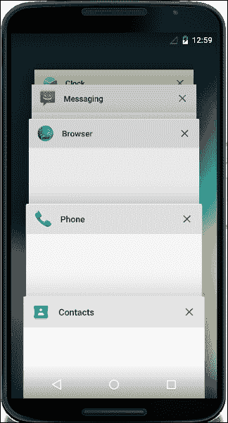

从用户的角度来看，Lollipop 与之前版本最有趣的区别之一是，他们现在将在电视、汽车以及可穿戴设备，如手表和眼镜上遇到它。那些拥有这些可穿戴设备的人无疑会想要这些利用 Lollipop 引入的两个新传感器（如心率传感器和倾斜传感器）的应用程序。

## 从开发者的角度来看，Lollipop

从开发者的角度来看，Android 5 提供的不仅仅是更漂亮的 UI、改进的电池寿命和更好的锁屏。对于我们来说，超过 5,000 个新 API、全新的设计语言以及数十个新功能和技术的出现，Android 5 为我们提供了迄今为止最强大的工具集。Android 现在不仅更强大，而且编程起来也比以前更容易。有了真正有帮助的 IDE 和为易用性而设计的 API，开发应用程序从未如此简单或令人畏惧。如果你想把你的想法变成现实，那么 Android 5 就是你的选择。现在比以往任何时候都更真实，我们受限于的只有我们想象力的力量。

### 材料设计

材料设计 UI 范式远不止是一个吸引人且易于理解的界面。它是一种严肃的设计语言，其中包含一些关于我们如何与设备互动的重要观点。受到对未来材料可能行为想法的启发，这种材料可以被视为一个动态且响应式的纸张片段，它可以移动、改变形状和大小、分裂、合并，并且存在于三维空间中。正是这个额外的维度，加上实时可编程的阴影，赋予了材料设计其深度感。在材料上显示内容的方式也是动态的，谷歌建议我们将其视为“智能墨水”。在构建使用材料设计的应用程序时，需要考虑一些设计规则，我们将在后续章节中讨论这些规则。从实际的角度来看，SDK 为我们提供了两种材料主题版本（浅色和深色）和两个小部件：`CardView`用于简单内容，`RecyclerView`用于列表。我们还可以定义和自定义应用程序使用的阴影、动画和可绘制元素。

### 其他设备

Lollipop 为我们开发者提供的最激动人心的机会之一是能够为除手机和平板电脑以外的设备创建应用程序。Android 5 使得编写适用于从手表大小的屏幕到家庭影院大小的屏幕的应用程序成为可能，包括任何介于两者之间的尺寸。

#### 电视

Android 5 使得为电视编码与为手机编码非常相似。主要区别在于尺寸、观看距离以及电视应用程序通常使用遥控器和 D-pad 进行导航的方式。Android 5 SDK 配备了专门设计的主题和布局，这使得我们能够轻松地将为平板电脑构建的应用程序部署到电视上，反之亦然。

#### 可穿戴

当涉及到为可穿戴设备设计应用时，功耗和屏幕尺寸受限等问题成为一些更为重要的决定因素。因此，Android 5 对可穿戴应用实施了严格的时间超时策略。由于所有 Android 可穿戴应用都需要首先在手机上安装，我们有在可穿戴设备或父设备上展示内容的机会。尽管存在这些限制，并且并非所有功能都可在可穿戴设备上使用（例如网页浏览），但新增的心率传感器 API 为那些对创建基于健康和健身的应用感兴趣的开发者提供了新的和令人兴奋的机会。

#### 自动

在我们的汽车中使用的 Android 提供了 Lollipop 引入的另一个新领域。这里的重点完全在于安全：车内应用只允许运行消息和音频功能。这意味着在为汽车开发应用时，我们需要考虑哪些功能会因为安全原因而被禁用。

这就是我们现在需要的所有理论和背景知识。现在是时候开始工作并设置我们的工作空间了。

# 安装和配置开发环境

在我们甚至开始使用 Android SDK 之前，我们需要确保已经安装了最新的 Java 开发工具包（JDK）。你很可能已经安装了它，但如果你不确定，请在命令行中输入`java -version`，希望你会看到类似以下的内容：

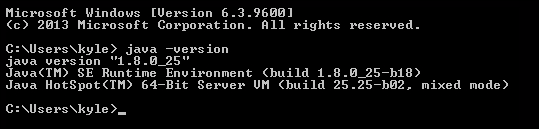

### 注意

注意，Android 5 需要 Java 1.7 或更高版本。

## 安装 SDK

如果你只有 Java 运行时环境（JRE），你可以从[`www.oracle.com/technetwork/java/javase/downloads/jdk8-downloads-2133151.html`](http://www.oracle.com/technetwork/java/javase/downloads/jdk8-downloads-2133151.html)下载 JDK。你还需要记录 JDK 在你的计算机上的安装位置。它可能类似于`C:\Program Files\Java\jdk1.8.0_25`。让我们开始安装，按照以下步骤操作：

1.  下载并安装 Android Studio 和 SDK。它们可以在[`developer.android.com/sdk/index.html`](http://developer.android.com/sdk/index.html)找到，并且应该作为一个单独的可执行文件捆绑在一起。

1.  运行可执行文件，按照向导操作，确保安装所有组件，如下面的截图所示：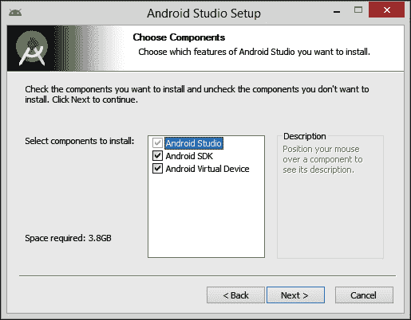

1.  在运行 Android Studio 之前，我们需要设置一个环境变量，使其指向我们的 JDK。从控制面板的**系统属性**窗口中，选择**高级**选项卡，然后选择**环境变量...**按钮。添加一个名为`JAVA_HOME`的新用户变量，并将它粘贴到之前提到的 JDK 路径中：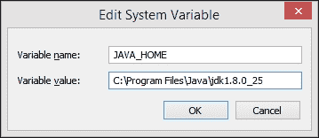

## 管理 SDK 工具

在我们开始构建和测试任何应用之前，还需要一两个工具。SDK 将工具、平台和设备系统镜像分开，使我们能够只下载我们需要的包或那些针对我们项目的特定包。

Android SDK 管理器是我们用来做这件事的程序。它可以从 Android Studio 运行，或者作为 SDK 根目录下的独立应用程序运行，通过执行`SDK Manager.exe`文件。现在，我们将从 Android Studio 环境中运行它。这可以通过在工具栏中点击 SDK 管理器图标在打开的项目中完成，或者从配置页面的快速启动屏幕中完成。

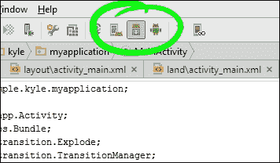

1.  打开 SDK 管理器；我们可以看到有三个部分：一个**工具**文件夹，一个从 Android 1.5 开始的历史 API 平台文件夹列表，以及一个** Extras**文件夹。

1.  打开**工具**文件夹。在顶部，你会看到**Android SDK Tools**和**Android SDK Platform-tools**。这些将代表可用的最新工具，并且两者都必须安装。

    在此之下，你会看到一个构建工具列表，由于本书专注于 Lollipop，我们只需要安装最新版本。

    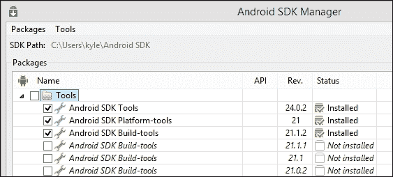

1.  接下来是平台列表，我们只需要选择适用于我们的 Lollipop 开发者的平台，这意味着任何 API 级别为 21 或更高的平台。

    在某个时候，你可能想要在更早的平台测试你的应用以覆盖尽可能广泛的市场，但由于本书专注于 Android 5，安装最新的平台就足够了。选择此文件夹中的所有项目。

    **Extras**文件夹中有几个实用的工具。特别是**Android Support Library**和**Google Play services**，它们提供了广泛的额外 API。如果你计划在连接到 PC 的实体设备上测试你的应用，那么你需要**Google USB Driver**，如果你有较新的英特尔处理器，你将需要硬件加速器来运行模拟器。选择下面显示的包，并安装它们。

    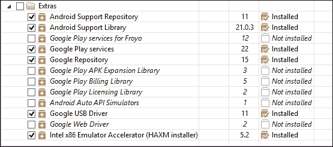

我们现在准备好创建我们的第一个应用了，但首先，关于硬件加速的一个注意事项。模拟器加速器需要手动执行，可以在 SDK 文件夹下的`extras\intel\Hardware_Accelerated_Execution_Manager\intelhaxm-android.exe`中找到。根据你的系统，你可能还需要在 BIOS 中启用虚拟化。

Android 软件定期更新，定期检查 SDK 管理器以获取更新是非常有价值的，尤其是在开始新项目之前。

### 小贴士

很遗憾，由于 Android 系统处于持续开发中，安装过程并不总是像这里显示的那么简单。谷歌会尽力解决出现的问题，如果遇到任何问题，可以访问网页 [`tools.android.com/knownissues`](http://tools.android.com/knownissues) 获取非常有用的信息。

# 创建“Hello World”应用程序

最后，是时候构建我们的第一个应用程序了。它几乎什么都不会做，但将让我们详细了解 Android Studio 如何构建应用程序。我们将看到哪些文件和代码会自动为我们生成，并通过以下步骤掌握项目的目录结构：

1.  启动 Android Studio，从起始屏幕选择**创建新的 Android Studio 项目**。

1.  按照向导操作，接受建议的值，确保您选择了**手机和平板**的设备类型以及最低 SDK 级别，不低于 API 21。

1.  选择**空白活动**模板，并接受向导在最终屏幕上建议的字段值，然后点击**完成**。短暂的暂停后，IDE 将打开。![创建“Hello World”应用程序]

初看起来，IDE 可能显得令人畏惧，但如果我们逐个元素地接近它，实际上是非常直接的。看看左侧的面板——它显示了项目的目录结构。有两个主要分支，**app**和**Gradle Scripts**。当涉及到打包我们的应用程序时，我们将回到 Gradle，但现在，展开**app**分支。

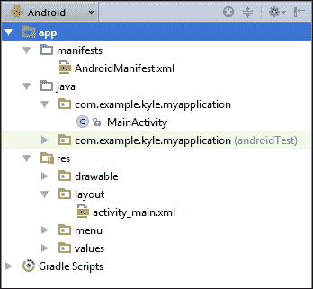

这里有三个主要部分，`manifests`、`java`和`res`（代表资源）。除了这个目录结构，Android Studio 还会为我们自动生成几个代码文件，因此当我们第一次创建项目时，包括以下内容：

+   `manifest`文件声明了我们的应用程序的许多更广泛的属性，例如用户所需的权限。可以通过双击`AndroidManifest.xml`节点来打开、查看和编辑它。

+   Android 项目将布局数据和过程代码分开。我们创建的单一活动的布局信息可以在名为`activity_main.xml`的 XML 文件中找到。有两种方式查看此文件：设计视图，它显示小部件列表和手机图像；以及文本视图，可以通过面板底部的**文本**选项卡访问。我们可能需要的任何可绘制内容、字符串和菜单定义也都存放在`res`目录中。

+   当我们创建项目时，IDE 也会创建一个名为`MainActivity`的 Java 类。一开始，它只包含一些空的回调函数，这些函数在 Activity 首次创建、菜单创建以及菜单项被选中时被调用。

Android Studio 和模拟器在运行过程中都会生成大量的临时文件。这可能导致你的防病毒软件出现性能问题。如果你愿意，为 Android 目录设置排除规则可以显著加快软件的速度。

## 在物理设备上测试应用

现在是时候看看我们的应用在实际设备和模拟器上的样子了。要在实际手机或平板上运行项目，你首先必须从 SDK 管理器下载 Google USB 驱动程序并在手机设置中启用 USB 调试。连接你的手机并点击 IDE 主工具栏上的**运行**按钮，或者从菜单中选择**运行**。确认你使用的设备后，应用将被安装并启动。

# 设置虚拟设备

我们可能无法总是访问我们希望应用运行的所有硬件，但有了 Android 虚拟设备，我们可以创建几乎任何我们想象中的形态，并在这些设备上测试我们的应用。让我们通过以下步骤设置一个虚拟设备：

1.  从主工具栏打开 AVD 管理器：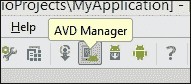

1.  我们可以简单地选择一个预配置的设备，但要更好地理解 AVD 的工作原理，请点击**创建虚拟设备...**按钮。

1.  从**类别**列表中选择**手机**。

1.  选择一个展示的手机。我选择了**Nexus 6**，但这并不重要。

1.  点击**克隆设备...**按钮，以保持原始设备不变。

1.  以下页面允许我们编辑设备的硬件配置文件。在这里，我们可以选择屏幕大小、内存容量和传感器等特性。保持一切不变，但快速查看一下可用的选项，以备后用。

1.  点击**完成**。

1.  你将返回到硬件选择屏幕。和之前一样，从**类别**列表中选择**手机**，现在你会找到我们刚刚克隆的 AVD。选择它并点击**下一步**。

1.  选择一个 API 级别为 21 或更高且目标为 5 或更高的系统镜像，然后点击**下一步**。

    ### 小贴士

    如果你启用了英特尔硬件加速，则选择**x86**或**x86_64**作为 ABI。否则，你将不得不使用 ARM。在本演示中，我将假设你正在使用 ARM ABI。

1.  以下页面主要用于验证我们的设置，但也给了我们调整缩放和提升模拟器性能的机会。是否调整缩放将取决于你正在工作的屏幕和模拟设备的分辨率。同样，通过利用你自己的计算机 GPU 加速模拟器性能或通过快照加快启动时间的选择将取决于你的硬件和项目目的。

1.  点击**完成**。

在虚拟设备上运行应用与在实际手机上运行没有区别，唯一的区别是选择哪个设备。

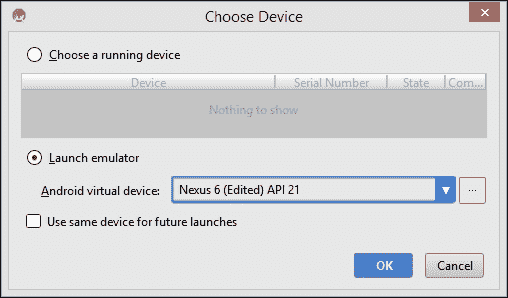

如你所想，AVD 的触摸屏可以用鼠标操作。可以通过按下左*Ctrl* + *F12*来旋转设备。此外，可以通过*F7*键来按下电源按钮，可以通过*Ctrl* + *F5*和*Ctrl* + *F6*来调节音量大小。

这基本上结束了我们对 Lollipop、Android Studio 和 SDK 的快速浏览。在我们开始实际编程之前，还有一个值得一看的最后工具，那就是**Android 设备监控器**。

## 监控设备

再次运行应用，无论是在设备上还是在模拟器上，但首先打开 Android 设备监控器。它可以在主工具栏上找到，位于 SDK 管理器右侧。设备监控器提供了对我们设备内部实际发生情况的非常有用的视图，以及一些有趣的操控方式。通过在编辑器左下角的图标中选择 Android，可以直接从 IDE 中获取设备监控器的简化版本。

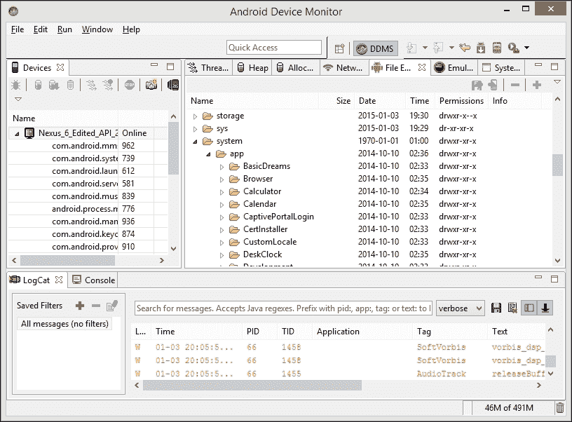

除了大量有用的调试信息外，设备监控器还直接提供了对数据的访问，通过文件浏览器和允许我们发送调用、短信消息并将其设置为虚假位置的工具。

### 小贴士

**设备**工具栏中的相机图标可以用来截取全尺寸屏幕截图，即使屏幕上的设备被缩放。

# 摘要

对于一个入门章节来说，我们已经涵盖了相当多的内容，但我们已经遇到了我们以后需要的几乎所有基本工具。到目前为止，你将拥有一个功能齐全且最新的 IDE，并且知道如何在 AVD 上创建和测试应用。你已经看到了在创建 Android 项目时生成的一些重要文件和资源，现在你应该理解这些文件在项目中的位置。

在浏览了我们开发环境中最显著的功能之后，我们现在可以深入挖掘，看看我们如何构建复杂和动态的布局，以及如何通过 Java 代码使这些设计栩栩如生。
