# 第二章：构建 UI

**Material Design** UI 范式为 Android 平台带来了全新的外观和感觉。这种新的方法旨在为 Android 应用程序提供一个干净、简单的外观，具有直观的控件和动画。谷歌谈论虚拟纸张和虚拟墨水，这个概念在新屏幕组件（或小部件）卡片（或`CardView`）中最为明显，它不同于之前的 Android 小部件，可以投射阴影并具有圆角。


在我们将第一个`CardView`小部件放置到布局中之前，我们可以开始利用 Material Design，通过应用和自定义一个材质主题。这些主题允许我们定义一些基本颜色和属性，然后自动应用于我们的应用程序，赋予它一个品牌身份，帮助用户轻松识别我们的应用程序。

在创建完我们的布局后，我们可以看到 Java 是如何用来提供功能的。在这里，我们将使用一个按钮来启动一个简单的 Material Design 动画，然后将其应用到我们的布局中，以处理屏幕旋转，并为有视觉障碍的用户提供图像的文本上下文。

在本章中，我们将涵盖以下主题：

+   将材质主题应用到我们的应用程序中

+   应用您的品牌颜色

+   理解 Material Design 颜色指南

+   向相对布局添加新的小部件

+   编写一些 Java 代码来检测按钮点击

+   编写代码以生成动画

+   使用 Gradle 控制台观察构建过程

+   为图像应用可访问性选项

+   创建适用于不同屏幕方向的布局

在本章中，我们将继续开发在前一章中开始创建的`Hello World`应用程序，并使用它来演示一个简单的动画。代码可以从 Packt Publishing 网站下载，名称为`Hello World - Chapter 2`。

# 应用 Material Design 主题

Android 主题控制着应用程序的一般外观，如默认背景颜色、文本颜色和大小。在 Android 5 之前，Holo 主题是最广泛使用的内置主题，您可以通过在**设计**选项卡中查看`activity_main.xml`文件顶部点击**App Theme**按钮来预览它。

### 小贴士

注意，当在手机或模拟器上运行应用程序时，预览主题不会对应用程序产生影响，因为这必须在代码中实现。

所有 Android 主题都高度可配置，没有比材质主题更可配置的，它允许我们仅用几行代码就设置一个应用于整个应用程序的颜色方案，并且与它的前辈不同，还可以更改工具栏和导航栏的颜色。以下练习详细说明了如何将这种品牌应用到我们在上一章中设置的项目中：

1.  从上一章打开`Hello World`项目。

1.  如果它还没有打开，请从菜单中使用**视图** | **工具窗口** | **项目**打开**项目**工具窗口。

1.  定位到`res/values`文件夹，并右键单击它。

1.  从菜单中选择**新建** | **XML** | **值 XML 文件**，并将文件命名为`colors`。

1.  按照以下方式填写`colors.xml`文件：

    ```java
    <?xml version="1.0" encoding="utf-8"?>
    <resources>
      <color name="primary">#FF9800</color>
      <color name="primary_dark">#F57C00</color>
      <color name="accent">#03A9F4</color>
      <color name="text_primary">#DF000000</color>
      <color name="text_secondary">#8A000000</color>>
    </resources>
    ```

1.  打开`res/values/styles/styles.xml (v21)`文件，并按照以下方式完成它：

    ```java
    <?xml version="1.0" encoding="utf-8"?>
    <resources>

      <style name="AppTheme" parent="android:Theme.Material.Light">
        <item name="android:colorPrimary">@color/primary</item>
        <item name="android:colorPrimaryDark">@color/primary_dark</item>
        <item name="android:colorAccent">@color/accent</item>
        <item name="android:textColorPrimary">@color/text_primary</item>
        <item name="android:textColor">@color/text_secondary</item>
        <item name="android:navigationBarColor">@color/primary_dark</item>
      </style>
    </resources>
    ```

1.  现在，您可以在手机或模拟器上运行应用，以查看我们的品牌颜色是如何应用的：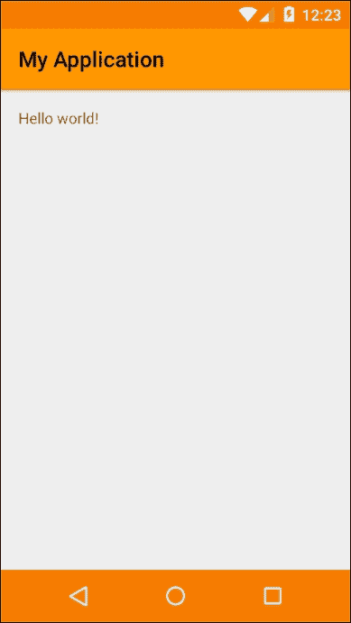

### 小贴士

注意，并非所有材料主题颜色都会在标准的 Android AVD 上显示，特别是状态栏和导航栏。要查看更改，您需要一个真实设备或第三方模拟器。

能够将我们自己的颜色方案应用到之前不可编辑的 UI 元素，如状态栏和导航栏，这是一个巨大的优势。这不仅让我们能够控制整个屏幕的外观，而且让我们的应用具有可识别和独特的风格。

Android 提供了`colorPrimaryDark`和`navigationBarColor`等字段，作为在应用中应用我们的颜色方案的便捷方式。通常建议导航栏保持黑色，这里仅通过演示进行了着色。我们没有使用所有可能使用的颜色属性；如果我们想使用，我们可以使用`windowBackground`和`statusBarColor`设置窗口背景颜色，这将覆盖默认的`colorPrimaryDark`设置。

### 小贴士

注意，`colorAccent`在此演示中不可见。它用于开关、滑块和可编辑的文本视图等。它包含在这里，因为我们将在整本书中使用这个主题（或您选择的颜色），随着我们的进展，`colorAccent`的包含将变得明显。

在 IDE 的帮助下，为我们的主题选择颜色变得非常容易，正如你所看到的，我们定义的颜色在侧边栏中显示：

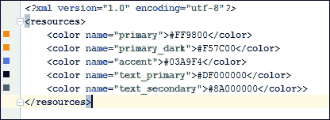

从`colors.xml`文件中，我们可以点击这些颜色以生成一个动态的颜色轮，供我们选择。虽然我们可以自由地为我们主题选择任何喜欢的颜色，但 Google 设计指南建议从推荐的色调中选择颜色，完整的列表可以在[`www.google.com/design/spec/style/color.html`](http://www.google.com/design/spec/style/color.html)找到。此外，Google 还建议主要颜色应具有值 500，较深的版本应为 700。

在`colors.xml`文件中，可以看到文字颜色是用 alpha 通道定义的。

Google 建议我们使用透明度来产生各种文字的阴影。特别是，他们建议我们的主要文字的透明度约为 87%，次要文字的透明度约为 54%。当处理深色背景上的白色文字时，应使用 100% 和 70% 的透明度值。文本提示的透明度应约为 28%，无论是背景还是前景。

你会注意到有两个`styles.xml`文件，一个是我们在`v21`版本中使用的，另一个与同一个名字。这个其他样式文件用于在需要使我们的应用向后兼容时提供替代主题。我们将在适当的时候讨论这个问题，但现在可以安全地忽略其他样式文件。

材料设计指南不必严格遵循，尤其是当你设计一个全屏应用，比如游戏时。它们的存在是为了帮助开发者构建在整个平台上提供一致体验的应用，而你如何严格遵循这些指南完全取决于你。

看过如何轻松地将个性化主题应用到我们的应用后，我们现在可以开始向布局添加更多视觉组件，并查看它们如何随后用 Java 编程控制。我们将继续使用`Hello World`项目，并使其变得更有趣，我们将添加一些简单的 Android 5 动画。

# 添加动画小部件

就像许多编程语言一样，设计和功能基本上是分开处理的。我们使用 XML 来设计我们的布局，使用 Java 来提供它们的功能。在这里，我们将看到这两者是如何完成的，并将分别处理每个。

## 设计 XML 布局

我们将使用图形设计视图来构建这个 UI，但值得在每个步骤后从底部的标签检查文本视图，看看我们做出的更改是如何应用到 XML 中的。

1.  打开`Hello World`项目，然后是`activity_main.xml`文件。

1.  点击底部的**设计**标签以查看设备预览。

1.  将`TextView`控件拖动到屏幕中间，就像这样：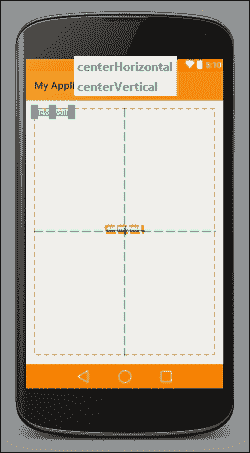

1.  从左侧的**调色板**中拖放一个**按钮**小部件到屏幕的底部中央。

1.  从位于**TextView**下方的**调色板**中拖动一个**ImageView**控件。顶部的提示应该读作：

    ```java
    centreHorizontal
    below=<generated>

    ```

1.  在选择**ImageView**的情况下，或者通过在**组件树**面板中选择它，在下面的**属性**面板中找到`src`并点击**....**按钮以打开此对话框：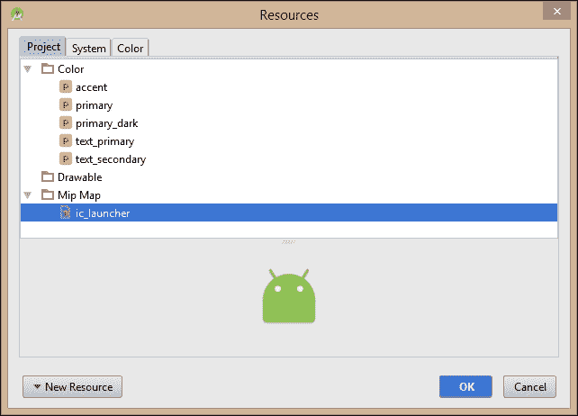

1.  选择**Mip Map** | **ic_launcher**并点击**确定**。

1.  在预览窗口中选择**ImageView**并按*Ctrl* + *C*，然后按*Ctrl* + *V*。

1.  将**ImageView**副本放置在我们刚刚创建的一个右侧。

1.  重复此过程，将第三个**ImageView**放置在左侧，这样布局的下半部分看起来就像这样：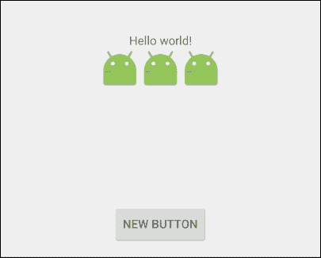

1.  现在，使用底部的标签打开我们布局的**文本**视图。

1.  定位到**按钮**节点，并点击显示`android:text="New Button"`的行。一个琥珀色的快速修复灯泡会出现，同时会显示有关硬编码字符串的警告。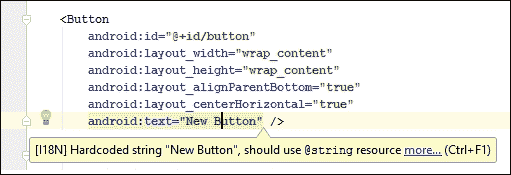

1.  点击**快速修复**下拉菜单并选择**提取字符串资源**。

1.  在结果对话框中，将**资源名称**设置为`button_text`并点击**确定**。

1.  以**文本**视图打开文件，并将此行添加到`RelativeLayout`元素中：

    ```java
    android:id="@+id/view_group"
    ```

1.  然后，将此行添加到**TextView**：

    ```java
    android:textAppearance="?android:attr/textAppearanceMedium"
    ```

    就设计布局而言，这就完成了！

### 小贴士

您可以使用*Ctrl* + *Alt* + *L*来自动格式化任何代码。*Ctrl* + *Alt* + *Shift* + *L*将打开重排对话框。

所有 Android 布局设计在其根部都有一个名为**ViewGroup**的容器对象，其中放置了所有其他图形对象。这包括其他 ViewGroup，尽管具有许多嵌套 ViewGroup 的复杂布局可能会对性能产生负面影响。

我们在这里使用的 ViewGroup 小部件容器是**RelativeLayout**。还有几种其他类型的布局，每种布局都适合特定的目的，我们将在整本书中遇到这些布局。我们在这里使用的 RelativeLayout 小部件容器允许我们定义小部件相对于其他小部件的位置。例如：

```java
android:layout_below="@+id/textView
```

当涉及到设计将在不同尺寸和比例的屏幕上运行的布局时，这非常方便。

在生成布局文件方面，我们有三种工具可供使用。我们有（几乎）所见即所得的设备预览窗口，允许我们定位和调整小部件的大小，**属性**面板允许我们设置特定的值，也许最强大的是**文本**编辑窗口，它提供了对我们设计每个方面的控制。

我们使用`android:attr/textAppearanceMedium`设置了文本的大小。我们本可以使用类似`android:textSize="42sp"`的东西来精确设置大小，但使用`textAppearanceMedium`、`textAppearanceLarge`或`textAppearanceSmall`会考虑用户在手机上配置的文本设置。

我们刚刚所做的一切中，最重要的方面是每个小部件都有一个标识符，形式为`android:id="@+id/some_unique_identifier"`。这些 ID 是我们从 Java 代码中在运行时引用和控制小部件的方式。

我们出于方便使用了内置的应用程序图标作为我们的**ImageView**控件，但我们也可以提供自己的图像，将其存储在`res(ources)/drawable`文件夹中，并使用其文件名（不带扩展名）作为其 ID。我们将在后面做很多这样的事情，所以在这里不必担心。如果您查看`mipmap`文件夹，您将看到有四个`ic_launcher`图标，针对不同的屏幕密度。为了为所有可用的屏幕密度提供高质量图标，您需要提供所有四个图标。

当我们在屏幕上创建按钮时，IDE 为我们提供了文本**新按钮**。尽管像这样的硬编码字符串可以完美工作，但并不推荐这样做，因为您将无法提供其他语言的翻译。

我们的布局已经就绪，现在我们可以继续让它执行一些操作。在这里，我们将应用一些新的 Android 5 动画，这些动画在按钮被点击时生效。

## 使用 Java 控制小部件行为

Android 5 引入了一种新的、更简单的屏幕元素动画方式。这些动画在从一个屏幕切换到另一个屏幕时非常有用，并且可以直观地向用户展示应用正在做什么。这个应用只有一个屏幕（`Activity`），所以我们将只让我们的小部件飞离屏幕，然后返回。但在开始之前，我们需要配置 IDE 以自动导入应用将使用的 Java 库。按照以下步骤查看如何完成这两个任务：

1.  从 **文件菜单** 选择 **设置** | **编辑器** | **通用** | **自动导入**，并勾选以下所有复选框：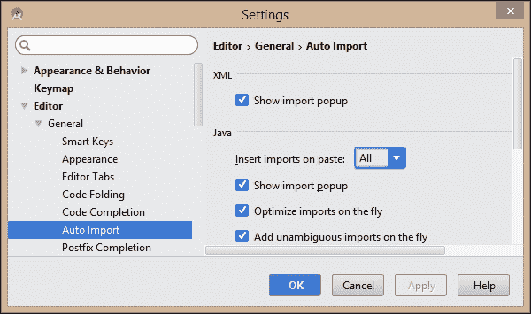

1.  打开 `MainActivity.java` 文件。

1.  在类顶部添加以下字段：

    ```java
    public class MainActivity extends Activity {
      private ViewGroup viewGroup;
      private TextView textView;
      private ImageView imageView, imageView2, imageView3;
      private Button button;

    ```

1.  在 `onCreate()` 方法中，在 `setContentView(R.layout.activity_main);` 行下方添加以下代码：

    ```java
    viewGroup = (ViewGroup) findViewById(R.id.view_group);

    textView = (TextView) findViewById(R.id.textView);
    textView.setText("Animation demo");

    imageView1 = (ImageView) findViewById(R.id.imageView);
    imageView2 = (ImageView) findViewById(R.id.imageView2);
    imageView3 = (ImageView) findViewById(R.id.imageView3);
    ```

1.  在此之下，添加 `Button` 控制的代码如下：

    ```java
    button = (Button) findViewById(R.id.button);
    button.setText("OK");
    button.setOnClickListener(new View.OnClickListener() {

      @Override
      public void onClick(View v) {
        TransitionManager.beginDelayedTransition(viewGroup, new Explode());
        toggle(textView, imageView, imageView2, imageView3);
      }
    });
    ```

1.  创建一个名为 `toggle()` 的新方法，并按照以下方式完成它：

    ```java
    private static void toggle(View... views) {
      for (View v : views) {
        boolean isVisible = v.getVisibility() == View.VISIBLE;
        v.setVisibility(isVisible ? View.INVISIBLE : View.VISIBLE);
      }
    }
    ```

1.  应用现在可以在模拟器或连接的手机上进行测试。在 IDE 工具栏上点击运行图标：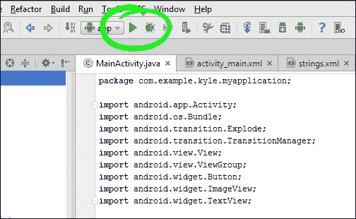

虽然代码易于理解，但它涵盖了非常关键的一些点。首先，是 `onCreate()` 方法。该方法在 Activity 启动时立即被调用，通常是通过应用程序图标，并将成为你将创建的几乎所有 Android 应用的起点。我们为我们创建的前三条线填充了布局。然后我们使用 `findViewById()` 将我们的布局小部件与 Java 实例关联起来。

### 注意

注意，为了方便，我们在这里使用了编辑器建议的名称。将来，我们将使用 `textView` 形式声明 Java 实例，以及 `text_view` 用于 XML 对应物。

我们还使用 `setText()` 方法更改了我们两个小部件内的文本。我们也可以在 XML 中这样做，但了解如何使用 Java 动态完成此操作非常有用。

我们附加到按钮上的 `OnClickListener()` 接口为我们提供了 `onClick()` 方法，使我们能够控制在小部件被点击时执行哪些操作。在这个 Activity 中只有一个按钮，所以我们为它创建了一个特定的 `OnClickListener()`。通常，我们的应用将拥有多个按钮或可点击控件，正如我们将在下一章中看到的，Activity 本身可以实现一个点击监听器，然后有一个 `onClick()` 方法来处理所有按钮。

动画本身是通过`TransitionManager`类配置和触发的，我们将在本书稍后回到这个话题。现在，值得将术语`Explode()`更改为`Fade()`或`Slide()`。这些更改产生的影响不会让你感到惊讶，但了解它们是可用的很有用。大多数时候，当我们将动画应用到我们的应用中时，它们是为了演示从一个 Activity 到另一个 Activity 的过渡，而不仅仅是作为装饰，就像我们在这里所做的那样。

一旦你点击运行图标，构建过程可能会相当慢，尤其是在较旧的机器上。然而，有一些方便的工具可以帮助我们观察这个过程。将鼠标悬停在 IDE 左下角的小图标上，并选择**Gradle 控制台**。

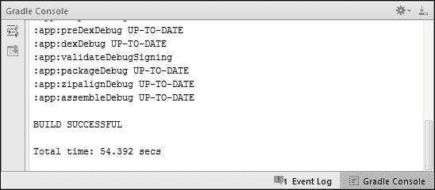

不必理解 Gradle 控制台输出的内容，但看到在较长的构建过程中过程没有停止是令人放心的。以相同的方式可以访问的其他两个非常有用的窗口是**Android**和**运行**窗口。这些也可以通过键盘上的*Alt* + *4*和*Alt* + *6*分别打开。

如果你花了一些时间实验上述应用，你会注意到当模拟器或设备旋转 90 度时，有一两件事情并没有按我们希望的方式工作。首先，每次设备旋转时动画都会重置。这是因为这，以及任何其他 Activity，都会在方向改变和`onCreate()`方法被重新调用时重新加载。然而，还有几个其他回调方法允许我们拦截这个过程。我们将在稍后更详细地查看 Activity 生命周期，但现在我们将探索第二个问题，即系统在横屏视图中定位我们的文本和图像的方式。

### 小贴士

可以通过按*Ctrl* + *F12*将 AVD 旋转 90 度。按主页键将 AVD 返回到其主页，而*Esc*键与按设备后退按钮相同。

# 创建替代布局

当运行我们应用之一的设备旋转到横屏模式时，它引用的 XML 文件与在竖屏模式下的相同。通常这工作得非常好，但设置一个更适合横屏屏幕形状的替代布局非常简单。按照以下步骤创建一个用于横屏查看的替代布局文件。

1.  在**设计**视图中打开`activity_main.xml`文件。

1.  点击左上角的图标，并选择**创建横屏变体**。

1.  拖动并重新排列屏幕上的小部件，以形成更令人愉悦的空间使用。

1.  选择一个`ImageView`控件。然后点击琥珀色的快速修复图标。它会通知你图片缺少`contentDescription`。点击这条消息并完成如下所示的对话框：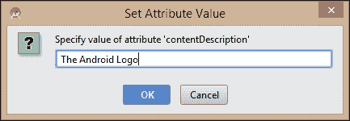

1.  最后，在设备或模拟器上运行应用程序并检查其旋转时的行为。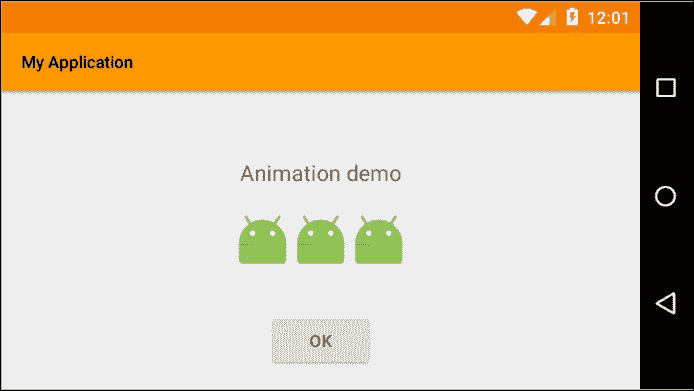

包含一个用于横屏方向的布局文件就像在`res/layout-land`目录中放置一个具有相同名称和控件 ID 的文件，而不是在`res/layout`目录中。然后我们可以以任何我们喜欢的方式编辑此文件，并且当屏幕旋转到横屏方向时，它将自动展开。

由于创建替代布局文件是一项如此快速且简单的任务，我们还探讨了如何为有视觉障碍的用户提供替代输出，形式为图像的内容描述。当有视觉障碍的用户设置了辅助功能选项，并且我们提供了适当的文本替代品时，此描述将被读给用户听。为了简洁起见，我们不会在本书的每个练习中都添加此描述，但建议在打算发布的任何应用程序中都包含此类属性。

### 小贴士

**下载示例代码**

您可以从您在[`www.packtpub.com`](http://www.packtpub.com)的账户中下载您购买的所有 Packt 书籍的示例代码文件。如果您在其他地方购买了这本书，您可以访问[`www.packtpub.com/support`](http://www.packtpub.com/support)并注册以直接将文件通过电子邮件发送给您。

# 摘要

这就结束了我们对 XML 布局与 Java 代码之间关系的介绍。我们看到了如何为各种屏幕尺寸和方向生成布局，以及如何将这些 XML 定义连接到动态的 Java 代码，该代码在运行时控制我们应用程序的行为。值得注意的是，我们看到了`onCreate()`方法是如何用来设置我们的应用程序的，以及它何时被调用以响应设备的旋转。我们利用这一事实，通过创建一个专门为旋转屏幕设计的替代布局来利用这一事实。

在下一章中，我们将探讨如何实现两个最新的 Android 小部件，即`CardView`，它是一个方便且时尚的容器，可以显示我们希望展示的任何信息，以及`RecyclerView`，它以内存高效的方式管理`CardView`控件或其他视图的列表。
