# 第三章。活动和片段

在仅使用单个屏幕或仅使用单个 Activity 的应用程序中，有用的应用程序非常少；我们需要一种方法来在各个 Activity 之间切换，并将信息从一个传递到另一个。一般来说，每个新的 Activity 都需要自己的布局文件，但这并不总是如此；有时我们想要相同的布局，但数据资源不同。在本书的后面部分，我们将构建一个应用程序，作为世界上一些最著名和最受欢迎的旅游景点的导游。我们将从这个旅程开始，构建一个仅针对一个地点的简单示例，其中包括对 Android 5 中引入的`CardView`小部件的介绍，并学习如何从一个 Activity 启动另一个 Activity。

然后，我们将查看片段，它允许我们以模块化的方式构建布局。片段的行为有点像迷你 Activity，可以在运行时动态地添加到 Activity 中，或者可以像其他 ViewGroup 一样在布局文件中定义。我们将构建一个小型计时应用程序，使用片段在数字时钟面和模拟时钟面之间切换。

接下来，我们将在我们的应用程序中包含一个选项菜单，允许用户更改设备上的时间和区域相关设置。我们将在菜单中添加操作图标，以便它可以在 Lollipop 之前称为操作栏的地方显示。最后，我们将利用操作栏的替代品，即工具栏，对其进行自定义，以便它可以放置在屏幕上的任何位置，并包含比其前身更多的功能。

在本章中，我们将：

+   添加`CardView`

+   为`CardView`设置布局

+   添加图片

+   创建第二个 Activity 和布局

+   使用 XML 定义`onClick`行为

+   编程两个 Activity 协同工作

+   使用片段动态更改布局

+   探索翻译编辑器

+   使用 XML 添加静态片段

+   包含一个选项菜单

+   使用意图访问用户设置

+   将菜单图标添加到操作栏

+   用自定义工具栏替换操作栏

# 添加 CardView 小部件

与我们之前遇到的视图不同，`CardView`并不包含在标准 SDK 库中，而是作为（Lollipop 特定的）V7 支持库的一部分，并且不可从图形布局设计模式中获取；因此，在布局中应用它需要更多的工作。

1.  开始一个新的 Android 项目。

1.  设置**应用程序名称**为`Stonehenge Guide`，尽管你可以称它为任何你喜欢的名字。

1.  从下一页选择**手机和平板**的设备类型和**空白 Activity**。

1.  保持其他选项不变，等待项目构建。

1.  在设计视图中打开`activity_main.xml`文件，并删除我们在创建项目时自动生成的`"Hello World!"`文本视图。

1.  为了完整性，还请在`res/value/strings.xml`文件中删除`"Hello World!"`字符串资源。

1.  编辑 `styles.xml` (v21) 文件并创建一个 `colors.xml` 文件以实现 Material Design 颜色方案，就像我们在上一章中所做的那样。

1.  从项目资源管理器打开 `Gradle Scripts/build.gradle (Module: app)` 文件：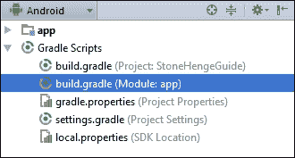

1.  编辑 `dependencies` 部分以匹配以下片段：

    ```java
    dependencies {
      compile fileTree(dir: 'libs', include: ['*.jar'])
      compile 'com.android.support:cardview-v7:22.0.+'
    }
    ```

1.  通过此处显示的工具栏图标同步项目：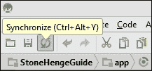

1.  打开 `app/res/values/dimens.xml` 并添加以下三个新尺寸资源：

    ```java
    <dimen name="card_height">200dp</dimen>
    <dimen name="card_corner_radius">4dp</dimen>
    <dimen name="card_elevation">3dp</dimen>
    ```

1.  从 `app/res/layout` 打开 `activity_main.xml` 文件并添加以下 `CardView` 代码，以便完成的布局看起来像这样：

    ```java
    <RelativeLayout 

      android:layout_width="match_parent"
      android:layout_height="match_parent"
      android:paddingBottom="@dimen/activity_vertical_margin"
      android:paddingLeft="@dimen/activity_horizontal_margin"
      android:paddingRight="@dimen/activity_horizontal_margin"
      android:paddingTop="@dimen/activity_vertical_margin"
      tools:context=".MainActivity">

      <android.support.v7.widget.CardView 
        android:layout_width="match_parent"
        android:layout_height="@dimen/card_height"
        android:layout_gravity="center"
        card_view:cardCornerRadius="@dimen/card_corner_radius"
        card_view:cardElevation="@dimen/card_elevation">
      </android.support.v7.widget.CardView>

    </RelativeLayout>
    ```

我们以与上次相同的方式创建了此项目，并且拥有为我们创建的初始活动和布局文件非常有用；这可以在设置大多数新项目时为我们节省大量时间。

如前所述，`CardView` 不是标准库的一部分，这就是为什么我们不得不将其包含在构建文件中，当我们应用其他新的 Lollipop 小部件 `RecyclerView` 时，我们也将不得不做同样的事情。正因为如此，我们不得不再次**同步**项目，以便构建引擎知道要加载哪些库，这与一个人可能导入 Java 库的方式非常相似。在这种情况下，我们只需从 **构建** | **重新构建项目** 菜单项重新构建项目即可，但这并不总是情况，养成全面同步的习惯是个好主意，因为这不仅会重新构建我们的项目，还会检查其他可能的错误，例如缺少资源定义。

### 注意

注意，当我们向 `dimens.xml` 文件添加值时，还有一个 `dimens.xml (w820dp)` 文件。当为宽度超过 820 像素的平板电脑和设备设计布局时，我们会使用此文件，因为我们为较小设备设置的边距和填充可能看起来不正确。

通过检查 `CardView` 的 XML 代码，可以立即明显看出，它的实现方式与我们迄今为止处理的小部件截然不同。像这样包含外部库中的元素非常简单，尽管我们不会在本书中介绍它，但了解有多个第三方库可用，这些库包含许多在其他情况下通过标准 SDK 不可用的功能是有用的。

`CardView` 拥有两个仅限于 Lollipop 的独特属性，我们之前还没有遇到过：`cardCornerRadius` 和 `cardElevation`。这些属性的目的很明显，但值得注意的是，更改它们的效果不会在预览窗格中显示，并且增加高度只会影响小部件的阴影，而不会影响其大小。

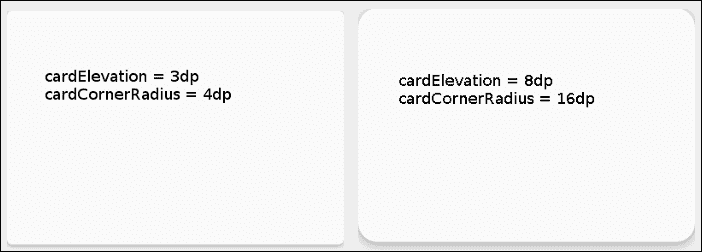

在创建了一个 `CardView` 作为容器之后，现在是为它提供一些内容的时候了。

# 将图像和文本添加到布局中

我们现在将使用 `CardView` 来显示一些基本信息，即一张照片、一个标题和一段简短的文本。为此，你需要找到工作室存储你的项目文件的位置。这个目录将被称为 `AndroidStudioProjects`，并且很可能位于你的主目录或指定的保存位置。

1.  定位你的 `AndroidStudioProjects` 目录，并打开 `\StonehengeGuide\app\src\main\res\drawable` 文件夹。这可以通过在项目资源管理器中右键单击 drawable 并从菜单中选择 **Show in Explorer** 来完成。

1.  找到一个图像并将其保存到 `drawable` 目录中。任何图像都可以；我这里使用的是名为 `stonehenge.png` 的图像，大约是 640 x 480 像素。

1.  打开你的 `res/values/strings.xml` 文件并添加以下字符串：

    ```java
    <string name="title_text">Stonehenge</string>
    <string name="detail_text">One of the most famous sites in the world, Stonehenge is a prehistoric monument located in Wiltshire, England, about 2 miles west of Amesbury and 8 miles north of Salisbury.</string>
    ```

1.  打开 `res/values/dimens.xml` 文件并添加以下尺寸：

    ```java
    <dimen name="frame_width">160dp</dimen>
    <dimen name="card_padding">8dp</dimen>
    ```

1.  我们需要在 `CardView` 内部放置一个 `RelativeLayout`。这在图形设计模式下是不可能的，所以请将一个 `RelativeLayout` 拖动到屏幕上的任何位置，然后编辑 XML 代码，使卡片看起来像这样：

    ```java
    <android.support.v7.widget.CardView 

      android:id="@+id/main_card_view"
      android:layout_width="match_parent"
      android:layout_height="200dp"
      android:layout_gravity="center"
      card_view:cardCornerRadius="3dp"
      card_view:cardElevation="4dp">

      <RelativeLayout
        android:layout_width="match_parent"
        android:layout_height="match_parent"
        android:padding="@dimen/card_padding">
      </RelativeLayout>

    </android.support.v7.widget.CardView>
    ```

1.  接下来，我们将在这个 `RelativeLayout` 中填充一个包含 `ImageView` 和两个 `TextView` 的 `FrameLayout`，使其看起来像这样：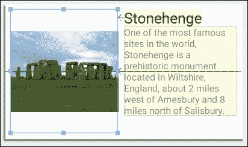

最好的方式是通过 `CardView` 内部 `RelativeLayout` 的完整代码来展示其他设置和属性：

```java
<RelativeLayout
  android:layout_height="match_parent"
  android:layout_width="match_parent"
  android:padding="@dimen/card_padding">

  <FrameLayout
    android:id="@+id/frameLayout"
    android:layout_alignParentStart="true"
    android:layout_centerVertical="true"
    android:layout_height="match_parent"
    android:layout_width="@dimen/frame_width">

    <ImageView
      android:clickable="false"
      android:id="@+id/imageView"
      android:layout_gravity="left|center_vertical"
      android:layout_height="wrap_content"
      android:layout_width="wrap_content"
      android:src="img/stonehenge" />
  </FrameLayout>

  <TextView
    android:id="@+id/title_text_view"
    android:layout_alignParentTop="true"
    android:layout_height="wrap_content"
    android:layout_marginLeft="@dimen/card_padding"
    android:layout_toEndOf="@+id/frameLayout"
    android:layout_width="wrap_content"
    android:text="@string/title_text"
    android:textAppearance="?android:attr/textAppearanceLarge" />

  <TextView
    android:id="@+id/my_text_view"
    android:layout_below="@+id/title_text_view"
    android:layout_height="wrap_content"
    android:layout_marginLeft="@dimen/card_padding"
    android:layout_toEndOf="@+id/frameLayout"
    android:layout_width="wrap_content"
    android:text="@string/detail_text"
    android:textAppearance="?android:attr/textAppearanceSmall" />

</RelativeLayout>
```

正如我们所看到的，任何放置在我们项目中的 `drawable` 目录下的图像文件，都以与其他资源相同的方式对我们变得可访问。放置在这个文件夹中的图像将可供我们的应用程序使用，无论它们运行在哪种设备上。你可能会注意到还有四个其他的 drawable 目录，例如 `drawable-xxhdpi` 文件夹。这些目录在构建适用于广泛屏幕密度的应用程序时特别有用，原因有两个。首先，它们允许我们为支持此类屏幕的用户包含高质量图像，其次，它们可以在屏幕密度较低的设备上节省内存，因为 Android 只加载可以由每个特定物理屏幕支持的图像。

我们在这里遇到的大多数布局功能我们在前面的章节中已经遇到过，没有太多要解释的，除了可能提到的 `ImageView`。值得注意的是，除了使用 `android:src` 将我们的照片与 `ImageView` 关联外，我们还可以使用 `android:background`，它执行一个非常类似的功能，尽管它不尊重图像的原始宽高比。创建完布局后，我们现在可以继续添加另一个 Activity。

# 创建第二个 Activity

到目前为止，我们的应用程序除了显示信息之外什么也不做。所以，接下来我们将通过使其在用户点击图像时在另一个 Activity 中显示图片的较大版本来添加一些功能。正如你将看到的，使用 Android Studio 创建新的 Activity 非常简单。

1.  右键单击项目资源管理器中的 Java 节点，选择 **新建** | **活动** | **空白活动**。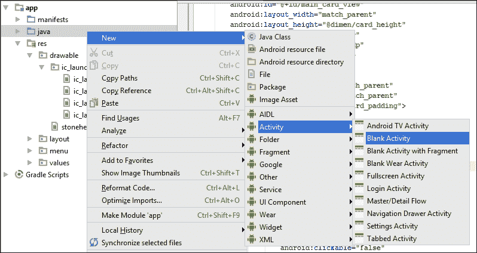

1.  在生成的向导中，将 `ImageActivity` 作为 **活动名称**，将 `activity_image` 作为 **布局名称**，将 `image_menu` 作为 **菜单资源名称**，并将 **标题** 保持不变。

1.  打开 `activity_image.xml` 文件，并在布局中放置一个单独的 `ImageView`，如下所示：

    ```java
    <ImageView
      android:id="@+id/large_image_view"
      android:layout_width="wrap_content"
      android:layout_height="wrap_content"
      android:layout_centerHorizontal="true"
      android:layout_centerVertical="true"
      android:src="img/stonehenge"
      android:onClick="returnToMainActivity"/>
    ```

1.  添加以下字符串资源：

    ```java
    <string name="title_activity_image">Stonehenge</string>
    ```

1.  打开 `MainActivity` 的 Java 文件，并在 `onCreate()` 方法中的 `setContentView(R.layout.activity_main);` 行下添加以下代码：

    ```java
    ImageView mainImageView;
    mainImageView = (ImageView) findViewById(R.id.imageView);

    mainImageView.setOnClickListener(new View.OnClickListener() {

      @Override
      public void onClick(View v) {
        startActivity(new Intent(getApplicationContext(), ImageActivity.class));
      }

    });
    ```

1.  打开 `ImageActivity` 的 Java 文件，并将以下公共方法添加到类中：

    ```java
    public void returnToMainActivity(View v) {
      startActivity(new Intent(getApplicationContext(), MainActivity.class));
    }
    ```

1.  在设备或模拟器上运行应用。

新的活动向导方便地为我们创建了一个 Java 活动和一个布局 XML 文件，但并不是每个活动都需要关联一个 `Layout` 文件。通常，我们可以为许多活动使用相同的布局，前提是每个 Java 活动都有一种选择要访问和显示的数据的方法。

在我们没有意识到的情况下，当我们创建新的活动时，向导还修改了清单文件以包含新的活动。这值得一看，因为有时你不会使用向导来创建活动，在这种情况下，将需要手动修改 `AndroidManifest.xml` 文件。

```java
<activity
  android:name=".MainActivity"
  android:label="@string/app_name" >
  <intent-filter>
    <action android:name="android.intent.action.MAIN" />
    <category android:name="android.intent.category.LAUNCHER" />
  </intent-filter>
</activity>
<activity
  android:name=".ImageActivity"
  android:label="@string/title_activity_image" >
</activity>
```

我们的第二个活动布局文件只包含一个视图，但与之前探索的视图相比有一个显著的不同，那就是使用了 `android:onClick` 属性。之前我们使用 `View.OnClickListener()` 来控制小部件被点击时的行为。在 XML 中声明这为我们提供了另一种实现方式，尽管它缺乏 Java 版本的某些灵活性，但它简单且易于使用。我们只需声明当小部件被点击时调用的方法，然后在 Java 中添加该方法，这里我们称之为 `returnToMainActivity()`。

### 注意

在前面的章节中，我们让用户点击一个 `Button` 小部件，尽管这似乎是一个明显的选择，但值得注意的是，几乎任何视图或小部件都可以响应点击事件。

`StartActivity()` 方法接受一个 `Intent` 作为其参数。这是任何 Android 应用中的一个重要对象，值得快速查看，因为它不仅在与活动一起工作时是必不可少的，而且在处理服务和广播时也是必不可少的，它们是大多数应用的其他两个主要组件。

### 注意

**服务** 类似于线程，在后台运行，而 **广播** 是系统范围内的消息，任何应用都可能接收并对其做出响应。

**意图**基本上是我们希望我们的应用执行的操作的描述。它们由两部分组成，一个动作和要执行的动作的数据。有几个`Intent()`构造函数，这里我们使用了`Intent(String action, Uri data)`。从一个活动启动另一个活动在许多情况下都是有用的，这里我们通过一个被点击的方法来启动它。当然，还有一个在几乎所有移动应用中都有的熟悉输入功能，即菜单，这是我们接下来要探讨的内容。

# 应用片段

使用两个或多个活动来创建单独的屏幕是包括我们应用中多个页面的直接方法。然而，这并不是唯一的方法，系统还提供了**片段**类。片段类似于 ViewGroups；它们作为活动的一部分存在，但它们创建和销毁的方式使它们更像迷你活动。与活动不同，我们也可以在屏幕上拥有多个片段。

在 Android 应用中部署片段有两种方式。首先，它们可以直接添加到我们的布局 XML 文件中，使用`<fragment>`标签，并且它们也可以在运行时动态添加和删除。虽然我们现在将探讨这两种技术，但第二种，动态方法使片段变得非常灵活和有用。

除了通常的主活动布局和代码之外，每个片段还有一个 XML 和一个 Java 组件，这使得编码比单独使用活动要复杂一些。在接下来的练习中，我们将创建一个简单的应用，允许我们在运行时添加和替换片段。

1.  开始一个新的 Android Studio 项目。

1.  选择**空白活动**模板（不是**带有片段的空白活动**），将项目命名为`Fragment Example`或类似名称，然后打开`activity_main.xml`文件。

1.  通过直接编辑代码将布局从`RelativeLayout`更改为`Linear`布局。编辑器应该根据您的输入更改关闭标签。

1.  使用此行设置布局的垂直方向：

    ```java
    android:orientation="vertical"
    ```

1.  将`TextView`替换为这两个按钮：

    ```java
    <Button
      android:id="@+id/button_analog"
      android:layout_width="match_parent"
      android:layout_height="wrap_content"
      android:text="@string/button_analog_text" />

    <Button
      android:id="@+id/button_digital"
      android:layout_width="match_parent"
      android:layout_height="wrap_content"
      android:text="@string/button_digital_text" />
    ```

1.  点击行`android:text="Analog";`，在侧边栏会出现一个琥珀色的快速修复，如下所示：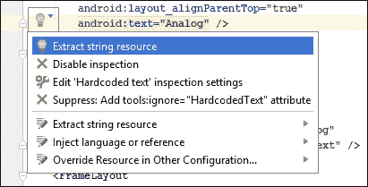

1.  点击它选择**提取字符串资源**，在结果对话框中命名字符串为`button_analog_text`。

1.  对其他按钮也做同样的操作，将其命名为`button_digital_text`，在这些按钮下方添加这个`FrameLayout`：

    ```java
    <FrameLayout
      android:id="@+id/fragment_container"
      android:layout_width="match_parent"
      android:layout_height="match_parent" />
    ```

1.  在项目资源管理器中的`layout`文件夹上右键单击，选择**新建** | **新建资源文件**。将其命名为`fragment_analog`，并给它一个`RelativeLayout`根元素，如下所示：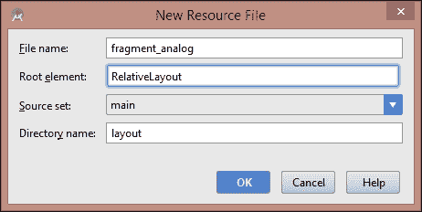

1.  打开文件并在根元素内插入这个`AnalogClock`：

    ```java
    <AnalogClock
      android:layout_width="wrap_content"
      android:layout_height="wrap_content"
      android:layout_centerHorizontal="true"
      android:layout_centerVertical="true" />
    ```

1.  在项目资源管理器中选择`fragment_analog.xml`，使用*Ctrl* + *C*和*Ctrl* + *V*创建一个副本，并将其命名为`fragment_digital.xml`。

1.  在这个新文件中，将`AnalogClock`替换为这个`TextClock`：

    ```java
    <TextClock
      android:layout_width="wrap_content"
      android:layout_height="wrap_content"
      android:layout_centerHorizontal="true"
      android:layout_centerVertical="true"
      android:textSize="48sp" />
    ```

1.  在项目资源管理器中定位并选择包含你的 `MainActivity.java` 文件文件夹。它将具有与你的包相同的名称。

1.  在其上下文菜单中，选择 **新建** | **Java 类** 并将其命名为 `FragmentAnalog`。填写类如下：

    ```java
    public class FragmentAnalog extends Fragment {

      @Override
      public View onCreateView(LayoutInflater inflater,
        ViewGroup container,
        Bundle savedInstanceState) {
        return inflater.inflate(R.layout.fragment_analog, container, false);
      }
    }
    ```

1.  将此文件复制一份，并将其命名为 `FragmentDigital.java`。

1.  仅更改返回语句中的布局引用：

    ```java
    return inflater.inflate(R.layout.fragment_digital, container, false);
    ```

1.  打开 `MainActivity.java` 文件并更改类声明，使其实现一个点击监听器，如下所示：

    ```java
    public class MainActivity extends Activity implements View.OnClickListener
    ```

1.  这将生成一个错误和一个红色快速修复。选择 **实现方法** 以将 `onClick()` 方法添加到类中。

1.  将这些 `Button` 字段添加到类中：

    ```java
    private Button analogButton, digitalButton;
    ```

1.  在 `onCreate()` 方法的末尾包含以下四行：

    ```java
    analogButton = (Button) findViewById(R.id.button_analog);
    analogButton.setOnClickListener(this);
    digitalButton = (Button) findViewById(R.id.button_digital);
    digitalButton.setOnClickListener(this)
    ```

1.  按照以下方式完成 `onClick()` 方法：

    ```java
    @Override
    public void onClick(View v) {
      Fragment fragment;
      if (v == analogButton) {
        fragment = new AnalogFragment();
      } else {
        fragment = new DigitalFragment();
      }
      replaceFragment(fragment);
    }
    ```

1.  按照以下方式实现 `replaceFragment()` 方法：

    ```java
    public void replaceFragment(Fragment fragment) {
      FragmentManager manager = getFragmentManager();
      FragmentTransaction transaction = manager.beginTransaction();
      transaction.setTransition(FragmentTransaction.TRANSIT_FRAGMENT_FADE);
      transaction.replace(R.id.fragment_container,fragment);
      transaction.addToBackStack(null);
      transaction.commit();
    }
    ```

1.  你现在可以在设备或模拟器上运行应用。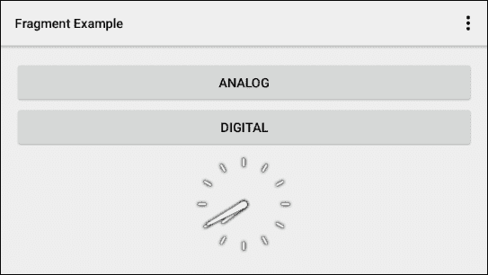

我们通过创建一个简单的布局开始这个练习，但我们还使用了一个方便的快捷方式来避免在我们的布局中硬编码字符串。这样做使得创建我们应用的翻译版本变得非常简单，并在创建替代布局时节省了大量工作。对于本书中的此类练习，没有必要遵循此做法，为了节省时间，我们不会进一步关注它。

### 提示

可以通过在项目资源管理器中右键单击 `res/values/strings.xml` 文件并选择 **打开翻译编辑器（预览**）来打开翻译编辑器。这个编辑器使得翻译 Android 应用变得非常简单。

我们还添加了一个空的 **FrameLayout** 作为我们片段的容器，虽然我们可以使用任何 `ViewGroup`，但 FrameLayout 是最简单的。片段就像活动一样，它们既有 XML 组件也有 Java 组件，在这里我们创建了两个非常简单的片段，只是为了看看它们如何动态地包含和替换。片段当然可以包含许多小部件和视图，所有这些都可以用通常的方式交互，并通过它们各自的 Java 文件中的代码进行控制。片段，就像活动一样，有一个生命周期和相关的回调，如 `onCreate()` 方法，在这里我们使用了 `onCreateView()`，当尝试填充片段时会被调用。需要注意的是，尽管片段可以，并且通常确实包含所有类型的代码，但它们不应该直接相互通信。这应该通过包含它们的活动来完成。

你会注意到，我们在这里实现的 **OnClickListener** 与我们在上一章中实现的方式不同，在那里我们直接在要点击的视图中实现它。在这里，OnClickListener 是整个类的一部分。这种方法通常更受欢迎，尽管计算哪个小部件被点击需要额外的工作，但它通常是一个更整洁的解决方案，特别是对于非常复杂和交互式布局。

**FragmentManager**和**FragmentTransaction**是我们用来直接操作 Fragment 的工具。定义这些工具的前两行设置了正在进行的交易，尽管在调用`commit()`之前没有采取任何行动。我们调用`replace(layout, fragment)`在显示之间切换，但也可以使用具有相同参数的`add()`或仅使用 Fragment 的`remove()`。

使用`addToBackStack()`非常重要，因为没有它，用户在设备上按下返回按钮将返回到上一个 Activity 而不是上一个 Fragment，而这通常是我们想要的。另一个有趣的注意点是，管理器和交易命令可以链式调用，如果我们想的话，我们可以用这一行替换所有六行：

```java
getFragmentManager().beginTransaction()
    .transaction.setTransition(FragmentTransaction.TRANSIT_FRAGMENT_FADE)
    .replace(R.id.fragment_container, fragment)
    .addToBackStack(null)
    .commit();
```

淡入淡出过渡并不是严格必要的，因为系统通常智能地处理 Activity 和 Fragment 之间的过渡，但这里将没有过渡。FragmentManager 和 FragmentTransaction 还有很多可以做的，完整的文档可以在[developer.android.com/reference/android/app/FragmentManager.html](http://developer.android.com/reference/android/app/FragmentManager.html)和[developer.android.com/reference/android/app/FragmentTransaction.html](http://developer.android.com/reference/android/app/FragmentTransaction.html)找到。接下来，我们需要看看在应用中应用 Fragment 的另一种方式。

## 添加静态 Fragment

我们不能不快速看一下他们可以实现的另一种方式，即在 XML 文件中定义为`<fragment>`标签的静态布局。尽管这些 Fragment 缺乏我们刚刚遇到的动态排序的灵活性，但它们仍然非常有用，尤其是在复杂的多面板应用中，不同的 Fragment 执行非常不同的功能。这不仅有助于保持我们的代码组织，而且比复杂的嵌套 ViewGroups 更节省资源。

要最好地了解如何实现，请使用**带有 Fragment 的空白 Activity**模板启动一个项目，并查看`activity_main.xml`文件。

```java
<fragment 

  android:id="@+id/fragment"
  android:name="com.example.kyle.staticfragmentexample.MainActivityFragment"
  android:layout_width="match_parent"
  android:layout_height="match_parent"
  tools:layout="@layout/fragment_main" />
```

这演示了如何将静态的 Fragment 包含在标准布局文件中。它显示了使用`tools:layout`在其中展开哪个布局，以及哪个 Java 类通过`android:name`来控制它。可以通过这种方式组合多个 Fragment，以及 ViewGroups 和 Views 来创建复杂的 Activity。

值得一看的是这个模板中的 Java 类和其他 XML 文件，以了解其他组件是如何工作的。现在你将熟悉其中大部分内容，因为我们刚刚完成了这项工作。现在不要关闭项目，因为我们将要使用它来查看如何添加菜单。

# 添加菜单和工具栏

几乎所有移动应用都包含某种形式的全局菜单，该菜单提供对整个应用所需功能的访问。在 Android 应用中，菜单可以通过多种方式打开，但最常用的方法是**选项菜单**，它可以通过工具栏或操作栏访问。选项菜单项也可以作为文本或图形出现在工具栏上。

首先，我们将添加一个基本的下拉工具栏菜单来实现两个按钮当前提供的功能。从**片段**部分打开项目，并按照以下步骤操作：

1.  打开 `res/menu/menu_main.xml` 文件。

1.  将现有的 `<item>` 标签替换为以下三个：

    ```java
    <item
      android:id="@+id/menu_date"
      android:orderInCategory="100"
      android:showAsAction="never"
     android:title="Date and Time" />

    <item
      android:id="@+id/menu_location"
      android:orderInCategory="100"
      android:showAsAction="never"
      android:title="Location" />

    <item
      android:id="@+id/menu_sleep"
      android:orderInCategory="100"
      android:showAsAction="never"
      android:title="Sleep" />
    ```

1.  可以通过打开预览窗格以与布局相同的方式预览菜单：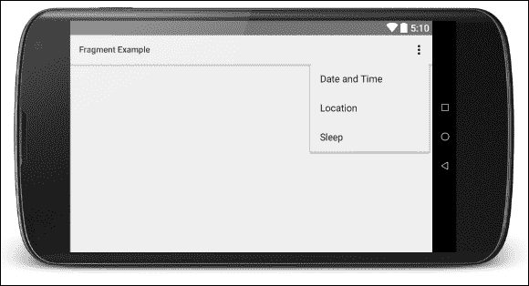

1.  打开 `MainActivity` 文件，找到 `onOptionsItemSelected()` 方法。

1.  重写如下：

    ```java
    @Override
    public boolean onOptionsItemSelected(MenuItem item) {
      Fragment fragment;

      int id = item.getItemId();
      switch (id) {
        case R.id.menu_date:
          startActivity(new Intent(android.provider.Settings.ACTION_DATE_SETTINGS));
          break;
        case R.id.menu_location:
          startActivity(new Intent(android.provider.Settings.ACTION_LOCALE_SETTINGS));
          break;
        case R.id.menu_sleep:
          startActivity(new Intent(android.provider.Settings.ACTION_SOUND_SETTINGS));
          break;
      }

      return super.onOptionsItemSelected(item);
    }
    ```

1.  在设备上运行应用程序，并使用菜单打开日期、地区和音量设置。

## 将菜单项添加到菜单 XML 文件中

每个项目都需要一个标题和一个 ID。我们可以使用 `orderInCategory` 属性来改变项目出现的顺序，该属性使用升序整数值对项目进行排序，从上到下（以及在工具栏上从左到右）排序。菜单项可以通过嵌套在 `<group>` 标签内来分别进行分类和排序。

### 小贴士

子菜单可以通过嵌入一个 `<menu>` 标签来创建，其中包含自己的项目，这些项目位于 `<item>` 标签内。

如我们很快将看到的，菜单项可以在工具栏上以与 API 21 以下版本的 Android 中 Action bar 上相同的方式显示。这可以通过 `showAsAction` 属性来完成；如果您仍然打开了项目，将此值设置为 `always` 和 `ifRoom` 再次运行应用程序是值得的，以查看这种设置的效果。这样做只是将我们的菜单选项移动到栏上，但我们也可以使用图标来表示我们的选项；这就是我们将要探索的 Android 5 工具栏的新特性。

## 配置工具栏

如前所述，Android 5 引入了许多应用屏幕顶部 Action bar 的替代品：工具栏。工具栏确实执行了其前身所有的相同功能，例如显示菜单选项和其他频繁执行的操作，但可定制性更高。最有趣的是，工具栏现在可以放置在屏幕的任何位置。

在接下来的练习中，我们将把我们的菜单添加到工具栏上作为图标；在工具栏上包含导航、标志和标题；然后将它放置在屏幕底部。

工具栏图标需要遵守一些特定的材料设计指南，完整的指南可以在[`www.google.com/design/spec/style/icons.html`](http://www.google.com/design/spec/style/icons.html)找到。基本上，它们需要在透明背景上的简单、单色符号。起初，你可以从[`www.google.com/design/icons/`](http://www.google.com/design/icons/)下载为特定屏幕密度专门设计的系统图标。以下是本项目下载的三个图标，以及在下一次练习中使用的名称。

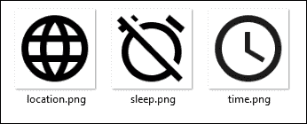

下载或找到适合你正在为的设备的像素密度的类似图片。然后执行以下步骤：

1.  打开我们刚刚正在工作的项目，并将你的图标复制到`drawable`文件夹中。

1.  打开`menu_main.xml`文件，并在`menu_date`项中添加以下行：

    ```java
    android:icon="@drawable/time"
    ```

1.  在各自的项标签中为位置和睡眠图标做同样的操作。

1.  将所有三个项的`android:showAsAction`属性从`"never"`更改为`"ifRoom"`。

1.  如果你想要看看你的品牌颜色与操作图标对比的效果，就像我们之前做的那样，应用一个材料主题，并运行应用来查看图标的外观。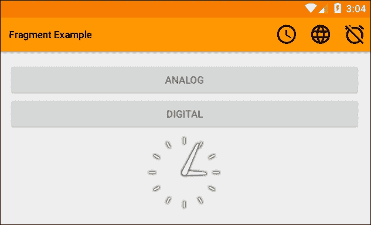

1.  现在打开`main_activity.xml`文件。

1.  在两个按钮上方插入这个`Toolbar`：

    ```java
    <Toolbar 
      android:id="@+id/toolbar"
      android:layout_width="match_parent"
      android:layout_height="wrap_content"
      android:background="?android:attr/colorPrimary"
      android:elevation="4dp"
      android:minHeight="?android:attr/actionBarSize" />
    ```

1.  打开`res/values/styles/styles.xml (v21)`文件，并像这样编辑`AppTheme`定义：

    ```java
    name="AppTheme" parent="android:Theme.Material.Light.NoActionBar"
    ```

1.  你需要为这里的标志准备另一张图片。这张图片不必简单朴素，但不应该包含文字，并且大小约为 96 x 96 px，具体取决于你设备的像素密度。如果你想节省时间，可以在第 11 步的`setLogo()`命令中使用其他图片之一。

1.  打开`MainActivity`文件并添加以下字段：

    ```java
    Private Toolbar toolbar;
    ```

1.  然后，将以下行添加到`onCreate()`方法中：

    ```java
    toolbar = (Toolbar) findViewById(R.id.toolbar);
    setActionBar(toolbar);
    getActionBar().setTitle("Clock");
    toolbar.setSubtitle("tells the time");
    toolbar.setLogo(R.drawable.clock_logo);
    ```

1.  在`activity_main.xml`文件中，从根布局中移除填充。

1.  就这样。你现在可以运行应用，输出结果可能如下所示：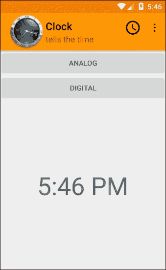

将选项菜单项添加到操作栏的操作很简单，只需将`showAsAction`设置为`ifRoom`或`always`，并且我们可以通过`withText`同时包含文本和图标。这为向用户展示选项提供了一个方便的方法，但一旦我们可以在布局中定义它并从 Java 中引用它，它就变成了一个功能更强大的工具。这意味着我们可以在屏幕上的任何位置放置它，并在其中放置任何内容。我们可以通过在 XML 中的`Toolbar`元素内添加该元素来添加`ImageView`或`Button`。一旦我们在 Java 中有了引用，我们就可以添加点击监听器或任何其他方法，就像我们处理其他组件一样。

我们需要通过将主题更改为`Material.Light.NoActionBar`来移除原始的工具栏，尽管我们可以保留它并添加一个工具栏，当然，我们也可以有多个工具栏，甚至可能包含在一个`Fragment`中，相互替换以创建一个更动态的界面。我们还必须从父布局中移除填充，以便它紧贴边缘，就像传统的工具栏一样，并设置其高度，使其看起来像我们习惯的工具栏。

# 摘要

在本章中，我们涵盖了大量的内容，从介绍`CardView`小部件以及 Android 5 中引入的新特性开始，例如提升它和其他视图，使它们看起来像是浮在屏幕之上。我们看到了如何向项目中添加图像文件，以及如何优化这些图像以高效地匹配用户设备的屏幕密度。我们还看到了如何包含新的活动，以及如何使用 XML（以及 Java）来控制小部件和视图在被点击时的行为。本章还涵盖了活动之间相互通信的许多方法之一。

我们继续探索使用`Fragment`类来增加我们应用灵活性的另一种方法，这些类具有许多活动功能，但可以组合在一个布局中，并像 ViewGroups 一样处理。

最后，我们研究了**选项菜单**和工具栏之间的关系，并看到了 Android 5 中引入的工具栏如何被视为我们活动的一部分，而不是固定在顶部的独立小部件。

在掌握了 Android 编程的一些重要基础知识之后，我们现在可以进一步考虑如何构建更复杂的应用程序，这些应用程序包含更大的数据集，以及如何利用今天移动设备中找到的更多技术。
