# 第八章. 适用于电视、汽车和可穿戴设备的 App

近期 Android 发展中最令人兴奋的新方向之一，是将平台从手机和平板电脑扩展到电视、汽车仪表盘以及如手表这样的可穿戴设备。这些新设备使我们能够为现有的应用提供附加功能，同时还能创建专门为这些新环境设计的全新应用。

我们已经掌握了开发此类应用所需的技能，而本章的主要内容是解释每个平台的独特之处以及谷歌希望我们遵循的指南。当涉及到开发人们在驾驶时使用的应用时，这一点尤为重要，因为安全必须是首要考虑的因素。在开发可穿戴应用时，还需要解决某些技术问题，例如将设备与手机配对以及完全不同的 UI 和使用方法。

在本章中，您将：

+   创建可穿戴 AVD

+   使用 adb 命令将可穿戴模拟器连接到手机

+   将可穿戴模拟器连接到手机模拟器

+   创建包含移动和可穿戴模块的项目

+   使用可穿戴 UI 库

+   创建形状感知布局

+   创建和自定义可穿戴设备的卡片

+   理解可穿戴设计原则

+   访问可穿戴传感器

+   使应用可在 Google TV 上使用

+   包含 Leanback 支持

+   理解 Android Auto 安全指南

+   配置 Auto 项目

+   安装 Google 模拟器

+   使用 Android 设备监控器发送短信

# Android Wear

创建或修改适用于可穿戴设备的应用可能是本章中处理的三种形式因素中最复杂的一种，并且需要比其他项目更多的设置。然而，可穿戴设备通常使我们能够访问一些更有趣的新传感器，如心率监测器。通过了解它是如何工作的，我们还可以了解如何管理传感器。

如果您无法访问 Android 可穿戴设备，请不要担心，因为我们将会构建 AVD。如果您希望将实际 Android 5 手机与 AVD 配对，理想情况下您应该拥有这样一部手机。如果没有，仍然可以使用两个模拟器进行工作，但设置起来会稍微复杂一些。考虑到这一点，我们现在可以准备我们的第一个可穿戴应用。

## 构建和连接到可穿戴 AVD

在模拟器上独立开发和测试可穿戴应用是完全可能的，但如果我们想测试所有可穿戴功能，我们需要将其与手机或平板电脑配对。下一个练习假设您拥有实际设备。如果您没有，仍然完成任务 1 至 4，我们稍后会介绍如何使用模拟器完成剩余部分。

1.  打开 Android Studio。在此阶段，您不需要启动项目。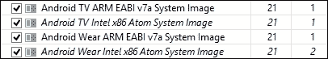

    启动 SDK 管理器并确保已安装相关包。

1.  打开 AVD 管理器。

1.  创建两个新的 Android Wear AVD，一个圆形和一个方形，如下所示：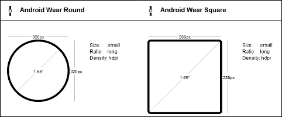

1.  确保在手机上选中了 USB 调试。

1.  从 Play Store 在此 URL 安装 Android Wear 应用程序：[`play.google.com/store/apps/details?id=com.google.android.wearable.app`](https://play.google.com/store/apps/details?id=com.google.android.wearable.app)。将其连接到计算机并启动我们刚刚创建的其中一个 AVD。

1.  定位并打开包含 `adb.exe` 文件的文件夹。它可能类似于 `user\AppData\Local\Android\sdk\platform-tools\`。

1.  使用 *Shift* + 右键单击，选择 **在此处打开命令窗口**。

1.  在命令窗口中，输入以下命令：

    +   `adb -d forward tcp:5601 tcp:5601`

1.  启动配套应用程序，按照说明将两个设备配对。

能够将真实世界设备连接到 AVD 是一种很好的开发形式，而不必拥有这些设备。可穿戴配套应用程序简化了连接两个设备的过程。如果你已经运行仿真器一段时间，你会注意到许多操作，如通知，会自动发送到可穿戴设备。这意味着我们的应用程序通常可以无缝地与可穿戴设备链接，而无需我们编写代码来预先处理这种情况。

`adb.exe`（**Android 调试桥**）是我们开发工具包的重要组成部分。大多数时候，Android Studio 会为我们管理它。然而，了解它的存在以及如何与之交互是有用的。我们在这里使用它来手动在我们的可穿戴 AVD 和手机之间打开一个端口。

有许多可以从命令提示符发出的 `adb` 命令，其中最有用的是 `adb devices`，它列出了所有当前可调试的设备和仿真器，当事情不正常时非常方便，可以查看是否需要重新启动仿真器。通过使用 `adb kill-server` 和 `adb start-server` 分别关闭和启动 ADB。使用 `adb help` 将列出所有可用的命令。

### 小贴士

在步骤 10 中使用的端口转发命令需要在手机从计算机断开连接时每次发出。

在不编写任何代码的情况下，我们已经看到了一些内置在 Android Wear 设备中的功能以及 Wear UI 与大多数其他 Android 设备的不同之处。

即使你通常使用最新的 Android 硬件进行开发，使用仿真器通常仍然是一个好主意，特别是用于测试最新的 SDK 更新和预发布版本。如果你没有真实设备，接下来的小节将展示如何将你的可穿戴 AVD 连接到手机 AVD。

### 将可穿戴 AVD 与另一个仿真器连接

配对两个仿真器与配对真实设备非常相似。主要区别是我们如何在没有访问 Play Store 的情况下安装配套应用程序。按照以下步骤查看如何操作：

1.  启动一个 AVD。这需要针对 Google API，如这里所示：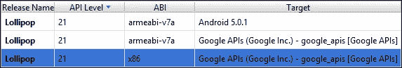

1.  下载`com.google.android.wearable.app-2.apk`。在网上有很多地方可以通过简单的搜索找到它，我使用了[www.file-upload.net/download](http://www.file-upload.net/download)。

1.  将文件放置在您的`sdk/platform-tools`目录中。

1.  在此文件夹中*Shift* + 右键单击，然后选择**在此处打开命令窗口**。

1.  输入以下命令：

    ```java
    adb install com.google.android.wearable.app-2.apk.

    ```

1.  启动您的可穿戴 AVD。

1.  在命令提示符中输入`adb devices`，确保两个模拟器都可见，输出类似于以下内容：

    ```java
    List of devices attached
    emulator-5554   device
    emulator-5555   device

    ```

1.  在命令提示符中输入`adb telnet localhost 5554`，其中`5554`是手机模拟器。

1.  接下来，输入`adb redir add tcp:5601:5601`。

1.  您现在可以使用手持 AVD 上的可穿戴应用程序连接到手表。

正如我们所看到的，设置可穿戴项目比我们之前执行的一些其他练习要花更长的时间。一旦设置完成，过程与为其他形式因素开发的过程非常相似，我们现在可以继续进行。

## 创建可穿戴项目

我们迄今为止开发的所有应用程序都只需要一个模块，这是有道理的，因为我们只为单个设备构建。在接下来的步骤中，我们将跨两个设备进行开发，因此需要两个模块。这非常简单，您将在接下来的步骤中看到。

1.  在 Android Studio 中创建一个新的项目，并将其命名为类似`Wearable App`的名称。

1.  在**目标 Android 设备**屏幕上，选择**手机和平板电脑**以及**可穿戴**，如下所示：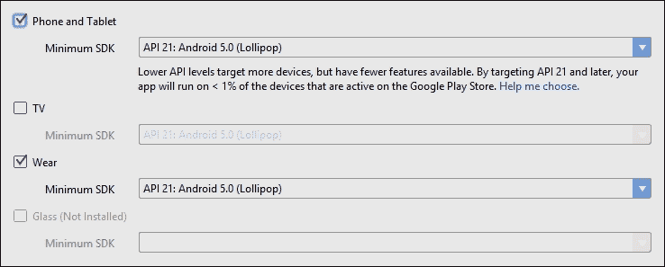

1.  您将被要求添加两个活动。对于移动活动，选择**空白活动**，对于可穿戴设备，选择**空白可穿戴活动**。

1.  其他所有内容都可以保持不变。

1.  在圆形和方形虚拟设备上运行应用程序。

您首先会注意到有两个模块，移动和可穿戴。第一个模块与我们之前看到的相同，但与可穿戴模块有一些细微的差别，值得稍微看一下。最重要的差别是`WatchViewStub`类。它在可穿戴模块的`activity_main.xml`和`MainActivity.java`文件中的使用方式可以查看。

这个帧布局扩展专门为可穿戴设备设计，可以检测设备的形状，以便填充适当的布局。利用`WatchViewStub`并不像想象中那么简单，因为适当的布局只有在`WatchViewStub`完成其操作后才会被填充。这意味着，为了访问布局中的任何视图，我们需要使用一个特殊的监听器，该监听器在布局被填充后会被调用。如何通过打开可穿戴模块中的`MainActivity.java`文件并检查`onCreate()`方法来了解`OnLayoutInflatedListener()`的工作方式，该`onCreate()`方法看起来如下：

```java
@Override
protected void onCreate(Bundle savedInstanceState) {
  super.onCreate(savedInstanceState);
  setContentView(R.layout.activity_main);
  final WatchViewStub stub = (WatchViewStub) findViewById(R.id.watch_view_stub);
  stub.setOnLayoutInflatedListener(new WatchViewStub.OnLayoutInflatedListener() {
    @Override
    public void onLayoutInflated(WatchViewStub stub) {
      mTextView = (TextView) stub.findViewById(R.id.text);
    }
  });
}
```

除了可穿戴应用程序和设备在开发中的设置方式外，另一个显著的不同之处在于 UI。我们用于手机和平板电脑的小部件和布局在大多数情况下不适用于手表屏幕较小的尺寸。Android 提供了一套全新的 UI 组件，我们可以使用，这就是我们接下来要探讨的内容。

## 设计可穿戴设备的 UI

除了在设计布局时必须考虑可穿戴设备的小尺寸外，我们还有形状问题。为圆形屏幕设计会带来自己的挑战，但幸运的是，**Wearable UI 库**使这一点变得非常简单。除了我们在上一节中遇到的`WatchViewStub`，它能够填充正确的布局外，还有一种方法可以设计一个布局，使其既适用于方形屏幕也适用于圆形屏幕。

### 设计布局

项目设置向导自动在`build.gradle (Module: wear)`文件中将此库作为依赖项包含：

```java
compile 'com.google.android.support:wearable:1.1.0'

```

以下步骤演示了如何使用`BoxInsetLayout`创建一个形状感知布局：

1.  打开上一节中创建的项目。

1.  您需要三个图像，必须放置在可穿戴模块的`drawable`文件夹中：一个名为`background_image`的图像，大小约为 320 x 320 px，以及两个大小约为 50 x 50 px 的图像，分别命名为`right_icon`和`left_icon`。

1.  在可穿戴模块中打开`activity_main.xml`文件。

1.  用以下代码替换其内容：

    ```java
    <android.support.wearable.view.BoxInsetLayout

      android:background="@drawable/background_image"
      android:layout_height="match_parent"
      android:layout_width="match_parent"
      android:padding="15dp">

    </android.support.wearable.view.BoxInsetLayout>
    ```

1.  在`BoxInsetLayout`内部添加以下`FrameLayout`：

    ```java
    <FrameLayout
      android:id="@+id/wearable_layout"
      android:layout_width="match_parent"
      android:layout_height="match_parent"
      android:padding="5dp"
      app:layout_box="all">

    </FrameLayout>
    ```

1.  在其中添加以下三个视图：

    ```java
    <TextView
      android:gravity="center"
      android:layout_height="wrap_content"
      android:layout_width="match_parent"
      android:text="Weather warning"
      android:textColor="@color/black" />

    <ImageView
      android:layout_gravity="bottom|left"
      android:layout_height="60dp"
      android:layout_width="60dp"
      android:src="img/left_icon" />

    <ImageView
      android:layout_gravity="bottom|right"
      android:layout_height="60dp"
      android:layout_width="60dp"
      android:src="img/right_icon" />
    ```

1.  在可穿戴模块中打开`MainActivity.java`文件。

1.  在`onCreate()`方法中，删除`setContentView(R.layout.activity_main);`行之后的所有行。

1.  现在，在方形和圆形模拟器上运行应用程序。

如我们所见，`BoxInsetLayout`在无论屏幕形状如何的情况下都能很好地填充我们的布局。其工作原理非常简单。`BoxInsetLayout`创建一个正方形区域，其大小可以适应圆形屏幕的圆形。这是通过`app:layout_box="all"`指令设置的，该指令也可以用于定位组件，正如我们将在下一分钟看到的那样。

我们还将`BoxInsetLayout`的填充设置为 15 dp，而`FrameLayout`的填充设置为 5 dp。这会在圆形屏幕上产生 5 dp 的边距，在方形屏幕上产生 15 dp 的边距。

无论您是使用`WatchViewStub`并为每种屏幕形状创建单独的布局，还是使用`BoxInsetLayout`并仅创建一个布局文件，这完全取决于您的偏好以及您应用程序的目的和设计。无论您选择哪种方法，您无疑都希望将 Material Design 元素添加到您的可穿戴应用程序中，其中最常见且最灵活的是卡片。在下一节中，我们将探讨两种实现方式，即`CardScrollView`和`CardFragment`。

### 添加卡片

`CardFragment` 类提供了一个默认的卡片视图，包含两个文本视图和一个图像。它设置起来非常简单，具有所有 Material Design 特性，如圆角和阴影，几乎适用于所有用途。它可以进行定制，正如我们将看到的，尽管 `CardScrollView` 通常是一个更好的选择。首先，让我们看看如何为可穿戴设备实现默认卡片：

1.  打开当前项目中 wear 模块中的 `activity_main.xml` 文件。

1.  删除或注释掉文本视图和两个图像视图。

1.  打开 wear 模块中的 `MainActivity.java` 文件。

1.  在 `onCreate()` 方法中，添加以下代码：

    ```java
    FragmentManager fragmentManager = getFragmentManager();
    FragmentTransaction fragmentTransaction = fragmentManager.beginTransaction();
    CardFragment cardFragment = CardFragment.create("Short title", "with a longer description");
    fragmentTransaction.add(R.id.wearable_layout, cardFragment);
    fragmentTransaction.commit();
    ```

1.  在可穿戴设备模拟器中运行应用，看看默认卡片的外观。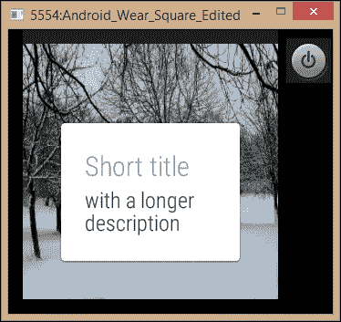

我们在 第六章 中遇到了 `FragmentManager`，*通知和动作栏*，在这里它以非常相似的方式运行，并且需要很少的解释。我们创建 `CardFragment` 的方式也非常直接。我们在这里使用了两个字符串参数，但还有一个第三个参数，即可绘制参数，如果将行更改为 `CardFragment cardFragment = CardFragment.create("TITLE", "with description and drawable", R.drawable.left_icon);`，那么我们将得到以下输出：

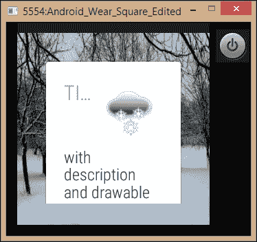

对于可穿戴设备上的卡片，这个默认实现对于大多数用途来说都很好，并且可以通过重写其 `onCreateContentView()` 方法进行定制。然而，`CardScrollView` 是一个非常方便的替代方案，这是我们接下来要探讨的。

### 定制卡片

`CardScrollView` 在我们的布局内部定义，并且它能够检测屏幕形状并调整边距以适应每个形状。要了解这是如何实现的，请按照以下步骤操作：

1.  打开 wear 模块中的 `activity_main.xml` 文件。

1.  删除或注释掉每个元素，除了根 `BoxInsetLayout`。

1.  在 `BoxInsetLayout` 内放置以下 `CardScrollView`：

    ```java
    <android.support.wearable.view.CardScrollView
      android:id="@+id/card_scroll_view"
      android:layout_height="match_parent"
      android:layout_width="match_parent"
      app:layout_box="bottom">

    </android.support.wearable.view.CardScrollView>
    ```

1.  在其中添加以下 `CardFrame`：

    ```java
    <android.support.wearable.view.CardFrame
      android:layout_width="match_parent"
      android:layout_height="wrap_content">

    </android.support.wearable.view.CardFrame>
    ```

1.  在 `CardFrame` 内部添加一个 `LinearLayout`。

1.  向其中添加一些视图，以便预览与这里的布局相似：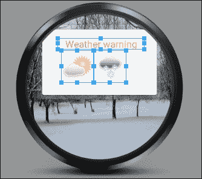

1.  打开 `MainActivity.java` 文件。

1.  将我们添加到 `onCreate()` 方法中的代码替换为以下内容：

    ```java
    CardScrollView cardScrollView = (CardScrollView) findViewById(R.id.card_scroll_view);
    cardScrollView.setCardGravity(Gravity.BOTTOM);
    ```

1.  现在，你可以在模拟器上测试应用，这将产生以下结果：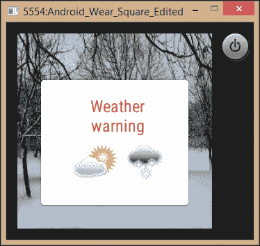

### 小贴士

如前图所示，Android Studio 为可穿戴设备形状提供了预览屏幕。像一些其他预览一样，这些并不总是你将在设备上看到的样子，但它们允许我们通过拖放小部件来快速组合布局。

如我们所见，`CardScrollView` 和 `CardFrame` 的实现甚至比 `CardFragment` 更简单，而且更加灵活，因为我们几乎可以设计出任何我们想象的布局。我们在这里再次分配了 `app:layout_box`，但这次使用 `bottom`，使得卡片尽可能低地放置在屏幕上。

在为如此小的屏幕设计时，保持我们的布局尽可能干净和简单是非常重要的。谷歌的设计原则指出，可穿戴应用应该是可一目了然的。这意味着，就像传统的手表一样，用户应该能够快速查看我们的应用并立即获取信息，然后返回他们之前正在做的事情。

另一个谷歌的设计原则——*零到低交互*——用户只需要单次点击或滑动就能与我们的应用交互。带着这些原则，让我们创建一个小型应用，其中包含一些实际的功能。在下一节中，我们将利用许多可穿戴设备中找到的新心率传感器，并在显示屏上显示每分钟的当前心跳次数。

## 访问传感器数据

Android Wear 设备在用户手腕上的位置，使其成为健身应用的完美硬件，而且不出所料，这些应用非常受欢迎。与 SDK 的大多数功能一样，访问传感器非常简单，使用管理器和监听器类，并且只需要几行代码，正如您通过以下步骤将看到的那样：

1.  打开本章中我们一直在工作的项目。

1.  将背景图片替换为可能适合健身应用的图片。我使用了一个简单的爱心图片。

1.  打开 `activity_main.xml` 文件。

1.  删除除根 `BoxInsetLayout` 之外的所有内容。

1.  将此 `TextView` 放置在其中：

    ```java
      <TextView
        android:id="@+id/text_view"
        android:layout_width="match_parent"
        android:layout_height="wrap_content"
        android:layout_gravity="center_vertical"
        android:gravity="center"
        android:text="BPM"
        android:textColor="@color/black"
        android:textSize="42sp" />
    ```

1.  打开可穿戴模块中的 Manifest 文件。

1.  在根 Manifest 节点内添加以下权限：

    ```java
    <uses-permission android:name="android.permission.BODY_SENSORS" />
    ```

1.  打开可穿戴模块中的 `MainActivity.java` 文件。

1.  添加以下字段：

    ```java
    private TextView textView;
    private SensorManager sensorManager;
    private Sensor sensor;
    ```

1.  在 Activity 中实现 `SensorEventListener`：

    ```java
    public class MainActivity extends Activity implements SensorEventListener {
    ```

1.  实现监听器所需的两个方法。

1.  编辑 `onCreate()` 方法，如下所示：

    ```java
    @Override
    protected void onCreate(Bundle savedInstanceState) {
      super.onCreate(savedInstanceState);
      setContentView(R.layout.activity_main);

      textView = (TextView) findViewById(R.id.text_view);

      sensorManager = ((SensorManager) getSystemService(SENSOR_SERVICE));
      sensor = sensorManager.getDefaultSensor(Sensor.TYPE_HEART_RATE);
    }
    ```

1.  添加这个 `onResume()` 方法：

    ```java
    protected void onResume() {
      super.onResume();

      sensorManager.registerListener(this, this.sensor, 3);
    }
    ```

1.  以及这个 `onPause()` 方法：

    ```java
    @Override
    protected void onPause() {
      super.onPause();

      sensorManager.unregisterListener(this);
    }
    ```

1.  编辑 `onSensorChanged()` 回调，如下所示：

    ```java
    @Override
    public void onSensorChanged(SensorEvent event) {
      textView.setText("" + (int) event.values[0]);
    }
    ```

1.  如果您无法访问真实设备，您可以从这里下载传感器模拟器：

    [`code.google.com/p/openintents/wiki/SensorSimulator`](https://code.google.com/p/openintents/wiki/SensorSimulator)

1.  应用现在已准备好测试。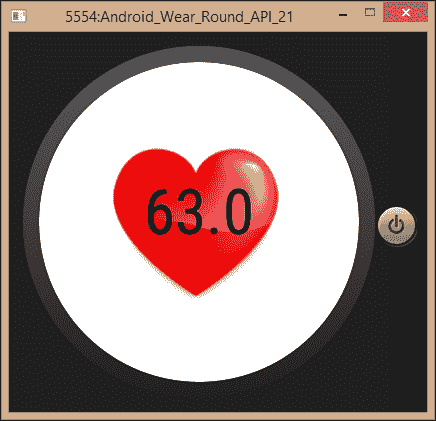

我们首先在 `AndroidManifest.xml` 文件中适当的模块中添加了一个权限；这是我们之前做过的事情，每次我们使用需要用户在安装前给予权限的功能时都需要这样做。

包含背景图片可能看起来是必要的，但合适的背景确实有助于提高可一目了然的特性，因为用户可以立即知道他们正在查看哪个应用。

从`SensorManager`和`Sensor`在`onCreate()`方法中的设置方式来看，很明显所有传感器都以相同的方式访问，并且可以通过不同的常量访问不同的传感器。在这里我们使用了`TYPE_HEART_RATE`，但任何其他传感器都可以使用适当的常量启动，所有传感器都可以使用我们在这里找到的相同的基本结构来管理，唯一的真正区别是每个传感器返回`SensorEvent.values[]`的方式。所有传感器的完整列表及其产生的值的描述可以在[`developer.android.com/reference/android/hardware/Sensor.html`](http://developer.android.com/reference/android/hardware/Sensor.html)找到。

就像我们的应用在任何时候利用后台运行的功能一样，我们至关重要地需要在 Activity 的`onPause()`方法中注销我们的监听器，无论何时它们不再需要。在这里我们没有使用`onAccuracyChanged()`回调，但它的目的应该是清晰的，并且有许多可能的应用需要其使用。

这标志着我们对可穿戴应用及其构建方式的探索结束。这类设备继续变得越来越普遍，而且更多富有创意的使用方式的可能性是无限的。只要我们考虑人们为什么以及如何使用智能手表等设备，并通过编程实现需要最小交互性的可查看界面来利用这些设备的地理位置，Android Wear 似乎注定会越来越受欢迎和使用，开发者也将继续生产出更多创新的应用。

# Android TV

与 Android Wear 相比，Android TV 位于大小谱的另一端。就像 Wear 一样，当我们为这种形态设计应用时，其大小至关重要。主要考虑因素是用户与屏幕的距离，这通常在 10 英尺左右。这意味着设计简单、干净的布局，并避免使用小而/或长的文本。

与 Wear 不同，我们为手机和平板电脑设计的许多应用也可以提供给电视。正如人们所想象的那样，这需要我们对清单进行一些调整，以便让我们的应用在 Google Play 商店中可见，供搜索特定电视应用的用户使用。此外，电视没有我们手机上的一些功能，如 GPS 和触摸屏，我们也需要考虑这一点。

Android Studio 中由项目向导生成的电视应用模板存在 bug，除非谷歌在你阅读此内容时已经修复了它，否则使用它来生成一个可工作的应用远非直截了当。尽管如此，它仍然值得一看，因为 Java 目录中包含十几个专为流媒体和电视节目等应用设计的类，这些类非常方便。

模板无法工作的事实，在我们的情况下实际上是一件好事，因为我们可以利用这个部分来了解如何从头开始构建一个兼容电视的应用程序，或者如果您愿意，如何将已经开发的应用程序转换为可以在 Android TV 上安装的形式。

以下练习可以使用空白活动模板进行，适用于手机和平板电脑或您已经开发的应用程序。

1.  打开您项目的清单文件。

1.  在根清单节点内部，添加以下权限：

    ```java
    <uses-permission android:name="android.permission.INTERNET" />

    <uses-permission android:name="android.permission.RECORD_AUDIO" />
    ```

1.  在同一节点中添加以下功能使用：

    ```java
    <uses-feature
      android:name="android.hardware.touchscreen"
      android:required="false" />

    <uses-feature
      android:name="android.software.leanback"
      android:required="false" />

    <uses-feature
      android:name="android.hardware.microphone"
      android:required="false" />

    <uses-feature
      android:name="android.hardware.screen.portrait"
      android:required="false" />
    ```

1.  找到一个或创建一个 320 x 180 px 的`xhdpi`横幅图像来代表您的应用程序。理想情况下，它应该包含文本以及一个可识别的图像，如下所示：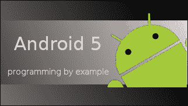

1.  将图像放置在您的`drawable`文件夹中，并命名为`banner`。

1.  在应用程序节点内部添加以下行：

    ```java
    android:banner="@drawable/banner"
    ```

1.  打开您的`build.gradle`文件并添加以下依赖项：

    ```java
    compile 'com.android.support:leanback-v17:22.0.0'
    ```

1.  在清单文件中，将主题声明行更改为以下内容：

    ```java
    android:theme="@style/Theme.Leanback"
    ```

1.  创建一个电视 AVD 并测试应用程序。

虽然在这里我们并没有做很多，但还有很多东西需要解释。我们大部分的工作都是为了确保我们的应用程序在浏览 Play 商店的电视应用程序时是可见的。电视不支持纵向屏幕布局，因此如果需要此功能，它将简单地不会出现在 Play 商店中作为电视可用。我们希望包括支持此方向设备的特性，这就是我们如何做到这一点，同时仍然使我们的应用程序对电视用户可用。我们必须在所有电视应用程序中包含录制音频的权限，但电视通常不支持麦克风。

我们在第 7 步中添加的**Leanback 支持库**是开发电视应用程序的一个非常有用的工具。它提供了一个非常合适的主题`Theme.Leanback`，几个专为电视设计的实用小部件，并且以这种方式管理边距，以确保我们的布局不会被裁剪。如果没有它，我们可能需要设置大约 10%的宽边距来避免这种电视过度扫描。如果我们想专门为电视编写，我们也会更改主活动意图过滤器内的类别`<category android:name="android.intent.category.LEANBACK_LAUNCHER" />`。

对于 Android TV 的编程，尤其是广播和流媒体方面，还有很多内容我们在这里无法涵盖。不过，一般来说，开发电视应用程序所需的技能与手持设备编程相同，许多应用程序在两种格式上都能运行得很好。只要我们考虑到用户与屏幕的距离以及有限的输入方式，我们就可以编写出能够在所有平台上提供满意体验的程序。

Android 操作系统是一个非常灵活的系统，非常适合各种形态。我们已经看到它可以在半英寸到家庭影院大小的屏幕上运行。Android Lollipop 预示着另一个新的令人兴奋的平台，允许用户在驾驶汽车时运行 Android 应用程序。

# Android Auto

Android Auto 应用是在连接到兼容的车载仪表盘时，在驾驶员仪表盘上运行某些受限内容的应用。当为汽车开发时，主要关注的是安全，任何不符合这些严格标准的 Auto 应用都不会在 Play 商店发布。许多 Android 应用在驾驶时过于分散注意力，不适合使用。实际上，Android Auto 真正支持的功能只有两个：音频播放和文本到语音消息。本书的范围不涉及这一方面的全面探讨，但这是一个很好的时机来了解这类应用的设置方式以及如何使用 SDK 中提供的媒体和消息模拟器。首先，我们需要看看谷歌对 Auto 应用坚持的安全规则：

+   在自动屏幕上不得有动画元素

+   只允许音频广告

+   应用必须支持语音控制

+   所有按钮和可点击控件必须在两秒内响应用户操作

+   文本必须超过 120 个字符，并且必须始终使用默认的 Roboto 字体

+   图标必须是白色，以便系统可以控制对比度

+   应用必须支持日间和夜间模式

+   应用必须支持语音命令

+   应用特定的按钮必须以不超过两秒的延迟响应用户操作

重要：这些以及其他一些规定，在发布前将由谷歌进行测试，因此您自己运行所有这些测试至关重要。完整列表可以在[`developer.android.com/distribute/essentials/quality/auto.html`](http://developer.android.com/distribute/essentials/quality/auto.html)找到。

### 小贴士

设计适合日间和夜间模式的应用，并且可以通过系统自动在不同光照条件下保持可读性，这是一个相当详细的主题，谷歌为此提供了一份非常有用的指南，可以在[`commondatastorage.googleapis.com/androiddevelopers/shareables/auto/AndroidAuto-custom-colors.pdf`](http://commondatastorage.googleapis.com/androiddevelopers/shareables/auto/AndroidAuto-custom-colors.pdf)找到。

尽管我们有这些限制，但 Auto 应用的开发方式与其他应用相同。不过有一个小差别，当为 Auto 开发时，我们需要定义我们的应用使用哪些车载功能。这是通过一个 XML 文件来完成的。按照以下简短的步骤，看看如何操作：

1.  为手机和平板电脑启动一个新的 Android Studio 项目，或者打开一个现有的项目。

1.  在`res`目录内创建一个新的**Android 资源目录**，并命名为`xml`。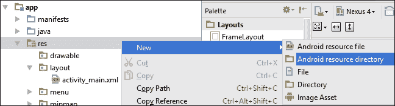

1.  在这个`xml`文件夹内，创建一个新的 Android 资源文件，并命名为类似`auto_config.xml`。

1.  按照以下方式完成：

    ```java
    <?xml version="1.0" encoding="utf-8"?>

      <automotiveApp>
        <uses name="media" />
        <uses name="notification" />
      </automotiveApp>
    ```

1.  打开清单文件。

1.  在`application`节点内添加以下行：

    ```java
    <meta-data android:name="com.google.android.gms.car.application"
      android:resource="@xml/auto_config"/>
    ```

1.  就这样，我们的应用现在将检测其宿主设备是否连接到车载仪表盘。

这里只需指出两点。这两个名称用途分别是用于运行音频播放应用和接收消息。只有当我们的应用被设计为同时具备这两个功能时，我们才需要两者。

Google 为测试媒体浏览和消息应用提供了模拟器，让我们可以在桌面上安全地测试项目。以下步骤演示了如何安装它们以及如何使用 telnet 连接发送模拟短信：

1.  从 Android Studio 中打开 SDK 管理器。

1.  确保你有最新的 Android Auto API 模拟器版本，它们位于 `Extras` 文件夹中。

1.  连接一个设备或模拟器。

1.  前往你的 `sdk/extras/google/simulators` 文件夹，并在此处使用 *Shift* + 右键点击打开命令窗口。

1.  使用 `adb devices` 检查你的设备是否已连接。

1.  输入以下两个命令来安装这两个模拟器：

    ```java
    adb install media-browser-simulator.apk
    adb install messaging-simulator.apk

    ```

    ### 小贴士

    如果你使用的是第三方虚拟设备，例如 Genymotion，你将能够通过将它们拖放到模拟器屏幕上来安装这些应用。

使用 `adb` 命令安装模拟器非常简单，当然，任何 `.apk` 文件都可以通过这种方式安装到已连接的设备上。媒体浏览器模拟器可以用大多数媒体服务进行测试，例如 Play Music。

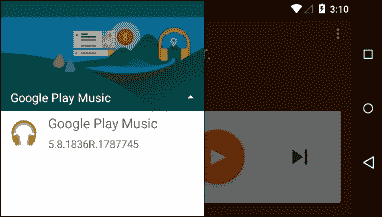

可以通过从 **Emulator Control** 选项卡启动 **Android Device Monitor** 来向消息模拟器发送文本。

这就是我们在 Android Auto 中能涵盖的所有内容。该平台提供了 Lollipop 提供的最激动人心的新可能性之一，毫无疑问，Android 将在未来越来越多地出现在车辆中。

# 摘要

Android Wear、TV 和 Auto 与传统形态有根本性的不同，彼此之间也完全不同。这意味着我们在这里必须涵盖很多不同的领域。

尽管它们的体积和功能相对较小，但可穿戴设备为我们提供了巨大的可能性。我们现在知道如何创建和连接可穿戴 AVD，以及如何轻松地为方形和圆形设备开发。然后我们探讨了设置 TV 应用所需的条件，如何将现有应用转换为可在电视上使用，以及 Leanback 支持提供的有用库和功能。我们最后探讨了在开发过程中必须遵守的严格安全规则，以及用于测试 Auto on 的工具。

最大的改进之一，尽管可能对用户来说不太明显，涉及相机 API。这些 API 对 Lollipop 来说是全新的，而且添加多媒体到我们的应用也是我们在下一章将要讨论的内容。
