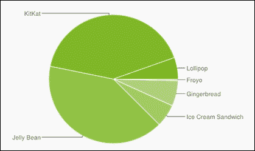
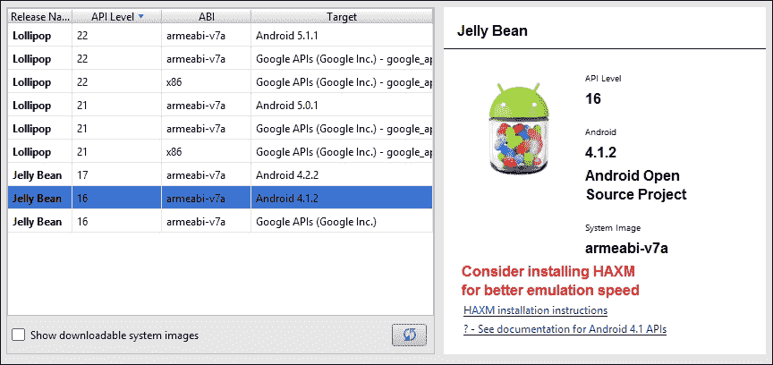
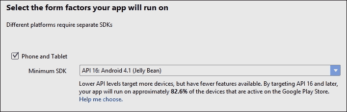
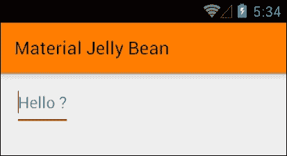
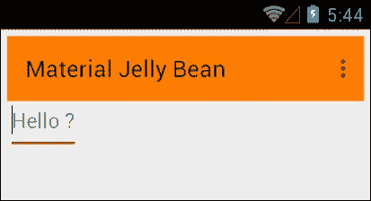
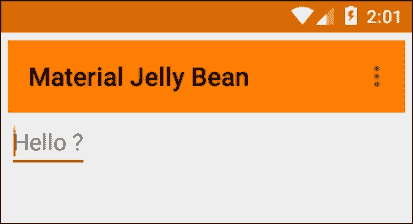
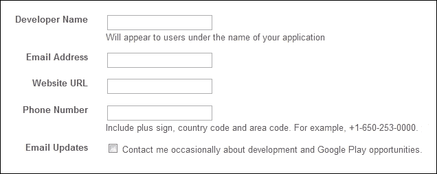
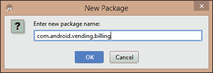

# 第十章。发布和营销

覆盖了本书的所有主题后，如果你还没有这样做，你现在可以创建、开发和营销自己设计的应用了。当然，关于 Android 5 以及 Android 本身还有很多东西要学习，但现在我们已经了解了如何应用一些最常用的结构和对象，进一步探索 SDK 就变得相当简单。一旦我们了解了监听器接口的实现方式，那么查找文档以了解何时需要引入新的接口就变得简单了。

开发 Android 应用的整个目的就是为了分发它。尽管有众多方式可以让我们的工作对他人可用，但最明显的选择是通过 Android Play Store。本章将一步步指导你如何做到这一点。在这个过程中，我们将了解如何使我们的应用与早期版本兼容，保留 Android 5 API 的大部分功能以及许多编程到我们的 Lollipop UI 中的 Material Design 特性。

在本章中，你将：

+   制作向后兼容的应用

+   了解如何为旧系统创建替代布局

+   将 Material 主题应用于旧版本

+   用 Material Design 工具栏替换 ActionBar

+   准备应用发布

+   创建数字证书和私钥

+   生成一个签名 APK 文件

+   准备促销媒体

+   完成商店列表

+   发布应用

+   学习如何通过电子邮件和网站分发应用

+   许可应用

+   提供产品或出版商的链接

+   添加官方品牌

+   构建一个用于应用内付费的模板项目

+   包含一个 AdMob 横幅广告

# 制作向后兼容的应用

在整本书中，我们一直专注于为 Android 5 开发，尽管运行这个平台设备的数量注定会大幅增加，但它们仍然只占所有活跃 Android 设备的一小部分。实际上，**Jelly Bean**和**KitKat**（API 16 至 19）仍然占据了访问 Google Play Store 的平台版本中的绝大多数。



### 小贴士

可以在[`developer.android.com/about/dashboards/index.html`](http://developer.android.com/about/dashboards/index.html)找到关于所有活跃设备上平台相对分布的最新报告。这个页面还包含了关于当前使用的屏幕尺寸和密度的类似信息，可以极大地帮助我们定位用户。

显然，我们希望我们的应用能够触及尽可能多的人，我们开发的许多应用只需做很少的调整就可以让运行早期版本的用户使用。幸运的是，Android 提供了支持库，如**v7 AppCompat r21**（或更高版本）来简化这个过程。

## 添加 v7 支持库

实际上，我们在开始开发之前应该仔细考虑我们希望我们的应用在哪些平台上可用；然而，为了演示目的，在接下来的简短练习中，我们将使我们在书中早期开发的应用对运行 API 16 及更高版本设备的设备可用。

1.  打开我们之前开发的**Ancient Britain**应用。

1.  打开`manifest`文件。

1.  在根节点内部，包括以下标签：

    ```java
    <uses-sdk android:minSdkVersion="16"
        android:targetSdkVersion="22" />
    ```

1.  打开`build.gradle`文件并添加以下依赖项：

    ```java
    compile 'com.android.support:cardview-v7:22.0.+'
    compile 'com.android.support:recyclerview-v7:22.0.+'
    compile "com.android.support:appcompat-v7:22.0.+"
    ```

1.  编辑默认配置，如下所示：

    ```java
    defaultConfig {
        applicationId "com.example.kyle.ancientbritain"
        minSdkVersion 16
        targetSdkVersion 22
        versionCode 1
        versionName "1.0"
    }
    ```

1.  准备一个针对 API 级别 16 的 AVD 或手机：

1.  在设备上运行应用。它看起来会正常工作，直到你尝试在 DetailActivity 屏幕上滑动图片，那时它会崩溃。

1.  打开`DetailActivity.java`文件。

1.  在`onShowPress()`和`onFling()`方法中，有一个调用`detailImage.setElevation()`。对每个方法应用条件语句，如下所示：

    ```java
    if (Build.VERSION.SDK_INT >= Build.VERSION_CODES.LOLLIPOP) {
        detailImage.setElevation(4);
    }

    if (Build.VERSION.SDK_INT >= Build.VERSION_CODES.LOLLIPOP) {
        detailImage.setElevation(0);
    }
    ```

1.  再次运行应用以检查此修复是否已生效。

在清单中声明`uses-sdk`是必要的，因为这是 Play Store 决定哪些设备可以看到应用的方式。**v7 AppCompat r21+**库使得向后兼容成为可能。除此之外，它还提供了非常不错的 Material Design 小部件和其他 UI 组件。还有针对**RecyclerView**和**CardView**的库，尽管阴影不是动态的，但考虑到我们的应用现在可以触及的大量用户，这只是一个微不足道的代价。

更改最低 SDK 级别是我们使我们的应用对旧版本可用所需做的第一件事。正如我们所见，21 级或更高版本的 API 会在调用时导致应用崩溃，就像在这个任务中的`setElevation()`调用一样。通过能够在运行时查询设备的 API，我们有办法绕过这个限制，并且通常用户体验的质量损失很小。

另一种方便的方法来解决这个问题，是为不同的平台创建不同的布局。你可以为你的 Material Design 布局创建一个`res/layout/v-21/`目录，并在`res/layout/`中创建旧版替代方案。

要真正将**Material** **Design**的感觉带到旧平台上，我们可以利用这些库做更多的事情，比如使我们的自定义主题可用，这就是我们接下来要做的。

# 将 Material Design 应用于旧平台

通常在为 API 21 之前的平台开发应用时，我们在创建应用时将最低 SDK 设置为最低的目标级别，而不是像我们刚才做的那样逆向工程过程。在这里，我们将看到如何添加许多**Material Design**功能。以这种方式开发也是一个很好的方法来判断我们希望我们的应用向后兼容到什么程度，以及我们愿意放弃多少功能。

这个下一个练习演示了如何为 API 16 构建一个应用并应用 Material Design 到 UI。为此，请按照以下步骤操作：

1.  在 Android Studio 中创建一个名为**Material Jelly Bean**的新项目。

1.  不要在包名中使用`com.example`。

1.  选择**手机和平板**作为形态因子，并将**API 16**作为最小 SDK。注意支持你的应用设备数量。

1.  选择**空白活动**并保持其他一切不变，或者选择你自己的值。

1.  将以下内容添加到清单文件的根节点：

    ```java
    <uses-sdk android:minSdkVersion="16"
            android:targetSdkVersion="22" />
    ```

1.  打开`res/values/styles.xml`文件并按照以下方式填写：

    ```java
    <resources>
        <style name="AppTheme" parent="Theme.AppCompat.Light">
            <item name="colorPrimary">#ff7d00</item>
            <item name="colorPrimaryDark">#d96a00</item>
            <item name="colorAccent">#b25900</item>
        </style>
    </resources>
    ```

1.  打开`activity_main.xml`文件。

1.  将根布局从相对布局更改为线性布局，并通过添加以下内容设置其方向：

    ```java
    android:orientation="vertical"
    ```

1.  将`TextView`转换为这个`EditText`：

    ```java
    <EditText
        android:layout_width="wrap_content"
        android:layout_height="wrap_content"
        android:hint="Hello ?"
        android:inputType="text" />
    ```

1.  在此点运行应用，我们的 Material 主题调色板将被应用：

1.  通过在`styles.xml`文件中设置主题来禁用 ActionBar：

    ```java
    Theme.AppCompat.Light.NoActionBar
    ```

1.  在`EditText`上方放置这个工具栏：

    ```java
    <android.support.v7.widget.Toolbar
        android:id="@+id/toolbar"
        android:layout_width="match_parent"
        android:layout_height="wrap_content"
        android:background="?attr/colorPrimary"/>
    ```

1.  你可能希望调整`dimens.xml`文件中布局的填充。

1.  打开你的主活动文件，并将以下代码添加到`onCreate()`方法中：

    ```java
    Toolbar toolbar = (Toolbar) findViewById(R.id.toolbar);
    if (toolbar != null) {
        setSupportActionBar(toolbar);
    }
    ```

1.  这将生成一个导入错误。使用快速修复选择 v7 Toolbar。

1.  在 API 16 设备或模拟器上运行应用，以查看 Material Design 风格的工具栏。

**AppCompat**主题系列提供了我们习惯的大多数 Material Design 功能。我们选择的代表我们应用的颜色仍然在应用中熟悉的地点出现，并着色各种小部件，使我们的应用具有一致和可识别的感觉。然而，某些元素仍然丢失，如果你在 Android 5 设备上运行应用，你会得到以下输出。



关于我们实现**Material Toolbar**的方式有两个重要的事情需要注意。首先，注意我们的`MainActivity`类扩展了**ActionBarActivity**，并且对于任何使用 AppCompat 构建的应用来说，如果它要有工具栏，这必须是这样。其次，注意我们通过`setSupportActionBar()`方式填充它，这与大多数视图不同。这是我们习惯于管理工具栏的方式之间的唯一两个真正差异；除此之外，其他一切都可以使用我们熟悉的类和方法来完成。

为了将 Material Design 引入早期版本，可以做一些其他的事情，但到目前为止，这已经足够让我们开始将我们的应用带给尽可能多的人。接下来，我们将转向一个更严肃的主题，即向世界发布我们的应用。

# 发布应用

不言而喻，你已经在各种手机和模拟器上彻底测试了你的应用，可能已经准备好了你的推广材料，并检查了**Google Play 政策和协议**。在发布之前有许多事情需要考虑，例如**内容评级**和**国家分布**。从编程的角度来看，在我们继续之前，我们只需要检查三件事情。

+   从项目中移除所有日志，例如：

    ```java
    private static final String DEBUG_TAG = "tag";
    Log.d(DEBUG_TAG, "some info");
    ```

+   确保你在清单文件中声明了应用`标签`和`图标`，例如：

    ```java
    android:icon="@mipmap/my_app_icon"
    android:label="@string/my_app_name"
    ```

+   确保你在清单文件中声明了所有必要的权限，例如：

    ```java
    <uses-permission android:name="android.permission.INTERNET" />
    <uses-permission android:name="android.permission.ACCESS_NETWORK_STATE" />
    ```

现在，我们只需再走三个步骤就能在 Google Play 商店看到我们的应用。我们所需做的就是生成一个**签名发布 APK**，注册为**Google Play 开发者**，最后将我们的应用上传到商店或在我们自己的网站上发布。还有一两种发布应用的方法，我们将在本节末尾看到它们是如何操作的。不过，首先，我们将开始生成一个准备好上传到 Google Play 商店的 APK。

# 生成签名 APK

所有发布的 Android 应用都需要一个数字签名的证书。这用于证明应用的真伪。与许多其他数字证书不同，这里没有权威机构，你持有签名密钥，这显然需要得到安全保护。为此，我们需要生成一个私钥，然后使用它来生成签名 APK。所有这些都可以在 Android Studio 的“生成签名 APK 向导”中完成。这些步骤将引导你完成。

1.  打开你想要发布的应用。

1.  从**构建 | 生成签名 APK...**菜单启动“生成签名 APK 向导”。

1.  在第一个屏幕上选择**创建新...**。

1.  在下一个屏幕上，为你的密钥库提供路径和名称，并设置一个强密码。

1.  对于别名也做同样的操作。

1.  选择一个大于 27 年的有效期，如下所示：

1.  至少填写一个证书字段。点击**确定**，你将被带回到向导界面。

1.  选择**发布**作为构建变体，然后点击**完成**。

1.  现在，你已经准备好了一个可用于发布的签名 APK。

密钥库（`.jks`文件）可以用来存储任意数量的密钥（别名）。通常，你会为每个发布的应用使用不同的密钥，并且在生成应用的更新时必须使用相同的密钥。Google 要求证书至少有效到 2033 年 10 月 22 日，任何超过这个日期的数字都适用。

### 小贴士

重要提示：至少保留一个密钥的安全备份。如果你丢失了它们，你将无法开发那些应用的未来版本。

大多数安卓应用都是以这种方式打包的，只有一个例外：谷歌穿戴。如果你正在发布一个穿戴应用，你首先需要访问 [`developer.android.com/training/wearables/apps/packaging.html`](http://developer.android.com/training/wearables/apps/packaging.html)。在我们的数字证书签发并就绪后，我们现在只需两个步骤就可以发布。如果你还没有这么做，现在是时候注册成为谷歌 Play 开发者了。

## 注册为开发者

与签署 APK 类似，注册开发者账号同样简单。请注意，谷歌会收取一次性费用 25 美元以及你应用可能产生的收入的 30%。以下说明假设你已经拥有一个谷歌账号。

1.  在以下位置查看**支持位置**：

    [`support.google.com/googleplay/android-developer/table/3541286?hl=en&rd=1`](https://support.google.com/googleplay/android-developer/table/3541286?hl=en&rd=1)

1.  前往开发者 Play 控制台：

    [`play.google.com/apps/publish/`](https://play.google.com/apps/publish/)

1.  使用你的谷歌账号登录并输入以下信息：

1.  阅读并接受**谷歌 Play 开发者分发协议**。

1.  使用谷歌 Checkout 支付 25 美元，如果需要则创建一个账号，这样你就成为了一名注册的谷歌开发者。

如果你打算让应用在全球范围内可用，那么检查支持位置页面总是值得的，因为它会定期变化。剩下要做的就是上传我们的应用，我们现在就要这么做。

## 在谷歌 Play 商店发布应用

将我们的应用上传并发布到 Play 商店是通过**开发者控制台**完成的。正如你将看到的，在这个过程中，我们可以提供大量关于我们应用的信息和推广材料。如果你已经遵循了本章前面的步骤并且有一个准备发布的已签名的 `.apk` 文件，请完成以下说明以发布它。或者，你可能只是想看看目前涉及的内容以及推广材料的形式。在这种情况下，确保你拥有以下四张图像和一个已签名的 APK，并在最后选择**保存草稿**而不是**发布应用**。

+   至少两张应用截图。这些截图的任何一边都不能短于 320 像素或长于 3840 像素。

+   如果你希望你的应用在 Play 商店对搜索平板电脑应用的用户可见，那么你应该准备至少一张 7 英寸和一张 10 英寸的截图。

+   一张 512 x 512 像素的**高分辨率图标**图像。

+   一个 1024 x 500 像素的**特色图形**，例如；准备好这些图像和已签名的 `.apk` 文件，我们就需要开始。决定你希望为应用收取多少费用（如果有的话），然后按照以下说明操作：

    1.  打开你的**开发者控制台**。

    1.  提供一个**标题**并点击**上传 APK**按钮。

    1.  点击**上传第一个生产版 APK**。

    1.  定位您的已签名 `app-release.apk` 文件。它将在 `AndroidStudioProjects\YourApp\app` 中。

    1.  将其拖放到建议的空间中。

    1.  当此操作完成后，您将被带到应用页面。

    1.  逐步完成前四个部分：

    1.  完成所有必填字段，直到 **发布应用** 按钮变为可点击状态。

    1.  如果您需要帮助，按钮上方的 **为什么我不能发布？** 链接将列出未完成的必填字段。

    1.  当所有必填字段都填写完毕后，点击页面顶部的 **发布应用**（或**保存草稿**）按钮。

    1.  恭喜！您现在是一名已发布的 Android 开发者。

我们现在知道如何将我们的应用发布到 Play 商店。当然，还有许多其他的应用市场，它们都有自己的上传流程。然而，Google Play 提供了最广泛的受众群体，是发布应用的明显选择。

在我们继续之前，还有两种其他分发方法我们将要探讨：在网站上发布和通过电子邮件分发。

# 通过电子邮件和网站分发

这两种方法中的第一种与听起来一样简单。如果您将 APK 附件附加到电子邮件中，并在 Android 设备上打开，当附件打开时，用户将有机会安装应用。在较新的设备上，他们可以直接从电子邮件中点击安装按钮。

### 小贴士

对于这两种方法，您的用户必须在设备的设置中允许安装 **未知来源**。

从您的网站分发应用几乎与通过电子邮件发送一样简单。您需要做的只是将 APK 文件托管在您的网站上某个位置，并提供类似 `<a href="download_button.jpg" download="your_apk">` 的下载链接。当从 Android 设备浏览您的网站时，点击您的链接将在他们的设备上安装您的应用。

### 小贴士

通过电子邮件分发无法提供对盗版的保护，因此应仅在此前提下使用。其他方法与我们期望的同样安全，但如果您想采取额外措施，Google 提供了可以在 [developer.android.com/google/play/licensing](http://developer.android.com/google/play/licensing) 找到的 **许可服务**。

无论我们发布的是付费应用还是免费应用，我们都希望能够触及尽可能多的用户。Google 提供了几个工具来帮助我们做到这一点，以及我们将要看到的应用盈利方式。

## 推广和盈利应用

很少有应用在没有先进行良好推广的情况下取得成功。有无数种方法可以做到这一点，毫无疑问，您在如何推广您的产品方面将领先一步。为了帮助您触及更广泛的受众，Google 提供了一些实用的工具来协助推广。

在查看推广工具之后，我们将探讨两种从我们的应用中赚钱的方法：应用内支付和广告。

## 推广应用

Google 提供了两种非常简单的方法来帮助引导人们访问 Play Store 上的我们的产品；来自两个网站和我们的应用的链接以及 **Google Play 徽章**，它为我们提供了官方的品牌标识。

我们可以添加指向单个应用和我们的出版商页面的链接，在那里可以浏览我们所有的应用。我们可以在我们的应用和网站上包含这些链接。

+   要在 Play Store 中包含指向特定应用的页面的链接，请使用在 Manifest 中找到的完整包名，格式如下：

    ```java
    http://play.google.com/store/apps/details?id=com.full.package.name

    ```

+   要在 Android 应用中包含此链接，请使用：

    ```java
    market://details?id= com.my.full.package.name

    ```

+   如果您想要一个指向您的出版商页面以及所有产品的列表的链接，请使用：

    ```java
    http://play.google.com/store/search?q=pub:my publisher name

    ```

+   当从应用中链接时，请进行与之前相同的更改：

    ```java
    Market://search?q=pub:my publisher name

    ```

+   要链接到特定的搜索结果，请使用：

    ```java
    search?q=my search query&c=apps.
    ```

+   要使用官方 Google 徽章作为链接，请将上述元素之一替换为以下突出显示的 HTML：

    ```java
    <a href="https://play.google.com/store/search?q=pub:my publisher name">
      
    </a>
    ```

**徽章**有两种尺寸，`60.png` 和 `45.png`，以及两种样式，`"Android app on Google Play"` 和 `"Get it on Google Play"`。只需更改相关代码以选择最适合您目的的徽章。


在我们的应用发布并放置了指向 Play Store 页面的链接后，现在是时候考虑如何从不可避免的下载中获利了，因此我们来到了如何货币化我们的 Android 应用。

## 应用货币化

从应用中赚钱有很多方法，但最受欢迎和有效的方法有两种：**内购**（**IAB**）和**广告**。内购可能相当复杂，也许值得单独一章来介绍。在这里，我们将看到如何构建一个有效的模板，您可以用它作为您可能开发的应用内产品的基石。它将包括所有需要的库和包，以及一些非常有用的辅助类。

相比之下，在我们的应用中包含 **Google AdMob** 广告对我们来说现在是一个非常熟悉的过程。广告实际上只是另一个 View，可以像任何其他 Android 小部件一样被识别和引用。本章和本书的最终练习将是构建一个简单的 AdMob 示例。不过，首先，让我们看看内购。

# 内购

用户可以在应用内购买大量产品，从升级和可解锁内容到游戏内对象和货币。无论用户购买什么，Google 结账流程都确保他们将以与其他 Play Store 产品相同的方式支付。从开发者的角度来看，每次购买都将归结为对按钮点击的响应。我们需要安装 **Google Play Billing Library**，并在我们的项目中添加一个 **AIDL** 文件和一些辅助类。以下是方法：

1.  开始一个新的 Android 项目或打开一个你想添加内购功能的项目。

1.  打开 SDK 管理器。

1.  在 **Extras** 下，确保已安装 **Google Play Billing Library**。

1.  打开 Manifest 并应用以下权限：

    ```java
    <uses-permission android:name="com.android.vending.BILLING" />
    ```

1.  在 Studio 的项目面板中，右键单击 **app** 并选择 **新建** | **文件夹** | **AIDL 文件夹**。

1.  从此文件夹作为 **aidl**，创建一个 **新建** | **包**，并按照如下填写结果对话框：

1.  在 `sdk\extras\google\play_billing` 目录中找到并复制 `IinAppBillingService.aidl` 文件。

1.  将文件粘贴到 `com.android.vending.billing` 包中。

1.  在 Java 文件夹中创建一个 **新建 | 包**，从对话框中选择 `...\app\src\main\java`。

1.  将包命名为 `com.`**你的包名**`.util` 并点击 **完成**。

1.  从 `play_billing` 目录中，找到并打开 `TrivialDrive\src\com\example\android\trivialdrivesample\util` 文件夹。

1.  将九个 Java 文件复制到您刚刚创建的 `util` 包中。

现在，您已经为任何希望包含应用内购买的应用有了工作模板。或者，您可以在已经开发好应用内产品的项目中完成上述步骤。无论哪种方式，您无疑都将利用 `IabHelper` 类，该类极大地简化了编码，为购买过程的每个步骤提供了监听器。有关 IAB 的文档可以在 [`developer.android.com/google/play/billing/billing_reference.html`](http://developer.android.com/google/play/billing/billing_reference.html) 找到。

### 小贴士

在您开始实现应用内购买之前，您需要为您的应用获取一个 **许可证密钥**。这可以在您的开发者控制台中的应用详情中找到。

付费应用和在应用内产品只是从应用中赚钱的两种方式，许多人选择另一种，通常是更有利可图的，通过广告来货币化他们的工作。**Google AdMob** 提供了很大的灵活性以及熟悉的编程接口，正如我们接下来将要看到的。

## 包含广告

我们可以从广告中赚取很多钱的方法，但 **AdMob** 提供了其中最简单的一种。该服务不仅允许您选择您希望广告的产品类型，而且还提供了出色的分析工具和无缝的付款到您的 Checkout 账户。

此外，**AdView** 可以以与我们习惯和熟悉的方法几乎相同的方式进行编程处理，正如我们将在最后的练习中看到的那样，我们将开发一个带有演示横幅 AdMob 广告的 Hello World 应用。

在开始这个练习之前，您需要先在 [`www.google.com/admob/`](http://www.google.com/admob/) 上注册一个 AdMob 账户。

1.  打开一个您想要测试广告的项目或开始一个新的 Android 项目。

1.  确保您已通过 SDK 管理器安装了 Google 仓库。

1.  在 `build.gradle` 文件中，添加以下依赖项：

    ```java
    compile 'com.google.android.gms:play-services:7.0.+'
    ```

1.  重新构建项目。

1.  在清单中设置这两个权限：

    ```java
    <uses-permission android:name="android.permission.INTERNET" />
    <uses-permission android:name="android.permission.ACCESS_NETWORK_STATE" />
    ```

1.  在 `application` 节点内，添加以下 `meta-data` 标签：

    ```java
    <meta-data
        android:name="com.google.android.gms.version"
        android:value="@integer/google_play_services_version" />
    ```

1.  将此第二个 Activity 包含到清单中：

    ```java
    <activity
        android:name="com.google.android.gms.ads.AdActivity"
        android:configChanges="keyboard|keyboardHidden|orientation|screenLayout|uiMode|screenSize|smallestScreenSize"
        android:theme="@android:style/Theme.Translucent" />
    ```

1.  将以下字符串添加到 `res/values/strings.xml` 文件中：

    ```java
    <string name="ad_id">ca-app-pub-3940256099942544/6300978111</string>
    ```

1.  打开`main_activity.xml`布局文件。

1.  将此第二个命名空间添加到根布局中：

1.  在`TextView`下添加这个`AdView`：

    ```java
    <com.google.android.gms.ads.AdView
        android:id="@+id/ad_view"
        android:layout_width="match_parent"
        android:layout_height="wrap_content"
        android:layout_alignParentBottom="true"
        android:layout_centerHorizontal="true"
        ads:adSize="BANNER"
        ads:adUnitId="@string/ad_id"></com.google.android.gms.ads.AdView>
    ```

1.  在`MainActivity`的`onCreate()`方法中插入以下行：

    ```java
    AdView adView = (AdView) findViewById(R.id.ad_view);
    AdRequest adRequest = new AdRequest.Builder()
            .addTestDevice(AdRequest.DEVICE_ID_EMULATOR)
            .build();

    adView.loadAd(adRequest);
    ```

1.  现在在设备上测试应用。

大多数我们在这里做的事情都类似于我们编程其他元素的方式，只有一个或两个例外。使用`ACCESS_NETWORK_STATE`权限并不是严格必要的；在这里使用它是为了在请求广告之前检查连接。

任何显示广告的活动都需要一个单独的 ID，并在清单中声明。这里提供的 ID 仅用于测试目的，并且禁止使用实时 ID 进行测试。`android.gms.ads`包中只有六个类，所有这些类的文档都可以在[`developers.google.com/android/reference/com/google/android/gms/ads/package-summary`](https://developers.google.com/android/reference/com/google/android/gms/ads/package-summary)找到。

AdMob 广告有两种类型，这里我们看到的是横幅广告和插屏广告，或全屏广告。我们在这里只处理了横幅广告，但插屏广告的处理方式非常相似。掌握了如何实现付费应用、应用内购买和 AdMob 的知识，我们现在可以收获我们辛勤工作的回报，并最大限度地发挥我们应用的优势。

# 摘要

在本章中，我们涵盖了应用开发过程的最后一个方面：打包和部署。我们首先使我们的应用向后兼容，包括我们最初为 Android 5 设计的许多功能；通过这样做，我们能够触及更广泛的受众。然后我们准备并在 Google Play Store 发布我们的应用。一旦发布，我们就看到了推广和货币化 Android 应用是多么容易。

这标志着我们进入 Android 开发世界的旅程结束。我们从安装到发布，并希望覆盖了你计划中的应用所需的大部分组件。如果你是开发新手或 IDE，如 Android Studio，并且已经通读了这本书，那么之前令人生畏的工具集现在将显得熟悉且富有成效的工作场所。

毫无疑问，Android 平台将继续以新的和意想不到的方式繁荣发展。Android 5 是一个完美的入门点；以 Material Design 为核心，拥有最强大的移动 API 集合，对于 Android 开发者来说，事情只会变得更好、更光明。
