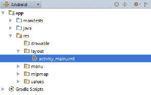

# 第二章：布局

在本章中，我们将涵盖以下主题：

+   定义和展开布局

+   使用 `RelativeLayout`

+   使用 `LinearLayout`

+   创建表格——`TableLayout` 和 `GridLayout`

+   `RecyclerView` 替代 `ListView`

+   在运行时更改布局属性

# 简介

在 Android 中，用户界面是在一个 **布局** 中定义的。布局可以在 XML 中声明或在代码中动态创建。（建议在 XML 中声明布局，而不是在代码中，以保持表示层与实现层的分离。）布局可以定义单个 `ListItem`、一个片段，甚至整个活动。布局文件存储在 `/res/layout` 文件夹中，并在代码中使用以下标识符引用：`R.layout.<filename_without_extension>`。

Android 提供了多种有用的 `Layout` 类，用于包含和组织活动（如按钮、复选框和其他视图）的各个元素。`ViewGroup` 对象是一个容器对象，作为 Android `Layout` 类家族的基类。放置在布局中的视图形成一个层次结构，最顶层的布局是父布局。

Android 提供了多种内置布局类型，专为特定目的设计，例如 `RelativeLayout`，它允许视图相对于其他元素定位。`LinearLayout` 可以堆叠视图或根据指定的方向水平对齐视图。`TableLayout` 可以用于布局视图网格。在各种布局中，我们还可以使用 `Gravity` 来对齐视图，并使用 `Weight` 控制提供比例大小。布局和 `ViewGroups` 可以嵌套在彼此内部以创建复杂的配置。提供了十几种不同的布局对象来管理小部件、列表、表格、画廊和其他显示格式，并且您还可以从基类派生来自定义布局。

Google 发布了一种名为 `ConstraintLayout` 的新布局。这个布局与 `RelativeLayout` 类似，因为视图是相对于彼此和父视图定位的，还有一个新元素称为指南。布局的重点是尽可能保持布局本身尽可能平坦（深度嵌套的布局可能导致性能问题）以及视觉布局编辑器。在保持编辑器与底层类同步的同时提供最佳的视觉编辑体验，这对 Google 来说是如此重要，以至于同一个团队开发了这两个。`ConstraintLayout` 现在是使用 Android Studio 创建的默认布局，也是本书中大多数示例的基础。（其他布局仍然可用，并在它们的布局提供最干净的 XML 时使用。）以下是 `ConstraintLayout` 类的链接，但为了获得最佳体验，建议使用 Android Studio 中的视觉编辑器：[`developer.android.com/reference/android/support/constraint/ConstraintLayout`](https://developer.android.com/reference/android/support/constraint/ConstraintLayout)。

# 定义和填充布局

当使用 Android Studio 向导创建新项目时，它会自动创建`res/layout/activity_main.xml`文件（如下面的截图所示）。然后，它使用`setContentView(R.layout.activity_main)`在`onCreate()`回调中填充 XML 文件：



对于这个食谱，我们将创建两个略有不同的布局，并通过按钮在它们之间切换。

# 准备工作

在 Android Studio 中创建一个新项目并命名为`InflateLayout`。一旦项目创建完成，展开`res/layout`文件夹，以便我们可以编辑`activity_main.xml`文件。在`Target Android devices`上使用默认的`Phone & Tablet`设置，并在`Add an Activity to Mobile`对话框中选择`Empty Activity`。

# 如何操作...

1.  编辑`res/layout/activity_main.xml`文件，使其包含以下按钮定义：

```java
<Button
    android:id="@+id/buttonLeft"
    android:layout_width="wrap_content"
    android:layout_height="wrap_content"
    android:layout_alignParentLeft="true"
    android:layout_centerVertical="true"
    android:onClick="onClickLeft"
    android:text="Left Button"
    app:layout_constraintBottom_toBottomOf="parent"
    app:layout_constraintHorizontal_bias="0.0"
    app:layout_constraintLeft_toLeftOf="parent"
    app:layout_constraintRight_toRightOf="parent"
    app:layout_constraintTop_toTopOf="parent"/>
```

1.  现在将`activity_main.xml`的副本复制并命名为`activity_main2.xml`。更改按钮以匹配以下内容：

```java
<Button
    android:id="@+id/buttonLeft"
    android:layout_width="wrap_content"
    android:layout_height="wrap_content"
    android:layout_alignParentLeft="true"
    android:layout_centerVertical="true"
    android:onClick="onClickRight"
    android:text="Right Button"
    app:layout_constraintBottom_toBottomOf="parent"
    app:layout_constraintHorizontal_bias="1.0"
    app:layout_constraintLeft_toLeftOf="parent"
    app:layout_constraintRight_toRightOf="parent"
    app:layout_constraintTop_toTopOf="parent"/>
```

1.  打开`MainActivity.java`并添加以下两个方法来处理按钮点击：

```java
public void onClickLeft(View view) { 
    setContentView(R.layout.activity_main2); 
} 

public void onClickRight(View view) { 
    setContentView(R.layout.activity_main); 
} 
```

1.  在设备或模拟器上运行此应用程序以查看其效果。

# 它是如何工作的...

关键在于对`setContentView()`的调用，我们之前在自动生成的`onCreate()`代码中已经遇到过。只需将布局 ID 传递给`setContentView()`，它就会自动填充布局。

这段代码的目的是使概念易于理解，但仅用于更改按钮属性（在这个例子中，我们可以在按钮点击时更改对齐方式）可能过于冗余。通常，在`onCreate()`方法中只需要填充布局一次，但有时你可能需要手动填充布局，就像我们在这里做的那样。（如果你手动处理方向变化，这将是一个很好的例子。）

# 更多内容...

除了像我们这里一样使用资源 ID 标识布局之外，`setContentView()`还可以接受一个 View 作为参数，例如：

```java
findViewById(R.id.myView) 
setContentView(myView); 
```

# 参见

如前所述，在第五章中了解有关*片段*的信息，用于为你的活动创建可重用的屏幕组件。

# 使用 RelativeLayout

如同在*简介*部分所述，`RelativeLayout`允许视图相对于彼此和父视图进行定位。`RelativeLayout`特别适用于减少嵌套布局的数量，这对于减少内存和处理需求非常重要。

# 准备工作

创建一个新项目并命名为`RelativeLayout`。Android Studio 默认使用`ConstraintLayout`，但在这个例子中，我们将用`RelativeLayout`替换它。在`Target Android devices`上使用默认的`Phone & Tablet`设置，并在`Add an Activity to Mobile`对话框中选择`Empty Activity`。

# 如何操作...

1.  打开`res/layout/activity_main.xml`文件并按以下方式更改它：

```java
<?xml version="1.0" encoding="utf-8"?>
<RelativeLayout
    xmlns:android="http://schemas.android.com/apk/res/android"
    android:layout_width="match_parent"
    android:layout_height="match_parent" >
    <TextView
        android:id="@+id/textView1"
        android:layout_width="wrap_content"
        android:layout_height="wrap_content"
        android:text="Centered"
        android:layout_centerVertical="true"
        android:layout_centerHorizontal="true" />
    <TextView
        android:id="@+id/textView2"
        android:layout_width="wrap_content"
        android:layout_height="wrap_content"
        android:text="Below Left"
        android:layout_below="@+id/textView1"
        android:layout_toLeftOf="@id/textView1" />
    <TextView
        android:id="@+id/textView3"
        android:layout_width="wrap_content"
        android:layout_height="wrap_content"
        android:text="Bottom Right"
        android:layout_alignParentBottom="true"
        android:layout_alignParentRight="true" />
</RelativeLayout>
```

1.  运行代码，或在设计选项卡中查看布局

# 它是如何工作的...

这是一个非常直接的练习，但它演示了`RelativeLayout`的几个选项：`layout_centerVertical`、`layout_centerHorizontal`、`layout_below`、`layout_alignParentBottom`等。

最常用的`RelativeLayout`布局属性包括以下内容：

+   `layout_below`: 此视图应位于指定的视图之下。

+   `layout_above`: 此视图应位于指定的视图之上。

+   `layout_alignParentTop`: 将此视图与父视图的顶部边缘对齐。

+   `layout_alignParentBottom`: 将此视图与父视图的底部边缘对齐。

+   `layout_alignParentLeft`: 将此视图与父视图的左侧边缘对齐。

+   `layout_alignParentRight`: 将此视图与父视图的右侧边缘对齐。

+   `layout_centerVertical`: 在父元素中垂直居中此视图。

+   `layout_centerHorizontal`: 在父元素中水平居中此视图。

+   `layout_center`: 在父元素中水平和垂直居中此视图。

要获取`RelativeLayout`参数的完整列表，请访问[`developer.android.com/reference/android/widget/RelativeLayout.LayoutParams.html`](http://developer.android.com/reference/android/widget/RelativeLayout.LayoutParams.html)。

# 还有更多...

与我们之前看到的相反，这里是一个使用`LinearLayout`仅用于居中`TextView`的示例（产生与`RelativeLayout`的`layout_center`参数相同的效果）：

```java
<?xml version="1.0" encoding="utf-8"?> 
<LinearLayout  
    android:orientation="horizontal" 
    android:layout_width="match_parent" 
    android:layout_height="match_parent" 
    android:gravity="center"> 
    <LinearLayout 
        android:layout_width="0dp" 
        android:layout_height="wrap_content" 
        android:layout_weight="1" 
        android:gravity="center" > 
        <TextView 
            android:id="@+id/imageButton_speak" 
            android:layout_width="wrap_content" 
            android:layout_height="wrap_content" 
            android:text="Centered" /> 
    </LinearLayout> 
</LinearLayout> 
```

注意，此布局比等效的`RelativeLayout`（嵌套在父`LinearLayout`中的`LinearLayout`）深一级。虽然这是一个简单的示例，但避免不必要的嵌套是一个好主意，因为它可能会影响性能，尤其是在布局被反复填充时（例如`ListItem`）。

# 参见

下一个菜谱，*使用 LinearLayout*，将为您提供另一种布局。

请参阅*使用层次查看器优化布局*菜谱，以获取有关高效布局设计的更多信息。

# 使用 LinearLayout

另一个常见的布局选项是`LinearLayout`，它根据指定的方向将子视图排列成单列或单行。默认方向（如果未指定）是垂直的，它将视图对齐在单列中。

`LinearLayout`有一个`RelativeLayout`中没有的关键特性——`weight`属性。在定义视图时，我们可以指定`layout_weight`参数，以允许视图根据可用空间动态调整大小。选项包括让视图填充所有剩余空间（如果视图具有更高的权重），让多个视图适应给定空间（如果所有视图都具有相同的权重），或者按权重成比例地分配视图间距。

我们将创建包含三个`EditText`视图的`LinearLayout`来演示如何使用`weight`属性。对于此示例，我们将使用三个`EditText`视图——一个用于输入`To Address`参数，另一个用于输入`Subject`，第三个用于输入`Message`。`To`和`Subject`视图将各占一行，剩余空间将分配给`Message`视图。

# 准备工作

创建一个新的项目，并将其命名为`LinearLayout`。我们将用`LinearLayout`替换在`activity_main.xml`中创建的默认`RelativeLayout`。使用默认的“手机和平板”设置在“目标 Android 设备”上，并在“添加活动到移动设备”对话框中选择“空活动”。

# 如何操作...

1.  打开`res/layout/activity_main.xml`文件，并按照以下方式替换：

```java
<LinearLayout  
    android:orientation="vertical" 
    android:layout_width="match_parent" 
    android:layout_height="match_parent"> 
    <EditText 
        android:id="@+id/editTextTo" 
        android:layout_width="match_parent" 
        android:layout_height="wrap_content" 
        android:hint="To" /> 
    <EditText 
        android:id="@+id/editTextSubject" 
        android:layout_width="match_parent" 
        android:layout_height="wrap_content" 
        android:hint="Subject" /> 
    <EditText 
        android:id="@+id/editTextMessage" 
        android:layout_width="match_parent" 
        android:layout_height="0dp" 
        android:layout_weight="1" 
        android:gravity="top" 
        android:hint="Message" /> 
</LinearLayout> 
```

1.  运行代码，或在“设计”选项卡中查看布局。

# 它是如何工作的...

当使用`LinearLayout`的垂直方向时，子视图将创建在单列中（堆叠在彼此之上）。前两个视图使用`android:layout_height="wrap_content"`属性，每个视图只有一行。要指定高度，`editTextMessage`使用以下方式：

```java
android:layout_height="0dp" 
android:layout_weight="1" 
```

当使用`LinearLayout`时，它告诉 Android 根据权重计算高度。权重为 0（如果未指定则为默认值）表示视图不应扩展。在这个例子中，`editTextMessage`是唯一一个定义了权重的视图，因此它将独自扩展以填充父布局中的任何剩余空间。

当使用水平方向时，指定`android:layout_height="0dp"`（连同权重）以让 Android 计算宽度。

有助于将权重属性视为百分比。在这种情况下，定义的总权重是 1，因此此视图获得剩余空间的 100%。如果我们给另一个视图分配权重 1，总数将是 2，因此此视图将获得 50%的空间。尝试给其他视图之一添加权重（确保同时将高度更改为`0dp`）以查看其效果。

如果你给其他一个（或两个）视图添加了权重，你是否注意到了文本位置？如果没有指定`gravity`的值，文本将仅保持在视图空间中心。`editTextMessage`视图指定了`android:gravity="top"`，这会将文本强制推到视图顶部。

# 还有更多...

可以使用位运算符`OR`组合多个属性选项。（Java 使用管道字符(|)表示`OR`）。例如，我们可以组合两个重力选项，使它们既沿父视图顶部对齐，又在其可用空间内居中：

```java
android:layout_gravity="top|center" 
```

应该注意的是，`layout_gravity`和`gravity`标签不是同一回事。`layout_gravity`指定视图在其父视图中的位置，而`gravity`控制视图内内容的定位，例如按钮上文本的对齐方式。

# 参见

之前的配方，*使用 RelativeLayout*。

# 创建表格 – TableLayout 和 GridLayout

当你需要在 UI 中创建表格时，Android 提供了两个方便的布局选项：`TableLayout`（连同`TableRow`）和`GridLayout`（在 API 14 中添加）。这两个布局选项都可以创建类似外观的表格，但使用不同的方法。使用`TableLayout`时，随着你构建表格，行和列会动态添加。使用`GridLayout`时，行和列的大小在布局定义中定义。

两种布局都没有更好，这只是使用最适合您需求的最佳布局。我们将使用每种布局创建一个 3 x 3 网格以进行比较，因为您可能会很容易地在同一应用程序中使用这两种布局。

# 准备工作

为了专注于布局并提供更易于比较的体验，我们将为这个食谱创建两个独立的应用程序。创建两个新的 Android 项目，第一个称为 `TableLayout`，另一个称为 `GridLayout`。在 `Target Android devices` 上使用默认的 `Phone & Tablet` 设置，并在 `Add an Activity to Mobile` 对话框中选择 `Empty Activity`。

# 如何做到这一点...

1.  从 `TableLayout` 项目开始，打开 `activity_main.xml`。将根布局更改为 `TableLayout`。

1.  向每个 `TableRow` 添加三个 `TextView` 对象的三个集合，以创建一个 3 x 3 矩阵。为了演示目的，列被标记为 A-C，行标记为 1-3，因此 `TextView` 对象的第一行将是 A1、B1 和 C1。最终结果将如下所示：

```java
<TableLayout 

    android:layout_width="match_parent" 
    android:layout_height="match_parent"> 
    <TableRow 
        android:layout_width="match_parent" 
        android:layout_height="match_parent"> 
        <TextView 
            android:layout_width="wrap_content" 
            android:layout_height="wrap_content" 
            android:text="A1" 
            android:id="@+id/textView1" /> 
        <TextView 
            android:layout_width="wrap_content" 
            android:layout_height="wrap_content" 
            android:text="B1" 
            android:id="@+id/textView2" /> 
        <TextView 
            android:layout_width="wrap_content" 
            android:layout_height="wrap_content" 
            android:text="C1" 
            android:id="@+id/textView3" /> 
    </TableRow> 
    <TableRow 
        android:layout_width="match_parent" 
        android:layout_height="match_parent"> 
        <TextView 
            android:layout_width="wrap_content" 
            android:layout_height="wrap_content" 
            android:text="A2" 
            android:id="@+id/textView4" /> 
        <TextView 
            android:layout_width="wrap_content" 
            android:layout_height="wrap_content" 
            android:text="B2" 
            android:id="@+id/textView5" /> 
        <TextView 
            android:layout_width="wrap_content" 
            android:layout_height="wrap_content" 
            android:text="C2" 
            android:id="@+id/textView6" /> 
    </TableRow> 
    <TableRow 
        android:layout_width="match_parent" 
        android:layout_height="match_parent"> 
        <TextView 
            android:layout_width="wrap_content" 
            android:layout_height="wrap_content" 
            android:text="A3" 
            android:id="@+id/textView7" /> 
        <TextView 
            android:layout_width="wrap_content" 
            android:layout_height="wrap_content" 
            android:text="B3" 
            android:id="@+id/textView8" /> 
        <TextView 
            android:layout_width="wrap_content" 
            android:layout_height="wrap_content" 
            android:text="C3" 
            android:id="@+id/textView9" /> 
    </TableRow> 
</TableLayout> 
```

1.  现在，打开 `GridLayout` 项目以编辑 `activity_main.xml`。将根布局更改为 `GridLayout`。向 `GridLayout` 元素添加 `columnCount=3` 和 `rowCount=3` 属性。

1.  现在，向 `GridLayout` 添加九个 `TextView` 对象。我们将使用与前面的 `TableLayout` 相同的文本，以便进行一致的比较。由于 `GridView` 不使用 `TableRow` 对象，前三个 `TextView` 对象位于第 1 行，接下来的三个位于第 2 行，以此类推。最终结果将如下所示：

```java
<GridLayout 

    android:layout_width="match_parent" 
    android:layout_height="match_parent" 
    android:columnCount="3" 
    android:rowCount="3"> 
    <TextView 
        android:layout_width="wrap_content" 
        android:layout_height="wrap_content" 
        android:text="A1" 
        android:id="@+id/textView1" /> 
    <TextView 
        android:layout_width="wrap_content" 
        android:layout_height="wrap_content" 
        android:text="B1" 
        android:id="@+id/textView2" /> 
    <TextView 
        android:layout_width="wrap_content" 
        android:layout_height="wrap_content" 
        android:text="C1" 
        android:id="@+id/textView3" /> 
    <TextView 
        android:layout_width="wrap_content" 
        android:layout_height="wrap_content" 
        android:text="A2" 
        android:id="@+id/textView4" /> 
    <TextView 
        android:layout_width="wrap_content" 
        android:layout_height="wrap_content" 
        android:text="B2" 
        android:id="@+id/textView5" /> 
    <TextView 
        android:layout_width="wrap_content" 
        android:layout_height="wrap_content" 
        android:text="C2" 
        android:id="@+id/textView6" /> 
    <TextView 
        android:layout_width="wrap_content" 
        android:layout_height="wrap_content" 
        android:text="A3" 
        android:id="@+id/textView7" /> 
    <TextView 
        android:layout_width="wrap_content" 
        android:layout_height="wrap_content" 
        android:text="B3" 
        android:id="@+id/textView8" /> 
    <TextView 
        android:layout_width="wrap_content" 
        android:layout_height="wrap_content" 
        android:text="C3" 
        android:id="@+id/textView9" /> 
</GridLayout> 
```

1.  您可以运行应用程序或使用设计选项卡来查看结果。

# 它是如何工作的...

如您在查看创建的表格时所见，表格在屏幕上基本上看起来相同。主要区别在于创建它们的代码。

在 `TableLayout` XML 中，每个行都是通过 `TableRow` 添加到表格中的。每个视图成为一个列。这不是一个要求，因为单元格可以省略或留空。（参见下一节中如何指定 `TableRow` 中的单元格位置。）

`GridLayout` 使用相反的方法。在创建表格时指定行数和列数。我们不需要指定行或列信息（尽管我们可以，如后文所述）。Android 将自动按顺序将每个视图添加到单元格中。

# 更多内容...

首先，让我们看看布局之间的更多相似之处。两种布局都具有拉伸列以使用剩余屏幕空间的能力。对于 `TableLayout`，在 XML 声明中添加以下属性：

```java
android:stretchColumns="1" 
```

`stretchColumns` 属性指定要拉伸的列的（零基）索引（`android:shrinkColumns` 是可以收缩的列的零基索引，因此表格可以适应屏幕）。

要使用 `GridLayout` 实现相同的效果，向 B 列中的所有视图（`textView2`、`textView5` 和 `textView8`）添加以下属性：

```java
android:layout_columnWeight="1" 
```

给定列中的所有单元格都必须定义权重，否则将不会拉伸。

现在，让我们看看一些差异，因为这确实是确定给定任务使用哪种布局的关键。首先要注意的是列和行是如何实际定义的。在 `TableLayout` 中，行是专门定义的，使用 `TableRow`。 （Android 将根据具有最多单元格的行来确定表格中的列数。）在定义视图时使用 `android:layoutColumn` 属性来指定列。

相比之下，`GridLayout` 在定义表格时（使用前面显示的 `columnCount` 和 `rowCount`）指定行和列的数量。

在前面的例子中，我们只是向 `GridLayout` 添加了 `TextView` 对象，并让系统自动定位它们。我们可以通过在定义视图时指定行和列位置来改变这种行为，如下所示：

```java
android:layout_row="2" 
android:layout_column="2" 
```

Android 在添加每个视图后自动增加单元格计数器，因此下一个视图也应该指定行和列，否则，你可能不会得到预期的结果。

与在 *使用 `LinearLayout`* 烹饪法中展示的 `LinearLayout` 一样，`GridLayout` 也提供了支持水平（默认）和垂直（*Using GridLayout*）方向的定位属性。方向决定了单元格的放置方式。（水平首先填充列，然后移动到下一行。垂直首先填充每行的第一列，然后移动到下一列。）

# `RecyclerView` 替代 `ListView`

如其名所示，`ListView` 是为显示信息列表而设计的。如果你在 Android 上有先前的经验，你可能之前已经遇到过 `ListView` 和可能 `GridView` 控件。如果不是在编码时，你很可能已经作为应用程序使用过它，因为它是可用控件中最常用的之一。对于大多数应用程序和用户来说，旧的 `ListView` 可能已经足够，并且没有引起任何问题。例如，大多数用户可能能够在他们的收件箱中无任何问题地看到他们的电子邮件列表。但对于一些人来说，他们收件箱中的电子邮件可能如此之多，以至于在滚动列表时，他们的设备会卡顿（滚动时的轻微暂停）。不幸的是，`ListView` 有许多这样的性能问题。

`ListView` 的最显著性能问题是由在滚动时为每个项目创建新项目对象引起的。尽管通过正确实现数据适配器可以消除大部分性能问题，但实现是可选的。正如其名所示，`RecyclerView` 基于回收列表项（在 `ListView` 适配器中是可选的部分）。控制还有其他变化。`ListView` 有许多内置功能，而 `RecyclerView` 非常基础，依赖于额外的辅助类来实现相同的功能。对于一些人来说，这感觉像是新控制的一个倒退，但这种设计使得它更容易扩展。

`RecyclerView` 真正发光的地方在于其扩展性和动画的灵活性。我们这里的示例使用了一个静态列表，因此没有展示内置的动画，但使用动态数据时，你的列表将利用到 Material Design 的外观和感觉。尽管 `ListView` 并未官方弃用，但推荐对于新项目使用 `RecyclerView`。开始时可能需要做更多的工作，但这个食谱将为你提供所有设置所需的代码。

# 准备工作

在 Android Studio 中创建一个名为 `RecyclerView` 的新项目。在 `Target Android devices` 上使用默认的 Phone & Tablet 设置，并在“Add an Activity to Mobile”对话框中选择 Empty Activity。

# 如何操作...

创建 `RecyclerView` 与在屏幕上放置控件一样简单。大部分工作都与适配器有关，我们将从一个静态列表创建适配器。`RecyclerView` 是作为一个单独的库分发的，因此需要将其作为依赖项添加到项目中。步骤如下：

1.  你可以通过 Android Studio UI 添加依赖项，或者将以下代码添加到 `build.gradle (Module: app)` 文件的 `dependencies` 部分中：

    `实现 'com.android.support:recyclerview-v7:27.1'`

注意：v7:27.1 在撰写本文时是当前的版本，但应更新到最新版本。（如果你的 IDE 没有使用最新版本，可能会给出警告。）

1.  打开 `activity_main.xml` 并将现有的 `<TextView />` 块替换为以下 `RecyclerView` 小部件：

```java
<android.support.v7.widget.RecyclerView
    android:id="@+id/recyclerView"
    android:layout_width="match_parent"
    android:layout_height="match_parent"
    app:layout_constraintBottom_toBottomOf="parent"
    app:layout_constraintLeft_toLeftOf="parent"
    app:layout_constraintRight_toRightOf="parent"
    app:layout_constraintTop_toTopOf="parent" />
```

1.  我们需要为适配器创建列表中的单个项的另一个布局。为此，在 `res\layout` 文件夹中创建一个名为 `item.xml` 的新文件，如下所示：

```java
<?xml version="1.0" encoding="utf-8"?>
<LinearLayout xmlns:android="http://schemas.android.com/apk/res/android"
    android:layout_width="match_parent"
    android:layout_height="wrap_content"
    android:orientation="vertical">
    <TextView
        android:id="@+id/textView"
        android:layout_width="match_parent"
        android:layout_height="wrap_content"
        android:text="TextView" />
</LinearLayout>
```

1.  现在，来到 `RecyclerView` 的核心——适配器。创建一个名为 `MyAdapter.java` 的新 Java 文件。我们的新类将扩展 `RecyclerView.Adapter` 类，因此我们需要重写几个关键方法。我们将在稍后讨论这个类的细节，但完整的代码如下：

```java
public class MyAdapter extends RecyclerView.Adapter<MyAdapter.MyViewHolder> {

    private List<String> nameList;

    public MyAdapter(List<String> list) {
        nameList = list;
    }

    @Override
    public MyViewHolder onCreateViewHolder(ViewGroup parent, int viewType) {
        LayoutInflater inflater = LayoutInflater.from(parent.getContext());
        View view = inflater.inflate(R.layout.item, parent, false);
        MyViewHolder myViewHolder = new MyViewHolder(view);
        return myViewHolder;
    }

    @Override
    public void onBindViewHolder(@NonNull MyViewHolder holder, final int position) {
        final String name = nameList.get(position);
        holder.textView.setText(name);
    }

    @Override
    public int getItemCount() {
        if (nameList==null) {
            return 0;
        } else {
            return nameList.size();
        }
    }

    public class MyViewHolder extends RecyclerView.ViewHolder {
        public TextView textView;

        public MyViewHolder(View itemVieww) {
            super(itemVieww);
            textView = itemView.findViewById(R.id.textView);
        }
    }
}
```

1.  在所有组件设置完毕后，最后一步是将它们全部组合起来。打开 `MainActivity.java` 文件，并将以下代码添加到现有的 `onCreate()` 方法中：

```java
List<String> list = new ArrayList<>();
list.add("China");
list.add("France");
list.add("Germany");
list.add("India");
list.add("Russia");
list.add("United Kingdom");
list.add("United States");

RecyclerView recyclerView = findViewById(R.id.recyclerView);

recyclerView.setHasFixedSize(true);
LinearLayoutManager linearLayoutManager = new LinearLayoutManager(this);
linearLayoutManager.setOrientation(LinearLayoutManager.VERTICAL);
recyclerView.setLayoutManager(linearLayoutManager);

MyAdapter myAdapter = new MyAdapter(list);
recyclerView.setAdapter(myAdapter);
```

# 它是如何工作的...

我们故意保持这个食谱的基础性，但正如你所见，即使是这个基本实现也有许多步骤。好消息是，有了这个基础，你可以轻松地根据需要扩展和修改 `RecyclerView`。想要你的列表水平滚动吗？你可以通过在 `setOrientation()` 调用中使用 `LinearLayoutManager.HORIZONTAL` 实现这一点。

如果你之前曾经使用过 Android `ListView`，那么前面的步骤看起来会非常熟悉。概念是相同的：我们创建一个适配器来持有项目列表。步骤 1 和 2 在活动中设置了`RecyclerView`。在步骤 3 中，我们指定了视觉布局并将其传递给适配器。在步骤 4 中，我们通过扩展`RecyclerView.Adapter`类创建了适配器。从代码中可以看出，我们需要重写三个方法：`onCreateViewHolder()`、`onBindViewHolder()`和`getItemCount()`。`RecyclerView`背后的关键概念是回收或重用项目视图。这意味着，当你有一个非常大的项目列表时，你不需要为每个项目创建一个新的视图对象（这在性能和内存使用方面成本很高），而是重用项目视图。所以当用户滚动浏览长列表时，当一个视图离开屏幕，它将被重用于下一个显示的项目。即使我们把我们列表中的所有国家都添加进去，也不会有足够的项目来看到性能差异，但当你处理包含数千个项目的列表时，尤其是如果这些项目包括图片，滚动时的性能差异将是明显的。

现在你已经理解了`RecyclerView`背后的概念，希望我们需要的重写方法都是不言自明的。适配器只调用`onCreateViewHolder()`来创建足够多的项目以显示在屏幕上（以及一些额外的项目用于滚动），而`onBindViewHolder()`则会在每个项目显示时被调用。

# 还有更多...

如果你运行了代码，那么你看到它是一个非常简单的应用。实际上，它并没有做任何比在可滚动的容器中显示列表更多的事情。大多数应用都需要与列表进行一些交互，那么我们如何响应点击事件？与较老的`ListView`不同，`RecyclerView`没有内置任何点击事件。这取决于你，程序员，来创建你需要的事件。（对于像我们例子中的基本项目，这可能看起来对程序员来说工作量更大，但当你处理带有按钮和其他交互控件复杂列表项时，`ListView`经常会阻碍你，你仍然需要实现自定义事件。）

要响应项目点击，请将以下代码添加到`MyAdapter`类中：

```java
private void remove(int position) {
    nameList.remove(position);
    notifyItemRemoved(position);
}
```

然后在步骤 4 中创建的`onBindViewHolder()`方法中添加以下代码：

```java
holder.itemView.setOnClickListener(new View.OnClickListener() {
    @Override
    public void onClick(View v) {
        remove(position);
    }
});
```

现在，当你运行代码时，应用将响应点击事件，通过移除被点击的项目。你也许还会注意到移除项目时的平滑动画。通过调用`RecyclerView`的`notifyItemRemoved()`和`notifyItemInserted()`方法，我们可以利用小部件内置的 Material Design 动画。

# 在运行时更改布局属性

在 Android 开发中，通常首选的做法是用 XML 定义 UI，用 Java 定义应用程序代码，将用户界面代码与应用程序代码分开。有时，从 Java 代码中更改（甚至构建）UI 要容易得多或更高效。幸运的是，这在 Android 中很容易实现。

在这个菜谱中，我们将获取`LayoutParams`对象的引用，以便在运行时更改边距。

# 准备工作

在这里，我们将使用 XML 设置一个简单的布局，并使用`LinearLayout.LayoutParams`对象在运行时更改视图的边距。使用带有名为`RuntimeProperties`的空活动的项目。在`目标 Android 设备`上使用默认的`手机和平板`设置，并在`添加活动到移动设备`对话框中选择`空活动`。

# 如何实现...

我们可以通过代码创建或操作任何标准布局或控件。在这个例子中，我们将使用`LinearLayout`：

1.  打开`activity_main.xml`文件，并按如下方式更改布局：

```java
<?xml version="1.0" encoding="utf-8"?>
<LinearLayout xmlns:android="http://schemas.android.com/apk/res/android"
    android:layout_width="match_parent"
    android:layout_height="match_parent" >

</LinearLayout>
```

1.  添加一个 ID 值为`textView`的`TextView`，如下所示：

```java
<TextView
    android:id="@+id/textView"
    android:layout_width="wrap_content"
    android:layout_height="wrap_content"
    android:text="TextView" />
```

1.  添加一个 ID 值为`button`的`Button`，如下所示：

```java
<Button
    android:id="@+id/button"
    android:layout_width="wrap_content"
    android:layout_height="wrap_content"
    android:text="Button" />
```

1.  打开`MainActivity.java`文件，并在`onCreate()`方法中添加以下代码以响应用户点击：

```java
Button button = (Button)findViewById(R.id.button);
button.setOnClickListener(new View.OnClickListener() {
    @Override
    public void onClick(View view) {
        ((TextView)findViewById(
                R.id.textView)).setText("Changed at runtime!");
        LinearLayout.LayoutParams params = (LinearLayout.
                LayoutParams)view.getLayoutParams();
        params.leftMargin += 5;
    }
});
```

1.  在设备或模拟器上运行程序。

# 它是如何工作的...

每个视图（以及因此`ViewGroup`）都有一组与之关联的布局参数。特别是，所有视图都有参数来通知其父视图它们期望的高度和宽度。这些参数由`layout_height`和`layout_width`参数定义。我们可以通过`getLayoutParams()`方法从代码中访问这些布局信息。布局信息包括布局高度、宽度、边距以及任何类特定的参数。

在这个例子中，我们通过获取当前按钮的`LayoutParams`并增加边距来在每次点击时移动按钮。
