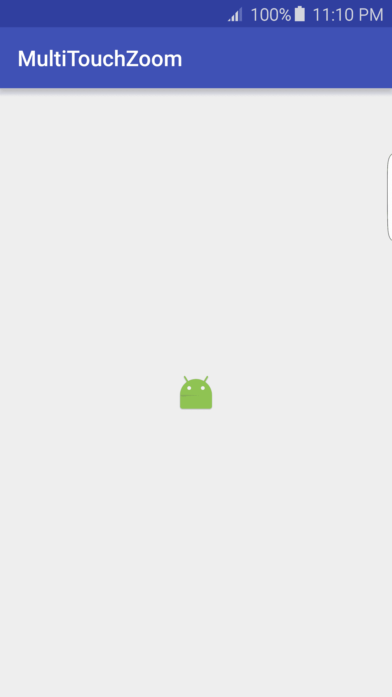
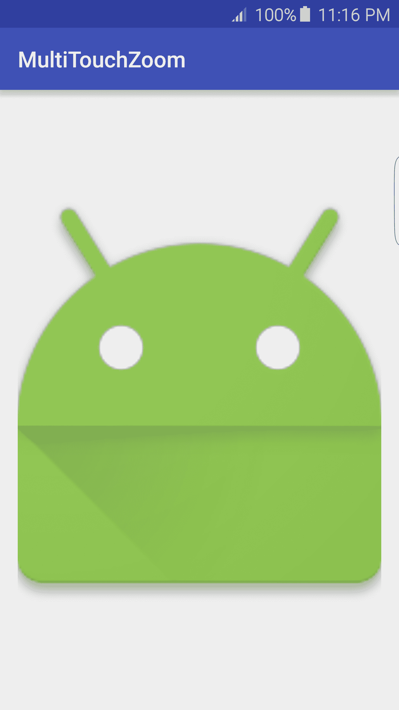
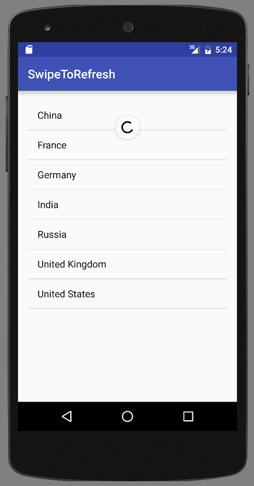
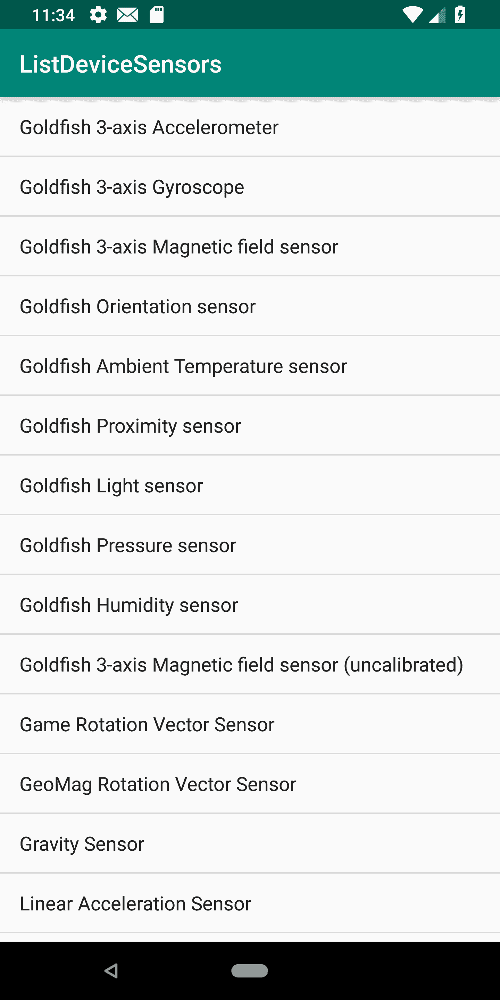

# 第九章：使用触摸屏和传感器

在本章中，我们将涵盖以下主题：

+   监听点击和长按事件

+   识别点击和其他常见手势

+   使用多指手势进行捏合缩放

+   滑动刷新

+   列出可用传感器——Android 传感器框架简介

+   读取传感器数据——使用 Android 传感器框架事件

+   读取设备方向

# 简介

现在，移动设备配备了各种传感器，通常包括陀螺仪、磁性、重力、压力和/或温度传感器，更不用说触摸屏了。这为与用户交互提供了许多新的和令人兴奋的选项。通过传感器，您可以确定三维设备位置以及设备的使用方式，例如摇晃、旋转、倾斜等。甚至触摸屏也提供了从简单的点击到手势和多指的许多新的输入方法。

我们将从这个章节开始探索触摸屏交互，从简单的点击和长按开始，然后继续使用 `SimpleOnGestureListener` 类检测常见的手势。接下来，我们将查看多指使用

使用 `ScaleGestureDetector` 进行捏合缩放手势。

本书旨在为您提供快速指南，以添加您自己的应用程序的功能和功能。因此，重点在于所需的代码，但强烈建议您也熟悉设计指南。

查看谷歌手势设计指南：[`www.google.com/design/spec/patterns/gestures.html`](https://www.google.com/design/spec/patterns/gestures.html)。

在本章的后半部分，我们将探讨 Android 中的传感器功能，使用 Android 传感器框架。我们将演示如何获取所有可用传感器的列表，以及如何检查特定传感器。一旦我们识别出传感器，我们将演示如何设置监听器以读取传感器数据。最后，我们将以演示如何确定设备方向结束本章。

# 监听点击和长按事件

几乎每个应用程序都需要识别并响应对基本事件，如点击和长按。这是如此基础，在大多数食谱中，我们使用 XML 的 `onClick` 属性，但更高级的监听器需要通过代码设置。

Android 提供了一个事件监听器接口，用于在发生某些操作时接收单个通知，如下列所示：

+   `onClick()`: 当视图被按下时调用

+   `onLongClick()`: 当视图被长按时调用

+   `onFocusChange()`: 当用户导航到或离开视图时调用

+   `onKey()`: 当硬件键被按下或释放时调用

+   `onTouch()`: 当发生触摸事件时调用

本食谱将演示如何响应用击事件以及长按事件。

# 准备工作

在 Android Studio 中创建一个新的项目，命名为 `PressEvents`。使用默认的 Phone & Tablet 选项，并在 `Add an Activity to Mobile` 对话框中选择 Empty Activity。

# 如何实现...

设置以接收基本视图事件非常简单。首先，我们将创建一个视图；在我们的示例中，我们将使用按钮，然后在活动的 `onCreate()` 方法中设置事件监听器。以下是步骤：

1.  打开 `activity_main.xml` 并将现有的 `TextView` 替换为以下 `Button`：

```java
<Button
    android:id="@+id/button"
    android:layout_width="wrap_content"
    android:layout_height="wrap_content"
    android:text="Button"
    app:layout_constraintBottom_toBottomOf="parent"
    app:layout_constraintLeft_toLeftOf="parent"
    app:layout_constraintRight_toRightOf="parent"
    app:layout_constraintTop_toTopOf="parent" />
```

1.  现在打开 `MainActivy.java` 并将以下代码添加到现有的 `onCreate()` 方法中：

```java
Button button = findViewById(R.id.button);
button.setOnClickListener(new View.OnClickListener() {
    @Override
    public void onClick(View v) {
        Toast.makeText(MainActivity.this, "Click", Toast.LENGTH_SHORT).show();
    }
});
button.setOnLongClickListener(new View.OnLongClickListener() {
    @Override
    public boolean onLongClick(View v) {
        Toast.makeText(MainActivity.this, "Long Press", Toast.LENGTH_SHORT).show();
        return true;
    }
});
```

1.  在设备或模拟器上运行应用程序，并尝试常规点击和长按。

# 它是如何工作的...

在本书中使用的多数示例中，我们使用以下属性在 XML 中设置 `onClick` 监听器：

```java
android:onClick="" 
```

你可能会注意到 XML `onClick()` 方法回调需要与 `setOnClickListener` 的 `.onClick()` 回调相同的方法签名。

```java
public void onClick(View v) {} 
```

这是因为当我们使用 XML `onClick` 属性时，Android 会自动为我们设置回调。此示例还演示了我们可以在一个视图上拥有多个监听器。

最后一点要注意的是，`onLongClick()` 方法返回一个布尔值，正如大多数其他事件监听器一样。返回 `true` 表示事件已被处理。

# 还有更多...

尽管按钮通常用于指示用户应按下的位置，但我们可以在任何视图（甚至 `TextView`）上使用 `setOnClickListener()` 和 `setOnLongClickListener()`。

如介绍中所述，还有其他事件监听器。你可以通过输入以下内容使用 Android Studio 的自动完成功能来列出可用监听器：

```java
button.setOn 
```

当你开始输入时，你会在 Android Studio 的自动完成列表中看到可用选项的列表。

# 识别点击和其他常见手势

与前一个食谱中描述的事件监听器不同，手势需要一个两步过程：

1.  收集运动数据

1.  分析数据以确定它是否匹配已知的手势

第一步在用户触摸屏幕时开始，这会触发带有在 `MotionEvent` 对象中发送的运动数据的 `onTouchEvent()` 回调。幸运的是，Android 使用 `GestureDetector` 类使第二步，即数据分析，变得更容易，该类可以检测以下手势：

+   `onTouchEvent()`

+   `onDown()`

+   `onFling()`

+   `onLongPress()`

+   `onScroll()`

+   `onShowPress()`

+   `onDoubleTap()`

+   `onDoubleTapEvent()`

+   `onSingleTapConfirmed()`

本食谱将演示使用 `GestureDetector.SimpleOnGestureListener` 来识别触摸和双击手势。

# 准备工作

在 Android Studio 中创建一个新的项目，并将其命名为 `CommonGestureDetector`。使用默认的“电话”和“平板电脑”选项，并在提示活动类型时选择“空活动”。

# 如何实现...

我们将使用活动本身来检测手势，因此我们不需要在布局中添加任何视图。打开 `MainActivity.java` 并执行以下步骤：

1.  在 `MainActivity` 类中添加以下全局变量：

```java
private GestureDetectorCompat mGestureDetector; 
```

1.  在 `MainActivity` 类中添加以下 `GestureListener` 类：

```java
private class GestureListener extends GestureDetector.SimpleOnGestureListener {
    @Override
    public boolean onSingleTapConfirmed(MotionEvent e) {
        Toast.makeText(MainActivity.this, "onSingleTapConfirmed", Toast.LENGTH_SHORT).show();
        return super.onSingleTapConfirmed(e);
    }
    @Override
    public boolean onDoubleTap(MotionEvent e) {
        Toast.makeText(MainActivity.this, "onDoubleTap", Toast.LENGTH_SHORT).show();
        return super.onDoubleTap(e);
    }
}
```

1.  将以下 `onTouchEvent()` 方法添加到 `MainActivity` 类中，以处理触摸事件通知：

```java
public boolean onTouchEvent(MotionEvent event) {
    mGestureDetector.onTouchEvent(event);
    return super.onTouchEvent(event);
}
```

1.  最后，将以下行代码添加到 `onCreate()` 中：

```java
mGestureDetector = new GestureDetectorCompat(this, new  GestureListener());
```

1.  在设备或模拟器上运行此应用程序。

# 工作原理...

我们使用 `GestureDetectorCompat`，这是支持库的一部分，它允许在运行 Android 1.6 及以上版本的设备上支持手势。

如配方介绍中所述，检测手势是一个两步过程。为了收集运动或手势数据，我们开始通过触摸事件跟踪运动。每次调用 `onTouchEvent()` 时，我们都将那些数据发送到 `GestureDetector`。`GestureDetector` 处理第二步，即分析数据。一旦检测到手势，就会调用适当的回调。我们的示例处理单次和双击手势。

# 还有更多...

您的应用程序可以通过简单地重写适当的回调来轻松添加对 `GestureDetector` 检测到的剩余手势的支持。

# 相关内容

+   请参阅下一配方，*使用多指手势进行缩放*，了解多指手势

# 使用多指手势进行缩放

之前的配方使用了 `SimpleOnGestureListener` 来提供对简单、单指手势的检测。在这个配方中，我们将使用 `SimpleOnScaleGestureListener` 类来检测常见的多指手势“缩放手势”。

这里是本配方中我们将创建的应用程序的两个截图。第一个显示了图标被缩小：



这第二个截图显示了图标被放大：



# 准备工作

在 Android Studio 中创建一个新的项目，并将其命名为 `MultiTouchZoom`。使用默认的 Phone & Tablet 选项，并在提示活动类型时选择 Empty Activity。

# 如何实现...

为了提供缩放手势的视觉指示，我们将使用带有应用程序图标的 `ImageView`。打开 `activity_main.xml` 并按照以下步骤操作：

1.  用以下 `ImageView` 替换现有的 `TextView`：

```java
<android.support.v7.widget.AppCompatImageView
    android:id="@+id/imageView"
    android:layout_width="wrap_content"
    android:layout_height="wrap_content"
    android:src="img/ic_launcher"
    app:layout_constraintBottom_toBottomOf="parent"
    app:layout_constraintLeft_toLeftOf="parent"
    app:layout_constraintRight_toRightOf="parent"
    app:layout_constraintTop_toTopOf="parent" />
```

1.  现在，打开 `MainActivity.java` 并将以下全局变量添加到类中：

```java
private ScaleGestureDetector mScaleGestureDetector;
private float mScaleFactor = 1.0f;
private AppCompatImageView mImageView;
```

1.  将以下 `onTouchEvent()` 实现添加到 `MainActivity` 类中：

```java
public boolean onTouchEvent(MotionEvent motionEvent) { 
    mScaleGestureDetector.onTouchEvent(motionEvent); 
    return true; 
} 
```

1.  将以下 `ScaleListener` 类添加到 `MainActivity` 类中：

```java
private class ScaleListener extends ScaleGestureDetector.SimpleOnScaleGestureListener {
    @Override
    public boolean onScale(ScaleGestureDetector scaleGestureDetector) {
        mScaleFactor *= scaleGestureDetector.getScaleFactor();
        mScaleFactor = Math.max(0.1f, Math.min(mScaleFactor, 10.0f));
        mImageView.setScaleX(mScaleFactor);
        mImageView.setScaleY(mScaleFactor);
        return true;
    }
} 
```

1.  将以下代码添加到现有的 `onCreate()` 方法中：

```java
mImageView=findViewById(R.id.imageView);
mScaleGestureDetector = new ScaleGestureDetector(this, new ScaleListener());
```

1.  要实验缩放手势功能，请在带触摸屏的设备上运行应用程序。

# 工作原理...

`ScaleGestureDetector` 通过分析手势数据并通过 `onScale()` 回调报告最终缩放因子来完成所有工作。我们通过在 `ScaleGestureDetector` 上调用 `getScaleFactor()` 来获取实际的缩放因子。

我们使用带有应用程序图标的 `ImageView` 来提供缩放的视觉表示，通过设置 `ImageView` 的缩放，使用从 `ScaleGestureDetector` 返回的缩放因子。我们使用以下代码来防止缩放变得过大或过小：

```java
mScaleFactor = Math.max(0.1f, Math.min(mScaleFactor, 10.0f)); 
```

# 滑动刷新

向下拉列表以指示手动刷新称为 Swipe-to-Refresh 手势。这是一个如此常见的功能，以至于这种功能被封装在一个名为`SwipeRefreshLayout`的单个小部件中。

此食谱将添加带有`ListView`的 Swipe-to-Refresh 功能。以下截图显示了刷新操作：



# 准备工作

在 Android Studio 中创建一个新的项目，并将其命名为`SwipeToRefresh`。使用默认的“手机和平板”选项，并在“添加活动到移动”对话框中选择“空活动”。

# 如何做到这一点...

首先，我们需要将`SwipeRefreshLayout`小部件和`ListView`添加到活动布局中，然后我们将在 Java 代码中实现刷新监听器。以下是详细步骤：

1.  打开`activity_main.xml`并用以下内容替换现有的约束布局：

```java
<?xml version="1.0" encoding="utf-8"?>
<RelativeLayout xmlns:android="http://schemas.android.com/apk/res/android"
    xmlns:app="http://schemas.android.com/apk/res-auto"
    xmlns:tools="http://schemas.android.com/tools"
    android:layout_width="match_parent"
    android:layout_height="match_parent"
    tools:context=".MainActivity">
    <android.support.v4.widget.SwipeRefreshLayout
        android:id="@+id/swipeRefresh"
        android:layout_width="match_parent"
        android:layout_height="match_parent">
        <ListView
            android:id="@android:id/list"
            android:layout_width="match_parent"
            android:layout_height="match_parent" />
    </android.support.v4.widget.SwipeRefreshLayout>
</RelativeLayout>
```

1.  现在打开`MainActivity.java`并为该类添加以下全局变量：

```java
SwipeRefreshLayout mSwipeRefreshLayout;
ListView mListView;
List mArrayList = new ArrayList<>();
private int mRefreshCount=0;
```

1.  将以下方法添加到`MainActivity`类中，以处理刷新：

```java
private void refreshList() {
    mRefreshCount++;
    mArrayList.add("Refresh: " + mRefreshCount);
    ListAdapter countryAdapter = new ArrayAdapter<String>(this, 
            android.R.layout.simple_list_item_1, mArrayList);
    mListView.setAdapter(countryAdapter);
    mSwipeRefreshLayout.setRefreshing(false);
}
```

1.  将以下代码添加到现有的`onCreate()`方法中：

```java
mSwipeRefreshLayout = findViewById(R.id.swipeRefresh);
mSwipeRefreshLayout.setOnRefreshListener(new SwipeRefreshLayout.OnRefreshListener() {
    @Override
    public void onRefresh() {
        refreshList();
    }
});
mListView = findViewById(android.R.id.list);
final String[] countries = new String[]{"China", "France", "Germany", "India",
        "Russia", "United Kingdom", "United States"};
mArrayList = new ArrayList<>(Arrays.asList(countries));
ListAdapter countryAdapter = new ArrayAdapter<String>(this,
        android.R.layout.simple_list_item_1, mArrayList);
mListView.setAdapter(countryAdapter);
```

1.  在设备或模拟器上运行应用程序。

# 它是如何工作的...

此食谱的大部分代码通过在每次调用刷新方法时向`ListView`添加项目来模拟刷新。实现 Swipe-to-Refresh 的主要步骤包括：

1.  添加`SwipeRefreshLayout`小部件

1.  在`SwipeRefreshLayout`中包含`ListView`

1.  添加`OnRefreshListener`以调用您的刷新方法

1.  在完成更新后调用`setRefreshing(false)`

就这样。这个小部件使得添加 Swipe-to-Refresh 变得非常简单！

# 更多内容...

虽然 Swipe-to-Refresh 手势现在是一个常见的功能，但仍然是一个好习惯，包括一个菜单项（特别是为了可访问性原因）。以下是一个 XML 菜单布局的片段：

```java
<menu  > 
    <item 
        android:id="@+id/menu_refresh" 
        android:showAsAction="never" 
        android:title="@string/menu_refresh"/> 
</menu> 
```

在`onOptionsItemSelected()`回调中调用您的刷新方法。当从代码执行刷新操作，例如从菜单项事件时，您想通知`SwipeRefreshLayout`刷新，以便它可以更新 UI。以下代码可以做到这一点：

```java
SwipeRefreshLayout.setRefreshing(true); 
```

这告诉`SwipeRefreshLayout`开始刷新，以便它可以显示正在进行的指示器。

# 列出可用传感器 - Android 传感器框架简介

Android 使用 Android 传感器框架支持硬件传感器。该框架包括以下类和接口：

+   `SensorManager`

+   `Sensor`

+   `SensorEventListener`

+   `SensorEvent`

大多数 Android 设备都包括硬件传感器，但它们在不同制造商和型号之间差异很大。如果您的应用程序使用传感器，您有两个选择：

+   在 AndroidManifest 中指定传感器

+   在运行时检查传感器

要指定您的应用程序使用传感器，请在 AndroidManifest 中包含`<uses-feature>`声明。以下是一个需要可用指南针的示例：

```java
<uses-feature android:name="android.hardware.sensor.compass" android:required="true"/>
```

如果您的应用程序使用指南针，但不需要它来运行，则应将`android:required="false"`设置为；否则，您的应用程序将无法从 Google Play 安装。

传感器被分为以下三个类别：

+   运动传感器：测量沿三个轴的加速度和旋转力

+   环境传感器：测量局部环境，如环境空气温度和压力、湿度以及光照

+   位置传感器：使用位置和磁力计测量设备的物理位置

Android SDK 支持以下传感器类型：

| 传感器 | 检测 | 用途 |
| --- | --- | --- |
| `TYPE_ACCELEROMETER` | 包含重力运动检测 | 用于确定震动、倾斜等 |
| `TYPE_AMBIENT_TEMPERATURE` | 测量环境室温 | 用于确定局部温度 |
| `TYPE_GRAVITY` | 测量三个轴上的重力力 | 用于运动检测 |
| `TYPE_GYROSCOPE` | 测量三个轴上的旋转 | 用于确定转弯、旋转等 |
| `TYPE_LIGHT` | 测量光强度 | 用于设置屏幕亮度 |
| `TYPE_LINEAR_ACCELERATION` | 排除重力运动检测 | 用于确定加速度 |
| `TYPE_MAGNETIC_FIELD` | 测量地磁场 | 用于创建指南针或确定方位 |
| `TYPE_PRESSURE` | 测量空气压力 | 用于气压计 |
| `TYPE_PROXIMITY` | 测量相对于屏幕的物体 | 用于确定在通话期间设备是否被紧贴耳朵 |
| `TYPE_RELATIVE_HUMIDITY` | 测量相对湿度 | 用于确定露点和湿度 |
| `TYPE_ROTATION_VECTOR` | 测量设备方向 | 用于检测运动和旋转 |

有两个额外的传感器，`TYPE_ORIENTATION`和`TYPE_TEMPERATURE`，已经被弃用，因为它们已被新的传感器所取代。

本教程将演示如何检索可用传感器的列表。以下是 Pixel 2 模拟器的截图：



# 准备工作

在 Android Studio 中创建一个新的项目，并将其命名为`ListDeviceSensors`。使用默认的 Phone & Tablet 选项，并在提示活动类型时选择 Empty Activity。

# 如何操作...

首先，我们将查询可用的传感器列表，然后将在`ListView`中显示结果。以下是详细步骤：

1.  打开`activity_main.xml`，将现有的`TextView`替换为以下内容：

```java
<ListView
    android:id="@+id/list"
    android:layout_width="match_parent"
    android:layout_height="match_parent"
    app:layout_constraintBottom_toBottomOf="parent"
    app:layout_constraintLeft_toLeftOf="parent"
    app:layout_constraintRight_toRightOf="parent"
    app:layout_constraintTop_toTopOf="parent" />
```

1.  接下来，打开`ActivityMain.java`，并将以下代码添加到现有的`onCreate()`方法中：

```java
ListView listView = findViewById(R.id.list);
List sensorList = new ArrayList<String>();

List<Sensor> sensors = ((SensorManager) getSystemService(Context.SENSOR_SERVICE))
        .getSensorList(Sensor.TYPE_ALL);
for (Sensor sensor : sensors ) {
    sensorList.add(sensor.getName());
}
ListAdapter sensorAdapter = new ArrayAdapter<String>(this,
        android.R.layout.simple_list_item_1, sensorList);
listView.setAdapter(sensorAdapter);
```

1.  在设备或模拟器上运行程序。

# 它是如何工作的...

以下代码行负责获取可用传感器的列表；其余代码将填充`ListView`：

```java
List<Sensor> sensors = ((SensorManager) getSystemService(
     Context.SENSOR_SERVICE)).getSensorList(Sensor.TYPE_ALL);
```

注意我们返回了一个`Sensor`对象列表。我们只获取传感器名称以在`ListView`中显示，但还有其他属性可用。请参阅*另请参阅*部分提供的完整列表。

# 更多内容...

重要的是要注意，一个设备可以有多种相同类型的传感器。如果你正在寻找特定的传感器，你可以传递介绍中显示的表中的一个常量。在这种情况下，如果你想查看所有可用的加速度计传感器，你可以使用这个调用：

```java
List<Sensor> sensors = sensorManager.getSensorList(Sensor.TYPE_ACCELEROMETER); 
```

如果你不是在寻找传感器列表，而是需要与特定传感器一起工作，你可以使用以下代码检查默认传感器：

```java
SensorManager sensorManager =  ((SensorManager) getSystemService(Context.SENSOR_SERVICE));
if (sensorManager.getDefaultSensor(Sensor.TYPE_ACCELEROMETER) != null){
    //Sensor is available - do something here 
}
```

# 另请参阅

+   Android 开发者传感器网站[`developer.android.com/reference/android/hardware/Sensor.html`](http://developer.android.com/reference/android/hardware/Sensor.html)

# 读取传感器数据 – 使用 Android 传感器框架事件

之前的配方，*列出可用传感器 – Android 传感器框架简介*，提供了对 Android 传感器框架的介绍。现在，我们将查看使用`SensorEventListener`读取传感器数据。`SensorEventListener`接口只有两个回调：

+   `onSensorChanged()`

+   `onAccuracyChanged()`

当传感器有新数据要报告时，它将使用`SensorEvent`对象调用`onSensorChanged()`。本配方将演示读取光传感器，但由于所有传感器都使用相同的框架，因此将此示例适配到任何其他传感器都非常容易。（请参阅之前配方介绍中提供的传感器类型列表。）

# 准备工作

在 Android Studio 中创建一个新的项目，并将其命名为`ReadingSensorData`。使用默认的 Phone & Tablet 选项，并在提示活动类型时选择 Empty Activity。

# 如何做...

我们将在活动布局中添加一个`TextView`来显示传感器数据，然后我们将添加`SensorEventListener`到 Java 代码中。我们将使用`onResume()`和`onPause()`事件来启动和停止我们的事件监听器。要开始，打开`activity_main.xml`并按照以下步骤操作：

1.  按照以下方式修改现有的`TextView`：

```java
<TextView
    android:id="@+id/textView"
    android:layout_width="wrap_content"
    android:layout_height="wrap_content"
    android:text="0"
    app:layout_constraintBottom_toBottomOf="parent"
    app:layout_constraintLeft_toLeftOf="parent"
    app:layout_constraintRight_toRightOf="parent"
    app:layout_constraintTop_toTopOf="parent" />
```

1.  现在，打开`MainActivity.java`并添加以下全局变量声明：

```java
private SensorManager mSensorManager; 
private Sensor mSensor; 
private TextView mTextView; 
```

1.  在`MainActivity`类中实现`SensorListener`类，如下所示：

```java
private SensorEventListener mSensorListener = new SensorEventListener() {
    @Override
    public void onSensorChanged(SensorEvent event) {
        mTextView.setText(String.valueOf(event.values[0]));
    }
    @Override
    public void onAccuracyChanged(Sensor sensor, int accuracy) {
        //Nothing to do
    }
};
```

1.  我们将在`onResume()`和`onPause()`中注册和取消注册传感器事件，如下所示：

```java
@Override
protected void onResume() {
    super.onResume();
    mSensorManager.registerListener(mSensorListener, mSensor, SensorManager.SENSOR_DELAY_NORMAL);
}

@Override
protected void onPause() {
    super.onPause();
    mSensorManager.unregisterListener(mSensorListener);
}
```

1.  将以下代码添加到`onCreate()`中：

```java
mTextView = (TextView)findViewById(R.id.textView);
mSensorManager = (SensorManager) getSystemService(Context.SENSOR_SERVICE);
mSensor = mSensorManager.getDefaultSensor(Sensor.TYPE_LIGHT);
```

1.  你现在可以在物理设备上运行应用程序，以查看来自光传感器的原始数据。

# 它是如何工作的...

使用 Android 传感器框架首先是从获取传感器开始，我们在`onCreate()`中这样做。在这里，我们调用`getDefaultSensor()`，请求`TYPE_LIGHT`。我们在`onResume()`中注册监听器，并在`onPause()`中再次取消注册以减少电池消耗。当我们调用`registerListener()`时，我们传递我们的`mSensorListener`对象。

在我们的案例中，我们只寻找传感器数据，这些数据在`onSensorChanged()`回调中发送。当传感器发生变化时，我们使用传感器数据更新`TextView`。

# 更多...

现在你已经使用过一个传感器了，你知道如何使用所有传感器，因为它们都使用相同的框架。当然，你对数据的处理将因你所读取的数据类型而大不相同。环境传感器，如这里所示，返回一个单一值，但位置和运动传感器也可以返回额外的元素，如下所示。

# 环境传感器

Android 支持以下四种环境传感器：

+   湿度

+   光

+   压力

+   温度

环境传感器通常更容易处理，因为返回的数据是单个元素，通常不需要校准或过滤。我们在这个菜谱中使用了光传感器（`Sensor.TYPE_LIGHT`），因为大多数设备都包含光传感器来控制屏幕亮度。

# 位置传感器

位置传感器包括：

+   地磁场

+   距离

以下传感器类型使用地磁场：

+   `TYPE_GAME_ROTATION_VECTOR`

+   `TYPE_GEOMAGNETIC_ROTATION_VECTOR`

+   `TYPE_MAGNETIC_FIELD`

+   `TYPE_MAGNETIC_FIELD_UNCALIBRATED`

这些传感器在`onSensorChanged()`事件中返回三个值，除了`TYPE_MAGNETIC_FIELD_UNCALIBRATED`，它发送六个值。

第三个传感器，方向传感器，已被弃用，现在建议使用`getRotation()`和`getRotationMatrix()`来计算方向变化。（有关设备方向，如纵向和横向模式，请参阅下一道菜谱：*读取设备方向*。）

# 运动传感器

运动传感器包括以下：

+   加速度计

+   惯性仪

+   重力

+   线性加速度

+   旋转向量

这些包括以下传感器类型：

+   `TYPE_ACCELEROMETE`

+   `TYPE_GRAVITY`

+   `TYPE_GYROSCOPE`

+   `TYPE_GYROSCOPE_UNCALIBRATED`

+   `TYPE_LINEAR_ACCELERATION`

+   `TYPE_ROTATION_VECTOR`

+   `TYPE_SIGNIFICANT_MOTION`

+   `TYPE_STEP_COUNTER`

+   `TYPE_STEP_DETECTOR`

这些传感器也包括三个数据元素，除了最后三个。`TYPE_SIGNIFICANT_MOTION`和`TYPE_STEP_DETECTOR`表示一个事件，而`TYPE_STEP_COUNTER`返回自上次启动（传感器处于活动状态）以来的步数。

# 参见

+   *列出可用传感器 - Android 传感器框架简介*菜谱

+   在第十章*图形和动画*的*使用传感器数据和 RotateAnimation 创建指南针*菜谱中

+   有关设备方向，请参阅下一道菜谱：*读取设备方向*

+   请参阅第十四章*位置和地理围栏使用*中的 GPS 和位置菜谱

# 读取设备方向

虽然 Android 框架会在方向更改时自动加载新资源（如布局），但有时您可能希望禁用此行为。如果您希望被通知方向更改而不是 Android 自动处理，请将以下属性添加到 Android Manifest 中的 Activity：

```java
android:configChanges="keyboardHidden|orientation|screenSize" 
```

当以下配置更改发生时，系统将通过 `onConfigurationChanged()` 方法通知您，而不是自动处理：

+   `keyboardHidden`

+   `orientation`

+   `screenSize`

`onConfigurationChanged()` 方法的签名如下：

```java
onConfigurationChanged (Configuration newConfig) 
```

您将在 `newConfig.orientation` 中找到新的方向。

禁用自动配置更改（这会导致布局重新加载并重置状态信息）不应作为正确保存状态信息的替代方案。您的应用程序仍然可能在任何时间被中断或完全停止，并由系统终止。（有关如何正确保存状态的信息，请参阅第一章，*活动*中的*保存活动状态*。）

本食谱将演示如何确定当前设备方向。

# 准备工作

在 Android Studio 中创建一个新的项目，命名为 `GetDeviceOrientation`。使用默认的 Phone & Tablet 选项，并在提示活动类型时选择 Empty Activity。

# 如何操作...

我们将在布局中添加一个按钮以按需检查方向。首先打开 `activity_main.xml` 并按照以下步骤操作：

1.  用以下 `Button` 替换现有的 `TextView`：

```java
<Button
    android:layout_width="wrap_content"
    android:layout_height="wrap_content"
    android:text="Check Orientation"
    android:id="@+id/button"
    android:onClick="checkOrientation"
    app:layout_constraintBottom_toBottomOf="parent"
    app:layout_constraintLeft_toLeftOf="parent"
    app:layout_constraintRight_toRightOf="parent"
    app:layout_constraintTop_toTopOf="parent" />
```

1.  添加以下方法来处理按钮点击：

```java
public void checkOrientation(View view){
    int orientation = getResources()
            .getConfiguration().orientation;
    switch (orientation) {
        case Configuration.ORIENTATION_LANDSCAPE:
            Toast.makeText(MainActivity.this, "ORIENTATION_LANDSCAPE", 
                    Toast.LENGTH_SHORT).show();
            break;
        case Configuration.ORIENTATION_PORTRAIT:
            Toast.makeText(MainActivity.this, "ORIENTATION_PORTRAIT", 
                    Toast.LENGTH_SHORT).show();
            break;
        case Configuration.ORIENTATION_UNDEFINED:
            Toast.makeText(MainActivity.this, "ORIENTATION_UNDEFINED", 
                    Toast.LENGTH_SHORT).show();
            break;
    }
}
```

1.  在设备或模拟器上运行应用程序。

使用 *Ctrl* + *F11* 来旋转模拟器。

# 工作原理...

要获取当前方向，我们只需调用此行代码：

```java
getResources().getConfiguration().orientation 
```

方向以 `int` 的形式返回，我们将其与三个可能值之一进行比较，如下所示。

# 更多...

另一个可能需要知道当前方向的情况是在处理相机数据、图片和/或视频时。在这种情况下，您需要根据需要获取设备方向。

# 获取当前设备旋转

通常，图像可能会根据设备方向或为了补偿当前方向而旋转。在这种情况下，还有一个选项可以获取旋转：

```java
int rotation = getWindowManager().getDefaultDisplay().getRotation();
```

在上一行代码中，`rotation` 将是以下值之一：

+   `Surface.ROTATION_0`

+   `Surface.ROTATION_90`

+   `Surface.ROTATION_180`

+   `Surface.ROTATION_270`

旋转值将从其正常方向开始。例如，当使用正常方向为横向的桌子时，如果以纵向方向拍照，值将是 `ROTATION_90` 或 `ROTATION_270`。

# 参见

+   在第一章，*活动*中的*保存活动状态*食谱

+   有关`Configuration`类的更多信息，请参阅以下开发者链接：[`developer.android.com/reference/android/content/res/Configuration.html`](http://developer.android.com/reference/android/content/res/Configuration.html)

+   有关`getRotation()`方法的更多信息，请参阅以下链接：[`developer.android.com/reference/android/view/Display.html#getRotation()`](http://developer.android.com/reference/android/view/Display.html#getRotation())
