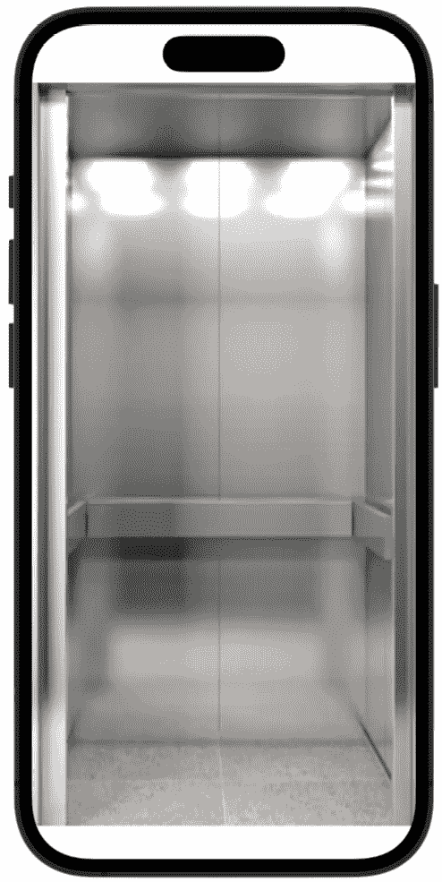
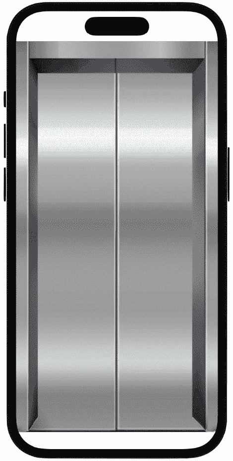
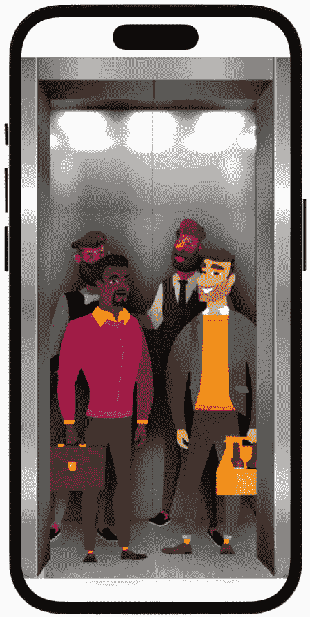
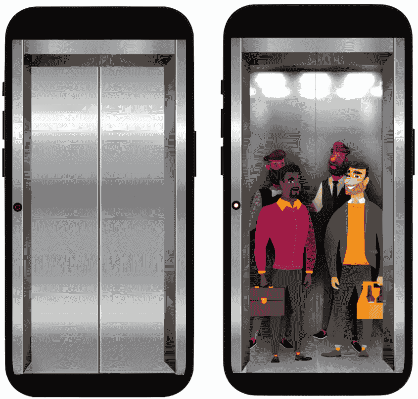
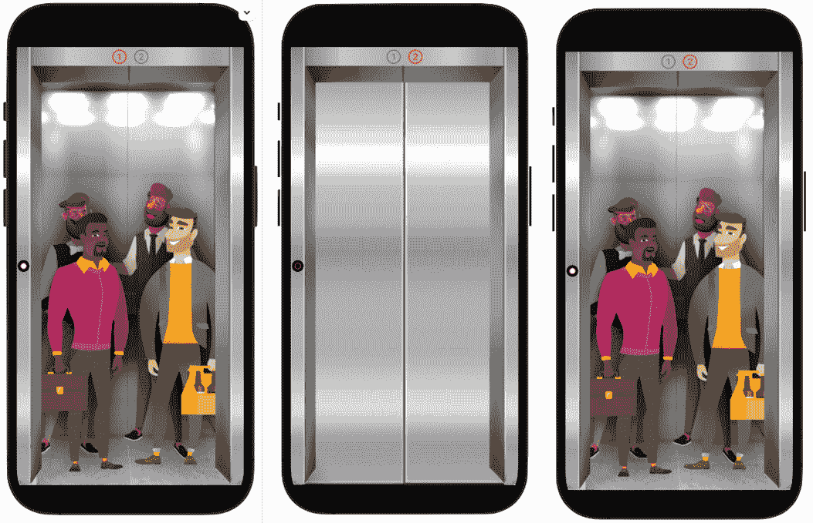

# 第十一章：动画电梯

欢迎来到电梯项目！在这个项目中，我们将创建一个带有声音、楼层灯光、按钮，甚至内部人员图像的工作电梯。我们将使用从 Swift timer 类中可用的计时器来控制电梯，就像我们在之前的项目中做的那样。

为了将这些元素组合在一起，我们将使用 `@ObservableObject` 协议创建一个数据模型。苹果建议将数据模型作为存储和处理应用程序使用的数据的地方。数据模型也与应用程序的用户界面分开，其中创建视图。保持数据和 UI 分开的原因是这种范式促进了模块化和可测试性。当数据不与 UI 代码混合时，更容易找到逻辑中的错误。一旦我们设置了数据模型，我们就可以使用发布包装器在应用程序的任何地方发布该数据，就像我们稍后将要看到的那样。

在本章中，我们将涵盖以下主题：

+   设置项目和添加 `Binding` 变量

+   使用图片和 `GeometryReader` 视图组装电梯

+   将人员放入电梯内

+   创建数据模型并使用 `@ObservableObject` 协议

+   添加数据模型函数

+   添加背景、按钮和动画门

+   添加楼层指示灯

# 技术要求

您可以在 GitHub 上下载资源和完成的项目：[`github.com/PacktPublishing/Animating-SwiftUI-Applications`](https://github.com/PacktPublishing/Animating-SwiftUI-Applications)。

# 设置项目和添加 Binding 变量

好的，让我们开始吧！像往常一样，我们将创建一个新的 Xcode 项目（我将我的项目命名为 `Elevator`）。

接下来，在 GitHub 仓库中，将 `Chapter 11` 文件夹中的所有图片拖放到资产目录中。这些图片包括 `doorDrame`、`leftDoor`、`rightDoor`、`inside`、`man`、`man2`、`man3` 和 `man4`。

然后，将音频文件 – `doorsOpenClose` 和 `elevatorChime` – 放入项目导航器。

接下来，我们需要一个新的文件，我们可以在这个文件中组装电梯并添加人员，因此创建一个新的 SwiftUI 视图文件，并将其命名为 `ElevatorAndPeopleView`。我们在这个文件中只需要一个变量，它将是绑定变量。让我们在 `ElevatorAndPeopleView` 结构体顶部添加它：

```swift
    @Binding var doorsOpened: Bool
```

这个变量将控制电梯门的开启和关闭。

让我们更新 `Previews`，以便代码可以无错误地构建。在文件底部，修改 `Previews` 结构体，使其看起来如下：

```swift
struct ElevatorAndPeopleView_Previews: PreviewProvider {
    static var previews: some View {
        ElevatorAndPeopleView(doorsOpened: 
          .constant(false), moveMouth: .constant(false))
    } 
```

代码将 `false` 的值添加到两个绑定属性中，项目再次干净地构建。

我们现在可以继续构建电梯。

# 使用图片和 GeometryReader 视图组装电梯

下一步是使用资产目录中的一些图片来制作一个电梯。

我们将首先添加电梯的内部部分，这将在 `body` 属性内部添加以下代码来完成：

```swift
 ZStack {
 GeometryReader { geo in
                }
        }
```

首先，我们有 `ZStack` 来容纳所有后续视图，以及一个 `GeometryReader` 视图。

`GeometryReader` 视图是一个容器视图，它将其内容定义为它自己的大小和坐标空间的一个函数。它有点像我们使用的其他容器，例如 `VStack` 或 `HStack`，但不同之处在于 `GeometryReader` 由于其代理参数 `geo` 常量（你可以将其命名为任何你想要的）而具有更多的灵活性。

此代理将包含有关容器大小和坐标空间的信息，我们可以将此信息传递给 `GeometryReader` 内部的子视图，这有助于我们精确地相对于容器调整其子视图的大小和位置。`GeometryReader` 视图还确保了所有 iPhone 和 iPad 设备上的视图都能完美对齐，无论其大小如何。

我们将使用 `GeometryReader` 来调整电梯的所有部分以及内部人的大小和位置。

接下来，让我们在 `GeometryReader` 的主体内部添加创建电梯内部结构的代码：

```swift
//MARK: - INSIDE ELEVATOR SCENE
    Image("inside").resizable()
      .frame(maxWidth: geo.size.width,
      maxHeight: geo.size.height)
```

`Image` 初始化器将名为 `inside` 的图像添加到场景中，然后使用 `frame` 修改器将此图像的大小设置为屏幕的最大宽度和最大高度。它使用我们用 `GeometryReader` 视图创建的 `geo` 代理常量来设置此大小。

预览现在显示电梯的内部：



图 11.1：电梯内部

让我们继续组装电梯，接下来添加门。门将附加动画，以便它们可以滑动打开和关闭，然后稍后我们将为它们添加计时器，以便在按下初始按钮后自动运行。因此，继续在 `GeometryReader` 视图内部，添加以下代码以设置门：

```swift
  //MARK: - ADD THE DOORS
  HStack {
      Image("leftDoor").resizable()
          .frame(maxWidth: geo.size.width)
          .offset(x: doorsOpened ? -geo.size.width / 2 : 4)
      Image("rightDoor").resizable()
          .frame(maxWidth: geo.size.width)
          .offset(x: doorsOpened ? geo.size.width / 2 : -4)
              }
```

我们将门放入 `HStack` 中，因为它们需要并排定位。门的大小使用 `frame` 修改器和 `geo` 代理常量设置，就像我们对 `inside` 电梯图像所做的那样。两扇门也附加了 `offset` 修改器，这将使它们位于屏幕的相对两侧，完全打开。

打开门和关闭的过程由 `geo` 代理常量处理。当左侧门的 `doorsOpened` 属性变为 `true` 时，`geo` 代理常量将沿着 *x*- 轴移动门，向左移动并离开屏幕。门移动的量是门宽度的二分之一。左侧门向左移动而不是向右移动的原因是我们给 `geo` 常量前加了负号。当使用负值并且对象正在沿 *x*- 轴偏移时，该对象将向左移动，而正值将使对象向右移动。

当`doorsOpened`属性变为`false`时，`offset`修改器反转动画，左门关闭。

对于右门，我们做同样的事情，只是使用正值的`geo`常量，将门沿*X*轴向右移动以打开它。用于两个门的`4`和`-4`的值包括在内，以帮助在关闭位置时使两扇门紧密贴合。

到目前为止，这是`ElevatorAndPeopleView`文件中的场景看起来像什么：


图 11.2：电梯门

我们将电梯的内部和门放在一起，并且我们有操作门的动画机制，但直到我们在`ContentView`中调用此文件，我们才看不到任何动作发生，我们还有一些组装工作要做。

让我们在电梯的外侧添加一个框架，使其看起来像实际的电梯，并为添加电梯按钮提供一个地方。在`HStack`的闭合括号之后添加以下代码，仍然在`GeometryReader`视图中：

```swift
      Image("doorFrame").resizable()
          .frame(maxWidth: geo.size.width, maxHeight:
            geo.size.height)
```

在这里，我们正在将`doorFrame`图像添加到场景中，并且因为我们希望框架围绕整个电梯，所以我们使用了与`inside`图像相同的代码——我们再次使用了`geo`代理常量，并通过将图像设置为最大宽度和高度，门框架在电梯门周围创建了一个漂亮的边框。到目前为止的结果如下：



图 11.3：电梯框架

现在，让我们添加打开和关闭门的动画代码，并控制在`ContentView`中激活后的门的速度和延迟。这只有一行代码，可以放在`GeometryReader`视图的闭合括号之后：

```swift
.animation(Animation.easeInOut.speed(0.09).delay(0.3),
  value: doorsOpened)
```

在这里，我们使用了`animation`修改器。然后，我们为`speed`函数传递了`0.09`的值，这将控制门开启和关闭的速度。还增加了一个`0.3`秒的轻微延迟，这将使门开启和关闭的延迟恰到好处，以保持与即将添加的楼层灯的同步。

我们接近完成使用此文件——剩下要添加的部分只有人图像。当然，如果你愿意，可以将人代码放入一个单独的文件中，但由于此文件中的代码不多，在这里继续工作将没问题。

# 将人放入电梯中

我们将在我们的电梯中添加四个角色，让我们从`manOne`图像开始——在文件的顶部附近`frame`修改器之后添加以下代码，在`GeometryReader`视图中：

```swift
  //MARK: - ADD THE PEOPLE
      Image("manOne")
        .resizable().aspectRatio(contentMode: .fit)
        .frame(maxWidth: geo.size.width - 200, maxHeight:
          geo.size.height - 300)
        .shadow(color: .black, radius: 30, x: 5, y: 5)
        .offset(x: 0, y: 250)
```

我们在这里所做的就是将 `manOne` 图像引入场景，然后为图像添加正确的宽高比。接下来，我们使用 `frame` 修改器设置图像的大小，但这次不同的是，我们使用 `GeometryReader` 的代理常量来动态设置大小；当以这种方式设置图像的宽度和高度时，场景将在所有苹果设备上按比例放大或缩小以适应各种屏幕尺寸。

我正在将宽度和高度值裁剪掉 200 和 300 点，以便图像可以很好地放置在电梯内。一旦我们以我们想要的方式调整了图像的大小和位置，它们将在不同设备上动态缩放，因此我们确实需要最初调整它们的大小和位置。

然后，我们将在图像的 *X* 和 *Y* 轴周围添加一些 `shadow`，大小为 `30` 点，这样当图像放置在闪亮的金属电梯内部时，会给男士一个很好的景深。最后，我们在 *Y* 轴上偏移图像，使脚位于电梯的地板上。

这就是 `manOne` 在我们的电梯中的样子：


图 11.4：第一位男士

由于我们还没有连接动画，为了在我们继续工作时打开门并看到电梯内部，你可以简单地注释掉门代码，门图像将消失。

剩下的三个人的代码与我们已经添加的类似，所以我将直接在之前的代码下添加其他三个图像：

```swift
      Image("manTwo")
        .resizable().aspectRatio(contentMode: .fit)
        .frame(maxWidth: geo.size.width, maxHeight:
          geo.size.height - 290)
        .shadow(color: .black, radius: 30, x: 5, y: 5)
        .offset(x: 40, y: 230)
        .rotation3DEffect(Angle(degrees: 20), axis: (x: 0,
          y: -1, z: 0))

      Image("manThree")
        .resizable().aspectRatio(contentMode: .fit)
        .frame(maxWidth: geo.size.width - 100, maxHeight:
          geo.size.height - 250)
        .shadow(color: .black, radius: 30, x: 5, y: 5)
        .offset(x: 130, y: 255)

      Image("manFour")
        .resizable().aspectRatio(contentMode: .fit)
        .frame(maxWidth: geo.size.width - 0, maxHeight:
          geo.size.height - 280)
        .shadow(color: .black, radius: 30, x: 5, y: 5)
        .offset(x: -80, y: 265)
```

`manTwo`、`manThree` 和 `manFour` 图片的代码与 `manOne` 图片的代码基本相同，只是 `frame` 修改器、`offset` 修改器以及它们在电梯中的位置略有不同。

关于 `manTwo` 代码，我在这个图像上添加了一个旋转效果，因为我想要将这个图像稍微向左转，因为他看起来像是在说话，如果我们将他定位在右边人的方向，看起来会更好。这是通过 `rotation3DEffect` 修改器实现的；只需将他在 *Y* 轴上旋转 `20` 度就足以指向其他图像的正确方向。

这里是我们的电梯，里面装满了人：



图 11.5：其他的人

这样，这个文件就完成了。我们现在可以继续创建数据模型文件，并添加定时器和音效所需的功能。

# 创建数据模型和使用 `ObservableObject` 协议

让我们创建一个新的文件——尽管这次，选择 `DataModel`。在这个文件中，我们将放置我们稍后可以通过 `ContentView` 访问的数据，使用 `@ObservableObject` 协议。

要使用此协议，我们首先需要导入 SwiftUI 框架：

```swift
import SwiftUI
```

接下来，我们需要一个类来保存所有数据，并且我们还需要使这个类符合 `@ObservableObject` 协议，所以现在让我们添加它。你可以给这个类起任何名字，但许多开发者喜欢将类的名字与它所在的文件名相同，所以我们将这样做，将类命名为 `DataModel`：

```swift
class DataModel: ObservableObject {
                                 }
```

让我们了解 `@ObservableObject` 协议的作用。

在以前的项目中，我们使用 `@State` 属性将数据传递到视图并显示给用户，但这是有限的，因为 `@State` 属性包装器只能存储控制单个视图状态的值；我们不能创建 `@State` 属性并将它们传递到其他结构体中，因为它们只在单个结构体中工作。

我们还使用了 `@Binding` 属性包装器，它有助于通过 `@State` 属性无法提供的双向链接重新建立与其他视图或结构体的连接。然而，这不会在全局范围内工作，以保留和传递数据到应用程序中的所有文件。

因此，我们现在需要一个可以全局控制应用程序的所有数据和状态的对象，并在属性有任何更改时（无论是通过用户输入还是通过其他方式，如从服务器或网络下载）相应地更新视图。

这就是 `@ObservableObject` 协议发挥作用的地方。

`@ObservableObject` 协议定义了三个不同的属性包装器：

+   一个 `@StateObject` 属性包装器，它监听 `@ObservableObject` 的变化并接收新的值

+   一个 `@ObservedObject` 属性包装器，它监听 `@StateObject` 属性的变化并接收那些新值

+   一个 `@Published` 属性包装器，它向系统报告所有更改并将这些更改发布到全局视图

使用 `@ObservableObject` 而不是 `@State` 属性包装器的优势在于，我们可以更新多个视图以反映任何更改，并且状态可以在应用程序的任何地方进行检查。

现在需要吸收的信息量很大，但随着我们构建数据模型，它将变得更加清晰。我们已经有了一个名为 `DataModel` 的类，并且它符合 `@ObservableObject` 协议——这是第一步。接下来，我们想要声明所需的属性，并在它们前面加上 `@Published` 属性包装器，以便它们可以保存各种数据和状态，并在需要时将它们发布到视图中。现在让我们通过在 `DataModel` 类内部添加以下属性来实现这一点：

```swift
    @Published var doorsOpened = false
    @Published var floor1 = false
    @Published var floor2 = false
    @Published var goingUp = false
    @Published var doorOpenTimer: Timer? = nil
    @Published var chimesTimer: Timer? = nil
    @Published var doorSoundTimer: Timer? = nil
```

这里有几个属性，希望它们是自解释的。四个布尔值将用于告诉我们电梯的门何时打开，是第 1 层还是第 2 层是活动楼层，以及电梯是上升还是下降。定时器将控制门的开关时间，以及何时播放楼层铃声和门开关声音。

根据列出的属性，我们接下来需要一种方法来从应用的其它部分访问它们。这是通过向上到`Root`视图并注入数据模型的一个实例来完成的——`Root`视图是应用的入口点，应用从这里启动。

让我们进入项目导航器中的`App.swift`文件，并在结构体内部创建`DataModel`类的实例，发送对`ContentView`的引用，如下所示：

```swift
@main
struct Elevator: App {
    @StateObject private var appData = DataModel()
        var body: some Scene {
        WindowGroup {
            ContentView(appData: appData)
        }
    }
}
```

正如我提到的，此文件是应用的入口点，如顶部标记的`@main`包装器所示，它创建`Root`视图窗口并负责创建应用启动所需的所有对象。由于此文件位于层次结构的顶部，它是创建`DataModel`实例并将其传递给`Root`视图、`ContentView`以使其在应用范围内可用的完美位置。

`DataModel`实例称为`appData`，并使用`@StateObject`属性包装器进行前缀——此包装器将监听`@ObservableObject`中的更改并接收任何新值。

接下来，我们称为`appData`的`@StateObject`属性包装器通过将其传递给`ContentView`初始化器注入到`ContentView`中，再次使数据模型中的数据在整个应用中可用。

现在，为了完成从我们这里的数据以及项目中的任何视图的数据连接，我们只需在每个我们想要与该模型建立连接的视图中包含一个`@ObservedObject`属性。`@ObservedObject`的职责是监听`@StateObject`属性中的更改并接收这些新值，以便它可以更新视图。

现在让我们进入`ContentView`并添加一个`@ObservedObject`属性，以完成`AppData`类（它包含所有数据）和`ContentView`（它负责在屏幕上向用户显示所有这些数据）之间的双向绑定。将以下属性添加到`ContentView`结构体中：

```swift
struct ContentView: View {
    @ObservedObject var appData: DataModel
               •••••••
}
```

现在，我们有一个`DataModel`的实例，它将为我们监控所有数据；如果数据有任何更改，`ObservedObject`将知道并相应地更新视图。

此外，如果我们创建了更多文件并需要从这些新文件中访问数据模型，我们只需创建数据模型的一个新实例并在这些文件中使用它，就像我们在这里使用`appData`实例一样，它们将具有相同的访问权限，并且会随着任何更改而更新。

我们已经准备好了`ContentView`中使用的`DataModel`实例，但现在我们需要添加一些函数来设置不同的计时器，这些计时器将触发门的开关，触发楼层灯光，并在适当的时候触发声音效果。

# 添加数据模型函数

在本节中，我们将创建五个函数，每个函数负责一个特定任务：

+   一个用于打开和关闭门的函数

+   表示电梯已到达目的地的铃声声音的播放函数

+   播放开门和关门声音的函数

+   点亮楼层指示灯的函数

+   停止所有计时器的函数

让我们先创建一个打开和关闭门的函数。

## 添加`doorOpenTimer`函数

返回到`DataModel`类，并在最后一个变量直接下方添加以下函数：

```swift
func openDoors() {
    doorOpenTimer = Timer.scheduledTimer(withTimeInterval:
      8, repeats: false) { _ in
        self.doorsOpened.toggle()
        }
    }
```

这个函数被命名为`openDoors`，它所做的是将`doorsOpenTimer`对象设置为`scheduledTimer`方法指定的值。`scheduledTimer`方法将在一定时间后执行其代码块中的代码——在这种情况下，8 秒。

`scheduledTimerWithInterval`函数还有一个`repeats`参数，它允许你重复触发其体内的代码。在代码中，我们将`repeats`参数设置为`false`，因为我们只想在电梯按钮被按下时触发其体内的代码。

将触发的代码将涉及切换`doorsOpened`属性到其相反值。我们将在电梯上添加一个按钮，并在按下该按钮时调用这个函数。当按下时，如果`doorsOpened`属性是`true`，它将被切换到`false`，反之亦然，从而根据需要打开和关闭门。

## 添加`playChimeSound`函数

让我们创建另一个函数，该函数将触发铃声声音效果；这个声音表示电梯已到达目的地，将在门打开前播放。在之前的函数下方添加以下函数：

```swift
func playChimeSound() {
    chimesTimer = Timer.scheduledTimer(withTimeInterval:
      5.5, repeats: false) { _ in
       playSound(sound: "elevatorChime", type: "m4a")
      }
    }
```

这个函数被命名为`playChimeSound`，它和之前我们添加的函数类似。

当函数被调用时，它将`chimesTimer`属性设置为`scheduledTimer`方法指定的值，即`5.5`秒。在 5.5 秒后，`scheduledTimer`方法将在其体内调用`playSound`函数。

`playSound`函数有两个参数——一个用于我们导入到项目中的声音文件名，另一个用于文件的扩展类型。然而，我们还没有创建这个函数，所以我们会得到一个错误！

为了解决这个问题，我们需要创建一个单独的 Swift 文件，我们将称之为`PlaySound`。然后，将以下代码添加到这个文件中：

```swift
import Foundation
import AVFoundation
var audioPlayer: AVAudioPlayer?
func playSound(sound: String, type: String) {
    if let path = Bundle.main.path(forResource: sound,
      ofType: type) {
        do {
            audioPlayer = try AVAudioPlayer(contentsOf:
            URL(fileURLWithPath: path))
            audioPlayer?.play()
        } catch {
            print("ERROR: Could not find and play the sound
              file!")
        }
    }
}
```

如我们在之前的项目中做的那样，我们导入了`AVFoundation`框架以访问我们需要的音频类和方法。接下来，我们创建了一个`audio player`实例，然后添加了`playSound`函数。

你应该熟悉这个函数的工作方式；我们只需要在任何需要播放声音的文件中调用这个函数，将声音文件名传递给其`sound`参数，将扩展类型传递给其`type`参数。现在，`playChimeSound`函数应该能够无错误地播放。

现在，让我们回到`DataModel`类，并继续添加我们需要的其余函数。

## 添加 playDoorOpenCloseSound 函数

当电梯门开启和关闭时，会发出特有的声音，类似于机械的呼啸声。我们想在项目中添加这个声音，并且我们需要一个函数能够在正确的时间触发它。让我们在之前的函数之后立即做这件事：

```swift
func playDoorOpenCloseSound(interval: TimeInterval) {
        doorSoundTimer = Timer.scheduledTimer(withTimeInterval:           interval, repeats: false) { _ in
            playSound(sound: "doorsOpenClose", type: "m4a")
        }
    }
```

`playDoorOpenCloseSound` 是一个函数，我们在这个函数中将 `doorSoundTimer` 属性设置为 `scheduledTimer` 方法指定的值，并且当它在 `ContentView` 中被调用时，它将使用作为间隔参数的值传递到这个函数中。当这个函数被调用时，在经过间隔时间后，它会触发其体内的代码，其体内是之前见过的 `playSound` 函数，这个函数将播放门的开启和关闭声音。

## 添加 floorNumbers 函数

到目前为止，我们创建的函数都相对简单直接，每个函数只有一到两行代码。但是为了让楼层指示灯正常工作，我们需要增加一些复杂性和一点逻辑。

这个函数的目标是在电梯到达目标楼层时激活适当的楼层灯光，并在电梯离开该楼层时关闭灯光，就像一个真正工作的电梯那样。所以，让我们在之前的函数下面添加以下函数：

```swift
func floorNumbers() {
        ///light up floor 1 as soon as the button is
          pressed, making sure floor 2 is not lit first
        if !floor2 {
            floor1.toggle()
        }
        ///check if the doors are opened, if not, open the
          doors and play the chime sound
        if !doorsOpened {
            openDoors()
            playChimeSound()

        ///going up - wait 4 seconds and turn on the floor
          2 light, and turn off the floor 1 light
            if goingUp {
              withAnimation(Animation.default.delay(4.0)) {
                    floor2 = true
                    floor1 = false
                }
    ///once at the top, and the button is pressed again to 
      go down, wait five seconds then turn off the floor 2 
      light and turn on the floor 1 light
              withAnimation(Animation.default.delay(5.0)) {
                    floor1 = true
                    floor2 = false
                    playDoorOpenCloseSound(interval: 8.5)
                }
            } else if !goingUp {
              withAnimation(Animation.default.delay(5.0)) {
                    floor1 = true
                    floor2 = false
                    playDoorOpenCloseSound(interval: 8.5)
                }
              withAnimation(Animation.default.delay(5.0)) {
                    floor2 = true
                    floor1 = false
                }
            }
        }
    }
```

这个函数被命名为 `floorNumbers`，它一开始会检查各种属性以确定它们是 `true` 还是 `false`。

函数中的第一个 `if` 语句检查 `floor2` 属性是否为 `false` —— 如果是 `false`，那么我们希望将 `floor1` 属性切换到其相反值。我们总是想确保 `floor1` 和 `floor2` 变量的值是相反的，因为它们代表电梯到达的不同楼层。

在第一个 `if` 语句之后，还有一个 `if` 语句。这个语句检查门是否开启；如果门没有开启，那么代码将打开门并播放铃声。

然后，在 `if` 语句内部还有一个 `if` 语句，这使得它成为一个嵌套的 `if` 语句。如果一个 `if` 语句检查的变量是 `false`，它将不会运行其体内的代码；它只会移动到文件中的下一行代码。这个 `if` 语句检查 `goingUp` 属性是否为 `true`；如果是 `true`，那么我们将 `floor2` 设置为 `true`，`floor1` 设置为 `false`，因为我们想要点亮 `floor2`。

这段代码都是在 `withAnimation` 函数中触发的，延迟 `4` 秒。这是在打开 `floor2` 灯光并关闭 `floor1` 灯光之前需要等待的时间。`withAnimation` 函数将添加一个默认动画，这是一个淡入淡出动画，当打开和关闭灯光时看起来很好——在我们的案例中，是电梯楼层灯光。

当电梯到达顶层并且再次按下按钮以向下行驶时，电梯会等待`5`秒，然后`floor1`灯亮起，`floor2`灯熄灭，因为电梯正在向下行驶。此外，我们将在`8.5`秒后触发开门和关门的声音，这足以让电梯到达底层，此时声音需要播放。同样，我们是在`withAnimation`函数的主体中这样做，因此它为开关灯添加了默认的淡入淡出动画。

接下来，我们需要为`goingUp`变量不是`true`的情况使用类似的代码，这样两种状态，`true`和`false`，都能正确地操作灯光和声音。我们在`else if`语句中这样做。`else if`为它前面的`if`语句提供了一个备选方案，如果那个`if`语句是`false`的话。所以在这里，`else if`检查`goingUp`是否为`false`；如果是，代码将在 5 秒后打开`floor1`灯，因为电梯正在向下行驶，关闭`floor2`灯，然后播放开门和关门的声音。否则，在 5 秒后，它将执行相反的操作，重新打开`floor2`并关闭`floor1`。

现在正在使用的逻辑是用于操作计时器并在正确时刻触发适当的音效，这是通过使用`if`和`else if`语句实现的。现在，关于计时器的问题在于，当创建几个计时器时，它们可能会相互重叠，并在应用中引起意外的后果，因此我们需要在创建新的计时器之前停止它们。

## 添加停止计时器函数

我们确实在应用中有很多计时器在不同的时间触发，其中一些计时器在后台可能会相互重叠，并在应用中引起意外的副作用。我们需要停止任何已经完成其任务的计时器，以确保没有问题。在需要时将创建新的计时器，但它们在完成任务后都应该被停止。

因此，让我们在单独的函数中处理所有计时器的停用。将以下最终函数添加到文件中：

```swift
 func stopTimer() {
        doorOpenTimer?.invalidate()
        doorOpenTimer = nil
        chimesTimer?.invalidate()
        chimesTimer = nil
        doorSoundTimer?.invalidate()
        doorSoundTimer = nil
    }
```

此函数名为`stopTimer`，它使所有创建的计时器无效，并将它们设置为`nil`。

无效化一个计时器实际上会阻止计时器再次触发，并请求将其从其运行循环中移除。将对象设置为`nil`相当于将变量设置为零；它确保它被完全停止。我们将在电梯按钮按下时调用此方法，并使其成为第一个调用的方法，从而移除可能仍在运行的任何计时器。

现在，`DataModel`已经完成，所有函数和属性都已设置好，可以在应用的任何地方使用；我们将在`ContentView`中使用它们。让我们转到那里，开始将这些事情组合起来，以便我们可以开始看到一些结果。

# 添加背景、按钮和动画门

让我们继续并开始填充 `ContentView`，以便我们可以看到电梯，然后我们可以进行动画处理。

首先，我们将为整个场景添加一个黑色背景。为此，在 `appData` 变量之后添加一个常量来保存一些颜色：

```swift
let backgroundColor = Color(UIColor.black)
```

接下来，在 `body` 属性内部，让我们添加 `ZStack` 并调用我们的 `backgroundColor` 常量，为屏幕设置颜色：

```swift
var body: some View {
        ZStack {
            backgroundColor.edgesIgnoringSafeArea(.all)
               }
```

现在，我们需要调用 `ElevatorAndPeople` 视图，以便我们可以在文件中使其可见。在 `ZStack` 内添加以下代码，实际上，我们将在此文件中添加的所有后续代码都将位于此 `ZStack` 内：

```swift
          //MARK: - ADD THE PEOPLEANDELEVATOR VIEW
            ElevatorAndPeopleView(doorsOpened: 
              $appData.doorsOpened)
```

如我们之前所见，要显示 `ContentView` 中的另一个视图，我们只需在这里的 `body` 属性中调用它，并传入我们创建的用于访问模型类的绑定变量。记住，我们使用美元符号来访问绑定变量，这告诉系统我们正在双向连接到另一个视图。

注意，我们可以通过使用 `appData` 观察对象，并通过输入一个点来访问模型文件中的任何属性或函数。在这里，我选择了 `doorsOpened` 属性，我们将在按钮中切换该属性。

关于按钮，我们现在就添加电梯按钮；我们将它放在电梯框架的左侧，当按下时，门将打开和关闭。在上一行下添加以下代码：

```swift
//MARK: - ELEVATOR BUTTON
    GeometryReader { geo in
      Button(action: {
           appData.doorsOpened.toggle()
        }) {
           ///if the doors are opened, make the button 
             white, otherwise make it black
            Circle().frame(width: 10, height: 10)
              .foregroundColor(appData.doorsOpened ? .white 
              : .black)
                .overlay(Circle().stroke(Color.red,
                  lineWidth: 1))
                .padding(5)
                .background(Color.black)
                .cornerRadius(30)
        }.position(x: (geo.size.width / 33), y:
          (geo.size.height / 2))
```

此代码首先使用 `GeometryReader`。正如我们所见，使用 `GeometryReader` 将使视图对齐，以便它们完美地适应场景，并且它们将通过访问闭包内的 `geo` 常量在具有其他尺寸的设备上正确调整大小。

我们然后在 `GeometryReader` 内创建一个按钮——当按钮被按下时，它将运行其体内的所有代码。我们首先想查看门是如何工作的，所以我添加了当按钮被按下时切换 `doorsOpened` 属性的代码。

让我们看看按钮代码中我们还做了什么，通过查看进行样式设置的按钮闭包。代码使用 `Circle` 视图创建按钮的圆形形状。我给它设置了 10 x 10 的尺寸，然后添加了几个修饰符来帮助进行样式设置：

+   首先，我们使用 `foregroundColor` 修饰符为圆形设置颜色，当门打开时将是白色，当门关闭时将是黑色。这是通过访问我们的模型实例 `appData` 的 `ObservedObject` 并从模型中调用 `doorsOpened` 属性来实现的。

+   下一个修饰符是 `overlay`，我们传递另一个 `Circle` 视图。然后，通过添加 `stroke` 修饰符，它变成了一个描边圆形（而不是填充圆形）。描边的颜色设置为红色，线宽为 `1` 点。这个描边将看起来像按钮中的一个红色小环，就像你在实际的电梯按钮中有时看到的那样。

+   然后，我们使用 `padding` 修饰符，值为 `5` 点。

+   然后，我们使用一个`background`颜色修饰符，位于红色环的下方。

+   最后，在黑色背景颜色视图中添加一个`cornerRadius`值为`30`，因为默认情况下它是一个矩形，我们需要一个圆角形状。

+   现在，我们只需要将按钮精确地放置在电梯框架所需的位置，我们可以使用`position`修饰符来实现，传递`geo`代理常量，它具有 iPhone 屏幕的精确尺寸。在这里，代码通过使用按钮的宽度在 X 轴上定位按钮，并将`GeometryReader`（iPhone 屏幕的宽度）除以 33；这个值将按钮精确地移动到电梯框架的左侧。现在我们已经有了按钮的 X 位置，我们需要 Y 位置。再次使用`geo`常量，并将`height`除以 2，我们可以在 Y 轴的框架中间放置按钮。

有了这些，按钮就完成了。让我们尝试到目前为止的动画：



图 11.6：开门和按钮

按下按钮，你应该看到门打开；如果你再次按下按钮，门将关闭。而且门工作得非常完美，以合适的速度打开和关闭，当门打开时按钮会改变颜色。

让我们继续，并在电梯中添加楼层指示灯。

# 添加楼层指示灯

如我们所知，电梯通常在框架顶部有灯光，以让人们在任何时候都知道电梯在哪个楼层。让我们通过添加代表电梯一、二楼的灯光来模拟这一点。将以下代码直接添加到我们刚刚写的上一行代码之后：

```swift
//MARK: - ADD THE FLOOR LIGHTS
  HStack {
      Image(systemName: "1.circle")
          .foregroundColor(appData.floor1 ? .red : .black)
          .opacity(appData.floor1 ? 1 : 0.3)
      Image(systemName: "2.circle")
          .foregroundColor(appData.floor2 ? .red : .black)
          .opacity(appData.floor2 ? 1 : 0.3)
  }.position(x: (geo.size.width / 2), y: (geo.size.height *
    0.02) + 2)
      .font(.system(size: 25))
```

我们从`HStack`开始，这样我们就可以将两个圆形图像并排放置。这些是系统图像，它们有特定的名称`1.circle`和`2.circle`。第一个圆代表第一层，第二个圆代表第二层。

第一个圆灯的颜色将取决于`floor1`变量——如果它是`true`，它将使颜色变红；否则，如果它是`false`，它将变成黑色。这个圆的透明度也将取决于`floor1`变量——再次，如果`true`，圆将具有完全不透明的外观；否则，我们将透明度设置为`.3`。我们对两个圆使用相同的代码。

然后，通过在`HStack`的末尾放置`position`修饰符，我们可以将两个圆直接放置在框架顶部，并通过再次使用`geo`代理保持位置不变。最后，我们将楼层数字的字体大小设置为`25`。

这样就完成了楼层指示灯。

最后，我们只需要在按钮体内调用剩余的函数，这样当按钮被按下时，所有的灯光和声音都会在定时器上工作。因此，添加以下代码以完成项目：

```swift
 //MARK: - ELEVATOR BUTTON
    GeometryReader { geo in
        Button(action: {
             appData.stopTimer()
            appData.playDoorOpenCloseSound(interval: 0.5)
              appData.doorsOpened.toggle()
            appData.goingUp.toggle()
              appData.floorNumbers()
        }) {
```

代码使用`appData`实例访问模型功能，并在按钮按下时运行每个功能。

现在，运行项目，你会看到当按下按钮时，门会打开，你会看到里面的人。注意，按钮会改变颜色，楼层指示灯亮起，同时伴有铃声和门开启的声音。当电梯在楼层之间移动时，门、灯光和声音将自行在正确的时间工作。



图 11.7：完成的项目

这是一个很好的动画，它非常真实地模拟了实际电梯的时间。

# 摘要

我们现在已经完成了电梯项目。让我们看看我们完成了什么。

我们使用了`GeometryReader`和代理常量来向项目中添加图片并将它们放置在所需的位置，这将根据显示它们的设备（无论是 iPhone 还是 iPad）动态调整项目中所有图片的大小。

我们创建了`DataModel`来存储所有应用程序的数据和功能，并使用`@ObservableObject`协议访问所有这些数据。

我们使用计时器在场景的不同时刻触发门和灯光动画，使动画自行发生。我们还添加并设计了用于改变颜色的按钮，当按下时，我们使用计时器使地板灯光开启和关闭。

在这里学到的技能可以很有用，并应用于其他项目。例如，如果你正在制作一个有多个级别的游戏应用程序，也许你可以将电梯场景融入游戏中，在用户完成某个技能后将其带到另一个级别，或者寻找升级物品。

怎么样，来个挑战？为了进一步推进项目，看看你是否能向场景中添加更多楼层。或者，使用我们在秋千项目中使用的相同技术来动画化电梯内的人？切割图片，使不同的部分以不同的方式移动——例如，你可以切割第二个人的嘴巴，使其在门打开时看起来像在说话。你也可以动画化腿，使其在电梯内轻微摇晃，或者动画化身体，使其轻微摇摆，基本上模拟人类动作。

在下一章中，我们将开始组装一个语言学习游戏，并动画化 UI 的各个方面，使游戏流畅且有趣。我们还将使游戏支持三种不同的语言——英语、西班牙语和意大利语——以便它能吸引广泛的语言学习者。
