# 第二章：设置 MIT App Inventor 2

现在您已经了解了 MIT App Inventor 2，并且您已经了解了您作为应用开发者和设计师的新角色，让我们开始技术设置！MIT App Inventor 是一个免费的基于 Web 的应用程序，它运行在浏览器上，并将您的项目保存在云端。MIT App Inventor 的神奇之处在于您可以在开发的每个阶段实时测试您的应用。为了做到这一点，您需要设置连接性，包括下载软件以将您的计算机连接到您的 Android 移动设备或屏幕上的模拟器。

本章涵盖以下主题：

+   系统要求

+   设置 Google 账户

+   使用无线互联网（WiFi）将您的计算机连接到您的移动设备

+   使用 USB 线将您的计算机连接到您的移动设备

+   将您的计算机连接到屏幕上的模拟器

# 初始设置

要使用 MIT App Inventor，您需要一个连接到互联网的计算机、一个 Web 浏览器、一个 Google 账户、一部 Android 手机或平板电脑（如果您没有，您可以使用屏幕上的模拟器），以及一种将您的计算机连接到手机的方式（无论是通过 WiFi 还是 USB 线）。首次设置 MIT App Inventor 可能会有点令人畏惧，但如果您根据您的操作系统和您将如何连接（通过 WiFi、USB 线或模拟器）遵循步骤，它可以是一个直接的过程。并且记住，一旦完成技术设置，您就可以开始构建移动应用了！

## 系统要求

在本节中，我们将介绍您系统（PC、浏览器和 Android 设备）必须具备的推荐软件要求，以便无障碍地运行 MIT App Inventor。

计算机和操作系统要求：

+   **Macintosh（带 Intel 处理器）**：Mac OS X 10.5 或更高版本

+   **Windows**：Windows XP、Windows Vista、Windows 7、Windows 8 或 Windows 10

+   **GNU/Linux**：Ubuntu 8 或更高版本，或 Debian 5 或更高版本（注意：GNU/Linux IDE 仅支持计算机和 Android 设备之间的 WiFi 连接）

浏览器要求：

+   Mozilla Firefox 3.6 或更高版本（如果您使用 Firefox 并且已安装 NoScript 扩展，您将需要通过关闭扩展来禁用它）

+   Apple Safari 5.0 或更高版本

+   Google Chrome 4.0 或更高版本

+   注意：Microsoft Internet Explorer 不受支持

Android 设备（手机或平板）要求：

+   Android 操作系统 2.3（姜饼）或更高版本

## 注册 Google 账户

如果您已经有一个 Google 账户（或 Google Gmail 账户），请跳转到以下部分：*登录 MIT App Inventor*。

MIT App Inventor 项目的登录认证和存储与 Google 账户相关联。因此，您需要设置一个账户。这是免费的！当您准备好将完成的应用上传到 Google Play 市场时，您也需要这个 Google 账户。您还有一个创建在线个人资料的选择，您可以将其设置为公开或私有。

### 注意

您可以创建带有或不带有 Gmail 电子邮件账户的 Google 账户。例如，一些学校系统使用带有 Google 账户的 *Google for Education*，但学生没有 Gmail 地址。

在荷兰，设置 Google 账户的最低年龄是 16 岁，在西班牙和韩国是 14 岁，在美国和其他所有国家是 13 岁。

在 [`accounts.google.com/signup`](https://accounts.google.com/signup) 上注册 Google 账户。表单要求您创建用户名和密码；您将需要这些信息来使用 MIT App Inventor。虽然有一个输入手机号码的字段，但这不是必填项。然而，您需要输入电子邮件地址以完成设置。如果您没有电子邮件 ID，请请家长、监护人或老师填写一个。它用于安全目的，例如，帮助恢复忘记的密码。

## 登录 MIT App Inventor

一旦您设置了 Google 账户，您就可以在 [`ai2.appinventor.mit.edu/`](http://ai2.appinventor.mit.edu/)（或通过点击主页上的**创建应用！**按钮 [`appinventor.mit.edu/`](http://appinventor.mit.edu/)）首次登录 MIT App Inventor。两种方法都会将您带到 Google 登录屏幕。

如果您尚未登录 Google 账户，将出现一个登录屏幕，要求您输入用户名和密码。如果您之前已经登录了 Google 账户，您将看到以下消息：

**MIT App Inventor 版本 2 的应用程序请求访问您的 Google 账户权限。请选择您想要使用的账户。**

您的 Google 账户将出现在旁边的单选按钮旁边。点击**允许**按钮，或者如果您有其他账户，可以选择另一个账户。选项将如下所示：


登录后，您将被带回到 MIT App Inventor，新用户需要通过点击页面底部的按钮同意 MIT App Inventor 的隐私政策和使用条款，该按钮将如下所示：


接下来，您将被带到项目页面。一个弹出窗口将要求您完成一个简短的调查。您提供的信息是保密的，它将有助于研究并帮助 MIT App Inventor 团队改进其为全球用户的服务。调查是可选的；点击以下截图中的三个选项之一：


然后，您将看到一个类似于以下截图的弹出窗口：

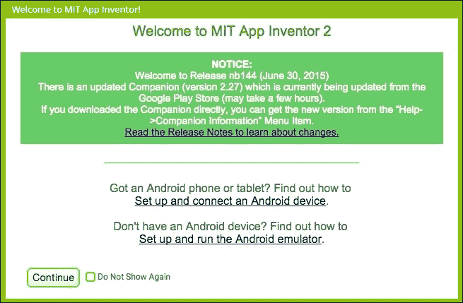

当登录到 MIT App Inventor 时，此类信息窗口会定期出现（除非你通过点击**不再显示**复选框来取消选择），以提供我们开发者关于更新和发布的最新信息。它们还提供帮助你连接的链接。确保它们出现时阅读这些信息，以便你可以获取有关 MIT App Inventor 更新的相关信息。然后，点击**继续**按钮。

要创建你的第一个 MIT App Inventor 项目，请点击屏幕左上角的**开始新项目**按钮，如图所示：

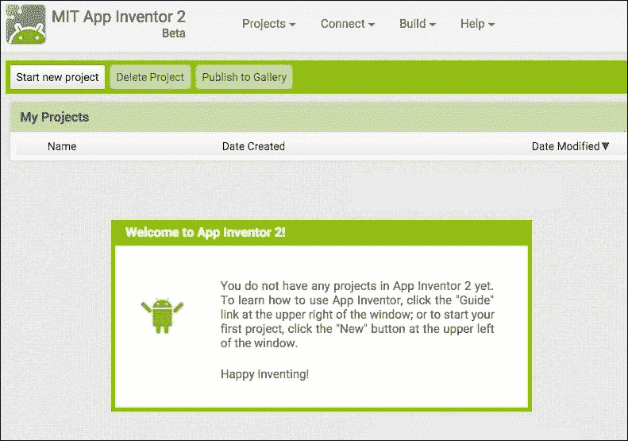

一个弹出窗口（如图所示）将要求你命名你的项目。项目名称中不允许有空格：


输入名称后，点击**确定**按钮。你刚刚命名的项目将存在于顶部菜单栏中的**项目**和**我的项目**下（如图所示）：


恭喜！你现在已经在设计师窗口中（如图所示）；这是**图形用户界面**（**GUI**），你将在其中创建应用的外观和感觉：

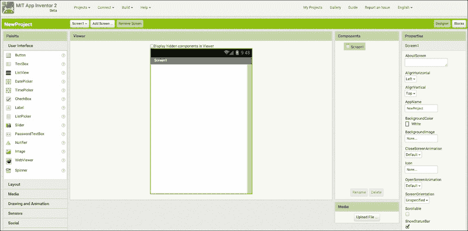

你现在可以建立连接了！

如果在连接设置过程中任何时候你需要额外的帮助，请点击设计师窗口顶部菜单栏右上角的**指南**（如图所示）：


# 连接设置

这套说明适用于所有拥有安卓移动设备的用户，无论你将通过何种方式将此设备连接到电脑（WiFi 或 USB 线缆），以及无论你的电脑操作系统是 Mac、Windows 还是 GNU/Linux。如果你将使用屏幕模拟器，请跳转到“连接模拟器或通过 USB 线缆连接”部分：*连接模拟器或通过 USB 线缆连接*。

现在你已经完成了在 MIT App Inventor 中创建项目的初始设置，你几乎准备好创建应用了。但首先，你需要将你的电脑连接到你的安卓移动设备，这样你可以在构建应用时看到它的形状。为此，你需要免费的 AI2 伴侣应用。

## 下载 AI2 伴侣应用

你可以通过两种方式将 AI2 伴侣应用安装到你的安卓设备上：通过 Google Play 商店或直接下载。以下是两种方法的说明：

+   **Google Play（推荐自动更新）**：如果你的设备已安装 QR 码阅读器应用，你可以扫描此 QR 码（如图所示）。它将带你到 Google Play 商店，你可以在那里将 AI2 伴侣应用下载到你的设备上。（如果你没有 QR 码阅读器，你可以在 Google Play 商店中免费找到它。）

    或者，您可以在设备上的网络浏览器中输入以下 URL 来通过 Google Play 商店下载 AI2 伴侣应用程序：

    [`play.google.com/store/apps/details?id=edu.mit.appinventor.aicompanion3`](https://play.google.com/store/apps/details?id=edu.mit.appinventor.aicompanion3)

+   **直接 APK 下载（需要手动更新）**：如果由于某种原因您无法访问 Google Play 商店，您可以通过扫描以下二维码（见下图）直接在手机上下载应用程序（见下图）：

    或者，您可以在设备上的网络浏览器中输入以下 URL 来下载应用程序：[`appinv.us/companion`](http://appinv.us/companion)。

注意，当直接下载应用程序（也称为侧载）时，您需要按照以下步骤操作：

1.  将您的设备设置更改为允许安装来自未知来源的应用程序。对于 Android 4.0 之前的版本，请转到**设置** | **应用程序**，然后勾选**未知来源**旁边的框。对于运行 Android 4.0 或更高版本的设备，请转到**设置** | **安全**或**设置** | **安全与屏幕锁定**，然后勾选**未知来源**旁边的框并确认您的选择。

1.  手动更新 MIT AI2 伴侣应用程序。由于您将不会从 Google Play 商店接收自动更新，每次您登录 App Inventor 并看到一个信息窗口弹出，指示 MIT AI2 伴侣应用程序已升级时，您需要通过重复直接下载（侧载）步骤来安装新版本。但首先，您必须卸载 MIT AI2 伴侣应用程序的旧版本。要卸载，找到您的手机上 MIT AI2 伴侣应用程序的图标，点击并按住它，直到您看到一个带有卸载选项的消息。点击**卸载**。

## 使用 WiFi 连接您的计算机和 Android 设备

这些说明适用于 Android 设备用户，他们将通过网络无线互联网（WiFi）连接到他们的计算机。


使用 MIT App Inventor 构建应用程序的有趣之处在于实时测试，即实时看到您的进度出现在您的移动设备上。为了确保 IDE 正常工作并自动更新您的设备上的应用程序；您必须确保您的计算机（运行 MIT App Inventor）和您的 Android 设备（运行 AI2 伴侣应用程序）**连接到相同的 WiFi 网络**。请在继续之前确保这一点。

在您的计算机上，在设计师窗口中，点击顶部菜单项**连接**，然后从下拉列表中选择**AI 伴侣**，如图下所示：

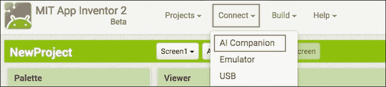

在您的计算机屏幕上会出现一个带有二维码和六位字符码的弹出窗口。

在您的移动设备上，通过点击应用程序图标启动 AI2 Companion。将出现以下选项：输入六位代码或扫描二维码：

+   **使用二维码连接**：点击您移动设备上显示“扫描二维码”的蓝色按钮。这将启动 AI2 Companion 应用中的二维码阅读器。将移动设备对准电脑屏幕上的二维码以自动扫描。

+   **使用六位代码连接**：只需将电脑屏幕上显示的六位代码输入到您移动设备上显示“六位代码”的白色文本框中（不要在键盘上按回车或 Enter 键）。然后，点击橙色按钮“使用代码连接”。

以下截图总结了连接步骤：

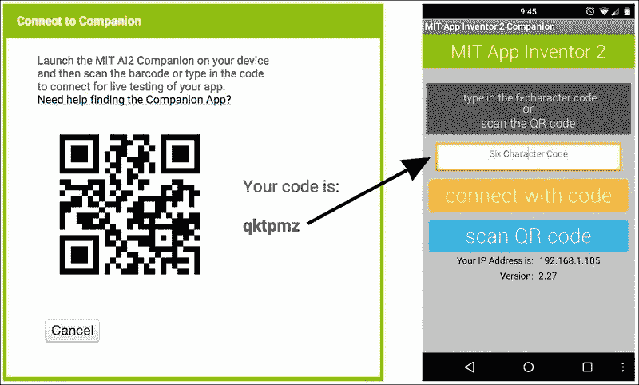

您电脑和移动设备上的代码

几秒钟内，您将在移动设备上看到设计窗口中的**Screen1**。

如果不是，请尝试以下故障排除选项：

+   您的设备可能未连接到 WiFi。请确保您在手机或平板电脑的 AI2 Companion 应用屏幕底部看到 IP 地址（参见前面的截图）。

+   您的移动设备和电脑可能连接的不是同一个 WiFi 网络。

## 连接模拟器或通过 USB 线连接

这些说明（步骤 1-4）适用于模拟器用户或通过 USB 线将电脑连接到移动设备的人。

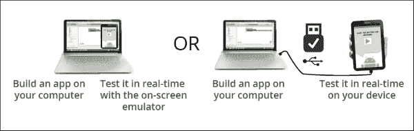

如果您没有移动设备，请不要担心；您仍然可以使用屏幕上的模拟器测试您用 MIT App Inventor 构建的应用程序。它模拟了 Android 移动设备（尽管有一些功能无法测试，例如加速度计）。您可以使用模拟器与他人分享应用程序，甚至可以通过 Google Play Store。许多人就是这样构建应用程序的。

另一方面，您可能有一台 Android 设备，但您的学校或组织可能有防火墙阻止使用 WiFi。在这种情况下，您仍然可以通过使用 USB 线将电脑连接到您的移动设备来进行现场测试。

无论您是连接到模拟器还是通过 USB 线连接移动设备，都需要相同的软件和设置。

### 第 1 步 – 安装 App Inventor 设置软件

按照您电脑操作系统的说明进行操作。

#### 为 Mac OS X 安装 App Inventor 设置软件

使用以下步骤在您的 Mac OS X 上安装 App Inventor 设置软件：

1.  通过[`appinv.us/aisetup_mac`](http://appinv.us/aisetup_mac)下载安装程序。

1.  双击下载的文件（很可能位于“下载”文件夹中）以启动安装程序`AppInventor_Setup_v_X.X.dmg`（其中`X.X`是版本号）。

1.  根据你的设置，你可能看到一个弹出窗口通知你文件无法打开（如下所示截图）：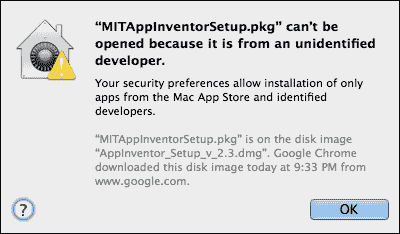

1.  如果 MIT App Inventor 设置软件无法打开，请转到**系统偏好设置** | **安全性与隐私** | **通用**，然后点击如下所示截图中的**仍然打开**按钮：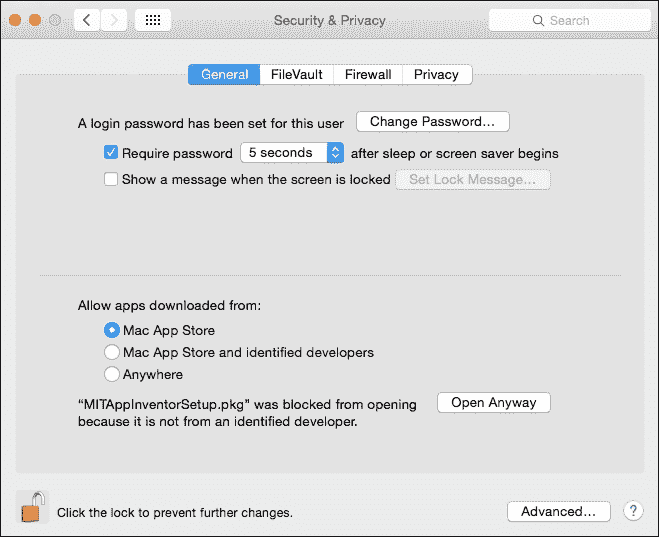

1.  如果你的设置被锁定，你可能需要输入管理员密码才能进行更改。

1.  你将看到一个欢迎信息，如下所示截图。然后，点击**继续**按钮。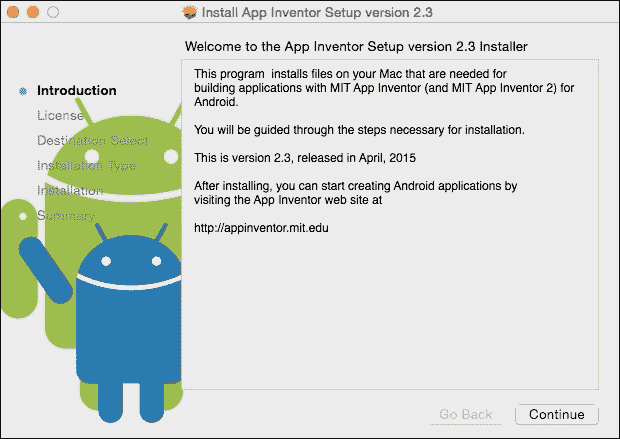

1.  读取并接受软件许可协议（未显示）。

    在**标准安装**屏幕（如下所示截图）上，点击**安装**：

    ### 小贴士

    注意：不要更改安装位置。

    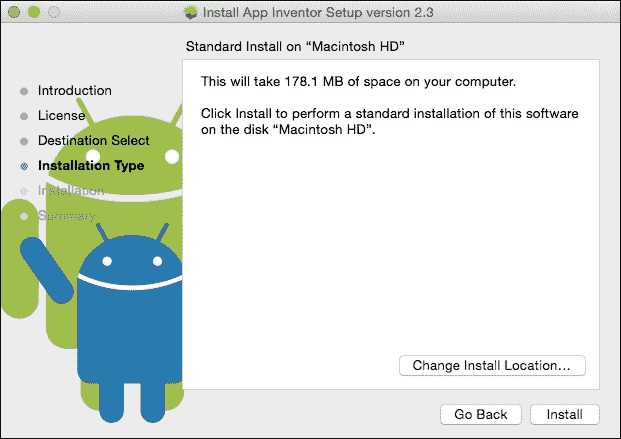

1.  输入你的计算机密码以确认你想要安装软件（未显示）。点击**确定**。

1.  安装程序确认 App Inventor 设置包已安装（如下所示截图）：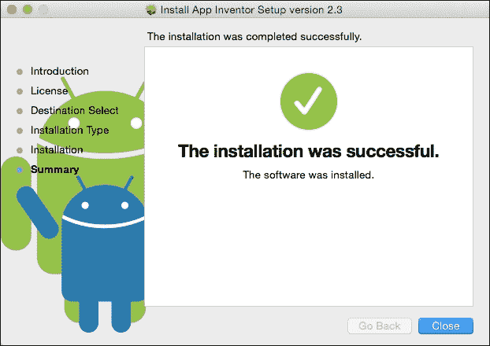

根据你将如何连接你的计算机到你的设备，Mac 用户可以继续到**步骤 3 – 打开项目并连接到模拟器**或**步骤 4 - 使用 USB 线设置你的设备**。

#### 安装 Windows 的 App Inventor 设置软件

这套说明包括**第一部分**和**第二部分**。

##### 软件安装 – 第一部分

1.  在你的计算机上的网络浏览器中输入以下网址以下载安装程序：[`appinv.us/aisetup_windows`](http://appinv.us/aisetup_windows)。

1.  在你的`下载`文件夹或桌面上找到`MIT_App_Inventor_Tools_2.3.0_win_setup.exe`（约 80 MB）文件。你计算机上下载文件的存储位置取决于你的浏览器配置。

1.  双击文件打开。

1.  你可能会被询问是否允许来自未知发布者的程序对此计算机进行更改（如下所示截图）。然后，点击**运行**按钮。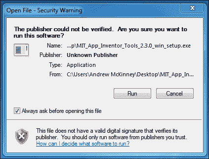

1.  你将看到一个**欢迎来到 MIT App Inventor 工具 2.3.0 设置**窗口（如下所示截图）。然后，点击**下一步**按钮。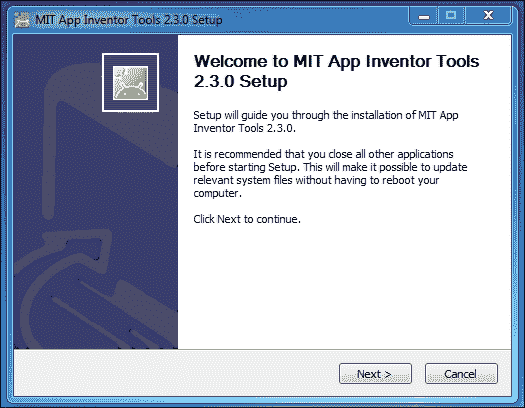

1.  读取并接受软件许可协议（如下所示截图）。然后，点击**我同意**按钮。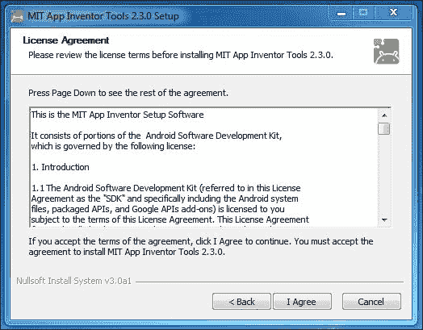

1.  在安装选项中进行选择。您可以选择是否为所有用户或单个用户安装设置工具。请注意，如果您选择所有用户，您将需要管理员权限（如图所示）。然后，点击**下一步**按钮。

1.  **安装位置**设置为默认位置，具体取决于您是以单个用户或所有用户身份运行 32 位或 64 位机器（如图所示）。然后，点击**下一步**按钮。

1.  选择安装组件。默认情况下，安装程序将安装设置工具，但您可以选择添加桌面图标（如图所示）。然后，点击**下一步**按钮。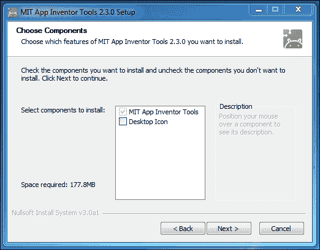

1.  选择**开始菜单**文件夹。默认情况下，它设置为**MIT App Inventor Tools**（如图所示）。然后，点击**安装**按钮。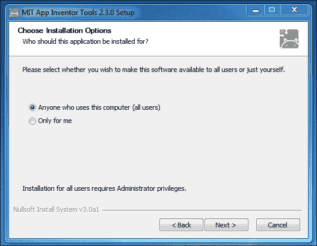

1.  您现在将看到一个进度条，显示正在安装的文件以及安装状态（完成百分比）。等待几分钟，直到此过程完成。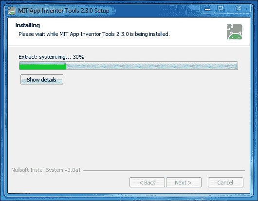

1.  安装 MIT App Inventor Tools 后，默认情况下最后屏幕将自动为您启动`aiStarter`程序。如果您不希望在此时启动它，请取消选中此选项（如图所示）。点击**完成**。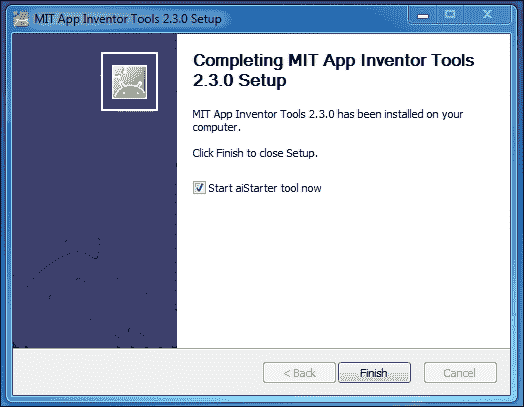

##### 驱动程序安装 – 部分 B

如果您选择通过 USB 线将您的 Android 设备连接到 Windows 机器，那么您将需要安装特殊的 Windows 驱动程序软件。不同的设备可能需要不同的驱动程序。制造商通常创建并提供驱动程序。您可能需要在网上搜索以找到适合您的 Android 设备的适当驱动程序。

### 注意

更多信息和安装说明可在[`developer.android.com/sdk/win-usb.html`](http://developer.android.com/sdk/win-usb.html)和[`appinventor.mit.edu/explore/content/windows-drivers.html`](http://appinventor.mit.edu/explore/content/windows-drivers.html)找到。

Windows 用户，继续进行第二步 - 启动 aiStarter。

#### 为 GNU/Linux 安装 App Inventor 设置软件

您需要`sudo`（`超级用户执行`）权限来完成安装。

注意，设置程序是 32 位软件。如果您有一个 64 位系统，您可能需要安装允许您的机器运行 32 位软件的库。一种方法是运行以下命令：

```java
> sudo apt-get install lib32z1

```

但是，这可能在所有 GNU/Linux 发行版上都不起作用，您可能需要针对您的特定系统对此进行一些调查。

##### 可安装 Debian 包的系统说明（例如 Debian 或 Ubuntu）

1.  通过在电脑上的网络浏览器中输入以下网址下载文件：[`commondatastorage.googleapis.com/appinventordownloads/appinventor2-setup_1.1_all.deb`](http://commondatastorage.googleapis.com/appinventordownloads/appinventor2-setup_1.1_all.deb)。Debian 文件名为 `appinventor2-setup_1.1_all.deb`。下载文件在电脑上的位置取决于您的浏览器配置。通常，它将进入您的 `下载` 文件夹。

1.  如果您的系统可以通过点击包文件来简单地安装包，那么请这样做。

1.  如果您的系统不支持可点击的包安装程序，那么导航到文件所在的目录，并运行以下命令：

    ```java
    > sudo dpkg --install appinventor2-setup_1.1_all.deb

    ```

1.  使用任何一种方法，您可能需要确保 Debian 文件及其所在目录对所有人都是可读和可执行的。在某些系统上，`sudo` 默认没有读取和执行所有文件的权限。软件将被安装到 `/usr/google/appinventor`。

1.  您可能还需要配置系统以检测您的设备。请参阅以下链接中的 Android 开发者说明：[`developer.android.com/guide/developing/device.html#setting-up`](http://developer.android.com/guide/developing/device.html#setting-up)。在 **(#3) Set up your system to detect your** **device** 下找到说明。前往以 **If you're developing on Ub****untu Linux…** 开头的第三点。

##### 其他 GNU/Linux 系统的说明

1.  从以下链接下载文件：[`commondatastorage.googleapis.com/appinventordownloads/appinventor2-setup_1.1.tar.gz`](http://commondatastorage.googleapis.com/appinventordownloads/appinventor2-setup_1.1.tar.gz)。文件名为 `appinventor2-setup_1.1.tar.gz`，它是一个 GZIP 压缩的 tar 文件。下载文件在电脑上的位置将取决于您的浏览器配置。通常，它将进入您的 `下载` 文件夹。

1.  通过首先解压缩文件，然后将 `appinventor` 目录及其内容复制到 `/usr/google/appinventor` 位置（使用适合您操作系统的适当方法）来安装文件。

GNU/Linux 用户继续进行下一步。

### 第 2 步 – 启动 aiStarter

此步骤适用于使用模拟器或 USB 线缆连接的 Windows 和 GNU/Linux 用户。使用模拟器连接的 Mac 用户可以跳到 *Step 3 – opening a project and connecting to the emulator*。使用 USB 线缆连接的 Mac 用户可以跳到 *Step 4 – setting up your device* *with a USB cable*。

#### 启动 aiStarter

aiStarter 程序管理网络浏览器和 Android 设备之间的通信（注意，在 Mac 平台上，aiStarter 程序在登录时自动启动）。无论何时您在 GNU/Linux 或 Windows 机器上使用模拟器或 USB 线缆登录以使用 MIT App Inventor，您都需要启动 aiStarter 程序。

GNU/Linux 用户可以使用以下命令进行操作：

```java
> /usr/google/appinventor/commands-for-Appinventor/aiStarter &

```

Windows 用户可以从**开始菜单**或通过双击桌面上的 aiStarter 快捷方式（如果您在 MIT App Inventor 设置工具安装过程中安装了它）来定位 aiStarter 程序。

为了方便，您可能希望设置此命令在您登录或系统启动时自动运行。具体方法取决于您使用的 GNU/Linux 发行版。如果您不熟悉，请查阅您发行版附带的文档。

继续进行下一步。

### 步骤 3 – 打开项目并连接到模拟器

此步骤适用于所有使用模拟器连接的用户，无论操作系统如何。所有使用 USB 连接的用户可以跳转到*步骤 4 – 使用 USB 线设置您的设备*。

由于您已经创建了第一个项目并为其命名，我们现在将连接模拟器以显示它。

在您的计算机上，在设计窗口中，点击顶部菜单栏上的**连接**，然后从下拉列表中选择**模拟器**。


将弹出一个窗口通知您模拟器正在连接。这可能需要几分钟。

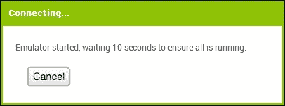

模拟器最初将显示一个空的黑屏（**#1**）。等待直到模拟器准备好带有彩色背景的屏幕（**#2**）。背景出现后，您应该继续等待，直到模拟器完成其 SD 卡的准备；在准备卡的过程中，手机屏幕顶部将会有通知（**#3**）。连接后，模拟器将启动并显示您在 MIT App Inventor 中打开的应用（**#4**为空，因为目前新项目是空的）。

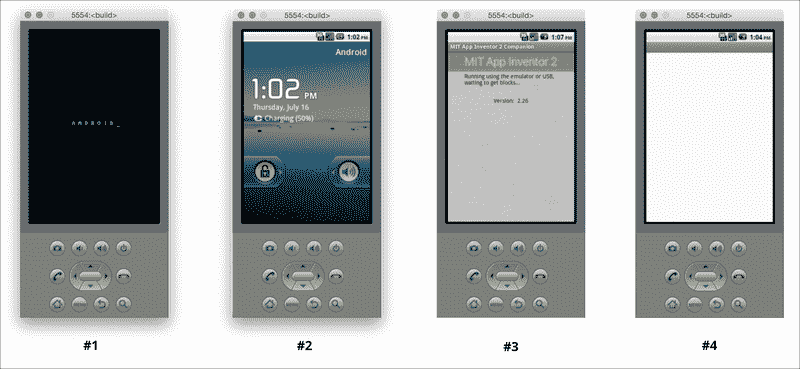

### 步骤 4 – 使用 USB 线设置您的设备

此步骤适用于所有使用 USB 线连接的用户，无论操作系统如何。

在您的 Android 设备上，前往**设置** | **开发者选项**，将其打开，并确保**USB 调试**已开启。

在大多数运行 Android 3.2 或更早版本的设备上，您可以在**设置** | **应用程序** | **开发**下找到此选项。

在 Android 4.0 及更高版本中，您可以在**设置** | **开发者选项**中找到它。

### 注意

在 Android 4.2 及更高版本中，**开发者选项**默认隐藏。要使其可用，请前往**设置** | **关于手机** | **构建号**，并连续点击**构建号**七次。返回上一屏幕，前往**设置** | **开发者选项** | **USB 调试**，并点击它以启用它（在某些设备上，它可能列为准**Android 调试**）。

### 步骤 5 – 连接您的计算机和设备（如有必要进行认证）

这些说明从*步骤 4 – 使用 USB 线设置您的设备*继续，适用于所有使用 USB 线连接的用户，无论操作系统如何。

使用 USB 线将您的 Android 设备连接到电脑。确保设备连接为 **存储设备**（而不是 **媒体设备**），并且它没有作为驱动器挂载在您的电脑上。

### 小贴士

注意，如果设备已挂载，您可以使用以下说明找到卸载设备，但请确保您的设备通过 USB 线连接到电脑。

有三种方法可以卸载您通过 USB 线连接 Android 设备时挂载的任何驱动器。具体如下：

+   右键点击以弹出

+   点击它并将其拖到垃圾桶中

+   使用 **Finder**（在 Mac 上）或 **我的电脑**（在 Windows 上）并点击名称旁边的箭头

第一次将您的 Android 设备（4.2.2 及更高版本）连接到电脑时，您的设备上会出现一个弹出窗口，显示消息：**允许 USB 调试？** 按 **确定**。这将验证电脑与设备，允许电脑与其通信。您需要为每个您想要连接到设备的电脑执行此操作，但每个电脑只需执行一次。

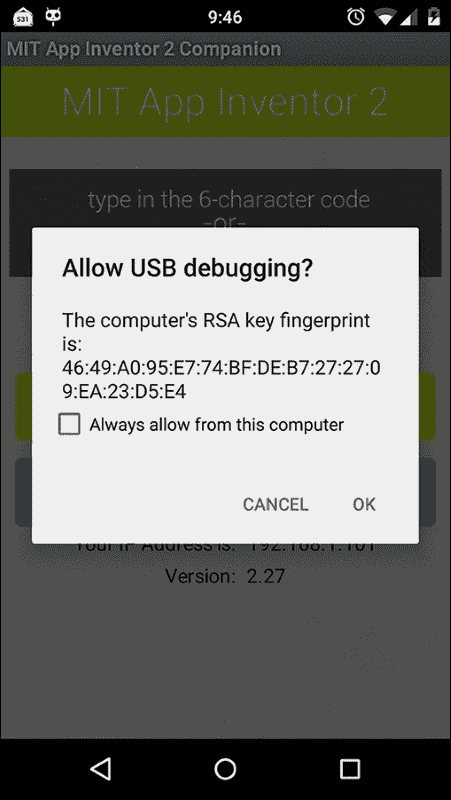

### 第 6 步 – 测试连接

这些说明从 *第 5 步 – 连接您的电脑和设备（如有必要进行验证）* 继续适用于所有使用 USB 线连接且无论操作系统如何的用户。

在您的移动设备仍然连接到电脑的情况下，前往 [`appinventor.mit.edu/test`](http://appinventor.mit.edu/test)（这将在新标签页中打开您的浏览器）并查看是否收到确认，表明您的电脑可以检测到设备。如果测试失败，请访问 [`appinventor.mit.edu/explore/ai2/connection-help.html`](http://appinventor.mit.edu/explore/ai2/connection-help.html) 并查看电脑的 USB 帮助（Windows 或 Mac）。在解决连接问题之前，您将无法使用 USB 线使用 App Inventor。

# 摘要

如您可能发现的，从您电脑上的 MIT App Inventor 网页应用建立与 Android 移动设备或屏幕模拟器的连接需要一些时间和耐心。但我们保证这是值得的。当您开始构建应用程序并看到它在移动设备（或模拟器）上的实时开发时，这不仅令人兴奋和满足，而且对于设计、故障排除和测试来说是必要且有帮助的。如果您遇到困难，您始终可以访问 MIT App Inventor 网站的帮助页面（[http://appinventor.mit.edu/](http://appinventor.mit.edu/））或在社区论坛中寻求帮助。现在技术设置已经完成，乐趣即将开始！让我们学习如何使用 MIT App Inventor 制作移动应用程序！
