# 第三章。导航 App Inventor 平台

现在你已经创建了一个新项目并设置了连接，你准备好开始学习如何制作移动应用了！本章将提供一步一步的指南，通过构建一个名为 Fling 的游戏应用的过程来导航 App Inventor 网络应用。你将使用：

+   项目视图

+   设计师（一个图形用户界面）

    +   面板

    +   查看器

    +   组件

    +   属性

+   块编辑器（一种可视化编程语言）

+   集成开发环境（IDE）

# 项目视图

在第二章中，*设置 MIT App Inventor 2*，你第一次登录 App Inventor，创建了一个新项目，并为其命名，因此目前你只有一个 App Inventor 项目。一旦你开始构建更多应用程序，所有与你的 Google 账户关联的项目都将列在“我的项目”下。每次你登录 App Inventor，平台都会自动打开你最近工作的项目。要选择不同的项目，请点击顶部菜单栏中的**我的项目**，或者要开始一个新项目，请点击屏幕左上角的**开始新项目**。

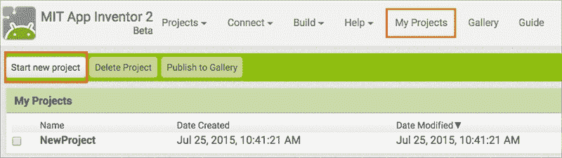

## 创建新项目

我们将在本章中构建一个游戏。它将与 Pong 类似，但你会用手指来弹球而不是使用球拍。让我们创建一个名为`Fling`的新项目。请注意，不包含空格的项目名称必须以字母开头。只能使用字母、下划线和数字。点击屏幕左上角的**开始新项目**。会出现一个弹出窗口，如下面的截图所示。输入单词**Fling**。一旦你点击**确定**，你将被带到设计师界面。

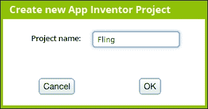

如果你恰好已经在设计师中打开了一个项目，你仍然可以通过点击顶部菜单栏中列出的**项目**下的**开始新项目**来在这个视图中开始一个新项目，如下面的截图所示：

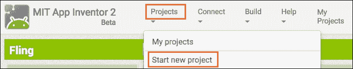

# 设计师

当你打开一个项目或开始一个新项目时，App Inventor 会带你进入设计师。这个窗口是一个图形编辑器，你可以通过选择组件（按钮、标签、图片等）、布局（水平/垂直对齐）、颜色、字体等方式来创建你的移动应用的外观和感觉。下一张截图是设计师的布局（包含一些有用的导航提示）：

打开项目的名称显示在左上角。在右上角，你会看到**设计师**和**块编辑器**（**设计师**按钮目前处于禁用状态，因为我们目前处于设计师视图）的切换按钮。设计师由五个面板组成，以下将逐一解释。

## 面板

**调色板**（位于前一个设计师图像的左侧列）包含一些抽屉，这些抽屉中存放着称为**组件**的工具集。抽屉根据类型如**用户界面**、**布局**、**媒体**、**绘图和动画**、**传感器**、**社交**、**存储**、**连接性**和**乐高 Mindstorms**对**组件**进行分组。记住哪个抽屉存放哪些组件以及它们的功能需要一点时间。关于组件的更多内容将在后面介绍！

## 查看器

**查看器**（位于前一个设计师图像的中间）是设计师窗口中间的白色工作区。当你首次创建项目时，默认的工作区名称是**Screen1**。你不能更改 Screen1 的名称，尽管你可以更改屏幕标题。这可以在**属性**面板中完成（如下所示）。新的屏幕名称将在查看器中显示，并被应用程序用户看到。稍后，你可能想要向你的应用程序添加更多屏幕，并且你可以重命名后续的屏幕。要构建你的应用程序，你需要将组件从调色板抽屉拖动到查看器中。在我们的 Fling 应用程序中，我们将使用视觉组件，因此当它们被拖动到查看器中时，它们将保持可见。在随后的章节中，我们将演示非可视组件的使用，这些组件在添加时不会保留在查看器中，而是位于查看器下方。

## 组件

组件位于设计师窗口左侧的**调色板**抽屉中（一旦我们开始构建应用程序，我们将演示不同组件的功能）。一旦组件被拖动到查看器中，它们也会出现在组件面板中（位于设计师图像的中间右侧）。组件面板列出组件，并按屏幕组织它们。你可以根据需要折叠和展开屏幕组件内容。组件按列列出，这样就可以很容易地看出它们是否独立存在或包含在其他组件中。

为了说明一些组件位于其他组件内部，组件面板将以嵌套（缩进）列表的形式显示它们。请注意，当你点击查看器中的组件时，它将在查看器和组件面板中突出显示，并在**属性**面板（在下一节中描述）中显示可编辑选项。相反，如果你在组件面板中点击一个组件，它也会在查看器中突出显示。一旦点击组件并使其变为活动状态，你可以通过点击**重命名**或**删除**按钮来重命名或删除它，或者你可以在属性面板中查看或编辑其设置。

## 属性

**属性**面板（位于前面设计师图像的右侧列中）显示了一组可配置的设置（例如大小、颜色和对齐方式），用于**查看器**中添加的每个**屏幕**和**组件**。在随后的章节中，你将添加越来越多的组件（和屏幕），所以在更改其设置之前，请确保正确地突出显示了项目。活动组件（或屏幕）的名称出现在属性面板的顶部（在早期设计师截图的属性面板顶部，活动**属性**是**Screen1**，如属性面板顶部所示）。

## 媒体

**媒体**面板位于**组件**面板下方（见设计师截图）。此功能允许你从你的电脑上传图片、声音文件或其他媒体文件到你的项目中。如果你在网上找到一个你想要在应用中使用但属于*创意共享*（免费共享，无版权）的图片，你必须首先下载它，然后点击媒体面板中的**上传**文件按钮（你不能直接从互联网下载图片到 App Inventor）。一旦文件上传，它将同时在**媒体**面板和**属性**面板中列出（要删除媒体文件，点击媒体文件名，将出现一个弹出窗口以删除文件）。请注意，尽管媒体文件也可以添加到属性面板，但它们不能从属性面板中删除。如何在应用中使用图片、声音或视频文件将在未来的章节中解释。

# 创建游戏应用

你已经使用你的谷歌账户登录了 App Inventor，创建了一个新的项目，将其命名为 Fling，并学习了如何导航设计师屏幕。是时候创建你的第一个移动应用了！

### 小贴士

由于这是一个教程，我们将解释如何玩我们的游戏。但是，如果你是从零开始创建自己的游戏，你想要确保你已经投入了时间、精力和努力来弄清楚你想要它做什么以及你想要它看起来像什么。我们在第一章中概述了移动应用创建的设计过程，*使用 MIT App Inventor 2 释放创造力*。现在可能是复习它的好时机。

Fling 游戏应用的目标是使用手指将移动的球体抛出，以防止它撞击屏幕底部并结束游戏。当点击播放按钮时，球体将从顶部开始向下移动。如果用户在将其抛出之前，球体撞击到屏幕底部边缘，游戏将停止，屏幕上会出现**游戏结束**通知。**重置**按钮将球体重置到屏幕顶部，**播放**按钮开始新一轮游戏。在这个游戏中，你将学习使用以下组件来设计用户界面：球体、画布（游戏板）、水平布局、按钮和标签。你将学习编程：

+   一个随机移动的动画对象（球体）

+   球体对屏幕触摸做出响应的条件

+   当球体触摸屏幕底部时，游戏结束的机制

+   游戏结束时显示游戏结束信息

+   一个按钮，通过将球体向下移动来开始游戏

+   一个按钮，通过将球体重新定位到屏幕顶部并擦除“游戏结束”显示来重置游戏

当你构建你的应用时，你将实时在你的移动设备或模拟器上看到你的进度展开，使用**IDE**（**集成开发环境**）。让我们开始吧！

## 在设计师中创建 UI

在一个新项目中，你首先会注意到 Screen1 自动存在于查看器中。如图下所示，Screen1 的名称出现在三个地方：在**查看器**中、**组件**面板和**属性**面板中。请注意，这也适用于任何添加到查看器的组件。当一个组件在组件面板中被突出显示（如图中用浅绿色框所示）时，你将在属性面板中看到与之对应的属性。虽然 Screen1 的名称不可编辑，但与 Screen1 相关的属性，如标题，尽管我们不会在 Fling 中更改 Screen1 的属性。

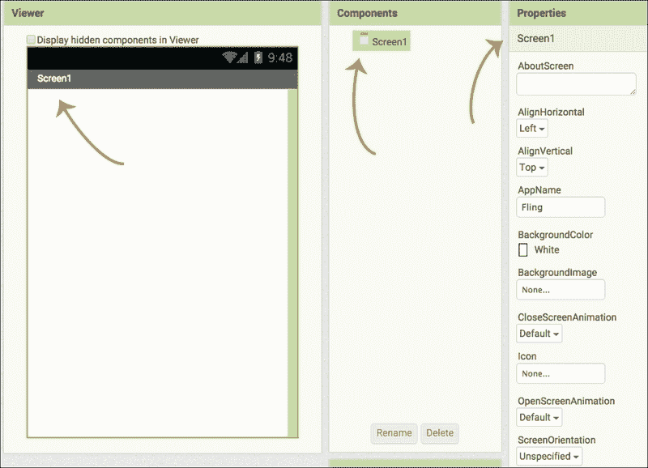

要为 Fling 应用创建游戏界面，我们将：

1.  将画布组件添加到**Screen1**。

1.  点击调色板抽屉：**绘图和动画**。它将展开以显示三个组件：**画布**、**ImageSprite**和**球体**。

1.  点击**画布**并将其拖动到**查看器**中，如图下所示：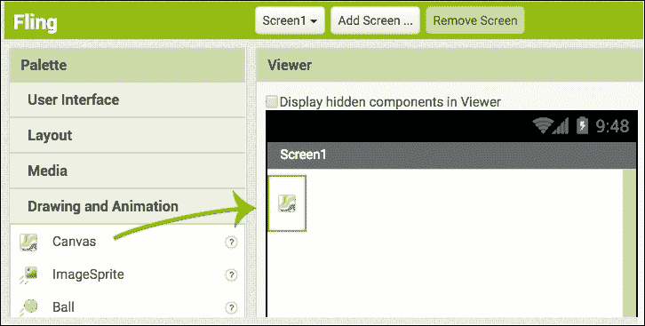

你的设计师窗口将看起来像以下截图。画布组件将自动在组件面板中命名为**Canvas1**。如果你要添加另一个画布，它将自动命名为 Canvas2。虽然我们不会在这个教程中重命名 Canvas1，因为它已经有一个合适的名字。你可以看到它在**查看器**和**组件**面板中都是活动的（因为它被浅绿色框突出显示）。活动意味着你能够在属性面板中看到并编辑其属性。

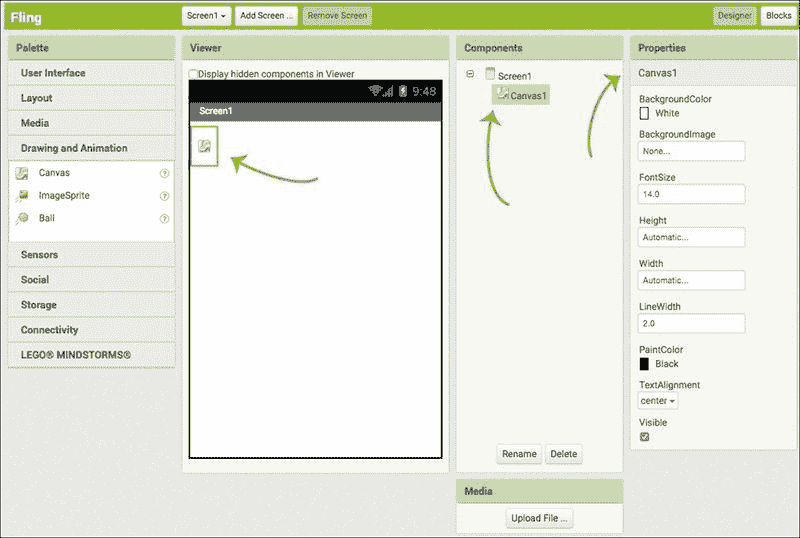

画布将容纳我们的球体组件，因此我们需要将其大小调整为整个屏幕，而不仅仅是现在这样的一小部分屏幕。要更改画布的大小，转到**属性**面板并点击**高度**元素下方的白色文本框（目前填写着单词自动）。将弹出一个带有单选按钮的选择框，如图所示。点击**填充父级**旁边的单选按钮。点击**确定**按钮。

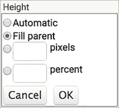

重复这些步骤来设置**宽度**。你会看到画布现在填满了整个查看器。接下来我们将更改颜色。在**属性**面板的顶部，点击**背景颜色**下方的单词**白色**。将出现一个颜色下拉列表（未显示）；选择**灰色**。设计师窗口现在应该看起来像以下截图，灰色画布填满了整个查看器。

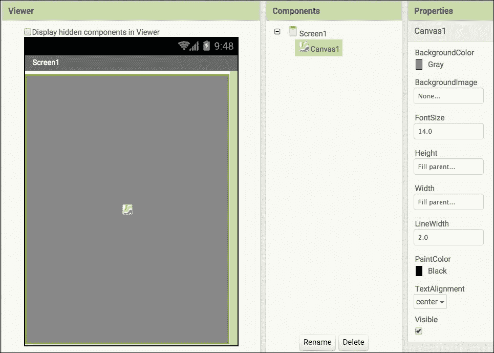

接下来，我们将添加一个球体。回到**绘图和动画**资本调色板抽屉，点击**球体**，并将其拖动到查看器中的**画布**上，如图所示：

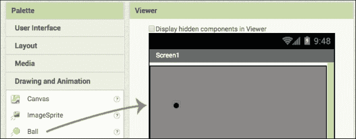

球体将落在画布上的任何位置，你在组件面板中可以看到它被命名为 Ball1。注意 Ball1 如何在组件面板列表中嵌套（缩进）。这是因为你将其放置在另一个组件内部，即 Canvas1。

你可以在属性面板中定位球体的起始位置、大小和颜色。由于**Ball1**已经处于活动状态，你可以开始编辑**属性**面板中的选项。将设置更改为与以下截图所示匹配。实际上，一旦我们开始编程，我们将改变球体的起始位置，但这只是为了让你熟悉属性面板中可用的功能。

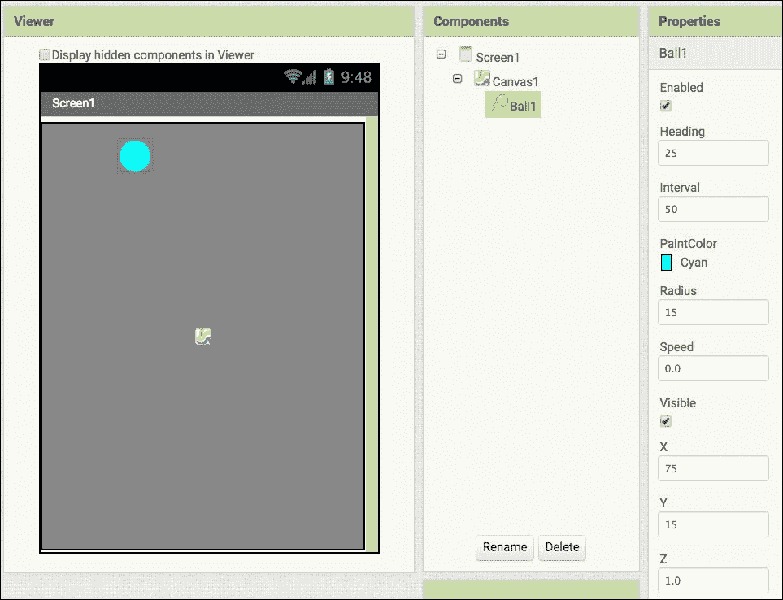

接下来，你将在屏幕底部创建一个菜单栏。由于我们希望按钮在屏幕底部水平排列，我们将打开**布局**调色板抽屉。将**水平排列**拖动到**查看器**的底部，使其位于**画布**下方而不是内部。它应该看起来像以下截图：

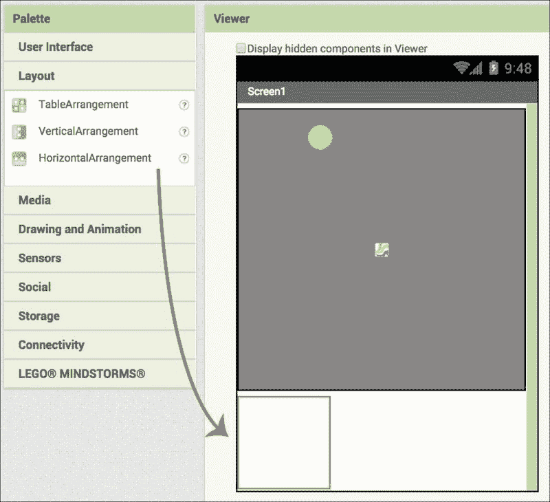

您可以通过查看组件面板来了解您是否正确执行了此操作。HorizontalArrangement 应该在 Canvas1 所在的同一列中列出，而不是像 Ball1 那样缩进。如果它缩进了，这意味着 HorizontalArrangement 组件位于 Canvas 内部。我们不希望这样，所以如果它缩进了，请转到**查看器**，将**HorizontalArrangement**组件从**Canvas**中拖出，并将其放置在**Canvas**下方。要缩小 HorizontalArrangement 的大小，请在**属性**面板中编辑**高度**和**宽度**选项，使其与下面的匹配。有两种方法可以检查您是否正确执行了此操作。在查看器中，HorizontalArrangement 将在灰色 Canvas 下方创建空白区域，如图中所示。此外，在组件面板中，HorizontalArrangement 将与 Canvas1 对齐，如图中所示。如果您不小心将 HorizontalArrangement 放在 Canvas 内部，查看器中灰色 Canvas 下方将没有空白区域，并且 HorizontalArrangement 组件将缩进，并直接对齐在 Ball1 下方。

要调整**HorizontalArrangement**的大小，请在**属性**面板中编辑**高度**和**宽度**选项，使其与以下截图匹配：

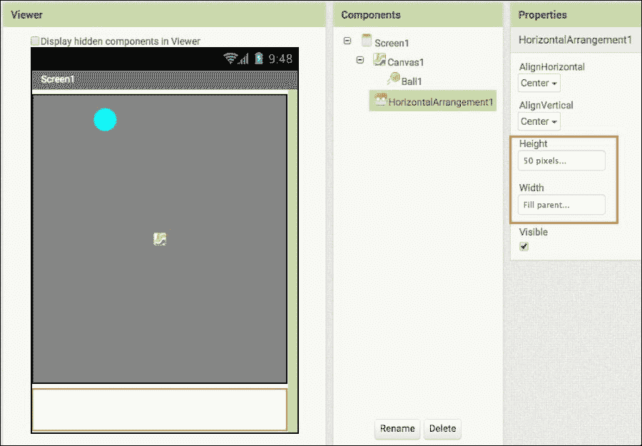

接下来，将**按钮**从**用户界面**调色板抽屉拖动到**Screen1**底部的**HorizontalArrangement**组件中。按钮将显示为**Button1 的文本**，如图中所示：

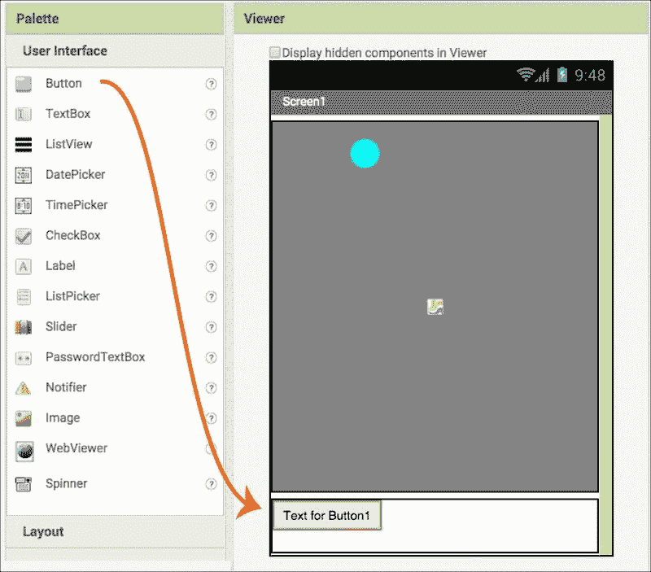

### 注意

您可以通过查看您的屏幕是否与前面截图中的**查看器**相匹配来验证您是否正确执行了此操作。此外，在**组件**面板中，您将看到**Button1**将嵌套在**HorizontalArrangement**之下，因此将缩进。

## IDE

在构建应用程序的任何阶段，您都可以在您的移动设备或模拟器上实时查看您的进度。您在构建应用程序时将想要使用此功能，这样您就可以在设计师中更改更改后立即看到更新，以跟踪您的进度，并查看您的应用程序在设备上的外观。由于我们已经做了一些更改，让我们现在连接，这样您就可以熟悉这个过程。由于您已经在第二章中完成了技术设置，即*设置 MIT App Inventor 2*，您可以轻松开始使用集成开发环境（IDE）。

**对于拥有移动设备的用户**：在设计师窗口的计算机上，转到顶部菜单栏，单击连接，然后从下拉菜单中选择**AI Companion**，如图中所示：

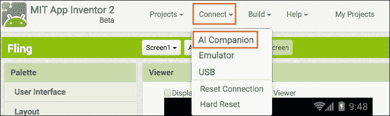

在您的计算机屏幕上会出现一个带有二维码和六位字符码的弹出窗口。在您的移动设备上启动 AI2 伴侣应用程序，并扫描二维码或输入六位字符码。请注意，要扫描二维码，您需要在您的移动设备上按蓝色按钮**扫描二维码**，然后将移动设备举到计算机屏幕上以捕获图像。使用您的移动设备扫描二维码后，几秒钟后会自动启动您的 Fling 应用程序。要使用代码连接，请在您的移动设备上的白色文本框中输入计算机屏幕上显示的六位字符码，然后点击橙色按钮**使用代码连接**以在您的移动设备上显示 Fling 应用程序。

**对于没有移动设备的用户**：在设计师窗口的计算机上，转到顶部菜单栏，点击**连接**，然后从下拉菜单中选择**模拟器**，如图所示：

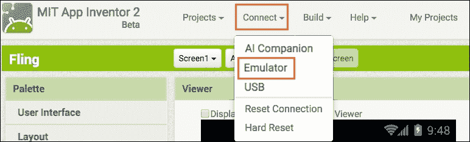

模拟器将需要几分钟才能启动。您将看到有关进度和模拟器状态的弹出消息（要了解如何与模拟器连接，请参阅第二章，*设置 MIT App Inventor 2*）。

注意，在整个应用程序构建过程中，如果您遇到连接问题或连接模式变为灰色，您可能需要从下拉菜单中选择**重置连接**，如图所示：

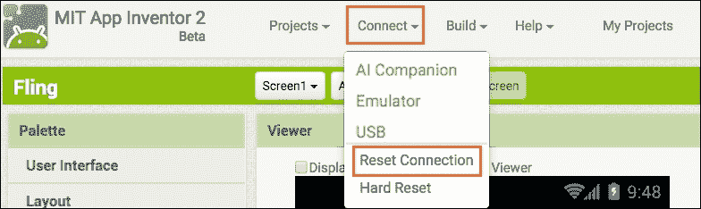

点击重置连接后，连接选项将再次变为可点击。选择您之前使用的方法：**AI 伴侣**或**模拟器**（记住，为了 WiFi 连接工作，您的计算机和移动设备必须在同一 WiFi 网络上）。通过 USB 连接，请参阅第二章中的说明，*设置 MIT App Inventor 2*。

连接后等待几秒钟，您将看到以下图像之一（左侧是移动设备的截图，右侧是模拟器的截图）：

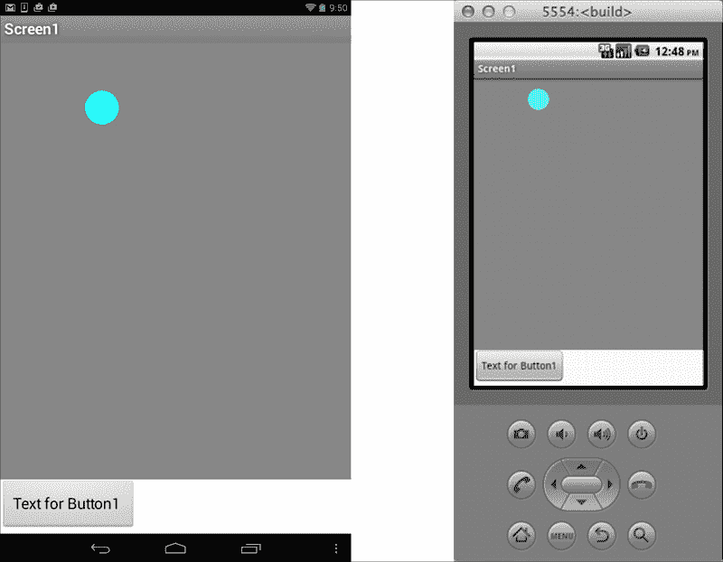

现在您已经将项目连接到您的移动设备或模拟器，您在计算机上所做的所有更改将自动更新到您的设备或模拟器上。这特别有用，因为您计算机屏幕上的组件在您的移动设备或模拟器上可能显示得略有不同。定期检查您的应用程序在移动设备或模拟器上的形状总是一个好主意。

让我们回到设计师界面。您可以通过编辑**属性**来更改**Button1**的外观和文本。将选项更改为反映以下截图：

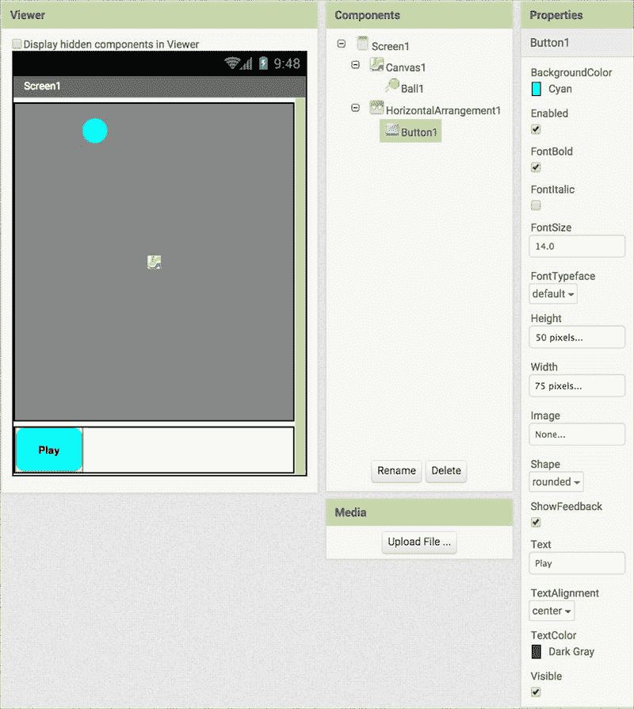

注意你的移动设备或模拟器也会实时更新，并显示你刚刚对 Button1 所做的更改，如下面的图片所示（左侧为移动设备的截图，右侧为模拟器的截图）：

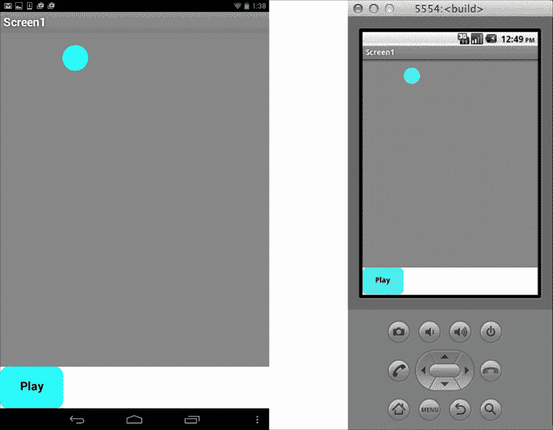

你现在将要向**HorizontalArrangement**组件中添加另一个**Button**。

当你从**用户界面**调色板抽屉中拖动**Button**时，App Inventor 会将此按钮命名为**Button2**，如下面的截图所示：

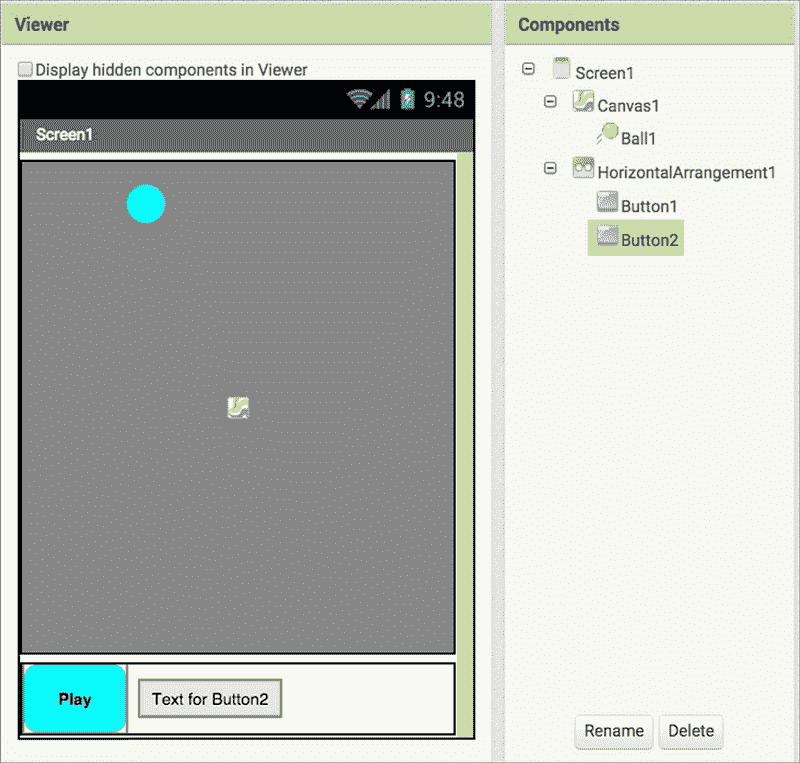

注意你的移动设备或模拟器也会实时更新，如下面的图片所示（左侧为移动设备的截图，右侧为模拟器的截图）：

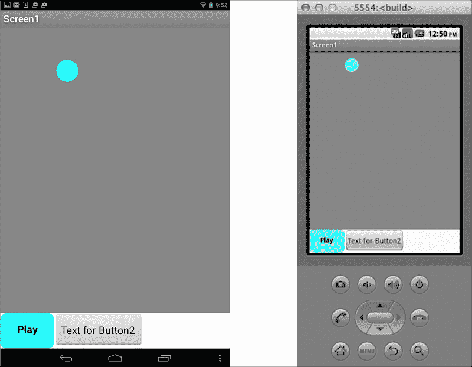

当你拥有多个同类型组件时，或者要反映它们的功能时，始终重命名你的组件是一个好习惯。不久你的应用将会有多个按钮、屏幕等。所以，使用特定的名称是有帮助的。**Button1**是**Play**按钮，所以让我们相应地重命名它。点击**Button1**，使其在**组件**面板中高亮显示。然后，点击面板底部的**重命名**。一个弹出窗口将给你输入新名称的选项，如下面的截图所示：

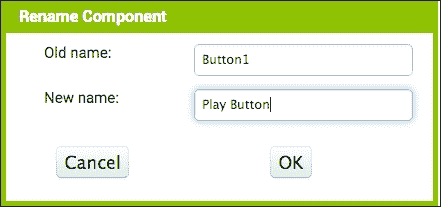

你将在组件面板中看到新的名称。注意，App Inventor 将两个单词之间的空格转换成了下划线。

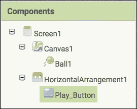

注意，如果我们之前在添加第二个按钮之前将 Button1 的名称更改为 Play_Button，当你拖出第二个按钮时，它将被命名为 Button1。这可能会造成混淆，所以始终将组件重命名而不是追踪它们的添加顺序是一个好主意，尤其是在这个例子中，Button1 并不是你第一个添加的按钮，而是第二个。

重复之前列出的步骤，将**Button2**重命名为**Reset**按钮。然后，根据以下截图编辑**Reset_Button**的**属性**：

### 注意

注意，虽然我们将**Button**组件的名称更改为**Play_Button**和**Reset_Button**，但按钮上的文本仍然是我们在文本字段中输入的内容：**Play**和**Reset**。

注意你的移动设备或模拟器也会实时更新。这是一个很好的例子，说明了为什么你想利用集成开发环境。正如你在之前的截图中所见，设计器中两个按钮之间出现了一个空格，但在移动设备（在这种情况下，是一个平板电脑）和模拟器上，没有空格，如下面的截图所示。通过在构建过程中持续监控你的应用在设备上的外观（以及后来的功能），你确保了在每一步都能让你的应用以你期望的方式显示和运行。

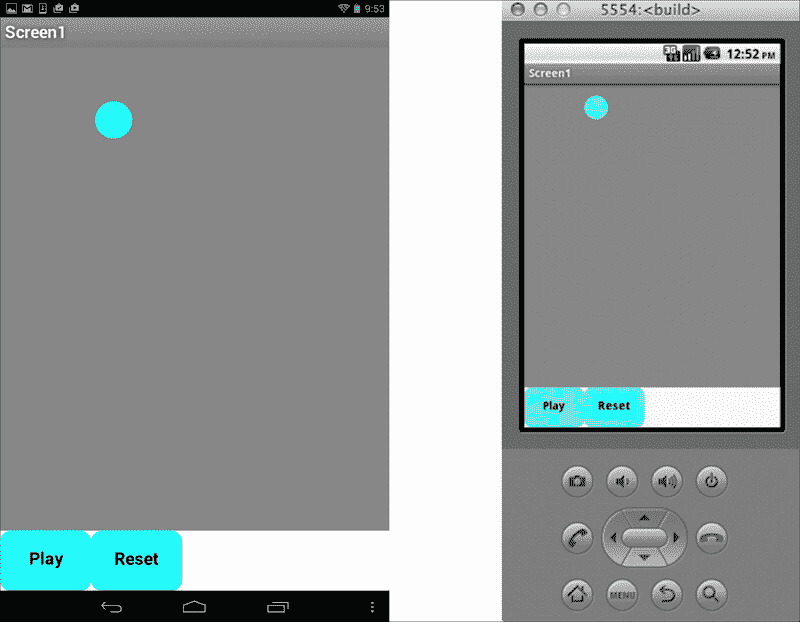

现在，我们将添加一个标签来显示一些文本（最终是得分）。转到**用户** **界面**抽屉，并将一个**标签**拖放到**水平排列**上。您可以在菜单栏的任何位置放置它，但为了本教程的目的，我们将将其拖放到**播放**和**重播**按钮之间。调整标签属性，以便在下一张截图中反映出来，并将标签组件重命名为**得分**（注意，在**文本**属性下方，我们已经删除了**标签 1 的文本**，因此它看起来是空的）。

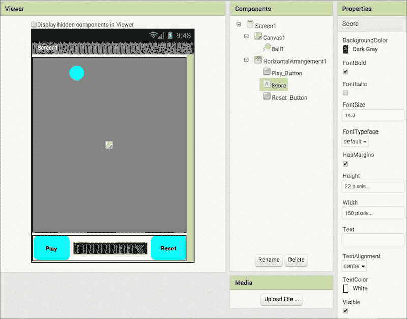

恭喜！您已经完成了 Fling 应用程序的用户界面设计！请注意，当按下任一按钮时，球体都没有发生任何变化。这是因为我们还没有编程组件的行为。接下来，我们将切换到积木编辑器开始编码。

# 积木编辑器

要切换到积木编辑器，请点击菜单栏右上角的**积木**按钮。

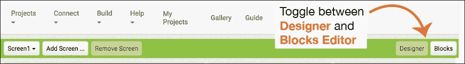

积木窗口有一个积木面板（左侧）、一个查看器（大型白色工作区）和一个媒体面板（在左下角）。媒体面板的操作方式与设计师相同，尽管我们不会在这个应用程序中使用它。

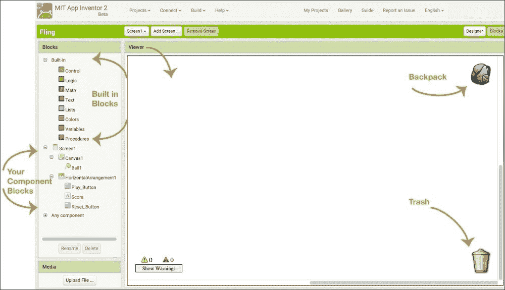

您在窗口左侧的积木面板中可以找到所有用于编程应用程序的工具。显示的小色块组成的第一个积木集称为内置（您将在构建我们的应用程序时了解这些）。在内置积木下方是关于您在设计师中刚刚添加的组件的积木。在组件积木下方是任何组件积木的列表。在本章中，我们将不会使用这些积木。

在积木编辑器中导航与设计师类似。当您点击积木面板中的任何积木时，会出现一个弹出抽屉，显示许多彩色的拼图状积木。您点击的积木将自动出现在称为查看器的白色工作区中。要编程您的应用程序，您需要将一个积木拖放到另一个积木上，并听到和看到它“咔哒”一声到位。

一旦您开始在查看器中填充积木，它可能会变得拥挤。有两种方法可以更有效地使用工作空间：使用底部和侧面的灰色滚动条，或者点击并拖动白色空间本身。一旦积木就位，这一点就会变得明显。

## 积木抽屉

当您点击积木面板中的任何积木类别时，会出现一个包含可用积木的弹出抽屉。以下截图显示了用于 Play_Button 组件的一些可用积木（灰色滚动条表示屏幕上显示的积木数量多于实际数量。您可以通过向下滚动查看其余的积木）：

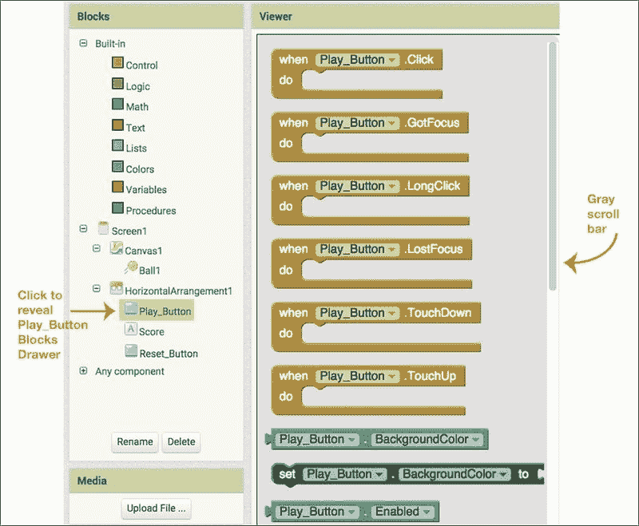

## 积木类型

组件积木由不同类型的积木组成。对于这个应用程序，我们将使用三种类型的积木：**事件**、**设置器**和**获取器**。

+   **事件块**：它们是金色的，如果某个组件存在，它们将出现在任何弹出块抽屉的顶部。它们启动一个事件，例如**when Play_Button.Click**。要编程点击**播放**按钮时发生的事情，你可以拼接其他称为设置器和获取器的拼图块。

+   **设置器**：它们是深绿色或橙色的拼图块，上面写着“设置”，因为它们设置属性值。请注意，设置器在末端有一个开口。另一种类型的块，获取器，可以放入那个空间，因此设置器可以获取值。

+   **获取器**：它们是拼图块，可以放在设置器的末端。它们为设置器提供属性值。

**内置**块有多种不同的颜色和用途。我们将在使用时解释它们。

### 使用块编程 Fling

现在，我们将开始使用块来编写我们的应用程序。

#### 播放按钮

在**块**面板中点击**Play_Button**以打开其抽屉。然后，点击下一张截图所示的最上面的金色**when Play_Button.Click**事件块。现在它将出现在**查看器**中。

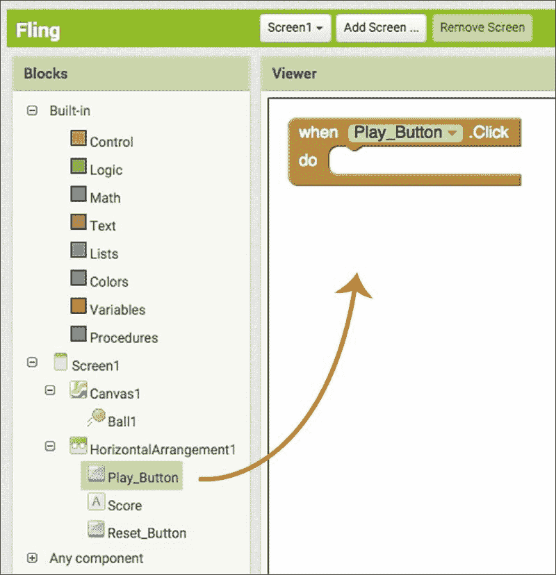

当用户点击应用程序的**播放**按钮时，我们希望游戏开始，球开始移动。因此，我们需要编写这些步骤。

首先，我们将把球放在屏幕顶部，并让它向下移动到屏幕底部。但我们不想把它完全放在屏幕顶部，因为在下一章中，我们将编写我们的应用程序，这样每次球击中顶部边缘时，用户都会得一分。为了避免仅通过按下播放或重置来得分，我们必须将球放置在顶部边缘稍低的位置。为此，我们需要设置一对(x, y)值。x 值是球在屏幕上的水平位置，y 值是球的垂直位置。x 值定义为从 Canvas 左边缘的像素数，y 定义为从 Canvas 顶部边缘的像素数。我们决定不希望 y 为 0，因为球会接触到边缘，所以我们可以将 y 值设置为接近 0 的值，例如 2。我们可以将 x 值设置为 Canvas 宽度上的任何值。为了使游戏更具不可预测性，我们将编写应用程序以随机选择 x 值。然后，每次用户点击播放或重置时，球将在屏幕上的不同水平位置开始（尽管它始终从顶部开始 2 像素，因为我们设置了 y = 2）。为了设置球的起始位置，我们将从 Ball1 抽屉中选择一个块。

在**块**面板中点击**Ball1**。将打开一个包含**Ball1**所有可用块的抽屉。使用弹出抽屉右侧的灰色滚动条向下滚动，以跳过金色事件块。点击下一张截图所示的紫色过程块：**call Ball1.MoveTo x, y**：

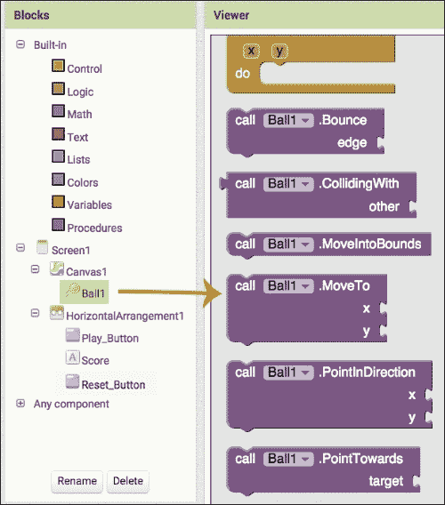

紫色过程块现在将出现在 **查看器** 中 **when Play_Button.Click** 金色事件块的旁边。注意这个紫色块的形状如何适合在金色块内。继续将紫色块放入金色块中（通过用鼠标点击并拖动它）。金色块会扩展以容纳紫色块。你会听到并看到它“咔哒”一声到位，如以下右侧的截图所示：

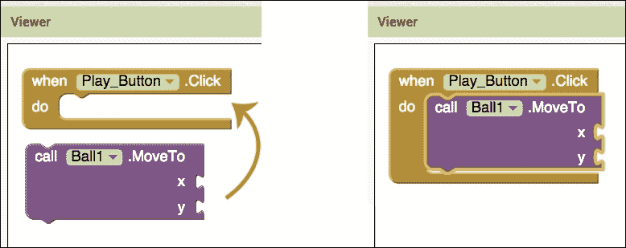

我们知道我们希望 **y** 的值等于 2，所以我们将找到一个块（一个获取器）来获取这个值。点击 **内置** 部分的 **数学** 块。**内置数学** 块旁边有一个小蓝色方块。一个抽屉会打开，显示可用的蓝色 **数学** 获取器块。点击下一个带有 **0** 值的块，如下一个截图所示：

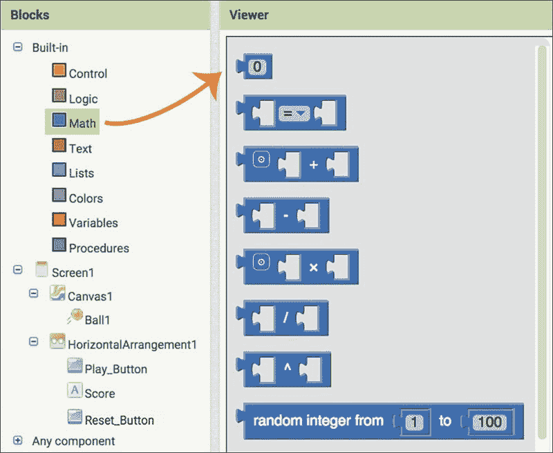

**0** 块将出现在 **查看器** 中，你可以将其拖动并吸附到 *y* 值上。点击 **0** 以突出显示它。你可以输入数字 `2` 将值更改为 `2`，如以下截图所示。接下来，我们将设置 *x* 值为随机整数。回到 **数学** 块，点击前面截图显示的最后一个块：**1 到 100 的随机整数**。将此块拖动到 *x* 值，如以下所示：

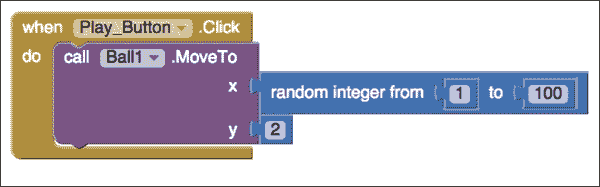

由于用户将使用不同屏幕尺寸的移动设备，我们不知道宽度将是 100 像素还是 350 像素。因此，为了使游戏能够在不同尺寸的屏幕上播放，我们可以删除具有 **100** 值的 **数学** 块，并插入一个获取器块来获取用户使用的移动设备的屏幕宽度。要删除蓝色 **100** 块，点击它以将其轮廓突出显示为黄色。一个小手图标会出现。这表示你可以将块从插槽中拖出，如以下截图所示：

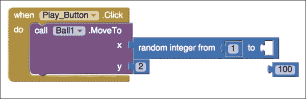

注意，如果你没有看到手图标，这仅仅意味着你点击了实际的数字而不是块。这会通过数字右侧的光标和一小块空白来表示。再次点击实际的蓝色数字拼图部分，你会看到手图标，这将允许你拖动块出来。

要删除此块（或任何不需要的块），点击它（如果它尚未突出显示为黄色），然后在电脑键盘上按 *Delete*。或者，你可以将块拖动到查看器的右下角，将其扔进垃圾桶。将块悬停在垃圾桶上，盖子会打开。当你释放块时，它会消失。你会看到它逐渐消失并听到折叠的声音。

要添加表示用户屏幕宽度的模块，请点击**屏幕 1**在**模块**调色板中，并从抽屉中选择**屏幕 1.Width**。它将在底部附近，因此您可以使用灰色滚动条向下滚动以找到它。

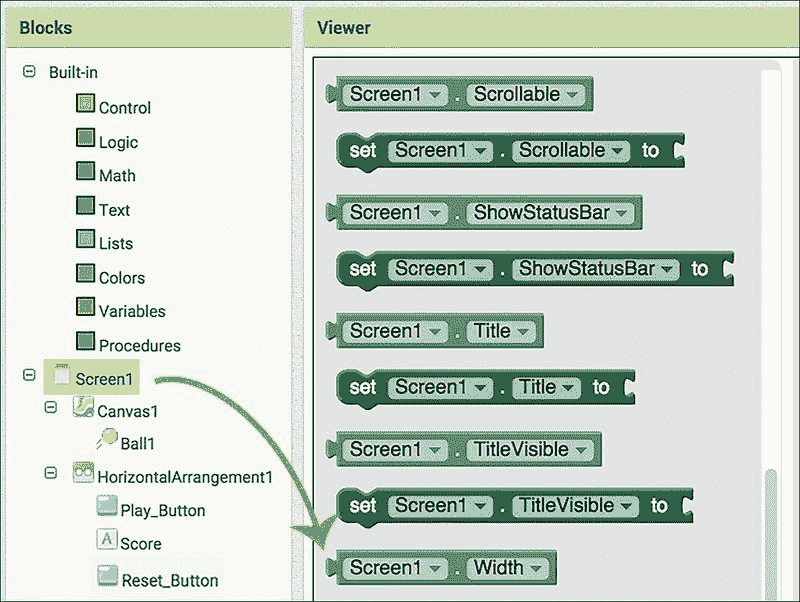

注意，要将此模块放入另一个模块内部（无论是一个方程还是单个模块），请将模块左侧的小拼图针与模块开口左侧的针孔空间对齐，它将轻松地卡到位。您的模块应该看起来如下：

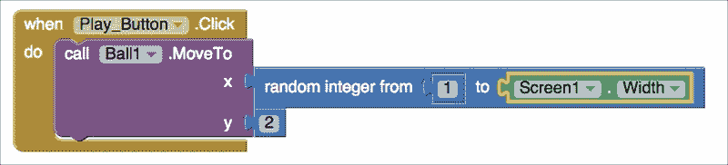

每当用户按下**播放**按钮时，球将被定位在屏幕宽度上的不同位置，并且距离屏幕顶部**2**像素。

现在我们已经定位了球，接下来我们将编程使其移动。

#### 移动球

由于我们已经编程使球从屏幕顶部开始，我们希望球向下移动。而不是每次都直接垂直下落或以相同的角度下落，我们可以设置角度为随机值。一个圆有 360 度，但我们只想让球在特定的角度范围内下落，这些角度表示向下，适合屏幕宽度，但不在屏幕边缘。下面的图示显示了右侧边缘是**0**度，左侧边缘是**180**度。我们感兴趣的实际空间是下半部分，即**180**到**360**度之间的角度。由于我们不希望球沿着边缘移动，我们将在选择数字时消除两个极端。我们决定选择**200**到**340**度之间的角度。我们将编写应用程序，使程序在球移动的角度范围内选择一个随机数字。

您已经从我们之前的模块中学习了如何编程随机整数，现在让我们重复这些步骤。前往**数学**模块，并选择蓝色**从...到...的随机整数**模块。您也知道如何填写这些数字。为了复习，请选择**数学**模块中最上面的蓝色模块：带有**0**的模块。您可以在其中输入**200**，然后通过点击它来突出显示并复制粘贴该模块（确保它有一个黄色的轮廓）。如果您不想复制粘贴，您始终可以拖出一个另一个**数学 0**模块。点击复制的模块中的数字并输入**340**。然后，将**200**模块放入**从**位置，将**340**模块放入**到**位置。

我们的**从...到...的随机整数**模块需要放置在某个位置，它将提供哪些信息？另一种问法是：哪个模块将获取这些信息？如果您猜对了球体，您是正确的！球体需要这些信息来知道它必须移动的角度。因此，我们需要找到代表球体方向的球体模块。这个模块被称为**Ball1.Heading**，它代表球体移动的度数。点击**Ball1**模块抽屉以找到深绿色的**Ball1.Heading**模块（您需要滚动过金色和紫色的模块才能找到它）。一旦它在您的**查看器**上，将其与您刚刚创建的蓝色**从...到...的随机整数**模块连接起来。然后，将这些连接的部件插入到金色**当 Play_Button.Click**模块的底部。现在，您的模块应该看起来像以下截图：

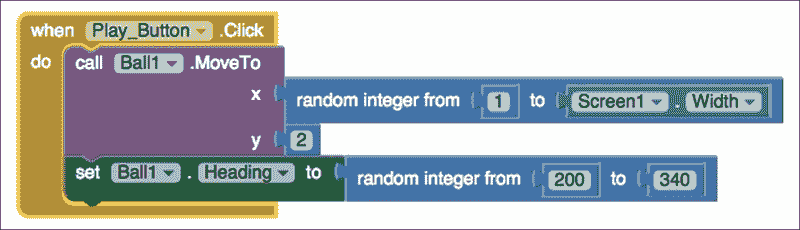

现在我们已经知道了球体的位置和它前进的方向（以度为单位），我们需要编程让它实际移动。为此，我们首先将球体设置为启用状态。从**Ball1**模块抽屉中，选择深绿色的**设置 Ball1.Enabled**模块。然后，从**逻辑**模块抽屉中，选择顶部的浅绿色**true**模块，如图下截图所示：

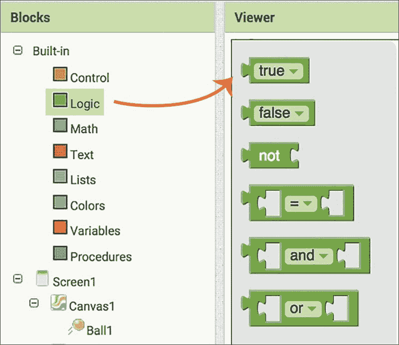

将**true**模块插入到**设置 Ball1.Enabled**模块中，并将它们添加到**当 Play_Button.Click**事件底部，如图下截图所示：

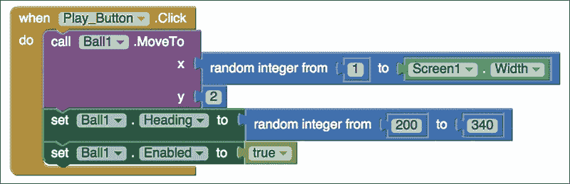

现在球体已经准备好移动，我们可以通过设置速度和间隔来移动它。回到**Ball1**模块抽屉，选择深绿色的设置模块，**设置 Ball1.Speed**。接下来，从同一个抽屉中，选择**设置 Ball1.Interval**。

间隔是球体移动的时间，以毫秒为单位（*1000 毫秒=1 秒*），速度是球体在该时间段内移动的像素数。玩弄这些数字以查看您可以使球体移动多快或多慢很有趣。我们决定让球体每**50**毫秒移动**10**像素，因此我们将编程模块设置为如下所示：

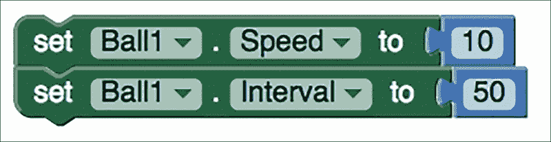

将这些模块插入到**当 Play_Button.Click**事件底部。您的模块将类似于以下截图：

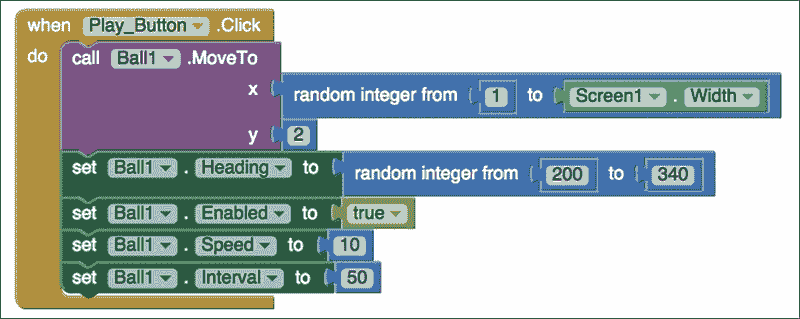

到目前为止，我们的应用程序是这样做的：当**Play**按钮被点击时，它将球体移动到距离屏幕顶部边缘**2**像素的位置，并随机移动到屏幕左侧边缘**1**像素和右侧边缘之间的任意位置。它将以**10**像素每**50**毫秒的速度在**200**到**340**度之间的随机方向滚动球体！

#### 投掷球体

游戏的目标是将向下移动的球抛离底部边缘，因为如果球掉落到屏幕底部边缘，游戏将结束。接下来，我们需要编写这些事件。

首先，让我们编程应用来抛掷球。

球如何知道手指触摸它以及如何移动到另一个方向（不是向下）？我们可以通过使用**Ball1**块抽屉中的**when Ball1.Flung**块来编程这些事件。点击这个金色事件块将其添加到查看器中。你可以让球以任何你喜欢的速度移动，但我们将保持相同的速度，只是方向不同。为此，你可以从**when Play_Button.Click**事件复制并粘贴**set Ball1.Speed to**和**set Ball1.Interval to**块（注意当你点击深绿色设置块并复制粘贴时，附加的蓝色获取块也会复制粘贴）。将这些块添加到**when Ball1.Flung**事件，使其类似于以下截图：

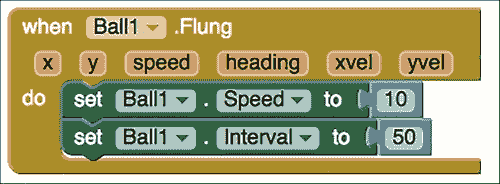

接下来，我们将调整球的方向使其向上移动（当用手指抛掷时）。我们可以将航向设置为 10 到 170 度之间的任意度数（见*图片 #39*）或者我们可以用一个方程使球向上移动。让我们更多地练习方程。复制并粘贴**set Ball1.Heading**块从**when Play_Button.Click**事件（记住航向块决定了球移动的角度）。将其拖到**when Ball1.Flung**事件的底部。我们希望球移动的方向与它原来的航向相反，而不是一个随机的整数，因此你可以通过突出显示并按键盘上的**delete**键或通过点击蓝色块并将其拖到垃圾桶中来删除附加的蓝色块。为了使球向相反方向移动，我们将当前球的航向（方向）从 360 度（可能的总度数）中减去。为了编写这个代码，从**Math Blocks**抽屉中选择减号块。在第一个空白处，添加数字**360**。从**when Ball1.Flung**事件复制并粘贴**50**蓝色块，并将数字更改为**360**。将其插入减号左侧的空白处。

接下来，从**Ball1**块抽屉中选择浅绿色获取块，**Ball1.Heading**。将其插入减号右侧的空白处（将块尖与空白尖对齐）。这是我们编写的代码：当球被触摸并抛掷时，程序将球的航向（或方向）移动到 360 度减去旧的方向（或航向）。你的块将看起来像下一个截图：

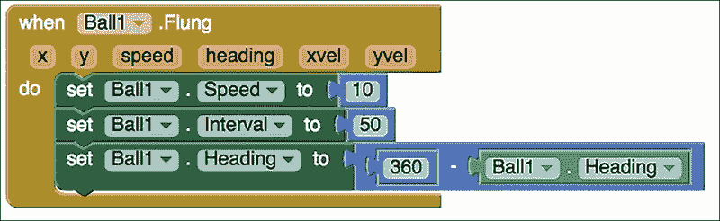

#### 结束游戏或使球弹跳

现在播放按钮开始使球向下移动，用户可以将其抛向不同的方向，我们想要编程以下动作：

+   当球触碰到底部边缘时结束游戏

+   球从左边、上边和右边弹跳

我们可以使用 **if**/**then** 块来编程这些操作。**如果**球碰到底部边缘，**那么**球将停止，游戏将结束。**如果**球碰到其他边缘，**那么**球将弹回，游戏将继续。

让我们先编写程序，当球碰到底部边缘时停止并结束游戏。App Inventor 使这变得很容易。转到 **Ball1** 块抽屉，并点击 **when Ball1.EdgeReached** 事件。一旦事件块出现在查看器中，将鼠标悬停在块的左侧浅橙色单词 **edge** 上（不要点击），您将看到一个弹出窗口，如下一张截图所示。选择顶部深橙色 **get edge** 块。这是一个变量。将其放在一边；我们将在一分钟内使用它。

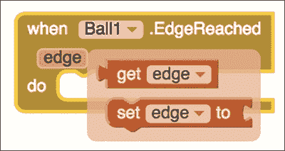

我们将在 **when Ball1.EdgeReached** 事件内部添加一个 **if then** 事件。但首先我们需要配置它。转到最顶部的 **Blocks** 抽屉，称为 **Control**，并点击第一个金色 **if then** 块。

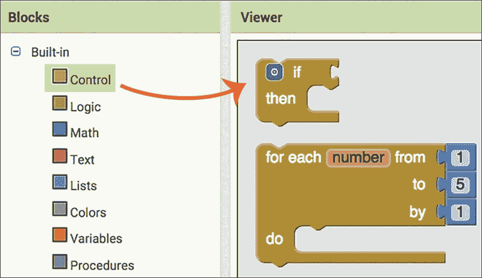

当块首次出现在您的 **Viewer** 中时，它将看起来像以下图片中的 *步骤 1*。如果您点击左上角的蓝色颜色方块，将出现一个弹出窗口。将光标移至弹出窗口左侧的底部 **else** 块，点击它，并将其拖入弹出窗口右侧的 **if** 开口中，如 *步骤 2* 和 *步骤 3* 所示。一旦 **else** 块就位，您将看到原始的 **if then** 事件块变为 **if then else** 块。您将看到 **else** 现在已添加到块的底部，如 *步骤 3* 和 *步骤 4* 所示：

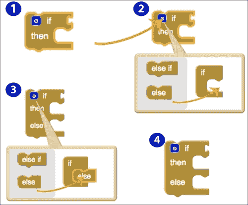

将此 **if then else** 块添加到 **when Ball1.EdgeReached** 块的内部，如以下截图所示：

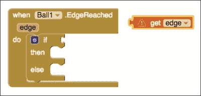

### 注意

注意我们放在一边的获取边缘块周围有一个感叹号和三角形的错误消息。这是一个错误消息警报，提示您该块未连接，需要设置器块。

要编程，**如果**球碰到底部边缘，**那么**球将停止，游戏将结束。我们将使用 **math equals** 块。它是 **Math Blocks** 抽屉中从上数第二个，如下一张截图所示：

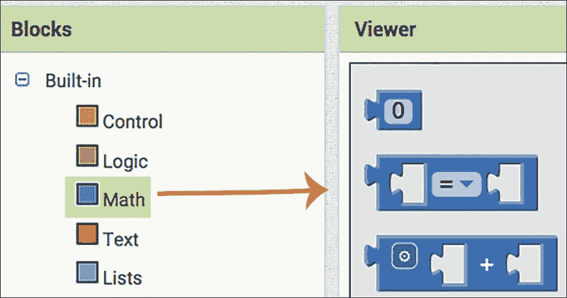

在等号左侧的第一个开口内，添加我们之前放置的深橙色 **get edge** 块。您会注意到，直到我们将数学块与 **if** 块连接到位，警报将一直保留在这个块上，我们将在不久后这样做。

在下一张图片中，您将看到每条边都由一个数字表示：

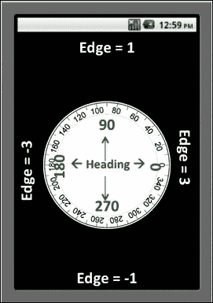

由于底部边缘等于**-1**，向此等于块添加一个数字数学块，并输入数字**-1**。将蓝色数学块拖入**if**块，如下所示（并且你会看到警报消失）。

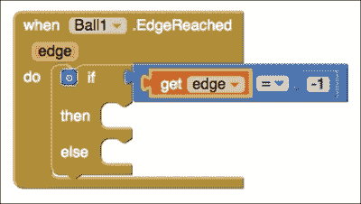

当达到底部边缘时，我们希望球停止，游戏结束，应用程序显示文本**游戏结束**。我们已经知道如何使球移动：我们将属性启用设置为**true**。因此，现在我们想要球停止或不动，我们必须将启用属性设置为**false**。在**Ball1**块抽屉中，选择**设置 Ball1.Enabled 为**，然后在**逻辑**块抽屉中选择**false**块。将这组块滑入**if then else**块的**then**空间，如下所示。

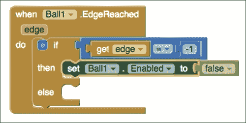

接下来，我们将编程应用程序显示表示游戏结束的文本。我们将使用我们命名为**Score**的标签（在下一章中，我们还将使用此标签显示分数）。转到**Score**块抽屉，并选择深绿色**设置 Score.Text to**块，如下面的截图所示：

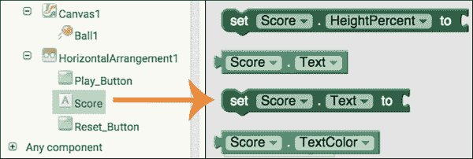

此设置块需要获取一些文本，因此我们将添加一个获取文本块。转到粉红色的**文本**块抽屉，并选择第一个块，它是一个带有引号的空格，如下面的截图所示：

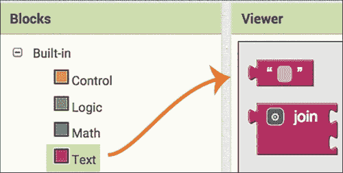

您将添加此粉红色文本块到**设置** **Score.Text to**块，并将其插入**then**事件中的**设置 Ball1.Enabled to**块下方。单击粉红色文本块并键入单词**游戏结束**，如下所示：

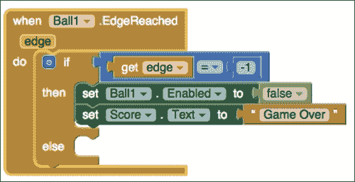

我们已经编程了应用程序，如果球击中底部边缘，它将停止移动，标签将显示文本：**游戏结束**。

最后一步，**else**块，是在球击中除**-1**（底部）之外的边缘时使用。如果球击中任何其他边缘，我们希望球从边缘弹回，游戏继续。为此，我们将使用紫色的**调用 Ball1.Bounce**块。我们将使用之前使用的相同橙色**获取边缘**块，但这次我们不会指定特定的边缘。球接触的任何边缘（除了底部边缘）都会使球弹起。复制并粘贴**获取边缘块**，将其添加到紫色**调用 Ball1.Bounce**块中，并将其插入**else**槽中，如下所示：

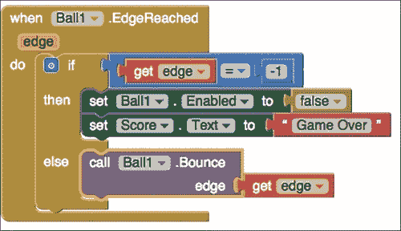

将**else**视为表示*否则*。如果球击中等于**-1**的边缘，则执行**then**代码，否则执行**else**代码。换句话说，如果**if**选项不满足（如果球没有击中**-1**边缘），则程序将跳过**then**并跳转到**else**。

以下是我们应用在球击中底部边缘、停止并显示**游戏结束**时的截图。

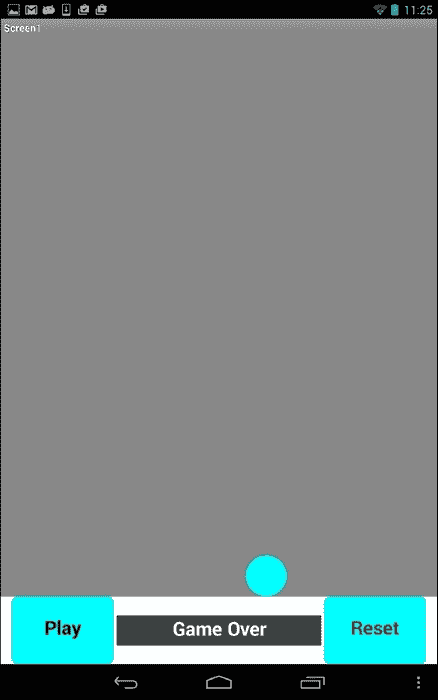

#### 重置按钮

本章我们将要做的最后一件事是配置**重置**按钮。当球击中底部边缘后，游戏结束，此时会按下**重置**按钮。它不像**播放**按钮那样启动游戏；它仅仅是将球重新定位到屏幕顶部，并使屏幕上的**游戏结束**文本消失（标签）。

进入**重置按钮**块并选择金色的**当重置按钮点击**事件。我们想要将球从屏幕底部移动到顶部。我们已经知道如何做，因为我们为**播放按钮**做了这件事。你可以复制并粘贴**球 1 移动到**紫色块（当你点击紫色块并复制粘贴时，它将自动复制并粘贴附带的蓝色*x*、*y*、获取器块）。将你的块添加到**当重置按钮点击**事件中，你的块将看起来像以下截图：

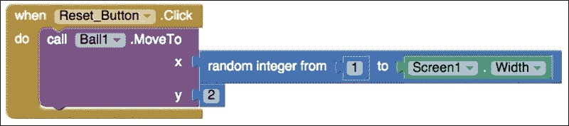

这些方块将球重新定位到屏幕顶部（到一个随机的**x**位置），但**游戏结束**文本仍然会显示。为了使重置按钮擦除这个文本，我们将简单地将**得分文本**设置为空白文本而不是**游戏结束**。从**当球 1 边缘到达**事件块中复制并粘贴深绿色的**设置得分.Text**块（复制并粘贴绿色的设置器块也会复制并粘贴粉色的文本块）。点击**游戏结束**文本并按*删除*，使文本区域为空。将这组块添加到**当重置按钮点击**事件块的底部，如下所示：

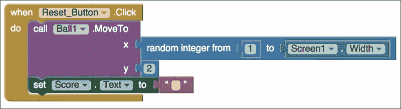

以下是在按下**重置**按钮后我们应用的截图。它显示了球在屏幕顶部，以及之前**游戏结束**文本出现的地方的空白区域。

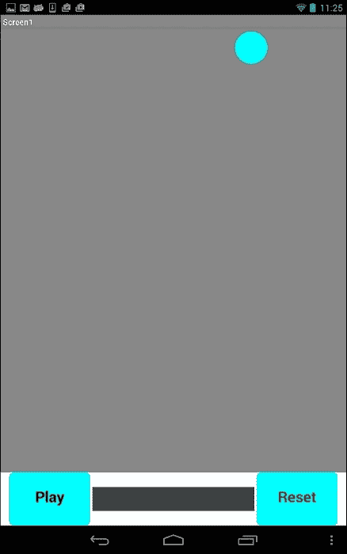

我们的第一版 Fling 应用现在完成了！我们设计和编码了 Fling 应用，所以当点击**播放按钮**时，球会随机定位到屏幕顶部并开始滚动向下。用手指弹球会使球向相反方向移动。球会从所有边缘弹起，除了底部。当球击中底部边缘时，它会停止，应用会显示**游戏结束**。**重置**按钮将球重新定位到屏幕顶部的随机位置。此时，你可能已经或还没有发现我们有一个 bug！它与**播放**和**重置**按钮有关。我们将在下一章揭示并修复这个 bug。

# 概述

哇！在本章中，你已经对 App Inventor 平台有了很多了解，并且你已经构建并编写了你的第一个应用程序！这是一个巨大的成就！但是，正如你可能已经注意到的，我们有一个问题需要解决。我们将演示如何调试你的第一个错误，以及如何添加更多功能。实际上，这仅仅是你的移动计算冒险的开始。还有更多需要学习和创造的东西！我们的 Fling 应用程序功能齐全且简单，但我相信你能想出无数更多功能来增强它。在下一章中，你将学习如何通过创建一个在球触碰到顶部边缘时显示的计分机制，允许球只从屏幕的下半部分发射，以及创建关卡和提高球的速度来扩展应用程序的复杂性

通过学习如何向现有应用程序添加更多功能，你将获得开发多个版本的经验。这个过程就是开发者经常做的事情。最终，一旦你在像 Google Play 这样的应用市场中发布你的应用程序，新版本将作为更新发布。

让我们把我们的游戏提升到下一个层次！
