# 第六章. 数据库简介

现在我们已经成功创建了事件应用的第一部分，是时候让它更加功能化了。在本章中，我们将通过添加代码来扩展我们的事件应用，使客人能够通过发送 RSVP（法语中的“请回复”——*répondez s'il vous plaît*）来回应邀请。应用将汇总所有数据并显示宾客名单，以便宾客和派对组织者都能看到谁将参加。

为了让应用能够从个人中央存储库收集所有 RSVP 数据，我们必须使用在线数据库。App Inventor 内置了对三个在线数据库的支持，包括 TinyWebDB 和 Google 融合表（我们将使用它）。

TinyWebDB 和 Google 融合表在聚合数据方面都有其局限性。TinyWebDB 虽然易于使用，但不安全。这意味着任何人都可以访问数据库，可能会不小心（或故意）删除或更改收集的数据。另一方面，Google 融合表是安全的，但使用起来更复杂。为了将融合表集成到我们的应用中，同时保持应用设计相对简单，我们必须做出一些权衡。学习目标是向您介绍使用相对简单的应用构建数据库的过程。但是，正如您将发现的，生成的应用对广泛公众的传播具有挑战性。在本书出版时，另一个 App Inventor 数据库替代品 FirebaseDB 正在开发中。我们将提供 FirebaseDB 采用更新的信息，一旦它可用。您可以在 Packt Publishing 和 MIT App Inventor 网站上检查补充材料，以获取有关 FirebaseDB 的新信息。

在本章中，你将学习：

+   如何创建 Google 融合表

+   如何建立 Google API 凭证

+   如何设置 RSVP 表格

+   如何将 App Inventor 应用中的数据推送到 Google 融合表

+   如何从 Google 融合表请求和接收数据到 App Inventor 应用

+   如何显示宾客名单

# 创建数据库

在这个应用中，受邀者将发送 RSVP 来告知派对组织者（和其他宾客）他们是否能参加活动。因此，自然地，我们必须包括一个机制来收集所有分散的信息到一个中央位置。为了实现这一点，我们将使用 Google 融合表创建一个在线数据库。在专业编程中，这个方面通常被称为创建后端。

## 创建 Google 融合表

要创建 Google 融合表，请访问您电脑上的[`drive.google.com`](https://drive.google.com)网站，点击屏幕左上角的大红色按钮，按钮上标有**新建**。向下滚动选项列表，选择**更多**，然后选择**Google 融合表**：

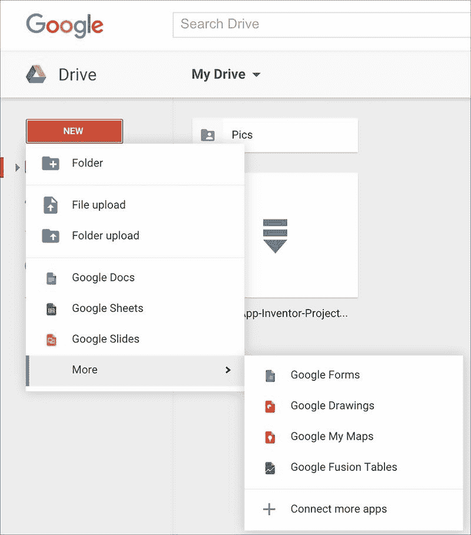

如果你之前从未使用过谷歌融合表，那么当你点击**更多**时，你可能会看不到列出的**谷歌融合表**选项。如果是这种情况，选择带有加号的最后一个选项，**连接更多应用**。一个弹出窗口将出现，其中包含许多你可以连接到你的谷歌驱动器中的应用。你应该会看到一个类似于以下截图的视图。在这个弹出窗口的左上角，你会看到一个默认显示单词**所有**的按钮。这个按钮让你可以按各种类别过滤应用。点击它，并从下拉菜单中选择第二个选项，**按谷歌**，如以下截图所示：

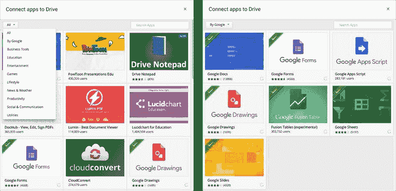

现在，你将看到所有由谷歌创建的应用列表，如前一个截图的右侧所示。在列表中找到谷歌融合表应用，并点击它。完成之后，下次你点击[`drive.google.com`](https://drive.google.com)中的红色**新建**按钮并选择**更多**时，谷歌**融合表**将作为一个选项出现。

当你创建一个新的融合表时，你将会有选项创建一个空表（以及其他一些选项）。出于我们的目的，选择**创建空表**。

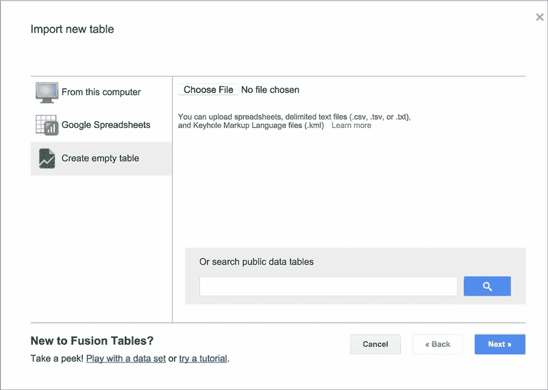

接下来，我们将使表格的格式适合我们的应用。首先，重命名表格以给它一个有意义的名字。点击屏幕左上角的当前表格名称**新表**。这将打开一个**表格信息**窗口。给你的表格起一个描述性的名字，例如`EventApp Table`，然后点击**保存**按钮：

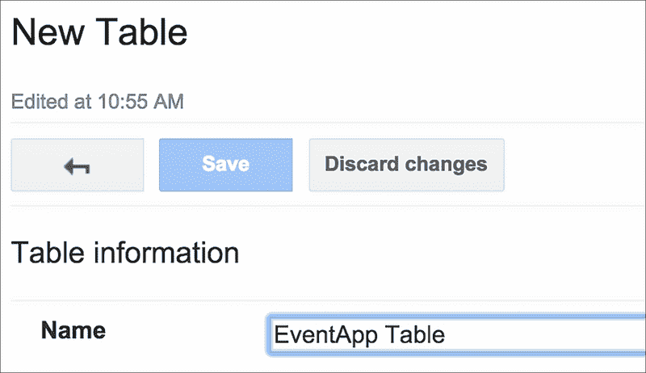

在这个表格准备好作为我们活动应用的后端使用之前，我们需要对其进行进一步的修改。默认情况下，融合表中会插入一个空白行。我们希望我们的表格是完全空的。为了清空表格，选择屏幕左上角表格名称下方的**编辑**标签。你会看到一个**删除所有行**的选项；点击它并确认你想要删除所有行：

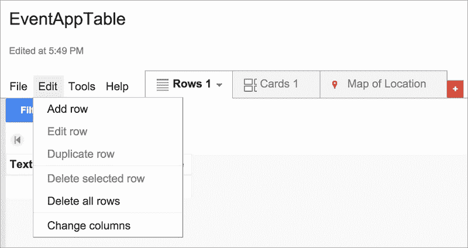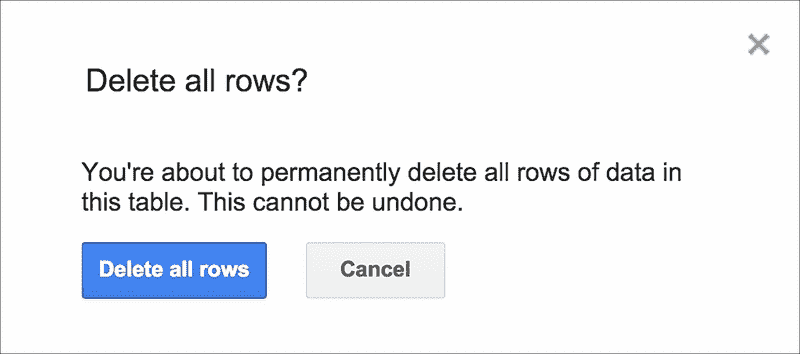

现在我们已经有一个干净的表格了，我们需要决定使用哪些列。对于这个活动应用，我们想知道谁会来（宾客的名字），这个人会带来多少人（宾客数量），以及这位宾客会带来哪些物品到派对上（拼盘）。这些信息将被组织者用来计划派对。

这三个信息点中的每一个都将保存在融合表的一个列中。创建融合表时自动包含四个列。由于我们只需要三个列，我们将删除四个默认列中的一个，并修改其他三个。

你点击以删除所有行并清理表格的**编辑**选项卡还包含另一个名为**更改列**的选项。我们现在将使用该选项多次来对列进行所有更改。默认列名是**文本**、**数字**、**位置**和**日期**。我们将它们更改为**宾客姓名**、**NumGuests**和**ItemsBringing**。

要将第一列更改为**宾客姓名**，点击编辑选项卡并选择**更改列**选项，你将看到以下截图。默认选中第一列（左侧面板上的灰色背景表示它是活动的）。将**列名**更改为**Guest Names**。此列已经配置为保存**文本**数据（**类型**选项），因此我们在这里不需要做任何更改：

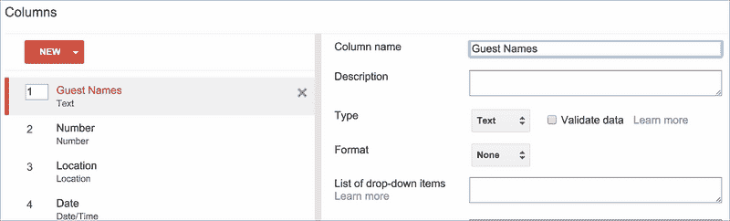

现在我们已经更改了第一列，我们将对第二列做同样的操作。选择第二列（目前称为**数字**）。一旦点击它，背景将变为灰色。现在将**列名**更改为**NumGuests**。由于此列已经配置为存储数字，我们在这里不需要做任何更改：

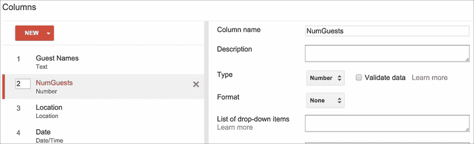

接下来，我们需要重命名第三列（目前称为**位置**）。就像前面的例子一样，选择该列并将其名称更改为**ItemsBringing**。默认情况下，此列预先配置为存储**位置**数据。我们实际上想要存储**文本**数据（宾客将带来的物品）。因此，我们需要更改数据类型。当你点击**位置**（**类型**选项）时，将出现一个下拉菜单，如下面的截图所示。选择**文本**选项。

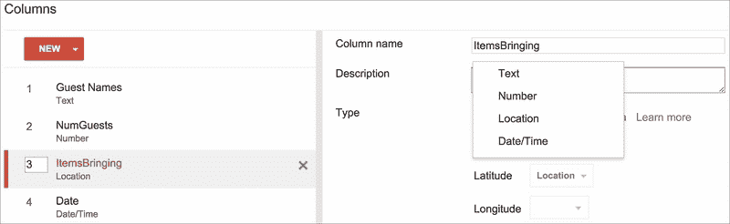

最后，由于我们只需要三列，我们将通过悬停在第四列上使其变为活动状态（灰色）并点击其旁边的**x**（如下面的截图所示）来删除第四列，并在弹出框中确认删除：

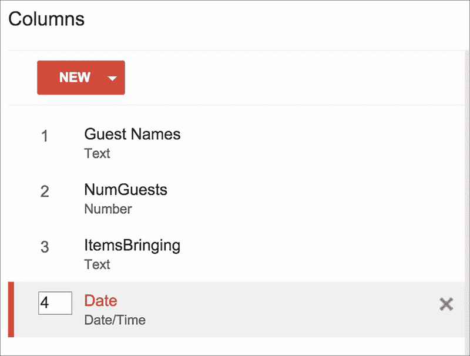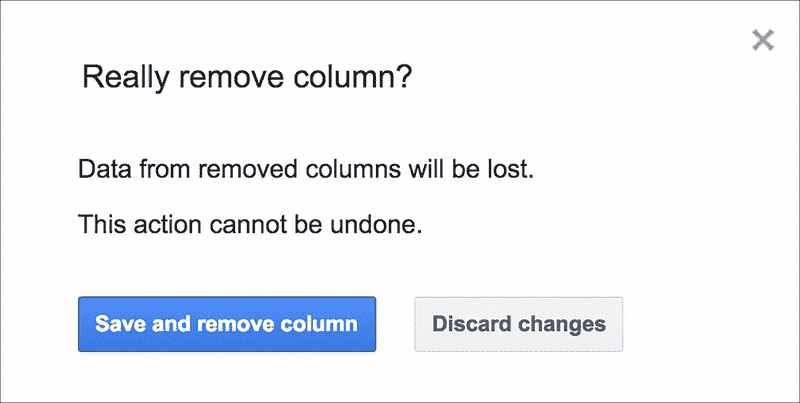

现在表格已准备好使用，点击左上角的**文件**选项卡，并从下拉菜单中选择**关于此表格**。

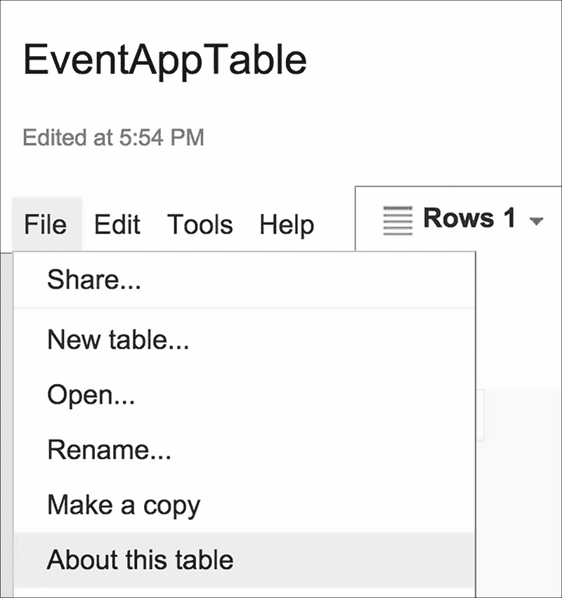

另一个页面将打开，显示表格的详细信息。注意最后一项信息中给出的信息，即**Id**，如下面的截图所示。双击该字母数字字符串以突出显示它，将其复制/粘贴到你的电脑上的另一个位置，例如记事本文件或空白文档。（你可能需要使用浏览器中的复制/粘贴功能来完成此操作，因为键盘快捷键可能不起作用。你可以在浏览器窗口顶部的**编辑**菜单下找到复制/粘贴。）你将在 App Inventor 应用程序中使用此**Id**将数据推/拉到/从这个表格中：

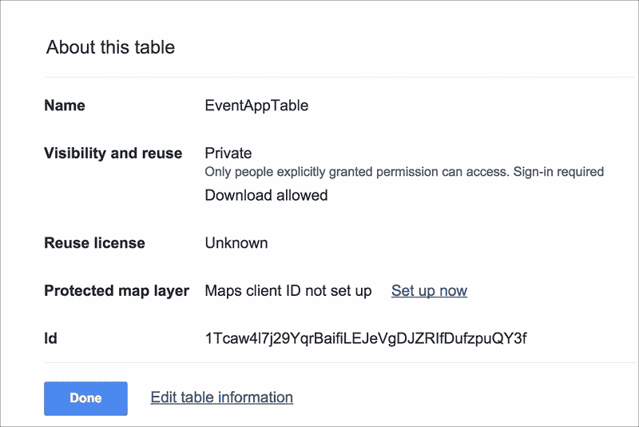

我们将对 Fusion Table 进行一个小小的最终修改（修改其**Sharing**设置），但，我们目前还没有准备好进行这一步。所以请保持 Fusion Table 窗口打开，并在单独的浏览器窗口中开始使用 App Inventor。

# 设计 RSVP 屏幕

对于我们的应用，我们要求受邀宾客提供他们的姓名、总宾客数量以及将在野餐中分享的食物或饮料。一旦宾客按下**Send RSVP**按钮，就会发生神奇的事情。我们将把应用中的所有数据推送到我们创建的 Fusion Table 中。

## 在设计窗口中创建 GUI

在第五章中，我们在*构建活动应用*中创建了`RSVP_Screen`，现在我们将构建宾客将使用的 GUI（图形用户界面）。在**Designer**窗口中导航到 RSVP 屏幕。屏幕除了背景池图像和底部添加的导航按钮外，其他都是空的。

由于您在前面章节中已经积累了添加各种组件的经验，我们对您的能力非常有信心。当然，我们也会帮助您指定使用哪些组件！嘉宾在此提供了三份数据：姓名、宾客数量以及需要携带的物品。我们将把与这三份数据相关的所有组件放置在 VerticalArrangement 中，以实现简洁的外观。因此，首先需要添加的组件是：**VerticalArrangement**。将其拖动到**Viewer**中，并将其**Height**和**Width**属性设置为**Fill parent**。

要收集第一份数据，即姓名，添加一个**Label**，在其下方通过拖动添加一个**Textbox**到**Viewer**中的 Vertical Arrangement 中。将**Label**重命名为`NameLabel`，并将**BackgroundColor**属性更改为**Dark Gray**。勾选**FontBold**属性，并将**Text**属性更改为**Name**。

同样，将**Textbox**重命名为`NameTextBox`。将**Width**属性更改为**Fill parent**。在**Hint**属性中输入**Enter your first and last name**。

对于第二份数据，即宾客数量，添加一个**Label**和另一个名为**ListPicker**的组件（在**User Interface**调色板中的**Label**组件下方找到）。将组件拖动到 Label 和 Textbox 下方的 VerticalArrangement 中。将此 Label 重命名为`GuestsLabel`。将**BackgroundColor**属性更改为**Dark Gray**，勾选**FontBold**属性，并将**Text**属性更改为**Number of guests (including you)**。

我们将使用 ListPicker 组件来跟踪当客人提交 RSVP 时参加的人数。ListPicker 是一个按钮，点击后会打开一个列表，用户可以从中选择。将 **ListPicker** 重命名为 `NumGuestListPicker`。我们将对 **ListPicker** 属性进行两项更改。将 `1,2,3,4,5,6,7` 作为 **ElementsFromString** 属性。这些是我们希望在用户点击 **NumGuestListPicker** 时显示的项目。我们假设客人数量（包括完成 RSVP 的人）在 1-7 之间。您可以按需添加更多或更少的客人选项。

只需记住，您指定的逗号分隔的数字是用户可以选择的选项。最后，将 **Selection** 属性设置为 **1**。这意味着，如果用户没有从 **NumGuestListPicker** 中选择数字，则默认值 1 将用于计算发送 RSVP 的用户。

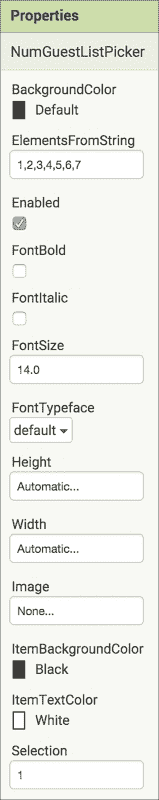

最后，我们将添加一个 **按钮** 并将其重命名为 `SendRSVPButton`。用户在完成表格后点击此按钮发送 RSVP。就像我们对标签所做的那样，将 **BackgroundColor** 设置为深灰色，并将 **Text** 属性插入为 **发送 RSVP**。

接下来，将 **FusiontablesControl** 组件从 **存储面板** 拖动到查看器中。（注意 **FusiontablesControl1** 组件是如何在 **查看器** 下方展开的，因为它是一个不可见组件。）添加所有组件后，`RSVP_Screen` 将类似于以下截图：

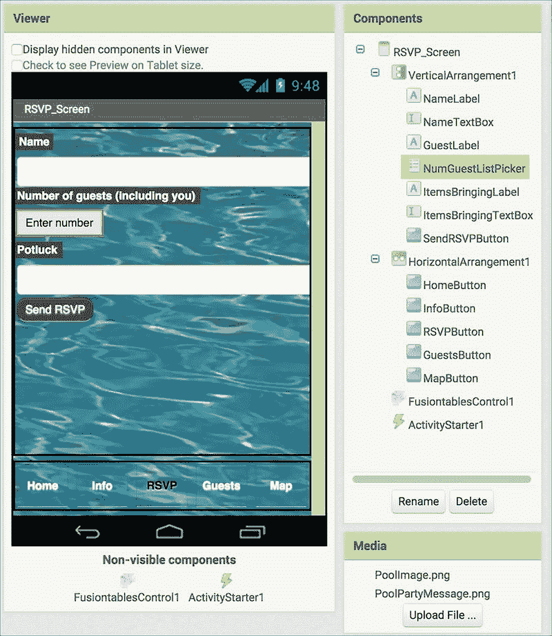

这完成了 `RSVP_Screen` 的 GUI。在专业编程术语中，这也称为创建前端。

# 设置 Google 身份验证

Fusion Tables 是 Google 设计的软件。由于各种安全和隐私相关的问题，Google 只希望经过验证的软件向/从 Fusion Tables 发送/接收数据。因此，在我们的事件应用与 Google Fusion Tables 交换数据之前，我们需要建立我们的身份。在本节中，我们将描述如何创建 Google 服务级身份验证以建立此凭证。

要建立服务级身份验证凭证，请按照以下说明操作：

1.  前往 [`console.developers.google.com/`](https://console.developers.google.com/) 并使用您的 Google 账户登录（如有必要）。在 **入门** 页面上，点击 **使用 Google API** 按钮，如图所示：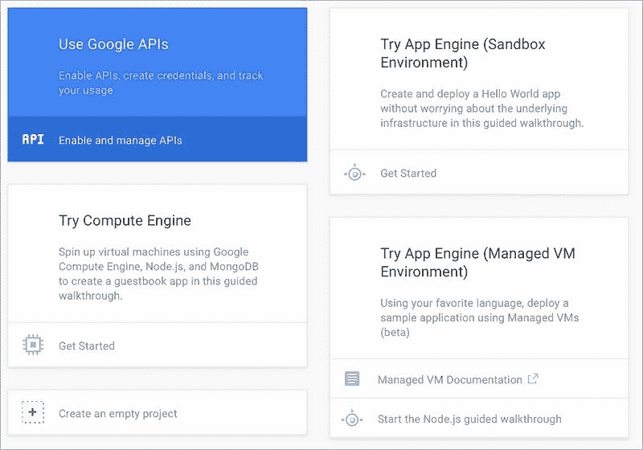

    缩写 API 代表**应用程序编程接口**。用非常简单的方式描述，API 定义了计算机与网站交互的方式（本质上是为了软件程序能够与之交互）。像 Twitter、Facebook 和 Google 这样的公司的开发者创建了他们的软件协议，以便其他程序能够与之通信。在这种情况下，App Inventor 将与 Google Fusion Tables API 通信。

1.  您将被提示创建一个使用 API 的新项目。将您的项目命名为**事件应用项目**。进行以下截图所示的选项选择，然后点击**创建**：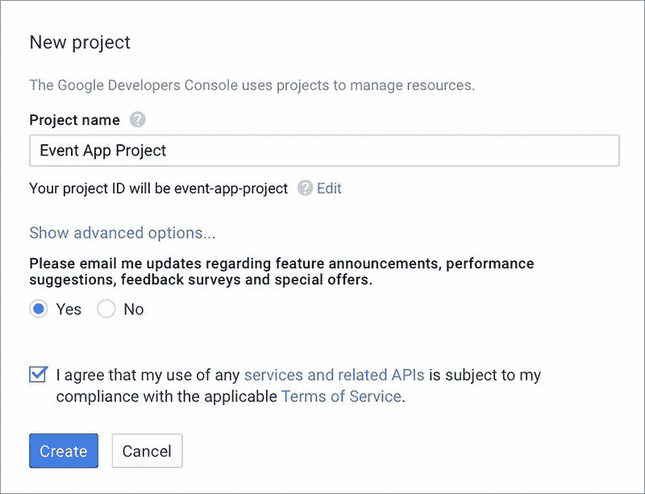

1.  在右侧，您将看到一个名为**已启用 API（7）**的标签页，如下所示。点击该标签页：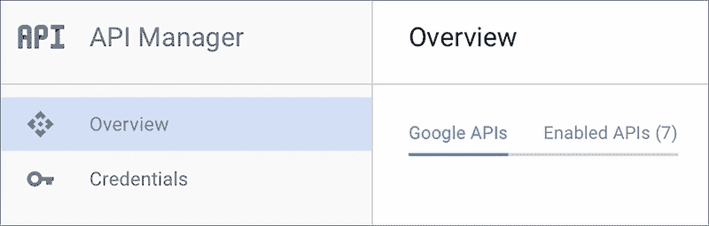

    这将显示默认启用的 API 列表。由于我们不会使用这些 API，请点击每个 API 旁边的**禁用**选项，并禁用每个 API。

    

    在禁用所有 API 后，您的屏幕将如下截图所示：

    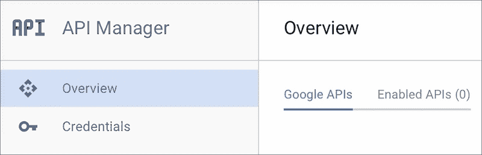

1.  我们下一个目标是启用我们的应用将使用的单一 API——**Fusion Tables API**。要做到这一点，请查找**其他流行 API**列。您将在以下截图所示的链接底部右边的组中找到它（寻找蓝色菱形图标）：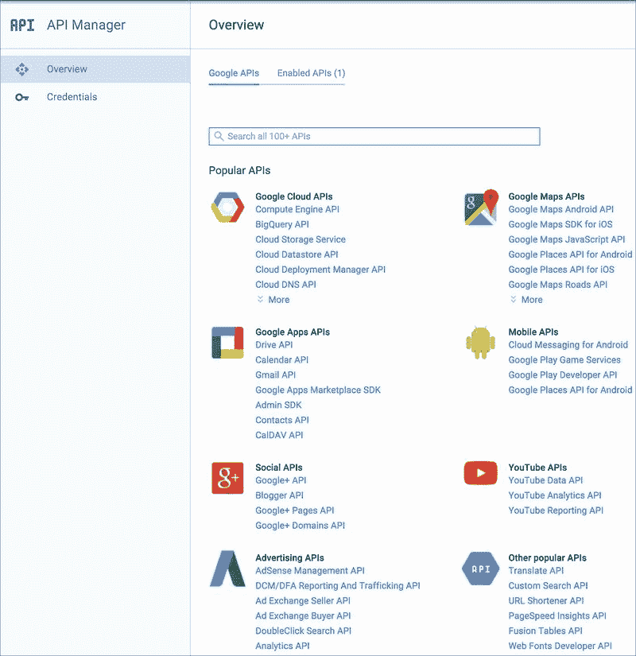

1.  点击此列中列出的**Fusion Tables API**。然后，在下一个屏幕中，点击以下截图所示的蓝色**启用 API**按钮：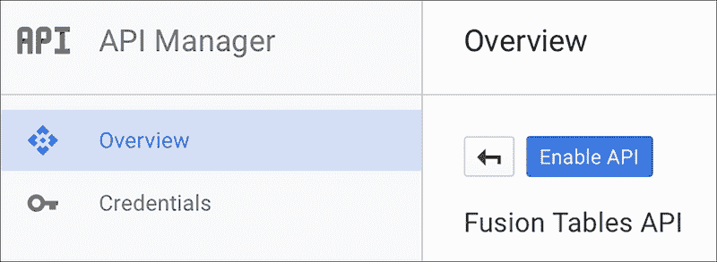

1.  现在我们已经启用了**Fusion Tables API**，是时候创建凭据（软件验证其他软件真实性的方式）了。点击左侧垂直面板上的**凭据**选项，如下截图所示：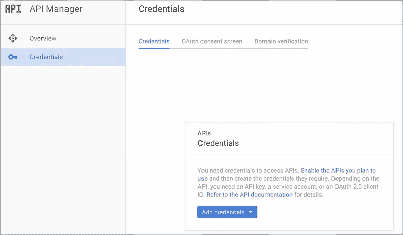

    这将弹出一个带有蓝色**添加凭据**按钮的窗口，如下截图所示。点击该按钮，然后选择最后一个选项——**服务帐户**。

    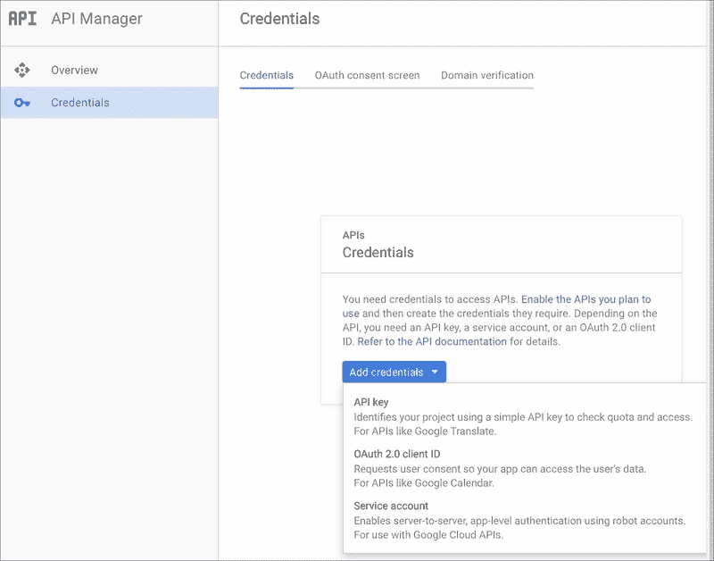

    在下一个窗口中，进行以下截图所示的选项选择，然后点击**创建**：

    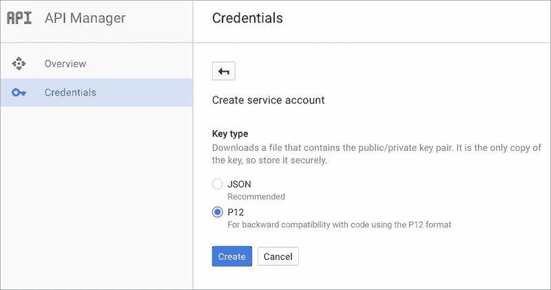

    这将创建服务帐户并将一个特殊的文件下载到您的计算机上。此文件具有`.p12`扩展名。根据您浏览器的设置，您可能会看到一个如下所示的窗口。此窗口询问您将文件保存到何处。将文件保存到您的硬盘上的某个位置，并记住位置。稍后我们将此文件上传到 App Inventor：

    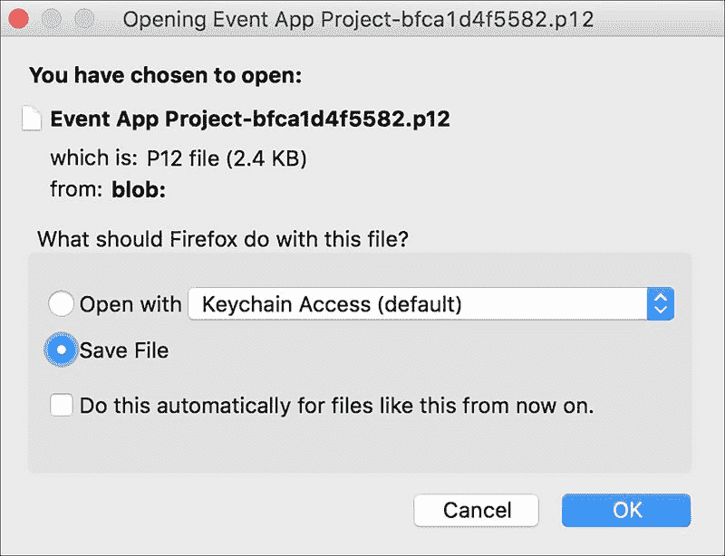

    如果你没有看到之前显示的弹出窗口，那么很可能你的浏览器被设置为将所有内容下载到默认的 `下载` 文件夹。在这种情况下，`.p12` 文件将自动保存在该文件夹中：

    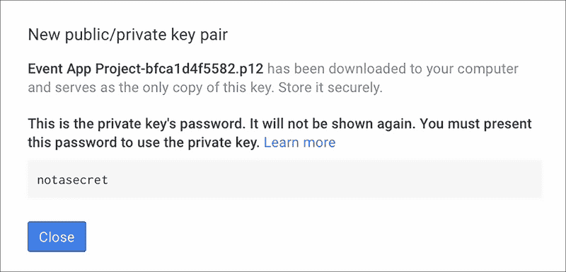

    在此 `.p12` 文件已下载到您的计算机后，您将看到类似于之前显示的消息。点击 **关闭** 按钮以关闭消息。

1.  现在我们已经创建了将要使用的凭证，Google 将自动生成一个与该凭证关联的电子邮件地址。这个电子邮件地址是我们需要在 App Inventor 中指定的内容。如图所示，在 **服务** 账户下将显示一个长而复杂的电子邮件地址。复制此电子邮件并将其粘贴到您之前用于存储您创建的融合表 ID 的文档中。就像融合表的 ID 一样，您稍后还需要这个电子邮件地址：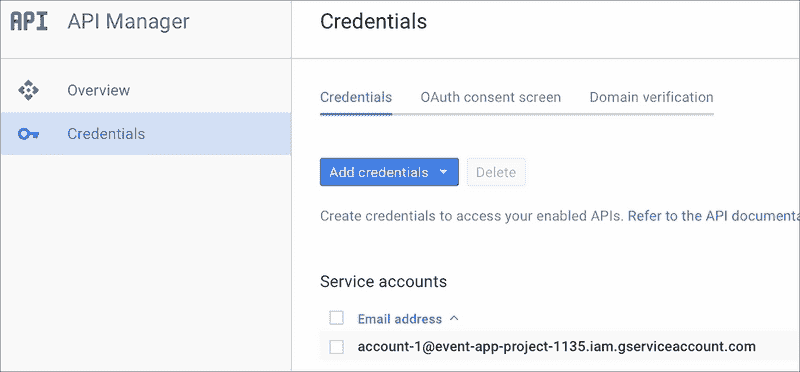

1.  **融合表 API** 现已启用，并且凭证已建立。

# 通过服务账户电子邮件共享融合表

当你在前面的部分创建融合表时，你使用的是自己的 Google 账户。所以现在只有你可以访问和更改融合表。然而，为了让这个应用工作，你需要确保所有客人都有能力向融合表插入数据并从融合表读取数据。

在上一步中创建的服务账户电子邮件将非常有用，以实现这一点。该电子邮件与您的应用相关联，而不是任何个人。因此，只要该电子邮件地址有权访问融合表，任何其他使用该应用的人都应该能够访问融合表。

要启用对融合表的电子邮件级别访问权限，请回到您的融合表（在单独的浏览器窗口/标签页中打开）并点击右上角的蓝色 **共享** 按钮。这将打开 **共享设置** 菜单，如图所示。

将您之前保存的服务电子邮件地址复制并粘贴到 **邀请人员** 框中。确保框旁边的按钮上写着 **可以编辑**，然后点击 **发送**。

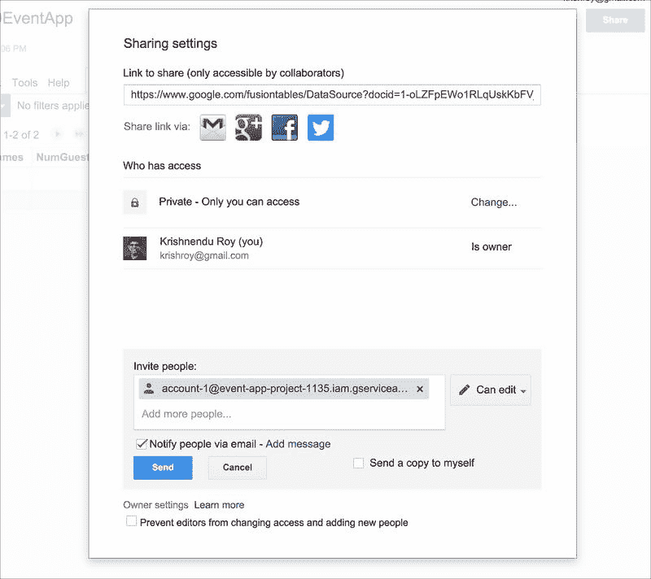

此步骤确保任何应用用户（而不仅仅是您）都能够向融合表插入数据或接收数据。

# 将应用连接到 Google 融合表

到目前为止，我们已经创建了一个融合表和 `RSVP_Screen` 的 GUI，并建立了我们的 Google API 凭证。现在是时候为 `RSVP_Screen` 创建代码了。

## 我们的目标

当用户点击 **发送 RSVP** 按钮：

1.  应用从 **NameTextBox** 中获取名称，从 **NumGuestListPicker** 中获取选择，并将 **ItemsBringingTextBox** 中的内容作为一个单独的行插入到融合表的相应列中。

1.  然后，应用程序清除文本框并重置 Listpicker 选择为 1。

我们创建了服务级凭证（`.p12`文件和服务级电子邮件地址），以便我们的应用程序有权从 Google 融合表发送或接收信息。接下来，我们需要将此信息提供给应用程序中的**FusiontablesControl**组件。我们希望在用户打开`RSVP_Screen`时执行此操作。

如以下截图所示，在设计师中的**RSVP_Screen**中，在**组件**列下选择**FusionTablesControl1**组件。这将显示**FusiontablesControl1**的所有属性。在**KeyFile**属性下，当前显示为**无**。然后点击**上传文件**按钮：

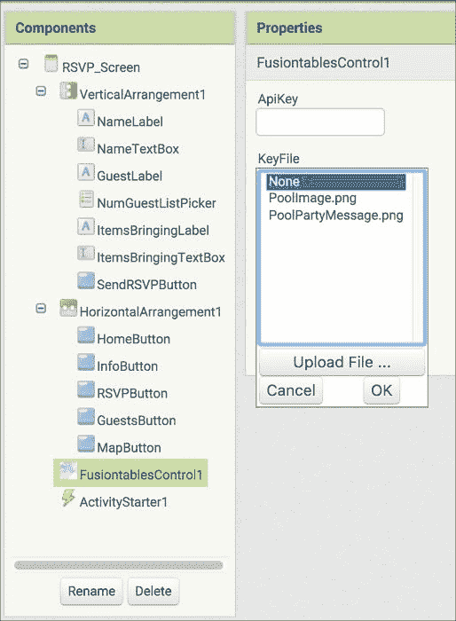

这将打开另一个弹出窗口，允许您选择要上传的文件。以下截图显示了弹出窗口。选择您之前下载到计算机上的`.p12`文件，然后点击**确定**按钮：

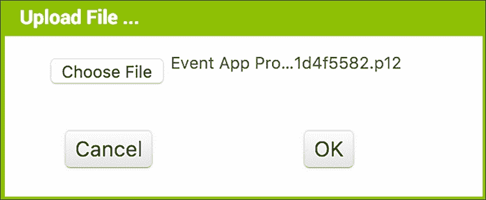

接下来，复制您在文档中保存的服务级电子邮件地址，并将其粘贴到**ServieAccountEmail**属性中。

最后，勾选**UserServiceAuthentication**复选框。

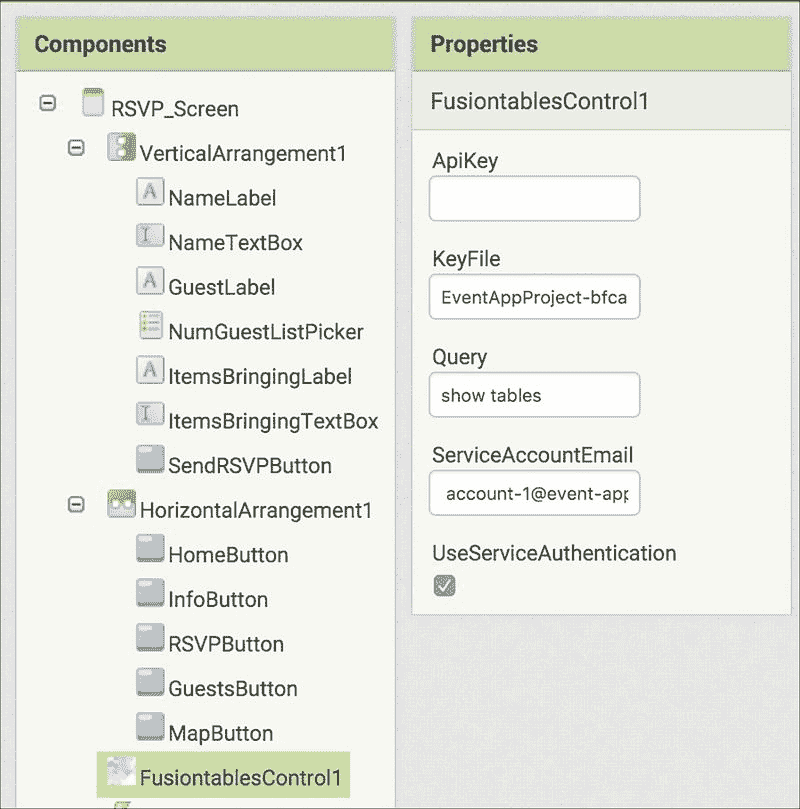

# 将数据推送到融合表

当使用多个屏幕时，您希望在块编辑器中根据屏幕组织您的块。由于我们即将为 RSVP_Screen 编程块，我们需要确保我们在块编辑器中的 RSVP_Screen。

要检查这一点，请查看 EventApp 名称旁边绿色菜单栏中的第一个三个按钮。如果你刚刚在设计师中完成了 RSVP_Screen 的工作并切换到块编辑器，你将位于 RSVP_Screen。如果不是，你可以通过点击显示另一个屏幕名称（如下一个截图所示的 Screen1）并从下拉菜单中选择 RSVP_Screen 来轻松导航到 RSVP_Screen：

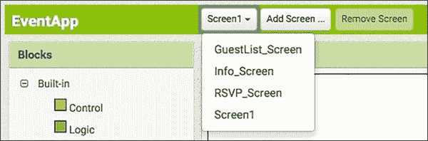

当用户点击**发送 RSVP**按钮时，我们希望将所有三份数据插入到融合表中。以下截图显示了实现这一目标的块。这看起来可能有些吓人，但实际上相当简单：

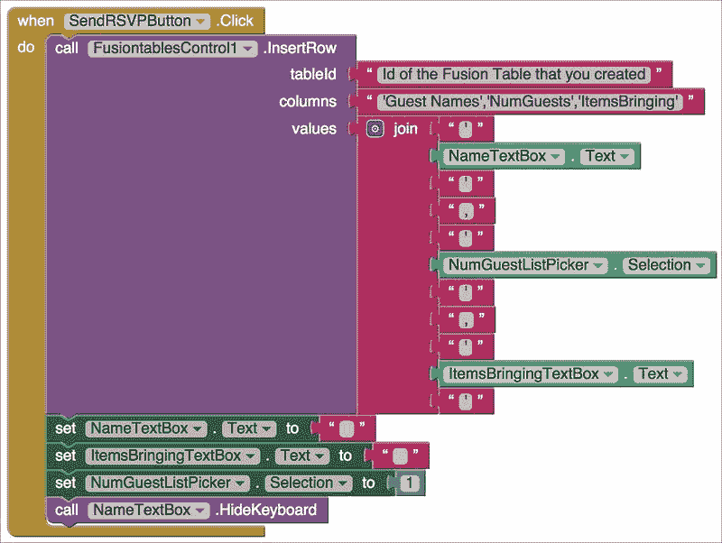

由于我们希望应用程序对**发送 RSVP**按钮的点击做出反应，我们当然需要获取**SendRSVPButton.Click**事件。正如你可能已经猜到的，你将在**SendRSVPButton**抽屉中的块调色板中找到这个事件块。

紫色**调用 FusiontablesControl1.InsertRow**块使应用程序能够将一行数据插入到融合表中。在**Fusiontables1**块抽屉中，选择并将**FusiontablesControl1.InsertRow**块放置在**SendRSVPButton.Click**事件中。

如你所见，**InsertRow**块有三个空插槽。第一个插槽是你想要使用的表的**Id**。回想一下，我们在上一步创建表时找到了我们表的**Id**。在这里复制并粘贴那个**Id**，在一个空的**Text**块中。

在**InsertRow**块的第二个插槽中，我们将指定列名。当将包含多个数据片段（列）的行插入到 Fusion Table 中时，我们需要指定这些数据片段适合哪些列。回想一下，我们给列命名为**Guest Names**、**NumGuests**和**ItemsBringing**。在一个空的**Text**块中，输入列名，用单引号括起来，并用逗号分隔，如下截图所示（注意没有空格）：

**InsertRow**块需要的第三和最后一个信息是实际要插入到 Fusion Table 中的值。就像列名一样，我们将把多个数据片段输入到 Fusion Table 的单行中。与列一样，这三个数据片段必须用单引号括起来，并用逗号分隔，但我们将以不同的方式插入。为了从**RSVP_Screen**中的三个单独字段中收集的三个信息片段创建一个单引号、逗号分隔的文本，我们将使用一个**join**块。从内置的**Text**块抽屉中，将**join**块拖动并连接到**InsertRow**的值插槽。

我们需要连接 11 个东西——三个信息片段、六个单引号（每个信息片段前后各一个）和两个逗号来分隔三个单引号信息片段。默认情况下，**join**块连接两个东西。因此，我们需要为另外九个东西腾出空间。点击**join**块左上角的蓝色按钮，并将弹出窗口左边的字符串块拖动到弹出窗口右边的**join**块中，如下所示。这将创建更多的插槽在**join**块中。这样做九次：

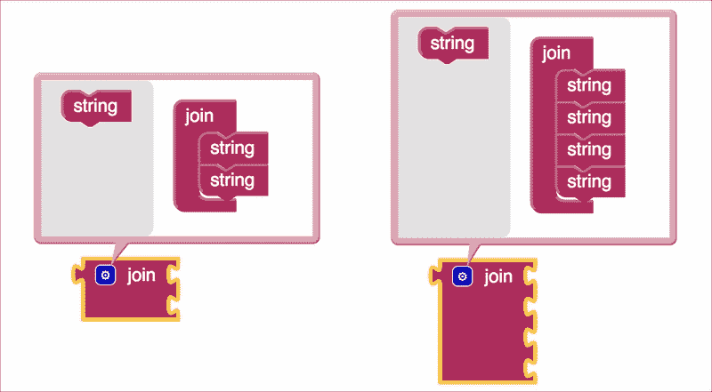

第一个、第三个、第五个、第七个、第九个和第十一个**join**插槽将包含一个单引号，输入到文本框中。第四和第八个插槽将包含一个逗号，输入到文本框中。在第二个插槽中，应用将获取用户输入的第一组信息：他们的名字和姓氏。因此，我们需要一个允许用户输入名字的块。你将在**NameTextBox**块中找到它。选择并连接浅绿色的**NameTextBox.Text**块到第二个**join**插槽。

第六个插槽将获取用户从列表选择器中选择的客人数量。在 **NumGuestListPicker** 块中，选择并连接浅绿色的 **NumGuestListPicker.Selection** 块。在第十个插槽中，应用将获取用户输入的哪些食物/饮料项目的信息。在 **ItemsBringingTextBox** 块中，选择并连接浅绿色的 **ItemsBringingTextBox.Text** 块。

再次，回想一下我们在本节中指定的第一个目标：获取客人提供的三个信息，并将它们插入到 Fusion 表中。这三个数据来自 **NameTextBox** 文本属性、**NumGuestListPicker** 选择属性和 **ItemsBringingTextBox** 文本属性。这一步很复杂，但确保这一组块正确设置非常重要，因为如果不这样做，就不会有数据被插入到 Fusion 表中。

现在我们已经完成了 **InsertRow** 块，剩下要做的就是清除文本框并将 **ListPicker** 选择重置为默认值 `1`。由于块是从上到下执行的，我们希望在应用将信息发送到 Fusion 表之后清除文本框并重置 ListPicker，因此将下一组块插入到 InsertRow 块之后。找到 **set NameTextBox.Text to**、**set ItemsBringingTextBox.Text to** 和 **set NumGuestListPicker.Selection** 块，并将它们插入到 **when SendRSVPButton.Click** 块的底部。前两个块——**set NameTextBox.Text to** 和 **set ItemsBringingTextBox.Text to**——得到空白文本块。将文本框设置为空字符串将清除之前的数据。由于我们希望 **set NumGuestListPicker.Selection** 将 **NumGuestListPicker** 的默认选择属性重置为 `1`，附加一个 **Math 0** 块并将数字改为 **1**。最后，我们将调用一个过程来确保在客人输入信息时可能弹出的任何键盘都被隐藏。在 **NameTextBox** 块中找到调用 **NameTextBox.HideKeyboard** 块，并将其连接到块的底部。

# 确保不插入空白行

目前，**InsertRow** 没有任何方法来判断它所插入的数据是否有效。例如，用户可能会不小心点击 **SendRSVPButton**，这将插入一个空白行。我们可以在插入任何内容之前检查确保客人至少输入了名字来解决这个问题。

为了实现这一点，我们可以将我们创建的所有块放置在一个 if / then 语句中。我们将检查的条件是 NameTextBox.Text 是否为空。如果 NameTextBox.Text 不为空，这意味着客人必须已经输入了一些内容，我们将允许插入操作发生。“如果 NameTextBox.Text 为空，则 if 语句不成立，并且 then 块集将不会触发。结果，什么也不会发生。以下屏幕截图显示了 if 语句的块：

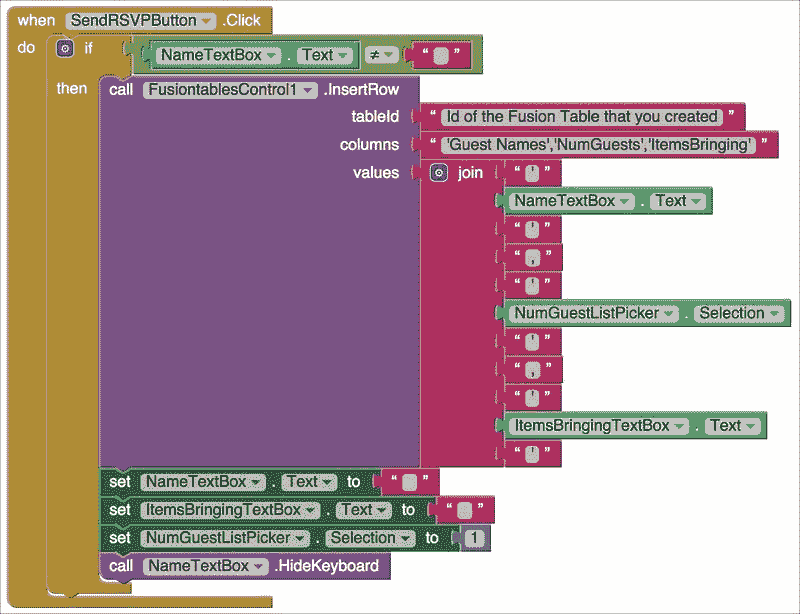

您可以在 **Build In Logic** 块抽屉中找到那块浅绿色的（不等）块。该块将显示一个等号，如下所示：

点击箭头并从下拉菜单中选择不等选项。在第一个空白处插入 **NameTextBox.Text** 块，在第二个空白处插入一个空的 **Text** 块。现在我们的代码表明，**如果**姓名字段不为空，**则**应该获取数据并将其插入到 Fusion Table 中。

# 查看嘉宾名单

现在我们已经实现了 **RSVP_Screen**，我们为客人提供了一个发送 RSVP 的方式，并将不同客人的所有 RSVP 聚集到 Fusion Table 中。在任何活动组织应用中，让其他人能够看到已经 RSVP 的嘉宾名单是有帮助的。

GuestList_Screen 的目的就是——让所有参会者（包括组织者）能够看到还有谁会参加这个活动。为了显示在 Fusion Table 中收集到的信息，我们将使用一个标签。在设计师窗口中，导航到 **GuestList_Screen**。就像在 RSVP_Screen 中一样，首先将一个 **VerticalArrangement** 拖动到 **GuestList_Screen** 的顶部区域，位于 **HorizontalArrangement** 之上，该区域包含所有导航按钮。将 **VerticalArrangement** 的 **BackgroundColor** 属性设置为 **None**。同时设置 **Height** 和 **Width** 属性为 **Fill parent**。现在将一个 **Label** 组件拖动到 **VerticalArrangement** 中。将标签重命名为 `GuestListLabel`。将 **GuestListLabel** 的 **BackgroundColor** 属性更改为 **None**。将 **FontSize** 属性更改为 **18**（根据您的设备屏幕大小和屏幕分辨率，您可能需要尝试此属性的多个值）。最后，将 **TextColor** 属性更改为 **White**。然后添加一个 **FusiontablesControl** 组件，就像在 **RSVP_Screen** 中做的那样。您可以在以下屏幕截图中查看更改：

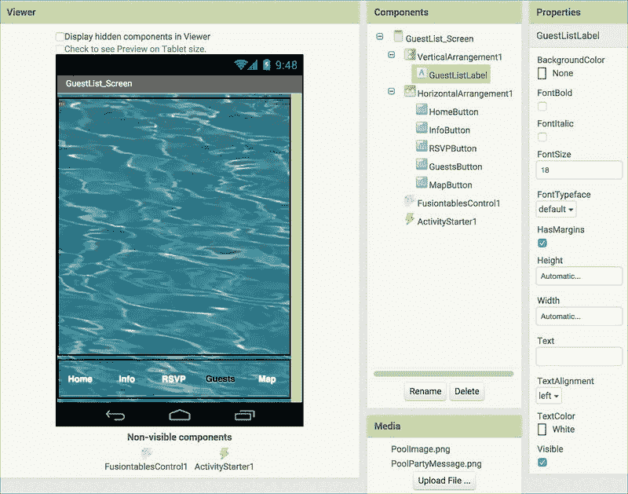

就像在 **RSVP_Screen** 中一样。我们将更改 **FusiontablesConrol1** 组件的三个属性。由于您已经知道如何更改三个 **FusiontablesControl1** 属性——**KeyFile**、**ServiceAccountEmail** 和 **UseServiceAuthentication**——我们在这里不会详细介绍。只需遵循我们在 *连接应用至 Google Fusion Table* 部分中完成的步骤即可。

在 RSVP_Screen 中，应用将信息发送到融合表，而在 GuestList_Screen 中，应用从融合表请求信息，接收它然后显示。要编程这个，前往**Blocks**编辑器。

# 编写块代码 – 请求数据

我们需要编写的第一个代码是请求从融合表获取数据。在块抽屉中点击**GuestList_Screen**，并拖动**when GuestList_Screen.Initialize**事件。这个事件会在每次屏幕启动时自动触发。我们希望在**GuestList**屏幕启动时从融合表请求数据。因此，我们将添加到这个事件的**call FusiontablesControl1.GetRows**块。这个块将允许我们从融合表请求数据。你可以在**FusiontablesControl1**块抽屉中找到这个块。**GetRows**块需要两块信息来从融合表获取行：表的 ID 和列名。我们在创建融合表时已经识别了表 ID。将这个 ID 粘贴到**GetRows**块的**tableId**插槽中，使用一个**Text**块。使用另一个**Text**块来指定列名，**'Guest Names'**。注意单引号；就像在**InsertRows**块中一样，这里的列名也必须用单引号。下面的截图显示了完成的块集：

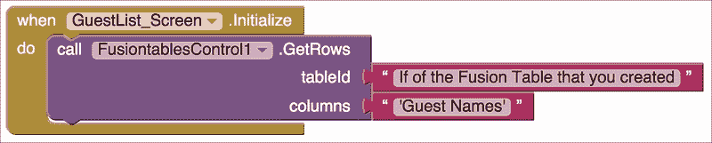

# 编写块代码 – 接收数据

之前的块从融合表请求数据，现在我们需要编写接收从融合表信息的数据。**when FusiontablesControl1.GotResult**块执行这个操作。你可以在**FusiontablesControl1**块中找到它。正如我们之前提到的，当从融合表接收到数据时，这个事件会被触发。数据放置在这个事件的结果变量**result**中。

默认情况下，我们从融合表接收到的数据是一块文本，每行放在自己的行上。这些数据还包括列标题。所以，假设我们的融合表中的 Guest Names 列有三行，名字分别是 Olivienne、Dash 和 Eva。那么放置在结果变量中的数据有四行——Guest Names、Olivienne、Dash 和 Eva（列标题后面跟着三个名字）。

由于我们希望**when FusiontablesControl1.GotResult**事件自动显示客人名字（以及标题），选择并连接**set GuestListLabel.Text to**块。我们希望它显示什么？**result**变量。将光标悬停在嵌入在金色事件块中的浅橙色**result**变量上。会出现一个带有两个橙色块的弹出窗口，如下面的截图所示。选择**get result**块并将其连接到**GuestListLabel.Text**块中的开放插槽：

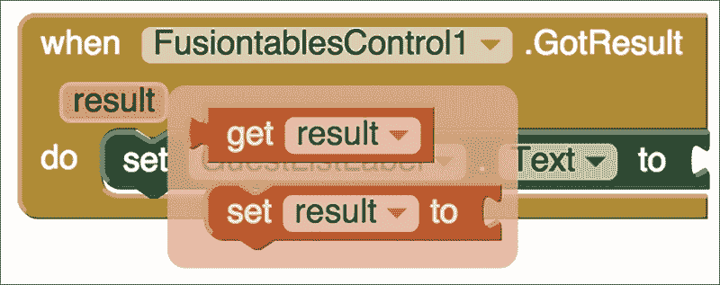

就这些！现在您的 **GuestList_Screen** 将显示所有已 RSVP 的客人。以下截图显示了完成的块集：

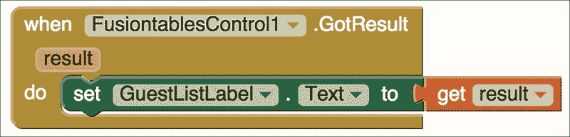

是时候尝试您的应用了！填写 RSVP 表格以查看它是否填充到您的 Fusion Table 中。然后，应用是否清除 RSVP 屏幕字段并在 **Guest List** 屏幕上显示名称？

如果您还记得，我们设置了我们的应用以收集 RSVP 之外的其他数据，除了客人名单。我们创建了字段，让客人可以输入他们要带的人数以及要分享的食物/饮料项目。您也可以将此信息显示给其他客人查看，但真正重要的是这些数据是为主持人准备的，他可以轻松地查看我们创建的 Fusion Table 列中的名称。

# 共享事件应用

使用事件应用，我们希望向您介绍收集和检索数据的过程。现在，您从更多开发者的角度接近应用，您可能已经意识到，每次您将电子邮件地址或其他信息输入到应用中时，这些数据就会被存储到数据库中。但是，正如我们在本章开头提到的，Fusion Tables 作为数据库有其局限性。如果您将事件应用的原样与多个活动组织者共享，他们将在不同的设备上开始使用它，那么将出现问题，因为该应用使用单个 Fusion Table 作为后端。如果许多人使用该应用为他们的不同活动，所有不同设备的数据都将汇总到一个单独的 Fusion Table 中。当然，这将给活动组织者（和客人）造成极大的混乱，因为不同派对的全部数据都将混合在一起！

在我们概述可能的解决方案之前，让我们讨论一下我们在该应用中做了什么。由于我们的应用访问和修改 Fusion Table，我们必须创建 Google 服务级别身份验证。这一步骤确保我们的应用获得 Google 授权以访问 Fusion Tables。然后，我们将 Fusion Table Id 插入到我们的应用中，让应用知道要访问哪个 Fusion Table。此外，我们为我们的应用创建了一个服务电子邮件地址，并使用此服务电子邮件地址共享 Fusion Table。这些步骤确保 Fusion Table 允许我们的应用读写数据。因此，我们基本上有三个不同的实体在相互交互 - Google 服务级别身份验证、我们的应用和 Fusion Table。

解决与事件应用关联的单个 Fusion Table 问题的方法之一是，开发者创建不同副本的应用，这些应用使用不同的 Fusion Table 副本。这意味着每个应用副本都必须更新为新副本的 Fusion Table Id。此外，这也意味着必须将 Fusion Table 重新共享给应用的服务级别电子邮件地址（使用原始服务电子邮件地址）。

这比听起来容易。首先，打开你之前使用的融合表，转到文件菜单并选择“制作副本”。这将创建一个包含我们对列和设置所做的所有更改的新融合表副本。如果你的上一个融合表中有任何数据，你需要清除数据。接下来，重复在“创建 Google 融合表”部分最后几段中概述的融合表 ID 识别步骤。（由于你正在创建一个新的融合表，你必须使用这个新表的 ID。）你还需要为这个新的融合表重复“通过服务账户电子邮件共享融合表”部分（使用原始服务电子邮件地址）。

最后，在“块”编辑器中，将新的融合表 ID 粘贴到文本框中（连接到调用“FusiontablesControl1.InsertRow”块的“TableID”槽），以确保应用程序使用新的融合表。

### 注意

如果你想要与 7 个人分享你的事件应用，你需要重复这些步骤 7 次，以确保每个人都有一个具有唯一融合表的应用版本。

# 摘要

在本章中，我们探索了许多 App Inventor 高级功能，特别是数据库。Google 融合表使我们能够在后端存储数据。我们学习了如何创建新的融合表，以及如何建立 Google API 凭证，以便我们的应用有权访问 Google 融合表。最后，我们学习了如何从融合表中插入、检索和显示数据。

你正在积累一个相当丰富的编程工具包！在下一章中，你将学习另一个可以帮助扩展你的编程技能的工具。循环是一种结构或指令序列，它允许你重复执行步骤，直到满足某些条件。这很方便，因为，我们不需要为长列表中的每个项目复制和粘贴相同的代码块来执行相同的功能，我们可以编写一组代码块来重复执行。
