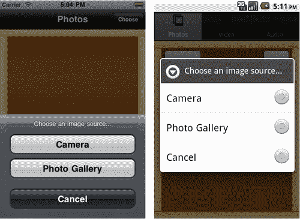
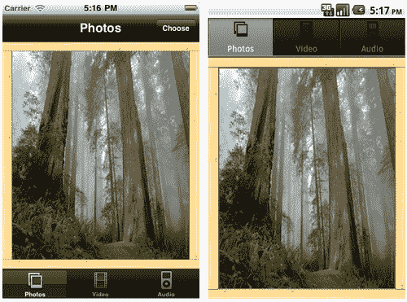
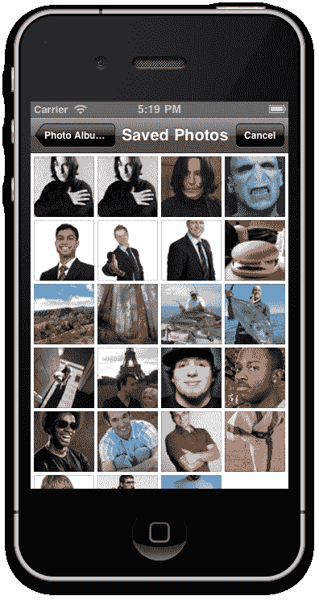
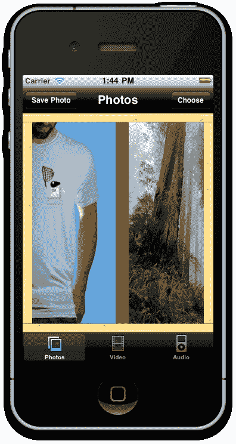
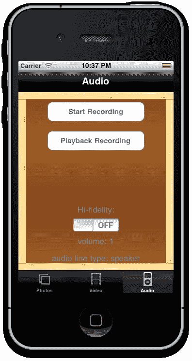
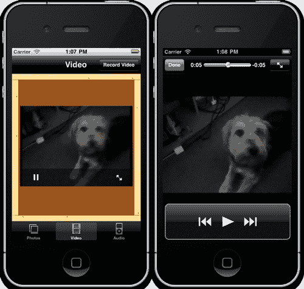
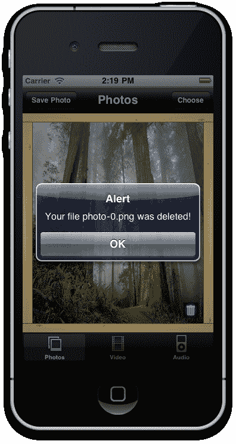

# 第四章：使用音频、视频和相机增强应用

在本章中，我们将涵盖以下内容：

+   使用 OptionDialog 选择捕获设备

+   从相机捕获照片

+   从照片库中选择现有照片

+   使用 ScrollableView 显示照片

+   将捕获的照片保存到设备文件系统

+   通过音频录制器捕获和播放音频

+   通过视频录制器捕获视频

+   从文件系统播放视频文件

+   安全地从文件系统中删除保存的文件

# 简介

虽然这可能难以相信，但使用手机无线拍摄照片并分享照片首次发生在 1997 年，直到大约 2004 年才流行起来。到 2010 年，几乎所有的手机都内置了数码相机，许多中端到高端设备也配备了音频和视频摄像机功能。现在，大多数 iPhone 和 Android 型号都具备这些功能，并为创业开发者开辟了新的途径。

Titanium 包含 API，允许你访问所有必需的接口，使用内置相机拍照或录像，录制音频，以及浏览设备中保存的图片和视频库。

在本章中，我们将介绍所有这些概念，并使用它们来构建一个基本的“假日回忆”应用，该应用将允许我们的用户从设备中捕获照片、视频和音频，将这些文件保存到本地文件存储，并再次读取它们。

## 前提条件

你应该已经熟悉 Titanium 基础知识，包括创建 UI 对象和使用 Titanium Studio。此外，为了测试相机功能，你需要一部能够录制照片和视频的 iPhone 或 Android 设备。iPhone 3GS 型号或更高版本就足够了，除了市场上最底端的 Android 手机外，所有 Android 手机都应该没问题。

# 使用 OptionDialog 选择捕获设备

OptionDialog 是一个仅模态的组件，允许你向用户展示一个或多个选项，通常还会包括一个*取消*选项，用于关闭对话框。我们将创建这个组件，并使用它向用户提供从相机或设备的照片库中选择图片的选项。

如果你打算跟随整个章节并构建假日回忆应用，那么请仔细注意这个食谱的第一个*准备工作*部分，因为它将指导你设置项目。

## 准备工作

为了准备这个食谱，打开 Titanium Studio 并登录（如果你还没有登录的话）。如果你需要注册新账户，你可以在应用程序内部免费注册。登录后，点击**新建项目**，创建新项目的详细信息窗口将出现。将应用名称输入为**假日回忆**，并使用你自己的信息填写其余的详细信息。

注意应用程序标识符，它通常以反向域名表示法书写（即 *com.packtpub.holidaymemories*）。在项目创建后，此标识符不能轻易更改，并且您在创建用于分发应用的配置文件时需要**精确**匹配它。您可以通过下载以下源文件来获取本食谱中使用的所有图像，以及整个章节的所有内容：

### 注意

本食谱的完整源代码可以在`/Chapter 4/Recipe 1`文件夹中找到。

整个章节的完整源代码可以在`/Chapter 4/Holiday Memories`文件夹中找到。

## 如何操作...

现在我们已经使用 Titanium Studio 创建了项目。让我们开始工作！在您的编辑器中打开`app.js`文件，并删除所有现有代码。完成此操作后，输入以下内容并保存：

```java
//this sets the background color of the master UIView (when there are no windows/tab groups on it)
Titanium.UI.setBackgroundColor('#000');
//create tab group
var tabGroup = Titanium.UI.createTabGroup();
//
//create base UI tab and root window
//
var win1 = Titanium.UI.createWindow({
title:'Photos',
backgroundImage: 'images/background.png',
barColor: '#000',
url: 'photos.js'
});
var tab1 = Titanium.UI.createTab({
icon:'images/photos.png',
title:'Photos',
window:win1
});
//
//create tab and root window
//
var win2 = Titanium.UI.createWindow({
title:'Video',
backgroundImage: 'images/background.png',
barColor: '#000'
});
var tab2 = Titanium.UI.createTab({
icon:'images/movies.png',
title:'Video',
window:win2
});
//
//create tab and root window
//
var win3 = Titanium.UI.createWindow({
title:'Audio',
backgroundImage: 'images/background.png',
barColor: '#000'
});
var tab3 = Titanium.UI.createTab({
icon:'images/audio.png',
title:'Audio',
window:win3
});
//
//add tabs
//
tabGroup.addTab(tab1);
tabGroup.addTab(tab2);
tabGroup.addTab(tab3);
//open tab group
tabGroup.open();

```

现在我们需要创建我们的第一个窗口的 JavaScript 文件，我们将称之为`photo.js`。在您的`Resources`文件夹中创建此空白文件，并在您的 IDE 中打开它。输入以下代码以创建“选择照片”按钮，该按钮将实例化您的 OptionDialog：

```java
var win = Titanium.UI.currentWindow;
//our dialog with the options of where to get an
//image from
var dialog = Titanium.UI.createOptionDialog({
title: 'Choose an image source...',
options: ['Camera','Photo Gallery', 'Cancel'],
cancel:2
});
//add event listener
dialog.addEventListener('click',function(e) {
Ti.API.info('You selected ' + e.index);
});
//choose a photo button
var btnGetPhoto = Titanium.UI.createButton({
title: 'Choose'
});
btnGetPhoto.addEventListener('click', function(e){
dialog.show();
});
//set the right nav button to our btnGetPhoto object
//note that we're checking the osname and changing the
//button location depending on if it's iphone/android
//this is explained further on in the "Platform Differences" chapter
if(Ti.Platform.osname == 'iphone') {
win.rightNavButton = btnGetPhoto;
}
else {
//add it to the main window because android does
//not have 'right nav button'
btnGetPhoto.right = 20;
btnGetPhoto.top = 20;
win.add(btnGetPhoto);
}

```

## 如何工作…

第一段代码中的代码正在创建我们的带有标签和窗口的导航视图，所有这些内容都在第一章、*使用原生 UI 组件构建应用*和第二章、*与本地和远程数据源一起工作*中有所介绍。我们的第一个标签和窗口使用*photo.js*文件，其内容在本页前面的第二段代码中可见。

OptionDialog 本身是通过`Titanium.UI.createOptionDialog()`方法创建的，并且只需要几个简单的参数。`title`参数，在这种情况下，出现在按钮选项的顶部，目的是向用户简要说明他们选择的选项将用于什么。在我们的情况下，我们只是通知他们我们将使用他们选择的选项来启动相应的图像捕获应用程序。选项数组是这里的重要属性，它包含您希望向用户展示的所有按钮选择。请注意，我们还在我们的数组中包含了一个`cancel`项，并且有一个相应的`cancel`属性，其索引与我们的`createOptionDialog()`中的相同。当我们的 OptionDialog 在屏幕上显示时，这将绘制不同的按钮样式以取消操作。

最后，我们在我们的 OptionDialog 中添加了一个事件监听器，并使用`e.index`属性将所选按钮索引输出到 Titanium Studio 控制台。我们将在下一个食谱中使用这个标志来根据用户的选择启动相机或照片库。下面的 OptionDialog 为用户提供两个图像源选项：



# 从相机捕获照片

要使用设备相机，我们需要访问 `Titanium.Media` 命名空间，特别是 `showCamera` 方法。这将显示用于拍照的本地操作系统界面，并公开三个事件，这些事件将帮助我们决定对捕获的图像进行什么操作。我们还将检查用户的设备是否能够拍摄照片，然后再尝试这样做，因为一些设备（包括 iPod Touch 和模拟器）没有这种功能。

### 注意

注意，此菜谱仅在您使用物理设备时才会生效！Android 和 iPhone 的模拟器都没有内置相机功能。如果您尝试在模拟器上运行此代码，您将只会看到一个错误对话框。

本菜谱的完整源代码可以在 `/Chapter 4/Recipe 2` 文件夹中找到。

## 如何操作…

我们将使用以下代码扩展我们的 OptionDialog 的事件监听器：

```java
//add event listener
dialog.addEventListener('click',function(e)
{
Ti.API.info('You selected ' + e.index);
if(e.index == 0)
{
//from the camera
Titanium.Media.showCamera({
success:function(event)
{
var image = event.media;
if(event.mediaType == Ti.Media.MEDIA_TYPE_PHOTO)
{
//set image view
var imgView =
Titanium.UI.createImageView({
top: 20,
left: 20,
width: 280,
height: 320
});
imgView.image = image;
win.add(imgView);
}
},
cancel:function()
{
//getting image from camera was cancelled
},
error:function(error)
{
//create alert
var a = Titanium.UI.createAlertDialog({title:'Camera'});
// set message
if (error.code == Titanium.Media.NO_CAMERA)
{
a.setMessage('Device does not have image recording capabilities');
}
else
{
a.setMessage('Unexpected error: ' + error.code);
}
// show alert
a.show();
},
allowImageEditing:true,
saveToPhotoGallery:false
});
}
else
{
//cancel was tapped
//user opted not to choose a photo
}
});

```

现在将您的应用运行在物理设备上，您应该能够从我们的 OptionDialog 中选择相机按钮，并用您的设备拍摄一张照片。这张图片应该随后出现在我们的临时 ImageView 中，就像以下截图所示：



## 它是如何工作的…

从相机获取图片实际上相当简单。首先，您会注意到我们已经通过一个 if 语句扩展了 OptionDialog。如果我们的对话框的索引属性为 0（第一个按钮），那么我们正在启动相机。我们通过 `Titanium.Media.showCamera()` 方法来完成此操作。这将触发三个事件，我们在这里捕获它们，称为 **成功、错误** 和 **取消**。我们忽略取消事件，因为如果用户选择取消图像捕获，则不需要进行任何处理。在错误事件中，我们将显示一个 AlertDialog，解释说无法启动相机。如果您使用模拟器运行此代码，您将看到此对话框。

我们的大部分处理都在成功事件中完成。首先，我们将捕获的照片保存到一个名为 `image` 的新变量中。然后，我们通过比较其 `mediaType` 属性来检查所选媒体实际上是否为照片。正是在这一点上，所选媒体实际上可能是一段视频，因此在使用它之前，我们必须再次确认它是什么，因为我们不知道用户是在拍照还是拍摄视频，直到事件发生后。最后，为了向用户展示我们实际上已经用我们的相机捕获了一张图片，我们创建了一个 ImageView 并将其 `image` 属性设置为捕获的图片文件，然后再将整个内容添加到我们的窗口中。

# 从相册中选择现有照片

在设备上从相册中选择图片的过程与使用摄像头的非常相似。然而，我们仍然使用 `Titanium.Media` 命名空间，但这次我们将执行名为 `openPhotoLibrary()` 的方法，正如其名所示。与之前的配方一样，一旦我们从相册中检索到一张图片，我们将使用简单的 ImageView 控件将其显示在屏幕上供用户查看。

### 注意

本配方的完整源代码可在 `/Chapter 4/Recipe 3` 文件夹中找到。

## 如何操作...

我们将扩展我们的 OptionDialog，以便现在可以选择从相册中选择一张图片，如果 `index` 属性为 1（第二个按钮）被选中。将以下代码添加到对话框的事件监听器中：

```java
//add event listener
dialog.addEventListener('click',function(e)
{
Ti.API.info('You selected ' + e.index);
if(e.index == 1)
{
//obtain an image from the gallery
Titanium.Media.openPhotoGallery({
success:function(event)
{
var image = event.media;
// set image view
Ti.API.debug('Our type was: '+event.mediaType);
if(event.mediaType == Ti.Media.MEDIA_TYPE_PHOTO)
{
var imgView = Titanium.UI.createImageView({
top: 20,
left: 20,
width: 280,
height: 320
});
imgView.image = image;
win.add(imgView);
}
},
cancel:function()
{
//user cancelled the action from within
//the photo gallery
}
});
}
else
{
//cancel was tapped
//user opted not to choose a photo
}
});

```

在模拟器或设备上运行您的应用，并从我们的对话框中选择第二个选项。相册库应该会出现，并允许您选择一张图片。此选择屏幕看起来可能如下截图所示：



## 它是如何工作的…

这个配方基本上遵循了我们使用摄像头获取图片时的相同模式。首先，我们扩展了 `OptionDialog` 事件监听器，以便在按钮索引选中的等于 1 时执行操作，在这种情况下是我们的相册按钮。我们的 `openPhotoGallery()` 方法也会触发三个事件：**成功、错误**和**取消**。

就像之前的配方一样，我们的大部分处理都在成功事件中完成。我们通过比较其 `mediaType` 属性来检查所选媒体是否实际上是一张照片，并最终创建一个 ImageView 并将其 `image` 属性设置为捕获的图片文件，然后将整个内容添加到我们的窗口中。

## 还有更多...

现在，让我们探索媒体类型。

### 理解媒体类型

当通过内置摄像头捕获照片或视频时，您可以通过 `mediaType` 枚举获得两种主要的媒体类型。这些是：

+   `MEDIA_TYPE_PHOTO`

+   `MEDIA_TYPE_VIDEO`

此外，还有许多其他更具体的 `mediaType` 枚举集，包括以下内容：

+   `MUSIC_MEDIA_TYPE_ALL`

+   `MUSIC_MEDIA_TYPE_ANY_AUDIO`

+   `MUSIC_MEDIA_TYPE_AUDIOBOOK`

+   `MUSIC_MEDIA_TYPE_MUSIC`

+   `MUSIC_MEDIA_TYPE_PODCAST`

+   `VIDEO_MEDIA_TYPE_AUDIO`

+   `VIDEO_MEDIA_TYPE_NONE`

+   `VIDEO_MEDIA_TYPE_VIDEO`

这些类型通常仅在利用 `VideoPlayer` 或 `AudioPlayer` 组件中的 `mediaType` 属性时适用。

### 保存到照片

您可以在模拟器中运行此代码，但您可能会注意到库中没有图片，也没有明显的获取图片的方法！幸运的是，这实际上相当容易克服。只需打开网络浏览器，并使用 Google Images 或类似服务找到您想要测试的图片。在浏览器中点击并按住图片，您应该会看到一个选项**保存到照片**。然后您可以使用这些图片在模拟器中测试您的代码。

# 使用 ScrollableView 显示照片

在移动设备上显示多张照片和图像的最常见方法之一是 `ScrollableView`。这种视图类型允许图片左右滑动，在许多应用中都很常见，包括 Facebook 移动应用。以这种方式显示图片的方式让人联想到“翻书”或“翻相册”，因为它自然的感觉和简单的实现而非常受欢迎。

在这个食谱中，我们将实现一个 `ScrollableView`，它将包含可以从相机或照片库选择的任意数量的图片。这个食谱的完整源代码可以在 `/Chapter 4/Recipe 4` 文件夹中找到。

### 注意

注意，这个食谱应该适用于 Android 和 iPhone 设备。然而，Titanium SDK 最新版本（1.7.2）中的一个最近发现的错误可能会导致它在 Android 上失败。如果你想在 Android 模拟器上测试这个，你应该检查你是否在使用 Titanium SDK 的最新版本。

## 如何做到这一点...

首先，让我们创建我们的 ScrollableView 对象，我们将称之为 `scrollingView`，并将其添加到我们的 `photo.js` 窗口中：

```java
//this is the scroll view the user will use to swipe
//through the selected photos
scrollingView = Titanium.UI.createScrollableView({
left: 17,
top: 15,
width: win.width - 14,
height: win.height - 25,
views: [],
currentPage: 0,
zIndex: 1
});
scrollingView.addEventListener('scroll',function(e){
Ti.API.info('Current scrollableView page = ' + e.source.currentPage);
});
win.add(scrollingView);

```

现在我们将修改对话框事件监听器，以便将我们选定的照片分配给 ScrollableView，而不是我们之前创建的临时 ImageView。将你的 `if(event.mediaType == Ti.Media.MEDIA_TYPE_PHOTO)` 代码块及其内部的所有代码替换为以下代码。注意，你需要对从照片库和设备相机收集的图像都这样做。

```java
...
//output the mediaType to the console log for debugging
Ti.API.debug('Our type was: '+event.mediaType);
if(event.mediaType == Ti.Media.MEDIA_TYPE_PHOTO)
{
// set image view
var imgView = Titanium.UI.createImageView({
top: 0,
left: 0,
width: 286,
height: 337,
image: image
});
//add the imageView to our scrollableView object
scrollingView.addView(imgView);
}

```

现在在你的模拟器或设备上运行你的应用，并依次选择一些图片。你可以使用来自相机或照片库的图片组合。一旦你选择了至少两张图片，你应该能够通过左右滑动来在它们之间切换。

## 它是如何工作的...

ScrollableView 实际上只是一个包含许多特殊事件和属性的视图集合，正如你可能通过我们在 `createScrollableView()` 方法中给 `views` 属性赋予的空数组值所察觉到的。在实例化 ScrollableView 对象时设置此属性是必要的，将 `currentPage` 索引属性设置为 0（即我们的第一个视图）也是一个好主意。我们仍然按照之前的食谱创建 ImageView。然而，这次我们不是将这个视图添加到窗口中，而是添加到 `ScrollableView` 组件中。我们通过使用 `addView()` 方法添加视图来实现这一点。最后，我们还创建了一个事件，将其附加到我们的 ScrollableView 上，并输出 `currentPage` 属性到 Titanium 控制台以进行调试和测试。

如您所见，ScrollableView 是一个简单且易于使用的组件，非常适合用于相册应用或任何其他需要显示一系列相似视图的应用。您可以通过添加空白 View 对象并放置任意数量的文本字段、标签或图像视图来扩展它，每个空白视图中都可以放置您想要的任何内容——“这里的唯一限制就是您的想象力！”



# 将捕获的图片保存到设备文件系统中

拍照固然很好，但当我们希望将图像保存到文件系统中以便稍后再次检索时怎么办？在这个菜谱中，我们将做这件事，并介绍内置在许多 Titanium 控件中的 `toImage()` 方法。此方法接受被调用视图的整个视图的扁平化图像，对于截图或抓取单个视图中组合在一起的多个控件图像非常有用。

### 注意

本菜谱的完整源代码可以在 `/Chapter 4/Recipe 5` 文件夹中找到。

## 如何操作...

在创建 `btnGetPhoto` 对象之后，输入以下代码。您可以替换我们编写的将 `btnGetPhoto` 对象添加到导航栏的现有代码，因为这段代码重复了那段代码并进行了扩展。

```java
//save a photo to file system button
var btnSaveCurrentPhoto = Titanium.UI.createButton({
title: 'Save Photo',
zIndex: 2 //this appears over top of other components
});
btnSaveCurrentPhoto.addEventListener('click', function(e){
var media = scrollingView.toImage();
//if it doesn't exist, create it create a directory called
//"photos"
//and it will hold our saved images
var newDir = Titanium.Filesystem.getFile (Titanium.Filesystem.applicationDataDirectory,'photos');
if(!newDir.exists()){
newDir.createDirectory();
}
var fileName = 'photo-' + scrollingView.currentPage.toString() + '.png';
writeFile = Titanium.Filesystem.getFile(newDir.nativePath, fileName);
writeFile.write(media);
alert('You saved a file called ' + fileName + ' to the directory ' + newDir.nativePath);
var _imageFile = Titanium.Filesystem.getFile(newDir.nativePath, fileName);
if (!_imageFile.exists()) {
Ti.API.info('ERROR: The file ' + fileName + ' in the directory ' + newDir.nativePath + ' does not exist!');
}
else {
Ti.API.info('OKAY!: The file ' + fileName + ' in the directory ' + newDir.nativePath + ' does exist!');
}
});
//set the right nav button to our photo get button
if(Ti.Platform.osname == 'iphone') {
win.leftNavButton = btnSaveCurrentPhoto;
win.rightNavButton = btnGetPhoto;
}
else
{
//add it to the main window because android does
//not have 'right nav button'
btnGetPhoto.right = 20;
btnGetPhoto.top = 20;
win.add(btnGetPhoto);
//add it to the main window because android does
//not have 'left nav button'
btnSaveCurrentPhoto.left = 20;
btnSaveCurrentPhoto.top = 20;
win.add(btnSaveCurrentPhoto);
}

```

## 它是如何工作的...

`Titanium.FileSystem` 命名空间提供了一系列文件操作功能，但最重要的是，它为我们提供了基本工具，以便将文件读写到设备上应用程序的存储空间。在这个菜谱中，我们使用 `scrollingView` 的 `toImage()` 方法来返回视图图像表示的 blob。

然后，我们可以获取我们希望存储图像文件数据的文件夹的引用。如您在代码中所见，我们通过创建一个新变量，例如 `var newDir = Titanium.Filesystem.getFile(Titanium.Filesystem.applicationDataDirectory,'photos')` 来获取该文件夹的引用；然后确保该文件夹存在。如果不存在，我们可以通过在 `newDir` 对象上调用 `createDirectory()` 方法来创建该文件夹。

最后，我们的图像数据以类似的方式保存。首先，我们创建一个名为 `writeFile` 的变量，它引用我们已创建的 `newDir` 对象文件夹中的文件名。然后，我们可以使用 `writeFile` 的 `"write()"` 方法将文件输出到文件系统，并将图像媒体变量作为要保存的文件数据传递。

# 通过音频录制器捕获和播放音频

iPhone 和大多数 Android 手机的一个方便功能是能够录制音频数据——非常适合在会议或那些漫长、无聊的讲座中做可听笔记！在这个菜谱中，我们将使用 `Titanium.Media.AudioRecorder` 类捕获一些音频，然后允许用户播放录制的声音文件。

本菜谱的完整源代码可以在 `/Chapter 4/Recipe 6` 文件夹中找到。

### 注意

注意，这个菜谱只适用于 iPhone。您还需要一个物理设备来完成这个菜谱。Titanium 框架的后续版本应该可以通过使用意图来支持 Android 的音频录制。此外，iPhone 3G 型号可能无法录制以下某些压缩格式，尤其是高保真格式，如 AAC。如有疑问，您应该尝试使用 MP4A 或 WAV 格式。

## 准备工作

创建一个名为`audio.js`的新 JavaScript 文件，并将其保存到您的资源目录中。然后在`app.js`文件中，添加 window3 的 URL 属性，并给它一个值为`audio.js`。这将加载我们的视频 JavaScript 文件，用于应用程序的第三个选项卡窗口。

## 如何操作...

将以下代码输入到您的`audio.js`文件中并保存。这将设置一个带有按钮和标签的界面，以便我们可以开始、停止和播放我们的录音音频。

```java
var win = Titanium.UI.currentWindow;
var file;
var timer;
var sound;
var duration = 0;
var label = Titanium.UI.createLabel({
text:'',
top:150,
color:'#999',
textAlign:'center',
width: 250,
height:'auto'
});
win.add(label);
var linetype = Titanium.UI.createLabel({
text: "audio line type: "+lineTypeToStr(),
bottom: 15,
color:'#999',
textAlign:'center',
width: 250,
height:'auto'
});
win.add(linetype);
var volume = Titanium.UI.createLabel({
text: "volume: "+Ti.Media.volume,
bottom:50,
color:'#999',
textAlign:'center',
width: 250,
height:'auto'
});
win.add(volume);
var switchLabel = Titanium.UI.createLabel({
text:'Hi-fidelity:',
width: 250,
height:'auto',
textAlign:'center',
color:'#999',
bottom:115
});
var switcher = Titanium.UI.createSwitch({
value:false,
bottom:80
});
win.add(switchLabel);
win.add(switcher);
var b2 = Titanium.UI.createButton({
title:'Playback Recording',
width:200,
height:40,
top:80
});
win.add(b2);
var b1 = Titanium.UI.createButton({
title:'Start Recording',
width:200,
height:40,
top:20
});
win.add(b1);

```

现在，在模拟器中运行您的应用程序，并切换到**音频**选项卡。你应该会看到一个看起来就像以下截图的屏幕：



现在，我们将创建一个名为`recording`的`AudioRecorder`方法的对象实例，并给它一个压缩值和格式值。我们还将添加事件监听器以监视音量、音频线路和录音属性何时发生变化，以及事件处理程序来捕获和处理这些变化。在上一页创建的代码之后直接输入以下内容：

```java
var recording = Ti.Media.createAudioRecorder();
// default compression is Ti.Media.AUDIO_FORMAT_LINEAR_PCM
// default format is Ti.Media.AUDIO_FILEFORMAT_CAF
// this will give us a wave file with µLaw compression which
// is a generally small size and suitable for telephony //recording for high end quality, you'll want LINEAR PCM
//however, that will result in uncompressed audio and will be //very large in size
recording.compression = Ti.Media.AUDIO_FORMAT_LINEAR_PCM;
recording.format = Ti.Media.AUDIO_FILEFORMAT_CAF;
Ti.Media.addEventListener('recordinginput', function(e) {
Ti.API.info('Input availability changed: '+e.available);
if (!e.available && recording.recording) {
b1.fireEvent('click', {});
}
});
Ti.Media.addEventListener('linechange',function(e)
{
linetype.text = "audio line type: "+lineTypeToStr();
});
Ti.Media.addEventListener('volume',function(e)
{
volume.text = "volume: "+e.volume;
});

```

最后，在您之前创建的`Ti.Media`事件监听器之后添加代码部分。此代码将处理音频输入控制的所有事件（停止/开始按钮和我们的高保真开关）。

```java
function lineTypeToStr()
{
var type = Ti.Media.audioLineType;
switch(type)
{
case Ti.Media.AUDIO_HEADSET_INOUT:
return "headset";
case Ti.Media.AUDIO_RECEIVER_AND_MIC:
return "receiver/mic";
case Ti.Media.AUDIO_HEADPHONES_AND_MIC:
return "headphones/mic";
case Ti.Media.AUDIO_HEADPHONES:
return "headphones";
case Ti.Media.AUDIO_LINEOUT:
return "lineout";
case Ti.Media.AUDIO_SPEAKER:
return "speaker";
case Ti.Media.AUDIO_MICROPHONE:
return "microphone";
case Ti.Media.AUDIO_MUTED:
return "silence switch on";
case Ti.Media.AUDIO_UNAVAILABLE:
return "unavailable";
case Ti.Media.AUDIO_UNKNOWN:
return "unknown";
}
}
function showLevels()
{
var peak = Ti.Media.peakMicrophonePower;
var avg = Ti.Media.averageMicrophonePower;
duration++;
label.text = 'duration: '+duration+' seconds\npeak power:
' + peak +'\navg power: ' +avg;
}
b1.addEventListener('click', function()
{
if (b1.title == "Stop Recording")
{
file = recording.stop();
b1.title = "Start Recording";
b2.show();
clearInterval(timer);
Ti.Media.stopMicrophoneMonitor();
}
else
{
if (!Ti.Media.canRecord) {
Ti.UI.createAlertDialog({
title:'Error!',
message:'No audio recording hardware is currently
connected.'
}).show();
return;
}
b1.title = "Stop Recording";
recording.start();
b2.hide();
Ti.Media.startMicrophoneMonitor();
duration = 0;
timer = setInterval(showLevels,1000);
}
});
b2.addEventListener('click', function()
{
if (sound && sound.playing)
{
sound.stop();
sound.release();
sound = null;
b2.title = 'Playback Recording';
}
else
{
Ti.API.info("recording file size: "+file.size);
sound = Titanium.Media.createSound({sound:file});
sound.addEventListener('complete', function()
{
b2.title = 'Playback Recording';
});
sound.play();
b2.title = 'Stop Playback';
}
});
switcher.addEventListener('change',function(e)
{
if (!switcher.value)
{
recording.compression = Ti.Media.AUDIO_FORMAT_ULAW;
}
else
{
recording.compression = Ti.Media.AUDIO_FORMAT_LINEAR_PCM;
}
});

```

现在，在设备上运行您的应用程序（模拟器可能无法录制音频），你应该能够开始、停止，然后播放您的音频录音，同时高保真开关将改变音频压缩为更高保真度的格式。

## 它是如何工作的...

在这个菜谱中，我们正在创建一个`AudioRecorder`对象的实例，并将其命名为`recording`。我们给这个对象设置了压缩和音频格式。目前，我们将其设置为默认值（PCM 压缩和标准 CAF 格式）。然后，我们添加了来自`Titanium.Media`命名空间的事件监听器，当它们被触发时，将分别更改线条类型或音量标签。

此菜谱的主要处理发生在“开始/停止”和“播放”按钮的事件处理器中，分别称为`b1`和`b2`。我们的第一个按钮`b1`首先检查其标题以确定是停止还是开始录音，通过一个简单的 if 语句。如果没有开始录音，那么我们通过调用我们的`recording`对象的`start`方法启动这个过程。为此，我们还需要启动麦克风监控器，这是通过执行`Ti.Media.startMicrophoneMonitor()`行来完成的。然后我们的设备将开始录音。再次点击`b1`按钮将执行停止代码，并同时将我们的文件对象（生成的声音音频文件）设置为`recording`对象的输出。

`b2`按钮事件处理器检查我们是否有一个有效的声音文件，以及它是否已经在播放。如果我们有一个有效的文件并且它正在播放，那么播放将停止。否则，如果有有效的声音文件并且它还没有通过扬声器播放过，我们将创建一个新的对象，称为`sound`，使用`Titanium.Media.createSound`方法。此方法需要一个`sound`参数。我们将创建于我们的录音会话期间的`file`对象传递给它。然后执行`sound`对象的`play`方法开始播放，同时播放完成的事件监听器/处理器在播放完成后重置我们的`b2`按钮标题。

最后，开关（在这个例子中称为`switcher`）只是将录制格式从高保真压缩更改为低压缩。质量和压缩越低，最终生成的音频文件将越小。

# 通过视频录制捕获视频

您还可以使用 iPhone（3GS 及以上）或 Android 设备的内置相机录制视频。您可以录制的视频质量和长度取决于您的设备内存能力和硬件中包含的相机类型。然而，您至少应该能够以 VGA 分辨率捕获短视频剪辑作为最低要求。

在这个菜谱中，我们将为我们的**视频**标签创建一个基本界面，包括一个录制按钮，该按钮将启动相机并在您的设备上录制视频。我们还将以两种不同的方式执行此操作：使用 iPhone 的标准 Titanium 代码和使用 Android 的意图。

### 注意

注意，此菜谱将需要一个物理设备进行测试。此外，iPhone 3G 型号无法录制视频，但所有从 3GS 开始的型号应该都没有问题。

## 准备工作

创建一个名为`video.js`的新 JavaScript 文件，并将其保存到您的资源文件夹中。然后，在`app.js`文件中，添加 window2 的 URL 属性并给它一个值为`video.js`。这将加载我们的视频 JavaScript 文件作为应用程序第二个标签窗口的文件。

### 注意

此菜谱的完整源代码可以在`/Chapter 4/Recipe 7`文件夹中找到。

## 如何操作...

首先，让我们设置基本界面，添加一个录制按钮（在 iPhone 的导航栏部分作为正常按钮，在 Android 上作为正常按钮），以及`videoFile`变量。这个变量将保存我们录制视频的路径作为一个字符串。

```java
var win = Titanium.UI.currentWindow;
var videoFile = 'video/video-test.mp4';
var btnGetVideo = Titanium.UI.createButton({
title: 'Record Video'
});
//set the right nav butto to our get button
if(Ti.Platform.osname == 'iphone') {
win.rightNavButton = btnGetVideo;
}
else {
//add it to the main window because android does
//not have 'right nav button'
btnGetVideo.right = 20;
btnGetVideo.top = 20;
win.add(btnGetVideo);
}

```

现在让我们为录制按钮创建事件监听器和处理代码。这将检查我们的当前平台（iPhone 或 Android），并执行正确平台的录制视频代码：

```java
//get video from the device
btnGetVideo.addEventListener('click', function()
{
if(Titanium.Platform.osname == 'iphone') {
//record for iphone
Titanium.Media.showCamera({
success:function(event)
{
var video = event.media;
movieFile = Titanium.Filesystem.getFile(
Titanium.Filesystem.applicationDataDirectory,
mymovie.mov');
movieFile.write(video);
videoFile = movieFile.nativePath;
btnGetVideo.title = 'Play Video';
},
cancel:function()
{
},
error:function(error)
{
// create alert
var a =
Titanium.UI.createAlertDialog({title:'Video'});
// set message
if (error.code == Titanium.Media.NO_VIDEO)
{
a.setMessage('Device does not have video recording
capabilities');
}
else
{
a.setMessage('Unexpected error: ' + error.code);
}
// show alert
a.show();
},
mediaTypes: Titanium.Media.MEDIA_TYPE_VIDEO,
videoMaximumDuration:10000,
videoQuality:Titanium.Media.QUALITY_HIGH
});
}
else
{
//record for android using intents
var intent = Titanium.Android.createIntent({
action: 'android.media.action.VIDEO_CAPTURE'
});
Titanium.Android.currentActivity.startActivityForResult(
intent, function(e) {
if (e.error) {
Ti.UI.createNotification({
duration: Ti.UI.NOTIFICATION_DURATION_LONG,
message: 'Error: ' + e.error
}).show();
}
else {
if (e.resultCode === Titanium.Android.RESULT_OK) {
videoFile = e.intent.data;
var source = Ti.Filesystem.getFile(videoFile);
movieFile =
Titanium.Filesystem.getFile(
Titanium.Filesystem.applicationDataDirectory,
'mymovie.3gp');
source.copy(movieFile.nativePath);
videoFile = movieFile.nativePath;
btnGetVideo.title = 'Play Video';
}
else {
Ti.UI.createNotification({
duration: Ti.UI.NOTIFICATION_DURATION_LONG,
message: 'Canceled/Error? Result code: ' +
e.resultCode
}).show();
}
}
});
}
});

```

## 它是如何工作的…

让我们先从 iPhone 设备的录制代码开始，如前一段代码中提到的`if(Titanium.Plaform.osname == 'iphone')`语句封装。在这里，我们以与捕获普通照片相同的方式执行相机，但是传递了额外的参数。第一个参数称为`mediaType`，它告诉设备我们想要捕获一个`mediaType`为`MEDIA_TYPE_VIDEO`的媒体类型。

其他两个参数定义了录制视频的时长和质量。参数`videoMaximumDuration`是一个浮点数，定义了录制时长（在完成前允许捕获的毫秒数），而`videoQuality`常量表示捕获期间的视频质量。我们将其设置为 10 秒（10,000 毫秒）和“高”质量。

在成功录制视频后，我们使用与保存照片时几乎相同的方法将`event.media`（我们的原始格式视频）保存到文件系统。最后一步是将`videoFile`路径设置为文件系统中新保存的视频文件的位置。

对于 Android，我们以不同的方式捕获视频，使用一个*intent*。在这种情况下，我们使用名为`android.media.action.VIDEO_CAPTURE`的视频捕获 intent。`android.content.Intent`类型的对象用于在您的应用程序内或应用程序之间发送异步消息。Intents 允许应用程序向其他活动或服务发送或接收数据。它们还允许它广播某个事件已发生。在我们的食谱代码中，我们执行我们的 Intent 并捕获结果——如果`resultCode`等于`Titanium.Android.RESULT_OK`，那么我们知道我们已经成功录制了一段视频。然后我们可以将此文件从其临时存储位置移动到我们选择的新位置。

### 注意

注意，我们在 Android 上以 3GP 格式捕获视频，而在 iPhone 上则是 MP4/MOV 格式。

# 从文件系统播放视频文件

现在我们已经录制了视频，那么如何播放它呢？Titanium 内置了一个视频播放组件，可以播放本地文件和远程视频 URL。在本食谱中，我们将向您展示如何创建视频播放控件，并将之前食谱中捕获的视频的本地文件 URL 传递给它。

### 注意

本食谱的完整源代码可以在`/Chapter 4/Recipe 8`文件夹中找到。

## 如何实现…

在我们的 `videos.js` 文件中，在 `videoFile` 对象声明下方，创建以下函数：

```java
function playMovie(){
//create the video player and add it to our window
//note the url property can be a remote url or a local file
var my_movie = Titanium.Media.createVideoPlayer({
url: videoFile,
width: 280,
height: 200,
top:20,
left:20,
backgroundColor:'#000'
});
win.add(my_movie);
my_movie.play();
}

```

然后，在你的 `btnGetVideo` 事件监听器中扩展代码，以便它检查按钮标题，并在视频已保存时播放记录的视频：

```java
//get video from the device
btnGetVideo.addEventListener('click', function()
{
if(btnGetVideo.title == 'Record Video') {
//our record video code from the previous recipe
//...
}
else
{
playMovie();
}
});

```

## 它是如何工作的…

创建视频播放器对象与创建标签或按钮没有区别，因为许多相同的属性都用于定位和布局。播放器可以被嵌入到任何其他视图中，就像使用正常控件一样，这意味着如果你愿意，可以在 TableView 的行中直接播放视频缩略图。此外，视频播放器可以播放本地和远程视频（使用视频 `url` 属性）。在本菜谱中，我们正在上传由设备上的摄像机捕获的已保存视频。

你同样可以从 URL 或直接从你的 `Resources` 文件夹中加载视频。本章源代码中附有一个 10 秒的视频，格式为 `mp4` 和 `3gp`，你可以用来测试，名为 `video-test.mp4`。你也可以尝试使用以下网络地址远程加载它：[`boydlee.com/video-test.mp4`](http://boydlee.com/video-test.mp4)。

### 注意

注意，某些网络视频格式，如 FLV，不受支持。

## 还有更多…

如果你希望视频使用全屏尺寸播放，而不仅仅是视图内，那么你可以将其 `fullscreen` 属性设置为 `true`。这将在视频开始播放时自动将其加载到全屏模式。



# 安全地从文件系统中删除已保存的文件

我们可以创建这些文件并将它们写入我们的本地手机存储，但删除它们怎么办？在本菜谱中，我们将解释如何使用 `Titanium.Filesystem.File` 命名空间安全地检查和删除文件。

### 注意

本菜谱的完整源代码可以在 `/Chapter 4/Recipe 9` 文件夹中找到。

## 如何操作…

在你的 `photos.js` 文件中，在文件末尾添加以下按钮代码，并添加一个事件监听器。这将是我们“垃圾桶”按钮，它将在当前选定的图像上调用删除函数。

```java
//create trash button
var buttonTrash = Titanium.UI.createButton({
width: 25,
height: 25,
right: 25,
bottom: 25,
image: 'images/trash.jpg',
zIndex: 2,
visible: false
});
//create event listener for trash button
buttonTrash.addEventListener('click', function(e){
});

```

在我们现有的 `btnSaveCurrentPhoto` 点击事件中添加一个额外的行，以便在照片实际上已保存到磁盘后，我们的垃圾桶按钮才可见：

```java
btnSaveCurrentPhoto.addEventListener('click', function(e){
buttonTrash.visible = true;
});

```

最后，扩展按钮的事件监听器以删除文件，但在添加按钮到窗口之前，确保它已经存在：

```java
buttonTrash.addEventListener('click', function(e){
var photosDir = Titanium.Filesystem.getFile (Titanium.Filesystem.applicationDataDirectory,'photos');
var fileName = 'photo-' + scrollingView.currentPage.toString() + '.png';
var imageFile = Titanium.Filesystem.getFile (photosDir.nativePath, fileName);
if (imageFile.exists()) {
//then we can delete it because it exists
imageFile.deleteFile();
alert('Your file ' + fileName + ' was deleted!');
}
});
win.add(buttonTrash);

```

## 它是如何工作的…

文件操作全部是通过文件对象上的方法完成的，与许多其他语言中通常意味着将文件对象传递到删除函数中删除的情况不同。在我们的配方中，你可以看到我们像之前在保存照片到文件系统配方中那样简单地创建文件对象。但是，我们不是将对象写入磁盘，而是检查其存在，然后调用 `[file-object].deleteFile()`。在 Titanium 中所有文件操作都是以这种方式完成的。例如，如果你想重命名文件，你只需创建对象并调用 `rename()` 方法，传入新的字符串参数。

你可能也注意到了，我们给垃圾按钮设置了一个名为 `zIndex` 的参数，并将其设置为 `2`。`zIndex` 定义了组件的堆叠顺序。`zIndex` 较高的组件将始终显示在 `zIndex` 较低的组件之上。在这种情况下，我们给垃圾按钮分配了一个 `2` 的索引，这样它就会显示在其他默认 `zIndex` 值为 `0` 的元素之上。

以下截图显示了新保存的文件上可见的垃圾箱图标，以及确认从文件系统中删除的消息提示：



## 还有更多...

`Titanium.Filesystem.File` 方法的完整列表可以在 Appcelerator 的网站上找到，位于当前 API 文档下，网址为：[`developer.appcelerator.com/apidoc/mobile/latest/Titanium.Filesystem.File-object`](http://developer.appcelerator.com/apidoc/mobile/latest/Titanium.Filesystem.File-object)
