# 第五章：连接你的应用程序与社交媒体和电子邮件

在本章中，我们将涵盖：

+   编写和发送电子邮件

+   向电子邮件添加附件

+   设置自定义 Facebook 应用程序

+   将 Facebook 集成到你的 Titanium 应用程序中

+   在你的 Facebook 墙上发布

+   使用 OAuth 连接到 Twitter

+   使用 PHP 和 HttpRequest 上传图片

+   通过 Birdhouse 和 OAuth 发送推文

# 简介

曾经被认为是古怪 Y 世代的地盘，社交媒体在过去几年里以指数级增长，成为网络最热门的领域。Facebook 现在拥有超过 5 亿用户，是美国人口的两倍！Twitter 曾经是人们分享早餐吃了什么的地方，现在它成为了许多人获取突发新闻的首选。智能手机和移动应用程序的兴起加速了这些社交网络服务的增长，因为在线社交不再局限于桌面。人们可以在火车上、在车里，几乎在任何地方使用 Facebook 和 Twitter 等众多服务。

正因为这些服务如此普遍，现在许多人期望它们能够作为应用程序内的标准服务。一个简单的应用程序，比如列出新闻网站 RSS 源的应用程序，当用户可以一键推文、发布或发送文章时，就变得更加有用。在本章中，我们将从原始的社交沟通媒介电子邮件开始，然后再继续展示如何将世界上最大的社交网络服务 Facebook 和 Twitter 集成到你的应用程序中。

## 先决条件

你应该已经熟悉 Titanium 基础知识，包括创建 UI 对象和使用 Titanium Studio。此外，为了测试功能，你需要一个 Twitter 账户和一个 Facebook 账户。你还需要在你的 iPhone 或 Android 设备上设置电子邮件账户。

+   你可以免费在[`www.facebook.com`](http://www.facebook.com)注册 Facebook。

+   你可以在[`twitter.com`](http://twitter.com)免费注册 Twitter。

+   Google 提供免费电子邮件服务，可以在 iPhone 和 Android 上轻松设置。你可以在[`www.google.com/mail`](http://www.google.com/mail)注册。

### 注意

整个章节的完整源代码可以在`/Chapter 5/PhotoShare`中找到。

# 编写和发送电子邮件

我们将从这个章节开始，以最简单的社交沟通形式，无论是使用还是开发——电子邮件。

如果你打算跟随整个章节并构建 PhotoShare 应用程序，那么请仔细注意这个菜谱的第一个*准备就绪*部分，因为它将指导你设置项目。

## 准备就绪

为了准备这个食谱，打开 Titanium Studio 并登录，如果你还没有这样做的话。如果你需要注册一个新账户，你可以在应用程序内部免费注册。登录后，点击“新建项目”，创建新项目的详细信息窗口将出现。将应用程序名称输入为`PhotoShare`，并使用你自己的信息填写其余的详细信息。

### 注意

本食谱的完整源代码可以在`/第五章/食谱 1`文件夹中找到。

## 如何操作...

我们现在已经使用 Titanium Studio 创建了项目。让我们开始吧！在你的编辑器中打开`app.js`文件，并删除所有现有的代码。完成之后，输入以下内容并保存：

```java
// this sets the background color of the master UIView (when there are no windows/tab groups on it)
Titanium.UI.setBackgroundColor('#000');
//this variable will hold our image data blob from the device's gallery
var selectedImage = null;
var win1 = Titanium.UI.createWindow({
title:'Tab 1',
backgroundImage: 'images/background.jpg'
});
var label = Titanium.UI.createLabel({
width: 280,
height: 'auto',
top: 20,
left: 20,
color: '#fff',
font: {fontSize: 18, fontFamily: 'Helvetica', fontWeight: 'bold'},
text: 'Photo Share: \nEmail, Facebook & Twitter'
});
win1.add(label);
var imageThumbnail = Titanium.UI.createImageView({
width: 100,
height: 120,
left: 20,
top: 90,
backgroundColor: '#000',
borderSize: 10,
borderColor: '#fff'
});
win1.add(imageThumbnail);
var buttonSelectImage = Titanium.UI.createButton({
width: 100,
height: 30,
top: 220,
left: 20,
title: 'Choose'
});
buttonSelectImage.addEventListener('click',function(e){
//obtain an image from the gallery
Titanium.Media.openPhotoGallery({
success:function(event)
{
selectedImage = event.media;
// set image view
Ti.API.debug('Our type was: '+event.mediaType);
if(event.mediaType == Ti.Media.MEDIA_TYPE_PHOTO)
{
imageThumbnail.image = selectedImage;
}
},
cancel:function()
{
//user cancelled the action from within
//the photo gallery
}
});
});
win1.add(buttonSelectImage);
var txtTitle = Titanium.UI.createTextField({
width: 160,
height: 35,
left: 140,
top: 90,
value: 'Message title...',
borderStyle: 2,
backgroundColor: '#fff'
});
win1.add(txtTitle);
var txtMessage = Titanium.UI.createTextArea({
width: 160,
height: 120,
left: 140,
top: 130,
value: 'Message text...',
font: {fontSize: 15},
borderStyle: 2,
backgroundColor: '#fff'
});
win1.add(txtMessage);
win1.open();

```

之前的代码展示了我们的基本应用程序，并集成了一个简单的照片画廊选择器，就像我们在上一章（第四章，*使用音频、视频和摄像头增强你的应用*）中所做的那样。现在我们将创建一个新的按钮，当点击时将调用一个函数来创建并显示电子邮件对话框：

```java
//create your email
function postToEmail() {
var emailDialog = Titanium.UI.createEmailDialog();
emailDialog.subject = txtTitle.value;
emailDialog.toRecipients = ['info@packtpub.com'];
emailDialog.messageBody = txtMessage.value;
emailDialog.open();
}
var buttonEmail = Titanium.UI.createButton({
width: 280,
height: 35,
top: 280,
left: 20,
title: 'Send Via Email'
});
buttonEmail.addEventListener('click', function(e){
if(selectedImage != null) {
postToEmail();
} else {
alert('You must select an image first!');
}
});
win1.add(buttonEmail);

```

在完成源代码的输入后，在模拟器或设备上运行你的应用程序。你应该能够从照片画廊中选择一张图片，然后使用文本字段输入电子邮件的标题和消息。这将在点击`buttonEmail`对象以启动带有你的消息和标题的电子邮件对话框窗口之前发生。请注意，如果你使用的是模拟器并且画廊中没有照片，最佳的方法是通过在移动 Safari 中访问[`images.google.com`](http://images.google.com)并搜索图片来获取一些图片。然后你可以通过在模拟器中点击并按住图片直到出现**保存图片**弹出窗口来将这些图片保存到照片画廊中。

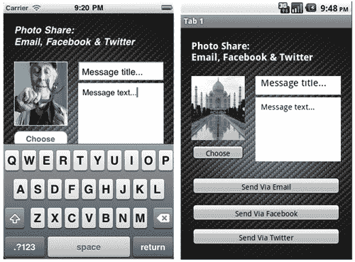

## 工作原理...

第一块代码是创建我们的布局视图，包含一个窗口和多个基本组件，这些内容已经在第一章到第四章中介绍过了。

`EmailDialog`本身是通过`Titanium.UI.createEmailDialog()`方法创建的，并且只需要提供几个简单的参数就可以发送基本的电子邮件消息。`subject`、`messageBody`和`toRecipients`参数是标准的电子邮件字段。虽然提供这些字段不是启动电子邮件对话框的必要条件，但通常情况下，你至少会提供其中的一到两个字段。需要注意的是，`subject`和`messageBody`字段都是简单的字符串，而`toRecipients`参数实际上是一个基本的数组。你可以通过添加另一个数组参数来添加多个收件人。例如，如果我们选择将电子邮件发送给两个不同的用户，我们可以编写以下代码：

```java
emailDialog.toRecipients = ['info@packtpub.com',
'me@boydlee.com'];

```

您也可以以相同的方式添加 BCC 或 CC 收件人，分别使用电子邮件对话框的`ccRecipients`和`bccRecipients`方法。最后，我们使用`open()`方法启动电子邮件对话框，此时您应该会在应用程序中看到如下标准电子邮件对话框：


## 还有一件事

您可以使用电子邮件对话框的事件监听器`complete`来告知电子邮件是否已成功发送。在您的事件处理程序中的`result`属性将为您提供电子邮件的状态，它将是以下字符串之一：

+   取消（仅限 iOS）

+   失败

+   已发送

+   保存（仅限 iOS）

# 向电子邮件添加附件

现在我们已经有一个基本的电子邮件对话框正在运行，但理想的情况是我们想将我们从照片库中选择的照片附加到我们的新电子邮件消息中。幸运的是，Titanium 通过公开一个接受我们想要附加的文件本地路径的方法`addAttachment()`，使这变得很容易。

### 注意

完整的源代码可以在`/Chapter 5/Recipe 2`文件夹中找到。

## 如何操作...

添加附件通常就像传递电子邮件对话框的`addAttachment()`方法和您希望附加的文件或 blob 的位置一样简单，例如：

```java
//add an image from the Resource/images directory
emailDialog.addAttachment('images/my_test_photo.png');

```

尽管我们的情况比这要复杂一些。为了成功附加我们选择的照片，我们需要首先将其临时保存到文件系统，然后将文件系统路径传递给`addAttachment()`。修改您的`postToEmail`函数以匹配以下代码：

```java
//create your email
function postToEmail() {
var newDir = Titanium.Filesystem.getFile(
Titanium.Filesystem.applicationDataDirectory,
'attachments');
if(!newDir.exists()) { newDir.createDirectory(); }
//write out the image file to the attachments directory
writeFile = Titanium.Filesystem.getFile(newDir.nativePath,
'temp-image.jpg');
writeFile.write(selectedImage);
var emailDialog = Titanium.UI.createEmailDialog();
emailDialog.subject = txtTitle.value;
emailDialog.toRecipients = ['info@packtpub.com'];
emailDialog.messageBody = txtMessage.value;
//add an image via attaching the saved file
emailDialog.addAttachment(writeFile);
emailDialog.open();
}

```

## 如何工作...

如您从代码中看到的，可以将附件作为 blob 对象、文件或从文件路径添加到您的电子邮件对话框中。在我们的示例中，我们在将图片添加到电子邮件对话框之前，首先将其从照片库保存到临时文件中，以便将其作为合适的图片附件显示（如下面的截图所示）。您也可以多次调用`addAttachment`方法。然而，请注意，目前 iPhone 上仅支持多个附件。

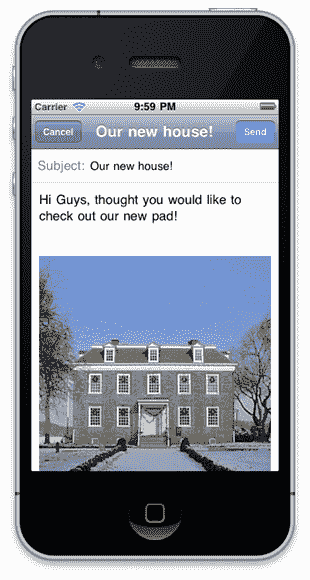

# 设置自定义 Facebook 应用程序

将 Facebook 集成到您的 Titanium 应用程序中可能一开始看起来是一个令人畏惧的前景。然而，一旦您了解了必要的步骤，您会发现这实际上并不太难！在您允许用户从您的移动应用程序发布或检索 Facebook 内容之前，您首先需要在 Facebook 本身上设置一个应用程序。该应用程序将为您提供在用户授权您的移动应用程序代表他们发布和获取内容之前所需的必要 API 密钥。

## 如何操作...

首先，你需要使用你注册时使用的电子邮件地址和密码登录到 Facebook。如果你没有 Facebook 账户，你需要首次创建一个。不过别担心，这是完全免费的！然后你需要将**开发者应用**添加到你的 Facebook 账户。你可以通过在搜索栏中搜索`开发者`来完成此操作，然后点击直到它被添加到你的账户：

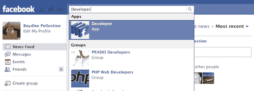

一旦你将开发者应用程序添加到你的账户并加载，只需在开发者主页上点击**设置新应用**按钮。然后会出现**创建应用程序**屏幕，允许你给你的应用程序命名，并在继续之前同意 Facebook 的条款和条件。我们称我们的应用程序为`PhotoShare Titanium`，然而，你可以使用你想要的任何名称：

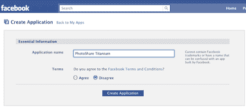

在出现的下一个屏幕上，给你的应用程序添加一个描述并填写其他所需字段。完成之后，只需保存你的更改。过程中的最后一个屏幕为我们提供了连接我们的 Titanium 应用程序到 Facebook API 所需的所有重要信息。这里有三个重要的值，你将在下一个食谱中使用，所以请确保将它们安全地记录下来！

这些字段是：

+   应用程序 ID

+   API 密钥

+   应用程序密钥

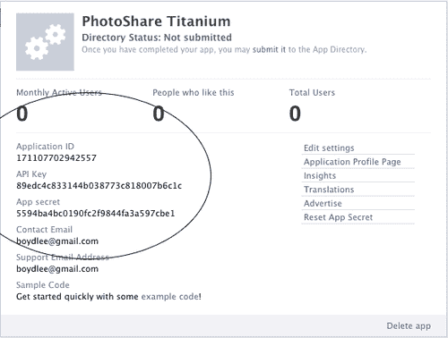

# 将 Facebook 集成到你的 Titanium 应用程序中

现在我们已经设置好了 Facebook 应用程序，我们可以着手将我们的 Titanium 应用程序连接到它。幸运的是，从 1.6.0 版本开始，Appcelerator 已经将 Facebook 的新 Graph API 紧密集成到 Titanium 中，因此连接和发布到 Facebook 平台相当简单！

### 注意

本食谱的完整源代码可以在`/Chapter 5/Recipe 4`文件夹中找到。

## 如何操作...

我们需要做的第一件事是创建一个新的按钮，该按钮将授权我们的 Titanium 应用程序代表用户发布数据。在你的`app.js`文件中输入以下代码以在现有的**电子邮件用户**按钮下方创建一个新按钮：

```java
//create your facebook session and post to fb
function postToFacebook() {
//if the user is not logged in, do so, else post to wall
if(Titanium.Facebook.loggedIn == false) {
Titanium.Facebook.appid = '<your app id>';
Titanium.Facebook.permissions = ['publish_stream'];
// Permissions your app needs
Titanium.Facebook.addEventListener('login', function(e)
{
if(e.success) {
alert('You are now logged in!');
} else if(e.error) {
alert('Error: ' + e.error);
} else if(e.cancelled) {
alert('You cancelled the login');
}
});
//call the facebook authorize method to login
Titanium.Facebook.authorize();
}
}
var buttonFacebook = Titanium.UI.createButton({
width: 280,
height: 35,
top: 330,
left: 20,
title: 'Send Via Facebook'
});
buttonFacebook.addEventListener('click', function(e){
if(selectedImage != null) {
postToFacebook();
} else {
alert('You must select an image first!');
}
});
win1.add(buttonFacebook);

```

现在请选择一张图片并点击 Facebook 按钮。如果你正确地输入了客户端 ID（你应该是通过遵循前面的食谱获得的），那么你应该会看到一个登录窗口打开并连接到 Facebook 网站，显示你的应用程序及其请求的权限，如下面的示例截图所示：


## 它是如何工作的...

我们正在创建一个函数，为我们的应用程序提供 Facebook 功能，并允许我们登录到 Facebook 并让用户接受我们为了在他们墙上发布所需权限。此函数允许我们使用在先前的食谱中创建的应用程序 ID 对 Facebook API 进行身份验证。

当此授权成功时，允许用户登录并同意您使用其 Facebook 账户的某些权限。成功的授权将返回并保存一个 Facebook 令牌。此令牌本质上是一个包含所有所需用户 ID 和权限数据的随机字符串，我们将使用它来执行针对授权用户账户的 Facebook Graph 请求。成功的登录将设置`Titanium.Facebook.loggedIn`变量为 true，在下一道菜谱中，我们将扩展我们的`postToFacebook`函数，使用这个变量作为请求的一部分，将我们选择的图片发布到我们的 Facebook 墙上。

# 在你的 Facebook 墙上发布

现在我们能够对 Facebook 进行身份验证，是时候从相册中发布一张照片到我们的墙上了！为了实现这一点，我们需要使用 Facebook 的 Graph API，调用正确的 graph 函数，并使用正确的权限。

### 注意

本菜谱的完整源代码可以在`/Chapter 5/Recipe 5`文件夹中找到。

## 如何做…

让我们通过编写一个新的 if-else 语句来扩展我们的新`postToFacebook()`函数，该语句将接受一些参数并执行对 Facebook API 的 Graph 请求。在`app.js`中扩展`postToFacebook()`函数，使其与以下代码匹配：

```java
//create your facebook session and post to fb
function postToFacebook() {
//if the user is not logged in, do so, else post to wall
if(Titanium.Facebook.loggedIn == false) {
Titanium.Facebook.appid = '252235321506456';
Titanium.Facebook.permissions = ['publish_stream'];
// Permissions your app needs
Titanium.Facebook.addEventListener('login', function(e)
{
if(e.success) {
alert('You are now logged in!');
} else if(e.error) {
alert('Error: ' + e.error);
} else if(e.cancelled) {
alert('You cancelled the login');
}
});
//call the facebook authorize method to login
Titanium.Facebook.authorize();
}
else {
//Now post the photo after you've confirmed
//that we have an access token
var data = {
caption: 'I am posting a photo to my facebook page!',
picture: selectedImage
};
Titanium.Facebook.requestWithGraphPath('me/photos',
data, "POST", function(e) {
if (e.success) {
alert( "Success! Your image has been posted to
your Facebook wall.");
Ti.API.info("Success! The image you posted has
the new ID: " + e.result);
}
else {
alert('Your image could not be posted to Facebook
at this time. Try again later.');
Ti.API.error(e.error);
}
});
} //end if else loggedIn
}

```

现在在您的模拟器或设备上运行应用程序。如果您成功发布了一张图片，您应该在应用程序中看到一个警报对话框出现，在开发人员控制台中显示来自 graph API 的新图像对象的 ID，并且照片作为帖子出现在您的 Facebook 墙上！

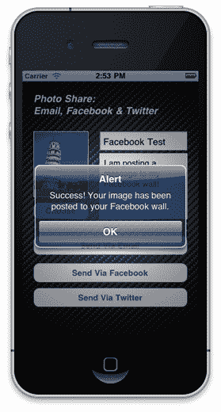

## 如何工作…

我们扩展了我们在上一个菜谱中创建的`postToFacebook()`函数，更新它以首先登录到 Facebook API，然后在随后的帖子尝试中发送一个包含照片的 graph 请求到我们的 Facebook 墙。

我们现在可以使用 Facebook 的 Graph API（封装在我们的新`graphRequest`函数中）来执行我们的请求，传递我们从上一个菜谱中的身份验证对话框中检索到的会话令牌，以及我们想要调用的 graph 方法名称（`me/photos`），以及该方法所需的数据属性。在`me/photos`方法的情况下，这两个属性是：

+   **标题**：将伴随我们的图像文件的字符串值

+   **图片**：包含我们图像数据的 blob/image

使用 Graph API 和 Facebook 登录及发布函数，我们可以执行 Facebook（以及您的用户权限）允许的任何类型的 graph 请求。以下截图显示了一个示例帖子：

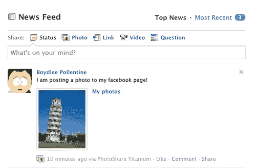

# 使用 OAuth 连接到 Twitter

Appcelerator 目前没有为 Titanium 应用程序提供连接到 Twitter 的集成方法。然而，有许多其他选项可供选择。其中最好的库之一是由 Joe Purcell 提供的，称为“Birdhouse”。在这个食谱中，我们将在线设置一个 Twitter 应用程序，获取必要的 API 密钥（与 Facebook 类似），然后实现 Google 的 OAuth 库，最后实现 Birdhouse Titanium 模块。

### 注意

本食谱的完整源代码可以在 `/第五章/食谱 6` 文件夹中找到。

## 如何做...

在我们尝试实现鸟屋和 OAuth 库之前，我们首先需要通过 Twitter 创建一个应用程序。如果您没有 Twitter 账户，您将需要首次创建一个。不过，请放心，这是完全免费的！登录到您的 Twitter 账户 [`dev.twitter.com/apps/new`](http://https://dev.twitter.com/apps/new)，一旦 Twitter 验证了您的详细信息，您将能够创建一个新的 Twitter 应用程序。

使用您自己的详细信息填写所有字段。出于我们的目的，我们已将 Twitter 应用程序命名为`PhotoShare`，并将公司和网站设置为 Packt Publishing。确保应用程序类型设置为`浏览器`，默认访问类型设置为`读/写`。所有其他字段可以按需创建，或者留空。输入验证码并点击**注册应用程序**，接受服务条款。

完成这些后，您的应用程序就准备好接收 Titanium 的请求了。但在我们实现 Birdhouse 库之前，我们首先需要从 Google 获取`oauth.js`和`sha1.js`源文件。您可以从他们的 SVN 仓库 [`oauth.googlecode.com/svn/code/javascript/`](http://oauth.googlecode.com/svn/code/javascript/) 下载这些文件。下载并将这两个文件保存到现有`Resources`文件夹中的新文件夹`lib`中。然后，将您的浏览器导航到 [`github.com/jpurcell/birdhouse`](http://https://github.com/jpurcell/birdhouse) 并下载`birdhouse.js`模块文件，再次将其保存到您的`Resources`文件夹中。

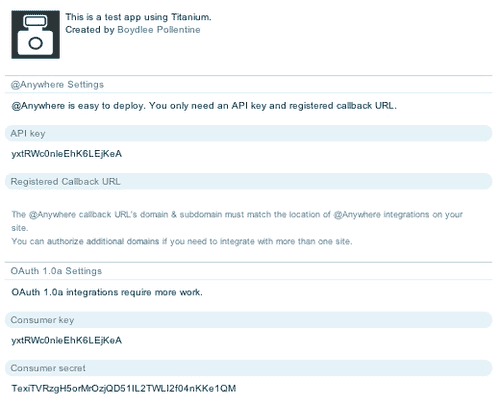

现在的最终步骤是将`birdhouse.js`库包含到我们的`app.js`文件中，并执行 Twitter 授权过程。首先，在您的`app.js`文件顶部包含该库：

```java
Ti.include('birdhouse.js');

```

然后，我们需要创建一个新的按钮来授权并最终发布我们的推文。在`app.js`文件的底部附近输入以下代码，用 Twitter 应用页面提供的`consumer_key`和`consumer_secret`值替换这些值：

```java
//create your twitter session and post a tweet
function postToTwitter()
{
var BH = new BirdHouse({
consumer_key: "your-consumer-key",
consumer_secret: "your-consumer-secret"
});
//call the birdhouse authorize() method
BH.authorize();
}
var buttonTwitter = Titanium.UI.createButton({
width: 280,
height: 35,
top: 375,
left: 20,
title: 'Send Via Twitter'
});
buttonTwitter.addEventListener('click', function(e){
if(selectedImage != null) {
postToTwitter();
} else {
alert('You must select an image first!');
}
});
win1.add(buttonTwitter);

```

就这样！现在您应该能够选择一张图片，然后点击屏幕底部的新的 **发布到 Twitter** 按钮。应该会出现带有我们 Twitter 应用程序详细信息的授权屏幕，您可以使用现有的用户名和密码登录到 Twitter，如下面的截图所示：

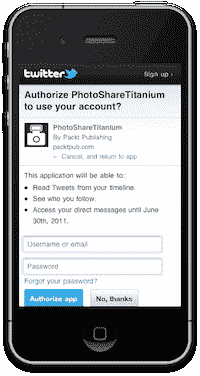

# 使用 PHP 和 HttpRequest 上传图片

向 Twitter 发布图片有多种方式，包括使用 yfrog 或 TwitPic 这样的服务。然而，在这个例子中，我们将使用 PHP 将图片发布到我们自己的服务器，并返回 URL。如果您还没有服务器，您需要运行 PHP 并具有 GDImage 才能使本菜谱工作。如果您没有服务器，网上有很多便宜或免费的 PHP 主机服务。或者，如果您精通其他网络语言（如 ASP.NET），您总是可以根据需要重写示例代码。

### 注意

本菜谱的完整源代码可以在 `/Chapter 5/Recipe 7` 文件夹中找到。

## 如何操作...

在您的服务器上创建一个名为 `upload.php` 的新文件，并保存以下内容：

```java
<?php
$target = getcwd();
$target = $target .'/'. $_POST['randomFilename'];
if(move_uploaded_file($_FILES['media']['tmp_name'], $target))
{
$filename = $target;
// Get dimensions of the original image
list($current_width, $current_height) = getimagesize($filename);
// The x and y coordinates on the original image where we
// will begin cropping the image
$left = 0;
$top = 0;
// This will be the final size of the image (e.g. how many pixels
// left and down we will be going)
$crop_width = $current_width;
$crop_height = $current_height;
// Resample the image
$canvas = imagecreatetruecolor($crop_width, $crop_height);
$current_image = imagecreatefromjpeg($filename);
imagecopy($canvas, $current_image, 0, 0, $left, $top, $current_width, $current_height);
imagejpeg($canvas, $filename, 100);
echo 'http://<mysite.com>/'.$_POST['randomFilename'];
}
else
{
echo "0";
}
?>

```

现在在您现有的 `app.js` 文件中的 `postToTwitter` 函数中，我们将扩展代码以适应将图片发布到我们的服务器。然而，在执行任何发布图片代码之前，我们将执行对 Birdhouse API 的授权方法调用，并确保用户当前已登录到 Twitter。我们还将生成一个随机的 5 个字母文件名。保持它简洁是很重要的，以将我们使用的字符数保持在最低，因为 Twitter 消息有 140 个字符的限制！

```java
function randomString(length,current){
current = current ? current : '';
return length ? randomString( --length , "abcdefghiklmnopqrstuvwxyz".charAt ( Math.floor( Math.random() * 60 ) ) + current ) : current;
}
//create your twitter session and post a tweet
function postToTwitter()
{
var BH = new BirdHouse({
consumer_key: "<your consumer key>",
consumer_secret: "<your consumer secret>"
});
if(!BH.authorized){
BH.authorize();
}
else
{
//create the httpRequest
var xhr = Titanium.Network.createHTTPClient();
//open the httpRequest
xhr.open('POST','http://<mysite>.com/upload.php');
xhr.onload = function(response) {
//the image upload method has finished
if(this.responseText != '0')
{
var imageURL = this.responseText;
alert('Your image was uploaded to ' + imageURL);
//now we have an imageURL we can post a tweet
//using birdhouse!
}
else
{
alert('The upload did not work! Check your PHP server settings.');
}
};
// send the data
var r = randomString(5) + '.jpg';
xhr.send({'media': selectedImage, 'randomFilename': r});
}
}

```

## 它是如何工作的...

在这里，我们正在利用我们现有的通过 `HttpRequest` 发布的知识，并将其扩展到使用 PHP 和 GDImage 发送 blob 数据。然后，我们将这些 blob 数据写入我们远程服务器上的图像文件，并在返回新 URL 之前。您会注意到我们还扩展了 `postToTwitter` 函数，在执行此发布之前检查用户是否已经对 Twitter 进行了授权。

# 通过 Birdhouse 和 OAuth 发送推文

在我们的最终菜谱中，我们将把所有内容组合起来，并使用我们之前菜谱的“图片发布”功能与 Birdhouse API 的组合，发布包含来自我们应用程序的消息和伴随图片 URL 的推文。

### 注意

本菜谱的完整源代码可以在 `/Chapter 5/Recipe 8` 文件夹中找到。

本章的完整源代码可以在 `/Chapter 5/PhotoShare` 文件夹中找到。

## 如何操作...

将您现有的 `app.js` 文件中的 `postToTwitter` 函数修改为以下代码，通过添加我们的新 `BH.tweet` 方法调用。如果您已经集成了之前菜谱中的照片上传代码，那么此源代码片段应出现在 `xhr.onload()` 事件处理程序中：

```java
BH.tweet(txtMessage.value + ' ' + this.responseText,
function(){
alertDialog = Ti.UI.createAlertDialog({
message:'Tweet posted!'
});
alertDialog.show();
});

```

现在尝试在模拟器中运行你的应用程序，并在必要时授权给 Twitter 后，你的新推文应该会直接从你的应用程序中发布！前往[`twitter.com/yourusername`](http://twitter.com/yourusername)查看发布到你的时间线上的推文（如下一页所示）。点击链接后，应该会加载你上传的图片！

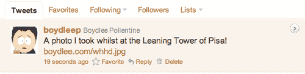

## 如何工作…

这个菜谱非常简单，因为连接到 Twitter 并将图片上传到我们的服务器上的所有艰苦工作都已经有人处理了。因此，通过 Birdhouse 将我们的最终消息推送到 Twitter API 实际上非常容易。在这里，我们调用 Birdhouse 的`tweet()`函数，该函数接受一个消息（作为字符串）和第二个参数，该参数作为 Twitter 响应的事件处理器。你还可以在将图片或文件上传到服务器之外使用这个`tweet`函数。尝试发布一个不带图片和代码的简单消息推文，你会发现它同样工作得很好！

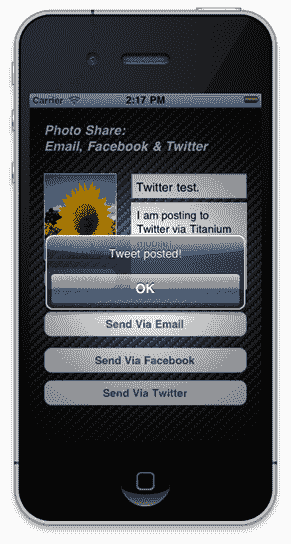
