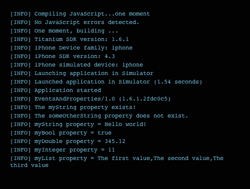
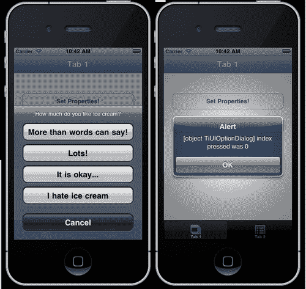
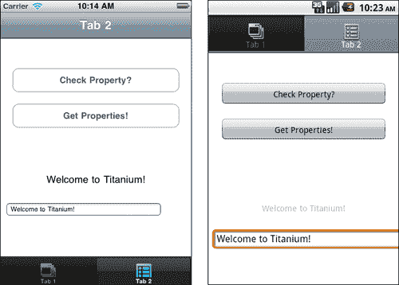

# 第六章. 掌握事件和属性

在本章中，我们将涵盖：

+   读取和写入应用程序属性

+   触发和捕获事件

+   使用自定义事件在应用程序和 WebView 之间传递事件数据

# 简介

本章描述了 Titanium 框架两个基本重要但看似简单的部分的流程。在本章中，我们将解释如何创建和读取应用程序属性，以便你可以存储可以从应用程序任何部分访问的数据。这类似于如果你正在构建基于 Web 的应用程序，会话数据或 cookie 的工作方式。

我们还将进一步详细介绍事件，包括由 Titanium 的各种组件触发的事件的选择，以及你可以自己定义的自定义事件。

应用程序属性用于以键/值对的形式存储数据。这些属性可以在你的应用程序窗口之间持久化，甚至可以跨越单个应用程序会话，就像网站 cookie 一样。你可以在属性名称中使用任意组合的大写字母、小写字母和数字，但你应该谨慎地混合它们，因为 JavaScript 是区分大小写的。在这方面，`Myname, myname` 和 `MYNAME` 将是三个非常不同的属性！

## 你应该在何时使用应用程序属性？

应当在以下任一点成立时使用应用程序属性：

+   数据由简单的键/值对组成

+   数据与应用程序相关，而不是与用户相关

+   数据不需要其他数据才能有意义或有用

+   任何给定时间只需要存储数据的一个版本

例如，将字符串/字符串键对`data_url`和`[`mywebsite.com/data.xml`](http://mywebsite.com/data.xml)`存储为应用程序属性是使用应用程序属性的有效方式。这个 URL 可以在你应用程序的所有屏幕/窗口中重用，并且与你的应用程序相关，而不是与你的数据相关。

如果你的数据复杂且在检索时需要连接、排序或查询，那么使用用 SQLite 构建的本地数据库会更好。如果你的数据是文件或大型 blob 对象（例如，图像），那么按照我们之前食谱中描述的方式存储在文件系统中会更好。

## 可以将哪些对象类型存储为应用程序属性？

目前可以在应用程序属性模块中存储五种不同的对象类型。这些包括：

+   布尔值

+   双精度（浮点值）

+   整数

+   字符串

+   列表（数组）

在下面的食谱中，我们将创建一些应用程序属性，然后读取它们，在读取过程中将它们打印到控制台。

### 注意

整个章节的完整源代码可以在`/Chapter 6/EventsAndProperties`中找到。

# 读取和写入应用程序属性

无论是读取还是写入值，所有应用属性都是从`Titanium.App.Properties`命名空间访问的。在这个食谱中，我们将在应用的第一标签窗口上创建多个属性，所有属性类型都不同。然后我们将从第二个标签窗口上的按钮读取它们并将它们的值输出到控制台。我们还将向您展示如何使用`hasProperty`方法检查属性的存在。

### 注意

本食谱的完整源代码可以在`/第六章/食谱 1`文件夹中找到。

## 准备工作

准备此食谱，请打开 Titanium Studio 并登录，如果您尚未登录的话。如果您需要注册新账户，您可以直接在应用程序内免费注册。登录后，点击**新建项目**，创建新项目的详细信息窗口将出现。将应用名称输入为`EventsAndProperties`，并使用您自己的信息填写其余的详细信息。

请注意应用标识符，它以反向域名表示法（即，*com.packtpub.eventsandproperties*）正常书写。在项目创建后，此标识符不容易更改，您在创建用于分发应用的配置文件时需要**精确匹配**它。

## 如何操作…

在您的编辑器中打开`app.js`文件，保留现有的代码，除了两个标签和标签窗口中添加这些标签的行。在`win1`对象的声明之后，输入以下代码：

```java
//
//create a button that will define some app properties
//
var buttonSetProperties = Titanium.UI.createButton({
title: 'Set Properties!',
top: 50,
left: 20,
width: 280,
height: 40
});
//create event listener
buttonSetProperties.addEventListener('click',function(e){
Titanium.App.Properties.setString('myString', 'Hello world!');
Titanium.App.Properties.setBool('myBool', true);
Titanium.App.Properties.setDouble('myDouble', 345.12);
Titanium.App.Properties.setInt('myInteger', 11);
Titanium.App.Properties.setList('myList', ['The first value', 'The second value','The third value']);
alert('Your app properties have been set!');
}); //end event listener
win1.add(buttonSetProperties);

```

现在，仍然在您的`app.js`文件中，添加以下代码。它应该放在`win2`对象声明之后。

```java
//
//create a button that will check for some properties
//
var buttonCheckForProperty = Titanium.UI.createButton({
title: 'Check Property?',
top: 50,
left: 20,
width: 280,
height: 40
});
//create event listener
buttonCheckForProperty.addEventListener('click',function(e){
if(Titanium.App.Properties.hasProperty('myString')){
Ti.API.info('The myString property exists!');
}
if(!Titanium.App.Properties.hasProperty('someOtherString')){
Ti.API.info('The someOtherString property does not exist.');
}
}); //end event listener
win2.add(buttonCheckForProperty);
//
//create a button that will read and output some app //properties to the console
//
var buttonGetProperties = Titanium.UI.createButton({
title: 'Get Properties!',
top: 50,
left: 20,
width: 280
height: 40
});
//create event listener
buttonGetProperties.addEventListener('click',function(e){
Ti.API.info('myString property = ' + Titanium.App.Properties.getString('myString'));
Ti.API.info('myBool property = ' + Titanium.App.Properties.getBool('myBool'));
Ti.API.info('myDouble property = ' + Titanium.App.Properties.getDouble('myDouble'));
Ti.API.info('myInteger property = ' + Titanium.App.Properties.getInt('myInteger'));
Ti.API.info('myList property = ' + Titanium.App.Properties.getList('myList'));
}); //end event listener
win2.add(buttonGetProperties);

```

现在，从 Titanium Studio 中启动模拟器，您应该会看到标准的双标签导航视图，每个视图中都有一个按钮。点击第一个标签上的**设置**按钮将设置您的应用属性。完成设置后，您可以使用第二个标签视图上的按钮读取单个属性并检查属性的存在。结果将显示在您的 Titanium Studio 控制台中，类似于以下截图：



## 工作原理…

在这个食谱中，我们通过使用我们的**设置属性！**按钮设置了一系列应用属性。每个属性由一个键/值对组成，因此需要一个属性名（也称为“键”）和一个属性值。要设置属性，我们使用`set`方法，其形式类似于`Titanium.App.Properties.set<type>(key,value)`。然后我们通过使用`get`方法检索我们的应用属性，其形式类似于`Titanium.App.Properties.get<type>(key,value)`。

应用程序属性在应用程序启动时加载到内存中，并在应用程序的全局范围内存在，直到它被关闭，或者使用`Titanium.App.Properties.remove()`方法从内存中删除属性。虽然以这种方式使用属性会有内存开销，但这意味着您可以从应用程序的任何部分有效地快速访问它们，因为它们在作用域上是全局的。

您还可以使用`Titanium.App.Properties.listProperties`方法访问任何给定时间存储的整个属性列表。

# 触发和捕获事件

大部分 Titanium 都是围绕事件驱动编程的概念构建的。如果您曾经用 Visual Basic、C#、Java 或任何数量的事件驱动、面向对象的语言编写过代码，这个概念对您来说已经很熟悉了。

每当用户与您应用程序界面的某个部分进行交互，或在`TextField`中输入内容时，都会发生一个事件。事件只是用户执行的动作（例如，点击、滚动或虚拟键盘上的按键）以及它发生的位置（例如，在按钮上，或在这个`TextField`中）。此外，某些事件可以间接触发其他事件。例如，当用户选择一个打开窗口的菜单项时，它会导致另一个事件——窗口的打开。

在 Titanium 中基本上有两种基本类型的事件；那些您自己定义的（自定义事件），以及那些由 Titanium API 预先定义的（按钮点击事件是一个很好的例子）。

在接下来的菜谱中，我们将在向您展示如何创建可以在您的应用程序和 Webview 之间传递数据的自定义事件之前，探索许多由 Titanium 定义的事件。

如前一个菜谱中提到的，用户也可以间接地导致事件发生。例如，按钮有一个名为'click'的事件，当用户在屏幕上点击按钮时发生。处理事件响应的代码称为事件处理器。

您的 Titanium 应用程序中的每个对象都可能发生许多事件。好消息是您不需要了解所有这些事件，并且那些已经定义的事件列在 Titanium API 中。您只需要了解它们是如何工作的以及如何访问事件数据，这样您就可以找出对象是否能够响应该事件。

在这个菜谱中，我们将探讨从多个常见组件中发生的事件，以`OptionDialog`为例，并解释如何访问这些事件的属性。我们还将解释如何创建一个函数，该函数将返回的事件传递回我们的执行代码。

### 注意

本菜谱的完整源代码可以在`/Chapter 6/Recipe 2`文件夹中找到。

## 如何做…

在您的编辑器中打开`app.js`文件，并在您的`win1`对象声明下方输入以下代码：

```java
//create a button that will launch the optiondialog via
//its click event
var buttonLaunchDialog = Titanium.UI.createButton({
title: 'Launch OptionDialog',
top: 110,
left: 20,
width: 280,
height: 40
});
//create the event listener for the button
buttonLaunchDialog.addEventListener('click',function(e){
Ti.API.info(e.source + ' was tapped, it has a title of: ');
Ti.API.info(e.source.title);
});
//add the launch dialog button to our window
win1.add(buttonLaunchDialog);

```

现在，在你创建了前面的代码之后，我们将创建一个使用外部函数作为其事件处理程序的事件监听器的`OptionDialog`。我们将在`buttonLaunchDialog`的事件处理程序函数中这样做：

```java
//create the event listener for the button
buttonLaunchDialog.addEventListener('click',function(e){
Ti.API.info(e.source + ' was tapped, it has a title of: ');
Ti.API.info(e.source.title);
var dialog = Titanium.UI.createOptionDialog({
options:['More than words can say!',
'Lots!',
'It is okay...',
'I hate ice cream', 'Cancel'],
cancel: 4,
title: 'How much do you like ice cream?'
});
//add the event listener for the option dialog
dialog.addEventListener('click', optionDialogEventHandler);
//show the option dialog
dialog.show();
});

```

现在剩下的就是为我们的`OptionDialog`创建最终的事件处理函数。在`buttonLaunchDialog`的事件监听器之前添加以下函数到你的代码中：

```java
//this is the event handler function for our option dialog
function optionDialogEventHandler(e) {
alert(e.source + ' index pressed was ' + e.index);
}

```

现在尝试在 iPhone 或 Android 模拟器中启动你的代码。如以下示例截图所示，你应该能够点击按钮并通过按钮的事件处理程序启动`OptionDialog`的执行，该处理程序反过来可以通过`optionDialogEventHandler:`执行一个警告。



## 它是如何工作的…

首先，重要的是要重申事件处理程序和事件监听器之间的区别。监听特定事件（如'click'）并相应地附加特定函数的代码称为事件监听器。处理事件响应的代码称为事件处理程序。在本食谱中，我们展示了事件监听器可以直接通过用户交互（如按钮点击）启动，并且事件处理程序可以通过以下两种方式之一执行：

+   我们的第一种方法是内联的，也就是说，事件处理函数直接在事件监听器中声明，例如`buttonLaunchDialog.addEventListener('click', function(e){} )`;。这对于快速执行可能只用于简单任务的代码来说很棒，但代码复用性不高。

+   第二种方法，以及使用事件处理程序的一个更受欢迎的方式，是将它编写为一个独立的、自包含的函数，例如：

    ```java
    function dialogClicked(e) {
    //e.source will tell you what object was clicked
    }
    //create the event listener for the button
    buttonLaunchDialog.addEventListener('click', dialogClicked);

    ```

+   这种方法允许你获得更高的代码复用性，并且通常被认为是一种更整洁的源代码组织方式。

# 使用自定义事件在您的应用和 Webview 之间传递事件数据

虽然我们可以使用钛金 API 内置的事件来满足我们 90%的一般需求，但当我们想要启动一个标准钛金组件未涵盖的事件时会发生什么？幸运的是，钛金已经通过我们`Titanium.App`命名空间中的`fireEvent`方法为我们解决了这个问题！

`FireEvent`允许你执行一个任意事件，该事件具有你确定的监听器名称，然后在你的代码中监听该事件。在本食谱中，我们将稍微复杂一些，编写一些代码，将输入字段的 数据复制并显示在我们的应用中的标签上。我们将通过从 Webview 中触发一个自定义事件来完成此操作，然后我们将在钛金窗口中监听并响应该事件。

## 参见

+   本食谱的完整源代码可以在`/Chapter 6/Recipe 3`文件夹中找到。

## 如何做到这一点…

在你的编辑器中打开`app.js`文件，并在`win2`对象的声明下方输入以下代码以创建 Webview：

```java
//create a webview and then add that to our
//second window (win2) at the bottom
var webview = Titanium.UI.createWebView({
url: 'webevent.html',
width: 320,
height: 100,
bottom: 0
});

```

现在，创建一个新的 HTML 文件，并将其命名为 `webevent.html`，以下代码。完成之后，将 HTML 文件保存到你的项目 `Resources` 文件夹中。

```java
<!DOCTYPE html PUBLIC "-//W3C//DTD HTML 4.01//EN" "http://www.w3.org/TR/html4/strict.dtd">
<html lang="en">
<head>
<title>EventHandler Test</title>
</head>
<body>
<input name="myInputField" id="myInputField" value="" size="40" />
</body>
<script>
//capture the keypress event in javascript and fire
//an event passing through our textBox's value as a
//property called 'text'
var textBox = document.getElementById("myInputField");
textBox.onkeypress = function () {
// passing object back with event
Ti.App.fireEvent('webviewEvent',
{ text: this.value });
};
</script>
</html>

```

现在剩下的只是在我们 `app.js` 文件中创建事件处理程序，它将在你输入时从我们的 HTML 文件中复制输入字段数据，然后将我们的 `webview` 添加到窗口中。在 `app.js` 文件中你的初始 `webview` 对象声明下方写下以下代码：

```java
//create a label and add to the window
var labelCopiedText = Titanium.UI.createLabel({
width: 'auto',
height: 'auto',
value: '',
bottom: 120
});
win2.add(labelCopiedText);
//create our custom event listener
Ti.App.addEventListener('webviewEvent', function(e)
{
labelCopiedText.text = e.text;
});
win2.add(webview);

```

现在在模拟器中运行你的应用，你应该能够输入位于我们 Webview 内的输入字段，并看到结果在位于其上方的标签上镜像！你应该能看到一个与这里图片中一样的屏幕：



## 它是如何工作的…

基本上，我们从 `Titanium.App.fireEvent` 方法触发的事件创建了一个跨上下文的应用程序事件，任何 JavaScript 文件都可以监听。然而，这里有两个注意事项。首先，只有当你的 `fireEvent` 调用和监听器中使用相同的事件名称时，事件才能被处理。与应用程序属性一样，这个事件名称也是大小写敏感的，所以请确保在应用程序代码的所有部分中拼写完全相同。

其次，即使对象为空，你也必须返回一个对象，并且该对象必须以 JSON 序列化格式存在。这种标准化确保了你的数据负载始终可以在不同上下文之间传输。

## 还有更多…

如果不再需要，也可以从你的代码中移除事件监听器。你可以通过调用 `Titanium.App.removeEventListener` 并传递事件名称来实现。请注意，它仍然是大小写敏感的，所以你的事件名称必须完全匹配！对于我们应用中移除 `webviewEvent` 的一个示例将是：

```java
Titanium.App.removeEventListener('webviewEvent');

```
