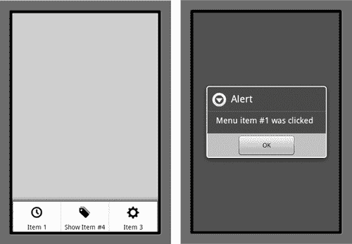
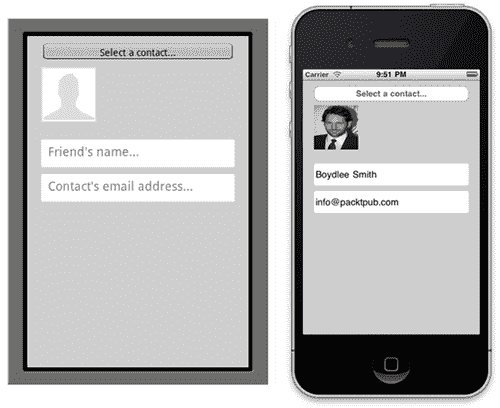
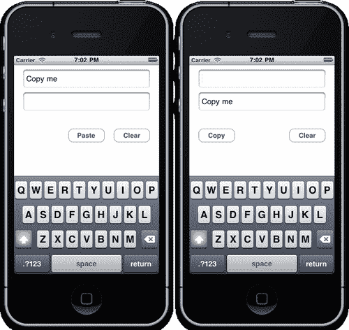
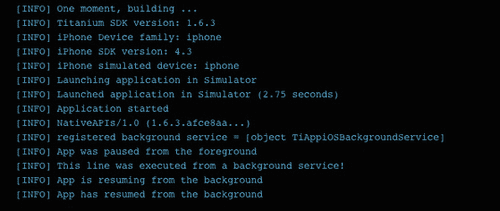
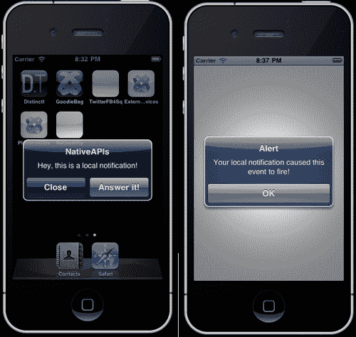
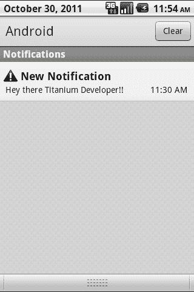

# 第八章.与原生手机应用程序和 API 交互

在本章中，我们将介绍：

+   创建 Android 选项菜单

+   访问联系人地址簿

+   通过剪贴板存储和检索数据

+   在 iPhone 上创建后台服务

+   在 iPhone 上显示本地通知

+   使用意图显示 Android 通知

+   将您的 Android 应用程序存储在设备的 SD 卡上

# 简介

虽然 Titanium 允许您创建几乎完全跨平台的本地应用程序，但不可避免的是，某些设备将固有地具有特定于它们的操作系统和硬件差异（尤其是在 Android 和 iOS 之间）。例如，任何使用过 Android 和 iPhone 设备的用户都会立即认识到通知系统设置方式非常不同。然而，还有其他特定于平台的限制，这些限制非常具体于 Titanium API。

在本章中，我们将向您展示如何在您的应用程序中创建和使用一些这些特定于设备的组件和 API。与本书中的大多数章节不同，这一章不遵循一个单一、连贯的应用程序。因此，请随意按您希望的顺序阅读每个菜谱。

# 创建 Android 选项菜单

选项菜单是 Android 用户界面的重要组成部分。它们是屏幕上菜单项的主要集合，当用户在其设备上按下**MENU**按钮时出现。在本菜谱中，我们将创建一个 Android 选项菜单并将其添加到我们的屏幕上，为每个选项分配一个具有动作的点击事件。

## 准备工作

为了准备这个菜谱以及本章中的所有菜谱，打开 Titanium Studio 并登录，如果您还没有这样做的话。您可以使用本章中每个菜谱相同的程序，或者创建一个新的程序，选择权在您手中。

### 注意

本应用程序的图标和代码可在`Chapter 8/Recipe 1`文件夹中找到。

本菜谱的完整源代码可以在`/Chapter 8/Recipe 1`文件夹中找到。

## 如何操作…

在您的 IDE 中打开`app.js`文件，并输入以下代码：

```java
//create the root window
var win1 = Titanium.UI.createWindow({
title: 'Android Options Menu',
backgroundColor: '#ccc'
});
if(Titanium.Platform.osname == 'android')
{
//references the current android activity
var activity = Ti.Android.currentActivity;
//create our menu
activity.onCreateOptionsMenu = function(e) {
var menu = e.menu;
//menu button 1
var menuItem1 = menu.add({ title: "Item 1" });
menuItem1.setIcon("item1.png");
menuItem1.addEventListener("click", function(e) {
alert("Menu item #1 was clicked");
});
//menu button 2
var menuItem2 = menu.add({
title: "Show Item #4",
itemId: 2
});
menuItem2.setIcon("item2.png");
menuItem2.addEventListener("click", function(e) {
menu.findItem(4).setVisible(true);
});
//menu button 3
var menuItem3 = menu.add({ title: "Item 3" });
menuItem3.setIcon("item3.png");
menuItem3.addEventListener("click", function(e) {
alert("Menu item #3 was clicked");
});
//menu button 4 (will be hidden)
var menuItem4 = menu.add({
title: "Hide Item #4",
itemId: 4
});
menuItem4.setIcon("item4.png");
menuItem4.addEventListener("click", function(e) {
menu.findItem(4).setVisible(false);
});
};
//turn off the item #4 by default
activity.onPrepareOptionsMenu = function(e) {
var menu = e.menu;
menu.findItem(4).setVisible(false);
};
}
win1.open();

```

首次在 Android 模拟器中构建和运行您的应用程序。当您在设备/模拟器上按下“菜单”按钮时，您应该看到一个看起来就像以下示例的屏幕。点击第一个菜单项应该执行其点击事件并显示一个警告对话框。以下截图是一个示例：



## 工作原理…

首先，需要注意的是，这个菜谱中的代码仅适用于 Android。iOS 平台没有像 Android 设备那样的物理菜单按钮，因此也没有选项菜单。在 Android 上，这些菜单有助于方便用户操作。我们可以在第一个菜单项的`click`事件中看到这一点，在那里我们使用事件处理器来捕获这个事件并显示一个简单的警告对话框。

菜单中的第四个选项通过使用"**onPrepareOptionsMenu**"事件进行修改，该事件在菜单被添加到屏幕之前执行。您可以在此事件处理器中启用、禁用、添加或删除项目。在本教程中，我们通过将第四个菜单选项的`visible`状态设置为*false*来隐藏它，我们可以在第二个菜单选项的事件处理器中再次将其更改为*true*。

## Android 设备的菜单图标大小

您的菜单图标应该是平面的，以“正面”呈现，并且是灰度的。根据 Android 指南，所有菜单图标应使用相同的调色板和效果，以保持一致性。以下是 Android 屏幕密度大小的图标大小列表。

+   高密度（hdpi）屏幕的菜单图标尺寸：

    +   完整资产：72 x 72 像素

    +   图标：48 x 48 像素

    +   方形图标：44 x 44 像素

+   中密度（mdpi）屏幕的菜单图标尺寸：

    +   完整资产：48 x 48 像素

    +   图标：32 x 32 像素

    +   方形图标：30 x 30 像素

+   低密度（ldpi）屏幕的菜单图标尺寸：

    +   完整资产：36 x 36 像素

    +   图标：24 x 24 像素

    +   方形图标：22 x 22

# 访问联系人地址簿

有时候，您可能希望用户访问他们设备中的现有数据，以便在您的应用程序中填充某些字段或数据库。可能最好的例子是使用地址簿和联系人详细信息。例如，如果您构建了一个主要用于通过电子邮件共享数据的应用程序，使用设备上的联系人地址簿将允许用户从选择列表中选择他们已经拥有的联系人（而不是需要单独记住或重新输入数据）。

在本教程中，我们将创建一个基本界面，该界面访问我们的通讯录并检索联系人详细信息，在执行此操作的同时填充我们的界面组件，包括一些文本字段和图像视图。在开始之前，请确保您的设备或模拟器中已通过在 iPhone 上选择*通讯录*图标或在 Android 上选择*联系人*图标添加了一些联系人。

### 注意

本教程的完整源代码可在`/Chapter 8/Recipe 2`文件夹中找到。

## 如何操作...

在您的 IDE 中打开`app.js`文件，并输入以下代码：

```java
//create the root window
var win1 = Titanium.UI.createWindow({
title: 'Android Options Menu',
backgroundColor: '#ccc'
});
//add the textfields
var txtName = Titanium.UI.createTextField({
width: 280,
top: 150,
left: 20,
height: 40,
backgroundColor: '#fff',
borderRadius: 3,
hintText: 'Friend\'s name...',
paddingLeft: 3
});
win1.add(txtName);
var txtEmail = Titanium.UI.createTextField({
width: 280,
top: 200,
left: 20,
height: 40,
backgroundColor: '#fff',
borderRadius: 3,
hintText: 'Contact\'s email address...',
paddingLeft: 3,
keyboardType: Titanium.UI.KEYBOARD_EMAIL
});
win1.add(txtEmail);
//this is the user image
var imgView = Titanium.UI.createImageView({
width: 80,
left: 20,
height: 80,
top: 45,
image: 'no_avatar.gif'
});
win1.add(imgView);
var contactButton = Titanium.UI.createButton({
title: 'Select a contact...',
left: 20,
top: 10,
height: 28,
width: 280
});
contactButton.addEventListener('click', function(e){
//
//if array of details is specified, the detail view will be
//shown
//when the contact is selected. this will also trigger
//e.key, and e.index in the success callback
//
Titanium.Contacts.showContacts({
selectedProperty: function(e) {
Ti.API.info(e.type + ' - '+ e.value);
txtEmail.value = e.email;
},
selectedPerson: function(e) {
var person = e.person;
txtEmail.value = person.email.home[0];
if (person.image != null) {
imgView.image = person.image;
}
else {
imgView.image = 'no_avatar.gif';
avatar = 'no_avatar.gif';
}
txtName.value = person.firstName + ' ' + person.lastName;
}
});
});
win1.add(contactButton);
win1.open();

```

## 工作原理...

对地址簿的访问取决于平台。在 Android 操作系统上，您将只能对联系人列表进行只读访问，而在 iPhone 上，您将拥有完整的读写权限。因此，请注意，`createPerson`等方法在 Android 设备上不可用。

所有对设备通讯录的访问都通过`Titanium.Contacts`命名空间提供。在本教程中，我们创建了一个包含一些文本字段和图像视图的基本屏幕，我们通过加载联系人 API 并从设备联系人列表中选择一个条目来填充它。为此，我们执行了`showContacts()`方法，该方法有两个不同的回调函数：

1.  `SelectedProperty:` 当用户选择一个人的属性而不是单个联系人条目时执行此回调

1.  `SelectedPerson:` 当用户选择一个人的条目时执行此回调

在我们的示例菜谱中，我们正在使用`SelectedPerson`函数，并将回调属性`(e)`分配给一个名为`person`的新对象。从这里我们可以访问从设备联系人列表中选择的联系人的`field`属性，例如电话、电子邮件、姓名和联系照片，然后将这些变量分配给我们自己的应用程序中的相关字段。以下截图显示了从设备列表中选择联系人后，联系人的屏幕在空和填写后的样子：



# 通过剪贴板存储和检索数据

剪贴板用于存储文本和对象数据，以便在设备上的不同屏幕和应用程序之间使用。虽然 iOS 和 Android 都内置了剪贴板功能，但 Titanium 通过允许您以编程方式访问和写入剪贴板数据来扩展了这一功能。在这个菜谱中，我们将创建一个带有两个文本字段和一系列按钮的屏幕，这些按钮允许我们以编程方式从一个文本字段复制数据并将其粘贴到另一个文本字段中。

### 注意

本菜谱的完整源代码可以在`/Chapter 8/Recipe 3`文件夹中找到。

## 如何做到这一点…

在您的 IDE 中打开项目中的`app.js`文件，并输入以下代码（删除任何现有代码）。完成后，在模拟器中运行您的应用程序以进行测试。

```java
var win1 = Titanium.UI.createWindow({
backgroundColor: '#fff',
title: 'Copy and Paste'
});
var txtData1 = Titanium.UI.createTextField({
left: 20,
width: 280,
height: 40,
top: 10,
borderStyle:Titanium.UI.INPUT_BORDERSTYLE_ROUNDED
});
var txtData2 = Titanium.UI.createTextField({
left: 20,
width: 280,
height: 40,
top: 60,
borderStyle:Titanium.UI.INPUT_BORDERSTYLE_ROUNDED
});
var copyButton = Titanium.UI.createButton({
title: 'Copy',
width: 80,
height: 30,
left: 20,
top: 140
});
var pasteButton = Titanium.UI.createButton({
title: 'Paste',
width: 80,
height: 30,
left: 120,
top: 140,
visible: false
});
var clearButton = Titanium.UI.createButton({
title: 'Clear',
width: 80,
height: 30,
right: 20,
top: 140
});
function copyTextToClipboard() {
Ti.UI.Clipboard.setText(txtData1.value);
copyButton.visible = false;
pasteButton.visible = true;
}
function pasteTextFromClipboard() {
txtData2.value = Ti.UI.Clipboard.getText();
txtData1.value = '';
copyButton.visible = true;
pasteButton.visible = false;
}
function clearTextFromClipboard() {
Ti.UI.Clipboard.clearText();
}
copyButton.addEventListener('click', copyTextToClipboard);
pasteButton.addEventListener('click', pasteTextFromClipboard);
clearButton.addEventListener('click', clearTextFromClipboard);
win1.add(txtData1);
win1.add(txtData2);
win1.add(copyButton);
win1.add(pasteButton);
win1.add(clearButton);
win1.open();

```

## 它是如何工作的…

在这个菜谱中，我们正在将简单的字符串复制到剪贴板和从剪贴板中。然而，重要的是要注意，您还可以使用`Ti.UI.Clipboard.setObject()`方法复制对象。我们正在使用两种方法来复制剪贴板中的数据，`setText()`和`getText()`，它们确实执行了它们所描述的功能。我们使用**复制**按钮将文本从第一个文本字段设置到剪贴板中，然后使用**粘贴**按钮以编程方式将相同的文本粘贴到第二个文本字段中。使用剪贴板有许多用途，但其中最重要的用途是它允许用户将应用程序提供的数据与设备上的其他应用程序共享（如下面的截图所示）。例如，您可以为电子邮件地址提供一个“复制”按钮，然后用户可以将该按钮复制并粘贴到他们的本地电子邮件客户端中，例如 Mobile Mail 或 Google Gmail。



# 在 iPhone 上创建后台服务

苹果现在支持 iOS 4 及更高版本的背景服务，这意味着您的应用程序现在可以在后台运行代码，就像 Android 应用程序能够做到的那样。在这个菜谱中，我们将创建一个后台服务，它将执行一个名为`bg.js`的单独文件中的固定代码片段。我们还将记录后台服务周期的每个阶段到控制台，以便您理解每个过程。

### 注意

本食谱的完整源代码可以在`/Chapter 8/Recipe 4`文件夹中找到。

## 如何做到这一点…

在你的 IDE 中打开项目`app.js`文件，并输入以下代码（删除任何现有代码）：

```java
//create root window
var win1 = Titanium.UI.createWindow({
backgroundColor: '#fff',
title: 'Background Services'
});
function validiOSPlatform() {
//add iphone checks
if (Titanium.Platform.osname == 'iphone')
{
var version = Titanium.Platform.version.split(".");
var major = parseInt(version[0],0);
//can only test this support on ios 4+
if (major >= 4) {
return true;
}
}
//either we're not running ios or platform is old
return false;
}
if (validiOSPlatform() == true) {
//register a background service.
//this JS will run when the app is backgrounded
var service =
Ti.App.iOS.registerBackgroundService({url:'bg.js'});
Ti.API.info("registered background service = " + service);
//fired when an app is resuming for suspension
Ti.App.addEventListener('resume',function(e){
Ti.API.info("App is resuming from the background");
});
//fired when an app has resumed
Ti.App.addEventListener('resumed',function(e){
Ti.API.info("App has resumed from the background");
});
//fired when an app is paused
Ti.App.addEventListener('pause',function(e){
Ti.API.info("App was paused from the foreground");
});
}
//finally, open the window
win1.open();

```

现在创建一个名为`bg.js`的新文件，并将其保存到项目的`Resources`文件夹中，然后输入以下代码。这是我们通过后台服务将要执行的代码：

```java
Ti.API.info("This line was executed from a background service!");

```

完成后，在模拟器中运行你的应用程序以进行测试。

## 它是如何工作的…

本食谱涉及两个主要步骤。第一步是确保我们正在运行的设备确实是一部 iPhone（iOS）设备，第二步是确保它正在运行所需的 iOS 4+操作系统。`validiOSPlatform()`函数执行此任务，并返回一个简单的布尔值 true/false 响应，指示是否继续注册我们的后台服务。

第二部分是使用`bg.js`文件作为代码注册我们的后台服务，当应用程序进入“后台”状态时执行此代码。在这种情况下，后台服务文件中的代码将触发并记录一条信息消息到控制台。本例中还处理了所有应用程序暂停和恢复事件监听器。因此，你可以在模拟器中运行应用程序，打开它，退出它，然后再次打开它，以查看每个事件处理程序触发，并将相应的消息记录到控制台。



# 在 iPhone 上显示本地通知

另一个 iOS 4+后的特性是本地通知的引入，它允许开发者创建看起来和操作类似**推送**通知的基本通知警报，但无需创建所有必要的证书和服务器端代码，以便推送工作。在本食谱中，我们将扩展为我们的后台服务编写的先前代码，并在应用程序被推送到系统后台时创建一个本地通知。

### 注意

本食谱的完整源代码可以在`/Chapter 8/Recipe 5`文件夹中找到。

## 如何做到这一点…

打开上一个食谱中的项目`bg.js`文件，并添加以下代码来扩展它：

```java
var notification = Ti.App.iOS.scheduleLocalNotification({
alertBody: 'Hey, this is a local notification!',
alertAction: "Answer it!",
userInfo: {"Hello": "world"},
date: new Date(new Date().getTime())
});

```

现在，在你的`app.js`文件中，创建以下事件监听器和处理程序。它将在后台过程中按下**Answer It**确认按钮时执行：

```java
//listen for a local notification event
Ti.App.iOS.addEventListener('notification', function(e)
{
Ti.API.info("Local notification received: "+ JSON.stringify(e));
alert('Your local notification caused this event to fire!');
});

```

完成后，在模拟器中运行你的应用程序以进行测试。你应该能够在应用程序启动后“后台”或暂停应用程序（通过按下 iPhone 上的“主页”按钮）并接收本地通知。点击**Answer It**将重新加载你的应用程序，并触发我们的“通知”事件监听器（如以下截图所示）！



## 如何工作…

本地通知由多个参数组成，包括：

+   `alertBody:` 出现在你的警报对话框中的消息

+   `alertAction:` 执行您应用的右侧按钮

+   `userInfo:` 您希望传递回应用的资料

+   `date:` 何时执行通知

我们的示例使用当前日期和时间，这意味着通知将在应用变为“后台”后立即出现。当通知出现时，用户可以取消它，或者使用我们的自定义“操作”按钮重新启动应用并执行我们的“通知”事件处理器。

# 使用意图显示 Android 通知

意图是 Android 术语，用于在系统上执行的操作。最重要的是，它用于启动活动。意图的主要参数包括：

1.  “操作”：要执行的一般操作，例如 `ACTION_VIEW`

1.  “数据”：操作要操作的数据，例如数据库记录或联系人数据

在这个菜谱中，我们将结合使用意图和 Android 的通知管理器来创建一个本地通知，该通知将出现在我们用户的 Android 通知栏中。

### 注意

本菜谱的完整源代码可以在 `/Chapter 8/Recipe 6` 文件夹中找到。

## 如何操作...

您需要包标识符（格式为 *com.yourcompany.yourapp—you*，您可以在 Titanium Studio 的 **编辑** 选项卡中找到它）以及您 Android 应用的类名。您可以通过在项目中打开 `Build/Android` 文件夹，然后打开包含在内的 `Android.manifest.xml` 文件来找到类名。在 `application` 节点下，您将找到一个类似以下内容的部分：

```java
<activity
android:name=".NativeapisActivity"
android:label="NativeAPIs"
android:theme="@style/Theme.Titanium"
android:configChanges="keyboardHidden|orientation"
>
...

```

您的 `className` 属性是您的应用标识符和之前 XML 中的 `android:name` 属性的组合。在我们的例子中，这个 `className` 属性是 `com.boydlee.nativeapis.NativeapisActvitity`。

将这两个值记录下来后，在您的 IDE 中打开项目中的 `app.js` 文件，并输入以下代码（删除任何现有代码）：

```java
//create root window
var win1 = Titanium.UI.createWindow();
if(Titanium.Platform.osname == 'android')
{
var intent = Titanium.Android.createIntent({
action: Titanium.Android.ACTION_MAIN,
className: 'com.boydlee.nativeapis.NativeapisActivity',
packageName: 'com.boydlee.nativeapis'
});
intent.addCategory(Titanium.Android.CATEGORY_LAUNCHER);
var pending = Titanium.Android.createPendingIntent({
activity: Titanium.Android.currentActivity,
intent: intent,
type:
Titanium.Android.PENDING_INTENT_FOR_ACTIVITY,
flags: Titanium.Android.FLAG_ACTIVITY_NEW_TASK
});
var notification =
Titanium.Android.createNotification({
contentIntent: pending,
contentTitle: 'New Notification',
contentText: 'Hey there Titanium Developer!!',
tickerText: 'You have a new Titanium message...',
ledARGB: 1,
number: 1,
when: new Date().getTime()
});
Ti.Android.NotificationManager.notify(1,
notification);
}
//finally, open the window
win1.open();

```

完成后，在 Android 模拟器中运行您的应用以进行测试。一旦您的应用启动，您应该可以退出并下拉 Android 通知栏以查看结果。

## 它是如何工作的...

在这个菜谱中，我们结合使用意图、活动和通知消息。`notification` 对象本身相对简单。它接受包括通知的标题和消息、徽章 `number` 和 `when` 参数（通知将显示的 `datetime`，我们将其设置为默认值 'now'）在内的多个参数。`ledARGB` 参数是设备 LED 闪烁的颜色，我们将其设置为设备默认值。

您会注意到我们还使用 `addCategory` 方法为我们的意图添加了一个类别，例如 `intent.addCategory(Titanium.Android.CATEGORY_LAUNCHER)`；在我们的例子中，我们使用了 `CATEGORY_LAUNCHER`，这意味着我们的意图应作为顶级应用出现在启动器中。

与我们的通知一起的是一个名为`pending`的对象。这是我们**意图**，这个意图已经被编写来启动一个**活动**。在我们的案例中，活动是重新启动我们的应用程序。您还可以向意图添加 URL 属性，以便您的应用程序可以在重新进入时启动特定的代码。

以下截图显示了我们的通知消息在实际操作中的示例：



# 将您的 Android 应用程序存储在设备的 SD 卡上

Titanium 的一个缺点是，由于其编译过程，基于 Titanium 平台构建的应用程序与原生应用程序相比，文件大小往往较大。在 Titanium 上大多数简单应用程序的大小在 4-5 兆字节之间。这对 iPhone 来说并不是真正的问题，但不幸的是，许多 Android 设备使用 SD 卡内存，并且没有太多的本地手机存储空间。

在这个食谱中，我们将向您展示如何配置您的 Android 应用程序，以便它可以在 SD 卡上运行，通过在应用程序设置屏幕中的 Android 的**移动到 SD 卡**按钮。

### 注意

本食谱的完整源代码可以在`/第八章/食谱 7`文件夹中找到。

## 如何做到这一点…

打开项目根目录下的`tiapp.xml`文件，并找到 XML 中的`<android>`节点，该节点位于文件底部附近。修改`<android>`节点，使其看起来像以下代码：

```java
<android >
<tool-api-level>8</tool-api-level>
<manifest android:installLocation="preferExternal">
<uses-sdk android:minSdkVersion="7" />
</manifest>
</android>

```

现在构建并运行您的应用程序在您的 Android 设备上。请注意，这可能在模拟器中不起作用。

## 它是如何工作的…

在理解与这个 XML 配置相关的几个重要部分时，首先要注意的是`<tool-api-level>`节点值实际上是指所需的 Android 工具的最小版本。版本 8 是启用外部存储功能所需的最小版本。

`<android:installLocation>`属性指的是应用程序安装时的初始存储位置。在这里，我们告诉 Android 操作系统我们希望它存储在外部 SD 卡上。然而，如果 SD 卡不可用，应用程序将直接存储在手机内存中。您还可以使用`internalOnly`值，这将不允许应用程序安装在外部存储上。

最后，`<uses-sdk>`节点指的是所需的 Android 版本。在本例中，版本 7 指的是 Android 2.1 及以上版本，这是执行**复制到 SD 卡**操作所必需的。
