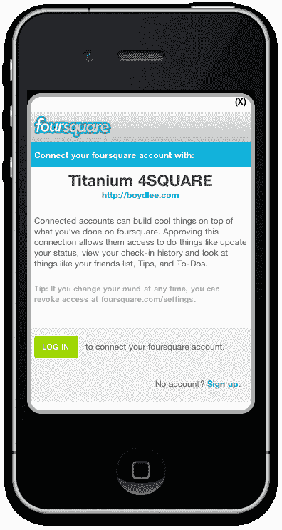
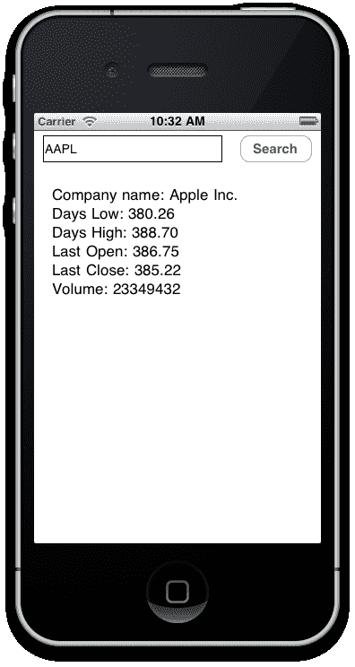
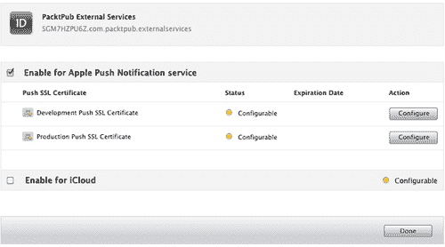
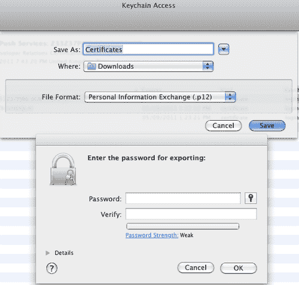
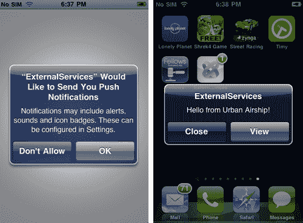
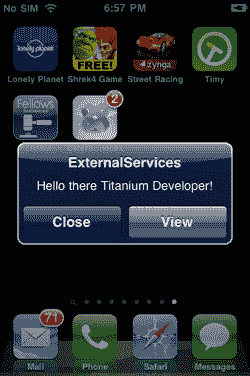

# 第九章。将您的应用程序与外部服务集成

在本章中，我们将涵盖：

+   连接到使用基本身份验证的 API

+   从 Google Places API 获取数据

+   使用 OAuth 连接到 FourSquare

+   在 FourSquare 上发布签到

+   通过 Yahoo! YQL 搜索和检索数据

+   将推送通知与 UrbanAirship.com 集成

+   使用 PHP 和 HTTP POST 测试推送通知

# 简介

许多移动应用程序是自包含的程序（例如计算器应用程序），并且不需要与其他服务或系统交互。然而，您会发现随着您构建的越来越多，开始变得有必要与外部供应商和系统集成，以保持您的用户满意。最近将 Facebook "赞" 按钮集成以及能够在应用程序内推文的趋势是这一点的绝佳例子。

在本章中，我们将集中讨论以多种常见方式与各种不同的服务提供商进行通信，包括基本授权、开放授权以及使用服务提供商（如 Urban Airship），结合一些 PHP 代码，使推送通知在您的 iPhone 上工作。

# 连接到使用基本身份验证的 API

基本身份验证是一种通过在发送到 HTTP 之前使用 Base64 编码用户名和密码凭据来获取系统访问权限的方法。例如，给定用户名 'Aladdin' 和密码 'open sesame'，字符串 'Aladdin:open sesame' 被 Base64 编码，结果为 'QWxhZGRpbjpvcGVuIHNlc2FtZQ=='。这个 Base64 字符串随后被接收服务器解码，结果为用冒号分隔的原始用户名-密码字符串。虽然这不是最安全的身份验证方案，但对于人类眼睛来说是不可读的，并且对于小型 API 或私有系统来说非常容易实现。从 HTTP/1.1 开始，所有网络浏览器都支持基本身份验证，因此可以在 Web 和移动设备上广泛实现，无需担心浏览器支持。

许多外部服务使用基本身份验证和会话密钥，以便您访问和交互它们的 API。在这个例子中，我将向您展示如何使用基本身份验证机制访问 Blurtit API。这个食谱的基本原理也适用于任何其他使用基本身份验证的标准 API。

## 准备工作

Blurtit 是一个免费的在线问答系统，类似于 Yahoo! Answers，或者许多其他在网上的问答风格论坛。您需要在与 Blurtit.com 的账户设置中注册并申请他们的 API，该 API 位于 [`api.blurtit.com`](http://api.blurtit.com)。注册后，您将获得一个用户 ID、API 密钥、登录名和密码。您需要这四项内容才能连接到 API 并检索数据。

### 注意

本食谱的完整源代码可以在 `/Chapter 9/Recipe 1` 文件夹中找到。

## 如何操作...

在 Titanium Studio 中创建一个新的项目，并打开`app.js`文件，删除所有现有的代码。首先，我们将创建一些变量，这些变量将包含你的 API 密钥、用户 ID、用户名、密码以及 API 的 URL。确保你将以下代码中的`loginName`和`loginPassword`变量值替换为在*准备工作*部分注册 API 时提供的登录信息：

```java
var win = Titanium.UI.createWindow();
var userid = '123456';
var apikey = 'B_1a0350b39b19a05************';
var loginName = 'b****@gmail.com';
var loginPasswd = '******';
var apiUrl = 'http://api.blurtit.com/users/signin.json';

```

现在，为了进行基本认证，我们需要创建一个请求头。这个信息在声明**xhr** `httpClient`对象之后发送，但在你执行`send`方法之前：

```java
var xhr = Titanium.Network.createHTTPClient();
xhr.open('POST', apiUrl);
authstr = 'Basic ' + Titanium.Utils.base64encode(userid+':'+apikey);
xhr.setRequestHeader('Authorization', authstr);

```

接下来，根据 Blurtit API 创建你的参数数组。在这种情况下，我们将`login_name`和`password`变量传递进去以执行`signin`请求。将`params`数组附加到你的`xhr.send()`方法，如下所示：

```java
var params = {
'login_name': loginName,
'password': loginPasswd
};
xhr.send(params);

```

最后，在`xhr.onload()`方法中，读取`responseText`并将其分配给一个 JSON 对象。然后我们可以读取返回的数据（在这个例子中是一个会话 ID），并将其分配给一个标签以供显示：

```java
//create and add the label to the window
var lblsession = Titanium.UI.createLabel({
width: 280,
height: 'auto',
textAlign: 'center'
});
win.add(lblsession);
//execute our onload function and assign the result to
//our lblsession control
xhr.onload = function() {
Titanium.API.info(' Text: ' + this.responseText);
var jsonObject = JSON.parse(this.responseText);
lblsession.text = "Session ID: \n" +
jsonObject.user.session_id;
};
//finally open the window
win.open();

```

现在我们已经授权并存储了我们的会话变量，我们可以调用 Blurtit API 提供的函数。以下是一个示例，它向 API 提出一个简单的问题，然后将 JSON 响应记录到控制台：

```java
function callAPI(apiFunction, params)
{
var xhr = Titanium.Network.createHTTPClient();
Ti.API.info('Session ID = ' + sessionid);
xhr.onload = function() {
//this is the response data to our question
Titanium.API.info(' Text: ' + this.responseText);
var jsonObject = JSON.parse(this.responseText);
};
xhr.open('POST', apiUrl + apiFunction);
authstr = 'Basic '+
Titanium.Utils.base64encode(userid+':'+apikey);
xhr.setRequestHeader('Authorization', authstr);
xhr.send(params);
}
var params = {
'session_id': sessionid,
'query': "Who is Britney Spears?"
};
//call the api with your session_id and question_id
callAPI('questions/search.json?query=' +
txtQuestion.value, params);

```

## 它是如何工作的...

基本认证系统基于认证和接收一个会话令牌的原则，然后这个令牌可以在每个后续的 API 调用中用作识别自己的手段。这个会话变量作为参数传递给你要对系统进行的每个调用。这可以从我们之前的代码中看到，我们正在调用搜索问题方法（`questions/search.json?query=xxx`）。

### 注意

应当注意的是，将用户名和密码变量编码为 Base64 字符串的目的并非是为了安全，而是为了确保可能的不兼容 HTTP 字符被编码成 HTTP 兼容的值。基本认证方法目前在互联网上仍然广泛使用。然而，在今天，它在许多情况下正被 OAuth 所取代。我们将在本章的下一个菜谱中查看如何与 OAuth 集成。

# 从 Google Places API 获取数据

Google Places API 是 Google Maps 的一个新部分，它返回有关地点的信息（例如，银行、自动取款机、服务、机场等）。它标志着 Google 试图直接将用户与其位置附近的商店或感兴趣的项目连接起来，并且高度针对移动使用。在本菜谱中，我们将创建一个新的模块，其中包含连接到 Google Places API 并返回数据的所有代码。

## 准备工作

为了对 Places API 进行请求，你需要从 Google 获取一个 API 密钥。你可以从这里获取密钥：[`code.google.com/apis/console`](http://https://code.google.com/apis/console)。

### 注意

本食谱的完整源代码可以在 `/Chapter 9/Recipe 2` 文件夹中找到。

## 如何做到这一点…

在 Titanium Studio 中创建一个新的项目，你可以给它任何你想要的名称。然后，创建一个名为 `placesapi.js` 的新文件，并将其保存到你的项目的 `Resources` 目录中。将以下代码输入到这个新的 JavaScript 文件中：

```java
var api = {
xhr: null
};
var places = (function() {
//create an object which will be our public API
//data format must be json or xml
api.getData = function(lat, lon, radius, types, name, sensor, success, error) {
if(api.xhr == null){
api.xhr = Titanium.Network.createHTTPClient();
}
var url =
"https://maps.googleapis.com/maps/api/place/search/json?";
url = url + "location=" + lat + ',' + lon;
url = url + "&radius=" + radius;
url = url + "&types=" + types;
url = url + "&name=" + name;
url = url + "&sensor=" + sensor;
url = url + "&key="
+ Titanium.App.Properties.getString("googlePlacesAPIKey");
Ti.API.info(url);
api.xhr.open('GET', url);
api.xhr.setRequestHeader('Content-Type', 'application/json; charset=utf-8');
api.xhr.onerror = function(e){
Ti.API.error("API ERROR " + e.error);
if (error) {
error(e);
}
};
api.xhr.onload = function(){
Ti.API.debug("API response: " + this.responseText);
if (success) {
var jsonResponse = JSON.parse(this.responseText);
success(jsonResponse);
}
};
api.xhr.send();
};
//data format must be json or xml
api.getPlaceDetails = function(reference, sensor, success,
error) {
if(api.xhr == null){
api.xhr = Titanium.Network.createHTTPClient();
}
var url =
"https://maps.googleapis.com/maps/api/place/details/json?";
url = url + "reference=" + reference;
url = url + "&sensor=" + sensor;
url = url + "&key=" +
Titanium.App.Properties.getString("googlePlacesAPIKey");
//for debugging should you wish to check the URL
//Ti.API.info(url);
api.xhr.open('GET', url);
api.xhr.setRequestHeader('Content-Type', 'application/json;
charset=utf-8');
api.xhr.onerror = function(e){
Ti.API.error("API ERROR " + e.error);
if (error) {
error(e);
}
};
api.xhr.onload = function(){
Ti.API.debug("API response: " + this.responseText);
if (success) {
var jsonResponse = JSON.parse(this.responseText);
success(jsonResponse);
}
};
api.xhr.send();
};
//return our public API
return api;
} ());

```

现在打开你的 `app.js` 文件（或你打算从那里调用地点模块的地方），删除所有现有的代码。输入以下示例代码以使用我们的 API 包装器获取数据。请注意，在这个例子中，你可以使用 JSON 格式从该 API 返回 XML 数据，这应该是你移动开发的实际标准。你还需要将 XXXXXXXXXXXXXXXX API 密钥替换为你自己的有效 API 密钥，来自 Google。

```java
//include our placesapi.js module we created earlier
Ti.include('placesapi.js');
//Types array
var types = ['airport', 'atm', 'bank', 'bar', 'parking', 'pet_store', 'pharmacy', 'police', 'post_office', 'shopping_mall'];
Titanium.App.Properties.setString("googlePlacesAPIKey", "XXXXXXXXXXXXXXXXXXXXXXXXXXXXXXX");
//fetch banks and atm's
//note the types list is a very short sample of all the types of
//places available to you in the Places API
places.getData(-33.8670522, 151.1957362, 500, types[1] + "|" + types[2], '', 'false',
function(response) {
//getting an item out of the json response
Ti.API.info(response.results[1].name);
Ti.API.info(response.results[1].vicinity);
Ti.API.info(response.results[1].icon);
Ti.API.info(response.results[1].types[0]);
},
function(e) {
Titanium.UI.createAlertDialog({
title: "API call failed",
message: e,
buttonNames: ['OK']
}).show();
});

```

在模拟器中运行示例应用程序，你应该能够获取一个 JSON 格式的列表返回，并将列表中的第一个项目记录到控制台。尝试扩展这个示例以使用实时位置数据与 Google Maps 集成！你还可以通过调用 API 的 `getPlaceDetails()` 方法获取更详细的位置信息，例如：

```java
places.getPlaceDetails(response.results[1].reference, 'false', function(response){
//log the json response to the console
Ti.API.info(response);
},
function(e){
//something went wrong
//log any errors etc...
});

```

## 它是如何工作的…

### 小贴士

地点 API 可能是最简单的服务集成类型。使用它，除了需要 API 密钥外，没有其他认证方法，所有参数都通过查询字符串使用 HTTP GET 传递。

请求头是这个方法的一个重要特性。请注意，在我们对 xhr 对象执行 `send()` 调用之前，我们需要将内容类型设置为 `application/json`。如果不设置内容类型，你将面临数据以 HTML 或其他格式返回的风险，这些格式可能不是 100%与 JSON 兼容。因此，它可能无法加载到 JSON 对象中。

当地点服务从搜索返回 JSON 结果时，它将它们放置在结果数组中。即使服务没有返回结果，它仍然返回一个空的结果数组。响应中的每个元素都包含一个从你通过纬度和经度输入指定的区域获取的单个地点结果，按突出度排序。许多事情，包括签到次数，都会影响结果的突出度及其受欢迎程度。Google 文档提供了有关每个地点结果返回数据的以下信息（见 [http://code.google.com/apis/maps/documentation/places/]）：](http://code.google.com/apis/maps/documentation/places/)

+   **name** 包含返回结果的易读名称。对于 **establishment** 结果，这通常是商业名称。

+   **vicinity** 包含一个附近位置的名称。这个特征通常指的是给定结果中的街道或社区。

+   **types[]** 包含一个特征类型的数组，描述了给定的结果。

+   **geometry** 包含关于结果的位置信息，通常包括位置（geocode）和（可选）标识其一般覆盖范围的 **viewport**。

+   **icon** 包含推荐图标的 URL，当指示此结果时可能会显示给用户。

+   **reference** 包含一个唯一的令牌，你可以使用它来检索有关此位置的其他信息。你可以存储这个令牌，并在将来任何时间使用它来刷新有关此位置缓存的资料，但同一位置在不同搜索中返回的相同令牌并不保证。

+   **id** 包含一个唯一的稳定标识符，表示这个位置。

Places API 中有许多其他功能，包括“签到”到位置的能力等。此外，你还应该注意，当将此菜谱集成到实际应用程序中时，谷歌的条款之一是你必须在你的应用程序中显示“由谷歌提供”的标志，除非你显示的结果已经在谷歌品牌的地图上。

# 使用 OAuth 连接到 FourSquare

开放授权（通常通过其缩写名 OAuth 闻名）是一个为授权而开发的开放标准，它允许用户将存储在一个网站或设备（例如你的手机）上的私有数据与另一个网站共享。OAuth 不使用凭据（例如用户名和密码），而是依赖于令牌。每个令牌都包含了一系列特定网站（例如 FourSquare 或 Twitter）的详细信息，使用特定的资源或权限（例如照片或你的个人信息）在特定时间段内（例如两小时）。

FourSquare 是一个流行的基于位置的社会化网络平台，专门为具有 GPS 功能的移动设备设计。它允许你签到到各种位置，并在这样做的同时，以“徽章”的形式获得积分和奖励。在这个菜谱中，我们将使用 OAuth 连接到 FourSquare 并检索一个访问令牌，我们可以在以后使用这个令牌来使我们的应用程序能够在 FourSquare 社区内的各种位置进行“签到”。

## 准备工作

为了对 FourSquare API 进行请求，你需要从 FourSquare 获取一个客户端 ID 密钥。你可以在这里免费从开发者网站获取一个密钥：[`developer.foursquare.com`](http://developer.foursquare.com)。

### 注意

这个菜谱的完整源代码可以在 `/第九章/菜谱 3` 文件夹中找到。

## 如何做到这一点...

在 Titanium Studio 中创建一个新的项目，你可以给它任何你想要的名字。然后，创建一个名为 `fsq_module.js` 的新文件，并将其保存到你的项目 `Resources` 目录中。这个文件将包含创建模块所需的所有源代码，我们可以在我们的 Titanium 应用程序中的任何地方包含这个模块。在你的新 `fsq_module.js` 文件中打开你的编辑器，并输入以下内容：

```java
var FOURSQModule = {};
(function() {
FOURSQModule.init = function(clientId, redirectUri) {
FOURSQModule.clientId = clientId;
FOURSQModule.redirectUri = redirectUri;
FOURSQModule.ACCESS_TOKEN = null;
FOURSQModule.xhr = null;
FOURSQModule.API_URL = "https://api.foursquare.com/v2/";
};
FOURSQModule.logout = function() {
showAuthorizeUI(
String.format('https://foursquare.com/oauth2/authorize?response_type=token&client_id=%s&redirect_uri=%s',
FOURSQModule.clientId,
FOURSQModule.redirectUri)
);
return;
};
/**
* displays the familiar web login dialog
*
*/
FOURSQModule.login = function(authSuccess_callback) {
if (authSuccess_callback != undefined) {
FOURSQModule.success_callback = authSuccess_callback;
}
showAuthorizeUI(
String.format('https://foursquare.com/oauth2/authenticate?response_type=token&client_id=%s&redirect_uri=%s',
FOURSQModule.clientId,
FOURSQModule.redirectUri)
);
return;
};
FOURSQModule.closeFSQWindow = function() {
destroyAuthorizeUI();
};
/*
* display the familiar web login dialog
*/
function showAuthorizeUI(pUrl)
{
window = Ti.UI.createWindow({
modal: true,
fullscreen: true,
width: '100%'
});
var transform = Ti.UI.create2DMatrix().scale(0);
view = Ti.UI.createView({
top: 5,
width: '100%',
height: 450,
border: 10,
backgroundColor: 'white',
borderColor: '#aaa',
borderRadius: 20,
borderWidth: 5,
zIndex: -1,
transform: transform
});
closeLabel = Ti.UI.createLabel({
textAlign: 'right',
font: {
fontWeight: 'bold',
fontSize: '12pt'
},
text: '(X)',
top: 5,
right: 12,
height: 14
});
window.open();
webView = Ti.UI.createWebView({
top: 25,
width: '100%',
url: pUrl,
autoDetect: [Ti.UI.AUTODETECT_NONE]
});
Ti.API.debug('Setting:[' + Ti.UI.AUTODETECT_NONE + ']');
webView.addEventListener('beforeload',
function(e) {
if (e.url.indexOf('http://www.foursquare.com/') != -1) {
Titanium.API.debug(e);
authorizeUICallback(e);
webView.stopLoading = true;
}
});
webView.addEventListener('load', authorizeUICallback);
view.add(webView);
closeLabel.addEventListener('click', destroyAuthorizeUI);
view.add(closeLabel);
window.add(view);
var animation = Ti.UI.createAnimation();
animation.transform = Ti.UI.create2DMatrix();
animation.duration = 500;
view.animate(animation);
};
/*
* unloads the UI used to have the user authorize the application
*/
function destroyAuthorizeUI()
{
Ti.API.debug('destroyAuthorizeUI');
// if the window doesn't exist, exit
if (window == null) {
return;
}
// remove the UI
try
{
Ti.API.debug('destroyAuthorizeUI:webView.removeEventListener');
webView.removeEventListener('load', authorizeUICallback);
Ti.API.debug('destroyAuthorizeUI:window.close()');
window.hide();
}
catch(ex)
{
Ti.API.debug('Cannot destroy the authorize UI. Ignoring.');
}
};
/*
* fires and event when login fails
*/
function authorizeUICallback(e)
{
Ti.API.debug('authorizeUILoaded ' + e.url);
Titanium.API.debug(e);
if (e.url.indexOf('#access_token') != -1)
{
var token = e.url.split("=")[1];
FOURSQModule.ACCESS_TOKEN = token;
Ti.App.fireEvent('app:4square_token', {
data: token
});
if (FOURSQModule.success_callback != undefined) {
FOURSQModule.success_callback({
access_token: token,
});
}
destroyAuthorizeUI();
} else if ('http://foursquare.com/' == e.url) {
Ti.App.fireEvent('app:4square_logout', {});
destroyAuthorizeUI();
} else if (e.url.indexOf('#error=access_denied') != -1) {
Ti.App.fireEvent('app:4square_access_denied', {});
destroyAuthorizeUI();
}
};
})();

```

现在，回到你的 `app.js` 文件中，输入以下代码以包含新的 FourSquare 模块并执行登录函数：

```java
function loginSuccess(e) {
alert('You have successfully logged into 4SQ!");
};
FOURSQModule.init('yourclientid', 'http://www.yourfoursquareurl.com');
FOURSQModule.login(loginSuccess, function(e) {
Titanium.UI.createAlertDialog({
title: "LOGIN FAILED",
message: e,
buttonNames: ['OK']
}).show();
});

```

尝试在 Android 或 iPhone 模拟器中运行您的应用程序。您应该在启动时看到一个登录屏幕出现，其外观类似于以下截图：



## 它是如何工作的…

在本配方中构建的模块遵循与 Web 上其他模块非常相似的图案和风格，包括为 Titanium 构建的针对 Facebook、Twitter 等其他模块。它包括创建一个覆盖现有窗口的模态视图，并包含指向 FourSquare 登录页面的移动版本的网络视图。一旦用户登录到系统，我们就可以从 `authorizeCallBack()` 方法中的响应中获取访问令牌，并将生成的令牌保存到模块的 `ACCESS_TOKEN` 属性中。

# 将签到发布到 FourSquare

现在我们已经创建了用于验证 FourSquare 的基本模块，我们将扩展它，以便用户可以“签到”到特定位置。这是通过发送您当前位置的详细信息（例如，酒吧、电影院、公园或博物馆）以及其纬度和经度值到 FourSquare 服务器来实现的。从那里，您可以告诉哪些朋友在附近，或者，您可以选择将您的位置和活动对所有人公开。

### 注意

本配方完整的源代码可以在 `/Chapter 9/Recipe 4` 文件夹中找到。

## 如何做…

打开您的 `fsq_module.js` 文件，扩展现有模块，使其具有以下额外方法：

```java
FOURSQModule.callMethod = function(method, GETorPOST, params, success, error) {
//get the login information
try {
if (FOURSQModule.xhr == null) {
FOURSQModule.xhr = Titanium.Network.createHTTPClient();
}
FOURSQModule.xhr.open(GETorPOST, FOURSQModule.API_URL + method + "?oauth_token=" + FOURSQModule.ACCESS_TOKEN);
FOURSQModule.xhr.onerror = function(e) {
Ti.API.error("FOURSQModule ERROR " + e.error);
Ti.API.error("FOURSQModule ERROR " + FOURSQModule.xhr.location);
if ( error ) {
error(e);
}
};
FOURSQModule.xhr.onload = function(_xhr) {
Ti.API.debug("FOURSQModule response: " + FOURSQModule.xhr.responseText);
if ( success ) {
success(FOURSQModule.xhr);
}
};
FOURSQModule.xhr.send(params);
} catch(err) {
Titanium.UI.createAlertDialog({
title: "Error",
message: String(err),
buttonNames: ['OK']
}).show();
}
};

```

现在回到您的 `app.js` 文件，我们将扩展之前配方中编写的“登录”调用，现在在成功授权后发布 FourSquare 签到：

```java
FOURSQModule.init('yourclientid', 'http://www.yourcallbackurl.com');
FOURSQModule.login(function(e){
//checkin to a lat/lon location... you can get
//this from a google map or your GPS co-ordinates
var params = {
shout: 'This is my check-in message!',
broadcast: 'public',
ll: '33.7,44.2'
};
FOURSQModule.callMethod("checkins/add", 'POST', params,
onSuccess_self, function(e) {
Titanium.UI.createAlertDialog({
title: "checkins/add: METHOD FAILED",
message: e,
buttonNames: ['OK']
}).show();
});
//now close the foursquare modal window
FOURSQModule.closeFSQWindow();
},
function(event) {
Titanium.UI.createAlertDialog({
title: "LOGIN FAILED",
message: event,
buttonNames: ['OK']
}).show();
});

```

现在尝试在模拟器中运行您的应用程序。登录到 FourSquare 系统后，您应该自动发布了一个标题为“这是我的签到消息！”的测试签到，FourSquare 系统应该发送一个成功的响应消息并将其记录到控制台。

## 它是如何工作的…

我们 FourSquare 模块的 `callMethod()` 函数在这里完成了所有工作。它基本上是接收要调用的方法名称，以及它是 GET 还是 POST 调用，以及使该方法工作所需的参数。我们的示例代码正在调用 `checkins/add` 方法，这是一个 POST 调用，并通过 `shout`、`broadcast` 和 `ll` 参数传递。这些分别是我们的消息、隐私设置和当前位置。所有授权工作，包括保存我们的访问令牌，都是通过之前的配方完成的。以下控制台输出显示了在成功签到发布后 FourSquare 的响应：

```java
[DEBUG] destroyAuthorizeUI
[DEBUG] destroyAuthorizeUI:webView.removeEventListener
[DEBUG] destroyAuthorizeUI:window.close()
[DEBUG] FOURSQModule response: {"notifications":[{"type":"notificationTray","item":{"unreadCount":0}},{"type":"message"
,"item":{"message":"OK, got your shout (This is my check-in message!)!"}}],"response":{"checkin":{"i
d":"4ebf9a5d7ee54e4cd299b72e","createdAt":1321179741,"type":"shout","shout":"This is my check-in mes
sage!","timeZone":"Asia/Baghdad","location":{"lat":33.7,"lng":44.2}}}}

```

# 通过 Yahoo! YQL 搜索和检索数据

YQL 是一种类似于 SQL 的语言，允许您查询、过滤和组合来自 Yahoo!网络和其他公开数据源的多源数据。通常，开发者访问多个资源的数据是分散的，需要从不同提供商的多个 API 中进行调用，通常具有不同的数据格式。YQL 通过提供一个单一的端点来查询和塑造您请求的数据，从而消除了这个问题。您可能还记得，我们在第二章中简要介绍了通过标准 HTTP 请求调用 YQL 的使用，然而，在本章中，我们将利用内置的 Titanium YQL 方法。

钛金属内置了对 YQL 的支持，在这个菜谱中，我们将创建一个简单的应用程序，用于在 YQL 网络上搜索股票数据，然后以简单的标签形式显示这些数据。

### 注意

注意，当以未认证的方式使用 YQL（如我们在这里所做的那样）时，每天会施加 100,000 次调用的使用限制。对于大多数应用程序来说，这是一个非常慷慨的限制。但是，如果您希望将其增加，您将需要通过 OAuth 对您的调用进行认证。您可以通过在 Yahoo!上注册并注册您的应用程序来完成此操作。

本菜谱的完整源代码可以在`/Chapter 9/Recipe 5`文件夹中找到。

## 如何做到这一点...

创建一个新的项目，然后打开`app.js`文件，删除任何现有内容。现在输入以下代码：

```java
//
// create base UI tab and root window
//
var win1 = Titanium.UI.createWindow({
backgroundColor:'#fff'
});
// This is the input textfield for our stock code
var txtStockCode = Titanium.UI.createTextField({
hintText: 'Stock code, e.g. APPL',
borderWidth: 0,
width: 200,
left: 10,
height: 30,
font: {fontSize: 14, fontColor: '#262626'},
autoCorrect: false,
autocapitalization: Titanium.UI.TEXT_AUTOCAPITALIZATION_ALL,
borderStyle: 1,
top: 5
});
//add the text field to the window
win1.add(txtStockCode);
// Create the search button from our search.png image
var btnSearch = Titanium.UI.createButton({
title: 'Search YQL',
width: 80,
height: 30,
right: 10,
borderRadius: 3,
top: 5
});
//add the button to the window
win1.add(btnSearch);
//This function is called on search button tap
//it will query YQL for our stock data
function searchYQL() {
// Do some basic validation to ensure the user
//has entered a stock code value
if(txtStockCode.value != '')
{
txtStockCode.blur(); //hides the keyboard
// Create the query string using a combination of
//YQL syntax and the value of the txtStockCode field
var query = 'select * from yahoo.finance.quotes where symbol
= "' + txtStockCode.value + '"';
// Execute the query and get the results
Titanium.Yahoo.yql(query, function(e) {
var data = e.data;
//Iff ErrorIndicationreturnedforsymbolchangedinvalid
//is null then we found a valid stock
if(data.quote.ErrorIndicationreturnedforsymbolchangedinvalid
== null)
{
//show our results in the console
Ti.API.info(data);
var lblStockInfo = Titanium.UI.createLabel({
top: 60,
left: 20,
width: 280,
height: 'auto',
text: ''
});
//create a label to show some of our info
lblStockInfo.text = lblStockInfo.text
+ 'Company name: ' + data.quote.Name;
lblStockInfo.text = lblStockInfo.text +'\nDays Low: '
+ data.quote.DaysLow;
lblStockInfo.text = lblStockInfo.text +'\nDays High: '
+ data.quote.DaysHigh;
lblStockInfo.text = lblStockInfo.text +'\nLast Open: '
+ data.quote.Open;
lblStockInfo.text = lblStockInfo.text +'\nLast Close: '
+ data.quote.PreviousClose;
lblStockInfo.text = lblStockInfo.text +'\nVolume: '
+ data.quote.Volume;
win1.add(lblStockInfo);
}
else
{
//show an alert dialog saying nothing could be found
alert('No stock information could be found for ' + txtStockCode.value);
}
});
} //end if
}
// Add the event listener for this button
btnSearch.addEventListener('click', searchYQL);
//open the window
win1.open();

```

现在，您应该能够在模拟器中运行应用程序，并搜索股票符号（例如，'AAPL'代表苹果公司），并将一些结果列在屏幕上的标签中，如下所示：



## 它是如何工作的…

在`searchYQL()`函数中实际上发生了什么？首先，我们对文本字段进行非常基本的验证，以确保用户在按下搜索按钮之前已经输入了股票符号。如果找到股票符号，我们使用文本字段的`blur()`方法来确保键盘被隐藏。代码的核心部分围绕使用正确的语法创建 Yahoo! YQL 查询，并将文本字段值作为符号参数提供。这个 YQL 查询只是一个字符串，使用+符号连接起来，就像您在 JavaScript 中的任何其他字符串操作一样。

我们然后使用`Titanium.Yahoo.yql()`方法执行我们的查询，该方法返回内联响应函数的'e'对象中的结果。然后我们可以以任何我们希望的方式操纵和使用这些 JSON 数据。在这种情况下，我们将它的一个子部分分配给屏幕上的标签，以便用户可以查看相关股票的每日开盘价和收盘价。

# 将推送通知与 UrbanAirship.com 集成

推送通知是一个始终开启的 IP 连接，用于将第三方应用的服务器上的通知转发到你的 iOS 设备。它们作为“始终运行”应用的替代品，允许你的设备在应用未运行时接收特定应用的通知。如果你曾在你的 iPhone 上收到过短信，那么你已经知道推送通知的样子了。它们本质上是一个包含标题、消息以及“关闭”按钮和“操作”按钮的消息框。你可以通过代码定义“操作”按钮的外观以及当按钮被点击时传递给应用的底层动作和数据。

## 准备中

你需要在 Urban Airship 上注册一个账户，网址是[`go.urbanairship.com/accounts/register/`](http://https://go.urbanairship.com/accounts/register/)。一旦你注册并通过 Urban Airship 发送给你的电子邮件链接验证了账户，你需要在[`go.urbanairship.com/apps/`](http://https://go.urbanairship.com/apps/)的账户中添加一个新的应用。如果你还没有这样做，请从你的 Apple 开发者账户创建并下载一个新的 Apple 推送证书。你可以在 iOS 开发者账户的“配置”下创建一个新的 App ID，然后在应用列表中找到你刚刚创建的应用，点击“配置”链接。

然后应该会出现一个新页面，允许你选择推送通知选项，如下面的截图所示：



你需要创建一个特定于应用的客户端 SSL 证书，这可以通过密钥链完成。点击“开发 SSL 证书”选项旁边的“配置”按钮，然后按照逐步向导操作。完成之后，你应该能够下载一个新的 Apple 推送通知证书。

将此证书保存到你的计算机硬盘上，然后双击保存的文件在密钥链访问中打开它。在密钥链访问中，点击“我的证书”，然后找到你刚刚创建的新 Apple 推送通知证书，右键单击它，选择“导出”。你需要给你的新 P12 证书命名。点击“保存”后，你还将被要求提供密码，如下面的截图所示。这可以是任何你喜欢的，例如**packt**。



现在回到你创建新应用的 Urban Airship 页面，上传新的 P12 证书，并在要求的框中提供密码。保存你的应用，你现在就可以发送推送通知了！

### 注意

本食谱的完整源代码可以在`/第九章/食谱 6`文件夹中找到。

## 如何操作...

在开发者网站的配置文件部分为您的应用程序创建一个新的开发配置文件，并将其下载到您的计算机。接下来，创建一个新的 Titanium 项目，并确保您使用的应用程序标识符与您在开发者门户中创建配置文件时使用的标识符相匹配。Urban Airship 已经为您创建了一个基本的注册示例，因此我们也将使用它。

接下来，打开`app.js`文件，删除任何现有内容。输入以下代码：

```java
//create root window
var win = Titanium.UI.createWindow({
title:'sample',
backgroundColor:'#fff'
});
var key = 'your app key';
var secret = 'your app secret';
Titanium.Network.registerForPushNotifications({
types:[
Titanium.Network.NOTIFICATION_TYPE_BADGE,
Titanium.Network.NOTIFICATION_TYPE_ALERT,
Titanium.Network.NOTIFICATION_TYPE_SOUND
],
success: successCallback,
error: errorCallback,
callback: messageCallback
});
function successCallback(e) {
var request = Titanium.Network.createHTTPClient({
onload:function(e) {
if (request.status != 200 && request.status != 201) {
request.onerror(e);
return;
}
},
onerror:function(e) {
alert("Register with Urban Airship Push Service failed. Error: "
+ e.error);
}
});
// Register device token with UA
request.open('PUT', 'https://go.urbanairship.com/api/device_tokens/'
+ e.deviceToken, true);
request.setRequestHeader('Authorization','Basic ' +
Titanium.Utils.base64encode(key + ':' + secret));
request.send();
}
function errorCallback(e) {
alert("Error during registration: " + e.error);
}
function messageCallback(e) {
var message;
if(e['aps'] != undefined) {
if(e['aps']['alert'] != undefined){
if(e['aps']['alert']['body'] != undefined){
message = e['aps']['alert']['body'];
} else {
message = e['aps']['alert'];
}
} else {
message = 'No Alert content';
}
} else {
message = 'No APS content';
}
alert(message);
}
//finally, open root window
win.open();

```

现在，为了测试此代码，您必须在设备上运行应用程序。模拟器根本不具有推送功能，因此不会适用于此食谱。转到 Titanium Studio 中的**运行在设备上**选项卡，并提供您在食谱的第一步中创建的调试配置文件。接下来，点击**立即安装**按钮，使用 iTunes 编译并将应用程序包推送到您的设备。

一旦您的应用程序在设备上启动并运行，请转到您的网络浏览器，在 Urban Airship 的应用程序页面中，点击**推送**然后**设备令牌**。您的新令牌应该列在此页面上。如果不在，请再次检查所有步骤，并确保您使用正确的移动配置文件来构建您的应用程序。现在，您可以点击**发送广播**，直接从 Urban Airship 网站向您的设备发送示例推送通知。现在尝试一下，您应该在 iPhone 上收到一条看起来非常类似以下截图的消息：



## 它是如何工作的…

确保您在将推送通知与 Titanium 应用程序一起使用时成功，有几个关键因素。请记住以下要点：

+   记住，您创建的每个应用程序都需要自己的推送证书，在集成推送时不能使用通配符证书。

+   总是在开发者控制台中的应用程序设置下首先创建推送证书，然后创建您的配置文件。如果反过来操作，意味着您的配置文件将无效，您的应用程序将不接受任何推送通知请求。

+   推送通知只能在真实的 iPhone 或 iPod Touch 设备上进行测试，它们在模拟器下不会工作。

+   `Titanium.Network.registerForPushNotifications`方法需要您希望使用的通知类型作为第一个参数。如果您在最初没有请求用户的特定权限，您可能无法在将来发送此类通知。此外，用户必须始终同意允许您向他们的设备发送推送通知。如果他们不允许此过程发生，您将无法这样做。

+   您需要在 Apple iOS 开发者控制台和 Urban Airship 中为推送通知创建单独的配置文件和证书。在生产环境中不能使用开发配置文件，反之亦然。

# 使用 PHP 和 HTTP POST 测试推送通知

为了让我们的服务器应用程序能够以编程方式向用户或一组用户推送通知，我们需要创建一个可以将通知推送到 Urban Airship 服务器的脚本。这可以通过多种方法完成（通过桌面应用程序、.NET 应用程序、Web 应用程序等等），但为了本菜谱的目的，我们将使用 PHP，因为它简单、快速且免费可用。

### 注意

本菜谱的完整源代码可在 `/第九章/菜谱 7` 文件夹中找到。

## 如何操作…

首先，我们需要创建一个 PHP 脚本，该脚本将与 Urban Airship 服务器通信以发送推送通知。创建以下 PHP 脚本，将其保存为 `airship.php`，并将其上传到能够运行 PHP 且已安装 CURL 的服务器上。如果你还没有一个能够执行此操作的 PHP/Apache 主机账户，网上有很多免费的 PHP/Apache 主机账户。

以下示例取自 Urban Airship 网站：

```java
<?php
define('APPKEY','xxxx');
define('PUSHSECRET', 'xxx'); // Master Secret
define('PUSHURL',
'https://go.urbanairship.com/api/push/broadcast/');
$contents = array();
$contents['badge'] = "+1";
$contents['alert'] = "Hello there Titanium Developer!";
$push = array("aps" => $contents);
$json = json_encode($push);
$session = curl_init(PUSHURL);
curl_setopt($session, CURLOPT_USERPWD, APPKEY . ':' . PUSHSECRET);
curl_setopt($session, CURLOPT_POST, True);
curl_setopt($session, CURLOPT_POSTFIELDS, $json);
curl_setopt($session, CURLOPT_HEADER, False);
curl_setopt($session, CURLOPT_RETURNTRANSFER, True);
curl_setopt($session, CURLOPT_HTTPHEADER, array('Content-Type:application/json'));
$content = curl_exec($session);
echo $content; // just for testing what was sent
// Check if any error occured
$response = curl_getinfo($session);
if($response['http_code'] != 200) {
echo "Got negative response from server, http code: ".
$response['http_code'] . "\n";
} else {
echo "Wow, it worked!\n";
}
curl_close($session);
?>

```

现在剩下的只是在一个浏览器中运行 PHP 脚本，当你这样做时，你应该在浏览器页面上看到一条成功消息被回显出来，你也应该能够看到一条新的推送通知被发送到你在上一个菜谱中设置的设备上，如下面的截图所示：



## 它是如何工作的…

本菜谱中的 PHP 脚本所做的与实际 Urban Airship 网站在你可以通过他们的控制台进行测试时所做的几乎相同的工作。在这里，我们使用 PHP 构建一个 CURL 请求，以 JSON 格式发送到 Urban Airship 服务器。该请求随后被接收，然后由 Urban Airship 系统将其作为推送通知推送到你的设备或设备上。

在生产环境中，你可能希望扩展你的 PHP 脚本来接收徽章和消息变量作为 POST 变量，或者可能直接将脚本连接到数据库，使用你的应用程序所需的任何业务逻辑。你还应该注意，Urban Airship 为除 PHP 之外的语言提供了示例。所以如果你的系统是用 .NET 或其他平台构建的，发送广播的相同原则仍然适用。
