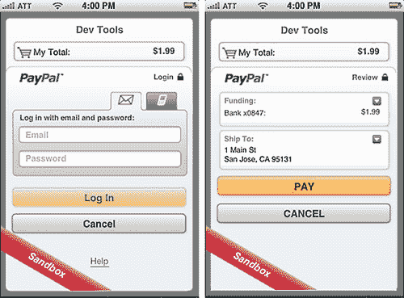
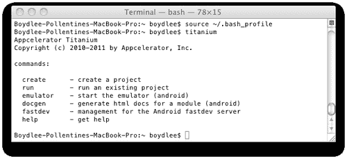
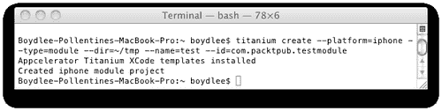
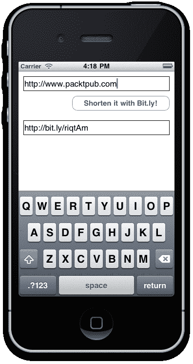

# 第十章。使用自定义模块扩展您的应用

在本章中，我们将涵盖：

+   集成现有模块——PayPal 移动支付库

+   准备您的 iOS 模块开发环境

+   使用 XCode 开发新的 iPhone 模块

+   创建一个公共 API 方法

+   使用测试工具包打包和测试您的模块

+   打包您的模块以进行分发和销售

# 简介

虽然 Titanium 允许你创建几乎跨平台的 app，但不可避免的是，某些设备将固有地具有特定于它们的操作系统和硬件差异（尤其是在 Android 和 iOS 之间）。例如，任何使用过 Android 和 iPhone 设备的人都会立即认识到通知系统设置方式非常不同。然而，还有其他特定于平台的限制，这些限制非常具体于 Titanium API。

在本章中，我们将讨论构建和将模块集成到您的 Titanium 应用程序中，以 iOS 平台为例。使用 Java 开发 Android 模块的方法非常相似，然而，为了我们的目的，我们只会集中开发使用 Objective-C 和 XCode 为 iOS 开发的模块。

# 集成现有模块——PayPal 移动支付库

已经有许多模块是为 Titanium 平台编写的，包括 Appcelerator 本身和整个社区。甚至还有一个全新的开放移动市场，您可以在那里购买（和出售）模块，以将平台扩展到更高、更远的新高度！

## 准备工作

在您能够下载和使用 PayPal 移动支付库之前，您首先需要注册 Titanium + Commerce 计划。您可以在 [`www.appcelerator.com/products/titaniumcommerce/`](http://www.appcelerator.com/products/titaniumcommerce/) 上免费注册。填写完所需表格后，只需将名为 Titanium+Commerce MPL for Paypal Module for iOS 的 ZIP 文件下载到您的计算机硬盘上即可。

您还必须将您的应用程序注册到 PayPal，注册后您将获得一个应用程序 ID，您必须在您的 Titanium 项目中引用该 ID。您可以从 [`www.paypal.com`](http://www.paypal.com) 注册应用程序 ID。请注意，应用程序 ID 的注册还要求您成为 PayPal 会员，因此如果您之前尚未注册，您可能需要先注册。

### 注意

本食谱的完整源代码可以在 `/Chapter 10/Recipe 1` 文件夹中找到。

## 如何操作…

首先，您需要将 Paypal 模块文件复制到 Titanium 安装下的 `modules` 文件夹中。在 OSX 上，这通常位于 `/Library/Application Support/Titanium/modules`。在模块下应该已经有一个名为 "iphone" 的子文件夹。如果没有，现在创建一个，然后解压模块文件，以便最终得到一个位于 `/Library/Application Support/Titanium/modules/iphone/ti.paypal` 的 `ti.paypal` 文件夹。快速浏览一下这个文件夹。您应该立即注意到它下面的第一个子文件夹被命名为 "1.0" 或可能是 "1.2"。这是您刚刚安装的模块的版本号。请仔细注意并记下来，因为这将非常重要。

完成上述步骤后，需要编辑您项目的 `tiapp.xml` 文件，以便模块部分包括我们的 `ti.paypal` 模块。此引用告诉 Titanium Studio 编译器在构建项目时添加模块。通过在 "guid" 元素下添加以下行来扩展 `tiapp.xml` 文件。请确保模块版本号与您刚刚安装的 `ti.paypal` 库的版本号匹配。

```java
<modules>
<module version="1.0">ti.paypal</module>
</modules>

```

现在，回到您的 `app.js` 文件中，我们需要在 JavaScript 的顶部包含模块引用，如下所示：

```java
Ti.Paypal = require('ti.paypal');

```

现在，我们可以使用这个新的变量对象来创建 PayPal 支付按钮对象并将其添加到窗口中。PayPal 库还包括一些事件监听器来处理支付成功、错误和取消事件。以下是如何使用 PayPal 库为美国红十字会进行支付捐赠的示例，该示例取自 Appcelerator KitchenSink 示例：

```java
var ppButton = Ti.Paypal.createPaypalButton({
width: 294,
height: 50,
bottom: 50,
appId: "YOUR_PAYPAL_APP_ID",
buttonStyle: Ti.Paypal.BUTTON_294x43,
paypalEnvironment: Ti.Paypal.PAYPAL_ENV_SANDBOX,
feePaidByReceiver: false,
transactionType: Ti.Paypal.PAYMENT_TYPE_DONATION,
enableShipping: false,
payment: {
amount: win.data.amt,
tax: 0.00,
shipping: 0.00,
currency: "USD",
recipient: "osama@x.com",
itemDescription: "Donation",
merchantName: "American Red Cross"
}
});
ppButton.addEventListener("paymentCanceled", function(e){
Ti.API.info("Payment Canceled");
});
ppButton.addEventListener("paymentSuccess", function(e){
Ti.API.info("Success");
win.fireEvent("completeEvent", {data: win.data, transid: e.transactionID});
});
ppButton.addEventListener("paymentError", function(e){
Ti.API.info("Payment Error");
});

```

如果您已正确安装模块并正确更新了 `tiapp.xml` 文件，您应该会看到一个消息说“检测到第三方模块：[模块名称]/[模块版本]”。在我们的情况下，这将表明它已检测到 `ti.paypal` 模块。

以下是一个示例，展示了红十字会应用程序运行并使用 Titanium 的 PayPal 模块。此示例代码是本食谱的一部分。



## 它是如何工作的…

一旦您的模块被复制到模块目录并在 `tiapp.xml` 中引用，您就可以像使用任何其他原生 Titanium JavaScript 一样使用它。所有模块的公共方法和属性都已由模块的开发者提供给您。

更具体地说，针对我们的 PayPal 模块，一旦买家点击您应用中的“Paypal”购买按钮，就会显示支付结账流程。每当发生重要事件（例如，支付成功）时，这些事件都会被 Titanium 通过以下事件处理器抛出和捕获。您的应用程序需要包含这三个处理器：

```java
ppButton.addEventListener("paymentCanceled", function(e){
Titanium.API.info("Payment Canceled");
});
ppButton.addEventListener("paymentSuccess", function(e){
Titanium.API.info("Payment Success. TransactionID: " +
e.transactionID);
});
ppButton.addEventListener("paymentError", function(e){
Titanium.API.info("Payment Error");
Titanium.API.info("errorCode: " + e.errorCode);
Titanium.API.info("errorMessage: " + e.errorMessage);
});

```

当支付成功传输后，一个交易 ID 将返回到你的 "paymentSuccess" 事件监听器。需要注意的是，在这个例子中我们使用的是 Paypal 沙盒（测试）环境，对于实际应用，你需要将 `paypalEnvironment` 变量更改为 `Ti.PayPal.PAYPAL_ENV_LIVE`。在沙盒环境中，不会实际转账。

## 更多内容…

尝试在 PayPal 模块中实验不同的属性。以下是最有用的属性及其常量值列表：

| `buttonStyle` | PayPal 按钮的大小和外观，可用值有：Titanium.Paypal.BUTTON_68x24Titanium.Paypal.BUTTON_118x24Titanium.Paypal.BUTTON_152x33Titanium.Paypal.BUTTON_194x37Titanium.Paypal.BUTTON_278x43Titanium.Paypal.BUTTON_294x43 |
| --- | --- |
| `paypalEnvironment` | 可用值有：Titanium.Paypal.PAYPAL_ENV_LIVETitanium.Paypal.PAYPAL_ENV_SANDBOXTitanium.Paypal.PAYPAL_ENV_NONE |
| `feePaidByReceiver` | 这仅在交易类型为 Personal 时适用。可用值有：truefalse |
| `transactionType` | 正在进行的付款类型（付款是为了什么）。可用值有：Titanium.Paypal.PAYMENT_TYPE_HARD_GOODSTitanium.Paypal.PAYMENT_TYPE_DONATIONTitanium.Paypal.PAYMENT_TYPE_PERSONALTitanium.Paypal.PAYMENT_TYPE_SERVICE |
| `enableShipping` | 是否选择/发送运输信息。可用值有：truefalse |

# 准备你的 iOS 模块开发环境

在你开始开发自己的自定义 iOS 模块之前，你首先需要正确设置你的环境。这包括在你的 Titanium SDK 路径中设置对 `titanium.py` 脚本的别名。

## 准备工作

以下说明仅适用于 Mac OSX。你可以在 Linux、Windows 以及 OSX 上开发 Android 模块。然而，在这个菜谱中，我们将专注于 iOS 模块开发，这需要一个运行 OSX 10.5 或更高版本的 Apple Mac。

## 如何操作…

1.  打开 **终端** 应用程序，你可以在 **应用程序** | **实用工具** | **终端** 下找到它。

1.  输入 `cd $HOME` 并按 *Enter* 键。

1.  输入 `vi .bash_profile` 并按 *Enter* 键。如果你之前没有创建过 `bash_profile`，那么现在你会创建一个新文件，否则它将加载你的现有 `bash_profile` 脚本。

1.  在你的脚本中添加以下行："`alias titanium='/Library/Application\ Support/Titanium/mobilesdk/osx/1.7.2/titanium.py'`"—其中 1.7.2 是你目前安装的 Titanium SDK 的最新版本。请仔细注意并确保你的 Titanium SDK 路径正确，并且路径位置被单引号包围。

1.  按下 *Esc* 键保存文件，然后输入 "`:wq`"。这将保存你的文件并退出编辑器。

1.  回到终端，输入 "`source ~/.bash_profile`" 并按 *Enter* 键。

1.  现在输入 "`titanium`" 并按 *Enter*。如果你已经正确设置了脚本，你将在终端窗口中看到 Appcelerator 的输出，就像以下截图所示。

1.  保持终端窗口打开，因为它将在下一个菜谱中需要：



为了测试你的环境是否已经正确设置，请在终端窗口中输入以下内容：

```java
titanium create --platform=iphone --type=module --dir=~/tmp --name=test --id=com.packtpub.testmodule

```

如果一切顺利，你将在终端窗口中看到以下输出。你可以通过在 finder 中导航到 `/tmp/test` 目录来验证此脚本创建的文件（注意，`tmp` 目录将在你的用户账户的 `Home` 文件夹下）。



## 它是如何工作的…

实际上，我们在这里所做的只是设置一种从控制台使用别名执行 Titanium 脚本的方式。这意味着我们可以使用像 "titanium create" 这样的简单命令，而不是尝试通过在终端中执行冗长的命令来手动完成相同的事情。

# 使用 XCode 开发新的 iPhone 模块

为 Titanium 开发我们自己的自定义模块使我们能够利用本地代码，并让 Titanium 执行它原本无法执行或至少目前无法执行的事情。在这个菜谱中，我们将开发一个小模块，该模块使用 `Bit.ly` 来缩短长 URL。你可以在任何 iOS 应用程序中需要创建短 URL 时使用此模块（例如，在 Twitter 上发布链接时）。

## 准备工作

你首先需要按照前一个菜谱中描述的步骤设置你的 Mac。确保你遵循这些步骤并且系统设置正确，因为这个菜谱在很大程度上依赖于这些脚本的正常工作。你还需要对这个菜谱有一定的 Objective-C 知识。这本书不会以任何方式教授 Objective-C，因为已经有足够多的重量级书籍了。然而，你应该能够跟随这个菜谱中的代码，以便让我们的示例模块正常工作。

## 如何操作…

首先，让我们使用之前菜谱中使用的相同脚本创建基本模块。在终端窗口中，输入以下内容（将 `/Projects` 目录替换为你希望创建模块的目录）：

```java
titanium create --platform=iphone --type=module --dir=~/Projects --name=BitlyModule --id=com.packtpub.BitlyModule

```

现在在 Finder 中打开 `/Projects/BitlyModule` 目录，你将看到主要是标准外观的 XCode 项目文件列表。双击 `BitlyModule.xcodeproj` 文件以在 XCode 中打开它进行编辑。

## 它是如何工作的…

以下信息直接来自 Appcelerator 指南（可在 [`wiki.appcelerator.org/display/guides/Module+Developer+Guide+for+iOS`](http://wiki.appcelerator.org/display/guides/Module+Developer+Guide+for+iOS) 查找）并且是了解 Titanium 模块架构的良好入门。

模块架构包含以下关键接口组件：

1.  **代理**：一个基类，代表你的 JavaScript 代码和本地代码之间的原生绑定。

1.  **ViewProxy**：一种专门化的代理，知道如何渲染视图。

1.  **View**：Titanium 可以渲染的 UI 组件的视觉表示。

1.  **Module**：描述特定 API 集或命名空间的特殊类型的代理。

当构建一个模块时，你只能有一个模块类，但你可以有零个或多个代理（Proxies）、视图（Views）和`ViewProxies`。

对于每个`View`，你需要一个`ViewProxy`。`ViewProxy`代表模型数据（如果视图需要释放，则数据保存在代理内部），并负责公开视图支持的 API 和事件。

当你想在 JavaScript 和本地之间返回非视觉数据时，你会创建一个代理。代理知道如何处理任何方法、属性分配和事件触发。

# 创建公共 API 方法

Titanium 在模块创建过程中创建的示例模块代码已经为我们提供了一个公共方法的示例。我们虽然会创建自己的，但这个方法接受一个单个的字符串输入值（即“长”URL），然后通过`Bit.ly` API 处理短 URL，最后将其返回到我们的 Titanium 应用程序中。

## 准备工作

在您可以使用模块之前，您需要注册一个 Bitly API 密钥，您可以在[`bitly.com/a/sign_up?rd=/a/your_api_key`](http://https://bitly.com/a/sign_up?rd=/a/your_api_key)免费注册。

此外，我们还需要 Objective-C 的开放源代码 SBJSON 框架，它能够原生地读取和写入 JSON 格式的数据流。您可以从[`github.com/stig/json-framework/`](http://https://github.com/stig/json-framework/)下载 SBJSON 框架。

### 注意

本食谱的完整源代码可以在`/Chapter 10/Recipe 4`文件夹中找到。

## 如何实现…

首先，解压 SBJSON 框架，并将 Finder 中的`Classes`文件夹中的所有文件拖到您的模块 XCode 项目的`Classes`文件夹中。

打开`ComPacktpubBitlyModuleModule.h`文件，确保它看起来如下（忽略文件顶部的头注释）：

```java
#import "TiModule.h"
#import <Foundation/Foundation.h>
@interface ComPacktpubBitlyModuleModule : TiModule
{
}
@end

```

现在打开`ComPacktpubBitlyModuleModule.m`文件，确保它看起来如下源代码（忽略文件顶部的头注释）。请记住，将 URL 的`QueryString`部分的`login`和`key`值替换为`Bit.ly` API 分配给你的值：

```java
#import "ComPacktpubBitlyModuleModule.h"
#import "TiBase.h"
#import "TiHost.h"
#import "TiUtils.h"
#import "SBJson.h"
#import "SBJsonParser.h"
@implementation ComPacktpubBitlyModuleModule
#pragma mark Internal
// this is generated for your module, please do not change it
-(id)moduleGUID
{
return @"a33e440e-ef62-4ec7-89cd-8939d264e46e";
}
// this is generated for your module, please do not change it
-(NSString*)moduleId
{
return @"com.packtpub.BitlyModule";
}
#pragma mark Lifecycle
-(void)startup
{
// this method is called when the module is first loaded
// you *must* call the superclass
[super startup];
NSLog(@"[INFO] %@ loaded",self);
}
-(void)shutdown:(id)sender
{
// this method is called when the module is being unloaded
// typically this is during shutdown. make sure you don't
do too
// much processing here or the app will be quit forceably
// you *must* call the superclass
[super shutdown:sender];
}
#pragma mark Cleanup
-(void)dealloc
{
// release any resources that have been retained by the module
[super dealloc];
}
#pragma mark Internal Memory Management
-(void)didReceiveMemoryWarning:(NSNotification*)notification
{
// optionally release any resources that can be dynamically
// reloaded once memory is available - such as caches
[super didReceiveMemoryWarning:notification];
}
#pragma mark Listener Notifications
-(void)_listenerAdded:(NSString *)type count:(int)count
{
if (count == 1 && [type isEqualToString:@"my_event"])
{
// the first (of potentially many) listener is being added
// for event named 'my_event'
}
}
-(void)_listenerRemoved:(NSString *)type count:(int)count
{
if (count == 0 && [type isEqualToString:@"my_event"])
{
// the last listener called for event named 'my_event' has
// been removed, we can optionally clean up any resources
// since no body is listening at this point for that event
}
}
#pragma Public APIs
-(id)example:(id)args
{
// example method
return @"hello world";
}
///creates the short url from bitly
- (id)getShortUrl:(id)value
{
NSString *baseURLString = @"http://api.bit.ly/shorten?version=2.0.1&longUrl=";
NSString *longUrl = [TiUtils stringValue:value];
longUrl = [longUrl stringByReplacingOccurrencesOfString:@"("
withString:@""];
longUrl = [longUrl stringByReplacingOccurrencesOfString:@—)—
withString:@""];
longUrl = [longUrl stringByReplacingOccurrencesOfString:@"\""
withString:@""];
longUrl = [longUrl
stringByTrimmingCharactersInSet:[NSCharacterSet
whitespaceAndNewlineCharacterSet]];
baseURLString = [baseURLString
stringByAppendingString:longUrl];
baseURLString = [baseURLString
stringByAppendingString:
@"&login=REPLACE_YOUR_LOGIN&apiKey=REPLACE_YOUR_KEY"];
NSURL* baseURL = [[NSURL alloc]
initWithString:baseURLString];
NSMutableURLRequest *req = [[NSMutableURLRequest alloc]
initWithURL:baseURL];
NSHTTPURLResponse* urlResponse = nil;
NSError *error = [[[NSError alloc] init] autorelease];
NSData *data = [NSURLConnection sendSynchronousRequest:req
returningResponse:&urlResponse error:&error];
if ([urlResponse statusCode] >= 200 && [urlResponse
statusCode] < 300)
{
NSLog(@"Got a response from bit.ly");
SBJsonParser* jsonParser = [SBJsonParser new];
NSString* jsonString = [[NSString alloc]
initWithData:data encoding:NSUTF8StringEncoding];
NSDictionary* dict = (NSDictionary*)[jsonParser
objectWithString:jsonString];
[jsonString release];
[jsonParser release];
NSString *statusCode = [dict
objectForKey:@"statusCode"];
if([statusCode isEqualToString:@"OK"])
{
// retrieve shortURL from results
NSLog([dict description]);
NSString *shortURL = [[[dict
objectForKey:@"results"]
objectForKey:longUrl]
objectForKey:@"shortUrl"];
return shortURL;
}
else
{
return @"Unable to shorten this URL,
please check its format.";
}
}
return baseURLString;
}
@end

```

## 它是如何工作的…

这里的主函数是我们创建的，称为`getShortUrl`。模块的所有其他方法和属性都由 Titanium 模块创建脚本为我们自动生成。简而言之，此方法执行对`Bit.ly` API 的请求，使用我们的密钥和用户名，当收到响应时，使用 SBJSON 解析器进行解析。然后从 JSON 结果的`shortURL`元素中提取出`shortURL`变量（`NSString`类型），并将其返回到 Titanium。

我们在这里想要关注的是 Titanium 公共方法的集成以及“value”参数的转换。在这里，我们使用`(id)`声明，这使得我们可以轻松地将传入的值转换为 Objective-C 理解的参数类型。在这种情况下，我们将“value”参数转换为`NSString`类型，因为我们知道传入的参数将是一个格式为网址的字符串值。这个转换过程要归功于**TiUtils**，我们在文件顶部使用`#import "TiUtils.h"`命令导入。

一些最常见的转换示例包括：

```java
CGFloat f = [TiUtils floatValue:arg];
NSInteger f = [TiUtils intValue:arg];
NSString *value = [TiUtils stringValue:arg];
NSString *value = [TiUtils stringValue:@"key" properties:dict def:@"default"];
TiColor *bgcolor = [TiUtils colorValue:arg];

```

我们还返回一个字符串值，它要么是错误消息（如果`Bit.Ly`转换过程失败），要么是希望中的新短网址，这是`Bit.Ly`友好地提供的。由于我们返回的是字符串，我们不需要在返回参数之前执行转换。

以下类型可以在不进行类型转换的情况下返回：

+   `NSString`

+   `NSDictionary`

+   `NSArray`

+   `NSNumber`

+   `NSDate`

+   `NSNull`

# 使用测试工具包打包和测试你的模块

现在是时候构建、打包和测试我们的新模块了！在你继续这个菜谱之前，确保你已经构建了 XCode 项目并且它已经成功。如果没有，你需要在继续之前修复任何错误。

### 注意

此菜谱的完整源代码可以在`/Chapter 10/Recipe 5`文件夹中找到。

## 如何做到这一点...

打开你的模块的`app.js`示例文件，你可以在模块项目的`example`目录中找到它。用以下源代码替换现有的示例内容：

```java
// This is a test harness for your module
// You should do something interesting in this harness
// to test out the module and to provide instructions
// to users on how to use it by example.
// write your module tests here
var bitlymodule = require('com.packtpub.BitlyModule');
Ti.API.info("module is => " + bitlymodule);
// open a single window
var window = Ti.UI.createWindow({
backgroundColor:'white'
});
var txtLongUrl = Ti.UI.createTextField({
top: 10,
left: 10,
width: 300,
height: 30,
borderStyle: 1,
hintText: 'Enter your long url...'
});
window.add(txtLongUrl);
var btnShorten = Ti.UI.createButton({
title: 'Shorten it with Bit.ly!',
width: 200,
right: 10,
height: 30,
top: 50
});
btnShorten.addEventListener('click', function(e){
var result = bitlymodule.getShortUrl(txtLongUrl.value);
txtShortUrl.value = result;
});
window.add(btnShorten);
var txtShortUrl = Ti.UI.createTextField({
top: 100,
left: 10,
width: 300,
height: 30,
borderStyle: 1,
hintText: 'Your short url appears here...'
});
window.add(txtShortUrl);
window.open();

```

现在，回到终端，更改目录，确保你位于你的`BitLyModule`目录中（假设你仍然从之前的菜谱中打开了终端窗口，你应该已经在那里了）。

在终端中输入`./build.py`，然后按*Enter*键执行命令。当它完成后，输入`titanium run`并按*Enter*键。如果一切顺利，你应该在 20 或 30 秒后看到 iPhone 模拟器启动，我们的示例 Titanium 应用程序可见，它由两个`TextFields`和`BitLy`转换按钮组成。在第一个`TextField`中输入一个长网址，然后按**使用 Bit.ly 缩短它！**，如以下截图所示：



## 它是如何工作的…

让我们集中精力研究用于通过示例项目构建和启动我们的模块的 Titanium 代码。正如你所看到的，我们样本 JavaScript 中的第一行非常关键：

```java
var bitlymodule = require('com.packtpub.BitlyModule');

```

此代码实例化我们的模块，并将其定义为名为`bitlymodule`的新变量。然后我们可以像使用任何其他常规 Titanium 控件一样使用我们的模块，通过调用我们自己的自定义方法，并在将其显示在`shortURL`文本字段之前返回结果：

```java
var result = bitlymodule.getShortUrl(txtLongUrl.value);
txtShortUrl.value = result;

```

# 打包你的模块以进行分发和销售

Titanium 模块是以便于分发和重用的方式创建的，无论是在您自己的应用程序中还是在 Titanium+Plus 市场中。在本食谱中，我们将介绍打包您的模块并将其分发给市场的步骤。

### 注意

本章的完整源代码可以在`/Chapter 10`文件夹中找到，包括`Bit.Ly`模块的编译版本。

## 如何操作...

第一项要求是编辑在创建模块时自动生成的清单文件。以下是一个从我们的`BitlyModule:`中摘取的示例：

```java
version: 0.1
description: My module
author: Your Name
license: Specify your license
copyright: Copyright (c) 2011 by Your Company
# these should not be edited
name: bitlymodule
moduleid: com.packtpub.BitlyModule
guid: a33e440e-ef62-4ec7-89cd-8939d264e46e
platform: iphone
minsdk: 1.7.2

```

在`# these should not be edited`行以下的内容不应被编辑，但请将所有其他键值对替换为您自己的姓名、描述、许可、版本和版权文本。一旦您完成编辑清单文件，请通过在终端中输入`./build.py`来重新构建您的模块，并按*Enter*键执行命令。

您的模块现在已准备好用于您自己的项目或手动分发。只需将 ZIP 文件的内容复制到`/Library/Application/ Support/Titanium`目录中即可安装。当然，您仍然需要在`app.js`文件中使用`require`方法调用包含您的模块，并且您需要在`tiapp.xml`文件中引用它，就像在本章的第一个食谱中为移动 PayPal 库所做的那样。

您可以使用在构建过程中创建的相同 ZIP 文件包将您的模块分发到 Open Mobile 市场。然而，在您能够分发之前，您需要满足以下几个先决条件：

1.  您必须拥有有效的 Titanium 开发者账户。

1.  您必须完全填写您的清单值。

1.  您的项目中`LICENSE`文件必须包含有效的许可文本。

1.  您的项目文档目录中的`index.md`文件必须包含有效的文档文件。

1.  在上传时，您必须指定一些额外的元数据，例如价格（可以是免费的）。

1.  如果您对模块收费，您必须与 Appcelerator 建立支付设置，以便您能收到付款。

1.  您必须接受 Titanium+Plus 市场服务条款协议。

一旦您上传了模块并完成了必要的提交步骤，您的模块将可供市场目录使用。请注意，第一次提交模块时，Appcelerator 将对上述基本要求进行审核。

## 它是如何工作的...

新的 Appcelerator 市场使开发者能够轻松地构建、销售和分发他们自己的自定义 Titanium 模块，适用于 iOS 和 Android。您需要做的只是为您的产品设置一个配置文件，并提供您的 PayPal 账户详细信息，以便为每次销售获得付款。

开发者通过开放移动市场销售了他们 70%的产品，并且有众多工具可供追踪您的客户、发票和反馈。您今天就可以在[`marketplace.appcelerator.com/cms/landing`](http://https://marketplace.appcelerator.com/cms/landing)注册。
