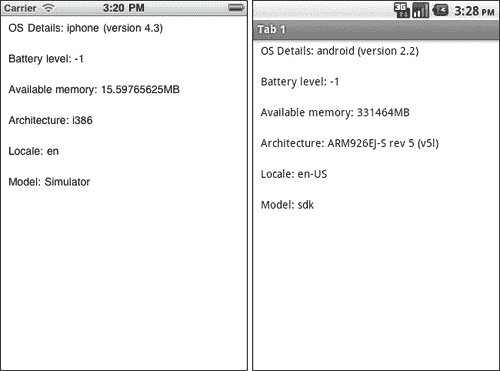
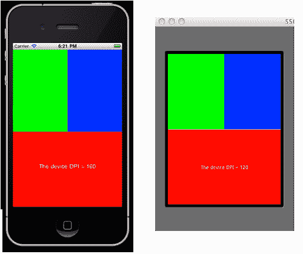
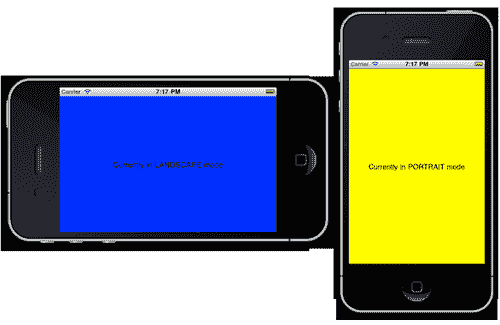
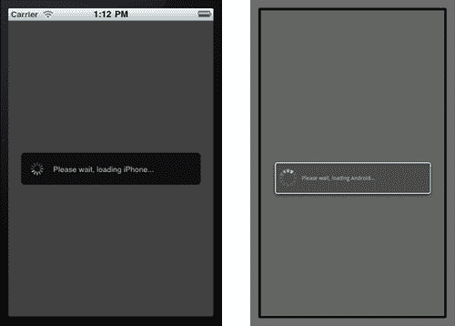
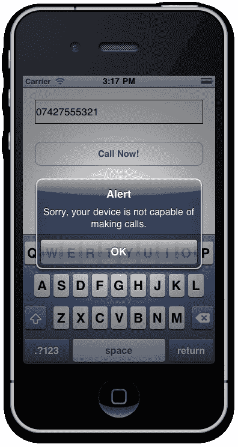

# 第十一章. 平台差异、设备信息和怪癖

在本章中，我们将涵盖：

+   收集有关设备的信息

+   获取设备的屏幕尺寸

+   理解设备方向模式

+   在 iOS 和 Android API 之间的差异中进行编码

+   确保你的设备可以打电话

# 简介

在本章中，我们将探讨 iOS 和 Android 之间的许多平台差异，并展示如何围绕这些差异进行编码。我们还将突出显示如何收集有关应用程序运行设备的详细信息，包括其屏幕尺寸和能力，例如打电话的能力。

### 注意

本章的完整源代码可以在`/Chapter 11/PlatformDiffs`文件夹中找到。

# 收集有关设备的信息

当前设备的大部分信息都可以通过`Titanium.Platform`命名空间获取。在这里，我们可以确定一系列与设备相关的数据，包括电池电量、设备操作系统和版本、当前设备语言、屏幕分辨率等等。了解这些信息非常重要，因为它会给你一系列关于物理设备上发生情况的线索。例如，如果电池电量下降到一定百分比以下，你可能希望备份用户的应用数据，以防设备关闭导致数据丢失。更常见的是，你会使用像`Titanium.Platform.osname`这样的设备属性来确定你的应用程序当前运行在什么操作系统上，比如 iPhone、iPad 或 Android。

## 准备工作

为了准备这个菜谱，打开 Titanium Studio 并登录，如果你还没有这样做的话。如果你需要注册新账户，你可以在应用程序内部免费注册。登录后，点击**新建项目**，创建新项目的详细信息窗口将出现。将应用程序名称输入为**PlatformDiffs**，并填写其他详细信息。打开`app.js`文件，删除除了根窗口实例化和`win1`对象的 open 方法之外的所有内容，使其看起来如下所示：

```java
//
// create root window
//
var win1 = Titanium.UI.createWindow({
title:'Tab 1',
backgroundColor:'#fff'
});
//open root window
win1.open();

```

### 注意

本菜谱的完整源代码可以在`/Chapter 11/Recipe 1`文件夹中找到。

## 如何操作…

现在，回到`app.js`文件，我们将简单地创建一些标签，并从`Titanium.Platform`命名空间中可用的属性请求每个标签的值。然后，这些值将作为屏幕上的文本显示：

```java
var labelOS = Titanium.UI.createLabel({
width: 'auto',
height: 30,
top: 0,
left: 10,
font: {fontSize: 14, fontFamily: 'Helvetica'},
color: '#000',
text: 'OS Details: ' + Titanium.Platform.osname + ' (version ' + Titanium.Platform.version + ')'
});
var labelBattery = Titanium.UI.createLabel({
width: 'auto',
height: 30,
top: 40,
left: 10,
font: {fontSize: 14, fontFamily: 'Helvetica'},
color: '#000',
text: 'Battery level: ' + Titanium.Platform.batteryLevel
});
var labelMemory = Titanium.UI.createLabel({
width: 'auto',
height: 30,
top: 80,
left: 10,
font: {fontSize: 14, fontFamily: 'Helvetica'},
color: '#000',
text: 'Available memory: ' + Titanium.Platform.availableMemory + 'MB'
});
var labelArchitecture = Titanium.UI.createLabel({
width: 'auto',
height: 30,
top: 120,
left: 10,
font: {fontSize: 14, fontFamily: 'Helvetica'},
color: '#000',
text: 'Architecture: ' + Titanium.Platform.architecture
});
var labelLocale = Titanium.UI.createLabel({
width: 'auto',
height: 30,
top: 160,
left: 10,
font: {fontSize: 14, fontFamily: 'Helvetica'},
color: '#000',
text: 'Locale: ' + Titanium.Platform.locale
});
var labelModel = Titanium.UI.createLabel({
width: 'auto',
height: 30,
top: 200,
left: 10,
font: {fontSize: 14, fontFamily: 'Helvetica'},
color: '#000',
text: 'Model: ' + Titanium.Platform.model
});
win1.add(labelOS);
win1.add(labelBattery);
win1.add(labelMemory);
win1.add(labelArchitecture);
win1.add(labelLocale);
win1.add(labelModel);

```

## 它是如何工作的…

代码示例中的每个标签都代表有关你的设备及其功能的不同信息。这里的代码并没有什么特别复杂的地方，但重要的是这些方法本身。

大多数这些都是相当直观的。电池、内存、架构和型号的方法都为你提供了有关设备和其特定功能的信息。你可以在应用程序的生命周期中的某些时刻使用这些信息，例如，当电池达到某个临界水平时自动保存表单数据。

所有这些方法中最有用的是`Titanium.Platform.osname`。这是你在开发 Titanium 跨平台应用程序过程中会不断使用的方法，因为你将使用它来检查你是否在 iPhone 或 Android 平台上，如以下截图所示，并运行相应的代码。



# 获取设备的屏幕尺寸

虽然我们开发者目前对 iPhone 平台及其单一的 320x480 像素分辨率感到非常幸运，但对于 Android 平台来说，情况并非如此。特别是 Android 平台，由于它在众多制造商之间的分布方式，拥有多种不同的屏幕比例和分辨率。不可避免的是，你可能会遇到需要根据当前屏幕大小计算对象位置的情况，而不必不断依赖一系列`Titanium.Platform.osname`检查。

### 注意

自从 iPhone 4 的推出以来，所有新的 iOS 设备都配备了视网膜显示屏。本质上，屏幕分辨率仍然是 320x480，但 DPI 翻倍，这意味着有效分辨率实际上是 640x960。针对这两种分辨率进行实现非常简单。只需将所有图像文件命名为正常，然后所有双倍分辨率的文件都使用相同的方式命名，并添加一个`@2x`标志。所以如果你有一个名为`header.png`的图像，它是为 320x480 设计的，你可以创建一个大小加倍且命名为`header@2x.png`的图像，这将自动被所有 iOS 视网膜显示屏识别。

在这个菜谱中，我们将生成三个视图，一个占据屏幕下半部分，另外两个只占据顶部。我们将使用`Titanium.Platform.displayCaps`函数来实现这一点。

### 注意

这个菜谱的完整源代码可以在`/Chapter 11/Recipe 2`文件夹中找到。

## 如何实现…

在你的`app.js`文件中，我们将创建三个不同的视图，每个视图占据屏幕的一部分。删除任何现有的代码，并输入以下内容：

```java
//
// create root window
//
var win1 = Titanium.UI.createWindow({
title:'Tab 1',
backgroundColor:'#fff'
});
var windowWidth = Titanium.Platform.displayCaps.platformWidth;
var windowHeight = Titanium.Platform.displayCaps.platformHeight;
var viewBottom = Titanium.UI.createView({
width: windowWidth,
height: windowHeight / 2,
bottom: 0,
left: 0,
backgroundColor: 'Red'
});
win1.add(viewBottom);
var lblDeviceDPI = Titanium.UI.createLabel({
text: 'The device DPI = ' +
Titanium.Platform.displayCaps.dpi,
width: windowWidth,
height: windowHeight / 2,
textAlign: 'center',
bottom: 0,
color: '#fff'
});
viewBottom.add(lblDeviceDPI);
var viewTop1 = Titanium.UI.createView({
width: windowWidth / 2,
height: windowHeight / 2,
top: 0,
left: 0,
backgroundColor: 'Green'
});
win1.add(viewTop1);
var viewTop2 = Titanium.UI.createView({
width: windowWidth / 2,
height: windowHeight / 2,
top: 0,
left: windowWidth / 2,
backgroundColor: 'Blue'
});
win1.add(viewTop2);
//open root window
win1.open();

```

## 如何工作…

这里的代码相当简单。简单来说，我们正在将设备的宽度和高度值分配给两个名为`windowWidth`和`windowHeight`的变量。为此，我们正在使用`Titanium.Platform.displayCaps`命名空间中可用的两个属性；即`platformWidth`和`platformHeight`。一旦我们有了这些值，就很容易创建我们的视图并使用一些非常简单的计算来布局它们。

以下是在 iPhone 和 Android 上以两种非常不同的分辨率渲染相同屏幕的示例：



# 理解设备方向模式

对于当前智能手机用户来说，一个巨大的好处是能够以任何可能的方式握持设备，并且屏幕会旋转以适应其方向。Titanium 允许你根据应用中的方向变化来触发事件处理程序。

在这个菜谱中，我们将创建一个事件处理程序，每当设备上的方向发生变化时，它都会触发，并且我们将相应地重新排列屏幕上的某些 UI 组件。

### 注意

这个菜谱的完整源代码可以在`/Chapter 11/Recipe 3`文件夹中找到。

## 如何实现…

打开你的`app.js`文件，删除任何现有代码，并输入以下内容：

```java
//
// create root window
//
var win1 = Titanium.UI.createWindow({
title:'Tab 1',
backgroundColor:'#fff'
});
//set the allowed orientation modes for win1
//in this example, we'll say ALL modes are allowed
win1.orientationModes = [
Titanium.UI.LANDSCAPE_LEFT,
Titanium.UI.LANDSCAPE_RIGHT,
Titanium.UI.PORTRAIT,
Titanium.UI.UPSIDE_PORTRAIT
];
var view1 = Titanium.UI.createView({
width: Titanium.Platform.displayCaps.platformWidth,
height: Titanium.Platform.displayCaps.platformHeight,
backgroundColor: 'Blue'
});
var labelOrientation = Titanium.UI.createLabel({
text: 'Currently in ? mode',
width: '100%',
textAlign: 'center',
height: 30,
color: '#000'
});
view1.add(labelOrientation);
win1.add(view1);
Ti.Gesture.addEventListener('orientationchange', function(e) {
//check for landscape modes
if (e.orientation == Titanium.UI.LANDSCAPE_LEFT ||
e.orientation == Titanium.UI.LANDSCAPE_RIGHT) {
view1.width =
Titanium.Platform.displayCaps.platformWidth;
view1.height =
Titanium.Platform.displayCaps.platformHeight;
labelOrientation.text = 'Currently in LANDSCAPE mode';
view1.backgroundColor = 'Blue';
}
else {
//we must be in portrait mode!
view1.width =
Titanium.Platform.displayCaps.platformWidth;
view1.height =
Titanium.Platform.displayCaps.platformHeight;
labelOrientation.text = 'Currently in PORTRAIT mode';
view1.backgroundColor = 'Yellow';
}
});
//open root window
win1.open();

```



现在尝试在模拟器或设备上运行你的应用，并在横屏和竖屏模式之间调整屏幕方向。你应该会看到与之前截图中的变化类似的变化！

## 工作原理…

我们将一个事件监听器添加到`Ti.Gesture`中，一旦设备方向发生变化，这个事件处理程序就会被触发，我们可以根据需要重新排列屏幕上的组件。技术上，我们可以在这个处理程序中真正做任何我们想做的事情。一个很好的例子是在纵向模式下有一个`TableView`，当用户将屏幕旋转到横向模式时，打开一个包含`MapView`的新窗口。在这里，我们只是改变我们主要视图对象的颜色和其中标签的文本属性，以突出显示设备方向的变化。

# 在 iOS 和 Android API 之间的差异中进行编码

虽然 Appcelerator Titanium 使开发者对集成多个操作系统和设备的繁琐工作变得不可见，但仍然会有一些时候，你不得不编写一些特定平台的代码。最常见的方法是通过检查`Titanium.Platform`命名空间中的`osname`属性来实现。

在这个菜谱中，我们将创建一个简单的屏幕，当设备是 iPhone 时显示自定义活动指示器，当用户在 Android 设备上时显示标准指示器。

### 注意

这个菜谱的完整源代码可以在`/Chapter 11/Recipe 4`文件夹中找到。

## 如何实现…

打开你的`app.js`文件，删除任何现有代码，并输入以下内容：

```java
// create root window
var win1 = Titanium.UI.createWindow({
title: 'Tab 1',
backgroundColor: '#fff'
});
///this next bit is a custom activity indicator for iphone
///due to too many diffs between android and ios ones
var actIndIphone = Titanium.UI.createView({
width: 320,
height: 480,
backgroundColor: '#000',
opacity: 0.75,
visible: false
});
var actIndBg = Titanium.UI.createView({
width: 280,
height: 50,
backgroundColor: '#000',
opacity: 1,
borderRadius: 5
});
var indicatorIphone = Titanium.UI.createActivityIndicator({
width: 30,
height: 30,
left: 10,
top: 10,
color: '#fff',
style: 1
});
actIndBg.add(indicatorIphone);
var actIndLabel = Titanium.UI.createLabel({
left: 50,
width: 220,
height: 'auto',
textAlign: 'left',
text: 'Please wait, loading iPhone...',
color: '#fff',
font: {fontSize: 12, fontFamily: 'Helvetica'}
});
actIndBg.add(actIndLabel);
actIndIphone.add(actIndBg);
win1.add(actIndIphone);
//the important bit!
//check if platform is android and if so, show a normal dialog
//else show our custom iPhone one
if(Ti.Platform.osname == 'android')
{
var indicatorAndroid = Titanium.UI.createActivityIndicator({
title: 'Loading',
message: 'Please wait, loading Android...'
});
indicatorAndroid.show();
}
else
{
actIndIphone.visible = true;
indicatorIphone.show();
}
//open root window
win1.open();

```

现在在 Android 和 iPhone 模拟器中运行你的应用程序。你应该能够看出我们编写的代码已经识别出你正在运行的平台，并且在每个平台上以不同的方式显示活动指示器。

## 工作原理…

这个简单的菜谱展示了如何使用最简单的“if”语句来处理两个平台之间的差异，即通过使用`Titanium.Platform.osname`属性检查当前设备的`osname`。我们通过仅在 iPhone 上显示我们的自定义活动指示器视图来充分利用这个检查。在 Android 平台上，这是不必要的，因为活动指示器只需使用其`".show()"`方法就会作为模态视图出现在屏幕上所有其他视图之上。

您可以使用此属性在需要显示单独的 UI 组件或与平台无关的 API 集成时检查平台。以下截图显示了此菜谱在每种设备上的运行示例：



# 确保您的设备可以拨打电话

虽然现代智能手机集成了所有技术魔法和触摸屏的便利性，但很容易忘记它们的主要功能仍然是电话，能够进行和接收语音通话。然而，可能会有时候，由于某种原因（网络服务差、iPod touch 用户缺少电话功能等），用户的设备无法进行通话。

在这个菜谱中，我们将尝试通过首先检查设备的性能，并在无法实现时抛出一个错误信息来拨打一个电话。

### 注意

本菜谱的完整源代码可以在 `/第十一章/菜谱 5` 文件夹中找到。

## 如何操作...

打开您的`app.js`文件，删除任何现有代码，并输入以下内容：

```java
// create root window
var win1 = Titanium.UI.createWindow({
title: 'Tab 1',
backgroundColor: '#fff'
});
//create the textfield number entry to dial
var txtNumber = Titanium.UI.createTextField({
top: 20,
left: 20,
height: 40,
width: 280,
hintText: '+44 1234 321 231',
borderStyle: 1
});
win1.add(txtNumber);
//create our call button
var btnCall = Titanium.UI.createButton({
top: 90,
left: 20,
width: 280,
height: 40,
title: 'Call Now!'
});
//attempt a phone call
btnCall.addEventListener('click', function(e){
if(txtNumber.value != '')
{
if(Titanium.Platform.osname != 'ipad'
&& Titanium.Platform.model != 'iPod Touch'
&& Titanium.Platform.model != 'google_sdk'
&& Titanium.Platform.model != 'Simulator')
{
Titanium.Platform.openURL('tel:' + txtNumber.value);
}
else
{
alert("Sorry, your device is not capable of making calls.");
}
}
else
{
alert("You must provide a valid phone number!");
}
});
win1.add(btnCall);
//open root window
win1.open();

```

现在运行您的应用程序，无论是在模拟器中还是在无法拨打电话的设备上，例如 iPod Touch。您应该会看到一个弹窗出现，表明该设备无法执行所请求的电话呼叫。

## 工作原理…

在这里，我们只是使用 Titanium 平台命名空间来确定用户当前正在使用哪种设备，并在设备为 iPod、iPad 或模拟器时提供错误信息，如以下截图所示。如果所讨论的设备能够进行电话呼叫，例如 iPhone 或 Android 智能手机，那么将通过特殊 URL 请求的方式调用设备的电话 API：

```java
//must be a valid number, e.g. 'tel:07427555122'
Titanium.Platform.openURL('tel:' + txtNumber.value);

```

只要传入的电话号码有效，设备将启动拨号界面，并尝试代表用户进行通话。


