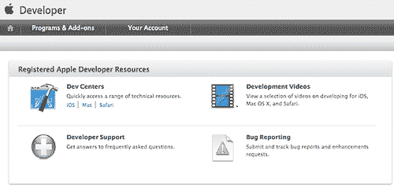

# 第十二章：准备您的应用程序进行分发和发布

在本章中，我们将涵盖：

+   加入 iOS 开发者计划

+   安装 iOS 开发者证书和配置文件

+   使用 Titanium Studio 构建您的 iOS 应用程序

+   加入 Google Android 开发者计划

+   创建您应用程序的分发密钥

+   构建并提交您的应用程序到 Android 市场

# 简介

我们开发难题的最后一部分是解决如何将我们的 Titanium 应用程序打包和分发到 iTunes 商店和 Android 市场，以便我们的潜在客户下载并享受我们所有的辛勤工作。每个商店都有自己的独立流程、认证和会员计划。

在本章中，我们将向您展示如何设置系统以备分发，以及如何注册每个网站，以及如何打包和提交您的应用程序到 iTunes 和 Android 市场。

# 加入 iOS 开发者计划

为了提交应用程序到 iTunes 商店，您必须首先付费成为苹果 iOS 开发者计划的会员。会员资格是付费的，起价为 99 美元（或等值货币），每年续费。即使您打算免费开发和分发应用程序，您仍然需要成为 iOS 开发者计划的付费会员。值得事先注意的是，只有 Mac 用户才能遵循和实施 iOS 食谱的步骤，因为 iOS 应用程序的构建和分发仅限于运行 Mac OSX 操作系统的用户。

## 如何操作…

要注册苹果的 iOS 计划，首先打开一个网页浏览器并导航到[`developer.apple.com/programs/register`](http://developer.apple.com/programs/register)，然后点击**开始**链接。随后加载的页面将询问您是否要创建一个新的 Apple ID 或使用现有的一个。除非您之前已经注册过苹果的一些开发者服务，否则您应该选择**创建新配置文件**链接。

一旦您进入**创建配置文件**页面：

1.  提供您的联系信息，包括您的居住国家。这很重要，因为当您开始销售付费应用程序时，您需要提供一些居住证明。

1.  在下一页，提供专业配置文件所需的信息。

1.  最后，仔细阅读并同意苹果设定的条款和条件，并确认您同意，且至少 18 岁（或您所在国家的法定年龄）。点击**我同意**按钮以完成账户创建。

1.  苹果将向您发送一封包含确认代码/链接的电子邮件。点击电子邮件中的此链接将在您的浏览器中打开并确认您的电子邮件地址并完成账户设置。

您现在应该能够在浏览器中看到以下页面。从这里开始，我们将注册开发者计划并支付 99 美元（或等值货币）的年度费用。



点击页面菜单左上角的**程序和附加组件**标签，这将带您到一个显示您当前订阅的会员列表的页面。假设您有一个新账户，那么应该会显示三个开发者计划的列表，每个列表右侧都有一个**今天加入**按钮。要继续，请按照以下步骤操作：

1.  点击 iOS 开发者计划的**今天加入**按钮，它应该出现在列表的顶部。

1.  在加载的下一页上，点击**立即注册**，然后继续直到到达逐步向导的步骤。

1.  从右侧列表中选择**我在苹果注册为开发者并希望加入付费的苹果开发者计划**。然后按**继续**。

1.  从这里，您需要提供所有要求您提供的信息以完成账户设置。您应该选择是否注册为商业用户或个人。请注意，无论您选择哪种注册方式，您都需要确保您拥有所有相关的文件。您将被要求提交这些文件以供苹果验证，并且您在收到并批准这些文件之前无法提交付费应用程序。一些信息不能更改，一旦您输入并完成申请，从所有意义上讲，它就固定下来了！

1.  最后，同意最终的条款和条件，然后在线支付。您需要一张信用卡或借记卡来完成这次购买。

现在，您应该可以通过在浏览器中导航到[`developer.apple.com/devcenter/ios`](http://developer.apple.com/devcenter/ios)来登录您的新苹果开发者账户。登录后，您应该在账户的主页上获得一些新的菜单选项，包括**配置**和**iTunes Connect**。您账户中缺失的任何信息都可以在 iTunes Connect 选项下的**合同、税务和银行**部分找到。在这个网站的部分，您可能需要不时上传一些文件并同意新的条款和条件。


# 安装 iOS 开发者证书和配置文件

构建您的应用程序需要两种类型的证书，这两种证书都用于设备调试和 iTunes 商店分发。第一种是您的开发证书。此证书安装在您的 Mac 中的`KeyChain`中，并用于您将开发的每一个应用程序。当您分发应用程序时，它识别您，即开发者。

第二种是应用程序的配置文件证书。此配置文件证书是针对特定应用程序和特定发布的。这意味着您需要为希望发布的应用程序的每个状态创建一个单独的配置文件（最常见的是开发和分发）。

在这个配方中，我们将通过创建和安装您的开发者证书，然后在 Titanium Studio 中创建和使用特定于应用程序的配置文件的过程。

## 如何操作...

我们现在将开始介绍安装 iOS 开发者证书和配置文件的步骤。

1.  设置您的 iOS 开发者证书。

1.  如果您尚未登录，请登录您的 Apple 开发者账户，访问 [`developer.apple.com/ios`](http://developer.apple.com/ios)，并点击 **iOS 配置文件门户** 链接。加载的页面将在左侧菜单中提供多个选项，点击 **证书** 选项。将加载一个包含一系列步骤的页面，标题为 **如何创建开发证书**。您需要严格按照描述的步骤进行操作，并且从开始到结束完成这些步骤后，您应该在您的 Mac 上保存一个证书签名请求 (CSR) 文件。对于这个配方，我们假设您已经仔细遵循了这些步骤，并将 CSR 保存到您的桌面。

1.  点击屏幕底部的 **选择** 按钮，从您的计算机中选择 CSR 文件并将其上传到网页。上传完成后，选择页面右下角的 **提交** 按钮。

    当屏幕重新加载时，您现在应该会在网格中看到一个证书出现，其名称与您生成时相同，状态为 **待发行**。如果您拥有 iOS 账户，您可以简单地等待 20-30 秒，然后刷新页面，状态将变为 **已发行**，并且在网格的右侧出现一个 **下载** 操作。如果您使用的账户属于另一方，您将需要等待他们确认此操作，您才能收到已发行的证书。现在下载证书，当下载完成时双击保存的文件。它将在 `KeyChain` 访问中自动打开，并显示它已被安装。如果您在页面底部有关于需要安装 WWDR 证书的消息，您也可以选择在此处下载并运行它。

1.  设置您的设备。

    如果您有一部 iPhone 或 iPod touch 并希望用它进行测试，那么您首先需要将该设备注册到您的 iTunes 账户。点击页面左侧的 **设备** 菜单链接，然后点击 **添加设备**。出现的屏幕将要求您提供有关设备所有者的信息，以及更具体地，该设备的唯一标识符是什么。您可以通过将设备连接到您的 Mac 并打开 iTunes 来找到此标识符。它将出现在 **我的 iPhone/iPod** 下方，然后点击出现的 **序列号** 标签。

    下面的截图显示了唯一标识符的示例：

    

    创建您的应用程序配置文件。

    现在你的开发者证书已经设置好了，是时候为我们的应用程序创建配置文件了。在这个例子中，我们将使用我们在 *第一章* 中构建的 **LoanCalc** 应用程序的详细信息。然而，你也可以使用你已创建的任何应用程序。

点击左侧菜单中的 **App IDs** 链接，当屏幕加载时，选择 **新建 App ID** 按钮。

给你的应用程序一个描述，并保持 Bundle Seed ID 下拉列表设置为 **生成新**。

输入 Bundle 标识符。这是你在 Titanium Studio 中创建应用程序时给出的至关重要的标识符。在这个例子中，我们的 bundle 标识符是 `com.packtpub.loancalc`。

按 **提交** 完成流程并生成你的 App ID。

现在点击 **配置** 并在屏幕加载后选择 **新建配置文件**。它应该激活了 **开发** 选项卡。

为你的配置文件选择一个名称。我们将保持简单，将其命名为 **LoanCalc 开发配置文件**。你现在应该能够勾选你的证书复选框，并从下拉列表中选择 `LoanCalc` 应用程序标识符，以及你希望用于此开发配置文件的设备。完成表单填写后，请按 **提交**。

你的新配置文件现在应该出现在 **开发** 选项卡下的配置文件列表中。等待 20-30 秒并刷新页面，其状态应该从 **挂起** 变为 **下载**。将证书下载到你的电脑上的某个位置，例如桌面。

重复之前的步骤，但选择 **分发** 选项卡而不是 **开发** 选项卡。在创建分发证书时，你还将有一个额外的选项：**分发：App Store 或 Ad Hoc**。如果你想将你的应用程序分发到 iTunes 商店，确保你选中了第一个单选按钮选项。

### 注意

如果你不是账户所有者，但被赋予了其他人的 iTunes 账户的成员资格（例如，如果你是大型公司的员工），那么你需要确保你已经获得了管理员访问权限，以便设置你的证书和配置文件。

# 使用 Titanium Studio 为 iOS 构建你的应用程序

在这个菜谱中，我们将继续之前两个菜谱中开始的过程，并为开发以及分发到 iTunes 商店构建我们的应用程序。

### 小贴士

记住，如果所有其他方法都失败了，你总是可以在 XCode 中手动构建你的应用程序，方法是通过导航到你的项目中的 `build/iphone` 文件夹并打开 XCode 项目文件。

## 如何做到这一点...

1.  为开发构建你的应用程序。

    i. 在 Titanium Studio 中打开你的项目；我们以第一章中的`LoanCalc`应用为例，然而，你可以使用任何你喜欢的项目。确保 Titanium Studio 中的应用程序 ID（在**编辑**选项卡上）与创建配置文件时使用的 ID 相匹配。在我们的例子中，这个 ID 是`com.packtpub.loancalc`。

    ii. 切换到**测试与打包**选项卡，并选择**在设备上运行**。Titanium Studio 应该自动突出显示 iPhone 选项。如果它没有，那么你可能不在 Mac 上（必需的）或者可能没有安装必要的 XCode 工具。你可以从[`developer.apple.com/xcode`](http://developer.apple.com/xcode)下载 XCode。

    iii. 在**上传配置文件**文本框旁边的文件选择图标上，选择为`LoanCalc`创建的开发配置文件。假设你已按照前面的步骤正确安装了 WWDR 证书和开发证书，你现在应该会看到一个类似于以下截图的屏幕：

    

    iv. 点击**完成**按钮，让 Titanium Studio 启动构建过程。在这个过程中，你的应用程序将被构建并添加到 iTunes 库中的应用列表中。你需要同步你的 iPhone 或 iPod Touch，以便在你的设备上运行你的应用程序。

1.  构建你的应用程序以进行分发。

    i. 首先，我们需要在 iTunes Connect 中创建你的新应用，在苹果开发者网站上。在浏览器中导航到苹果开发者网站的 iTunes Connect 部分，并点击**管理应用**。加载的下一屏将列出你当前的所有应用（如果你创建了的话）。要创建一个新的，请点击左上角的**添加新应用**。添加所需的信息，包括应用名称（在我们的例子中为**Packt LoanCalc**）并从产品标识符列表中选择`LoanCalc`应用。SKU 可以是任何你想要的代码，例如 packtpub001。在接下来的两个屏幕上填写有关描述、关键词、截图和应用程序数据的信息。完成之后，你应该会被转发到一个看起来像以下截图的屏幕：

    

    ii. 现在，如果你准备好了上传，请点击左下角的**查看详情**按钮，然后在加载的下一页上，点击屏幕右上角出现的**准备上传二进制文件**按钮。苹果将向你提出几个安全问题。回答这些问题后，你的应用状态将从**准备上传**变为**准备上传**。

    iii. 切换回 Titanium Studio，确保你的项目在项目资源管理器页面中被选中，然后选择**分发**按钮，接着选择**分发 - App Store**选项。

    iv. 你现在应该面对一个与之前用于开发测试打包应用程序的屏幕相似的屏幕。输入一个分发位置（任何都可以，我们在这个例子中选择了`下载`文件夹），并选择你从上一个菜谱中保存的分发配置文件。现在你的 Titanium Studio 中的**分发**屏幕应该看起来像这样：

    

    v. 点击**完成**按钮开始构建过程。如果你在`Users/[你的用户名]/Library/MobileDevice/Provisioning Profiles`目录中收到关于缺失文件的错误，那么只需将你电脑上保存的分发配置文件复制到这个目录，并将其重命名为错误对话框中缺失文件的名称。

    vi. 当这个过程完成后，XCode 应该加载，并且组织者窗口应该出现在屏幕上，你的应用程序已经存档并准备好提交到 iTunes 商店，如下面的截图所示：

    

    vii. 在这个屏幕上点击**提交**并按照提示操作。如果一切操作都正确（并且符合苹果的规定），你的应用程序应该被上传到 iTunes 服务器，你应在几分钟内收到确认邮件！

### 注意

你可以通过开发者程序网站上的 iTunes Connect 部分随时检查你的提交进度。通常需要 1-2 周的时间来批准。然而，这往往会根据提交的数量以及你的应用程序是否被拒绝或需要在批准前进行修改而波动。苹果将在提交周期的每个阶段给你发送电子邮件，包括你首次提交应用程序时、他们开始审查时以及他们批准或拒绝时。

# 加入谷歌 Android 开发者计划

为了将应用程序提交到 Android 市场，你必须首先注册一个谷歌账户，然后注册谷歌支付账户和 Android 开发者账户。所有这些账户都使用相同的用户名和密码组合，并且过程非常直接。会员资格是付费的，起价为 25 美元（或等值货币），并且是一次性支付。

## 如何操作…

要注册，首先打开一个网页浏览器并导航到[`market.android.com/publish`](http://market.android.com/publish)。你将被要求登录到你的谷歌账户（如下面的截图所示）。如果你还没有账户，那么这就是你需要创建账户的阶段。


完成登录或注册过程后，你将被要求提供你的开发者/出版商详细信息。之后，你将需要支付 25 美元的注册费。就这样——简单直接！你现在可以开始创建和上传应用程序到 Android 市场了。

### 小贴士

在注册几周后，Google 可能会发送一封电子邮件，要求您提供账户的身份证件，通常是护照或驾照。您可以在规定的时间内将此信息通过电子邮件发送给他们，一切都会顺利。

# 创建您应用程序的分发密钥

为了构建适用于 Android 市场的应用程序，您需要在您的本地计算机上创建一个分发密钥。此密钥用于对您的应用程序进行数字签名。

## 如何做到这一点…

如果您使用 Mac 或 Linux，请打开终端；如果您是 Windows 用户，请打开命令提示符。使用`cd`命令将当前目录更改为以下路径：

```java
cd /<path to your android sdk>/tools
//e.g. cd /Users/boydlee/android-sdk/tools

```

要创建密钥，我们需要使用位于此目录中的 Java **keytool**。在命令提示符/终端中，输入以下内容，同时将`my-release-key.keystore`和`alias_name`替换为您的应用程序的密钥和别名：

```java
Windows: START"Command $ keytool -genkey -v -keystore my-release-key.keystore -alias alias_name -keyalg RSA -validity 10000
Windows: Mac: Terminal $ keytool -genkey -v -keystore my-release-key.keystore -alias alias_name -keyalg RSA -validity 10000

```

例如，我们的`LoanCalc`应用程序密钥命令看起来可能如下：

```java
$ keytool -genkey -v -keystore packtpub.loancalc -alias loancalc -keyalg RSA -validity 10000

```

按下 *Enter* 并执行命令，您将会被问到一系列问题。您需要为 keystore 提供密码 - 智慧的做法是将其写下来，因为您稍后需要用它来打包应用程序。我们将使用密码`packtpub`。当您被提示输入二级密钥密码时，只需按下 *Enter* 使用相同的密码。

现在，您的密钥将被导出并保存到您当前所在的目录。在我们的例子中，这是 Android SDK 文件夹下的`tools`目录。您需要记住文件位置，以便在下一道菜谱中使用 Titanium Studio 构建 Android 应用程序。

# 构建并将您的应用程序提交到 Android 市场

在这道菜谱中，我们将继续在前两道菜谱中开始的过程，并构建我们的应用程序以分发到 Android 市场。

## 如何做到这一点…

在 Titanium Studio 中打开您的项目。我们以第一章中的`LoanCalc`应用程序为例，然而，您可以使用任何您希望的项目。确保您的项目在项目资源管理器页面中被选中，然后选择**分发**按钮，然后选择**分发 - Android**选项，如以下截图所示：


您需要输入分发位置（您希望保存打包的 APK 文件的位置）以及您在上一道菜谱中创建的 keystore 文件的位置，以及您之前提供的密码和别名。输入这些信息后，它应该看起来像以下截图：


如果所有信息都正确，点击**完成**。几分钟后，APK 文件将被写入你提供的分发位置。返回安卓市场网站，在主页上点击**添加新应用**。选择**上传**按钮，选择你保存的 APK 文件（在我们的例子中是`LoanCalc.apk`），并将其上传到服务器。如果一切顺利，你应该会看到一个类似于下面显示的屏幕：


现在剩下的只是填写剩余信息，包括应用描述和标题，以及一些截图。你还将被要求选择定价信息并同意谷歌的条款和条件。完成这些后，剩下的只是按下**提交**按钮。几分钟后，你的应用应该开始在安卓市场显示！与苹果不同，提交安卓应用不需要进行审核流程。

你现在应该能够构建并提交应用到苹果和安卓市场。
