# 第一章. Xcode 5 – 开发者的终极工具

随着 iOS 7 的发布，苹果也为开发者提供了一个完全更新的 Xcode 版本，即其 **集成开发环境**（**IDE**）。Xcode 5 是一个重大的进步，它提供了比以往任何时候都更多的工具和功能。

理解您 IDE 的强大功能是提高生产力和整体开发便捷性的关键。在本章中，我们将探讨所有这些新功能，并学习它们如何帮助您为 iOS 7 编写应用程序。

# 新的用户体验

Xcode 5 对其整体用户体验进行了许多受欢迎的改进，包括微妙的设计增强和底层优化。花几分钟时间尝试使用新的 IDE，您会发现尽管变化不大，但更干净的 UI 提供了一个更少干扰的工作环境。更短的工具栏和易于看到的突出按钮有助于将您的内容置于最前面。

以下截图显示了新 IDE 的窗口外观：

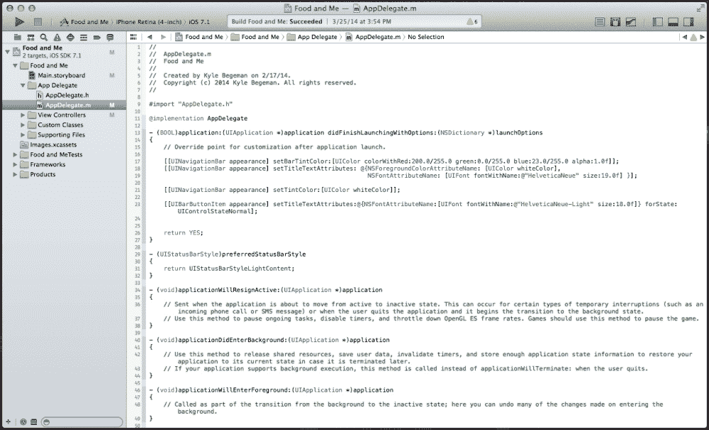

例如，Open Quickly 等功能在尺寸上进行了精简，但在功能上得到了改进。通过 **File** | **Open Quickly** 导航或使用键盘快捷键 *command* + *shift* + *O* 将在屏幕中间打开一个简化的单行搜索栏。随着您输入选项，搜索结果会更快地返回，并基于相关性进行优先排序。每个结果还提供了关于您的查询的详细数据，例如文件和行号。以下截图显示了搜索结果的一个示例：

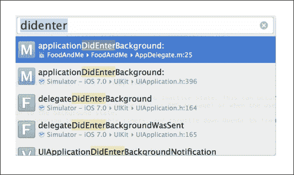

为了进行更精确的搜索，您可能需要从导航面板中选择搜索导航器或使用键盘快捷键 *command* + *3*。输入搜索查询并按 *enter* 键将提示 Xcode 5 默认执行项目范围内的搜索。结果将在搜索栏下方的导航器中显示，并包括新的细化选项。选择 **In Project** 按钮（在此处，`Project` 是您项目的名称）将允许您指定要搜索的单独文件夹。为了获得更大的灵活性，新的搜索导航器将允许您构建可保存供将来使用的自定义搜索范围。以下截图显示了选择和不选择 **In FoodAndMe** 按钮（在这种情况下，`FoodAndMe` 是项目名称）之间的差异：

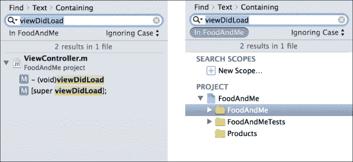

# 顶级文档

苹果公司提供了任何开发平台中最深入的 SDK 文档之一。访问这些文档可能是 iOS 开发最重要的方面之一。Xcode 的早期版本始终可以访问文档；然而，Xcode 5 通过其顶级文档采取了更易于访问的方法。需要注意的是，除非你从苹果公司预先下载文档，否则需要互联网连接。这可以通过导航到**Xcode** | **首选项** | **下载**来完成。

前往菜单栏，导航到**帮助** | **文档和 API 参考**。Xcode 5 将显示一个专门设计的窗口，用于简化所有文档的搜索和显示。苹果公司构建了这个文档，以便为你服务。当你键入时，Xcode 将显示 API 参考、SDK 指南甚至与你的搜索相关的**示例代码**的建议。

新的文档视图还提供了对标签的支持，允许你同时查看多个文档。当你浏览结果时，你可以通过点击搜索栏左侧的目录按钮立即看到动态目录。目录将根据你当前查看的文档自动更新。

此外，新的文档内置了书签功能，允许你保存你最常查看的资源。在搜索栏的右侧，你会看到一个分享按钮。点击此按钮将显示一个菜单，其中包含分享或书签当前参考的选项。

你可能也注意到了，在滚动文档时，每个标题或标题的左侧都有一个小的书签图标。你甚至可以保存任何 API 参考的特定部分，而不仅仅是保存整个文档。你所有的书签都可以通过点击位于目录按钮左侧的导航按钮在导航器中查看。这种视图还将允许你一目了然地浏览整个文档库。结合之前按*alt*键并点击任何代码以显示内联摘要和从代码到完整文档的链接的功能，你将拥有强大的文档集成！

# 调试器和调试仪表

由于调试器添加了许多新功能，Xcode 5 的调试功能得到了极大的改进。苹果公司已完全从之前的 GDB 引擎切换到更强大的 LLDB 引擎。这允许断点灵活性、内联变量预览以及更容易地找到变量值。

如果你曾经使用断点调试过项目，你会注意到 Xcode 5 管理断点的方式有所变化。断点仍然通过直接点击所需的行号来创建。然后可以通过直接点击它们或使用已移动到 Xcode 窗口底部的调试工具栏上的断点按钮来启用或禁用这些断点。

每个断点也可以配置为有条件地响应。默认情况下，代码会在达到断点时停止。然而，一旦设置了条件，除非满足这些条件，否则断点将被忽略。你可以通过右键单击单个断点并选择**编辑断点**来编辑这些条件。从这里，设置你的条件和结果操作。这些操作可以包括向控制台记录消息、运行 AppleScript 或 Shell Script，甚至播放声音。

Xcode 5 的调试器的另一个出色功能是能够在调试期间使用数据提示预览变量和对象。在调试你的应用程序时，将鼠标悬停在变量上，其值会自动出现在光标下方。这适用于标准数据类型，如字符串、数值类型和布尔类型。

当涉及到对象时，数据提示也非常强大。例如，在调试模式下，将鼠标悬停在一张图片上，就会显示有关此对象的信息摘要。选择眼睛形状的图标将允许你在代码中预览实际图片，如下面的截图所示：

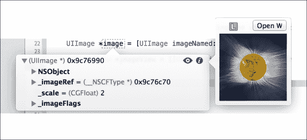

正确调试任何应用程序还涉及到监控系统资源，以确保你的代码尽可能优化。Xcode 5 引入了**调试仪表**，这是某些有用仪表工具的轻量级和嵌入式版本。因为调试仪表集成到 Xcode 5 中，所以它们能够在所有时间与应用程序并行运行，同时允许你观察 CPU、内存、iCloud、能源和 OpenGL ES 资源。

通过调试导航器可以找到调试仪表，一旦你运行了一个项目，它们就会自动开始运行。之前提到的资源以易于阅读的视觉图表形式显示，这样你可以一目了然地实时监控应用程序的性能。此外，访问完整的仪表软件只需单击一下，这可以通过点击以下截图所示的**在仪表中配置配置文件**按钮实现：

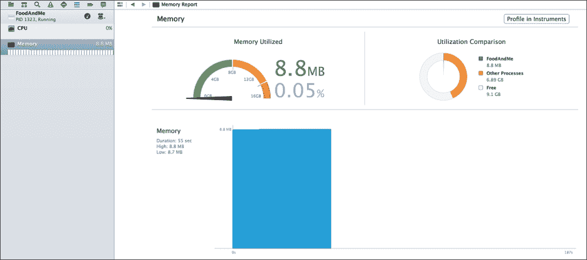

# 使用账户和功能进行自动配置

Apple 提供了各种有用的服务，这些服务可以包含在任何应用程序中。由于开发者需要手动设置的任务数量，使应用程序支持这些服务一直是一个麻烦。这包括添加权限，如 App ID、将框架链接到项目，以及将所需字段添加到项目的 `.plist` 文件中。此外，这些服务中的每一个都有自己的要求，这意味着支持多个服务需要不同的步骤来完成。

随着 Xcode 5 的推出，Apple 已经使用自动配置消除了这些烦恼。使用自动配置，开发者需要的只是一个与开发者账户关联的 Apple ID。

导航到 **Xcode** | **首选项** 并选择 **账户** 部分（Xcode 5 新增）。从这里，您可以添加所有您的开发者计划 Apple ID 并查看每个账户的相关详细信息。点击左侧面板上的 **+** 按钮将为您提供添加新 Apple ID 的选项。这样做将在 Xcode 5 和 Apple 开发者门户之间建立直接连接。一旦登录，点击屏幕右下角的 **查看详细信息...** 按钮。将弹出一个新窗口，显示所选账户附加的所有代码签名身份和配置文件详细信息。

在项目编辑器的 **常规** 选项卡下，您将在 **标识** 部分看到一个新的选项，**团队**。选择此选项将显示与我们之前添加的账户相关的身份列表。通过选择您的相应签名身份，Xcode 5 将能够验证您是否拥有所有适当的配置文件，并在需要时甚至可以为您创建它们。

自动配置提供的最大进步可能是项目编辑器中的 **功能** 选项卡（Xcode 5 新增）。这种简化的方法将允许您配置特定平台功能，例如 **iCloud**、**应用内购买** 和 **游戏中心**，而无需像以下截图所示的那样访问开发者门户。Xcode 5 将自动配置配置文件，添加 App ID 权限，并为您链接所有必需的框架，自动：

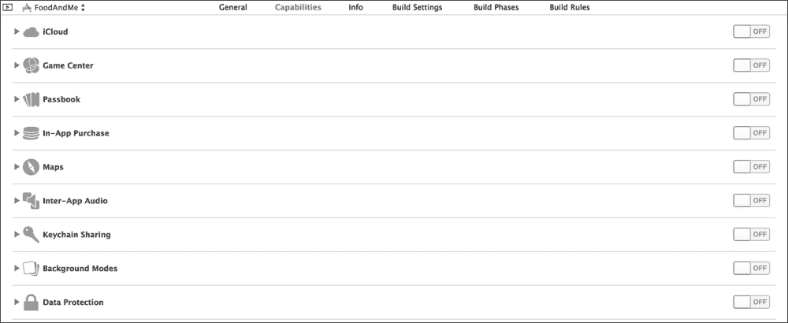

如果您更喜欢使用旧方法设置功能和功能，您仍然可以在 Apple 开发者门户中这样做。

# 源代码控制

源代码控制被大型团队和独立开发者广泛使用。它提供了一种极其有用的方式来跟踪代码更改并使用版本控制回滚到项目的稳定构建。开发者团队可以通过创建和管理代码的副本（称为 **分支**）来分别独立工作在各个组件上，而不会覆盖其他团队成员的代码。更改将在稍后合并，同时跟踪对代码库所做的所有更改。

源代码控制不是 Xcode 5 的新功能；然而，苹果公司决定通过创建顶级菜单项来提供对其功能的更便捷访问。选择它将显示一个下拉菜单，其中包含一键访问大多数源代码控制命令，如提交、推送和拉取。将鼠标悬停在**工作副本**上，将打开一个新的子菜单，允许您在分支之间切换、创建新分支或合并分支。以下截图显示了此子菜单：

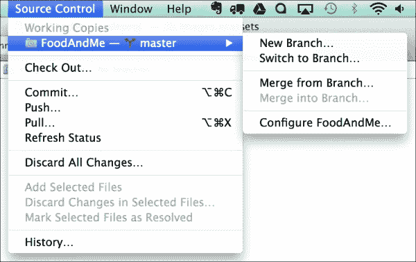

除了在您的计算机上的本地源代码控制之外，Xcode 5 还支持直接连接到托管在流行网站上的远程仓库，例如 GitHub。打开首选项并导航到**账户**标签页。这次，在点击**+**按钮后，选择**添加仓库**。一旦您输入了正确的仓库地址，Xcode 5 将连接到仓库，从而允许您远程访问它。

# 资源目录

您创建的每个项目都至少包含一些图像文件，形式为启动图像和应用程序图标，以及其他 UI 元素。在 Xcode 5 中，资源目录有两个主要用途。这包括自动化图标和启动图像的命名约定，以及将图像文件分组在单个位置。

资源目录在项目导航器中以一个蓝色文件夹的形式表示为一个单独的组。默认情况下，每个新创建的项目都将包含默认的`Images.xcassets`项。您还可以根据个人偏好创建自己的资源目录以进行进一步的组织。

Xcode 5 要求每个启动图像文件和图标图像文件根据图像将用于的设备和/或分辨率适当地命名。当选择`Images.xcassets`项时，您将看到许多空槽等待添加图像。每个槽都有一个描述它所包含的图像。将图像从您的计算机拖动到 Xcode 5 的相应槽位，将添加图像到您的项目，并自动配置所有命名约定。以下截图显示了**资源目录**窗口：

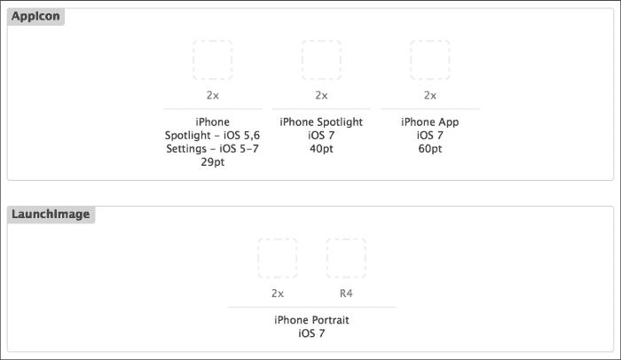

如果您想添加与您的项目相关的任何其他图像，您只需将它们拖放到**资源目录**窗口中，Xcode 5 将处理其余部分。高分辨率（*2x*）和标准分辨率（*1x*）图像文件将按共同名称分组到它们自己的图像集中。您仍然必须自己提供低分辨率和高分辨率的图像。Xcode 5 不会为您自动缩放它们：它只是将它们分组。此名称的值可以更改为任何值，并且将在代码中使用此值来访问相关的图像，无论实际文件名如何。

# 快速构建设备选择

开发适用于多设备的应用程序需要一致的设备特定测试。iOS SDK 中包含的 iOS 模拟器为所有苹果设备提供模拟。在 Xcode 5 中，选择要构建的适当设备已被简化为工具栏上的单个下拉选项。

点击工具栏左侧当前设备的名称将提供下拉菜单。连接到您的计算机的所有物理设备将出现在列表的顶部（您可能需要向上滚动才能看到它们），所有标准 iOS 模拟器设备将出现在下面。

简单选择您希望测试的设备，然后点击 **运行**。模拟器将启动并切换到所选设备。以下截图列出了下拉菜单中的设备：

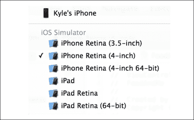

# Storyboard 预览

一直以来，编写支持先前 iOS 版本的应用程序主要涉及更新 API 调用和微小的编码约定。随着 iOS 7 的推出，苹果彻底改变了所有标准 UI 对象的设计。了解 iOS 7 和先前版本中所有对象的大小、位置和布局对于保持一致的用户体验非常重要。这正是 storyboard 预览发挥作用的地方。

为了使用 storyboard 预览，您必须选择辅助编辑器并导航到您希望预览的视图（通常是 `.xib` 或 `.storyboard` 文件）。选择 **相关文件** 菜单选项，导航到 **预览**，并选择您希望预览的 `.xib` 或 `.storyboard` 文件，如图所示：

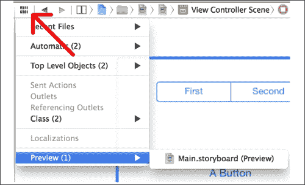

您将在辅助编辑器的右侧看到视图的相同预览。在视图的右下角，您将看到一个标有 **iOS 7.0 及以后版本** 的按钮。点击它，然后选择 **iOS 6.1 及更早版本**，如图所示：

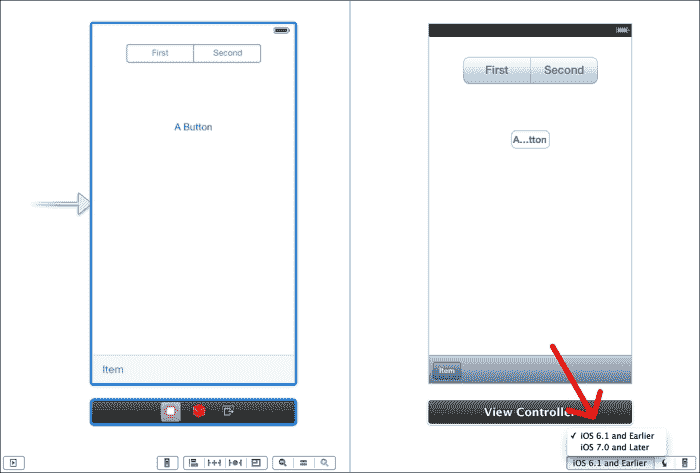

您的视图现在将显示所有 UI 元素，它们将显示在 iOS 6 或更早版本中。如果您希望使应用程序向后兼容，这是一个非常实用的工具。

# 摘要

Xcode 5 为开发者提供了比以往任何时候都多的功能，每个工具都旨在在构建最佳质量的应用程序时为您提供更高效的使用体验。在本章中，我们学习了如何使用所有这些功能，从新的调试工具到自动配置。尽管我们涵盖了 Xcode 5 的大量新功能，但您应该访问以下链接，查看 Apple 关于 Xcode 5 新功能的文档：[`developer.apple.com/library/mac/releasenotes/DeveloperTools/RN-Xcode/Introduction/Introduction.html`](https://developer.apple.com/library/mac/releasenotes/DeveloperTools/RN-Xcode/Introduction/Introduction.html)

每次新的 iOS SDK 发布，苹果都会为 Objective-C 编程语言添加一些小的和重大的更新。在下一章中，我们将介绍对 Foundation 框架所做的更改，这可能是 iOS 开发中最重要的框架！
