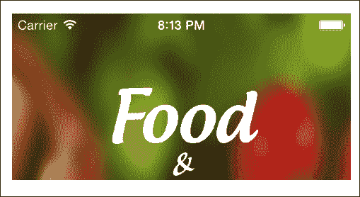
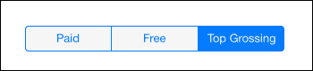
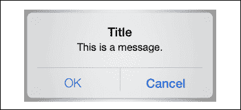
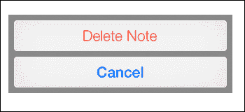
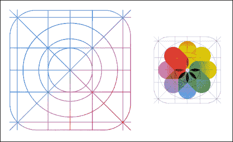
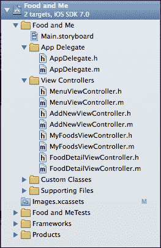
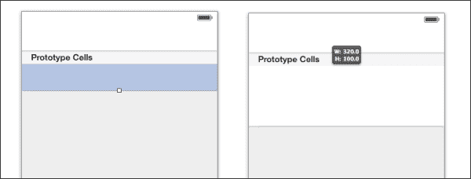

# 第四章：为 iOS 7 构建我们的应用程序

我们将本章从介绍 iOS 7 中的一些新设计原则开始。这包括对导航和状态栏、新的 UIKit 以及应用程序图标的更改。接下来，我们将创建所需的文件并将它们组织起来以便于导航。最后，我们将向我们的 Storyboard 添加一些新的视图控制器，并将它们指向我们新创建的文件。完成本章后，我们将有一个完整的应用程序框架，准备添加功能。让我们开始吧！

# 为 iOS 7 设计

随着 iOS 7 的发布，开发者和设计师需要调整他们的方法以适应新的“扁平化”设计。尽管遵循此设计模式不是强制性的，但几乎所有的 UI 元素在 SDK 中都已经完全重制以支持它。

在设计 iOS 7 应用程序时，考虑这些变化对于保持平衡布局非常重要。一些因素包括新的字体和更新的 UIKit 尺寸。在本章中，我们将构建我们应用程序的框架，但首先我们将讨论 iOS 7 中的两个重要变化，这些变化将直接影响你构建未来应用程序的方式。

## 导航栏和状态栏

可能 iOS 7 最明显的变化是新导航栏和状态栏。这两个项目自 iOS 推出以来一直存在。在 iOS 7 之前，20 像素的状态栏只是一个简单的纯色背景视图，它会覆盖主应用程序窗口的顶部 20 像素。

此外，当使用导航控制器时，导航栏本身也会以同样的方式工作，覆盖视图的下一个 44 像素（总共 64 像素）。因此，定位 y=0 值的项将直接位于导航或状态栏下方。

随着 iOS 7 的发布，这一变化已被完全移除。状态栏本身现在包含一个清晰的背景，允许任何 UI 元素或视图位于其后面。运行我们的应用程序并注意我们的菜单背景图像如何延伸到设备屏幕的顶部，直接位于状态栏后面，如以下截图所示：

对于大多数应用程序来说，状态栏背景与导航栏背景相匹配是非常常见的。在 iOS 7 中，设置导航栏颜色将自动设置状态栏背景以匹配。以下截图是我们完成的应用程序的一个示例：

这种变化的另一个结果是，在 y 轴上程序化定位你的视图需要你考虑状态栏和导航栏的高度。一个定位在 x=0 和 y=0 的视图将出现在屏幕的左上角，位于导航和状态栏后面。

重要的是要理解，这个变化专门适用于在运行时执行的代码。当使用故事板时，这种新的定位不适用。Xcode 会自动调整故事板中的视图，以适应导航栏和状态栏。每个视图将保留其初始的*y*位置，无论做出任何调整。

最后，苹果为导航栏添加了一个新的半透明属性。在任何运行 iOS 7 的设备上打开联系人应用，滚动查看你的联系人。你会注意到，当每个项目穿过导航栏时，它可以在移动离开屏幕时通过栏看到。这种效果在 iOS 7 及其新设计的应用程序中得到了广泛应用，苹果还允许开发者使用它。默认情况下，此属性将设置为`YES`，但如果你希望，可以随时禁用。

## 新的 UIKit

iOS 7 的新扁平化设计改变了许多常见的 UIKit 元素的尺寸。其中一些包括分段控件、搜索显示控制器和警告视图。这些变化大多数导致比 iOS 先前版本更小的框架，但也包括更新的字体和用户交互。新设计的搜索栏如下截图所示：

分段控件如下截图所示：

通知的新警告视图如下截图所示：

删除的新警告视图如下截图所示：

## 更新后的应用图标

苹果在 iOS 7 发布时对标准 iOS 应用程序图标大小进行了细微的调整。之前，图标具有易于复制的均匀圆角。苹果提供了一种新的形状，称为**超级椭圆**，具有更拉伸的圆角。此外，应用程序图标上的光泽（光泽效果）已被移除。像往常一样，Xcode 5 会自动剪裁你的应用程序图标图像到正确的形状；然而，如果你希望添加自己的描边或阴影，你需要使用非官方模板。

此外，苹果引入了他们称之为**黄金比例网格系统**的内容，你将在下面的屏幕截图中看到。苹果建议在设计图标和布局单个元素时使用此网格。这更被视为一个指南而不是规则，所以如果你觉得它更适合你的应用程序图标，可以自由地在这个网格系统之外工作。

# 整合碎片

现在我们已经介绍了一些 iOS 7 的基本设计方面，是时候开始构建我们的应用程序骨架了。在我们编写任何代码之前，让我们创建基本的项目文件，在我们的故事板中构建我们的视图，并为每个视图控制器创建/连接出口。我们将能够导航到我们的应用程序；然而，它目前什么也不会做。

## 项目组织

我开发过程中的第一步是在 Xcode 5 中组织我的项目。这样做使得导航项目并找到所需的文件变得更容易。让我们继续组织我们的应用程序。

打开我们的**Food and Me**项目，查看左侧的导航器。我们有一些文件，没有特定的顺序，我们很快还会创建更多文件。我们将把主要项目文件分为以下三个单独的类别：

+   `应用程序代理`

+   `视图控制器`

+   `自定义类`

在导航器面板上，右键单击顶级文件夹（`Food and Me`，我们的应用程序名称）并单击**新建组**。在我们的主要`Food and Me`组中会出现一个新的组；让我们将其命名为`应用程序代理`。重复此过程两次，将新组分别命名为`视图控制器`和`自定义类`。

选择`AppDelegate.h`和`AppDelegate.m`（使用*command*键），并将这些文件拖动到我们刚刚创建的`应用程序代理`组中。对`MenuViewController.h`和`MenuViewController.m`也执行相同的操作，并将这些文件拖动到`视图控制器`组中。这些组也可以重新排列，所以请根据您的喜好自由移动它们。

以下截图展示了在`Food and Me`项目中找到的最终结果：

## 创建文件

现在我们项目组织得更好了，是时候创建剩余的项目文件。我们的应用程序需要一个用于菜单的视图控制器，添加新食物的视图，当前食物的视图，以及每个食物项目的详细视图。我们已经设置了菜单，所以让我们创建剩余的文件。

右键单击我们的`视图控制器`组并单击**新建文件**（您也可以通过在菜单栏中导航到**文件** | **新建** | **文件**来实现此操作）。确保在左侧菜单栏中选择**Cocoa Touch**，从选项中选择**Objective-C 类**，然后单击**下一步**。将此文件命名为`AddNewViewController`，并确保它是一个`UIViewController`的子类。单击**下一步**然后单击**创建**。我们的新文件将被创建并添加到我们的`视图控制器`组中。

重复此过程两次。第一个文件将命名为`MyFoodsViewController`，并将作为`UITableViewController`的子类。第二个文件命名为`FoodDetailViewController`，并将其设置为`UIViewController`的子类。我们现在已经有了我们应用程序所需的大部分文件。在后面的章节中，我们将在`自定义类`组中创建最后一个项目文件。

## 设置故事板

现在我们有了文件，我们需要在我们的故事板中创建一些视图并将它们连接到我们刚刚创建的类。打开`Main.storyboard`你应该能看到我们的导航控制器及其根视图控制器（菜单视图控制器）。现在让我们将剩余的控制器添加到我们的故事板中。

打开右侧的**工具**面板（如果尚未打开）并点击**对象库**。我们的`AddNewViewController`和`FoodDetailViewController`文件都是`UIViewController`的子类，所以将两个视图控制器对象拖放到故事板中。我们的`MyFoodsViewController`是`UITableViewController`的子类，所以让我们将一个`UITableViewController`对象拖放到故事板中。 

选择一个`UIViewControllers`并打开身份检查器。在顶部的自定义类部分，将这个`View Controllers`类设置为`AddNewViewController`。现在选择剩余的`UIViewController`并将其类设置为`FoodDetailViewController`。最后，选择我们的`UITableViewController`并将其类设置为`MyFoodsViewController`。现在我们的故事板已经包含了我们应用所需的所有对象。

## AddNewViewController

现在我们已经创建了文件并添加了适当的控制器到我们的故事板中，让我们继续添加每个控制器所需的对象。我们将从`AddNewViewController`对象开始。选择它，然后导航到**对象库**在**工具**面板中。

我们的应用将使用户能够追踪他们所吃的食物。每一项食物将包括一个图片、名称/标题以及创建日期。我们需要提供一个图像视图来存储最终图片、一个占位符图像视图以及一个`UITextField`对象来输入食物项的名称。

将一个`UITextField`对象和两个`UIImageView`对象拖放到`AddNewViewController`视图中。这将允许我们的用户与视图交互并为我们的应用创建食物项。在本章中，我们只是简单地将所有元素添加到我们的项目中，所以不要担心这些对象的大小或位置。

选择`AddNewViewController`对象本身，然后点击右上角的辅助编辑器按钮（类似于燕尾服的按钮）。如果尚未显示，切换到`AddNewViewController.h`。为了在代码中访问这些对象，我们将为代码中的每个项目创建出口。在按住键盘上的*控制*键的同时，从`UITextField`拖动到头文件并释放。将此出口命名为`nameTextField`并点击**连接**。对两个`UIImageView`重复此操作。将第一个图像视图命名为`placeholderImageView`，第二个命名为`finalImageView`。我们现在有了`AddNewViewController`所需的所有对象和连接。

## FoodDetailViewController

当用户选择他们之前添加的其中一个食品项目时，我们希望显示一个详细视图，该视图包括全屏背景图像、食品图像、食品名称，最后是保存的日期。在故事板中选择`FoodDetailViewController`类，并导航回**实用工具**面板和**对象库**。

将两个`UIImageView`和两个`UILabel`拖动到食品详情视图中。再次忽略每个项目的尺寸和位置。我们还将为每个对象在我们的代码中添加出口，所以请打开辅助编辑器并切换到`FoodDetailViewController.h`文件。从第一个图像视图拖动控制到`.h`文件中`@interface`和`@end`之间的空间，并将出口命名为`backgroundImageView`。对第二个图像视图执行相同的步骤，并将其命名为`foodImageView`。

我们将这些标签用于显示与食品项目相关的名称和日期。从第一个标签开始拖动控制，并将此出口命名为`foodNameLabel`。第二个`UILabel`应命名为`foodDateLabel`。现在我们已经有我们`FoodDetailViewController`类所需的所有视图了。

## MyFoodsViewController

当我们将`UITableViewController`对象拖动到故事板中时，Xcode 5 自动向控制器中添加了一个`UITableView`对象，带有一个平面原型单元格。**Food and Me**将使用自定义的`UITableViewCell`子类来创建和布局我们的表格视图单元格。这将在后面的章节中介绍，所以目前我们将对`MyFoodsViewController`类进行一个简单的更改。选择原型单元格，单元格框架底部将出现一个小白框。点击并拖动此框以调整单元格大小。将其高度设置为 100 像素，如图所示：

# 摘要

在本章中，我们学习了与 iOS 7 相关的一些较新的设计原则。此外，我们组织了我们的项目，创建了所有必需的文件，并在故事板中开始我们的视图。我们现在准备好开始编写代码并为我们的应用程序添加功能。

在下一章中，我们将完成构建`AddNewViewController`类，并添加保存用户数据以便以后查看的功能。
