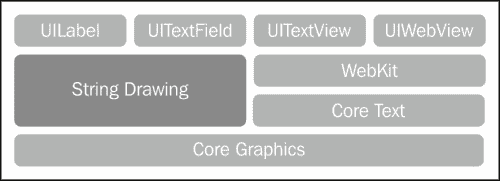
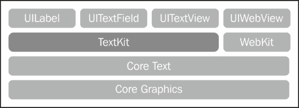
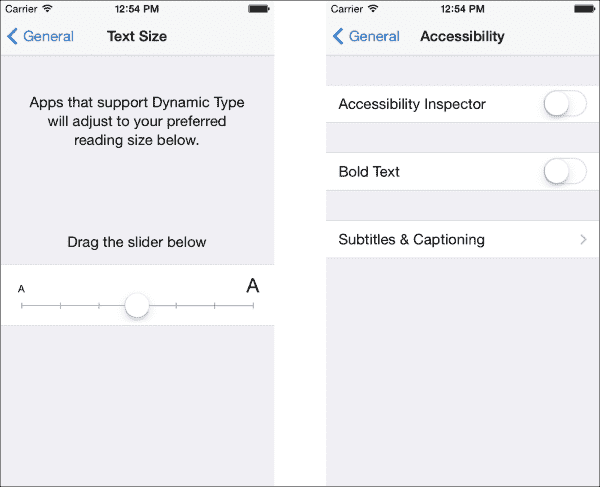
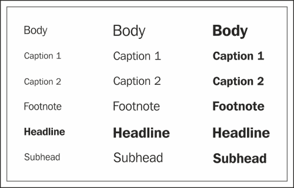
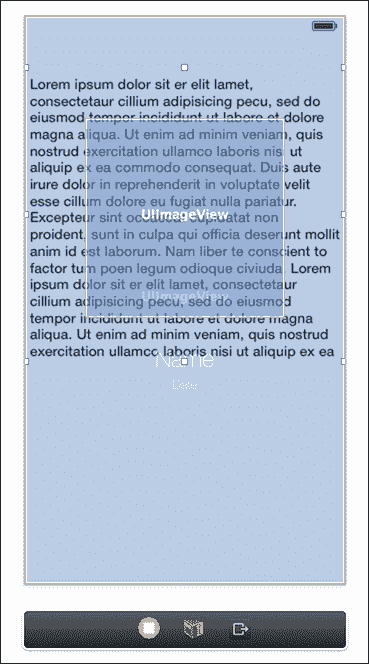
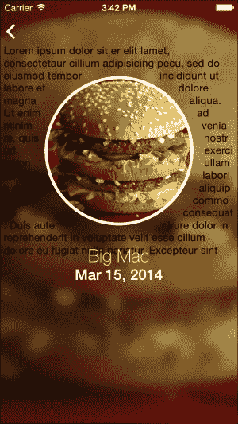
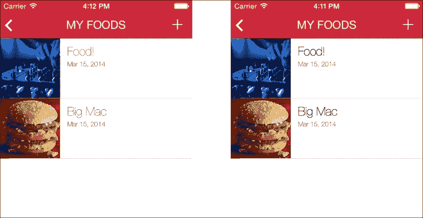

# 第七章. 使用 TextKit 操作文本

我们将从这个章节开始，概述新的 UIKit 层次结构。从那里，我们将直接深入到动态文本类型以支持全系统字体和大小设置。接下来，我们将介绍一些新功能，例如使用排除路径将文本围绕形状包裹以及使用几行代码添加压痕效果。最后，我们将讨论如何将标准格式应用于文本，例如下划线文本。让我们开始吧！

# 什么是 TextKit？

在 iOS 6 之前，您可以使用 **UIWebView** 和 HTML 标记或使用较低级别的框架 **Core Text** 来提供文本的混合样式。随着 iOS 6 的推出，苹果引入了属性字符串，允许开发者调整任何字符串定义子部分的颜色和字体属性。前 10 个字符可以设置为黄色，其余字符为粗体字体。

在 iOS 6 中，基于文本的 UIKit 控件基于 Core Graphics 和 WebKit。以下是一个示意图来展示其层次结构：



你会注意到 **UITextView** 实际上使用 **WebKit** 本身来绘制带有 HTML 的属性文本。尽管属性字符串提供了许多处理文本的解决方案，但它们在高级布局的灵活性方面有限。这种多行渲染文本需要使用 **Core Text**。这个框架非常难以处理和理解。

在 iOS 7 中，苹果引入了 **TextKit** 以简化文本处理。苹果现在从 **TextKit** 继承 **UITextView** 而不是从 **WebKit**，如下面的图所示：



**TextKit** 继承了所有在 **Core Text** 中找到的强大功能（它是建立在 **Core Text** 之上的），并以易于使用且改进了许多的 API 提供。现在所有基于文本的 UIKit 控件（除了出于明显原因的 **UIWebView**）现在都在使用 **TextKit**。你可以看到核心结构现在变得更加精细，具有更好的流线型。

TextKit 可以分为三个主要类：

+   `NSTextStorage`：这个类用于存储所有文本属性信息。将其视为所有文本效果的内部蓝图。需要注意的是，`NSTextStorage`是`NSMutableAttributedString`类的子类，因此它负责所有文本属性。除了存储文本属性外，`NSTextStorage`还将确保在所有编辑操作中保持一致性。

+   `NSLayoutManager`：这个类将管理在`NSTextStorage`中找到的数据在视图中的布局方式（正如其名所示）。如果存储的文本属性有任何更改或修改，`NSTextStorage`将通知这个类。然后它会相应地更新视图。因此，更改几乎可以即时反映出来。

+   `NSTextContainer`：这个类负责指定文本将要显示的视图。`NSTextContainer`还跟踪与视图相关的信息，例如大小/框架或形状。最值得注意的是，`NSTextContainer`能够存储一个 bezier 路径数组，我们将在创建排除路径时使用它。这就是 TextKit 能够围绕图像和其他对象流动文本的原因。

TextKit 可用于多种基于文本的效果。这包括对用户选择的文本大小使用动态字体，使用排除路径围绕图像包裹文本，以及类似于富文本编辑器的文本格式。

在本章中，我们将详细介绍所有这些功能，并将其中一些应用到我们的应用程序文本中。首先，让我们看看动态字体。

# 动态字体

从用户体验的角度来看，iOS 7 最大的新特性之一是能够调整整个操作系统的文本格式。这包括增加字体粗细（粗体）和文本大小。这些设置可以在设备的设置应用程序中设置。尽管支持动态字体不是强制性的，但建议这样做！以下是一个这些设置的示例：



在通常处理字体时，我们指定要设置的字体家族名称和大小，如下所示：

```swift
[UIFont fontWithName:@"HelveticaNeue" size:19.0f]
```

当处理动态字体时，我们将使用具有样式的字体，而不是使用任何字体的字面名称，这与前面的代码不同。`UIFont`已经配备了一个名为`preferredFontForTextStyle`的新方法。这个方法从用户的设备加载所选的字体偏好，并将文本设置为给定的样式。以下是一个多字体样式的示例：



左侧的文本是可以渲染的最小尺寸，中间的文本是可能的最大尺寸，而右侧的文本是每个选项的粗体格式。让我们看看使用 TextKit 进行动态字体的一个示例。以下是一个代码示例：

```swift
self.foodDateLabel.font = [UIFont preferredFontForTextStyle:UIFontTextStyleHeadline];
```

如前所述的代码中提到的，我们不是使用显式的字体名称，而是使用其中的一种六种包含的样式。通过这样做，我们避免了在我们的应用程序中使用硬编码的字体名称。因此，我们的应用程序将很好地响应用户定义的字体选择。

## 处理更新

前面的代码将根据用户设置自动渲染。当您切换到设置并调整文本大小时，会出现问题。如果您在没有先关闭应用程序的情况下切换回应用程序，文本更新将不会反映出来。这是因为为了响应实际的变化，您的控制器必须响应使用`NSNotificationCenter`做出的更改。

通过将以下代码添加到任何`viewDidLoad`方法的末尾，您可以使您的控制器响应用文更新：

```swift
[[NSNotificationCenter defaultCenter] addObserver:self
                                             selector:@selector(preferredContentSizeChanged:)
                                                 name:UIContentSizeCategoryDidChangeNotification
                                               object:nil];
```

定义的选择器将看起来像这样：

```swift
- (void)preferredContentSizeChanged:(NSNotification *)notification {
    self.textView.font = [UIFont preferredFontForTextStyle:UIFontTextStyleHeadline];
}
```

首先，我们注册我们的类以接收基于首选内容大小变化的更新通知。因此，如果用户切换到设置应用并更改文本大小，我们的应用将拦截此操作并调用定义的方法`preferredContentSizeChanged`。之前，这个方法只是设置字体；然而，现在它将拉取新的用户定义的文本大小。

改变文本大小也会影响你的视图布局。因此，你希望你的视图能够根据文本做出响应。大部分的这些都可以通过自动布局（Auto Layout）来完成。虽然自动布局在大多数情况下都能很好地工作，但它不擅长处理行高的确定。

# 排除路径

排除路径允许你围绕特定的视图包裹文本。大多数文本编辑器都提供了对这一功能的支持，而通过 TextKit，你现在可以在你的应用程序中实现这一功能。使用 TextKit，你可以围绕复杂和简单的路径包裹你的文本。例如，你可能想要围绕一个简单的圆形或围绕一个更复杂的形状，如蝴蝶图片。你可能想在显示带有图像的文本或提供与文本相关细节的视图时使用此功能。

假设你有一个包含与一段文本相关的数据的圆形`UIView`。我们希望将圆形的`UIImageView`居中，并在其四周包裹文本。为了测试这个功能，让我们在我们的故事板中添加一个文本视图，并在我们的食物图片周围包裹一些填充文本。切换到**Main.Storyboard**并选择`FoodDetailViewController`类。拖动一个文本视图并调整其大小，使其比食物图片大。此外，确保文本视图位于图片视图下方。你的故事板应该看起来像这样：



确保为我们的新文本视图`FoodDetailViewController`创建一个输出端口。给它命名为`textview`。

切换到`FoodDetailViewController.m`并滚动到`viewDidLoad`。在底部添加以下代码行：

```swift
UIBezierPath *circleExclusion = [UIBezierPath bezierPathWithOvalInRect:CGRectMake(60, 40, 210, 210)];
    self.textView.textContainer.exclusionPaths = @[circleExclusion];
```

在这里，我们创建一个新的贝塞尔路径，并给它一个与我们的图片视图矩形相等的坐标。现在我们已经定义了排除形状，是时候告诉文本视图注意这个排除路径了。TextKit 为所有基于文本的视图的文本容器增加了一个额外的属性，称为`exclusionPaths`。这个参数接受一个数组，这意味着可以同时处理多个排除。以下是结果：



# 添加压印效果

任何文本都可以通过适当的阴影和突出显示效果看起来像是压印的。TextKit 通过一个名为`NSTextEffectLetterpressStyle`的新属性参数提供了一个简单有效的方法来实现这一点。

下面是一个带有代码的示例：

```swift
NSDictionary *attributes = @{ NSForegroundColorAttributeName : [UIColor blueColor],
NSTextEffectAttributeName : NSTextEffectLetterpressStyle};
NSAttributedString* attrString = [[NSAttributedString alloc]
                                      initWithString:someString
                                      attributes:attributes];
```

使用属性文本，我们可以应用这种特定的文本效果，以及其他属性。这就是应用这种微妙效果的全部！以我们的应用为例看看：



# 文本格式化

使用 TextKit，我们可以将一些简单的文本编辑属性应用到我们的文本上。这包括粗体、斜体和下划线文本。为了做到这一点，我们将使用 iOS 7 中一个全新的类，`UIFontDescriptor`。这个类用于描述字体及其所有属性。更重要的是，您可以直接修改属性并创建一个新的字体。所有字体属性都由字典或键字符串常量表示。

## 制作粗体和斜体文本

让我们看看一段代码，看看我们如何使用`UIFontDescriptor`来制作粗体文本：

```swift
NSDictionary *currentAttributesDict = [self.textView.textStorage attributesAtIndex:0

effectiveRange:nil];

UIFont *currentFont = [currentAttributesDict objectForKey:NSFontAttributeName];

UIFontDescriptor *fontDescriptor = [currentFont fontDescriptor];
UIFontDescriptor *changedFontDescriptor = [fontDescriptor fontDescriptorWithSymbolicTraits:UIFontDescriptorTraitBold];

UIFont *updatedFont = [UIFont fontWithDescriptor:changedFontDescriptor size:0.0];

NSDictionary *dict = @{NSFontAttributeName: updatedFont};

    [self.textView.textStorage setAttributes:dict range:NSMakeRange(0, self.textView.text.length)];
```

首先，我们从文本视图的文本存储对象中获取当前的属性。接下来，我们创建一个对这个文本块原始字体使用的引用。我们想这样做，以防我们需要这些信息（这主要取决于应用程序为什么使用`UIFontDescriptor`）。我们还创建了一个当前字体描述符的引用。一旦我们有了所有这些信息，我们就创建一个新的字体描述符，并将其符号特性设置为粗体。最后，我们创建了一个使用我们新字体描述符的新字体实例，并将其分配给我们的文本视图。要更改文本为斜体，只需传递正确的符号特性。

符号特性实际上只是描述字体风格的属性。它是一个无符号 32 位整数。以下是苹果提供所有特性的列表：

```swift
typedef enum : uint32_t {
  /* Typeface info (lower 16 bits of UIFontDescriptorSymbolicTraits) */
  UIFontDescriptorTraitItalic = 1u << 0,
  UIFontDescriptorTraitBold = 1u << 1,
  UIFontDescriptorTraitExpanded = 1u << 5,
  UIFontDescriptorTraitCondensed = 1u << 6,
  UIFontDescriptorTraitMonoSpace = 1u << 10,
  UIFontDescriptorTraitVertical = 1u << 11,
  UIFontDescriptorTraitUIOptimized = 1u << 12,
  UIFontDescriptorTraitTightLeading = 1u << 15,
  UIFontDescriptorTraitLooseLeading = 1u << 16,

/* Font appearance info (upper 16 bits of UIFontDescriptorSymbolicTraits */
  UIFontDescriptorClassMask = 0xF0000000,

  UIFontDescriptorClassUnknown = 0u << 28,
  UIFontDescriptorClassOldStyleSerifs = 1u << 28,
  UIFontDescriptorClassTransitionalSerifs = 2u << 28,
  UIFontDescriptorClassModernSerifs = 3u << 28,
  UIFontDescriptorClassClarendonSerifs = 4u << 28,
  UIFontDescriptorClassSlabSerifs = 5u << 28,
  UIFontDescriptorClassFreeformSerifs = 7u << 28,
  UIFontDescriptorClassSansSerif = 8u << 28,
  UIFontDescriptorClassOrnamentals = 9u << 28,
  UIFontDescriptorClassScripts = 10u << 28,
  UIFontDescriptorClassSymbolic = 12u << 28
} UIFontDescriptorSymbolicTraits;
```

# 下划线文本

使用 TextKit 下划线文本的方法类似于前面代码中显示的任何一种方法，但有一些修改。以下是一个代码示例：

```swift
NSDictionary *currentAttributesDict = [self.textView.textStorage attributesAtIndex:0

effectiveRange:nil];
NSDictionary *dict;

if ([currentAttributesDict objectForKey:NSUnderlineStyleAttributeName] == nil || [[currentAttributesDict objectForKey:NSUnderlineStyleAttributeName] intValue] == 0) {

  dict = @{NSUnderlineStyleAttributeName: [NSNumber numberWithInt:1]};

}
else{
  dict = @{NSUnderlineStyleAttributeName: [NSNumber numberWithInt:0]};
}

[_textView.textStorage setAttributes:dict range:NSMakeRange(0, self.textView.text.length)];
```

在这里，我们必须检查当前的文本属性中是否已经存在`NSUnderlineStyleAttributeName`属性。从这里，我们只需简单地打开或关闭下划线属性并将其应用到我们的文本上。

# 摘要

TextKit 为 iOS 中的文本操作提供了许多优秀的方法。支持这些功能对于提供更好的用户体验至关重要。我建议您花时间浏览苹果的文档。我们已经在本章中涵盖了标准用法。TextKit 是一个非常强大的新 API，将继续提供创新的使用方式。

在最后一章中，我们将介绍 UIKit Dynamics。我们将学习如何通过向 UI 元素添加物理特性来创造令人兴奋的体验！
