# 第三章：蓝牙气象站

在本章中，我们将使用 Arduino 和 Android 构建本书的第一个完整应用。我们将使用 Arduino 构建一个小型气象站，它将通过蓝牙被 Android 应用访问。

在 Arduino 端，我们将使用温度和湿度传感器以及环境光强度传感器构建一个简单的气象站。我们将把一个**蓝牙低功耗**（**BLE**）模块连接到项目中，以便 Android 手机可以无线访问测量数据。

我们将开发一个简单的 Android 应用，它具有一个界面，允许我们：

+   通过点击按钮访问气象站执行的所有测量

+   在扩大的文本视图中显示每个测量值

# 硬件和软件要求

对于这个项目，你首先需要一块 Arduino Uno 板。

然后，你需要一个 BLE 模块。我们选择了 Adafruit nRF8001 芯片，因为它附带了一个不错的 Arduino 库，并且已经存在一些用于控制该模块的 Android 应用示例。这正是我们在上一章中使用过的模块。

对于传感器，我选择了 DHT11 传感器来测量温度和环境湿度。DHT11 是一个易于与 Arduino 集成的数字温度和湿度传感器。有几种 Arduino 的解决方案，但这个传感器被选中是因为它是最容易与 Arduino 接口的之一。为了让传感器与 Arduino 一起工作，我们还需要一个 4.7K 欧姆电阻。

我们还将使用一个串联 10K 欧姆电阻的光电传感器来测量环境光强度。光电传感器基本上是一个电阻，其电阻会根据细胞上的入射光而改变。它将被连接到 Arduino 模拟输入以测量环境光强度。

最后，你需要一个面板和一些跳线来制作不同的连接。

以下是需要为此项目准备的全部硬件部件列表，以及如何在网络上找到这些部件的链接：

+   Arduino Uno 板([`www.adafruit.com/product/50`](http://www.adafruit.com/product/50))

+   DHT11 传感器和 4.7K 欧姆电阻([`www.adafruit.com/products/386`](https://www.adafruit.com/products/386))

+   光电传感器([`www.sparkfun.com/products/9088`](https://www.sparkfun.com/products/9088))

+   10K 欧姆电阻([`www.sparkfun.com/products/8374`](https://www.sparkfun.com/products/8374))

+   Adafruit nRF8001 扩展板([`www.adafruit.com/products/1697`](https://www.adafruit.com/products/1697))

+   面板([`www.adafruit.com/product/64`](https://www.adafruit.com/product/64))

+   跳线([`www.adafruit.com/product/758`](https://www.adafruit.com/product/758))

在软件方面，你将需要通常的 Arduino IDE 和 Arduino aREST 库，该库位于[`github.com/marcoschwartz/aREST/`](https://github.com/marcoschwartz/aREST/)。

光敏电阻从 DHT11 传感器进行测量，您需要从[`github.com/adafruit/DHT-sensor-library`](https://github.com/adafruit/DHT-sensor-library)找到的 DHT 库。

对于 BLE 芯片，您还需要在[`github.com/adafruit/Adafruit_nRF8001`](https://github.com/adafruit/Adafruit_nRF8001)找到的 nRF8001 Arduino 库。

要安装某个库，只需将文件夹提取到您的`Arduino /libraries`文件夹中（如果尚不存在，则创建此文件夹）。

## 硬件配置

现在，我们将构建这个项目的硬件。为了帮助您，以下是项目的原理图：

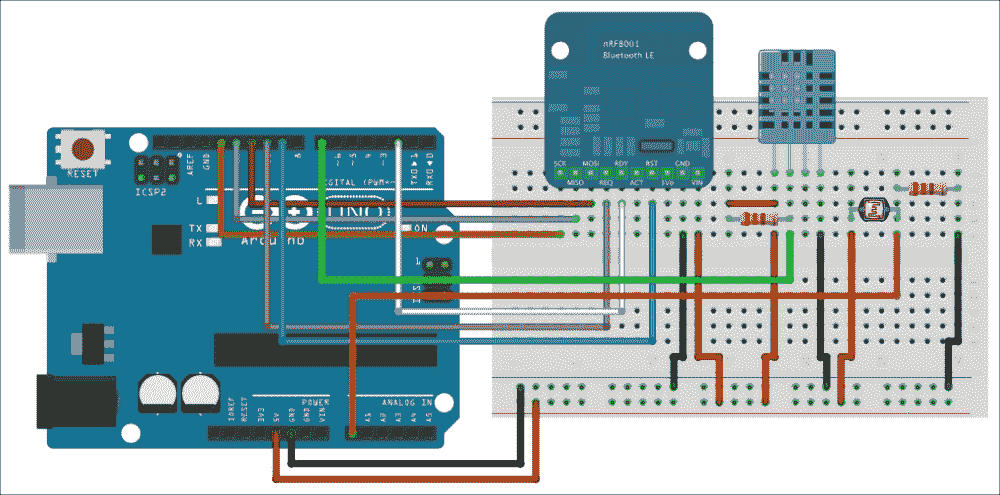

现在，我们将执行以下步骤：

1.  第一步是将蓝牙模块、DHT11 传感器和光敏电阻放置在面包板上。

1.  然后，将 Arduino 板上的电源连接到面包板：Arduino 板的 5V 连接到红色电源轨，而**GND**连接到蓝色电源轨。

1.  现在，我们将连接 BLE 模块。首先，连接模块的电源：**GND**连接到蓝色电源轨，**VIN**连接到红色电源轨。

1.  之后，您需要连接负责 SPI 接口的不同电线：**SCK**连接到 Arduino 引脚**13**，**MISO**连接到 Arduino 引脚**12**，**MOSI**连接到 Arduino 引脚**11**。

1.  然后，将**REQ**引脚连接到 Arduino 引脚**10**。最后，将**RDY**引脚连接到 Arduino 引脚**2**，将**RST**引脚连接到 Arduino 引脚**9**。

    对于 DHT 传感器，这是传感器上每个引脚的功能：

    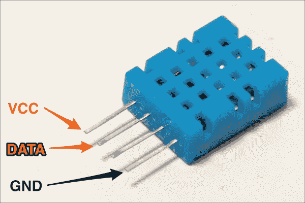

1.  您需要首先连接电源：**VCC**引脚连接到面包板上的红色电源轨，而**GND**引脚连接到蓝色电源轨。

1.  您还需要将**DATA**引脚连接到 Arduino 板的引脚编号**7**。

1.  最后，将 4.7K 欧姆电阻放置在**VCC**和传感器**DATA**引脚之间。

1.  对于光敏电阻，将 10K 欧姆电阻串联在光敏电阻上。这意味着光敏电阻的一个引脚应该与电阻的一个引脚接触（在面包板上的同一行）。

1.  然后，将电阻的另一端连接到蓝色电源轨，将光敏电阻的另一端连接到面包板上的红色电源轨。

1.  最后，将光敏电阻和电阻之间的公共引脚连接到 Arduino 板上的模拟引脚**A0**。

    这是完全组装好的项目的图片：

    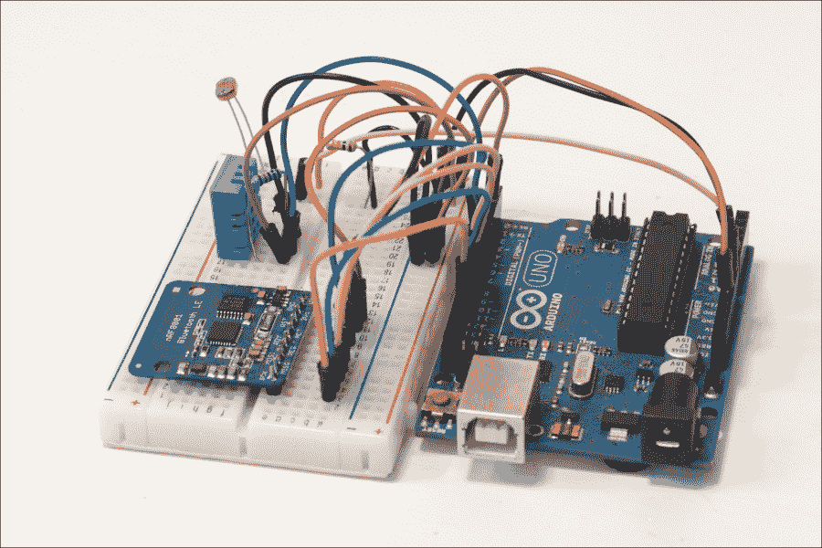

## 测试传感器

现在，我们将编写一个简单的 Arduino 草图来测试项目的所有传感器。这将确保在编写使用蓝牙的 Android 应用程序之前，所有连接都已正确完成。这是测试传感器的完整草图：

```java
#include "DHT.h"

// DHT sensor
#define DHTPIN 7
#define DHTTYPE DHT11

// DHT instance
DHT dht(DHTPIN, DHTTYPE);

void setup()
{
  // Initialize the Serial port
  Serial.begin(9600);

  // Init DHT
  dht.begin();
}

void loop()
{
  // Measure from DHT
  float temperature = dht.readTemperature();
  float humidity = dht.readHumidity();

  // Measure light level
  float sensor_reading = analogRead(A0);
  float light = sensor_reading/1024*100;

  // Display temperature
  Serial.print("Temperature: ");
  Serial.print((int)temperature);
  Serial.println(" C");

   // Display humidity
  Serial.print("Humidity: ");
  Serial.print(humidity);
  Serial.println("%");

  // Display light level
  Serial.print("Light: ");
  Serial.print(light);
  Serial.println("%");
  Serial.println("");

  // Wait 500 ms
  delay(500);

}
```

让我们更详细地看看这个草图。它首先包含 DHT11 库：

```java
#include "DHT.h"
```

我们还声明传感器连接到引脚编号 7，并且我们使用的 DHT 传感器是 DHT11 传感器，通过声明常量：

```java
#define DHTPIN 7 

#define DHTTYPE DHT11
```

之后，我们可以声明 DHT 传感器的实例：

```java
DHT dht(DHTPIN, DHTTYPE);
```

在草图的 `setup()` 函数中，我们将开始串行通信：

```java
Serial.begin(9600);
```

我们还将初始化 DHT 传感器：

```java
dht.begin();
```

在草图中的 `loop()` 函数中，我们将从传感器执行温度和湿度测量：

```java
float temperature = dht.readTemperature();
float humidity = dht.readHumidity();
```

我们还将从光敏电阻读取数据，并将此读取值转换为照度百分比。为此，我们必须知道 Arduino 的模拟输入返回一个从 0 到 1,023（10 位）的值。因此，我们需要将输入的读取值除以 1,023。然后，为了得到一个百分比结果，我们将此值乘以 100：

```java
float sensor_reading = analogRead(A0);
float light = sensor_reading/1024*100;
```

当测量完成后，我们将每个测量值打印到串行端口，以便我们可以可视化数据。例如，以下代码将打印温度：

```java
Serial.print("Temperature: ");
Serial.print((int)temperature);
Serial.println(" C");
```

我们还将每 500 毫秒重复每个 `loop()` 函数：

```java
delay(500);
```

### 注意

注意：所有本章的代码都可以在本书的 GitHub 仓库中找到，网址为 [`github.com/marcoschwartz/arduino-android-blueprints`](https://github.com/marcoschwartz/arduino-android-blueprints)。

现在是时候测试这个简单的 Arduino 草图，以检查我们的传感器是否正常工作。将草图上传到 Arduino 板，并打开串行监视器（确保串行速度设置为 9,600）。根据你的环境，你应该在串行监视器中看到类似的结果：

```java
Temperature: 26 C
Humidity: 35%
Light: 75.42%
```

# 编写 Arduino 草图

现在我们知道我们的传感器工作正常，我们可以编写最终的草图，允许 Arduino 板被我们稍后将要编写的 Android 应用程序访问。以下是这一部分的完整草图：

```java
// Control Arduino board from BLE

// Enable lightweight
#define LIGHTWEIGHT 1

// Libraries
#include <SPI.h>
#include "Adafruit_BLE_UART.h"
#include <aREST.h>
#include "DHT.h"

// Pins
#define ADAFRUITBLE_REQ 10
#define ADAFRUITBLE_RDY 2
#define ADAFRUITBLE_RST 9

// DHT sensor
#define DHTPIN 7
#define DHTTYPE DHT11

// DHT instance
DHT dht(DHTPIN, DHTTYPE);

// Create aREST instance
aREST rest = aREST();

// BLE instance
Adafruit_BLE_UART BTLEserial = Adafruit_BLE_UART(ADAFRUITBLE_REQ, ADAFRUITBLE_RDY, ADAFRUITBLE_RST);

// Variables to be exposed to the API
int temperature;
int humidity;
int light;

void setup(void)
{  
  // Start Serial
  Serial.begin(9600);

  // Start BLE
  BTLEserial.begin();

  // Give name and ID to device
  rest.set_id("001");
  rest.set_name("weather_station");

  // Expose variables to API
  rest.variable("temperature",&temperature);
  rest.variable("humidity",&humidity);
  rest.variable("light",&light);

   // Init DHT
  dht.begin();

  // Welcome message
  Serial.println("Weather station started");
}

void loop() {  

  // Measure from DHT
  float t = dht.readTemperature();
  float h = dht.readHumidity();
  temperature = (int)t;
  humidity = (int)h;

  // Measure light level
  float sensor_reading = analogRead(A0);
  light = (int)(sensor_reading/1024*100);

  // Tell the nRF8001 to do whatever it should be working on.
  BTLEserial.pollACI();

  // Ask what is our current status
  aci_evt_opcode_t status = BTLEserial.getState();

  // Handle REST calls
  if (status == ACI_EVT_CONNECTED) {
    rest.handle(BTLEserial);
  }
 }
```

现在，让我们更详细地看看这个草图。其中一些部分与之前测试传感器的草图类似；我们不会再次详细说明这些部分。它首先声明我们想要使用 aREST 库的轻量级模式：

```java
#define LIGHTWEIGHT 1
```

然后，我们将定义我们想要使用蓝牙芯片的库、aREST 库和 DHT 传感器的库：

```java
#include <SPI.h>
#include "Adafruit_BLE_UART.h"
#include <aREST.h>
#include "DHT.h"
```

然后，我们将定义连接 BLE 模块的引脚：

```java
#define ADAFRUITBLE_REQ 10
#define ADAFRUITBLE_RDY 2    
#define ADAFRUITBLE_RST 9
```

我们需要创建 aREST 库的实例：

```java
aREST rest = aREST();
```

我们还需要创建一个 BLE 模块的实例：

```java
Adafruit_BLE_UART BTLEserial = Adafruit_BLE_UART(ADAFRUITBLE_REQ, ADAFRUITBLE_RDY, ADAFRUITBLE_RST);
```

在草图中的 `setup()` 函数之前，我们将声明以下三个变量，这些变量包含来自传感器的测量值：

```java
int temperature;
int humidity;
int light;
```

然后，在草图的 `setup()` 函数中，我们将初始化 BLE 模块：

```java
BTLEserial.begin();
```

之后，我们将为我们的项目设置一个 ID 和名称：

```java
rest.set_id("001");
rest.set_name("weather_station");
```

我们还必须将不同的测量变量暴露给 aREST API，以便 Android 应用程序可以访问它们：

```java
rest.variable("temperature",&temperature);
rest.variable("humidity",&humidity);
rest.variable("light",&light);
```

在草图中的 `loop()` 函数中，我们将轮询 BLE 模块的状态：

```java
BTLEserial.pollACI();
```

我们还将获取模块的状态并将其存储在一个变量中：

```java
aci_evt_opcode_t status = BTLEserial.getState();
```

如果这个状态指示蓝牙模块连接到另一个设备，我们将使用 aREST 库处理传入的请求：

```java
if (status == ACI_EVT_CONNECTED) {
    rest.handle(BTLEserial);
}
```

### 注意

注意，本章的所有代码都可以在本书的 GitHub 仓库[`github.com/marcoschwartz/arduino-android-blueprints`](https://github.com/marcoschwartz/arduino-android-blueprints)中找到。

现在是时候将草图上传到你的 Arduino 板上了。完成此操作后，你可以继续开发 Android 应用程序，通过 BLE 草图来控制 Arduino 板。

## 绘制我们的 Android 应用程序和修改布局文件

我们将开始我们的 BLE 气象站项目，通过在 Android Studio 中创建一个新的空白活动来启动项目。

我们的目标项目将针对最低 SDK 版本 18 和最高 SDK 版本 19。

我们将首先绘制一个纸制原型，展示我们的应用程序如何工作以及基本用户流程，如下面的图像所示。这将帮助我们理解应用程序的工作方式，并促进我们的开发过程。

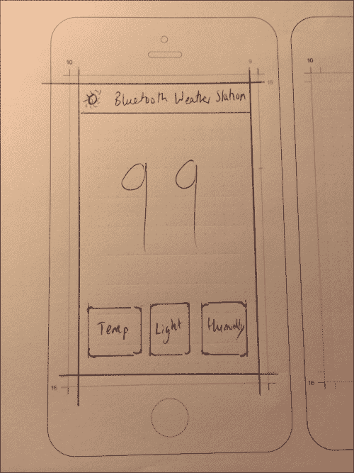

通过分析前面的图像，我们可以看到这个设计将需要两个`TextView`对象。上面的`TextView`对象将显示所有蓝牙回调、状态变化和写入 BLE 模块的特性，而下面的`TextView`对象将根据哪个按钮被点击显示温度、光线和湿度传感器的输出。

`TextView`对象将被赋予以下 ID：

+   `connectionStatusView`

+   `dataOutputTextView`

在布局的下半部分，我们将有三个按钮，反映我们将请求的三个参数，即温度、光线和湿度。我们将按钮命名为如下：

+   温度按钮将被命名为如下：

    +   **Text**: `Temperature`

    +   **ID**: `temperatureButton`

+   湿度按钮将被命名为如下：

    +   **Text**: `Humidity`

    +   **ID**: `humidityButton`

+   灯光按钮将被命名为如下：

    +   **Text**: `Light`

    +   **ID**: `lightButton`

## 实现主活动中的 Android 布局

在我们开始这个项目之前，我们将启用`Auto-Import`功能，这将使我们能够更有效地编译我们的项目，并减少我们需要担心的事情。

你可以通过进入**首选项**选项并选择所有可用选项来启用`Auto-Import`。在 Mac 和 Windows 上，**Auto-Import**首选项如下：

+   在 Mac 上，导航到**Android Studio** > **首选项** > **编辑器** > **Auto-Import**

+   在 Windows 上，导航到**文件** > **设置** > **编辑器** > **Auto-Import**

在所有必要的设置就绪后，我们将首先创建一个新的项目，在**新建项目**设置中选择以下内容：

+   **Name**: `Bluetooth Weather Station`

+   **Minimum SDK**: `18`

+   **Project**: `Blank Activity`

+   **Activity Name**: `MainActivity`

+   **Domain**: `arduinoandroid.com`

我们将在第二章通过蓝牙控制 Arduino 板的“通过蓝牙控制 Arduino 板”项目基础上进行扩展，即 Arduino BLE Android 项目将首先从 GitHub 仓库导入`arduinoBLE`项目并将其克隆到我们的桌面或下载为 ZIP 文件，如第二章通过蓝牙控制 Arduino 板中所述。

一旦导入，我们将打开`MainActivity.java`，选择`import`语句下面的所有代码并复制。当所有代码都已复制后，我们将打开我们的当前项目（Android 蓝牙气象站），进入`MainActivity.java`，删除`import`语句下面的所有代码，并粘贴代码。

如果你在项目的这个阶段遇到困难，我们的代码将在仓库中以两个阶段提供，一个是包含所有需要修改的必要代码的版本，另一个是完成的项目。所有这些都可以在 GitHub 仓库[`github.com/marcoschwartz/arduino-android-blueprints`](https://github.com/marcoschwartz/arduino-android-blueprints)中找到。

一旦代码在我们的项目中，我们将通过更改对 UI 元素的引用来反映我们在`onCreate()`方法中对 Android 布局文件的最新添加：

```java
dataOutput = (TextView) findViewById(R.id.dataOutputTextView);
connectionOutput = (TextView) findViewById(R.id.connectionStatusView);

adapter = BluetoothAdapter.getDefaultAdapter();
temperature = (Button) findViewById(R.id.temperatureButton);
light = (Button) findViewById(R.id.lightButton);
humidity = (Button) findViewById(R.id.humidityButton);
```

在这个项目中，我们将修改`onClickListeners`以连接到我们在 Android 布局文件中包含的按钮：

```java
temperature.setOnClickListener(new View.OnClickListener() {
            public void onClick(View v) {
                String setTempMessage = "/temperature /";
                tx.setValue(setTempMessage.getBytes(Charset.forName("UTF-8")));
                if (gatt.writeCharacteristic(tx)) {
                    writeLine("Sent: " + setTempMessage);
                } else {
                    writeLine("Couldn't write TX characteristic!");
                }

            }
        });

        light.setOnClickListener(new View.OnClickListener() {
            public void onClick(View v) {
                String setLightMessage = "/light /";
                tx.setValue(setLightMessage.getBytes(Charset.forName("UTF-8")));
                if (gatt.writeCharacteristic(tx)) {
                    writeLine("Sent: " + setLightMessage);
                }
                else {
                    writeLine("Couldn't write TX characteristic!");
                }
            }
        });

        humidity.setOnClickListener(new View.OnClickListener() {
            public void onClick(View v) {
                String setHumidityMessage = "/humidity /";
                tx.setValue(setHumidityMessage.getBytes(Charset.forName("UTF-8")));
                if (gatt.writeCharacteristic(tx)) {
                    writeLine("Sent: " + setHumidityMessage);
                }
                else {
                    writeLine("Couldn't write TX characteristic!");
                }
            }
        });
```

我们还将修改处理写入`remoteCharacteristics`的代码，即`writeLine()`方法，此外，我们还将添加另一个名为`writeSensorData()`的方法，它将处理来自我们不同传感器的远程数据：

```java
private void writeLine(final CharSequence text) {
        runOnUiThread(new Runnable() {
            @Override
            public void run() {
                connectionOutput.setText("");
                connectionOutput.append(text);
                connectionOutput.append("\n");
            }
        });
    }

    //Implement the method below to output temperature/humidity/light readings to dataOutputView

    private void writeSensorData(final CharSequence text) {
        runOnUiThread(new Runnable() {
            @Override
            public void run() {
                Log.e(LOG_TAG,text.toString());
                output=text.toString().trim();
                if (output.length() > 0 && output.length() <=3) {

                    dataOutput.setText(output);
                }
                else {
                    return;
                }
            }
        });
    }
```

在我们能够继续编译项目之前，我们需要处理`onCharacteristicChanged`方法，以便从传感器数据接收到的数据将被设置为`dataOutput`文本视图：

```java
public void onCharacteristicChanged(BluetoothGatt gatt, BluetoothGattCharacteristic characteristic) {
            super.onCharacteristicChanged(gatt, characteristic);
            writeSensorData(characteristic.getStringValue(0));
        }
```

在当前这个时间点，项目将无法正常运作，因为必要的权限尚未实施。用户权限是必要的，因为它允许应用程序访问设备的各种功能。在这种情况下，我们需要在`AndroidManifest.xml`文件中添加以下两个权限，您可以通过导航到`app` > `src` > `main` > `AndroidManifest.xml`来找到该文件：

```java
<uses-permission android:name="android.permission.BLUETOOTH"/>
      <uses-permission android:name="android.permission.BLUETOOTH_ADMIN"/>
```

当我们完成所有这些更改时，我们应该期望基本用户界面看起来如下，传感器数据将在点击不同参数后显示：

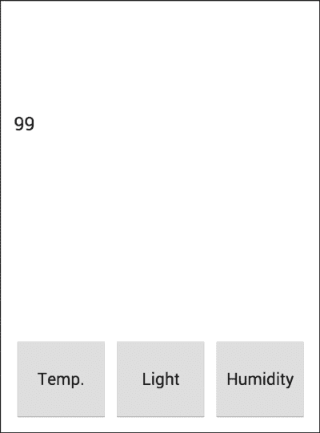

# 提升用户界面

当前用户界面需要进一步改进以使其更友好。人们很容易注意到传感器数据输出需要放大并居中，按钮肯定可以更吸引人。此外，我们想要确保我们的气象站应用在用户当前的应用列表中脱颖而出，因此我们的应用肯定将从图标的变化中受益。

我们将专注于以下主要任务：

+   创建并添加我们自己的 Android 应用图标

+   居中并放大数据输出文本

+   修改按钮并给我们的文本添加一些颜色

## 创建并添加我们自己的应用图标

我们增强用户体验的第一步之一就是拥有我们自己的图标。

首先，我们将开始下载图像资产。这个资产可以在[`bit.ly/chapter3-iclauncher`](http://bit.ly/chapter3-iclauncher)公开获取。

您应使用项目树进行导航，然后在`app`上右键单击，如下截图所示：

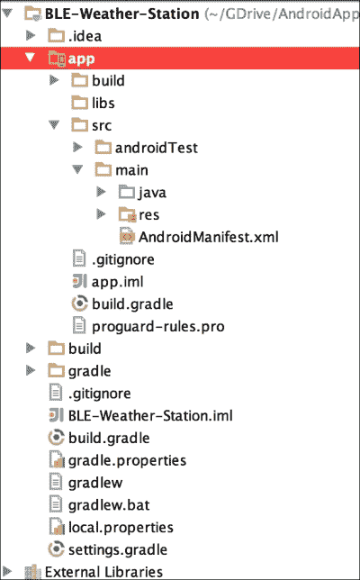

在您右键单击`app`后，通过转到**新建** > **图像资产**来创建一个新的图像资产，如下截图所示：

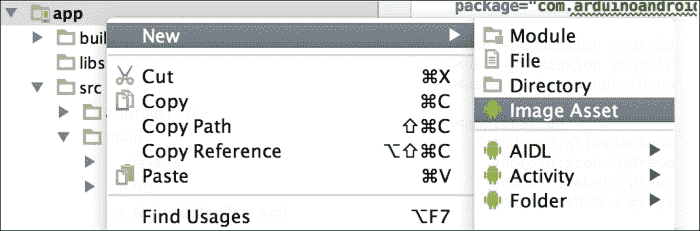

您将看到一个**资产工作室**弹出窗口，它允许您选择您自己的图像文件。出于优化目的，我们建议选择分辨率为 144 像素×144 像素的`.png`文件。Android Studio 会自动进行所有调整大小和资源创建，以适应不同的屏幕，如下截图所示：

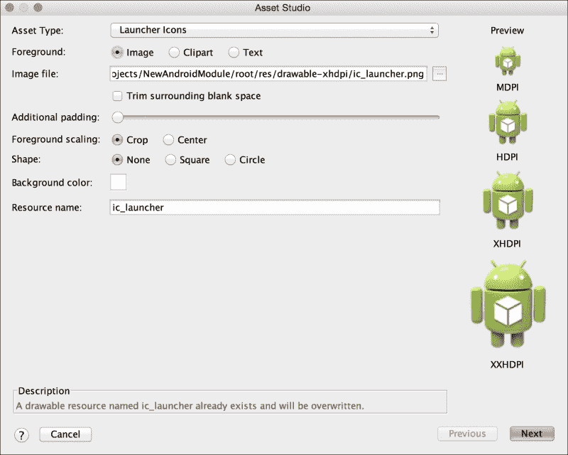

一旦您选择了我们提供的`ic_launcher`图像文件，您将看到一个显示图标在不同尺寸的屏幕。点击**下一步**，您将看到以下屏幕：

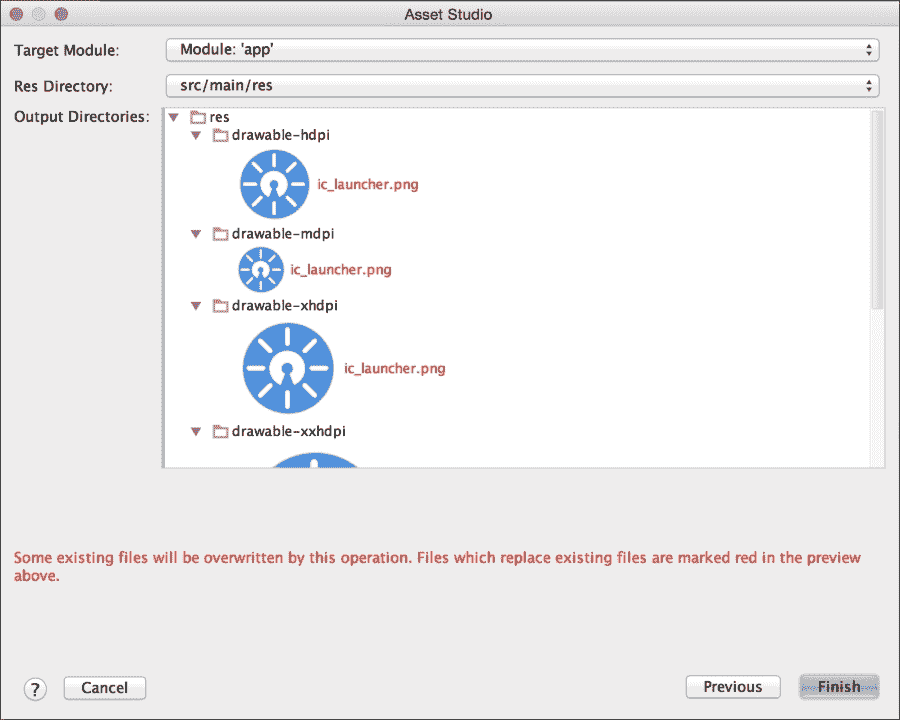

前一个屏幕警告您之前的文件将被覆盖，并再次向您展示不同分辨率的图像启动器文件。点击**完成**，然后编译应用，在您的物理设备上启动它，您应该在应用托盘和应用的操作栏中看到如下所示的东西：

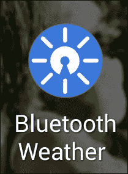

这是应用的操作栏将看起来像：

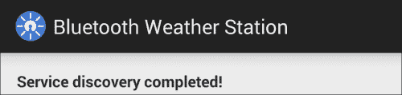

## 居中并放大数据输出文本

为了编辑显示传感器数据的主文本布局，我们需要打开项目树并导航到布局文件，该文件位于`app` > `src` > `main` > `res` > `layout` > `activity_main_screen.xml`。

一旦进入这种视图，我们建议您使用文本视图修改文本。这将使您获得更精细的控制，并且也会让您习惯于在编程编辑 Android 布局文件时使用的不同约定。

当打开`activity_main_screen.xml`文件时，我们将看到按钮和文本视图的不同 XML 代码。在此阶段，请注意负责`Sensor Data Output` TextView 的代码，并添加以下代码：

```java
android:textSize="200dp"
    android:gravity="center"
```

负责显示`Sensor Data Output` TextView 的整个代码块现在如下所示：

```java
<TextView
         android:layout_width="match_parent"
         android:layout_height="wrap_content"             
android:textAppearance="?android:attr/textAppearanceLarge"
            android:id="@+id/dataOutputTextView"
            android:layout_gravity="center_vertical"
            android:textSize="200dp"
            android:gravity="center"
            android:text="99" />
```

在此代码块中，我们暂时使用了占位文本`99`，以便我们可以近似地看到它使用 Android 布局设计器时的样子。通过这次修改，传感器数据输出现在足够大，用户可以看得到，从而提升了用户体验。

## 修改按钮并添加一些颜色到我们的文本

最后，我们将通过以下步骤修改我们的按钮并为文本添加一些颜色：

1.  我们将遵循以下两个步骤来创建新的按钮：

    1.  创建一个名为`buttonshape.xml`的新 XML 可绘制文件，并将其放入一个名为`drawable`的文件夹中。

    1.  我们将接着将可绘制资源文件连接到主 Android 布局文件。

1.  通过在`res`文件夹上右键单击，创建`drawable`文件夹，该文件夹可通过导航到`App` > `src` > `main` > `res`找到。

1.  在`res`文件夹内创建`drawable`文件夹后，我们需要再次右键单击新的`drawable`文件夹，点击**新建**并选择**可绘制资源文件**，如图所示：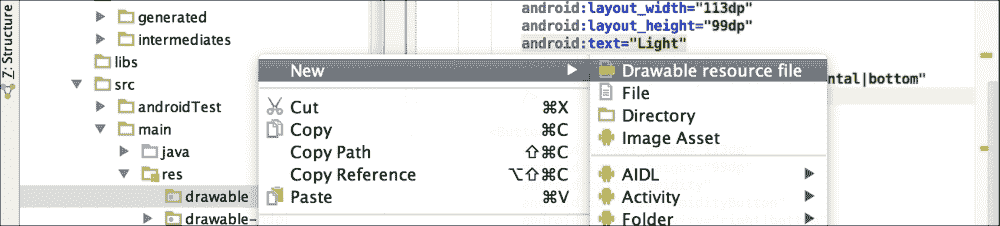

1.  将文件命名为`buttonshape`，输入`shape`作为**根元素**，然后点击**确定**，如图所示：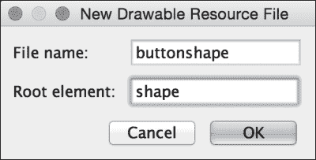

1.  在`buttonshape.xml`文件中，我们将添加以下代码：

    ```java
    <?xml version="1.0" encoding="utf-8"?>

    <shape >
        android:shape="rectangle" >
        <corners
            android:radius="10dp"
            />
        <solid
            android:color="#FFFFFF"
            />
        <padding
            android:left="0dp"
            android:top="0dp"
            android:right="0dp"
            android:bottom="0dp"
            />
        <size
            android:width="85dp"
            android:height="99dp"
            />
        <stroke
            android:width="2dp"
            android:color="#4A90E2"
            />
    </shape>
    ```

1.  然后，我们转向`activity_main_screen.xml`文件，并在按钮模块中包含以下代码来引用这个可绘制资源：

    ```java
    android:background="@drawable/buttonshape"
    ```

1.  我们还将在`activity_main_screen.xml`文件中的按钮和 TextView 模块中添加以下代码行，以增加一些趣味性：

    ```java
    android:textColor="#4A90E2"
    ```

在前面的代码中，`#4A90E2`指的是应用图标中使用的主体颜色的十六进制代码，以便我们保持与主要用户界面的某种一致性。

最终布局在 Nexus 5 智能手机上看起来如下所示：

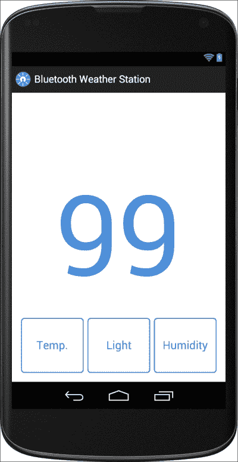

需要注意的是，不同的 Android 设备有不同的尺寸。因此，对于您的特定 Android 设备，您可能需要在 Android 布局文件中进行进一步的优化，以改善界面。

## 如何进一步操作

在 Android 应用程序中，针对改进用户界面流程可以做出大量的改进。目前，服务发现仅通过物理旋转设备来刷新，因为设备旋转时会调用 `onResume()` 方法。这可以通过在操作栏中添加一个刷新图标并将其连接到代码来轻松改进，这样当图标被点击时就会调用此方法。

此外，进一步的用户界面定制可以使应用程序个性化，以便符合您的喜好；关于这个应用程序，您可以通过查看以下来自 Android 开发者网站的链接来了解可能性：

+   Button 小部件文档在 [`developer.android.com/reference/android/widget/Button.html`](http://developer.android.com/reference/android/widget/Button.html)

+   TextView 文档在 [`developer.android.com/reference/android/widget/TextView.html`](http://developer.android.com/reference/android/widget/TextView.html)

您甚至可以通过实时监控、统计和趋势进一步扩展应用程序。

# 摘要

在本章中，我们使用 Arduino 和 Android 构建了一个简单的气象站。我们将多个传感器连接到我们的 Arduino 板上，以及一个低功耗蓝牙模块。我们还构建了相应的 Android 应用程序，这样我们只需点击手机的按钮即可访问 Arduino 板上测量的所有数据。

在下一章中，我们将使用不同的技术通过 Android 与 Arduino 板进行交互：Wi-Fi。我们将构建一个智能电源开关，用于远程控制电器，并通过 Wi-Fi 测量电器的功耗。
