# 第四章：Wi-Fi 智能电源插座

在本章中，我们将构建一个非常常见连接对象的开源版本——Wi-Fi 电源插座。实际上，这种插座可以从许多商店购买，通常附带其自己的 iOS 或 Android 应用程序。

在本章中，我们将从头开始构建这样一个电源插座，基于 Arduino。我们将连接一个继电器模块、一个电流传感器和一个 Wi-Fi 模块到 Arduino 板上，以制作我们自己的 Wi-Fi 电源插座。这个电源插座能够开关任何设备，并且会持续测量设备的功耗。

我们将构建一个 Android 应用程序，通过 Wi-Fi 远程开关电源插座。我们还将能够根据请求获取功率输出并在屏幕上显示。

以下将是本章的主要收获：

+   将继电器模块、电流传感器和 Wi-Fi 模块连接到 Arduino

+   通过 Wi-Fi 发送命令控制项目

+   构建一个 Android 应用程序以从手机或平板电脑控制项目

# 硬件和软件要求

首先，让我们看看本章所需的硬件组件。

我们需要一个 Arduino Uno 板。为了远程控制灯具（在本章中，灯具被用作示例，但当然任何 110V 或 230V 的设备都可以在这里使用），你还需要一个继电器模块。我们使用了 Polulu 的 5V 继电器模块，但你也可以使用你想要的任何 5V 继电器模块。

为了测量连接到插座的设备的即时功耗，你还需要一个电流传感器。对于这部分，我们将选择基于 ACS712 芯片的扩展板。以下是我使用的板子的图片：

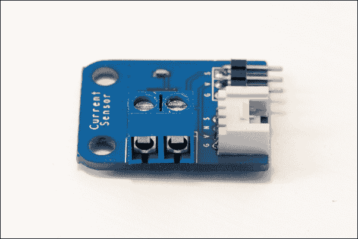

你还需要一个包含 CC3000 Wi-Fi 芯片的板子，我们将使用它通过 Android 设备接收命令。对于这个项目，我们将选择 Adafruit 的 CC3000 扩展板。当然，你也可以使用同一品牌的盾牌进行这个项目；代码将完全相同。

为了进行不同的连接，你还需要一个面包板和一些跳线。

以下是在这个项目中使用的组件列表：

+   Arduino Uno 板 ([`www.adafruit.com/products/50`](https://www.adafruit.com/products/50))

+   5V 继电器模块 ([`www.pololu.com/product/2480`](http://www.pololu.com/product/2480))

+   电流传感器 ([`imall.iteadstudio.com/im120710011.html`](http://imall.iteadstudio.com/im120710011.html))

+   Adafruit CC3000 Wi-Fi 扩展板 ([`www.adafruit.com/product/1469`](https://www.adafruit.com/product/1469))

+   面包板 ([`www.adafruit.com/products/64`](https://www.adafruit.com/products/64))

+   跳线 ([`www.adafruit.com/products/1957`](https://www.adafruit.com/products/1957))

要将灯或任何其他设备连接到项目，您需要一对电源线：一个公电源插头和一个母电源插头。您还需要一些螺丝端子来制作所需的连接。以下是我为这个项目使用的电缆的图片：

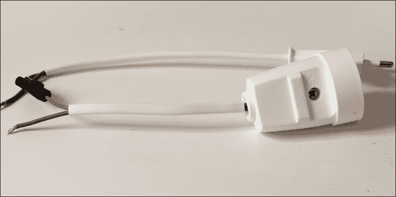

### 注意

**警告**：

在这样的项目中使用高电压设备可能会有危险。因此，请确保仔细遵循下一节中的所有说明。当然，您可以在不将项目连接到主电源的情况下制作整个项目；原理完全相同。

在软件方面，您需要最新的 Arduino IDE 版本。您需要位于[`github.com/adafruit/Adafruit_CC3000_Library`](https://github.com/adafruit/Adafruit_CC3000_Library)的 CC3000 芯片库。

您还需要位于[`github.com/marcoschwartz/aREST`](https://github.com/marcoschwartz/aREST)的 aREST 库。

要安装 Arduino 库，只需将`library`文件夹放入您主`Ard` `uino`文件夹内的`/libraries`文件夹中。

## 配置硬件

现在是组装项目硬件部分的时候了。让我们从连接 Adafruit CC3000 扩展板开始。首先，将 Arduino Uno 的+5V 引脚连接到面包板上的红色电源轨，将地线引脚连接到蓝色电源轨。

然后，将 CC3000 板的 IRQ 引脚连接到 Arduino 板的**3**号引脚，**VBAT**连接到**5**号引脚，**CS**连接到**10**号引脚。之后，您需要将**SPI**引脚连接到 Arduino 板：**MOSI**、**MISO**和**CLK**分别连接到**11**、**12**和**13**号引脚。最后，注意电源供应：**VIN**连接到 Arduino 的 5V（红色电源轨），**GND**连接到**GND**（蓝色电源轨）。

以下是该项目的示意图，未连接继电器模块：

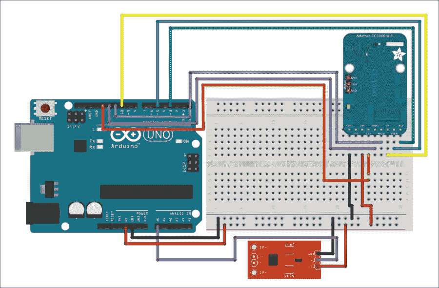

现在，我们将连接继电器模块。首先，连接电源：继电器的**VCC**引脚连接到红色电源轨，**GND**引脚连接到蓝色电源轨。然后，将继电器的信号引脚（通常标记为 SIG）连接到 Arduino 的**8**号引脚，然后是电流传感器。像继电器一样，首先连接电源：继电器的**VCC**引脚连接到红色电源轨，**GND**引脚连接到蓝色电源轨。然后，将传感器的信号引脚（通常标记为 SIG 或 OUT）连接到 Arduino 的模拟引脚**A0**。

现在，我们将负责将项目连接到您想要控制的设备以及主电源。

### 注意

在这一步要非常小心，因为它涉及到高电压（110V 或 230V），可能致命。同时，确保在检查其他所有内容时，始终将项目连接到主电源。当所有其他连接完成时，确保您没有触摸任何裸露的电线。还建议您将整个项目放入塑料外壳中。

以下电路图描述了不同电缆如何连接到继电器和电流传感器：

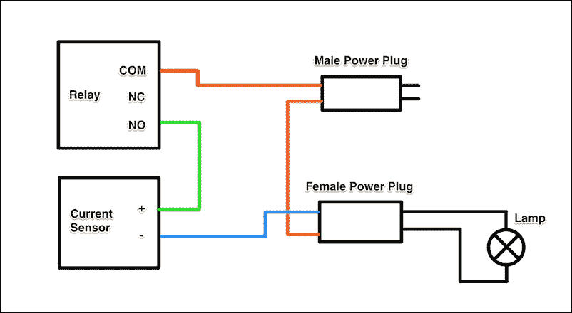

注意，因为我们使用的是交流电压，所以电缆的极性在这里并不重要。

以下是一张说明电缆、继电器和电流传感器之间不同连接的图片：

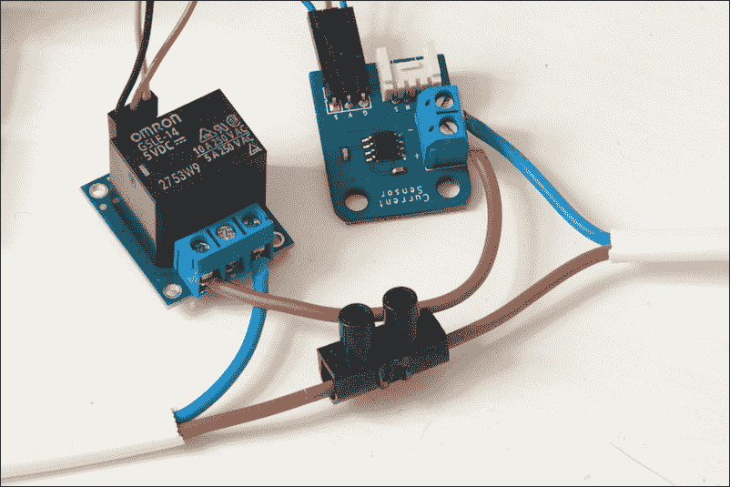

最后，以下是一个完整项目的图片，其中公电缆连接到主电源，灯泡连接到母插座：

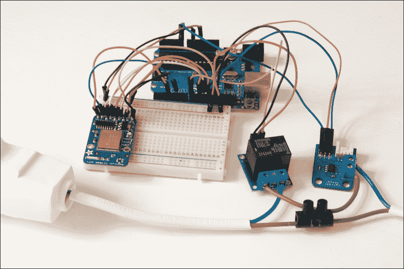

## 测试继电器

我们将通过测试继电器并开关它来测试项目。这将确保继电器正确连接到您的 Arduino 板，并且电源电缆连接正确（否则，不会有电流流经连接的设备）。再次检查在将项目插入主电源之前每个连接是否正确。

以下是该部分的完整 Arduino 草图：

```java
// Relay pin
const int relay_pin = 8;

void setup() {
  pinMode(relay_pin,OUTPUT);
}

void loop() {

  // Activate relay
  digitalWrite(relay_pin, HIGH);

  // Wait for 5 seconds
  delay(5000);

   // Deactivate relay
  digitalWrite(relay_pin, LOW);

  // Wait for 5 seconds
  delay(5000);
}
```

我们现在将考虑这个草图的细节。它首先声明继电器连接到的引脚：

```java
const int relay_pin = 8;
```

然后，在草图的`setup()`函数中，我们将此引脚声明为输出：

```java
pinMode(relay_pin,OUTPUT);
```

最后，在草图的`loop()`函数中，我们将每 5 秒切换引脚从开启状态到关闭状态：

```java
// Activate relay
digitalWrite(relay_pin, HIGH);

// Wait for 5 seconds
delay(5000);
```

注意，您可以在本书的 GitHub 仓库中找到该部分的完整代码：[`github.com/marcoschwartz/arduino-android-blueprints`](https://github.com/marcoschwartz/arduino-android-blueprints)。

确保一切连接正确，您有一个设备（如灯泡）连接到我们的项目，并且项目已插入主电源。再次检查在将项目插入主电源之前每个连接是否正确。现在，您可以上传草图到您的 Arduino 板。您应该听到继电器开关的声音，并看到灯泡开关的动作。

# 编写 Arduino 草图

现在我们确信继电器、电流传感器和电源电缆的连接是正确的，我们将编写一个 Arduino 草图来接受来自 Android 设备的 Wi-Fi 连接。

以下是该部分的完整草图：

```java
// Import required libraries
#include <Adafruit_CC3000.h>
#include <SPI.h>
#include <aREST.h>

// Relay state
const int relay_pin = 8;

// Define measurement variables
float amplitude_current;
float effective_value;
float effective_voltage = 230.; // Set voltage to 230V (Europe) or 110V (US)
float zero_sensor;

// These are the pins for the CC3000 chip if you are using a breakout board
#define ADAFRUIT_CC3000_IRQ   3
#define ADAFRUIT_CC3000_VBAT  5
#define ADAFRUIT_CC3000_CS    10

// Create CC3000 instance
Adafruit_CC3000 cc3000 = Adafruit_CC3000(ADAFRUIT_CC3000_CS, ADAFRUIT_CC3000_IRQ, ADAFRUIT_CC3000_VBAT,
                                         SPI_CLOCK_DIV2);
// Create aREST instance
aREST rest = aREST();

// Your WiFi SSID and password                                         
#define WLAN_SSID       "yourWiFiNetworkName"
#define WLAN_PASS       "yourPassword"
#define WLAN_SECURITY   WLAN_SEC_WPA2

// The port to listen for incoming TCP connections
#define LISTEN_PORT           80

// Server instance
Adafruit_CC3000_Server restServer(LISTEN_PORT);

// Variables to be exposed to the API
int power;

void setup(void)
{  
  // Start Serial
  Serial.begin(115200);

  // Init variables and expose them to REST API
  rest.variable("power",&power);

  // Set relay pin to output
  pinMode(relay_pin,OUTPUT);

  // Calibrate sensor with null current
  zero_sensor = getSensorValue(A0);

  // Give name and ID to device
  rest.set_id("001");
  rest.set_name("smart_lamp");

  // Set up CC3000 and get connected to the wireless network.
  if (!cc3000.begin())
  {
    while(1);
  }

  if (!cc3000.connectToAP(WLAN_SSID, WLAN_PASS, WLAN_SECURITY)) {
    while(1);
  }
  while (!cc3000.checkDHCP())
  {
    delay(100);
  }

  // Display connection details
  displayConnectionDetails();

  // Start server
  restServer.begin();
  Serial.println(F("Listening for connections..."));
}

void loop() {

  // Perform power measurement
  float sensor_value = getSensorValue(A0);

  // Convert to current
  amplitude_current = (float)(sensor_value-zero_sensor)/1024*5/185*1000000;
  effective_value = amplitude_current/1.414;
  power = (int)(abs(effective_value*effective_voltage/1000));

  // Handle REST calls
  Adafruit_CC3000_ClientRef client = restServer.available();
  rest.handle(client);

}

// Function to display connection details
bool displayConnectionDetails(void)
{
  uint32_t ipAddress, netmask, gateway, dhcpserv, dnsserv;

  if(!cc3000.getIPAddress(&ipAddress, &netmask, &gateway, &dhcpserv, &dnsserv))
  {
    Serial.println(F("Unable to retrieve the IP Address!\r\n"));
    return false;
  }
  else
  {
    Serial.print(F("\nIP Addr: ")); cc3000.printIPdotsRev(ipAddress);
    Serial.print(F("\nNetmask: ")); cc3000.printIPdotsRev(netmask);
    Serial.print(F("\nGateway: ")); cc3000.printIPdotsRev(gateway);
    Serial.print(F("\nDHCPsrv: ")); cc3000.printIPdotsRev(dhcpserv);
    Serial.print(F("\nDNSserv: ")); cc3000.printIPdotsRev(dnsserv);
    Serial.println();
    return true;
  }
}

// Get the reading from the current sensor
float getSensorValue(uint8_t pin)
{
  uint16_t sensorValue;
  float avgSensor = 0;
  uint8_t nb_measurements = 100;
  for (uint8_t i = 0; i < nb_measurements; i++) {
    sensorValue = analogRead(pin);
    avgSensor = avgSensor + float(sensorValue);
  }    
  avgSensor = avgSensor/float(nb_measurements);
  return avgSensor;
}
```

现在，让我们更详细地看看 Arduino 草图。它首先导入该项目所需的库：

```java
#include <Adafruit_CC3000.h>
#include <SPI.h>
#include <CC3000_MDNS.h>
#include <aREST.h>
```

我们还必须定义继电器模块连接到的引脚：

```java
const int relay_pin = 8;
```

然后，我们必须声明一些变量，这些变量将帮助我们测量和计算设备的功耗：

```java
float amplitude_current;
float effective_value;
float effective_voltage = 230.; // Set voltage to 230V (Europe) or 110V (US)
float zero_sensor;
```

在这一点上，您还应该更改有效电压的值，使其与您所在国家的电压相匹配。

然后，我们必须定义 CC3000 Wi-Fi 芯片连接到的引脚：

```java
#define ADAFRUIT_CC3000_IRQ   3
#define ADAFRUIT_CC3000_VBAT  5
#define ADAFRUIT_CC3000_CS    10
```

我们现在可以创建 CC3000 Wi-Fi 芯片的一个实例：

```java
Adafruit_CC3000 cc3000 = Adafruit_CC3000(ADAFRUIT_CC3000_CS, ADAFRUIT_CC3000_IRQ, ADAFRUIT_CC3000_VBAT,
                                         SPI_CLOCK_DIV2);
```

我们还需要创建 aREST 库的一个实例：

```java
aREST rest = aREST();
```

您现在需要修改代码以添加您的 Wi-Fi 网络凭据：

```java
#define WLAN_SSID       "yourWiFiNetworkName"
#define WLAN_PASS       "yourPassword"
#define WLAN_SECURITY   WLAN_SEC_WPA2
```

我们还将定义我们想要通过 Wi-Fi 芯片监听的端口：

```java
#define LISTEN_PORT           80
```

之后，我们将声明一个在该端口上监听的服务器：

```java
Adafruit_CC3000_Server restServer(LISTEN_PORT);
```

最后，我们声明一个变量，它将包含设备的功耗，可以通过 HTTP 请求从外部访问（在同一本地 Wi-Fi 网络内）：

```java
int power;
```

在草图的`setup()`函数中，我们将启动串行连接：

```java
Serial.begin(115200);
```

我们还将将功耗变量暴露给 aREST API：

```java
rest.variable("power",&power);
```

我们还将声明继电器引脚为输出：

```java
pinMode(relay_pin,OUTPUT);
```

然后，我们需要首先从电流传感器进行测量，以获取当没有电流流经连接的设备时电流传感器返回的值。这是通过一个我们不会详细说明的函数完成的：

```java
zero_sensor = getSensorValue(A0);
```

我们还将为我们的项目分配一个 ID 和名称：

```java
rest.set_id("001");
rest.set_name("smart_lamp");
```

然后，我们将调用一个函数来显示 Wi-Fi 连接的详细信息，例如 CC3000 芯片的 IP 地址：

```java
displayConnectionDetails();
```

为了结束`setup()`函数，我们将启动我们的 Wi-Fi 服务器：

```java
restServer.begin();
Serial.println(F("Listening for connections..."));
```

现在，在草图的`loop()`函数中，我们将从连接在模拟引脚 A0 上的传感器读取数据：

```java
float sensor_value = getSensorValue(A0);
```

一旦我们得到这个值，我们就可以从它计算出电流以及设备的功耗：

```java
amplitude_current = (float)(sensor_value-zero_sensor)/1024*5/185*1000000;
effective_value = amplitude_current/1.414;
power = (int)(abs(effective_value*effective_voltage/1000));
```

基本上，电流传感器的制造商给出了第一个公式。然后，我们通过将幅值电流除以根号 2 来获取有效电流，大约是 1.414。最后，我们通过将有效电流与有效电压相乘（并除以 1,000 以得到瓦特为单位的结果）来获取有效功率。一旦完成测量，我们使用 aREST 库处理传入的请求：

```java
Adafruit_CC3000_ClientRef client = restServer.available();
rest.handle(client);
```

注意，您可以在本书的 GitHub 仓库中找到这部分完整的代码：[`github.com/marcoschwartz/arduino-android-blueprints`](https://github.com/marcoschwartz/arduino-android-blueprints)。

不要忘记将草图修改为包含您自己的 Wi-Fi 网络名称和 Wi-Fi 网络密码。现在，您可以将代码上传到您的 Arduino 板，并打开串行监视器。以下是在一段时间后您应该看到的结果（当然，您的板子的 IP 地址和其他参数可能不同）：

```java
IP Addr: 192.168.1.130
Netmask: 255.255.255.0
Gateway: 192.168.1.1
DHCPsrv: 0.0.0.0
DNSserv: 192.168.1.1
Listening for connections...
```

记下在您的串行监视器中出现的 IP 地址——您现在需要它，并且在稍后编写 Android 应用程序时也需要。现在，我们将通过向项目发送一些命令来测试 Wi-Fi 连接。您可以使用您喜欢的网页浏览器并输入以下内容：

```java
192.168.1.130/digital/8/1
```

当然，您需要将 IP 地址更改为您自己的板子 IP 地址，正如它在串行监视器中显示的那样。您应该看到继电器立即打开，并且您应该看到以下消息：

```java
{"message": "Pin D8 set to 1", "id": "001", "name": "smart_lamp", "connected": true}
```

您现在可以再次使用以下命令将其关闭：

```java
192.168.1.130/digital/8/0
```

现在，我们将尝试读取设备的功耗。您可以通过输入以下内容来完成：

```java
192.168.1.130/power
```

您应该看到以下回答：

```java
{"power": 0, "id": "001", "name": "smart_lamp", "connected": true}
```

如果您能看到这个，那么这意味着传感器已正确校准（因为功率为 0），并且功率变量已正确暴露给 aREST API。

## 我们的 Android 应用程序的线框图

在开始编写任何代码之前，我们对应用程序进行严格的线框设计将帮助我们提供更好的用户体验。以下是我们希望在实现最终代码时遵循的纸面原型：

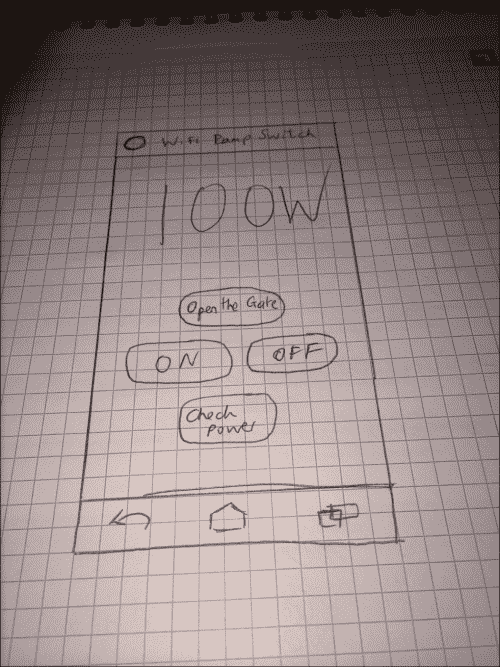

我们将在 Android Studio 中创建一个名为`Arduino Wifi`的新项目，最小 SDK 为 15，最大 SDK 为 19（在撰写本文时，这是 Android SDK 的最稳定版本）。这将使我们能够满足市场上超过 80%的 Android 设备。一个带有空白活动的项目就足以开始这个项目。

一旦您设置了项目，我们将继续处理 Android 布局文件，这些文件可以通过导航到`app` > `src` > `res` > `layout` > `activity_main_screen.xml`找到。

我们将首先应用一个相对布局，并在该布局中拖放四个按钮以及一个 TextView，其外观大致如下（在此阶段，无需关注布局的美观质量）：

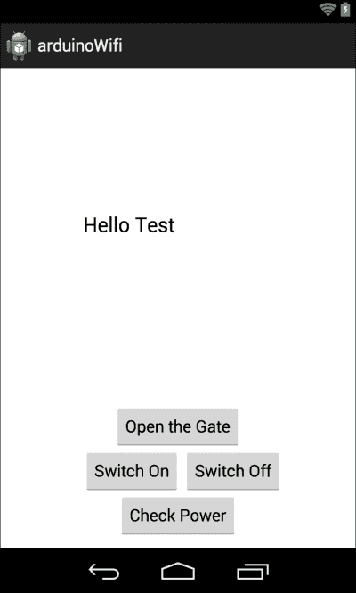

我们还将按照以下方式识别每个用户界面项：

+   **打开门**按钮：`openGateButton`

+   **开启**按钮：`switchOnButton`

+   **关闭**按钮：`switchOffButton`

+   **检查功率**按钮：`checkPowerButton`

+   **功率输出**文本视图：`powerOutput`

## 将布局实现到代码中

我们将首先声明一个`String TAG`对象，该对象引用`MainActivity`，并将用于日志记录：

```java
public static final String TAG = MainScreen.class.getSimpleName();
```

然后，我们将声明所有视图变量，并在`onCreate`方法中将它们分配给`layout`元素，这意味着`onCreate`方法将如下所示：

```java
@Override
    protected void onCreate(Bundle savedInstanceState) {
        super.onCreate(savedInstanceState);
        setContentView(R.layout.activity_main_screen);

        //Declare our View Variables and assign them to the layout elements
        Button checkPowerButton = (Button) findViewById(R.id.checkPowerButton);
        Button openTheGateButton = (Button) findViewById(R.id.openGateButton);
        Button switchOnButton = (Button) findViewById(R.id.switchOnButton);
        Button switchOffButton = (Button) findViewById(R.id.switchOffButton);

        checkPowerButton.setOnClickListener(new View.OnClickListener() {
            @Override
            public void onClick(View v) {
                if (isNetworkAvailable()) {
                    checkPowerTask getPowerTask = new checkPowerTask();
                    getPowerTask.execute();
                }
            }
        });

        openTheGateButton.setOnClickListener(new View.OnClickListener() {
            @Override
            public void onClick(View v) {
                if (isNetworkAvailable()) {
                    SwitchOpenTask switchOpenTask = new SwitchOpenTask();
                    switchOpenTask.execute();
                }
            }
        });

        switchOnButton.setOnClickListener(new View.OnClickListener() {
            @Override
            public void onClick(View v) {
                if (isNetworkAvailable()) {
                    SwitchOnTask switchOnTask = new SwitchOnTask();
                    switchOnTask.execute();
                }
            }
        });

        switchOffButton.setOnClickListener(new View.OnClickListener() {
            @Override
            public void onClick(View v) {
                if (isNetworkAvailable()) {
                    SwitchOffTask switchOffTask = new SwitchOffTask();
                    switchOffTask.execute();
                }
            }
        });

    }
```

如前述代码所示，我们引用了多个 ASync 任务，我们将与我们将使用的 JSON 解析器一起引用，该解析器将用于解析从 Arduino 获取的数据并将其适配到功率输出文本视图。

ASync 任务将帮助我们分别从主用户界面线程运行应用程序任务，从而显著提高用户界面的响应性，从而增强用户体验。

使用以下代码，您需要将`yourip`部分替换为您自己的 IP 地址，该地址您可以在 Arduino IDE 串行监视器中找到。您可以在`Main Activity`声明中声明 IP 地址，如下所示：

```java
public static final String URL = "yourip";
```

然后，我们将声明以下`AsyncTasks`对象，以启用我们想要实现的不同操作：

```java
private class SwitchOpenTask extends AsyncTask<Object,Void,String> {

        @Override
        protected String doInBackground(Object... arg0) {

            int responseCode = -1;

            try {
                URL restApiUrl = new URL("http:// " + URL + "mode/8/o");
                HttpURLConnection connection = (HttpURLConnection) restApiUrl.openConnection();
                connection.connect();

                responseCode = connection.getResponseCode();
                Log.i(TAG, "Code" + responseCode);
            }
            catch(MalformedURLException e) {
                Log.e(TAG, "Malformed Exception Caught:", e);
            }
            catch(IOException e) {
                Log.e(TAG, "IO Exception Caught:", e);
                e.printStackTrace();
            }
            catch(Exception e){
                Log.e(TAG, "Generic Exception Caught:", e);
            }

            return "Code: " + responseCode;

        }

    }

    private class SwitchOnTask extends AsyncTask<Object,Void,String> {

        @Override
        protected String doInBackground(Object... arg0) {

            int responseCode = -1;

            try {
                URL restApiUrl = new URL("http://" + URL + "/digital/8/1");
                HttpURLConnection connection = (HttpURLConnection) restApiUrl.openConnection();
                connection.connect();

                responseCode = connection.getResponseCode();
                Log.i(TAG, "Code" + responseCode);
            }
            catch(MalformedURLException e) {
                Log.e(TAG, "Malformed Exception Caught:", e);
            }
            catch(IOException e) {
                Log.e(TAG, "IO Exception Caught:", e);
                e.printStackTrace();
            }
            catch(Exception e){
                Log.e(TAG, "Generic Exception Caught:", e);
            }

            return "Code: " + responseCode;

        }

    }

    private class SwitchOffTask extends AsyncTask<Object,Void,String> {

        @Override
        protected String doInBackground(Object... arg0) {

            int responseCode = -1;

            try {
                URL restApiUrl = new URL("http://" + URL + "/digital/8/0");
                HttpURLConnection connection = (HttpURLConnection) restApiUrl.openConnection();
                connection.connect();

                responseCode = connection.getResponseCode();
                Log.i(TAG, "Code" + responseCode);
            }
            catch(MalformedURLException e) {
                Log.e(TAG, "Malformed Exception Caught:", e);
            }
            catch(IOException e) {
                Log.e(TAG, "IO Exception Caught:", e);
                e.printStackTrace();
            }
            catch(Exception e){
                Log.e(TAG, "Generic Exception Caught:", e);
            }

            return "Code: " + responseCode;

        }

    }

    private class checkPowerTask extends AsyncTask<Object,Void,String> {

        @Override
        protected String doInBackground(Object... arg0) {

            int responseCode = -1;
            String result = null;

            try {
                URL restApiUrl = new URL("http://" + URL + "/power");
                HttpURLConnection connection = (HttpURLConnection) restApiUrl.openConnection();
                connection.connect();
                responseCode = connection.getResponseCode();

                InputStream is = null;
                //http post request
                try{
                    String postQuery = "http://" + URL + "/power";
                    HttpClient httpclient = new DefaultHttpClient();
                    HttpPost httppost = new HttpPost(postQuery);
                    HttpResponse response = httpclient.execute(httppost);
                    HttpEntity entity = response.getEntity();
                    is = entity.getContent();
                }catch(Exception e){
                    Log.e("log_tag", "Error in http connection "+e.toString());
                }

                //convert response to string
                try{
                    BufferedReader reader = new BufferedReader(new InputStreamReader(is,"UTF-8"),8);
                    StringBuilder sb = new StringBuilder();
                    String line = null;

                    while ((line = reader.readLine()) != null) {
                        sb.append(line + "\n");
                    }

                    is.close();

                    result=sb.toString();
                    Log.v(TAG,result);

                } catch(Exception e){
                    Log.e("log_tag", "Error converting result "+e.toString());
                }

                //parse json data
                try {

                    JSONObject userObject = new JSONObject(result);
                    final String powerOutputText = userObject.getString("power");

                    activity.runOnUiThread(new Runnable() {
                        @Override
                        public void run() {
                            TextView powerOutput = (TextView) findViewById(R.id.powerOutput);
                            powerOutput.setText(powerOutputText + "W");

                        }
                    });

                } catch(JSONException e){
                    Log.e(TAG, "JSON Exception Caught:", e);
                }
            }
            catch(MalformedURLException e) {
                Log.e(TAG, "Malformed Exception Caught:", e);
            }
            catch(IOException e) {
                Log.e(TAG, "IO Exception Caught:", e);
                e.printStackTrace();
            }
            catch(Exception e){
                Log.e(TAG, "Generic Exception Caught:", e);
            }

            return "Code: " + responseCode;
        }

    }
```

我们将在底部添加另一个`helper`方法，以确保 Wi-Fi 网络连接可用：

```java
private boolean isNetworkAvailable() {
        ConnectivityManager manager = (ConnectivityManager) getSystemService(Context.CONNECTIVITY_SERVICE);
        NetworkInfo networkInfo = manager.getActiveNetworkInfo();

        boolean isAvailable = false;
        if (networkInfo != null && networkInfo.isConnected()) {
            isAvailable = true;
        }

        return isAvailable;

    }
```

在继续之前，我们需要将以下权限添加到我们的 Android `Manifest`文件中，该文件位于`app` > `src` > `main` > `AndroidManifest.xml`。

以下权限将允许我们访问 Android 设备的 Wi-Fi 网络功能：

```java
    <uses-permission android:name="android.permission.INTERNET"/>
    <uses-permission android:name="android.permission.ACCESS_NETWORK_STATE" />
    <uses-permission android:name="android.permission.ACCESS_WIFI_STATE" />
```

然后，您可以继续编译应用程序。还重要的是要注意，Wi-Fi 的延迟约为 300 毫秒，并且根据您的 Wi-Fi 网络，该值可能需要相当长的时间才能更新用户界面。

如果您在跟随过程中遇到困难，您也可以通过查看 GitHub 仓库[`github.com/marcoschwartz/arduino-android-blueprints`](https://github.com/marcoschwartz/arduino-android-blueprints)中的最终项目来参考。

## 磨练用户界面和体验

一旦我们成功完成代码并确保用户界面正在更新功率值，并且我们可以打开和关闭灯泡，我们就可以继续改进我们的用户界面。

我们将通过以下主要操作改进用户界面：

+   添加新的应用程序图标

+   放大功率输出文本

+   对齐和样式化按钮

+   在操作栏中更改应用程序名称

## 添加新的应用程序图标

首先，我们将开始下载图像资源。它可在 GitHub 仓库中找到，也可以在[`bit.ly/iclauncherchapter4`](http://bit.ly/iclauncherchapter4)作为公共下载。

您应使用项目树进行导航，然后右键单击`app`文件夹，如下截图所示：

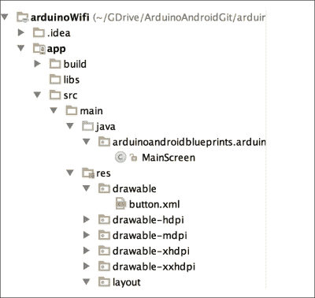

当您右键单击`app`时，通过导航到**新建** > **图像资源**创建一个新的图像资源，如下截图所示：

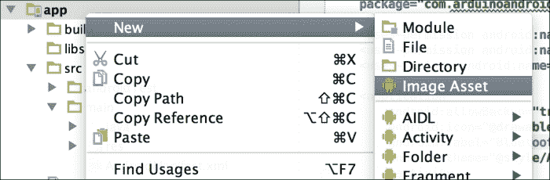

您将看到一个**资产工作室**弹出窗口，它允许您选择自己的图像文件，如下截图所示。出于优化目的，我们建议您选择分辨率为 144 像素×144 像素的`.png`文件。Android Studio 会自动进行所有调整大小和资源创建，以适应不同的屏幕：

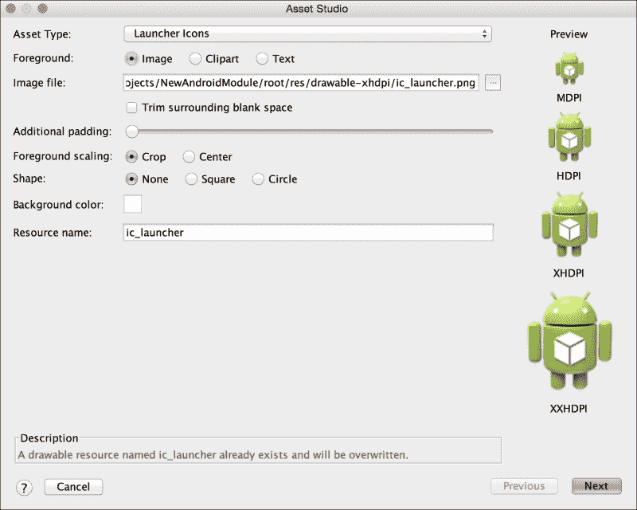

一旦您选择了我们提供的`ic_launcher`图像文件，您将看到一个显示不同尺寸图标的屏幕。点击**下一步**，您将看到以下屏幕：

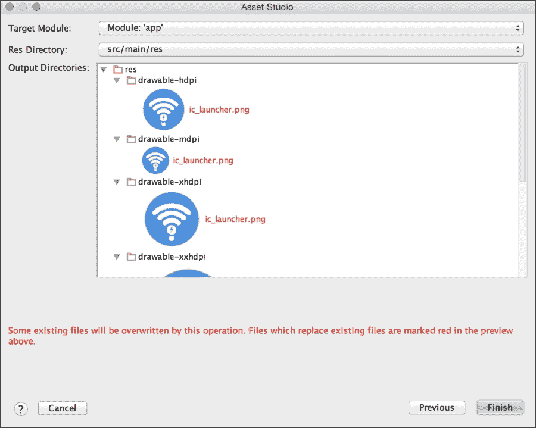

此屏幕警告您之前的文件将被覆盖，并再次以多种不同的分辨率向您展示图像启动器文件。点击**完成**，编译应用程序，在您的物理设备上启动它，您应该在应用程序托盘和应用程序的操作栏中看到一些令人愉快的东西，如下所示：


## 居中并放大数据输出文本

为了编辑显示传感器数据的文本输出的布局，我们需要打开项目树并导航到布局文件，该文件位于 `app` > `src` > `main` > `res` > `layout` > `activity_main_screen.xml`。

一旦进入此视图，我们建议您使用文本视图修改文本。这将允许您获得更精细的控制，并让您习惯于在程序化编辑 Android 布局文件时使用的不同约定。

当打开 `activity_main_screen.xml` 文件时，我们将看到按钮和文本视图的不同 XML 代码。在此阶段，注意负责 `Power Data Output` 文本视图的代码，并添加以下代码：

```java
android:textSize="100sp"
android:textAlignment="center"
```

负责的 `Sensor Data Output` 文本视图的整个代码块现在将如下所示：

```java
<TextView
        android:layout_width="wrap_content"
        android:layout_height="wrap_content"
        android:text="100W"
        android:textSize="100sp"
        android:id="@+id/powerOutput"
        android:textAlignment="center"
        android:layout_alignParentTop="true"
        android:layout_centerHorizontal="true"
        android:layout_marginTop="78dp"
        />
```

在此代码块中，我们暂时使用了占位文本 `100W`，以便我们可以近似地看到它使用 Android 布局设计器时的样子。通过此修改，传感器数据现在足够大，可以显示给用户，并将成为用户体验增强的一部分。

## 对按钮进行对齐和样式设置

在我们的最后几步中，我们将修改我们的按钮并为文本添加一些颜色。

创建新按钮时将有两个步骤：

1.  在 `res` 文件夹中创建一个名为 `button.xml` 的新 XML `drawable` 文件。

1.  然后，我们将连接 `drawable` 资源文件到主 Android 布局文件。

通过在 `app` > `src` > `main` > `res` 中的 `res` 文件夹上右键单击来创建 `drawable` 文件夹。

在 `res` 文件夹内创建 `drawable` 文件夹后，我们需要再次右键单击新的 `drawable` 文件夹，并导航到 **新建** > **Drawable 资源文件**。

将文件命名为 `button`，输入 `shape` 作为根元素，然后点击 **确定**。

在 `button.xml` 文件中，我们将添加以下代码：

```java
<?xml version="1.0" encoding="utf-8"?>
<shape >
    android:shape="rectangle" >
    <corners
        android:radius="30dp"/>
    <solid
        android:color="#FFFFFF"/>
    <padding
        android:left="0dp"
        android:top="0dp"
        android:right="0dp"
        android:bottom="0dp"/>
    <size
        android:width="120dp"
        android:height="60dp"/>
    <stroke
        android:width="2dp"
        android:color="#4A90E2"/>
</shape>
```

然后，我们转向 `activity_main_screen.xml` 文件，并在按钮模块中包含以下代码来引用此可绘制资源：

```java
android:background="@drawable/button"
```

我们将通过在 `activity_main_screen.xml` 文件中的 `Button` 和 `TextView` 模块中添加以下代码行来增加一些特色：

```java
android:textColor="#4A90E2"
```

`#4A90E2` 项指的是应用图标中使用的主体颜色的十六进制代码，这样我们就能保持与主用户界面的一致性。

## 在操作栏中更改应用程序名称

我们都希望将应用程序的名称自定义为我们喜欢的名称，这将是我们的项目中最容易的事情！我们只需转到 `strings.xml` 文件，其中包含我们项目中的所有常量文本值。它位于 `app` > `src` > `res` > `values` > `string.xml`。

然后，您可以将 `arduinoWifi` 的文本更改为您喜欢的任何名称。在这种情况下，我们将坚持使用 `WiFi Lamp Switch`：

```java
<string name="app_name">WiFi Lamp Switch</string>
```

我们的项目现在应该如下所示（在此情况下使用的设备是 Nexus 4）：

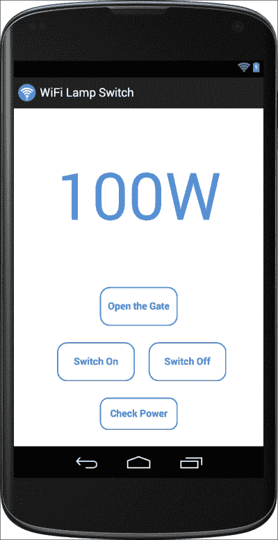

重要的是要注意，屏幕布局可能会根据不同的设备而有所不同。在这种情况下，你可能需要将你的 Android 布局文件适配到你的特定物理设备。

## 如何进一步发展

当涉及到进一步修改 Android 应用程序时，选项是无限的，并且有几种实现方式可以改进应用程序，例如实时监控，其中电力数据输出将自动刷新。此外，这些数据可以提供将生成数据存储在云中的用例，这些数据可以被分析，从而允许创建数据的图形解释。这种图形解释可以与一天中的时间相关联，并帮助用户了解何时发生最大的电力消耗。

从编码的角度来看，我们可以重构我们的代码，这意味着我们有效地简化并重用我们的代码。实际上，重构肯定可以通过 JSON 解析器实现，它可以被重构为其自己的类，而我们选择在当前设置中省略它，以便促进学习过程。

关于用户体验，可以引入一个新的`EditText`字段以及一个**提交**按钮，以便用户可以手动更改 IP 地址，当从 Arduino 串行监视器发现 IP 地址时将被调用。在此代码中，我们使用连接和 URL 构建器来形成正确的命令。

# 摘要

我们基于 Arduino 创建了一个智能电源开关的 DIY 版本，并通过 Wi-Fi 由 Android 应用程序控制。我们将所有必需的组件连接到 Arduino 板上，编写了一个 Arduino 草图以通过 Wi-Fi 接受命令，最后创建了一个 Android 应用程序以远程控制开关。

在下一章中，我们将使用另一个 Arduino 板，称为 Arduino Yún，我们将能够插入一个 USB 摄像头。由于这个板也将有 Wi-Fi，我们将使用这个项目来创建一个远程 Wi-Fi 安全摄像头。
